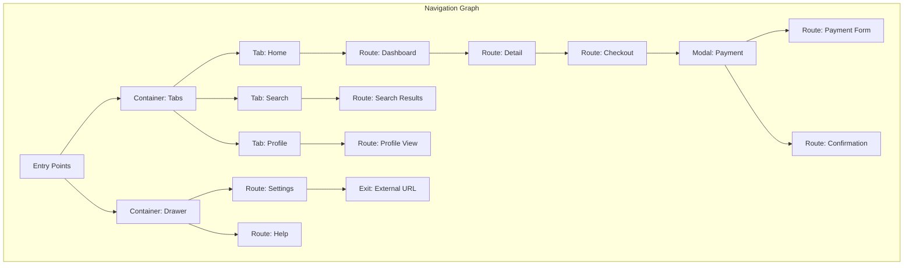
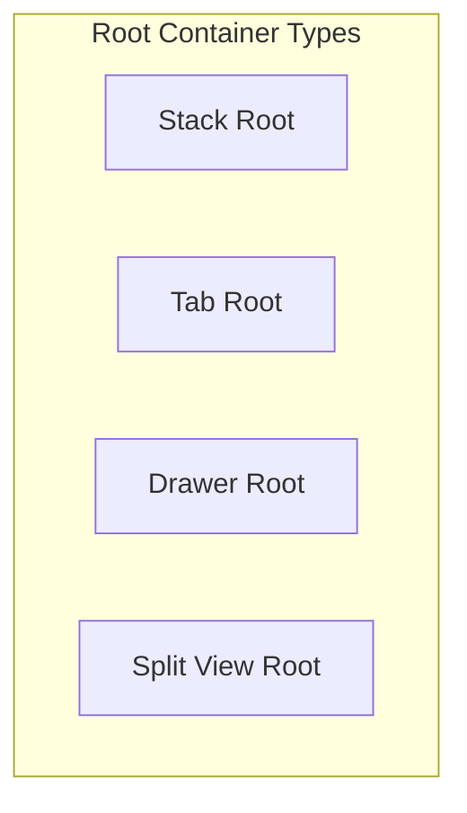
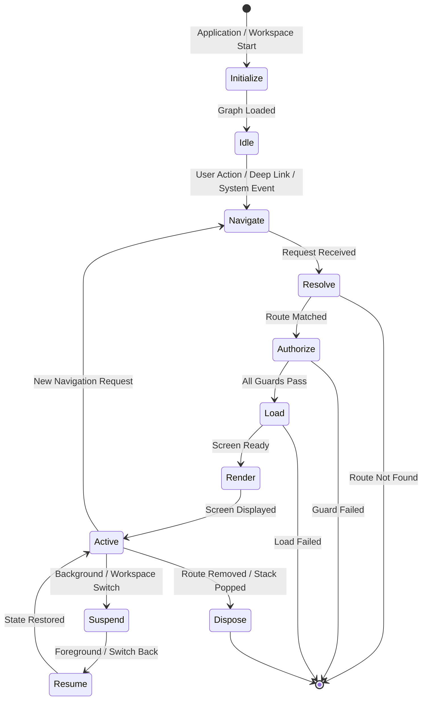
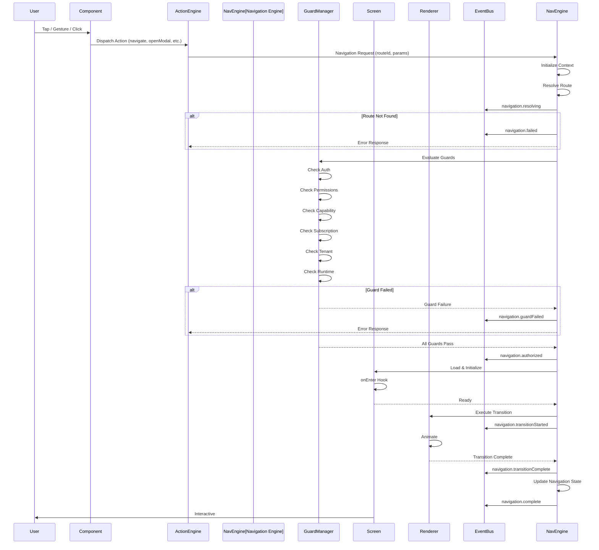
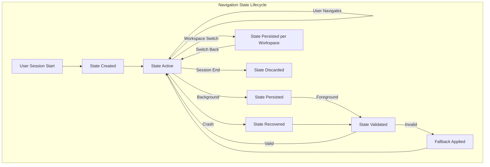
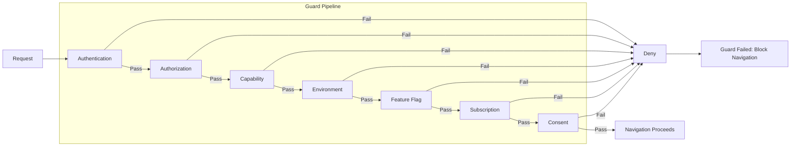
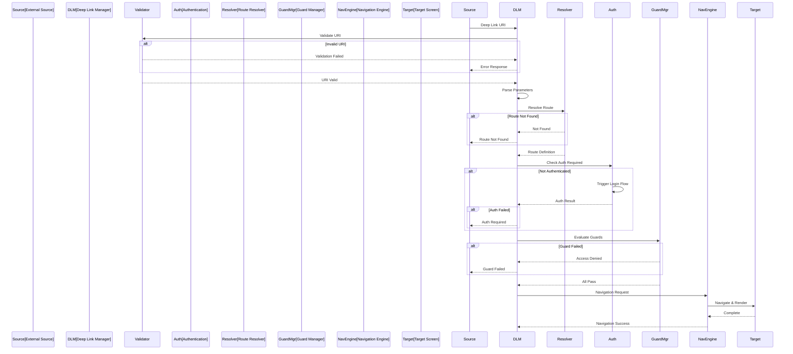
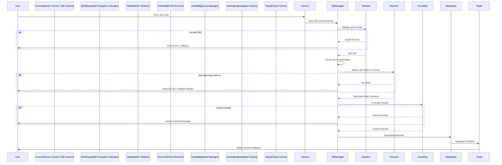
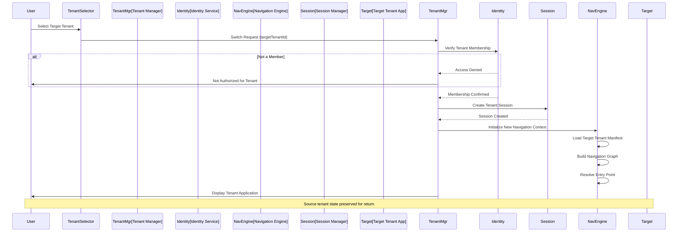
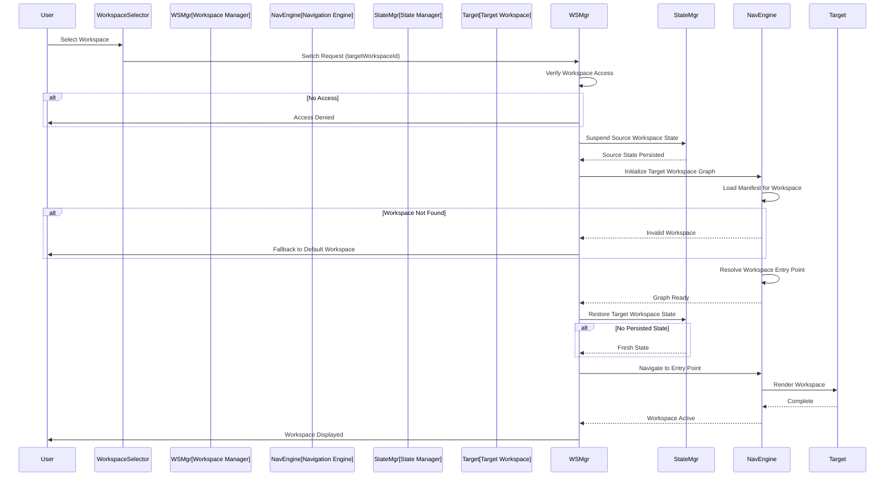

# Navigation Architecture

**KB-044 — Navigation Architecture Specification**

| Metadata | |
|----------|---|
| **KB ID** | KB-044 |
| **Title** | Navigation Architecture |
| **Version** | 0.1.0 |
| **Status** | Draft |
| **Owner** | Architecture Team |
| **Dependencies** | KB-041 Application Architecture Overview, KB-042 Application Manifest Specification, KB-043 Workspace & Tenant Model, KB-051 Runtime Architecture Overview |
| **Related Documents** | KB-016 Navigation Engine, KB-045 Screen Model, KB-046 Component Tree Model, KB-047 Action & Event Model, KB-049 Theme Model, KB-055 Runtime Navigation & Routing |
| **Review Status** | Pending |
| **Last Updated** | 2026-07-11 |

### Revision History

| Version | Date | Author | Change |
|---------|------|--------|--------|
| 0.1.0 | 2026-07-11 | AI Architecture Agent | Initial draft |

---

## 1. Executive Summary

### 1.1 Purpose

This document defines the canonical Navigation Architecture for the DUKADESK platform. It establishes the navigation model, hierarchy, lifecycle, state model, guard system, deep linking architecture, QR routing, workspace switching, and cross-tenant navigation rules that apply uniformly across every Runtime, Builder, and Preview environment.

Navigation is the structural backbone of every DUKADESK application. It determines what the user can see, how they move between screens, what conditions control access, and how the system recovers from failures. This document is the single source of truth for all navigation architecture decisions.

### 1.2 Scope

This document covers:

- The Navigation Graph and its structural elements (routes, flows, containers)
- Navigation hierarchy from Application through Layout
- Route definition schema and semantics
- Navigation container types and composition rules
- The navigation lifecycle from request to render completion
- Navigation state model, serialization, and restoration
- Guard architecture and evaluation pipeline
- Deep linking architecture including universal links, QR, notifications, and external links
- QR navigation routing architecture
- Cross-tenant navigation rules and isolation boundaries
- Workspace switching architecture
- Responsibilities across Runtime, Builder, Manifest, and Backend
- Security, performance, offline, accessibility, observability, and failure mode architecture

Out of scope:

- Platform-specific rendering of navigation elements (handled by Renderer)
- Navigation UI component design (handled by Component Registry)
- Animation and transition implementation details (handled by Renderer)
- Manifest file format and validation (handled by KB-042)

---

## 2. Navigation Principles

### Navigation Is Declarative

All navigation structure is expressed as data, not code. Routes, containers, transitions, guards, and deep links are defined in Manifest declarations. There is no programmatic route registration, no imperative navigation wiring, and no navigation logic embedded in components. Declarative navigation is auditable, testable, portable, and safe for AI generation.

### Navigation Is Runtime-Controlled

The Runtime owns the navigation lifecycle. Components and screens do not navigate to each other. Components dispatch abstract actions; the Action Engine translates those actions into navigation requests; the Navigation Engine resolves, guards, and executes them. Screens are passive destinations, not active navigators.

### Navigation Is Manifest-Driven

The Manifest is the sole source of navigation truth. Every route, container, guard, and deep link originates from the Manifest or from capability contributions merged into the Manifest's navigation graph. No navigation element exists outside the Manifest's authority.

### Navigation Is Platform-Independent

The navigation model uses abstract types (Stack, Tab, Drawer, Modal) that carry no platform-specific assumptions. The Renderer maps abstract types to platform-native UI patterns (bottom tabs on iOS, navigation drawers on Android, sidebar on desktop). The same navigation definition produces consistent behavior on every platform.

### Navigation Is Deep-Linkable

Every route is addressable by URI. Internal links (route IDs), external links (URLs), QR codes, push notifications, and universal links all resolve through the same resolution pipeline. Deep linkability is not an add-on — it is a first-class architectural property of every route.

### Navigation Is State-Aware

Navigation is first-class application state, not a side effect. The current route, history, stacks, modals, and scroll positions are part of the global state model. Navigation state is serialized on suspend, restored on resume, observable through the Event Bus, and testable in isolation.

### Navigation Is Permission-Aware

Every navigation decision is subject to permission evaluation. The guard pipeline checks authentication, authorization, capabilities, feature flags, subscription tier, tenant context, and runtime conditions before any route is resolved. A route the user is not authorized to access is never reached — not rendered, not loaded, not initialized.

### Navigation Is Tenant-Aware

Navigation respects tenant isolation boundaries. Routes are scoped to tenants. Cross-tenant navigation is prohibited by architectural enforcement. The active tenant context determines which navigation graphs are available, which routes are resolvable, and which data is accessible.

### Navigation Is Workspace-Aware

Navigation is scoped to workspaces. Each workspace has its own navigation graph, history, and state. Workspace membership determines application access. Workspace switching is a navigation operation with its own lifecycle, guards, and state transitions.

---

## 3. Navigation Model

### 3.1 Navigation Graph

The Navigation Graph is the complete, declarative structure of all routes, containers, and navigation relationships within a navigation scope. It is defined in the Manifest and may be extended by capabilities.

| Property | Description |
|----------|-------------|
| **Scope** | One graph per workspace per application |
| **Definition** | Declared in Manifest, merged with capability contributions |
| **Structure** | Directed graph of routes organized into containers |
| **Resolution** | Resolved at Runtime startup and on capability changes |
| **Immutability** | Immutable during a session barring capability install/uninstall |

A Navigation Graph contains:

- **Nodes**: Routes (leaf destinations) and Containers (structural groupings)
- **Edges**: Navigation relationships between routes (push, present, switch, link)
- **Entry Points**: Designated root routes for the graph and its containers
- **Exit Points**: Routes that transition to external destinations



### 3.2 Route

A Route is a single navigable destination mapped to a Screen. It is the atomic unit of navigation.

| Property | Type | Description |
|----------|------|-------------|
| **Route ID** | `string` | Unique identifier within its navigation scope |
| **Path** | `string` | URI path pattern supporting `:param` parameters |
| **Screen** | `reference` | Reference to the Screen definition this route maps to |
| **Parameters** | `Parameter[]` | Declared path and query parameters |
| **Guards** | `Guard[]` | Conditions that must pass for navigation to proceed |
| **Visibility** | `enum` | `visible`, `hidden`, or `private` |
| **Lifecycle Hooks** | `Hook[]` | Actions executed at lifecycle stage transitions |
| **Transitions** | `Transition[]` | Enter/exit transition configuration |
| **Metadata** | `object` | Arbitrary key-value data for analytics, documentation, extensions |

### 3.3 Screen

A Screen is the visual destination of a Route. It is composed of a Layout containing Sections, Containers, and Components. Multiple Routes may reference the same Screen with different parameters. Screens are defined in KB-045.

### 3.4 Stack

A Stack is a linear navigation container where Routes are pushed onto and popped from a last-in-first-out sequence. Each push displays a new Route; each pop returns to the previous Route. Stacks are the fundamental drill-down navigation mechanism.

| Property | Description |
|----------|-------------|
| **Structure** | Ordered list of Route entries |
| **Operations** | push, pop, popToRoot, replace, insert |
| **Depth Limit** | Configurable maximum stack depth |
| **Independence** | Each Stack maintains its own history and state |

### 3.5 Tab

A Tab is a navigation container with multiple peers, each representing a top-level section. Exactly one Tab is active at a time. Each Tab contains an independent navigation scope (typically a Stack).

| Property | Description |
|----------|-------------|
| **Structure** | Set of tab items, each with its own navigation scope |
| **Selection** | One active tab at a time |
| **Scope** | Each tab has independent navigation history |
| **Persistence** | Inactive tabs preserve their navigation state |

### 3.6 Drawer

A Drawer is a slide-out panel containing navigation options. Drawers may be persistent (sidebar on desktop) or temporary (overlaid menu on mobile). Drawers contain their own navigation structure.

| Property | Description |
|----------|-------------|
| **Mode** | Persistent (always visible) or Temporary (overlaid) |
| **Content** | Navigation items, routes, or nested containers |
| **Interaction** | Open via gesture, button, or programmatic action |
| **Dismissal** | Close via gesture, backdrop tap, or escape key |

### 3.7 Modal

A Modal is a navigation container presented on top of the current context. Modals block interaction with underlying content until dismissed. Modals contain their own navigation scope.

| Property | Description |
|----------|-------------|
| **Presentation** | Overlaid on current context |
| **Blocking** | Blocks interaction with underlying content |
| **Scope** | Independent navigation stack within the modal |
| **Dismissal** | Programmatic, gesture, or escape — never automatic navigation |

### 3.8 Overlay

An Overlay is a transient, non-blocking UI layer presented above the navigation hierarchy. Overlays include toasts, snackbars, popovers, tooltips, action sheets, and dialogs. Overlays are part of the navigation model because they affect interaction state and must be accounted for in state serialization.

| Property | Description |
|----------|-------------|
| **Presentation** | Above all navigation content |
| **Blocking** | Non-blocking (toasts) or semi-blocking (dialogs) |
| **Duration** | Transient (auto-dismiss) or persistent (require action) |
| **Stacking** | Multiple overlays may stack with defined z-order |

### 3.9 Workspace Switch

A Workspace Switch is a navigation operation that transitions the user from one workspace to another within the same application. It is a first-class navigation event with its own lifecycle, guards, and state management.

| Property | Description |
|----------|-------------|
| **Trigger** | User action, deep link, or Workspace Manager directive |
| **Scope** | Entire application navigation context |
| **Effect** | Active navigation graph, history, and state replaced |
| **Persistence** | Source workspace state preserved on suspend |

### 3.10 Tenant Switch

A Tenant Switch transitions the user between tenants. Tenant switching is restricted by architectural rules (see Cross-Tenant Navigation). It is not a typical navigation flow — it is an Identity-level context change managed by the Tenant Manager, initiated only from designated switching points.

| Property | Description |
|----------|-------------|
| **Trigger** | Tenant selector UI, deep link with tenant context |
| **Restriction** | Only from designated switching points |
| **Effect** | Full context change: new navigation graph, new sessions |
| **Isolation** | No state shared between tenant contexts |

### 3.11 Entry Point

An Entry Point is a designated Route that serves as the initial navigation destination when entering an application, workspace, or container. Every navigation scope has at least one Entry Point.

| Type | Scope | Source |
|------|-------|--------|
| Application Entry | Application | Manifest `entryPoints.default` |
| Workspace Entry | Workspace | Manifest `entryPoints.workspaces[]` |
| Container Root | Container | Defined in navigation graph structure |
| Deep Link Entry | External | Manifest `entryPoints.deepLinks[]` |
| Notification Entry | Notification | Manifest `entryPoints.notifications[]` |
| QR Entry | QR Scan | Manifest `entryPoints.qr[]` |

### 3.12 Exit Point

An Exit Point is a Route whose navigation leads outside the application boundary: external URLs, system settings, third-party applications, or platform home screens. Exit Points are declared explicitly and subject to validation.

| Property | Description |
|----------|-------------|
| **Declaration** | Explicit in route definition or manifest exit configuration |
| **Validation** | Target must pass allowlist validation |
| **Confirmation** | User confirmation required for unknown destinations |
| **Logging** | All exit navigation is logged for audit |

---

## 4. Navigation Hierarchy

```
Application
    │
    ▼
Workspace (0..*)
    │
    ▼
Navigation Graph (1 per Workspace)
    │
    ├── Entry Points
    │
    ▼
Flow (0..*)
    │
    ▼
Container (1..*)
    │
    ├── Stack
    ├── Tabs
    ├── Drawer
    ├── Modal
    └── Nested Container
    │
    ▼
Route (1..*)
    │
    ▼
Screen (1)
    │
    ▼
Layout (1)
    │
    ├── Section (0..*)
    ├── Container (0..*)
    └── Component (0..*)
```

### 4.1 Application Level

The Application is the top-level navigation boundary. It owns:

- The Manifest containing all navigation definitions
- The set of Workspaces available within the application
- The global routing table and route registry
- Application-level entry points (default screen, deep link handlers)

### 4.2 Workspace Level

Each Workspace contains an independent Navigation Graph:

- Dedicated route registry scoped to the workspace
- Independent navigation history and state
- Workspace-level entry points and exit points
- Workspace-specific guard configurations

### 4.3 Navigation Graph Level

The Navigation Graph defines the complete route topology:

- Container hierarchy and nesting rules
- Route adjacency and navigation relationships
- Flow definitions for multi-step processes
- Container entry points and root routes

### 4.4 Flow Level

A Flow is a structured sequence of Routes representing a multi-step process. Flows are not containers — they are an ordering constraint on top of containers. Examples: checkout flow, onboarding flow, form wizard.

| Property | Description |
|----------|-------------|
| **Structure** | Ordered list of route references |
| **Progression** | Forward (next), backward (previous), skip (conditional) |
| **State** | Flow-level state shared across steps |
| **Completion** | Terminal route marks flow completion |
| **Abandonment** | Exit from flow triggers abandonment handling |

### 4.5 Container Level

Containers organize Routes into navigable structures. See Navigation Containers (Section 6).

### 4.6 Route Level

Routes are the leaf nodes of the navigation hierarchy. Each Route references exactly one Screen.

### 4.7 Screen Level

Screens are the visual representation of a Route. See KB-045.

### 4.8 Layout Level

Layouts define the spatial arrangement of content within a Screen. See KB-014.

---

## 5. Route Definition

### 5.1 Route Schema

```text
Route {
    routeId:        string                    // Unique within navigation scope
    path:           string                    // URI pattern with :param syntax
    screen:         string                    // Reference to Screen ID
    parameters:     Parameter[]               // Declared path and query parameters
    queryParams:    string[]                  // Allowed query parameter names
    title:          string                    // Human-readable title
    description:    string                    // Optional description
    visibility:     "visible" | "hidden" | "private"
    guards:         Guard[]                   // Guard chain for this route
    transitions:    Transition[]              // Enter and exit transitions
    hooks:          Hook[]                    // Lifecycle hook actions
    containers:     Container[]               // Nested containers within this route
    metadata:       object                    // Extensible metadata
}
```

### 5.2 Route ID

Route IDs follow a hierarchical naming convention:

```
{domain}.{section}.{name}
```

Examples: `orders.detail`, `checkout.payment`, `admin.users.list`, `profile.settings.notifications`

Route IDs must be unique within their navigation scope (workspace). Duplicate IDs are rejected at Manifest validation time.

### 5.3 Path

Paths use URI pattern syntax with `:param` for dynamic segments:

| Pattern | Matches | Parameters |
|---------|---------|------------|
| `/orders` | `/orders` | None |
| `/orders/:orderId` | `/orders/123` | `orderId: "123"` |
| `/orders/:orderId/items/:itemId` | `/orders/123/items/456` | `orderId: "123"`, `itemId: "456"` |
| `/search` | `/search?q=test` | (query) `q: "test"` |
| `/products/:category?` | `/products` or `/products/electronics` | `category: undefined` or `"electronics"` |

### 5.4 Parameters

Each parameter declares:

| Field | Type | Description |
|-------|------|-------------|
| **name** | `string` | Parameter identifier |
| **type** | `string` | `string`, `number`, `boolean`, `date`, `uuid` |
| **required** | `boolean` | Whether the parameter must be present |
| **default** | `any` | Default value if not provided |
| **validation** | `regex` or `enum` | Optional validation rule |

### 5.5 Query Parameters

Query parameters are declared by name. Undeclared query parameters are silently dropped. Each may specify:

| Field | Type | Description |
|-------|------|-------------|
| **name** | `string` | Query parameter name |
| **type** | `string` | Value type (`string`, `number`, `boolean`) |
| **default** | `any` | Default value if absent |

### 5.6 Metadata

Metadata is an extensible key-value store for:

- Analytics categories and labels
- SEO metadata (title, description, keywords)
- Feature flags and A/B test assignments
- Documentation and ownership info
- Custom extension data for Builder plugins

### 5.7 Guards

Each route declares an ordered list of guards that must pass before navigation is committed. See Navigation Guards (Section 9).

### 5.8 Visibility

| Value | Behavior |
|-------|----------|
| `visible` | Shown in navigation UI, menus, and route lists |
| `hidden` | Accessible by direct navigation but not shown in menus |
| `private` | Accessible only via deep link or internal programmatic navigation |

Visibility is a UI concern, not a security mechanism. Access control must use guards and permissions, not visibility settings.

### 5.9 Lifecycle Hooks

Hooks are action references executed at specific lifecycle transitions:

| Hook | Timing |
|------|--------|
| `onEnter` | After guard passage, before screen initialization |
| `onResume` | When returning to this route from another route |
| `onPause` | When leaving this route for another route |
| `onExit` | After transition away from this route is complete |
| `onDispose` | When the route is removed from the stack or destroyed |

---

## 6. Navigation Containers

### 6.1 Root Container

The Root Container is the top-level container of a Navigation Graph. Every graph has exactly one Root Container. It defines the primary navigation structure.



### 6.2 Stack Container

A Stack Container manages a LIFO sequence of Routes.

```text
Stack {
    id:              string
    type:            "stack"
    rootRoute:       string           // Initial route when stack is created
    depthLimit:      number           // Maximum stack depth (default: 50)
    operations:      ["push", "pop", "popToRoot", "replace"]
    preloadNext:     boolean          // Preload adjacent routes
}
```

### 6.3 Tab Container

A Tab Container manages a set of peer Routes or Containers, with exactly one active at a time.

```text
Tabs {
    id:              string
    type:            "tabs"
    items:           TabItem[]        // Each item has a label, icon, and route/container
    defaultTab:      string           // Initially active tab ID
    swipable:        boolean          // Allow swipe between tabs
    persistence:     "keep" | "destroy"  // Keep inactive tab state or destroy
}
```

### 6.4 Drawer Container

A Drawer Container provides a slide-out panel with navigation options.

```text
Drawer {
    id:              string
    type:            "drawer"
    mode:            "persistent" | "temporary"
    side:            "left" | "right" | "top" | "bottom"
    items:           DrawerItem[]     // Navigation items or nested containers
    width:           number           // Drawer width (persistent) or max width (temporary)
    gesture:         boolean          // Allow open/close via swipe gesture
}
```

### 6.5 Nested Containers

Containers may be nested to arbitrary depth with the following rules:

| Parent | May Contain |
|--------|-------------|
| Stack | Routes, Modals |
| Tabs | Stack, Routes |
| Drawer | Stack, Tabs, Routes |
| Modal | Stack, Routes |
| Split View | Two Routes or Containers side by side |

Nesting rules enforced at Manifest validation:

- A container must not contain itself (directly or transitively)
- Circular nesting is rejected
- Maximum nesting depth: 5 levels

### 6.6 Modal Container

A Modal Container presents Routes on top of the current context.

```text
Modal {
    id:              string
    type:            "modal"
    presentation:    "fullscreen" | "page" | "sheet" | "popover"
    dismissible:     boolean          // Can be dismissed by user gesture
    blocking:        boolean          // Blocks interaction with underlying content
    closeOnBackdrop: boolean          // Tap backdrop to dismiss
    nestedStack:     boolean          // Modal contains its own navigation stack
}
```

### 6.7 Floating Navigation

Floating Navigation refers to navigation elements that are not fixed within a container hierarchy but float above the content. Examples: floating action buttons with navigation menus, contextual popovers, mini-players.

| Property | Description |
|----------|-------------|
| **Position** | Float above content at a defined z-level |
| **Scope** | Contextual to current route or global to application |
| **Dismissal** | By user action, navigation event, or timeout |
| **Stacking** | Multiple floating elements stack in insertion order |

---

## 7. Navigation Lifecycle

### 7.1 Lifecycle Stages



### 7.2 Stage Descriptions

#### Initialize

The Navigation Graph is loaded from the Manifest, capability contributions are merged, the Route Registry is populated, entry points are resolved, and the initial route (application entry point or deep link) is determined. Initialization occurs on application start and on workspace switch.

#### Resolve

A navigation request (route ID, path, URI) is matched against the Route Registry. Parameters are extracted from path segments, query strings, and fragments. Default parameter values are applied. Resolution produces a concrete Route definition with resolved parameters. If resolution fails, the error is reported and the lifecycle terminates.

#### Authorize

All guards declared on the Route are evaluated in order. Each guard checks a specific condition (authentication, permission, capability, feature flag, subscription, tenant, runtime). If any guard fails, navigation is blocked, the failure reason is captured, and error handling begins.

#### Load

The target Screen's definition is loaded. This includes resolving the Layout, Sections, Containers, and Components that compose the Screen. Data dependencies are fetched, state is initialized, and the screen is prepared for rendering. The `onEnter` lifecycle hook executes during this stage.

#### Render

The Renderer executes the transition animation while displaying the Screen. The previous Screen's `onExit` hook executes. Transition parameters (type, duration, easing) are applied. The Renderer notifies the Navigation Engine when rendering is complete.

#### Active

The Route is now the active destination. Navigation state is updated, analytics events are emitted, and the Route remains active until superseded by another navigation event.

#### Suspend

The Route is suspended when the application moves to the background, the user switches workspaces, or the device enters a low-power state. Navigation state is serialized and preserved.

#### Resume

The Route is resumed when the application returns to the foreground, the user switches back to this workspace, or the device exits low-power state. Navigation state is deserialized and validated.

#### Dispose

The Route is disposed when it is removed from the navigation stack (pop), the container is destroyed, or the workspace is closed. The `onDispose` lifecycle hook executes. All route-scoped resources are released.

### 7.3 Runtime Navigation Flow



---

## 8. Navigation State

### 8.1 State Model

Navigation state is a first-class citizen in the application state model. It is managed by the Navigation Engine and observable through the Event Bus.

```text
NavigationState {
    currentRoute: {
        routeId:        string
        parameters:     object
        queryParams:    object
        containerPath:  string[]       // Path through container hierarchy
        timestamp:      datetime
    }

    previousRoute: {
        routeId:        string
        parameters:     object
        timestamp:      datetime
    }

    history: RouteEntry[]              // Complete session navigation history

    stacks: {
        [containerId]: {
            entries:    RouteEntry[]
            depth:      number
            rootRoute:  string
        }
    }

    activeWorkspace:  string           // Current workspace ID
    activeTenant:     string            // Current tenant ID (for cross-tenant-capable apps)
    activeSession:    string            // Current session ID

    modals: {
        open:           ModalState[]   // Currently open modals (ordered)
        modalCount:     number
    }

    overlays: {
        active:         OverlayState[]
        overlayCount:   number
    }

    tabs: {
        [tabContainerId]: string       // Active tab ID per tab container
    }

    drawers: {
        [drawerContainerId]: boolean   // Open/closed state per drawer
    }

    scrollPositions: {
        [routeId]:      number         // Saved scroll position per route
    }
}
```

### 8.2 Route Entry

```text
RouteEntry {
    routeId:        string
    parameters:     object
    queryParams:    object
    screenState:    object             // Screen-specific state reference
    scrollPosition: number
    timestamp:      datetime
    source:         "user" | "deeplink" | "system" | "capability"
}
```

### 8.3 State Operations

| Operation | Description |
|-----------|-------------|
| **push** | Add RouteEntry to stack top, update currentRoute, record in history |
| **pop** | Remove top RouteEntry, restore previous as currentRoute |
| **popToRoot** | Remove all entries except root, restore root as current |
| **replace** | Replace top entry with new route, no history addition |
| **insert** | Insert route at specific stack position (for flows) |
| **switchTab** | Activate tab, preserve inactive tab state |
| **openModal** | Add modal state, block underlying navigation |
| **dismissModal** | Remove modal state, restore underlying context |
| **suspend** | Serialize full navigation state |
| **resume** | Deserialize and validate state |

### 8.4 State Persistence

Navigation state is persisted for:

- **Session recovery**: Crash or forced termination returns user to previous position
- **Workspace switching**: Source workspace state preserved when switching away
- **Background preservation**: State preserved when application is backgrounded
- **Cross-session workflows**: Long-running flows survive application restart

Persistence rules:

1. Sensitive parameters (PII, tokens, session IDs) are stripped before serialization
2. State is validated on deserialization — invalid routes are replaced with fallback
3. Maximum persistence age: configurable TTL (default 24 hours)
4. Stale state is discarded gracefully with user notification



### 8.5 State Restoration

On application restart after crash or termination:

1. Navigation Engine checks for persisted state on startup
2. If found, state is deserialized and validated
3. Routes referencing removed capabilities are replaced with fallback
4. Stale state beyond TTL is discarded, entry point used instead
5. User is returned to nearest valid navigation position

---

## 9. Navigation Guards

### 9.1 Guard Architecture

Guards are conditions evaluated before navigation is committed. They form a sequential pipeline — each guard must pass before the next is evaluated. Short-circuit evaluation stops at the first failure.



### 9.2 Authentication Guard

Verifies the user has an active authenticated session.

| Aspect | Description |
|--------|-------------|
| **Check** | Session token validity, expiry, and integrity |
| **Failure** | Trigger authentication flow, replay navigation on success |
| **Sensitive Routes** | May require recent authentication (re-auth if session older than threshold) |
| **Skip** | Public routes may skip this guard |

### 9.3 Authorization Guard

Verifies the user holds the required permissions for the route.

| Aspect | Description |
|--------|-------------|
| **Check** | All declared permissions are held by the user |
| **Granularity** | Resource-specific permissions (e.g., `orders.read`, `admin.users.write`) |
| **AND Logic** | Multiple permissions require ALL to be present |
| **OR Logic** | Permission groups may define OR alternatives |
| **Failure** | Access denied screen with optional request-access flow |

### 9.4 Capability Guard

Verifies the capability owning the route is installed and active.

| Aspect | Description |
|--------|-------------|
| **Check** | Capability presence in active capability set |
| **On-Demand** | May trigger capability installation if supported |
| **Failure** | Capability unavailable message with marketplace link |
| **Removal** | Routes from removed capabilities are removed from the graph |

### 9.5 Environment Guard

Verifies runtime environment conditions.

| Aspect | Description |
|--------|-------------|
| **Check** | Platform type, OS version, device capabilities, connectivity |
| **Examples** | Camera route requires camera hardware; download route requires storage |
| **Failure** | Feature unavailable message explaining the requirement |

### 9.6 Feature Flag Guard

Verifies the required feature flags are enabled.

| Aspect | Description |
|--------|-------------|
| **Check** | Feature flag state (enabled/disabled) for the user/tenant |
| **Scope** | User-level, tenant-level, or global feature flags |
| **Failure** | Feature not available (may show upgrade prompt) |

### 9.7 Subscription Guard

Verifies the user's subscription plan includes access to the route.

| Aspect | Description |
|--------|-------------|
| **Check** | Plan tier includes the route's feature set |
| **Granularity** | Route-level, feature-level, or usage-based access |
| **Failure** | Upgrade prompt with plan comparison |

### 9.8 Consent Guard

Verifies the user has provided required consent for data access.

| Aspect | Description |
|--------|-------------|
| **Check** | Consent status for data categories the route accesses |
| **Trigger** | May present consent dialog on first access |
| **Failure** | Route blocked until consent is provided or declined |

### 9.9 Guard Result

Each guard evaluation produces a result:

```text
GuardResult {
    guard:          string           // Guard type identifier
    status:         "pass" | "fail" | "error"
    reason:         string           // Human-readable reason for failure
    code:           string           // Machine-readable error code
    actionable:     boolean          // Whether user action can resolve
    action:         string           // Suggested action (login, upgrade, install)
    duration:       number           // Evaluation time in milliseconds
}
```

### 9.10 Guard Configuration

Guards are configurable per route and may declare additional parameters:

```text
Route {
    guards: [
        { type: "authentication", reauthAfter: 300 },
        { type: "authorization", permissions: ["orders.read", "orders.write"] },
        { type: "capability", capability: "orders-management", onDemand: true },
        { type: "environment", requires: ["camera", "online"] },
        { type: "featureFlag", flags: ["beta.checkout"] },
        { type: "subscription", plan: "professional" },
        { type: "consent", categories: ["analytics", "personalization"] }
    ]
}
```

---

## 10. Deep Linking

### 10.1 Deep Link Architecture

Deep links provide external entry points into the application navigation graph. Every route is addressable by URI. The Deep Link Manager resolves external URIs to internal navigation requests through the same resolution pipeline as user-initiated navigation.



### 10.2 Universal Links

Universal links are platform-standard URIs that open the application from external sources.

| Source | Format | Example |
|--------|--------|---------|
| iOS Universal Link | `https://{domain}/path` | `https://app.dukadesk.com/orders/123` |
| Android App Link | `https://{domain}/path` | `https://app.dukadesk.com/orders/123` |
| Custom Scheme | `{scheme}://path` | `dukadesk://orders/123` |
| Web Fallback | `https://{domain}/path` | `https://app.dukadesk.com/orders/123` |

Resolution process:

1. Normalize platform-specific URI to internal format
2. Match against declared deep link patterns in the Manifest
3. Extract parameters from path segments, query strings, fragments
4. Resolve to Route through standard resolution pipeline
5. Execute navigation with guard evaluation

### 10.3 QR Links

QR codes encode URIs that, when scanned, trigger navigation. See Section 11 (QR Navigation).

### 10.4 Notification Links

Push notifications carry navigation targets:

```text
NotificationPayload {
    routeId:        string            // Target route
    parameters:     object            // Route parameters
    fallbackRoute:  string            // Route if target is unavailable
    requireAuth:    boolean           // Whether auth is required
    imageUrl:       string            // Optional notification image
}
```

Notification link resolution:

1. On notification tap, extract `routeId` and `parameters`
2. Verify notification permission and category
3. Route through standard navigation lifecycle
4. If route unavailable, use `fallbackRoute`

### 10.5 External Links

External links navigate to destinations outside the application.

| Type | Examples |
|------|----------|
| Web URLs | `https://example.com/page` |
| App Store Links | `https://apps.apple.com/app/id123` |
| System Settings | `app-settings://` |
| Third-Party Apps | `tel://`, `mailto://`, `facetime://` |

Rules:

- External navigation targets must be in an allowlist
- User confirmation required for domains not in allowlist
- Exit navigation is logged for audit
- Parameters must not contain injection payloads

### 10.6 Internal Links

Internal links use Route IDs or relative paths within the application:

```text
// By Route ID
navigate("orders.detail", { orderId: "123" })

// By relative path
navigate("/orders/123")

// With query parameters
navigate("/search?q=electronics&sort=price")
```

Internal links bypass Deep Link Manager validation and proceed directly to Route Resolution.

---

## 11. QR Navigation

### 11.1 QR Routing Architecture

QR codes provide a physical-to-digital navigation pathway. A QR code encodes a URI that, when scanned by the device camera or an image reader, triggers a navigation flow.



### 11.2 QR Manifest Declaration

QR entry points are declared in the Manifest:

```text
entryPoints: {
    qr: [
        {
            pattern:     "https://dk desk.app/order/:orderId"
            route:       "orders.detail"
            parameters:  { orderId: ":orderId" }
            auth:        "required"
            capability:  "orders-management"
            fallback:    "home"
            title:       "View Order"
            description: "Scan to view order details"
        },
        {
            pattern:     "https://dk desk.app/table/:tableId/menu"
            route:       "restaurant.menu"
            parameters:  { tableId: ":tableId" }
            auth:        "optional"
            fallback:    "restaurant.landing"
            title:       "Restaurant Menu"
        },
        {
            pattern:     "dukadesk://promo/:code"
            route:       "promo.redeem"
            parameters:  { code: ":code" }
            auth:        "required"
            capability:  "promotions"
            fallback:    "home"
        }
    ]
}
```

### 11.3 QR Pattern Matching

QR content is matched against declared patterns with the following rules:

- Exact match preferred over pattern match
- Pattern parameters use `:param` syntax (same as route paths)
- Query parameters in the QR URI are extracted and forwarded to the route
- First matching pattern wins
- If no pattern matches, optional fallback behavior (fallback route or error screen)

### 11.4 QR Deep Link vs Manual Entry

QR navigation supports both direct scanning and manual code entry:

| Method | Flow |
|--------|------|
| **Camera Scan** | Camera captures QR → parse → resolve → navigate |
| **Image Scan** | Image picker → QR detection → parse → resolve → navigate |
| **Manual Entry** | User enters code → lookup pattern → resolve → navigate |

### 11.5 QR Security

| Concern | Control |
|---------|---------|
| Malformed QR | Format validation, maximum length enforcement |
| Malicious URI | Scheme whitelist, domain allowlist |
| Phishing | User confirmation for unrecognized patterns |
| Replay Attack | Single-use QR codes with expiry timestamps |
| Rate Limiting | Max QR scans per minute per session |
| Injection | Parameter sanitization, type validation |

---

## 12. Cross-Tenant Navigation

### 12.1 Rules

Cross-tenant navigation — navigating from one tenant's application context to another — is governed by strict rules:

1. **Prohibited by default**: No route exists in one tenant's graph that targets another tenant's graph
2. **Tenant switch points**: Designated UI elements (tenant selector, account switcher) at the application level
3. **Identity-level operation**: Tenant switching is an Identity operation, not a navigation operation
4. **No data sharing**: Navigation state, history, and screen data are not shared between tenants
5. **Independent sessions**: Each tenant context has its own authenticated session
6. **Audit trail**: All tenant context changes are logged with user ID, source tenant, target tenant, and timestamp

### 12.2 Permitted Flows

| Flow | Mechanism |
|------|-----------|
| Switch tenant via tenant selector | Tenant Manager → new session → new navigation graph |
| Deep link with tenant context | URI includes tenant ID → Tenant Manager validates access → context switch |
| QR code with tenant context | QR includes tenant ID → Tenant Manager validates → context switch |

### 12.3 Prohibited Flows

| Flow | Rejection Mechanism |
|------|---------------------|
| Cross-tenant route link | Route resolution rejects routes from different tenant context |
| Cross-tenant data sharing | Tenant isolation enforced at data access layer |
| Shared navigation history | Each tenant has independent history |
| Cross-tenant deep links without tenant context | URIs without tenant context resolve in current tenant only |



---

## 13. Workspace Switching

### 13.1 Architecture

Workspace switching transitions the user between workspaces within the same application. Unlike tenant switching, workspace switching stays within the same tenant context and shares the same authenticated session.



### 13.2 Workspace State Management

On workspace switch:

1. Source workspace navigation state is serialized and preserved
2. Source workspace screen state is preserved (scroll position, form data, etc.)
3. Target workspace navigation graph is loaded from the Manifest
4. Target workspace state is restored from persistence (if available) or initialized fresh
5. Guard evaluation runs for the workspace entry point

On return to source workspace:

1. Source workspace state is deserialized and validated
2. If invalid (capability removed, route deleted), fallback is applied
3. User is returned to their previous position in the source workspace

### 13.3 Workspace Entry Points

Each workspace declares its entry point in the Manifest:

```text
entryPoints: {
    workspaces: [
        {
            workspaceId: "main",
            route: "home",
            auth: "required"
        },
        {
            workspaceId: "admin",
            route: "admin.dashboard",
            auth: "required",
            guards: [{ type: "authorization", permissions: ["admin.access"] }]
        }
    ]
}
```

---

## 14. Runtime Responsibilities

| Responsibility | Description |
|----------------|-------------|
| **Navigation Engine** | Implement the navigation lifecycle: initialize, resolve, authorize, load, render, suspend, resume, dispose |
| **Route Registry** | Maintain the registry of all routes from Manifest and capability contributions |
| **Guard Evaluation** | Execute the guard pipeline before every navigation operation |
| **State Management** | Maintain, serialize, and restore navigation state |
| **Deep Link Handling** | Parse, validate, and resolve incoming deep links |
| **QR Handling** | Parse QR content, match patterns, resolve and navigate |
| **Event Emission** | Emit navigation lifecycle events on the Event Bus |
| **Transition Coordination** | Coordinate with Renderer for screen transitions |
| **History Management** | Track navigation history, manage back stack, enforce depth limits |
| **Error Handling** | Handle navigation failures with appropriate user feedback |

---

## 15. Builder Responsibilities

| Responsibility | Description |
|----------------|-------------|
| **Graph Designer** | Provide visual Navigation Graph design tools (drag-and-drop route linking, container arrangement, flow definition) |
| **Route Editor** | Provide route property editing (ID, path, parameters, visibility, guards, hooks, transitions) |
| **Guard Configurator** | Provide visual guard chain builder with permission, role, capability, and feature flag selectors |
| **Deep Link Tester** | Provide deep link simulation — enter URI, view resolution pipeline, see guard results, preview target |
| **QR Designer** | Provide QR pattern declaration, pattern matching preview, and QR code generation for testing |
| **Workspace Designer** | Provide workspace entry point and navigation graph assignment per workspace |
| **Validation** | Validate navigation definitions: unique route IDs, valid paths, no cycles, no orphaned routes, guard consistency |
| **Preview Mode** | Simulate navigation flows without a live Runtime — test transitions, guards, deep links, parameter passing |

---

## 16. Manifest Responsibilities

| Responsibility | Description |
|----------------|-------------|
| **Navigation Graph** | Declare the complete navigation graph: containers, routes, flows, entry points, exit points |
| **Route Definitions** | Declare every route with its full definition: ID, path, parameters, guards, hooks, transitions, visibility, metadata |
| **Container Definitions** | Declare container structure: stacks, tabs, drawers, modals, with their nesting and configuration |
| **Guard Declarations** | Declare guard configurations for routes that require them |
| **Entry Points** | Declare application entry, workspace entry, deep link patterns, notification patterns, and QR patterns |
| **Capability Contributions** | Declare navigation contributions from capabilities (routes, tabs, navigation items) |
| **Exit Points** | Declare external navigation destinations and allowlists |

---

## 17. Backend Responsibilities

| Responsibility | Description |
|----------------|-------------|
| **Manifest Serving** | Serve application Manifests containing navigation definitions to the Runtime |
| **Route Authorization** | Validate route authorization server-side when required for sensitive routes |
| **Deep Link Resolution** | Provide server-side deep link resolution API for web preview and sharing |
| **QR Code Generation** | Generate QR codes for declared QR entry points with appropriate encoding |
| **Navigation Analytics** | Receive and aggregate navigation analytics events from Runtime instances |
| **Session Management** | Manage user sessions that constrain available navigation graphs |
| **Tenant Context** | Resolve tenant context for tenant-aware navigation |
| **Guard Data** | Provide authorization data (permissions, roles, subscription status, feature flags) to the guard evaluation pipeline |

---

## 18. Security

### 18.1 Route Authorization

Routes are authorized at the Navigation Engine level, not at the Screen or Component level. Authorization occurs during guard evaluation, before any screen code executes. This prevents unauthorized access even if a screen is referenced directly.

### 18.2 Deep Link Validation

| Check | Description |
|-------|-------------|
| Scheme whitelist | Only declared URI schemes are accepted |
| Format validation | URI must match expected pattern structure |
| Parameter sanitization | No injection payloads in parameters |
| Open redirect prevention | Redirect targets must be in allowlist |
| Rate limiting | Maximum deep link processing rate per session |

### 18.3 QR Security

| Check | Description |
|-------|-------------|
| Pattern whitelist | Only declared QR patterns are matched |
| Content validation | Length limits, character restrictions |
| Expiry | QR codes may have expiration timestamps |
| Replay prevention | Single-use codes are one-time only |

### 18.4 Sensitive Parameter Handling

Route parameters containing sensitive data are:

- Stripped from navigation history
- Excluded from analytics events
- Removed from serialized navigation state
- Logged only in secure audit trails

### 18.5 Session Verification

- Periodic re-verification of session validity during navigation
- Session verification on sensitive route entry
- Session termination detection triggers navigation to login

### 18.6 Guard Non-Bypassability

Guards are evaluated by the Navigation Engine and cannot be bypassed by:

- Direct route access via Route ID
- Deep link manipulation
- Capability impersonation
- State restoration replay

---

## 19. Performance

### 19.1 Route Resolution

- Routes are indexed by ID and path for O(1) lookup
- Route Registry is built once at initialization and updated only on capability changes
- Resolution includes parameter extraction, type coercion, and validation

### 19.2 Preloading

- First screen in each tab preloaded on application start
- Screens linked from current route preloaded on hover or long-press
- Previous screen preloaded during forward navigation
- Predictive preloading based on usage analytics

### 19.3 Lazy Loading

- Screens in inactive tabs loaded lazily
- Screens deep in navigation stack loaded lazily
- Screens gated by unheld permissions not loaded
- Screens from inactive capabilities not loaded

### 19.4 Caching

- Route registry cached on application start
- Resolved navigation state cached during session
- Deep link resolution results cached for repeated links
- Guard evaluation results cached for session duration

### 19.5 Stack Depth Management

- Configurable maximum stack depth per container (default: 50)
- History pruning: oldest entries removed when limit reached
- Critical routes (checkout, form steps) protected from pruning

---

## 20. Offline Behaviour

### 20.1 Navigation Graph Availability

The navigation graph must be available offline. It is resolved from locally cached Manifest data, not server requests. All route definitions, container structures, and guard configurations are included in the local cache.

### 20.2 Guard Evaluation Offline

| Guard | Offline Behavior |
|-------|------------------|
| Authentication | Check locally cached session token |
| Authorization | Check locally cached permissions |
| Capability | Check locally cached capability state |
| Environment | Always available (device-local) |
| Feature Flag | Check locally cached flag state |
| Subscription | Check locally cached subscription data |
| Consent | Check locally cached consent state |

### 20.3 Deep Link Queuing

Deep links received while offline are:

1. Validated for format and scheme
2. Queued in order of receipt
3. Resolved when connectivity returns
4. Processed in FIFO order
5. Expired links discarded after configurable TTL

### 20.4 QR Offline

QR codes scanned while offline:

- Resolved against locally cached pattern registry
- Navigation proceeds to cached route if available
- If route requires online data, partial state shown with connectivity prompt

### 20.5 State Persistence

Navigation state is persisted locally for offline session continuity:

- Serialized to platform-appropriate local storage
- Survives application restart and device reboot
- Synchronized to server when connectivity returns (if cloud sync is enabled)

---

## 21. Accessibility

### 21.1 Keyboard Navigation

| Key | Action |
|-----|--------|
| Tab | Move between navigable elements |
| Shift+Tab | Reverse navigation |
| Enter/Space | Activate focused item |
| Arrow keys | Navigate within tab bars, menus, drawers |
| Escape | Close drawers, modals, popovers |
| Ctrl+Tab | Next tab |
| Ctrl+Shift+Tab | Previous tab |

### 21.2 Focus Management

- Focus moves to new screen's first interactive element on navigation
- Focus preserved when returning via back navigation
- Focus trapped within modals until dismissed
- Skip-to-content link is first focusable element on every screen

### 21.3 Screen Reader Announcements

The Navigation Engine triggers screen reader announcements:

- "Navigating to [Route Title]"
- "Modal opened: [Modal Title]"
- "Tab selected: [Tab Name]"
- "Back to [Previous Route Title]"
- "Navigation failed: [Reason]"

### 21.4 Reduced Motion

When reduced motion is enabled:

- All navigation transitions are instantaneous (zero duration)
- Slide and scale animations disabled
- Fade transitions replaced with instant appearance

### 21.5 Landmark Regions

Navigation elements are assigned ARIA landmark roles:

- `navigation` — Main navigation, tabs, drawers
- `banner` — Top navigation bar
- `complementary` — Sidebars
- `main` — Primary content area
- `contentinfo` — Footer navigation

---

## 22. Observability

### 22.1 Navigation Events

All navigation events are emitted on the Event Bus:

| Event | Payload |
|-------|---------|
| `navigation.started` | source, target, params, timestamp |
| `navigation.resolving` | routeId, path, resolved params |
| `navigation.resolved` | routeId, screen, resolved params |
| `navigation.guardEvaluated` | guard type, result, duration |
| `navigation.guardFailed` | guard type, reason, code, actionable |
| `navigation.authorized` | routeId, permissions checked |
| `navigation.transitionStarted` | from route, to route, transition type |
| `navigation.transitionComplete` | duration, success |
| `navigation.complete` | routeId, container path, timestamp |
| `navigation.failed` | routeId, reason, code, stage |
| `navigation.deepLinkReceived` | uri, source, resolved route |
| `navigation.qrScanned` | content, pattern matched, route |
| `navigation.workspaceSwitch` | from workspace, to workspace |
| `navigation.statePersisted` | workspace, entry count, timestamp |
| `navigation.stateRestored` | workspace, entry count, valid, fallback applied |

### 22.2 Metrics

| Metric | Description |
|--------|-------------|
| Route resolution time | Time to match a route and extract parameters |
| Guard evaluation time | Total time for guard pipeline execution |
| Per-guard evaluation time | Individual guard evaluation time |
| Screen load time | Time from navigation request to screen ready |
| Total navigation time | Request to render complete |
| Stack depth | Current depth per stack container |
| History size | Total history entries |
| Deep link resolution rate | Deep links resolved vs. received |
| Guard failure rate | Guards failed vs. evaluated |
| Navigation error rate | Total navigation failures |

### 22.3 Diagnostics

The Navigation Engine exposes diagnostic endpoints:

- Current navigation state tree
- Active route and parameters
- Stack contents per container
- Open modals and overlays
- Pending navigation requests
- Guard evaluation history
- Route registry contents

---

## 23. Failure Scenarios

| Scenario | Behaviour |
|----------|-----------|
| **Route not found** | Error logged, user shown fallback screen, `navigation.failed` emitted |
| **Guard evaluation failure** | Specific error screen based on guard type (auth, permissions, capability), actionable guidance provided |
| **Screen load failure** | Error screen with retry option, `navigation.failed` emitted with load stage |
| **Transition failure** | Instant navigation (no animation), error logged, user still reaches target |
| **Deep link malformed** | Error logged, user shown fallback or home screen |
| **Deep link route unavailable** | Fallback route displayed if declared, otherwise home screen |
| **QR code invalid** | User shown error message, option to enter code manually |
| **QR pattern not matched** | User shown "Unknown QR" message with fallback option |
| **State persistence failure** | Navigation continues, error logged, state not persisted for this cycle |
| **State restoration failure** | Entry point used instead, partial restoration attempted, user notified |
| **Capability not installed** | Capability unavailable message with marketplace link to install |
| **Capability not active** | Capability activation attempted, if fails, navigation blocked with explanation |
| **Subscription expired** | Upgrade prompt with feature comparison |
| **Session expired** | Re-authentication flow, navigation replayed on success |
| **Workspace not found** | Fallback to default workspace, error logged |
| **Workspace access denied** | Access denied message, return to previous workspace |
| **Cross-tenant navigation attempted** | Blocked at Navigation Engine level, error logged for audit |
| **Cyclic navigation detected** | Navigation blocked, cycle logged for diagnostic, user remains on current route |
| **Stack overflow (maximum depth)** | Navigation to protected route still allowed, other routes blocked, user notified |

---

## 24. Anti-Patterns

### Hardcoded Routes

Embedding route IDs or paths in component code creates tight coupling. Components must dispatch abstract actions; the Navigation Engine maps actions to routes through the Manifest.

### Direct Navigation from Business Logic

Business logic (services, stores, capability handlers) must not trigger navigation directly. All navigation must flow through the Action Engine.

### Duplicate Route Definitions

The same route ID in multiple manifests or multiple locations causes ambiguous resolution. The Route Registry enforces uniqueness.

### Navigation Without Authorization

Every navigation request must pass through the full guard pipeline. Bypassing guards is a security violation.

### Circular Navigation

Navigation paths that can loop indefinitely without user direction changes cause poor UX and potential stack issues. The Navigation Engine detects cyclic patterns.

### Platform-Specific Route Assumptions

Routes must not assume platform-specific navigation idioms (swipe gestures, hamburger menus). Platform adaptation is the Renderer's responsibility.

### Hidden Routes as Access Control

`visibility: hidden` is a UI concern, not a security mechanism. Access control must use guards and permissions.

### Unmanaged Back Stack

Unbounded stack growth degrades performance. Enforce stack depth limits and pruning policies.

### Ignoring Navigation State

Failing to serialize, restore, or validate navigation state breaks continuity. State restoration is mandatory.

---

## 25. Future Evolution

### Multi-Window Navigation

Independent navigation graphs per window, cross-window drag-and-drop, window position persistence.

### Foldable Devices

Posture-aware navigation, navigation state transfer on unfolding, hinge-aware element placement.

### Voice Navigation

Voice commands mapped to navigation actions, screen reader feedback for voice, voice deep link processing.

### AI-Assisted Navigation

Predictive route preloading, auto-generated navigation graphs from screen requirements, anti-pattern detection, personalized navigation structure.

### Spatial Computing

Spatial navigation roots (rooms, zones), gaze-based selection, gesture-based commands, 3D transitions.

### Cross-Device Session Continuity

Cloud-serialized navigation state, resume on another device, synchronized back stacks, companion device handoff.

### Adaptive Navigation

Reordering navigation items by frequency, surfacing contextual routes, collapsing infrequent sections, personalizing per user.

---

## 26. Cross References

| KB-ID | Title | Relationship |
|-------|-------|--------------|
| KB-041 | Application Architecture Overview | Navigation is a required element of every Application. Canonical hierarchy places Navigation below Application, alongside Workspaces. |
| KB-042 | Application Manifest Specification | Navigation definitions originate from the Manifest. Entry points, route definitions, container structures, guards, and deep link patterns are declared in the Manifest. |
| KB-043 | Workspace & Tenant Model | Navigation is scoped to Workspaces. Tenant isolation constrains navigation boundaries. Workspace membership determines navigation access. |
| KB-044 | Navigation Architecture | This document. |
| KB-045 | Screen Model | Routes reference Screens. The Screen Model defines screen structure; Navigation Architecture defines screen access. |
| KB-046 | Component Tree Model | Components are the content of Screens reached through navigation. Components dispatch navigation actions. |
| KB-047 | Action & Event Model | Navigation is triggered by Actions. The Action Engine dispatches navigation actions; the Navigation Engine executes them. |
| KB-049 | Theme Model | Theme tokens control navigation element appearance (bars, drawers, tabs) without affecting navigation logic. |
| KB-051 | Runtime Architecture Overview | The Navigation Engine is a core Runtime subsystem. Navigation lifecycle integrates with Runtime initialization, state management, and rendering. |
| KB-016 | Navigation Engine | Detailed subsystem specification for the Navigation Engine that implements this architecture. |

---

*This is KB-044, the Navigation Architecture specification of the DUKADESK Engineering Knowledge Base. It defines the canonical navigation model for all DUKADESK applications across all platforms.*
