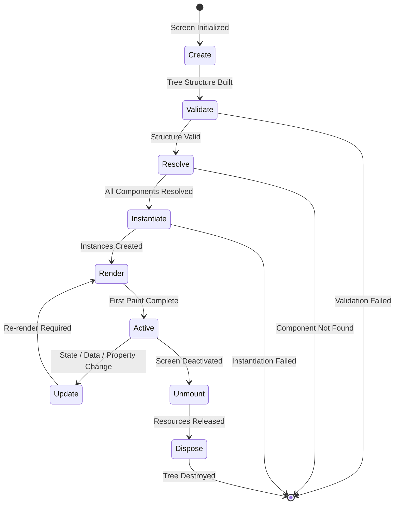
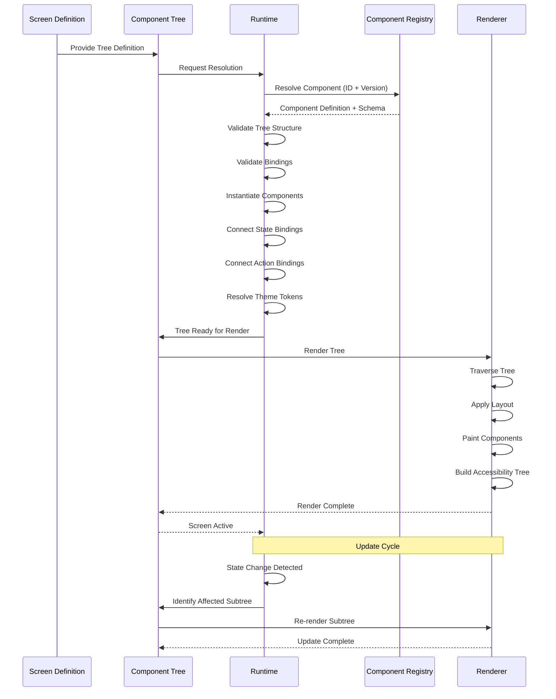
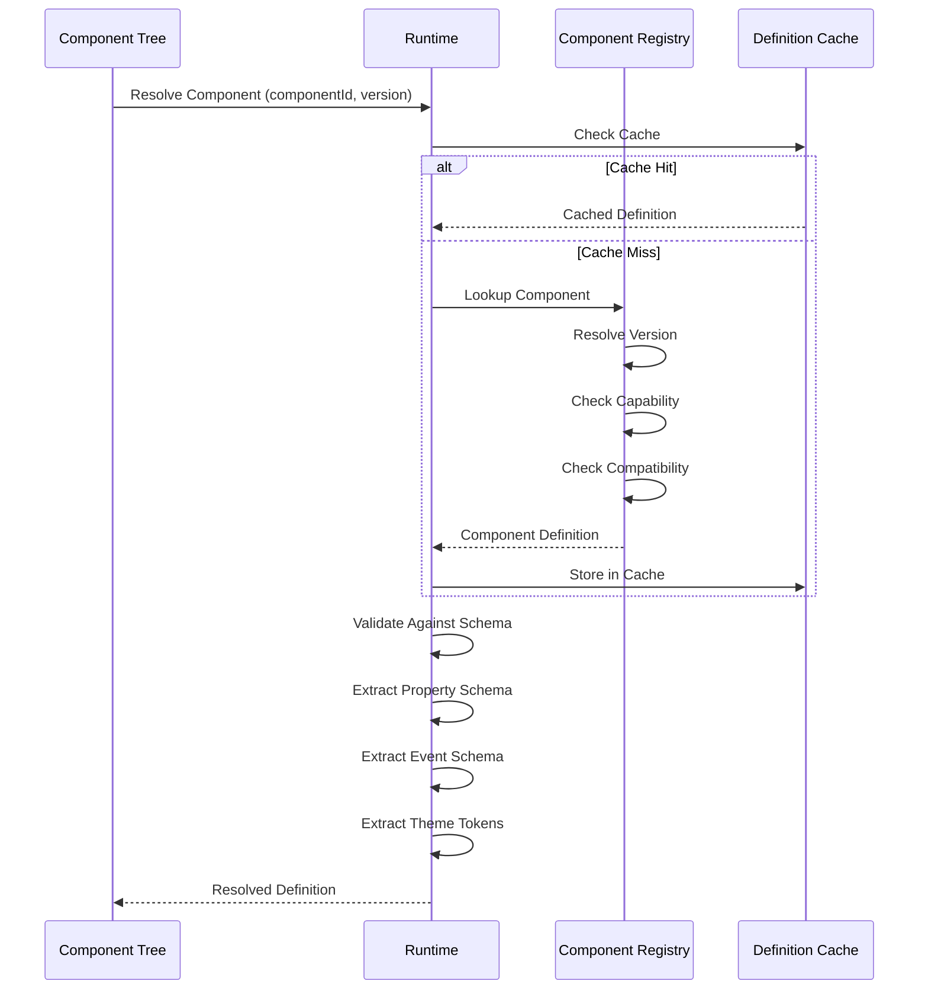
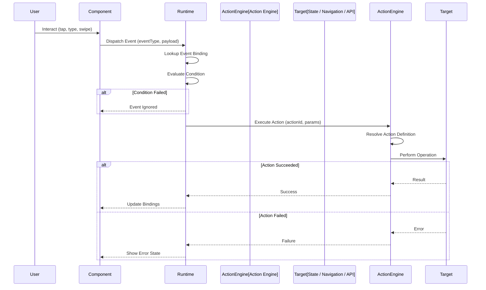
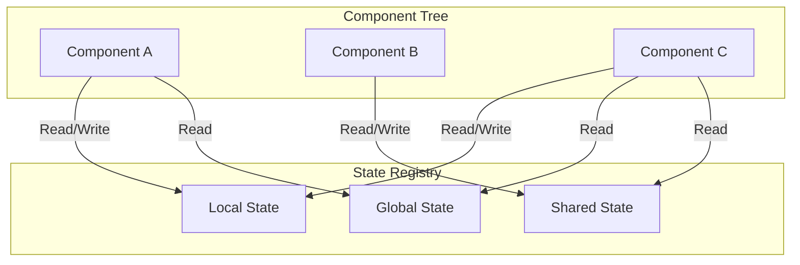
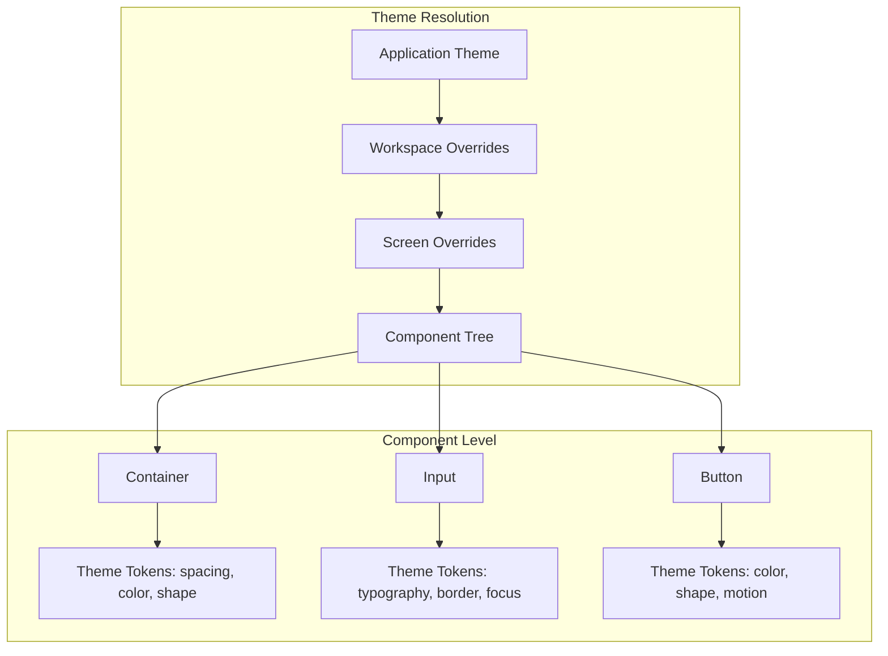

# Component Tree Model

**KB-046 — Component Tree Model Specification**

| Metadata | |
|----------|---|
| **KB ID** | KB-046 |
| **Title** | Component Tree Model |
| **Version** | 0.1.0 |
| **Status** | Draft |
| **Owner** | Architecture Team |
| **Dependencies** | KB-012 Component Registry, KB-013 Component Model, KB-014 Layout System, KB-045 Screen Model, KB-047 Action & Event Model, KB-048 State Model, KB-049 Theme Model, KB-050 Capability Composition, KB-051 Runtime Architecture Overview |
| **Related Documents** | KB-030 Validation Engine, KB-041 Application Architecture Overview, KB-044 Navigation Architecture, KB-052 Runtime Rendering Engine, KB-053 SDUI Architecture |
| **Review Status** | Pending |
| **Last Updated** | 2026-07-11 |

### Revision History

| Version | Date | Author | Change |
|---------|------|--------|--------|
| 0.1.0 | 2026-07-11 | AI Architecture Agent | Initial draft |

---

## 1. Executive Summary

### 1.1 Purpose

This document defines the canonical Component Tree Model for the DUKADESK platform. The Component Tree is the hierarchical structure that composes UI Components into Screens. Every rendered interface on every Runtime — mobile, web, desktop, preview — must be represented as a declarative Component Tree.

The Component Tree is the bridge between Screen Definitions (what content appears) and Component Implementations (how content renders). It declares which Components compose a Screen, how they are nested, how they are configured, what data they bind to, and what actions they trigger. It is structure only — it contains no rendering logic, no business logic, and no platform-specific code.

### 1.2 Scope

This document covers:

- The canonical Component Tree structure, node types, and hierarchy rules
- Tree lifecycle from creation through disposal
- Parent-child relationships, ownership, nesting rules, and composition boundaries
- Component categories and their architectural contracts
- Property, event, state, data, and theme binding architectures
- Relationships to the Component Registry, Layout System, Screen Model, Navigation, Actions, State, Theme, and Capabilities
- Rendering contract between Component Tree, Runtime, Renderer, and Component Registry
- Builder, Runtime, and Validation responsibilities
- Accessibility, performance, offline, security, and observability for Component Trees
- Failure scenarios and anti-patterns

Out of scope:

- Component schema, registration, and versioning (handled by KB-012, KB-013)
- Layout system architecture (handled by KB-014)
- Screen lifecycle and context (handled by KB-045)
- Action definition and execution (handled by KB-047)
- State management architecture (handled by KB-048)
- Theme token resolution (handled by KB-049)
- Capability composition (handled by KB-050)
- Rendering engine implementation (handled by KB-052)

---

## 2. Component Principles

### Declarative

The Component Tree is a data structure, not executable code. Every node, property, binding, and relationship is expressed through structured declarations. There is no programmatic tree construction, no runtime mutation of the tree structure, and no imperative component wiring.

### Immutable Definitions

A published Component Tree Definition is immutable. The tree structure does not change during a session. Dynamic behavior (conditional rendering, repeated items, state-driven visibility) is expressed through declarative bindings, not structural mutation.

### Hierarchical

Components are organized in a tree hierarchy. Each node has exactly one parent (except the root) and zero or more children. The hierarchy defines containment, ownership, and composition. Depth is managed through nesting rules and recommended limits.

### Composable

Any Component may contain any other Component through its children, slots, or template mechanisms. Composition is type-agnostic — a container Component does not need to know the types of its children. Composability is the fundamental mechanism for building complex UIs from simple parts.

### Reusable

Component Trees are reusable across Screens. A Component Tree Definition may be referenced by multiple Screens with different data bindings. Reusability is achieved through parameterized bindings, not through duplication.

### Platform Independent

The Component Tree makes no assumptions about rendering technology, platform idioms, or input methods. The same Tree produces consistent behaviour on mobile, web, desktop, and future platforms. Platform-specific adaptations are handled by the Renderer and Component Registry.

### Theme Aware

All visual properties in the Component Tree reference theme tokens. No hardcoded colors, fonts, spacing, or dimensions exist in the Tree. Theme binding is a first-class concept — every Component node carries its theme token references.

### Capability Aware

Component availability is scoped by capability. A Component Tree can only reference Components from capabilities that are active in the current application context. Capability-owned Components are resolved through the Component Registry with capability context.

### Accessible by Design

Accessibility metadata is declared in the Component Tree, not patched on after rendering. Every Component node declares its accessible role, label, hint, focus behaviour, and keyboard interaction pattern. The Tree is the authoritative source for accessibility information.

### Runtime Rendered

The Component Tree is a declaration of what to render. The Runtime and Renderer are the sole executors of rendering. The Tree does not contain rendering logic, animation definitions, or layout algorithms. It describes structure and bindings; rendering is the Runtime's responsibility.

---

## 3. Canonical Component Model

### 3.1 Component

A Component is the atomic unit of UI composition. It is a registered, versioned, schema-driven presentation element that receives configuration, data, state, and actions from the Runtime and produces rendered output through the Renderer. Components are defined in KB-013 and registered in KB-012.

### 3.2 Component Definition

A Component Definition is the registered metadata and schema for a Component type. It declares the Component's properties, events, theme tokens, state bindings, action bindings, validation rules, accessibility contract, and dependencies. Component Definitions are stored in the Component Registry.

### 3.3 Component Instance

A Component Instance is a single occurrence of a Component within a Component Tree. An Instance binds a Component Definition to concrete property values, data sources, action handlers, and theme tokens. Multiple Instances of the same Component Definition may exist in the same Tree with different configurations.

```text
ComponentInstance {
    instanceId:     string            // Unique within the Component Tree
    componentId:    string            // Component Registry ID
    version:        string            // Component version constraint
    properties:     PropertyBinding[] // Configured property values and bindings
    children:       ComponentInstance[] // Child component instances
    slots:          Slot[]            // Named slot content
    condition:      Condition         // Conditional rendering rule (optional)
    repeat:         Repeat            // Repeated rendering rule (optional)
    bindings: {
        state:      StateBinding[]    // State registry bindings
        data:       DataBinding[]     // Data source bindings
        actions:    ActionBinding[]   // Event-to-action bindings
        theme:      ThemeBinding[]    // Theme token bindings
    }
    accessibility:  AccessibilityDeclaration
    validation:     ValidationRule[]
    metadata:       object            // Extensible instance metadata
}
```

### 3.4 Component Type

The Component Type classifies a Component's architectural purpose. Type determines which categories of properties, events, and children the Component supports. Component Types are defined in the Component Registry and extended by Capabilities.

### 3.5 Component Identifier

Component IDs follow a hierarchical naming convention:

```
{publisher}.{capability}.{category}.{name}
```

Examples: `core.layout.container`, `core.input.text-field`, `acme.orders.order-card`, `marketplace.commerce.product-grid`

Component IDs are globally unique within the Component Registry.

### 3.6 Component Metadata

```text
ComponentMetadata {
    id:              string            // Registry ID
    name:            string            // Display name
    description:     string            // Purpose description
    version:         string            // Current semantic version
    category:        string            // Functional category
    capability:      string            // Owning capability ID
    platform:        string[]          // Platform compatibility
    status:          "active" | "deprecated" | "experimental"
    author:          string            // Publisher or team
    tags:            string[]          // Classification tags
    documentation:   string            // Documentation reference
    examples:        Example[]         // Usage examples
}
```

### 3.7 Component Context

Each Component Instance receives a Context at resolution time:

```text
ComponentContext {
    instanceId:      string            // This instance's identifier
    treeDepth:       number            // Current depth in the tree
    parentId:        string            // Parent instance ID (null for root)
    screenId:        string            // Owning Screen ID
    routeId:         string            // Active route ID
    workspaceId:     string            // Active workspace
    tenantId:        string            // Active tenant
    sessionId:       string            // Active session
    locale:          string            // Resolved locale
    theme: {
        mode:        string            // light | dark | high-contrast
        tokens:      object            // Resolved theme tokens
    }
    platform:        string            // Target platform
    capabilities:    string[]          // Active capability IDs
    featureFlags:    object            // Feature flag overrides
}
```

### 3.8 Component Hierarchy

```
Application
    │
    ▼
Screen (KB-045)
    │
    ▼
Section
    │
    ▼
Layout (KB-014)
    │
    ▼
Component Tree (Root Node)
    │
    ├── Container Component
    │       │
    │       ├── Child Component
    │       │       ├── Grandchild Component
    │       │       └── Grandchild Component
    │       │
    │       └── Child Component
    │
    ├── Content Component
    │       └── Text / Image / Icon
    │
    ├── Input Component
    │       └── TextField / Dropdown / Checkbox
    │
    └── Navigation Component
            └── Button / Link / Tab
```

---

## 4. Component Categories

### 4.1 Layout Components

Components that arrange, position, and structure other Components. Layout Components do not render content themselves — they manage the spatial relationships of their children.

| Examples | Container, Stack, Row, Column, Grid, ScrollView, ZStack, Spacer, Divider, SafeArea |
|----------|-------------------------------------------------------------------------------------|
| **Children** | Required. Accept any Component type. |
| **Properties** | Alignment, spacing, padding, distribution, wrapping, scroll direction, overflow behaviour |
| **Theme** | Spacing tokens, sizing tokens, layout breakpoints |

### 4.2 Content Components

Components that display static or data-driven content to the user.

| Examples | Text, Image, Icon, Avatar, Badge, Label, RichText, Video, HTML |
|----------|---------------------------------------------------------------|
| **Children** | Not typically accepted (self-contained) |
| **Properties** | Source, alt text, variant, size, format, truncation, aspect ratio |
| **Theme** | Typography tokens, color tokens, icon tokens |

### 4.3 Input Components

Components that accept user input and support form interactions.

| Examples | TextField, TextArea, Dropdown, Checkbox, RadioGroup, Toggle, DatePicker, Slider, FileUpload, SearchInput |
|----------|----------------------------------------------------------------------------------------------------------|
| **Children** | Not typically accepted |
| **Properties** | Value, placeholder, label, hint, validation rules, input type, max length, autocomplete |
| **Events** | onChange, onBlur, onFocus, onSubmit, onValidate |
| **Theme** | Input tokens, border tokens, focus ring tokens, error state tokens |

### 4.4 Navigation Components

Components that trigger navigation or represent navigation structure.

| Examples | Button, Link, TabItem, NavItem, BackButton, Breadcrumb, DrawerItem, Pagination |
|----------|--------------------------------------------------------------------------------|
| **Children** | Optional (icon + label content) |
| **Properties** | Route, action, variant, size, icon position, loading state, disabled state |
| **Events** | onPress, onLongPress, onHover, onFocus |
| **Theme** | Button tokens, link tokens, navigation tokens |

### 4.5 Commerce Components

Components specific to commerce, ordering, and transaction flows.

| Examples | ProductCard, PriceDisplay, CartItem, OrderSummary, Rating, ReviewItem, AddToCartButton, QuantitySelector, CouponInput |
|----------|----------------------------------------------------------------------------------------------------------------------|
| **Children** | Optional (composed from content components) |
| **Properties** | Product data binding, currency, quantity, variant, availability |
| **Events** | onAddToCart, onRemoveFromCart, onQuantityChange, onApplyCoupon |
| **Theme** | Commerce tokens, price tokens, badge tokens |

### 4.6 Media Components

Components that render rich media content.

| Examples | Image, Video, Audio, Carousel, Gallery, Map, LottieAnimation, QRCode |
|----------|-----------------------------------------------------------------------|
| **Children** | Not typically accepted |
| **Properties** | Source, poster, autoplay, loop, controls, aspect ratio, lazy load, fallback |
| **Theme** | Media tokens, overlay tokens, control tokens |

### 4.7 Feedback Components

Components that communicate status, errors, or confirmations to the user.

| Examples | Alert, Toast, Snackbar, ProgressBar, Spinner, Skeleton, EmptyState, ErrorState, SuccessState, Banner, Tooltip, Modal |
|----------|---------------------------------------------------------------------------------------------------------------------|
| **Children** | Optional (message content, action buttons) |
| **Properties** | Type, severity, message, duration, dismissible, action label, icon |
| **Events** | onDismiss, onAction, onTimeout |
| **Theme** | Feedback tokens, status color tokens, notification tokens |

### 4.8 Data Components

Components that display structured data, lists, or data-driven content.

| Examples | List, DataTable, Card, Accordion, TreeView, Timeline, Calendar, Chart, Map, Kanban, Spreadsheet |
|----------|------------------------------------------------------------------------------------------------|
| **Children** | Accept item template Components |
| **Properties** | Data source, columns, sort, filter, pagination, empty state, loading state, selection mode |
| **Events** | onSelect, onSort, onFilter, onPageChange, onItemPress |
| **Theme** | Data tokens, table tokens, chart tokens |

### 4.9 Utility Components

Components that provide non-visual or infrastructure functionality.

| Examples | ConditionalWrapper, Repeat, Fragment, Portal, ErrorBoundary, SuspenseBoundary, LazyLoad, AnalyticsTracker, A11yAnnouncer |
|----------|--------------------------------------------------------------------------------------------------------------------------|
| **Children** | Required (wrap or decorate children) |
| **Properties** | Condition, fallback, threshold, context, metadata |
| **Theme** | None (functional, not visual) |

### 4.10 Custom Components

Application-defined or Capability-defined Components not covered by standard categories. Custom Components must register their type, schema, and category with the Component Registry.

| Examples | Domain-specific cards, specialized inputs, proprietary visualizations |
|----------|------------------------------------------------------------------------|
| **Children** | As declared in schema |
| **Properties** | As declared in schema |
| **Events** | As declared in schema |
| **Theme** | As declared in schema |

---

## 5. Component Properties

### 5.1 Identity

```text
Identity {
    instanceId:      string            // Unique within the Component Tree
    componentId:     string            // Registry component ID
    version:         string            // Version constraint (e.g., "^1.2.0")
    label:           string            // Human-readable label (for Builder)
    description:     string            // Purpose description (for Builder)
}
```

### 5.2 Configuration

Configuration properties define the Component's behaviour, content, and visual presentation.

```text
ConfigurationProperty {
    key:              string           // Property name
    type:             string           // "string" | "number" | "boolean" | "enum" | "object" | "array"
    value:            any              // Static value
    binding:          Binding          // Dynamic binding (overrides value if present)
    required:         boolean          // Must be provided
    default:          any              // Default value if not specified
    validation:       ValidationRule[] // Validation constraints
}
```

### 5.3 Appearance

Appearance properties control visual presentation through theme token references.

```text
AppearanceProperty {
    token:            string           // Theme token reference (e.g., "color.primary")
    fallback:         string           // Fallback value if token not found
    overrides: {
        light:        string           // Light mode override
        dark:         string           // Dark mode override
        highContrast: string           // High contrast override
    }
}
```

### 5.4 Visibility

Visibility controls whether a Component Instance renders.

```text
Visibility {
    visible:          boolean | Binding // Static or bound visibility
    condition:        Condition        // Conditional rendering rule
    keepAlive:        boolean          // Keep instance alive when hidden (preserve state)
    lazy:             boolean          // Defer rendering until visible
    placeholder:      ComponentRef     // Placeholder shown while lazy loading
}
```

### 5.5 State Bindings

State bindings connect Component properties to the State Registry.

```text
StateBinding {
    property:         string           // Component property to bind
    scope:            "local" | "shared" | "global"
    path:             string           // State registry path
    defaultValue:     any              // Default if state not found
    twoWay:           boolean          // Component can write back to state
    transform:        Transform       // Optional value transformation
}
```

### 5.6 Event Bindings

Event bindings connect Component events to Actions.

```text
EventBinding {
    event:            string           // Component event name (e.g., "onPress")
    action:           string           // Action ID to dispatch
    params:           object           // Action parameters (static or bound)
    condition:        Condition        // Condition for triggering
    debounce:         number           // Debounce interval in ms
    throttle:         number           // Throttle interval in ms
}
```

### 5.7 Accessibility

Accessibility properties declare the Component's semantic role and behaviour.

```text
AccessibilityProperty {
    role:             string           // ARIA role or platform equivalent
    label:            string | Binding // Accessible label
    hint:             string | Binding // Accessible hint/description
    focusable:        boolean          // Can receive focus
    focusOrder:       number           // Tab order position
    liveRegion:       "off" | "polite" | "assertive"
    keyboardActions:  string[]         // Supported keyboard interactions
    hidden:           boolean          // Hide from accessibility tree
}
```

### 5.8 Validation

Validation rules for input Components.

```text
ValidationRule {
    type:             string           // "required" | "minLength" | "maxLength" | "pattern" | "custom"
    value:            any              // Rule parameter
    message:          string           // Validation error message
    severity:         "error" | "warning" | "info"
    async:            boolean          // Server-side validation
}
```

### 5.9 Metadata

Extensible metadata for Builder, diagnostics, and documentation.

```text
ComponentMetadata {
    tags:             string[]         // Classification tags
    category:         string           // Functional category
    owner:            string           // Responsible team or capability
    created:          datetime
    updated:          datetime
    custom:           object           // Builder plugin extension data
}
```

---

## 6. Parent–Child Relationships

### 6.1 Parent Ownership

A parent Component owns its children. Ownership means:

- Parent defines the child's position in the composition
- Parent determines the child's layout constraints
- Parent controls the child's visibility and lifecycle
- Parent provides context to the child (inherited properties, theme scope)

```text
ParentChild {
    parentInstanceId:   string
    childInstanceId:    string
    relationship:       "containment" | "slot" | "template"
    slot:               string         // Named slot (if slot relationship)
    index:              number         // Position among siblings
    inheritedProperties: string[]      // Properties inherited from parent
}
```

### 6.2 Child Ownership

A child Component does not own its parent. Children:

- Do not control parent layout or visibility
- Do not access parent internals
- Do not mutate parent properties
- Communicate only through events and state bindings

### 6.3 Nesting Rules

| Rule | Description |
|------|-------------|
| **Single Parent** | Every Component Instance has exactly one parent (except root) |
| **Acyclic** | A Component must not contain itself directly or transitively |
| **Type Compatibility** | Parent must accept children of the child's type (declared in schema) |
| **Slot Compatibility** | Child must match the slot type declared by the parent |
| **Depth Limit** | Maximum recommended depth: 10 levels |
| **Width Limit** | Maximum recommended siblings per parent: 50 |

### 6.4 Composition Boundaries

```text
CompositionBoundary {
    type:           "screen" | "section" | "container" | "component"
    scope:          "tree" | "subtree" | "node"
    isolation:      boolean            // Children cannot access parent's internal state
    inheritance:    string[]           // Inherited context keys
    override:       boolean            // Children may override inherited values
}
```

| Boundary | Scope | Isolation | Inheritance |
|----------|-------|-----------|-------------|
| **Screen** | Full tree | Complete isolation from other Screens | Theme, Tenant, User |
| **Section** | Subtree | Section-local state | Screen context |
| **Container** | Subtree | Container-local layout | Section context |
| **Component** | Single node | No access to parent internals | Parent context (filtered) |

### 6.5 Maximum Depth Considerations

Tree depth directly impacts rendering performance, memory usage, and accessibility navigation. The architecture defines:

| Depth | Classification | Guidance |
|-------|---------------|----------|
| 0–5 | Shallow | Preferred. Optimal performance and maintainability. |
| 6–10 | Moderate | Acceptable. Consider refactoring into sub-Components if depth exceeds 8. |
| 11–15 | Deep | Warning. Must be justified. Performance monitoring required. |
| 16+ | Excessive | Blocked by Validation Engine. Must be refactored. |

```mermaid
graph TD
    subgraph "Shallow Tree (Depth 0-5)"
        R1[Root]
        R1 --> C1[Container]
        C1 --> T1[Text]
        C1 --> B1[Button]
        R1 --> C2[Container]
        C2 --> I1[Image]
    end

    subgraph "Moderate Tree (Depth 6-10)"
        R2[Root]
        R2 --> L1[List]
        L1 --> I2[Item]
        I2 --> C3[Card]
        C3 --> R3[Row]
        R3 --> A1[Avatar]
        R3 --> C4[Column]
        C4 --> T2[Title]
        C4 --> S1[Subtitle]
    end

    subgraph "Excessive Tree (Depth 16+)"
        R4[Root]
        R4 --> D1[Deep]
        D1 --> D2[...]
        D2 --> D3[...]
        D3 --> D4[...]
        D4 --> D5[...]
        D5 --> D6[...]
        D6 --> D7[...]
        D7 --> D8[...]
        D8 --> D9[...]
        D9 --> D10[...]
        D10 --> D11[...]
        D11 --> D12[...]
        D12 --> D13[...]
        D13 --> D14[...]
        D14 --> D15[Collapsed]
    end
```



---

## 7. Tree Lifecycle



### 7.1 Create

The Component Tree is constructed from the Screen's Component Tree Definition. The Tree is parsed, nodes are created in memory, parent-child relationships are established, and initial property values are assigned from static definitions.

| Input | Output |
|-------|--------|
| Screen Component Tree Definition | In-memory tree structure |
| Route parameters | Resolved parameter bindings |
| Screen context | Initial component context |

### 7.2 Validate

The Tree structure is validated before resolution:

- All Component IDs exist in the Component Registry
- All required properties are provided
- All binding paths are syntactically valid
- No circular parent-child relationships exist
- Depth does not exceed configured maximum
- All slot types are compatible
- All capability requirements are satisfied

### 7.3 Resolve

Each Component reference is resolved against the Component Registry:

1. Component ID is looked up in the Registry
2. Version constraint is resolved to a concrete version
3. Component definition is fetched (metadata, schema, contract)
4. Capability ownership is verified (capability must be active)
5. Platform compatibility is checked
6. Component definition is cached for the session

### 7.4 Instantiate

Resolved Components are instantiated with their configuration:

1. Component instance is created from the definition
2. Static property values are applied
3. State bindings are connected to the State Registry
4. Data bindings are connected to data sources
5. Action bindings are registered with the Action Engine
6. Theme tokens are resolved and bound
7. Accessibility metadata is prepared
8. Conditional rules are evaluated

### 7.5 Render

The instantiated Tree is rendered by the Renderer:

1. Tree traversal determines render order
2. Layout system resolves spatial arrangement
3. Each Component is rendered on the target platform
4. Transitions and animations are executed
5. Accessibility tree is built
6. First paint is completed
7. Screen lifecycle transitions to Active

### 7.6 Update

The Tree updates in response to state, data, or property changes:

1. Change is detected by the State Registry or binding layer
2. Affected Component instances are identified
3. Property values are recalculated
4. Re-render is triggered for affected subtree only
5. Unchanged subtrees are preserved (memoization)
6. Conditional rendering rules are re-evaluated

### 7.7 Unmount

The Tree is unmounted when the Screen is deactivated:

1. Screen lifecycle fires `onDeactivate`
2. Component instances receive unmount signal
3. State bindings flush pending writes
4. Visible Components transition to hidden
5. Animation/transition exits are executed
6. Component instances are suspended (not destroyed)

### 7.8 Dispose

The Tree is disposed when the Screen is destroyed:

1. All state bindings are torn down
2. Action bindings are unregistered
3. Event subscriptions are cancelled
4. Component instances are destroyed
5. Local state is discarded
6. Memory is released

---

## 8. Rendering Contract

### 8.1 Responsibility Boundaries

```text
RenderingContract {
    componentTree: {
        defines:        "What to render — structure, hierarchy, bindings"
        owns:           "Tree structure, node configuration, binding declarations"
        doesNotOwn:     "Rendering implementation, layout calculation, animation execution"
    }
    runtime: {
        defines:        "How rendering is orchestrated — lifecycle, resolution, updates"
        owns:           "Component resolution, tree lifecycle, state binding, update propagation"
        doesNotOwn:     "Component implementation, platform rendering, layout algorithms"
    }
    renderer: {
        defines:        "How the tree is painted — platform rendering, layout, animation"
        owns:           "Platform-native rendering, layout resolution, transition execution, accessibility tree"
        doesNotOwn:     "Tree structure, business logic, component behaviour"
    }
    registry: {
        defines:        "What components exist — registration, versioning, schema"
        owns:           "Component definitions, version resolution, schema validation, metadata"
        doesNotOwn:     "Tree structure, rendering, instance configuration"
    }
}
```



---

## 9. Component Registry Relationship

### 9.1 Resolution Flow



### 9.2 Contract

| Component Tree | Component Registry |
|---------------|-------------------|
| References Components by ID | Stores Component Definitions |
| Declares version constraints | Resolves versions |
| Configures property values | Defines property schemas |
| Binds events to actions | Defines event schemas |
| References theme tokens | Declares token requirements |
| Declares child constraints | Defines slot/child schemas |

The Component Tree does not duplicate Registry data. It references Components by ID and relies on the Registry for definition resolution, schema validation, and version management.

---

## 10. Layout Relationship

### 10.1 Tree-to-Layout Integration

The Component Tree defines the Component hierarchy and configuration. The Layout System (KB-014) defines the spatial arrangement. Layout Components within the Tree provide the bridge.

| Component Tree | Layout System |
|---------------|---------------|
| Declares Container Components (Row, Column, Grid) | Defines how Containers arrange children |
| Declares spacing and alignment properties | Resolves spacing values from theme tokens |
| Declares responsive breakpoint adaptations | Applies breakpoint-specific layout rules |
| Declares component visibility per breakpoint | Manages layout reflow on breakpoint changes |

### 10.2 Layout Components

Layout Components (Section 4.1) are first-class citizens of the Component Tree. They declare spatial relationships that the Layout System resolves:

```text
// Container Component with Layout properties
{
    instanceId: "main-container",
    componentId: "core.layout.column",
    properties: {
        spacing: { token: "spacing.md" },
        padding: { token: "spacing.lg" },
        alignment: "center",
        distribution: "equal"
    },
    children: [ ... ]
}
```

---

## 11. Screen Relationship

The Component Tree is the compositional heart of a Screen. Every Screen (KB-045) hosts exactly one root Component Tree.

```text
Screen (KB-045)
    │
    ├── Metadata, Context, Lifecycle
    ├── Composition (Header, Body, Footer, Floating, Overlay)
    │
    └── Component Tree (Root Node) ← This document
            │
            └── Section Components
                    │
                    └── Container Components
                            │
                            └── Content, Input, Navigation Components
```

| Screen | Component Tree |
|--------|---------------|
| Defines what content appears | Defines how content is composed from Components |
| Declares Layout reference | Declares Layout Components within the tree |
| Declares state boundaries | Declares state bindings per Component |
| Declares lifecycle hooks | Declares Component-level lifecycle hooks |
| Provides Screen Context | Provides Component Context |

---

## 12. Navigation Relationship

Components trigger navigation through Action bindings (Section 5.6). Navigation Components (Section 4.4) dispatch navigation actions that the Action Engine (KB-047) routes to the Navigation Engine (KB-044).

```text
// Navigation Component binding
{
    instanceId: "view-order-button",
    componentId: "core.navigation.button",
    properties: {
        label: "View Order",
        variant: "primary"
    },
    bindings: {
        events: [
            {
                event: "onPress",
                action: "navigation.navigate",
                params: {
                    route: "orders.detail",
                    orderId: { source: "state", path: "shared.selectedOrderId" }
                }
            }
        ]
    }
}
```

| Component Tree | Navigation |
|---------------|------------|
| Declares Navigation Components | Defines navigation routes and guards |
| Binds Component events to navigation actions | Executes navigation through the lifecycle |
| Receives route parameters as context | Passes route parameters to components |
| Components do not know routes | Routes are resolved by Navigation Engine |

---

## 13. Action Relationship

Actions (KB-047) are connected to Components through Event Bindings (Section 5.6). Components dispatch events; the Runtime resolves the bound Action and executes it through the Action Engine.



| Component Tree | Action & Event Model |
|---------------|----------------------|
| Declares Event Bindings per Component | Defines Action definitions and execution pipeline |
| Binds events to action IDs | Resolves Action IDs to Action Definitions |
| Declares action parameters | Provides parameter values from Component context |
| Declares success/failure handlers | Routes results to state, navigation, or feedback |

---

## 14. State Relationship

State (KB-048) is connected to Components through State Bindings (Section 5.5). Components read state from the State Registry and may write state back through two-way bindings.

### 14.1 State Binding Flow

```text
State Registry (Global)
    │
    ├── State Registry (Shared)
    │       │
    │       ├── State Registry (Local - Screen)
    │       │       │
    │       │       └── Component Instance
    │       │               ├── Read: property ← state.path
    │       │               └── Write: state.path ← property (if twoWay)
    │       │
    │       └── Component Instance (Shared consumer)
    │               └── Read/Write via shared state path
    │
    └── Component Instance (Global consumer)
            └── Read-only via global state path
```

### 14.2 Binding Types

| Type | Direction | Scope | Persistence |
|------|-----------|-------|-------------|
| **Local** | Read/Write | Current Screen | Temporary |
| **Shared** | Read/(Write with auth) | Workspace or Application | Session or Persistent |
| **Global** | Read-only | Application or Platform | Persistent |



---

## 15. Theme Relationship

Theme (KB-049) is connected to Components through Appearance Properties (Section 5.3). Every visual property references a theme token by name. The Theme Engine resolves tokens to concrete values based on the active theme, mode, and any Component-level overrides.

### 15.1 Theme Inheritance



### 15.2 Token Binding

```text
{
    instanceId: "submit-button",
    componentId: "core.navigation.button",
    properties: {
        label: "Submit",
        appearance: {
            backgroundColor:     { token: "color.primary" },
            textColor:          { token: "color.onPrimary" },
            borderRadius:       { token: "shape.sm" },
            padding:            { token: "spacing.md" },
            font:               { token: "typography.button" },
            elevation:          { token: "elevation.low" },
            hoverBackground:    { token: "color.primaryDark" },
            disabledOpacity:    { token: "opacity.disabled" }
        }
    }
}
```

---

## 16. Capability Relationship

Capabilities (KB-050) own Components. A Capability may register Components in the Registry and contribute them to the Component Trees of Screens it owns.

### 16.1 Capability Component Contribution

```text
// Capability declares its Components
capability: {
    id: "orders-management",
    components: [
        "acme.orders.order-card",
        "acme.orders.order-list",
        "acme.orders.status-badge",
        "acme.orders.timeline"
    ]
}
```

### 16.2 Availability Rules

| Rule | Description |
|------|-------------|
| **Capability Active** | Component is only available when the owning capability is active |
| **Capability Removed** | Components from removed capabilities are removed from all Trees |
| **Version Constraint** | Component version must satisfy the capability's declared constraint |
| **Dependency Chain** | Capability dependencies chain determines component availability |

### 16.3 Cross-Capability Composition

A Screen owned by one capability may use Components from another capability:

```text
// Screen "orders.detail" (owned by orders-management)
// Uses components from multiple capabilities
componentTree: {
    componentId: "core.layout.column",
    children: [
        { componentId: "core.content.text", properties: { ... } },
        { componentId: "acme.orders.status-badge", properties: { ... } },  // orders-management
        { componentId: "acme.commerce.price-display", properties: { ... } }, // commerce
        { componentId: "core.navigation.button", properties: { ... } }       // core
    ]
}
```

Cross-capability composition is validated at Tree build time. A Component from an inactive capability causes a resolution failure and triggers fallback handling.

---

## 17. Builder Responsibilities

| Responsibility | Description |
|----------------|-------------|
| **Component Tree Editor** | Provide visual tree editing: add, remove, reorder, nest, and configure Components |
| **Component Palette** | Display available Components from the Component Registry, filtered by capability and category |
| **Property Inspector** | Provide property editing for each Component: values, bindings, appearance, accessibility |
| **Binding Editor** | Provide UI for configuring state, data, action, and theme bindings |
| **Tree Visualization** | Display the Component Tree as an interactive hierarchical diagram |
| **Drag-and-Drop Composition** | Allow authors to compose Trees by dragging Components from the palette into the tree |
| **Slot Management** | Show available slots for each parent Component and allow child assignment |
| **Conditional Rendering Editor** | Provide UI for defining conditional visibility rules |
| **Repeat Configuration** | Provide UI for defining repeated/repeating Component patterns |
| **Validation Feedback** | Display real-time validation: missing properties, binding errors, depth warnings |
| **Preview Mode** | Render the Component Tree for visual verification within the Builder |
| **Template Save** | Allow saving subtrees as reusable templates for future Trees |

---

## 18. Runtime Responsibilities

| Responsibility | Description |
|----------------|-------------|
| **Tree Construction** | Parse the Component Tree Definition and build the in-memory tree structure |
| **Component Resolution** | Resolve each Component reference from the Component Registry with version and capability verification |
| **Property Resolution** | Merge static values, state bindings, data bindings, and theme bindings into final property values |
| **Lifecycle Management** | Execute the Tree lifecycle: Create, Validate, Resolve, Instantiate, Render, Update, Unmount, Dispose |
| **Binding Management** | Connect state, data, action, and theme bindings. Maintain subscriptions for reactive updates. |
| **Conditional Rendering** | Evaluate conditional rules on Tree creation and on relevant state changes |
| **Update Propagation** | Detect changes, identify affected subtree, trigger targeted re-renders |
| **Error Handling** | Handle resolution failures, binding errors, and render errors with fallback behaviour |
| **Caching** | Cache resolved Component Definitions for the session duration |
| **Performance Monitoring** | Track Tree depth, render times, update frequency, and memory usage |

---

## 19. Validation Responsibilities

| Responsibility | Description |
|----------------|-------------|
| **Structure Validation** | Verify Tree structure: single root, valid parent-child relationships, no cycles |
| **Component Existence** | Verify all Component IDs exist in the Registry with matching version constraints |
| **Property Completeness** | Verify all required properties are provided |
| **Property Type Check** | Verify property values match declared types in the Component schema |
| **Binding Validation** | Verify binding paths are syntactically valid and reference existent state/data paths |
| **Capability Validation** | Verify all referenced Components belong to active capabilities |
| **Depth Check** | Verify Tree depth does not exceed maximum (default: 10, configurable: 16 max) |
| **Slot Compatibility** | Verify child Component types match slot declarations |
| **Circular Reference** | Detect and reject circular parent-child relationships |
| **Theme Token Validation** | Verify all referenced theme tokens exist in the active theme |
| **Accessibility Validation** | Verify required accessibility properties are present |
| **Performance Validation** | Flag Trees exceeding complexity thresholds for review |

---

## 20. Accessibility

### 20.1 Semantic Hierarchy

The Component Tree must produce a semantically meaningful accessibility tree. Container Components establish landmarks; Content Components establish roles; Input Components establish form relationships.

```text
// Accessibility tree derived from Component Tree
Root (role: "main")
    ├── Header (role: "banner")
    │       └── Text (role: "heading", level: 1)
    ├── Navigation (role: "navigation")
    │       ├── Link (role: "link", label: "Home")
    │       └── Link (role: "link", label: "Orders")
    ├── Search (role: "search")
    │       └── TextField (role: "searchbox", label: "Search orders")
    ├── Content (role: "region", label: "Order List")
    │       ├── List (role: "list")
    │       │       ├── ListItem (role: "listitem")
    │       │       └── ListItem (role: "listitem")
    │       └── Button (role: "button", label: "Load More")
    └── Footer (role: "contentinfo")
```

### 20.2 Focus Order

Focus order is declared per Component Instance through the `focusOrder` accessibility property. The Runtime builds the focus order by traversing the Component Tree in document order, respecting explicit `focusOrder` overrides.

### 20.3 Screen Readers

Screen reader announcements are generated from Component accessibility metadata:

| Component Event | Announcement |
|----------------|--------------|
| Mount | "role label: hint" |
| Focus | "label: role. hint. instructions" |
| Value Change | "label: new value" |
| Error | "Error: validation message" |
| Status | "Live region: status message" |

### 20.4 Keyboard Interaction

Keyboard interaction patterns are declared per Component:

| Pattern | Components |
|---------|------------|
| `enter` | Buttons, Links, ListItems |
| `escape` | Modals, Popovers, Drawers |
| `arrow` | Tab lists, Radio groups, Menu bars |
| `tab` | All focusable components |
| `space` | Checkboxes, Toggles, Buttons |

### 20.5 Dynamic Scaling

Component Trees must function correctly when text is scaled to 200% without:

- Horizontal overflow (handled by Layout Components)
- Clipped content (handled by ScrollView and overflow properties)
- Lost functionality (all interactive Components remain accessible)
- Broken layouts (responsive properties adapt to content size)

### 20.6 Contrast Inheritance

Contrast requirements are inherited through the theme token chain. Components do not declare colour values directly — they reference theme tokens that are validated for contrast compliance.

---

## 21. Performance

### 21.1 Tree Depth

Tree depth directly impacts rendering performance. The recommended maximum of 10 levels balances composability with performance. The Validation Engine enforces a hard maximum of 16 levels.

### 21.2 Lazy Loading

Components declared with `lazy: true` are deferred until they enter the viewport:

- Placeholder Component rendered immediately
- Lazy Component loaded when viewport threshold is crossed
- Loading may be triggered by scroll position, intersection observer, or predictive loading
- Lazy loading reduces initial render time and memory usage

### 21.3 Incremental Updates

On state or property changes, only the affected subtree is re-rendered:

1. Runtime identifies the minimal affected subtree
2. Unchanged subtrees are preserved (memoized)
3. Re-render is scoped to affected Components only
4. Layout reflow is limited to the affected subtree

### 21.4 Render Optimization

| Technique | Description |
|-----------|-------------|
| **Memoization** | Component instances are cached and reused across renders when props and bindings have not changed |
| **Virtualization** | Only visible Components are rendered (virtual lists, virtual grids) |
| **Deferred Rendering** | Content below the fold is rendered after the initial paint |
| **Batch Updates** | Multiple state changes are batched into a single re-render cycle |
| **Stable Keys** | `instanceId` provides stable identity for efficient reconciliation |

### 21.5 Memory Efficiency

| Strategy | Description |
|----------|-------------|
| **Instance Pooling** | Repeated Component templates share a single definition with per-instance state |
| **Subtree Disposal** | Unmounted subtrees release all resources |
| **Binding Teardown** | State and event subscriptions are cancelled on Instance disposal |
| **Definition Sharing** | Component definitions are shared across instances (not copied) |
| **Cache Invalidation** | Resolved definitions are cached with TTL and eviction policy |

---

## 22. Offline Behaviour

### 22.1 Tree Definition Availability

Component Tree Definitions must be available offline. They are cached as part of the Application Package cache.

### 22.2 Component Resolution Offline

| Scenario | Behaviour |
|----------|-----------|
| Component definition cached | Resolution proceeds from cache |
| Component definition not cached | Fallback Component used (placeholder with error) |
| Version constraint mismatch | Best available version from cache used, warning logged |
| Capability not available offline | Component shows unavailable state |

### 22.3 State Bindings Offline

- State bindings to Local state work identically online and offline
- State bindings to Shared state with server persistence queue writes
- State bindings to Global state work from locally cached state
- Two-way bindings to server-backed state show optimistic UI with pending indicator

### 22.4 Action Bindings Offline

- Navigation actions resolve from locally cached route registry
- API-call actions are queued for synchronization
- State mutation actions apply locally immediately
- Action failures due to offline state show appropriate feedback

---

## 23. Security

### 23.1 Trusted Component Definitions

Component Trees reference Components by Registry ID. The Runtime resolves definitions from the Registry, not from the Tree itself. A Tree cannot inject arbitrary component behaviour — it can only reference Registry-approved Components.

### 23.2 Registry Validation

Before resolution, the Runtime validates:

- Component ID exists in the Registry
- Version constraint resolves to a registered version
- Component is not deprecated or banned
- Component signature is valid (for Marketplace Components)

### 23.3 Component Integrity

| Concern | Control |
|---------|---------|
| Unregistered Component | Resolution failure at Tree build time |
| Tampered definition | Registry signature verification |
| Version mismatch | Version constraint enforcement |
| Deprecated Component | Validation warning, replacement suggestion |
| Banned Component | Resolution blocked, error reported |

### 23.4 Injection Prevention

| Attack Vector | Prevention |
|---------------|------------|
| Malicious Component ID | Registry whitelist — only registered IDs resolve |
| Malicious property values | Schema validation — values must match declared types |
| Malicious binding paths | Path validation — paths must reference declared state keys |
| Malicious action IDs | Action whitelist — only registered actions dispatch |
| Malicious theme tokens | Token validation — tokens must exist in active theme |

---

## 24. Observability

### 24.1 Tree Events

| Event | Trigger |
|-------|---------|
| `tree.created` | Component Tree constructed |
| `tree.validated` | Tree structure validation complete |
| `tree.resolveStarted` | Component resolution began |
| `tree.resolveComplete` | All Components resolved |
| `tree.instantiated` | All Component instances created |
| `tree.renderStarted` | First render began |
| `tree.renderComplete` | Full tree rendered and painted |
| `tree.updated` | Subtree re-rendered due to change |
| `tree.unmounted` | Tree unmounted |
| `tree.disposed` | Tree destroyed |

### 24.2 Component Events

| Event | Trigger |
|-------|---------|
| `component.resolved` | Single Component resolved from Registry |
| `component.instantiated` | Component instance created |
| `component.rendered` | Component painted |
| `component.updated` | Component re-rendered |
| `component.error` | Component encountered error |
| `component.unmounted` | Component unmounted |
| `component.disposed` | Component destroyed |

### 24.3 Metrics

| Metric | Description |
|--------|-------------|
| Tree depth | Current depth of the Component Tree |
| Node count | Total component instances in the Tree |
| Resolution time | Time to resolve all components from Registry |
| Instantiation time | Time to create all component instances |
| Render time | Time to render the full tree |
| Update time | Time to re-render an affected subtree |
| Binding count | Total active state/data/action/theme bindings |
| Registry cache hits | Component definitions resolved from cache |
| Registry cache misses | Component definitions fetched from Registry |

### 24.4 Failures

| Failure | Event + Code |
|---------|--------------|
| Component not found | `component.error` — `COMPONENT_NOT_FOUND` |
| Invalid component type | `component.error` — `INVALID_TYPE` |
| Missing property | `component.error` — `MISSING_PROPERTY` |
| Binding path invalid | `component.error` — `INVALID_BINDING` |
| Circular hierarchy | `tree.validated` — `CIRCULAR_REFERENCE` |
| Depth exceeded | `tree.validated` — `DEPTH_EXCEEDED` |
| Capability inactive | `component.resolved` — `CAPABILITY_INACTIVE` |
| Theme token missing | `component.instantiated` — `TOKEN_NOT_FOUND` |

---

## 25. Failure Scenarios

| Scenario | Behaviour |
|----------|-----------|
| **Missing Component** | Fallback placeholder Component rendered. Error logged. Builder notified. |
| **Invalid Component Type** | Component ID does not match any registered type. Resolution fails. Fallback displayed. |
| **Circular Hierarchy** | Validation detects cycle. Tree build fails with diagnostic message. Builder notified. |
| **Invalid Bindings** | Binding path does not exist in State Registry or data source. Component renders with default value. Warning logged. |
| **Missing Registry Entry** | Component not found in Registry at resolution time. Fallback placeholder rendered. |
| **Unsupported Capability** | Capability owning a Component is not active. Component resolved as unavailable. Error state displayed. |
| **Theme Mismatch** | Referenced theme token does not exist. Fallback value used (if provided) or token name displayed. Warning logged. |
| **Version Conflict** | Multiple Component instances request incompatible versions. Highest compatible version selected. Warning logged. |
| **Depth Limit Exceeded** | Validation blocks Tree with `DEPTH_EXCEEDED`. Application must be fixed in Builder. |
| **Slot Type Mismatch** | Child Component type does not match parent's slot declaration. Validation error. Builder notified. |
| **Property Validation Failure** | Provided property value fails type or constraint validation. Default value used. Warning logged. |
| **State Binding Authorization** | Component attempts to write to a Shared or Global state it is not authorized for. Write blocked. Error logged. |

---

## 26. Anti-Patterns

### Deep Nesting

Excessive Tree depth (16+ levels) degrades performance, accessibility navigation, and maintainability. Refactor deep Trees into sub-Components. The Validation Engine blocks Trees exceeding the maximum depth.

### Business Logic Inside Components

Components must not contain business logic, data transformation, workflow orchestration, or API calls. Components render UI, dispatch events, and display data. All logic belongs in Actions, Capabilities, and Backend services.

### Duplicate Trees

The same Screen should not have multiple Component Tree Definitions. Reuse a single Tree with parameterized bindings. Duplication causes maintenance burden and inconsistent rendering.

### Platform-Specific Components

Component Trees must not reference platform-specific Components. Platform adaptation is the Renderer's responsibility. The same Tree must render on mobile, web, and desktop.

### Mutable Component Definitions

Component Definitions are immutable once published. Trees must not modify Component Definitions at runtime. Dynamic behaviour is expressed through bindings and conditional rendering, not through definition mutation.

### Circular References

A Component must not contain itself directly or transitively. Circular references cause infinite recursion in rendering and resolution. The validation system detects and rejects cycles.

### Hardcoded Values

All visual properties must reference theme tokens. Hardcoded colours, fonts, spacing, and dimensions break theme compatibility, accessibility (contrast), and responsive behaviour.

### Orphaned Components

Every Component must be reachable from the root. Components not connected to the root Tree are unreachable and will not render. Orphan detection is a validation responsibility.

### Overly Wide Trees

A single parent with more than 50 children degrades layout performance and maintainability. Wide Trees should be refactored into grouped Containers.

### Unnecessary Nesting

Wrapping a single child in multiple nested Containers adds complexity without benefit. Each nesting level should add architectural value (layout, conditional rendering, state scoping).

---

## 27. Future Evolution

### 27.1 AI-Generated Trees

AI-assisted generation of Component Trees from natural language descriptions, wireframes, or design files. Generated Trees conform to the Component Tree schema and are validated before Builder integration.

### 27.2 Dynamic Composition

Component Trees that compose themselves at runtime based on user role, permissions, feature flags, or tenant configuration. Dynamic composition is expressed through declarative rules, not imperative tree manipulation.

### 27.3 Collaborative Editing

Multiple authors editing the same Component Tree simultaneously with conflict resolution. Collaborative editing operates on the declarative Tree Definition, not on rendered instances.

### 27.4 Runtime Optimization

Adaptive Tree trimming based on performance budgets — the Runtime may simplify deep Trees on low-end devices while rendering full Trees on capable hardware.

### 27.5 Cross-Runtime Rendering

Component Trees that span multiple Runtimes — part of the Tree rendered on a mobile device, part rendered on a companion wearable or large display.

### 27.6 Component Virtualization

Automatic virtualization of large lists and grids without explicit declaration. The Runtime detects repeated Component patterns and optimizes rendering transparently.

---

## 28. Cross References

| KB-ID | Title | Relationship |
|-------|-------|--------------|
| KB-012 | Component Registry | Component Tree references Components by Registry ID. The Registry resolves definitions, manages versions, and validates schemas. |
| KB-013 | Component Model | Defines the universal Component contract. Component Tree hosts Component Instances that conform to this contract. |
| KB-014 | Layout System | Component Tree contains Layout Components. The Layout System resolves spatial arrangement. |
| KB-030 | Validation Engine | Validates Component Tree structure, depth, references, bindings, and compatibility. |
| KB-041 | Application Architecture Overview | Component Trees are a core element of the Application Model. Screens compose Component Trees. |
| KB-044 | Navigation Architecture | Components dispatch navigation events through Action bindings. Navigation Components are part of the Tree. |
| KB-045 | Screen Model | Every Screen hosts one root Component Tree. The Screen provides context and lifecycle for the Tree. |
| KB-047 | Action & Event Model | Components bind events to Actions. The Action Engine executes Actions triggered by Component events. |
| KB-048 | State Model | Components bind to State through State Bindings. State boundaries (Local, Shared, Global) determine scope. |
| KB-049 | Theme Model | Components reference theme tokens for all visual properties. The Theme Engine resolves tokens. |
| KB-050 | Capability Composition | Capabilities own Components. Component availability depends on capability activation. |
| KB-051 | Runtime Architecture Overview | The Runtime orchestrates Component resolution, instantiation, rendering, and lifecycle management. |

---

*This is KB-046, the Component Tree Model specification of the DUKADESK Engineering Knowledge Base. It defines the canonical UI composition architecture for all DUKADESK applications across all platforms.*
