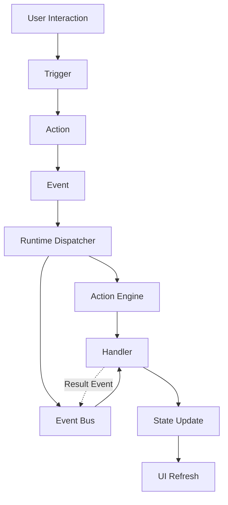
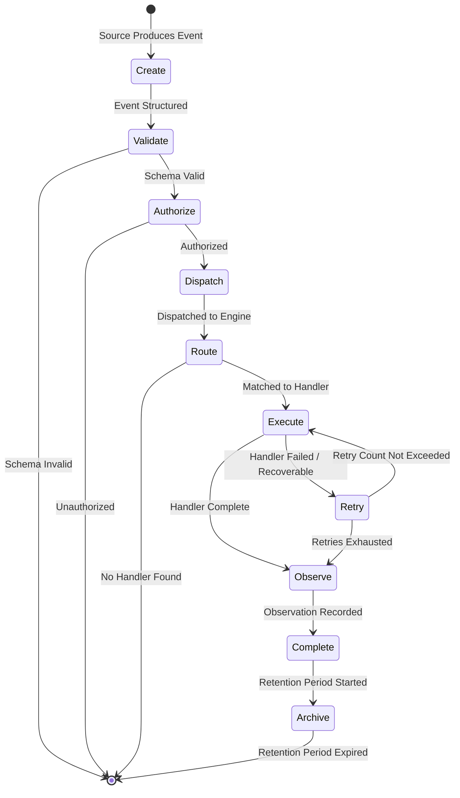
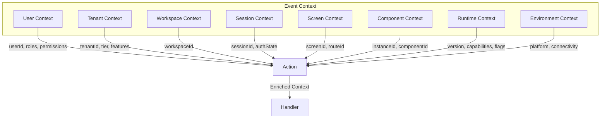
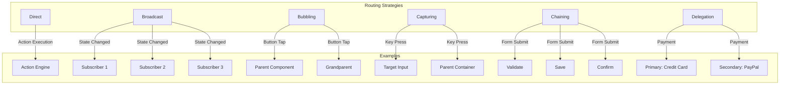
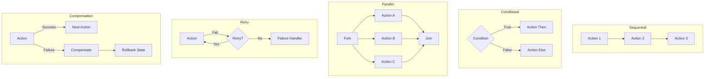
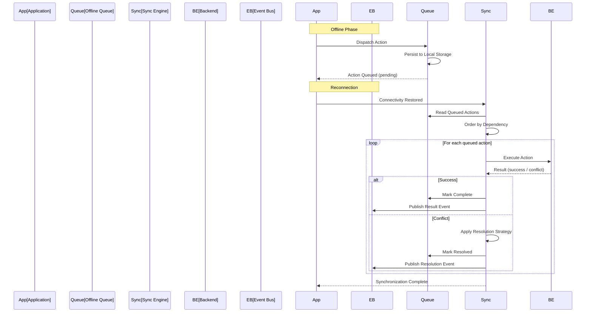
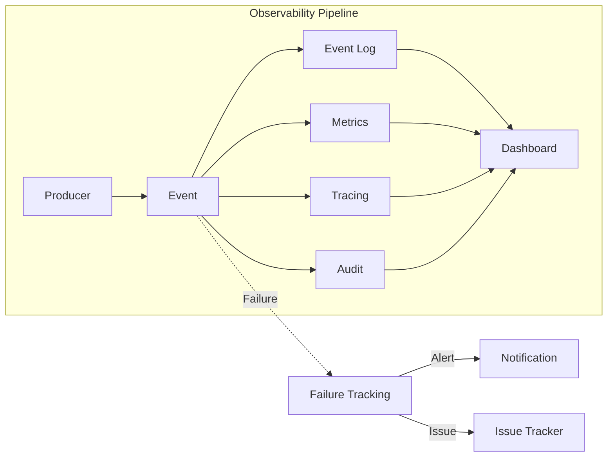

# Action & Event Model

**KB-047 — Action & Event Model Specification**

| Metadata | |
|----------|---|
| **KB ID** | KB-047 |
| **Title** | Action & Event Model |
| **Version** | 0.1.0 |
| **Status** | Draft |
| **Owner** | Architecture Team |
| **Dependencies** | KB-041 Application Architecture Overview, KB-044 Navigation Architecture, KB-045 Screen Model, KB-046 Component Tree Model, KB-048 State Model, KB-050 Capability Composition, KB-051 Runtime Architecture Overview |
| **Related Documents** | KB-015 Action Engine, KB-019 Event Bus, KB-025 Workflow Builder, KB-052 Runtime Rendering Engine, KB-057 Runtime Event & Action Pipeline |
| **Review Status** | Pending |
| **Last Updated** | 2026-07-11 |

### Revision History

| Version | Date | Author | Change |
|---------|------|--------|--------|
| 0.1.0 | 2026-07-11 | AI Architecture Agent | Initial draft |

---

## 1. Executive Summary

### 1.1 Purpose

This document defines the canonical Action & Event Model for the DUKADESK platform. It establishes how user interactions, system events, workflows, runtime events, and backend events are represented, routed, and processed across the entire platform.

Actions and Events are the two fundamental mechanisms of behaviour in DUKADESK. Actions are declarative commands that request an operation — navigate to a screen, update state, call an API. Events are structured notifications that something has occurred — a button was tapped, state changed, a capability was activated. Together they form the behavioural backbone of the platform.

The model is purely declarative and event-driven. Actions define what should happen. Events announce what has happened. Neither contains business logic, implementation code, or platform-specific behaviour.

### 1.2 Scope

This document covers:

- Canonical definitions of Action, Event, Trigger, Handler, and all supporting concepts
- The event architecture: user interaction through trigger, action, event, dispatch, handler, state update, and UI refresh
- Action types across all platform domains
- Event types across all platform domains
- Event sources and targets
- The event lifecycle from creation through archive
- Event context, payload, routing, and composition
- Relationships to Workflow, Navigation, Screen, Component Tree, State, and Capability models
- Responsibilities for Runtime, Builder, Backend, and Extensions
- Security, performance, offline, observability, failure scenarios, and anti-patterns

Out of scope:

- Action Engine subsystem implementation (handled by KB-015)
- Event Bus subsystem implementation (handled by KB-019)
- Specific action handler implementations (handled by capabilities)
- Workflow engine implementation (handled by KB-025)
- Platform-specific event delivery mechanisms

---

## 2. Event-Driven Principles

### Declarative

Actions and Events are data structures, not executable code. An Action is a structured declaration of an operation to perform. An Event is a structured notification that something has happened. Neither contains scripts, expressions, or imperative logic.

### Event-First Architecture

The platform is event-first. Every significant occurrence — user interaction, state change, system transition, external notification — produces an Event. Actions consume Events; Events result from Actions. Event-first design enables loose coupling, auditability, and extensibility.

### Loose Coupling

Producers and consumers are decoupled through Events. A Component that dispatches an Action does not know which Handler executes it. A publisher that emits an Event does not know which Subscribers receive it. Coupling is by type and schema, not by reference.

### Asynchronous by Default

Events are asynchronous by default. The producer publishes and continues; the consumer receives and processes. Synchronous processing is explicitly declared and exceptional. Asynchronicity enables scalability, resilience, and offline operation.

### Deterministic Execution

Given the same Action, Event, and State, the platform must produce the same result. Deterministic execution enables testing, replay, and audit. Non-determinism — random values, timing dependencies — is explicitly managed and documented.

### Idempotent Processing

Action Handlers and Event Handlers should be idempotent where possible. Processing the same Action or Event twice should produce the same outcome as processing it once. Idempotency enables safe retry, replay, and exactly-once processing guarantees.

### Observable

Every Action and Event is observable. Each has a unique identifier, timestamp, correlation chain, and lifecycle trace. Observability is a first-class architectural property, not an instrumentation afterthought.

### Extensible

New Action types and Event types can be added by Capabilities, Extensions, and Marketplace packages without modifying the core platform. Type registration, schema declaration, and handler registration are open to authorized publishers.

### Runtime Independent

The Action & Event Model makes no assumptions about any specific Runtime. Mobile, web, desktop, embedded, and server environments all use the same model. Platform-specific adaptations are handled by the Runtime's platform layer.

### Platform Neutral

The model is technology-agnostic. It does not prescribe messaging protocols, serialization formats, queue implementations, or transport mechanisms. Any compliant platform can implement the model using any suitable technology.

---

## 3. Canonical Definitions

### 3.1 Action

An Action is a declarative request to perform an operation. It is the "do something" of the platform. Actions are dispatched by Components, Screens, Workflows, system processes, and Extensions. They are executed by the Action Engine (KB-015).

```text
Action {
    id:              string            // Unique action identifier
    type:            ActionType        // Action classification
    trigger:         Trigger           // What caused this action
    params:          object            // Action parameters
    context:         ActionContext     // Execution context
    options:         ActionOptions     // Execution options (retry, timeout, priority)
    metadata:        object            // Correlation, tracing, audit metadata
}
```

### 3.2 Event

An Event is a structured notification that something has occurred. It is the "something happened" of the platform. Events are published by Components, Runtime subsystems, Backend services, and Extensions. They are routed by the Event Bus (KB-019).

```text
Event {
    id:              string            // Unique event identifier
    name:            string            // Fully qualified event name
    type:            EventType         // Event classification
    source:          string            // Source component or subsystem
    version:         string            // Event schema version
    timestamp:       datetime          // When the event occurred
    correlationId:   string            // Traces related events
    causationId:     string            // ID of the Action or Event that caused this
    tenantId:        string            // Tenant context
    capabilityId:    string            // Owning capability (if applicable)
    payload:         object            // Event data (schema-validated)
    metadata:        object            // Priority, security, routing metadata
}
```

### 3.3 Event Source

An Event Source is any entity that can produce an Event or dispatch an Action. Sources are registered with the platform and identified by a unique source identifier.

| Source Type | Examples |
|-------------|----------|
| **Component** | Button, TextField, ListItem, TabItem |
| **Screen** | Screen lifecycle events (mount, activate, deactivate) |
| **Navigation** | Route transitions, deep link resolution, tab switches |
| **Runtime** | Application lifecycle, capability activation, theme changes |
| **Backend** | API responses, webhook callbacks, server-sent events |
| **Extension** | Custom plugin events, third-party integrations |
| **Scheduler** | Timed events, cron triggers, delayed actions |
| **Device APIs** | Camera, geolocation, biometrics, QR scanner |
| **AI Services** | Prediction results, content generation, classification |

### 3.4 Event Target

An Event Target is any entity that can receive an Event or execute an Action. Targets are identified by type and registered with the appropriate dispatch mechanism.

| Target Type | Description |
|-------------|-------------|
| **Component** | Component instance receives event data or state updates |
| **Screen** | Screen receives lifecycle notifications or context changes |
| **Runtime** | Runtime subsystem receives control events (init, shutdown, sync) |
| **Backend** | Backend service receives API calls or webhook events |
| **State Engine** | State mutation actions target the State Registry |
| **Navigation Engine** | Navigation actions target the Navigation Engine |
| **Workflow Engine** | Workflow trigger actions target the Workflow Engine |
| **Integration Layer** | Integration actions target external systems |

### 3.5 Trigger

A Trigger is the condition or interaction that initiates an Action. Triggers are the bridge between "something happened" and "do something".

| Trigger Type | Description | Examples |
|-------------|-------------|----------|
| **User Interaction** | Direct user gesture or input | onPress, onChange, onSwipe, onSubmit |
| **System Event** | Runtime system occurrence | Application loaded, screen mounted, capability activated |
| **State Change** | State registry mutation | State key updated, value threshold crossed |
| **Scheduled** | Time-based execution | Timer expiry, cron schedule, delay completion |
| **Deep Link** | External URI resolution | QR scan, notification tap, universal link |
| **Workflow** | Workflow engine directive | Step completed, condition met, approval granted |
| **Backend** | Server-side event | Webhook received, push notification, sync response |

### 3.6 Handler

A Handler is the component or service that executes an Action or processes an Event. Handlers are registered with the Action Engine (for Actions) or Event Bus (for Events).

```text
Handler {
    type:            "action" | "event" | "both"
    target:          string            // Registered handler identifier
    actionTypes:     ActionType[]      // Action types this handler services
    eventTypes:      string[]          // Event types this handler subscribes to
    capability:      string            // Owning capability (if applicable)
    authorization:   Authorization      // Required permissions
    options:         HandlerOptions    // Timeout, retry, priority
}
```

### 3.7 Event Context

Event Context provides the execution environment for an Action or Event. It is populated by the Runtime at dispatch time.

```text
EventContext {
    user: {
        id:              string
        roles:           string[]
        permissions:     string[]
        locale:          string
    }
    tenant: {
        id:              string
        slug:            string
        tier:            string
        features:        string[]
    }
    workspace: {
        id:              string
        name:            string
    }
    session: {
        id:              string
        isAuthenticated: boolean
        started:         datetime
    }
    screen: {
        id:              string
        routeId:         string
        type:            string
    }
    component: {
        instanceId:      string
        componentId:     string
        treeDepth:       number
    }
    runtime: {
        version:         string
        capabilities:    string[]
        featureFlags:    object
        appState:        "foreground" | "background"
    }
    environment: {
        platform:        string
        connectivity:    "online" | "offline" | "metered"
        reducedMotion:   boolean
        colorScheme:     string
    }
}
```

### 3.8 Event Payload

The Event Payload carries the data associated with an Event or Action. Every payload conforms to a declared schema.

| Requirement | Description |
|-------------|-------------|
| **Schema** | Every event type declares a JSON Schema for its payload |
| **Validation** | Payloads are validated against schema at publish and receive |
| **Versioning** | Payload schema is versioned independently of event type |
| **Compatibility** | Schema evolution follows backward-compatible rules (add-only) |
| **Sensitivity** | Sensitive data fields are declared and handled per security policy |

### 3.9 Event Metadata

```text
EventMetadata {
    priority:        "low" | "normal" | "high" | "critical"
    security: {
        classification: "public" | "internal" | "confidential" | "restricted"
        requiresAuth:   boolean
        auditLevel:     "none" | "basic" | "detailed"
    }
    routing: {
        strategy:    "direct" | "broadcast" | "targeted"
        scope:       "local" | "workspace" | "application" | "cross-tenant"
        ttl:         number           // Time-to-live in milliseconds
    }
    tracing: {
        correlationId:  string
        causationId:    string
        sourceInstance: string
        traceDepth:     number
    }
}
```

### 3.10 Event Result

An Event Result is the outcome of processing an Action or delivering an Event.

```text
EventResult {
    status:          "success" | "failure" | "partial" | "deferred"
    actionId:        string            // Original Action ID
    handlerId:       string            // Handler that processed it
    result:          object            // Handler-specific result data
    error: {
        code:        string
        message:     string
        recoverable: boolean
    }
    duration:        number            // Processing time in milliseconds
    timestamp:       datetime
}
```

---

## 4. Event Architecture

```text
User Interaction
        │
        ▼
    Trigger
        │
        ▼
    Action ─────────► Event ─────────► Runtime Dispatcher
        │                                │
        │                          ┌─────┴─────┐
        │                          ▼           ▼
        │                    Action Engine   Event Bus
        │                          │           │
        └──────────────────────────┼───────────┘
                                   │
                                   ▼
                               Handler
                                   │
                                   ▼
                             State Update
                                   │
                                   ▼
                              UI Refresh
```



### 4.1 Flow Description

| Step | Description |
|------|-------------|
| **User Interaction** | User taps a button, submits a form, swipes a card |
| **Trigger** | The interaction matches a declared trigger condition |
| **Action** | The trigger produces a declarative Action with type and parameters |
| **Event** | The Action is wrapped in an Event for dispatch |
| **Runtime Dispatcher** | The dispatcher resolves the Action type and routes to the appropriate engine |
| **Action Engine** | For imperative Actions: validates, authorizes, resolves handler, executes |
| **Event Bus** | For broadcast Events: validates, routes, filters, delivers to subscribers |
| **Handler** | The registered handler executes the operation |
| **State Update** | The handler produces state changes through the State Registry |
| **UI Refresh** | State changes propagate to Components through bindings, triggering re-render |

---

## 5. Action Types

### 5.1 Navigation Actions

Actions that control application navigation and routing.

| Action | Description | Target |
|--------|-------------|--------|
| `navigate.openScreen` | Navigate to a route | Navigation Engine |
| `navigate.goBack` | Pop the navigation stack | Navigation Engine |
| `navigate.goBackToRoot` | Pop to root of current stack | Navigation Engine |
| `navigate.openModal` | Present a modal screen | Navigation Engine |
| `navigate.closeModal` | Dismiss current modal | Navigation Engine |
| `navigate.switchTab` | Switch to a tab | Navigation Engine |
| `navigate.deepLink` | Process a deep link URI | Navigation Engine |
| `navigate.switchWorkspace` | Switch to a workspace | Navigation Engine |
| `navigate.switchTenant` | Switch tenant context | Navigation Engine / Identity |

### 5.2 State Actions

Actions that read, write, or manipulate application state.

| Action | Description | Target |
|--------|-------------|--------|
| `state.setValue` | Set a single state value | State Registry |
| `state.mergeValues` | Merge an object into state | State Registry |
| `state.deleteKey` | Remove a state key | State Registry |
| `state.resetScope` | Reset all state in a scope | State Registry |
| `state.increment` | Increment a numeric value | State Registry |
| `state.toggle` | Toggle a boolean value | State Registry |
| `state.pushToArray` | Append to an array in state | State Registry |
| `state.removeFromArray` | Remove from an array in state | State Registry |

### 5.3 Data Actions

Actions that load, create, update, or delete data from data sources.

| Action | Description | Target |
|--------|-------------|--------|
| `data.load` | Load data from a data source | Data Layer |
| `data.refresh` | Refresh data from source | Data Layer |
| `data.create` | Create a new entity | Data Layer / Backend |
| `data.update` | Update an existing entity | Data Layer / Backend |
| `data.delete` | Delete an entity | Data Layer / Backend |
| `data.search` | Search entities | Data Layer / Backend |
| `data.filter` | Filter a data set | Data Layer |
| `data.sort` | Sort a data set | Data Layer |
| `data.export` | Export data to file | Data Layer |
| `data.import` | Import data from file | Data Layer |

### 5.4 Workflow Actions

Actions that control workflow execution.

| Action | Description | Target |
|--------|-------------|--------|
| `workflow.start` | Start a new workflow instance | Workflow Engine |
| `workflow.completeStep` | Complete current workflow step | Workflow Engine |
| `workflow.approve` | Approve a pending approval step | Workflow Engine |
| `workflow.reject` | Reject a pending approval step | Workflow Engine |
| `workflow.advance` | Advance to next step | Workflow Engine |
| `workflow.cancel` | Cancel a running workflow | Workflow Engine |
| `workflow.escalate` | Escalate a workflow for intervention | Workflow Engine |
| `workflow.retry` | Retry a failed workflow step | Workflow Engine |

### 5.5 UI Actions

Actions that control user interface behaviour without navigation.

| Action | Description | Target |
|--------|-------------|--------|
| `ui.showToast` | Display a toast notification | UI Layer |
| `ui.showDialog` | Display a dialog | UI Layer |
| `ui.showBottomSheet` | Display a bottom sheet | UI Layer |
| `ui.showTooltip` | Display a tooltip | UI Layer |
| `ui.showLoading` | Show loading indicator | UI Layer |
| `ui.hideLoading` | Hide loading indicator | UI Layer |
| `ui.setFocus` | Set focus to a component | UI Layer |
| `ui.scrollTo` | Scroll to a position or component | UI Layer |
| `ui.setKeyboard` | Show or hide keyboard | UI Layer |

### 5.6 Device Actions

Actions that interact with device hardware and APIs.

| Action | Description | Target |
|--------|-------------|--------|
| `device.capturePhoto` | Capture a photo with camera | Device API |
| `device.scanQR` | Scan a QR code | Device API |
| `device.getLocation` | Get current geolocation | Device API |
| `device.authenticateBiometric` | Authenticate with biometrics | Device API |
| `device.connectBluetooth` | Connect to a Bluetooth device | Device API |
| `device.readNFC` | Read an NFC tag | Device API |
| `device.vibrate` | Trigger haptic feedback | Device API |
| `device.setBrightness` | Set screen brightness | Device API |

### 5.7 Integration Actions

Actions that communicate with external systems.

| Action | Description | Target |
|--------|-------------|--------|
| `integration.apiCall` | Make an API call to external service | Integration Layer |
| `integration.sendEmail` | Send an email | Integration Layer |
| `integration.sendSMS` | Send an SMS | Integration Layer |
| `integration.sendPush` | Send a push notification | Integration Layer |
| `integration.sendMessage` | Send a chat message | Integration Layer |
| `integration.processPayment` | Process a payment transaction | Payment Gateway |
| `integration.webhook` | Trigger a webhook | Integration Layer |
| `integration.syncData` | Trigger data synchronization | Integration Layer |

### 5.8 Authentication Actions

Actions that manage authentication and identity.

| Action | Description | Target |
|--------|-------------|--------|
| `auth.login` | Authenticate user | Identity Service |
| `auth.logout` | End user session | Identity Service |
| `auth.signup` | Register new account | Identity Service |
| `auth.refreshSession` | Refresh session token | Identity Service |
| `auth.requestPasswordReset` | Request password reset email | Identity Service |
| `auth.resetPassword` | Reset password with token | Identity Service |
| `auth.verifyOTP` | Verify one-time passcode | Identity Service |

### 5.9 Notification Actions

Actions that manage notifications.

| Action | Description | Target |
|--------|-------------|--------|
| `notification.send` | Send a notification | Notification Service |
| `notification.markRead` | Mark notification as read | Notification Service |
| `notification.markAllRead` | Mark all notifications as read | Notification Service |
| `notification.subscribe` | Subscribe to a notification topic | Notification Service |
| `notification.unsubscribe` | Unsubscribe from a topic | Notification Service |
| `notification.updatePreferences` | Update notification preferences | Notification Service |

### 5.10 Custom Actions

Application-defined or Capability-defined Actions not covered by standard types. Custom Actions must be registered with the Action Registry with declared schema, handler, and authorization requirements.

---

## 6. Event Types

### 6.1 User Events

Events produced by user interaction with the application.

| Event | Description | Source |
|-------|-------------|--------|
| `user.input.changed` | User changed an input value | Input Component |
| `user.input.submitted` | User submitted a form | Form Component |
| `user.gesture.swipe` | User swiped | Component |
| `user.gesture.longPress` | User long-pressed | Component |
| `user.gesture.pullToRefresh` | User pulled to refresh | Scroll Component |
| `user.scrolled` | User scrolled content | Scroll Component |
| `user.focused` | User focused an element | Input Component |
| `user.blurred` | User left an element | Input Component |

### 6.2 Runtime Events

Events produced by the Runtime environment.

| Event | Description | Source |
|-------|-------------|--------|
| `runtime.application.started` | Application started | Runtime |
| `runtime.application.stopped` | Application stopped | Runtime |
| `runtime.initialized` | Runtime initialization complete | Runtime |
| `runtime.capability.loaded` | Capability activated | Runtime |
| `runtime.capability.unloaded` | Capability deactivated | Runtime |
| `runtime.manifest.updated` | Manifest refreshed | Manifest Resolver |
| `runtime.theme.changed` | Theme or mode changed | Theme Engine |
| `runtime.ready` | Runtime fully ready for interaction | Runtime |

### 6.3 System Events

Events produced by the platform operating environment.

| Event | Description | Source |
|-------|-------------|--------|
| `system.error.raised` | System error occurred | Any subsystem |
| `system.diagnostics.generated` | Diagnostic report generated | Diagnostics |
| `system.metrics.collected` | Metrics snapshot collected | Telemetry |
| `system.health.checkCompleted` | Health check run | Health Monitor |
| `system.cache.cleared` | Cache was cleared | Cache Manager |
| `system.memory.warning` | Low memory condition | Platform |
| `system.update.available` | Application update available | Update Manager |

### 6.4 Application Events

Events produced by the Application Definition and its capabilities.

| Event | Description | Source |
|-------|-------------|--------|
| `application.screen.viewed` | Screen was viewed | Screen |
| `application.screen.left` | Screen was left | Screen |
| `application.feature.used` | Feature was used | Capability |
| `application.workflow.started` | Workflow started | Workflow Engine |
| `application.workflow.completed` | Workflow completed | Workflow Engine |
| `application.search.executed` | Search was executed | Screen / Component |
| `application.document.viewed` | Document was viewed | Screen |

### 6.5 Lifecycle Events

Events produced by component, screen, and application lifecycle transitions.

| Event | Description | Source |
|-------|-------------|--------|
| `lifecycle.screen.initialized` | Screen definition loaded | Screen |
| `lifecycle.screen.mounted` | Screen entered viewport | Screen |
| `lifecycle.screen.activated` | Screen became interactive | Screen |
| `lifecycle.screen.deactivated` | Screen lost focus | Screen |
| `lifecycle.screen.unmounted` | Screen left viewport | Screen |
| `lifecycle.screen.disposed` | Screen destroyed | Screen |
| `lifecycle.component.mounted` | Component entered tree | Component |
| `lifecycle.component.updated` | Component re-rendered | Component |
| `lifecycle.component.unmounted` | Component removed from tree | Component |

### 6.6 Device Events

Events produced by device hardware or operating system.

| Event | Description | Source |
|-------|-------------|--------|
| `device.connectivity.changed` | Network connectivity changed | Device API |
| `device.orientation.changed` | Device orientation changed | Device API |
| `device.online` | Device came online | Device API |
| `device.offline` | Device went offline | Device API |
| `device.storage.low` | Device storage is low | Device API |
| `device.battery.low` | Battery is low | Device API |
| `device.keyboard.shown` | Keyboard appeared | Device API |
| `device.keyboard.hidden` | Keyboard disappeared | Device API |

### 6.7 Network Events

Events produced by network operations.

| Event | Description | Source |
|-------|-------------|--------|
| `network.request.started` | API request began | Network Layer |
| `network.request.completed` | API request completed | Network Layer |
| `network.request.failed` | API request failed | Network Layer |
| `network.request.retried` | API request was retried | Network Layer |
| `network.response.cached` | Response was cached | Cache Manager |
| `network.response.stale` | Cached response is stale | Cache Manager |
| `network.offline.queue.flushed` | Offline queue synchronized | Sync Engine |

### 6.8 Synchronization Events

Events produced by the synchronization and offline engine.

| Event | Description | Source |
|-------|-------------|--------|
| `sync.started` | Synchronization cycle began | Sync Engine |
| `sync.completed` | Synchronization completed | Sync Engine |
| `sync.failed` | Synchronization failed | Sync Engine |
| `sync.conflict.detected` | Data conflict found | Sync Engine |
| `sync.conflict.resolved` | Data conflict resolved | Sync Engine |
| `sync.queue.drained` | Offline queue fully processed | Sync Engine |
| `sync.state.restored` | Offline state restored on startup | Sync Engine |

### 6.9 Security Events

Events produced by security and authorization systems.

| Event | Description | Source |
|-------|-------------|--------|
| `security.auth.login.success` | Login succeeded | Identity Service |
| `security.auth.login.failed` | Login failed | Identity Service |
| `security.auth.logout` | User logged out | Identity Service |
| `security.auth.session.expired` | Session expired | Identity Service |
| `security.auth.session.refreshed` | Session was refreshed | Identity Service |
| `security.permission.denied` | Permission check failed | Permission Engine |
| `security.action.blocked` | Action blocked by guard | Action Engine |
| `security.tenant.switched` | Tenant context changed | Tenant Manager |

### 6.10 Extension Events

Events produced by extensions, plugins, and third-party integrations.

| Event | Description | Source |
|-------|-------------|--------|
| `extension.registered` | Extension registered | Extension System |
| `extension.activated` | Extension activated | Extension System |
| `extension.deactivated` | Extension deactivated | Extension System |
| `extension.event.custom` | Custom extension event | Extension |
| `extension.integration.triggered` | Integration triggered | Extension |
| `extension.workflow.custom` | Custom workflow event | Extension |

---

## 7. Event Lifecycle



### 7.1 Stage Descriptions

| Stage | Description |
|-------|-------------|
| **Create** | Event is created by a source. Required fields are populated. Unique ID and timestamp are assigned. Correlation and causation IDs are established. |
| **Validate** | Event structure is validated against the Event Registry schema. Required fields are checked. Payload is validated against its declared schema. Malformed events are rejected. |
| **Authorize** | Authorization rules are evaluated. The source is checked for permission to produce the event. The event's security classification is enforced. Unauthorized events are blocked. |
| **Dispatch** | The event is dispatched to the appropriate engine. Actions go to the Action Engine. Notifications go to the Event Bus. The dispatch strategy (direct, broadcast, targeted) is selected. |
| **Route** | The event is routed to registered handlers. The Action Engine resolves the handler by action type. The Event Bus matches subscribers by event type, filters, and conditions. |
| **Execute** | The handler processes the event. For Actions: the Action Engine executes the handler with retry and rollback support. For Events: subscribers receive the event in delivery order. |
| **Retry** | If execution fails and the error is recoverable, retry with configurable backoff. Retry policies are declared per action type or subscriber. Exhausted retries produce a failure. |
| **Observe** | The event outcome is recorded. Metrics are captured (duration, success/failure). Tracing data is finalized. Diagnostics are logged. Audit events are produced for sensitive operations. |
| **Complete** | The event lifecycle completes. Results are returned to the caller (for Actions) or delivered to all subscribers (for Events). Completion events may be published for downstream consumers. |
| **Archive** | The event record is stored for retention. Retention policies determine duration. Archived events are available for replay, audit, and analytics until the retention period expires. |

---

## 8. Event Context

The Event Context provides the execution environment for every Action and Event. It is populated by the Runtime at dispatch time and is immutable during processing.



---

## 9. Event Payload

### 9.1 Structure Requirements

```text
EventPayload {
    // Payload must conform to the declared schema for its event type
    // Schemas are defined in JSON Schema and registered with the Event Registry

    schema: {
        type:        "object"
        properties:  object           // Declared fields with types
        required:    string[]         // Required field names
        additional:  boolean          // Allow additional properties
    }

    // Payload versioning
    version:        string            // Payload schema version

    // Validation rules
    validation: {
        schema:      object           // JSON Schema definition
        rules:       ValidationRule[] // Custom validation rules
    }
}
```

### 9.2 Metadata Requirements

Every Event Payload must include:

| Field | Description |
|-------|-------------|
| `id` | Unique event identifier (UUID) |
| `name` | Fully qualified event type name |
| `version` | Payload schema version |
| `timestamp` | ISO 8601 timestamp of event creation |
| `source` | Source entity identifier |
| `correlationId` | ID linking related events in a chain |
| `causationId` | ID of the Action or Event that caused this event |

### 9.3 Versioning

- Payload schemas are versioned independently of event types
- Schema evolution follows additive-only rules for backward compatibility
- New fields may be added; existing fields must not be removed or changed in type
- Breaking changes require a new event type name (e.g., `order.created.v2`)
- Consumers should ignore unknown fields and fail on missing required fields

### 9.4 Validation

- Payloads are validated against their declared schema at creation time
- Invalid payloads are rejected before dispatch
- Schema validation errors include the field path, expected type, and received value
- Async validation is supported for server-side schema enforcement

### 9.5 Compatibility

- Backward compatible: consumer running schema v1 can process payload v1
- Forward compatible: consumer running schema v1 can process payload v2 (ignores unknown fields)
- Breaking changes require event type rename or version bump in the event name

---

## 10. Event Routing

### 10.1 Direct Routing

Events are routed directly to a specific handler identified by the event metadata. Used for Actions and targeted notifications.

```text
Routing Strategy: "direct"
Characteristics:
  - Single handler receives the event
  - Handler is identified by action type or subscription
  - No fan-out or broadcast
  - Lowest latency
  - Used for: Action execution, command patterns
```

### 10.2 Broadcast

Events are delivered to all registered subscribers for the event type.

```text
Routing Strategy: "broadcast"
Characteristics:
  - All subscribers receive the event
  - Subscribers are independent and unaware of each other
  - Fan-out is managed by the Event Bus
  - Used for: System events, state change notifications, lifecycle events
```

### 10.3 Bubbling

Events propagate upward through the Component Tree from child to parent.

```text
Routing Strategy: "bubbling"
Characteristics:
  - Event starts at the source component
  - Propagates to parent, then grandparent, up to the Screen root
  - Any ancestor may handle or stop propagation
  - Used for: Component events that need parent context
```

### 10.4 Capturing

Events propagate downward through the Component Tree from root to target.

```text
Routing Strategy: "capturing"
Characteristics:
  - Event starts at the Screen root
  - Propagates down through Containers to the target Component
  - Any ancestor may intercept or handle before the target
  - Used for: Global gestures, keyboard events, focus management
```

### 10.5 Chaining

Events trigger a sequence of actions or events in a defined order.

```text
Routing Strategy: "chaining"
Characteristics:
  - Action produces a result that triggers the next action
  - Chain is defined declaratively (not imperative)
  - Each step may have its own authorization and error handling
  - Used for: Multi-step operations, workflows, form submissions
```

### 10.6 Delegation

Events are delegated from one handler to another based on conditions.

```text
Routing Strategy: "delegation"
Characteristics:
  - Primary handler may delegate to a secondary handler
  - Delegation conditions are declared declaratively
  - Fallback handlers are specified for error cases
  - Used for: Permission-based routing, capability fallback, A/B testing
```



---

## 11. Action Composition

### 11.1 Sequential Actions

Actions execute one after another in a defined order. Each action receives the result of the previous action as input.

```text
SequentialComposition {
    type:            "sequential"
    steps:           Action[]
    stopOnError:     boolean          // Stop chain on first failure
    errorHandler:    Action           // Error recovery action
    context:         "shared"         // Steps share execution context
}
```

### 11.2 Conditional Actions

Actions execute only if a condition evaluates to true.

```text
ConditionalAction {
    type:            "conditional"
    condition:       Expression       // State expression
    then:            Action           // Execute if true
    else:            Action           // Execute if false (optional)
    reevaluate:      boolean          // Re-evaluate on state change
}
```

### 11.3 Parallel Actions

Multiple actions execute concurrently. All actions must complete before the composition resolves.

```text
ParallelComposition {
    type:            "parallel"
    actions:         Action[]
    waitFor:         "all" | "any" | "n"
    failBehavior:    "failAll" | "continueOnError"
    maxConcurrent:   number           // Limit concurrency
}
```

### 11.4 Retry Policies

```text
RetryPolicy {
    maxRetries:      number           // Maximum retry attempts
    backoff:         "fixed" | "linear" | "exponential" | "custom"
    baseDelay:       number           // Base delay in milliseconds
    maxDelay:        number           // Maximum delay
    retryOn:         number[]         // HTTP status codes or error codes to retry on
    jitter:          boolean          // Add randomization to delay
    timeout:         number           // Per-attempt timeout
}
```

### 11.5 Compensation Actions

Actions that undo or compensate for a previously executed action. Used for rollback and transaction-like semantics.

```text
CompensationAction {
    type:            "compensation"
    action:          Action           // The action being compensated
    compensateWith:  Action           // The compensating action
    condition:       Expression       // When compensation should trigger
    order:           "reverse" | "forward" // Compensation execution order
}
```



---

## 12. Workflow Relationship

Workflows (KB-025) are composed sequences of Actions with conditional branching, parallel execution, approvals, and human tasks. The Workflow Builder produces workflow definitions that the Workflow Engine executes.

| Action & Event Model | Workflow Builder |
|----------------------|------------------|
| Defines Action types and composition primitives | Composes Actions into workflow sequences |
| Provides Action handlers | References handlers by Action type |
| Defines Event schema for workflow events | Produces Events at workflow lifecycle transitions |
| Supports retry and compensation | Declares retry and compensation policies per step |
| Authorization at Action level | Authorization at step and role level |

Workflow Actions (Section 5.4) are the bridge between the Action & Event Model and the Workflow Engine. Starting a workflow, completing a step, approving a task — all are Actions that flow through the Action Engine.

---

## 13. Navigation Relationship

Navigation (KB-044) is driven by Navigation Actions (Section 5.1). Components dispatch navigation Actions; the Action Engine routes them to the Navigation Engine.

| Action & Event Model | Navigation Architecture |
|----------------------|------------------------|
| Navigation Actions are first-class types | Routes are resolved by Navigation Engine |
| Navigation events are published on route change | Navigation lifecycle produces events |
| Context includes route and screen identifiers | Navigation state is part of Event Context |
| Deep links are processed as Actions | Deep link resolution is a Navigation concern |
| Navigation guards integrate with Action authorization | Guard pipeline evaluates before route resolution |

---

## 14. Screen Relationship

Screens (KB-045) are primary event sources and consumers. Screens produce lifecycle Events and consume state-change Events. Screens bind Component Events to Actions.

| Action & Event Model | Screen Model |
|----------------------|--------------|
| Screen lifecycle produces Events | Screen lifecycle stages are defined |
| Screens bind Component events to Actions | Component Tree declares Event Bindings |
| Screen-level Actions are declared in lifecycle hooks | Lifecycle hooks reference Action IDs |
| Screen state boundaries determine Event scope | Local, Shared, Global boundary model |

---

## 15. Component Relationship

Components (KB-046) are the primary source of User Events. Components dispatch Actions through Event Bindings declared in the Component Tree.

| Action & Event Model | Component Tree Model |
|----------------------|---------------------|
| Components produce Events on user interaction | Component Tree declares Event Bindings |
| Components receive state updates through Event consumption | State Bindings connect Components to State Registry |
| Component lifecycle produces Events | Component lifecycle stages are defined |
| Action results flow back to Components through state | State changes trigger Component re-render |

---

## 16. State Relationship

Actions are the sole mechanism for mutating application state. Events announce state changes. The State Registry (KB-048) is the authoritative source for all application state.

| Action & Event Model | State Model |
|----------------------|-------------|
| State Actions (Section 5.2) mutate state | State Registry maintains authoritative state |
| State change Events (Section 6.4) announce mutations | State lifecycle includes change notifications |
| Event Context includes state scope | Local, Shared, Global boundaries |
| Action authorization checks state permissions | State access is governed by permission rules |
| State-driven conditional Actions use state expressions | State selectors provide reactive observation |

---

## 17. Capability Relationship

Capabilities (KB-050) register Action types, Event types, and their handlers. Capabilities own the Actions and Events that implement their business logic.

| Action & Event Model | Capability Composition |
|----------------------|----------------------|
| Capabilities register Action types | Capability declares its action handlers |
| Capabilities register Event types | Capability declares event schemas |
| Capability activation enables its Actions | Inactive capability Actions are unavailable |
| Capability-scoped Events carry capabilityId | Event routing can filter by capability |
| Custom Actions extend platform per capability | Custom types registered in Action Registry |

---

## 18. Runtime Responsibilities

| Responsibility | Description |
|----------------|-------------|
| **Action Dispatch** | Accept Action requests, validate, authorize, resolve handler, execute |
| **Event Publication** | Accept Event publications, validate, route, deliver to subscribers |
| **Context Injection** | Populate Event Context with user, tenant, session, screen, component, runtime, environment |
| **Authorization** | Evaluate permissions before Action execution and Event delivery |
| **Queue Management** | Manage Action queues for deferred, scheduled, and background execution |
| **Retry & Recovery** | Execute retry policies, manage dead letter queues, handle compensation |
| **Idempotency** | Track processed Action IDs to prevent duplicate execution |
| **Observability** | Emit Action and Event lifecycle events for tracing, metrics, and audit |
| **Offline Support** | Queue Actions when offline, flush on reconnection |

---

## 19. Builder Responsibilities

| Responsibility | Description |
|----------------|-------------|
| **Action Binding Editor** | Provide UI for binding Component events to Actions with parameter configuration |
| **Event Listener Configuration** | Allow event-driven behaviour configuration (subscribe to events, trigger actions) |
| **Action Composition Designer** | Provide visual design for sequential, conditional, parallel, and retry action chains |
| **Action Tester** | Simulate Action execution with test context and inspect results |
| **Event Simulator** | Publish test Events and verify subscriber execution |
| **Schema Viewer** | Display Action and Event schemas for Builder reference |
| **Validation Feedback** | Validate Action bindings, parameter types, and authorization requirements |

---

## 20. Backend Responsibilities

| Responsibility | Description |
|----------------|-------------|
| **Action Handlers** | Register server-side action handlers for data, integration, and authentication actions |
| **Event Publishing** | Publish events for backend-originated occurrences (data changes, webhooks, schedule) |
| **Event Subscription** | Subscribe to events that require server-side processing (sync, audit, notification) |
| **Schema Registry** | Maintain the authoritative registry of Action and Event schemas |
| **Authorization Data** | Provide permission data for Action and Event authorization |
| **Audit Logging** | Record all sensitive Actions and Events with full context |
| **Webhook Delivery** | Deliver events to external systems through configured webhooks |

---

## 21. Extension Responsibilities

| Responsibility | Description |
|----------------|-------------|
| **Action Registration** | Register custom Action types with the Action Registry |
| **Event Registration** | Register custom Event types with the Event Registry |
| **Handler Registration** | Register handlers for custom and standard Action/Event types |
| **Schema Declaration** | Declare schemas for all custom Action parameters and Event payloads |
| **Authorization Declaration** | Declare permission requirements for custom Actions and Events |
| **Lifecycle Management** | Register and unregister Action/Event types on extension activation/deactivation |

---

## 22. Security

### 22.1 Event Authorization

| Rule | Enforcement |
|------|-------------|
| Action dispatch requires action-level permissions | Action Engine evaluates authorization before execution |
| Event publication requires source authorization | Event Bus validates publisher identity and permissions |
| Event subscription requires scope authorization | Subscriber must hold permissions for the event scope |
| Cross-tenant events are blocked | Tenant context must match publisher and subscriber tenants |
| Sensitive events require elevated permissions | Security classification determines authorization level |

### 22.2 Trust Boundaries

```text
Trust Boundaries:
  - Component → Runtime: Trusted (same process)
  - Capability → Runtime: Trusted (certified)
  - Extension → Runtime: Trusted (certified, sandboxed)
  - Backend → Runtime: Trusted (authenticated channel)
  - External → Backend: Untrusted (validated, authenticated)
  - External → Runtime: Blocked (must go through Backend)
```

### 22.3 Validation

| Check | Scope |
|-------|-------|
| Action ID exists in Action Registry | Action validation |
| Event type exists in Event Registry | Event validation |
| Parameters match declared schema | Action validation |
| Payload matches declared schema | Event validation |
| Source is authorized to produce event | Event validation |
| Handler is authorized to consume event | Event authorization |

### 22.4 Replay Protection

| Mechanism | Description |
|-----------|-------------|
| Unique Action/Event ID | ID is checked against processed set before execution |
| Timestamp validation | Events outside acceptable time window are rejected |
| Idempotency key | Consumer-provided key ensures exactly-once processing |
| Nonce for sensitive actions | One-time use token for critical operations |

### 22.5 Sensitive Payload Handling

| Rule | Enforcement |
|------|-------------|
| Sensitive fields declared in schema | Schema marks fields as `sensitive: true` |
| Sensitive fields stripped from logs | Logging system redacts sensitive values |
| Sensitive fields excluded from history | Navigation history strips sensitive parameters |
| Sensitive payloads require encryption | Payload is encrypted at the Event Bus boundary |
| Sensitive Action results are ephemeral | Results are not persisted in event archives |

---

## 23. Performance

### 23.1 Dispatch Latency

| Target | Bound |
|--------|-------|
| Action dispatch to handler | < 10ms (local), < 100ms (network) |
| Event publish to first subscriber | < 5ms (local), < 50ms (network) |
| Event routing and filtering | < 2ms |
| Action authorization check | < 5ms |
| Queue enqueue/dequeue | < 1ms |

### 23.2 Queue Management

| Aspect | Architecture |
|--------|-------------|
| **Structure** | Priority queue per tenant with configurable concurrency |
| **Prioritization** | Critical > High > Normal > Low. Priority is declared in Action/Event metadata. |
| **Fairness** | Round-robin across tenants prevents starvation |
| **Back-pressure** | Queue capacity limits trigger back-pressure to producers |
| **Overflow** | Queue overflow triggers dead letter storage with alert |

### 23.3 Event Prioritization

| Priority | Max Latency | Queue | Typical Use |
|----------|-------------|-------|-------------|
| Critical | 100ms | Dedicated, high-throughput | Authentication, payments |
| High | 500ms | Priority queue | Navigation, state mutations |
| Normal | 2s | Standard queue | Data operations, UI updates |
| Low | 10s | Background queue | Analytics, logging, sync |

### 23.4 Scalability

| Strategy | Description |
|----------|-------------|
| **Horizontal scaling** | Action Engine and Event Bus scale horizontally by tenant partition |
| **Partitioning** | Tenant ID determines partition for affinity and isolation |
| **Batching** | Events destined for the same handler are batched for efficiency |
| **Async offload** | Non-critical processing is offloaded to background queues |
| **Cache resolution** | Action and Event type resolution is cached and pre-warmed |

### 23.5 Back-Pressure

When a consumer or queue is overloaded:

1. Consumer signals back-pressure to the dispatcher
2. Dispatcher reduces delivery rate to that consumer
3. Events are queued with increasing delay
4. If queue reaches capacity, new events are rejected with `retry-after` header
5. Producers respect back-pressure signals and implement retry with backoff

---

## 24. Offline Behaviour

### 24.1 Local Queues

When the device is offline:

1. Actions are queued in a local persistent queue
2. Events are queued for delivery when connectivity returns
3. Each queued item carries its full context (user, tenant, session)
4. Queue is persisted to local storage for crash survival

### 24.2 Retry

| Scenario | Behaviour |
|----------|-----------|
| Action queued offline | Delivered on reconnection in FIFO order |
| Action fails on retry | Retry policy executed; exhausted retries go to dead letter queue |
| Event delivery fails | Subscriber receives failed delivery notification |
| Multiple offline sessions | Queue is preserved across application restarts |

### 24.3 Conflict Handling

| Conflict Type | Resolution Strategy |
|---------------|-------------------|
| State version mismatch | Last-writer-wins (default) or merge (declared) |
| Duplicate Action ID | Idempotency check — duplicate is silently ignored |
| Ordering dependency | Actions with declared dependencies wait for prerequisite |
| Tenant mismatch | Cross-tenant items are rejected with error |

### 24.4 Synchronization



---

## 25. Observability

### 25.1 Event Logs

Every Action and Event is logged with:

- Unique event ID
- Event name / Action type
- Source identifier
- Timestamp (created, dispatched, completed)
- Correlation ID and causation ID
- Handler identifier
- Processing duration
- Status (success, failure, pending)
- Error details (if applicable)
- User ID (anonymized where required)

### 25.2 Correlation IDs

- Every Action/Event chain shares a correlation ID
- The correlation ID is propagated through the entire processing pipeline
- Downstream events inherit the correlation ID from their causation event
- Correlation IDs enable end-to-end tracing across subsystems

### 25.3 Tracing

| Trace Point | Data |
|-------------|------|
| Action creation | Action type, params, source, timestamp |
| Action dispatch | Handler resolution, authorization result, queue time |
| Action execution | Handler execution start, end, duration |
| Action result | Status, output, error details |
| Event publication | Event name, payload size, timestamp |
| Event routing | Matched subscribers, filter evaluation |
| Event delivery | Delivery confirmation, subscriber duration |
| Event completion | Total delivery time, subscriber count |

### 25.4 Metrics

| Metric | Description |
|--------|-------------|
| Action dispatch rate | Actions dispatched per second |
| Action execution duration | Time from dispatch to completion |
| Action success rate | Percentage of successful executions |
| Event publication rate | Events published per second |
| Event delivery latency | Time from publish to subscriber delivery |
| Subscriber count per event type | Active subscribers registered |
| Queue depth | Current items in each priority queue |
| Queue wait time | Average time items wait in queue |
| Retry count | Number of retries per action type |
| Dead letter queue size | Unprocessable items |

### 25.5 Audit Events

Sensitive Actions and Events produce audit records:

- Authentication events (login, logout, password change)
- Authorization failures
- Data mutation events (create, update, delete)
- Financial events (payment, refund)
- Configuration changes
- Permission changes
- Tenant context changes

### 25.6 Failure Tracking



---

## 26. Failure Scenarios

| Scenario | Behaviour |
|----------|-----------|
| **Invalid Action** | Action fails schema validation. Error returned to caller. Not dispatched. |
| **Missing Handler** | No handler registered for Action type. Dispatch fails with `HANDLER_NOT_FOUND`. |
| **Authorization Failure** | Action blocked by permission check. Error returned with `ACCESS_DENIED`. Event not delivered. |
| **Circular Event Chain** | Event A triggers Event B which triggers Event A. Detection system breaks the cycle after threshold. Error logged. |
| **Timeout** | Handler exceeds declared timeout. Action moves to failed state. Retry policy evaluated. |
| **Duplicate Event** | Event with duplicate ID detected. Idempotency check suppresses processing. Logged as duplicate. |
| **Queue Overflow** | Queue capacity exceeded. New items rejected with `QUEUE_FULL`. Producer notified with back-pressure signal. |
| **Workflow Interruption** | Workflow paused or cancelled mid-step. Compensation actions executed for completed steps. State restored to safe checkpoint. |
| **Event Schema Mismatch** | Publisher sends payload that does not match subscriber's expected schema. Event delivered with compatibility warning. Fallback schema applied. |
| **Network Failure** | Action requiring network connectivity fails. If offline, queued for retry. If online, retry policy executed. |
| **Correlation Chain Broken** | Lost correlation ID due to subsystem boundary crossing. New correlation ID generated with parent reference. |
| **Dead Letter Overflow** | Dead letter queue exceeds threshold. Alert triggered. Automatic replay attempted after backoff. |

---

## 27. Anti-Patterns

### Business Logic Embedded in Events

Events are structured notifications — they must not contain business logic, calculations, or decision trees. Business logic belongs in Action Handlers, Capabilities, and Backend services.

### Circular Event Dependencies

Event A triggers Action B which produces Event C which triggers Action A. Circular dependencies create infinite loops and must be detected and broken by the platform. Maximum event chain depth is a configurable safeguard.

### Hidden Side Effects

Actions and Events must declare all side effects. An Action that mutates state, calls an API, and sends a notification should declare all three effects. Hidden side effects break auditability and testability.

### Platform-Specific Actions

Actions must not assume a specific platform's capabilities. A navigation Action triggers the Navigation Engine, which handles platform-specific routing. An Action must never reference platform APIs directly.

### Mutable Event Definitions

Event schemas and Action definitions are immutable once published. Versioning provides evolution. In-place mutation breaks subscribers and consumers.

### Synchronous Dependency Chains

Actions should not be synchronized across unrelated domains. A form submission Action should not wait for a notification Action to complete unless explicitly composed as a sequential workflow. Unnecessary synchronization reduces throughput and resilience.

### Overly Broad Events

Events should carry the minimum payload required for consumers. Publishing entire entities when consumers need only a status change creates unnecessary data transfer and coupling.

### Ignoring Failures

Actions that silently fail — catch all errors without logging, retrying, or compensating — produce unreliable applications. Every failure path must be declared and handled.

### Event Proliferation

Every distinct occurrence does not need a unique event type. Too many event types create subscription complexity and schema management overhead. Events should be meaningful to consumers, not exhaustive of every internal transition.

### Bypassing the Action Engine

Direct state mutation, direct navigation calls, or direct API calls from Components bypass authorization, observability, and offline support. All behaviour must flow through the Action Engine.

---

## 28. Future Evolution

### 28.1 Distributed Event Bus

Cross-Runtime event delivery for multi-device sessions, companion devices, and federated deployments. Events published on one Runtime instance are delivered to subscribers on other Runtime instances.

### 28.2 AI-Generated Workflows

AI-assisted generation of Action compositions from natural language descriptions. The AI produces workflow definitions that conform to the Action Composition schema and can be reviewed and published through the Builder.

### 28.3 Cross-Runtime Events

Events that span multiple Runtime environments — a mobile app and a web app participating in the same event flow. Cross-runtime events require backend mediation, conflict resolution, and delivery guarantees.

### 28.4 Event Replay

Full event replay capability for debugging, testing, and recovery. Events are stored with full context and can be replayed into a development or production environment to reproduce scenarios.

### 28.5 Event Sourcing Compatibility

The Action & Event Model is compatible with event sourcing architectures. Events represent facts that have occurred. The event store serves as the authoritative record of application state.

### 28.6 Federated Applications

Applications composed from independently deployed services that communicate through events. The Action & Event Model provides the contract for federated event-driven communication.

---

## 29. Cross References

| KB-ID | Title | Relationship |
|-------|-------|--------------|
| KB-015 | Action Engine | Implements Action dispatch, registration, resolution, execution, retry, and rollback for the Action & Event Model. |
| KB-019 | Event Bus | Implements Event publication, subscription, routing, filtering, and delivery for the Action & Event Model. |
| KB-025 | Workflow Builder | Composes Actions into workflows with sequential, parallel, conditional, and approval steps. |
| KB-041 | Application Architecture Overview | Actions and Events are core elements of the Application Model. Actions define behaviour; Events define communication. |
| KB-044 | Navigation Architecture | Navigation Actions control routing. Navigation lifecycle produces Events. |
| KB-045 | Screen Model | Screens bind Component Events to Actions. Screen lifecycle produces Events. |
| KB-046 | Component Tree Model | Components dispatch Actions through Event Bindings. Component events are the primary user interaction source. |
| KB-048 | State Model | State Actions mutate state. State changes produce Events. State is the foundation for Event Context. |
| KB-050 | Capability Composition | Capabilities register Action types, Event types, and their handlers. Capability activation determines availability. |
| KB-051 | Runtime Architecture Overview | The Action Engine and Event Bus are core Runtime subsystems. The Runtime provides Event Context. |
| KB-052 | Runtime Rendering Engine | The Renderer consumes state change Events to trigger UI refreshes. |
| KB-057 | Runtime Event & Action Pipeline | Defines the detailed pipeline for Action dispatch and Event processing within the Runtime. |

---

*This is KB-047, the Action & Event Model specification of the DUKADESK Engineering Knowledge Base. It defines the canonical behaviour and communication architecture for all DUKADESK applications across all platforms.*
