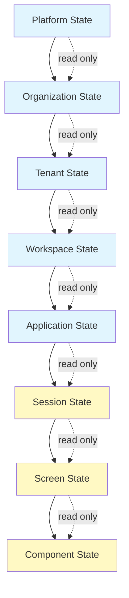
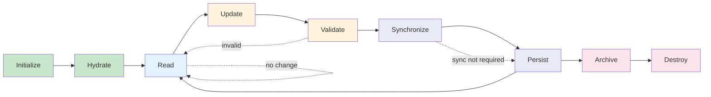
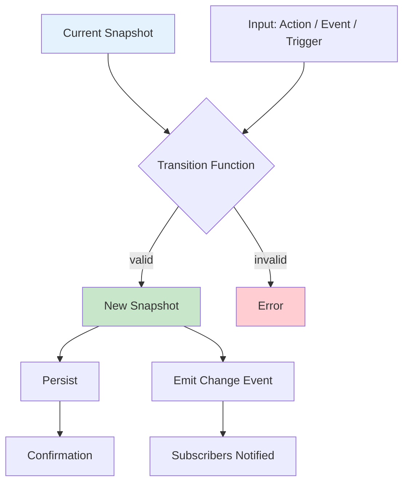
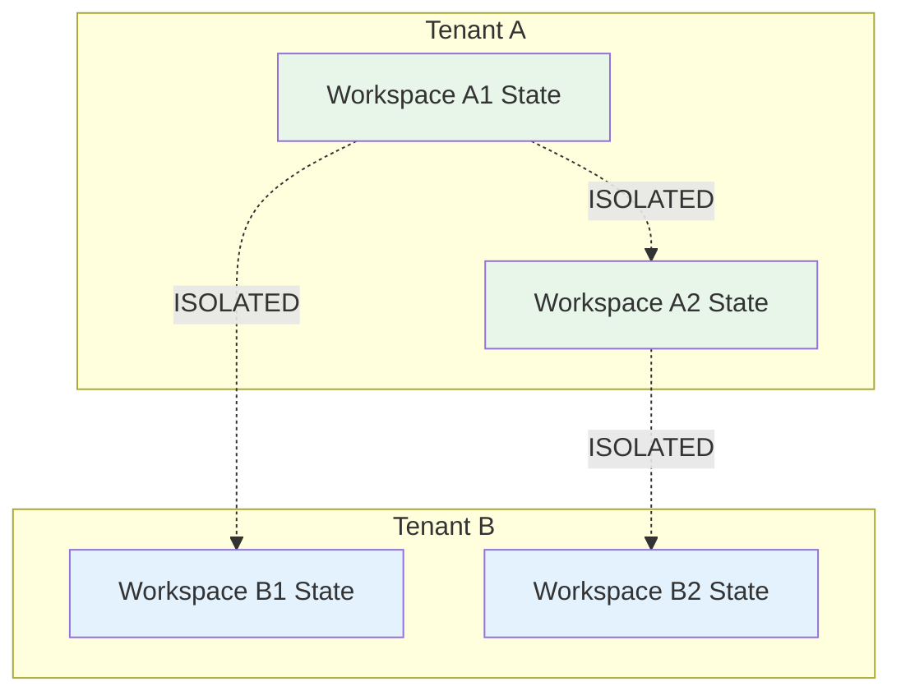
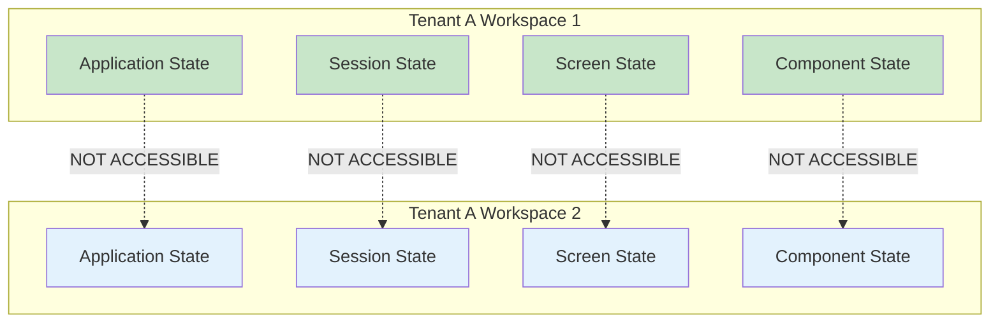
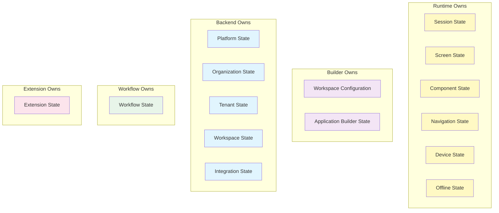
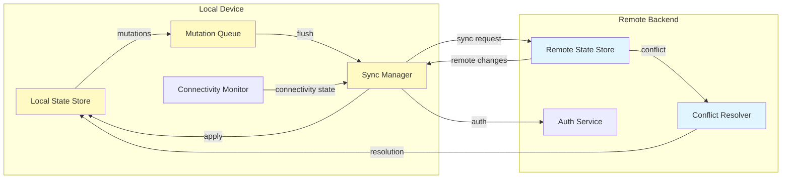
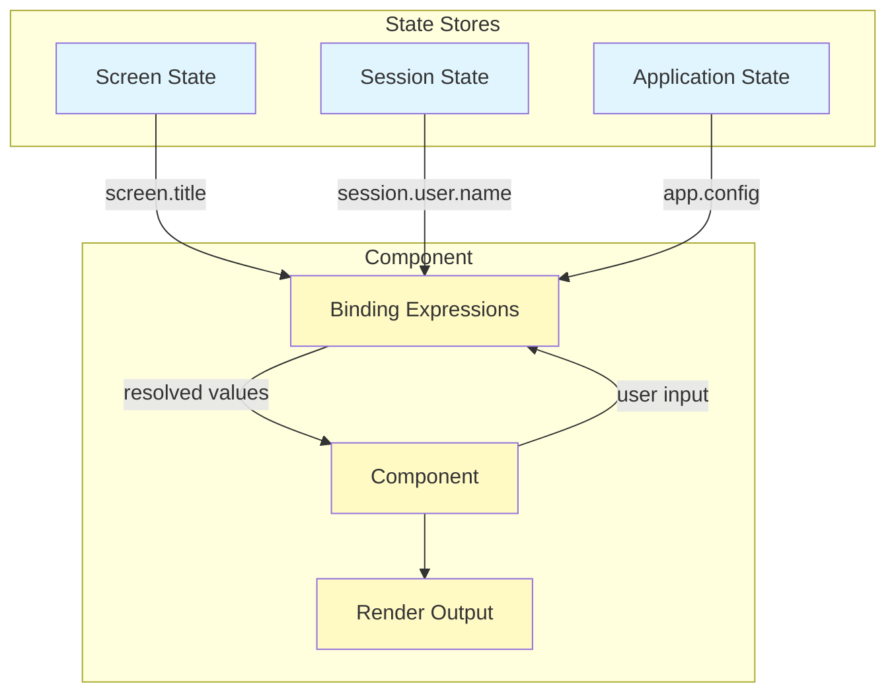

# Application State Model

**KB-048 — Application State Model Specification**

| Metadata | |
|----------|---|
| **KB ID** | KB-048 |
| **Title** | Application State Model |
| **Version** | 0.1.0 |
| **Status** | Draft |
| **Owner** | Architecture Team |
| **Dependencies** | KB-041 Application Architecture Overview, KB-044 Navigation Architecture, KB-045 Screen Model, KB-046 Component Tree Model, KB-047 Action & Event Model, KB-049 Theme Model, KB-050 Capability Composition, KB-051 Runtime Architecture Overview, KB-020 Offline & Synchronization |
| **Related Documents** | KB-018 State Management, KB-019 Event Bus, KB-015 Action Engine, KB-052 Runtime Rendering Engine, KB-056 Runtime State Management, KB-058 Runtime Caching & Synchronization |
| **Review Status** | Pending |
| **Last Updated** | 2026-07-11 |

### Revision History

| Version | Date | Author | Change |
|---------|------|--------|--------|
| 0.1.0 | 2026-07-11 | AI Architecture Agent | Initial draft |

---

## 1. Executive Summary

### 1.1 Purpose

This document defines the canonical Application State Model for the DUKADESK platform. It establishes how state exists, is scoped, changes, persists, synchronizes, and is consumed across the entire platform — the Runtime Engine, Mobile Runtime, Web Runtime, Desktop Runtime, Builder Studio, Preview Runtime, Backend Platform, Offline Engine, Workflow Engine, AI Services, and Marketplace Extensions.

State is the foundation of every interactive application. Every user action, every data fetch, every screen transition, every component render depends on state. Without a canonical state model, each subsystem would define its own state semantics, producing inconsistent behavior, data duplication, synchronization conflicts, and architectural drift.

The Application State Model standardizes state across all subsystems. It defines state scopes, transitions, boundaries, ownership, persistence, synchronization, security, and observability. It is the authoritative contract that every platform component must obey when reading, writing, or managing state.

### 1.2 Scope

This document covers:

- Canonical state definitions, terminology, and conceptual model
- The state hierarchy from Platform through Component
- All recognized state categories and their architectural contracts
- The state lifecycle: Initialize, Hydrate, Read, Update, Validate, Synchronize, Persist, Archive, Destroy
- State transitions: how state changes in response to Actions, Events, Runtime, Synchronization, and Background Processes
- State boundaries and architectural isolation between organizations, tenants, workspaces, applications, sessions, and components
- State ownership: which subsystem owns which state
- State persistence models: volatile, persistent, cached, snapshot, recovery, offline
- Synchronization architecture: local-to-remote, remote-to-local, background sync, incremental sync, full sync, delta sync
- State bindings to Components, Screens, Actions, Events, and Workflows
- Responsibilities across Runtime, Builder, and Backend
- Security: tenant isolation, encryption, sensitive state handling, secret separation, access boundaries
- Performance: state size, memory management, lazy hydration, incremental updates, efficient re-rendering
- Observability: state changes, transition logs, synchronization metrics, conflict metrics, recovery metrics, audit events
- Failure scenarios and anti-patterns

Out of scope:

- Offline queue implementation details (handled by KB-020)
- Rendering engine optimization (handled by KB-052)
- Action execution pipeline (handled by KB-047)
- Event bus architecture (handled by KB-019)
- Component Registry implementation (handled by KB-012)
- Platform-specific persistence APIs
- Implementation technology choices

---

## 2. Architectural Principles

### 2.1 Single Source of Truth

Every piece of state has exactly one authoritative source. No duplicate state exists across scopes. Derived state is computed from its source, never independently stored. The canonical location of a state value is determined by its scope — the narrowest scope that encompasses all consumers.

### 2.2 Predictable State

State changes follow deterministic rules. Given the same initial state and the same transition, the resulting state is always identical. Predictable state enables reliable testing, reproducible bug reports, and consistent user experiences across all Runtimes.

### 2.3 Immutable State Transitions

State is never mutated in place. Every state change produces a new state snapshot. The previous snapshot remains unchanged and may be retained for history, undo, recovery, or audit purposes. Immutable transitions eliminate side effects, enable time-travel debugging, and simplify synchronization conflict resolution.

### 2.4 Declarative Bindings

State bindings are declared, not imperative. Components declare what state they consume through binding expressions. The Runtime resolves bindings reactively — when source state changes, all dependent expressions re-evaluate automatically. Declarative bindings decouple component logic from state management logic.

### 2.5 Scoped State

Every state value belongs to exactly one scope. Scopes form a hierarchy from Platform to Component. State flows downward through the hierarchy (parent scopes feed child scopes) but never upward or sideways. Scoped state prevents unintended coupling, enforces encapsulation, and enables independent testing of each scope level.

### 2.6 Event-Driven Updates

State changes are propagated through events, not direct references. When state changes, the owning scope emits a state change event. Subscribers react to the event, not to the state directly. Event-driven updates decouple state producers from state consumers and enable cross-system observability.

### 2.7 Offline First

All application features must work without network connectivity. Local state is the primary state. Remote state is a synchronization target. Every mutation is written locally first. Synchronization is asynchronous, configurable, and transparent to the user.

### 2.8 Synchronization Aware

Every state value declares its synchronization policy. Some state is local-only (device preferences, input drafts). Some state synchronizes eagerly (orders, user profiles). Some state synchronizes on a schedule (reference data, cached assets). Synchronization awareness is part of the state definition, not an external concern.

### 2.9 Observable

All state changes are observable. Every read, write, transition, synchronization event, and error produces a structured event that can be consumed by observability tooling, audit systems, and diagnostic interfaces. State observability is a first-class architectural concern.

### 2.10 Runtime Independent

The state model is defined independently of any Runtime implementation. Mobile, web, and desktop Runtimes all implement the same state model with platform-specific persistence and rendering. No state definition references platform APIs, storage technologies, or rendering frameworks.

---

## 3. Canonical State Definitions

### State

A value that represents a condition, property, or data element within the DUKADESK platform at a point in time. State is identified by its scope and key, has a version, and transitions through a defined lifecycle.

### State Store

The subsystem responsible for holding, managing, and providing access to state within a given scope. Each scope level has its own State Store. Stores manage read access, write access, lifecycle hooks, and event emission for their scoped state.

### State Scope

The boundary within which a state value is visible and accessible. Every state value belongs to exactly one scope. Scopes are hierarchical — a parent scope's state is readable (but not writable) by its child scopes.

### State Context

The ambient information that qualifies a state value — the current tenant, workspace, application, session, and user identity. State Context is automatically attached to every state access and transition for audit and isolation purposes.

### State Snapshot

An immutable record of state values at a specific point in time. Snapshots are produced by state transitions. They may be retained for undo, replay, time-travel debugging, conflict resolution, and audit history.

### State Transition

A deterministic function that takes a current State Snapshot and an input (Action, Event, or Trigger) and produces a new State Snapshot. Transitions are pure functions — they have no side effects, no external dependencies, and no mutable state.

### State Mutation

The act of writing a new state value within a scope. A Mutation produces a State Transition, which produces a new State Snapshot. The previous snapshot is retained until the retention policy dictates its disposal.

### Derived State

State that is computed from one or more source state values. Derived state is never stored independently — it is re-computed whenever its dependencies change. Examples: filtered lists, aggregated counts, computed visibility flags.

### Persistent State

State that survives application restart, device reboot, and extended offline periods. Persistent state is written to durable local storage and optionally synchronized to remote storage.

### Ephemeral State

State that exists only during a session or scope lifetime and is discarded when the scope is destroyed. Examples: scroll position, form input state (before submission), animation state, transient UI state.

---

## 4. State Hierarchy

```
Platform
    ↓
Organization
    ↓
Tenant
    ↓
Workspace
    ↓
Application
    ↓
Session
    ↓
Screen
    ↓
Component
```

### 4.1 Hierarchy Rules

1. **Top-down flow.** State flows from higher scopes to lower scopes. A lower scope reads parent state through scoped references but never mutates it directly.
2. **Bottom-up events.** Lower scopes emit state change events that propagate upward through the event bus. Higher scopes observe but do not directly respond to child state.
3. **Scope containment.** Each scope fully contains its child scopes. Destroying a parent scope destroys all child scopes and their state.
4. **Read inheritance.** Child scopes inherit read access to all parent state. The parent does not inherit read access to child state.
5. **Write isolation.** Writes at one scope level are invisible to sibling scopes. A Screen cannot write to another Screen's state. A Session cannot write to another Session's state.

### 4.2 State Hierarchy Diagram



---

## 5. State Categories

### 5.1 Platform State

State that is global to the entire DUKADESK platform instance. Platform State includes system configuration, global feature flags, license information, platform version, global defaults, and root capability registry.

| Property | Description |
|----------|-------------|
| **Scope** | Platform |
| **Persistence** | Persistent |
| **Synchronization** | Platform-managed |
| **Ownership** | Backend Platform |
| **Access** | Read-only to all lower scopes |
| **Lifecycle** | Created at platform deployment, destroyed at platform decommission |

### 5.2 Organization State

State that belongs to an Organization (a corporate entity operating a DUKADESK deployment). Organization State includes organization profile, branding defaults, global policies, subscription tier, organization-level feature flags, and organization-wide defaults.

| Property | Description |
|----------|-------------|
| **Scope** | Organization |
| **Persistence** | Persistent |
| **Synchronization** | Backend-triggered sync |
| **Ownership** | Backend Platform |
| **Access** | Read-only to tenants and lower scopes within the organization |
| **Lifecycle** | Created with organization, destroyed with organization |

### 5.3 Tenant State

State that belongs to a Tenant (an isolated unit within an Organization). Tenant State includes tenant configuration, tenant branding, tenant policies, tenant user directory, tenant subscription, and tenant-specific settings.

| Property | Description |
|----------|-------------|
| **Scope** | Tenant |
| **Persistence** | Persistent |
| **Synchronization** | Backend-managed with tenant isolation |
| **Ownership** | Backend Platform |
| **Access** | Read-only to workspaces and lower scopes within the tenant |
| **Lifecycle** | Created with tenant, destroyed with tenant |

### 5.4 Workspace State

State that belongs to a Workspace (a project or environment within a Tenant). Workspace State includes workspace metadata, workspace configuration, workspace-specific capabilities, member lists, publication state, and environment settings.

| Property | Description |
|----------|-------------|
| **Scope** | Workspace |
| **Persistence** | Persistent |
| **Synchronization** | Real-time sync |
| **Ownership** | Backend Platform / Builder |
| **Access** | Read-only to applications and lower scopes within the workspace |
| **Lifecycle** | Created with workspace, destroyed with workspace |

### 5.5 Application State

State that belongs to an Application (a DUKADESK application instance within a Workspace). Application State includes application configuration, active capabilities, installed extensions, application-level preferences, and application lifecycle status.

| Property | Description |
|----------|-------------|
| **Scope** | Application |
| **Persistence** | Persistent |
| **Synchronization** | Real-time sync |
| **Ownership** | Runtime |
| **Access** | Read-only to sessions and lower scopes within the application |
| **Lifecycle** | Created on application install/activation, destroyed on application uninstall/deactivation |

### 5.6 Session State

State that belongs to a user Session (a single user's active use of an Application). Session State includes authentication token, session preferences, navigation history, active screen stack, session-scoped form data, and transient session data.

| Property | Description |
|----------|-------------|
| **Scope** | Session |
| **Persistence** | Ephemeral (may be persisted for session resume) |
| **Synchronization** | Not synchronized |
| **Ownership** | Runtime |
| **Access** | Read-only to screens and lower scopes within the session |
| **Lifecycle** | Created on session start, destroyed on session end |

### 5.7 Navigation State

State that determines the current navigation position within an Application. Navigation State includes the current route, route parameters, navigation stack, active screen ID, modal/popover state, deep link target, and navigation history.

| Property | Description |
|----------|-------------|
| **Scope** | Session |
| **Persistence** | Ephemeral (persisted for session resume with expiration) |
| **Synchronization** | Not synchronized |
| **Ownership** | Navigation Engine (Runtime) |
| **Access** | Read-only to screens and lower scopes |
| **Lifecycle** | Updated on every navigation action, cleared on session end |

### 5.8 Screen State

State that belongs to a Screen (a single view within an Application). Screen State includes screen-level data, screen title and metadata, screen-level loading and error states, screen-scoped form data, screen-scoped preferences, and screen visibility state.

| Property | Description |
|----------|-------------|
| **Scope** | Screen |
| **Persistence** | Ephemeral (may be cached for screen revisit) |
| **Synchronization** | Not synchronized |
| **Ownership** | Runtime |
| **Access** | Read-only to components within the screen |
| **Lifecycle** | Created on screen entry, destroyed on screen exit |

### 5.9 Component State

State that belongs to a Component (a single UI element within a Screen). Component State includes component value, component-local UI state (focus, hover, selection), component validation state, component loading state, and component configuration overrides.

| Property | Description |
|----------|-------------|
| **Scope** | Component |
| **Persistence** | Ephemeral |
| **Synchronization** | Not synchronized |
| **Ownership** | Runtime |
| **Access** | Component only |
| **Lifecycle** | Created on component mount, destroyed on component unmount |

### 5.10 Workflow State

State that tracks the progress and data of a Workflow execution. Workflow State includes current workflow step, workflow input/output data, workflow progress, workflow decisions, workflow errors, and workflow expiration.

| Property | Description |
|----------|-------------|
| **Scope** | Workspace (shared) |
| **Persistence** | Persistent |
| **Synchronization** | Real-time sync |
| **Ownership** | Workflow Engine |
| **Access** | Read-only to authorized consumers |
| **Lifecycle** | Created on workflow start, destroyed on workflow completion or cancellation |

### 5.11 Device State

State that belongs to the local device. Device State includes device capabilities, screen size, input methods, network connectivity, battery level, locale, timezone, installed fonts, and hardware capabilities.

| Property | Description |
|----------|-------------|
| **Scope** | Platform (local) |
| **Persistence** | Ephemeral |
| **Synchronization** | Not synchronized |
| **Ownership** | Runtime |
| **Access** | Read-only to all scopes |
| **Lifecycle** | Created on Runtime start, updated on change, destroyed on Runtime stop |

### 5.12 Offline State

State that tracks offline operation status. Offline State includes connectivity status, pending mutation queue, last sync timestamp, sync progress, conflict queue, and recovery status.

| Property | Description |
|----------|-------------|
| **Scope** | Platform (local) |
| **Persistence** | Persistent |
| **Synchronization** | Internal (sync subsystem) |
| **Ownership** | Offline Engine |
| **Access** | Runtime only |
| **Lifecycle** | Created on Runtime start, persisted across restarts |

### 5.13 Integration State

State that belongs to an Integration (an external system connected to DUKADESK). Integration State includes authentication tokens, connection status, cached external data, webhook registration, and integration configuration.

| Property | Description |
|----------|-------------|
| **Scope** | Workspace |
| **Persistence** | Persistent |
| **Synchronization** | Asynchronous (integration-specific) |
| **Ownership** | Backend Platform / Integration Service |
| **Access** | Integration-specific authorization |
| **Lifecycle** | Created on integration install, destroyed on integration removal |

### 5.14 Extension State

State that belongs to a Marketplace Extension. Extension State includes extension configuration, extension-scoped data, extension preferences, extension feature flags, and extension lifecycle state.

| Property | Description |
|----------|-------------|
| **Scope** | Application |
| **Persistence** | Persistent |
| **Synchronization** | Real-time sync |
| **Ownership** | Extension Runtime |
| **Access** | Extension only (isolated) |
| **Lifecycle** | Created on extension activation, destroyed on extension deactivation |

---

## 6. State Lifecycle

```
Initialize
    ↓
Hydrate
    ↓
Read
    ↓
Update
    ↓
Validate
    ↓
Synchronize
    ↓
Persist
    ↓
Archive
    ↓
Destroy
```

### 6.1 State Lifecycle Diagram



### 6.2 Initialize

The State Store for a given scope is created. Initialization allocates storage, establishes scope context, registers with the parent scope, and prepares lifecycle hooks. At this stage the store contains no application state — only the scope container itself.

**Responsibilities:**
- Allocate state storage for the scope
- Register with parent scope for read inheritance
- Configure retention policies
- Register lifecycle event handlers
- Set initial scope context (tenant, workspace, application, session IDs)

### 6.3 Hydrate

State values are loaded into the Store from persistence. Hydration reads persistent state from local storage, applies any pending synchronization mutations, and validates the loaded state. Failed hydration triggers recovery procedures.

**Responsibilities:**
- Load persistent state from local storage
- Apply pending mutation queue (if any)
- Validate loaded state integrity
- Report hydration success or failure
- Emit hydration complete event

**Hydration Strategy:**

| Strategy | Description | When Used |
|----------|-------------|-----------|
| Eager | All state loaded at scope creation | Small state, critical paths |
| Lazy | State loaded on first access | Large state, non-critical paths |
| Progressive | High-priority state first, rest in background | Medium-to-large state |
| On-Demand | State loaded only when explicitly requested | Ephemeral or optional state |

### 6.4 Read

State is accessed by consumers within the scope or by child scopes through read inheritance. Reads are synchronous and return the current snapshot. Multiple concurrent reads do not block each other. Reads are observable — every read access is logged for audit if configured.

**Read Rules:**
- A scope reads its own state directly
- A child scope reads parent state through scoped references (e.g., `parent.application.config`)
- No scope reads sibling state
- No scope reads child state
- Reads never trigger side effects

### 6.5 Update

A consumer requests a state change. The update is validated, a transition function is applied to produce a new snapshot, and the new snapshot replaces the current state. The previous snapshot is retained according to the retention policy.

**Update Rules:**
- Updates are atomic within a scope
- Updates produce immutable snapshots
- Updates are validated before application
- Failed updates return the error without changing state
- Updates emit state change events

### 6.6 Validate

Every state transition is validated before it is committed. Validation verifies schema conformance, scope boundary compliance, data type correctness, constraint satisfaction, and security policy adherence. Invalid transitions are rejected with a descriptive error.

**Validation Levels:**

| Level | Checks | Action on Failure |
|-------|--------|-------------------|
| Schema | Type, format, required fields | Reject transition |
| Scope | Cross-boundary write, access level | Reject transition |
| Constraint | Business rules, invariants | Reject transition |
| Security | Authorization, tenant isolation | Reject transition, log security event |

### 6.7 Synchronize

If the updated state has a synchronization policy, the change is queued for synchronization. Synchronization is asynchronous and non-blocking. The local state is updated immediately; the remote state is updated according to the sync policy.

See Section 10 for detailed synchronization architecture.

### 6.8 Persist

State is written to durable local storage. Persistence is transactional — either all state for a scope is persisted or none is. Failed persistence triggers recovery procedures and alerts the observability system.

**Persistence Rules:**
- Persistence is asynchronous (does not block the update)
- Persistence order is preserved per scope
- Scope state is persisted atomically
- Persistence failures are retried with configurable backoff
- Permanent persistence failures escalate to recovery

### 6.9 Archive

State that is no longer actively used but must be retained for compliance, audit, or history purposes is moved to archival storage. Archived state is not loaded on normal hydration — it is retrieved on demand.

**Archive Triggers:**
- Scope destruction (workspace deleted, application uninstalled)
- Retention policy expiration of active state
- Manual archive request (compliance hold)
- Storage pressure threshold exceeded

### 6.10 Destroy

The State Store and all its state values are permanently removed. Destruction is irreversible. Before destruction, any pending synchronization is finalized, archive is performed if required, and destruction is logged.

**Destruction Sequence:**
1. Flush pending synchronization queue
2. Archive state if retention policy requires
3. Emit scope destruction event
4. Release storage resources
5. Unregister from parent scope
6. Log destruction event

---

## 7. State Transitions

State transitions are the mechanism by which state changes. Every transition is a pure function that takes the current State Snapshot and an input, and produces a new State Snapshot.

### 7.1 State Transition Flow Diagram



### 7.2 Triggered by Actions

Actions (defined in KB-047) are the primary mechanism for user-initiated state changes. When a user interacts with a Component, the Component emits an event that triggers an Action. The Action execution pipeline produces a payload that is passed to the State Store as a transition input.

| Action Type | State Effect | Example |
|-------------|-------------|---------|
| Data Action | Updates application data | Submit form → update screen state |
| Navigation Action | Updates navigation state | Navigate → update route stack |
| Configuration Action | Updates preferences | Change theme → update session preferences |
| Workflow Action | Updates workflow state | Approve step → advance workflow |

### 7.3 Triggered by Events

Events (propagated through the Event Bus, KB-019) can trigger state transitions without direct user interaction. Events are typically generated by system processes, background services, or remote synchronization.

| Event Source | State Effect | Example |
|-------------|-------------|---------|
| Backend push | Updates application data | New message received → update inbox state |
| Sync completion | Updates offline state | Sync complete → clear pending queue |
| Workflow completion | Updates application state | Workflow done → enable next step |
| Timer/Interval | Updates ephemeral state | Session timeout → clear session |
| Capability activation | Updates capability state | Extension enabled → register routes |

### 7.4 Triggered by Runtime

The Runtime itself initiates state transitions during lifecycle management, error recovery, and system operations.

| Runtime Trigger | State Effect | Example |
|----------------|-------------|---------|
| App start | Initializes session state | Hydrate session from local storage |
| App suspend | Persists ephemeral state | Save form drafts before background |
| App resume | Restores session state | Reload screen stack from cache |
| Screen navigation | Creates/destroys screen state | Push screen → initialize screen store |
| Component mount/unmount | Creates/destroys component state | Mount input → create component store |
| Error boundary | Resets component state | Catch render error → reset to defaults |

### 7.5 Triggered by Synchronization

Remote state changes received during synchronization trigger local state transitions. These transitions follow the same validation and immutability rules as local transitions.

| Sync Trigger | State Effect | Example |
|-------------|-------------|---------|
| Remote update received | Updates local state | Server sends order status → update local order state |
| Conflict resolution | Updates local/remote state | Merge strategy applied → update both stores |
| Full sync | Replaces local state for synced keys | Initial sync → overwrite local with server |
| Delta sync | Applies incremental changes | Patch update → apply changes only |

### 7.6 Triggered by Background Processes

Background processes — maintenance jobs, data cleanup, analytics, AI services — may trigger state transitions that are not directly tied to user actions or events.

| Background Process | State Effect | Example |
|--------------------|-------------|---------|
| Data retention job | Archives or destroys old state | Archive screens older than 90 days |
| Analytics aggregation | Updates derived state | Compute dashboard metrics |
| AI inference | Updates predicted state | Predict next workflow step |
| Cache eviction | Destroys cached state | Clear image cache on storage pressure |

---

## 8. State Boundaries

State boundaries enforce architectural isolation between scopes. Boundaries prevent unintended state coupling, enforce tenant isolation, and ensure that state changes in one scope do not affect unrelated scopes.

### 8.1 Tenant Isolation Boundary

State is strictly isolated between tenants. No tenant can read or write another tenant's state under any circumstances. Tenant isolation is enforced at the State Store level — each tenant operates within its own state namespace.

**Enforcement:**
- State storage is partitioned by tenant ID
- State access checks enforce tenant match
- Synchronization channels use tenant-scoped credentials
- State export/import is tenant-scoped



### 8.2 Organization Boundary

Organization state is isolated from other organizations. Tenants within the same organization share read access to organization state but cannot modify it. A tenant cannot read another tenant's state even within the same organization.

### 8.3 Workspace Boundary

Workspace state is isolated from other workspaces within the same tenant. Workspace-to-workspace state sharing is not permitted by default. Explicit cross-workspace references (e.g., shared reference data) must be declared in the Manifest and authorized by tenant policy.

### 8.4 Application Boundary

Application state is isolated from other applications within the same workspace. Inter-application communication is achieved through the Event Bus, not through shared state. Applications do not read each other's state.

### 8.5 Session Boundary

Session state is isolated to a single user session. Different sessions for the same user in the same application do not share session state. Session-scoped state is never visible to other sessions.

### 8.6 Component Boundary

Component state is isolated to a single component instance. Sibling components within the same screen do not share component state. Parent components can read child state only through declared binding contracts, not through direct state access.

### 8.7 State Boundary Diagram



---

## 9. State Ownership

Every state value has exactly one owner. The owner is responsible for the state's lifecycle, integrity, synchronization policy, and access control.

### 9.1 State Ownership Diagram



### 9.2 Runtime Ownership

The Runtime owns all session-scoped and lower state: Session State, Navigation State, Screen State, Component State, Device State, and Offline State. The Runtime creates these stores when sessions start and destroys them when sessions end.

**Responsibilities:**
- Create and destroy session-level state stores
- Manage screen and component state lifecycles
- Enforce scope boundaries for child state
- Propagate parent state to child scopes through binding resolution
- Emit state change events for observable state

### 9.3 Builder Ownership

The Builder owns workspace configuration state and application builder state — the state of the application being composed, drafts, unsaved changes, and builder preferences.

**Responsibilities:**
- Manage application composition state (tree, properties, bindings)
- Manage builder UI state (panels, selections, history)
- Provide preview state to the Preview Runtime
- Support undo/redo through snapshot history

### 9.4 Backend Ownership

The Backend owns all platform, organization, tenant, and workspace state. The Backend is the authoritative source for cross-session, cross-device, and cross-user state.

**Responsibilities:**
- Authoritative persistence for all backend-owned state
- Tenant isolation enforcement
- Synchronization server
- Conflict resolution authority (server-wins policies)
- State archival and compliance

### 9.5 Extension Ownership

Extensions own their own extension-scoped state. Extension state is isolated from other extensions and from application state. Extensions access their state through the Extension API.

**Responsibilities:**
- Manage extension configuration and data
- Declare extension state synchronization policy
- Respect application and workspace scope boundaries

### 9.6 Workflow Ownership

The Workflow Engine owns workflow execution state. Workflow state is shared across the duration of a workflow instance and is accessible to all steps within that workflow.

**Responsibilities:**
- Track workflow progress and step data
- Persist workflow state for recovery
- Expose workflow state to authorized consumers
- Clean up completed or cancelled workflows

---

## 10. State Persistence

### 10.1 Persistence Types

| Type | Description | Lifetime | Example |
|------|-------------|----------|---------|
| Volatile | In-memory only, no storage | Session | Active route stack, scroll position |
| Persistent | Written to durable local storage | Indefinite | User preferences, app configuration |
| Cached | Local copy of remote data, evictable | Configurable TTL | Reference data, lookup tables |
| Snapshot | Frozen point-in-time record | Configurable retention | Undo history, audit trail |
| Recovery | Redundant copy for crash recovery | Until next successful sync | Pending mutation queue |
| Offline | Local authoritative copy for offline use | Until resolved | Offline mutation queue |

### 10.2 Persistence Rules

1. **Volatile first.** State defaults to volatile. Persistence is opt-in and explicitly declared.
2. **Declared persistence.** Every persistent state value declares its persistence strategy, retention policy, and eviction rules.
3. **Transactional writes.** Persistence operations are atomic per scope. Partial writes are not permitted.
4. **Write-through.** State is written to the active snapshot first, then to persistent storage asynchronously.
5. **Integrity checks.** Persisted state includes version identifiers and checksums for integrity verification on hydration.

### 10.3 Local Persistence

Local persistence writes state to the device's durable storage. The local persistence layer is the foundation of offline operation — it is the authoritative local store, not a cache.

**Characteristics:**
- Encrypted at rest
- Transactional (all-or-nothing per scope)
- Quota-managed (per application, per tenant)
- Integrity-verified on read
- Backward-compatible schema migration

### 10.4 Queueing

Mutations that require synchronization are queued in order. The mutation queue preserves operation order, enables replay, and supports conflict detection.

| Queue Property | Description |
|----------------|-------------|
| **Ordering** | FIFO within scope |
| **Deduplication** | Consecutive updates to same key may be collapsed |
| **Persistence** | Queue is persisted for crash recovery |
| **Priority** | Critical mutations bypass queue (immediate sync) |
| **Expiration** | Queue entries expire after configurable TTL |

### 10.5 Conflict Detection

Conflicts occur when the same state value is modified in multiple places (local and remote, or two remote instances) before synchronization completes.

**Detection Strategy:**
- Each state value carries a version counter (monotonic, per scope)
- Local mutations increment the local version
- Remote mutations increment the remote version
- On sync, versions are compared
- If local version > remote version for the same key, a conflict is detected

### 10.6 Conflict Resolution

Conflicts are resolved according to a declared policy per state value. Resolution policies are part of the state definition.

| Policy | Behavior | When to Use |
|--------|----------|-------------|
| Server Wins | Remote value overrides local | Reference data, global config |
| Client Wins | Local value overrides remote | User drafts, personal preferences |
| Timestamp Wins | Most recent timestamp wins | General purpose, when clock sync is reliable |
| Merge | Fields are merged at granularity | Collaborative data, form data |
| Manual | User is prompted to choose | Critical business data, approval decisions |

### 10.7 Merge Strategies

| Strategy | Description | Example |
|----------|-------------|---------|
| Field-level merge | Non-conflicting fields from both versions are preserved | Two users edit different form fields |
| Array merge | Arrays are unioned or concatenated | Tag lists, participant lists |
| Last-write-wins per field | Each field independently takes the latest value | Profile updates |
| Custom merge | User-defined merge function per state key | Shopping cart line items |
| CRDT merge | Conflict-free replicated data type merge | Collaborative editing, counters |

### 10.8 Recovery

Recovery procedures handle state corruption, failed persistence, synchronization failures, and crash recovery.

**Recovery Actions:**

| Scenario | Detection | Recovery Action |
|----------|-----------|-----------------|
| Corrupted state on hydration | Checksum mismatch | Restore from last valid snapshot, alert observability |
| Persistence write failure | Write operation returns error | Retry with backoff, escalate to recovery manager |
| Synchronization failure | Sync operation returns error | Retry, escalate to conflict resolver if conflict detected |
| Crash during sync | Incomplete sync on restart | Replay mutation queue from last checkpoint |
| Version mismatch | State version incompatible with schema | Run schema migration, or roll back to last compatible version |

---

## 11. Synchronization

Synchronization is the process of reconciling local state with remote (Backend) state. Synchronization is governed by the Offline & Synchronization subsystem (KB-020) and configured per state value.

### 11.1 Synchronization Architecture Diagram



### 11.2 Local → Remote

Mutations made locally are pushed to the remote state store. This is the primary synchronization direction for user-initiated state changes.

**Flow:**
1. Mutation is written to local state (immediate)
2. Mutation is added to the mutation queue
3. Sync Manager evaluates sync triggers
4. On sync trigger, queue entries are serialized and sent to Backend
5. Backend validates, applies, and returns confirmation
6. Confirmed mutations are removed from the queue
7. Rejected mutations undergo conflict resolution

### 11.3 Remote → Local

Changes made on the Backend (by other sessions, workflows, background processes, or integrations) are pushed to the local state store.

**Flow:**
1. Backend publishes change notification (WebSocket, polling, push)
2. Sync Manager receives notification and requests changes
3. Backend sends change payload (full or delta depending on policy)
4. Sync Manager validates and applies changes to local state
5. If local state has un-synced mutations for the same keys, conflict resolution is triggered

### 11.4 Background Sync

Synchronization operates in the background without blocking user interactions. Background sync is managed by the Sync Manager and triggered by configurable conditions.

**Sync Triggers:**
- Connectivity restored (transition from offline to online)
- Timer interval elapsed (configurable per app or per policy)
- Queue threshold reached (configurable number of pending mutations)
- Application foreground (app brought from background to foreground)
- Backend push notification received
- Manual trigger (user-initiated sync)

### 11.5 Incremental Sync

Only changes since the last synchronization are transmitted. Incremental sync is the default synchronization mode for continuous operation.

**Mechanism:**
- Each scope maintains a last-sync timestamp or version
- Backend returns only state that changed after that version
- Local state is patched with the delta
- Deleted keys are included in the delta as tombstone entries

### 11.6 Full Sync

All state for a scope is replaced with the remote version. Full sync is used for initial hydration, recovery after corruption, and re-sync after extended offline periods.

**When Used:**
- First synchronization after app install
- Recovery after local state corruption
- User-initiated "force sync"
- After schema migration incompatibility

### 11.7 Delta Sync

Changes are transmitted as a list of patches rather than full state values. Delta sync minimizes bandwidth usage and is preferred for large state values.

**Patch Format:**
- Each patch identifies the scope, key, and version
- Patches may be additive (set value), subtractive (delete key), or transformative (apply transformation function)
- Patches are applied in order and are idempotent

---

## 12. State Bindings

State bindings declare the relationship between state and the components, screens, actions, events, and workflows that consume it.

### 12.1 Component State Binding

Components declare their state dependencies through binding expressions. The Runtime resolves these bindings and re-renders the Component when the bound state changes.

**Binding Types:**

| Binding | Description | Example |
|---------|-------------|---------|
| One-way (state → component) | Component reads state, re-renders on change | `{{screen.formData.name}}` |
| Two-way (state ↔ component) | Component reads and writes state | `<Input bind="{{component.value}}" />` |
| Computed | Component reads derived state | `{{#if (gt count 0)}}` |
| Contextual | Component reads parent scope state | `{{parent.workspace.config}}` |

### 12.2 Action State Binding

Actions (KB-047) read state as input and write state as output. The binding between Actions and state is declared in the Action definition.

**Action-Input Binding:**
```
Action: "submitOrder"
  Input:
    orderId: "{{screen.order.id}}"
    customerId: "{{session.user.id}}"
    items: "{{component.cart.items}}"
```

**Action-Output Binding:**
```
  Output:
    target: "screen.order.status"
    value: "{{result.status}}"
```

### 12.3 Event State Binding

Events carry state context and may trigger state transitions through event handlers.

**Event-Triggered State Binding:**
```
Event: "order.placed"
  Handler:
    target: "workspace.orderCount"
    transform: "increment"
```

### 12.4 Workflow State Binding

Workflows read and write state at the Workspace scope. Workflow steps consume state as input and produce state as output.

**Workflow State Binding:**
```
Workflow: "approval"
  Step: "managerReview"
    Input:
      requestId: "{{workflow.requestId}}"
      requester: "{{workflow.requester}}"
    Output:
      decision: "workflow.approval.decision"
      comment: "workflow.approval.comment"
```

### 12.5 Component State Binding Diagram



---

## 13. Runtime Responsibilities

The Runtime is responsible for managing session-scoped and lower state across mobile, web, and desktop platforms.

**Responsibilities:**
- Create, hydrate, and destroy Session State Stores on session lifecycle events
- Create and destroy Screen State Stores on navigation events (define navigation in KB-044)
- Create and destroy Component State Stores on component mount/unmount events
- Resolve state bindings for rendered Components and re-render on state changes
- Manage Navigation State in coordination with the Navigation Engine (KB-044)
- Enforce state scope boundaries — prevent writes from lower scopes to higher scopes
- Enforce state boundaries between sibling scopes
- Emit state change events on the Event Bus (KB-019)
- Coordinate with the Offline Engine (KB-020) for synchronization
- Manage Device State (screen size, connectivity, locale)
- Handle state persistence for session-resumable state
- Detect and report state-related errors (hydration failure, invalid transition, persistence error)
- Manage offline mutation queuing during connectivity loss
- Provide state observability data (change events, timing, resource usage)

---

## 14. Builder Responsibilities

The Builder is responsible for state during application composition, testing, and preview.

**Responsibilities:**
- Manage workspace configuration state (application tree, component tree, property values)
- Provide state preview to the Preview Runtime — simulate runtime state for composition-time validation
- Manage draft state (unsaved changes, version history, undo/redo)
- Provide state inspection tools (state browser, state diff, time-travel debugger)
- Generate state binding expressions that conform to the Application State Model
- Validate state binding correctness during composition
- Export application state structure as part of the Application Package
- Store Builder UI state (panel positions, selections, active tool)

---

## 15. Backend Responsibilities

The Backend is responsible for authoritative state persistence, cross-session coordination, and synchronization infrastructure.

**Responsibilities:**
- Authoritative persistence for Platform, Organization, Tenant, and Workspace state
- Serve as synchronization endpoint for all Runtime instances
- Enforce tenant isolation at the storage layer
- Manage conflict resolution for server-wins and merge policies
- Provide state archival and compliance data retention
- Push state change notifications to connected Runtimes
- Manage integration state for external system connections
- Provide state observability at the platform level (aggregate metrics, audit logs)
- Enforce state schema versioning and migration
- Provide state export/import for backup and migration

---

## 16. Security

### 16.1 Tenant Isolation

State is strictly partitioned by tenant at every layer — storage, synchronization, access, and observability.

**Enforcement Points:**
- State storage keys include tenant ID as a partition prefix
- State access checks validate tenant match on every read and write
- Synchronization channels authenticate per-tenant credentials
- State export controls prevent cross-tenant data leakage

### 16.2 Encryption Expectations

| Layer | Encryption | Scope |
|-------|------------|-------|
| Local storage | AES-256 (or platform equivalent) | All persistent state |
| Synchronization channel | TLS 1.3+ | All sync traffic |
| Remote storage | AES-256 at rest | All backend state |
| Backup/export | AES-256 | All exported state |

### 16.3 Sensitive State Handling

Sensitive state (PII, credentials, tokens, financial data) is subject to additional security controls:

- **Marked as sensitive** — The state definition includes a `sensitive: true` flag
- **Redacted from logs** — Sensitive state values are never written to observability logs
- **Excluded from sync** — Sensitive state may be marked local-only
- **Additional encryption** — Sensitive values may be encrypted with a separate key
- **Access auditing** — Every read and write of sensitive state is audited

### 16.4 Secret Separation

Credentials, API keys, tokens, and other secrets are not stored as application state. Secrets are managed through the platform Secret Store (referenced by KB-041 Security Model).

**Rules:**
- State values must not contain secrets
- State binding expressions must not reference secret values
- Synchronization must never transmit secrets
- State backups must exclude secrets

### 16.5 Access Boundaries

| Scope Level | Read Access | Write Access | Administrative Access |
|-------------|-------------|--------------|------------------------|
| Platform | All authenticated consumers | Backend only | Platform admin |
| Organization | Org members | Backend only | Org admin |
| Tenant | Tenant members | Backend only | Tenant admin |
| Workspace | Workspace members | Builder, Backend | Workspace admin |
| Application | Session participants | Runtime | Workspace admin |
| Session | Session owner | Runtime, Session owner | None |
| Screen | Screen consumer | Runtime | None |
| Component | Component instance | Runtime | None |

---

## 17. Performance

### 17.1 State Size

State size is bounded per scope to prevent memory exhaustion and performance degradation.

**Guidelines:**
- Component State: < 10 KB per component instance
- Screen State: < 100 KB per screen (excluding component state)
- Session State: < 5 MB per session (excluding screen and component state)
- Application State: < 10 MB per application
- Workspace State: < 50 MB per workspace

Large binary data (images, documents, media) is stored through the Asset Store, not the State Store.

### 17.2 Memory Management

State Stores manage memory proactively to prevent unbounded growth.

**Techniques:**
- **Snapshot retention limits** — Maximum number of retained snapshots per scope (default: 5)
- **Ephemeral promotion** — Ephemeral state that grows beyond threshold is flagged for review
- **Scope eviction** — Inactive scopes are evicted from memory and re-hydrated on demand
- **Lazy hydration** — State is loaded on first access, not at scope creation
- **Compression** — Large state values may be compressed in memory

### 17.3 Lazy Hydration

State values are not loaded from persistence until they are first accessed. Lazy hydration reduces startup time and memory usage for applications with large state trees.

**Implementation:**
- The State Store holds references to state values as hydration promises
- On first read, the promise is resolved from persistence
- On write, the value is written directly (bypassing hydration)
- Hydration failures are caught and escalated to recovery

### 17.4 Incremental Updates

State changes are applied incrementally — only the changed keys are processed. The unchanged portion of the state tree is not copied or re-validated.

**Mechanism:**
- Transitions produce patches (diff of old and new state)
- Patches are applied to the current snapshot
- Event emission includes only the changed keys
- Re-rendering is triggered only for bindings that reference changed keys

### 17.5 Efficient Re-rendering

The Runtime must minimize re-rendering when state changes occur.

**Rules:**
- Components re-render only when bound state values change
- Unchanged components are not re-rendered
- Re-rendering is batched within a frame
- State changes within a synchronous block produce a single re-render
- Child re-rendering does not cause parent re-rendering

### 17.6 Synchronization Performance

| Metric | Target | Degradation Threshold |
|--------|--------|-----------------------|
| Local mutation commit | < 5 ms | > 50 ms |
| State transition execution | < 1 ms | > 10 ms |
| Incremental sync (100 entries) | < 500 ms | > 5 s |
| Full sync (10 MB) | < 10 s | > 60 s |
| State hydration (session start) | < 200 ms | > 2 s |

---

## 18. Observability

### 18.1 State Changes

Every state change is observable. The State Store emits a structured event for every successful state transition.

**State Change Event:**
```
{
  "event": "state.changed",
  "scope": "screen",
  "scopeId": "screen:order-detail",
  "key": "order.status",
  "previousValue": "pending",
  "newValue": "confirmed",
  "version": 42,
  "timestamp": "2026-07-11T12:00:00Z",
  "transition": "confirmOrder",
  "sessionId": "session:abc123",
  "userId": "user:456"
}
```

### 18.2 Transition Logs

All state transitions are logged for audit and diagnostic purposes. Transition logs are stored separately from state values and have their own retention policy.

**Logged Information:**
- Transition ID and type
- Input payload (redacted for sensitive state)
- Previous and new snapshot versions
- Execution duration
- Validation results
- Consumer identity (session, user, component)

### 18.3 Synchronization Metrics

| Metric | Description |
|--------|-------------|
| Sync operations per minute | Throughput of synchronization events |
| Average sync duration | Time to complete a sync cycle |
| Sync queue depth | Number of pending mutations |
| Sync success rate | Percentage of successful sync operations |
| Data transferred | Bandwidth consumed by sync |
| Conflicts detected per hour | Rate of conflict occurrence |

### 18.4 Conflict Metrics

| Metric | Description |
|--------|-------------|
| Conflicts by policy | Breakdown by resolution policy used |
| Conflicts resolved automatically | Percentage resolved without user intervention |
| Conflicts requiring manual resolution | Percentage requiring user decision |
| Conflict resolution duration | Time from detection to resolution |
| Conflict recurrence | Rate of same-key conflict after resolution |

### 18.5 Recovery Metrics

| Metric | Description |
|--------|-------------|
| Recovery attempts per session | Frequency of recovery triggers |
| Recovery success rate | Percentage of successful recoveries |
| Recovery duration | Time to complete recovery |
| Data loss incidents | Count of state loss events |
| Recovery by type | Breakdown (corruption, sync failure, crash) |

### 18.6 Audit Events

State audit events are emitted for security-relevant state operations. Audit events are immutable and stored with extended retention.

**Audit-Triggering Operations:**
- Cross-tenant state access attempt (blocked, logged as security event)
- Sensitive state read or write
- State export or backup
- State archive or destruction
- Security policy violation during state transition
- Failed authentication during synchronization

---

## 19. Failure Scenarios

### 19.1 Corrupted State

| Aspect | Description |
|--------|-------------|
| **Detection** | Checksum mismatch on hydration or read |
| **Impact** | State for the corrupted scope is unavailable |
| **Recovery** | Restore from last valid snapshot. If no valid snapshot exists, re-hydrate from remote sync or reset to defaults. |
| **Prevention** | Transactional writes, integrity checksums, write-ahead logging |

### 19.2 Lost State

| Aspect | Description |
|--------|-------------|
| **Detection** | Scope exists but state values are missing or null |
| **Impact** | Default values are used; user may see empty state |
| **Recovery** | Re-hydrate from remote sync. If offline, initialize with defaults and flag for sync. |
| **Prevention** | Redundant persistence, write-ahead logging, periodic integrity checks |

### 19.3 Invalid Transition

| Aspect | Description |
|--------|-------------|
| **Detection** | Validation failure during state transition |
| **Impact** | Transition is rejected; state remains unchanged |
| **Recovery** | Error is returned to the caller. The caller should present the error to the user or retry with corrected input. |
| **Prevention** | Input validation before transition, schema enforcement |

### 19.4 Synchronization Failure

| Aspect | Description |
|--------|-------------|
| **Detection** | Sync operation returns error or times out |
| **Impact** | Pending mutations remain in queue; local state diverges from remote |
| **Recovery** | Retry with configurable backoff. Escalate to conflict resolution if divergence detected. |
| **Prevention** | Durable queue, connectivity monitoring, priority-based retry |

### 19.5 Hydration Failure

| Aspect | Description |
|--------|-------------|
| **Detection** | State load from persistence fails or produces invalid state |
| **Impact** | State is unavailable until recovery completes |
| **Recovery** | Attempt recovery from backup snapshot. If unavailable, initialize with defaults and schedule full sync. |
| **Prevention** | Atomic persistence, integrity verification, redundant backups |

### 19.6 Persistence Failure

| Aspect | Description |
|--------|-------------|
| **Detection** | Write to persistent storage returns error |
| **Impact** | State is lost on application restart or crash |
| **Recovery** | Retry write with backoff. If persistent failure, flag scope for recovery on next hydration. |
| **Prevention** | Transactional storage, storage quota management, graceful degradation |

### 19.7 Version Mismatch

| Aspect | Description |
|--------|-------------|
| **Detection** | Stored state version does not match expected schema version |
| **Impact** | State may be incompatible with current Runtime |
| **Recovery** | Run schema migration if forward-compatible. If not, roll back Runtime or restore from pre-migration snapshot. |
| **Prevention** | Schema versioning in state metadata, backward-compatible migrations, migration testing |

### 19.8 Tenant Boundary Violation

| Aspect | Description |
|--------|-------------|
| **Detection** | State access request with mismatched tenant ID |
| **Impact** | Access is denied; security event is logged |
| **Recovery** | Immediate denial. Investigate the source of the cross-tenant reference. |
| **Prevention** | Tenant ID enforcement at every access point, automated penetration testing |

---

## 20. Anti-Patterns

### Global Mutable State

Storing all state in a single global store accessible from anywhere in the application. This violates scope isolation and makes state changes unpredictable.

**Solution:** Scope every state value to its narrowest valid scope. Use parent-scope reading for cross-scope access.

### Duplicate Sources of Truth

Storing the same state value in multiple locations with independent lifecycles. The values inevitably diverge.

**Solution:** Identify the authoritative scope for each state value. All other references must be derived or bound.

### Cross-Tenant State Sharing

Allowing state from one tenant to be visible or modifiable by another tenant. This violates tenant isolation and creates a security vulnerability.

**Solution:** Enforce tenant ID on every state access. Never reference state across tenant boundaries.

### Hidden Mutations

Modifying state through implicit side effects rather than explicit transitions. The state change is invisible to observability, audit, and subscribers.

**Solution:** All state mutations must go through declared transition functions. Direct state store writes are prohibited.

### Circular Dependencies

Two state values that depend on each other for derivation, creating infinite update loops.

**Solution:** Detect circular dependency graphs during state configuration. Break cycles by introducing a single authoritative source and deriving the other value without feedback.

### Platform-Specific State Definitions

Defining state structures that are tied to a specific platform's storage, rendering, or threading model. This prevents cross-platform consistency.

**Solution:** State definitions must be platform-independent. Platform-specific concerns are handled by the platform's State Store implementation, not the state definition.

### Business Logic Embedded in State

Embedding business logic, validation rules, or workflows inside state transition functions. This couples state management to business logic and prevents independent evolution.

**Solution:** Transition functions are pure data transformations. Business logic is the responsibility of the Action Engine (KB-047), Workflow Engine, or Backend services.

---

## 21. Future Evolution

### 21.1 Distributed State

As DUKADESK deployments scale, state may be distributed across multiple backend nodes, regions, or edge locations. The state model must support distributed state without changing the client-facing API.

**Considerations:**
- Consistent hashing for state partition assignment
- Cross-region replication with configurable consistency
- Read replicas for high-traffic state
- Distributed transaction coordination

### 21.2 Collaborative State

Multi-user real-time collaboration (shared editing, concurrent workflows, live presence) requires state that supports concurrent mutations and merges.

**Considerations:**
- CRDT-based state types for conflict-free merging
- Operation Transform for ordered collaborative operations
- Presence state for user awareness
- Operational history for undo/redo in collaborative contexts

### 21.3 CRDT Compatibility

The state model should support CRDT (Conflict-free Replicated Data Types) for state values that require conflict-free synchronization in distributed or collaborative scenarios.

**CRDT Types:**
- LWW-Register (last-write-wins)
- G-Counter (grow-only counter)
- PN-Counter (positive/negative counter)
- OR-Set (observed-remove set)
- RGA (replicated growable array)

### 21.4 Edge Synchronization

Edge computing scenarios require state synchronization between edge nodes and the central backend, with intermittent connectivity.

**Considerations:**
- Edge-local state stores with deferred sync
- Edge-to-edge synchronization for co-located users
- Conflict resolution at edge with eventual backend reconciliation
- Offline-first at the edge (same principles as device, but at infrastructure scale)

### 21.5 AI-Managed State

AI services may predict, suggest, or automatically manage state transitions based on user behavior patterns.

**Considerations:**
- Predicted state values (AI suggests next state)
- Automatic optimization of state (AI reconfigures state layout for performance)
- AI-driven conflict resolution suggestions
- State patterns analysis for anti-pattern detection

### 21.6 Cross-Runtime State

Users operating across multiple devices (mobile, desktop, web) need state that follows them seamlessly.

**Considerations:**
- Multi-device session state (shared session across devices)
- Cross-device synchronization with conflict resolution
- Device-specific state subsets (only relevant state per device)
- Cross-device presence and activity state

### 21.7 State Federation

Large enterprises may operate multiple DUKADESK deployments that need to share state across organizational or geographic boundaries.

**Considerations:**
- Federated state namespace with delegation
- Cross-deployment state references with authorization
- Federated synchronization agreements
- Compliance and sovereignty controls for cross-border state

---

## 22. Cross References

| KB-ID | Title | Relationship |
|-------|-------|--------------|
| KB-020 | Offline & Synchronization | Defines offline persistence, queuing, conflict detection, conflict resolution, and synchronization infrastructure. The state model declares synchronization policies that the Offline Engine enforces. |
| KB-041 | Application Architecture Overview | Defines the Application Model that contains state scopes. The Application State Model is a sub-model of the Application Architecture. |
| KB-044 | Navigation Architecture | Navigation State is a defined state category. Navigation transitions trigger Screen State lifecycle events. Navigation guards read state for access decisions. |
| KB-045 | Screen Model | Screens define state boundaries (Local, Shared, Global). Screen lifecycle creates and destroys Screen State Stores. |
| KB-046 | Component Tree Model | Components declare state bindings. Component State Stores are created and destroyed with component mount/unmount. The Component Tree defines state data flow through binding expressions. |
| KB-047 | Action & Event Model | Actions trigger state transitions. Action input/output bindings read from and write to state stores. Events propagate state change notifications across scopes. |
| KB-048 | Application State Model | This document. |
| KB-049 | Theme Model | Theme state (active theme, token overrides, dark mode) is a sub-category of Session State. Theme changes trigger re-rendering through state bindings. |
| KB-050 | Capability Composition | Capabilities own state scopes. Capability activation registers state stores. Capability composition affects state visibility and access. |
| KB-051 | Runtime Architecture Overview | The Runtime implements State Stores, manages state lifecycles, resolves bindings, and coordinates with the Offline Engine. |
| KB-018 | State Management | Foundational state management concepts that the Application State Model formalizes and extends. |
| KB-019 | Event Bus | State change events are published on the Event Bus. Cross-scope state communication uses events, not direct state access. |
| KB-015 | Action Engine | Actions are the primary trigger for state transitions. The Action Engine executes Actions that produce state mutations. |
| KB-052 | Runtime Rendering Engine | The Renderer consumes resolved state bindings to produce platform-native output. State changes trigger re-rendering. |
| KB-056 | Runtime State Management | Runtime-specific implementation of the Application State Model for state lifecycle, binding resolution, and memory management. |
| KB-058 | Runtime Caching & Synchronization | Runtime-specific caching layer and synchronization implementation that implements the policies defined in this document. |

---

*This is KB-048, the Application State Model specification of the DUKADESK Engineering Knowledge Base. It defines the canonical state architecture for all DUKADESK applications across all platforms — how state exists, is scoped, changes, persists, synchronizes, and is consumed by every subsystem of the platform: the Runtime Engine, Mobile Runtime, Web Runtime, Desktop Runtime, Builder Studio, Preview Runtime, Backend Platform, Offline Engine, Workflow Engine, AI Services, and Marketplace Extensions. The specification is architecture-only, platform-independent, and runtime-independent.*
