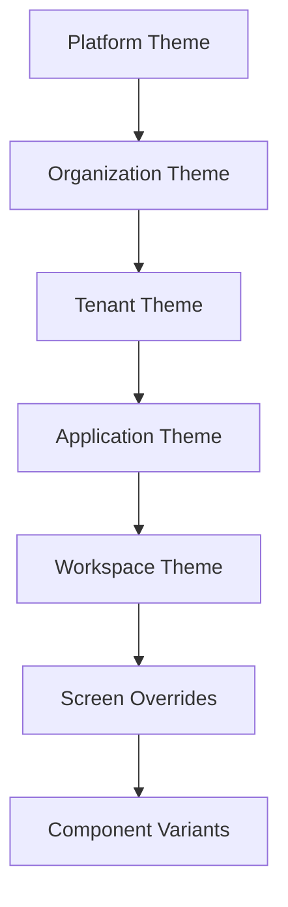
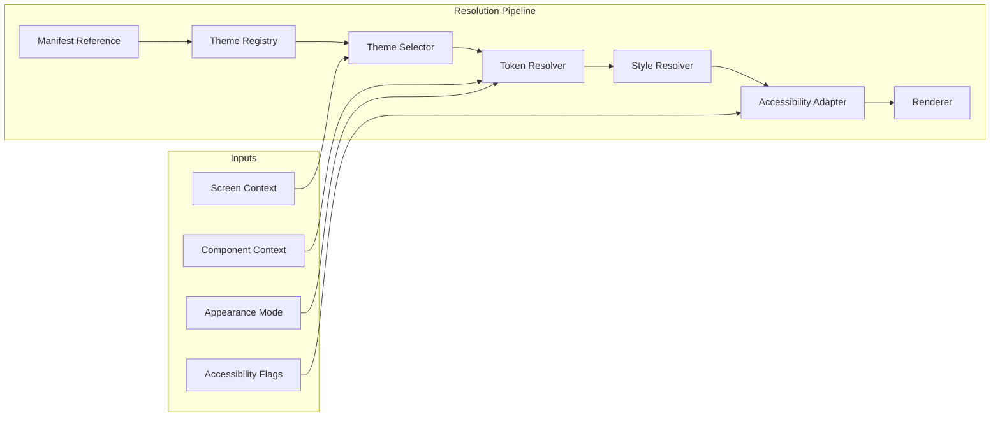
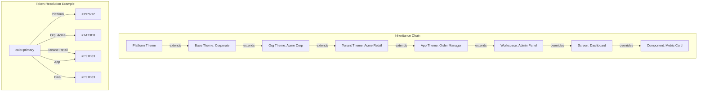
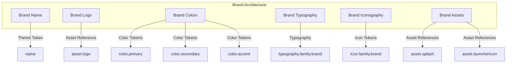
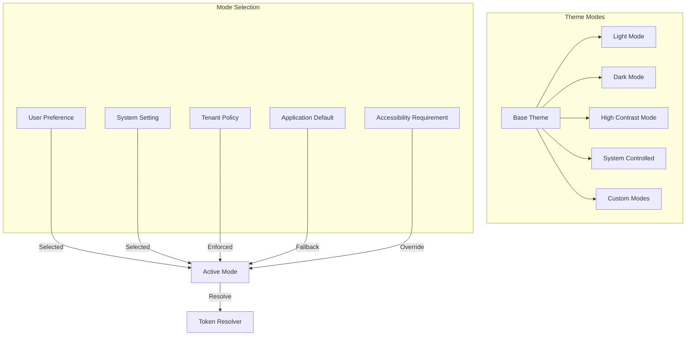
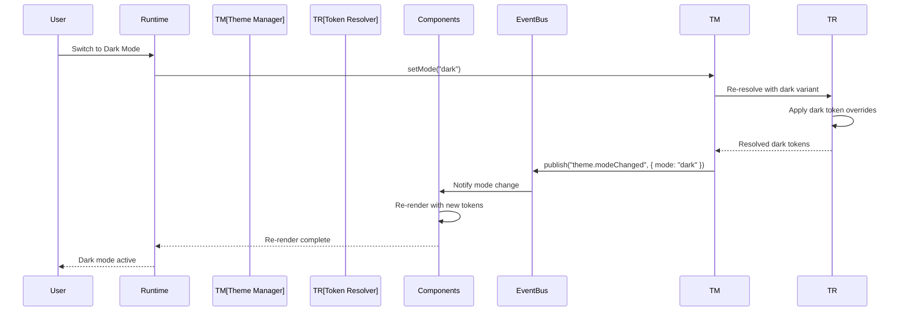

# Theme & Design Token Model

**KB-049 — Theme & Design Token Model Specification**

| Metadata | |
|----------|---|
| **KB ID** | KB-049 |
| **Title** | Theme & Design Token Model |
| **Version** | 0.1.0 |
| **Status** | Draft |
| **Owner** | Architecture Team |
| **Dependencies** | KB-041 Application Architecture Overview, KB-042 Application Manifest Specification, KB-045 Screen Model, KB-046 Component Tree Model, KB-048 State Model, KB-050 Capability Composition, KB-051 Runtime Architecture Overview |
| **Related Documents** | KB-017 Theme Engine, KB-027 Theme Builder, KB-037 Theme Marketplace, KB-052 Runtime Rendering Engine, KB-053 SDUI Architecture |
| **Review Status** | Pending |
| **Last Updated** | 2026-07-11 |

### Revision History

| Version | Date | Author | Change |
|---------|------|--------|--------|
| 0.1.0 | 2026-07-11 | AI Architecture Agent | Initial draft |

---

## 1. Executive Summary

### 1.1 Purpose

This document defines the canonical Theme & Design Token Model for the DUKADESK platform. It establishes the architectural foundation for visual identity, branding, design tokens, semantic styling, visual inheritance, and runtime theming across the entire platform.

The Theme Model is the bridge between visual design and rendered output. It defines what a theme is, how design tokens are structured and resolved, how themes inherit from and override each other, how appearance modes work, and how visual identity flows from the platform to the pixel.

Every visual property in every rendered interface is expressed through theme tokens. No hardcoded colors, fonts, spacing, or dimensions exist anywhere in the platform. The Theme Model ensures that visual identity is consistent, accessible, brandable, and responsive — from the largest enterprise tenant to the smallest component variant.

### 1.2 Scope

This document covers:

- Canonical definitions of Theme, Design Token, Semantic Token, Primitive Token, Brand, and all supporting concepts
- The theme hierarchy from Platform Theme through Component Variants
- Design token architecture: token groups, categories, and naming conventions
- Token resolution hierarchy and override rules
- Theme composition: base themes, child themes, extension, inheritance, overrides
- Branding model: logos, brand colors, typography, icons, splash and launcher assets
- Appearance modes: light, dark, high contrast, system controlled, custom
- Responsive tokens for mobile, tablet, desktop, foldables, and large displays
- Localization, accessibility, component, runtime, builder, marketplace, validation, and security relationships
- Failure scenarios and anti-patterns

Out of scope:

- Theme Engine subsystem implementation (handled by KB-017)
- Theme Builder implementation (handled by KB-027)
- Theme Marketplace distribution (handled by KB-037)
- Component rendering implementation (handled by KB-052)
- Platform-specific style mapping (handled by Renderer)

---

## 2. Architectural Principles

### Design Tokens First

Every visual property is expressed as a named token. Colors, typography, spacing, radius, elevation, motion, icons, opacity — all are tokens. No hardcoded values exist anywhere in application definitions, component configurations, or screen layouts. Tokens are the single source of visual truth.

### Theme Before Styling

A theme is resolved before any component is rendered. The theme provides the complete visual context — token values, appearance mode, brand assets, and accessibility adaptations. Components never render without a resolved theme context.

### Semantic Colors

Colors are expressed semantically, not literally. A component references `color.primary` not `#1A73E8`. Semantic naming enables theming, accessibility (contrast), mode switching (light/dark), and brand customization without component changes.

### Runtime Resolvable

Theme resolution happens at runtime, not at build time. The same application definition renders with different visual identities in different tenant contexts, appearance modes, and accessibility settings without modification.

### Platform Independent

The theme model makes no assumptions about any target platform. Mobile, web, desktop, embedded, TV, and kiosk all consume the same theme definitions. Platform-specific visual adaptation is handled by the Renderer's platform adaptation layer.

### Accessible by Default

Accessibility is a first-class property of the theme model, not an afterthought. Contrast ratios, font scaling, focus visibility, motion reduction, and color independence are enforced at the theme level. Every theme is validated for accessibility before distribution.

### Tenant Brandable

The theme hierarchy enables tenant-specific branding without duplicating base themes. A tenant inherits from the platform or organization theme and overrides only the tokens that define its brand identity — colors, logo, typography.

### Immutable Theme Versions

Published theme versions are immutable. A theme version is a snapshot of every token value, brand asset, and mode variant at the time of publication. Immutability enables deterministic rendering, safe upgrades, and rollback capability.

### Marketplace Distributable

Themes are packages distributed through the Theme Marketplace. They are versioned, signed, validated, and certified. Any authorized publisher can create and distribute themes through the Marketplace ecosystem.

### Component Agnostic

The theme model does not know about specific components. It defines tokens, variants, and visual primitives. Components reference tokens by name. The mapping from token to rendered pixel is the Renderer's responsibility.

---

## 3. Canonical Definitions

### 3.1 Theme

A Theme is a complete visual identity system. It defines every visual property that appears in a DUKADESK application — colors, typography, spacing, shapes, elevation, motion, icons, assets, and accessibility rules. A Theme is a versioned, immutable package distributed through the Theme Marketplace.

```text
Theme {
    identity:        ThemeIdentity     // ID, name, version, publisher
    metadata:        ThemeMetadata     // Description, category, tags, compatibility
    brand:           BrandDefinition   // Brand identity and assets
    tokens:          TokenCatalog      // All design tokens
    modes:           ModeCatalog       // Appearance mode variants
    components:      ComponentOverrides // Per-component variant tokens
    responsive:      ResponsiveTokens  // Breakpoint-aware token overrides
    accessibility:   AccessibilityDefinition // Contrast, scaling, motion rules
    dependencies:    Dependency[]      // Base theme or parent theme references
}
```

### 3.2 Design Token

A Design Token is a named atomic visual property. It is the smallest unit of visual design in the platform — a single color, spacing value, font size, shadow definition, or animation duration.

```text
DesignToken {
    name:            string            // Fully qualified token name
    type:            TokenType         // color, dimension, duration, shadow, etc.
    value:           any               // Token value
    description:     string            // Purpose description
    category:        TokenCategory     // primitive, semantic, component
    references:      string[]          // Tokens this token references
    accessibility:   AccessibilityConstraint // Contrast, scaling requirements
}
```

### 3.3 Semantic Token

A Semantic Token expresses design intent rather than literal value. Semantic tokens reference Primitive Tokens and provide meaningful names that survive theme changes.

```text
SemanticToken {
    name:            "color.primary"   // Intent-based name
    references:      "palette.blue.600" // Links to primitive token
    purpose:         "Primary action color"
}
```

### 3.4 Primitive Token

A Primitive Token holds a raw, uninterpreted value. Primitive tokens form the base palette from which semantic tokens derive their values.

```text
PrimitiveToken {
    name:            "palette.blue.600"
    value:           "#1A73E8"
    type:            "color"
    category:        "primitive"
}
```

### 3.5 Brand

A Brand is the collection of identity elements that distinguish one organization or product from another — name, logo, colors, typography, and visual style.

```text
BrandDefinition {
    name:            string            // Brand display name
    logo:            AssetReference    // Primary logo asset
    logoSymbol:      AssetReference    // Symbol/mark only
    colors: {
        primary:     TokenReference    // Brand primary color
        secondary:   TokenReference    // Brand secondary color
        accent:      TokenReference    // Brand accent color
    }
    typography: {
        family:      string            // Brand font family
        weights:     number[]          // Available font weights
    }
    assets: {
        splash:      AssetReference    // Splash screen asset
        icon:        AssetReference    // Application icon
        favicon:     AssetReference    // Favicon (web)
    }
}
```

### 3.6 Palette

A Palette is a curated set of primitive color tokens that a theme uses. Palettes typically include neutral, primary, secondary, accent, success, warning, danger, and info color ramps.

### 3.7 Typography

Typography defines the font families, weights, sizes, line heights, letter spacing, and text styles used across the platform.

### 3.8 Iconography

Iconography defines the icon set, sizes, weights, and families used within a theme. Icons are referenced by name and resolved through the theme's icon catalog.

### 3.9 Elevation

Elevation defines the shadow and depth system — shadow colors, blur radii, offset values, and opacity levels for each elevation level.

### 3.10 Motion

Motion defines the animation system — durations, timing curves, transition definitions, and reduced-motion alternatives for every animation type.

### 3.11 Density

Density defines the spacing and sizing scale that determines how compact or spacious the UI appears. Density tokens control padding, margin, gap, and sizing values.

### 3.12 Variant

A Variant is a named visual configuration of a token group or component. Examples: button variants (primary, secondary, ghost, danger), text variants (heading, body, caption), surface variants (card, modal, sidebar).

### 3.13 Appearance Mode

An Appearance Mode is a complete alternate set of token values for a theme. Modes include light (default), dark, high contrast, and custom modes defined by the theme publisher.

### 3.14 Theme Package

A Theme Package is the distributable unit of a theme. It contains the theme definition, all token values, mode variants, brand assets, and metadata. Theme Packages are versioned, signed, and distributed through the Theme Marketplace.

---

## 4. Theme Hierarchy



### 4.1 Platform Theme

The Platform Theme is the baseline visual identity shipped with the DUKADESK platform. It defines every required token with sensible defaults. Every organization, tenant, and application inherits from the Platform Theme.

| Property | Value |
|----------|-------|
| **Source** | Platform core |
| **Overrideable** | Yes — all tokens may be overridden |
| **Required** | Yes — always present |
| **Scope** | All applications on all devices |
| **Completeness** | Defines every required token |

### 4.2 Organization Theme

The Organization Theme applies organization-wide branding overrides atop the Platform Theme. An organization (company, enterprise group) defines its brand colors, logo, typography, and visual identity once at this level.

| Property | Value |
|----------|-------|
| **Source** | Organization settings |
| **Overrideable** | Yes — tenant may further override |
| **Required** | No — optional |
| **Scope** | All tenants within the organization |
| **Typical Overrides** | Brand colors, logo, font family, splash screen |

### 4.3 Tenant Theme

The Tenant Theme applies tenant-specific branding and white-label overrides. Each tenant (business, franchise, venue) can customize the visual identity independently.

| Property | Value |
|----------|-------|
| **Source** | Tenant configuration |
| **Overrideable** | Yes — application may further override |
| **Required** | No — optional |
| **Scope** | All applications within the tenant |
| **Typical Overrides** | Brand name, secondary logo, accent color, locale-specific fonts |

### 4.4 Application Theme

The Application Theme defines the visual identity for a specific application — a Desk. Applications may be installed in multiple tenants and carry their own token overrides.

| Property | Value |
|----------|-------|
| **Source** | Application Manifest |
| **Overrideable** | Yes — workspace may further override |
| **Required** | Yes — every application has a theme reference |
| **Scope** | The specific application instance |
| **Typical Overrides** | Application-specific color accents, component variants |

### 4.5 Workspace Theme

The Workspace Theme applies visual overrides within a single workspace of an application. Workspaces within the same application may have distinct visual identities for role differentiation.

| Property | Value |
|----------|-------|
| **Source** | Workspace configuration |
| **Overrideable** | Yes — screen may further override |
| **Required** | No — optional |
| **Scope** | The specific workspace |
| **Typical Overrides** | Admin workspace vs public workspace styling |

### 4.6 Screen Overrides

Screen-level token overrides within the Screen Definition. Screens may declare token values that differ from the workspace or application defaults.

| Property | Value |
|----------|-------|
| **Source** | Screen Definition |
| **Overrideable** | Yes — component variant may further override |
| **Required** | No — optional |
| **Scope** | The specific screen |
| **Typical Overrides** | Background color, content area max-width |

### 4.7 Component Variants

Component-level token overrides within the Component Tree. Component instances may declare variant and state-specific token values.

| Property | Value |
|----------|-------|
| **Source** | Component Tree Definition |
| **Overrideable** | No — leaf level |
| **Required** | No — optional |
| **Scope** | The specific component instance |
| **Typical Overrides** | Button variant colors, card elevation, input border |

### 4.8 Resolution Order

Tokens are resolved from most specific to least specific:

```
Component Override
        ↑
  Screen Override
        ↑
  Workspace Theme
        ↑
 Application Theme
        ↑
   Tenant Theme
        ↑
 Organization Theme
        ↑
  Platform Theme
```

A token value at a higher level overrides the same token at any lower level.

---

## 5. Theme Architecture

### 5.1 Theme Identity

```text
ThemeIdentity {
    id:              string            // Globally unique theme ID
    name:            string            // Display name
    version:         string            // Semantic version
    publisher:       string            // Publisher ID
    publisherName:   string            // Publisher display name
    description:     string            // Purpose description
    category:        string[]          // Theme categories
    tags:            string[]          // Discovery tags
    created:         datetime
    updated:         datetime
}
```

### 5.2 Theme Metadata

```text
ThemeMetadata {
    source:          "platform" | "marketplace" | "custom"
    layer:           number            // Inheritance layer (0=platform, 1=org, ...)
    compatibility: {
        runtime:     string[]          // Compatible Runtime versions
        components:  string[]          // Compatible Component versions
        platform:    string[]          // Compatible platform versions
    }
    assets:          AssetReference[]  // All theme assets
    locales:         string[]          // Supported locales
    modes:           string[]          // Available appearance modes
    license:         string            // License type
    documentation:   string            // Documentation reference
}
```

### 5.3 Theme Version

- Themes follow semantic versioning (MAJOR.MINOR.PATCH)
- MAJOR: Breaking token changes (token removed, type changed, value semantics changed)
- MINOR: New tokens added, new mode variants, new brand assets
- PATCH: Token value adjustments, asset optimizations, documentation updates
- Published theme versions are immutable
- Version constraints are declared in the Application Manifest

### 5.4 Theme Dependencies

Themes may declare dependencies on base themes:

```text
ThemeDependency {
    id:              string            // Base theme ID
    version:         string            // Version constraint
    required:        boolean           // Must be installed
    merge:           "inherit" | "compose"  // How child merges with base
}
```

### 5.5 Theme Compatibility

| Check | Description |
|-------|-------------|
| **Runtime version** | Theme declares compatible Runtime versions |
| **Component Registry** | Component over reference tokens that must exist |
| **Platform version** | Theme declares compatible platform targets |
| **Token completeness** | Every token that the Runtime requires must be present |
| **Accessibility** | Theme must pass contrast and scaling validation |

---

## 6. Design Token Architecture

### 6.1 Three-Layer Token Model

```text
Token Architecture:

Primitive Tokens (raw values)
    ↓ reference
Semantic Tokens (design intent)
    ↓ reference
Component Tokens (UI mapping)
```

### 6.2 Primitive Tokens (Global Tokens)

Primitive tokens hold the raw design values. They form the foundation of the token system.

| Group | Examples | Values |
|-------|----------|--------|
| **Color Palette** | `palette.blue.50` through `palette.blue.900`, `palette.neutral.0` through `palette.neutral.1000`, `palette.green`, `palette.red`, `palette.yellow`, `palette.orange`, `palette.purple` | Hex, RGB, HSL |
| **Type Scale** | `typeScale.display`, `typeScale.headline`, `typeScale.title`, `typeScale.body`, `typeScale.caption`, `typeScale.overline` | Pixel or rem values |
| **Base Spacing** | `spacingBase.unit` (4px), `spacingBase.grid` (8px) | Pixel values |
| **Shape Presets** | `shapePreset.none`, `shapePreset.sm`, `shapePreset.md`, `shapePreset.lg`, `shapePreset.xl`, `shapePreset.full` | Pixel values |
| **Elevation Levels** | `elevationLevel.0` through `elevationLevel.5` | Shadow definitions |
| **Duration Scale** | `duration.instant`, `duration.fast`, `duration.normal`, `duration.slow`, `duration.deliberate` | Milliseconds |
| **Opacity Scale** | `opacity.0`, `opacity.disabled`, `opacity.medium`, `opacity.high`, `opacity.full` | Decimal 0–1 |

### 6.3 Semantic Tokens

Semantic tokens express design intent. They reference primitive tokens and are the primary interface consumed by components.

#### Color Semantics

| Token | Purpose | References |
|-------|---------|------------|
| `color.primary` | Primary brand color | `palette.blue.600` |
| `color.primary.light` | Primary light variant | `palette.blue.200` |
| `color.primary.dark` | Primary dark variant | `palette.blue.800` |
| `color.primary.contrastText` | Text on primary background | `palette.neutral.0` |
| `color.secondary` | Secondary brand color | `palette.green.600` |
| `color.surface` | Surface background | `palette.neutral.0` |
| `color.surface.variant` | Alternate surface | `palette.neutral.50` |
| `color.background` | Page background | `palette.neutral.100` |
| `color.success` | Success state | `palette.green.600` |
| `color.warning` | Warning state | `palette.yellow.700` |
| `color.danger` | Danger/error state | `palette.red.600` |
| `color.info` | Information state | `palette.blue.500` |
| `color.text.primary` | Primary text | `palette.neutral.900` |
| `color.text.secondary` | Secondary text | `palette.neutral.600` |
| `color.text.disabled` | Disabled text | `palette.neutral.400` |
| `color.text.inverse` | Text on dark backgrounds | `palette.neutral.0` |
| `color.text.link` | Link text | `palette.blue.600` |
| `color.border.default` | Default border | `palette.neutral.200` |
| `color.border.focus` | Focus ring | `palette.blue.500` |
| `color.border.error` | Error state border | `palette.red.500` |
| `color.border.success` | Success state border | `palette.green.500` |

#### Typography Semantics

| Token | Purpose |
|-------|---------|
| `typography.family.sans` | Sans-serif font family |
| `typography.family.serif` | Serif font family |
| `typography.family.mono` | Monospace font family |
| `typography.family.brand` | Brand-specific font family |
| `typography.weight.light` | Light font weight (300) |
| `typography.weight.regular` | Regular font weight (400) |
| `typography.weight.medium` | Medium font weight (500) |
| `typography.weight.semibold` | Semibold font weight (600) |
| `typography.weight.bold` | Bold font weight (700) |
| `typography.size.h1` through `h6` | Heading sizes |
| `typography.size.body` | Body text size |
| `typography.size.body.small` | Small body text |
| `typography.size.caption` | Caption/copyright text |
| `typography.size.code` | Code/monospace text |
| `typography.size.overline` | Overline/label text |
| `typography.lineHeight.h1` through `body` | Line heights |
| `typography.letterSpacing.h1` through `overline` | Letter spacing |

#### Spacing Semantics

| Token | Purpose | References |
|-------|---------|------------|
| `spacing.xs` | Extra small (4px) | `spacingBase.unit` |
| `spacing.sm` | Small (8px) | `spacingBase.grid` |
| `spacing.md` | Medium (16px) | `spacingBase.grid * 2` |
| `spacing.lg` | Large (24px) | `spacingBase.grid * 3` |
| `spacing.xl` | Extra large (32px) | `spacingBase.grid * 4` |
| `spacing.xxl` | 2x Extra large (48px) | `spacingBase.grid * 6` |
| `spacing.grid` | Grid unit | `spacingBase.grid` |
| `spacing.container.sm` | Small container max-width | Dimension |
| `spacing.container.md` | Medium container max-width | Dimension |
| `spacing.container.lg` | Large container max-width | Dimension |

#### Shape Semantics

| Token | Purpose |
|-------|---------|
| `shape.borderRadius.none` | No rounding (0) |
| `shape.borderRadius.sm` | Small rounding (4px) |
| `shape.borderRadius.md` | Medium rounding (8px) |
| `shape.borderRadius.lg` | Large rounding (12px) |
| `shape.borderRadius.xl` | Extra large rounding (16px) |
| `shape.borderRadius.full` | Fully rounded (50%) |
| `shape.borderWidth.none` | No border (0) |
| `shape.borderWidth.thin` | Thin border (1px) |
| `shape.borderWidth.medium` | Medium border (2px) |
| `shape.borderWidth.thick` | Thick border (3px) |

#### Elevation Semantics

| Token | Purpose |
|-------|---------|
| `elevation.shadow.none` | No shadow |
| `elevation.shadow.sm` | Small shadow (cards, toasts) |
| `elevation.shadow.md` | Medium shadow (modals, dropdowns) |
| `elevation.shadow.lg` | Large shadow (drawers, sidebars) |
| `elevation.shadow.xl` | Extra large shadow (modals) |
| `elevation.opacity.disabled` | Disabled element opacity |
| `elevation.opacity.placeholder` | Placeholder text opacity |
| `elevation.opacity.overlay` | Scrim/overlay opacity |
| `elevation.opacity.scrim` | Modal backdrop opacity |

#### Motion Semantics

| Token | Purpose |
|-------|---------|
| `motion.duration.instant` | Instant (0ms) |
| `motion.duration.fast` | Fast (100ms) |
| `motion.duration.normal` | Normal (200ms) |
| `motion.duration.slow` | Slow (300ms) |
| `motion.duration.deliberate` | Deliberate (500ms) |
| `motion.timing.linear` | Linear easing |
| `motion.timing.easeIn` | Ease in |
| `motion.timing.easeOut` | Ease out |
| `motion.timing.easeInOut` | Ease in-out |
| `motion.timing.spring` | Spring physics |
| `motion.reduced.duration` | Duration when reduced motion enabled (0ms) |
| `motion.reduced.timing` | Timing when reduced motion enabled |

#### Icon Semantics

| Token | Purpose |
|-------|---------|
| `icon.size.xs` | Extra small (12px) |
| `icon.size.sm` | Small (16px) |
| `icon.size.md` | Medium (20px) |
| `icon.size.lg` | Large (24px) |
| `icon.size.xl` | Extra large (32px) |
| `icon.weight` | Icon stroke weight |
| `icon.family` | Icon set family |

### 6.4 Component Tokens

Component tokens map semantic tokens to specific component properties. They are defined per component type in the theme or in the component's default theme mapping.

```text
ComponentToken {
    component:       string            // Component type ID
    variant:         string            // Variant name (primary, secondary, ghost)
    state:           string            // State (default, hovered, pressed, focused, disabled)
    properties: {
        property:    string            // Component property (backgroundColor, textColor, etc.)
        token:       TokenReference    // Semantic token reference
    }
}
```

Example:
```text
Component: "core.navigation.button"
  Variant "primary":
    State "default":
      backgroundColor → color.primary
      textColor → color.primary.contrastText
      borderColor → color.primary
      borderRadius → shape.borderRadius.sm
    State "pressed":
      backgroundColor → color.primary.dark
    State "disabled":
      backgroundColor → color.surface.variant
      textColor → color.text.disabled
  Variant "ghost":
    State "default":
      backgroundColor → transparent
      textColor → color.primary
```

---

## 7. Token Resolution

### 7.1 Resolution Pipeline



### 7.2 Resolution Steps

| Step | Description |
|------|-------------|
| **1. Theme Selection** | The active theme is selected based on the theme hierarchy (Section 4). The theme chain is built from Platform Theme through Application Theme. |
| **2. Mode Resolution** | The active appearance mode (light, dark, high contrast) is determined from user preference, system setting, tenant policy, or application default. |
| **3. Theme Merging** | Each theme layer is merged recursively. More specific layers override less specific. Mode variants are applied. |
| **4. Token Resolution** | Each token name is resolved through the merged theme. Semantic tokens are dereferenced to primitive tokens. Primitive tokens yield concrete values. |
| **5. Accessibility Adaptation** | Tokens are adapted for accessibility: font scaling, contrast enhancement, reduced motion, focus visibility. |
| **6. Style Compilation** | Resolved tokens are compiled into a flat style map for the Renderer. The map provides O(1) token lookup. |

### 7.3 Override Rules

| Rule | Description |
|------|-------------|
| **Specific overrides general** | Component > Screen > Workspace > Application > Tenant > Organization > Platform |
| **Deep merge** | Object tokens are deep-merged; child overrides specific keys without replacing the entire object |
| **Scalar replaces** | Scalar values are replaced entirely by the child |
| **Null removes** | A null value removes the token from the merged result (use with caution) |
| **Arrays replace** | Array values are replaced, not merged |
| **Mode overrides mode** | Dark mode tokens override light mode tokens when dark mode is active |

---

## 8. Theme Composition

### 8.1 Base Themes

A Base Theme is a complete, standalone theme that defines every required token. The Platform Theme is the ultimate base theme. Organization and Tenant themes may also be base themes if they define all tokens without referencing a parent.

### 8.2 Child Themes

A Child Theme inherits from a parent (base) theme and declares only the tokens it changes. Child themes are partial — they specify only overrides.

```text
ChildTheme {
    parent:          string            // Parent theme ID and version
    mode:            "inherit" | "extend"  // How modes are handled
    overrides: {
        tokens:      object            // Token overrides
        assets:      object            // Asset overrides
        modes:       object            // Mode overrides
    }
}
```

### 8.3 Theme Extension

Theme Extension adds new tokens, variants, or modes to an existing theme without modifying the original. Extensions are used by capabilities to add visual properties for their components.

### 8.4 Theme Inheritance



### 8.5 Theme Overrides

Overrides are declared in the entity that requires the customization:

| Entity | Override Location | Example |
|--------|------------------|---------|
| Organization | Organization settings | Brand colors, logo |
| Tenant | Tenant configuration | White-label branding |
| Application | Application Manifest | Application-specific accents |
| Workspace | Workspace configuration | Role-based styling |
| Screen | Screen Definition | Background, max-width |
| Component | Component Tree | Button variant, card elevation |

### 8.6 Theme Packages

```mermaid
flowchart LR
    subgraph "Theme Package"
        TD[Theme Definition]
        TA[Token Catalog]
        TV[Mode Variants]
        BA[Brand Assets]
        MD[Metadata]
        SIG[Signature]
    end

    TD --> TA
    TD --> TV
    TD --> BA
    TD --> MD
    TD --> SIG

    subgraph "Distribution"
        Pkg[Theme Package (.zip / signed)]
        Pkg -->|Publish| M[Marketplace]
        M -->|Install| R[Runtime]
    end
```

---

## 9. Branding Model

### 9.1 Brand Architecture



### 9.2 Logos

| Asset | Resolution | Format | Purpose |
|-------|------------|--------|---------|
| **Primary Logo** | SVG + PNG (multiple sizes) | SVG preferred | Splash screen, login, header |
| **Symbol Mark** | SVG + PNG (multiple sizes) | SVG preferred | Favicon, app icon, favicon |
| **Icon** | PNG (all required platform sizes) | PNG | Launcher icon, home screen icon |
| **Dark Variant** | SVG + PNG | SVG | Display on dark backgrounds |

### 9.3 Brand Colors

Brand color tokens are set at the Organization or Tenant level and propagate through the inheritance chain.

### 9.4 Typography

Brand typography is declared through the `typography.family.brand` token. Custom fonts are included in the theme package as assets.

### 9.5 Icons

Brand icon families are declared through theme tokens. The theme may reference a standard icon set or a custom brand icon set.

### 9.6 Splash Assets

| Asset | Purpose |
|-------|---------|
| Splash background | Background color or image during load |
| Splash logo | Centered logo displayed during load |
| Splash animation | Optional animated logo transition |

### 9.7 Launcher Assets

| Asset | Platforms |
|-------|-----------|
| App icon (all sizes) | iOS, Android, Web, Desktop |
| Adaptive icon | Android |
| Favicon | Web |
| Tile icon | Windows |

### 9.8 Marketing Assets

Themes may package marketing assets for Marketplace listing: screenshots, feature graphics, promo images, videos.

---

## 10. Appearance Modes

### 10.1 Mode Architecture

Each Appearance Mode is a complete set of token overrides applied on top of the base (light) theme. Modes are defined in the theme definition and resolved at runtime.



### 10.2 Light Mode

Default appearance mode. Light backgrounds with dark text. Standard contrast ratios (WCAG AA). Maximum visual decoration.

### 10.3 Dark Mode

Inverted appearance mode. Dark backgrounds with light text. Reduced shadows and elevation visibility. Adjusted saturation for reduced eye strain.

| Token Adaptation | Light Value | Dark Value |
|-----------------|-------------|------------|
| `color.background` | `palette.neutral.100` | `palette.neutral.950` |
| `color.surface` | `palette.neutral.0` | `palette.neutral.900` |
| `color.text.primary` | `palette.neutral.900` | `palette.neutral.100` |
| `elevation.shadow.sm` | Shadow | Reduced opacity shadow |

### 10.4 High Contrast Mode

Accessibility-first mode. Maximum colour contrast ratios (WCAG AAA). Minimum visual decoration. High-visibility focus indicators. Bold borders on all interactive elements.

| Token Adaptation | Standard | High Contrast |
|-----------------|----------|---------------|
| All colour pairs | WCAG AA (4.5:1) | WCAG AAA (7:1) |
| `color.border.default` | Subtle | Bold (2px minimum) |
| Focus indicator | Token-defined | 3px solid high-contrast colour |
| Decorative elements | As designed | Removed or minimized |

### 10.5 System Controlled

Mode is determined by the platform's system-level appearance setting. The Runtime subscribes to system appearance changes and switches mode automatically.

### 10.6 Custom Modes

Theme publishers may define custom appearance modes for specialized contexts:

- **Sepia/Kiosk**: Warm-toned mode for reading or public kiosks
- **Outdoor**: Brightness-boosted mode for direct sunlight readability
- **Gaming**: High-saturation, dark-background mode for entertainment
- **Brand-specific**: Custom mode that expresses a specific brand variant

### 10.7 Mode Switching



---

## 11. Responsive Tokens

### 11.1 Token Adaptation per Device

Tokens may declare responsive overrides that apply at specific breakpoints:

```text
ResponsiveToken {
    token:           "spacing.container.maxWidth"
    breakpoints: [
        { maxWidth: 599, value: "100%" },
        { minWidth: 600, maxWidth: 1023, value: "90%" },
        { minWidth: 1024, value: "1200px" }
    ]
}
```

### 11.2 Breakpoint Token Categories

| Category | Responsive Behaviour |
|----------|---------------------|
| **Container widths** | Scale from fluid (mobile) to fixed (desktop) |
| **Spacing** | Reduce spacing on small devices, increase on large |
| **Typography** | Adjust heading sizes per viewport |
| **Elevation** | Reduce or remove on mobile for performance |
| **Icon sizes** | Larger touch targets on mobile |
| **Density** | Compact on mobile, comfortable on desktop |

### 11.3 Device Class Tokens

```text
DeviceClassToken {
    token:           "density"
    phone:           "compact"
    tablet:          "comfortable"
    desktop:         "comfortable"
    foldable:        "adaptive"
    largeDisplay:    "expanded"
}
```

---

## 12. Localization Relationship

Themes interact with localization (i18n) in the following ways:

| Concern | Theme Role |
|---------|------------|
| **Text direction** | Theme provides tokens for LTR and RTL layouts |
| **Font fallback** | Theme declares locale-specific font stacks |
| **Number formats** | Theme defines locale-aware number, date, and currency formats |
| **Asset localization** | Theme may provide locale-specific brand assets |
| **Locale-specific tokens** | Tokens may override per locale (e.g., spacing for languages with longer text) |

The Localization system and Theme system are independent but coordinated. The Runtime resolves both simultaneously and provides a unified context to the Renderer.

---

## 13. Accessibility

### 13.1 Contrast

| Requirement | Level |
|-------------|-------|
| Normal text contrast | WCAG AA (4.5:1) minimum |
| Large text contrast | WCAG AA (3:1) minimum |
| UI component contrast | WCAG AA (3:1) minimum |
| High contrast mode | WCAG AAA (7:1) |
| Focus indicator | 3:1 minimum against adjacent colours |

Accessibility validation is performed on all tokens at theme build and publish time. Colour pairs are computed from semantic relationships (e.g., `color.primary` vs `color.primary.contrastText`).

### 13.2 Typography Scaling

Typography tokens must support scaling up to 200% without:

- Content truncation
- Overlapping elements
- Lost functionality
- Horizontal scrolling (except data tables)

Font sizes are defined in relative units (`rem` or `em`) to support user-level font scaling.

### 13.3 Focus Visibility

Focus indicators are styled through theme tokens:

```text
focus.indicator.width:  "3px"
focus.indicator.style:  "solid"
focus.indicator.color:  "color.border.focus"
focus.indicator.offset: "2px"
focus.indicator.borderRadius: "shape.borderRadius.sm"
```

### 13.4 Motion Reduction

When reduced motion is enabled:

- All durations resolve to `motion.reduced.duration` (typically 0ms)
- All timing curves resolve to `motion.reduced.timing` (typically linear)
- Spring physics animations are replaced with zero-duration transitions
- Parallax and scroll-driven animations are disabled

### 13.5 Colour Independence

No information is conveyed through colour alone. All colour-coded states are accompanied by:

- Icon or symbol indicators
- Text labels
- Pattern or texture differences (when applicable)

---

## 14. Component Relationship

Components consume theme tokens through their declared `themeTokens` in the Component Registry. The Component Tree Model (KB-046) defines how Components reference tokens and how the Runtime resolves them.

| Component Tree Model | Theme & Design Token Model |
|----------------------|---------------------------|
| Components declare token references | Theme provides token values |
| Component Tree specifies variant/state | Theme defines variant/state token mapping |
| Component properties reference tokens | Token resolution produces final values |
| Components are theme-agnostic | Themes are component-agnostic |

---

## 15. Runtime Responsibilities

| Responsibility | Description |
|----------------|-------------|
| **Theme Loading** | Load the active theme chain from the Theme Registry |
| **Theme Merging** | Merge theme layers from platform through application |
| **Mode Resolution** | Determine active appearance mode from all inputs |
| **Token Resolution** | Resolve all tokens to concrete values with accessibility adaptation |
| **Theme Context** | Provide resolved theme context to all Screens and Components |
| **Mode Switching** | Handle appearance mode change requests and trigger re-render |
| **Asset Loading** | Load brand assets (logos, icons, fonts) from the theme package |
| **Cache Management** | Cache resolved theme tokens for O(1) lookup |
| **Accessibility Adaptation** | Apply font scaling, contrast enhancement, and motion reduction |
| **Event Publication** | Publish theme lifecycle events on the Event Bus |

---

## 16. Theme Builder Responsibilities

| Responsibility | Description |
|----------------|-------------|
| **Token Editor** | Provide visual editors for all token groups |
| **Mode Editor** | Provide mode variant editing with side-by-side comparison |
| **Component Preview** | Show real-time preview of component rendering with current tokens |
| **Asset Management** | Upload and manage brand assets |
| **Accessibility Validator** | Continuously validate contrast, scaling, and focus compliance |
| **Inheritance Viewer** | Display the theme inheritance chain and effective token values |
| **Export/Import** | Package themes for distribution |
| **Version Management** | Support version creation, diffing, and rollback |
| **Collaboration** | Enable multiple designers to work on the same theme |

---

## 17. Marketplace Responsibilities

| Responsibility | Description |
|----------------|-------------|
| **Theme Catalog** | Maintain searchable catalog of published themes |
| **Validation** | Validate themes for completeness, compatibility, and accessibility |
| **Certification** | Certify themes that meet platform standards |
| **Versioning** | Manage theme versions and compatibility constraints |
| **Distribution** | Deliver theme packages to Runtime environments |
| **Licensing** | Enforce license terms for paid themes |
| **Updates** | Notify consumers of theme updates and security patches |
| **Deprecation** | Manage theme deprecation and retirement lifecycle |

---

## 18. Validation Responsibilities

| Responsibility | Description |
|----------------|-------------|
| **Token Completeness** | Verify all required tokens are defined |
| **Token Type Check** | Verify token values match declared types |
| **Reference Resolution** | Verify all semantic token references resolve to primitive tokens |
| **Contrast Validation** | Verify all colour pairs meet minimum contrast ratios |
| **Mode Completeness** | Verify all required mode overrides are defined |
| **Asset Integrity** | Verify all referenced assets exist and are valid |
| **Font Availability** | Verify all referenced fonts are included or accessible |
| **Version Compatibility** | Verify theme is compatible with target Runtime versions |
| **Circular Inheritance** | Detect and reject circular theme dependency chains |
| **Accessibility Compliance** | Verify WCAG AA (minimum) compliance for all themes |

---

## 19. Security

### 19.1 Trusted Theme Packages

- Themes from the Marketplace are cryptographically signed
- Theme integrity is verified at installation and load time
- Custom themes from untrusted sources are sandboxed
- Theme publishers are verified through the Marketplace

### 19.2 Theme Validation

| Check | Description |
|-------|-------------|
| Package signature | Cryptographic signature verified against publisher key |
| Asset integrity | All assets checksummed and verified |
| Token bounds | Token values checked for malicious content |
| Font safety | Font files scanned for malware |
| No executable content | Theme packages must not contain executable code |

### 19.3 Asset Integrity

- All theme assets are checksummed (SHA-256)
- Checksums are stored in the theme metadata
- Assets are verified on every theme load
- Corrupted assets trigger fallback to Platform Theme defaults

### 19.4 Version Compatibility

- Themes declare compatible Runtime versions
- Incompatible themes are not installed
- Automatic rollback on version mismatch detection
- Breaking changes require MAJOR version bump

---

## 20. Performance

### 20.1 Token Resolution

- Resolved themes are cached as flat token maps
- Token lookup is O(1) from the flat map
- Theme merging occurs once at load time, not per render
- Resolution cost is proportional to changed tokens, not total tokens

### 20.2 Theme Switching

- Mode switching is a token map swap, not full re-resolution
- Transition animations are theme-defined and hardware-accelerated
- Component re-render is scoped to affected tokens
- Target: mode switch in under 100ms

### 20.3 Asset Loading

- Brand assets are loaded lazily and cached
- Font loading uses font-display: swap for non-blocking text rendering
- Image assets are served in platform-appropriate resolutions
- SVG assets are preferred for logos and icons (smaller, scalable)

### 20.4 Lazy Loading

- Theme packages for inactive workspaces are not loaded
- Theme assets for unused appearance modes are not loaded
- Component variant token sets are loaded on demand
- Font subsets for non-default locales are loaded lazily

### 20.5 Caching

| Cache | Scope | Invalidation |
|-------|-------|-------------|
| Resolved token map | Session | Theme change, mode change |
| Theme definition | Persistent (TTL) | Version update |
| Brand assets | Persistent | Asset URL change |
| Font files | Persistent | Font version change |
| Component overrides | Session | Theme change |

---

## 21. Observability

### 21.1 Theme Events

| Event | Trigger |
|-------|---------|
| `theme.loaded` | Theme chain loaded and merged |
| `theme.modeChanged` | Appearance mode switched |
| `theme.tokenResolved` | Token resolution complete |
| `theme.tokenFailed` | Token resolution failed |
| `theme.assetLoaded` | Brand asset loaded |
| `theme.assetFailed` | Brand asset failed to load |
| `theme.updated` | Theme updated from Marketplace |

### 21.2 Metrics

| Metric | Description |
|--------|-------------|
| Theme load time | Time to load and merge theme chain |
| Token resolution time | Time to resolve all tokens |
| Mode switch time | Time to switch appearance mode |
| Active theme | Current theme ID |
| Active mode | Current appearance mode |
| Token resolution failures | Count of unresolvable token references |
| Asset load failures | Count of failed asset loads |

### 21.3 Token Resolution Failures

When a token cannot be resolved:

1. The token name is logged with the resolution path
2. A fallback value is used (if declared) or token name displayed
3. The failure is reported through the Diagnostics system
4. Theme validation flags the failure for resolution

---

## 22. Failure Scenarios

| Scenario | Behaviour |
|----------|-----------|
| **Missing Theme** | Theme reference in Manifest does not exist. Platform Theme used as fallback. Error logged. |
| **Invalid Tokens** | Token value fails type validation. Fallback default used. Token flagged in diagnostics. |
| **Circular Inheritance** | Theme A depends on Theme B which depends on Theme A. Inheritance blocked. Platform Theme used. |
| **Corrupted Assets** | Asset checksum does not match. Fallback asset used. Missing asset replaced with placeholder. |
| **Missing Fonts** | Referenced font not available in theme package or platform. System fallback font used. |
| **Unsupported Theme Version** | Theme version incompatible with Runtime. Installation blocked. Existing theme preserved. |
| **Accessibility Violations** | Token pair fails contrast validation. Warning issued. Theme still renders but accessibility compliance is degraded. |
| **Mode Incomplete** | Mode variant is missing required tokens. Light mode values used as fallback for missing tokens. |
| **Asset Load Failure** | Brand asset cannot be loaded. Placeholder or default asset displayed. Retry on theme re-load. |
| **Version Downgrade** | Attempt to install older theme version over newer. Blocked unless explicitly forced. |

---

## 23. Anti-Patterns

### Hardcoded Colours

Using literal colour values (hex, RGB, named colours) anywhere in application definitions, component configurations, or screen layouts. All visual properties must reference theme tokens.

### Component-Specific Styling

Embedding component-specific visual properties outside the theme model. Component styling must flow through theme tokens, not through component-configuration overrides that bypass the theme.

### Runtime Theme Mutation

Modifying theme token values at runtime. Themes are immutable once loaded. Dynamic visual changes must be expressed through mode switching, variant toggling, or manifest-level overrides — never through direct token mutation.

### Duplicate Tokens

Defining the same token name in multiple theme layers without clear inheritance intent. Duplicates cause confusion and unpredictable resolution. Each token should be defined in exactly one place and overridden explicitly.

### Platform-Specific Themes

Creating separate themes for each platform (mobile theme, web theme, desktop theme). A single theme must render consistently across all platforms. Platform-specific visual adaptation is the Renderer's responsibility.

### Direct Asset References

Referencing brand assets by URL or file path rather than through theme tokens. Assets must be declared in the theme's asset catalog and referenced by asset ID.

### Business Logic in Themes

Embedding conditional logic, calculations, or state-dependent behaviour in theme definitions. Themes are pure visual data — they must not contain logic.

### Overly Large Themes

Including unnecessary tokens, variants, modes, or assets in a theme. Themes should define only what they need and inherit the rest from their parent. Large themes increase load time and maintenance burden.

### Ignoring Accessibility

Publishing themes without accessibility validation. All themes must pass minimum accessibility requirements before distribution. Accessibility is not optional.

---

## 24. Future Evolution

### 24.1 AI-Generated Themes

AI-assisted theme generation from brand guidelines, website URLs, or natural language descriptions. Generated themes are validated for accessibility and compatibility before publication.

### 24.2 Dynamic Branding

Themes that adapt in real-time to contextual factors — time of day, user location, device environment, or user mood. Dynamic branding is expressed through declarative rules, not imperative logic.

### 24.3 Seasonal Themes

Themes that automatically activate based on calendar events, seasons, or promotional periods. Seasonal themes are pre-loaded and toggled by schedule or event trigger.

### 24.4 Live Theme Updates

Themes that can be updated without application restart. The Runtime applies theme updates in-place, re-resolving affected tokens and triggering targeted re-renders.

### 24.5 Marketplace Theme Ecosystem

A thriving ecosystem of themes from multiple publishers — free, paid, and subscription-based. Themes are discoverable, reviewable, and composable.

### 24.6 Cross-Runtime Themes

Themes that synchronize across multiple Runtime instances — a mobile app and a web app sharing the same live theme state. Theme changes on one device propagate to all connected devices.

### 24.7 Adaptive Accessibility

Themes that automatically adapt accessibility settings based on user behaviour, environmental conditions (ambient light), or device posture (folded, handheld, docked).

---

## 25. Cross References

| KB-ID | Title | Relationship |
|-------|-------|--------------|
| KB-017 | Theme Engine | Implements runtime theme loading, token resolution, mode switching, and accessibility adaptation. |
| KB-027 | Theme Builder | Provides visual authoring environment for themes — token editors, mode editors, component preview, accessibility validation. |
| KB-037 | Theme Marketplace | Distributes themes as versioned, signed, certified packages. Manages theme lifecycle. |
| KB-041 | Application Architecture Overview | Themes are a core element of the Application Model. Theme references are declared in the Manifest. |
| KB-042 | Application Manifest Specification | The Manifest declares theme references, version constraints, token overrides, and mode preferences. |
| KB-045 | Screen Model | Screens reference theme tokens through Layout and Component bindings. Screens may declare token overrides. |
| KB-046 | Component Tree Model | Components reference theme tokens for all visual properties. The Component Tree declares variant and state token mappings. |
| KB-048 | State Model | Theme mode and accessibility preferences are persisted in application state. |
| KB-050 | Capability Composition | Capabilities may contribute theme extensions — component overrides and token additions. |
| KB-051 | Runtime Architecture Overview | The Theme Engine is a core Runtime subsystem. Theme resolution is a lifecycle stage. |

---

*This is KB-049, the Theme & Design Token Model specification of the DUKADESK Engineering Knowledge Base. It defines the canonical visual identity architecture for all DUKADESK applications across all platforms.*
