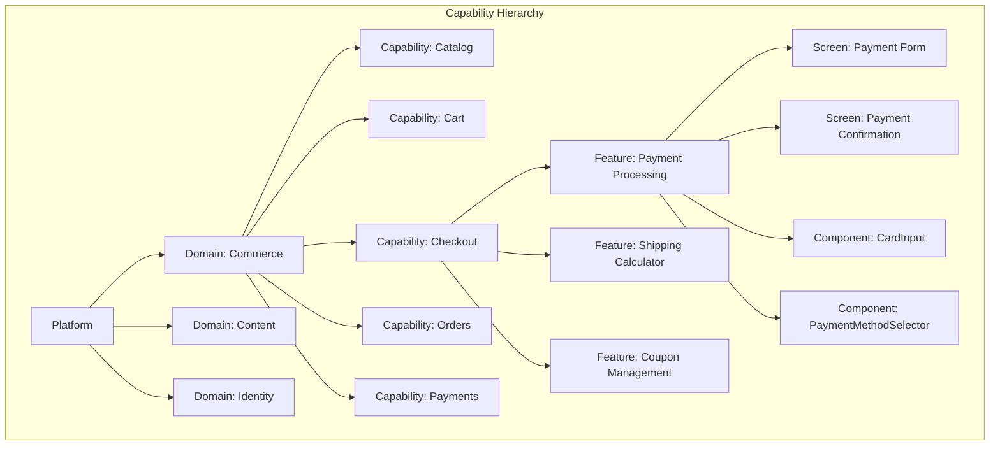
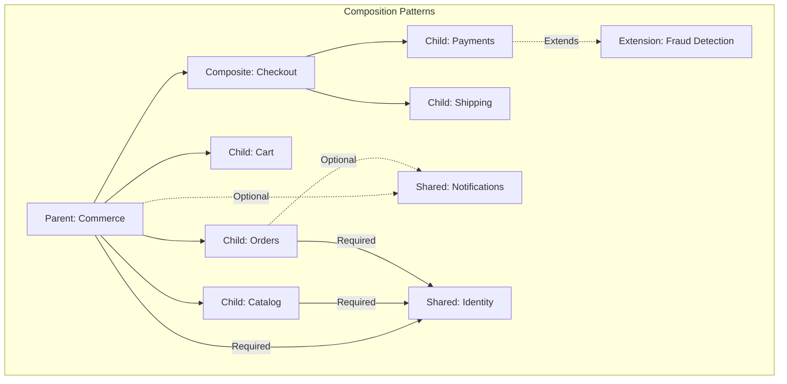
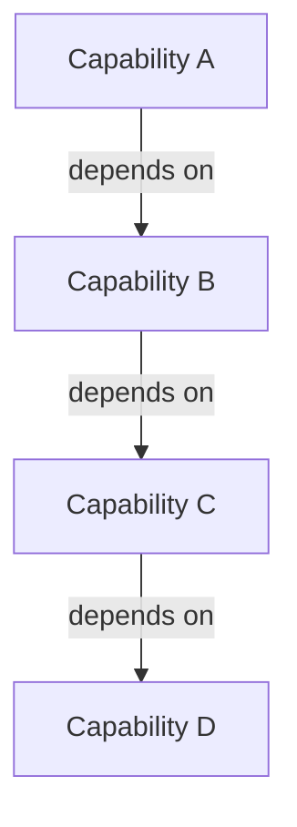
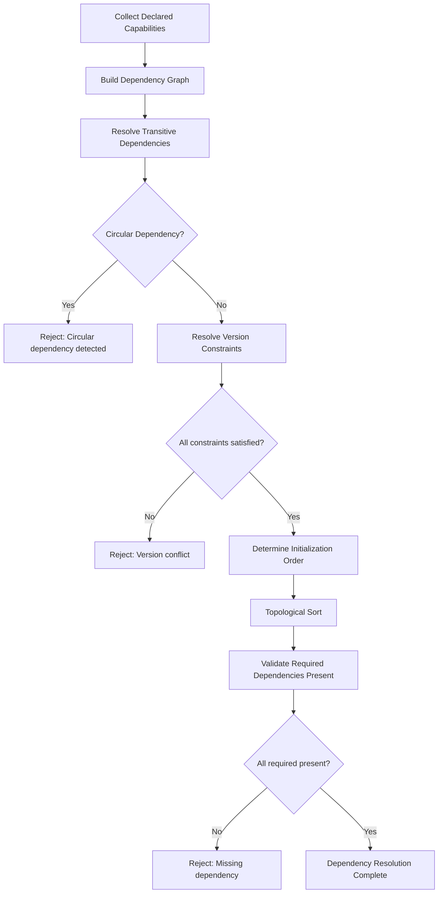
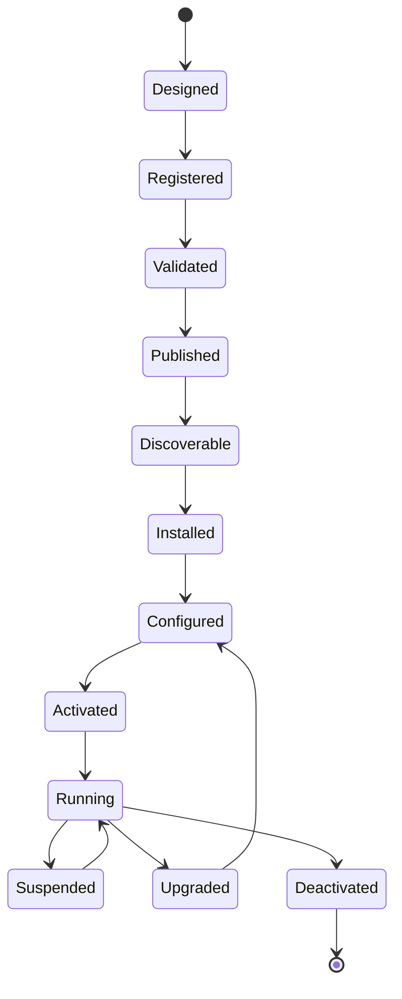

# Capability Composition Model

**KB-050 — Capability Composition Model Specification**

| Metadata | |
|----------|---|
| **KB ID** | KB-050 |
| **Title** | Capability Composition Model |
| **Version** | 0.1.0 |
| **Status** | Draft |
| **Owner** | Architecture Team |
| **Dependencies** | KB-010 Capability System, KB-034 Extension & Plugin Framework, KB-035 Capability Marketplace, KB-041 Application Architecture Overview, KB-042 Application Manifest Specification, KB-044 Navigation Architecture, KB-045 Screen Model, KB-046 Component Tree Model, KB-047 Action & Event Model, KB-048 State Model, KB-049 Theme & Design Token Model, KB-051 Runtime Architecture Overview |
| **Related Documents** | KB-032 Marketplace Architecture, KB-033 Package & Artifact Specification, KB-036 Component Marketplace, KB-037 Theme Marketplace, KB-052 Runtime Rendering Engine |
| **Review Status** | Pending |
| **Last Updated** | 2026-07-11 |

### Revision History

| Version | Date | Author | Change |
|---------|------|--------|--------|
| 0.1.0 | 2026-07-11 | AI Architecture Agent | Initial draft |

---

## 1. Executive Summary

### 1.1 Purpose

This document defines the canonical Capability Composition Model for the DUKADESK platform. It establishes how capabilities are defined, contracted, discovered, composed, and governed to build applications, desks, workflows, and experiences.

A Capability is the fundamental business building block of the platform. Applications do not directly depend on components, screens, or services — they are composed from capabilities, which encapsulate complete business functionality and expose well-defined contracts. Composition is the architectural mechanism that transforms independent capabilities into cohesive, running applications.

This model is the culmination of the Application Architecture Suite (KB-041 through KB-050). Every preceding document — Navigation, Screen, Component Tree, Action & Event, State, Theme — defines elements that capabilities own, contribute, and compose. This document defines the composition rules that bind them together.

### 1.2 Scope

This document covers:

- Canonical definitions of Capability, Capability Definition, Contract, Instance, Package, Registry, Metadata, Context, Boundary, and Lifecycle
- The capability hierarchy from Platform through Component
- Capability categories across all business domains
- Composition patterns: parent-child, shared, composite, extension, optional
- The capability contract model: inputs, outputs, events, state, permissions, dependencies, configuration, extension points
- The dependency model: required, optional, transitive, circular prevention, version constraints
- The capability lifecycle from design through retirement
- Discovery architecture: registry, marketplace, runtime, builder, SDK
- Relationships to Manifest, Components, Screens, Navigation, Actions, State, Theme, and Extensions
- Responsibilities for Runtime, Builder, Marketplace, Registry
- Security, performance, offline, observability, failure scenarios, and anti-patterns

Out of scope:

- Capability System implementation (handled by KB-010)
- Capability Marketplace implementation (handled by KB-035)
- Extension & Plugin Framework implementation (handled by KB-034)
- Specific capability business logic (handled by capability authors)
- Package format and signing (handled by KB-033)

---

## 2. Architectural Principles

### Capability-First Architecture

Capabilities are the primary unit of business functionality. Applications are composed from capabilities, not built from scratch. Every feature, screen, action, workflow, and integration within an application belongs to exactly one capability.

### Modular Composition

Capabilities are independently developed, tested, versioned, and deployed. They compose to form applications through declarative declarations, not through code-level integration. Composition is explicit, auditable, and reversible.

### Loose Coupling

Capabilities communicate through well-defined contracts — services, actions, events, and APIs — never through direct internals. A capability has no knowledge of another capability's implementation. Coupling is by contract, not by reference.

### Contract-Driven Integration

Every capability exposes a formal contract. Consumers depend on the contract, not the implementation. Contracts are versioned, stable, and evolve through backward-compatible extensions. Breaking changes require major version bumps and coordinated migration.

### Versioned Capabilities

Capabilities follow semantic versioning. Every published version is immutable. Version constraints enable safe dependency resolution. Compatibility is validated at installation, not at runtime.

### Marketplace Distributable

Capabilities are distributed through the Capability Marketplace. They are packaged, signed, validated, certified, and discoverable. Any authorized publisher can create and distribute capabilities.

### Runtime Discoverable

The Runtime discovers capabilities through the Capability Registry at load time. The Registry provides capability definitions, dependency graphs, configuration schemas, and lifecycle state. Discovery is declarative — the Runtime reads the Manifest and resolves from the Registry.

### Builder Composable

The Builder Studio provides visual composition tools. Application authors select, configure, and compose capabilities without writing code. The Builder validates composition rules, resolves dependencies, and produces the Application Manifest.

### Secure by Design

Capabilities operate within strict security boundaries. A capability cannot access another capability's data, state, or services without explicit permission grants. All inter-capability communication is authorized, audited, and isolated.

### Platform Independent

The capability model makes no assumptions about any specific Runtime, platform, or hardware. Capabilities are defined in platform-agnostic terms. Platform-specific adaptations are handled by the Runtime's platform abstraction layer.

---

## 3. Canonical Definitions

### 3.1 Capability

A Capability is a self-contained, independently versioned unit of business functionality. It encapsulates everything needed to deliver a business function — screens, components, actions, events, state, services, workflows, configuration, permissions, and assets.

```text
Capability {
    id:              string            // Globally unique capability ID
    name:            string            // Machine-readable name
    version:         string            // Current semantic version
    metadata:        CapabilityMetadata // Discovery and documentation metadata
    contract:        CapabilityContract // Formal contract (inputs, outputs, events, etc.)
    dependencies:    Dependency[]      // Required and optional capability dependencies
    configuration:   ConfigurationSchema // Declared configuration schema
    permissions:     Permission[]      // Required platform and data permissions
    contributions:   Contribution[]    // Screens, navigation, components, actions, etc.
    lifecycle:       LifecycleHooks    // Install, activate, suspend, upgrade hooks
}
```

### 3.2 Capability Definition

A Capability Definition is the complete, versioned, serializable representation of a capability. It is the artifact produced by the capability developer, stored in the Capability Registry, and referenced by the Application Manifest.

```text
CapabilityDefinition {
    id:              string            // Immutable capability identifier
    version:         string            // Semantic version
    package:         PackageReference  // Link to the distributable package
    schema:          object            // Full capability schema
    signature:       string            // Publisher signature
    manifest:        CapabilityManifest // Human-readable metadata
}
```

### 3.3 Capability Contract

The Capability Contract is the formal specification of everything a capability exposes and requires. It is the agreement between the capability and its consumers.

```text
CapabilityContract {
    services:        ServiceContract[]     // Business service APIs
    actions:         ActionContract[]      // UI-triggerable operations
    events: {
        publishes:   EventContract[]       // Events the capability emits
        subscribes:  EventContract[]       // Events the capability consumes
    }
    state:           StateContract[]       // State keys and schemas
    permissions:     PermissionContract[]  // Required and granted permissions
    dependencies:    Dependency[]          // Required and optional dependencies
    configuration:   ConfigurationContract // Configuration schema and defaults
    extensionPoints: ExtensionPoint[]      // Points where other capabilities extend
    ui: {
        screens:     ScreenReference[]     // Screens contributed
        components:  ComponentReference[]  // Components contributed
        navigation:  NavigationContribution[] // Routes, tabs, menus contributed
    }
}
```

### 3.4 Capability Instance

A Capability Instance is a single activated occurrence of a capability within an application context. Each instance has its own configuration, state, and lifecycle.

```text
CapabilityInstance {
    capabilityId:    string            // Capability definition ID
    instanceId:      string            // Unique instance ID
    applicationId:   string            // Owning application
    tenantId:        string            // Owning tenant
    workspaceId:     string            // Owning workspace
    configuration:   object            // Resolved configuration
    state:           CapabilityState   // Current lifecycle state
    activatedAt:     datetime
    configApplied:   datetime
}
```

### 3.5 Capability Package

A Capability Package is the signed, versioned, immutable archive containing the capability definition and all its artifacts — screens, components, assets, translations, and documentation.

### 3.6 Capability Registry

The Capability Registry is the authoritative catalog of all capabilities known to the platform. It stores capability definitions, manages versioning, resolves dependencies, and provides discovery interfaces.

### 3.7 Capability Metadata

```text
CapabilityMetadata {
    id:              string            // Globally unique ID
    name:            string            // Display name
    description:     string            // Purpose and functionality description
    category:        string            // Business domain category
    subcategory:     string            // Functional subcategory
    publisher:       string            // Publisher identifier
    publisherName:   string            // Publisher display name
    tags:            string[]          // Discovery and classification tags
    icon:            AssetReference    // Capability icon
    screenshots:     AssetReference[]  // Marketplace listing screenshots
    documentation:   URL               // Documentation reference
    license:         string            // License type
    support:         SupportInfo       // Support contact info
    created:         datetime
    updated:         datetime
}
```

### 3.8 Capability Context

The Capability Context is the runtime environment provided to a capability instance. It is populated by the Runtime at activation time.

```text
CapabilityContext {
    instanceId:      string
    tenant:          TenantContext
    workspace:       WorkspaceContext
    application:     ApplicationContext
    session:         SessionContext
    user:            UserContext
    runtime:         RuntimeContext
    registry:        RegistryContext      // References to other capabilities
    eventBus:        EventBusReference    // Publish/subscribe access
    stateManager:    StateManagerReference // State access
    actionEngine:    ActionEngineReference // Action registration
}
```

### 3.9 Capability Boundary

A Capability Boundary is the isolation perimeter around a capability. It defines what the capability can access, what it can expose, and how it communicates with the outside world.

```text
CapabilityBoundary {
    data: {
        owns:            string[]       // State keys this capability owns
        reads:           string[]       // State keys from other capabilities
        persistence:     "isolated" | "shared"
    }
    communication: {
        eventsPublish:   string[]       // Event types this capability publishes
        eventsSubscribe: string[]       // Event types this capability subscribes to
        actionsRegister: string[]       // Action types this capability registers
    }
    permissions: {
        required:        Permission[]   // Permissions this capability needs
        granted:         Permission[]   // Permissions granted at installation
    }
    isolation: {
        runtime:         "process" | "thread" | "sandbox"
        storage:         "dedicated" | "partitioned"
        network:         "restricted" | "open"
    }
}
```

### 3.10 Capability Lifecycle

```text
CapabilityLifecycle {
    states: [
        "designed",
        "registered",
        "validated",
        "published",
        "discoverable",
        "installed",
        "configured",
        "activated",
        "running",
        "suspended",
        "upgraded",
        "deactivated",
        "retired"
    ]
    transitions: {
        designed:          ["registered"]
        registered:        ["validated"]
        validated:         ["published"]
        published:         ["discoverable"]
        discoverable:      ["installed"]
        installed:         ["configured"]
        configured:        ["activated"]
        activated:         ["running"]
        running:           ["suspended", "upgraded", "deactivated"]
        suspended:         ["running", "deactivated"]
        upgraded:          ["configured"]
        deactivated:       ["retired"]
    }
}
```

---

## 4. Capability Hierarchy



### 4.1 Platform Level

The Platform defines the runtime environment and foundational capabilities that all capabilities depend on — Identity, Event Bus, State Manager, Action Engine, Component Registry.

### 4.2 Domain Level

Domains group related capabilities into business areas. Commerce, Content, Identity, Communication, Analytics, and AI are examples. Domains are organizational, not architectural — they impose no runtime constraints.

### 4.3 Capability Level

A Capability is the unit of composition. It is independently versioned, configured, and lifecycle-managed. Capabilities are the granularity at which applications declare dependencies.

### 4.4 Feature Level

Features are functional subdivisions within a capability. They are not independently deployed but may be independently configured, permissioned, and feature-flagged.

### 4.5 Screen Level

Screens are UI destinations contributed by capabilities. Each screen is owned by exactly one capability and registered in the application's navigation graph.

### 4.6 Component Level

Components are reusable UI elements contributed by capabilities. Each component is registered in the Component Registry and associated with its owning capability.

---

## 5. Capability Categories

### 5.1 Identity

Authentication, authorization, user management, session management, role management, permission evaluation, single sign-on, multi-factor authentication.

### 5.2 Commerce

Product catalog, shopping cart, checkout, order management, payment processing, inventory management, pricing, promotions, shipping, tax calculation.

### 5.3 Content

Content management, rich text editing, media management, document generation, digital asset management, knowledge base, FAQ management.

### 5.4 Communication

Email, SMS, push notifications, in-app messaging, chat, real-time messaging, notification preferences, notification templates, delivery tracking.

### 5.5 Payments Integration

Payment gateway integration, payment method management, subscription billing, invoicing, refund processing, reconciliation, payment analytics.

### 5.6 Orders

Order creation, order processing, order fulfilment, order tracking, order history, order cancellation, returns management, exchange processing.

### 5.7 Inventory

Inventory tracking, stock management, warehouse management, supplier management, purchase orders, inventory forecasting, stock alerts.

### 5.8 Customers

Customer profiles, customer segmentation, customer history, loyalty programs, customer communication preferences, customer support tickets.

### 5.9 Analytics

Usage analytics, business intelligence, reporting dashboards, data export, event tracking, funnel analysis, cohort analysis, custom report builder.

### 5.10 Notifications

Notification delivery, notification preferences, notification templates, scheduled notifications, triggered notifications, notification history.

### 5.11 Location

Geolocation, maps integration, proximity search, address validation, distance calculation, geofencing, location-based services.

### 5.12 Media

Image processing, video streaming, audio recording, media transcoding, CDN integration, image optimization, video thumbnail generation.

### 5.13 AI

Machine learning inference, natural language processing, image recognition, recommendation engine, content classification, sentiment analysis, predictive analytics.

### 5.14 Workflow

Workflow definition, workflow execution, approval workflows, task assignment, escalation management, workflow templates, workflow analytics.

### 5.15 Forms

Form builder, form rendering, form validation, form submission, form data management, conditional form logic, multi-step forms.

### 5.16 Documents

Document generation, document templates, document signing, document storage, document versioning, document sharing, document workflow.

### 5.17 Scheduling

Appointment scheduling, resource booking, calendar management, availability management, scheduling conflicts, reminder management.

### 5.18 Search

Full-text search, faceted search, search indexing, search relevance, autocomplete, search analytics, synonym management.

### 5.19 Integrations

Third-party API integration, webhook management, data synchronization, ETL pipelines, integration marketplace, custom connector builder.

### 5.20 Custom

Application-defined or marketplace-defined capabilities not covered by standard categories. Custom capabilities follow the same architectural contracts as platform capabilities.

---

## 6. Capability Composition

### 6.1 Parent Capability

A Parent Capability is a higher-level capability that composes child capabilities. The parent may provide its own functionality while delegating specific concerns to children.

```text
ParentCapability {
    id:              "commerce"
    children:        ["catalog", "cart", "checkout", "orders", "payments"]
    isComposite:     true
    sharedContext:   ["customer", "currency", "locale"]
}
```

### 6.2 Child Capability

A Child Capability is declared as a dependency of a parent capability. It functions independently but contributes to the parent's overall business function.

### 6.3 Shared Capability

A Shared Capability is installed once and consumed by multiple parent capabilities. Version consistency is enforced across all consumers.

```text
SharedCapability {
    id:              "notifications"
    consumers:       ["commerce", "booking", "content"]
    shared:          true
    versionPolicy:   "single"           // All consumers use the same version
}
```

### 6.4 Composite Capability

A Composite Capability is a capability whose sole purpose is to compose child capabilities into a higher-level function. It may contribute its own screens, navigation, and actions that orchestrate its children.

### 6.5 Extension Capability

An Extension Capability extends the functionality of another capability through declared extension points. It does not replace or modify the extended capability — it adds capabilities at specific points.

```text
ExtensionCapability {
    id:              "loyalty-program"
    extends:         "commerce.checkout"
    extensionPoint:  "post-payment"
    contributions: {
        screens:     ["loyalty.enrollment"]
        actions:     ["loyalty.awardPoints"]
        state:       ["loyalty.programId"]
    }
}
```

### 6.6 Optional Capability

An Optional Capability enhances the application if present but does not block functionality if absent. The application degrades gracefully.

```text
OptionalCapability {
    id:              "recommendations"
    required:        false
    fallback:        "default"          // Behaviour when not installed
}
```



---

## 7. Capability Contract

### 7.1 Inputs

Inputs are the data and context a capability receives to perform its function.

| Input Type | Description | Example |
|------------|-------------|---------|
| **Configuration** | Declared configuration values | API keys, feature toggles, display settings |
| **Context** | Runtime context provided at activation | Tenant, user, session, workspace |
| **Parameters** | Action or service call parameters | Order ID, product ID, quantity |
| **Events** | Events the capability subscribes to | `order.created`, `payment.completed` |
| **State** | Shared state from other capabilities | Customer profile, current cart |

### 7.2 Outputs

Outputs are what a capability produces for consumers.

| Output Type | Description | Example |
|-------------|-------------|---------|
| **Services** | Synchronous API responses | Order details, product list, cart total |
| **Actions** | UI-triggered operation results | Order placed, payment processed |
| **Events** | Notifications published to Event Bus | `order.created`, `inventory.updated` |
| **State** | State exposed to State Registry | `commerce.cart`, `orders.current` |
| **UI** | Screens and components rendered | Payment form, order detail |

### 7.3 Events

Events are the primary asynchronous communication mechanism between capabilities.

```text
EventContract {
    name:            string            // Fully qualified event name
    version:         string            // Event schema version
    direction:       "publishes" | "subscribes" | "both"
    schema:          object            // Event payload schema
    examples:        object[]          // Example payloads
    description:     string            // When and why the event is emitted
}
```

### 7.4 State

State is the data a capability owns and exposes.

```text
StateContract {
    keys:            StateKey[]        // State keys this capability owns
    scope:           "local" | "shared" | "global"
    persistence:     "temporary" | "session" | "persistent"
    consumers:       string[]          // Other capabilities that consume this state
    mutators:        string[]          // Who may mutate this state
}
```

### 7.5 Permissions

```text
PermissionContract {
    requires:        Permission[]      // Permissions the capability needs
    grants:          Permission[]      // Permissions the capability provides
    scope:           "capability" | "feature" | "data" | "platform"
    enforcement:     "registration" | "installation" | "runtime"
}
```

### 7.6 Dependencies

See Dependency Model (Section 8).

### 7.7 Configuration

```text
ConfigurationContract {
    schema:          object            // JSON Schema for configuration
    defaults:        object            // Default configuration values
    levels:          ["platform", "tenant", "application", "workspace"]
    secrets:         string[]          // Fields that contain secrets
    validation:      ValidationRule[]  // Configuration validation rules
}
```

### 7.8 Extension Points

```text
ExtensionPoint {
    id:              string            // Extension point identifier
    name:            string            // Display name
    description:     string            // What extensions can do at this point
    type:            "action" | "event" | "screen" | "component" | "service"
    contract:        object            // What the extension must conform to
    cardinality:     "one" | "many"     // How many extensions can attach
    required:        boolean           // Whether an extension is required
}
```

---

## 8. Dependency Model

### 8.1 Dependency Types

```text
Dependency {
    capabilityId:    string            // Dependent capability ID
    version:         string            // Version constraint
    type:            "required" | "optional" | "incompatible" | "shared"
    description:     string            // Why this dependency exists
    scope:           "all" | "feature" | "screen"  // Scope of the dependency
    configuration:   object            // Configuration to pass to the dependency
}
```

### 8.2 Required Dependencies

Capability cannot function without this dependency. The application cannot activate if the dependency is missing or incompatible.

### 8.3 Optional Dependencies

Capability functions without the dependency but provides enhanced functionality when it is present. The application activates regardless.

### 8.4 Transitive Dependencies

Dependencies of dependencies. The dependency resolver walks the full transitive graph during resolution. All transitive dependencies must satisfy version constraints.

### 8.5 Circular Dependency Prevention

The capability dependency graph must be a Directed Acyclic Graph (DAG). Circular dependencies are detected and rejected during validation:



### 8.6 Compatibility Rules

| Rule | Description |
|------|-------------|
| **Major version** | Breaking changes expected. Consumer must test and potentially modify. |
| **Minor version** | New functionality only. Consumer should upgrade without changes. |
| **Patch version** | Bug fixes only. Consumer should upgrade without changes. |
| **Pre-release** | No compatibility guarantees. |
| **Shared capability** | All consumers must use the same version. |

### 8.7 Version Constraints

| Constraint | Meaning |
|------------|---------|
| `1.2.3` | Exact version |
| `^1.2.3` | >=1.2.3 and <2.0.0 |
| `~1.2.3` | >=1.2.3 and <1.3.0 |
| `>=1.2.3` | Minimum version |
| `<2.0.0` | Maximum version (exclusive) |
| `1.x` | Any 1.x version |
| `*` | Any version |

### 8.8 Dependency Resolution



---

## 9. Capability Lifecycle



### 9.1 Stage Descriptions

| Stage | Description | Owner |
|-------|-------------|-------|
| **Designed** | Capability definition and specification created | Developer |
| **Registered** | Capability registered in Capability Registry with metadata and contract | Registry |
| **Validated** | Schema, dependencies, permissions, and compatibility validated | Validation Engine |
| **Published** | Capability package built, signed, and published to Marketplace | Publisher |
| **Discoverable** | Capability listing available for search and discovery | Marketplace |
| **Installed** | Package downloaded, integrity verified, assets extracted | Runtime / Marketplace |
| **Configured** | Configuration applied from all levels (platform, tenant, application, workspace) | Runtime |
| **Activated** | Capability fully loaded: services registered, events wired, UI contributions registered | Runtime |
| **Running** | Steady state — capability actively serving its function | Runtime |
| **Suspended** | Temporarily disabled. State preserved. Resources released. | Runtime |
| **Upgraded** | New version installed. Transitions through Configured → Activated. | Runtime |
| **Deactivated** | Permanently disabled. Config and data retained for potential reactivation. | Runtime |
| **Retired** | Removed from Marketplace. Existing instances may continue or be migrated. | Marketplace |

### 9.2 Lifecycle Hooks

```text
LifecycleHooks {
    onInstall:       Action[]          // Before installation completes
    onConfigure:     Action[]          // Configuration applied
    onActivate:      Action[]          // Before activation
    onRunning:       Action[]          // After activation, ready to serve
    onSuspend:       Action[]          // Before suspension
    onResume:        Action[]          // Before returning to running
    onUpgrade:       Action[]          // Before version upgrade
    onDeactivate:    Action[]          // Before deactivation
    onRetire:        Action[]          // Before retirement
}
```

---

## 10. Capability Discovery

### 10.1 Registry Discovery

The Capability Registry provides programmatic discovery:

- Query by capability ID, category, domain, publisher, tag
- Full-text search across name, description, metadata
- Version listing and constraint resolution
- Dependency graph traversal
- Compatibility checking against Runtime version

### 10.2 Marketplace Discovery

The Marketplace provides user-facing discovery:

- Category browsing and filtering
- Featured and recommended capabilities
- Search with relevance ranking
- Compatibility filtering by Runtime version and platform
- Publisher verification and ratings

### 10.3 Runtime Discovery

The Runtime discovers capabilities at application load time:

1. Read capability declarations from Application Manifest
2. Resolve each capability ID against the Capability Registry
3. Build the full dependency graph
4. Validate all constraints
5. Download or load any uncached capability packages
6. Register capability contributions (screens, components, actions, state)

### 10.4 Builder Discovery

The Builder Studio discovers capabilities for application composition:

- Browse available capabilities by category and domain
- View capability details: description, screenshots, version history
- Configure capability settings before inclusion
- Visualize dependency graph
- Preview capability contribution before committing

### 10.5 SDK Discovery

The SDK provides programmatic discovery for developers:

- Language-specific client libraries for the Capability Registry API
- Type definitions for capability contracts
- Sandbox environment for testing capability integration
- Documentation and code examples

---

## 11. Runtime Responsibilities

| Responsibility | Description |
|----------------|-------------|
| **Capability Loading** | Load capability definitions from Registry on application start |
| **Dependency Resolution** | Build and validate dependency graph, resolve version constraints |
| **Lifecycle Management** | Manage capability lifecycle: install → configure → activate → run → suspend → upgrade → deactivate |
| **Context Provision** | Provide Capability Context (tenant, user, session, workspace) |
| **Isolation Enforcement** | Enforce capability boundaries — no cross-capability access without authorization |
| **Configuration Application** | Apply configuration from all levels (platform, tenant, app, workspace) |
| **Contribution Registration** | Register capability-contributed screens, components, actions, events, state with appropriate subsystems |
| **Health Monitoring** | Monitor capability health, handle failures, manage suspended state |
| **Resource Management** | Enforce resource limits (CPU, memory, storage, network) per capability sandbox |
| **Event Routing** | Route events between capabilities through the Event Bus |

---

## 12. Builder Responsibilities

| Responsibility | Description |
|----------------|-------------|
| **Capability Browser** | Display available capabilities from Registry with search and filtering |
| **Composition Designer** | Enable drag-and-drop composition of capabilities into applications |
| **Dependency Visualizer** | Display dependency graph with version constraints |
| **Configuration Editor** | Provide per-capability configuration UI based on declared schema |
| **Conflict Detection** | Detect version conflicts, circular dependencies, and permission mismatches |
| **Contribution Preview** | Preview screens, components, and navigation contributed by each capability |
| **Manifest Generation** | Produce the Application Manifest with all capability declarations |
| **Validation** | Validate capability composition before publishing |
| **Upgrade Simulator** | Simulate capability upgrades and detect breaking changes |

---

## 13. Marketplace Responsibilities

| Responsibility | Description |
|----------------|-------------|
| **Package Acceptance** | Accept capability packages from publishers |
| **Validation** | Validate package structure, contract completeness, dependency correctness |
| **Certification** | Certify capabilities against platform standards |
| **Catalog Management** | Maintain searchable catalog with categories, tags, ratings |
| **Version Management** | Manage capability versions and compatibility constraints |
| **Distribution** | Deliver capability packages to Runtime environments |
| **Licensing** | Enforce license terms for paid capabilities |
| **Updates** | Notify consumers of capability updates and security patches |
| **Deprecation** | Manage capability deprecation and retirement lifecycle |

---

## 14. Registry Responsibilities

| Responsibility | Description |
|----------------|-------------|
| **Definition Storage** | Store all capability definitions with version history |
| **Metadata Catalog** | Maintain searchable metadata for all registered capabilities |
| **Version Resolution** | Resolve version constraints to concrete versions |
| **Dependency Validation** | Validate dependency graphs at registration time |
| **Compatibility Checking** | Check compatibility with Runtime versions and platform targets |
| **Discovery API** | Provide query, search, and listing APIs |
| **Lifecycle Tracking** | Track capability lifecycle state |
| **Signature Verification** | Verify publisher signatures on capability packages |

---

## 15. Manifest Responsibilities

The Application Manifest (KB-042) declares which capabilities compose the application:

```text
capabilities: [
    {
        id:              "core.identity"
        version:         "^2.0"
        type:            "required"
    },
    {
        id:              "commerce.catalog"
        version:         "^3.1"
        type:            "required"
        configuration: {
            pageSize:     20
            enableReviews: true
        }
    },
    {
        id:              "commerce.recommendations"
        version:         "^1.0"
        type:            "optional"
        configuration: {
            algorithm: "collaborative-filtering"
        }
    }
]
```

The Manifest does not contain capability definitions. It references them by ID. Definitions are resolved from the Capability Registry at build and load time.

---

## 16. Component Relationship

Capabilities own Components. Each component registered in the Component Registry is associated with its owning capability (KB-046).

| Capability Composition | Component Tree Model |
|----------------------|---------------------|
| Capabilities register components | Components are resolved from Registry |
| Capability activation enables its components | Inactive capability components are unavailable |
| Capabilities contribute component definitions | Component Tree references components by ID |
| Component availability is capability-scoped | Cross-capability composition is validated |

---

## 17. Screen Relationship

Capabilities own Screens. Each screen is contributed by exactly one capability (KB-045).

| Capability Composition | Screen Model |
|----------------------|--------------|
| Capabilities contribute screen definitions | Screens are referenced by route |
| Capability activation enables its screens | Inactive capability screens are inaccessible |
| Screen IDs include capability prefix | Screen ownership is explicit |
| Capabilities may override screens from other capabilities | Application-level screen override |

---

## 18. Navigation Relationship

Capabilities contribute navigation entries — routes, tabs, menu items, deep links (KB-044).

| Capability Composition | Navigation Architecture |
|----------------------|------------------------|
| Capabilities declare navigation contributions | Navigation Engine merges contributions into graph |
| Routes carry capability ownership | Navigation Engine verifies capability is active |
| Capability installation adds navigation entries | Navigation graph is re-evaluated |
| Capability removal removes navigation entries | Orphaned routes are cleaned up |

---

## 19. Action Relationship

Capabilities register Action types with the Action Engine (KB-047).

| Capability Composition | Action & Event Model |
|----------------------|---------------------|
| Capabilities register action handlers | Action Engine dispatches by action type |
| Capabilities declare action contracts | Action definitions are part of capability contract |
| Capabilities subscribe to events from other capabilities | Event Bus routes cross-capability events |
| Capability actions are only available when capability is active | Action Registry filters by active capabilities |

---

## 20. State Relationship

Capabilities own state keys in the State Registry (KB-048).

| Capability Composition | State Model |
|----------------------|-------------|
| Capabilities register state keys on activation | State Manager isolates per-capability state |
| Capability state ownership is exclusive | Only owning capability may mutate |
| Capabilities may read shared state from other capabilities | Declared in contract |
| Capability deactivation disposes its state keys | State cleanup is automatic |

---

## 21. Theme Relationship

Capabilities may contribute theme extensions — component overrides and token additions (KB-049).

| Capability Composition | Theme & Design Token Model |
|----------------------|---------------------------|
| Capabilities declare component token overrides | Theme resolution includes capability layer |
| Capabilities may add new semantic tokens | Token catalog is extensible |
| Capability theme layer is merged at resolution | Capability overrides are capability-scoped |
| Capability deactivation removes its theme layer | Theme falls back to underlying values |

---

## 22. Extension Relationship

The Extension & Plugin Framework (KB-034) enables capabilities to be extended by third-party extensions.

| Capability Composition | Extension & Plugin Framework |
|----------------------|----------------------------|
| Capabilities declare extension points | Extensions attach to extension points |
| Extensions extend capability behaviour | Extensions register through capability contract |
| Capability lifecycle controls extension lifecycle | Extension activation follows capability activation |
| Extensions cannot bypass capability boundaries | Extension must conform to capability contract |

---

## 23. Security

### 23.1 Capability Trust

| Level | Description |
|-------|-------------|
| **Platform** | Bundled with Runtime. Fully trusted. |
| **Certified** | Marketplace-certified. Verified publisher, validated package, signed. |
| **Community** | Published by community member. Signed but limited certification. |
| **Custom** | Organization-developed. Trusted within organization boundary. |
| **Untrusted** | Not from a verified source. Sandboxed with restricted permissions. |

### 23.2 Signature Validation

- All capability packages are cryptographically signed by the publisher
- Signatures are verified at installation and load time
- Signature verification failure blocks activation
- Publisher keys are managed by the Marketplace trust store

### 23.3 Permission Boundaries

- Capabilities cannot access another capability's state, services, or data without explicit grants
- Permission grants are declared in the capability contract
- Grants are reviewed at installation (admin approval) and enforced at runtime
- Cross-capability access is mediated by the Runtime, not direct

### 23.4 Tenant Isolation

- Capability instances are isolated per tenant
- One tenant's capability configuration does not affect another's
- Tenant-scoped data is inaccessible to other tenants
- Cross-tenant capability invocation is blocked

### 23.5 Capability Sandboxing

| Resource | Sandbox Control |
|----------|----------------|
| CPU | CPU quota per capability instance |
| Memory | Memory limit per capability instance |
| Storage | Isolated storage partition |
| Network | Restricted network access per declared permissions |
| System calls | Intercepted and authorized |
| File system | Capability-scoped directory only |

### 23.6 Dependency Verification

- Dependency integrity is verified through transitive signature checking
- Dependency version constraints are enforced
- Dependency substitution or hijacking is detected through checksum verification
- Supply chain attacks are mitigated through signed dependency chains

---

## 24. Performance

### 24.1 Lazy Capability Loading

- Capability packages are loaded on demand, not eagerly
- Only capabilities declared in the active workspace are loaded
- Capability assets (screens, components) are loaded when first accessed
- Inactive workspace capabilities remain cached but not loaded

### 24.2 Dependency Resolution

- Dependency graph is resolved once at application load
- Resolution results are cached for the application session
- Version resolution uses a pre-computed index for O(1) lookup
- Transitive dependency resolution is memoized

### 24.3 Runtime Composition

- Capability contribution registration is batched during activation
- Screen and component registrations are indexed by ID
- State key registration is O(1) per key
- Action and event registrations are indexed for O(1) dispatch

### 24.4 Caching

| Cache | Scope | Invalidation |
|-------|-------|-------------|
| Capability definitions | Session | Application reload |
| Dependency resolution | Session | Application reload |
| Capability configuration | Session | Configuration change |
| Contribution registry | Session | Capability activation/deactivation |

### 24.5 Registry Performance

- Registry queries are cached with TTL (default: 5 minutes)
- Registry indices are pre-built for common query patterns
- Registry responses are paginated for large result sets
- Registry availability is designed for 99.9% uptime

---

## 25. Offline Behaviour

### 25.1 Installed Capabilities

Capabilities installed before going offline continue to function:

- Cached capability definitions are used at load time
- Local capability state is available
- Inter-capability communication that requires network is queued
- Capability configuration changes made offline are applied on reconnection

### 25.2 Cached Definitions

- Capability definitions are cached locally at installation
- Definition cache survives application restart
- Cache is invalidated when a new version is installed
- Cache enables offline application loading

### 25.3 Deferred Updates

- Capability updates received while offline are queued
- Updates are applied on reconnection when the application next reloads
- Update dependencies are verified before application
- Breaking updates require user confirmation even if queued offline

### 25.4 Synchronization

- Offline capability state changes are queued per capability
- State is synchronized when connectivity is restored
- Conflicts are resolved per capability contract
- Synchronization order follows dependency order

---

## 26. Observability

### 26.1 Capability Events

| Event | Trigger |
|-------|---------|
| `capability.installed` | Capability package installed |
| `capability.configured` | Capability configuration applied |
| `capability.activated` | Capability activated and running |
| `capability.suspended` | Capability suspended |
| `capability.resumed` | Capability returned to running |
| `capability.upgraded` | Capability version upgraded |
| `capability.deactivated` | Capability deactivated |
| `capability.error` | Capability encountered error |
| `capability.healthChanged` | Capability health status changed |

### 26.2 Metrics

| Metric | Description |
|--------|-------------|
| Active capability count | Number of currently active capabilities |
| Capability load time | Time to load and activate a capability |
| Dependency resolution time | Time to build and validate dependency graph |
| Configuration time | Time to apply capability configuration |
| Contribution registration time | Time to register capability contributions |
| State key count | Number of state keys owned by each capability |
| Action registration count | Actions registered by each capability |
| Inter-capability event count | Events published between capabilities |

### 26.3 Failures

| Failure | Event + Code |
|---------|--------------|
| Missing capability | `capability.error` — `CAPABILITY_NOT_FOUND` |
| Invalid contract | `capability.error` — `INVALID_CONTRACT` |
| Version conflict | `capability.error` — `VERSION_CONFLICT` |
| Dependency failure | `capability.error` — `DEPENDENCY_FAILURE` |
| Circular dependency | `capability.error` — `CIRCULAR_DEPENDENCY` |
| Permission denied | `capability.error` — `PERMISSION_DENIED` |
| Registry unavailable | `capability.error` — `REGISTRY_UNAVAILABLE` |

### 26.4 Upgrade Metrics

| Metric | Description |
|--------|-------------|
| Upgrade count | Number of capability upgrades applied |
| Upgrade duration | Time to complete capability upgrade |
| Breaking changes | Number of breaking changes detected |
| Rollback count | Number of capability rollbacks performed |
| Upgrade success rate | Percentage of successful upgrades |

---

## 27. Failure Scenarios

| Scenario | Behaviour |
|----------|-----------|
| **Missing Capability** | Capability referenced in Manifest not found in Registry. Application load fails with diagnostic. |
| **Invalid Contract** | Capability contract does not match expected schema. Validation failure at registration or installation. |
| **Version Conflict** | Two capabilities require incompatible versions of the same dependency. Resolution fails. Application load blocked. |
| **Dependency Failure** | Required dependency cannot be resolved or activated. Parent capability activation fails. Error reported. |
| **Circular Dependency** | Capability A depends on B which depends on A. Dependency graph validation fails. |
| **Permission Denied** | Capability requests a permission not granted at installation. Activation blocked. Admin notified. |
| **Registry Unavailable** | Capability Registry cannot be reached at application load time. Cached definitions used if available. Partial load if critical capability missing. |
| **Unsupported Runtime** | Capability requires a newer Runtime version. Installation blocked. Migration path suggested. |
| **Configuration Invalid** | Provided configuration fails schema validation. Configuration rejected. Defaults used with warning. |
| **Activation Timeout** | Capability fails to activate within declared timeout. Activation fails. Capability marked as failed. |
| **Runtime Error** | Capability encounters internal error during execution. Error reported. Capability may be suspended. |
| **Signature Invalid** | Capability package signature does not match publisher key. Installation blocked. |

---

## 28. Anti-Patterns

### Monolithic Capabilities

A capability that encompasses too many business functions violates the modular composition principle. Monolithic capabilities are difficult to maintain, version, and compose. Each capability should represent a single, cohesive business function.

### Hidden Dependencies

Dependencies that are not declared in the capability contract. Hidden dependencies cause unexpected failures when the dependency is missing or incompatible. All dependencies must be explicitly declared.

### Runtime-Specific Capabilities

Capabilities that assume a specific Runtime environment (mobile, web, desktop). Capabilities must be platform-independent. Platform-specific concerns are handled by the Runtime's platform abstraction layer.

### Business Logic Outside Capability Boundaries

Implementing business logic in the application manifest, screen definitions, or component configurations instead of in the owning capability. Business logic belongs in capabilities — nowhere else.

### Circular Composition

Capability A depends on B which depends on A. Circular dependencies are detected and blocked at validation. The dependency graph must always be acyclic.

### Duplicate Capabilities

Multiple capabilities providing the same business function. Duplicates create confusion in the Builder, competition in the Marketplace, and inconsistent user experiences. Capability discovery should detect and flag functional duplicates.

### Tight Coupling Between Capabilities

Capabilities that import or reference each other's internal implementations instead of communicating through contracts. Tight coupling breaks independent versioning and deployment.

### Ignoring Capability Lifecycle

Capabilities that do not implement lifecycle hooks (onActivate, onSuspend, onDeactivate) correctly. Lifecycle hooks are essential for proper resource management, state persistence, and clean shutdown.

### Overly Broad Permissions

Capabilities that request more permissions than they need. Broad permissions increase security risk and reduce tenant administrator trust. Capabilities should follow least-privilege principles.

### Unversioned Dependencies

Dependencies declared without version constraints. Unversioned dependencies produce non-deterministic builds and unexpected breakage. All dependencies must carry version constraints.

---

## 29. Future Evolution

### 29.1 AI-Generated Capabilities

AI-assisted generation of capability definitions from business requirement descriptions. Generated capabilities are validated against platform standards and published through the Marketplace.

### 29.2 Federated Capability Registries

Multiple capability registries across organizational boundaries. Capabilities can be discovered and composed across registry boundaries with appropriate trust and security controls.

### 29.3 Dynamic Runtime Composition

Capabilities that can be composed at runtime based on context — user role, device capability, network condition, or business event. Dynamic composition is declared through rules, not hardcoded.

### 29.4 Edge Capabilities

Capabilities that execute at the network edge — on-device, in CDN workers, or at edge gateways — for low-latency processing, offline operation, or data sovereignty compliance.

### 29.5 Capability Federation

Capabilities that span multiple administrative domains. A capability deployed in one organization can be consumed by applications in another organization through federation contracts.

### 29.6 Self-Describing Capabilities

Capabilities that expose machine-readable descriptions of their behaviour, dependencies, and integration points. Self-description enables automated composition, testing, and documentation generation.

### 29.7 Autonomous Capability Orchestration

Capabilities that autonomously negotiate dependencies, resolve conflicts, and optimize composition without human intervention. Autonomous orchestration is governed by policy, not free-form.

---

## 30. Cross References

| KB-ID | Title | Relationship |
|-------|-------|--------------|
| KB-010 | Capability System | Defines the foundational capability architecture. This document builds on that foundation to define composition. |
| KB-034 | Extension & Plugin Framework | Capabilities declare extension points. Extensions attach to and extend capabilities. |
| KB-035 | Capability Marketplace | Capabilities are distributed through the Marketplace. Marketplace manages discovery, certification, versioning. |
| KB-041 | Application Architecture Overview | Capabilities are the primary building block of applications. The Application Model defines how capabilities compose. |
| KB-042 | Application Manifest Specification | The Manifest declares which capabilities compose an application, with version constraints and configuration. |
| KB-044 | Navigation Architecture | Capabilities contribute navigation entries (routes, tabs, menus). Navigation Engine merges contributions. |
| KB-045 | Screen Model | Capabilities own and contribute screens. Screen IDs include capability prefix. |
| KB-046 | Component Tree Model | Capabilities own and register components. Component availability is capability-scoped. |
| KB-047 | Action & Event Model | Capabilities register action types and subscribe to events. Inter-capability communication through events. |
| KB-048 | State Model | Capabilities own state keys. State is scoped and isolated per capability. |
| KB-049 | Theme & Design Token Model | Capabilities may contribute theme extensions and component token overrides. |
| KB-051 | Runtime Architecture Overview | The Runtime manages capability lifecycle, isolation, and contribution registration. |
| KB-032 | Marketplace Architecture | The Marketplace provides the distribution infrastructure for capability packages. |
| KB-033 | Package & Artifact Specification | Defines the package format for capability distribution. |

---

*This is KB-050, the Capability Composition Model specification of the DUKADESK Engineering Knowledge Base. It is the final document in the Application Model Architecture Suite (KB-041–KB-050). Together with its companion documents, it defines the complete architecture for building DUKADESK applications from composable capabilities.*
