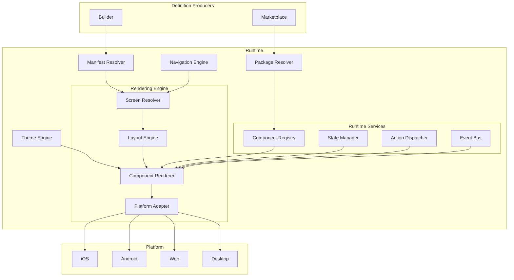
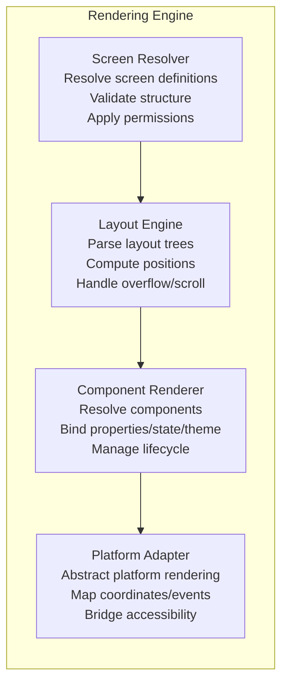
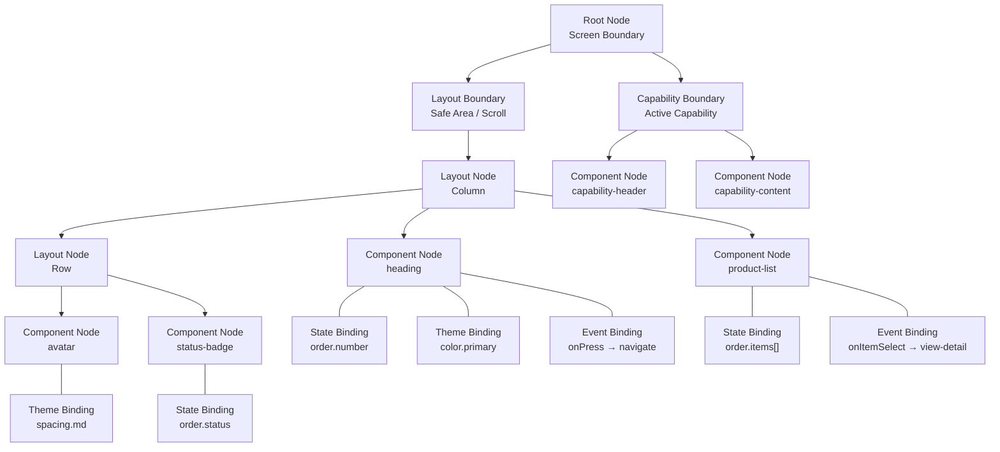
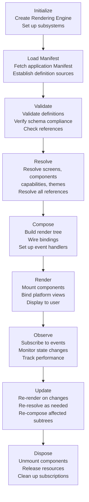
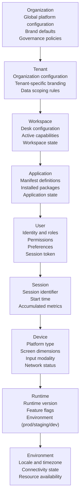
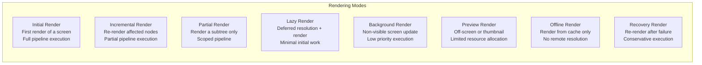
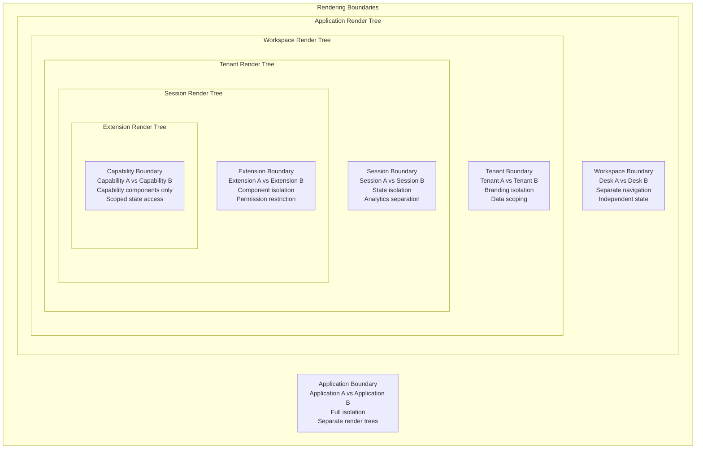
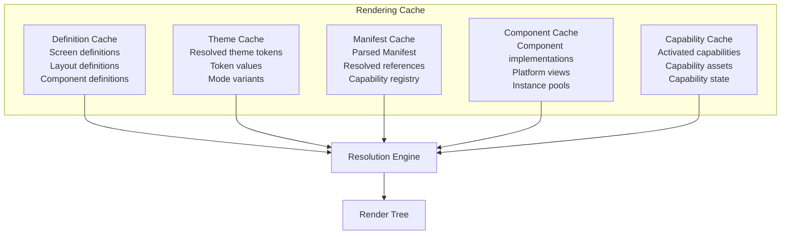
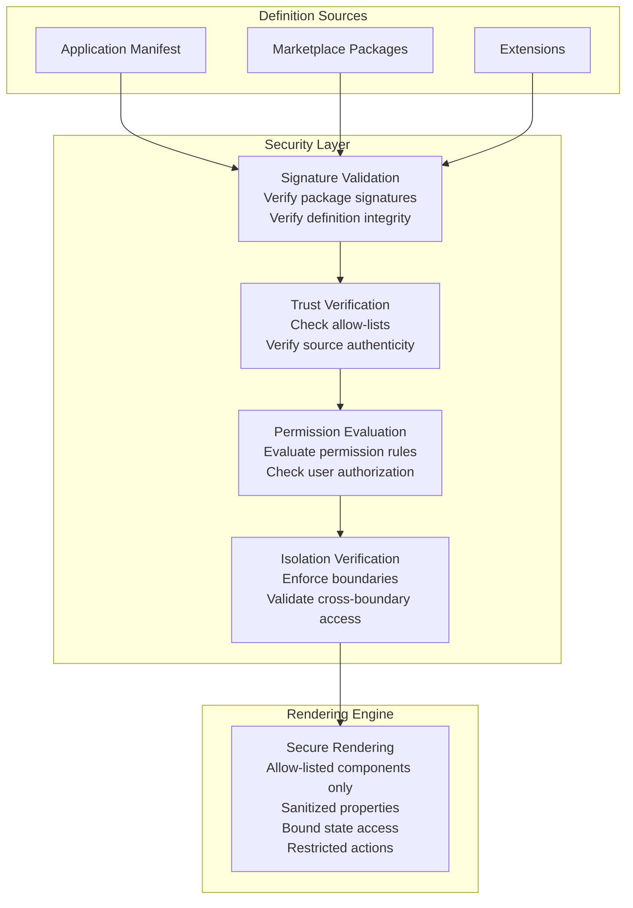

# Rendering Engine Architecture

**KB-052 — Rendering Engine Architecture Specification**

| Metadata | |
|----------|---|
| **KB ID** | KB-052 |
| **Title** | Rendering Engine Architecture |
| **Version** | 0.1.0 |
| **Status** | Draft |
| **Owner** | Architecture Team |
| **Suite** | Runtime & Rendering Architecture |
| **Dependencies** | KB-051 Runtime Architecture Overview, KB-046 Component Tree Model, KB-045 Screen Model, KB-049 Theme & Design Token Model, KB-047 Action & Event Model, KB-044 Navigation Architecture, KB-048 Application State Model, KB-042 Application Manifest Specification, KB-012 Component Registry, KB-014 Layout System |
| **Related Documents** | KB-041 Application Architecture Overview, KB-043 Workspace & Tenant Model, KB-050 Capability Composition Model, KB-053 SDUI Architecture, KB-054 Runtime State Management, KB-055 Runtime Navigation & Routing, KB-056 Runtime Component Registry, KB-057 Runtime Event & Action Pipeline, KB-008 Runtime Overview, KB-009 Manifest Specification |
| **Review Status** | Pending |
| **Last Updated** | 2026-07-11 |

---

### Revision History

| Version | Date | Author | Change |
|---------|------|--------|--------|
| 0.1.0 | 2026-07-11 | AI Architecture Agent | Initial draft |

---

## 1. Executive Summary

### 1.1 Purpose

This document defines the Rendering Engine Architecture for the DUKADESK platform. The Rendering Engine is the central subsystem within the Runtime responsible for transforming declarative application definitions — Manifests, screen models, navigation structures, component trees, state bindings, theme tokens, capability definitions, and action configurations — into rendered, interactive user experiences across all supported platforms.

The Rendering Engine is the heart of the Runtime Platform. Every application definition, every screen, every component, every data binding, every theme token, and every event handler passes through the Rendering Engine. Its architecture directly determines application performance, responsiveness, visual consistency, cross-platform behavior, security posture, and developer experience.

This document defines the architecture of the Rendering Engine in isolation from implementation concerns. It establishes architectural principles, canonical definitions, subsystem responsibilities, rendering pipeline stages, data structures, lifecycle models, security boundaries, performance expectations, and cross-system relationships that must be honored by any implementation. Implementation decisions — language, framework, library, platform-specific rendering technology — are intentionally out of scope.

### 1.2 Scope

**In scope:**

- Architectural principles governing all rendering behavior
- Canonical definitions of Rendering Engine, Render Pipeline, Render Tree, Render Context, Render Pass, Render Node, Render Target, Render Session, Render Cycle, and Render Output
- Rendering responsibilities across all resolution domains
- Rendering pipeline architecture from Application Manifest through Runtime Rendering
- Render Tree structure: root, layout, component, capability nodes, bindings
- Rendering lifecycle: initialize, load, validate, resolve, compose, render, observe, update, dispose
- Rendering context hierarchy: organization, tenant, workspace, application, user, session, device, runtime, environment
- Rendering modes: initial, incremental, partial, lazy, background, preview, offline, recovery
- Rendering boundaries and isolation between applications, workspaces, tenants, sessions, extensions, capabilities
- Rendering resolution model for navigation, screens, layouts, components, themes, capabilities, actions, state
- Rendering cache architecture and responsibilities
- Subsystem responsibility model: Runtime, Builder, Manifest, Registry
- Security model: trusted definitions, signature validation, isolation, sandbox boundaries
- Performance architecture: incremental rendering, lazy loading, virtualization, memory management, scheduling, cache optimization
- Offline behavior: cached definitions, offline rendering, recovery, deferred resolution
- Observability: render metrics, resolution metrics, diagnostics, performance measurement
- Failure scenarios and responses
- Anti-patterns
- Future evolution roadmap
- Cross-references to all related KB documents

**Out of scope:**

- Implementation details: programming languages, frameworks, libraries, rendering technologies
- Platform-specific rendering optimizations
- Component Registry implementation (handled by KB-056)
- Theme Engine implementation (handled by KB-017, KB-049)
- State Management implementation (handled by KB-054)
- Action Dispatcher implementation (handled by KB-057)
- Navigation Engine implementation (handled by KB-055)
- Specific component implementations (handled by component authors)
- Manifest Resolver implementation (handled by KB-009, KB-042)
- Package Resolver implementation (handled by KB-051)
- SDUI protocol details (handled by KB-053)
- Cache Manager implementation (handled by KB-051)
- Event Bus implementation (handled by KB-019)

---

## 2. Architectural Principles

The Rendering Engine is governed by a set of architectural principles that constrain all design decisions and implementation choices.

### 2.1 Declarative Rendering

The Rendering Engine consumes only declarative definitions. Every visual element, layout constraint, data binding, theme token, and action handler is expressed declaratively — describing what to render, not how to render it. The Rendering Engine interprets these declarations and handles the imperative details of platform-specific rendering. Declarative definitions are safer, more auditable, more portable, and more testable than imperative rendering code.

### 2.2 Manifest-Driven

The Rendering Engine is driven exclusively by the Application Manifest. Every screen, component, capability, theme, navigation structure, and permission rule that the Rendering Engine processes originates from the Manifest. The Manifest is the single source of truth for application structure. The Rendering Engine never derives application structure from platform APIs, file system inspection, or runtime heuristics.

### 2.3 Runtime Independent

The Rendering Engine architecture is independent of any specific Runtime environment. The same architectural model applies to mobile Runtimes (iOS, Android), web Runtimes (browsers), desktop Runtimes (Windows, macOS, Linux), and future Runtime environments. Runtime-specific behavior is abstracted behind the Platform Adaptation Layer defined in this document.

### 2.4 Platform Agnostic

The Rendering Engine does not contain platform-specific logic. All platform-specific rendering, layout, input handling, accessibility, and animation behavior is delegated to the Platform Adaptation Layer. The engine operates against abstract interfaces that each platform implements. Platform-specific adaptations are isolated, documented, and versioned.

### 2.5 Deterministic Rendering

Given the same Manifest, theme, state, and inputs, the Rendering Engine produces the same rendered output on every invocation. Deterministic rendering enables reliable testing, predictable behavior across devices, reproducible bug reports, and confidence in deployment. Non-determinism — random values, timing-dependent behavior, platform-specific divergence — is explicitly prohibited or documented.

### 2.6 Incremental Rendering

The Rendering Engine renders incrementally. It does not re-render the entire application on every change. Only the components, screens, and boundaries affected by a change are re-rendered. Incremental rendering is the foundation of the engine's performance model.

### 2.7 Lazy Resolution

The Rendering Engine resolves definitions lazily. Definitions — screens, components, capabilities, themes, assets — are resolved only when they are needed for rendering, not when the application starts. Lazy resolution minimizes startup time, reduces memory footprint, and enables efficient handling of large applications.

### 2.8 Component Virtualization

The Rendering Engine virtualizes component rendering in scrollable contexts. Only components within the visible viewport are instantiated and rendered. Components outside the viewport exist as lightweight metadata entries until they scroll into view. Virtualization is transparent to application definitions — screen and component definitions do not need to account for virtualization.

### 2.9 Event-Driven Updates

The Rendering Engine reacts to events. State changes, theme switches, navigation requests, data updates, and system events trigger targeted re-renders. The engine does not poll for changes or re-render on a timer. Event-driven updates ensure efficient rendering and responsive user interfaces.

### 2.10 Observable Rendering

Every rendering operation is observable. Component resolution, layout computation, data binding, mount, update, and unmount events are published for telemetry, diagnostics, and debugging. Observable rendering enables performance analysis, usage analytics, anomaly detection, and debugging without modifying application definitions.

---

## 3. Canonical Definitions

### 3.1 Rendering Engine

The subsystem within the Runtime responsible for transforming declarative application definitions into platform-specific rendered output. The Rendering Engine receives resolved definitions from the Manifest Resolver, Package Resolver, Theme Engine, and Navigation Engine; coordinates with the Component Registry, State Manager, Action Dispatcher, and Event Bus; and produces rendered user interfaces through the Platform Adaptation Layer.

### 3.2 Render Pipeline

The structured sequence of stages through which a screen definition passes to become rendered output. The pipeline transforms a screen request through screen load, definition parse, component resolution, layout computation, data binding, component mount, and platform render stages. Each stage has defined inputs, outputs, and failure modes.

### 3.3 Render Tree

The in-memory tree structure representing the rendered state of a screen. The render tree mirrors the visual hierarchy of the screen. Each node in the render tree represents a visual element — a layout container, a component instance, a capability boundary, or a binding reference. The render tree is the primary data structure the Rendering Engine operates on.

### 3.4 Render Context

The hierarchical context within which rendering occurs. The render context carries organization, tenant, workspace, application, user, session, device, runtime, and environment information. Every rendering operation evaluates against its render context. Context determines theme selection, permission evaluation, data scoping, and localization.

### 3.5 Render Pass

A single traversal of the render tree to produce, update, or dispose rendered output. A render pass may be full (traverse the entire tree), partial (traverse only affected subtrees), or targeted (update specific nodes). Each render pass has a defined purpose, scope, and budget.

### 3.6 Render Node

A single node in the render tree. Render nodes are typed — layout nodes represent spatial containers, component nodes represent registered UI components, capability nodes represent capability boundaries, binding nodes represent data/theme/event connections. Each render node carries its resolved properties, computed bounds, lifecycle state, and platform view reference.

### 3.7 Render Target

The destination for rendered output. A render target may be the device screen, an off-screen buffer for preview rendering, a screenshot capture surface, a remote display for collaborative rendering, or a diagnostic overlay. The Rendering Engine supports multiple concurrent render targets.

### 3.8 Render Session

A continuous period of rendering activity for a single application instance. A render session begins when the application is loaded and ends when the application is terminated. The render session encompasses all render passes, screen transitions, state changes, and theme switches that occur during the application's lifetime.

### 3.9 Render Cycle

The sequence of operations the Rendering Engine performs to produce a single frame of rendered output. A render cycle includes collecting pending updates, identifying affected render nodes, recomputing layouts as needed, resolving binding changes, updating component instances, and committing visual output to the platform. Render cycles are synchronized with the platform's frame timing.

### 3.10 Render Output

The platform-specific result of rendering. Render output may be a native view hierarchy (mobile), a DOM tree (web), a desktop window tree (desktop), a bitmap (screenshot), or a serialized frame (remote/streaming). The Rendering Engine produces render output through the Platform Adaptation Layer and does not interact with platform-specific output mechanisms directly.

---

## 4. Architectural Principles (Expanded)

### 4.1 Declarative Rendering

All visual structure is defined declaratively. Screens describe their component hierarchy, layouts describe their spatial relationships, and components describe their property bindings — all without imperative construction code. The Rendering Engine interprets these descriptions and performs the imperative work of creating, configuring, and managing platform views.

**Rule:** No component or screen definition may contain imperative rendering logic. All rendering behavior must be expressible as declarative data.

### 4.2 Manifest-Driven

The Application Manifest (KB-042) is the sole source of application structure. The Manifest declares which screens exist, which components they use, which capabilities are installed, which themes are available, and how navigation connects them. The Rendering Engine reads the Manifest and derives its entire rendering strategy from it.

**Rule:** The Rendering Engine must not fabricate screens, components, or navigation routes that are not declared in the Manifest.

### 4.3 Runtime Independent

The same Rendering Engine architecture applies across mobile, web, desktop, and future Runtimes. The engine does not know which Runtime it is running on. Runtime differences — process model, threading model, memory model, graphics stack — are abstracted by the Platform Adaptation Layer.

**Rule:** No rendering logic may reference Runtime-specific APIs or concepts.

### 4.4 Platform Agnostic

Platform-specific behavior — coordinate systems, input event models, layout engines, accessibility APIs, animation frameworks — is isolated in the Platform Adaptation Layer. The Rendering Engine defines abstract interfaces; each platform provides concrete implementations.

**Rule:** Platform-specific code may exist only in the Platform Adaptation Layer. The Rendering Engine core must contain zero platform-specific imports or references.

### 4.5 Deterministic Rendering

The Rendering Engine is a pure function of its inputs: Manifest → theme → state → rendered output. Side effects are isolated and managed. Randomness, timing-dependent behavior, and platform divergence are prohibited.

**Rule:** Two invocations with identical inputs must produce identical output.

### 4.6 Incremental Rendering

The engine tracks which components depend on which state values, theme tokens, and context properties. When a dependency changes, only the dependent components are re-rendered. Unaffected components retain their existing rendered state.

**Rule:** A state change must not trigger re-render of components that do not depend on the changed value.

### 4.7 Lazy Resolution

Definitions are resolved at the latest possible moment. Components are resolved when they are about to be mounted. Screens are loaded when they are about to be rendered. Capabilities are activated when their screens are navigated to. Lazy resolution is the default; eager resolution is the exception and must be explicitly configured.

**Rule:** The Rendering Engine must not resolve definitions before they are needed for rendering.

### 4.8 Component Virtualization

The engine virtualizes rendering for scrollable containers automatically. Only components within the visible viewport (plus configurable overscan) are physically rendered. Components outside the viewport are represented as lightweight entries until they scroll into view.

**Rule:** Any scrollable container may virtualize its children without modifying the component or screen definition.

### 4.9 Event-Driven Updates

The Rendering Engine subscribes to state changes, theme changes, and system events. When an event occurs, the engine identifies affected render nodes and schedules targeted re-renders. The engine does not poll, use timers for rendering, or perform periodic full re-renders.

**Rule:** Re-renders must be triggered only by specific events that affect rendered output.

### 4.10 Observable Rendering

Every significant rendering operation emits a structured event. Events include screen load start/complete/fail, component resolve/mount/unmount/error, binding resolve, layout compute, and frame timing. Events are published to the Event Bus for consumption by Telemetry, Diagnostics, and Analytics subsystems.

**Rule:** All rendering operations must be observable through published events. No rendering operation may be invisible to observability tooling.

---

## 5. Rendering Engine Architecture

### 5.1 Position Within the Platform



### 5.2 Subsystem Composition



| Subsystem | Primary Responsibility | Consumes From | Produces For |
|-----------|----------------------|--------------|-------------|
| Screen Resolver | Resolve screen identifiers to validated Screen Models | Manifest Resolver, Navigation Engine | Layout Engine |
| Layout Engine | Parse layouts, construct spatial trees, compute positions | Screen Resolver | Component Renderer |
| Component Renderer | Resolve, instantiate, bind, mount, update, unmount components | Layout Engine, Component Registry, State Manager, Theme Engine, Action Dispatcher | Platform Adapter |
| Platform Adapter | Abstract platform-specific rendering behind unified interface | Component Renderer | Platform output |

### 5.3 Rendering Pipeline

```mermaid
flowchart TB
    START(["Application Manifest"])
    START --> S1
    
    subgraph S1["1. Manifest Resolution"]
        MR2["Parse Manifest\nValidate schema\nResolve references"]
    end
    
    S1 --> S2
    
    subgraph S2["2. Navigation Resolution"]
        NR["Resolve navigation structure\nDetermine target screen\nExtract parameters"]
    end
    
    S2 --> S3
    
    subgraph S3["3. Screen Resolution"]
        SR2["Load screen definition\nValidate screen schema\nApply responsive variants\nEvaluate permissions"]
    end
    
    S3 --> S4
    
    subgraph S4["4. Component Resolution"]
        CR3["Resolve component identifiers\nLook up Component Registry\nValidate property schemas\nSelect platform implementation"]
    end
    
    S4 --> S5
    
    subgraph S5["5. Capability Resolution"]
        CAPR["Activate capability\nResolve capability assets\nRegister capability components"]
    end
    
    S5 --> S6
    
    subgraph S6["6. Theme Resolution"]
        TR["Resolve theme tokens\nApply theme mode\nApply screen overrides\nResolve token values"]
    end
    
    S6 --> S7
    
    subgraph S7["7. State Binding"]
        SB["Bind state values\nResolve data sources\nApply transforms\nSubscribe to changes"]
    end
    
    S7 --> S8
    
    subgraph S8["8. Layout Resolution"]
        LR["Parse layout tree\nMeasure nodes\nCompute positions\nHandle overflow/scroll"]
    end
    
    S8 --> S9
    
    subgraph S9["9. Render Tree Construction"]
        RTC["Build render tree\nCreate render nodes\nWire bindings\nSet lifecycle state"]
    end
    
    S9 --> S10
    
    subgraph S10["10. Runtime Rendering"]
        RR["Instantiate components\nBind platform views\nMount to visual tree\nBegin interaction"]
    end
    
    S10 --> END2(["Interactive Application"])
```



**Pipeline Stages:**

| Stage | Input | Output | Failure Mode |
|-------|-------|--------|-------------|
| 1. Manifest Resolution | Application Manifest | Resolved definition set | Invalid Manifest → load error |
| 2. Navigation Resolution | Navigation request, params | Target screen identifier, context | Unresolvable route → navigation fallback |
| 3. Screen Resolution | Screen identifier, params | Resolved Screen Model | Missing screen → error boundary |
| 4. Component Resolution | Component identifiers | Resolved component implementations | Unregistered component → placeholder |
| 5. Capability Resolution | Capability declarations | Activated capability assets | Invalid capability → degraded rendering |
| 6. Theme Resolution | Theme reference, mode | Resolved token values | Missing token → default value |
| 7. State Binding | State paths, data sources | Resolved property values | Missing state → fallback value |
| 8. Layout Resolution | Layout definition, constraints | Computed positions and sizes | Unsolvable constraints → relaxation |
| 9. Render Tree Construction | Resolved definitions, bindings | Complete render tree | Circular reference → rejection |
| 10. Runtime Rendering | Render tree, platform target | Platform-rendered output | Platform error → error boundary |

---

## 6. Render Tree

### 6.1 Render Tree Structure



### 6.2 Render Node Types

| Node Type | Purpose | Children | Properties |
|-----------|---------|----------|------------|
| **Root Node** | Screen boundary, lifecycle owner | Layout nodes, capability boundaries | screenId, lifecycleState, renderMode |
| **Layout Node** | Spatial container, positions children | Layout nodes, component nodes | type, width, height, flex, margin, padding, align, justify |
| **Component Node** | Registered UI component instance | None (leaf) | componentId, instanceId, props, bindings, platformView |
| **Capability Node** | Capability boundary, isolation scope | Component nodes, layout nodes | capabilityId, version, permissions, stateScope |
| **State Binding** | Links component property to state value | None (metadata) | source, path, transform, fallback, subscription |
| **Event Binding** | Links component event to action | None (metadata) | event, action, params, handler |
| **Theme Binding** | Links component property to theme token | None (metadata) | token, mode, fallback |

### 6.3 Render Tree Invariants

1. **Single root** — Every screen has exactly one root render node.
2. **Acyclic** — The render tree is a directed acyclic graph. Parent-child cycles are detected and rejected.
3. **Typed nodes** — Every render node has a defined type. Untyped nodes are invalid.
4. **Parent-owned children** — Child nodes are owned by exactly one parent. Shared nodes are not permitted in the render tree (shared state is handled through bindings, not tree sharing).
5. **Component leaves** — Component nodes are leaf nodes. They cannot have children. Container behavior is achieved through layout nodes.
6. **Capability boundaries** — Capability nodes form strict boundaries. Components inside a capability boundary cannot reference components outside the boundary.

### 6.4 Render Tree Construction

The render tree is constructed during the rendering pipeline, not defined in application definitions. Application definitions define screen layouts, component references, and bindings. The Rendering Engine transforms these definitions into a render tree by:

1. Creating a root node for the screen
2. Wrapping the root in appropriate layout boundaries (safe area, scroll)
3. Recursively building layout nodes from the layout definition
4. Creating component nodes for each component reference and linking them to registry implementations
5. Inserting capability boundary nodes around capability-scoped content
6. Wiring state bindings from defined data sources
7. Wiring event bindings from defined action references
8. Wiring theme bindings from theme token references
9. Setting initial lifecycle state on all nodes

---

## 7. Rendering Responsibilities

The Rendering Engine owns rendering responsibilities across multiple resolution domains. Each responsibility describes what the engine must resolve and how it integrates with upstream subsystems.

### 7.1 Manifest Resolution Responsibility

The Rendering Engine is not the Manifest Resolver, but it depends on resolved Manifest definitions. The engine's responsibility is to consume resolved Manifest data and map it to renderable structures.

| Responsibility | Description |
|--------------|-------------|
| Manifest consumption | Receive resolved Manifest from Manifest Resolver |
| Definition extraction | Extract screen, component, capability, theme, and navigation definitions |
| Reference verification | Verify all cross-references in definitions are resolvable |
| Schema compliance | Validate that Manifest-derived definitions comply with render-time schemas |

### 7.2 Navigation Resolution Responsibility

| Responsibility | Description |
|--------------|-------------|
| Screen target resolution | Determine which screen to render from navigation request |
| Parameter extraction | Extract and validate navigation parameters |
| Route validation | Validate that the target route exists and is accessible |
| Deep link resolution | Resolve deep link URIs to screen identifiers with parameters |

### 7.3 Screen Resolution Responsibility

| Responsibility | Description |
|--------------|-------------|
| Screen definition loading | Load screen definition from Manifest Resolver or cache |
| Schema validation | Validate screen structure against Screen Model schema |
| Responsive variant selection | Select appropriate variant for current viewport and platform |
| Permission evaluation | Evaluate screen-level permission rules |
| Screen model construction | Assemble resolved Screen Model for downstream stages |

### 7.4 Component Resolution Responsibility

| Responsibility | Description |
|--------------|-------------|
| Component lookup | Resolve component identifiers against Component Registry |
| Property schema validation | Validate declared properties against component schema |
| Platform selection | Select platform-specific component implementation |
| Version resolution | Select component version matching declared constraints |
| Fallback resolution | Determine fallback behavior for unresolvable components |

### 7.5 Capability Resolution Responsibility

| Responsibility | Description |
|--------------|-------------|
| Capability activation | Activate capability when its screen or component is rendered |
| Asset registration | Register capability-provided components, themes, and actions |
| Boundary enforcement | Enforce capability isolation boundaries in the render tree |
| Permission scoping | Apply capability-specific permission rules |

### 7.6 Theme Resolution Responsibility

| Responsibility | Description |
|--------------|-------------|
| Token resolution | Resolve theme token values for all token references |
| Mode adaptation | Apply theme mode (light, dark, high-contrast) |
| Override application | Apply screen-level and component-level theme overrides |
| Fallback application | Apply default values for unresolvable tokens |

### 7.7 State Resolution Responsibility

| Responsibility | Description |
|--------------|-------------|
| State lookup | Resolve state values for binding paths |
| Subscription management | Subscribe to state changes for reactive re-renders |
| Transform application | Apply defined transforms to resolved values |
| Fallback application | Apply fallback values for unresolvable paths |

### 7.8 Event Registration Responsibility

| Responsibility | Description |
|--------------|-------------|
| Event handler binding | Bind component events to action dispatcher handlers |
| Argument resolution | Resolve event handler arguments at trigger time |
| Handler lifecycle | Register handlers on mount, unregister on unmount |

### 7.9 Runtime Composition Responsibility

| Responsibility | Description |
|--------------|-------------|
| Multi-source composition | Compose render tree from Manifest, capabilities, and extensions |
| Conflict resolution | Resolve definition conflicts between sources |
| Merge precedence | Apply correct precedence when multiple sources define the same element |

---

## 8. Rendering Lifecycle

### 8.1 Lifecycle Stages



| Stage | Description | Entry Criteria | Exit Criteria | Failure Mode |
|-------|-------------|---------------|--------------|-------------|
| **Initialize** | Create the Rendering Engine and its subsystems. Establish Platform Adapter connection. | Runtime startup signal | All subsystems initialized and ready | Initialization timeout → safe mode |
| **Load Manifest** | Fetch and load the Application Manifest from the Manifest Resolver. | Initialization complete | Manifest loaded and parsed | Manifest load failure → load error |
| **Validate** | Validate all definitions against their schemas. Verify cross-references. | Manifest loaded | All definitions validated | Validation failure → detailed error report |
| **Resolve** | Resolve all definitions to concrete implementations — screens to Screen Models, components to registry entries, themes to token values. | Validation complete | All definitions resolved | Resolution failure → fallback or degraded mode |
| **Compose** | Build the initial render tree from resolved definitions. Wire bindings and event handlers. | Resolution complete | Render tree constructed and ready | Composition failure → error boundary |
| **Render** | Mount the render tree to the platform. Create platform views and display initial screen. | Composition complete | Screen visible and interactive | Render failure → graceful degradation |
| **Observe** | Subscribe to state changes, theme changes, and system events for reactive updates. | Render complete | All subscriptions active | Subscription failure → degraded reactivity |
| **Update** | Process incoming changes. Re-render affected components. Re-compose affected subtrees as needed. | Active subscriptions | All pending updates processed | Update failure → error boundary |
| **Dispose** | Clean up all resources when screen or application terminates. | Shutdown signal | All resources released | Dispose failure → resource warning |

### 8.2 Lifecycle State Machine

Each render node in the tree maintains a lifecycle state that determines what operations are valid:

```
┌──────────┐
│ Pending  │  Node created but not yet resolved
└────┬─────┘
     │ resolve
     ▼
┌──────────┐
│ Resolved │  Definition resolved, implementation identified
└────┬─────┘
     │ compose
     ▼
┌──────────┐
│ Composed │  Node inserted into render tree with bindings
└────┬─────┘
     │ render
     ▼
┌──────────┐
│ Mounted  │  Platform view created and attached
└────┬─────┘
     │ update
     ▼
┌──────────┐
│ Updated  │  Node re-rendered with latest values
└────┬─────┘
     │ unmount
     ▼
┌──────────┐
│Unmounted │  Platform view removed, resources retained
└────┬─────┘
     │ dispose
     ▼
┌──────────┐
│ Disposed │  All resources released, node destroyed
└──────────┘
```

---

## 9. Rendering Context

### 9.1 Context Hierarchy



### 9.2 Context Definitions

| Context Level | Scope | Lifetime | Content | Affects |
|--------------|-------|----------|---------|---------|
| **Organization** | All tenants, all applications | Immutable per Runtime build | Global defaults, platform policies | Theme defaults, permission baselines |
| **Tenant** | Single tenant session | Fixed per session | Branding, configuration, data scoping | Theme, permissions, data visibility |
| **Workspace** | Single Desk | Fixed per Desk navigation | Desk config, active capabilities | Available screens, components |
| **Application** | Single application | Entire render session | Manifest, installed packages | Screen structure, component availability |
| **User** | Authenticated user | Changes on auth state change | Identity, roles, permissions, preferences | Permission evaluation, personalization |
| **Session** | Single Runtime session | Session duration | ID, start time, accumulators | Analytics, session-scoped state |
| **Device** | Physical device | Immutable per session | Type, OS, screen, input, network | Responsive adaptation, platform selection |
| **Runtime** | Runtime environment | Immutable per session | Version, features, environment | Feature gating, behavior flags |
| **Environment** | Operational context | Changes dynamically | Locale, timezone, connectivity, resources | Localization, offline mode, performance |

### 9.3 Context Propagation

Context flows from outer levels to inner levels. Inner contexts may override outer context values for their scope. Context propagation rules:

1. **Inheritance** — Each context inherits all properties from its parent.
2. **Override** — Inner contexts may override inherited properties within their scope.
3. **Restriction** — Inner contexts may restrict but not expand outer context permissions.
4. **Isolation** — Contexts at the same level cannot access each other's properties.
5. **Access** — All rendering operations have read access to the full context chain.

---

## 10. Rendering Modes

The Rendering Engine supports multiple rendering modes, each optimized for a specific operational scenario.

### 10.1 Mode Definitions



| Mode | Trigger | Pipeline Scope | Resource Budget | Use Case |
|------|---------|---------------|----------------|----------|
| **Initial Render** | Screen navigation | Full pipeline | Full frame budget | First visit to a screen |
| **Incremental Render** | State/theme/context change | Components with changed dependencies | Partial frame budget | Reactive updates |
| **Partial Render** | Targeted update request | Specified subtree only | Targeted budget | Optimistic UI updates |
| **Lazy Render** | Below-fold component approaching viewport | Component resolution + render | Deferred budget | Virtualized lists, long screens |
| **Background Render** | Non-visible screen state change | Low-priority full pipeline | Idle budget | Tab screen updates, page prefetch |
| **Preview Render** | Thumbnail, widget, screenshot | Abbreviated pipeline | Minimal budget | App switcher, notifications, widgets |
| **Offline Render** | No network connectivity | Cache-only resolution | Available budget | Offline operation |
| **Recovery Render** | Rendering failure, state corruption | Conservative pipeline | Safe budget | Error recovery |

### 10.2 Mode Transition Rules

| From Mode | To Mode | Condition |
|-----------|---------|-----------|
| Initial | Incremental | After first render completes |
| Incremental | Partial | Developer-initiated targeted update |
| Lazy | Initial | Component enters viewport |
| Background | Incremental | Screen becomes visible |
| Preview | None | Preview completed, render tree disposed |
| Offline | Initial | Network connectivity restored |
| Recovery | Initial | Recovery render completes successfully |
| Recovery | Offline | Network unavailable during recovery |
| Any | Recovery | Fatal rendering error detected |

---

## 11. Rendering Boundaries

### 11.1 Boundary Model

The Rendering Engine enforces strict isolation boundaries between different concerns. Boundaries prevent cross-contamination of rendering state, permissions, and behavior.



### 11.2 Boundary Enforcement

| Boundary | Isolation Mechanism | Cross-Boundary Communication | Violation Consequence |
|----------|-------------------|------------------------------|----------------------|
| **Application** | Separate Runtime instances | Platform IPC, shared storage | Rendering rejection |
| **Workspace** | Separate render trees | Manifest-defined navigation | Navigation blocked |
| **Tenant** | Tenant-scoped resolution | Manifest definition merging | Theme/policy error |
| **Session** | Session-scoped state | Event Bus events | State access denied |
| **Extension** | Component allow-list | Extension API | Component registration blocked |
| **Capability** | Capability-scoped render subtree | Action dispatcher | Component isolation error |

### 11.3 Cross-Boundary Rendering

When a component needs to render content from another boundary (e.g., a capability embedding a component from another capability), explicit cross-boundary rendering is supported through:

1. **Exposed component references** — A capability may expose specific components for use by other capabilities.
2. **Manifest-declared dependencies** — Cross-capability component references must be declared in the Manifest.
3. **Boundary wrapping** — Cross-boundary components are wrapped in boundary nodes that enforce isolation.
4. **Permission validation** — Cross-boundary rendering is subject to permission checks at both boundaries.

---

## 12. Rendering Resolution

The Rendering Engine resolves multiple definition types during the rendering pipeline. Resolution is the process of transforming a definition reference into a concrete, validated, ready-to-use object.

### 12.1 Resolution Domains

| Domain | What Is Resolved | Source | Resolution Strategy |
|--------|-----------------|--------|-------------------|
| **Navigation** | Screen identifier, route parameters | Navigation Engine | Route matching, parameter validation |
| **Screens** | Screen definition, layout, components | Manifest Resolver, Cache | Cache-first, fetch-on-miss |
| **Layouts** | Layout tree, dimensions, constraints | Screen definition | Parse, build tree, measure |
| **Components** | Component implementation, schema | Component Registry | Registry lookup, version matching |
| **Themes** | Theme token values, mode variants | Theme Engine | Token path lookup, mode selection |
| **Capabilities** | Capability assets, permissions | Package Resolver | Dependency resolution, activation |
| **Actions** | Action handler, argument values | Action Dispatcher | Type lookup, argument evaluation |
| **State** | State values, subscription paths | State Manager | Path traversal, subscription |

### 12.2 Resolution Precedence

When multiple sources provide definitions for the same target, resolution follows a strict precedence order:

1. **Explicit screen definition** (inline values in the screen definition)
2. **Capability-provided definition** (from activated capabilities)
3. **Extension-provided definition** (from installed extensions)
4. **Manifest default definition** (default values in the Manifest)
5. **Platform default definition** (Runtime-provided fallbacks)

### 12.3 Resolution Caching

Resolved definitions are cached at each stage of the pipeline. Cache keys are derived from the definition identifier, the current context, and the rendering mode. Cache entries are invalidated when:
- The source definition changes (new Manifest version)
- The rendering context changes (tenant switch, user switch)
- The rendering mode changes (online to offline)

---

## 13. Rendering Cache

### 13.1 Cache Architecture



### 13.2 Cache Responsibilities

| Cache | Stores | Eviction Strategy | Max Size | Persistence |
|-------|--------|------------------|----------|-------------|
| Definition Cache | Screen and layout definitions, component references | LRU, timeout | 50 screens | Session |
| Theme Cache | Resolved token values by mode | Version invalidation | 3 themes | Session |
| Manifest Cache | Parsed Manifest, resolved definitions | Version change | 1 Manifest | Session |
| Component Cache | Component instances, platform view references | LRU, memory pressure | 200 instances | Session |
| Capability Cache | Activated capability assets | Deactivation | 20 capabilities | Session |

### 13.3 Cache Invalidation

| Event | Invalidates | Strategy |
|-------|-------------|---------|
| Manifest version change | Manifest Cache, Definition Cache | Full invalidation |
| Theme switch | Theme Cache | Token re-resolution |
| Capability deactivation | Capability Cache | Targeted invalidation |
| Memory pressure | All caches | LRU eviction |
| Tenant switch | All caches | Full invalidation |
| Screen navigation (return) | None (cache hit expected) | — |

---

## 14. Subsystem Responsibilities

### 14.1 Runtime Responsibilities

| Responsibility | Description |
|--------------|-------------|
| Provide resolving services | The Runtime provides Manifest Resolver, Package Resolver, Theme Engine, Navigation Engine, State Manager, Action Dispatcher, Event Bus, Cache Manager, Permission Engine, and Security Manager services to the Rendering Engine |
| Manage lifecycle | The Runtime's Lifecycle Manager controls the Rendering Engine's lifecycle — initialize, start, suspend, resume, stop |
| Allocate resources | The Runtime allocates memory, threads, and platform resources for rendering |
| Enforce security | The Runtime's Security Manager validates definitions, enforces isolation, and verifies signatures before definitions reach the Rendering Engine |
| Provide telemetry | The Runtime's Telemetry subsystem collects and exports rendering metrics |
| Report diagnostics | The Runtime's Diagnostics subsystem exposes rendering state for debugging |

### 14.2 Builder Responsibilities

| Responsibility | Description |
|--------------|-------------|
| Produce valid definitions | The Builder must produce Manifest-valid definitions that comply with the Screen Model, Component Tree Model, and Layout System schemas |
| Reference registered components | The Builder must reference only components registered in the Component Registry |
| Declare capability dependencies | The Builder must declare all capability dependencies in the Manifest for the Rendering Engine to activate |
| Structure layout trees | The Builder must produce well-structured layout trees that can be parsed by the Layout Engine |
| Provide fallback values | The Builder should provide fallback values for all data bindings to ensure graceful degradation |

### 14.3 Manifest Responsibilities

| Responsibility | Description |
|--------------|-------------|
| Define screen structure | The Manifest must define all screens, their layouts, component references, and bindings |
| Declare capabilities | The Manifest must declare which capabilities the application requires |
| Reference themes | The Manifest must reference the active theme and provide theme configuration |
| Define navigation | The Manifest must define navigation structures for the Navigation Engine to resolve |
| Configure permissions | The Manifest must declare permission rules for screens and capabilities |

### 14.4 Registry Responsibilities

| Responsibility | Description |
|--------------|-------------|
| Register components | The Component Registry must register all available components with their identifiers, schemas, default properties, event contracts, and platform implementations |
| Provide schema validation | The Registry must provide component property schemas for validation during resolution |
| Manage versions | The Registry must manage component versions and support version constraint resolution |
| Support lazy loading | The Registry must support lazy loading of component implementations |
| Report availability | The Registry must report component availability for diagnostics and missing component fallback |

---

## 15. Security Model

### 15.1 Security Architecture



### 15.2 Trusted Definitions

The Rendering Engine renders only trusted definitions. A definition is considered trusted when:

1. **Origin verified** — The definition originates from a verified source (validated Manifest, certified Marketplace package, authenticated Builder).
2. **Integrity validated** — The definition has not been tampered with since publication (signature validation).
3. **Schema compliant** — The definition complies with its expected schema.
4. **Allow-listed** — The definition references only components, capabilities, and services that are on the allowed list.
5. **Permission granted** — The current user has permission to access the definition's resources.

### 15.3 Signature Validation

All definitions entering the Rendering Engine must pass signature validation:

| Artifact | Signature Source | Validation |
|----------|-----------------|------------|
| Application Manifest | Builder signing key | Verify Manifest signature against Builder's public key |
| Marketplace packages | Marketplace signing key | Verify package signature against Marketplace's public key |
| Extensions | Extension developer key | Verify extension signature against developer's registered key |
| Components | Component publisher key | Verify component implementation hash |

### 15.4 Rendering Isolation

| Isolation Concern | Mechanism |
|------------------|-----------|
| Application isolation | Separate Runtime instances or sandboxed contexts |
| Workspace isolation | Separate render trees, no cross-workspace component access |
| Tenant isolation | Tenant-scoped resolution, tenant-scoped theme, tenant-scoped state |
| Session isolation | Session-scoped state, session-scoped event subscriptions |
| Extension isolation | Extension-scoped component registry, restricted API access |
| Capability isolation | Capability-scoped render subtrees, scoped state access |

### 15.5 Sandbox Boundaries

The Rendering Engine enforces sandbox boundaries at multiple levels:

1. **Component sandbox** — Component lifecycle hooks execute in a sandboxed context. Components cannot access other components, the file system, network APIs, or platform services directly.
2. **Binding sandbox** — State bindings are read-only. Components cannot write to state through bindings. All state mutations go through the Action Dispatcher.
3. **Theme sandbox** — Theme tokens are read-only. Components cannot modify theme tokens or define new tokens.
4. **Action sandbox** — Components can trigger only actions declared in their definition. Actions are resolved and executed by the Action Dispatcher, not by components.
5. **Registry sandbox** — Components can be rendered only if they are registered in the Component Registry. Ad-hoc component creation is blocked.

### 15.6 Extension Isolation

Extensions (capabilities, plugins) operate within strict isolation boundaries:

- Extensions cannot access other extensions' component instances or state.
- Extensions define their component allow-lists at install time.
- Extension-provided components are registered in a scoped namespace.
- Extension events are routed through the Event Bus with origin tracking.

### 15.7 Runtime Integrity

The Rendering Engine maintains runtime integrity through:

1. **Definition immutability** — Loaded definitions are immutable during a render session. Definitions cannot be modified at runtime.
2. **State immutability** — State values are immutable. State mutations produce new state objects rather than modifying existing ones.
3. **Render tree immutability** — The render tree structure is immutable after composition. Updates produce new render nodes rather than modifying existing ones.
4. **Audit logging** — All definition validation failures, permission denials, and isolation violations are logged for audit.

---

## 16. Performance

### 16.1 Performance Principles

| Principle | Description |
|-----------|-------------|
| Incremental Rendering | Re-render only what changed, not everything |
| Lazy Loading | Load and resolve definitions only when needed |
| Virtualization | Render only visible components in scrollable contexts |
| Memory Management | Release resources promptly, cache intelligently |
| Render Scheduling | Prioritize visible content, defer non-critical work |
| Cache Optimization | Cache aggressively, invalidate precisely |

### 16.2 Incremental Rendering

The Rendering Engine performs incremental rendering by tracking dependency graphs between state values, theme tokens, context properties, and render nodes. When a dependency changes:

1. **Change detection** — The State Manager, Theme Engine, or Event Bus publishes a change notification.
2. **Dependency resolution** — The Rendering Engine identifies all render nodes that depend on the changed value.
3. **Affected scope computation** — The minimum subtree containing all affected nodes is computed.
4. **Targeted re-render** — Only the affected subtree is re-rendered. Sibling and parent nodes outside the subtree are not re-rendered.
5. **Platform commit** — Only the platform views corresponding to changed nodes are updated.

### 16.3 Lazy Loading

| Asset | Loading Point | Loading Strategy |
|-------|--------------|------------------|
| Screen definitions | When screen is navigated to | Load from cache or Manifest Resolver |
| Component implementations | When component is first requested | Load from Component Registry (code-split) |
| Capability assets | When capability screen is rendered | Load from Package Resolver |
| Theme definitions | When theme is first applied | Load from Theme Engine |
| Images and media | When component enters viewport | Progressive loading with placeholder |

### 16.4 Virtualization

Virtualization is automatic for all scrollable containers. The Rendering Engine:

1. Measures estimated or actual item sizes during layout
2. Computes total scrollable content size
3. Determines which items fall within the visible viewport + overscan
4. Renders only visible items as physical component instances
5. Represents non-visible items as lightweight metadata entries
6. Recycles component instances as items scroll out of view
7. Updates the rendered set on each scroll event

### 16.5 Memory Management

| Strategy | Description |
|----------|-------------|
| Instance pooling | Recycle component instances in scrollable lists to reduce allocation |
| View recycling | Reuse platform view instances for recycled components |
| Cache limits | Enforce maximum sizes on all caches with LRU eviction |
| Deferred destruction | Defer component destruction to idle periods |
| Memory pressure response | Clear caches, reduce overscan, suspend animations on memory warning |

### 16.6 Render Scheduling

| Priority | Work | Timing |
|----------|------|--------|
| Critical | User interaction response, navigation transitions, loading indicators | Immediate — before next frame |
| High | Primary content in viewport, actionable components | Within current frame |
| Normal | Secondary content, supporting information | Within 1-2 frames |
| Low | Below-fold content, non-visible screen preparation | Within 3-5 frames |
| Idle | Cache warming, prefetching, analytics | During idle periods |

### 16.7 Cache Optimization

| Cache | Optimization |
|-------|-------------|
| Layout cache | Cache computed layout results by screen + breakpoint. Reuse on screen revisit. |
| Definition cache | Cache parsed screen definitions. Invalidate on Manifest version change. |
| Theme cache | Cache resolved token sets by theme + mode. |
| Component cache | Cache component implementations. Release on memory pressure. |
| Binding cache | Cache resolved binding values. Invalidate on dependency change. |

---

## 17. Offline Behaviour

### 17.1 Offline Rendering

The Rendering Engine supports rendering without network connectivity. Offline rendering relies on:

1. **Cached definitions** — Screen definitions, component definitions, and theme definitions cached from previous online sessions.
2. **Cached state** — Persisted state values from the most recent online session.
3. **Cached assets** — Images, fonts, and media assets cached locally.
4. **Cached Manifest** — The most recent Manifest version cached locally.

### 17.2 Offline Rendering Mode

When the Rendering Engine detects no network connectivity:

1. **Cache check** — The engine checks whether all required definitions are available in the local cache.
2. **Cache-hit rendering** — If all definitions are cached, the engine renders from cache with full functionality minus remote data.
3. **Cache-miss handling** — If a required definition is not cached, the engine renders a degraded view with available cached content.
4. **Offline indicator** — A visual indicator is rendered to inform the user of offline status.
5. **Deferred resolution** — Definitions that cannot be resolved offline are marked for deferred resolution when connectivity is restored.

### 17.3 Recovery Render

When connectivity is restored after offline operation:

1. **Resolution retry** — The engine retries resolution of deferred definitions.
2. **Re-render** — Screens and components that previously rendered with degraded content are re-rendered with full definitions.
3. **Cache update** — The cache is refreshed with the latest definitions from the Manifest Resolver.
4. **State synchronization** — The State Manager synchronizes offline mutations with the server.

### 17.4 Deferred Resolution

Definitions that cannot be resolved offline are handled as follows:

| Definition Type | Offline Behavior | Recovery Action |
|----------------|-----------------|-----------------|
| Screen definition | Render last cached version or fallback screen | Re-render with current definition |
| Component definition | Render placeholder component | Replace placeholder with actual component |
| Theme definition | Use cached theme or platform default | Apply current theme tokens |
| Capability definition | Disable capability, render without it | Activate capability on recovery |
| Data binding | Apply fallback value or cached value | Re-bind with current state |

---

## 18. Observability

### 18.1 Render Metrics

The Rendering Engine collects the following metrics:

| Metric | Type | Granularity | Collection |
|--------|------|-------------|------------|
| Screen load time | Duration (ms) | Per screen load | Automatic |
| Screen render count | Counter | Per screen, per session | Automatic |
| Component resolve time | Duration (ms) | Per component | Automatic |
| Component mount count | Counter | Per component type | Automatic |
| Component error count | Counter | Per component type | Automatic |
| Layout compute time | Duration (ms) | Per screen | Automatic |
| Frame render time | Duration (ms) | Per frame | Automatic |
| Frame drop count | Counter | Per session | Automatic |
| Render node count | Gauge | Per screen | On render |
| Cache hit rate | Percentage | Per cache type | Automatic |

### 18.2 Resolution Metrics

| Metric | Description |
|--------|-------------|
| Screen resolution time | Time to resolve a screen identifier to a Screen Model |
| Component resolution time | Time to resolve a component identifier to an implementation |
| Theme resolution time | Time to resolve a theme token to a value |
| State resolution time | Time to resolve a state path to a value |
| Binding resolution time | Time to resolve all bindings for a component |
| Resolution success rate | Percentage of resolutions that succeed on first attempt |

### 18.3 Component Resolution Failures

The Rendering Engine tracks all component resolution failures with:

| Field | Description |
|-------|-------------|
| componentId | The component identifier that failed to resolve |
| screenId | The screen where the failure occurred |
| failureType | Type of failure (unregistered, version mismatch, schema violation) |
| fallbackApplied | Whether a fallback component was used |
| timestamp | When the failure occurred |
| context | Render context at time of failure |

### 18.4 Runtime Diagnostics

The Rendering Engine exposes diagnostic capabilities:

| Diagnostic | Description | Access |
|-----------|-------------|--------|
| Render tree inspector | View current render tree with all nodes, properties, and state | Developer menu |
| Binding inspector | View all active bindings with resolved values and sources | Developer menu |
| Layout overlay | Visual overlay showing component bounds, margins, padding | Developer menu |
| Performance overlay | Real-time frame timing, render counts, budget utilization | Developer menu |
| Component explorer | Browse Component Registry and inspect component schemas | Developer menu |
| Cache inspector | View cache contents, hit rates, and sizes | Developer menu |

### 18.5 Performance Metrics Collection

| Collection Point | Metrics Collected | Aggregation |
|-----------------|------------------|-------------|
| Screen load | Load time, definition size, component count | Per-screen average |
| Component mount | Resolve time, mount time, property count | Per-component-type average |
| Frame commit | Frame time, node count, mutation count | Per-frame histogram |
| State change | Propagation time, affected component count | Per-change distribution |
| Cache operation | Hit/miss, access time | Per-cache-type rate |

---

## 19. Failure Scenarios

### 19.1 Scenario Catalog

| Scenario | Cause | Detection | Response | Recovery |
|----------|-------|-----------|----------|----------|
| Invalid Manifest | Malformed JSON, schema violation, missing required fields | Manifest validation stage | Return validation error with details | Resubmit valid Manifest |
| Missing Screen | Screen identifier references non-existent definition | Screen resolution stage | Show error screen or navigation fallback | Navigate to valid screen |
| Missing Component | Component identifier not in Component Registry | Component resolution stage | Render placeholder component | Register component or update reference |
| Invalid Capability | Capability identifier not recognized, incompatible version | Capability resolution stage | Disable capability, render without it | Install or update capability |
| Circular Resolution | Component A references B which references A | Reference resolution stage | Reject definition with circular reference error | Break circular dependency |
| Theme Failure | Missing theme, invalid token reference | Theme resolution stage | Apply platform default theme | Fix theme definition |
| State Failure | State path does not exist in State Manager | State binding stage | Apply fallback value | Update state path |
| Registry Failure | Component Registry unavailable | Component resolution stage | Fallback to cached registry or render skeletons | Re-establish Registry connection |

### 19.2 Detailed Failure Responses

#### 19.2.1 Invalid Manifest

| Aspect | Response |
|--------|----------|
| Detection | Manifest validation stage detects malformed JSON, schema violations, or missing required fields |
| User experience | Application shows informative error screen with validation details |
| System behavior | Rendering Engine does not proceed past Manifest resolution. No render tree is constructed. |
| Logging | Full validation errors logged with schema violations. |

#### 19.2.2 Missing Screen

| Aspect | Response |
|--------|----------|
| Detection | Screen resolution stage cannot find definition for requested screen identifier |
| User experience | Navigation fallback — return to previous screen or show "Screen not found" message |
| System behavior | Navigation Engine provides fallback route. Rendering Engine renders fallback screen. |
| Logging | Screen identifier, requested route, and available screens logged. |

#### 19.2.3 Missing Component

| Aspect | Response |
|--------|----------|
| Detection | Component resolution stage cannot find component identifier in Registry |
| User experience | Placeholder component rendered showing component name and "not available" |
| System behavior | Placeholder occupies same layout space as intended component. Layout integrity preserved. |
| Logging | Component identifier, screen, and available alternatives logged. |

#### 19.2.4 Invalid Capability

| Aspect | Response |
|--------|----------|
| Detection | Capability resolution stage detects unrecognized identifier or incompatible version |
| User experience | Application renders without capability features. No capability-related errors shown. |
| System behavior | Capability is disabled. Screens and components that depend on the capability are not rendered. |
| Logging | Capability identifier, version, and compatibility details logged. |

#### 19.2.5 Circular Resolution

| Aspect | Response |
|--------|----------|
| Detection | Reference resolution stage detects circular dependency during graph traversal |
| User experience | Error message indicating circular dependency in affected references |
| System behavior | Definition containing circular reference is rejected. Other definitions unaffected. |
| Logging | Full circular dependency chain logged for debugging. |

#### 19.2.6 Theme Failure

| Aspect | Response |
|--------|----------|
| Detection | Theme resolution stage cannot find theme or resolve token reference |
| User experience | Application renders with platform default theme. Visual appearance differs from design intent. |
| System behavior | Platform default theme applied as fallback. Token resolution returns default values. |
| Logging | Theme identifier, missing token path, and fallback action logged. |

#### 19.2.7 State Failure

| Aspect | Response |
|--------|----------|
| Detection | State binding stage cannot find state value at declared path |
| User experience | Component renders with fallback value or default. Visual state may show placeholder content. |
| System behavior | Binding fallback value applied. If no fallback defined, component default is used. |
| Logging | State path, screen, component, and fallback value logged. |

#### 19.2.8 Registry Failure

| Aspect | Response |
|--------|----------|
| Detection | Component resolution stage cannot connect to Component Registry |
| User experience | Application renders with previously cached components. New or updated components unavailable. |
| System behavior | Fallback to cached registry snapshot. Components not in cache are rendered as placeholders. |
| Logging | Registry connection failure logged with retry status. |

---

## 20. Anti-Patterns

### 20.1 Prohibited Patterns

| Anti-Pattern | Description | Consequence | Correct Approach |
|-------------|-------------|-------------|-----------------|
| Platform-specific rendering | Writing rendering logic that depends on a specific platform | Breaks cross-platform compatibility, violates platform agnosticism principle | Abstract behind Platform Adapter |
| Business logic inside renderer | Implementing business logic in rendering code or component definitions | Violates separation of concerns, makes testing impossible | Business logic belongs in capabilities and services |
| Mutable render tree | Modifying render tree nodes in place after composition | Breaks deterministic rendering, causes unpredictable behavior | Produce new render nodes on update |
| Direct backend dependency | Components making direct network calls or database queries | Bypasses security model, breaks offline support | All data access through State Manager and Action Dispatcher |
| Tight coupling | Components depending on other components' internal structure | Creates brittle rendering, breaks encapsulation | All cross-component communication through Event Bus |
| Duplicate render passes | Rendering the same content multiple times unnecessarily | Wastes performance budget, causes visual flicker | Batch updates, memoize components, diff trees |
| Synchronous definitions | Blocking the render pipeline on remote definition resolution | Blocks UI, degrades user experience | Lazy resolution, skeleton states, async loading |
| Runtime reflection | Using reflection or dynamic code evaluation for rendering | Security risk, violates definition-driven model | All rendering driven by declarative definitions |
| Hard-coded values | Hard-coding platform dimensions, theme values, or layout constants | Breaks responsive adaptation, theme switching | All values from Manifest, theme, or responsive resolution |
| Global state in components | Components reading or modifying global state directly | Breaks state isolation, makes debugging difficult | All state through bindings, mutations through actions |

### 20.2 Discouraged Patterns

| Anti-Pattern | Description | Better Approach |
|-------------|-------------|-----------------|
| Deep layout trees | Layout trees with excessive nesting (15+ levels) | Flatten layout, use fewer containers |
| Massive single screen | Rendering all application content as one screen | Split into logical screens, use navigation |
| Over-binding | Binding every property even when values are static | Use static values for invariant properties |
| Missing fallbacks | Not providing fallback values for data bindings | Always provide fallback values |
| Eager resolution | Resolving all definitions at startup | Lazy resolve by default |

---

## 21. Future Evolution

### 21.1 AI-Assisted Rendering

Future versions of the Rendering Engine may incorporate AI-assisted rendering:

- **Intelligent layout optimization** — AI algorithms adjust layout parameters for optimal user engagement and accessibility compliance.
- **Personalized rendering** — AI models customize rendering based on user behavior patterns without requiring Manifest changes.
- **Automated accessibility** — AI detects accessibility issues in rendered output and applies corrections.
- **Predictive prefetching** — AI predicts which screens the user will navigate to and prefetches their definitions and data.

### 21.2 Edge Rendering

The Rendering Engine may evolve to support edge rendering:

- **Server-side render initiation** — Render tree construction begins on edge servers for reduced client render time.
- **Definition distribution** — Screen definitions are distributed through CDN edge nodes for low-latency retrieval.
- **Partial edge rendering** — Static portions of screens are pre-rendered on the edge; dynamic portions are hydrated on the client.

### 21.3 Streaming Rendering

Future rendering may support streaming delivery:

- **Progressive screen rendering** — Screen content is streamed to the client in priority order — critical content first, supporting content streamed as available.
- **Incremental definition delivery** — Definitions are streamed as the user navigates rather than loaded in batches.
- **Real-time collaborative rendering** — Multiple users view and interact with the same rendered screen in real time.

### 21.4 Distributed Rendering

The Rendering Engine may support distributed rendering across devices:

- **Multi-device sessions** — A single application session renders across multiple devices (phone, tablet, desktop) simultaneously.
- **Cross-device state** — Rendering state is synchronized across devices for seamless transitions.
- **Device-specific adaptation** — Each device renders the appropriate variant for its form factor within a shared session.

### 21.5 Adaptive Rendering

Adaptive rendering capabilities may include:

- **Network-adaptive quality** — Render quality adjusts dynamically based on network conditions — high quality on fast networks, reduced quality on slow networks.
- **Device-capability adaptation** — Rendering adjusts to device capabilities — GPU-accelerated rendering on capable devices, software rendering on constrained devices.
- **Battery-aware rendering** — Animation frame rate and visual effects reduce on low battery.

### 21.6 Collaborative Rendering

Collaborative rendering features may include:

- **Shared screen state** — Multiple users view the same screen state simultaneously.
- **Remote cursor rendering** — User cursor positions are rendered on shared screens.
- **Conflict visualization** — Rendering highlights conflicting changes in collaborative editing scenarios.

---

## 22. Cross-References

| Reference | Description |
|-----------|-------------|
| KB-041 | Application Architecture Overview — foundational application architecture context |
| KB-042 | Application Manifest Specification — Manifest structure the Rendering Engine consumes |
| KB-043 | Workspace & Tenant Model — workspace and tenant context the Rendering Engine operates within |
| KB-044 | Navigation Architecture — navigation structures the Rendering Engine receives from the Navigation Engine |
| KB-045 | Screen Model — declarative screen definitions the Rendering Engine renders |
| KB-046 | Component Tree Model — component hierarchy structure the Rendering Engine composes |
| KB-047 | Action & Event Model — action and event model the Rendering Engine wires to components |
| KB-048 | Application State Model — state model the Rendering Engine binds to components |
| KB-049 | Theme & Design Token Model — theme model the Rendering Engine resolves for visual properties |
| KB-050 | Capability Composition Model — capability model the Rendering Engine activates and bounds |
| KB-051 | Runtime Architecture Overview — foundational Runtime architecture, subsystem definitions, lifecycle |
| KB-012 | Component Registry — component registration and resolution the Rendering Engine depends on |
| KB-014 | Layout System — layout primitives and computation model the Rendering Engine implements |
| KB-008 | Runtime Overview — high-level Runtime introduction |
| KB-009 | Manifest Specification — Manifest document structure and resolution |
| KB-053 | SDUI Architecture — Server-Driven UI protocol (next document in suite) |

---

## 23. Open Questions

1. Should the Rendering Engine support hot-reload of component implementations during development without screen re-render?
2. What is the empirically determined maximum render tree depth before frame budget is consistently exceeded?
3. Should capability-provided layout algorithms be supported, or should all layouts derive from the core Layout Engine?
4. What is the optimal cache eviction policy for theme caches across frequent theme switches?
5. Should the Rendering Engine support headless rendering for server-side render initiation?
6. How should cross-tenant component rendering be handled when a component from one tenant is referenced in another tenant's screen definition?
7. Should rendering mode transitions be animated (e.g., offline-to-online transition) or instantaneous?
