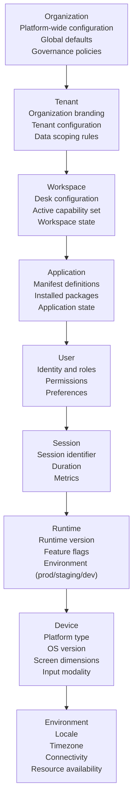
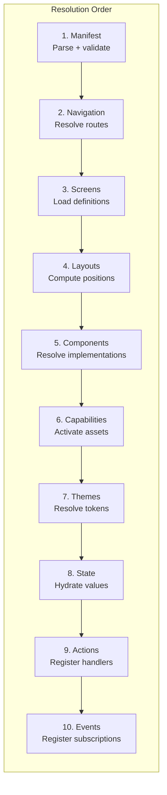
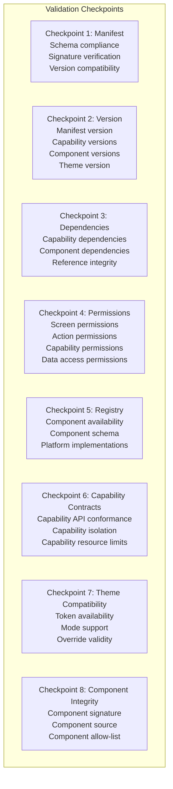
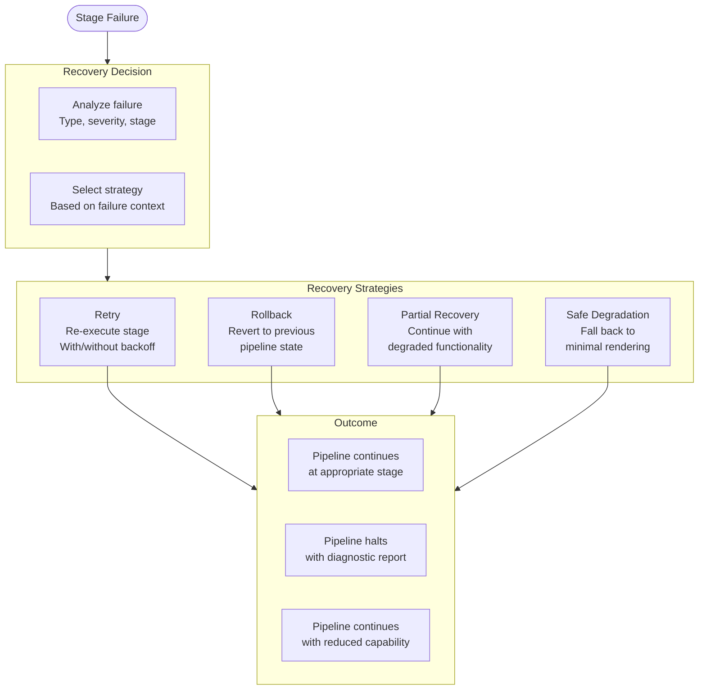
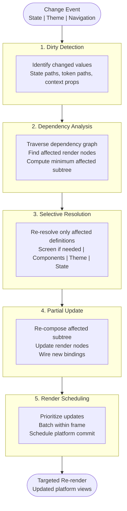
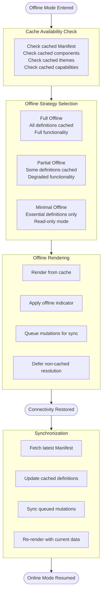
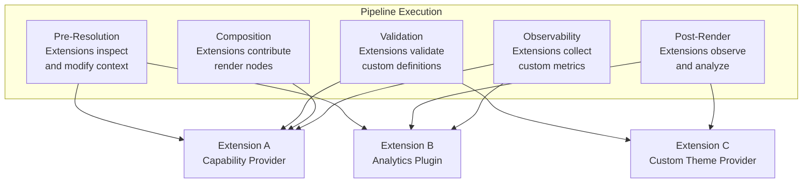
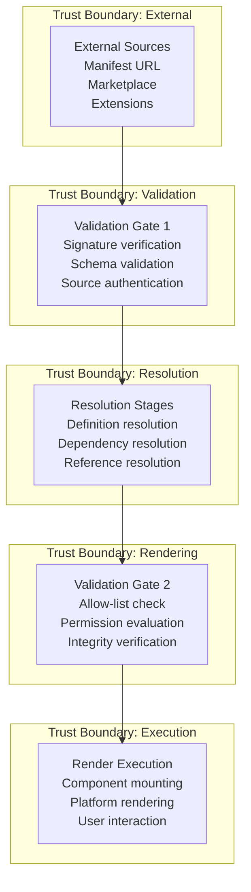
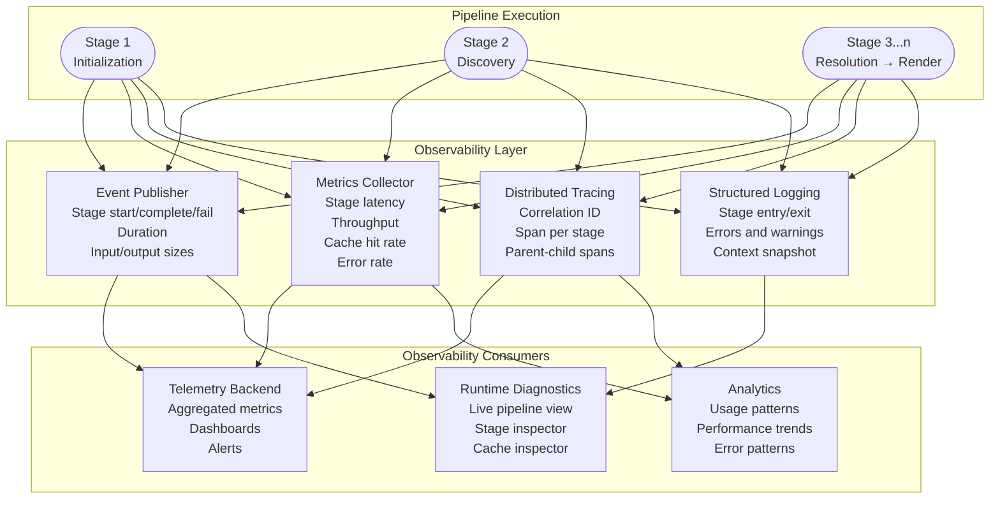

# Rendering Pipeline Architecture

**KB-053 — Rendering Pipeline Architecture Specification**

| Metadata | |
|----------|---|
| **KB ID** | KB-053 |
| **Title** | Rendering Pipeline Architecture |
| **Version** | 0.1.0 |
| **Status** | Draft |
| **Owner** | Architecture Team |
| **Suite** | Runtime & Rendering Architecture |
| **Dependencies** | KB-051 Runtime Architecture Overview, KB-052 Rendering Engine Architecture, KB-042 Application Manifest Specification, KB-045 Screen Model, KB-046 Component Tree Model, KB-047 Action & Event Model, KB-048 Application State Model, KB-049 Theme & Design Token Model, KB-050 Capability Composition Model, KB-044 Navigation Architecture |
| **Related Documents** | KB-041 Application Architecture Overview, KB-043 Workspace & Tenant Model, KB-053 SDUI Architecture, KB-056 Runtime State Management, KB-055 Runtime Navigation & Routing, KB-054 Runtime Component Registry, KB-057 Runtime Event & Action Pipeline, KB-058 Runtime Caching & Synchronization, KB-059 Runtime Security & Isolation, KB-060 Runtime Observability & Diagnostics, KB-008 Runtime Overview, KB-009 Manifest Specification, KB-012 Component Registry |
| **Review Status** | Pending |
| **Last Updated** | 2026-07-11 |

---

### Revision History

| Version | Date | Author | Change |
|---------|------|--------|--------|
| 0.1.0 | 2026-07-11 | AI Architecture Agent | Initial draft |

---

## 1. Executive Summary

### 1.1 Purpose

This document defines the end-to-end Rendering Pipeline Architecture for the DUKADESK platform. The Rendering Pipeline is the structured sequence of stages through which application definitions flow to produce an interactive user experience. It spans from Runtime initialization through application discovery, definition loading, resolution, validation, composition, rendering, interaction, and shutdown.

While KB-052 Rendering Engine Architecture defines the engine itself — its internal subsystems, data structures, and capabilities — this document specifies how rendering flows through each architectural stage. It is the authoritative pipeline contract that every DUKADESK Runtime — Mobile, Web, Desktop, Preview, Builder Studio Preview, and SDK — must implement.

The Rendering Pipeline is not a single linear path. It encompasses multiple sub-pipelines: the initialization pipeline, the resolution pipeline, the validation pipeline, the recovery pipeline, the incremental update pipeline, the offline pipeline, and the extension integration pipeline. Each sub-pipeline has defined stages, inputs, outputs, dependencies, failure conditions, and recovery strategies.

### 1.2 Scope

**In scope:**

- Architectural principles governing the pipeline
- Canonical definitions: Rendering Pipeline, Pipeline Stage, Pipeline Context, Pipeline Execution, Pipeline Dependency, Pipeline Result, Pipeline State, Pipeline Recovery, Pipeline Metadata
- The complete end-to-end rendering pipeline from Runtime Initialization through Runtime Shutdown
- Detailed stage definitions for every pipeline stage with purpose, inputs, outputs, responsibilities, dependencies, failure conditions, and recovery strategies
- Pipeline context hierarchy: Organization, Tenant, Workspace, Application, User, Session, Runtime, Device, Environment
- Resolution ordering: Manifest, Navigation, Screens, Layouts, Components, Capabilities, Themes, State, Actions, Events
- Validation pipeline: validation checkpoints at Manifest, Version, Dependencies, Permissions, Registry, Capability Contracts, Theme Compatibility, Component Integrity
- Recovery pipeline: retry, rollback, partial recovery, safe degradation, recovery events
- Incremental rendering pipeline: dirty detection, dependency analysis, selective resolution, partial updates, render scheduling
- Offline pipeline: cached Manifest, components, themes, capabilities, deferred synchronization
- Extension pipeline: pre-resolution, validation, composition, post-render, observability
- Responsibilities: Runtime, Builder, Registry
- Security: pipeline trust boundaries, validation gates, signature verification, isolation, secure recovery
- Performance: stage latency, pipeline throughput, parallel resolution, scheduling, cache utilization, memory efficiency
- Observability: pipeline metrics, stage metrics, resolution metrics, rendering metrics, failure metrics, correlation IDs, distributed tracing
- Failure scenarios and anti-patterns
- Future evolution

**Out of scope:**

- Implementation details: languages, frameworks, libraries
- Rendering Engine internal architecture (handled by KB-052)
- Component Registry implementation (handled by KB-054)
- Theme Engine implementation (handled by KB-017, KB-049)
- State Management implementation (handled by KB-056)
- Action Dispatcher implementation (handled by KB-057)
- Navigation Engine implementation (handled by KB-055)
- Specific platform Runtimes (handled by respective Runtime teams)
- SDUI protocol details (handled by KB-053)
- Cache Manager implementation (handled by KB-058)
- Event Bus implementation (handled by KB-019)

---

## 2. Architectural Principles

### 2.1 Pipeline-Driven Execution

Every rendering operation is structured as a pipeline stage with defined inputs, processing logic, and outputs. There is no ad-hoc rendering outside the pipeline. Pipeline-driven execution ensures consistency, observability, and recoverability.

### 2.2 Deterministic Processing

The pipeline produces deterministic output. Given identical inputs, every pipeline execution produces identical results at every stage. Determinism enables reproducible testing, reliable debugging, and predictable behavior across Runtime environments.

### 2.3 Stage Isolation

Each pipeline stage is isolated from every other stage. Stages communicate through defined interfaces — inputs and outputs — never through shared mutable state. Stage isolation enables independent testing, parallel execution, and failure containment.

### 2.4 Fail-Fast Validation

Validation occurs at the earliest possible stage. Invalid inputs are detected and rejected before they propagate to downstream stages. Fail-fast validation minimizes wasted computation and surfaces errors with maximum context.

### 2.5 Lazy Resolution

Resolution is deferred to the latest possible moment. Definitions are not resolved until they are needed by a downstream stage. Lazy resolution minimizes startup time, reduces memory footprint, and avoids resolving definitions that may never be used.

### 2.6 Incremental Execution

The pipeline executes incrementally. After the initial full execution, subsequent executions process only the stages affected by changes. Unaffected stages are skipped. Incremental execution is the foundation of the pipeline's performance model.

### 2.7 Observable Pipeline

Every pipeline stage is observable. Stage start, completion, duration, and failure are published as structured events. Observability enables performance analysis, failure diagnosis, and usage analytics.

### 2.8 Recoverable Stages

Every pipeline stage can fail and recover. Recovery strategies — retry, rollback, partial recovery, safe degradation — are defined per stage. No single stage failure should cause an unrecoverable pipeline failure.

### 2.9 Runtime Independent

The pipeline architecture is independent of any specific Runtime environment. The same pipeline stages, ordering, and contracts apply to Mobile, Web, Desktop, Preview, and Builder Studio Preview Runtimes. Runtime-specific behavior is abstracted behind the Platform Adaptation Layer defined in KB-052.

### 2.10 Extensible Architecture

The pipeline supports extension at designated integration points. Extensions — capabilities, plugins, packages — can participate in pre-resolution, validation, composition, post-render, and observability stages without modifying the core pipeline.

---

## 3. Canonical Definitions

### 3.1 Rendering Pipeline

The structured, ordered sequence of stages that transforms application definitions into interactive rendered output. The Rendering Pipeline begins at Runtime initialization and ends at Runtime shutdown. It encompasses all sub-pipelines: initialization, resolution, validation, recovery, incremental update, offline, and extension integration.

### 3.2 Pipeline Stage

A single, atomic unit of pipeline execution. Each stage has a defined purpose, inputs, outputs, responsibilities, dependencies, failure conditions, and recovery strategy. Stages execute in a defined order and communicate through their input/output contracts.

### 3.3 Pipeline Context

The hierarchical context propagated through all pipeline stages. Context carries Organization, Tenant, Workspace, Application, User, Session, Runtime, Device, and Environment information. All stage execution is scoped to the current pipeline context.

### 3.4 Pipeline Execution

A single run of the rendering pipeline from start to completion. A pipeline execution may be a full execution (from initialization through initial render) or an incremental execution (processing only stages affected by a change).

### 3.5 Pipeline Dependency

A relationship between two pipeline stages where one stage requires the output of another stage before it can execute. Dependencies define the execution order and determine which stages must be re-executed when inputs change.

### 3.6 Pipeline Result

The output produced by a completed pipeline execution. The pipeline result is a rendered, interactive user experience. For incremental executions, the pipeline result includes metadata about which stages were executed and what changed.

### 3.7 Pipeline State

The accumulated state of the pipeline at any point during execution. Pipeline state includes which stages have completed, which stages are executing, which stages have failed, and the current pipeline context. Pipeline state is observable for diagnostics and monitoring.

### 3.8 Pipeline Recovery

The mechanism by which the pipeline responds to stage failures. Recovery strategies include retry (re-execute the failed stage), rollback (revert to previous pipeline state), partial recovery (continue with degraded functionality), and safe degradation (fall back to minimal rendering).

### 3.9 Pipeline Metadata

Ancillary information attached to pipeline executions and stages. Metadata includes correlation IDs for distributed tracing, timestamps for duration measurement, version information for definition tracking, and provenance information for audit trails.

---

## 4. End-to-End Rendering Pipeline

### 4.1 Complete Pipeline Flow

```mermaid
flowchart TB
    START([Runtime Start])
    START --> S01
    
    subgraph S01["1. Runtime Initialization"]
        direction LR
        S01A["Initialize subsystems"]
        S01B["Establish platform bindings"]
        S01C["Configure logging"]
    end
    
    S01 --> S02
    
    subgraph S02["2. Application Discovery"]
        direction LR
        S02A["Resolve application target"]
        S02B["Load application configuration"]
        S02C["Identify tenant context"]
    end
    
    S02 --> S03
    
    subgraph S03["3. Manifest Loading"]
        direction LR
        S03A["Fetch Manifest document"]
        S03B["Parse Manifest JSON"]
        S03C["Extract definition references"]
    end
    
    S03 --> S04
    
    subgraph S04["4. Manifest Validation"]
        direction LR
        S04A["Validate schema compliance"]
        S04B["Verify signatures"]
        S04C["Check version compatibility"]
    end
    
    S04 --> S05
    
    subgraph S05["5. Capability Resolution"]
        direction LR
        S05A["Resolve capability dependencies"]
        S05B["Activate capabilities"]
        S05C["Register capability assets"]
    end
    
    S05 --> S06
    
    subgraph S06["6. Navigation Resolution"]
        direction LR
        S06A["Build navigation structure"]
        S06B["Resolve initial route"]
        S06C["Register deep link handlers"]
    end
    
    S06 --> S07
    
    subgraph S07["7. Screen Resolution"]
        direction LR
        S07A["Load target screen definition"]
        S07B["Validate screen schema"]
        S07C["Apply responsive selection"]
    end
    
    S07 --> S08
    
    subgraph S08["8. Layout Resolution"]
        direction LR
        S08A["Parse layout tree"]
        S08B["Build spatial hierarchy"]
        S08C["Measure layout nodes"]
    end
    
    S08 --> S09
    
    subgraph S09["9. Component Tree Resolution"]
        direction LR
        S09A["Resolve component references"]
        S09B["Validate property schemas"]
        S09C["Select platform implementations"]
    end
    
    S09 --> S10
    
    subgraph S10["10. Theme Resolution"]
        direction LR
        S10A["Load theme definition"]
        S10B["Resolve token values"]
        S10C["Apply mode and overrides"]
    end
    
    S10 --> S11
    
    subgraph S11["11. State Hydration"]
        direction LR
        S11A["Initialize state from defaults"]
        S11B["Restore persisted state"]
        S11C["Hydrate from server"]
    end
    
    S11 --> S12
    
    subgraph S12["12. Action Registration"]
        direction LR
        S12A["Register action handlers"]
        S12B["Bind actions to components"]
        S12C["Validate action references"]
    end
    
    S12 --> S13
    
    subgraph S13["13. Event Registration"]
        direction LR
        S13A["Register event subscriptions"]
        S13B["Wire component events"]
        S13C["Register system event handlers"]
    end
    
    S13 --> S14
    
    subgraph S14["14. Accessibility Resolution"]
        direction LR
        S14A["Resolve accessibility roles"]
        S14B["Apply accessibility labels"]
        S14C["Configure navigation order"]
    end
    
    S14 --> S15
    
    subgraph S15["15. Security Validation"]
        direction LR
        S15A["Verify permission rules"]
        S15B["Check component allow-list"]
        S15C["Validate action permissions"]
    end
    
    S15 --> S16
    
    subgraph S16["16. Render Tree Construction"]
        direction LR
        S16A["Build render tree"]
        S16B["Wire bindings"]
        S16C["Set lifecycle state"]
    end
    
    S16 --> S17
    
    subgraph S17["17. Initial Render"]
        direction LR
        S17A["Mount components"]
        S17B["Create platform views"]
        S17C["Display to user"]
    end
    
    S17 --> S18
    
    subgraph S18["18. Interaction Loop"]
        direction LR
        S18A["Process user input"]
        S18B["Dispatch actions"]
        S18C["Handle events"]
    end
    
    S18 --> S19
    
    subgraph S19["19. Incremental Updates"]
        direction LR
        S19A["Detect changes"]
        S19B["Analyze dependencies"]
        S19C["Selective re-render"]
    end
    
    S19 --> S18
    
    S19 --> S20
    
    subgraph S20["20. Runtime Shutdown"]
        direction LR
        S20A["Persist state"]
        S20B["Unmount components"]
        S20C["Release resources"]
    end
    
    S20 --> END2([Runtime Stop])
```

### 4.2 Pipeline Stage Summary

| # | Stage | Type | Input | Output | Failure Recovery |
|---|-------|------|-------|--------|-----------------|
| 1 | Runtime Initialization | Bootstrap | Platform start signal | Initialized Runtime | Retry with timeout |
| 2 | Application Discovery | Bootstrap | App identifier, tenant | Resolved app target | Fallback to default app |
| 3 | Manifest Loading | Resolution | App target, tenant | Parsed Manifest | Retry with cache fallback |
| 4 | Manifest Validation | Validation | Parsed Manifest | Validated Manifest | Reject with error details |
| 5 | Capability Resolution | Resolution | Manifest capabilities | Activated capabilities | Skip failed capability |
| 6 | Navigation Resolution | Resolution | Navigation definitions | Navigation structure | Default navigation fallback |
| 7 | Screen Resolution | Resolution | Screen identifier, params | Resolved Screen Model | Error screen fallback |
| 8 | Layout Resolution | Resolution | Screen layout definition | Computed layout tree | Relaxed constraints |
| 9 | Component Tree Resolution | Resolution | Layout tree, component refs | Resolved component tree | Placeholder components |
| 10 | Theme Resolution | Resolution | Theme reference, mode | Resolved theme tokens | Platform default theme |
| 11 | State Hydration | Resolution | State defaults, persisted state | Hydrated state | Default state |
| 12 | Action Registration | Registration | Action definitions | Registered action handlers | Skip unregistered actions |
| 13 | Event Registration | Registration | Event definitions | Registered event handlers | Skip failed registrations |
| 14 | Accessibility Resolution | Resolution | Component tree, roles | Accessibility properties | Default accessibility |
| 15 | Security Validation | Validation | All definitions | Security verdict | Block with error |
| 16 | Render Tree Construction | Composition | All resolved definitions | Complete render tree | Partial composition |
| 17 | Initial Render | Rendering | Render tree | Platform-rendered screen | Error boundary fallback |
| 18 | Interaction Loop | Runtime | User input, events | Interactive experience | Graceful degradation |
| 19 | Incremental Updates | Update | Change events | Updated render tree | Targeted fallback |
| 20 | Runtime Shutdown | Cleanup | Shutdown signal | Clean termination | Force termination |

---

## 5. Pipeline Stages

### 5.1 Runtime Initialization

| Aspect | Description |
|--------|-------------|
| **Purpose** | Initialize the Runtime environment, create subsystems, establish platform bindings |
| **Inputs** | Platform start signal, Runtime configuration |
| **Outputs** | Initialized Runtime with all subsystems ready |
| **Responsibilities** | Create and initialize the Rendering Engine, Manifest Resolver, Package Resolver, Theme Engine, Navigation Engine, State Manager, Action Dispatcher, Event Bus, Cache Manager, Permission Engine, Telemetry, Diagnostics, Security Manager; establish Platform Adaptation Layer connection; configure logging and telemetry |
| **Dependencies** | Platform Runtime, Operating System |
| **Failure Conditions** | Subsystem initialization timeout, platform binding failure, insufficient resources |
| **Recovery Strategy** | Retry initialization up to 3 times with exponential backoff; on persistent failure, start in safe mode with minimal subsystems |

### 5.2 Application Discovery

| Aspect | Description |
|--------|-------------|
| **Purpose** | Resolve which application to load and establish the initial application context |
| **Inputs** | Application identifier, optional tenant identifier, user credentials or session token |
| **Outputs** | Resolved application target with organization and tenant context |
| **Responsibilities** | Resolve application identifier against configured sources; load application configuration; identify tenant context from identifier, domain, or user profile; validate that the application is accessible |
| **Dependencies** | Runtime Initialization |
| **Failure Conditions** | Unknown application identifier, inaccessible application, unresolvable tenant |
| **Recovery Strategy** | Fallback to default application if configured; show application selection UI if no valid target found |

### 5.3 Manifest Loading

| Aspect | Description |
|--------|-------------|
| **Purpose** | Fetch and parse the Application Manifest document that defines the entire application |
| **Inputs** | Application target, tenant context |
| **Outputs** | Parsed Manifest document with extractable definitions |
| **Responsibilities** | Fetch Manifest document from configured source (embedded, remote URL, local file); parse Manifest JSON; extract definition references for screens, components, capabilities, themes, navigation, and permissions; verify document integrity |
| **Dependencies** | Application Discovery |
| **Failure Conditions** | Manifest fetch timeout, network error, malformed JSON, corrupt document |
| **Recovery Strategy** | Retry fetch from cache (if previously loaded); retry from remote with exponential backoff; on persistent failure, show error screen with diagnostics |

### 5.4 Manifest Validation

| Aspect | Description |
|--------|-------------|
| **Purpose** | Validate the Manifest against its schema, verify signatures, and check version compatibility |
| **Inputs** | Parsed Manifest document |
| **Outputs** | Validated Manifest, or validation error report |
| **Responsibilities** | Validate Manifest structure against Manifest schema (KB-042); verify Manifest digital signature; check Manifest version compatibility with Runtime; validate all cross-references are resolvable; check for deprecated or removed features; verify permission declarations are well-formed |
| **Dependencies** | Manifest Loading |
| **Failure Conditions** | Schema violation, invalid signature, incompatible version, unresolvable cross-reference, malformed permission declaration |
| **Recovery Strategy** | Fail-fast with detailed validation error; do not proceed to downstream stages; provide actionable error report for remediation |

### 5.5 Capability Resolution

| Aspect | Description |
|--------|-------------|
| **Purpose** | Resolve, activate, and register all capabilities declared in the Manifest |
| **Inputs** | Validated Manifest, capability declarations |
| **Outputs** | Activated capabilities with registered components, themes, and actions |
| **Responsibilities** | Resolve capability dependencies from the Package Resolver; activate capabilities in dependency order; register capability-provided components with the Component Registry; register capability-provided theme overrides with the Theme Engine; register capability-provided actions with the Action Dispatcher; apply capability permission scopes |
| **Dependencies** | Manifest Validation |
| **Failure Conditions** | Missing capability package, incompatible capability version, capability dependency cycle, capability activation failure |
| **Recovery Strategy** | Skip failed capability and continue without its features; log detailed error for diagnostics; re-attempt activation if capability package becomes available |

### 5.6 Navigation Resolution

| Aspect | Description |
|--------|-------------|
| **Purpose** | Build the application navigation structure and resolve the initial route |
| **Inputs** | Manifest navigation definitions, capability navigation contributions |
| **Outputs** | Resolved navigation structure with initial route |
| **Responsibilities** | Build navigation structure from Manifest definitions and capability contributions; resolve initial route from application configuration, deep link, or saved navigation state; register deep link handlers; evaluate navigation permission rules; construct navigation state (stack, history) |
| **Dependencies** | Capability Resolution |
| **Failure Conditions** | Unresolvable initial route, invalid navigation definition, conflicting navigation contributions |
| **Recovery Strategy** | Fall back to first available route; reject conflicting contributions in favor of Manifest definition; log navigation errors without blocking application load |

### 5.7 Screen Resolution

| Aspect | Description |
|--------|-------------|
| **Purpose** | Load and resolve the definition for a specific screen to be rendered |
| **Inputs** | Screen identifier, navigation parameters, route context |
| **Outputs** | Resolved Screen Model ready for layout resolution |
| **Responsibilities** | Load screen definition from Manifest Resolver or cache; validate screen structure against Screen Model schema (KB-045); apply responsive variant selection based on device context; evaluate screen-level permission rules; resolve screen parameters and validate against parameter schema; construct resolved Screen Model |
| **Dependencies** | Navigation Resolution |
| **Failure Conditions** | Screen definition not found, screen schema violation, permission denied, invalid parameters |
| **Recovery Strategy** | Navigation fallback to previous or default screen; error screen for permission failures; parameter defaults for invalid parameters |

### 5.8 Layout Resolution

| Aspect | Description |
|--------|-------------|
| **Purpose** | Parse the screen's layout definition and compute spatial positions for all elements |
| **Inputs** | Resolved Screen Model, device viewport constraints |
| **Outputs** | Computed layout tree with positioned nodes |
| **Responsibilities** | Parse layout definition into layout tree; build spatial hierarchy of containers and leaf nodes; apply platform-specific layout computation through Platform Adapter; compute positions and sizes for every layout node; handle overflow detection and scroll container insertion; manage z-order |
| **Dependencies** | Screen Resolution, Theme Resolution (for spacing tokens) |
| **Failure Conditions** | Unsolvable layout constraints, malformed layout definition, layout depth exceeded |
| **Recovery Strategy** | Relax constraint violations with warnings; fall back to default container behavior; truncate layout depth at maximum |

### 5.9 Component Tree Resolution

| Aspect | Description |
|--------|-------------|
| **Purpose** | Resolve every component reference in the layout tree to a concrete component implementation |
| **Inputs** | Layout tree, component references, Component Registry |
| **Outputs** | Resolved component tree with registry-linked implementations |
| **Responsibilities** | Look up each component identifier in the Component Registry; validate component property schemas against declared properties; select platform-specific component implementation; resolve component version constraints; apply default property values; register fallback placeholders for unresolvable components |
| **Dependencies** | Layout Resolution, Capability Resolution (for capability-provided components) |
| **Failure Conditions** | Unregistered component identifier, version mismatch, property schema violation, platform implementation unavailable |
| **Recovery Strategy** | Fallback placeholder component preserves layout space; log component identifier and alternatives for diagnostics; attempt nearest compatible version |

### 5.10 Theme Resolution

| Aspect | Description |
|--------|-------------|
| **Purpose** | Load the active theme and resolve all token values for visual properties |
| **Inputs** | Theme reference, theme mode, screen-level theme overrides |
| **Outputs** | Resolved theme token set for all visual properties |
| **Responsibilities** | Load theme definition from Theme Engine; resolve token values for all referenced tokens; apply theme mode (light, dark, high-contrast); apply screen-level and component-level theme overrides; resolve platform-specific token values through Platform Adapter; provide fallback values for unresolvable tokens |
| **Dependencies** | Manifest Validation, Capability Resolution |
| **Failure Conditions** | Theme definition not found, unresolvable token reference, mode variant missing, incompatible theme version |
| **Recovery Strategy** | Fall back to platform default theme; use default token values for missing tokens; log token resolution failures at warning level |

### 5.11 State Hydration

| Aspect | Description |
|--------|-------------|
| **Purpose** | Initialize application state from all sources and make it available for data binding |
| **Inputs** | Manifest state definitions, persisted state from previous sessions, server-provided initial state |
| **Outputs** | Hydrated application state ready for binding |
| **Responsibilities** | Initialize state from Manifest-defined defaults; restore persisted state from previous session; apply server-provided initial state; validate state structure against state schema; establish state subscriptions for reactive bindings; apply tenant-specific and user-specific state overrides |
| **Dependencies** | Manifest Validation, Capability Resolution |
| **Failure Conditions** | Persisted state corruption, state schema violation, server state fetch failure |
| **Recovery Strategy** | Fall back to default state on corruption; retry server state fetch asynchronously; log state hydration warnings without blocking render |

### 5.12 Action Registration

| Aspect | Description |
|--------|-------------|
| **Purpose** | Register all action handlers referenced by screen definitions and capability contributions |
| **Inputs** | Action definitions from Manifest, screens, and capabilities |
| **Outputs** | Registered action handlers ready for dispatch |
| **Responsibilities** | Parse action definitions from all sources; validate action type against Action Dispatcher's registered types; register action handlers with the Action Dispatcher; validate action parameter schemas; establish action permission bindings |
| **Dependencies** | Capability Resolution, Screen Resolution |
| **Failure Conditions** | Unregistered action type, invalid action parameter schema, action permission violation |
| **Recovery Strategy** | Skip unregistered action types with warning; log invalid parameter schemas; allow actions with valid permissions only |

### 5.13 Event Registration

| Aspect | Description |
|--------|-------------|
| **Purpose** | Register event subscriptions for cross-component and cross-system communication |
| **Inputs** | Event definitions from Manifest, screens, components, and capabilities |
| **Outputs** | Registered event handlers and subscriptions |
| **Responsibilities** | Parse event definitions from all sources; register event subscriptions with the Event Bus; wire component events to action handlers; register system event handlers (connectivity, lifecycle); validate event type compatibility; manage subscription lifecycle |
| **Dependencies** | Action Registration, Component Tree Resolution |
| **Failure Conditions** | Invalid event type, event handler registration failure, event type conflict |
| **Recovery Strategy** | Skip invalid event types; deduplicate conflicting subscriptions; log registration failures at warning level |

### 5.14 Accessibility Resolution

| Aspect | Description |
|--------|-------------|
| **Purpose** | Resolve accessibility properties for all rendered components |
| **Inputs** | Component tree, accessibility definitions from component schemas |
| **Outputs** | Accessibility-annotated component tree |
| **Responsibilities** | Resolve accessibility roles from component schemas; apply accessibility labels and hints; configure focus and navigation order; apply accessibility actions; resolve platform-specific accessibility translations through Platform Adapter |
| **Dependencies** | Component Tree Resolution, Theme Resolution |
| **Failure Conditions** | Missing accessibility labels, invalid accessibility roles |
| **Recovery Strategy** | Fall back to component name as label; default to generic role; log missing accessibility properties as warnings |

### 5.15 Security Validation

| Aspect | Description |
|--------|-------------|
| **Purpose** | Perform final security validation before rendering any content |
| **Inputs** | All resolved definitions: screens, components, capabilities, themes, actions, events |
| **Outputs** | Security validation verdict: pass or fail with details |
| **Responsibilities** | Verify all component references are on the approved allow-list; validate screen permission rules against user context; verify capability permissions; check action permission bindings; validate theme token access restrictions; verify definition integrity (no tampering since validation); enforce rendering isolation constraints |
| **Dependencies** | All resolution stages |
| **Failure Conditions** | Component allow-list violation, screen permission denied, capability permission denied, action permission violation, integrity check failure, isolation constraint violation |
| **Recovery Strategy** | Block violations with detailed error; allow permitted content to render; log all security violations for audit; do not proceed if critical security constraints are violated |

### 5.16 Render Tree Construction

| Aspect | Description |
|--------|-------------|
| **Purpose** | Build the complete render tree from all resolved definitions, ready for platform rendering |
| **Inputs** | Resolved component tree, resolved theme tokens, hydrated state, registered actions and events, accessibility annotations |
| **Outputs** | Complete render tree with bound resources |
| **Responsibilities** | Construct root render node for the screen; build layout node hierarchy; create component nodes linked to registry implementations; create capability boundary nodes; wire state bindings to State Manager paths; wire theme bindings to resolved token values; wire event bindings to registered action handlers; apply accessibility properties; set initial lifecycle state on all nodes |
| **Dependencies** | All resolution and registration stages |
| **Failure Conditions** | Binding wire failure, render node creation failure, tree depth exceeded |
| **Recovery Strategy** | Partial composition — render available nodes, skip failed nodes; log composition failures; apply error boundary at failed nodes |

### 5.17 Initial Render

| Aspect | Description |
|--------|-------------|
| **Purpose** | Mount the render tree to the platform and display the initial screen to the user |
| **Inputs** | Complete render tree, Platform Adapter |
| **Outputs** | Platform-rendered, visible, interactive screen |
| **Responsibilities** | Mount root render node to platform view hierarchy; create platform views for each render node through Platform Adapter; apply platform-specific layout and positioning; register platform event handlers (touch, click, keyboard); apply animations and transitions; register accessibility hooks; display screen to user |
| **Dependencies** | Render Tree Construction |
| **Failure Conditions** | Platform view creation failure, mount timeout, memory pressure, platform rendering error |
| **Recovery Strategy** | Error boundary at screen level; graceful degradation — disable animations, reduce quality, show fallback UI; log rendering errors for diagnostics |

### 5.18 Interaction Loop

| Aspect | Description |
|--------|-------------|
| **Purpose** | Process user interactions and system events during the application lifecycle |
| **Inputs** | User input events (touch, click, keyboard, voice), system events (connectivity, lifecycle, notifications) |
| **Outputs** | Responsive interactive experience |
| **Responsibilities** | Capture user input through Platform Adapter; dispatch input events to focused components; trigger action execution for component event handlers; process system events from Event Bus; manage focus and input modality; provide haptic and audio feedback through Platform Adapter |
| **Dependencies** | Initial Render |
| **Failure Conditions** | Input handling failure, action dispatch failure, event processing failure |
| **Recovery Strategy** | Gracefully handle input errors without blocking further interaction; log action dispatch failures; continue processing remaining events |

### 5.19 Incremental Updates

| Aspect | Description |
|--------|-------------|
| **Purpose** | Detect changes and perform targeted re-renders throughout the application lifecycle |
| **Inputs** | Change events from State Manager, Theme Engine, Event Bus, Navigation Engine |
| **Outputs** | Updated render tree with selective re-renders |
| **Responsibilities** | Receive change notifications; analyze dependency graph to identify affected render nodes; perform selective resolution for affected definitions; re-compose affected render tree subtrees; re-render only changed components; update platform views for changed nodes only |
| **Dependencies** | Interaction Loop |
| **Failure Conditions** | Dependency analysis failure, selective resolution failure, re-render failure |
| **Recovery Strategy** | Broaden affected scope as fallback; fall back to full re-render if selective resolution fails; error boundary for failed re-renders |

### 5.20 Runtime Shutdown

| Aspect | Description |
|--------|-------------|
| **Purpose** | Gracefully terminate the Runtime and release all resources |
| **Inputs** | Shutdown signal (user action, system event, error) |
| **Outputs** | Cleanly terminated Runtime with persisted state |
| **Responsibilities** | Persist application state to local storage; unmount all components from platform view hierarchy; unregister all event subscriptions; deactivate capabilities; release cached definitions and assets; flush telemetry data; close platform connections; signal completion to platform |
| **Dependencies** | All stages |
| **Failure Conditions** | State persistence failure, component unmount failure, resource release failure, shutdown timeout |
| **Recovery Strategy** | Force unmount on timeout; log persistence failures without blocking shutdown; release resources best-effort; detect incomplete shutdown on next startup |

---

## 6. Pipeline Context

### 6.1 Context Hierarchy

### 6.2 Context Propagation Rules

| Rule | Description |
|------|-------------|
| Inheritance | Each context level inherits all properties from its parent level |
| Override | Inner levels may override inherited properties within their scope |
| Restriction | Inner levels may restrict but not expand outer-level permissions |
| Scoping | All pipeline stage execution is scoped to the current pipeline context |
| Immutability | Context properties are immutable during a single pipeline execution |
| Isolation | Contexts at the same level cannot access each other's properties |

---

## 7. Resolution Order

### 7.1 Architectural Ordering

### 7.2 Ordering Rules

| Rule | Description | Violation Consequence |
|------|-------------|----------------------|
| Manifest first | Manifest must be fully validated before any other resolution begins | Downstream resolutions have no definitions to resolve |
| Navigation before screens | Navigation structure must be resolved before screens can be loaded | Screen target cannot be determined |
| Layouts before components | Layout must be parsed before components can be placed | Components have no spatial context |
| Components before capabilities | Component registry must be populated before capabilities can register additional components | Capability components render as missing |
| Capabilities before themes | Capabilities may provide theme overrides that must be resolved | Theme resolution misses capability-branded tokens |
| Themes before state | State hydration may use theme-dependent defaults | State values may mismatch theme context |
| State before actions | Actions may reference state values that must be hydrated | Action parameters may reference uninitialized state |
| Actions before events | Events wire to registered actions that must exist | Event handlers reference unregistered actions |

---

## 8. Validation Pipeline

### 8.1 Validation Checkpoints

### 8.2 Checkpoint Definitions

| Checkpoint | Stage | What Is Validated | Failure Action |
|------------|-------|-------------------|----------------|
| **1. Manifest** | Manifest Validation | Schema compliance, signature, version | Reject Manifest with detailed error |
| **2. Version** | Manifest Validation | Manifest version compatibility with Runtime, capability version constraints | Block incompatible versions |
| **3. Dependencies** | Capability Resolution | Capability dependency graph (no cycles, all resolved), component reference integrity | Skip unresolvable dependencies |
| **4. Permissions** | Security Validation | Screen permissions against user roles, action permissions, capability scopes | Block unauthorized access |
| **5. Registry** | Component Tree Resolution | Component identifier in Registry, property schema match, platform implementation exists | Fallback placeholder |
| **6. Capability Contracts** | Capability Resolution | Capability API compliance with declared contracts, isolation boundaries | Disable non-compliant capability |
| **7. Theme Compatibility** | Theme Resolution | Token paths exist in theme, mode variants available, overrides are valid | Default token values |
| **8. Component Integrity** | Security Validation | Component signature valid, source is trusted, component on allow-list | Block untrusted component |

---

## 9. Recovery Pipeline

### 9.1 Recovery Architecture

### 9.2 Recovery Strategy Selection

| Failure Type | Severity | Default Strategy | Alternative Strategy |
|-------------|----------|-----------------|---------------------|
| Manifest validation failure | Critical | Halt pipeline | — |
| Manifest fetch failure | High | Retry (3x, exponential backoff) | Cache fallback |
| Capability activation failure | Medium | Skip capability | Retry on demand |
| Component resolution failure | Medium | Partial recovery (placeholder) | Retry on navigation |
| Theme resolution failure | Low | Safe degradation (default theme) | Retry on theme switch |
| State hydration failure | Low | Safe degradation (default state) | Retry on state access |
| Action registration failure | Low | Skip action | Retry on action trigger |
| Event registration failure | Low | Skip event | Retry on subscription |
| Security validation failure | Critical | Halt pipeline | Partial recovery for non-critical |
| Render tree construction failure | High | Retry | Safe degradation |
| Platform render failure | Medium | Retry | Safe degradation |
| Timeout (any stage) | Medium | Retry (2x, no backoff) | Skip stage if optional |

### 9.3 Recovery Events

The Recovery Pipeline publishes events for every recovery action:

| Event | Payload | Emitted When |
|-------|---------|-------------|
| `pipeline.recovery.retry` | stage, attempt, error | Stage retry initiated |
| `pipeline.recovery.rollback` | stage, targetStage, error | Stage rollback executed |
| `pipeline.recovery.partial` | stage, skippedWork, error | Partial recovery applied |
| `pipeline.recovery.safe` | stage, fallback, error | Safe degradation applied |
| `pipeline.recovery.failed` | stage, strategy, error | All recovery strategies exhausted |
| `pipeline.recovery.succeeded` | stage, strategy, duration | Recovery completed successfully |

---

## 10. Incremental Rendering Pipeline

### 10.1 Incremental Flow

### 10.2 Dirty Detection

| Change Source | Detection Mechanism | Scope |
|--------------|-------------------|-------|
| State Manager | Subscription notification with changed paths | Specific state paths |
| Theme Engine | Theme change event with changed token set | Affected token paths |
| Navigation Engine | Navigation event with route change | Screen transition |
| Event Bus | Custom event with change payload | Event-defined scope |
| Context Manager | Context change notification | Affected context properties |

### 10.3 Dependency Analysis

The dependency graph maps every render node to its dependencies:

- **State dependencies** — Which state paths each render node reads
- **Theme dependencies** — Which theme tokens each render node references
- **Context dependencies** — Which context properties each render node uses
- **Parent dependencies** — Which parent nodes affect positioning

When a change occurs, the dependency graph is traversed to find all render nodes that depend on the changed value. The minimum affected subtree is computed as the lowest common ancestor of all affected nodes.

### 10.4 Selective Resolution

Only the definitions required by affected render nodes are re-resolved:

| Affected Change | Selective Resolution Scope |
|----------------|---------------------------|
| State value change | Re-bind state for affected components only |
| Theme token change | Re-resolve theme bindings for affected components |
| Navigation change | Full pipeline for new screen |
| Context change | Re-resolve context-dependent bindings |

### 10.5 Partial Update

The partial update re-composes only the affected subtree of the render tree:

1. Clone the affected subtree root
2. Re-create component nodes with updated bindings
3. Re-wire event handlers
4. Diff new subtree against existing subtree
5. Apply only changed nodes to the platform

### 10.6 Render Scheduling

| Priority | Update Type | Scheduling |
|----------|-------------|------------|
| Critical | User interaction response | Immediate — within current frame |
| High | Visible component state change | Next frame |
| Normal | Non-visible component change | Within 2-3 frames |
| Low | Off-screen preparation | Idle scheduling |
| Background | Cache warming | Background thread |

---

## 11. Offline Pipeline

### 11.1 Offline Pipeline Flow

### 11.2 Offline Cache Requirements

| Cache | Required For Full Offline | Fallback For Partial Offline |
|-------|--------------------------|------------------------------|
| Manifest | Complete Manifest document | Last known Manifest version |
| Screen definitions | All screens the user may navigate to | Last visited screens |
| Component implementations | All registered components | Core platform components only |
| Theme definitions | Active theme with all modes | Default theme only |
| Capability assets | Installed capabilities | Active capabilities only |
| Application state | Persisted state snapshot | Default state |

### 11.3 Deferred Synchronization

Definitions that cannot be resolved offline are handled through deferred synchronization:

1. **Deferred resolution marker** — Unresolved definitions are marked with a deferred resolution flag.
2. **Cached fallback** — The last cached version of the definition is used if available.
3. **Placeholder rendering** — Components requiring unresolved definitions render as placeholders.
4. **Synchronization queue** — Deferred resolutions are queued for processing when connectivity is restored.
5. **Recovery re-render** — On connectivity restoration, deferred resolutions are processed and affected components are re-rendered.

---

## 12. Extension Pipeline

### 12.1 Extension Integration Points

### 12.2 Extension Participation

| Integration Point | Extension Role | Input | Output | Constraints |
|-----------------|---------------|-------|--------|-------------|
| Pre-Resolution | Inspect and augment pipeline context | Pipeline context | Modified context | Cannot block execution |
| Validation | Validate extension-specific definitions | Extension definitions | Validation result | Must not affect core definitions |
| Composition | Contribute render nodes | Render tree | Augmented render tree | Must operate within capability boundary |
| Post-Render | Observe and analyze rendered output | Render output | Observations, analytics | Read-only access |
| Observability | Collect custom metrics | Pipeline events | Custom metrics | Must not affect pipeline timing |

---

## 13. Subsystem Responsibilities

### 13.1 Runtime Responsibilities

| Responsibility | Description |
|--------------|-------------|
| Pipeline execution | Execute the rendering pipeline from initialization through shutdown |
| Subsystem orchestration | Coordinate all Runtime subsystems through the pipeline stages |
| Error handling | Apply recovery strategies for pipeline stage failures |
| Resource management | Allocate and release resources for pipeline execution |
| Context propagation | Maintain and propagate pipeline context through all stages |
| Observability | Collect and export pipeline metrics and events |
| Security enforcement | Enforce pipeline trust boundaries and validation gates |
| Offline support | Execute offline pipeline when connectivity is unavailable |

### 13.2 Builder Responsibilities

| Responsibility | Description |
|--------------|-------------|
| Valid definition production | Produce Manifest-valid definitions that pass all pipeline validation checkpoints |
| Complete definition provision | Provide all definitions required for pipeline execution — screens, components, layouts, themes, capabilities |
| Cross-reference integrity | Ensure all cross-references in definitions are resolvable by the pipeline |
| Dependency declaration | Declare all capability and component dependencies explicitly |
| Permission declaration | Declare all permission requirements for screens, actions, and data access |
| Version compatibility | Ensure definitions are compatible with target Runtime versions |

### 13.3 Registry Responsibilities

| Responsibility | Description |
|--------------|-------------|
| Component availability | Ensure all components referenced by the Manifest are registered and available |
| Version management | Maintain version history and support version constraint resolution |
| Schema provision | Provide property schemas for component validation at resolution time |
| Platform implementations | Provide platform-specific component implementations for each target platform |
| Lazy loading support | Support lazy loading of component implementations at resolution time |

---

## 14. Security

### 14.1 Pipeline Trust Boundaries

### 14.2 Validation Gates

| Gate | Location | Validates | Failure Action |
|------|----------|-----------|---------------|
| Gate 1 | Before any resolution | Manifest signature, source authenticity, schema compliance | Reject all definitions from invalid source |
| Gate 2 | Before render tree construction | Component allow-list, screen permissions, action permissions, capability isolation | Block specific violation, allow rest |

### 14.3 Signature Verification

| Artifact | Signature Requirement | Verification |
|----------|----------------------|--------------|
| Application Manifest | Signed by Builder | Verify against Builder's registered public key |
| Marketplace packages | Signed by Marketplace | Verify against Marketplace certification key |
| Extension packages | Signed by extension developer | Verify against developer's registered key |
| Component implementations | Signed by component publisher | Verify against publisher's registered key |

### 14.4 Isolation

| Isolation Concern | Enforcement |
|------------------|-------------|
| Application isolation | Each application runs in a separate Runtime instance or sandboxed context |
| Workspace isolation | Workspace-scoped pipeline context prevents cross-workspace access |
| Tenant isolation | Tenant context scopes all resolution and rendering |
| Session isolation | Session context isolates state and events |
| Extension isolation | Extension pipeline integration is read-only except within capability boundaries |

### 14.5 Secure Recovery

Recovery from a security failure must not bypass security controls:

1. **Retry preserves security** — Retry re-executes the same validation gates.
2. **Rollback preserves security** — Rollback does not restore insecure state.
3. **Partial recovery preserves security** — Degraded functionality operates within the same security constraints.
4. **All security violations are logged** — Every security failure is recorded with full context for audit.

---

## 15. Performance

### 15.1 Performance Dimensions

| Dimension | Target | Measurement |
|-----------|--------|-------------|
| Stage latency | Each stage < 100ms target, < 500ms maximum | Per-stage timing |
| Pipeline throughput | Initial pipeline < 3s cold start, < 1s warm start | Total pipeline execution time |
| Parallel resolution | Maximize concurrent stage resolution | Stage concurrency count |
| Scheduling | Critical path prioritized, idle work deferred | Time-to-interactive |
| Cache utilization | > 90% cache hit rate | Cache hit/miss ratio per cache type |
| Memory efficiency | < 50MB peak for typical application | Memory allocation and retention |

### 15.2 Parallel Resolution Opportunities

Certain pipeline stages can execute in parallel when their dependencies are satisfied:

| Parallel Group | Stages | Condition |
|---------------|--------|-----------|
| Group A | Capability Resolution, Navigation Resolution | After Manifest Validation |
| Group B | Layout Resolution, Component Tree Resolution | After Screen Resolution |
| Group C | Theme Resolution, State Hydration | After Capability and Component Resolution |
| Group D | Action Registration, Event Registration | After State Hydration |

### 15.3 Cache Utilization Strategy

| Stage | Cache Type | Expected Hit Rate | Miss Penalty |
|-------|-----------|-------------------|-------------|
| Manifest Loading | Manifest Cache | > 95% (same session) | Manifest fetch + parse |
| Screen Resolution | Definition Cache | > 80% (revisited screens) | Definition fetch |
| Component Tree Resolution | Component Cache | > 90% (reused components) | Registry lookup + load |
| Theme Resolution | Theme Cache | > 95% (single theme per session) | Theme fetch + resolve |
| Layout Resolution | Layout Cache | > 80% (same breakpoint) | Layout compute |

---

## 16. Observability

### 16.1 Pipeline Observability Architecture

### 16.2 Pipeline Metrics

| Metric | Type | Source | Aggregation |
|--------|------|--------|-------------|
| `pipeline.total.duration` | Timer | Pipeline execution | Sum, avg, p95, p99 |
| `pipeline.stage.duration` | Timer (per stage) | Stage execution | Sum, avg, p95, p99 |
| `pipeline.stage.success` | Counter (per stage) | Stage completion | Rate, total |
| `pipeline.stage.failure` | Counter (per stage) | Stage failure | Rate, total |
| `pipeline.recovery.count` | Counter (per strategy) | Recovery execution | Rate, total |
| `pipeline.cache.hit` | Counter (per cache) | Cache read | Rate, ratio |
| `pipeline.cache.miss` | Counter (per cache) | Cache read | Rate, ratio |
| `pipeline.resolution.count` | Gauge (per domain) | Resolution execution | Current, max |
| `pipeline.render.nodes` | Gauge | Render tree | Current, max |
| `pipeline.throughput` | Meter | Pipeline execution | Rate |

### 16.3 Stage Metrics

Each stage publishes:

| Metric | Description |
|--------|-------------|
| `stage.{name}.duration` | Wall-clock time for stage execution |
| `stage.{name}.input.size` | Size of stage input (bytes, count) |
| `stage.{name}.output.size` | Size of stage output (bytes, count) |
| `stage.{name}.retry.count` | Number of retry attempts |
| `stage.{name}.failure.reason` | Failure reason when stage fails |

### 16.4 Correlation IDs

Every pipeline execution is assigned a correlation ID that is propagated through all stages:

| Scope | ID Format | Propagation |
|-------|-----------|-------------|
| Pipeline execution | `pl-{uuid}` | Header/metadata on all stage inputs |
| Stage execution | `st-{uuid}-{stageName}` | Child of pipeline correlation ID |
| Recovery attempt | `rc-{uuid}-{stageName}-{attempt}` | Child of stage correlation ID |
| Resolution | `rs-{uuid}-{domain}-{identifier}` | Child of stage correlation ID |

### 16.5 Distributed Tracing

The pipeline supports distributed tracing across Runtime boundaries:

| Trace Context | When Created | Parent |
|--------------|-------------|--------|
| Pipeline execution start | Runtime initialization | None (root span) |
| Per stage | Stage start | Pipeline execution span |
| Resolution call (to Registry, Manifest Resolver, etc.) | Resolution start | Stage span |
| Recovery action | Recovery initiation | Failed stage span |

---

## 17. Failure Scenarios

| Scenario | Stage | Detection | Response | Recovery |
|----------|-------|-----------|----------|----------|
| Invalid Manifest | Manifest Validation | Schema validation fails | Halt pipeline | Return actionable error |
| Dependency Resolution Failure | Capability Resolution | Capability package not found | Skip capability | Retry on availability |
| Component Resolution Failure | Component Tree Resolution | Component not in Registry | Placeholder component | Retry on Registry |
| Theme Resolution Failure | Theme Resolution | Token path not found | Default token value | Retry on theme switch |
| State Hydration Failure | State Hydration | Persisted state corrupt | Default state | Retry on next load |
| Extension Failure | Any extension point | Extension throws or times out | Skip extension | Re-activate on demand |
| Timeout | Any stage | Stage exceeds max duration | Recovery strategy per stage | Configurable per stage |
| Registry Unavailable | Component Tree Resolution | Registry connection fails | Cached components + placeholders | Retry with backoff |

---

## 18. Anti-Patterns

| Anti-Pattern | Description | Consequence | Correct Approach |
|-------------|-------------|-------------|-----------------|
| Out-of-order stage execution | Executing stages before their dependencies are satisfied | Missing definitions cause cascading failures | Enforce strict stage ordering |
| Skipping validation | Bypassing validation checkpoints for performance | Security vulnerabilities, rendering errors | Never skip validation; optimize elsewhere |
| Mutable pipeline stages | Modifying stage outputs after they have been consumed | Non-deterministic behavior, debugging nightmares | Immutable stage outputs |
| Hidden dependencies | Stages depending on undocumented outputs from other stages | Brittle pipeline, unexpected failures | Explicit dependency declarations |
| Runtime-specific execution paths | Pipeline executing differently based on Runtime | Inconsistent behavior across platforms | Runtime-independent pipeline architecture |
| Blocking with business logic | Executing business logic synchronously in pipeline stages | UI blocking, degraded user experience | Business logic in capabilities, not pipeline |
| Over-resolution | Resolving all definitions upfront | Slow startup, wasted memory | Lazy resolution by default |
| Missing recovery strategies | Stages without defined failure recovery | Unrecoverable pipeline failures | Every stage has a recovery strategy |

---

## 19. Future Evolution

### 19.1 Parallel Pipeline Execution

Future versions may execute independent pipeline stages in parallel:

| Parallel Group | Stages | Speedup |
|---------------|--------|---------|
| Resolution + Validation | Capability Resolution, Navigation Resolution | 2x |
| Layout + Component | Layout Resolution, Component Tree Resolution | 2x |
| Theme + State | Theme Resolution, State Hydration | 2x |
| Action + Event | Action Registration, Event Registration | 2x |

### 19.2 Streaming Rendering

The pipeline may support streaming the rendering output:

- **Progressive screen delivery** — Critical content is rendered first, supplementary content streams in.
- **Incremental definition streaming** — Definitions are streamed as needed rather than loaded in bulk.
- **Real-time collaborative rendering** — Pipeline output is streamed to multiple participants simultaneously.

### 19.3 Distributed Runtime Pipelines

Pipeline stages may execute across distributed Runtime instances:

- **Edge-resolved definitions** — Definition resolution occurs on edge servers for low latency.
- **Server-side render initiation** — Render tree construction begins on server, completes on client.
- **Cross-device pipeline coordination** — Multiple devices coordinate pipeline execution for shared sessions.

### 19.4 AI-Assisted Optimization

AI may optimize pipeline execution:

- **Predictive preloading** — AI predicts which screens the user will navigate to and preloads their definitions.
- **Intelligent cache management** — AI optimizes cache eviction based on usage patterns.
- **Adaptive scheduling** — AI adjusts rendering priorities based on user behavior.

### 19.5 Predictive Preloading

The pipeline may predictively preload definitions:

- **Navigation prediction** — Predict next screen based on navigation patterns.
- **Data prefetching** — Prefetch state data for predicted screens.
- **Component pre-warming** — Pre-resolve and cache component implementations for predicted screens.

### 19.6 Edge Rendering

The pipeline may execute partially on edge infrastructure:

- **Definition caching at edge** — Manifests and screen definitions cached on CDN edge nodes.
- **Partial pipeline execution at edge** — Resolution stages execute on edge, rendering on client.
- **Global pipeline state** — Pipeline context synchronized across edge nodes for global sessions.

---

## 20. Cross-References

| Reference | Description |
|-----------|-------------|
| KB-042 | Application Manifest Specification — Manifest document structure validated and consumed by the pipeline |
| KB-044 | Navigation Architecture — navigation structures resolved by the Navigation Resolution stage |
| KB-045 | Screen Model — screen definitions resolved by the Screen Resolution stage |
| KB-046 | Component Tree Model — component hierarchies resolved by the Component Tree Resolution stage |
| KB-047 | Action & Event Model — actions and events registered by the Action and Event Registration stages |
| KB-048 | Application State Model — state hydrated by the State Hydration stage |
| KB-049 | Theme & Design Token Model — themes resolved by the Theme Resolution stage |
| KB-050 | Capability Composition Model — capabilities resolved by the Capability Resolution stage |
| KB-051 | Runtime Architecture Overview — foundational Runtime architecture the pipeline executes within |
| KB-052 | Rendering Engine Architecture — the engine that the pipeline drives |
| KB-012 | Component Registry — component resolution dependency for the Component Tree Resolution stage |
| KB-009 | Manifest Specification — Manifest structure consumed by Manifest Loading stage |
| KB-008 | Runtime Overview — high-level Runtime context |
| KB-041 | Application Architecture Overview — application architecture context |
| KB-043 | Workspace & Tenant Model — workspace and tenant context for the pipeline |
| KB-056 | Runtime State Management — state management consumed by State Hydration |
| KB-055 | Runtime Navigation & Routing — navigation consumed by Navigation Resolution |
| KB-054 | Runtime Component Registry — component registry consumed by Component Tree Resolution |
| KB-057 | Runtime Event & Action Pipeline — action and event pipeline consumed by Action and Event Registration |
| KB-058 | Runtime Caching & Synchronization — caching consumed by Offline Pipeline |
| KB-059 | Runtime Security & Isolation — security consumed by Validation and Security stages |
| KB-060 | Runtime Observability & Diagnostics — observability consumed by Pipeline Observability |

---

## 21. Open Questions

1. Should the pipeline support dynamic stage injection, where capabilities can insert custom stages between core stages?
2. What is the optimal strategy for parallel stage execution given the Runtime thread model constraints?
3. Should pipeline execution be pausable and resumable for long-running resolution stages?
4. How should pipeline timeout be configured — globally or per-stage?
5. Should the offline pipeline support priority-based definition caching (cache high-priority definitions first)?
6. What distributed tracing backend should the pipeline integrate with?
7. Should the pipeline support differential execution — comparing current and previous pipeline states to skip unchanged stages?
