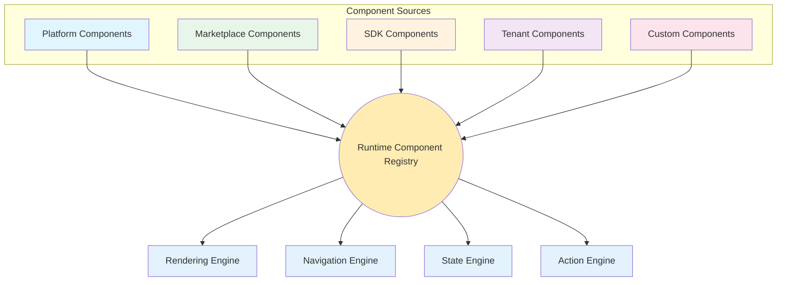
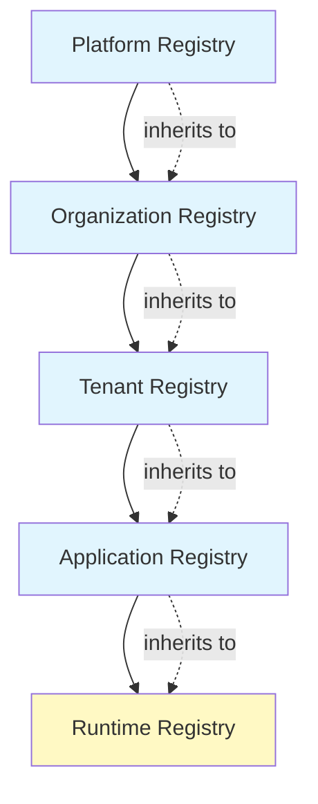
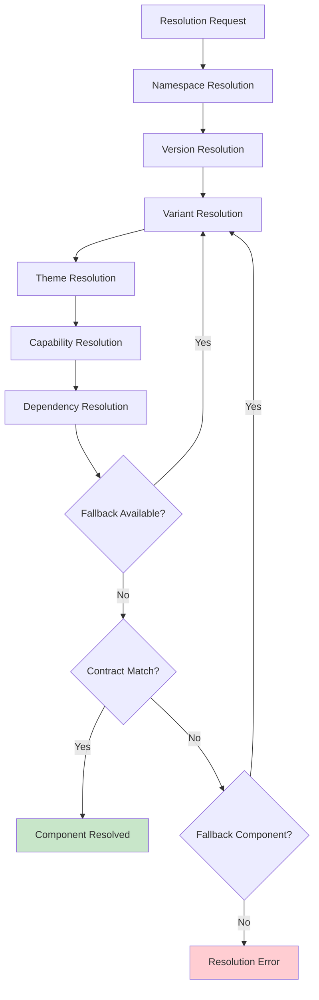
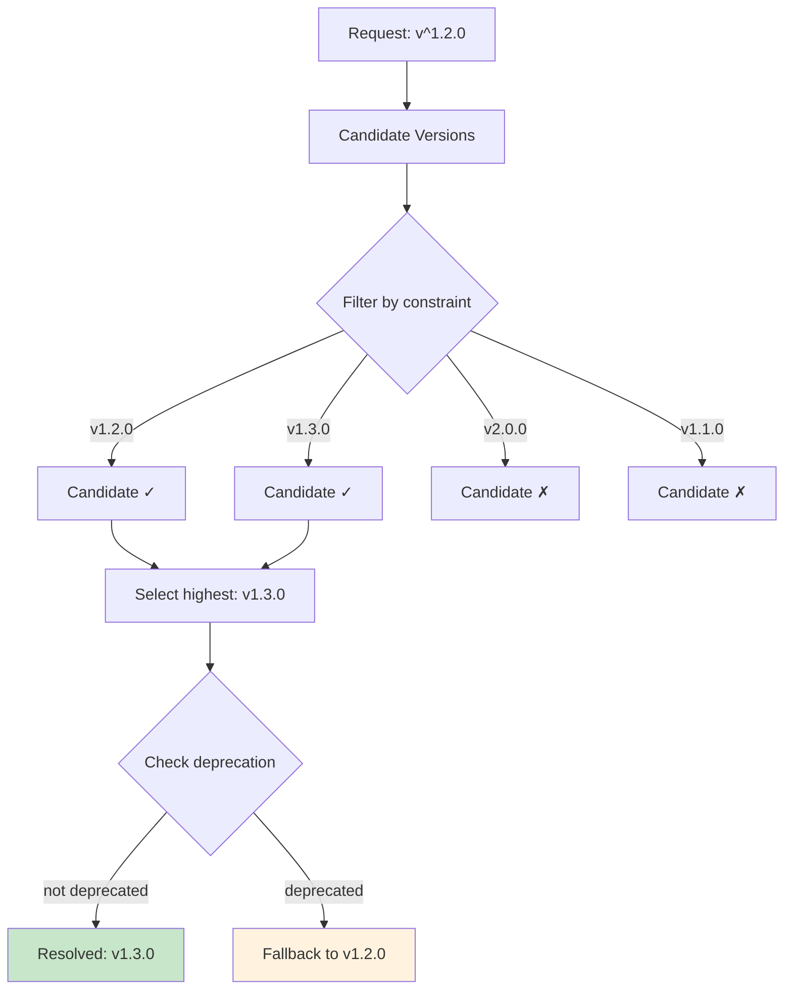
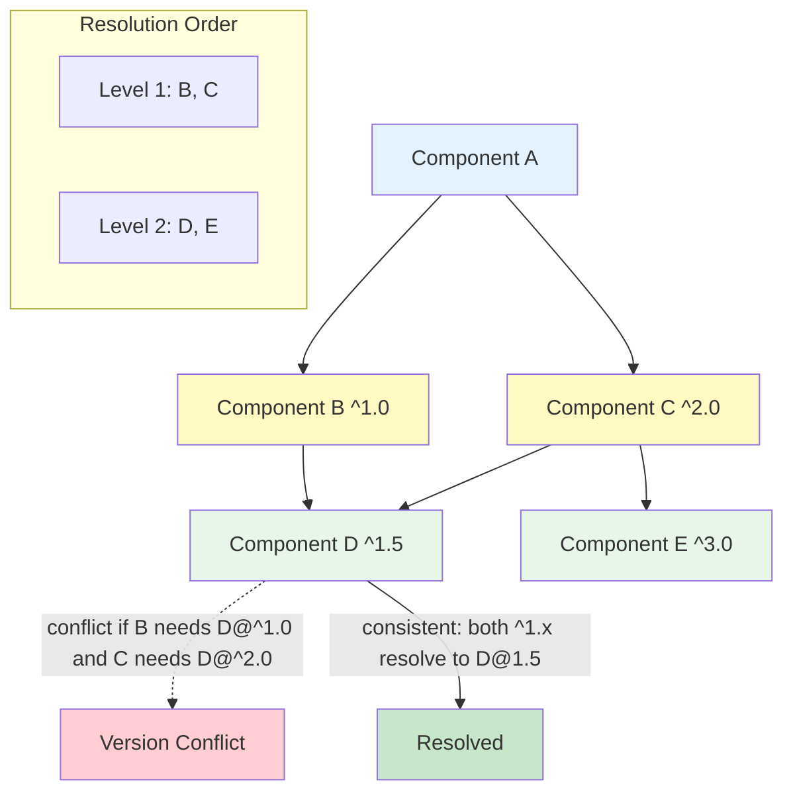
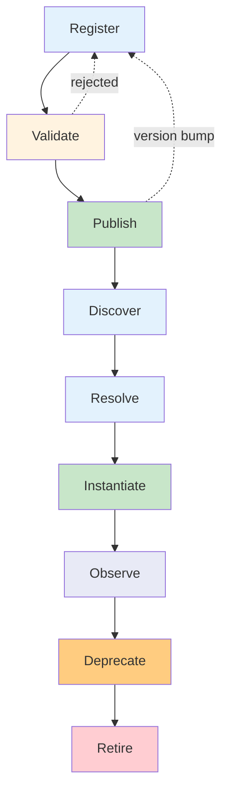
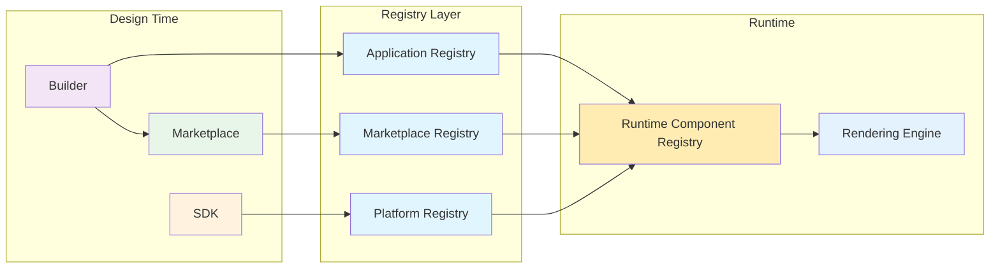
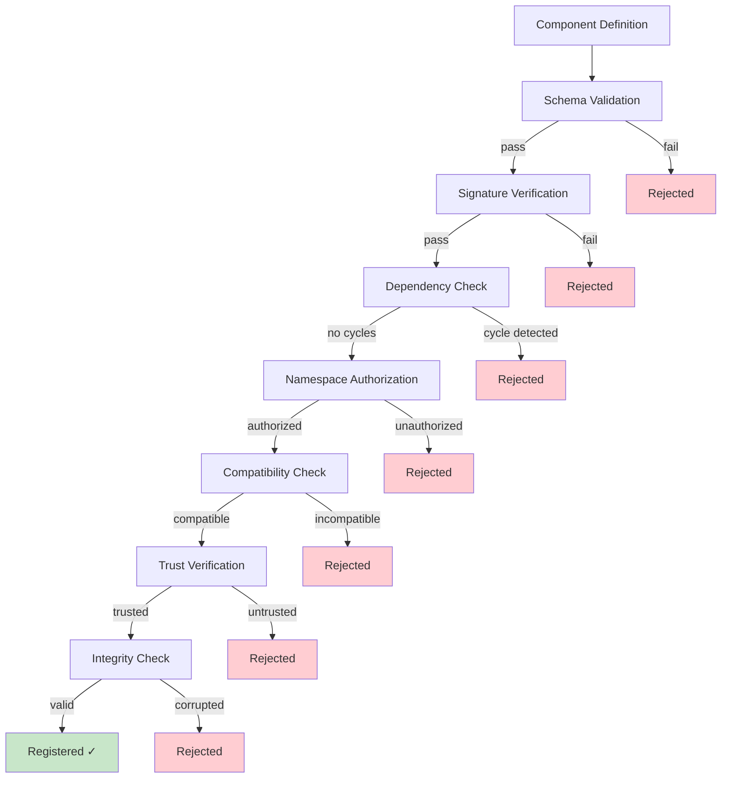
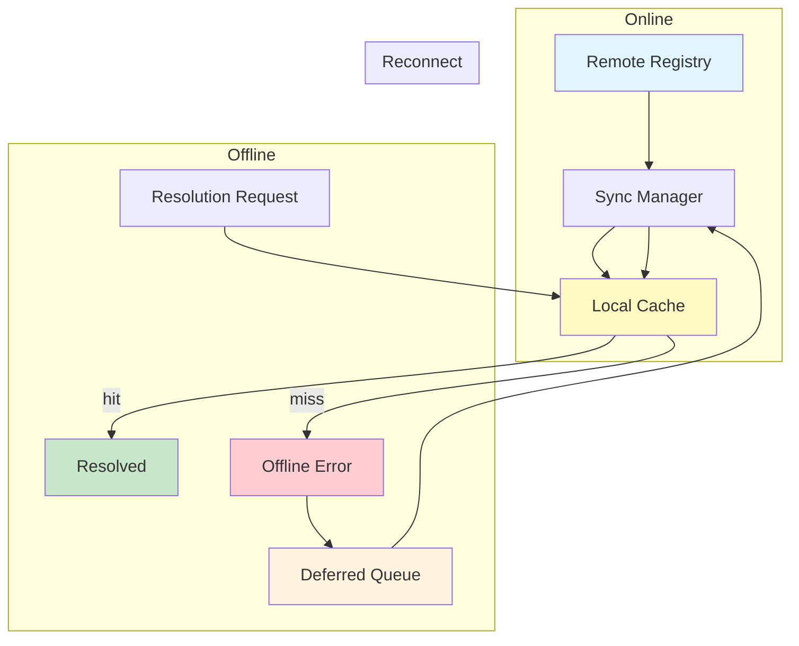
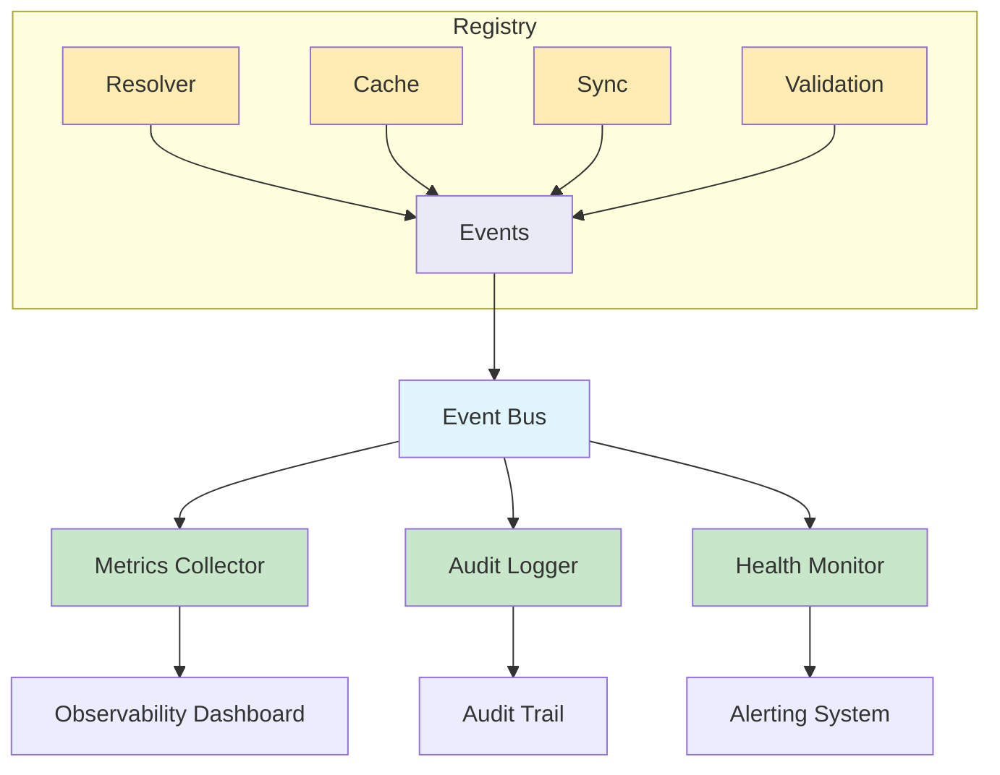

# Runtime Component Registry Architecture

**KB-054 — Runtime Component Registry Architecture Specification**

| Metadata | |
|----------|---|
| **KB ID** | KB-054 |
| **Title** | Runtime Component Registry Architecture |
| **Version** | 0.1.0 |
| **Status** | Draft |
| **Owner** | Architecture Team |
| **Suite** | Runtime & Rendering Architecture |
| **Dependencies** | KB-051 Runtime Architecture Overview, KB-052 Rendering Engine Architecture, KB-053 Rendering Pipeline Architecture, KB-046 Component Tree Model, KB-045 Screen Model, KB-012 Component Registry, KB-030 Validation Engine, KB-033 Package & Artifact Specification, KB-034 Extension & Plugin Framework, KB-036 Component Marketplace |
| **Related Documents** | KB-041 Application Architecture Overview, KB-042 Application Manifest Specification, KB-044 Navigation Architecture, KB-047 Action & Event Model, KB-048 Application State Model, KB-049 Theme & Design Token Model, KB-050 Capability Composition Model, KB-055 Runtime Navigation & Routing, KB-056 Runtime State Management, KB-057 Runtime Event & Action Pipeline, KB-058 Runtime Caching & Synchronization, KB-059 Runtime Security & Isolation, KB-060 Runtime Observability & Diagnostics, KB-008 Runtime Overview, KB-009 Manifest Specification |
| **Review Status** | Pending |
| **Last Updated** | 2026-07-11 |

---

### Revision History

| Version | Date | Author | Change |
|---------|------|--------|--------|
| 0.1.0 | 2026-07-11 | AI Architecture Agent | Initial draft |

---

## 1. Executive Summary

### 1.1 Purpose

This document defines the Runtime Component Registry Architecture — the subsystem responsible for discovering, validating, resolving, versioning, loading, and exposing every runtime-renderable component across the DUKADESK Platform.

The Runtime Component Registry is the authoritative runtime source for all component definitions. Every component that any Runtime renders — on mobile, web, desktop, or preview — must be resolved through this registry. It consumes definitions from the Builder, Marketplace, SDK, and Platform Registries, and exposes a stable resolution contract to the Rendering Engine.

The Registry bridges the gap between design-time component authoring (Builder, Marketplace) and runtime component consumption (Rendering Engine, Navigation Engine, State Engine). It ensures that every component resolved at runtime has been validated, versioned, and authorized for use in the requesting context.

### 1.2 Scope

This document covers:

- The canonical Runtime Component Registry architecture, its position within the platform, and its relationships to every consuming and producing subsystem
- Registry hierarchy from Platform through Runtime
- Component classification: Core, Platform, Marketplace, Extension, Tenant, Private, Experimental, Deprecated
- Component resolution: Namespace, Version, Variant, Theme, Capability, Dependency, Fallback
- Registry contracts: Identity, Metadata, Properties, Events, State Bindings, Accessibility, Theme Bindings, Capability Requirements
- Versioning model: Semantic Versioning, Compatibility Rules, Upgrade Paths, Breaking Changes, Deprecation Strategy
- Dependency model: Component, Capability, Theme, Registry dependencies and circular dependency prevention
- Component lifecycle: Register, Validate, Publish, Discover, Resolve, Instantiate, Observe, Deprecate, Retire
- Runtime resolution flow from Rendering Engine through the Registry
- Responsibilities across Builder, Marketplace, SDK, Runtime, and Validation subsystems
- Security: Trusted Registries, Component Signatures, Registry Integrity, Namespace Isolation, Tenant Isolation, Supply Chain Protection
- Performance: Registry Lookup, Lazy Resolution, Registry Caching, Dependency Resolution, Memory Optimization
- Offline behaviour: Cached Registry, Cached Components, Offline Resolution, Deferred Registry Updates
- Observability: Registry Health, Resolution Metrics, Cache Metrics, Lookup Metrics, Version Metrics, Failure Metrics
- Failure scenarios and anti-patterns
- Future evolution: Federated Registries, Edge Registries, AI-Assisted Discovery, Distributed Resolution

Out of scope:

- Design-time Component Registry (handled by KB-012)
- Marketplace listing and distribution (handled by KB-036)
- Package and artifact packaging (handled by KB-033)
- Extension framework and plugin loading (handled by KB-034)
- Rendering Engine implementation (handled by KB-052)
- Rendering Pipeline implementation (handled by KB-053)
- Component Tree Model (handled by KB-046)
- Platform-specific component loader implementations

---

## 2. Architectural Principles

### 2.1 Registry as the Single Runtime Source of Truth

The Runtime Component Registry is the sole authoritative source for all component definitions at runtime. No component is rendered without registry resolution. No component definition is loaded from filesystem paths, hardcoded references, or implicit discovery. The Registry guarantees that every resolved component has a validated identity, a known contract, and an authorized origin.

### 2.2 Contract-First Component Resolution

Components are resolved by contract, not by implementation. The Registry resolves a Component Definition that satisfies the requesting contract — the required properties, events, state bindings, theme tokens, and capability requirements. Multiple implementations may satisfy the same contract; the Registry selects the best match.

### 2.3 Runtime Independence

The Registry operates at the metadata and contract level. It does not know or care about the rendering technology, framework, or platform of the resolved component. A component resolved by the Registry may be implemented in any technology that the target Runtime supports. The Registry's resolution contract is platform-agnostic.

### 2.4 Immutable Component Versions

Every published component version is immutable. Once a component version is registered, its Definition, Contract, and Descriptor cannot be modified. Updates produce new versions. Immutability ensures that running applications are never disrupted by changes to their resolved components.

### 2.5 Platform Neutrality

The Registry architecture is defined independently of any platform-specific runtime. Mobile, web, desktop, and preview runtimes all use the same Registry architecture with platform-specific implementations of the Registry Provider. The resolution contract, versioning model, and lifecycle are identical across platforms.

### 2.6 Lazy Discovery

Component definitions are discovered on demand, not eagerly loaded. The Registry maintains indexes and metadata for all registered components but loads full definitions only when resolution is requested. Lazy discovery minimizes startup time, memory usage, and network bandwidth.

### 2.7 Version Compatibility

Component resolution respects semantic versioning compatibility ranges. The Registry enforces that resolved component versions are compatible with the requesting application's declared dependency constraints. Incompatible versions are never resolved.

### 2.8 Secure Component Loading

Every component resolved through the Registry is validated before it is loaded. Validation includes signature verification, integrity checking, namespace authorization, tenant isolation checks, and supply chain provenance. Untrusted components are rejected before any code is loaded.

### 2.9 Observable Registry Operations

All Registry operations — registration, resolution, validation, caching, and failure — are observable through structured events. Registry observability enables monitoring, debugging, audit, and performance analysis.

### 2.10 Marketplace Extensibility

The Registry is extensible through the Marketplace. Marketplace components are first-class citizens in the Registry hierarchy. They follow the same registration, validation, versioning, and resolution rules as Platform components. The Registry does not distinguish between built-in and Marketplace components at resolution time.

---

## 3. Canonical Definitions

### Runtime Component Registry

The subsystem responsible for discovering, validating, resolving, versioning, loading, and exposing every runtime-renderable component. It maintains the authoritative catalog of all components available to the Runtime and provides a stable resolution contract to the Rendering Engine and other consuming subsystems.

### Component Definition

The complete specification of a component, including its identity, contract, descriptor, metadata, properties, events, state bindings, theme bindings, accessibility declarations, capability requirements, and implementation references. A Component Definition is the unit of registration in the Registry.

### Component Contract

The declared interface of a component — what properties it accepts, what events it emits, what state bindings it exposes, what theme tokens it consumes, what capabilities it requires, and what accessibility features it supports. The Contract is used for resolution matching and compatibility checking.

### Component Descriptor

A lightweight metadata record that identifies a component and provides enough information for resolution decisions without loading the full definition. Descriptors are indexed for fast lookup and include the component ID, name, version, namespace, classification, contract hash, and dependencies.

### Registry Entry

A single record in the Registry catalog representing a registered component version. An Entry contains the Component Descriptor, the Component Definition reference, the Component Contract, validation status, signature, provenance metadata, and lifecycle state.

### Component Resolver

The subsystem within the Registry that matches resolution requests to Registry Entries. The Resolver evaluates namespace, version constraints, variant selection, theme compatibility, capability requirements, and dependency availability to select the best matching Entry.

### Registry Provider

A platform-specific implementation of the Registry that provides storage, caching, and loading for Component Definitions. The Provider abstracts the Registry's storage layer — whether local, remote, bundled, or federated — behind a uniform interface.

### Registry Metadata

Data about the Registry itself — its version, schema version, supported namespaces, registered component count, sync status, trust configuration, and health status. Registry Metadata is exposed for observability and diagnostics.

### Registry Context

The ambient information that qualifies a registry operation — the requesting Runtime type, tenant ID, workspace ID, application ID, session ID, and user identity. Context is attached to every resolution request for authorization and isolation enforcement.

### Component Namespace

A logical partition within the Registry that groups components by origin, ownership, or purpose. Namespaces enforce isolation, enable authorization boundaries, and prevent naming collisions. Every component belongs to exactly one namespace.

---

## 4. Registry Architecture

### 4.1 Architecture Diagram

### 4.2 Registry Hierarchy

### 4.3 Platform Registry

The top-level registry containing all platform-built components available to every tenant, workspace, application, and runtime. Platform components include the core UI component library, layout primitives, navigation shells, input controls, data display components, and platform utility components.

| Property | Description |
|----------|-------------|
| **Owner** | DUKADESK Platform Team |
| **Scope** | Global (all tenants, all applications) |
| **Persistence** | Backend-managed, distributed to runtimes |
| **Update Frequency** | Per platform release cycle |
| **Namespace** | `platform.*` |
| **Trust Level** | Maximum — signed by platform authority |

### 4.4 Organization Registry

A registry scoped to a single Organization, containing components that the organization has developed or curated for internal use. Organization components extend the Platform Registry and are available to all tenants within the organization.

| Property | Description |
|----------|-------------|
| **Owner** | Organization Administrator |
| **Scope** | Organization (all tenants within the org) |
| **Persistence** | Backend-managed, distributed to runtimes |
| **Update Frequency** | Per organization release cycle |
| **Namespace** | `org.<orgId>.*` |
| **Trust Level** | Organization-signed |

### 4.5 Tenant Registry

A registry scoped to a single Tenant, containing components that the tenant has installed from the Marketplace, developed internally, or configured for their workspace. Tenant components are the primary source of application-specific components.

| Property | Description |
|----------|-------------|
| **Owner** | Tenant Administrator |
| **Scope** | Tenant (all workspaces within the tenant) |
| **Persistence** | Backend-managed, cached locally per runtime |
| **Update Frequency** | Marketplace installs, tenant component development |
| **Namespace** | `tenant.<tenantId>.*` |
| **Trust Level** | Tenant-signed or Marketplace-signed |

### 4.6 Application Registry

A registry scoped to a single Application, containing components declared in the Application Manifest, installed capabilities, and application-specific component overrides. The Application Registry is the primary resolution target for component references in Screen Definitions and Component Trees.

| Property | Description |
|----------|-------------|
| **Owner** | Application Publisher / Builder |
| **Scope** | Application (all sessions) |
| **Persistence** | Part of Application Package, cached locally |
| **Update Frequency** | Per application version |
| **Namespace** | `app.<appId>.*` |
| **Trust Level** | Application-signed or Marketplace-signed |

### 4.7 Runtime Registry

The local runtime instance of the Registry that is populated from the hierarchical registries above. The Runtime Registry is the active resolution endpoint for the Rendering Engine and other runtime subsystems. It merges entries from all ancestor registries and applies runtime-specific filtering, caching, and optimization.

| Property | Description |
|----------|-------------|
| **Owner** | Runtime |
| **Scope** | Runtime instance (single session) |
| **Persistence** | Volatile (in-memory), with persisted cache |
| **Update Frequency** | On application load, capability activation, registry sync |
| **Namespace** | All namespaces from ancestor registries |
| **Trust Level** | Inherited from source registries |

### 4.8 Registry Hierarchy Resolution

When a component resolution request reaches the Runtime Registry, the Registry searches in the following order:

1. **Runtime Registry** (local, fastest — in-memory cache)
2. **Application Registry** (app-scoped components and overrides)
3. **Tenant Registry** (tenant-scoped Marketplace and custom components)
4. **Organization Registry** (organization-curated components)
5. **Platform Registry** (platform-built core components, slowest — may require network)

The first match satisfying all resolution constraints is returned. Lower-level registries may override higher-level components if the component ID and namespace match and the version constraint is satisfied.

---

## 5. Component Classification

### 5.1 Core Components

Components that are essential to the platform's operation and are available in every runtime without registration. Core components are built into the Runtime and are always present in the Platform Registry.

**Examples:** Screen container, ScrollView, Stack, Row, Column, Text, Image, Button, TextInput, Icon, Spacer, Divider

| Classification | Resolution Priority | Update Mechanism |
|---------------|-------------------|------------------|
| Core | Highest (always available) | Runtime version update |

### 5.2 Platform Components

Components distributed as part of the DUKADESK Platform release. Platform components extend the core library and are available to all tenants after registration in the Platform Registry.

**Examples:** DataTable, Chart, Map, FilePicker, CameraView, BarcodeScanner, SignaturePad

| Classification | Resolution Priority | Update Mechanism |
|---------------|-------------------|------------------|
| Platform | High (registered with platform release) | Platform update cycle |

### 5.3 Marketplace Components

Components published by third-party developers through the DUKADESK Marketplace. Marketplace components are registered in the Tenant Registry upon installation and follow Marketplace certification and versioning rules.

**Examples:** Custom form controls, industry-specific data displays, integration widgets, advanced visualizations

| Classification | Resolution Priority | Update Mechanism |
|---------------|-------------------|------------------|
| Marketplace | Medium (installed per tenant) | Marketplace update cycle |

### 5.4 Extension Components

Components contributed by installed Extensions and Plugins. Extension components are registered when the extension is activated and are scoped to the application or workspace that activated the extension.

**Examples:** Extension-specific UI panels, integration screens, custom capability UIs

| Classification | Resolution Priority | Update Mechanism |
|---------------|-------------------|------------------|
| Extension | Medium (active while extension is enabled) | Extension lifecycle |

### 5.5 Tenant Components

Components developed by the tenant's own development team. Tenant components are registered in the Tenant Registry through the Builder's custom component publishing workflow.

**Examples:** Internal business components, branded UI elements, department-specific controls

| Classification | Resolution Priority | Update Mechanism |
|---------------|-------------------|------------------|
| Tenant | Medium (tenant-managed) | Tenant development cycle |

### 5.6 Private Components

Components that are not publicly discoverable. Private components are registered in the Registry with restricted visibility — they are resolvable only by applications that explicitly declare access. Private components are typically used for internal tenant tooling, unpublished experiments, or application-internal composition.

| Classification | Resolution Priority | Update Mechanism |
|---------------|-------------------|------------------|
| Private | Low (access-restricted) | As declared |

### 5.7 Experimental Components

Components that are in active development and not yet certified for production use. Experimental components are registered with version constraints that prevent production applications from resolving them. They are available only in development and preview environments.

| Classification | Resolution Priority | Update Mechanism |
|---------------|-------------------|------------------|
| Experimental | Lowest (environment-restricted) | Development cycle |

### 5.8 Deprecated Components

Components that have been marked for removal. Deprecated components remain resolvable for existing applications but are not available for new installations. The Registry enforces deprecation warnings during resolution and prevents resolution in new application versions after the deprecation window expires.

| Classification | Resolution Priority | Update Mechanism |
|---------------|-------------------|------------------|
| Deprecated | Standard (with warnings) | No updates — migration required |

---

## 6. Component Resolution

### 6.1 Resolution Flow Diagram

### 6.2 Namespace Resolution

The Registry resolves the component's namespace to identify which registry layer must be searched. Namespace resolution determines the scope boundaries — platform, organization, tenant, application, or runtime — and enforces authorization.

**Resolution Order:**
1. Fully qualified name (e.g., `platform.button`) → direct namespace match
2. Namespaced search (e.g., `org.acme.button`) → search within specified namespace
3. Unqualified name (e.g., `button`) → search all namespaces in priority order

**Namespace Rules:**
- Components in different namespaces with the same local name do not conflict
- Cross-namespace resolution requires explicit namespace qualification
- Platform namespace is the default for unqualified names
- Tenant namespaces are not visible outside the tenant

### 6.3 Version Resolution

The Registry resolves a component version that satisfies the requesting application's declared version constraint. Version resolution follows semantic versioning rules.

**Version Constraint Types:**
| Constraint | Example | Meaning |
|------------|---------|---------|
| Exact | `1.2.3` | Only version 1.2.3 |
| Caret | `^1.2.0` | >= 1.2.0, < 2.0.0 |
| Tilde | `~1.2.0` | >= 1.2.0, < 1.3.0 |
| Range | `>=1.0.0 <2.0.0` | Within range |
| Latest | `latest` | Highest published stable version |

**Resolution Strategy:**
1. Find all versions matching the constraint
2. Select the highest matching version
3. Verify the selected version is not deprecated or excluded
4. Return the selected version's Component Definition

### 6.4 Version Resolution Process Diagram

### 6.5 Variant Resolution

The Registry resolves a component variant based on the resolution context. Variants allow the same component to have different implementations for different platforms, screen sizes, input methods, or accessibility modes.

**Variant Dimensions:**
| Dimension | Example Values | Resolution Priority |
|-----------|---------------|-------------------|
| Platform | mobile, web, desktop | Exact match required |
| Screen size | compact, medium, expanded | Best match (fallback to smaller) |
| Input method | touch, keyboard, mouse, pen | Best match |
| Accessibility | default, high-contrast, reduced-motion, screen-reader | Context-driven |
| Locale | en-US, fr-FR, ar-SA | Best match with fallback |

### 6.6 Theme Resolution

The Registry resolves a component's theme-aware properties based on the active theme. Components may declare theme bindings that reference theme tokens. The Registry does not resolve token values — it resolves the component variant that best matches the active theme's requirements.

### 6.7 Capability Resolution

The Registry verifies that the component's required capabilities are available in the resolution context. If the component requires a capability that is not installed or activated, resolution fails with a capability error.

**Capability Checks:**
- Component declares required capabilities in its Contract
- Registry checks capability availability in the resolution Context
- Missing capabilities cause resolution failure with diagnostic details

### 6.8 Dependency Resolution

Before resolving a component, the Registry recursively resolves all of its declared dependencies. A component is resolvable only if all its dependencies are resolvable. Circular dependencies are detected and rejected.

**Dependency Resolution Rules:**
- Dependencies are resolved breadth-first
- Each dependency is resolved in its own namespace
- Version constraints of transitive dependencies must be consistent
- Circular dependencies are detected at resolution time and rejected

### 6.9 Fallback Resolution

If the primary resolution fails, the Registry attempts fallback resolution. Fallbacks are declared in the Component Definition and provide alternative components that satisfy the same contract.

**Fallback Chain:**
1. Primary component → version constraint match
2. Version fallback → nearest compatible version if primary is deprecated
3. Contract fallback → alternative component implementing the same contract
4. Platform fallback → platform-provided default component for the contract

---

## 7. Registry Contracts

### 7.1 Identity Contract

Every registered component has a unique identity within its namespace. The identity is immutable after publication.

| Identity Field | Description | Required |
|---------------|-------------|----------|
| namespace | Component namespace | Yes |
| name | Component local name | Yes |
| version | SemVer version string | Yes |
| id | Fully qualified ID (`namespace:name@version`) | Computed |
| contractHash | SHA-256 hash of the Contract | Yes |
| signature | Digital signature of the Definition | Yes |

### 7.2 Metadata Contract

Components declare metadata that drives discoverability, categorization, and documentation.

| Metadata Field | Description |
|---------------|-------------|
| displayName | Human-readable name |
| description | Purpose and usage description |
| category | Component category (input, display, layout, navigation) |
| tags | Free-form tags for search and filtering |
| author | Publisher identity |
| license | Component license |
| documentation | Link to component documentation |
| preview | Preview image or URL |
| since | Platform version when component was introduced |

### 7.3 Properties Contract

Components declare the properties they accept. Properties are typed, validated, and may be required or optional.

| Property Field | Description |
|---------------|-------------|
| name | Property name |
| type | Property type (string, number, boolean, object, array, enum) |
| required | Whether the property must be provided |
| default | Default value if not provided |
| description | Purpose and usage |
| constraints | Validation constraints (min, max, pattern, enum values) |

### 7.4 Events Contract

Components declare the events they emit. Events are typed and may carry payloads.

| Event Field | Description |
|------------|-------------|
| name | Event name |
| payload | Event payload type definition |
| description | When and why the event is emitted |
| bubbles | Whether the event bubbles up the component tree |
| cancelable | Whether the event can be prevented |

### 7.5 State Bindings Contract

Components declare the state bindings they support. State bindings connect component properties to state values in the Application State Model (KB-048).

| Binding Field | Description |
|--------------|-------------|
| property | Component property that binds |
| scope | State scope (screen, session, application) |
| key | State key expression |
| direction | one-way (read), two-way (read/write) |
| type | Expected state value type |

### 7.6 Accessibility Contract

Components declare their accessibility features and requirements.

| Accessibility Field | Description |
|-------------------|-------------|
| role | ARIA role or platform accessibility role |
| label | Accessibility label expression |
| hint | Accessibility hint expression |
| traits | Accessibility traits (button, header, link) |
| focusable | Whether the component can receive focus |
| actions | Custom accessibility actions |

### 7.7 Theme Bindings Contract

Components declare the theme tokens they consume. Theme tokens are resolved by the Theme Engine (KB-049) and provided to the component at render time.

| Theme Binding Field | Description |
|-------------------|-------------|
| token | Theme token reference (e.g., `color.primary`) |
| property | Component property that consumes the token |
| fallback | Default value if token is not defined |

### 7.8 Capability Requirements Contract

Components declare the capabilities they require to function. Capabilities may include permissions, feature availability, hardware access, or integration availability.

| Capability Field | Description |
|-----------------|-------------|
| capability | Required capability identifier |
| version | Minimum capability version |
| optional | Whether the component can degrade gracefully |
| fallback | Alternative behavior when capability is unavailable |

---

## 8. Versioning Model

### 8.1 Semantic Versioning

All registered components follow Semantic Versioning 2.0.0: `MAJOR.MINOR.PATCH`.

| Segment | Change Criteria |
|---------|----------------|
| MAJOR | Breaking changes to the Component Contract (properties, events, state bindings, theme bindings, capability requirements) |
| MINOR | Backward-compatible additions (new properties, new events, new variants) |
| PATCH | Backward-compatible fixes (bug fixes, documentation updates, internal optimization) |

### 8.2 Compatibility Rules

| Version Change | Compatibility | Effect on Existing Resolutions |
|---------------|---------------|-------------------------------|
| Patch bump | Fully compatible | Automatically resolved if constraint allows |
| Minor bump | Backward compatible | Automatically resolved if constraint allows |
| Major bump | Breaking | Not resolved unless constraint explicitly allows |

**Compatibility Definition:**
A version `B` is compatible with version `A` if:
- `B.major == A.major` (same major version)
- `B.minor >= A.minor` (same or later minor)
- `B.patch >= A.patch` (same or later patch)

### 8.3 Upgrade Paths

| Path | Resolution Behavior |
|------|---------------------|
| Same major, latest minor | Registry resolves the highest minor/patch within the same major |
| Explicit major upgrade | Application manifest declares new major version constraint |
| Gradual roll-out | Component exposes multiple major versions; application selects by constraint |
| Force upgrade | Platform deprecates older major versions; Registry blocks resolution after deprecation window |

### 8.4 Breaking Changes

A change is breaking if any existing consumer of the component would experience a behavior change, compilation error, or rendering failure after the update.

**Examples of Breaking Changes:**
- Removing or renaming a property
- Changing a property type or constraints
- Removing or renaming an event
- Changing an event payload structure
- Removing or renaming a state binding
- Changing a state binding scope or direction
- Removing or renaming a theme binding
- Adding a new required capability
- Changing the component's accessibility contract

### 8.5 Deprecation Strategy

| Phase | Behavior | Duration |
|-------|----------|----------|
| Active | Component is fully supported | N/A |
| Deprecated | Component still resolves with deprecation warning | Configurable (default: 6 months) |
| Sunset | Component resolves only for existing consumers | Configurable (default: 3 months) |
| Removed | Component no longer resolves; resolution returns error | Permanent |

**Deprecation Metadata:**
- `deprecated`: true/false
- `deprecationMessage`: Migration guidance
- `replacementComponent`: Recommended replacement component ID
- `sunsetDate`: Date after which resolution is blocked

---

## 9. Dependency Model

### 9.1 Component Dependencies

Components may declare dependencies on other components. Dependencies are resolved before the depending component is loaded.

| Dependency Field | Description |
|-----------------|-------------|
| component | Required component ID |
| version | Required version or version range |
| optional | Whether resolution continues if dependency is unavailable |
| scope | Dependency scope (runtime, build-time, test) |

### 9.2 Capability Dependencies

Components may declare dependencies on platform capabilities. Capability dependencies ensure that required features, permissions, or services are available before the component is resolved.

| Capability Dependency Field | Description |
|---------------------------|-------------|
| capability | Required capability ID |
| version | Minimum capability version |
| optional | Whether the component can degrade |
| fallback | Alternative behavior when capability is unavailable |

### 9.3 Theme Dependencies

Components may declare dependencies on theme tokens or theme presets. Theme dependencies ensure that the active theme satisfies the component's visual requirements.

| Theme Dependency Field | Description |
|----------------------|-------------|
| tokens | Required theme token paths |
| preset | Required theme preset (if any) |
| fallback | Default theme values if tokens are missing |

### 9.4 Registry Dependencies

Components may declare dependencies on specific registry layers. Registry dependencies ensure that the required registry hierarchy is available for resolution.

| Registry Dependency Field | Description |
|--------------------------|-------------|
| registry | Required registry layer (platform, tenant, application) |
| sync | Whether the registry must be synchronized before resolution |

### 9.5 Circular Dependency Prevention

The Registry detects and prevents circular dependencies at registration time and resolution time.

**Prevention Mechanisms:**

| Mechanism | Description |
|-----------|-------------|
| Registration validation | Dependency graph is validated for cycles at component registration |
| Resolution-time detection | Dependency resolution tracks visited nodes; cycles are detected and rejected |
| Maximum depth | Resolution fails if dependency chain exceeds configured maximum depth (default: 10) |
| Explicit forward declarations | Components must declare all dependencies explicitly; implied or runtime-discovered dependencies are not permitted |

---

## 10. Component Lifecycle

### 10.1 Lifecycle Diagram

### 10.2 Register

A Component Definition is submitted to the Registry. Registration creates a Registry Entry with a unique identity within its namespace. The component is not yet available for resolution.

**Registration Inputs:**
- Component Definition (full specification)
- Component Contract
- Component Descriptor
- Signature (from author or marketplace certification)
- Provenance metadata

### 10.3 Validate

The Registry validates the Component Definition against the Component Contract schema, dependency graph, namespace authorization, and platform compatibility rules. Validation may also trigger external validation via the Validation Engine (KB-030).

**Validation Checks:**
- Schema conformance (Definition matches Contract)
- Contract completeness (all required fields present)
- Dependency availability (declared dependencies exist)
- Dependency cycle detection
- Namespace authorization (registrant has permission for the namespace)
- Signature verification
- Platform compatibility (component declares supported platform targets)

### 10.4 Publish

After successful validation, the component version is published. Publication makes the component discoverable and resolvable. Published components are immutable — their Definition, Contract, and Descriptor cannot be modified. Updates require a new version.

### 10.5 Discover

Consumers discover components through Registry queries. Discovery searches the Registry catalog by namespace, name, category, tags, or full-text search. Discovery returns Component Descriptors (lightweight metadata) rather than full Definitions.

### 10.6 Resolve

The Registry resolves a Component Definition in response to a resolution request from the Rendering Engine, Navigation Engine, State Engine, or other consuming subsystem. Resolution follows the process defined in Section 6.

### 10.7 Instantiate

The resolved Component Definition is loaded and instantiated by the consuming subsystem. Instantiation is the responsibility of the consuming subsystem (e.g., the Rendering Engine), not the Registry. The Registry's responsibility ends at providing the resolved Definition.

### 10.8 Observe

The Registry observes component usage patterns — resolution frequency, instantiation success rate, error rate, version distribution, and deprecation adoption. Observation data feeds into deprecation decisions, version recommendations, and performance optimization.

### 10.9 Deprecate

A component version is marked as deprecated. Deprecated components remain resolvable but emit deprecation warnings. The deprecation metadata includes the sunset date and migration guidance.

### 10.10 Retire

A component version is removed from the Registry. Retired components are no longer resolvable. Resolution requests for retired components return a resolution error with migration guidance. Retirement is the final lifecycle state.

---

## 11. Runtime Resolution Flow

### 11.1 Builder → Marketplace → Registry → Runtime Flow Diagram

### 11.2 Resolution Flow

1. **Screen Render Request** — The Rendering Engine receives a request to render a Screen. The Screen's Component Tree references components by ID.

2. **Component Reference Extraction** — The Rendering Engine extracts all component references from the Component Tree and submits resolution requests to the Runtime Component Registry.

3. **Context Attachment** — The Runtime attaches the Resolution Context (Runtime type, tenant ID, application ID, session ID, active theme, active capabilities, screen size, input method, locale).

4. **Registry Hit** — The Runtime Component Registry checks its local cache for the requested components. Cache hits return immediately.

5. **Hierarchical Resolution** — Cache misses trigger hierarchical resolution: Runtime Registry → Application Registry → Tenant Registry → Organization Registry → Platform Registry.

6. **Version Resolution** — The Registry evaluates version constraints and selects the best matching version.

7. **Variant Resolution** — The Registry selects the variant that best matches the resolution Context.

8. **Contract Validation** — The Registry validates that the resolved component's Contract satisfies all requirements of the requesting Component Tree node.

9. **Dependency Resolution** — The Registry recursively resolves all component dependencies.

10. **Definition Return** — The Registry returns the resolved Component Definitions to the Rendering Engine.

11. **Caching** — The Registry caches the resolved Definitions for subsequent requests.

12. **Rendering** — The Rendering Engine instantiates and renders the resolved components.

---

## 12. Builder Responsibilities

- Register custom tenant components in the Tenant Registry through the component publishing workflow
- Declare component dependencies and capability requirements during component authoring
- Generate component metadata, contracts, and descriptors during the build process
- Validate component definitions against the Registry schema before publication
- Submit component packages to the Marketplace for certification and distribution
- Manage component versioning during the application composition lifecycle
- Provide component preview data to the Preview Runtime through the Registry
- Maintain component documentation and deprecation notices

---

## 13. Marketplace Responsibilities

- Certify Marketplace component submissions for contract completeness, security, and compatibility
- Register certified components in the Marketplace Registry for tenant installation
- Manage component distribution versions and deprecation timelines
- Provide component signatures for supply chain verification
- Maintain component marketplace listings, categories, and discovery metadata
- Notify tenants of component updates, deprecations, and security advisories
- Enforce Marketplace component policies and licensing

---

## 14. SDK Responsibilities

- Define the Component Contract schema that all components must conform to
- Provide component authoring tools that generate valid Registry entries
- Include Registry validation tooling for pre-publication checks
- Maintain SDK compatibility with current Registry schema versions
- Generate component signatures for SDK-authored components
- Document the Registry integration contract for third-party developers

---

## 15. Runtime Responsibilities

- Maintain the Runtime Component Registry instance for the active session
- Implement Registry Providers for local caching, remote resolution, and offline operation
- Enforce Registry hierarchy resolution order and namespace isolation
- Manage registry cache lifecycle (hydration, eviction, invalidation)
- Resolve components on demand for the Rendering Engine and other subsystems
- Validate resolved components against the runtime context (tenant, application, capabilities)
- Handle registry failures gracefully with fallback and diagnostic reporting
- Emit registry observability events for monitoring and debugging
- Coordinate with the Offline Engine for cached registry access during connectivity loss

---

## 16. Validation Responsibilities

- Validate component definitions against the Component Contract schema at registration time
- Verify component signatures and provenance metadata
- Detect dependency cycles during registration and resolution
- Validate namespace authorization and tenant isolation boundaries
- Perform compatibility checking during version resolution
- Run platform compatibility validation against target Runtime versions
- Report validation failures with structured diagnostic information
- Coordinate with the Validation Engine (KB-030) for cross-subsystem validation

---

## 17. Security

### 17.1 Trusted Registries

Only components from trusted registries are resolved. Trust is established through platform authority, organization policy, and tenant configuration.

| Registry Layer | Trust Establishment |
|---------------|-------------------|
| Platform Registry | Platform root certificate |
| Organization Registry | Organization certificate signed by platform |
| Tenant Registry | Tenant certificate signed by organization or platform |
| Marketplace Registry | Marketplace certificate signed by platform |
| Application Registry | Application publisher certificate |

### 17.2 Component Signatures

Every component version is digitally signed by its publisher. Signatures are verified at registration time and at resolution time.

**Signature Requirements:**
- Signature covers the entire Component Definition (contract, descriptor, metadata)
- Signature algorithm: ECDSA P-384 or equivalent
- Signing key is bound to the publisher's identity
- Signature is verified before the component is added to the Registry
- Signature is verified again at resolution time if the component is loaded from an untrusted cache

### 17.3 Registry Integrity

The Registry maintains integrity guarantees to prevent tampering.

**Integrity Mechanisms:**
- Immutable entries (published versions cannot be modified)
- Content-addressable storage (component definitions are stored by content hash)
- Merkle tree of registry entries for tamper detection
- Periodic integrity verification against authoritative registries
- Audit logging of all registry mutations

### 17.4 Namespace Isolation

Each namespace is isolated from others. Components in one namespace cannot be resolved from another namespace unless explicitly qualified and authorized.

**Isolation Rules:**
- Cross-namespace resolution requires explicit namespace qualification
- Access to non-public namespaces requires authorization
- Namespace ownership is enforced at registration time
- Namespace delegation is explicit and audited

### 17.5 Tenant Isolation

Components registered in one tenant's registry are not visible or resolvable from another tenant's context.

**Tenant Isolation Mechanisms:**
- Registry storage is partitioned by tenant ID
- Resolution context includes tenant authentication
- Cross-tenant resolution requests are rejected
- Tenant registry synchronization uses tenant-scoped credentials

### 17.6 Supply Chain Protection

The Registry protects against supply chain attacks through multiple verification layers.

**Protection Layers:**
- Publisher identity verification at registration
- Component signature verification at registration and resolution
- Dependency chain verification (all transitive dependencies are verified)
- Platform certification for Marketplace components
- Runtime verification of loaded component integrity
- Dependency freshness checks (components with unpatched vulnerabilities are blocked)

---

## 18. Performance

### 18.1 Registry Lookup

| Operation | Target Latency | Degradation Threshold |
|-----------|---------------|----------------------|
| Cache hit | < 1 ms | > 10 ms |
| Cache miss (local) | < 10 ms | > 100 ms |
| Cache miss (remote) | < 200 ms | > 2 s |
| Full registry sync | < 5 s | > 30 s |
| Dependency chain resolution (5 levels) | < 50 ms | > 500 ms |

### 18.2 Lazy Resolution

Component definitions are resolved only when requested. The Registry maintains an index of all available components (Descriptors) but loads full Definitions only on resolution.

**Lazy Resolution Benefits:**
- Startup time: only index is loaded, not definitions
- Memory usage: only resolved components occupy memory
- Network bandwidth: full definitions are fetched only when needed
- Cache efficiency: high-demand components are cached; low-demand components are fetched on demand

### 18.3 Registry Caching

| Cache Layer | Contents | Eviction Policy | Invalidation Trigger |
|-------------|----------|----------------|---------------------|
| L1 — In-memory | Resolved Component Definitions | LRU, max entries configurable | Application version change |
| L2 — Persistent | Component Definitions (offline cache) | TTL-based, max storage configurable | Remote registry sync |
| L3 — Index | All Component Descriptors | Never evicted (index is small) | Registry sync |

### 18.4 Dependency Resolution

Dependency resolution is optimized to minimize latency:

**Optimizations:**
- Breadth-first resolution with parallel fetches for independent dependencies
- Cached dependency graphs (same dependency chain is not re-resolved)
- Dependency result caching (resolved dependencies are cached for the session)
- Maximum depth enforcement (prevents pathological dependency chains)
- Dependency conflict resolution at the earliest possible point

### 18.5 Memory Optimization

| Technique | Description |
|-----------|-------------|
| Shared definitions | Same component version resolved in multiple contexts shares the same Definition object |
| Lazy property loading | Component properties are parsed on access, not on load |
| Definition pooling | Frequently resolved components are kept in a pre-warmed pool |
| Cache size limits | Maximum cache size is configurable per platform |
| Unused component eviction | Components not resolved within a TTL window are evicted from L1 cache |

---

## 19. Offline Behaviour

### 19.1 Cached Registry

The Runtime maintains a cached copy of the Registry for offline operation. The cached Registry contains Descriptors and Definitions for components that have been resolved during online operation.

| Cache Property | Description |
|---------------|-------------|
| Contents | Component Descriptors and resolved Definitions |
| Storage | Persistent local storage |
| Update | Incremental sync when online |
| Validation | Integrity verification on cache load |

### 19.2 Cached Components

Component Definitions that have been resolved are cached for offline access. Cached components are available for instantiation even without network connectivity.

**Cache Rules:**
- All resolved components are cached (definitions and mappings)
- Component cache is persistent across application restarts
- Cache entries are validated for integrity on use
- Corrupted cache entries are discarded and re-fetched when online

### 19.3 Offline Resolution

When offline, the Registry resolves components exclusively from the local cache. Resolution requests for components not in the cache fail with an offline resolution error.

**Offline Resolution Flow:**
1. Resolution request received
2. Registry checks local cache
3. Cache hit → return cached Definition
4. Cache miss → return offline resolution error with component ID
5. Registry queues the unresolved component for deferred fetch

### 19.4 Deferred Registry Updates

When connectivity is restored, the Registry synchronizes with the remote registries. The sync is incremental — only changed entries are transmitted.

| Sync Phase | Action |
|------------|--------|
| Index sync | Fetch updated Descriptor index (component IDs, versions, deprecation status) |
| Definition sync | Fetch updated Definitions for components in the local cache |
| Deprecation sync | Apply deprecation and retirement updates |
| Cleanup | Remove cache entries for retired components |

### 19.5 Offline Registry Flow Diagram

---

## 20. Observability

### 20.1 Registry Health

| Health Metric | Description | Warning Threshold | Critical Threshold |
|--------------|-------------|-------------------|-------------------|
| Registry reachable | Remote registry connectivity | — | Unreachable > 30s |
| Cache integrity | Cache checksum verification | 1 corruption detected | > 5 corruptions |
| Index completeness | All expected namespaces loaded | 1 namespace missing | > 3 namespaces missing |
| Sync status | Last successful sync timestamp | > 5 min since sync | > 30 min since sync |

### 20.2 Resolution Metrics

| Metric | Description |
|--------|-------------|
| Resolution requests per second | Registry request throughput |
| Resolution success rate | Percentage of successful resolutions |
| Resolution latency (p50, p95, p99) | Response time distribution |
| Resolution by namespace | Breakdown of resolution targets |
| Resolution by classification | Breakdown by component classification |
| Cache hit ratio | Percentage of resolutions served from cache |

### 20.3 Cache Metrics

| Metric | Description |
|--------|-------------|
| Cache size (L1, L2, L3) | Current cache utilization |
| Cache hit rate (L1, L2) | Per-level hit ratio |
| Cache eviction rate | Entries evicted per minute |
| Cache invalidation events | Invalidations triggered per minute |
| Cache load time | Time to load cache on startup |
| Cache persistence size | Disk space used by persistent cache |

### 20.4 Lookup Metrics

| Metric | Description |
|--------|-------------|
| Lookup latency (p50, p95, p99) | Index lookup time |
| Lookup by namespace | Distribution of lookup targets |
| Lookup failures | Lookups that returned no results |
| Lookup error rate | Percentage of lookups that errored |
| Fallback resolution rate | Percentage of resolutions that used fallback |

### 20.5 Version Metrics

| Metric | Description |
|--------|-------------|
| Version distribution | Active versions per component |
| Deprecated component usage | Resolutions for deprecated versions |
| Version conflict rate | Conflicts detected during resolution |
| Upgrade adoption rate | Rate at which consumers adopt new versions |

### 20.6 Failure Metrics

| Metric | Description |
|--------|-------------|
| Resolution failure rate | Percentage of resolution failures |
| Failure by type | Breakdown (missing, contract mismatch, version conflict, dependency failure, etc.) |
| Cache miss rate | Percentage of resolutions not cached |
| Registry sync failure rate | Percentage of failed sync operations |
| Registry corruption events | Integrity check failures |

### 20.7 Registry Observability Architecture Diagram

---

## 21. Failure Scenarios

### 21.1 Missing Component

| Aspect | Description |
|--------|-------------|
| **Detection** | Resolution request for a component ID that has no matching Registry Entry |
| **Impact** | Screen cannot render; component placeholder or error state is displayed |
| **Recovery** | Registry returns error with component ID. Rendering Engine displays fallback component or error state. Registry logs the missing component for diagnostic analysis. |
| **Prevention** | Component references are validated at composition time by the Builder. Missing components are detected before publication. |

### 21.2 Invalid Contract

| Aspect | Description |
|--------|-------------|
| **Detection** | Resolved component's Contract does not satisfy the requesting Context's requirements |
| **Impact** | Resolution fails; component is not loaded |
| **Recovery** | Registry returns contract validation error. Rendering Engine attempts fallback resolution. |
| **Prevention** | Contract validation at registration time. Contract compatibility checking during version resolution. |

### 21.3 Namespace Collision

| Aspect | Description |
|--------|-------------|
| **Detection** | Two component definitions attempt to register with the same namespace and name |
| **Impact** | Registration fails for the second component |
| **Recovery** | Registry rejects the duplicate registration with a namespace collision error. The publisher must choose a different name or namespace. |
| **Prevention** | Namespace ownership enforcement. Name uniqueness validation at registration time. |

### 21.4 Version Conflict

| Aspect | Description |
|--------|-------------|
| **Detection** | Two dependencies of the same component require incompatible versions of another component |
| **Impact** | Resolution fails; the depending component cannot be resolved |
| **Recovery** | Registry returns version conflict error with the conflicting dependencies. The application manifest must resolve the conflict by constraining the dependency version. |
| **Prevention** | Dependency version range validation at registration time. Conflict detection during dependency resolution. |

### 21.5 Registry Corruption

| Aspect | Description |
|--------|-------------|
| **Detection** | Registry integrity check fails (checksum mismatch, missing entry, invalid signature) |
| **Impact** | Registry may return incorrect or incomplete resolution results |
| **Recovery** | Corrupted entries are invalidated. Registry re-fetches from authoritative source. If authoritative source is unavailable, Registry operates with reduced functionality using remaining valid entries. |
| **Prevention** | Immutable entries, content-addressable storage, periodic integrity verification |

### 21.6 Missing Dependency

| Aspect | Description |
|--------|-------------|
| **Detection** | A required dependency of the resolving component is not registered in the Registry |
| **Impact** | Resolution fails; the depending component cannot be loaded |
| **Recovery** | Registry returns dependency error with the missing dependency ID. If the dependency is optional, resolution continues without it. |
| **Prevention** | Dependency validation at registration time. Dependency availability monitoring. |

### 21.7 Circular Dependency

| Aspect | Description |
|--------|-------------|
| **Detection** | Dependency graph contains a cycle — component A depends on B, B depends on A |
| **Impact** | Resolution fails for all components in the cycle |
| **Recovery** | Registry returns circular dependency error with the cycle path. The component definitions must be refactored to remove the cycle. |
| **Prevention** | Cycle detection at registration time. Cycle detection at resolution time. |

### 21.8 Untrusted Component

| Aspect | Description |
|--------|-------------|
| **Detection** | Component signature verification fails, or component originates from an untrusted registry |
| **Impact** | Component is not loaded; resolution fails with security error |
| **Recovery** | Registry returns security error. The incident is logged for security audit. The component publisher must re-sign and re-submit. |
| **Prevention** | Signature verification at registration and resolution. Trusted registry configuration. Supply chain protection policies. |

---

## 22. Anti-Patterns

### Hardcoded Component Mappings

Hardcoding component name-to-implementation mappings in application code or screen definitions instead of using the Registry for resolution. This bypasses validation, versioning, and supply chain protection.

**Solution:** All component references must be resolved through the Runtime Component Registry. Hardcoded references are prohibited.

### Runtime-Specific Registries

Maintaining separate component registries per runtime (mobile registry, web registry, desktop registry) with different entries, versioning, and contracts for the same component. This creates fragmentation and inconsistent behavior across platforms.

**Solution:** A single Registry hierarchy serves all runtimes. Platform-specific variants are handled through variant resolution, not separate registries.

### Mutable Registry Entries

Modifying a published component version's Definition, Contract, or Descriptor in place. This breaks the immutability guarantee and can silently change behavior for all consumers.

**Solution:** Published versions are immutable. All changes produce new versions. Update existing consumers through version resolution.

### Duplicate Component Identities

Registering the same component under multiple identities (different namespaces, different names) to bypass versioning or access control restrictions.

**Solution:** Each component has exactly one canonical identity. Duplicate registration is detected and rejected at registration time.

### Hidden Dependencies

Declaring fewer dependencies than the component actually requires, causing resolution failures at runtime when the missing dependency is needed.

**Solution:** All dependencies must be explicitly declared in the Component Definition. Registry validation checks that all runtime-referenced dependencies are declared.

### Registry Bypass

Loading component implementations directly from filesystem paths, network URLs, or inline code instead of resolving them through the Registry. This circumvents all validation, security, and versioning guarantees.

**Solution:** The Runtime must enforce that all component loading goes through the Registry. Direct loading bypasses are prohibited.

---

## 23. Future Evolution

### 23.1 Federated Registries

Multiple independent Registry deployments that can resolve components across deployment boundaries. Federated registries enable multi-site deployments, partner ecosystem sharing, and cross-organization component reuse.

**Considerations:**
- Cross-registry trust agreements
- Federated namespace management
- Cross-registry resolution latency
- Consistent versioning across federated instances

### 23.2 Edge Registries

Registry instances deployed at edge locations for low-latency component resolution in geographically distributed deployments.

**Considerations:**
- Edge-to-core registry synchronization
- Edge cache freshness guarantees
- Offline-first at the edge
- Edge-specific component variants (region-specific content)

### 23.3 AI-Assisted Discovery

AI-powered component discovery that suggests components based on natural language descriptions, usage patterns, and application context.

**Considerations:**
- AI-generated component search indexes
- Usage-pattern-based recommendations
- Semantic component matching
- AI-assisted dependency resolution optimization

### 23.4 Distributed Component Resolution

Component resolution that spans multiple registry instances, geographic regions, or deployment environments with automatic failover and load balancing.

**Considerations:**
- Resolution request routing
- Cross-region cache synchronization
- Graceful degradation during regional outages
- Consistency models for distributed resolution

### 23.5 Dynamic Registry Synchronization

Registries that synchronize dynamically based on usage patterns, connectivity state, and resource constraints rather than fixed schedules.

**Considerations:**
- Predictive pre-caching based on navigation patterns
- Bandwidth-aware sync scheduling
- Storage-aware cache management
- Peer-to-peer registry sharing for co-located runtimes

### 23.6 Autonomous Compatibility Validation

Machine learning-based compatibility validation that predicts breaking changes, detects contract drift, and recommends version upgrades automatically.

**Considerations:**
- Automated contract compatibility analysis
- Breaking change prediction from definition deltas
- Upgrade recommendation generation
- Regression detection across version chains

---

## 24. Cross References

| KB-ID | Title | Relationship |
|-------|-------|--------------|
| KB-012 | Component Registry | Design-time component registry that feeds component definitions into the Runtime Component Registry. KB-012 defines registration, schema, and identity that KB-054 consumes. |
| KB-030 | Validation Engine | Provides cross-subsystem validation services. The Registry delegates component contract and dependency validation to the Validation Engine. |
| KB-033 | Package & Artifact Specification | Defines the packaging format for component distribution. The Registry consumes packaged components and makes them resolvable. |
| KB-034 | Extension & Plugin Framework | Extensions register components in the Registry. Extension component lifecycle is managed through the Registry. |
| KB-036 | Component Marketplace | Marketplace publishes certified components to the Registry for tenant installation and resolution. |
| KB-046 | Component Tree Model | Component Trees reference components by ID. The Rendering Engine resolves these references through the Registry. |
| KB-049 | Theme & Design Token Model | Components declare theme bindings that the Registry includes in the Component Contract for resolution matching. |
| KB-050 | Capability Composition Model | Components declare capability requirements. The Registry verifies capability availability during resolution. |
| KB-051 | Runtime Architecture Overview | The Runtime hosts the Runtime Component Registry. The Registry is a core Runtime subsystem defined in the Runtime Architecture. |
| KB-052 | Rendering Engine Architecture | The primary consumer of the Registry. The Rendering Engine submits component resolution requests and receives resolved Component Definitions for instantiation and rendering. |
| KB-053 | Rendering Pipeline Architecture | Consumes resolved components from the Registry through the Rendering Engine. Pipeline stages operate on resolved component definitions. |
| KB-054 | Runtime Component Registry Architecture | This document. |
| KB-055 | Runtime Navigation & Routing | Navigation components and route screens are resolved through the Registry. Registry provides component definitions for navigation elements. |
| KB-056 | Runtime State Management | State-bound components require registry resolution that respects state binding contracts. The Registry provides state binding metadata for resolved components. |
| KB-057 | Runtime Event & Action Pipeline | Action-triggering components are resolved through the Registry. The Registry provides event contract metadata for action binding. |
| KB-058 | Runtime Caching & Synchronization | Provides the caching infrastructure that the Registry uses for offline component storage and deferred registry updates. |
| KB-059 | Runtime Security & Isolation | Enforces trust, signature verification, and tenant isolation for the Registry. Security policies govern registry access and resolution authorization. |
| KB-060 | Runtime Observability & Diagnostics | Consumes Registry observability events for monitoring, alerting, and diagnostics. Registry metrics feed into the observability pipeline. |

---

*This is KB-054, the Runtime Component Registry Architecture specification of the DUKADESK Engineering Knowledge Base. It defines the canonical Runtime Component Registry architecture — the subsystem responsible for discovering, validating, resolving, versioning, loading, and exposing every runtime-renderable component across the DUKADESK Platform. The Registry is the authoritative runtime source for all component definitions, consumed by every Runtime across every platform. This specification is architecture-only, platform-independent, and runtime-independent.*
