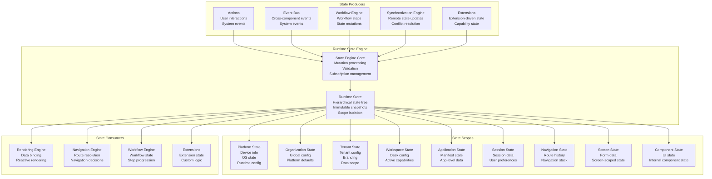
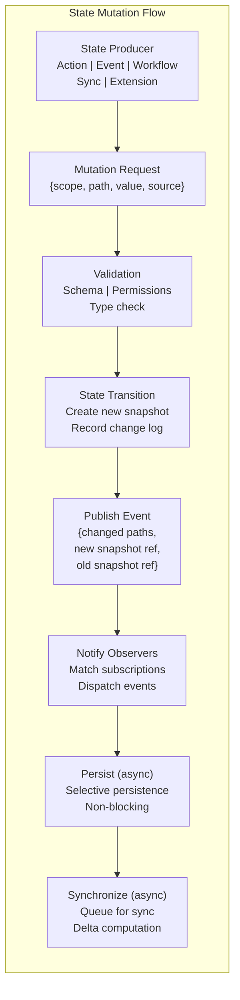
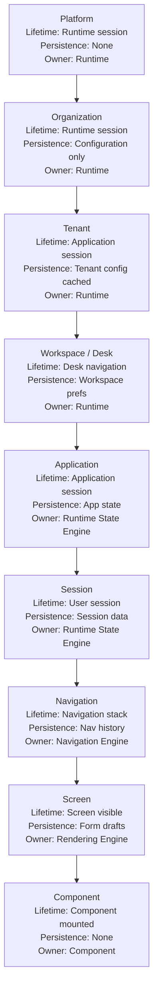
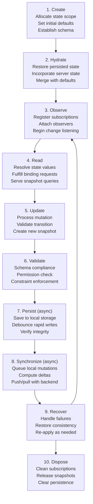
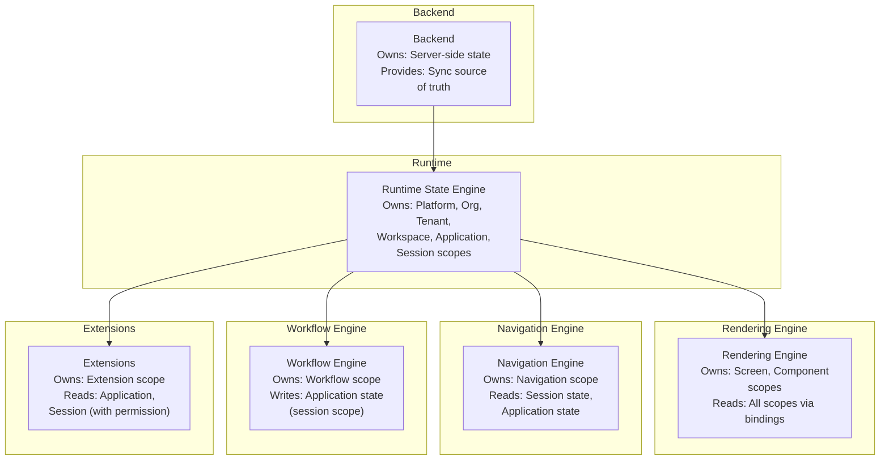
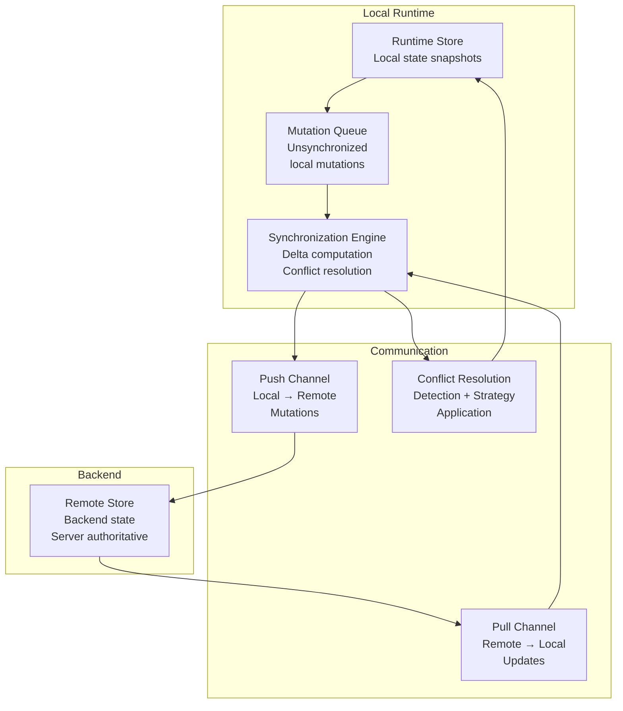
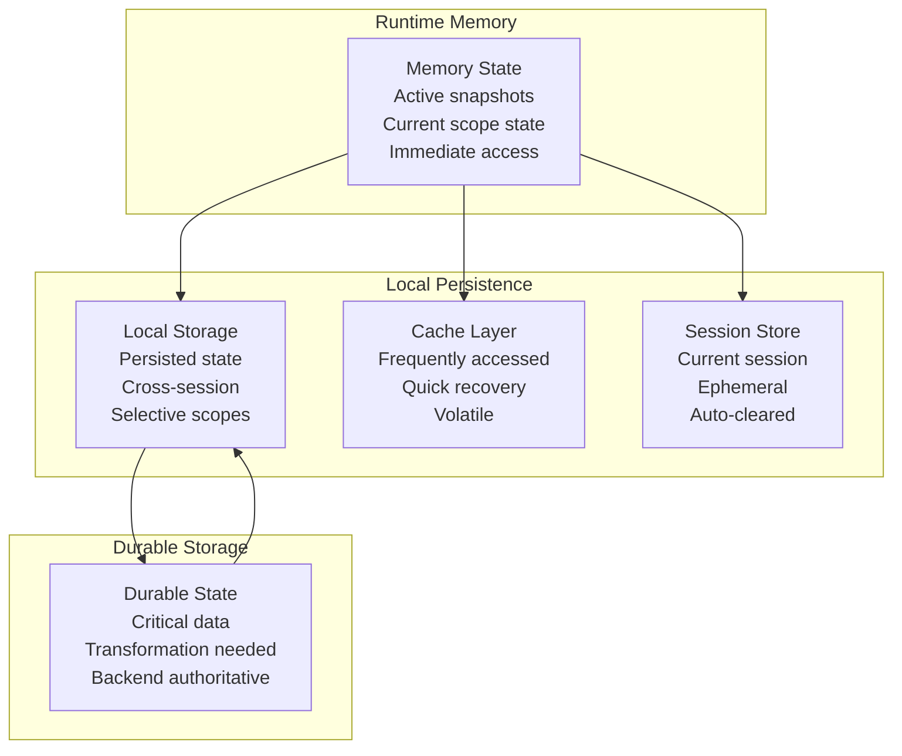
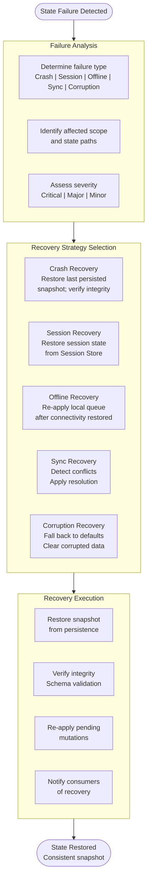

# Runtime State Engine Architecture

**KB-055 — Runtime State Engine Architecture Specification**

| Metadata | |
|----------|---|
| **KB ID** | KB-055 |
| **Title** | Runtime State Engine Architecture |
| **Version** | 0.1.0 |
| **Status** | Draft |
| **Owner** | Architecture Team |
| **Suite** | Runtime & Rendering Architecture |
| **Dependencies** | KB-048 Application State Model, KB-051 Runtime Architecture Overview, KB-052 Rendering Engine Architecture, KB-053 Rendering Pipeline Architecture, KB-020 Offline & Synchronization, KB-047 Action & Event Model |
| **Related Documents** | KB-041 Application Architecture Overview, KB-042 Application Manifest Specification, KB-043 Workspace & Tenant Model, KB-044 Navigation Architecture, KB-045 Screen Model, KB-046 Component Tree Model, KB-049 Theme & Design Token Model, KB-050 Capability Composition Model, KB-056 Runtime Navigation Engine Architecture, KB-057 Runtime Event & Action Pipeline, KB-058 Runtime Caching & Synchronization, KB-059 Runtime Security & Isolation, KB-060 Runtime Observability & Diagnostics |
| **Review Status** | Pending |
| **Last Updated** | 2026-07-11 |

---

### Revision History

| Version | Date | Author | Change |
|---------|------|--------|--------|
| 0.1.0 | 2026-07-11 | AI Architecture Agent | Initial draft |

---

## 1. Executive Summary

### 1.1 Purpose

This document defines the Runtime State Engine Architecture for the DUKADESK platform. The Runtime State Engine is the subsystem within the Runtime responsible for creating, managing, synchronizing, observing, securing, and disposing application state during execution. It is the execution layer of the architectural state model defined in KB-048 Application State Model.

The Runtime State Engine maintains the single source of truth for all application state within a Runtime session. It coordinates with the Rendering Engine, Navigation Engine, Event Bus, Action Dispatcher, Offline Engine, Synchronization Engine, and Backend Platform to ensure state integrity, consistency, reactivity, and persistence across the application lifecycle.

This document defines how state flows through the Runtime — how it is initialized, hydrated, read, updated, validated, persisted, synchronized, recovered, and disposed. It establishes the architectural boundaries between the Runtime State Engine and all consuming subsystems.

### 1.2 Scope

**In scope:**

- Architectural principles governing Runtime state
- Canonical definitions: Runtime State Engine, Runtime Store, State Context, State Scope, State Snapshot, State Transition, State Observer, State Subscription, State Hydration, State Persistence, State Synchronization
- Runtime State Architecture: state scope hierarchy from Platform through Component
- Runtime responsibilities: state initialization, hydration, resolution, updates, validation, persistence, synchronization, recovery, disposal
- State scopes: Platform, Organization, Tenant, Workspace, Application, Session, Navigation, Screen, Component, Workflow, Extension
- State lifecycle: create, hydrate, observe, read, update, validate, persist, synchronize, recover, dispose
- State transitions: user-driven, event-driven, workflow-driven, synchronization-driven, system-driven, extension-driven
- State ownership boundaries between Runtime subsystems
- State synchronization: local, remote, delta, conflict detection, conflict resolution, recovery
- State persistence: memory, local, cache, session, durable
- State recovery: crash recovery, session recovery, offline recovery, synchronization recovery
- Rendering integration with KB-052 and KB-053
- Navigation integration with KB-056
- Workflow integration with Workflow Builder
- Responsibilities: Runtime, Builder, Backend
- Security: state isolation, tenant isolation, secret separation, encryption, access boundaries, secure disposal
- Performance: memory usage, incremental updates, lazy hydration, efficient synchronization, subscription management, garbage collection
- Offline behavior: offline persistence, local queuing, deferred synchronization, merge policies, recovery
- Observability: state metrics, transition metrics, synchronization metrics, subscription metrics, recovery metrics
- Failure scenarios and anti-patterns
- Future evolution

**Out of scope:**

- Implementation details: specific state management libraries, frameworks, data structures
- Platform-specific persistence mechanisms
- Specific conflict resolution algorithms (architecture only)
- Action Dispatcher implementation (handled by KB-057)
- Event Bus implementation (handled by KB-019)
- Rendering Engine internals (handled by KB-052)
- Navigation Engine internals (handled by KB-056)
- Workflow Engine implementation (handled by Workflow Builder specification)
- Backend API design (handled by Backend architecture)

---

## 2. Architectural Principles

### 2.1 Single Runtime Source of Truth

The Runtime State Engine is the sole authoritative source for all application state during a Runtime session. No subsystem — Rendering Engine, Navigation Engine, Workflow Engine, or Extension — maintains its own authoritative state store. All state reads and mutations flow through the Runtime State Engine. This principle guarantees consistency, prevents fragmentation, and enables unified observability.

### 2.2 Predictable State Transitions

All state transitions follow defined paths. Every state mutation is triggered by a known source — user action, system event, workflow step, synchronization update, or extension call — and produces a predictable outcome. Transition predictability enables testing, debugging, and auditing of state changes.

### 2.3 Immutable State Snapshots

State is immutable. Every state mutation produces a new state snapshot rather than modifying the existing snapshot. Immutability enables deterministic rendering, time-travel debugging, efficient change detection, and safe concurrent access. The previous snapshot remains available for comparison and rollback until garbage collected.

### 2.4 Event-Driven Updates

State changes propagate through events. When a state mutation occurs, the State Engine publishes a state change event to the Event Bus. Subscribers — the Rendering Engine, Navigation Engine, Workflow Engine, Extensions — react to these events. Event-driven updates decouple state producers from state consumers and enable fine-grained reactivity.

### 2.5 Scoped State Isolation

State is scoped and isolated. Each state scope — Platform, Organization, Tenant, Workspace, Application, Session, Navigation, Screen, Component — has defined boundaries. State within one scope cannot be accessed from another scope unless explicitly authorized through defined resolution paths. Scoped isolation prevents accidental cross-contamination and enforces security boundaries.

### 2.6 Offline First

The State Engine operates offline by default. All state mutations are applied locally first and synchronized with the backend when connectivity is available. Offline-first ensures application functionality regardless of network state. Synchronization is transparent to consuming subsystems.

### 2.7 Reactive by Design

The State Engine is reactive. Consuming subsystems subscribe to state changes and receive notifications when their subscribed paths change. Subscriptions are fine-grained — subsystems subscribe to specific state paths, not entire state trees. Reactive design minimizes unnecessary re-renders and maximizes application performance.

### 2.8 Observable

Every state operation is observable. State initialization, hydration, mutations, transitions, persistence, synchronization, and disposal publish structured events. Observability enables performance analysis, debugging, audit trails, and usage analytics.

### 2.9 Runtime Independent

The State Engine architecture is independent of any specific Runtime environment. The same state model, scopes, lifecycle, and transition mechanisms apply to Mobile, Web, Desktop, and Preview Runtimes. Runtime-specific state concerns are abstracted behind the Platform Adaptation Layer.

### 2.10 Platform Neutral

The State Engine contains no platform-specific state logic. Platform-specific state — device orientation, network status, battery level — is surfaced through the Platform State scope but managed by the Platform Adapter. The core State Engine remains platform-agnostic.

---

## 3. Canonical Definitions

### 3.1 Runtime State Engine

The Runtime subsystem responsible for managing all application state during a Runtime session. The State Engine maintains the single source of truth, processes state mutations, manages subscriptions, coordinates persistence and synchronization, and provides state resolution services to all consuming subsystems.

### 3.2 Runtime Store

The central data structure maintained by the Runtime State Engine. The Runtime Store holds all state snapshots across all scopes. It is an immutable, hierarchical, scoped key-value store. Consuming subsystems read from the Runtime Store through defined resolution paths and write through defined mutation channels.

### 3.3 State Context

The hierarchical context within which state operations are evaluated. State Context carries scope information — which Tenant, Workspace, Application, Session, Screen, and Component is currently active. All state reads and writes are scoped to the current State Context.

### 3.4 State Scope

A named boundary within the state hierarchy that defines visibility, lifetime, and access rules for a set of state values. Each scope has a defined owner, lifetime, persistence strategy, and access policy. Scopes form a hierarchy — Platform ← Organization ← Tenant ← Workspace ← Application ← Session ← Navigation ← Screen ← Component — plus Workflow and Extension scopes.

### 3.5 State Snapshot

An immutable representation of the entire Runtime Store at a point in time. Snapshots are produced on every state mutation. Consuming subsystems read from the current snapshot. Previous snapshots are retained for comparison, rollback, and debugging.

### 3.6 State Transition

A single, atomic state mutation that transforms the current State Snapshot into a new State Snapshot. Each transition has a defined source (user, event, workflow, synchronization, system, extension), a target scope, a set of changed paths, and a result (success, failure, partial).

### 3.7 State Observer

A consumer that receives notifications when specific state paths change. Observers register interest in one or more state paths and receive events when those paths are mutated. The Rendering Engine, Navigation Engine, Workflow Engine, and Extensions are state observers.

### 3.8 State Subscription

A registered interest in state changes for a specific state path or path pattern. Subscriptions are scoped — an observer subscribes to `tenant.workspace.screen.component.property` and receives notifications only when that specific path changes. Subscriptions are automatically cleaned up when the subscribing scope is disposed.

### 3.9 State Hydration

The process of initializing state from all available sources — Manifest defaults, persisted state from previous sessions, server-provided initial state, and tenant configuration — to produce the initial State Snapshot. Hydration occurs during the application startup pipeline (KB-053, Stage 11).

### 3.10 State Persistence

The process of saving state snapshots to local storage for recovery across sessions. Persistence is selective — only configured state scopes and paths are persisted. Persistence is asynchronous and non-blocking.

### 3.11 State Synchronization

The process of reconciling local state with backend state. Synchronization flows in both directions — local mutations are pushed to the backend, and backend changes are pulled to the local store. Synchronization is handled by the Synchronization Engine (KB-020, KB-058) in coordination with the Runtime State Engine.

---

## 4. Runtime State Architecture

### 4.1 Architecture Overview



### 4.2 State Flow



---

## 5. Runtime Responsibilities

### 5.1 State Initialization

| Responsibility | Description |
|--------------|-------------|
| Default initialization | Initialize state from Manifest-defined default values |
| Scope creation | Create state scopes in hierarchy: Platform → Organization → Tenant → Workspace → Application → Session → Navigation → Screen → Component |
| Context establishment | Establish initial State Context from application discovery and user authentication |
| Schema application | Apply state schema definitions to validate initial state structure |

### 5.2 State Hydration

| Responsibility | Description |
|--------------|-------------|
| Persisted state restoration | Load persisted state from local storage and merge with defaults |
| Server state integration | Incorporate server-provided initial state into the hydrated snapshot |
| Ordered hydration | Hydrate scopes in dependency order — outer scopes before inner scopes |
| Consistency validation | Validate hydrated state for consistency across scopes |
| Hydration failure handling | Fall back to defaults for corrupted or missing persisted state |

### 5.3 State Resolution

| Responsibility | Description |
|--------------|-------------|
| Path-based lookup | Resolve state values by path (e.g., `tenant.workspace.screen.property`) |
| Scope-aware resolution | Resolve state within the current State Context, respecting scope boundaries |
| Fallback resolution | Apply fallback values when requested state paths do not exist |
| Cross-scope resolution | Support authorized cross-scope state reads through explicit resolution paths |

### 5.4 State Updates

| Responsibility | Description |
|--------------|-------------|
| Mutation processing | Process mutation requests from all sources: actions, events, workflows, sync, extensions, system |
| Atomic transitions | Apply mutations as atomic, indivisible state transitions |
| Snapshot creation | Create new immutable State Snapshot on each mutation |
| Change detection | Compute changed paths between old and new snapshots |
| Rollback support | Retain previous snapshot for rollback on downstream failure |

### 5.5 State Validation

| Responsibility | Description |
|--------------|-------------|
| Schema validation | Validate all state mutations against the state schema for the target scope |
| Type checking | Enforce type constraints on mutation values |
| Constraint validation | Enforce business constraints — required fields, value ranges, relationship invariants |
| Permission validation | Verify that the mutation source is authorized to modify the target state path |
| Rejection handling | Reject invalid mutations with descriptive error, preserving current snapshot |

### 5.6 State Persistence

| Responsibility | Description |
|--------------|-------------|
| Selective persistence | Persist only configured state scopes and paths — full state persistence is avoided |
| Asynchronous writing | Persist state asynchronously to avoid blocking the mutation pipeline |
| Debounced persistence | Debounce rapid successive mutations to reduce write frequency |
| Integrity verification | Verify persisted state integrity on read-back |
| Persistence failure handling | Log persistence failures without affecting runtime state |

### 5.7 State Synchronization

| Responsibility | Description |
|--------------|-------------|
| Local mutation tracking | Track local mutations that need to be synchronized to the backend |
| Delta computation | Compute the difference between local state and last-synchronized state |
| Synchronization queue | Queue local mutations for synchronization when connectivity permits |
| Remote state application | Apply remote state updates from backend to local store |
| Conflict detection | Detect conflicts between local and remote state changes |
| Conflict resolution | Apply resolution strategy — last-write-wins, server-wins, manual-merge |

### 5.8 State Recovery

| Responsibility | Description |
|--------------|-------------|
| Crash recovery | Detect incomplete state persistence from previous crash; recover to last consistent snapshot |
| Session recovery | Restore session state when a session is resumed after interruption |
| Offline recovery | Re-integrate locally queued mutations when connectivity is restored |
| Synchronization recovery | Resolve state conflicts that arise from synchronization failures |
| Corruption detection | Detect state corruption through integrity checksums and schema validation |

### 5.9 State Disposal

| Responsibility | Description |
|--------------|-------------|
| Scope-based cleanup | Dispose state scopes when their owner is destroyed — component state on unmount, screen state on navigation away |
| Subscription cleanup | Unregister state subscriptions when the subscribing scope is disposed |
| Memory release | Release State Snapshot references for garbage collection when no longer referenced |
| Persistence cleanup | Clear persisted state for disposed sessions on logout or session timeout |

---

## 6. State Scopes

### 6.1 Scope Hierarchy



### 6.2 Scope Definitions

| Scope | Content | Lifetime | Persistence | Access | Owner |
|-------|---------|----------|-------------|--------|-------|
| **Platform** | Device info, OS version, screen dimensions, input modality, network status, battery level | Runtime session | None | Global read-only | Runtime |
| **Organization** | Global configuration, platform defaults, governance policies | Runtime session | Configuration only | Global read-only | Runtime |
| **Tenant** | Tenant config, branding overrides, data scoping rules, tenant-specific defaults | Application session | Tenant config cached | Tenant-scoped | Runtime |
| **Workspace** | Desk configuration, active capabilities, workspace preferences | Desk navigation | Workspace prefs | Workspace-scoped | Runtime |
| **Application** | Manifest state, installed packages, application-level data | Application session | Application state | App-scoped | State Engine |
| **Session** | Session data, user preferences, authentication state, accumulators | User session | Session data | Session-scoped | State Engine |
| **Navigation** | Route history, navigation stack, current route, screen parameters | Navigation stack | Navigation history | Nav-scoped | Navigation Engine |
| **Screen** | Form data, screen-scoped state, scroll positions, input values | Screen visible | Form drafts | Screen-scoped | Rendering Engine |
| **Component** | UI state, internal component data, interaction state | Component mounted | None | Component-scoped | Component |
| **Workflow** | Workflow progress, step state, workflow data | Workflow active | Workflow state | Workflow-scoped | Workflow Engine |
| **Extension** | Extension-scoped state, capability state, custom data | Extension active | Extension config | Extension-scoped | Extension |

### 6.3 Scope Access Rules

| From / To | Platform | Org | Tenant | Workspace | App | Session | Nav | Screen | Component | Workflow | Extension |
|-----------|----------|-----|--------|-----------|-----|---------|-----|--------|-----------|----------|-----------|
| Platform | R/W | R | R | R | R | R | R | R | R | R | R |
| Org | — | R/W | R | R | R | R | R | R | R | R | R |
| Tenant | — | — | R/W | R | R | R | R | R | R | R | R |
| Workspace | — | — | — | R/W | R | R | R | R | R | R | R |
| Application | — | — | — | — | R/W | R | R | R | R | R | R |
| Session | — | — | — | — | — | R/W | R | R | R | R | R |
| Navigation | — | — | — | — | — | — | R/W | R | R | — | — |
| Screen | — | — | — | — | — | — | — | R/W | R | — | — |
| Component | — | — | — | — | — | — | — | — | R/W | — | — |
| Workflow | — | — | — | — | R | R | — | — | — | R/W | — |
| Extension | — | — | — | — | R* | R* | — | — | — | — | R/W |

*R* = Read, *W* = Write, *—* = No access, *R\* = Read with permission*

---

## 7. State Lifecycle

### 7.1 Lifecycle Stages



### 7.2 Stage Descriptions

| Stage | Description | Entry Criteria | Exit Criteria | Failure Mode |
|-------|-------------|---------------|--------------|-------------|
| **Create** | Allocate state scope, initialize with defaults from Manifest or schema | Scope owner created | Scope initialized with defaults | Allocation failure → scope creation error |
| **Hydrate** | Restore persisted state, incorporate server state, merge with defaults | Scope created | Initial snapshot ready | Corrupted persisted state → default fallback |
| **Observe** | Register subscriptions, attach state observers | Snapshot ready | Subscriptions active | Subscription failure → degraded reactivity |
| **Read** | Fulfill state resolution requests for consumers | Subscriptions active | Value returned | Missing path → fallback value |
| **Update** | Process mutation request, create new snapshot | Mutation request received | New snapshot created | Invalid mutation → rejection with error |
| **Validate** | Validate snapshot against schema, permissions, constraints | Snapshot created | Validation verdict | Validation failure → mutation reverted |
| **Persist** | Save snapshot to local storage asynchronously | Validation passed (if persistence configured) | Persistence queued or completed | Persistence failure → logged, runtime state unaffected |
| **Synchronize** | Queue for remote synchronization | Persistence completed (if sync configured) | Sync queued or completed | Sync failure → queued for retry |
| **Recover** | Handle failures, restore consistency | Failure detected in any stage | State restored to consistent snapshot | Recovery failure → safe degradation |
| **Dispose** | Clean up all resources | Scope owner destroyed | All resources released | Dispose failure → resource warning |

---

## 8. State Transitions

### 8.1 Transition Sources

| Source | Trigger | Examples | Validation |
|--------|---------|----------|------------|
| **User-driven** | User interaction via Action Dispatcher | Form input, button press, toggle switch | Schema + permissions |
| **Event-driven** | Event from Event Bus | Data received, timer expired, condition met | Schema |
| **Workflow-driven** | Workflow step progression | Workflow state advance, step result | Schema + workflow rules |
| **Synchronization-driven** | Backend state update | Remote data change, server push | Schema + ownership |
| **System-driven** | Runtime system event | Lifecycle change, connectivity change, theme switch | System-only |
| **Extension-driven** | Extension API call | Capability state update, plugin mutation | Schema + extension permissions |

### 8.2 Transition Format

Every state transition is represented as a structured record:

```
StateTransition {
  id: string                    // Unique transition identifier
  source: TransitionSource      // User | Event | Workflow | Sync | System | Extension
  scope: StateScope             // Target scope
  scopeId: string               // Scope instance identifier
  mutations: StateMutation[]    // Individual path mutations
  timestamp: number             // Transition time
  correlationId: string         // Trace correlation
  previousSnapshot: SnapshotRef // Reference to prior snapshot
  newSnapshot: SnapshotRef      // Reference to new snapshot
  result: TransitionResult      // Success | Failure | Partial
  failure?: TransitionFailure   // Failure details if applicable
}
```

### 8.3 Transition Validation

Every transition passes through validation before the new snapshot is created:

| Validation | Checks | Failure Action |
|-----------|--------|---------------|
| Source authorization | Is the mutation source authorized for the target scope? | Reject with authorization error |
| Path validity | Does the target path exist in the current state schema? | Reject with path error |
| Type correctness | Does the mutation value match the schema type? | Reject with type error |
| Constraint compliance | Does the mutation satisfy business constraints? | Reject with constraint error |
| Relationship integrity | Does the mutation break cross-scope relationships? | Reject with integrity error |

---

## 9. State Ownership

### 9.1 Ownership Boundaries



### 9.2 Ownership Rules

| Scope | Owner | Write Authority | Read Authority |
|-------|-------|----------------|----------------|
| Platform | Runtime State Engine | Runtime only | All subsystems |
| Organization | Runtime State Engine | Runtime only | All subsystems |
| Tenant | Runtime State Engine | Runtime only | All subsystems |
| Workspace | Runtime State Engine | Runtime, Navigation Engine | All subsystems |
| Application | Runtime State Engine | State Engine, Workflow Engine, Backend (via sync) | All subsystems |
| Session | Runtime State Engine | State Engine, Actions, Workflow Engine | All subsystems |
| Navigation | Navigation Engine | Navigation Engine only | All subsystems |
| Screen | Rendering Engine | Rendering Engine, Components (via actions) | Rendering Engine |
| Component | Component | Component only | Rendering Engine |
| Workflow | Workflow Engine | Workflow Engine only | State Engine, Workflow Engine |
| Extension | Extension | Extension only | Extension, with permission |

---

## 10. State Synchronization

### 10.1 Synchronization Architecture



### 10.2 Synchronization Flows

| Flow | Direction | Trigger | Content |
|------|-----------|---------|---------|
| Local → Remote (push) | Outbound | Connectivity available, queued mutations exist | Batched local mutations since last sync |
| Remote → Local (pull) | Inbound | Connectivity available, periodic poll or server push | Remote state updates since last sync |
| Delta | Bidirectional | Sync initiation | Only changed paths, not full state |
| Full | Bidirectional | Initial sync, recovery, integrity check | Complete state for configured scopes |

### 10.3 Conflict Detection

Conflicts are detected when the same state path has been modified both locally and remotely since the last synchronization point. Detection is path-level — conflicts are detected per individual state path, not per scope.

| Conflict Type | Detection | Example |
|--------------|-----------|---------|
| Direct conflict | Same path modified locally and remotely | Order status: local = "confirmed", remote = "shipped" |
| Dependency conflict | Related paths modified inconsistently | Local changes total without remote price update |
| Deletion conflict | Path deleted locally but modified remotely | Local deletes item, remote updates item quantity |

### 10.4 Conflict Resolution Strategies

| Strategy | Description | Use Case |
|----------|-------------|----------|
| Last-write-wins | Most recent mutation (by timestamp) is applied | Non-critical data, preferences |
| Server-wins | Remote state always overrides local | Authoritative data, inventory |
| Local-wins | Local state is preserved, remote is overwritten | User drafts, unsaved work |
| Custom merge | Application-defined merge logic | Complex data structures, collaborative edits |
| Manual resolution | Conflict flagged for user resolution | Contradictory changes, business-critical data |
| Version-vector | Version vectors determine ordering | Distributed state with causal ordering |

### 10.5 Recovery from Sync Failure

| Failure | Detection | Recovery |
|---------|-----------|----------|
| Push failure | Remote returns error or timeout | Retry with exponential backoff; queue preserved |
| Pull failure | Remote unavailable or timeout | Use last synchronized state; retry on next cycle |
| Conflict resolution failure | Merge logic throws or returns error | Flag for manual resolution; preserve both versions |
| Corruption during sync | Integrity check fails | Revert to pre-sync snapshot; full sync on retry |

---

## 11. State Persistence

### 11.1 Persistence Model



### 11.2 Persistence Layers

| Layer | Lifetime | Scope | Speed | Capacity | Use Case |
|-------|----------|-------|-------|----------|----------|
| **Memory** | Runtime session | All scopes | Instantaneous | RAM-limited | Active application state |
| **Cache** | Configurable TTL | Frequent reads | Fast (~1ms) | Configurable | Quick recovery, frequent queries |
| **Session Store** | User session | Session scope | Fast (~1ms) | Configurable | Session data, ephemeral state |
| **Local Storage** | Cross-session | Configurable scopes | Moderate (~10ms) | Device-dependent | Persisted user data, preferences |
| **Durable Store** | Indefinite | Backend-scoped | Slow (network) | Unlimited | Backend authoritative data |

### 11.3 Persistence Configuration

| Scope | Persisted? | Storage | Strategy | Clear Condition |
|-------|-----------|---------|----------|-----------------|
| Platform | No | — | — | — |
| Organization | Configuration only | Local Storage | On change | Tenant switch |
| Tenant | Configuration only | Local Storage | On change | Tenant switch |
| Workspace | Preferences | Local Storage | Debounced | Workspace switch |
| Application | Full state | Local Storage | Periodic | App uninstall |
| Session | Full state | Session Store | On change | Logout, timeout |
| Navigation | History | Local Storage | On navigation | Clear history action |
| Screen | Form drafts | Local Storage | Debounced | Screen submit or discard |
| Component | None | — | — | — |
| Workflow | State | Local Storage | On step | Workflow complete |
| Extension | Config | Local Storage | On change | Extension disable |

---

## 12. State Recovery

### 12.1 Recovery Architecture



### 12.2 Recovery Scenarios

| Scenario | Detection | Recovery Action | Consumer Impact |
|----------|-----------|----------------|-----------------|
| **Crash** | Startup integrity check fails | Restore last persisted snapshot; verify schema; discard incomplete mutations | Brief loading state during recovery |
| **Session timeout** | Session expiry detected | Restore session from Session Store; re-authenticate if needed | Login prompt if auth expired |
| **Offline reconnection** | Connectivity restored | Re-apply queued mutations; pull remote changes; resolve conflicts | Background synchronization; UI state refresh |
| **Sync conflict** | Conflict detection during sync | Apply configured resolution strategy; flag unresolved conflicts | Possible data inconsistency notification |
| **Corruption** | Checksum mismatch or schema violation on read | Revert to last valid snapshot or defaults; clear corrupted data | Reset affected state; notification to user |

---

## 13. Rendering Integration

### 13.1 Interaction with Rendering Engine (KB-052)

The Rendering Engine is the primary consumer of Runtime State. It reads state values through data bindings defined in screen definitions (KB-052, Section 6).

| Integration Point | Rendering Engine Action | State Engine Response |
|------------------|------------------------|----------------------|
| Data binding resolution | Request state value by path | Return current value from active snapshot |
| State subscription | Subscribe to path for reactivity | Register observer; notify on change |
| Component mount | Establish component state scope | Create component state scope in Runtime Store |
| Component unmount | Dispose component state scope | Clean up component scope and subscriptions |
| Re-render trigger | Receive state change notification | Publish change event to Event Bus |

### 13.2 Interaction with Rendering Pipeline (KB-053)

The State Engine participates in the Rendering Pipeline at Stage 11 (State Hydration) and during the Incremental Updates stage (Stage 19).

| Pipeline Stage | State Engine Role | Coordination |
|---------------|-------------------|--------------|
| Stage 11: State Hydration | Initialize and hydrate state from all sources | After Theme Resolution, before Action Registration |
| Stage 19: Incremental Updates | Detect state changes, notify affected components | After change detection, before selective re-render |

---

## 14. Navigation Integration

### 14.1 Interaction with Navigation Engine (KB-056)

| Interaction | Navigation Engine Action | State Engine Response |
|-------------|-------------------------|----------------------|
| Route resolution | Read navigation state for current route | Provide current route and navigation stack |
| Screen parameters | Read screen parameters from navigation state | Extract parameters from active navigation scope |
| Navigation dispatch | Write navigation state on navigation action | Create new navigation state snapshot |
| Deep link handling | Read incoming deep link parameters | Store deep link params in navigation scope |
| Navigation state persistence | Request navigation state persistence | Persist navigation state on navigation events |

---

## 15. Workflow Integration

### 15.1 Interaction with Workflow Engine

| Interaction | Workflow Engine Action | State Engine Response |
|-------------|-----------------------|----------------------|
| Workflow initialization | Create workflow state scope | Initialize workflow scope with workflow definition |
| Step progression | Write workflow step state | Validate and persist workflow progression |
| Workflow state reads | Read workflow state | Provide current workflow snapshot |
| Workflow completion | Dispose workflow state scope | Clean up workflow scope and subscriptions |
| State-driven workflows | Subscribe to state changes for workflow triggers | Notify workflow engine on relevant state changes |

---

## 16. Subsystem Responsibilities

### 16.1 Runtime Responsibilities

| Responsibility | Description |
|--------------|-------------|
| State Engine lifecycle | Manage the State Engine initialization, operation, and shutdown |
| Scope hierarchy | Maintain the state scope hierarchy and scope isolation |
| Mutation processing | Process all state mutations from all sources |
| Subscription management | Manage state subscriptions and observer notifications |
| Persistence coordination | Coordinate with Cache Manager for state persistence |
| Synchronization coordination | Coordinate with Synchronization Engine for remote sync |
| Recovery execution | Execute recovery strategies on state failures |
| Security enforcement | Enforce state isolation, access boundaries, and permissions |

### 16.2 Builder Responsibilities

| Responsibility | Description |
|--------------|-------------|
| State schema definition | Define state schemas in the Manifest for application state |
| Default values | Provide default state values for all application state scopes |
| Persistence configuration | Configure which state scopes and paths should be persisted |
| Synchronization configuration | Configure which state scopes require synchronization |
| Permission declarations | Declare state access permissions for screens and capabilities |

### 16.3 Backend Responsibilities

| Responsibility | Description |
|--------------|-------------|
| Remote state authority | Maintain the authoritative remote state store |
| State push acceptance | Accept and process pushed local mutations |
| State push delivery | Deliver remote state updates to connected clients |
| Conflict resolution | Participate in conflict resolution for server-authoritative data |
| Initial state provision | Provide initial state for state hydration on first load |

---

## 17. Security

### 17.1 State Isolation

| Isolation Concern | Mechanism |
|------------------|-----------|
| Tenant isolation | Tenant state scope is isolated from other tenant scopes. Cross-tenant state access is blocked. |
| Workspace isolation | Workspace state is isolated within its tenant. No cross-workspace access. |
| Session isolation | Session state is isolated to its session. Other sessions cannot read or write. |
| Screen isolation | Screen state is isolated to its screen. Disposed screen state is inaccessible. |
| Component isolation | Component state is isolated to its component instance. Other components cannot access. |

### 17.2 Tenant Isolation

Tenant isolation is enforced at the State Engine level:

1. Each tenant session has a dedicated tenant state scope.
2. State resolution paths are prefixed with the tenant identifier.
3. Cross-tenant state reads return empty or null — no tenant can access another tenant's state.
4. State persistence is tenant-scoped — storage keys include tenant identifiers.

### 17.3 Secret Separation

Sensitive values — authentication tokens, API keys, credentials — are never stored in the Runtime Store. Secrets are managed by the Security Manager and provided to the State Engine only through ephemeral, scope-restricted references. The State Engine stores references to secrets, never the secrets themselves.

### 17.4 Encryption Expectations

| Data Type | At Rest | In Transit | In Memory |
|-----------|---------|------------|-----------|
| User preferences | Not encrypted | TLS | Plaintext |
| Session tokens | Encrypted | TLS | Ephemeral reference |
| Form data | Not encrypted | TLS | Plaintext |
| Authentication state | Encrypted | TLS | Ephemeral reference |
| Sensitive configuration | Encrypted | TLS | Ephemeral reference |

### 17.5 Access Boundaries

| Access Type | Authorization Required | Enforcement Point |
|-------------|----------------------|-------------------|
| Read own scope | Implicit | State Engine |
| Read parent scope | Implicit | State Engine |
| Read sibling scope | Explicit permission | State Engine + Permission Engine |
| Read child scope | Implicit | State Engine |
| Write own scope | Implicit | State Engine |
| Write parent scope | Explicit permission | State Engine + Permission Engine |
| Cross-tenant read/write | Blocked | State Engine |
| Cross-session read/write | Blocked | State Engine |

### 17.6 Secure Disposal

When state is disposed:

1. **Memory release** — Snapshot references are cleared; memory is eligible for garbage collection.
2. **Persistence clearing** — Persisted state for the disposed scope is cleared from local storage.
3. **Subscription cleanup** — All subscriptions owned by the disposed scope are unregistered.
4. **Secret reference cleanup** — Ephemeral secret references are invalidated.

---

## 18. Performance

### 18.1 Performance Targets

| Dimension | Target | Measurement |
|-----------|--------|-------------|
| State read latency | < 1ms (in-memory) | Per read operation |
| State write latency | < 5ms (in-memory transition) | Per mutation |
| Subscription notification latency | < 3ms (change to observer) | Per notification |
| Persistence write latency | < 50ms (async, non-blocking) | Per persisted scope |
| Synchronization round trip | < 500ms (on fast network) | Per sync cycle |
| Memory overhead | < 5MB base + < 1MB per screen | Per application session |

### 18.2 Incremental Updates

The State Engine supports incremental updates through immutable snapshots and change detection:

1. **Snapshot comparison** — On each mutation, the new snapshot is compared to the previous snapshot to compute the set of changed paths.
2. **Targeted notification** — Only observers subscribed to changed paths receive notifications.
3. **Selective re-render** — The Rendering Engine uses the changed path set to determine which components need re-render.

### 18.3 Lazy Hydration

State scopes are hydrated lazily:

1. **Outer scopes first** — Platform, Organization, Tenant, Workspace are hydrated eagerly at startup.
2. **Inner scopes on demand** — Application, Session, Navigation, Screen, Component scopes are hydrated only when their owner is created.
3. **Data lazy loading** — Bulk state data (lists, catalogs) is loaded on first access, not at hydration time.

### 18.4 Efficient Synchronization

Synchronization is optimized for efficiency:

1. **Delta-only sync** — Only changed paths are transmitted, not full state snapshots.
2. **Batch synchronization** — Multiple local mutations are batched into a single sync payload.
3. **Dedup** — Redundant mutations to the same path are collapsed before sync.
4. **Prioritized sync** — Critical state (orders, payments) syncs before non-critical state (preferences, analytics).

### 18.5 Subscription Management

| Strategy | Description |
|----------|-------------|
| Fine-grained subscriptions | Subscriptions target specific state paths, not entire scopes |
| Automatic cleanup | Subscriptions are automatically unregistered when their owner scope is disposed |
| Subscription dedup | Duplicate subscriptions from the same observer are collapsed |
| Batch notification | Multiple path changes in a single transition trigger a single batched notification |

### 18.6 Garbage Collection Expectations

| Collectible | Trigger | Collection Strategy |
|-------------|---------|-------------------|
| Previous snapshots | New snapshot created; no active references | Retain last 10 snapshots; release older |
| Disposed scopes | Scope owner destroyed | Immediate memory release |
| Unused subscription | Subscription owner disposed | Immediate unregistration |
| Cached persisted state | Cache TTL exceeded | LRU eviction |
| Sync queue entries | Entry synchronized and acknowledged | Remove from queue |

---

## 19. Offline Behaviour

### 19.1 Offline Persistence

When operating offline, the State Engine persists state changes locally:

| Aspect | Behavior |
|--------|----------|
| Read | Full read capability from local Runtime Store (all scopes) |
| Write | Full write capability to local Runtime Store |
| Persistence | State changes persisted to Local Storage for crash recovery |
| Data availability | All previously loaded data remains available |
| Missing data | Data not yet loaded shows cached or fallback values |

### 19.2 Local Queuing

Mutations that would normally be synchronized to the backend are queued locally:

1. **Mutation applied locally** — The mutation is applied to the Runtime Store immediately.
2. **Mutation queued** — The mutation is added to the synchronization queue with metadata (timestamp, path, value, source).
3. **Queue persisted** — The queue is persisted to Local Storage for recovery across crashes.
4. **Queue ordered** — Mutations are ordered by timestamp to preserve causal ordering.

### 19.3 Deferred Synchronization

When connectivity is restored:

1. **Queue flush** — Queued mutations are transmitted to the backend in order.
2. **Delta pull** — Remote state changes since last sync are pulled.
3. **Conflict detection** — Conflicts between local queue and remote changes are detected.
4. **Conflict resolution** — Configured resolution strategy is applied.
5. **Re-render** — Affected components are re-rendered with synchronized state.

### 19.4 Merge Policies

| Policy | Description | Use Case |
|--------|-------------|----------|
| Local-first | Local mutations always applied; remote merged in | User-generated content |
| Server-authoritative | Remote state overwrites local for specific paths | Inventory, pricing |
| Timestamp-ordered | Latest timestamp wins | Non-critical data |
| Application-defined | Custom merge logic defined in capability | Complex data structures |

### 19.5 Recovery

Offline-to-online recovery follows the process defined in Section 12 (State Recovery — Offline Recovery scenario).

---

## 20. Observability

### 20.1 State Metrics

| Metric | Type | Source | Aggregation |
|--------|------|--------|-------------|
| `state.scope.count` | Gauge | Active scopes | Current count |
| `state.snapshot.count` | Gauge | Retained snapshots | Current count |
| `state.memory.bytes` | Gauge | State memory usage | Current bytes |
| `state.read.ops` | Counter | Per scope | Rate |
| `state.write.ops` | Counter | Per scope | Rate |
| `state.subscription.count` | Gauge | Active subscriptions | Current count |

### 20.2 Transition Metrics

| Metric | Description |
|--------|-------------|
| `transition.duration` | Time to process a single state transition |
| `transition.source.{source}.count` | Transition count by source |
| `transition.validation.success` | Successful validation count |
| `transition.validation.failure` | Validation failure count |
| `transition.scope.{scope}.count` | Transition count by scope |

### 20.3 Synchronization Metrics

| Metric | Description |
|--------|-------------|
| `sync.push.count` | Local-to-remote sync operations |
| `sync.push.bytes` | Data pushed to backend |
| `sync.pull.count` | Remote-to-local sync operations |
| `sync.pull.bytes` | Data pulled from backend |
| `sync.conflict.count` | Conflicts detected |
| `sync.conflict.resolved` | Conflicts resolved automatically |
| `sync.conflict.pending` | Conflicts awaiting resolution |

### 20.4 Subscription Metrics

| Metric | Description |
|--------|-------------|
| `subscription.registered` | Total subscription registrations |
| `subscription.unregistered` | Total subscription removals |
| `subscription.active` | Currently active subscriptions |
| `subscription.notification.latency` | Time from change to subscriber notification |
| `subscription.notification.volume` | Notifications per second |

### 20.5 Recovery Metrics

| Metric | Description |
|--------|-------------|
| `recovery.crash.count` | Crash recovery attempts |
| `recovery.session.count` | Session recovery attempts |
| `recovery.offline.count` | Offline recovery attempts |
| `recovery.sync.count` | Sync recovery attempts |
| `recovery.corruption.count` | Corruption recovery attempts |
| `recovery.duration` | Time to complete recovery |

---

## 21. Failure Scenarios

| Scenario | Stage | Cause | Detection | Response | Recovery |
|----------|-------|-------|-----------|----------|----------|
| Corrupted State | Hydration / Read | Persisted data corruption, schema mismatch | Integrity check fails, schema validation fails | Fall back to default state | Clear corrupted persistence; re-hydrate from defaults |
| Invalid Transition | Update | Mutation violates schema, permissions, or constraints | Transition validation fails | Reject mutation; return error to source | Preserve previous snapshot |
| Lost Persistence | Persist | Storage full, storage API failure, file corruption | Persistence write fails | Log failure; runtime state unaffected | Retry on next write; alert if persistent |
| Synchronization Conflict | Sync | Same path modified locally and remotely | Conflict detection during sync | Apply resolution strategy; flag unresolved | Manual resolution for unresolved |
| Subscription Failure | Observe | Observer unavailable, subscription registration fails | Registration error | Log failure; retry on next mutation | Re-register on observer availability |
| Memory Exhaustion | Any | Too many snapshots, scopes, or subscriptions retained | Memory pressure detection | Garbage collect old snapshots; reduce subscription scope | Degraded caching; request memory from Runtime |
| Tenant Isolation Failure | Read / Write | Cross-tenant state access attempt | Permission validation | Block access; log security event | Alert security; isolate tenant |

---

## 22. Anti-Patterns

| Anti-Pattern | Description | Consequence | Correct Approach |
|-------------|-------------|-------------|-----------------|
| Multiple runtime sources of truth | Subsystems maintaining independent state stores | State fragmentation, inconsistency | Single Runtime State Engine as sole source of truth |
| Mutable shared state | Components mutating shared state directly | Unpredictable behavior, race conditions | All mutations through State Engine |
| Cross-tenant state access | Reading or writing state from another tenant | Security breach, data leakage | Tenant-scoped state isolation |
| Hidden state mutations | Mutating state without going through the State Engine | Undetected changes, broken reactivity | All mutations are explicit transitions |
| Platform-specific state implementations | State logic depending on platform APIs | Broken cross-platform compatibility | Platform-agnostic State Engine; platform state in Platform scope |
| Business logic inside the state engine | Implementing business rules in state transition logic | Violates separation of concerns, complicates testing | Business logic in capabilities and services |
| Over-persistence | Persisting all state scopes regardless of importance | Slow startup, wasted storage, privacy concerns | Selective persistence by scope |
| Synchronous persistence | Blocking state mutations on persistence writes | Poor performance, UI jank | Asynchronous, non-blocking persistence |
| Infinite subscriptions | Subscribing to state without cleanup | Memory leaks, degraded performance | Automatic subscription cleanup on scope dispose |
| State in component internals | Storing application-level state in component local state | State loss on navigation, inconsistent views | All application state in Runtime Store |

---

## 23. Future Evolution

### 23.1 Distributed Runtime State

Future Runtimes may share state across devices:

- **Cross-device state** — State synchronized across a user's devices for seamless transitions.
- **Distributed state scopes** — Some scopes live on the client, others on edge servers.
- **Global state coordination** — State changes coordinated across multiple Runtime instances.

### 23.2 CRDT-Based Synchronization

Conflict-free Replicated Data Types (CRDTs) may replace traditional sync:

- **Automatic conflict resolution** — CRDTs resolve conflicts without coordination.
- **Offline-first by design** — CRDTs naturally support offline mutations.
- **Peer-to-peer sync** — State synchronized directly between devices without central server.

### 23.3 AI-Assisted State Optimization

AI may optimize state management:

- **Predictive state hydration** — AI predicts which state will be needed and hydrates it proactively.
- **Intelligent cache management** — AI optimizes which state to persist and for how long.
- **Anomaly detection** — AI detects unusual state transitions that may indicate bugs or attacks.

### 23.4 Collaborative Runtime State

Future versions may support collaborative state:

- **Shared screen state** — Multiple users view and edit shared state in real time.
- **Operational transformation** — Concurrent edits to shared state are transformed for consistency.
- **Cursor and selection state** — Remote user cursors and selections tracked in state.

### 23.5 Edge State Replication

State may be replicated at edge locations:

- **Edge-local scopes** — State scopes that live on edge nodes for low-latency access.
- **Global state with edge caches** — Global state with edge-located read replicas.
- **Regional state partitioning** — State partitioned by geographic region for data residency.

### 23.6 Predictive State Hydration

The State Engine may predictively hydrate state:

- **Navigation prediction** — Pre-hydrate state for screens predicted to be navigated to.
- **User behavior prediction** — Pre-load state based on user behavior patterns.
- **Time-based prediction** — Pre-hydrate state for time-based events (scheduled orders, appointments).

---

## 24. Cross-References

| Reference | Description |
|-----------|-------------|
| KB-048 | Application State Model — the architectural state model that the Runtime State Engine executes |
| KB-020 | Offline & Synchronization — synchronization architecture referenced for state sync |
| KB-047 | Action & Event Model — actions that trigger state mutations, events that carry state changes |
| KB-051 | Runtime Architecture Overview — foundational Runtime architecture the State Engine operates within |
| KB-052 | Rendering Engine Architecture — the Rendering Engine that consumes state for data binding |
| KB-053 | Rendering Pipeline Architecture — the pipeline within which State Hydration executes |
| KB-056 | Runtime Navigation Engine Architecture — the Navigation Engine that owns navigation state |
| KB-041 | Application Architecture Overview — application architecture context |
| KB-042 | Application Manifest Specification — Manifest that defines state defaults and schemas |
| KB-043 | Workspace & Tenant Model — workspace and tenant context for state scoping |
| KB-044 | Navigation Architecture — navigation structures that drive navigation state |
| KB-045 | Screen Model — screen definitions that define state bindings |
| KB-046 | Component Tree Model — component hierarchy that defines component state scope |
| KB-049 | Theme & Design Token Model — theme state that the State Engine manages |
| KB-050 | Capability Composition Model — capabilities that own extension state scopes |
| KB-057 | Runtime Event & Action Pipeline — events and actions that drive state transitions |
| KB-058 | Runtime Caching & Synchronization — caching and sync the State Engine coordinates with |
| KB-059 | Runtime Security & Isolation — security model that enforces state isolation |
| KB-060 | Runtime Observability & Diagnostics — observability that collects state metrics |
| Workflow Builder | Workflow Builder Architecture — workflows that drive workflow state |

---

## 25. Open Questions

1. Should the State Engine support time-travel debugging — retaining a configurable depth of historical snapshots for inspection?
2. What is the optimal batch size for synchronization to balance latency and throughput?
3. Should state subscriptions support wildcard patterns (e.g., `tenant.workspace.*.status`) or only exact paths?
4. How should cross-extension state sharing work when two extensions need to coordinate state?
5. Should the State Engine support computed/derived state values that are automatically updated when their dependencies change?
6. What is the appropriate retention policy for crash recovery snapshots — how many generations?
7. Should state schema enforcement be strict (reject unknown paths) or permissive (allow undeclared paths with warnings)?
