# Runtime Navigation Engine Architecture

**KB-056 — Runtime Navigation Engine Architecture Specification**

| Metadata | |
|----------|---|
| **KB ID** | KB-056 |
| **Title** | Runtime Navigation Engine Architecture |
| **Version** | 0.1.0 |
| **Status** | Draft |
| **Owner** | Architecture Team |
| **Suite** | Runtime & Rendering Architecture |
| **Dependencies** | KB-044 Navigation Architecture, KB-051 Runtime Architecture Overview, KB-052 Rendering Engine Architecture, KB-053 Rendering Pipeline Architecture, KB-055 Runtime State Engine Architecture, KB-045 Screen Model, KB-047 Action & Event Model, KB-048 Application State Model |
| **Related Documents** | KB-041 Application Architecture Overview, KB-042 Application Manifest Specification, KB-043 Workspace & Tenant Model, KB-046 Component Tree Model, KB-049 Theme & Design Token Model, KB-050 Capability Composition Model, KB-057 Runtime Security Architecture, KB-058 Runtime Caching & Synchronization, KB-059 Runtime Security & Isolation, KB-060 Runtime Observability & Diagnostics |
| **Review Status** | Pending |
| **Last Updated** | 2026-07-11 |

---

### Revision History

| Version | Date | Author | Change |
|---------|------|--------|--------|
| 0.1.0 | 2026-07-11 | AI Architecture Agent | Initial draft |

---

## 1. Executive Summary

### 1.1 Purpose

This document defines the Runtime Navigation Engine Architecture for the DUKADESK platform. The Runtime Navigation Engine is the subsystem within the Runtime responsible for executing, coordinating, securing, and observing navigation across all DUKADESK runtimes — Mobile, Web, Desktop, Preview, and Builder Preview.

While KB-044 Navigation Architecture defines the Navigation Model — the structural representation of routes, screens, tabs, stacks, and transitions — this specification defines the Runtime Engine that interprets and executes that model. The Navigation Engine is the bridge between declarative navigation definitions and runtime navigation behavior.

The Navigation Engine is consumed by the Rendering Engine, Runtime State Engine, Identity Platform, Workflow Engine, Deep Linking Service, and QR Resolution Service. Every screen transition, deep link resolution, navigation guard evaluation, and navigation state mutation passes through the Navigation Engine.

### 1.2 Scope

**In scope:**

- Architectural principles governing Runtime navigation
- Canonical definitions: Runtime Navigation Engine, Navigation Session, Navigation Context, Navigation Stack, Navigation State, Route Resolver, Navigation Transition, Navigation Guard, Navigation History, Navigation Intent
- Runtime Navigation Architecture from Manifest through Rendering Engine
- Runtime responsibilities: route resolution, navigation execution, context resolution, stack management, history management, guard evaluation, deep link processing, QR navigation, navigation recovery, observability
- Navigation context resolution: Organization, Tenant, Workspace, Application, User, Session, Device, Runtime, Environment
- Navigation lifecycle: initialize → resolve context → resolve route → evaluate guards → authorize → prepare transition → load screen → update state → render → observe → complete
- Navigation modes: standard, deep link, QR, notification, workflow, recovery, offline, cross-workspace, cross-tenant
- Navigation resolution: Manifest, route, screen, capability, permission, theme, state
- Navigation guards: authentication, authorization, subscription, consent, capability availability, feature flags, runtime compatibility, environment rules
- Stack management: root, nested, modal, dialog, tab, drawer, workspace
- History management: forward, back, session restoration, recovery, persistence, audit trail
- Deep linking: universal, internal, QR, notification, marketplace, workspace, tenant
- QR navigation: QR resolution, tenant discovery, workspace resolution, application resolution, consent validation, runtime launch
- Runtime integration with Rendering Engine, Rendering Pipeline, State Engine
- Identity integration: authentication, authorization, consent, sessions
- Responsibilities: Builder, Backend
- Security: navigation trust boundaries, route authorization, tenant isolation, workspace isolation, deep link validation, navigation replay protection
- Performance: route resolution, lazy navigation, stack optimization, history management, navigation caching, transition scheduling
- Offline behavior: offline navigation, cached routes, cached screens, recovery navigation, deferred deep links
- Observability: navigation metrics, transition metrics, resolution metrics, guard metrics, failure metrics, user journey correlation
- Failure scenarios and anti-patterns
- Future evolution

**Out of scope:**

- Implementation details: specific navigation libraries, frameworks, platform navigation components
- Navigation Model definition (handled by KB-044)
- Screen definitions and lifecycle (handled by KB-045)
- Rendering Engine internals (handled by KB-052)
- State Engine internals (handled by KB-055)
- Identity Platform implementation (handled by Identity suite)
- Workflow Engine implementation (handled by Workflow Builder)
- Platform-specific navigation UI components (handled by Platform Adapter)

---

## 2. Architectural Principles

### 2.1 Manifest-Driven Navigation

Every navigation structure, route, transition, and guard originates from the Application Manifest. The Navigation Engine does not fabricate routes, invent transitions, or define navigation structures at runtime. All navigation behavior is declared in the Manifest and interpreted by the Engine.

### 2.2 Declarative Execution

Navigation is expressed declaratively — what to navigate to, not how to navigate. Routes are declared as screen identifiers. Transitions are declared as navigation actions. Guards are declared as permission rules. The Navigation Engine interprets these declarations and handles the imperative details of stack manipulation, screen loading, animation coordination, and state management.

### 2.3 Runtime Independent

The Navigation Engine architecture is independent of any specific Runtime. The same route resolution, guard evaluation, stack management, and transition execution model applies to Mobile, Web, Desktop, and Preview Runtimes. Runtime-specific navigation behavior — transition animations, gesture handling, platform navigation bars — is abstracted behind the Platform Adaptation Layer.

### 2.4 Platform Agnostic

The Navigation Engine contains no platform-specific navigation logic. Platform navigation patterns — back gesture on iOS, up button on Android, browser back on Web — are handled by the Platform Adaptation Layer. The core Navigation Engine operates on abstract navigation concepts: routes, stacks, transitions, history.

### 2.5 Permission Aware

Every navigation action is evaluated against permission rules. The Navigation Engine consults the Permission Engine before every route resolution, screen load, and transition execution. Unauthorized navigation is blocked with appropriate feedback.

### 2.6 State Aware

Navigation is integrated with application state. The Navigation Engine reads state for route resolution (conditional routes based on state values), writes state on navigation actions (navigation history, current route), and coordinates with the State Engine for state-driven navigation.

### 2.7 Tenant Aware

Navigation respects tenant boundaries. Routes, screens, and transitions are resolved within the current tenant context. Cross-tenant navigation is explicitly managed through defined tenant-switch transitions.

### 2.8 Workspace Aware

Navigation respects workspace boundaries. Route resolution considers the currently active workspace (Desk). Cross-workspace navigation transitions between Desks, managing workspace-specific state and capabilities.

### 2.9 Deep-Link Capable

The Navigation Engine handles all forms of deep linking — universal links, internal links, QR codes, notification links, marketplace links. Deep links are resolved to navigation intents and executed through the same navigation pipeline as user-initiated navigation.

### 2.10 Fully Observable

Every navigation operation is observable. Route resolution, guard evaluation, transition execution, stack mutations, and deep link processing publish structured events. Observability enables user journey analytics, performance monitoring, debugging, and audit.

---

## 3. Canonical Definitions

### 3.1 Runtime Navigation Engine

The Runtime subsystem responsible for executing navigation. The Navigation Engine receives navigation intents — from user interactions, deep links, workflows, and system events — and processes them through route resolution, guard evaluation, permission validation, context resolution, state coordination, transition execution, and history management to produce screen transitions.

### 3.2 Navigation Session

A continuous period of navigation activity within a Runtime session. A Navigation Session begins when the application is loaded and the initial route is resolved. It encompasses all navigation actions — screen transitions, stack mutations, deep link resolutions — that occur until the application is terminated.

### 3.3 Navigation Context

The hierarchical context against which all navigation operations are evaluated. Navigation Context carries Organization, Tenant, Workspace, Application, User, Session, Device, Runtime, and Environment information. Route resolution, guard evaluation, and screen loading are scoped to the current Navigation Context.

### 3.4 Navigation Stack

A structured collection of navigation entries representing the current navigation path. Stacks are ordered — the top of the stack represents the currently visible screen. Multiple stacks may exist concurrently (root stack, modal stack, dialog stack). Stacks support push, pop, replace, and reset operations.

### 3.5 Navigation State

The current state of navigation within the Runtime. Navigation State includes the active stacks, current route, navigation history, screen parameters, and transition state. Navigation State is maintained by the Navigation Engine and stored in the Runtime State Engine's Navigation scope.

### 3.6 Route Resolver

The subsystem within the Navigation Engine responsible for resolving a navigation target — a route identifier, screen name, or deep link URI — to a concrete screen definition. Route resolution considers the Navigation Context, permission rules, state values, and capability availability.

### 3.7 Navigation Transition

The process of moving from one navigation state to another. A transition encompasses preparing the current screen for departure, loading the target screen, executing animations, updating state, and notifying observers. Transitions are atomic — they either complete fully or roll back to the previous state.

### 3.8 Navigation Guard

A predicate evaluated before a navigation action is executed. Guards check conditions — authentication state, permission grants, capability availability, feature flags — and either allow the navigation to proceed or block it with a defined response. Guards are declarative, ordered, and composable.

### 3.9 Navigation History

The ordered record of navigation actions within a Navigation Session. History supports back and forward navigation, session restoration, and audit trails. History entries include the source route, target route, transition type, timestamp, and outcome.

### 3.10 Navigation Intent

A declarative request to perform a navigation action. An intent specifies the target (route identifier, screen name, deep link URI), the transition type (push, pop, replace, reset, tab switch, modal present), optional parameters, and optional guards to evaluate. Intents are the universal input to the Navigation Engine.

---

## 4. Runtime Navigation Architecture

### 4.1 Architecture Overview

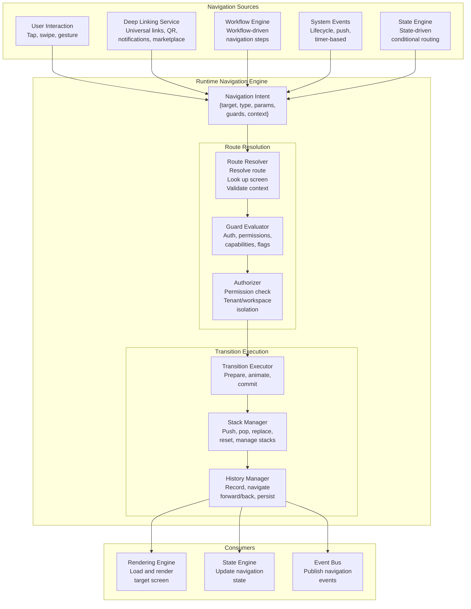

### 4.2 Data Flow

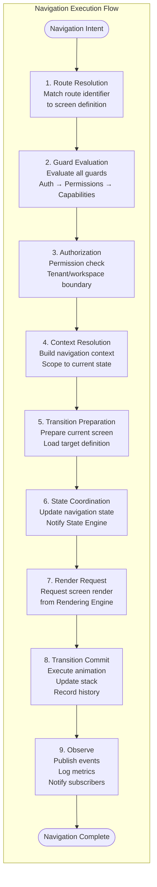

---

## 5. Runtime Responsibilities

### 5.1 Route Resolution

| Responsibility | Description |
|--------------|-------------|
| Route matching | Match route identifiers, screen names, and deep link URIs against registered navigation definitions |
| Contextual resolution | Resolve routes within the current Navigation Context — tenant, workspace, user, device |
| State-aware resolution | Resolve conditional routes based on current application state values |
| Capability-aware resolution | Verify that the target screen belongs to an active capability |
| Fallback resolution | Provide fallback routes when the primary route is unavailable — missing screen, permission denied |

### 5.2 Navigation Execution

| Responsibility | Description |
|--------------|-------------|
| Intent processing | Accept and validate Navigation Intents from all sources |
| Transition execution | Execute navigation transitions — push, pop, replace, reset, tab switch, modal present/dismiss |
| Atomic transitions | Ensure transitions are atomic — fully complete or fully roll back |
| Animation coordination | Coordinate transition animations through the Platform Adaptation Layer |
| Error handling | Handle transition failures with appropriate rollback or fallback |

### 5.3 Context Resolution

| Responsibility | Description |
|--------------|-------------|
| Context assembly | Assemble Navigation Context from Runtime context sources |
| Context scoping | Scope navigation operations to the current Organization, Tenant, Workspace, Application, Session |
| Context propagation | Propagate Navigation Context to downstream consumers — Rendering Engine, State Engine |
| Context invalidation | Detect context changes that invalidate current navigation state |

### 5.4 Stack Management

| Responsibility | Description |
|--------------|-------------|
| Stack creation | Create navigation stacks — root, modal, dialog, tab, workspace |
| Stack operations | Execute push, pop, replace, reset operations on navigation stacks |
| Stack nesting | Manage nested stacks within tabs, drawers, and modals |
| Stack isolation | Isolate stacks by workspace and modal boundary |
| Stack cleanup | Clean up stacks when their owning scope is disposed |

### 5.5 History Management

| Responsibility | Description |
|--------------|-------------|
| History recording | Record every navigation action in Navigation History |
| Forward/back navigation | Execute forward and backward navigation through history |
| Session restoration | Restore navigation state from persisted history on session resume |
| History persistence | Persist navigation history for cross-session restoration |
| Audit trail | Maintain an audit trail of navigation actions with timestamps and outcomes |

### 5.6 Guard Evaluation

| Responsibility | Description |
|--------------|-------------|
| Guard registration | Register navigation guards from Manifest definitions and capability contributions |
| Guard ordering | Execute guards in defined order — early-exit on first failure |
| Authentication checks | Verify user authentication state before guarded routes |
| Authorization checks | Evaluate permission rules against user context |
| Capability checks | Verify required capabilities are active |
| Feature flag checks | Evaluate feature flag conditions |
| Guard result handling | Block navigation with defined response on guard failure; allow on success |

### 5.7 Deep Link Processing

| Responsibility | Description |
|--------------|-------------|
| Link parsing | Parse deep link URIs into structured Navigation Intents |
| Source validation | Validate deep link source — origin, signature, trust level |
| Route resolution | Resolve deep link targets through the Route Resolver |
| Guard evaluation | Evaluate all guards for deep link navigation |
| Fallback handling | Handle unresolvable deep links with appropriate fallback — error screen, app store link |

### 5.8 QR Navigation

| Responsibility | Description |
|--------------|-------------|
| QR code parsing | Parse QR code content into navigation intent or discovery request |
| Tenant discovery | Discover target tenant from QR code — tenant identifier, domain, or configuration URI |
| Workspace resolution | Resolve target workspace from QR payload |
| Application resolution | Resolve target application within the workspace |
| Consent validation | Validate user consent for cross-tenant or workspace navigation |
| Runtime launch | If the target application is not running, coordinate launch through the Application Loader |

### 5.9 Navigation Recovery

| Responsibility | Description |
|--------------|-------------|
| Crash recovery | Restore navigation state after Runtime crash from persisted history |
| Session recovery | Restore navigation stack on session resume |
| Stack corruption recovery | Detect and repair corrupted navigation stacks — inconsistent state, orphaned entries |
| Transition failure recovery | Roll back to previous navigation state on failed transitions |
| Deep link deferred recovery | Process deferred deep links after recovery completes |

### 5.10 Runtime Observability

| Responsibility | Description |
|--------------|-------------|
| Event publishing | Publish navigation events for every significant operation |
| Metric collection | Collect navigation performance metrics — resolution time, transition duration |
| Diagnostic exposure | Expose navigation state — active stacks, current route, history — for debugging |
| User journey tracking | Correlate navigation events into user journey sequences |
| Error logging | Log all navigation failures with context for diagnostics |

---

## 6. Navigation Context

### 6.1 Context Model

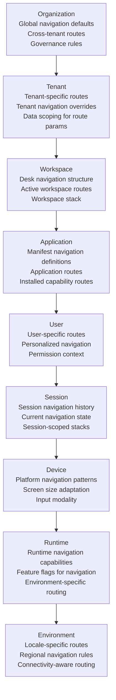

### 6.2 Context Resolution

| Context Level | Source | Affects | Resolution |
|--------------|--------|---------|------------|
| Organization | Runtime configuration | Cross-tenant route availability | Read once at initialization |
| Tenant | Authenticated tenant identity | Tenant-specific route overrides, screen availability | On tenant switch |
| Workspace | Active Desk selection | Available screens, workspace stacks | On workspace switch |
| Application | Manifest definition | All navigation structures | On application load |
| User | Authenticated user identity | Personalized routes, permission evaluation | On user change |
| Session | Session state | Current navigation state, history | Continuous |
| Device | Platform API | Navigation pattern selection, stack behavior | On device change |
| Runtime | Runtime configuration | Feature-gated navigation capabilities | On Runtime init |
| Environment | Runtime state | Locale-specific routes, offline mode | Continuous |

---

## 7. Navigation Lifecycle

### 7.1 Lifecycle Stages

```mermaid
flowchart TB
    INIT["1. Initialize\nCreate Navigation Engine\nEstablish context sources\nRegister route definitions"]
    INIT --> RESOLVE_CONTEXT
    
    RESOLVE_CONTEXT["2. Resolve Context\nAssemble Navigation Context\nfrom Runtime sources"]
    RESOLVE_CONTEXT --> RESOLVE_ROUTE
    
    RESOLVE_ROUTE["3. Resolve Route\nMatch navigation intent\nagainst route definitions\nApply contextual resolution"]
    RESOLVE_ROUTE --> EVALUATE_GUARDS
    
    EVALUATE_GUARDS["4. Evaluate Guards\nAuth → Permissions →\nCapabilities → Flags\nFail-fast on first rejection"]
    EVALUATE_GUARDS --> AUTHORIZE
    
    AUTHORIZE["5. Authorize\nFinal permission check\nTenant/workspace isolation\nCross-boundary validation"]
    AUTHORIZE --> PREPARE
    
    PREPARE["6. Prepare Transition\nPrepare current screen\nfor departure\nLoad target screen\ndefinition"]
    PREPARE --> LOAD_SCREEN
    
    LOAD_SCREEN["7. Load Screen\nRequest screen load\nfrom Rendering Pipeline\nResolve screen parameters"]
    LOAD_SCREEN --> UPDATE_STATE
    
    UPDATE_STATE["8. Update State\nPersist navigation state\nUpdate stack and history\nNotify State Engine"]
    UPDATE_STATE --> RENDER
    
    RENDER["9. Render\nRequest Rendering Engine\nto render target screen\nExecute transition animation"]
    RENDER --> OBSERVE
    
    OBSERVE["10. Observe\nPublish navigation event\nRecord metrics\nLog outcome"]
    OBSERVE --> COMPLETE
    
    COMPLETE(["11. Complete\nNavigation finished\nEngine ready for\nnext intent"])
```

### 7.2 Stage Descriptions

| Stage | Description | Entry Criteria | Exit Criteria | Failure Mode |
|-------|-------------|---------------|--------------|-------------|
| **Initialize** | Create Navigation Engine, register route definitions from Manifest, establish context sources | Runtime initialization signal | Engine ready for requests | Initialization failure → safe mode |
| **Resolve Context** | Assemble Navigation Context from Organization, Tenant, Workspace, User, Session, Device, Runtime, Environment | Navigation intent received | Context assembled | Partial context → degraded resolution |
| **Resolve Route** | Match intent target against registered routes considering context, state, and capabilities | Context resolved | Route matched or fallback | No match → navigation error |
| **Evaluate Guards** | Execute guard chain — authentication, authorization, capability, feature flags | Route resolved | All guards pass or first failure | Guard failure → blocked navigation |
| **Authorize** | Final permission check, tenant/workspace boundary validation | Guards passed | Authorization granted | Unauthorized → permission error |
| **Prepare Transition** | Prepare current screen for departure, preload target screen definition | Authorization granted | Prerequisites ready | Preparation failure → abort transition |
| **Load Screen** | Request screen load from Rendering Pipeline, resolve screen parameters | Transition prepared | Screen definition loaded | Screen load failure → fallback screen |
| **Update State** | Update Navigation State — stack, history, current route — through State Engine | Screen loaded | State updated | State update failure → rollback |
| **Render** | Request Rendering Engine to render target screen, execute transition animation | State updated | Screen rendered and visible | Render failure → error boundary |
| **Observe** | Publish navigation complete event, record metrics, log outcome | Screen rendered | Event published, metrics recorded | Observation failure → no impact |
| **Complete** | Navigation lifecycle complete, Engine ready for next intent | Observation complete | Engine ready | — |

---

## 8. Navigation Modes

### 8.1 Mode Definitions

| Mode | Trigger | Behavior | Stack Impact |
|------|---------|----------|-------------|
| **Standard** | User tap, programmatic navigate | Normal push, pop, replace, tab switch | Standard stack operations |
| **Deep Link** | External URI, universal link | Parse link, resolve route, evaluate guards, navigate | Push or reset depending on link type |
| **QR Navigation** | QR code scan | Parse code, discover tenant, resolve workspace, launch app | Reset to target route |
| **Notification Navigation** | Push notification tap | Parse notification payload, resolve target, navigate | Push or reset depending on payload |
| **Workflow Navigation** | Workflow step progression | Navigate to workflow-defined screen with parameters | Push (workflow steps) |
| **Recovery Navigation** | Crash or session recovery | Restore navigation state from persisted history | Reset to last known state |
| **Offline Navigation** | No network connectivity | Navigate using cached routes and screen definitions | Standard, with offline indicator |
| **Cross-Workspace Navigation** | Switch active Desk | Transition between workspace stacks, preserve workspace state | Reset to target workspace root |
| **Cross-Tenant Navigation** | Switch active tenant | Transition between tenant contexts, clear session state | Reset to target tenant root |

### 8.2 Mode Selection

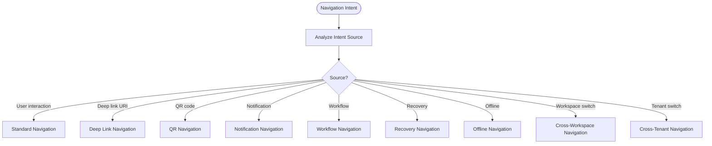

---

## 9. Navigation Resolution

### 9.1 Resolution Domains

| Domain | What Is Resolved | Source | Resolution Strategy |
|--------|-----------------|--------|-------------------|
| **Manifest** | Navigation definitions — routes, stacks, tabs, modals | Application Manifest | Parsed at initialization, cached for session |
| **Route** | Screen identifier from route name or URI | Manifest route definitions | Pattern match, contextual resolution, fallback |
| **Screen** | Screen definition for target route | Manifest Resolver, Screen Model | Load from cache or fetch from Manifest |
| **Capability** | Capability-provided routes and screens | Package Resolver | Registered at capability activation |
| **Permission** | Permission rules for target route | Manifest permission definitions | Evaluated by Permission Engine |
| **Theme** | Theme context for navigation chrome | Theme Engine | Token resolution for navigation UI |
| **State** | State-dependent route conditions | Runtime State Engine | State path lookup |

### 9.2 Resolution Order

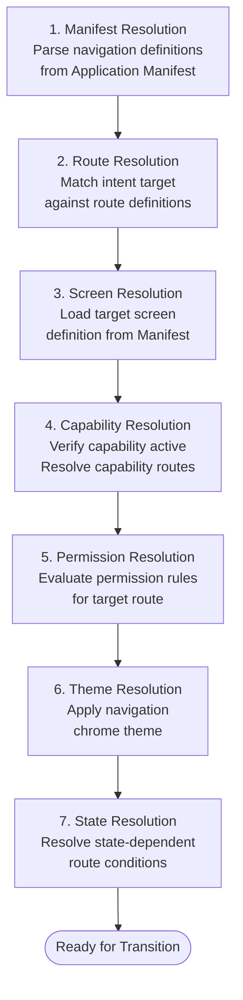

---

## 10. Navigation Guards

### 10.1 Guard Architecture

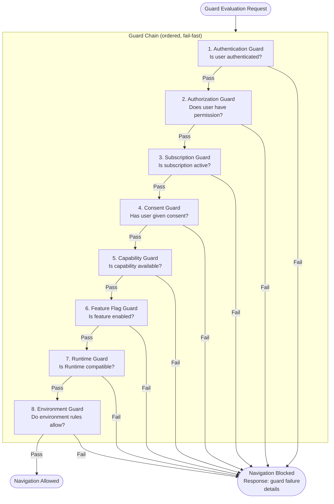

### 10.2 Guard Definitions

| Guard | Condition Checked | Failure Response | Source |
|-------|------------------|-----------------|--------|
| **Authentication** | Is the user authenticated? | Redirect to login | Manifest guard definition |
| **Authorization** | Does the user have the required role/permission? | Permission denied screen | Manifest permission rules |
| **Subscription** | Is the user's subscription active for this feature? | Subscription required screen | Manifest guard definition |
| **Consent** | Has the user given required consent? | Consent request dialog | Manifest guard definition |
| **Capability Availability** | Is the required capability active and installed? | Capability unavailable message | Capability declaration |
| **Feature Flag** | Is the feature flag enabled? | Feature unavailable (404-style) | Runtime feature flags |
| **Runtime Compatibility** | Is the Runtime version compatible with the target route? | Upgrade required screen | Manifest version constraints |
| **Environment Rules** | Do environment rules allow this navigation? | Blocked by policy message | Environment configuration |

### 10.3 Guard Ordering

Guards are executed in a defined order. The order ensures that cheaper checks (authentication) execute before more expensive checks (capability verification):

1. Authentication (cheapest — boolean check)
2. Runtime Compatibility (static — version comparison)
3. Feature Flag (static — flag lookup)
4. Authorization (moderate — permission evaluation)
5. Capability Availability (moderate — registry lookup)
6. Subscription (may require network)
7. Consent (may require user interaction)
8. Environment Rules (context-dependent)

---

## 11. Navigation Stack Management

### 11.1 Stack Model

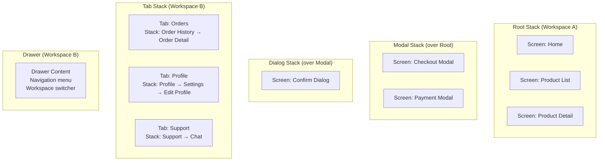

### 11.2 Stack Types

| Stack Type | Purpose | Lifetime | Operations | Isolation |
|-----------|---------|----------|------------|-----------|
| **Root Stack** | Primary navigation for a workspace | Workspace lifetime | Push, pop, replace, reset | Per workspace |
| **Nested Stack** | Sub-navigation within a tab or section | Tab/section lifetime | Push, pop | Within parent |
| **Modal Stack** | Full-screen modal presentation | Until dismissed | Present, dismiss | Separate from root |
| **Dialog Stack** | Lightweight dialog overlay | Until dismissed | Show, hide | Over modal or root |
| **Tab Stack** | Tab-based navigation with per-tab stacks | Tab navigation lifetime | Switch tab, per-tab push/pop | Per tab |
| **Drawer Navigation** | Side drawer with navigation options | Workspace lifetime | Open, close, select | Workspace-scoped |
| **Workspace Stack** | Workspace-level navigation root | Workspace lifetime | Workspace switch | Per workspace |

### 11.3 Stack Operations

| Operation | Description | Stack State Change |
|-----------|-------------|-------------------|
| **Push** | Navigate to a new screen, adding it to the stack | `[A, B] → [A, B, C]` |
| **Pop** | Return to the previous screen, removing the current | `[A, B, C] → [A, B]` |
| **PopToRoot** | Return to the first screen in the stack | `[A, B, C, D] → [A]` |
| **Replace** | Replace the current screen with a new one | `[A, B, C] → [A, B, D]` |
| **Reset** | Clear the stack and set a new root | `[A, B, C] → [D]` |
| **Present** | Present a modal on top of the current stack | `Root[A,B] + Modal[C]` |
| **Dismiss** | Dismiss the topmost modal | `Root[A,B] + Modal[C] → Root[A,B]` |
| **SwitchTab** | Switch active tab within a tab navigator | Active tab changes |
| **OpenDrawer** | Open the drawer overlay | Drawer visible |
| **CloseDrawer** | Close the drawer overlay | Drawer hidden |

### 11.4 Stack Isolation Rules

| Rule | Description |
|------|-------------|
| Workspace isolation | Each workspace has its own root stack. Workspace stacks are never mixed. |
| Modal isolation | Modal stacks are separate from root stacks. Modal operations do not affect root stack. |
| Tab isolation | Each tab maintains its own nested stack. Tab switches preserve per-tab stacks. |
| Workspace switch impact | Switching workspaces resets the root stack to the target workspace's root. |
| Modal dismissal | Dismissing a modal returns to the previous modal or the root stack. |

---

## 12. History Management

### 12.1 History Model

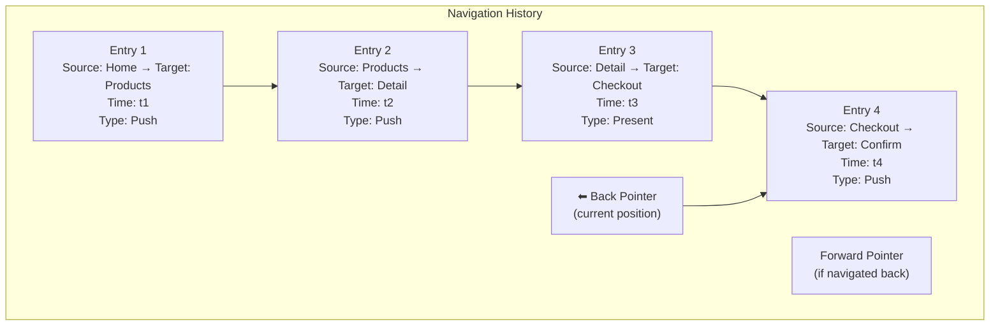

### 12.2 History Features

| Feature | Description | Implementation |
|---------|-------------|----------------|
| **Back navigation** | Navigate to the previous entry in the history | Pop current entry, navigate to previous |
| **Forward navigation** | Navigate forward through history after going back | Push from forward history |
| **History truncation** | Discard forward history on new navigation | Remove all entries after current position |
| **Session restoration** | Restore history on session resume | Persist history to local storage |
| **History limits** | Maximum history entries to prevent memory growth | Configurable max (default 100) |
| **Audit trail** | Immutable audit log of all navigation events | Separate from navigable history |

### 12.3 History Persistence

| Aspect | Behavior |
|--------|----------|
| What is persisted | Navigation stack state, current route, screen parameters |
| When persisted | On every navigation transition (debounced) |
| Where persisted | Runtime State Engine → Local Storage |
| Restoration timing | During Navigation Recovery (Stage 11 in lifecycle) |
| Clear condition | On logout, session timeout, or explicit clear action |

---

## 13. Deep Linking

### 13.1 Deep Link Types

| Link Type | Format | Source | Resolution |
|-----------|--------|--------|------------|
| **Universal Link** | `https://dukadesk.app/{tenant}/screen/{id}?params` | Browser, email, SMS | Direct route resolution |
| **Internal Link** | `dukadesk://{tenant}/{workspace}/{screen}?params` | App-to-app, notifications | Direct route resolution |
| **QR Link** | Encoded navigation intent or configuration URI | QR code scan | QR Navigation flow |
| **Notification Link** | Push notification payload with navigation target | Push notification | Parse payload, resolve route |
| **Marketplace Link** | `dukadesk://marketplace/{package}` | Marketplace listings | Resolve package, install, navigate |
| **Workspace Link** | `dukadesk://{tenant}/{workspace}/` | Shared workspace links | Resolve workspace, navigate to root |
| **Tenant Link** | `dukadesk://{tenant}/` | Tenant invitations | Resolve tenant, authenticate, navigate |

### 13.2 Deep Link Resolution

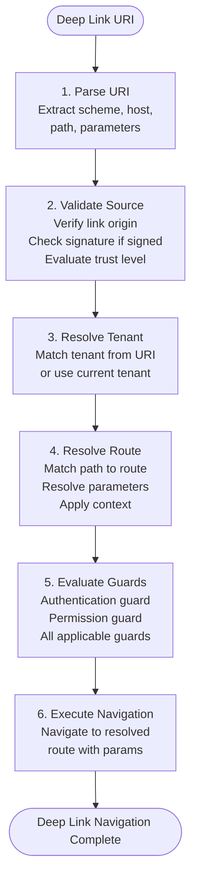

### 13.3 Deep Link Security

| Security Concern | Mitigation |
|-----------------|------------|
| Source validation | Verify link origin against allowed domains and app associations |
| Link tampering | Validate link signatures for signed deep links |
| Tenant mismatch | Block deep links that reference a tenant different from the current session |
| Unauthorized routes | Apply standard guard evaluation — deep links do not bypass guards |
| Parameter injection | Validate and sanitize all deep link parameters against schemas |

---

## 14. QR Navigation

### 14.1 QR Navigation Flow

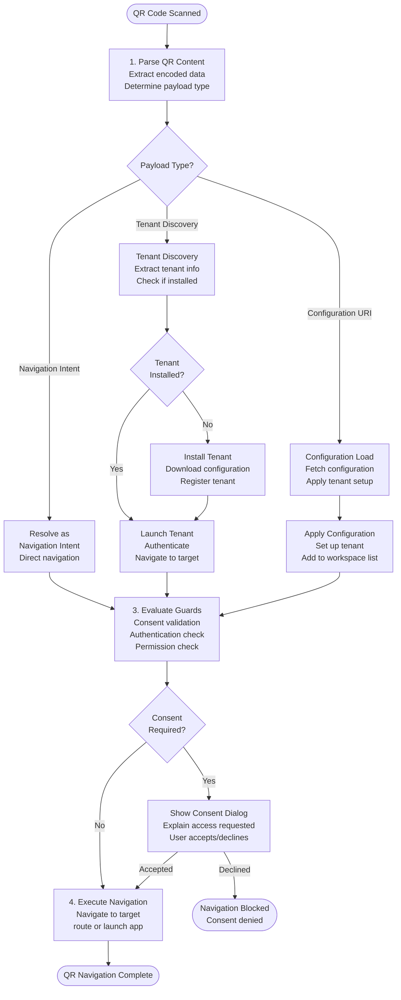

### 14.2 QR Payload Types

| Payload Type | Content | Example |
|-------------|---------|---------|
| Navigation Intent | Target route, parameters, workspace | `{type:"navigate", screen:"menu", params:{tableId:"42"}, workspace:"mk"}` |
| Tenant Discovery | Tenant identifier, display name, configuration URI | `{type:"tenant", id:"grace-pharmacy", name:"Grace Pharmacy", config:"https://..."}` |
| Configuration URI | URI to fetch tenant/workspace configuration | `{type:"config", uri:"https://dukadesk.app/config/tenant-xyz"}` |

---

## 15. Runtime Integration

### 15.1 Rendering Engine Integration (KB-052)

| Integration Point | Navigation Engine Action | Rendering Engine Response |
|------------------|-------------------------|--------------------------|
| Screen render request | Request rendering of target screen | Load screen, build render tree, mount |
| Transition animation | Coordinate animation parameters | Execute transition animation |
| Screen lifecycle | Trigger appear/disappear on stack operations | Handle screen lifecycle hooks |
| Screen parameters | Provide resolved screen parameters | Use parameters for data binding |

### 15.2 Rendering Pipeline Integration (KB-053)

| Pipeline Stage | Navigation Engine Role | Coordination |
|---------------|----------------------|--------------|
| Stage 6: Navigation Resolution | Resolve navigation structure, initial route | Before Screen Resolution |
| Stage 18: Interaction Loop | Handle navigation intents from user interaction | Continuous during interaction |
| Stage 19: Incremental Updates | Re-resolve navigation if state affects route resolution | During update cycle |

### 15.3 State Engine Integration (KB-055)

| Integration Point | Navigation Engine Action | State Engine Response |
|------------------|-------------------------|----------------------|
| Navigation state write | Write current route, stack, history to Navigation scope | Persist and synchronize navigation state |
| Navigation state read | Read current route and stack state | Return from Navigation scope |
| State-driven navigation | Subscribe to state changes for conditional routing | Notify on relevant state changes |
| Session restoration | Read persisted navigation state during recovery | Provide restored navigation state |

---

## 16. Identity Integration

### 16.1 Authentication

| Aspect | Behavior |
|--------|----------|
| Unauthenticated navigation | Routes with authentication guards redirect to login |
| Login flow | Navigation Engine navigates to login screen on authentication required |
| Post-login navigation | After successful authentication, navigate to the originally requested route |
| Logout | On logout, clear navigation state and navigate to login or home |
| Session expiry | On session expiry, show re-authentication dialog and preserve navigation stack |

### 16.2 Authorization

| Aspect | Behavior |
|--------|----------|
| Route authorization | Permission Engine evaluates route access for current user |
| Role-based routes | Some routes are only available to users with specific roles |
| Permission denial | Blocked navigation shows permission denied screen with explanation |
| Conditional visibility | Navigation elements (tabs, links) are conditionally visible based on permissions |

### 16.3 Consent

| Aspect | Behavior |
|--------|----------|
| Consent-gated navigation | Some routes require user consent before navigation |
| Consent dialogs | Navigation Engine triggers consent dialogs before navigating |
| Consent persistence | Once given, consent is cached for the session |
| Consent revocation | On consent revocation, navigate away from consent-dependent screens |

### 16.4 Sessions

| Aspect | Behavior |
|--------|----------|
| Session-bound navigation | Navigation state is scoped to the current session |
| Session restoration | On session resume, navigation state is restored from persistence |
| Multi-session | Multiple concurrent sessions maintain independent navigation states |

---

## 17. Subsystem Responsibilities

### 17.1 Builder Responsibilities

| Responsibility | Description |
|--------------|-------------|
| Navigation definition | Define complete navigation structure in the Manifest — routes, stacks, tabs, modals, drawers |
| Guard configuration | Declare navigation guards — authentication requirements, permission rules, capability dependencies |
| Deep link registration | Register deep link URI patterns and map them to navigation intents |
| Route parameter schemas | Define parameter schemas for all navigable routes |
| Fallback routes | Define fallback routes for unresolvable navigation targets |

### 17.2 Backend Responsibilities

| Responsibility | Description |
|--------------|-------------|
| Deep link delivery | Deliver deep links to the Runtime through push notifications, email, or SMS |
| QR code generation | Generate QR codes with navigation intents or tenant discovery payloads |
| Navigation state sync | Support synchronization of navigation state across devices (future) |
| Route availability | Report route availability changes (capability updates, feature flag changes) |

---

## 18. Security

### 18.1 Navigation Trust Boundaries

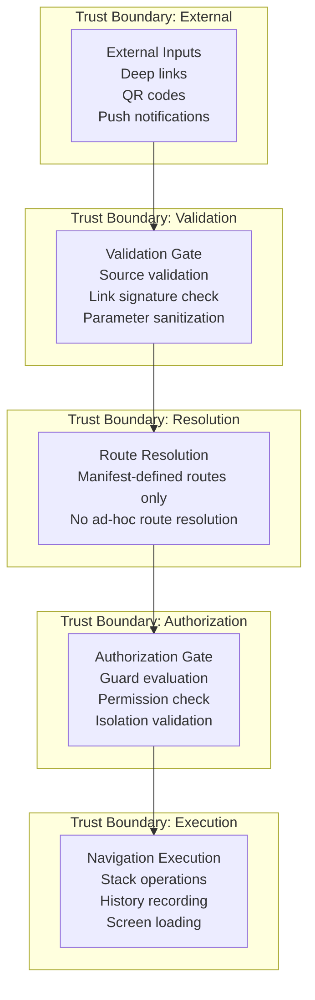

### 18.2 Route Authorization

| Rule | Description |
|------|-------------|
| Manifest-only routes | Routes must be declared in the Manifest. Ad-hoc routes are rejected. |
| Permission-gated navigation | Every route has an associated permission rule evaluated before navigation |
| Role-based access | Route availability may depend on user role |
| Capability-gated routes | Routes belonging to inactive capabilities are unavailable |

### 18.3 Tenant Isolation

| Rule | Description |
|------|-------------|
| Tenant-scoped routes | Routes are resolved within the current tenant context |
| Cross-tenant block | Navigation to another tenant's routes is blocked unless explicitly configured |
| Tenant switch | Cross-tenant navigation requires explicit tenant switch with authentication |

### 18.4 Workspace Isolation

| Rule | Description |
|------|-------------|
| Workspace-scoped stacks | Each workspace has its own navigation stacks |
| Cross-workspace gating | Navigation between workspaces requires explicit workspace switch |
| Workspace state preservation | Workspace navigation state is preserved on switch and restored on return |

### 18.5 Deep Link Validation

| Validation | Description |
|------------|-------------|
| Source origin | Verify the deep link origin against allowed domains and app associations |
| Link signature | Verify cryptographic signature for signed deep links |
| Parameter bounds | Validate parameter lengths, types, and values against schemas |
| Tenant match | Verify the deep link's tenant matches the current session or is explicitly switchable |

### 18.6 Navigation Replay Protection

| Protection | Description |
|------------|-------------|
| Intent nonce | Navigation intents may include a nonce to prevent replay |
| Timestamp validation | Deep links may include expiration timestamps |
| One-time navigation | Certain navigation intents (e.g., password reset) are one-time use |

---

## 19. Performance

### 19.1 Performance Targets

| Dimension | Target | Measurement |
|-----------|--------|-------------|
| Route resolution | < 10ms | From intent receipt to route match |
| Guard evaluation | < 20ms | Full guard chain execution |
| Screen load trigger | < 5ms | From guard pass to render request |
| Transition commit | < 16ms (60fps) | From render complete to visual transition |
| History recording | < 2ms | Per navigation entry |
| Deep link parsing | < 5ms | URI to structured intent |

### 19.2 Lazy Navigation

Routes and screens are loaded lazily:

| Strategy | Description |
|----------|-------------|
| Route definition lazy loading | Route definitions for deep-linkable screens are loaded on first navigation, not at startup |
| Screen lazy loading | Screen definitions are fetched when the route is resolved, not when the app starts |
| Capability route lazy loading | Capability-provided routes are registered when the capability is activated |

### 19.3 Stack Optimization

| Optimization | Description |
|--------------|-------------|
| Stack depth limits | Maximum stack depth configurable (default 20) to prevent memory growth |
| Stack pruning | Old stack entries may be pruned on memory pressure |
| Tab stack pooling | Tab stacks are created lazily on first tab selection |

### 19.4 History Management

| Strategy | Description |
|----------|-------------|
| Maximum entries | Configurable maximum history entries (default 100) |
| Truncation on push | Forward history truncated on new navigation |
| Persistence debounce | History persistence debounced to reduce write frequency |

### 19.5 Navigation Caching

| Cache | What Is Cached | Invalidation |
|-------|---------------|--------------|
| Route cache | Resolved route-to-screen mappings | On Manifest version change, capability change |
| Screen cache | Loaded screen definitions (shared with Rendering Engine) | On Manifest version change |
| Guard cache | Guard evaluation results (auth state, feature flags) | On context change (auth, flag change) |
| Deep link cache | Parsed deep link intents | After navigation execution |

### 19.6 Transition Scheduling

| Priority | Transition Type | Scheduling |
|----------|----------------|------------|
| Critical | User tap response | Immediate — within current frame |
| High | Deep link, notification navigation | Next frame |
| Normal | Programmatic navigation | Within 1-2 frames |
| Low | History back/fwd, recovery | At earliest opportunity |
| Background | History persistence | Idle scheduling |

---

## 20. Offline Behaviour

### 20.1 Offline Navigation

| Aspect | Behavior |
|--------|----------|
| Route resolution | Route definitions from cached Manifest — all previously routes available |
| Screen loading | Screen definitions from cache — previously loaded screens available |
| Navigation execution | Full navigation capability — push, pop, tab switch, modal — using cached definitions |
| Guard evaluation | Guards evaluated with cached state — auth cached, permissions cached |
| Deep links | Deep links parsed and queued for deferred resolution if target requires network |

### 20.2 Cached Routes

The Navigation Engine maintains a cache of route definitions:

| Cache Content | Source | Availability |
|--------------|--------|-------------|
| Manifest route definitions | Cached Manifest | Full offline availability |
| Screen definitions | Cached screen definitions | Previously accessed screens |
| Capability routes | Cached capability registrations | Previously activated capabilities |

### 20.3 Recovery Navigation

On recovery from offline to online:

1. **Deferred deep links processed** — Deep links received offline are resolved with fresh definitions.
2. **Route cache refreshed** — Route definitions are updated from the latest Manifest.
3. **Screen cache refreshed** — Screen definitions are updated.
4. **Navigation state preserved** — The navigation state from offline operation is preserved through the transition.

### 20.4 Deferred Deep Links

Deep links received while offline are queued for deferred processing:

| Aspect | Behavior |
|--------|----------|
| Queueing | Deep links are parsed and stored in a deferred queue |
| Persistence | The deferred queue is persisted for crash recovery |
| Processing | On connectivity restoration, deferred deep links are resolved and executed |
| Ordering | Deferred deep links are processed in reception order |
| Expiration | Deep links with timestamps are checked for expiration before processing |

---

## 21. Observability

### 21.1 Navigation Metrics

| Metric | Type | Source | Aggregation |
|--------|------|--------|-------------|
| `navigation.intent.count` | Counter | Navigation intent received | Rate, total |
| `navigation.transition.count` | Counter | Transition executed | Rate, by type |
| `navigation.transition.duration` | Timer | Transition execution | Avg, p95, p99 |
| `navigation.route.resolve.duration` | Timer | Route resolution | Avg, p95, p99 |
| `navigation.guard.evaluation.duration` | Timer | Full guard chain | Avg, p95, p99 |
| `navigation.guard.failure.count` | Counter | Guard failures | Rate, by guard type |
| `navigation.stack.depth` | Gauge | Current stack depth | Current |

### 21.2 Transition Metrics

| Metric | Description |
|--------|-------------|
| `transition.{type}.count` | Count by transition type (push, pop, present, dismiss) |
| `transition.{type}.duration` | Duration by transition type |
| `transition.success.count` | Successful transitions |
| `transition.failure.count` | Failed transitions |
| `transition.failure.reason` | Failure reason distribution |

### 21.3 Resolution Metrics

| Metric | Description |
|--------|-------------|
| `resolve.route.match.count` | Successful route matches |
| `resolve.route.fallback.count` | Fallback route usage |
| `resolve.route.miss.count` | Route not found |
| `resolve.screen.load.count` | Screen definition loads |
| `resolve.capability.route.count` | Capability-provided route resolutions |

### 21.4 Guard Metrics

| Metric | Description |
|--------|-------------|
| `guard.{type}.evaluation.count` | Evaluations per guard type |
| `guard.{type}.pass.count` | Passes per guard type |
| `guard.{type}.fail.count` | Failures per guard type |
| `guard.chain.total.duration` | Total guard chain duration |

### 21.5 User Journey Correlation

Navigation events carry correlation IDs that enable user journey tracking:

| Correlation | Scope | Propagation |
|-------------|-------|-------------|
| Navigation session ID | Entire navigation session | All navigation events |
| User journey ID | Related sequence of navigation actions | Across navigation and business events |
| Intent correlation ID | Single navigation intent → completion | Through all lifecycle stages |

---

## 22. Failure Scenarios

| Scenario | Stage | Cause | Detection | Response | Recovery |
|----------|-------|-------|-----------|----------|----------|
| Invalid Route | Route Resolution | Route identifier not in Manifest definitions | Route match fails | Return navigation error with available routes | Navigate to fallback route |
| Missing Screen | Screen Resolution | Screen definition not found for resolved route | Screen fetch fails | Return screen load error | Navigate to error screen |
| Unauthorized Navigation | Guard Evaluation | User lacks required permission | Guard failure | Block navigation; show permission error | Redirect to accessible route |
| Invalid Deep Link | Deep Link Processing | Malformed URI, unknown scheme, invalid parameters | Parse or validation fails | Return deep link error | Fallback to app home |
| Broken QR Link | QR Navigation | QR content cannot be decoded or resolved | Decode or resolution fails | Return QR error with diagnostic | Show error message with retry |
| Missing Capability | Route Resolution | Route belongs to an inactive capability | Capability check fails | Return capability error | Navigate within active capabilities |
| Corrupted Navigation State | Recovery | Persisted state fails integrity check | State validation fails | Reinitialize navigation state | Start from default route |
| Failed Recovery | Navigation Recovery | Recovery strategy cannot restore state | Recovery execution fails | Fall back to initial route | Log detailed error for diagnostics |
| Stack overflow | Stack Management | Stack depth exceeds maximum | Depth check on push | Block push operation | Suggest navigation pattern change |
| Transition timeout | Transition Execution | Animation or screen load exceeds timeout | Timer expiration | Cancel transition; restore previous state | Log timeout; reset navigation state |

---

## 23. Anti-Patterns

| Anti-Pattern | Description | Consequence | Correct Approach |
|-------------|-------------|-------------|-----------------|
| Hardcoded navigation | Direct screen references in component code without going through Navigation Engine | Bypasses guards, breaks Manifest-driven model | Always navigate through Navigation Intents |
| Platform-specific routing | Navigation logic that depends on platform routing APIs (React Navigation, UIKit) | Breaks cross-platform consistency | Abstract behind Platform Adaptation Layer |
| Bypassing guards | Navigating to screens without guard evaluation | Security vulnerabilities, unauthorized access | Every navigation passes through guard chain |
| Direct screen references | Components referencing screen identifiers directly | Tight coupling, hard to refactor | Navigation Intents with route identifiers |
| Mutable navigation stacks | Direct stack manipulation outside Navigation Engine | Inconsistent state, orphaned entries | All stack operations through Stack Manager |
| Business logic in navigation engine | Implementing business rules in navigation guard or transition code | Violates separation of concerns | Business logic in capabilities and services |
| Over-nesting stacks | Excessive stack nesting (stacks within stacks within stacks) | Complex state management, poor UX | Limit to 2-3 levels of nesting |
| Deep link overprivilege | Deep links bypassing normal security checks | Security vulnerabilities | Deep links undergo same guard evaluation |
| Missing offline handling | Navigation failing when offline | Broken UX, user frustration | Offline navigation with cached definitions |

---

## 24. Future Evolution

### 24.1 AI-Assisted Navigation

- **Predictive routing** — AI predicts the user's next navigation target and preloads the screen.
- **Intelligent journey optimization** — AI suggests navigation shortcuts based on usage patterns.
- **Anomaly detection** — AI detects unusual navigation patterns that may indicate issues.

### 24.2 Predictive Routing

The Navigation Engine may predictively resolve and prepare routes:

- **Navigation prediction** — Based on current context and user behavior, predict the next navigation intent.
- **Pre-emptive guard evaluation** — Evaluate guards for predicted routes before the intent is received.
- **Screen preloading** — Request screen definition loading for predicted routes.

### 24.3 Multi-Device Navigation Continuity

- **Cross-device state sync** — Navigation state synchronized across a user's devices.
- **Seamless handoff** — User can continue navigation from one device to another.
- **Unified history** — Navigation history shared across devices.

### 24.4 Federated Navigation

- **Cross-application navigation** — Navigate between applications within the DUKADESK ecosystem.
- **Shared navigation context** — Navigation context shared across application boundaries.
- **Federated route resolution** — Route resolution across multiple application registries.

### 24.5 Adaptive User Journeys

- **Role-adaptive navigation** — Navigation structure adapts to user role.
- **Context-adaptive routing** — Routes adapt to current context (location, time, activity).
- **Personalized navigation** — Navigation structure personalized based on user preferences and behavior.

### 24.6 Context-Aware Routing

- **Location-aware routes** — Routes change based on user location.
- **Time-aware navigation** — Time-sensitive routes (operating hours, appointment times).
- **Activity-aware routing** — Routes adapt to current user activity (ordering, browsing, managing).

---

## 25. Cross-References

| Reference | Description |
|-----------|-------------|
| KB-044 | Navigation Architecture — the Navigation Model that the Runtime Navigation Engine executes |
| KB-045 | Screen Model — screen definitions that navigation resolves to |
| KB-047 | Action & Event Model — navigation actions and navigation events |
| KB-048 | Application State Model — state model consumed for state-driven navigation |
| KB-051 | Runtime Architecture Overview — foundational Runtime architecture |
| KB-052 | Rendering Engine Architecture — the engine that renders screens after navigation |
| KB-053 | Rendering Pipeline Architecture — the pipeline within which navigation resolution executes |
| KB-055 | Runtime State Engine Architecture — the state engine that maintains navigation state |
| KB-041 | Application Architecture Overview — application architecture context |
| KB-042 | Application Manifest Specification — Manifest that contains navigation definitions |
| KB-043 | Workspace & Tenant Model — workspace and tenant contexts for navigation |
| KB-046 | Component Tree Model — component hierarchy navigated to |
| KB-049 | Theme & Design Token Model — theme applied to navigation chrome |
| KB-050 | Capability Composition Model — capabilities that provide routes |
| KB-057 | Runtime Security Architecture — security model for navigation guards |
| KB-058 | Runtime Caching & Synchronization — caching for offline navigation |
| KB-059 | Runtime Security & Isolation — isolation for tenant/workspace navigation |
| KB-060 | Runtime Observability & Diagnostics — observability for navigation metrics |
| Workflow Builder | Workflow Builder Architecture — workflows that drive navigation |

---

## 26. Open Questions

1. Should the Navigation Engine support parallel navigation stacks for split-screen or multi-window scenarios?
2. What is the optimal history retention strategy — time-based, count-based, or hybrid?
3. Should deep link expiration be enforced by the Navigation Engine or delegated to the source system?
4. How should navigation conflicts be handled when multiple navigation intents arrive simultaneously?
5. Should the Navigation Engine support navigation macros — sequences of navigation actions executed as a unit?
6. What is the appropriate strategy for cross-application deep linking within the DUKADESK ecosystem?
7. Should QR navigation support signed QR codes to prevent tampering?
