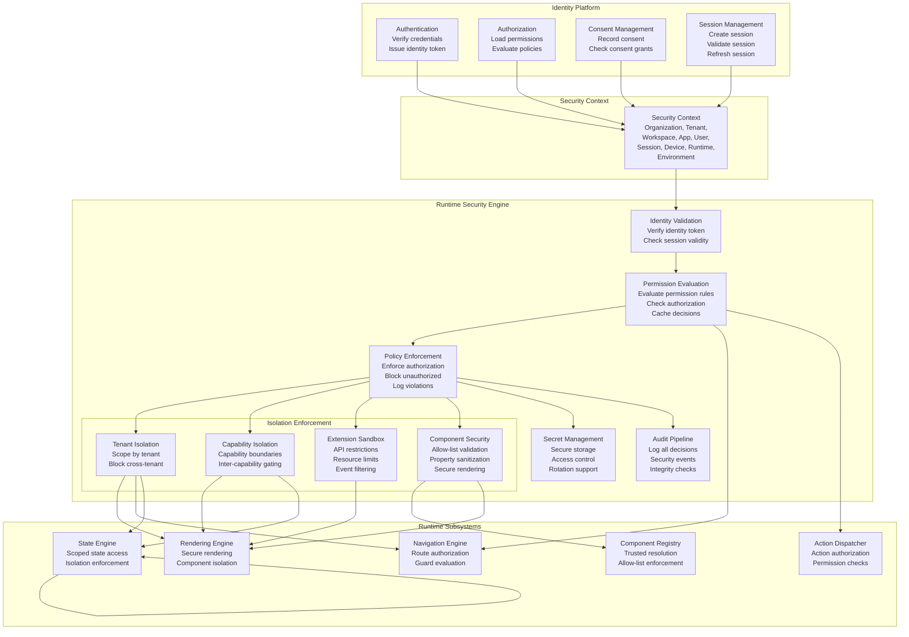
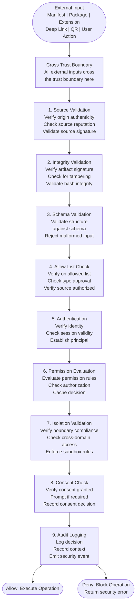
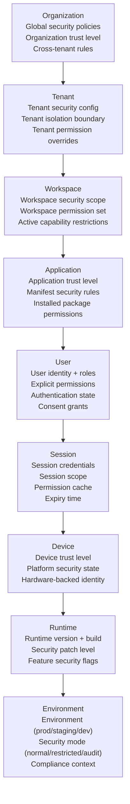
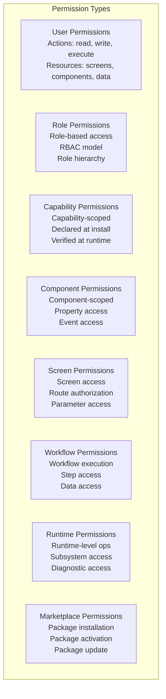
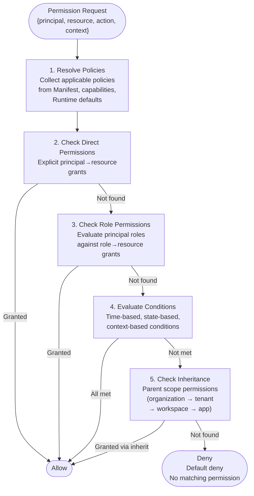
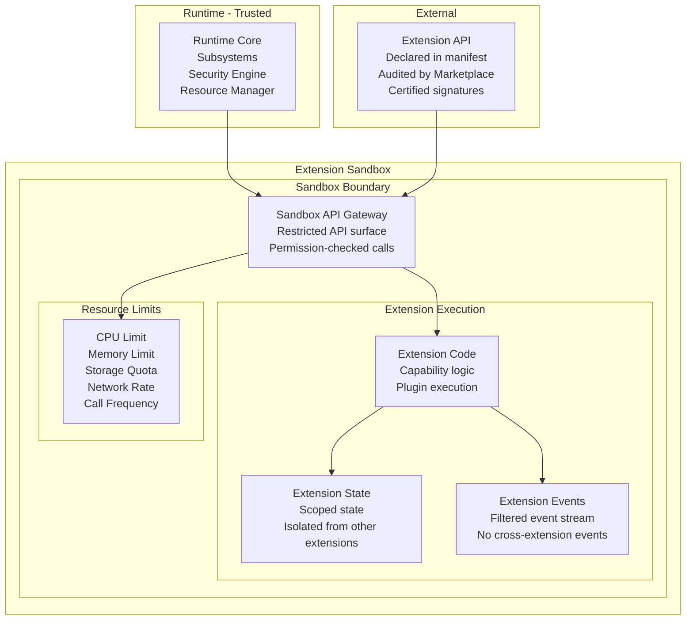
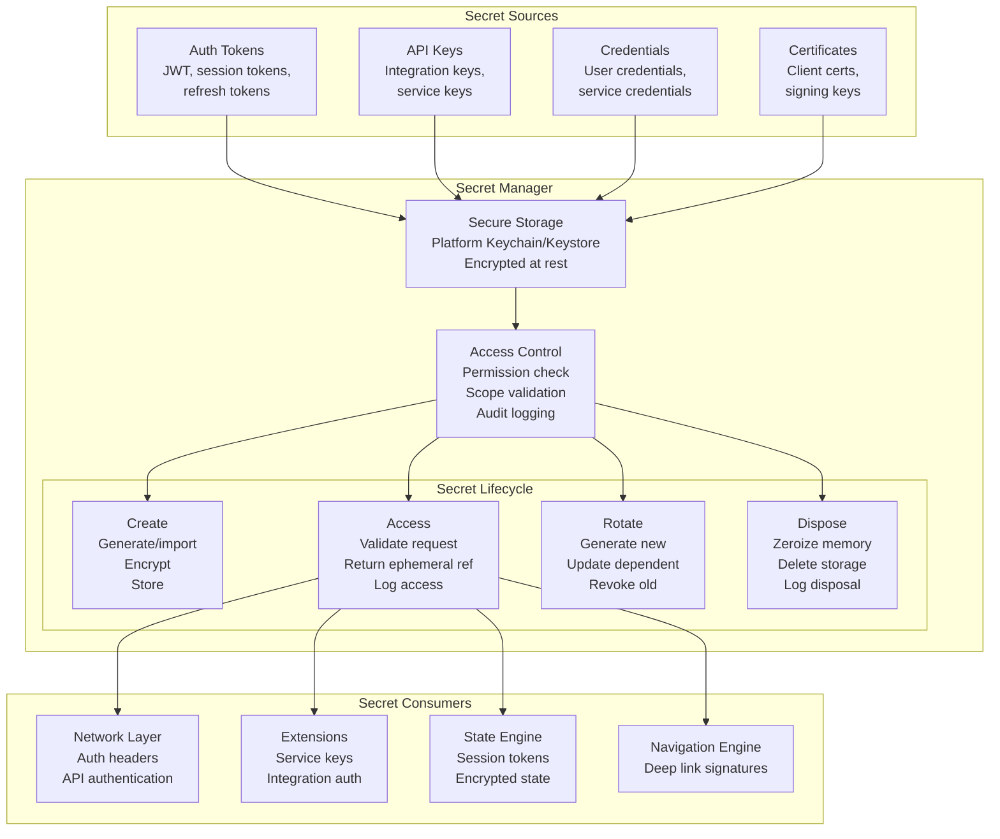

# Runtime Security Architecture

**KB-057 — Runtime Security Architecture Specification**

| Metadata | |
|----------|---|
| **KB ID** | KB-057 |
| **Title** | Runtime Security Architecture |
| **Version** | 0.1.0 |
| **Status** | Draft |
| **Owner** | Architecture Team |
| **Suite** | Runtime & Rendering Architecture |
| **Dependencies** | KB-051 Runtime Architecture Overview, KB-052 Rendering Engine Architecture, KB-053 Rendering Pipeline Architecture, KB-055 Runtime State Engine Architecture, KB-056 Runtime Navigation Engine Architecture, KB-034 Extension & Plugin Framework, KB-039 Marketplace Certification & Trust, KB-046 Component Tree Model, KB-047 Action & Event Model, KB-048 Application State Model, KB-050 Capability Composition Model, KB-054 Runtime Component Registry Architecture |
| **Related Documents** | KB-041 Application Architecture Overview, KB-042 Application Manifest Specification, KB-043 Workspace & Tenant Model, KB-044 Navigation Architecture, KB-045 Screen Model, KB-049 Theme & Design Token Model, KB-058 Runtime Observability & Diagnostics Architecture, KB-059 Runtime Caching & Synchronization, KB-060 Runtime Security & Isolation |
| **Review Status** | Pending |
| **Last Updated** | 2026-07-11 |

---

### Revision History

| Version | Date | Author | Change |
|---------|------|--------|--------|
| 0.1.0 | 2026-07-11 | AI Architecture Agent | Initial draft |

---

## 1. Executive Summary

### 1.1 Purpose

This document defines the Runtime Security Architecture for the DUKADESK platform. It establishes the trust model, execution boundaries, identity propagation, authorization model, secure rendering, capability isolation, extension sandboxing, tenant isolation, secrets handling, and runtime protection mechanisms that govern every DUKADESK Runtime — Mobile, Web, Desktop, Preview, Builder, and SDK.

Security is not a layer or a service within the Runtime — it is a cross-cutting architectural concern embedded in every subsystem. The Rendering Engine, Navigation Engine, State Engine, Component Registry, Extension Framework, Action Dispatcher, and Event Bus all operate under the security model defined in this document. Every definition, every component, every capability, every extension, and every user interaction is subject to security validation.

This specification governs all runtimes. It is platform-independent, runtime-independent, and implementation-independent.

### 1.2 Scope

**In scope:**

- Security principles: Zero Trust, Least Privilege, Default Deny, Defense in Depth, Explicit Consent, Tenant Isolation, Workspace Isolation, Capability Isolation, Extension Sandboxing, Immutable Runtime Definitions, Secure by Default, Privacy by Design
- Canonical definitions: Runtime Trust Boundary, Security Context, Security Principal, Runtime Identity, Runtime Session, Permission, Authorization Policy, Capability Permission, Sandbox, Secure Execution Context, Security Domain
- Runtime Trust Architecture: from Identity Platform through Runtime Engine
- Runtime responsibilities: identity validation, session validation, permission evaluation, policy enforcement, capability authorization, component authorization, extension authorization, secure rendering, runtime isolation, secret protection
- Security Context: Organization, Tenant, Workspace, Application, User, Session, Device, Runtime, Environment
- Authorization Model: user, role, capability, component, screen, workflow, runtime, marketplace permissions
- Runtime Isolation: organizations, tenants, applications, workspaces, sessions, components, capabilities, extensions
- Extension Sandboxing: execution isolation, API boundaries, resource limits, event boundaries, permission escalation prevention
- Capability Security: capability trust, permissions, runtime verification, dependency validation
- Component Security: component trust, validation, secure rendering, trusted registry resolution
- Secret Management: runtime secrets, integration secrets, temporary credentials, secret scope, rotation, secure disposal
- Identity integration: authentication, authorization, consent, session management, identity propagation
- Responsibilities: Runtime, Builder, Backend, Marketplace
- Security Observability: audit logs, security metrics, permission decisions, threat detection, policy violations, runtime integrity
- Performance: authorization latency, policy evaluation, permission caching, secure rendering, sandbox
- Offline behavior: offline authorization, cached policies, cached permissions, consent persistence, secure recovery
- Failure scenarios and anti-patterns
- Future evolution

**Out of scope:**

- Implementation details: specific cryptographic algorithms, security libraries, key management infrastructure
- Identity Platform implementation (handled by Identity Architecture Suite)
- Marketplace certification details (handled by KB-039)
- Extension framework implementation (handled by KB-034)
- Network security — TLS, certificate pinning (handled by Network Layer)
- Platform-specific security features (handled by Platform Adaptation Layer)

---

## 2. Security Principles

### 2.1 Zero Trust

No principle, component, capability, extension, or user is implicitly trusted. Every entity is authenticated, authorized, and validated for every operation — regardless of its origin, source, or relationship to the Runtime. Trust is never assumed; it is always verified.

### 2.2 Least Privilege

Every entity — component, capability, extension, user — operates with the minimum set of permissions required to perform its function. Permissions are granted explicitly and narrowly. No entity receives broad or excessive permissions.

### 2.3 Default Deny

All operations are denied by default. Access to screens, components, data, actions, events, and services must be explicitly granted through permission rules. There is no implicit access. Denial is the baseline; permission is the exception.

### 2.4 Defense in Depth

Security is enforced at multiple layers. If one security control is bypassed, additional controls at deeper layers prevent compromise. The Runtime enforces security at the definition boundary, resolution boundary, rendering boundary, execution boundary, and data boundary.

### 2.5 Explicit Consent

Operations that involve user data, device capabilities, or cross-boundary access require explicit user consent. Consent is obtained through clear, contextual dialogs. Consent can be revoked. Consent is never assumed or inferred.

### 2.6 Tenant Isolation

Each tenant operates within a strict isolation boundary. No tenant can access another tenant's data, components, configuration, or rendered output. Tenant isolation is enforced at every layer — storage, state, rendering, networking, and extensions.

### 2.7 Workspace Isolation

Each workspace (Desk) operates within a defined isolation boundary. Workspaces within the same tenant are isolated from each other. Cross-workspace access requires explicit authorization.

### 2.8 Capability Isolation

Each capability operates within a defined isolation boundary. Capabilities cannot access each other's state, components, or data without explicit inter-capability contracts declared in the Manifest.

### 2.9 Extension Sandboxing

Extensions — capabilities, plugins, packages — execute within sandboxed environments. Sandboxes restrict API access, resource consumption, event visibility, and cross-extension communication. Extensions cannot escape their sandbox.

### 2.10 Immutable Runtime Definitions

Application definitions — Manifests, screen definitions, component configurations, navigation structures, permission rules — are immutable during a Runtime session. Definitions cannot be modified at runtime. Immutability prevents definition-based attacks and ensures deterministic security evaluation.

### 2.11 Secure by Default

Security controls are enabled by default. Opt-out is not permitted for critical controls — tenant isolation, capability isolation, component validation, permission evaluation, audit logging. Secure defaults protect against misconfiguration.

### 2.12 Privacy by Design

Personal data collection, processing, and storage are minimized by default. The Runtime does not collect, log, or transmit personal data unless explicitly configured and consented. Data minimization is enforced at the architectural level.

---

## 3. Canonical Definitions

### 3.1 Runtime Trust Boundary

The logical boundary separating trusted Runtime execution from untrusted external inputs. Every external input — Manifest, package, extension, deep link, QR code — crosses a trust boundary and undergoes validation, authentication, and authorization before it is admitted into the trusted Runtime environment.

### 3.2 Security Context

The composite security context within which all Runtime operations are evaluated. Security Context carries Organization, Tenant, Workspace, Application, User, Session, Device, Runtime, and Environment security attributes. Permission evaluation, isolation enforcement, and authorization decisions are scoped to the current Security Context.

### 3.3 Security Principal

An entity that can be authenticated and authorized within the Runtime. Principals include users, capabilities, extensions, components, and the Runtime itself. Every principal has a unique identity, a set of permissions, and a defined trust level.

### 3.4 Runtime Identity

The unique identity of the Runtime instance itself. Runtime Identity includes the Runtime version, build signature, platform type, and installation identifier. Runtime Identity is verified during Manifest loading, package activation, and secure communication with backend services.

### 3.5 Runtime Session

An authenticated, authorized period of Runtime execution for a specific user, tenant, and application. The Runtime Session carries session credentials, permission snapshots, consent grants, and security state. Session validity is verified on every security-sensitive operation.

### 3.6 Permission

An authorization grant that allows a Security Principal to perform a specific operation on a specific resource. Permissions are granular — read screen A, execute action B, access component C — never broad. Permissions are evaluated by the Permission Engine during every operation.

### 3.7 Authorization Policy

A declarative rule set that defines which principals have which permissions under which conditions. Policies are defined in the Manifest, contributed by capabilities, and evaluated by the Permission Engine. Policies support conditions — time-based, state-based, context-based.

### 3.8 Capability Permission

A permission grant declared by a capability for its components, screens, actions, and data. Capability permissions are verified at installation time and enforced at runtime. Capabilities cannot access resources they have not declared.

### 3.9 Sandbox

A restricted execution environment for extensions, capabilities, and untrusted components. The sandbox enforces API access controls, resource limits, event filtering, and cross-boundary communication restrictions. Sandbox violations are detected and blocked.

### 3.10 Secure Execution Context

An execution context that has passed all security validations — source verification, signature validation, allow-list check, permission evaluation — and is authorized to perform operations within its scope. All Runtime subsystems operate within Secure Execution Contexts.

### 3.11 Security Domain

A logical grouping of resources, principals, and policies under a single security administration boundary. Security Domains include Organization, Tenant, Workspace, and Application. Cross-domain access requires explicit domain-bridging authorization.

---

## 4. Runtime Trust Architecture

### 4.1 Architecture Overview



### 4.2 Security Flow



---

## 5. Runtime Responsibilities

### 5.1 Identity Validation

| Responsibility | Description |
|--------------|-------------|
| Token verification | Verify identity tokens — JWT validation, signature check, expiration check |
| Principal establishment | Establish Security Principal from verified identity — user, capability, extension |
| Anonymous identity | Establish anonymous principal when no authenticated user — limited permissions |
| Identity caching | Cache verified identity for session duration to avoid repeated verification |

### 5.2 Session Validation

| Responsibility | Description |
|--------------|-------------|
| Session creation | Create Runtime Session on successful authentication with credentials and scope |
| Session verification | Verify session validity on every security-sensitive operation |
| Session expiry | Detect expired sessions and trigger re-authentication |
| Session refresh | Support session refresh through refresh tokens or re-authentication |

### 5.3 Permission Evaluation

| Responsibility | Description |
|--------------|-------------|
| Rule evaluation | Evaluate permission rules against Security Context for every operation |
| Policy resolution | Resolve applicable policies from Manifest and capability contributions |
| Conditional evaluation | Evaluate conditional permissions — time-based, state-based, context-based |
| Decision caching | Cache permission decisions for session duration to optimize performance |
| Delegation support | Support delegated permission evaluation to capability-specific evaluators |

### 5.4 Policy Enforcement

| Responsibility | Description |
|--------------|-------------|
| Authorization gating | Gate every security-sensitive operation behind permission evaluation |
| Default denial | Deny by default — if no explicit permission grant, operation is blocked |
| Enforcement logging | Log all enforcement decisions — allowed and denied |
| Violation response | On policy violation, block operation and provide appropriate feedback |
| Emergency override | Support emergency policy override for critical operations (audit-logged) |

### 5.5 Capability Authorization

| Responsibility | Description |
|--------------|-------------|
| Capability verification | Verify capability identity and integrity on activation |
| Permission scoping | Scope capability permissions to declared resource set |
| Cross-capability gating | Gate cross-capability access through explicit inter-capability contracts |
| Capability revocation | Support capability permission revocation on capability deactivation |

### 5.6 Component Authorization

| Responsibility | Description |
|--------------|-------------|
| Allow-list enforcement | Verify every component reference is on the Component Registry allow-list |
| Source verification | Verify component source — platform, capability, extension, Marketplace |
| Property validation | Validate component properties against schema before rendering |
| Secure rendering | Ensure components render within their security boundary |

### 5.7 Extension Authorization

| Responsibility | Description |
|--------------|-------------|
| Extension identity | Verify extension identity and signature on activation |
| Sandbox assignment | Assign extension to appropriate sandbox with defined limits |
| API restriction | Restrict extension API access to declared capabilities |
| Resource limitation | Enforce resource limits — memory, CPU, storage, network |
| Permission escalation prevention | Block attempts to escalate permissions beyond declared grants |

### 5.8 Secure Rendering

| Responsibility | Description |
|--------------|-------------|
| Definition validation | Validate every definition before rendering — schema, allow-list, permissions |
| Component isolation | Isolate rendered components from each other and from Runtime internals |
| Data binding security | Ensure data bindings only access authorized state paths |
| Action binding security | Ensure action bindings only trigger authorized action types |
| Render-time permission check | Re-validate permissions at render time for dynamic conditions |

### 5.9 Runtime Isolation

| Responsibility | Description |
|--------------|-------------|
| Tenant isolation | Enforce tenant boundaries across all Runtime subsystems |
| Workspace isolation | Enforce workspace boundaries within a tenant |
| Session isolation | Enforce session boundaries — one session cannot access another's state |
| Extension isolation | Enforce sandbox boundaries for all extensions |

### 5.10 Secret Protection

| Responsibility | Description |
|--------------|-------------|
| Secure storage | Store secrets in platform-provided secure storage — Keychain, KeyStore, Credential Manager |
| Access control | Gate secret access behind explicit permission checks |
| Scope restriction | Scope secret access to authorized principals only |
| Ephemeral references | Provide ephemeral references to secrets instead of raw values |
| Secure disposal | Clear secret references on session end or explicit revocation |

---

## 6. Security Context

### 6.1 Context Model



### 6.2 Security Attributes

| Context Level | Security Attributes | Source | Immutability |
|--------------|-------------------|--------|-------------|
| Organization | Trust level, allowed authentication methods, global policy version | Runtime configuration | Runtime session |
| Tenant | Tenant trust level, isolation mode, permission overrides | Tenant configuration | Session |
| Workspace | Workspace security scope, capability restrictions | Workspace config | Session |
| Application | Application signature, trust verification, Manifest security version | Manifest | Session |
| User | User ID, roles, explicit permissions, authentication method, MFA status | Identity Platform | Changes on auth |
| Session | Session token, scope, creation time, expiry time, refresh token | Session Manager | Session duration |
| Device | Device ID, platform security state, rooted/jailbroken status, biometric capability | Platform API | Runtime session |
| Runtime | Runtime version, build hash, security patch level, feature flags | Runtime metadata | Runtime session |
| Environment | Environment name, security mode, compliance context | Runtime config | Runtime session |

---

## 7. Authorization Model

### 7.1 Permission Types



### 7.2 Permission Structure

Every permission has a consistent structure:

```
Permission {
  principal: SecurityPrincipal    // Who is being authorized
  resource: SecurityResource      // What is being accessed
  action: SecurityAction          // What operation is being performed
  conditions: SecurityCondition[] // When is this permission valid
  granted: boolean                // Is this permission granted
  source: PermissionSource        // Where this permission was defined
}
```

### 7.3 Permission Evaluation



### 7.4 Permission Sources

| Source | Priority | Content | Lifetime |
|--------|----------|---------|----------|
| Manifest | Highest | Application-defined permission rules | Session |
| Capability | High | Capability-declared permission grants | Capability active |
| Organization | Medium | Organization-wide policy defaults | Session |
| Tenant | Medium | Tenant-specific permission overrides | Session |
| Platform | Low | Platform-default permission baselines | Runtime |

---

## 8. Runtime Isolation

### 8.1 Isolation Boundaries

```mermaid
flowchart TB
    subgraph "Organization A"
        subgraph "Tenant A1"
            subgraph "Workspace A1-W1"
                subgraph "Session S1"
                    C1["Component A"]
                    C2["Component B"]
                end
                subgraph "Capability Cap-X"
                    C3["Component C"]
                    C4["Component D"]
                end
            end
            
            subgraph "Workspace A1-W2"
                S2["Session S2"]
            end
        end
        
        subgraph "Tenant A2"
            subgraph "Extension Ext-Y"
                C5["Component E"]
            end
        end
    end
    
    subgraph "Organization B"
        TENANT_B["Tenant B1"]
    end
    
    ISO_ORG["╌╌╌ Organization Isolation ╌╌╌"]
    ISO_TENANT["╌╌╌ Tenant Isolation ╌╌╌"]
    ISO_WS["╌╌╌ Workspace Isolation ╌╌╌"]
    ISO_SESSION["╌╌╌ Session Isolation ╌╌╌"]
    ISO_CAP["╌╌╌ Capability Isolation ╌╌╌"]
    ISO_EXT["╌╌╌ Extension Sandbox ╌╌╌"]
    
    Organization A --- ISO_ORG
    ISO_ORG --- Organization B
    
    Tenant A1 --- ISO_TENANT
    ISO_TENANT --- Tenant A2
    
    Workspace A1-W1 --- ISO_WS
    ISO_WS --- Workspace A1-W2
    
    Session S1 --- ISO_SESSION
    ISO_SESSION --- Capability Cap-X
    ISO_SESSION --- S2
    
    Capability Cap-X --- ISO_CAP
    
    Extension Ext-Y --- ISO_EXT
```

### 8.2 Isolation Enforcement

| Boundary | Enforcement Mechanism | Cross-Boundary Access | Violation Consequence |
|----------|----------------------|----------------------|----------------------|
| **Organization** | Separate Runtime instances or sandboxed contexts | Not permitted | Runtime isolation error |
| **Tenant** | Tenant-scoped Security Context, tenant-scoped storage | Explicit tenant switch only | Blocked with tenant isolation error |
| **Workspace** | Workspace-scoped state, workspace-scoped stacks | Workspace switch through Navigation Engine | Blocked with workspace isolation error |
| **Session** | Session-scoped state, session-scoped credentials | Not permitted | Session isolation violation |
| **Capability** | Capability-scoped render subtrees, scoped state | Explicit inter-capability contracts | Capability isolation error |
| **Extension** | Sandbox with API restrictions, resource limits | Extension API with permissions | Sandbox violation, extension terminated |

---

## 9. Extension Sandboxing

### 9.1 Sandbox Architecture



### 9.2 Sandbox Controls

| Control | Description | Enforcement |
|---------|-------------|-------------|
| **API Gateway** | All extension API calls pass through a gateway that validates permissions | Intercept every API call; validate against declared capabilities |
| **Resource Limits** | Extensions have defined limits for CPU, memory, storage, network, and call frequency | Monitor resource usage; throttle or terminate on limit breach |
| **Event Filtering** | Extensions receive only events they have declared interest in | Filter Event Bus subscriptions per extension declaration |
| **State Isolation** | Extension state is scoped and isolated from other extensions | Scoped state store; no cross-extension state access |
| **Network Restrictions** | Extensions can only make network calls to declared endpoints | URL allow-list; block undeclared endpoints |
| **File System Restrictions** | Extensions have no direct file system access | All file access through Runtime Storage Service |
| **Code Execution Restrictions** | Extensions cannot dynamically load or execute code | Prohibit eval, dynamic import, runtime code generation |

### 9.3 Permission Escalation Prevention

| Prevention | Mechanism |
|------------|-----------|
| Declared-only API access | Extensions can only call APIs declared in their manifest |
| Parameter validation | All API parameters validated against schema before execution |
| Result filtering | API results filtered to remove sensitive data not authorized for the extension |
| Call chain verification | Verify that the caller is the extension, not code injected into the extension |
| Privilege separation | Extensions cannot spawn child processes or load additional code |

---

## 10. Capability Security

### 10.1 Capability Trust Model

| Trust Level | Description | Requirements | Permissions |
|-------------|-------------|--------------|-------------|
| **Platform** | Built-in capabilities shipped with Runtime | Signed by DUKADESK | Full access within tenant scope |
| **Certified** | Marketplace-certified capabilities | Passed certification, signed by Marketplace | Declared permissions only |
| **Verified** | Developer capabilities verified by Marketplace | Source verified, scanned for vulnerabilities | Restricted permissions |
| **Sandboxed** | Untrusted capabilities (development, testing) | Explicit user consent, sandboxed execution | Minimal permissions, resource limits |

### 10.2 Capability Permission Verification

On capability activation, the Security Engine verifies:

1. **Capability signature** — Cryptographic signature verified against publisher's key
2. **Permission declaration** — All declared permissions are within allowed scope
3. **Dependency validation** — All dependencies are verified and trusted
4. **Version compatibility** — Capability version is compatible with Runtime
5. **Resource declarations** — All resource requirements are declared and reasonable
6. **API declarations** — All API calls are declared and within allowed set

### 10.3 Dependency Validation

Capability dependencies are validated transitively:

| Validation | Checks |
|------------|--------|
| Dependency signature | Every dependency has a valid signature from a trusted source |
| Dependency trust | Every dependency meets the minimum trust level |
| Dependency compatibility | Dependency versions are compatible with each other |
| Dependency permission scope | Aggregated permissions are within allowed bounds |
| Dependency isolation | Dependencies are sandboxed independently |

---

## 11. Component Security

### 11.1 Component Trust Model

| Trust Level | Source | Validation | Rendering |
|-------------|--------|------------|-----------|
| **Core** | Shipped with Runtime | Built-in, verified at build | Full trust, no sandbox |
| **Platform** | Platform provider | Signed by platform provider | Full trust within Runtime |
| **Certified** | Marketplace, certified | Signature, certification, schema | Standard rendering |
| **Capability** | Capability package | Capability signature, capability permissions | Capability-scoped |
| **Extension** | Extension package | Extension signature, extension sandbox | Sandboxed rendering |
| **Development** | Local development | Local signature, developer mode | Development sandbox |

### 11.2 Component Validation

Every component undergoes validation before rendering:

| Validation | What Is Checked | Failure Action |
|------------|----------------|----------------|
| Registry presence | Is the component registered in the Component Registry? | Placeholder fallback |
| Source trust | Is the component source trusted at the required level? | Block rendering |
| Schema compliance | Do the component properties match its schema? | Property rejection |
| Allow-list | Is the component on the rendering allow-list? | Block rendering |
| Capability scope | Is the component accessed within its capability scope? | Scope error |

### 11.3 Secure Rendering

The Rendering Engine enforces component security during rendering:

| Security Control | Enforcement |
|-----------------|-------------|
| Component isolation | Components cannot access other components' rendered output or internal state |
| Property sanitization | Component properties are validated against schema; unexpected properties rejected |
| Binding restriction | Data bindings can only access state paths declared in the screen definition |
| Action restriction | Event bindings can only trigger action types declared in the component contract |
| Sandboxed lifecycle | Component lifecycle hooks execute in a sandboxed context |

---

## 12. Secret Management

### 12.1 Secret Architecture



### 12.2 Secret Classification

| Classification | Examples | Storage | Access | Lifetime |
|---------------|----------|---------|--------|----------|
| **Runtime Secret** | Runtime signing key, platform API key | Platform secure storage | Runtime only | Runtime lifetime |
| **Session Secret** | Session token, refresh token | Platform secure storage | Session scope | Session duration |
| **User Secret** | User credentials, personal access tokens | Platform secure storage | User scope | User-managed |
| **Integration Secret** | Service API keys, integration tokens | Platform secure storage | Authorized extensions | Configurable |
| **Ephemeral Secret** | One-time tokens, temporary credentials | Memory only | Request scope | Single use |

### 12.3 Secret Access Rules

| Rule | Description |
|------|-------------|
| No plaintext in state | Secrets are never stored in the Runtime State Store as plaintext values |
| Ephemeral references | Consumers receive ephemeral references, not raw secret values |
| Scope-restricted access | Secret access is scoped to the minimum required principal and operation |
| Access logging | All secret access is logged with principal, operation, and timestamp |
| Automatic cleanup | Session-scoped secrets are automatically disposed on session end |
| Rotation support | Secrets support rotation without consumer downtime |

---

## 13. Identity Integration

### 13.1 Authentication

| Aspect | Security Behavior |
|--------|-----------------|
| Authentication method | Support multiple methods — password, biometric, SSO, device credential |
| Token validation | Validate JWT tokens — signature, expiry, issuer, audience |
| MFA enforcement | Require multi-factor authentication for sensitive operations |
| Anonymous sessions | Support limited anonymous sessions with restricted permissions |
| Re-authentication | Require re-authentication for sensitive operations after timeout |

### 13.2 Authorization

| Aspect | Security Behavior |
|--------|-----------------|
| Permission loading | Load user permissions on authentication; cache for session |
| Role evaluation | Evaluate user roles against role-based permission rules |
| Dynamic authorization | Support state-dependent and context-dependent authorization |
| Delegation | Support delegated authorization — user delegates permission to capability |

### 13.3 Consent

| Aspect | Security Behavior |
|--------|-----------------|
| Consent request | Request user consent for sensitive operations — camera, location, data access |
| Consent persistence | Persist consent grants for session duration |
| Consent revocation | Support consent revocation; on revocation, cease the consented operation |
| Granular consent | Support granular consent — consent to specific resources, not blanket |

### 13.4 Session Management

| Aspect | Security Behavior |
|--------|-----------------|
| Session creation | Create session on successful authentication with defined scope and expiry |
| Session validation | Validate session on every security-sensitive operation |
| Session refresh | Support session refresh through refresh tokens |
| Session termination | Terminate session on logout, timeout, or security violation |
| Concurrent session control | Limit concurrent sessions per user as configured |

### 13.5 Identity Propagation

Identity is propagated through the Runtime via the Security Context:

1. **Authentication** produces an identity token.
2. The identity token is embedded in the Security Context.
3. All subsystems read identity from the Security Context — never directly from the authentication provider.
4. Cross-boundary operations include identity verification at the boundary.
5. Backend calls include identity tokens in request headers.

---

## 14. Subsystem Responsibilities

### 14.1 Runtime Responsibilities

| Responsibility | Description |
|--------------|-------------|
| Security Engine operation | Operate the Runtime Security Engine — validation, authorization, isolation |
| Identity management | Manage identity validation, session management, identity propagation |
| Permission evaluation | Evaluate permission rules for every security-sensitive operation |
| Policy enforcement | Enforce authorization decisions — allow or deny with appropriate response |
| Isolation enforcement | Enforce all isolation boundaries — tenant, workspace, session, capability, extension |
| Secret management | Provide secure secret storage, access control, and lifecycle management |
| Audit logging | Log all security events with full context for audit and forensics |
| Security observability | Collect and export security metrics and events |

### 14.2 Builder Responsibilities

| Responsibility | Description |
|--------------|-------------|
| Permission declaration | Declare complete and accurate permission rules in the Manifest |
| Component allow-list | Reference only allowed components in the Component Registry |
| Capability declarations | Declare all capability dependencies explicitly |
| Screen permissions | Define screen-level permission requirements |
| Action permissions | Define action-level permission requirements |

### 14.3 Backend Responsibilities

| Responsibility | Description |
|--------------|-------------|
| Identity verification | Verify user identity and issue identity tokens |
| Permission provision | Provide user permissions and role assignments |
| Session management | Manage server-side session state |
| Policy distribution | Distribute policy updates to Runtime instances |
| Audit aggregation | Aggregate and store audit logs from Runtime instances |

### 14.4 Marketplace Responsibilities

| Responsibility | Description |
|--------------|-------------|
| Package certification | Certify packages — components, capabilities, themes — before distribution |
| Signature management | Sign certified packages with Marketplace signing key |
| Trust verification | Verify publisher identity and trust level |
| Vulnerability scanning | Scan packages for security vulnerabilities |
| Permission auditing | Audit declared permissions for reasonableness |

---

## 15. Security Observability

### 15.1 Audit Logs

Every security-sensitive operation produces an audit log entry:

| Audit Field | Description |
|-------------|-------------|
| `timestamp` | When the operation occurred |
| `principal` | Who performed the operation |
| `operation` | What operation was performed |
| `resource` | What resource was accessed |
| `decision` | Allow or Deny |
| `reason` | Why the decision was made |
| `context` | Security Context snapshot |
| `correlationId` | Cross-system correlation identifier |

### 15.2 Security Metrics

| Metric | Type | Source | Aggregation |
|--------|------|--------|-------------|
| `security.authn.success` | Counter | Authentication success | Rate |
| `security.authn.failure` | Counter | Authentication failure | Rate, by reason |
| `security.authz.evaluation` | Counter | Permission evaluation | Rate |
| `security.authz.allow` | Counter | Permission allowed | Rate |
| `security.authz.deny` | Counter | Permission denied | Rate, by reason |
| `security.isolation.violation` | Counter | Isolation boundary violation | Rate |
| `security.sandbox.violation` | Counter | Sandbox escape attempt | Rate |
| `security.secret.access` | Counter | Secret access | Rate |
| `security.session.active` | Gauge | Active sessions | Count |

### 15.3 Threat Detection Events

| Event | Trigger | Severity |
|-------|---------|----------|
| Multiple auth failures | >5 failed auth attempts in 1 minute | High |
| Isolation violation | Cross-tenant state access attempt | Critical |
| Sandbox escape attempt | Extension attempts restricted API | Critical |
| Permission escalation | Extension requests undeclared permission | High |
| Invalid signature | Definition with invalid signature | High |
| Token replay | Duplicate token usage detected | High |
| State tampering | State integrity check failure | Critical |

### 15.4 Runtime Integrity Metrics

| Metric | Description |
|--------|-------------|
| Definition integrity | Percentage of definitions passing integrity validation |
| Component trust compliance | Percentage of rendered components from trusted sources |
| Permission coverage | Percentage of operations covered by explicit permission rules |
| Isolation enforcement | Number of isolation boundary enforcements per session |
| Secret access compliance | Secret access within declared bounds |

---

## 16. Performance

### 16.1 Performance Targets

| Dimension | Target | Measurement |
|-----------|--------|-------------|
| Authorization latency | < 5ms (cached), < 50ms (full evaluation) | Per authorization decision |
| Policy evaluation | < 10ms | Per policy evaluation |
| Permission cache hit rate | > 95% | Cache hit/miss ratio |
| Secure rendering overhead | < 5% of render time | With vs without security |
| Sandbox call overhead | < 1ms per API call | API gateway latency |
| Isolation validation | < 2ms | Per boundary check |

### 16.2 Authorization Caching

Permission decisions are cached to optimize performance:

| Cache | Content | Duration | Invalidation |
|-------|---------|----------|-------------|
| User permission cache | User→resource→action decisions | Session or TTL | Role change, permission update |
| Role permission cache | Role→resource→action decisions | Session | Role change |
| Capability permission cache | Capability→resource decisions | Capability active | Capability update |

### 16.3 Permission Cache Strategy

| Strategy | Description |
|----------|-------------|
| Session-scoped cache | Permission decisions cached for the session duration |
| Time-based expiry | Cache entries expire after configurable TTL (default 5 minutes) |
| Event-based invalidation | Cache invalidated on permission change events |
| Hierarchical cache | Parent scope permissions cached at child scope level |

### 16.4 Secure Rendering Performance

| Optimization | Description |
|--------------|-------------|
| Pre-validation | Validate component permissions when screen definition is loaded, not at render time |
| Batch permission checks | Evaluate all permissions for a screen's components in a single batch |
| Render-time skip | Skip re-validation if context has not changed since last render |

### 16.5 Sandbox Performance

| Optimization | Description |
|--------------|-------------|
| Lightweight sandbox | Minimal sandbox overhead for trusted (certified) extensions |
| API call batching | Batch sandbox API calls where possible |
| Resource monitoring sampling | Sample resource usage rather than measuring every operation |

---

## 17. Offline Behaviour

### 17.1 Offline Authorization

When operating offline, authorization decisions are made locally:

| Authorization | Offline Behavior | Limitation |
|--------------|-----------------|------------|
| User authentication | Use cached authentication state | Cannot re-authenticate |
| Session validation | Use cached session state | Cannot create new sessions |
| Permission evaluation | Use cached permission decisions | Policy updates not available |
| Role evaluation | Use cached role assignments | Role changes not reflected |
| Capability permissions | Use cached capability permissions | New capabilities not available |

### 17.2 Cached Policies

| Policy Cache | Content | Source | Validity |
|-------------|---------|--------|----------|
| Permission rules | All Manifest permission rules | Cached Manifest | Session |
| Capability permissions | Capability-declared permissions | Cached capability manifest | Capability active |
| Role definitions | User roles and role-permission mappings | Cached from Identity | Session |
| Consent grants | User consent decisions | Persisted consent store | Until revoked |

### 17.3 Consent Persistence

Consent grants are persisted for offline availability:

| Consent | Offline Persistence | Revocation Propagation |
|---------|-------------------|----------------------|
| Device capability consent | Persisted locally | On next online sync |
| Data access consent | Persisted locally | On next online sync |
| Cross-extension consent | Persisted locally | On next online sync |

### 17.4 Secure Recovery

On recovery from offline to online:

1. **Cached decisions re-verified** — Cached authorization decisions are re-verified against latest policies.
2. **Consent re-synchronized** — Local consent grants are synchronized with backend.
3. **Session re-validated** — Session validity is re-verified with Identity Platform.
4. **Cache refreshed** — Permission cache is refreshed with latest policies.

---

## 18. Failure Scenarios

| Scenario | Detection | Response | Recovery |
|----------|-----------|----------|----------|
| Invalid Session | Session token missing, malformed, or expired | Block operation; request authentication | Re-authenticate; create new session |
| Expired Token | Token expiry claim exceeded | Block operation; trigger token refresh | Refresh token; retry operation |
| Unauthorized Capability | Capability attempts undeclared operation | Block operation; log security event | Re-evaluate capability permissions |
| Unauthorized Navigation | User lacks route permission | Block navigation; show permission error | Navigate to permitted route |
| Secret Leakage Attempt | Secret value detected in log, state, or event | Redact secret; log security event | Rotate compromised secret |
| Extension Escape Attempt | Extension calls restricted API or accesses restricted memory | Terminate extension; log critical event | Reinstall extension in clean sandbox |
| Tenant Isolation Failure | State or component accessed across tenant boundary | Block access; log critical security event | Isolate tenant; audit for data exposure |
| Registry Trust Failure | Component signature invalid or source untrusted | Block component rendering; log security event | Remove untrusted component from registry |
| Policy Evaluation Failure | Permission engine cannot evaluate policy | Default deny; log error | Re-evaluate when policy available |
| Integrity Check Failure | Definition checksum mismatch | Reject definition; log integrity event | Reload definition from trusted source |

---

## 19. Anti-Patterns

| Anti-Pattern | Description | Consequence | Correct Approach |
|-------------|-------------|-------------|-----------------|
| Hardcoded permissions | Permissions embedded in code rather than declared in Manifest | Inflexible, unverifiable, cannot be audited | Declarative permissions in Manifest |
| Shared tenant state | State structures shared across tenant boundaries | Data leakage, isolation violation | Tenant-scoped state isolation |
| Bypassing policy evaluation | Navigating, rendering, or executing without permission check | Security vulnerabilities, unauthorized access | Every operation through Permission Engine |
| Secrets in manifests | Embedding API keys, tokens, or credentials in Manifest | Secret exposure, credential leakage | Secrets managed through Secret Manager |
| Business logic in security policies | Implementing application logic in permission rules | Complicates security model, hard to audit | Business logic in capabilities; security in policies |
| Runtime trust assumptions | Assuming Runtime components are inherently trusted | Overlooks compromised Runtime scenarios | Defense in depth — validate even Runtime components |
| Unvalidated extensions | Activating extensions without signature or permission verification | Malicious extension execution | Full validation on every extension activation |
| Overly broad permissions | Granting wide permissions to components or capabilities | Excessive access, increased attack surface | Least privilege — narrow, specific permissions |
| Missing offline authorization | Failing to check permissions when offline | Either too restrictive (broken UX) or too permissive (security gap) | Cached permission evaluation with defined fallback |

---

## 20. Future Evolution

### 20.1 Risk-Based Authorization

Future authorization may incorporate risk assessment:

| Risk Factor | Assessment | Authorization Impact |
|-------------|------------|---------------------|
| Device trust | Device security posture, rooted/jailbroken, recent behavior | Reduced permissions for untrusted devices |
| Location risk | Geographic location, known risky locations | Step-up authentication for high-risk locations |
| Behavioral risk | Unusual navigation patterns, rapid operations | Additional verification for anomalous behavior |
| Session risk | Session age, previous security events | Reduced session lifetime for high-risk sessions |

### 20.2 Continuous Authorization

Future authorization may be continuous rather than point-in-time:

- **Re-evaluation on context change** — Permissions re-evaluated when context changes, not just at operation time.
- **Session-level continuous verification** — Session validity verified throughout session, not just at creation.
- **Behavioral monitoring** — User behavior monitored for authorization-relevant changes.

### 20.3 AI-Assisted Threat Detection

AI may enhance threat detection:

- **Anomaly detection** — AI models detect unusual patterns that may indicate security threats.
- **Predictive threat prevention** — AI predicts security threats before they materialize.
- **Automated response** — AI recommends or executes automated security responses.

### 20.4 Confidential Computing

Future Runtimes may leverage confidential computing:

- **Encrypted execution** — Runtime execution within trusted execution environments (TEE).
- **Memory encryption** — Runtime memory encrypted at the hardware level.
- **Attested computation** — Remote attestation verifies Runtime integrity.

### 20.5 Distributed Trust

Trust may be distributed across multiple authorities:

- **Multi-party trust** — Trust anchored in multiple independent authorities.
- **Decentralized identity** — Self-sovereign identity without central identity provider.
- **Distributed policy enforcement** — Policies enforced across distributed Runtime instances.

### 20.6 Hardware-Backed Identity

Identity may be backed by hardware security:

- **Hardware security module** — Cryptographic operations in dedicated hardware.
- **Biometric binding** — User identity bound to biometric authentication.
- **Device attestation** — Runtime identity attested by device hardware.

### 20.7 Zero-Knowledge Integrations

Future integrations may use zero-knowledge proofs:

- **ZK-based authorization** — Prove authorization without revealing principal or resource.
- **Privacy-preserving state** — State operations without revealing state values.
- **Anonymous attestation** — Attest Runtime integrity without revealing Runtime identity.

---

## 21. Cross-References

| Reference | Description |
|-----------|-------------|
| KB-034 | Extension & Plugin Framework — extension sandboxing and plugin security model |
| KB-039 | Marketplace Certification & Trust — trust model for Marketplace packages |
| KB-046 | Component Tree Model — component trust and validation structure |
| KB-047 | Action & Event Model — action authorization and event security |
| KB-048 | Application State Model — state isolation and access control |
| KB-050 | Capability Composition Model — capability security and permission model |
| KB-051 | Runtime Architecture Overview — foundational Runtime security context |
| KB-052 | Rendering Engine Architecture — secure rendering and component isolation |
| KB-053 | Rendering Pipeline Architecture — pipeline security validation checkpoints |
| KB-054 | Runtime Component Registry Architecture — trusted registry resolution |
| KB-055 | Runtime State Engine Architecture — state isolation and secure state management |
| KB-056 | Runtime Navigation Engine Architecture — route authorization and navigation guards |
| KB-041 | Application Architecture Overview — application-level security context |
| KB-042 | Application Manifest Specification — Manifest as source of permission rules |
| KB-043 | Workspace & Tenant Model — tenant and workspace isolation boundaries |
| KB-044 | Navigation Architecture — navigation security model |
| KB-045 | Screen Model — screen-level permission definitions |
| KB-058 | Runtime Observability & Diagnostics Architecture — security observability |

---

## 22. Open Questions

1. Should the Runtime support hardware-backed attestation for verifying Runtime integrity on compromised devices?
2. What is the appropriate session timeout for different sensitivity levels of operations?
3. Should permission caching include negative caching (caching deny decisions) or only positive caching?
4. How should the Runtime handle security policy updates while the application is running — hot-reload or require restart?
5. Should extensions be allowed to define custom permission evaluators for their specific resources?
6. What is the appropriate resource limit configuration for extension sandboxes — configurable or fixed?
7. Should the Runtime support contextual authorization inheritance — child scopes automatically inheriting parent permissions?
