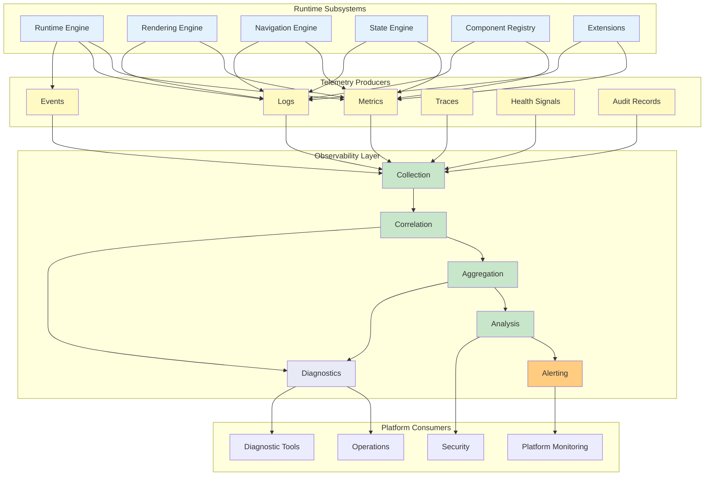
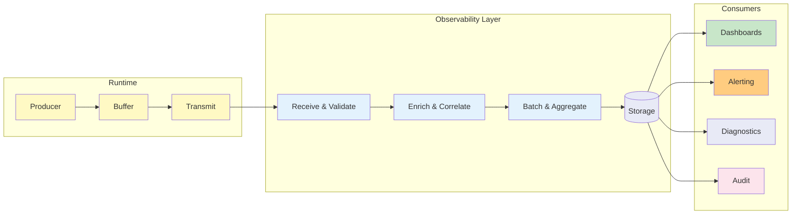
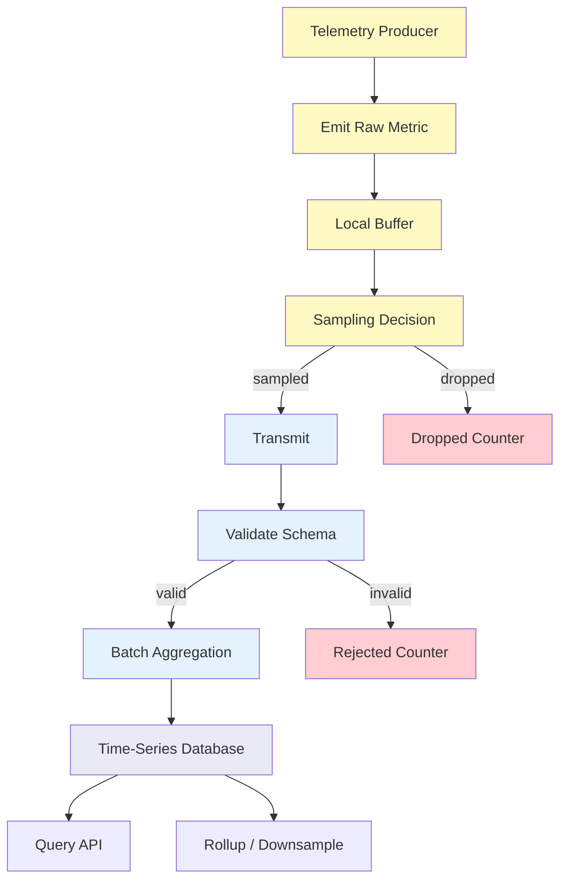
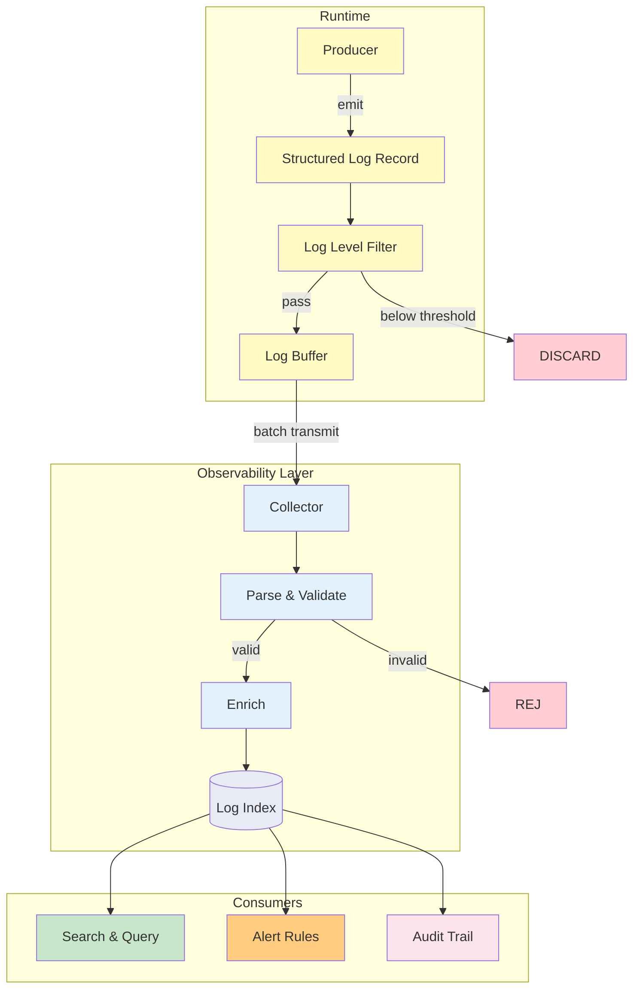
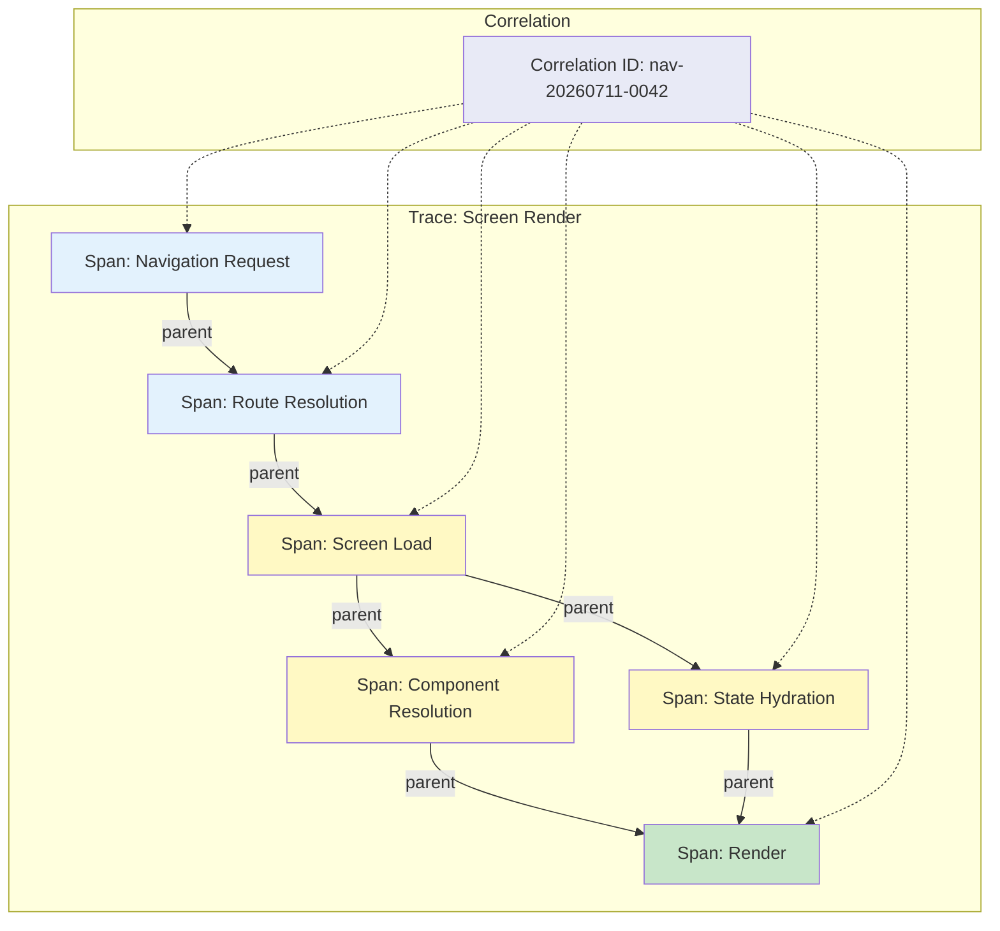
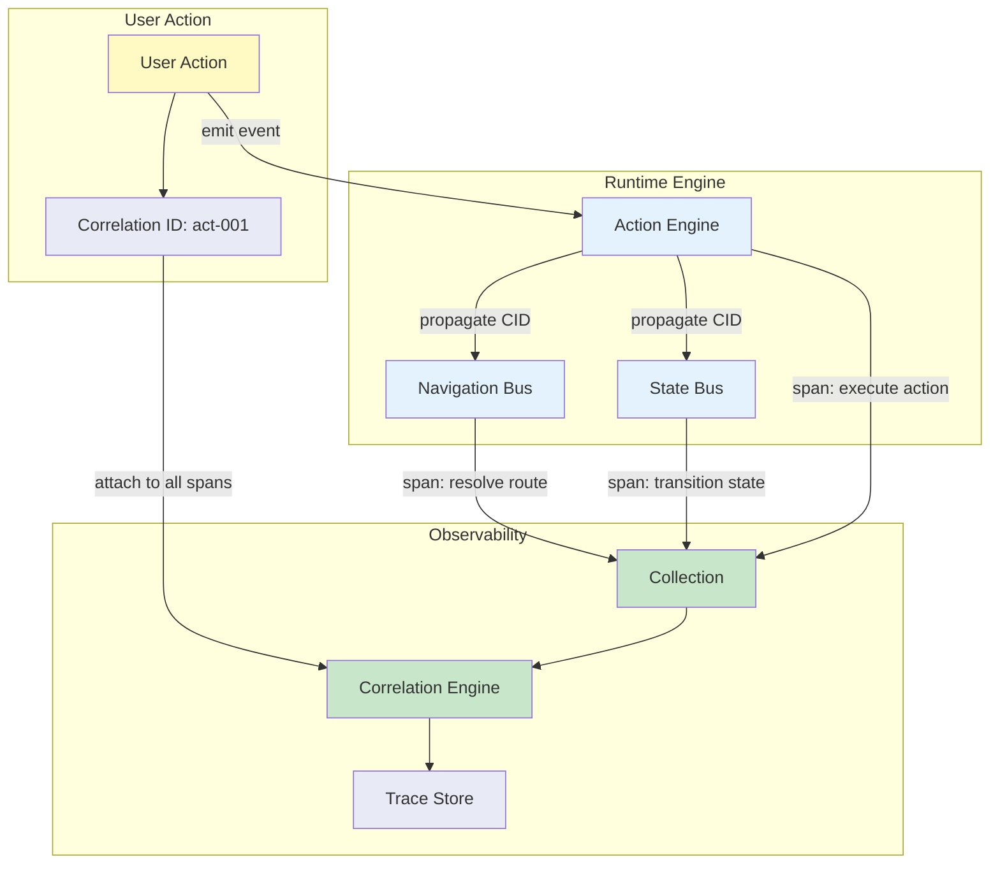
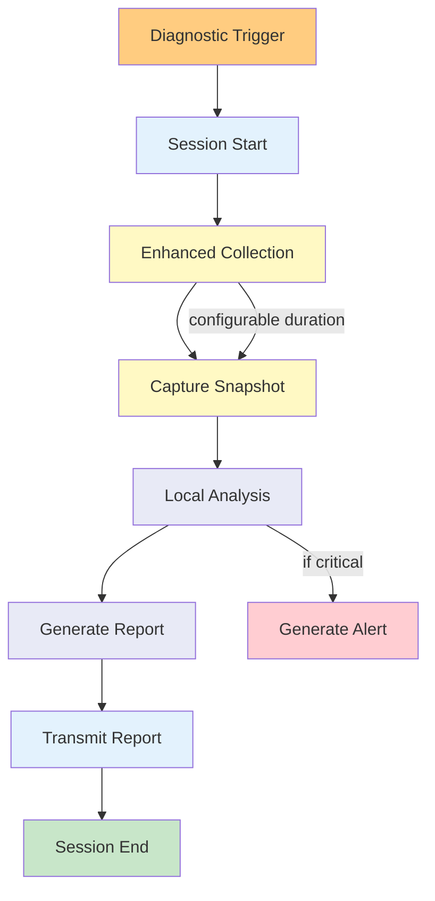
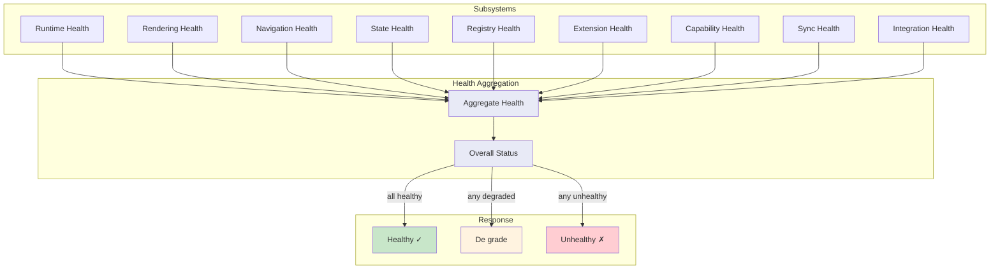
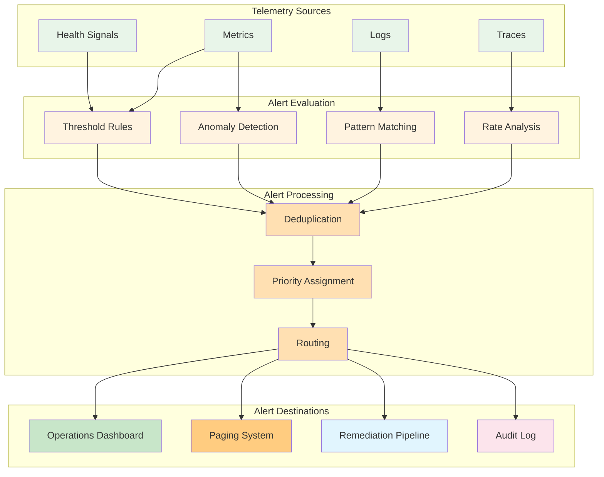

# Runtime Observability & Diagnostics Architecture

**KB-058 — Runtime Observability & Diagnostics Architecture Specification**

| Metadata | |
|----------|---|
| **KB ID** | KB-058 |
| **Title** | Runtime Observability & Diagnostics Architecture |
| **Version** | 0.1.0 |
| **Status** | Draft |
| **Owner** | Architecture Team |
| **Suite** | Runtime & Rendering Architecture |
| **Dependencies** | KB-051 Runtime Architecture Overview, KB-052 Rendering Engine Architecture, KB-053 Rendering Pipeline Architecture, KB-054 Runtime Component Registry Architecture, KB-055 Runtime State Engine Architecture, KB-056 Runtime Navigation Engine Architecture, KB-057 Runtime Security Architecture, KB-047 Action & Event Model |
| **Related Documents** | KB-019 Event Bus, KB-015 Action Engine, KB-048 Application State Model, KB-020 Offline & Synchronization, KB-030 Validation Engine, KB-041 Application Architecture Overview, KB-042 Application Manifest Specification, KB-049 Theme & Design Token Model, KB-050 Capability Composition Model, KB-058 Runtime Observability & Diagnostics Architecture, KB-059 Runtime Caching & Synchronization, KB-060 Runtime Event & Action Pipeline, KB-008 Runtime Overview |
| **Review Status** | Pending |
| **Last Updated** | 2026-07-11 |

---

### Revision History

| Version | Date | Author | Change |
|---------|------|--------|--------|
| 0.1.0 | 2026-07-11 | AI Architecture Agent | Initial draft |

---

## 1. Executive Summary

### 1.1 Purpose

This document defines the canonical Runtime Observability & Diagnostics Architecture for the DUKADESK Platform. Observability is a first-class platform capability — it is not an afterthought or a bolt-on monitoring layer. Every Runtime, Service, Builder, and Marketplace component must produce structured telemetry that enables real-time visibility, post-incident diagnostics, performance analysis, security auditing, and business intelligence.

Observability encompasses the collection, correlation, aggregation, analysis, alerting, and diagnostic retrieval of all telemetry data — metrics, logs, events, traces, health signals, and audit records — across every subsystem of the platform.

The specification governs telemetry production, collection, transmission, storage, privacy, and governance across the Mobile Runtime, Web Runtime, Desktop Runtime, Preview Runtime, Builder Studio, Runtime Engine, Backend Services, Marketplace, SDK, and AI Platform.

### 1.2 Scope

This document covers:

- Canonical observability definitions and conceptual model
- Observability architecture: collection, correlation, aggregation, analysis, alerting, diagnostics
- Runtime responsibilities for telemetry collection across all subsystems
- Telemetry categories: Runtime, Rendering, Navigation, State, Workflow, Synchronization, Security, Marketplace, Builder, Extension
- Metrics model: Performance, Usage, Health, Reliability, Capacity, Error, Business
- Logging architecture: Structured Logs, Log Levels, Correlation IDs, Tenant/Runtime Context, Security Events
- Distributed tracing: Trace Lifecycle, Parent/Child Spans, Runtime and Service Boundaries, Cross-Service Correlation
- Diagnostics Sessions: Runtime, Crash, Recovery, Rendering, Navigation, Synchronization diagnostics
- Health model: Runtime, Rendering Engine, Navigation Engine, State Engine, Registry, Extensions, Capabilities, Synchronization, Integrations
- Alerting architecture: Health, Performance, Security, Dependency, Registry, Synchronization alerts
- Privacy: PII protection, sensitive data redaction, consent-aware telemetry, data minimization, retention
- Responsibilities across Builder, Backend, and Marketplace
- Performance: telemetry overhead, sampling, aggregation, buffering, offline collection, efficient transmission
- Offline behaviour: local telemetry queue, deferred upload, crash buffer, recovery reporting
- Observability governance: naming standards, metric/trace/event/log/correlation standards
- Failure scenarios and anti-patterns
- Future evolution: AI-assisted diagnostics, predictive monitoring, autonomous remediation, anomaly detection

Out of scope:

- Application-level business analytics (user-defined dashboards, custom reports)
- Platform implementation of specific monitoring tools (Prometheus, Datadog, OpenTelemetry, etc.)
- Backend infrastructure monitoring (host, network, database metrics)
- Marketplace analytics for third-party publishers
- User behavior analytics (session replay, heatmaps, funnel analysis)

---

## 2. Architectural Principles

### 2.1 Observability by Design

Every subsystem must be observable from its inception. Observability is not added after implementation — it is designed into every component, service, and Runtime. Each subsystem declares its telemetry outputs, health signals, and diagnostic entry points as part of its architectural contract.

### 2.2 Telemetry First

Telemetry production is non-optional and non-deferrable. All Runtimes, Services, Builders, and Extensions must emit structured telemetry. Systems that do not produce telemetry are considered non-compliant and are not admitted to the platform.

### 2.3 Structured Diagnostics

All telemetry is structured. Free-form text logging is prohibited except for human-readable messages that accompany structured data. Every telemetry payload has a defined schema, typed fields, and consistent semantic meaning across all producers.

### 2.4 End-to-End Traceability

Every request, action, event, and workflow that crosses subsystem boundaries must be traceable end-to-end. Correlation IDs are mandatory at every boundary. No operation spans a subsystem boundary without propagating its correlation context.

### 2.5 Distributed Correlation

Telemetry from different subsystems, runtimes, and services is correlated through shared correlation identifiers, tenant context, workspace context, and runtime instance identifiers. The observability layer provides the correlation fabric that connects telemetry across the entire distributed platform.

### 2.6 Runtime Independent

The observability architecture is defined independently of any Runtime implementation. Mobile, web, and desktop Runtimes all produce the same telemetry schema, health signals, and diagnostic interfaces. Platform-specific collection, storage, and transmission are implementation concerns.

### 2.7 Privacy by Design

Telemetry collection respects user privacy by default. Personal identifiable information (PII) is never collected in standard telemetry. Sensitive data is redacted at the source before transmission. Telemetry collection is consent-aware and configurable per deployment.

### 2.8 Low Overhead

Telemetry collection must not degrade the user experience. Overhead targets are defined per telemetry category and enforced through sampling, aggregation, buffering, and efficient encoding. Telemetry that exceeds overhead budgets is sampled or dropped.

### 2.9 Real-Time Visibility

Observability data must be available in real time for operational visibility. The observability pipeline processes telemetry with minimal latency — metrics are available within seconds, logs within seconds, and traces within minutes for real-time use cases. Historical data is available for query with relaxed latency requirements.

### 2.10 Extensible Instrumentation

The observability framework supports extensible instrumentation. Subsystems can define custom metrics, events, and health signals that follow the standard schema and correlation model. Custom instrumentation does not require changes to the core observability pipeline.

---

## 3. Canonical Definitions

### Observability

The capability to understand the internal state of a system from its external outputs. Observability enables operators, developers, and automated systems to infer system health, diagnose issues, and analyze behavior without deploying new instrumentation.

### Diagnostics

The process of investigating and determining the root cause of a system issue using observability data. Diagnostics include crash analysis, performance investigation, error attribution, and degradation root cause analysis.

### Telemetry

Data automatically collected and transmitted from a subsystem to the observability layer. Telemetry includes metrics, logs, events, traces, and health signals.

### Metric

A numeric measurement collected at regular intervals or at specific events. Metrics represent counts, gauges, histograms, and summaries of system behavior over time.

### Log

A structured record of a discrete event that occurred within a subsystem. Logs contain a timestamp, severity level, message, and structured payload with typed fields.

### Event

A structured notification that a specific occurrence has happened within the platform. Events carry semantic meaning and are consumed by subscribers through the Event Bus, by the observability layer, and by audit systems.

### Trace

A distributed record of a request or operation as it propagates through multiple subsystems. A trace consists of spans that represent individual units of work within the overall operation.

### Span

A single unit of work within a trace. A span records the start time, end time, operation name, parent span ID, and metadata about the work performed.

### Correlation ID

A unique identifier that is propagated with every request, action, event, and workflow across all subsystem boundaries. The correlation ID connects all telemetry produced during the handling of a single operation, enabling end-to-end traceability.

### Health Signal

A structured indicator of a subsystem's operational status. Health signals are produced at regular intervals and include the subsystem identity, status (healthy, degraded, unhealthy), and supporting diagnostic metadata.

### Diagnostic Session

A scoped investigation of a specific subsystem or operation. A diagnostic session captures enhanced telemetry, detailed logs, and performance data for a targeted period or operation.

### Runtime Health

The aggregated health status of a Runtime instance, calculated from the health signals of all its constituent subsystems: Rendering Engine, Navigation Engine, State Engine, Component Registry, Extensions, and Synchronization.

### Monitoring

The continuous observation of telemetry data to detect operational anomalies, performance degradation, security incidents, and reliability issues. Monitoring includes dashboarding, alerting, and automated response.

### Alert

A notification generated when a monitored condition exceeds a defined threshold or matches a defined pattern. Alerts are routed to the appropriate response team or automated remediation system.

### Audit Event

A structured, immutable record of a security-relevant or governance-relevant operation. Audit events are produced for compliance, security investigation, and regulatory requirements.

---

## 4. Observability Architecture

### 4.1 Architecture Diagram

### 4.2 Collection Layer

The Collection Layer is responsible for receiving telemetry from all producers, validating its structure, attaching routing metadata, and forwarding it to the Correlation Layer. Collection is the first processing stage and operates with minimal overhead.

**Collection Responsibilities:**
- Accept telemetry from all Runtime subsystems, Builder, Backend, and Extensions
- Validate telemetry structure against defined schemas
- Attach routing metadata (source subsystem, Runtime type, tenant ID)
- Buffer telemetry during high-throughput periods
- Enforce telemetry size limits and sampling policies

### 4.3 Correlation Layer

The Correlation Layer enriches telemetry with correlation context, links related telemetry across subsystems, and maintains the distributed trace fabric.

**Correlation Responsibilities:**
- Propagate correlation IDs across subsystem boundaries
- Link spans into complete traces
- Correlate metrics with their originating traces and logs
- Attach tenant, workspace, application, and session context
- Maintain the parent-child relationship between spans

### 4.4 Aggregation Layer

The Aggregation Layer computes derived metrics from raw telemetry. Aggregation reduces storage requirements, enables historical trend analysis, and provides pre-computed views for dashboards and alerting.

**Aggregation Responsibilities:**
- Compute percentile distributions (p50, p95, p99) from raw latency metrics
- Aggregate counts, sums, and rates over time windows
- Build histograms from raw distribution data
- Produce time-series data for dashboard queries
- Downsample historical data for long-term retention

### 4.5 Analysis Layer

The Analysis Layer evaluates telemetry against defined thresholds, patterns, and models to detect anomalies, diagnose issues, and trigger alerts.

**Analysis Responsibilities:**
- Evaluate health signals against health thresholds
- Detect metric anomalies (sudden spikes, drops, rate changes)
- Correlate error spikes with deployment events, configuration changes
- Identify performance regressions across versions
- Detect security patterns (failed auth attempts, unusual access patterns)

### 4.6 Alerting Layer

The Alerting Layer generates notifications when monitored conditions exceed thresholds or match alert rules. Alerts are routed to the appropriate consumers: operations dashboards, paging systems, automated remediation pipelines, or audit logs.

### 4.7 Diagnostics Layer

The Diagnostics Layer provides on-demand access to detailed telemetry for root cause investigation. Diagnostics sessions capture enhanced telemetry for targeted subsystems or operations.

---

## 5. Telemetry Flow

### 5.1 Telemetry Flow Diagram

---

## 6. Runtime Responsibilities

The Runtime is the primary producer of telemetry across all subsystems. Every Runtime — Mobile, Web, Desktop, Preview — must implement the same telemetry production contracts.

### 6.1 Telemetry Collection

| Responsibility | Description |
|---------------|-------------|
| Instrument all subsystems | Every Runtime subsystem must be instrumented for metrics, logs, events, traces, and health signals. |
| Standardized schemas | All telemetry follows the canonical schema defined in this document. |
| Runtime context | Every telemetry payload includes Runtime type, version, platform, and instance identifier. |
| No silent omissions | Telemetry production failures must not silently drop data — failures are logged and buffered. |

### 6.2 Metrics Collection

| Responsibility | Description |
|---------------|-------------|
| Collect performance metrics | CPU, memory, frame rate, render times, navigation times, state transition times, registry lookup times. |
| Collect usage metrics | Session duration, screen views, action counts, component render counts, navigation events. |
| Collect error metrics | Error counts by subsystem, error rates, crash rates, exception types. |
| Collect capacity metrics | Cache sizes, registry entry counts, active component counts, memory pressure indicators. |
| Emit at defined intervals | Metrics are emitted on a cadence appropriate to their category (high-frequency: every 10s, low-frequency: every 60s). |

### 6.3 Log Collection

| Responsibility | Description |
|---------------|-------------|
| Structured logs only | All logs are structured with typed fields, not free-form text. |
| Log levels | Logs are emitted at DEBUG, INFO, WARN, ERROR, FATAL levels. Production collects WARN and above; lower levels are collected during diagnostic sessions. |
| Correlation ID on every log | Every log record carries the active correlation ID. |
| Context enrichment | Logs include tenant, workspace, application, session, and component context when applicable. |

### 6.4 Trace Collection

| Responsibility | Description |
|---------------|-------------|
| Trace every cross-subsystem operation | Operations that cross subsystem boundaries (Screen render, Action execution, Navigation transition, State mutation, Registry resolution) must be traced. |
| Span boundaries | Each subsystem creates a span for its portion of the operation. Parent spans propagate correlation IDs to child spans. |
| Span metadata | Spans include operation name, start/end timestamps, duration, status (success/error), and error metadata. |
| Sampling for high-throughput traces | High-volume traces (rendering frames, state updates) are sampled at a configurable rate. Critical traces (security events, errors, crashes) are always captured. |

### 6.5 Health Monitoring

| Responsibility | Description |
|---------------|-------------|
| Emit health signals | Every runtime subsystem emits a health signal at a defined interval (default: 30s). |
| Health signal schema | Each health signal includes subsystem identity, status (healthy/degraded/unhealthy), last successful operation timestamp, error count since last healthy, and supporting diagnostic metadata. |
| Degradation detection | Subsystems detect their own degraded state (high latency, elevated error rate, resource pressure) and reflect it in their health signal. |
| Startup health | Subsystems report startup progress through health signals — starting, running, healthy, failed. |

### 6.6 Diagnostics

| Responsibility | Description |
|---------------|-------------|
| Diagnostic session support | Runtimes support on-demand diagnostic sessions that capture enhanced telemetry for targeted subsystems. |
| Crash diagnostics | On crash, the Runtime captures a crash buffer with the last N seconds of telemetry, current state snapshot, and device diagnostics. |
| Recovery diagnostics | After recovery from a crash or degradation, the Runtime captures recovery diagnostics: recovery action taken, data loss assessment, post-recovery health. |

### 6.7 Alert Generation

| Responsibility | Description |
|---------------|-------------|
| Local alert detection | Runtimes detect local conditions that warrant alerts: persistent errors, critical resource pressure, security violations. |
| Alert transmission | Alerts are transmitted to the observability layer with priority, severity, and supporting telemetry. |
| No alert storms | Runtimes implement alert deduplication and rate limiting to prevent alert storms. |

### 6.8 Audit Reporting

| Responsibility | Description |
|---------------|-------------|
| Security-relevant operations | Security-relevant operations (authentication, authorization, tenant boundary access, sensitive state access) produce audit events. |
| Immutable audit records | Audit events are immutable and tamper-evident. They are transmitted separately from regular telemetry. |
| Audit retention | Audit events are retained according to regulatory requirements (minimum: 1 year, configurable per deployment). |

---

## 7. Telemetry Categories

### 7.1 Runtime Telemetry

| Category | Examples |
|----------|----------|
| Application lifecycle | Startup time, shutdown sequence, crash count, uptime |
| Memory | Heap usage, garbage collection frequency, memory pressure |
| CPU | CPU utilization by subsystem, thread count, context switches |
| Network | Bandwidth usage, connection count, latency to backend |

### 7.2 Rendering Telemetry

| Category | Examples |
|----------|----------|
| Frame rate | Frames per second, frame time distribution, dropped frames |
| Render times | Screen render duration, component render duration, layout computation time |
| Component counts | Visible components, re-rendered components per frame, component mount/unmount rate |
| Pipeline stages | Parse, resolve, layout, paint, composite stage durations |

### 7.3 Navigation Telemetry

| Category | Examples |
|----------|----------|
| Navigation events | Screen transitions, route changes, modal opens/closes |
| Navigation times | Route resolution time, screen transition duration, animation duration |
| Navigation errors | Unresolved routes, guard rejections, deep link failures |

### 7.4 State Telemetry

| Category | Examples |
|----------|----------|
| State changes | Mutation rate, transition count, derived state recomputation count |
| State sizes | Per-scope state size, total session state size, state snapshot count |
| State errors | Invalid transitions, hydration failures, persistence failures |
| State latency | Read latency, write latency, transition execution time |

### 7.5 Workflow Telemetry

| Category | Examples |
|----------|----------|
| Workflow events | Workflow start, step completion, workflow completion, workflow cancellation |
| Workflow times | Step execution duration, total workflow duration, wait times |
| Workflow errors | Step failures, timeout expirations, decision errors |

### 7.6 Synchronization Telemetry

| Category | Examples |
|----------|----------|
| Sync operations | Sync count, mutations synced, data transferred |
| Sync times | Sync duration, queue flush time, conflict resolution time |
| Sync errors | Failed syncs, conflicts detected, resolution failures |
| Offline metrics | Offline duration, queue depth, deferred operation count |

### 7.7 Security Telemetry

| Category | Examples |
|----------|----------|
| Authentication | Login attempts (success/failure), token refresh, session creation/destruction |
| Authorization | Access granted/denied by scope, permission check count |
| Tenant isolation | Cross-tenant access attempts (blocked) |
| Encryption | Encryption/decryption operations, key rotation events |

### 7.8 Marketplace Telemetry

| Category | Examples |
|----------|----------|
| Installation | Component installs, capability activations, extension enable/disable |
| Resolution | Registry lookups, version selection, dependency resolution |
| Certification | Certification check results, signature verification outcomes |

### 7.9 Builder Telemetry

| Category | Examples |
|----------|----------|
| Composition | Screen creations, component placements, property changes |
| Publishing | Validation runs, package builds, publication events |
| Preview | Preview session count, preview render times, preview errors |

### 7.10 Extension Telemetry

| Category | Examples |
|----------|----------|
| Extension lifecycle | Activation, deactivation, crash, update events |
| Extension operations | Custom action counts, custom render counts, extension API usage |
| Extension errors | Extension crashes, API misuse, capability access failures |

---

## 8. Metrics Model

### 8.1 Metrics Collection Pipeline Diagram

### 8.2 Performance Metrics

| Metric | Type | Collection Cadence | Retention (Raw) | Retention (Rollup) |
|--------|------|-------------------|-----------------|---------------------|
| Frame rate | Gauge | Per frame | 24 hours | 90 days |
| Render duration | Histogram | Per render | 24 hours | 90 days |
| Navigation duration | Histogram | Per navigation | 7 days | 90 days |
| State transition duration | Histogram | Per transition | 7 days | 90 days |
| Registry lookup duration | Histogram | Per lookup | 7 days | 90 days |
| Memory usage | Gauge | 10 seconds | 7 days | 90 days |
| CPU utilization | Gauge | 10 seconds | 7 days | 90 days |
| Launch duration | Histogram | Per launch | 30 days | 1 year |

### 8.3 Usage Metrics

| Metric | Type | Collection Cadence | Retention |
|--------|------|-------------------|-----------|
| Active sessions | Gauge | 1 minute | 90 days |
| Screen views | Counter | Per view | 90 days |
| Action executions | Counter | Per action | 90 days |
| Component renders | Counter | Per render (sampled) | 30 days |
| Navigation events | Counter | Per navigation | 90 days |
| Registry lookups | Counter | Per lookup | 30 days |

### 8.4 Health Metrics

| Metric | Type | Collection Cadence | Retention |
|--------|------|-------------------|-----------|
| Runtime status | Enum (healthy/degraded/unhealthy) | 30 seconds | 90 days |
| Subsystem status | Enum per subsystem | 30 seconds | 90 days |
| Error rate | Rate (errors per minute) | 1 minute | 90 days |
| Crash rate | Rate (crashes per session) | Per session | 1 year |
| Uptime percentage | Gauge (rolling 24h) | 1 hour | 1 year |

### 8.5 Reliability Metrics

| Metric | Description |
|--------|-------------|
| Resolution success rate | Percentage of successful component resolutions |
| Render success rate | Percentage of screens rendered without error |
| Navigation success rate | Percentage of successful navigation transitions |
| Sync success rate | Percentage of successful synchronization operations |
| Action execution success rate | Percentage of actions completed without error |
| State transition success rate | Percentage of valid state transitions |

### 8.6 Capacity Metrics

| Metric | Description | Warning Threshold | Critical Threshold |
|--------|-------------|-------------------|-------------------|
| Active components | Components currently rendered | 80% of limit | 95% of limit |
| Registry entries | Components registered in cache | 80% of cache capacity | 95% of cache capacity |
| State size | Session state memory usage | 80% of session budget | 95% of session budget |
| Log buffer | Pending log transmission | 80% of buffer capacity | 95% of buffer capacity |
| Queue depth | Pending sync mutations | 100 entries | 500 entries |

### 8.7 Error Metrics

| Metric | Type | Description |
|--------|------|-------------|
| Error rate by subsystem | Rate | Errors per minute per subsystem |
| Error type distribution | Counter | Breakdown by error type (validation, timeout, auth, not found) |
| Crash rate | Rate | Crashes per 1000 sessions |
| Crash type distribution | Counter | Breakdown by crash type (OOM, uncaught exception, native crash) |
| Error spike detection | Event | Alert when error rate exceeds 3x baseline |

### 8.8 Business Metrics (Platform-Level)

| Metric | Description | Scope |
|--------|-------------|-------|
| Active tenants | Tenants with active sessions | Platform |
| Active applications | Applications with active sessions | Platform |
| Session count | Total sessions per time window | Platform |
| Screen views | Total screen views per time window | Platform |
| Component renders | Total component renders per time window | Platform |
| Marketplace installs | Component installs per time window | Platform |

---

## 9. Logging Architecture

### 9.1 Logging Architecture Diagram

### 9.2 Structured Logs

Every log record is a structured JSON payload with the following required fields:

| Field | Type | Description |
|-------|------|-------------|
| timestamp | ISO 8601 | Time of log emission |
| level | enum | DEBUG, INFO, WARN, ERROR, FATAL |
| message | string | Human-readable description |
| correlationId | string | Active correlation ID |
| subsystem | string | Producing subsystem (rendering, navigation, state, registry) |
| runtimeType | string | Mobile, Web, Desktop, Preview |
| runtimeVersion | string | Runtime version string |
| tenantId | string | Tenant identifier (if applicable) |
| workspaceId | string | Workspace identifier (if applicable) |
| sessionId | string | Session identifier (if applicable) |

### 9.3 Log Levels

| Level | Description | Production Collection | Diagnostic Collection |
|-------|-------------|---------------------|----------------------|
| DEBUG | Detailed diagnostic information | Dropped | Collected |
| INFO | Normal operational events | Collected | Collected |
| WARN | Unexpected but non-fatal conditions | Collected | Collected |
| ERROR | Errors that may impact functionality | Collected | Collected |
| FATAL | Critical errors causing subsystem failure | Collected | Collected |

### 9.4 Correlation IDs

Every log record must include the active correlation ID. Correlation IDs are propagated through:
- Action execution chains (KB-047)
- Event bus messages (KB-019)
- Navigation operations
- State transitions
- Component resolution requests
- Synchronization operations

**Correlation ID Format:** `{runtimeInstance}-{counter}-{timestamp}`

### 9.5 Tenant Context

When applicable, log records include tenant, workspace, application, and session identifiers. Tenant context enables per-tenant log filtering, tenant-specific alerting, and tenant isolation in observability storage.

### 9.6 Runtime Context

Each log record identifies the producing Runtime type, version, platform, and instance. Runtime context enables cross-Runtime comparison, version-specific debugging, and fleet-wide observability.

### 9.7 Security Events

Security events are logged with special handling:
- They are always collected (never sampled)
- They include correlation with the security audit trail
- They are immutable and tamper-evident
- They are retained for the maximum retention period

---

## 10. Distributed Tracing

### 10.1 Distributed Tracing Model Diagram

### 10.2 Trace Lifecycle

| Phase | Description |
|-------|-------------|
| Initiation | A new trace is created when an operation that crosses subsystem boundaries begins (user action, navigation event, background process). |
| Propagation | The trace correlation ID is propagated through every subsystem that participates in the operation. Each subsystem creates a child span. |
| Completion | The trace is completed when the root operation finishes — the screen is rendered, the action is executed, the navigation completes. |
| Collection | Completed traces are collected and transmitted to the observability layer. |
| Storage | Traces are stored with their full span hierarchy and metadata. Retention varies by trace type (critical: 90 days, sampled: 7 days). |

### 10.3 Parent/Child Spans

Each span within a trace has a parent span (except the root span). Parent-child relationships represent the call graph of the distributed operation.

**Span Fields:**
| Field | Description |
|-------|-------------|
| traceId | Trace identifier (same for all spans in the trace) |
| spanId | Unique span identifier |
| parentSpanId | Parent span identifier (null for root span) |
| operationName | Name of the operation (e.g., "renderScreen", "resolveComponent") |
| startTime | Span start timestamp |
| endTime | Span end timestamp |
| duration | Computed duration in milliseconds |
| status | OK, ERROR, or UNSET |
| statusMessage | Error message if status is ERROR |
| subsystem | Subsystem that created the span |
| metadata | Operation-specific metadata |

### 10.4 Runtime Boundaries

Spans that cross Runtime boundaries (e.g., from Runtime Engine to Rendering Engine) include boundary metadata: source subsystem, target subsystem, and boundary type (internal, service, external).

### 10.5 Service Boundaries

Spans that cross service boundaries (e.g., from Runtime to Backend) include service identity, endpoint, and transport protocol. Cross-service spans carry authentication context for audit correlation.

### 10.6 Cross-Service Correlation

Cross-service traces are correlated through the propagated correlation ID. The Backend observability system joins Runtime traces with Backend service traces using the shared correlation ID.

### 10.7 Request Flow

| Request Type | Spans Collected | Example |
|-------------|----------------|---------|
| Navigation | Route resolution, Screen load, State hydration, Component resolution, Render | User taps a navigation link |
| Action execution | Action dispatch, Action validation, State transition, Component update | User submits a form |
| Component resolution | Registry lookup, Version resolution, Dependency resolution | Screen renders a component |
| Synchronization | Mutation queue, Sync request, Conflict detection, State update | Background data sync |

### 10.8 Runtime Correlation Model

The Runtime Correlation Model shows how a single user action produces multiple spans across different subsystems, all linked by the same correlation ID. The Correlation Engine in the observability layer joins these spans into a complete trace.

**Correlation Flow:**
1. A user action generates a unique correlation ID
2. The Action Engine (KB-047) propagates the correlation ID to every subsystem that participates in handling the action
3. Each subsystem creates spans tagged with the correlation ID
4. Spans are transmitted to the observability layer
5. The Correlation Engine joins spans with the same correlation ID into a complete trace
6. The trace is stored for query and analysis

---

## 11. Diagnostics Sessions

### 11.1 Diagnostics Session Lifecycle Diagram

### 11.2 Runtime Diagnostics

Runtime diagnostics capture the complete state of a Runtime instance at a point in time. Diagnostics are triggered by degradation detection, crash recovery, or on-demand request.

**Diagnostic Data Captured:**
- Active subsystem health signals
- Current resource usage (CPU, memory, network)
- Active session count and status
- Component Registry cache state
- State store sizes and snapshot counts
- Pending synchronization queue
- Last N errors from each subsystem
- Configuration snapshot

### 11.3 Crash Diagnostics

On crash, the Runtime captures a crash diagnostic snapshot before termination. The crash buffer preserves the last N seconds of telemetry for post-mortem analysis.

**Crash Diagnostic Data:**
- Crash type and stack trace
- Runtime version and platform
- Last N log entries (all levels)
- Last N health signals from each subsystem
- Current state snapshot (scoped, no PII)
- Device diagnostics (memory pressure, storage)
- Active session information
- Pending operations at time of crash

### 11.4 Recovery Diagnostics

After recovery from a crash or degradation, the Runtime captures recovery diagnostics:

**Recovery Diagnostic Data:**
- Recovery action taken (restart, state rollback, cache rebuild)
- Data loss assessment (state lost, pending sync lost)
- Post-recovery health signals
- Time to recover
- Root cause reference (if determined)
- Error recurrence count

### 11.5 Rendering Diagnostics

Rendering diagnostics capture per-frame and per-screen rendering telemetry for performance investigation.

**Triggered by:**
- Frame rate drop below threshold
- Render duration exceeds threshold
- On-demand diagnostic session

**Diagnostic Data:**
- Per-frame timing breakdown (parse, resolve, layout, paint, composite)
- Component render counts per frame
- Re-render reason analysis
- Layout pass count
- Image and asset decode times
- Thread contention data

### 11.6 Navigation Diagnostics

Navigation diagnostics capture navigation operation telemetry for route resolution and transition investigation.

**Triggered by:**
- Navigation failure
- Navigation duration exceeds threshold
- On-demand diagnostic session

**Diagnostic Data:**
- Route resolution chain (route → screen → component)
- Guard evaluation results
- Deep link parsing details
- Transition animation timing
- Navigation stack state

### 11.7 Synchronization Diagnostics

Synchronization diagnostics capture sync operation details for offline and sync investigation.

**Triggered by:**
- Sync failure
- Extended offline period
- Conflict resolution
- On-demand diagnostic session

**Diagnostic Data:**
- Mutation queue contents (metadata only, no PII)
- Sync retry history
- Conflict detection and resolution details
- Connectivity state at time of sync
- Bandwidth and latency measurements

---

## 12. Health Model

### 12.1 Health Monitoring Flow Diagram

### 12.2 Runtime Health

| Signal | Healthy Criteria | Degraded Criteria | Unhealthy Criteria |
|--------|-----------------|-------------------|--------------------|
| Startup status | Initialized and running | Slow startup (>5s) | Failed to start |
| Memory pressure | < 70% of budget | 70–90% of budget | > 90% of budget |
| CPU utilization | < 50% average | 50–80% average | > 80% sustained |
| Error rate | < 1% of operations | 1–5% of operations | > 5% of operations |
| Crash rate | 0 crashes in 24h | 1 crash in 24h | > 1 crash in 24h |

### 12.3 Rendering Engine Health

| Signal | Healthy Criteria | Degraded Criteria | Unhealthy Criteria |
|--------|-----------------|-------------------|--------------------|
| Frame rate | >= 54 FPS (90% of frames) | 30–54 FPS | < 30 FPS sustained |
| Render duration | < 16ms (p95) | 16–50ms (p95) | > 50ms (p95) |
| Component errors | 0 per session | 1–5 per session | > 5 per session |

### 12.4 Navigation Engine Health

| Signal | Healthy Criteria | Degraded Criteria | Unhealthy Criteria |
|--------|-----------------|-------------------|--------------------|
| Transition duration | < 300ms (p95) | 300ms–1s (p95) | > 1s (p95) |
| Route resolution | 100% success rate | > 95% success rate | < 95% success rate |
| Navigation errors | 0 per session | 1–3 per session | > 3 per session |

### 12.5 State Engine Health

| Signal | Healthy Criteria | Degraded Criteria | Unhealthy Criteria |
|--------|-----------------|-------------------|--------------------|
| Transition duration | < 5ms (p95) | 5–50ms (p95) | > 50ms (p95) |
| Hydration duration | < 200ms | 200ms–1s | > 1s |
| Persistence errors | 0 per session | 1–3 per session | > 3 per session |

### 12.6 Registry Health

| Signal | Healthy Criteria | Degraded Criteria | Unhealthy Criteria |
|--------|-----------------|-------------------|--------------------|
| Lookup duration | < 1ms cache hit, < 50ms cache miss | 1–10ms / 50–500ms | > 10ms / > 500ms |
| Cache hit ratio | > 90% | 70–90% | < 70% |
| Resolution errors | 0 per session | 1–5 per session | > 5 per session |

### 12.7 Extension Health

| Signal | Healthy Criteria | Degraded Criteria | Unhealthy Criteria |
|--------|-----------------|-------------------|--------------------|
| Extension errors | 0 per session | 1–5 per session | > 5 per session |
| Extension crash count | 0 | 1 | > 1 |
| API misuse count | 0 | 1–3 | > 3 |

### 12.8 Capability Health

| Signal | Healthy Criteria | Degraded Criteria | Unhealthy Criteria |
|--------|-----------------|-------------------|--------------------|
| Capability availability | All required capabilities active | Required capability degraded | Required capability unavailable |
| Capability load time | < 100ms | 100–500ms | > 500ms |
| Capability errors | 0 | 1–3 | > 3 |

### 12.9 Synchronization Health

| Signal | Healthy Criteria | Degraded Criteria | Unhealthy Criteria |
|--------|-----------------|-------------------|--------------------|
| Queue depth | < 10 | 10–100 | > 100 |
| Sync success rate | > 99% | 95–99% | < 95% |
| Last sync time | < 5 minutes | 5–30 minutes | > 30 minutes |
| Conflict rate | < 1% of operations | 1–5% | > 5% |

### 12.10 Integration Health

| Signal | Healthy Criteria | Degraded Criteria | Unhealthy Criteria |
|--------|-----------------|-------------------|--------------------|
| Connection status | Connected | Intermittent | Disconnected |
| API response time | < 500ms (p95) | 500ms–2s (p95) | > 2s (p95) |
| API error rate | < 1% | 1–5% | > 5% |

---

## 13. Alerting Architecture

### 13.1 Alerting Pipeline Diagram

### 13.2 Health Alerts

| Alert | Trigger | Severity | Response |
|-------|---------|----------|----------|
| Runtime unhealthy | Runtime health signal = unhealthy | Critical | Page on-call |
| Rendering degraded | FPS < 30 for > 30s | Warning | Dashboard alert |
| Navigation failing | Navigation errors > 10/min | Critical | Page on-call |
| State persistence errors | Persistence failures > 5/min | Warning | Dashboard alert |
| Registry offline | Registry cache miss rate > 50% | Warning | Dashboard alert |

### 13.3 Performance Alerts

| Alert | Trigger | Severity | Response |
|-------|---------|----------|----------|
| High latency (p95) | Render > 50ms, Navigation > 1s, State > 50ms | Warning | Dashboard alert |
| Memory pressure | > 90% budget for > 60s | Critical | Page on-call |
| Crash spike | > 2 crashes / 1000 sessions in 1h | Critical | Page on-call |
| Frame rate degradation | < 30 FPS sustained for > 10s | Warning | Dashboard alert |

### 13.4 Security Alerts

| Alert | Trigger | Severity | Response |
|-------|---------|----------|----------|
| Auth failure spike | > 10 failed auth attempts/min in 1 tenant | Critical | Security team notified |
| Cross-tenant access attempt | Any cross-tenant access attempt | Critical | Security incident |
| Signature verification failure | > 3 failures in 1h | Warning | Security team notified |
| Untrusted registry access | Any resolution attempt from untrusted registry | Critical | Security incident |

### 13.5 Dependency Alerts

| Alert | Trigger | Severity | Response |
|-------|---------|----------|----------|
| Registry unreachable | Remote registry unreachable > 30s | Critical | Page on-call |
| Extension crash | Extension crash loop (> 3 crashes in 5 min) | Warning | Extension developer notified |
| Capability unavailable | Required capability becomes unavailable | Critical | Page on-call |
| Backend unreachable | Backend sync endpoint unreachable > 60s | Warning | Dashboard alert |

### 13.6 Registry Alerts

| Alert | Trigger | Severity | Response |
|-------|---------|----------|----------|
| Registry corruption | Integrity check failure | Critical | Page on-call |
| Cache failure | Cache load failure | Warning | Dashboard alert |
| Version conflict | Resolution conflict across dependencies | Warning | Dashboard alert |

### 13.7 Synchronization Alerts

| Alert | Trigger | Severity | Response |
|-------|---------|----------|----------|
| Queue overflow | Queue depth > 500 | Warning | Dashboard alert |
| Sync failure | Sync success rate < 80% in 5 min | Critical | Page on-call |
| Conflict rate high | Conflict rate > 10% of operations | Warning | Dashboard alert |

---

## 14. Privacy

### 14.1 PII Protection

The observability architecture must not collect Personal Identifiable Information (PII) through standard telemetry. PII is defined as any data that can identify a specific individual: name, email, phone number, street address, government ID, financial account number, biometric data, IP address (full), precise location, and user-generated content.

**PII Protection Rules:**
- Standard telemetry must not contain PII fields
- User identifiers in telemetry are non-PII surrogate IDs (session ID, anonymous user ID)
- User-generated content is never included in telemetry payloads
- Error messages must not include user data or input values
- Stack traces must be stripped of any user context

### 14.2 Sensitive Data Redaction

When sensitive data must be logged for diagnostic purposes (with explicit consent), the sensitive values are redacted at the source before transmission. Redaction replaces the sensitive value with a placeholder or hash.

**Redaction Rules:**
| Data Type | Redaction Method |
|-----------|-----------------|
| Authentication tokens | Replace with token hash |
| API keys | Replace with key prefix + hash |
| Personal data | Replace with data type label (e.g., "<email>") |
| Financial data | Replace with "<redacted>" |
| Health data | Replace with "<redacted>" |
| User content | Replace with content type + length |

### 14.3 Consent-Aware Telemetry

Telemetry collection respects user and tenant consent settings. Telemetry categories can be enabled or disabled per tenant or per user through configuration.

**Consent Levels:**
| Level | Telemetry Collected | Use Case |
|-------|-------------------|----------|
| Required | Health signals, error metrics, crash reports | Platform operation, reliability |
| Standard | Performance metrics, usage metrics, structured logs | Operations, performance analysis |
| Enhanced | Traces, diagnostic sessions, detailed logs | Root cause investigation |
| Full | All telemetry including diagnostic data | Targeted debugging (temporary) |

### 14.4 Data Minimization

Telemetry collects the minimum data necessary for each purpose. No data is collected "just in case." Every telemetry field must have a documented purpose and retention policy.

**Minimization Practices:**
- Aggregated data is preferred over raw data where possible
- Metrics are collected as counters or histograms rather than individual events where applicable
- Log messages contain only diagnostic context, not user data
- Trace metadata is limited to operation context, not input/output values

### 14.5 Retention Expectations

| Telemetry Type | Standard Retention | Extended Retention (Compliance) |
|---------------|-------------------|--------------------------------|
| Metrics (raw) | 30 days | 90 days |
| Metrics (rollup) | 1 year | 7 years |
| Logs (INFO, WARN) | 30 days | 1 year |
| Logs (ERROR, FATAL) | 90 days | 2 years |
| Traces (sampled) | 7 days | 30 days |
| Traces (critical) | 90 days | 1 year |
| Health signals | 90 days | 1 year |
| Audit events | 1 year | 7 years |
| Diagnostic sessions | 30 days | 90 days |

---

## 15. Builder Responsibilities

- Instrument Builder Studio components for telemetry: panel interactions, screen compositions, property changes, validation runs
- Emit composition metrics: screen creation rate, component placement events, property change frequency
- Emit Builder performance metrics: UI response time, validation duration, preview generation time
- Emit Builder errors: validation failures, publish failures, render errors
- Correlate Builder telemetry with Runtime preview telemetry for end-to-end composition-to-render analysis
- Support diagnostic sessions for Builder-specific investigations (composition issues, template rendering)
- Integrate with the platform observability layer for cross-subsystem correlation

---

## 16. Backend Responsibilities

- Provide the centralized observability collection, storage, and query infrastructure
- Accept telemetry from all Runtimes, Builders, Marketplace, and Extensions
- Implement the correlation layer that joins telemetry across Runtime instances and services
- Provide aggregated metrics and health dashboards for platform operations
- Implement alert evaluation, deduplication, priority assignment, and routing
- Store audit events immutably with compliance-grade retention
- Provide query APIs for telemetry retrieval by operations, diagnostics, and analytics tools
- Implement tenant-level telemetry isolation (tenants cannot view each other's telemetry)
- Implement consent-aware telemetry filtering at the collection layer
- Provide telemetry export APIs for integration with external observability platforms

---

## 17. Marketplace Responsibilities

- Instrument Marketplace components for telemetry: component installs, version resolution, certification checks
- Emit Marketplace metrics: install rate by component, resolution success rate, certification pass/fail rate
- Emit Marketplace errors: failed installs, certification failures, dependency resolution errors
- Correlate Marketplace telemetry with Runtime telemetry for install-to-resolution tracing
- Support diagnostic sessions for Marketplace-specific investigations (install failures, certification issues)

---

## 18. Performance

### 18.1 Telemetry Overhead

| Resource | Target Overhead | Maximum Overhead |
|----------|----------------|------------------|
| CPU | < 1% per core | < 3% per core |
| Memory (buffer) | < 5 MB | < 20 MB |
| Network (per hour) | < 1 MB typical | < 10 MB peak |
| Storage (persistent) | < 10 MB | < 50 MB |

### 18.2 Sampling

High-volume telemetry is sampled to reduce overhead. Sampling rates are configurable per telemetry category.

| Category | Default Sampling Rate | Critical Events |
|----------|----------------------|-----------------|
| Performance metrics | 100% (always collected) | N/A |
| Usage metrics | 100% (always collected) | N/A |
| Error metrics | 100% (always collected) | N/A |
| Logs (WARN+) | 100% | Never sampled |
| Logs (INFO) | 10% | N/A |
| Logs (DEBUG) | 0% (diagnostic only) | N/A |
| Traces (critical) | 100% | Always collected |
| Traces (standard) | 10% | N/A |
| Health signals | 100% | Always collected |
| Audit events | 100% | Never sampled |

### 18.3 Aggregation

Raw metrics are aggregated at the collection layer to reduce storage and query overhead.

| Aggregation | Method | Window |
|-------------|--------|--------|
| Latency percentiles | Histogram buckets | 1 minute |
| Error rates | Sliding window rate | 1 minute |
| Counters | Increment with periodic flush | 10 seconds |
| Gauges | Last value | 10 seconds |
| Health signals | Latest value | 30 seconds |

### 18.4 Buffering

Telemetry is buffered before transmission to batch network requests and reduce overhead.

| Buffer | Capacity | Flush Trigger |
|--------|----------|---------------|
| Metrics buffer | 1000 data points | Every 10s or at capacity |
| Log buffer | 500 records | Every 5s or at capacity |
| Trace buffer | 100 spans | Every 30s or at capacity |
| Health buffer | 1 record (latest) | Every 30s |
| Audit buffer | 100 events | Every 5s or at capacity |

### 18.5 Offline Collection

During offline periods, telemetry is queued locally and transmitted when connectivity is restored.

| Queue | Capacity | Overflow Behavior |
|-------|----------|-------------------|
| Offline metrics queue | 10000 data points | Oldest entries dropped |
| Offline log queue | 5000 records | Oldest entries dropped (WARN+ preserved) |
| Offline audit queue | 2000 events | Transmission blocked — never dropped |

### 18.6 Efficient Transmission

| Technique | Description |
|-----------|-------------|
| Batch encoding | Multiple telemetry records are batched and compressed before transmission |
| Protocol buffers | Telemetry is serialized using Protocol Buffers or equivalent efficient encoding |
| Incremental transmission | Only changed data is transmitted (deltas, not full snapshots) |
| Priority ordering | Critical telemetry (health, error, audit) is transmitted first |

---

## 19. Offline Behaviour

### 19.1 Local Telemetry Queue

During offline operation, all telemetry is written to a local queue. The queue is persisted to survive application restart and crash.

| Queue Property | Description |
|---------------|-------------|
| Persistence | Queue survives restart and crash |
| Capacity | Configurable (default: 50 MB) |
| Ordering | FIFO with priority overrides |
| Priority | Health > Error > Audit > Metrics > Logs > Traces |
| Eviction | Oldest non-critical entries dropped at capacity |
| Encryption | Queue is encrypted at rest |

### 19.2 Deferred Upload

When connectivity is restored, the queued telemetry is uploaded in order of priority. Deferred upload processes the queue without blocking the application.

| Upload Phase | Action | Priority |
|-------------|--------|----------|
| Phase 1 | Upload health signals and audit events | Highest |
| Phase 2 | Upload error logs and critical traces | High |
| Phase 3 | Upload performance metrics | Normal |
| Phase 4 | Upload standard logs and traces | Low |

### 19.3 Crash Buffer

The Runtime maintains a crash buffer: a circular buffer of the last N seconds of telemetry. On crash, the buffer is persisted for post-mortem analysis.

| Crash Buffer Property | Description |
|----------------------|-------------|
| Duration | Last 60 seconds of telemetry |
| Contents | All log levels, latest health signals, active traces, system metrics |
| Persistence | Written to persistent storage on crash |
| Collection | Retrieved on next application start |

### 19.4 Recovery Reporting

After recovery from a crash or extended offline period, the Runtime emits a recovery report that includes:
- Duration of the offline/crashed period
- Telemetry queue status (entries queued, entries transmitted, entries dropped)
- Crash buffer status (captured, corrupted, empty)
- Recovery action taken

---

## 20. Observability Governance

### 20.1 Naming Standards

| Telemetry Type | Naming Convention | Example |
|---------------|-------------------|---------|
| Metric | `{subsystem}.{category}.{name}[.{unit}]` | `rendering.frame.rate.fps` |
| Log | `{subsystem}.{component}.{operation}` | `navigation.screen.resolve` |
| Trace | `{source}.{operation}.{target}` | `runtime.renderScreen.rendering` |
| Event | `{domain}.{action}.{outcome}` | `state.transition.completed` |
| Health signal | `{subsystem}.health` | `rendering.health` |

### 20.2 Metric Standards

- All metrics use lowercase with dot separators
- Metric names must be unique across the platform
- Metrics must declare their unit in the name (e.g., `duration.ms`, `count.total`, `rate.perSecond`)
- Counter metrics must start with a non-zero value and monotonically increase
- Gauge metrics must represent a point-in-time value
- Histogram metrics must declare their bucket boundaries

### 20.3 Trace Standards

- Every trace must have a unique trace ID
- Every span must have a unique span ID
- Traces must declare the root operation name
- Spans must declare their parent span ID (null for root)
- Span status must be set on completion
- Error spans must include a status message
- Trace sampling decision must be consistent across all spans in the trace

### 20.4 Event Standards

- Events must have a unique event type identifier
- Events must carry a timestamp and correlation ID
- Events must carry the producing subsystem identity
- Events must conform to the Event Bus schema (KB-019) for bus-routed events
- Observability events (state change, resolution, navigation) must include before/after metadata

### 20.5 Log Standards

- All logs must be structured JSON
- All logs must include required fields (timestamp, level, message, correlationId, subsystem)
- Log messages must be static strings — dynamic content is in structured fields
- Error logs must include error type, error message, and stack trace (redacted)
- Logs must not contain sensitive data (PII, credentials, tokens)

### 20.6 Correlation Standards

- Every telemetry payload must carry the active correlation ID
- Correlation IDs must be propagated across all subsystem boundaries
- Correlation IDs must be included in all cross-service requests (Runtime → Backend)
- Correlation IDs must be unique per operation
- Correlation IDs must be included in all error and diagnostic records

---

## 21. Failure Scenarios

### 21.1 Lost Telemetry

| Aspect | Description |
|--------|-------------|
| **Detection** | Gap in time-series data; missing health signals; consecutive empty metric windows |
| **Impact** | Reduced visibility into system behavior; missing data for alert evaluation |
| **Recovery** | Buffered telemetry is retransmitted on reconnection. Lost data is irrecoverable. Monitoring gaps are annotated in dashboards. |
| **Prevention** | Persistent buffer, priority-based transmission, health signal heartbeat detection |

### 21.2 Broken Trace

| Aspect | Description |
|--------|-------------|
| **Detection** | Trace with missing child spans; orphaned spans with no root; spans with unmatched parent IDs |
| **Impact** | Incomplete visibility into distributed operation; difficult root cause analysis |
| **Recovery** | Orphaned spans are stored with "broken trace" metadata for diagnostic reference. No automated recovery. |
| **Prevention** | Reliable correlation ID propagation; timeout-based span completion; health check on trace integrity |

### 21.3 Invalid Correlation

| Aspect | Description |
|--------|-------------|
| **Detection** | Correlation ID format validation failure; duplicate correlation ID within time window |
| **Impact** | Telemetry cannot be correlated to its operation; isolated from trace context |
| **Recovery** | Telemetry with invalid correlation ID is stored with a placeholder correlation ID and flagged for diagnostic review. |
| **Prevention** | Strict correlation ID format enforcement; uniqueness validation at generation |

### 21.4 Log Overflow

| Aspect | Description |
|--------|-------------|
| **Detection** | Log buffer reaches capacity; log transmission rate exceeds ingestion capacity |
| **Impact** | Lower-priority logs are dropped; potential loss of diagnostic data |
| **Recovery** | Log ingestion scales to match production rate. Dropped logs are counted and reported as a metric. |
| **Prevention** | Sampling, rate limiting, buffer sizing, backpressure signaling |

### 21.5 Metrics Saturation

| Aspect | Description |
|--------|-------------|
| **Detection** | Metric cardinality exceeds configured limit; metric emission rate exceeds collection capacity |
| **Impact** | High-cardinality metrics are dropped; metric visibility is reduced for fine-grained analysis |
| **Recovery** | Collection layer applies aggregation to reduce cardinality. Dropped metric streams are logged. |
| **Prevention** | Cardinality limits per metric, tag limits per metric, aggregation at source |

### 21.6 Monitoring Outage

| Aspect | Description |
|--------|-------------|
| **Detection** | Observability layer unreachable; telemetry collection endpoint health check failure |
| **Impact** | Telemetry is buffered locally; alerts cannot be evaluated; dashboards show stale data |
| **Recovery** | Local buffers retain telemetry until connectivity is restored. On reconnection, deferred upload transmits buffered data. |
| **Prevention** | Redundant collection endpoints, local buffering, health monitoring of monitoring infrastructure |

### 21.7 Alert Storm

| Aspect | Description |
|--------|-------------|
| **Detection** | Alert generation rate exceeds configured threshold (default: 10 alerts/min from one subsystem) |
| **Impact** | Operations team overwhelmed; critical alerts may be missed |
| **Recovery** | Alert deduplication collapses related alerts. Rate limiting pauses non-critical alert generation. Root cause alert is prioritized. |
| **Prevention** | Alert deduplication, rate limiting, alert fatigue detection, correlation-based alert grouping |

### 21.8 Privacy Violation

| Aspect | Description |
|--------|-------------|
| **Detection** | Automated scan detects potential PII in telemetry payload; manual audit identifies violation |
| **Impact** | Compliance violation; potential regulatory action; user trust impact |
| **Recovery** | Violating telemetry is deleted from storage. Privacy scan is triggered across all telemetry stores. Telemetry source is fixed to prevent recurrence. |
| **Prevention** | PII detection at collection layer, source-side redaction enforcement, regular privacy audits, consent-aware telemetry |

---

## 22. Anti-Patterns

### Unstructured Logging

Using free-form text strings for log messages without structured fields. This makes log query, filtering, and automated analysis difficult or impossible.

**Solution:** All logs must use structured JSON with typed fields. Free-form text is permitted only in the `message` field.

### Logging Sensitive Data

Including user credentials, tokens, PII, or financial data in log records or telemetry payloads.

**Solution:** Sensitive data must be redacted at the source. Standard telemetry schemas must exclude sensitive fields.

### Missing Correlation IDs

Omitting correlation IDs from telemetry payloads, making it impossible to trace operations across subsystems.

**Solution:** Correlation IDs are mandatory on all telemetry. Telemetry without a correlation ID is rejected at the collection layer and flagged for remediation.

### Excessive Telemetry

Collecting every possible metric, log, and trace without consideration of overhead, cardinality, or utility.

**Solution:** Every telemetry field must have a documented purpose and retention policy. Telemetry that exceeds overhead budgets is sampled or dropped.

### Runtime-Specific Diagnostics

Building diagnostic tools and telemetry schemas that are specific to one Runtime type (e.g., mobile-only diagnostics), preventing cross-Runtime comparison and correlation.

**Solution:** All telemetry schemas are Runtime-independent. Runtime-specific diagnostic details are carried in standardized metadata fields, not custom schemas.

### Silent Failures

Failing to produce telemetry without any indication that telemetry is missing. Silent failures create gaps in observability that are not detected until an incident occurs.

**Solution:** Telemetry production failures must emit health signal degradation. Missing telemetry from any subsystem must be detectable through health monitoring.

### Ignored Health Signals

Producing health signals but not acting on them — the health monitoring system has no automated response to degradation.

**Solution:** Health signals must be connected to alerting, dashboarding, and automated remediation. Unacted health signals are telemetry without purpose.

---

## 23. Future Evolution

### 23.1 AI-Assisted Diagnostics

Machine learning models that analyze telemetry patterns to automatically identify root causes, classify errors, and suggest remediation actions.

**Considerations:**
- Training data from historical telemetry (anonymized)
- Pattern recognition for recurring incident types
- Automated root cause suggestion from correlated telemetry
- Confidence-scored diagnostic recommendations

### 23.2 Predictive Monitoring

Monitoring that predicts potential failures before they occur by analyzing trends, rate of change, and leading indicators.

**Considerations:**
- Trend analysis for gradual degradations (memory leak detection, slow resource exhaustion)
- Rate-of-change alerting (sudden increase in error rate as leading indicator)
- Capacity forecasting from usage trends
- Anomaly prediction from historical patterns

### 23.3 Autonomous Remediation

The observability system automatically triggers remediation actions in response to detected conditions, without human intervention.

**Considerations:**
- Pre-defined remediation playbooks per alert type
- Safe rollback mechanisms for failed remediation
- Graduated response (warn → throttle → restart → escalate)
- Human-in-the-loop for critical decisions

### 23.4 Runtime Anomaly Detection

Real-time detection of anomalous Runtime behavior using statistical models and ML-based pattern recognition.

**Considerations:**
- Baseline establishment per Runtime version and platform
- Deviation detection from established baselines
- False positive rate management
- Cross-Runtime anomaly correlation (same anomaly across multiple instances)

### 23.5 Self-Healing Runtimes

Runtimes that can detect their own degraded state and take corrective action without requiring external intervention.

**Considerations:**
- Local health monitoring with automated response
- State rollback on corruption detection
- Component reload on render failure
- Cache rebuild on integrity failure
- Degradation-based feature disabling

### 23.6 Cross-Platform Health Intelligence

Aggregated health intelligence across all Runtime types, platforms, and versions, enabling platform-wide reliability analysis.

**Considerations:**
- Cross-platform reliability comparison
- Version-specific regression detection
- Platform-specific health baselines
- Fleet-wide health trend analysis

---

### 23.7 Observability Dependency Graph

```mermaid
graph TD
    OBS[Runtime Observability] --> MET[Metrics Collection]
    OBS --> LOG[Log Collection]
    OBS --> TR[Tracing]
    OBS --> EVT[Event Collection]
    OBS --> HLTH[Health Monitoring]
    OBS --> AUD[Audit Collection]

    MET --> RT[Runtime Engine]
    MET --> RE[Rendering Engine]
    MET --> NE[Navigation Engine]
    MET --> SE[State Engine]
    MET --> CR[Component Registry]

    LOG --> RT
    LOG --> RE
    LOG --> NE
    LOG --> SE
    LOG --> CR

    TR --> AE[Action Engine]
    TR --> NAV[Navigation Bus]
    TR --> ST[State Transitions]
    TR --> RES[Registry Resolutions]

    EVT --> EB[Event Bus]
    EVT --> WF[Workflow Engine]
    EVT --> EXT[Extensions]

    HLTH --> RT
    HLTH --> RE
    HLTH --> NE
    HLTH --> SE
    HLTH --> CR
    HLTH --> SYNC[Synchronization Engine]
    HLTH --> INT[Integrations]

    AUD --> AUTH[Auth Service]
    AUD --> SEC[Security Engine]
    AUD --> TEN[Tenant Isolation]

    OBS -.->|depends on| STORE[(Telemetry Storage)]
    OBS -.->|depends on| QUERY[Query API]
    OBS -.->|depends on| ALERT[Alerting Pipeline]

    style OBS fill:#ffecb3
    style MET fill:#c8e6c9
    style LOG fill:#c8e6c9
    style TR fill:#c8e6c9
    style EVT fill:#c8e6c9
    style HLTH fill:#c8e6c9
    style AUD fill:#c8e6c9
    style RT fill:#e3f2fd
    style RE fill:#e3f2fd
    style NE fill:#e3f2fd
    style SE fill:#e3f2fd
    style CR fill:#e3f2fd
```

The Observability Dependency Graph shows how the Runtime Observability subsystem depends on every other Runtime subsystem for telemetry production. Each subsystem feeds into one or more observability collection pipelines. The observability layer depends on storage, query, and alerting infrastructure to fulfill its purpose.

---

## 24. Cross References

| KB-ID | Title | Relationship |
|-------|-------|--------------|
| KB-047 | Action & Event Model | Actions and events carry correlation IDs for end-to-end traceability. The Event Bus (KB-019) propagates observability events across subsystems. |
| KB-051 | Runtime Architecture Overview | The Runtime is the primary observability producer. The Runtime Architecture defines the subsystems that emit telemetry. |
| KB-052 | Rendering Engine Architecture | Rendering telemetry (frame rate, render durations, component counts) measures Rendering Engine health and performance. |
| KB-053 | Rendering Pipeline Architecture | Pipeline stage durations are captured as rendering telemetry. The Pipeline consumes resolved components with observability metadata. |
| KB-054 | Runtime Component Registry Architecture | Registry telemetry (lookup times, cache hit ratios, resolution errors) measures Registry health and performance. |
| KB-055 | Runtime State Engine Architecture | State telemetry (transition durations, hydration times, persistence errors) measures State Engine health and performance. |
| KB-056 | Runtime Navigation Engine Architecture | Navigation telemetry (transition durations, route resolution, navigation errors) measures Navigation Engine health and performance. |
| KB-057 | Runtime Security Architecture | Security telemetry (auth events, authorization checks, tenant isolation) feeds security monitoring and audit systems. |
| KB-058 | Runtime Observability & Diagnostics Architecture | This document. |
| KB-059 | Runtime Caching & Synchronization | Caching and synchronization telemetry (cache hit ratios, sync durations, queue depths) feeds observability for offline and sync subsystems. |
| KB-060 | Runtime Event & Action Pipeline | Event and action pipeline telemetry (dispatch rates, execution durations, error rates) feeds observability for the action subsystem. |
| KB-019 | Event Bus | The Event Bus carries observability events between subsystems. All observability-relevant subsystem events flow through the Event Bus. |
| KB-015 | Action Engine | Action execution is traced end-to-end. Action telemetry includes dispatch, validation, execution, and state transition spans. |
| KB-048 | Application State Model | State changes are observable events. State telemetry includes mutation counts, snapshot versions, and hydration metrics. |
| KB-020 | Offline & Synchronization | Offline telemetry (queue depth, sync success rate, conflict rate) feeds observability for offline subsystems. |
| KB-030 | Validation Engine | Validation telemetry (validation duration, pass/fail rates, error types) feeds observability for validation subsystems. |

---

*This is KB-058, the Runtime Observability & Diagnostics Architecture specification of the DUKADESK Engineering Knowledge Base. It defines the canonical observability, diagnostics, telemetry, logging, tracing, monitoring, health reporting, and runtime analytics architecture for the DUKADESK Platform — governing every Runtime, Service, Builder, and Marketplace across Mobile, Web, Desktop, Preview, Backend, SDK, and AI Platform subsystems. Observability is a first-class platform capability. This specification is architecture-only, platform-independent, runtime-independent, and privacy-aware.*
