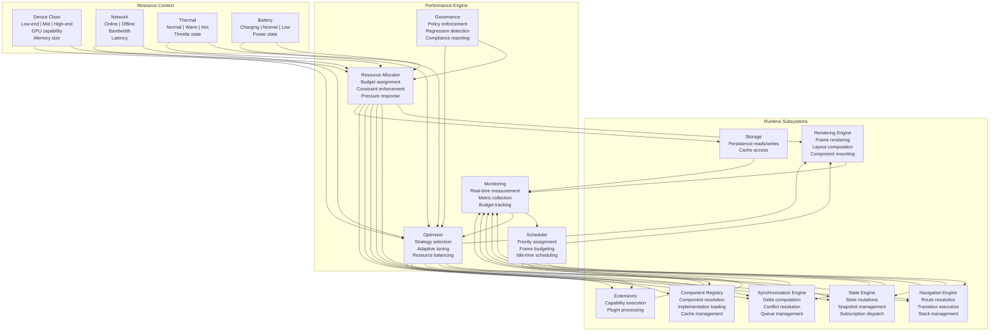
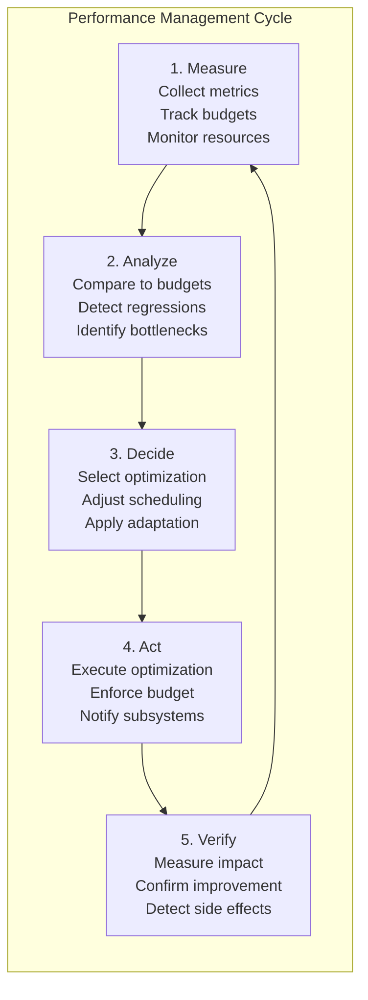
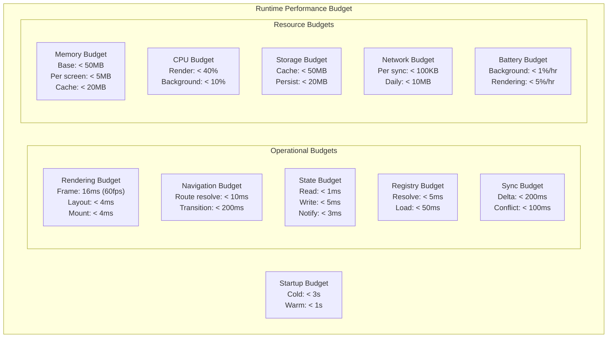
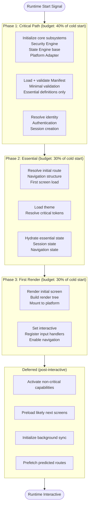
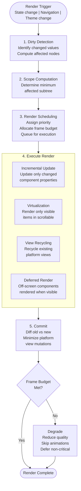
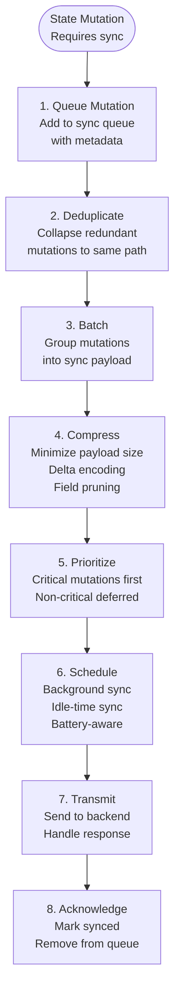
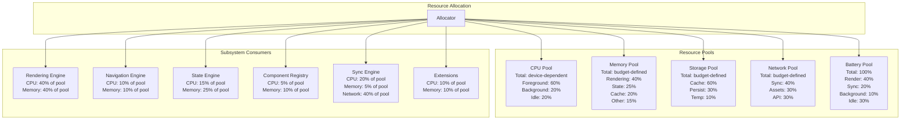
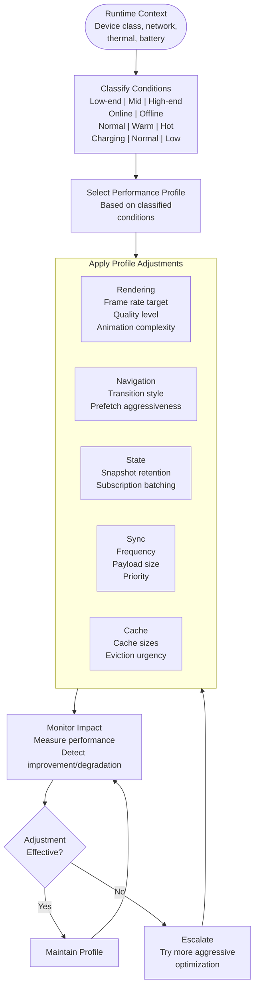

# Runtime Performance & Optimization Architecture

**KB-059 — Runtime Performance & Optimization Architecture Specification**

| Metadata | |
|----------|---|
| **KB ID** | KB-059 |
| **Title** | Runtime Performance & Optimization Architecture |
| **Version** | 0.1.0 |
| **Status** | Draft |
| **Owner** | Architecture Team |
| **Suite** | Runtime & Rendering Architecture |
| **Dependencies** | KB-051 Runtime Architecture Overview, KB-052 Rendering Engine Architecture, KB-053 Rendering Pipeline Architecture, KB-054 Runtime Component Registry Architecture, KB-055 Runtime State Engine Architecture, KB-056 Runtime Navigation Engine Architecture, KB-057 Runtime Security Architecture, KB-058 Runtime Observability & Diagnostics Architecture, KB-020 Offline & Synchronization |
| **Related Documents** | KB-041 Application Architecture Overview, KB-042 Application Manifest Specification, KB-043 Workspace & Tenant Model, KB-044 Navigation Architecture, KB-045 Screen Model, KB-046 Component Tree Model, KB-047 Action & Event Model, KB-048 Application State Model, KB-049 Theme & Design Token Model, KB-050 Capability Composition Model, KB-060 Runtime Lifecycle Management Architecture |
| **Review Status** | Pending |
| **Last Updated** | 2026-07-11 |

---

### Revision History

| Version | Date | Author | Change |
|---------|------|--------|--------|
| 0.1.0 | 2026-07-11 | AI Architecture Agent | Initial draft |

---

## 1. Executive Summary

### 1.1 Purpose

This document defines the Runtime Performance & Optimization Architecture for the DUKADESK platform. It establishes the architectural model for ensuring that every DUKADESK Runtime — Mobile, Web, Desktop, Preview, Builder Preview, and AI Runtime Services — delivers predictable, scalable, efficient, and resource-aware performance.

Performance is a platform capability, not an implementation concern. Every Runtime subsystem — Rendering Engine, Navigation Engine, State Engine, Component Registry, Synchronization Engine, Extension Framework — must participate in a coordinated optimization strategy while preserving correctness, determinism, security, and observability. The architecture defined in this document governs how Runtime subsystems measure, budget, schedule, optimize, and adapt their resource usage.

### 1.2 Scope

**In scope:**

- Architectural principles: Performance by Design, Lazy by Default, Incremental Processing, Predictable Resource Usage, Deterministic Optimization, Runtime Independence, Platform Neutrality, Graceful Degradation, Observable Performance, Sustainable Scalability
- Canonical definitions: Runtime Performance, Performance Budget, Optimization Strategy, Resource Budget, Rendering Budget, Memory Budget, Startup Budget, Throughput, Latency, Responsiveness, Scheduling, Performance Profile, Performance Baseline
- Performance Architecture: cross-cutting Performance Engine across all Runtime subsystems
- Runtime responsibilities: performance measurement, resource allocation, scheduling, memory optimization, startup optimization, rendering optimization, state optimization, navigation optimization, synchronization optimization, recovery optimization
- Performance budgets: startup, first render, navigation, rendering, memory, CPU, GPU, storage, network, battery, background processing
- Startup optimization: runtime boot, Manifest loading, dependency resolution, progressive initialization, deferred services, warm startup, cold startup
- Rendering optimization: incremental rendering, virtualization, partial updates, dirty checking, render scheduling, view recycling
- Navigation optimization: route prefetching, stack optimization, screen caching, predictive navigation, deferred navigation
- State optimization: lazy hydration, incremental state, snapshot optimization, subscription optimization, efficient diffing
- Registry optimization: lazy resolution, registry cache, metadata cache, dependency cache, component preloading
- Synchronization optimization: delta sync, incremental sync, queue optimization, conflict minimization, background synchronization
- Resource management: CPU allocation, memory allocation, storage allocation, network utilization, battery awareness, background task scheduling
- Adaptive performance: low-end devices, high-end devices, network conditions, offline conditions, thermal constraints, battery constraints
- Performance governance: standards, budgets, reviews, regression detection, optimization policies
- Responsibilities: Runtime, Builder, Backend
- Observability integration with KB-058
- Security considerations: secure caching, protected optimization data, safe background processing, resource abuse prevention
- Failure scenarios and anti-patterns
- Future evolution

**Out of scope:**

- Implementation details: specific performance libraries, profilers, optimization algorithms
- Platform-specific performance tuning (handled by Platform Adaptation Layer)
- Network protocol optimization (handled by Network Layer)
- Backend performance architecture (handled by Backend architecture)
- Specific performance benchmarks and targets (established by Performance Governance)

---

## 2. Architectural Principles

### 2.1 Performance by Design

Performance is designed into every subsystem, not added after implementation. Every architectural decision considers performance implications. Data structures are chosen for access patterns. Algorithms are chosen for computational complexity. Resource usage is estimated before implementation.

### 2.2 Lazy by Default

Operations are deferred to the latest possible moment. Definitions are loaded when needed. State is hydrated when accessed. Components are resolved when rendered. Lazy by default minimizes startup time, reduces peak memory, and avoids wasted computation.

### 2.3 Incremental Processing

Work is processed incrementally whenever possible. Full processing is the exception, not the default. The rendering pipeline processes screen changes incrementally. State synchronization processes only changed values. Navigation loads only the target screen.

### 2.4 Predictable Resource Usage

Resource usage is predictable and bounded. Every subsystem has defined resource budgets — memory, CPU, storage, network. Budgets are enforced at runtime. Usage above budget triggers defined responses — degradation, throttling, or termination.

### 2.5 Deterministic Optimization

Optimizations produce deterministic results. The same inputs produce the same performance characteristics across executions. Non-deterministic optimization — adaptive quality based on runtime conditions — is explicitly managed and documented.

### 2.6 Runtime Independence

The performance architecture is independent of any specific Runtime. Performance budgets, scheduling strategies, and optimization patterns apply across Mobile, Web, Desktop, and Preview Runtimes. Runtime-specific performance tuning is abstracted behind the Platform Adaptation Layer.

### 2.7 Platform Neutrality

Performance optimization contains no platform-specific logic. Platform-specific performance concerns — GPU capabilities, memory management, thermal throttling — are surfaced through the Platform Adaptation Layer but optimized by the platform-neutral Performance Engine.

### 2.8 Graceful Degradation

When resource budgets are exceeded, degradation is graceful and user-visible impact is minimized. Animations are disabled before content is removed. Image quality is reduced before layout is compromised. Background sync is delayed before foreground interaction is affected.

### 2.9 Observable Performance

Every performance metric is observable. Performance measurement is built into every subsystem, not added as an afterthought. Metrics are published for real-time monitoring, historical analysis, and regression detection.

### 2.10 Sustainable Scalability

Performance architecture scales sustainably with application complexity. Adding screens, components, capabilities, or users does not cause disproportionate performance degradation. Performance characteristics grow linearly or sub-linearly with application size.

---

## 3. Canonical Definitions

### 3.1 Runtime Performance

The measurable efficiency of Runtime execution across all subsystems. Performance encompasses startup time, rendering throughput, navigation responsiveness, state operation latency, synchronization speed, memory usage, CPU utilization, and battery consumption.

### 3.2 Performance Budget

A defined, enforced limit on resource consumption for a specific operation or subsystem. Budgets are defined at design time, measured at runtime, and enforced by the Performance Engine. Budget violations trigger defined responses.

### 3.3 Optimization Strategy

A defined approach to improving performance for a specific subsystem or operation. Strategies include lazy loading, incremental processing, caching, prefetching, view recycling, and resource pooling. Strategies are selected based on the performance profile and resource context.

### 3.4 Resource Budget

A performance budget for a specific resource type: memory, CPU, GPU, storage, network, battery. Each subsystem has defined resource budgets that constrain its resource consumption.

### 3.5 Rendering Budget

The maximum time allocated for rendering a single frame. The rendering budget is typically 16ms for 60fps or 8ms for 120fps. Frame time exceeding the rendering budget causes dropped frames and visible jank.

### 3.6 Memory Budget

The maximum memory allocation for a subsystem, screen, or component. Memory budgets prevent unbounded memory growth and ensure predictable memory pressure behavior.

### 3.7 Startup Budget

The maximum time from Runtime initialization to first interactive screen. Startup budgets are defined for cold start (no cached state) and warm start (cached state available).

### 3.8 Throughput

The rate at which the Runtime processes operations. Throughput metrics include screens rendered per second, state mutations processed per second, navigation transitions completed per second, and synchronization payloads processed per second.

### 3.9 Latency

The time from operation request to operation completion. Latency metrics include navigation transition time, state read/write time, component resolution time, and synchronization round-trip time.

### 3.10 Responsiveness

The perceived speed of the Runtime from the user's perspective. Responsiveness is measured by time-to-interactive, frame rate consistency, navigation smoothness, and input-to-action latency.

### 3.11 Scheduling

The mechanism by which the Runtime allocates execution time to competing operations. Scheduling prioritizes visible, interactive work over background work. Scheduling strategies include priority queues, frame budgeting, and idle-time processing.

### 3.12 Performance Profile

A characterization of Runtime performance under specific conditions. A performance profile includes resource usage, operation latency, throughput, and responsiveness for a defined workload, device class, and network condition.

### 3.13 Performance Baseline

The reference performance measurement against which regressions are detected. Baselines are established during performance testing and updated when significant architectural changes occur.

---

## 4. Performance Architecture

### 4.1 Architecture Overview



### 4.2 Performance Flow



---

## 5. Runtime Responsibilities

### 5.1 Performance Measurement

| Responsibility | Description |
|--------------|-------------|
| Metric collection | Collect performance metrics from all subsystems — durations, counts, sizes, rates |
| Budget tracking | Track resource consumption against defined budgets for each subsystem |
| Real-time monitoring | Monitor performance in real time for adaptive decision-making |
| Baseline comparison | Compare current metrics against performance baselines |
| Metric publication | Publish metrics for observability (KB-058 integration) |

### 5.2 Resource Allocation

| Responsibility | Description |
|--------------|-------------|
| Budget assignment | Assign resource budgets to subsystems based on device class and workload |
| Budget enforcement | Enforce budgets — throttle, degrade, or terminate subsystems exceeding budgets |
| Resource balancing | Balance resource allocation across competing subsystems |
| Pressure response | Respond to resource pressure — memory pressure, CPU throttling, thermal limits |
| Dynamic adjustment | Adjust resource allocation dynamically based on runtime conditions |

### 5.3 Scheduling

| Responsibility | Description |
|--------------|-------------|
| Priority assignment | Assign execution priorities to operations based on visibility and urgency |
| Frame budgeting | Allocate frame time across rendering, layout, and component updates |
| Idle-time scheduling | Schedule non-critical work during idle periods |
| Background scheduling | Schedule background work at lower priority than foreground work |
| Preemption | Preempt lower-priority work when higher-priority work arrives |

### 5.4 Memory Optimization

| Responsibility | Description |
|--------------|-------------|
| Lazy allocation | Defer memory allocation until resources are actually needed |
| Pool management | Manage object pools for frequently created/destroyed objects |
| Cache management | Manage cache sizes and eviction policies for all subsystem caches |
| Snapshot retention | Limit retained state snapshots to prevent memory growth |
| Garbage collection coordination | Coordinate with platform GC for efficient memory reclamation |

### 5.5 Startup Optimization

| Responsibility | Description |
|--------------|-------------|
| Progressive initialization | Initialize subsystems in dependency order; defer non-critical subsystems |
| Lazy definition loading | Load Manifest definitions lazily; defer non-critical definitions |
| Warm start optimization | Leverage cached definitions and state for fast warm starts |
| Cold start optimization | Minimize cold start time through optimal initialization ordering |
| Startup budget enforcement | Enforce startup budget; degrade non-critical initialization if budget exceeded |

### 5.6 Rendering Optimization

| Responsibility | Description |
|--------------|-------------|
| Incremental rendering | Re-render only changed components; skip unchanged subtrees |
| Virtualization | Virtualize scrollable content; render only visible items |
| Partial updates | Update only changed platform views; avoid full tree updates |
| Render scheduling | Schedule render work within frame budget; defer excess work |
| View recycling | Recycle platform view instances in scrollable lists |

### 5.7 State Optimization

| Responsibility | Description |
|--------------|-------------|
| Lazy hydration | Hydrate state scopes lazily; defer non-visible scope hydration |
| Incremental updates | Process only changed state paths on mutation |
| Snapshot optimization | Optimize snapshot creation and comparison for minimal overhead |
| Subscription optimization | Batch subscription notifications; deduplicate subscribers |
| Efficient diffing | Use efficient tree diffing algorithms for snapshot comparison |

### 5.8 Navigation Optimization

| Responsibility | Description |
|--------------|-------------|
| Route prefetching | Prefetch route definitions for predicted navigation targets |
| Stack optimization | Limit stack depth; prune unnecessary stack entries |
| Screen caching | Cache rendered screen state for fast back-navigation |
| Predictive navigation | Predict user navigation targets and prepare ahead |
| Deferred navigation | Defer non-critical navigation preparation to idle time |

### 5.9 Synchronization Optimization

| Responsibility | Description |
|--------------|-------------|
| Delta sync | Synchronize only changed state paths; avoid full state sync |
| Incremental sync | Process sync payloads incrementally; avoid full state replacement |
| Queue optimization | Batch and deduplicate sync queue entries before transmission |
| Conflict minimization | Design state model to minimize synchronization conflicts |
| Background scheduling | Schedule synchronization during idle or background time |

### 5.10 Recovery Optimization

| Responsibility | Description |
|--------------|-------------|
| Efficient crash recovery | Minimize recovery time through optimized state persistence |
| Optimized session restore | Restore session state lazily; defer non-critical state restoration |
| Graceful offline recovery | Prioritize critical state synchronization on reconnection |
| Cache-first recovery | Serve cached data during recovery; fetch fresh data in background |

---

## 6. Performance Budgets

### 6.1 Budget Hierarchy



### 6.2 Budget Definitions

| Budget | Scope | Target | Enforcement | Violation Response |
|--------|-------|--------|-------------|-------------------|
| **Cold Startup** | Initialization to interactive | < 3s, target < 1.5s | Timing enforcement | Progressive loading; defer non-critical |
| **Warm Startup** | Restore to interactive | < 1s, target < 500ms | Timing enforcement | Use cached state; limit re-initialization |
| **Frame Render** | Per-frame total | < 16ms at 60fps, < 8ms at 120fps | Frame timing | Drop frames; reduce quality |
| **Layout Compute** | Per-frame layout | < 4ms | Frame timing | Cache layout; relax constraints |
| **Route Resolution** | Per navigation intent | < 10ms | Timing enforcement | Cache route resolution |
| **Navigation Transition** | Screen switch | < 200ms visible feedback | Timing enforcement | Instant transition fallback |
| **State Read** | Per state read | < 1ms | Timing enforcement | Cache frequently read paths |
| **State Write** | Per mutation | < 5ms | Timing enforcement | Batch writes |
| **Component Resolution** | Per component lookup | < 5ms | Timing enforcement | Cache resolved components |
| **Delta Sync** | Per sync cycle | < 200ms | Timing enforcement | Chunk large syncs |
| **Memory Base** | Runtime baseline | < 50MB | Allocation tracking | Evict caches; release snapshots |
| **Memory Per Screen** | Additional per screen | < 5MB | Allocation tracking | Virtualize; reduce detail |
| **CPU Render** | Rendering CPU usage | < 40% sustained | Utilization tracking | Reduce quality; throttle |
| **Network Per Sync** | Per sync payload | < 100KB | Size tracking | Compress; reduce delta scope |

### 6.3 Budget Lifecycle

| Phase | Activity | Output |
|-------|----------|--------|
| **Design** | Define budgets based on target device class and performance requirements | Budget specification |
| **Implementation** | Instrument subsystems to measure and enforce budgets | Budget instrumentation |
| **Testing** | Measure actual performance against budgets | Budget compliance report |
| **Monitoring** | Track budget consumption in production | Real-time budget status |
| **Review** | Review budget compliance and adjust as needed | Budget update |

---

## 7. Startup Optimization

### 7.1 Startup Optimization Pipeline



### 7.2 Progressive Initialization

Subsystems are initialized in progressive phases:

| Phase | Subsystems | Criticality | Blocking |
|-------|------------|-------------|----------|
| **1. Critical** | Security Engine, State Engine base, Platform Adapter, Logging | Must start before anything else | Yes — pipeline blocks |
| **2. Essential** | Manifest Resolver, Navigation Engine, Theme Engine, Rendering Engine | Must be ready for first render | Yes — first render blocks |
| **3. Supporting** | Component Registry, Action Dispatcher, Event Bus, Permission Engine | Needed for full interaction | No — initial render proceeds |
| **4. Deferred** | Synchronization Engine, Cache warmers, Analytics, Diagnostics | Non-critical for startup | No — initialized post-interactive |

### 7.3 Cold vs Warm Start

| Aspect | Cold Start | Warm Start |
|--------|-----------|------------|
| **Definition** | No cached state; first launch after install or clear | Cached state available; recent launch |
| **Target budget** | < 3s | < 1s |
| **Manifest** | Fetch from remote or load from bundled file | Load from definition cache |
| **State** | Initialize from Manifest defaults + server | Restore from persisted state snapshot |
| **Component Registry** | Load all platform components | Cache hit for previously used components |
| **Navigation** | Resolve from Manifest definitions | Restore from persisted navigation state |
| **Theme** | Load from Manifest reference | Cache hit from theme cache |

---

## 8. Rendering Optimization

### 8.1 Rendering Optimization Flow



### 8.2 Optimization Strategies

| Strategy | Mechanism | When Applied | Impact |
|----------|-----------|--------------|--------|
| **Incremental update** | Re-render only components with changed bindings | Every state/theme change | Minimizes re-render scope |
| **Virtualization** | Render only visible items in scrollable containers | Scrollable lists and grids | O(visible) instead of O(total) |
| **Partial update** | Update only changed platform view properties | Component property changes | Minimizes platform bridge calls |
| **Dirty checking** | Compare old and new values before re-rendering | Before component update | Eliminates unnecessary re-renders |
| **Render scheduling** | Prioritize visible content; defer non-visible | Each frame | Consistent frame rate |
| **View recycling** | Reuse unmounted views for new components | Scrollable lists | Reduces view creation/destruction |
| **Layout caching** | Cache computed layouts by breakpoint | Screen revisit at same breakpoint | Eliminates layout recomputation |
| **Component memoization** | Skip re-render for unchanged inputs | Component update | Eliminates unnecessary renders |

---

## 9. Navigation Optimization

### 9.1 Optimization Strategies

| Strategy | Mechanism | When Applied | Impact |
|----------|-----------|--------------|--------|
| **Route prefetching** | Preload route definitions for likely next screens | After navigation to current screen | Faster subsequent navigation |
| **Stack optimization** | Limit stack depth; prune unnecessary entries | On push beyond depth limit | Bounded memory growth |
| **Screen caching** | Retain rendered screen state for fast back-nav | On navigation away | Instant back navigation |
| **Predictive navigation** | Predict next navigation target based on patterns | Continuous during interaction | Preloaded screens ready |
| **Deferred navigation** | Prepare navigation in background before user acts | During idle time | Reduced perceived latency |

### 9.2 Route Prefetching

Route prefetching loads route definitions before they are needed:

| Prefetch Trigger | Prefetch Target | Timing |
|-----------------|----------------|--------|
| Screen rendered | Likely next screens (based on navigation patterns) | After screen render completes |
| User hover/focus | Linked screen definition | On hover/focus event |
| Gesture start | Target screen for swipe/gesture | On gesture detection |
| Deep link received | Deep link target screen + chain | On deep link receipt |
| Timer-based | Screens scheduled for time-based navigation | Before scheduled time |

---

## 10. State Optimization

### 10.1 Optimization Strategies

| Strategy | Mechanism | When Applied | Impact |
|----------|-----------|--------------|--------|
| **Lazy hydration** | Hydrate state scopes only when their owner is created | Screen/component creation | Minimizes startup state |
| **Incremental state** | Process only changed paths on mutation | Every state mutation | O(changed) instead of O(total) |
| **Snapshot optimization** | Use structural sharing for snapshot memory efficiency | Every snapshot creation | Shares unchanged subtrees |
| **Subscription optimization** | Batch notifications; deduplicate subscribers | On state change notification | Sub-linear notification scaling |
| **Efficient diffing** | Tree-diff snapshots using path-based comparison | On mutation | O(changed paths) |

### 10.2 Structural Sharing

State snapshots use structural sharing to minimize memory overhead:

```
Snapshot 1: { a: 1, b: { c: 2, d: 3 } }
                   ↓ mutation: a → 4
Snapshot 2: { a: 4, b: { c: 2, d: 3 } }
                   └── shared reference ──┘
```

Unchanged subtrees are shared between snapshots via reference equality. Only the changed path creates new objects. Structural sharing makes snapshot creation O(changed paths) in memory and O(1) for unchanged subtrees.

---

## 11. Registry Optimization

### 11.1 Optimization Strategies

| Strategy | Mechanism | When Applied | Impact |
|----------|-----------|--------------|--------|
| **Lazy resolution** | Resolve component identifiers only when first rendered | Component mount | No resolution for unused components |
| **Registry cache** | Cache resolved component implementations | After first resolution | O(1) subsequent resolution |
| **Metadata cache** | Cache component schemas and property definitions | Component registration | Fast schema validation |
| **Dependency cache** | Cache component dependency resolutions | Capability activation | Fast dependency satisfaction checks |
| **Component preloading** | Preload likely components after screen load | After initial render | Faster subsequent mounts |

---

## 12. Synchronization Optimization

### 12.1 Synchronization Optimization Pipeline



### 12.2 Optimization Strategies

| Strategy | Mechanism | When Applied | Impact |
|----------|-----------|--------------|--------|
| **Delta sync** | Transmit only changed paths | Every sync cycle | Minimizes payload size |
| **Incremental sync** | Process sync in small chunks | Large sync operations | Responsive during sync |
| **Queue optimization** | Deduplicate and batch queue entries | Before transmission | Fewer, smaller sync calls |
| **Conflict minimization** | Design state for conflict-free sync | State model design | Fewer conflict resolutions |
| **Background scheduling** | Sync during idle or background | Connectivity + idle | No foreground impact |
| **Compression** | Compress sync payloads | Before transmission | Reduced bandwidth |
| **Priority queuing** | Prioritize critical mutations | Queue ordering | Critical data syncs first |

---

## 13. Resource Management

### 13.1 Resource Management Model



### 13.2 Resource Pressure Response

| Pressure Signal | Response | Affected Subsystems |
|----------------|----------|---------------------|
| **Memory pressure (warning)** | Evict non-critical caches; release old snapshots | Cache Manager, State Engine |
| **Memory pressure (critical)** | Unmount non-visible screens; clear all caches | Rendering, Cache, State |
| **CPU throttling** | Reduce render quality; disable animations | Rendering Engine |
| **Thermal throttling** | Reduce frame rate; suspend background work | All subsystems |
| **Low battery** | Suspend background sync; reduce network activity | Sync Engine, Network |
| **Network congestion** | Reduce sync frequency; compress payloads | Sync Engine |
| **Storage full** | Evict caches; truncate history; clear temp | Cache, History, Storage |

---

## 14. Adaptive Performance

### 14.1 Adaptive Performance Decision Flow



### 14.2 Performance Profiles

| Profile | Device Class | Network | Thermal | Battery | Rendering | Sync | Cache |
|---------|-------------|---------|---------|---------|-----------|------|-------|
| **Maximum** | High-end | Fast WiFi | Normal | Charging | 120fps, max quality | Real-time | Maximum |
| **Standard** | Mid-range | 4G/LTE | Normal | Normal | 60fps, standard quality | On change | Standard |
| **Power Save** | Any | Any | Normal | Low | 30fps, reduced quality | Deferred | Reduced |
| **Thermal Throttle** | Any | Any | Hot | Any | 30fps, minimum quality | Suspended | Minimum |
| **Low-End** | Low-end | Any | Normal | Any | 30fps, basic quality | On connectivity | Minimal |
| **Offline** | Any | Offline | Normal | Any | 60fps, standard quality | Queued | Offline max |
| **Data Saver** | Any | Cellular | Normal | Any | 60fps, standard quality | Compressed, delayed | Standard |

---

## 15. Performance Governance

### 15.1 Performance Standards

| Standard | Description | Enforcement |
|----------|-------------|-------------|
| Startup time | Cold start < 3s, warm start < 1s | Automated performance testing |
| Frame rate | 60fps sustained, no dropped frames for user-initiated animations | Runtime frame monitoring |
| Navigation time | Route resolve < 10ms, transition feedback < 200ms | Performance measurement |
| Memory usage | Base < 50MB, per-screen < 5MB | Budget enforcement |
| Sync latency | Delta sync < 200ms on fast network | Synchronization monitoring |
| Cache hit rate | Definition cache > 80%, component cache > 90% | Cache monitoring |

### 15.2 Performance Reviews

| Review Type | Frequency | Scope | Participants |
|-------------|-----------|-------|-------------|
| **Per-subsystem review** | Per feature | Subsystem performance against budgets | Subsystem team |
| **Integration review** | Per release | Cross-subsystem performance interaction | All teams |
| **Regression review** | On detection | Regression root cause and fix | Performance team |
| **Budget review** | Quarterly | Budget accuracy and adjustment | Architecture team |

### 15.3 Regression Detection

| Regression | Detection Method | Threshold | Response |
|-----------|-----------------|-----------|----------|
| Startup regression | Automated startup timing | > 10% over baseline | Block release; investigate |
| Frame rate regression | Automated rendering benchmark | > 5% frame drop rate | Block release; investigate |
| Memory regression | Automated memory profiling | > 10% over baseline | Flag for review |
| Navigation regression | Automated navigation timing | > 15% over baseline | Flag for review |
| Sync regression | Automated sync timing | > 20% over baseline | Flag for review |

---

## 16. Subsystem Responsibilities

### 16.1 Runtime Responsibilities

| Responsibility | Description |
|--------------|-------------|
| Performance Engine | Operate the Performance Engine — measurement, scheduling, optimization, allocation, governance |
| Budget enforcement | Define, measure, and enforce performance budgets for all subsystems |
| Resource management | Manage CPU, memory, storage, network, and battery allocation across subsystems |
| Adaptive optimization | Select and apply performance profiles based on runtime conditions |
| Performance measurement | Collect and publish performance metrics for all subsystems |
| Regression detection | Detect and respond to performance regressions |

### 16.2 Builder Responsibilities

| Responsibility | Description |
|--------------|-------------|
| Definition efficiency | Produce efficient definitions — reasonable component counts, shallow layout trees |
| Resource declarations | Declare resource requirements — expected memory, expected component count |
| Performance-aware design | Design screens and navigation with performance in mind |
| Budget-compliant definitions | Ensure definitions stay within performance budgets |

### 16.3 Backend Responsibilities

| Responsibility | Description |
|--------------|-------------|
| Efficient APIs | Provide efficient API responses — paginated, filtered, compressed |
| Sync optimization | Support delta sync, incremental sync, and compressed payloads |
| Performance data | Provide performance baseline data for regression detection |
| Resource-efficient push | Minimize push notification size and frequency |

---

## 17. Observability Integration

### 17.1 Performance Metrics

| Metric Category | Metrics | Source | Destination |
|----------------|---------|--------|-------------|
| **Startup** | coldStartDuration, warmStartDuration, phaseDurations | Performance Engine | KB-058 Observability |
| **Rendering** | frameTime, frameRate, droppedFrames, renderNodeCount | Rendering Engine | KB-058 Observability |
| **Navigation** | routeResolveTime, transitionDuration, stackDepth | Navigation Engine | KB-058 Observability |
| **State** | readLatency, writeLatency, snapshotCount, subscriptionCount | State Engine | KB-058 Observability |
| **Registry** | resolveTime, cacheHitRate, registrationCount | Component Registry | KB-058 Observability |
| **Synchronization** | syncDuration, payloadSize, conflictCount | Sync Engine | KB-058 Observability |
| **Memory** | heapUsage, cacheSize, snapshotRetained | Performance Engine | KB-058 Observability |
| **CPU** | cpuUsage, renderCpu, backgroundCpu | Performance Engine | KB-058 Observability |

### 17.2 Latency Metrics

| Metric | Description | Collection |
|--------|-------------|------------|
| Input-to-render | Time from user input to visual feedback | Per interaction |
| Navigation-to-screen | Time from navigation intent to screen visible | Per navigation |
| State-mutation-to-render | Time from state change to re-render | Per mutation |
| Sync-request-to-ack | Time from sync request to backend acknowledgment | Per sync cycle |
| Component-resolve-to-mount | Time from component resolve to platform mount | Per component |

### 17.3 Optimization Metrics

| Metric | Description |
|--------|-------------|
| Cache hit rate by cache type | Percentage of cache hits per cache |
| Virtualization efficiency | Percentage of items virtualized vs rendered |
| Snapshot sharing ratio | Percentage of snapshot structure shared between versions |
| Subscription-to-notification ratio | Number of subscriptions vs delivered notifications |
| Sync compression ratio | Uncompressed vs compressed payload size |

---

## 18. Security Considerations

### 18.1 Secure Caching

| Concern | Mitigation |
|---------|------------|
| Cached sensitive data | Cache entries containing sensitive data are encrypted at rest |
| Cache poisoning | Cache entries are validated before use; integrity checked |
| Cache timing side-channels | Cache access patterns do not leak information about cached content |
| Cache invalidation | Cache invalidation is immediate and complete on security-relevant events |

### 18.2 Protected Optimization Data

Performance data that could reveal sensitive information is protected:

| Data Type | Protection | Rationale |
|-----------|------------|-----------|
| Navigation patterns | Aggregated, anonymized | Could reveal user behavior |
| State access patterns | Aggregated, anonymized | Could reveal data relationships |
| Component usage | Aggregated, anonymized | Could reveal application structure |
| Sync timing | Aggregated only | Could reveal operational patterns |

### 18.3 Safe Background Processing

Background processing must not compromise security:

| Concern | Mitigation |
|---------|------------|
| Background data access | Background processes operate within same security context as foreground |
| Background sync security | Background sync uses same authentication as foreground |
| Background resource abuse | Background processing has strict resource limits to prevent abuse |
| Background privilege escalation | Background processes cannot escalate privileges beyond their scope |

### 18.4 Resource Abuse Prevention

| Abuse | Prevention |
|-------|------------|
| Memory exhaustion | Memory budgets enforced; hard limits prevent runaway allocation |
| CPU exhaustion | CPU budgets enforced; background CPU throttled |
| Network abuse | Network budgets enforced; rate limiting applied |
| Storage abuse | Storage budgets enforced; cache size limits prevent disk filling |
| Battery abuse | Background processing limited on battery; sync frequency reduced |

---

## 19. Failure Scenarios

| Scenario | Detection | Response | Recovery |
|----------|-----------|----------|----------|
| Startup Budget Exceeded | Startup timer exceeds budget | Progressive loading; defer non-critical subsystems | Complete deferred initialization post-interactive |
| Memory Exhaustion | Memory pressure signal from platform | Evict caches; release snapshots; unmount non-visible screens | Restore from cache on re-navigation |
| Rendering Bottleneck | Frame time consistently exceeds budget | Reduce render quality; disable animations; defer non-critical renders | Restore quality when load decreases |
| Navigation Stall | Navigation transition exceeds budget | Show loading indicator; prepare fallback route | Complete transition when resources available |
| State Explosion | State mutation creates excessive snapshot retention | Limit snapshot retention depth; force garbage collection | Rebuild state from last stable snapshot |
| Registry Overload | Component resolution queue exceeds capacity | Process resolution queue with priority; defer non-critical resolutions | Resolve deferred when load decreases |
| Synchronization Congestion | Sync queue exceeds size or time threshold | Flush queue with priority ordering; drop low-priority entries | Recover dropped entries on next sync cycle |
| Performance Regression | Metrics exceed baseline beyond threshold | Alert performance team; log regression data | Rollback or deploy fix in next release |
| Budget Violation Persistent | Subsystem consistently exceeds budget | Throttle subsystem; reduce allocation; force degradation | Restore when budget compliance achieved |

---

## 20. Anti-Patterns

| Anti-Pattern | Description | Consequence | Correct Approach |
|-------------|-------------|-------------|-----------------|
| Eager loading everything | Loading all definitions, components, and state at startup | Slow startup, wasted memory, poor cold-start performance | Lazy by default — load when needed |
| Unlimited memory growth | No memory budgets or limits on caches, snapshots, or retained objects | Out-of-memory crashes, platform termination | Define and enforce memory budgets |
| Blocking rendering pipeline | Executing synchronous work — I/O, computation — in the rendering pipeline | Frame drops, jank, poor responsiveness | All non-rendering work off the render thread |
| Unbounded synchronization | Syncing full state on every change regardless of scope | Network waste, slow sync cycles, conflict proliferation | Delta sync — only changed paths |
| Deep component hierarchies | Layout trees with excessive nesting depth | Layout computation cost, memory overhead | Flat layout structure; limit nesting |
| Repeated dependency resolution | Resolving the same component or capability dependencies repeatedly | Wasted CPU, slower navigation | Cache all resolution results |
| Platform-specific optimization logic | Optimization decisions tied to specific platform APIs | Non-portable, hard to maintain | Platform-independent performance architecture |
| Ignoring device class | Applying same optimization strategy to all devices | Poor experience on low-end; wasted potential on high-end | Adaptive performance by device class |
| Optimizing without measuring | Applying optimizations without performance measurement | Blind changes may not improve or may degrade | Measure first; optimize second; verify third |

---

## 21. Future Evolution

### 21.1 AI-Driven Optimization

AI may drive performance optimization:

- **Predictive resource allocation** — AI predicts resource needs and pre-allocates accordingly.
- **Anomaly detection** — AI detects performance anomalies that may indicate issues.
- **Automated tuning** — AI tunes performance parameters based on observed usage patterns.

### 21.2 Predictive Preloading

The Runtime may predictively preload resources:

- **Navigation prediction** — Predict next screen and preload definitions, components, and data.
- **Interaction prediction** — Predict user interactions and preload response resources.
- **Time-based prediction** — Predict time-based events (scheduled orders, appointments) and preload accordingly.

### 21.3 Autonomous Runtime Tuning

The Runtime may autonomously tune performance:

- **Self-optimizing caches** — Cache sizes and eviction policies tuned based on usage patterns.
- **Self-adjusting budgets** — Performance budgets adjusted based on observed device capabilities.
- **Self-healing performance** — Runtime detects and corrects performance degradation without user intervention.

### 21.4 Edge-Aware Optimization

Optimization may consider edge infrastructure:

- **Edge computation offload** — Computation offloaded to edge servers for performance.
- **Edge caching** — Definitions and assets cached on edge nodes for low-latency access.
- **Edge rendering initiation** — Render tree construction initiated on edge for faster client rendering.

### 21.5 Adaptive Rendering Strategies

Rendering may adapt more intelligently:

- **Content-aware rendering** — Rendering adapts based on content type — text, images, animations.
- **Attention-aware rendering** — Rendering prioritizes content in the user's visual focus area.
- **Context-aware quality** — Visual quality adapts based on context — reading, browsing, transaction.

### 21.6 Intelligent Scheduling

Scheduling may become more intelligent:

- **Deadline-based scheduling** — Operations scheduled based on their completion deadlines.
- **Workload-aware scheduling** — Scheduler adapts to workload patterns — burst, steady, idle.
- **Energy-aware scheduling** — Scheduler optimizes for energy efficiency on battery.

---

## 22. Cross-References

| Reference | Description |
|-----------|-------------|
| KB-020 | Offline & Synchronization — synchronization optimization coordination |
| KB-051 | Runtime Architecture Overview — foundational Runtime architecture |
| KB-052 | Rendering Engine Architecture — rendering optimization targets |
| KB-053 | Rendering Pipeline Architecture — pipeline optimization integration |
| KB-054 | Runtime Component Registry Architecture — registry optimization strategies |
| KB-055 | Runtime State Engine Architecture — state optimization targets |
| KB-056 | Runtime Navigation Engine Architecture — navigation optimization strategies |
| KB-057 | Runtime Security Architecture — security context for optimization |
| KB-058 | Runtime Observability & Diagnostics Architecture — performance metric consumption |
| KB-041 | Application Architecture Overview — application-level performance context |
| KB-042 | Application Manifest Specification — Manifest that defines startup definitions |
| KB-045 | Screen Model — screen definitions that determine render complexity |
| KB-046 | Component Tree Model — component trees that determine layout cost |
| KB-047 | Action & Event Model — actions and events that drive state mutations |
| KB-048 | Application State Model — state model that determines hydration cost |
| KB-049 | Theme & Design Token Model — theme model that determines token resolution cost |
| KB-050 | Capability Composition Model — capabilities that contribute to registry load |
| KB-060 | Runtime Lifecycle Management Architecture — lifecycle state coordination |

---

## 23. Open Questions

1. Should performance budgets be configurable per tenant, or should they be uniform across all tenants?
2. What is the appropriate granularity for performance measurement — per operation, per frame, per screen, or per session?
3. Should the Runtime support performance budgets for individual capabilities to prevent one capability from degrading others?
4. What is the appropriate strategy for cross-subsystem budget coordination — global priority or local optimization?
5. Should performance profiles be user-selectable, or should they be automatically determined?
6. What is the appropriate retention policy for performance metrics — session-only, rolling window, or persistent?
7. Should the Runtime support hardware-specific performance profiles for different device chipsets?
