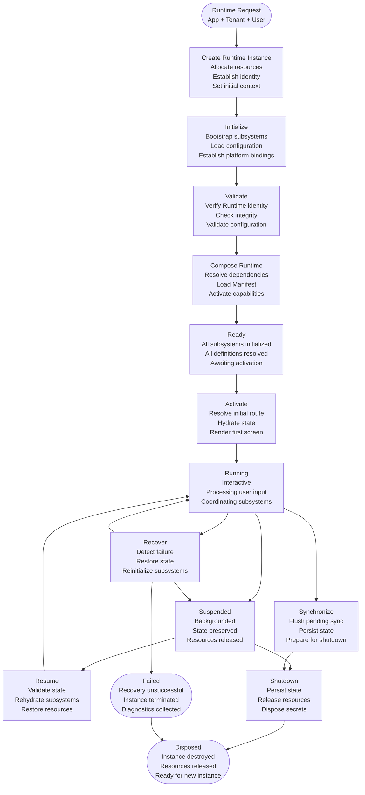
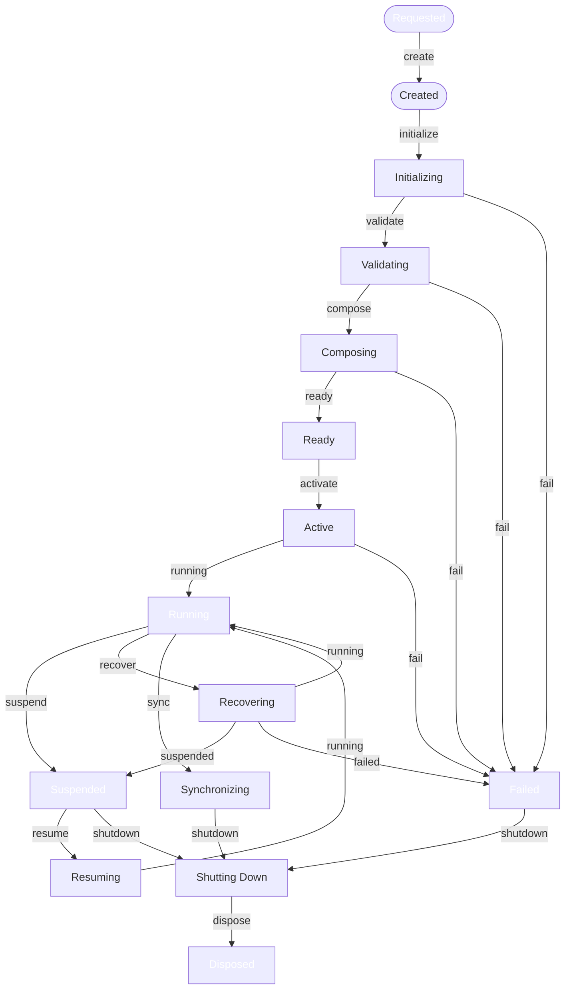
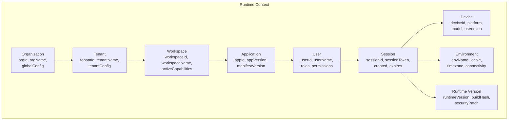
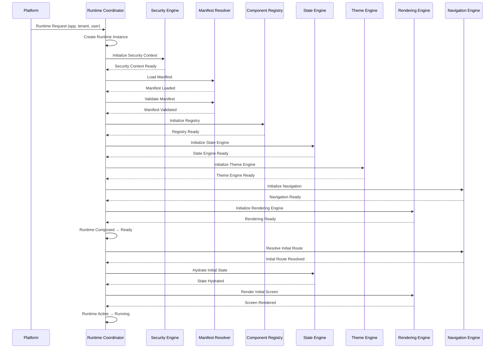
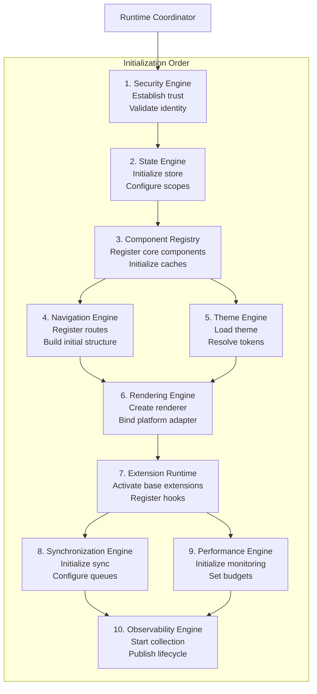
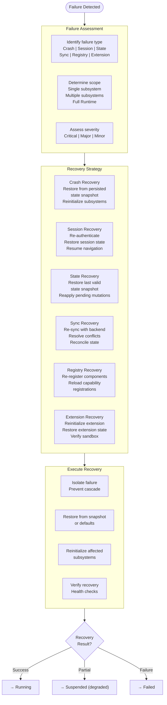
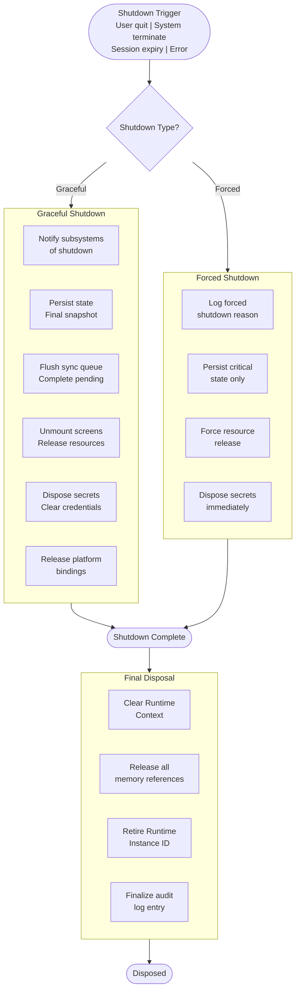
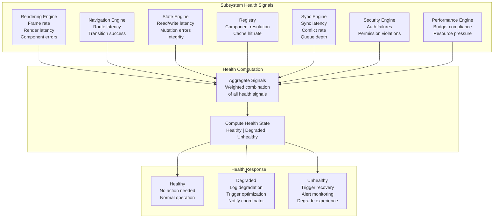

# Runtime Lifecycle Management Architecture

**KB-060 — Runtime Lifecycle Management Architecture Specification**

| Metadata | |
|----------|---|
| **KB ID** | KB-060 |
| **Title** | Runtime Lifecycle Management Architecture |
| **Version** | 0.1.0 |
| **Status** | Draft |
| **Owner** | Architecture Team |
| **Suite** | Runtime & Rendering Architecture |
| **Dependencies** | KB-051 Runtime Architecture Overview, KB-052 Rendering Engine Architecture, KB-053 Rendering Pipeline Architecture, KB-054 Runtime Component Registry Architecture, KB-055 Runtime State Engine Architecture, KB-056 Runtime Navigation Engine Architecture, KB-057 Runtime Security Architecture, KB-058 Runtime Observability & Diagnostics Architecture, KB-059 Runtime Performance & Optimization Architecture, KB-020 Offline & Synchronization |
| **Related Documents** | KB-041 Application Architecture Overview, KB-042 Application Manifest Specification, KB-043 Workspace & Tenant Model, KB-044 Navigation Architecture, KB-045 Screen Model, KB-046 Component Tree Model, KB-047 Action & Event Model, KB-048 Application State Model, KB-049 Theme & Design Token Model, KB-050 Capability Composition Model |
| **Review Status** | Pending |
| **Last Updated** | 2026-07-11 |

---

### Revision History

| Version | Date | Author | Change |
|---------|------|--------|--------|
| 0.1.0 | 2026-07-11 | AI Architecture Agent | Initial draft |

---

## 1. Executive Summary

### 1.1 Purpose

This document defines the Runtime Lifecycle Management Architecture for the DUKADESK platform. It governs the complete lifecycle of a DUKADESK Runtime instance — from creation through initialization, activation, running, suspension, recovery, synchronization, shutdown, and disposal.

This is not an operating system lifecycle. It is the architectural lifecycle of a DUKADESK Runtime across all supported execution environments — Mobile, Web, Desktop, Preview, Builder Preview, AI Runtime, and future Runtime hosts. The Runtime Lifecycle coordinates every major Runtime subsystem: Rendering Engine, Navigation Engine, State Engine, Security Engine, Component Registry, Synchronization Engine, Extension Runtime, Observability Engine, and Performance Engine.

The lifecycle is deterministic, observable, recoverable, and secure. Every transition between lifecycle states has defined entry criteria, exit criteria, failure modes, and recovery strategies. Every subsystem participates in lifecycle coordination through defined interfaces.

### 1.2 Scope

**In scope:**

- Architectural principles: deterministic lifecycle, explicit state transitions, idempotent lifecycle operations, recoverability by design, observable lifecycle, secure activation, runtime independence, graceful degradation, controlled shutdown, extensible lifecycle
- Canonical definitions: Runtime Instance, Runtime Lifecycle, Lifecycle State, Lifecycle Transition, Runtime Activation, Runtime Suspension, Runtime Recovery, Runtime Termination, Runtime Disposal, Runtime Health, Runtime Coordinator
- Runtime Lifecycle Architecture: from Runtime Request through Dispose
- Runtime Lifecycle States: Requested, Created, Initializing, Validating, Composing, Ready, Active, Running, Suspended, Resuming, Recovering, Synchronizing, Shutting Down, Disposed, Failed
- Runtime responsibilities: creation, dependency resolution, context initialization, activation, coordination, health monitoring, suspension, recovery, shutdown, disposal
- Runtime Context: Organization, Tenant, Workspace, Application, User, Session, Device, Environment, Runtime Version
- Lifecycle transition rules: allowed, invalid, recovery, retry policies, rollback expectations
- Startup lifecycle: bootstrapping, Manifest resolution, registry resolution, state hydration, theme resolution, initial rendering
- Runtime coordination: how lifecycle coordinates all major subsystems
- Suspension and resume: background execution, state preservation, resource release, resume validation, rehydration
- Recovery architecture: crash, session, state, synchronization, registry, extension
- Shutdown architecture: graceful, forced, state persistence, sync flush, resource cleanup, secure disposal
- Runtime health: health states, signals, checks, degradation, recovery thresholds
- Responsibilities: Runtime, Builder, Backend
- Security: secure startup, secure shutdown, secret disposal, runtime validation, isolation enforcement
- Performance: startup latency, resume latency, shutdown latency, recovery efficiency, lifecycle overhead
- Observability: lifecycle metrics, transition metrics, failure metrics, recovery metrics, health metrics, correlation IDs
- Offline behavior: offline startup, offline resume, deferred synchronization, offline shutdown, recovery
- Failure scenarios and anti-patterns
- Future evolution

**Out of scope:**

- Implementation details: threading models, platform-specific lifecycle APIs, operating system lifecycle integration
- Platform-specific lifecycle behavior (handled by Platform Adaptation Layer)
- Individual subsystem internal lifecycles (handled by respective specifications)
- Runtime versioning and update management (handled by KB-061)

---

## 2. Architectural Principles

### 2.1 Deterministic Lifecycle

The Runtime lifecycle is deterministic. Given the same inputs, the same sequence of lifecycle states and transitions occurs on every execution. Determinism enables reliable testing, predictable behavior, and reproducible debugging.

### 2.2 Explicit State Transitions

Every lifecycle state transition is explicit and intentional. Transitions do not occur implicitly or as side effects of other operations. Each transition is triggered by a defined event and produces a defined outcome.

### 2.3 Idempotent Lifecycle Operations

Lifecycle operations are idempotent. Repeatedly applying the same lifecycle operation produces the same result as applying it once. Idempotency enables safe retry of failed transitions.

### 2.4 Recoverability by Design

Every lifecycle state and transition has a defined recovery strategy. Failure at any point in the lifecycle has a defined recovery path. Recovery is not an afterthought — it is designed into every lifecycle phase.

### 2.5 Observable Lifecycle

Every lifecycle state, transition, and health signal is observable. Lifecycle events are published for monitoring, diagnostics, and analytics. Observability enables real-time health monitoring and post-mortem analysis.

### 2.6 Secure Activation

Runtime activation is secured. Every Runtime instance is validated before activation — identity verified, integrity checked, permissions confirmed. Unauthorized or compromised Runtime instances are blocked.

### 2.7 Runtime Independence

The lifecycle architecture is independent of any specific Runtime environment. The same lifecycle states, transitions, and coordination apply across Mobile, Web, Desktop, Preview, and future Runtimes. Platform-specific lifecycle concerns are abstracted.

### 2.8 Graceful Degradation

When the Runtime cannot complete a lifecycle transition, degradation is graceful. Partial functionality is preserved when full functionality cannot be achieved. Degradation is transparent to the user where possible.

### 2.9 Controlled Shutdown

Shutdown is always controlled, never abrupt. State is persisted, synchronization is flushed, resources are released, and secrets are disposed. Controlled shutdown prevents data loss and state corruption.

### 2.10 Extensible Lifecycle

The lifecycle supports extension. Extensions — capabilities, plugins, packages — can register lifecycle hooks at defined extension points. Extensions participate in initialization, activation, suspension, recovery, and shutdown without modifying the core lifecycle.

---

## 3. Canonical Definitions

### 3.1 Runtime Instance

A single execution of a DUKADESK Runtime for a specific application, tenant, and user session. A Runtime Instance has a unique identifier, a defined lifecycle state, and an associated Runtime Context. Multiple Runtime Instances may coexist for different applications or tenants.

### 3.2 Runtime Lifecycle

The defined sequence of states and transitions that a Runtime Instance passes through from creation to disposal. The lifecycle encompasses initialization, activation, running, suspension, recovery, synchronization, shutdown, and disposal.

### 3.3 Lifecycle State

A discrete, named phase in the Runtime Lifecycle. Each state has defined entry criteria, exit criteria, permitted operations, and allowed transitions. A Runtime Instance occupies exactly one lifecycle state at any time.

### 3.4 Lifecycle Transition

A controlled, observable movement from one Lifecycle State to another. Transitions have defined triggers, preconditions, execution steps, and postconditions. Transitions may succeed, fail, or be interrupted.

### 3.5 Runtime Activation

The transition from a loaded, validated, composed Runtime to an actively running Runtime. Activation is the point at which the Runtime becomes interactive and responsive to user input.

### 3.6 Runtime Suspension

The transition from Running to a suspended state where the Runtime preserves its state but releases resources. Suspension occurs when the Runtime is backgrounded, the device is locked, or the application is no longer visible.

### 3.7 Runtime Recovery

The transition from a Failed or corrupted state back to a stable, Running state. Recovery may involve restoring state from persistence, re-initializing subsystems, or falling back to a degraded mode.

### 3.8 Runtime Termination

The irreversible transition from any state to Shutting Down and then Disposed. Termination may be graceful (user-initiated, controlled) or forced (crash, system termination).

### 3.9 Runtime Disposal

The final lifecycle phase where all Runtime resources — memory, file handles, network connections, secrets — are released and the Runtime Instance identifier is retired.

### 3.10 Runtime Health

A measure of the Runtime Instance's ability to function correctly. Health is determined by periodic health checks of all subsystems. Health states include Healthy, Degraded, and Unhealthy.

### 3.11 Runtime Coordinator

The subsystem responsible for managing the Runtime Lifecycle. The Coordinator receives lifecycle events, validates transitions, coordinates subsystem participation, monitors health, and executes recovery.

---

## 4. Runtime Lifecycle Architecture

### 4.1 Architecture Overview

### 4.2 Lifecycle State Machine

---

## 5. Runtime Lifecycle States

### 5.1 State Definitions

| State | Description | Permitted Operations | Entry Criteria | Exit Criteria |
|-------|-------------|---------------------|---------------|--------------|
| **Requested** | Runtime creation requested but not yet created | None | External runtime request received | Runtime instance created |
| **Created** | Runtime instance allocated, identity established | Context queries | Request validated | Initialization started |
| **Initializing** | Subsystems being bootstrapped | None (initialization in progress) | Create completed | All core subsystems initialized |
| **Validating** | Runtime identity and configuration being validated | None (validation in progress) | Initialization completed | All validation checks passed |
| **Composing** | Dependencies being resolved, runtime composed | None (composition in progress) | Validation passed | All dependencies resolved, runtime composed |
| **Ready** | Runtime composed, awaiting activation | State reads, configuration queries | Composition completed | Activation triggered |
| **Active** | Runtime activating — resolving initial route, hydrating state | None (activation in progress) | Ready | Activation completed |
| **Running** | Runtime fully active and interactive | All application operations | Activation completed | Suspend, recover, or shutdown triggered |
| **Suspended** | Runtime backgrounded, state preserved, resources released | None (suspended) | Suspend trigger | Resume or shutdown |
| **Resuming** | Runtime returning from suspension | None (resuming) | Resume trigger | Running |
| **Recovering** | Runtime recovering from failure | None (recovery in progress) | Failure detected | Running, Suspended, or Failed |
| **Synchronizing** | Runtime synchronizing state before shutdown | None (sync in progress) | Shutdown with pending sync | Shutting Down |
| **Shutting Down** | Runtime shutting down — persisting, releasing, disposing | None (shutdown in progress) | Shutdown trigger | Disposed |
| **Disposed** | Runtime fully terminated, resources released | None | Shutdown completed | — |
| **Failed** | Runtime failed and recovery unsuccessful | Diagnostics only | Recovery failure | Disposed |

### 5.2 State Transition Triggers

| From | To | Trigger | Source |
|------|----|---------|--------|
| Requested | Created | createRuntime | Runtime Coordinator |
| Created | Initializing | initializeRuntime | Runtime Coordinator |
| Initializing | Validating | initializationComplete | Subsystem init completion |
| Initializing | Failed | initializationFailed | Subsystem init failure |
| Validating | Composing | validationPassed | Validation Engine |
| Validating | Failed | validationFailed | Validation Engine |
| Composing | Ready | compositionComplete | Dependency resolution |
| Composing | Failed | compositionFailed | Dependency resolution |
| Ready | Active | activateRuntime | Runtime Coordinator |
| Active | Running | activationComplete | Init render complete |
| Active | Failed | activationFailed | Init render failure |
| Running | Suspended | suspendRuntime | Platform background event |
| Running | Recovering | failureDetected | Health check failure |
| Suspended | Resuming | resumeRuntime | Platform foreground event |
| Resuming | Running | resumeComplete | Rehydration complete |
| Recovering | Running | recoveryComplete | Recovery success |
| Recovering | Suspended | recoveryToSuspended | Partial recovery |
| Recovering | Failed | recoveryFailed | Recovery failure |
| Running | Synchronizing | shutdownWithPendingSync | Shutdown with dirty state |
| Synchronizing | Shutting Down | syncComplete | Sync flush done |
| Suspended | Shutting Down | shutdownRuntime | User/system shutdown |
| Failed | Shutting Down | shutdownRuntime | User/system shutdown |
| Shutting Down | Disposed | disposeRuntime | Resource cleanup complete |

---

## 6. Runtime Responsibilities

### 6.1 Runtime Creation

| Responsibility | Description |
|--------------|-------------|
| Instance allocation | Allocate Runtime Instance identifier and resources |
| Identity establishment | Establish Runtime Identity — version, build, platform, installation ID |
| Context initialization | Initialize Runtime Context with Organization, Tenant, Application, User from request |
| Security baseline | Establish initial Security Context for the Runtime Instance |

### 6.2 Dependency Resolution

| Responsibility | Description |
|--------------|-------------|
| Subsystem dependency ordering | Resolve subsystem initialization order based on dependency graph |
| Platform dependency binding | Bind to platform dependencies — storage, network, device APIs |
| Capability dependency resolution | Resolve capability dependencies through Package Resolver |
| Version compatibility verification | Verify all dependency versions are compatible with Runtime version |

### 6.3 Context Initialization

| Responsibility | Description |
|--------------|-------------|
| Full context assembly | Assemble complete Runtime Context — Organization through Environment |
| Context validation | Validate context consistency — tenant belongs to organization, user belongs to tenant |
| Context persistence | Persist context for recovery across suspension and resume |
| Context propagation | Propagate context to all subsystems during initialization |

### 6.4 Runtime Activation

| Responsibility | Description |
|--------------|-------------|
| Activation sequence | Execute activation sequence — resolve initial route, hydrate state, render first screen |
| Subsystem readiness verification | Verify all subsystems report ready before activation |
| Rendering initiation | Request initial render from Rendering Pipeline |
| User interaction enablement | Enable user interaction after initial render completes |

### 6.5 Runtime Coordination

| Responsibility | Description |
|--------------|-------------|
| Subsystem lifecycle coordination | Coordinate lifecycle events across all subsystems — order, dependencies, timing |
| Transition management | Manage lifecycle transitions — validate, execute, monitor, complete |
| Health monitoring | Monitor subsystem health and trigger transitions when health degrades |
| Event publishing | Publish lifecycle events for observability |

### 6.6 Health Monitoring

| Responsibility | Description |
|--------------|-------------|
| Periodic health checks | Execute health checks on all subsystems at defined intervals |
| Health state computation | Compute overall Runtime Health from subsystem health signals |
| Degradation detection | Detect health degradation and trigger recovery or graceful degradation |
| Health event publishing | Publish health events for observability |

### 6.7 Suspension

| Responsibility | Description |
|--------------|-------------|
| State preservation | Preserve Runtime State — navigation stack, screen state, form data |
| Resource release | Release non-essential resources — GPU buffers, animation threads, network connections |
| Background notification | Notify subsystems of suspension for their own preparation |
| Persistence flush | Flush pending state persistence before suspension completes |

### 6.8 Recovery

| Responsibility | Description |
|--------------|-------------|
| Failure detection | Detect failures through health checks, crash signals, or integrity violations |
| Failure assessment | Assess failure scope — subsystem, state, data corruption level |
| Recovery strategy selection | Select recovery strategy based on failure type and severity |
| Recovery execution | Execute recovery — restore state, reinitialize subsystems, re-establish connections |
| Recovery verification | Verify recovery success through health checks |

### 6.9 Shutdown

| Responsibility | Description |
|--------------|-------------|
| Graceful shutdown sequence | Execute controlled shutdown — subsystems in reverse initialization order |
| State persistence | Persist final state snapshot before shutdown |
| Synchronization flush | Flush pending synchronization queue |
| Resource release | Release all resources — memory, file handles, network, GPU, platform bindings |
| Secret disposal | Dispose all secrets held by the Runtime Instance |

### 6.10 Disposal

| Responsibility | Description |
|--------------|-------------|
| Final cleanup | Perform final cleanup of any remaining Runtime resources |
| Instance identifier retirement | Retire Runtime Instance identifier |
| Audit log finalization | Finalize audit log with Runtime lifetime and termination reason |
| Memory release | Ensure all Runtime memory is eligible for garbage collection |

---

## 7. Runtime Context

### 7.1 Context Composition

### 7.2 Context Lifecycle

| Context Component | Established | Modified | Destroyed |
|------------------|-------------|----------|-----------|
| Organization | Runtime Creation | Never (fixed for instance) | Runtime Disposal |
| Tenant | Runtime Creation | On tenant switch | Runtime Disposal |
| Workspace | Runtime Creation | On workspace switch | Runtime Disposal |
| Application | Runtime Creation | Never (fixed for instance) | Runtime Disposal |
| User | Runtime Creation | On user change | Runtime Disposal |
| Session | Runtime Creation | On session refresh | Runtime Disposal |
| Device | Runtime Creation | Never (fixed for instance) | Runtime Disposal |
| Environment | Runtime Creation | On environment change | Runtime Disposal |
| Runtime Version | Runtime Creation | Never (fixed for instance) | Runtime Disposal |

---

## 8. Lifecycle Transition Rules

### 8.1 Allowed Transitions

Transitions are only allowed between defined state pairs. The Runtime Coordinator validates every transition against the allowed transition matrix:

| Current State | Allowed Next States |
|---------------|-------------------|
| Requested | Created |
| Created | Initializing |
| Initializing | Validating, Failed |
| Validating | Composing, Failed |
| Composing | Ready, Failed |
| Ready | Active |
| Active | Running, Failed |
| Running | Suspended, Recovering, Synchronizing |
| Suspended | Resuming, Shutting Down |
| Resuming | Running |
| Recovering | Running, Suspended, Failed |
| Synchronizing | Shutting Down |
| Shutting Down | Disposed |
| Failed | Shutting Down |
| Disposed | (terminal) |

### 8.2 Invalid Transitions

The following transitions are explicitly invalid and will be rejected by the Runtime Coordinator:

| From | To | Reason |
|------|----|--------|
| Requested | Running | Skipping initialization, validation, composition, activation |
| Created | Ready | Skipping initialization, validation, composition |
| Initializing | Active | Skipping validation, composition, ready, activation |
| Running | Active | Cannot return to activation — only suspension/resume or recovery |
| Running | Ready | Cannot deactivate — only suspend or shutdown |
| Disposed | Any | Terminal state — no transitions out |

### 8.3 Retry Policies

| Transition | Max Retries | Backoff | On Final Failure |
|-----------|-------------|---------|-----------------|
| Created → Initializing | 3 | Exponential (1s, 2s, 4s) | → Failed |
| Initializing → Validating | 2 | Linear (1s, 2s) | → Failed |
| Validating → Composing | 1 | None | → Failed |
| Composing → Ready | 3 | Exponential (1s, 2s, 4s) | → Failed |
| Active → Running | 2 | Linear (500ms, 1s) | → Failed |
| Suspended → Resuming | 3 | Exponential (500ms, 1s, 2s) | → Shutting Down |
| Running → Suspended | 2 | None | Log warning, continue |
| Recovering → Running | 3 | Exponential (1s, 2s, 4s) | → Failed |

### 8.4 Rollback Expectations

| Transition | Rollback Target | Rollback Condition | Data Integrity |
|-----------|----------------|-------------------|----------------|
| Initializing → Validating | Created | Initialization timeout, subsystem init failure | Full — no state written |
| Validating → Composing | Initializing | Validation failure | Full — no state written |
| Composing → Ready | Validating | Dependency resolution failure | Full — no mutable state |
| Active → Running | Ready | First render failure | Full — state not yet mutated |
| Suspend | Running | State preservation failure | Full — state restored |
| Resume | Suspended | Rehydration failure | Full — preserved state intact |
| Recover → Running | Depends on failure | Recovery strategy failure | Partial — best-effort restoration |

---

## 9. Startup Lifecycle

### 9.1 Startup Sequence

### 9.2 Startup Phases

| Phase | Duration Budget | Subsystems | Key Activities |
|-------|----------------|------------|----------------|
| **Bootstrap** | 10% of startup budget | Coordinator, Security, Platform | Create instance, establish security, bind platform |
| **Manifest** | 20% of startup budget | Manifest Resolver | Load, parse, validate Manifest |
| **Resolution** | 30% of startup budget | Registry, State, Theme, Nav | Initialize all subsystems, resolve definitions |
| **Activation** | 40% of startup budget | State, Nav, Render | Resolve route, hydrate state, render first screen |

---

## 10. Runtime Coordination

### 10.1 Subsystem Lifecycle Coordination

### 10.2 Subsystem Lifecycle Hooks

| Subsystem | Lifecycle Hooks | Participation |
|-----------|----------------|---------------|
| Security Engine | onInit, onValidate, onActivate, onSuspend, onResume, onShutdown | Every phase |
| State Engine | onInit, onReady, onActivate, onSuspend, onResume, onRecover, onShutdown | Init through shutdown |
| Component Registry | onInit, onReady, onCompose, onRecover, onShutdown | Init, compose, recover |
| Navigation Engine | onInit, onReady, onActivate, onSuspend, onResume, onShutdown | Init through shutdown |
| Theme Engine | onInit, onReady, onShutdown | Init, shutdown |
| Rendering Engine | onInit, onReady, onActivate, onSuspend, onResume, onRecover, onShutdown | Init through shutdown |
| Extension Runtime | onInit, onActivate, onSuspend, onResume, onRecover, onShutdown | Activation forward |
| Synchronization Engine | onInit, onReady, onActivate, onSuspend, onSync, onShutdown | Init through shutdown |
| Performance Engine | onInit, onReady, onActivate, onSuspend, onResume, onShutdown | Init through shutdown |
| Observability Engine | onInit, onReady, onActivate, onSuspend, onResume, onShutdown | Init through shutdown |

---

## 11. Suspension & Resume

### 11.1 Suspension & Resume Flow

```mermaid
flowchart TB
    RUNNING2(["Running\nRuntime interactive"])
    RUNNING2 --> SUSPEND_TRIGGER
    
    SUSPEND_TRIGGER(["Suspend Trigger\nBackground | Lock | Inactive"])
    SUSPEND_TRIGGER --> PREPARE_SUSPEND
    
    subgraph PREPARE_SUSPEND["Prepare Suspension"]
        SUS_STATE["1. Preserve State\nFreeze state snapshots\nPersist to storage"]
        SUS_NAV["2. Preserve Navigation\nSave stack and history\nPersist navigation state"]
        SUS_SYNC["3. Flush Sync\nComplete pending sync\nQueue deferred items"]
        SUS_EXT["4. Notify Extensions\nExtension onSuspend\nHooks"]
    end
    
    PREPARE_SUSPEND --> RELEASE
    
    subgraph RELEASE["Release Resources"]
        REL_GPU["Release GPU buffers\nFree rendering resources"]
        REL_NET["Release network connections\nClose idle connections"]
        REL_CPU["Suspend background CPU\nHalt non-critical processing"]
        REL_ANIM["Stop animations\nRelease animation threads"]
    end
    
    RELEASE --> SUSPENDED2(["Suspended\nState preserved\nResources minimized"])
    
    SUSPENDED2 --> RESUME_TRIGGER
    
    RESUME_TRIGGER(["Resume Trigger\nForeground | Unlock | Active"])
    RESUME_TRIGGER --> VALIDATE
    
    VALIDATE["Validate State\nCheck state integrity\nVerify snapshot validity"]
    VALIDATE --> REHYDRATE
    
    subgraph REHYDRATE["Rehydrate"]
            RH_STATE["1. Restore State\nLoad preserved snapshots\nRestore to State Engine"]
            RH_NAV["2. Restore Navigation\nLoad navigation state\nRestore stacks"]
            RH_RESOURCE["3. Restore Resources\nRe-establish connections\nRecreate GPU buffers"]
            RH_EXT["4. Notify Extensions\nExtension onResume\nHooks"]
    end
    
    REHYDRATE --> VERIFY
    
    VERIFY["Verify Readiness\nHealth checks\nSubsystem readiness"]
    VERIFY --> RESUMED(["Resumed → Running"])
```

### 11.2 Suspension Behavior

| Aspect | Behavior |
|--------|----------|
| State preservation | Full state snapshot persisted to local storage |
| Navigation preservation | Navigation stack and history persisted |
| Rendering state | All rendering resources released (GPU, textures, animation threads) |
| Network connections | All idle connections closed; active connections queued |
| Extension state | Extensions notified; extension state preserved |
| Synchronization | Pending synchronization flushed or queued for resume |
| Security context | Security Context preserved in memory (encrypted) |
| Performance budget | Suspension must complete within 500ms |

### 11.3 Resume Behavior

| Aspect | Behavior |
|--------|----------|
| Validation | Preserved state validated for integrity and schema compliance |
| Rehydration | State loaded from persistence; snapshot restored |
| Resource restoration | GPU buffers recreated; network connections re-established |
| Navigation restoration | Navigation stack restored to pre-suspension state |
| Synchronization | Pending sync resumed from queue |
| Rendering | Screen re-rendered from preserved state |
| Resume budget | Resume must complete within 1s |
| Re-authentication | If session expired during suspension, re-authentication triggered |

---

## 12. Recovery Architecture

### 12.1 Recovery Architecture

### 12.2 Recovery Strategies

| Failure Type | Strategy | Recovery Action | Data Loss Risk |
|-------------|----------|----------------|----------------|
| **Crash** | Crash Recovery | Restore last persisted state snapshot; reinitialize subsystems; verify integrity | Last unsaved mutations since last persistence |
| **Session expiry** | Session Recovery | Re-authenticate; restore session state from persisted snapshot | None |
| **State corruption** | State Recovery | Restore last valid state snapshot; discard corrupted paths | Corrupted paths only |
| **Sync conflict** | Sync Recovery | Re-sync with backend; apply conflict resolution strategy | Resolved per strategy |
| **Registry failure** | Registry Recovery | Re-register all components from cached definitions; reload capability registrations | None (components re-registered) |
| **Extension failure** | Extension Recovery | Reinitialize extension in clean sandbox; restore extension state | Extension-specific |

---

## 13. Shutdown Architecture

### 13.1 Shutdown Pipeline

### 13.2 Graceful Shutdown Sequence

| Step | Action | Budget | Failure Handling |
|------|--------|--------|-----------------|
| 1 | Notify all subsystems of shutdown (onShutdown hooks in reverse init order) | 100ms | Log warning; proceed |
| 2 | Persist final state snapshot | 500ms | Log warning; continue with best-effort |
| 3 | Flush synchronization queue | 2s | Queue remaining for next startup |
| 4 | Unmount all screens and release rendering resources | 500ms | Force release on timeout |
| 5 | Dispose all secrets | 200ms | Ensure complete; critical |
| 6 | Release platform bindings | 200ms | Force release on timeout |
| 7 | Release all Runtime memory references | 100ms | Let GC handle remaining |

### 13.3 Forced Shutdown Sequence

| Step | Action | Budget | Notes |
|------|--------|--------|-------|
| 1 | Log shutdown reason and context | Immediate | For diagnostics |
| 2 | Persist critical state only (session, navigation) | 200ms | Best-effort persistence |
| 3 | Dispose secrets immediately | 100ms | Must complete |
| 4 | Force release all resources | 500ms | Platform handles remaining cleanup |

---

## 14. Runtime Health

### 14.1 Health Model

### 14.2 Health States

| Health State | Criteria | Response | Recovery |
|-------------|----------|----------|----------|
| **Healthy** | All subsystems within budgets, no errors, normal latency | None — normal operation | — |
| **Degraded** | One or more subsystems exceeding budgets, non-critical errors present | Log degradation; notify Performance Engine for optimization; continue operation | Automatic when metrics return to normal |
| **Unhealthy** | Critical subsystem failure, persistent errors, integrity violations | Trigger Runtime Recovery; degrade user experience; alert diagnostics | Recovery attempt; if fails, graceful shutdown |

### 14.3 Health Checks

| Check | Frequency | Subsystems Checked | Action on Failure |
|-------|-----------|-------------------|-------------------|
| Heartbeat | Every second | All subsystems | Missing heartbeat → check subsystem health |
| Resource check | Every 5 seconds | Memory, CPU, Storage | Threshold exceeded → degrade or recover |
| Integrity check | Every 30 seconds | State, Registry, Security | Violation → trigger recovery |
| Full health check | Every 60 seconds | All subsystems, full diagnostics | Degraded → optimize; Unhealthy → recover |

### 14.4 Recovery Thresholds

| Threshold | Meaning | Action |
|-----------|---------|--------|
| Consecutive heartbeat misses (3) | Subsystem unresponsive | Trigger subsystem recovery |
| Memory > 90% of budget | Memory pressure | Evict caches, release snapshots |
| Frame rate < 30fps for 5s | Rendering degradation | Reduce render quality |
| State integrity check fails | State corruption | Trigger state recovery |
| Auth failures > 5/minute | Authentication issue | Trigger session recovery |

---

## 15. Subsystem Responsibilities

### 15.1 Runtime Responsibilities

| Responsibility | Description |
|--------------|-------------|
| Lifecycle coordination | Coordinate all Runtime lifecycle states and transitions |
| Subsystem lifecycle management | Initialize, activate, suspend, resume, recover, and shutdown all subsystems in order |
| Health monitoring | Monitor Runtime and subsystem health; trigger transitions on health changes |
| Recovery execution | Detect failures and execute appropriate recovery strategies |
| Shutdown coordination | Execute graceful or forced shutdown sequences |
| Context management | Maintain and propagate Runtime Context throughout the lifecycle |
| Event publishing | Publish lifecycle events for observability |

### 15.2 Builder Responsibilities

| Responsibility | Description |
|--------------|-------------|
| Manifest validity | Produce valid Manifest that passes lifecycle validation |
| Dependency declaration | Declare all dependencies explicitly for lifecycle composition |
| Resource estimation | Provide resource estimates for lifecycle budget planning |
| Startup optimization | Design definitions for efficient startup — shallow layouts, lazy-capable |

### 15.3 Backend Responsibilities

| Responsibility | Description |
|--------------|-------------|
| Identity verification | Verify Runtime identity and user authentication during activation |
| State provision | Provide initial state during state hydration phase |
| Synchronization support | Support sync flush during shutdown |
| Session management | Manage session lifecycle in coordination with Runtime |

---

## 16. Security

### 16.1 Secure Startup

| Control | Description |
|---------|-------------|
| Runtime validation | Runtime Identity verified during initialization phase |
| Manifest signature | Manifest signature verified during validation phase |
| Component trust | Component sources verified during composition phase |
| Secure context | Security Context established before any subsystem initialization |
| Permission baseline | Permission baseline established before activation |

### 16.2 Secure Shutdown

| Control | Description |
|---------|-------------|
| Secret disposal | All secrets disposed during shutdown — tokens, keys, credentials |
| State sanitization | Persisted state sanitized — no secrets included |
| Connection termination | All secure connections properly terminated |
| Audit finalization | Shutdown audited with full context |

### 16.3 Secret Disposal

Secrets are disposed at specific lifecycle points:

| Lifecycle Event | Secrets Disposed |
|----------------|-----------------|
| Session expiry | Session token, refresh token |
| Suspension | Ephemeral credentials (preserved in encrypted storage) |
| Shutdown | All secrets — tokens, keys, credentials |
| Recovery | Invalidated secrets from failed state |

### 16.4 Runtime Validation

| Validation Check | Lifecycle Phase | Failure Response |
|-----------------|-----------------|-----------------|
| Runtime signature | Initialization | Block creation |
| Manifest integrity | Validation | Block composition |
| Component allow-list | Composition | Reject invalid components |
| Permission rules | Activation | Block unauthorized resources |
| State integrity | Activation (and periodic) | Trigger state recovery |

---

## 17. Performance

### 17.1 Performance Targets

| Operation | Target Budget | Measurement |
|-----------|--------------|-------------|
| Runtime creation | < 100ms | Request → Created |
| Initialization | < 500ms | Created → Ready |
| Activation | < 1s | Ready → Running |
| Suspension | < 500ms | Running → Suspended |
| Resume | < 1s | Suspended → Running |
| Recovery | < 2s | Detected → Running |
| Graceful shutdown | < 3s | Trigger → Disposed |
| Forced shutdown | < 1s | Trigger → Disposed |

### 17.2 Lifecycle Overhead

| Activity | Overhead Target | Notes |
|----------|----------------|-------|
| Lifecycle event publishing | < 1ms per event | Non-blocking |
| Health check execution | < 5ms per check | Sampled for complex checks |
| State transition validation | < 2ms per transition | Precondition checks only |
| Context propagation | < 1ms per propagation | Reference passing |

---

## 18. Observability

### 18.1 Lifecycle Metrics

| Metric | Type | Source | Aggregation |
|--------|------|--------|-------------|
| `lifecycle.state.{state}` | Gauge | Current lifecycle state | Current |
| `lifecycle.transition.{from}.{to}.count` | Counter | Transition executed | Rate, total |
| `lifecycle.transition.{from}.{to}.duration` | Timer | Transition duration | Avg, p95, p99 |
| `lifecycle.transition.{from}.{to}.failure` | Counter | Transition failure | Rate, total |
| `lifecycle.startup.duration` | Timer | Request → Running | Avg, p95, p99 |
| `lifecycle.suspend.duration` | Timer | Running → Suspended | Avg |
| `lifecycle.resume.duration` | Timer | Suspended → Running | Avg |
| `lifecycle.recovery.count` | Counter | Recovery execution | Rate |
| `lifecycle.recovery.duration` | Timer | Recovery duration | Avg, p95 |
| `lifecycle.shutdown.duration` | Timer | Shutdown sequence | Avg |

### 18.2 Health Metrics

| Metric | Description |
|--------|-------------|
| `health.state` | Current health state (Healthy, Degraded, Unhealthy) |
| `health.subsystem.{name}.state` | Per-subsystem health state |
| `health.check.{name}.duration` | Health check execution duration |
| `health.check.{name}.failure` | Health check failure count |
| `health.degraded.duration` | Time spent in Degraded state |

### 18.3 Correlation IDs

| Lifecycle Operation | Correlation ID | Propagation |
|-------------------|----------------|-------------|
| Runtime creation | `rt-{uuid}` | All lifecycle events |
| Transitions | `tr-{uuid}` | Transition span |
| Recovery | `rc-{uuid}` | Recovery span |
| Shutdown | `sd-{uuid}` | Shutdown span |

---

## 19. Offline Behaviour

### 19.1 Offline Startup

When starting without network connectivity:

| Phase | Offline Behavior |
|-------|-----------------|
| Manifest loading | Load from cached Manifest |
| Registry initialization | Initialize from cached registry |
| State hydration | Hydrate from persisted state |
| Theme resolution | Load from cached theme |
| Capability activation | Activate from cached capability definitions |
| Navigation resolution | Resolve from cached navigation definitions |
| Activation | Full activation with cached definitions |

### 19.2 Offline Resume

When resuming without network connectivity:

| Aspect | Offline Behavior |
|--------|-----------------|
| State validation | Validate against cached schema |
| State restoration | Restore from persisted snapshot |
| Re-authentication | Use cached session credentials |
| Synchronization | Defer sync until connectivity restored |

### 19.3 Offline Shutdown

When shutting down without network connectivity:

| Aspect | Offline Behavior |
|--------|-----------------|
| State persistence | Persist state locally (same as online) |
| Sync queue | Persist queue for synchronization on next online startup |
| Secret disposal | Same as online — secrets disposed regardless of connectivity |

---

## 20. Failure Scenarios

| Scenario | Phase | Detection | Response | Recovery |
|----------|-------|-----------|----------|----------|
| Failed Initialization | Initializing | Subsystem initialization timeout or error | Retry with backoff; if persistent → Failed | Restart Runtime or fall back to safe mode |
| Invalid Manifest | Validating | Schema validation failure | → Failed with diagnostic details | Fix Manifest and restart |
| Registry Unavailable | Composing | Component Registry connection failure | Fall back to cached registry; continue | Retry registry connection in background |
| State Hydration Failure | Active | Persisted state corrupted or schema mismatch | Hydrate from defaults; log corruption | State recovery with defaults |
| Recovery Failure | Recovering | Recovery strategy cannot restore state | → Failed; graceful shutdown | Report to diagnostics; restart from clean state |
| Startup Timeout | Any startup phase | Phase exceeds duration budget | Log timeout; continue with degraded capability | Complete initialization in background |
| Shutdown Interruption | Shutting Down | Shutdown sequence interrupted (crash, force kill) | Detect on next startup; clean up incomplete shutdown | Crash recovery on next startup |
| Extension Startup Failure | Composing | Extension fails to initialize | Skip extension; continue with degraded capability | Retry extension on next lifecycle |

---

## 21. Anti-Patterns

| Anti-Pattern | Description | Consequence | Correct Approach |
|-------------|-------------|-------------|-----------------|
| Skipping lifecycle phases | Jumping directly to Running without initialization, validation, etc. | Missing security checks, broken dependencies | Every phase executed in order |
| Hidden initialization | Performing initialization outside the lifecycle coordinator | Uncoordinated startup, race conditions | All initialization through lifecycle |
| Direct engine activation | Activating Runtime engines directly without going through lifecycle | Missing coordination, inconsistent state | All activation through Runtime Coordinator |
| Unmanaged shutdown | Terminating Runtime without going through shutdown sequence | Data loss, state corruption, resource leaks | Always execute shutdown sequence |
| Mutable lifecycle states | Allowing Runtime to transition between states without control | Inconsistent state, unpredictable behavior | All transitions through Coordinator |
| Runtime without health monitoring | Running without health checks | Silent degradation, undetected failures | Always enable health monitoring |
| Partial cleanup | Releasing some but not all resources on shutdown | Resource leaks, security exposure | Complete cleanup — all or nothing |
| Ignoring recovery thresholds | Continuing operation despite repeated health check failures | Cascading failures, data corruption | Trigger recovery at thresholds |

---

## 22. Future Evolution

### 22.1 Distributed Runtimes

Multiple Runtime Instances may coordinate across devices:

- **Distributed lifecycle** — Runtime lifecycle coordinated across devices for seamless handoff.
- **Cross-device state preservation** — Runtime state preserved across device boundaries.
- **Distributed recovery** — Recovery coordinated across Runtime instances.

### 22.2 Hot Runtime Migration

Runtime Instances may migrate between execution environments:

- **Live migration** — Runtime state migrated between devices without interruption.
- **Platform-adaptive migration** — Runtime adapts to target platform capabilities on migration.
- **Session continuity** — User session continues uninterrupted through migration.

### 22.3 Live Runtime Upgrades

Runtime versions may be upgraded without full restart:

- **Hot module replacement** — Subsystem implementations replaced without Runtime restart.
- **State-compatible upgrades** — Runtime state remains valid across version upgrades.
- **Rolling upgrade** — Subsystems upgraded individually with compatibility verification.

### 22.4 AI-Managed Lifecycle

AI may manage the Runtime lifecycle:

- **Predictive lifecycle management** — AI predicts lifecycle events and prepares ahead.
- **Automatic recovery** — AI detects and resolves failures without human intervention.
- **Optimized startup** — AI optimizes startup sequence based on usage patterns.

### 22.5 Self-Healing Runtimes

Runtimes may heal themselves:

- **Automatic failure detection** — Runtimes detect their own failures without external monitoring.
- **Automatic recovery** — Runtimes execute recovery without coordinator intervention.
- **Health restoration** — Runtimes restore their health through progressive optimization.

### 22.6 Runtime Federation

Multiple Runtime Instances may form a federation:

- **Federated lifecycle** — Lifecycle coordinated across independently managed Runtime instances.
- **Shared context** — Runtime Context shared across federated instances.
- **Cross-instance coordination** — Lifecycle events propagated across federation.

---

## 23. Cross-References

| Reference | Description |
|-----------|-------------|
| KB-020 | Offline & Synchronization — offline lifecycle behavior and synchronization during startup/shutdown |
| KB-051 | Runtime Architecture Overview — foundational Runtime architecture that the lifecycle manages |
| KB-052 | Rendering Engine Architecture — Rendering Engine lifecycle participation |
| KB-053 | Rendering Pipeline Architecture — pipeline lifecycle during startup and activation |
| KB-054 | Runtime Component Registry Architecture — Registry lifecycle during composition |
| KB-055 | Runtime State Engine Architecture — State Engine lifecycle during hydration, suspension, recovery |
| KB-056 | Runtime Navigation Engine Architecture — Navigation Engine lifecycle during activation |
| KB-057 | Runtime Security Architecture — security throughout the lifecycle — startup, shutdown, recovery |
| KB-058 | Runtime Observability & Diagnostics Architecture — lifecycle metric consumption |
| KB-059 | Runtime Performance & Optimization Architecture — performance budgets for lifecycle operations |
| KB-041 | Application Architecture Overview — application context for the Runtime lifecycle |
| KB-042 | Application Manifest Specification — Manifest consumed during composition phase |
| KB-043 | Workspace & Tenant Model — workspace and tenant context established during creation |
| KB-044 | Navigation Architecture — navigation structure resolved during activation |
| KB-045 | Screen Model — screen definitions rendered during activation |
| KB-046 | Component Tree Model — component trees composed during composition |
| KB-047 | Action & Event Model — actions and events that drive transitions |
| KB-048 | Application State Model — state model hydrated during activation and preserved during suspension |
| KB-049 | Theme & Design Token Model — theme resolved during composition |
| KB-050 | Capability Composition Model — capabilities activated during composition |

---

## 24. Open Questions

1. Should the Runtime support "deep sleep" — a deeper suspension state that releases more resources at the cost of longer resume time?
2. What is the appropriate strategy for Runtime lifecycle logging — should all transitions be logged or only failures?
3. Should the Runtime support lifecycle hooks from extensions that can block transitions (with timeout)?
4. How should the Runtime handle concurrent lifecycle requests — e.g., shutdown during recovery?
5. Should the Runtime support lifecycle replay for debugging — recording and replaying lifecycle sequences?
6. What is the appropriate health check frequency for each subsystem — fixed or adaptive?
7. Should the Runtime support pre-warming — creating a Runtime instance in Ready state before it is requested?
