# Runtime Update & Versioning Architecture

**KB-061 — Runtime Update & Versioning Architecture Specification**

| Metadata | |
|----------|---|
| **KB ID** | KB-061 |
| **Title** | Runtime Update & Versioning Architecture |
| **Version** | 0.1.0 |
| **Status** | Draft |
| **Owner** | Architecture Team |
| **Suite** | Runtime & Rendering Architecture |
| **Dependencies** | KB-033 Package & Artifact Specification, KB-038 Template Marketplace, KB-039 Marketplace Certification & Trust, KB-040 Marketplace Distribution & Lifecycle, KB-042 Application Manifest Specification, KB-050 Capability Composition Model, KB-051 Runtime Architecture Overview, KB-052 Rendering Engine Architecture, KB-054 Runtime Component Registry Architecture, KB-058 Runtime Observability & Diagnostics Architecture, KB-060 Runtime Lifecycle Management Architecture |
| **Related Documents** | KB-020 Offline & Synchronization, KB-023 Desk Builder, KB-024 Screen & Layout Builder, KB-025 Workflow Builder, KB-026 Form Builder, KB-027 Theme Builder, KB-028 Data Model Builder, KB-029 Preview Runtime, KB-030 Validation Engine, KB-031 Publishing Pipeline, KB-041 Application Architecture Overview, KB-043 Workspace & Tenant Model, KB-044 Navigation Architecture, KB-045 Screen Model, KB-046 Component Tree Model, KB-047 Action & Event Model, KB-048 Application State Model, KB-049 Theme & Design Token Model, KB-053 Rendering Pipeline Architecture, KB-055 Runtime State Engine Architecture, KB-056 Runtime Navigation Engine Architecture, KB-057 Runtime Security Architecture, KB-059 Runtime Performance & Optimization Architecture |
| **Review Status** | Pending |
| **Last Updated** | 2026-07-11 |

---

### Revision History

| Version | Date | Author | Change |
|---------|------|--------|--------|
| 0.1.0 | 2026-07-11 | AI Architecture Agent | Initial draft |

---

## 1. Executive Summary

### 1.1 Purpose

This document defines the Runtime Update & Versioning Architecture for the DUKADESK Platform. It governs the versioning model, compatibility contracts, update lifecycle, migration paths, rollback strategies, and version governance policies across every tier of the platform — Runtime, Builder, Marketplace, SDK, and hosted applications.

The architecture ensures that applications, capabilities, themes, components, workflows, manifests, integrations, SDKs, and Runtimes can evolve independently while remaining compatible through governed version contracts. Every artifact has a defined version, every dependency has a defined compatibility contract, and every update follows a deterministic, observable, safe lifecycle.

### 1.2 Scope

**In scope:**

- Architectural principles: backward compatibility by default, forward compatibility where possible, semantic versioning, immutable published artifacts, explicit migration paths, deterministic upgrades, safe rollback, version governance, runtime independence, platform-wide consistency
- Canonical definitions: Runtime Version, Platform Version, Manifest Version, Capability Version, Component Version, Theme Version, Package Version, SDK Version, Compatibility Contract, Migration, Upgrade, Rollback, Version Policy
- Version Governance Architecture: Knowledge Base, Platform Release, Runtime Version, Manifest Version, Capability Versions, Component Versions, Theme Versions, Application Release hierarchy
- Version Domains: Platform, Runtime, Builder, SDK, Marketplace Packages, Applications, Desks, Components, Capabilities, Themes, Extensions, Workflows, Integrations, APIs, Data Models
- Semantic Versioning Policy: Major, Minor, Patch, Pre-release, Release Candidate, Stable, LTS, Deprecated, Retired
- Compatibility Model: compatibility rules between Runtime, Manifest, Components, Capabilities, Themes, Builder, SDK, Marketplace, Integrations
- Upgrade Lifecycle: Detect, Validate, Compatibility Check, Migration Planning, Backup, Upgrade, Verification, Activate, Observe
- Migration Architecture: Manifest, Component, Capability, Theme, Workflow, State, Data Model Migrations
- Rollback Architecture: Triggers, Validation, Safety, Partial Rollback, Full Rollback, Recovery Verification
- Compatibility Matrix governance, publishing, validation, and consumption
- Responsibilities: Runtime, Builder, Marketplace, SDK
- Security: Trusted Updates, Package Signatures, Integrity Verification, Version Authenticity, Secure Rollback, Supply Chain Validation
- Performance: Incremental Updates, Differential Packages, Lazy Migration, Background Verification, Efficient Rollback
- Observability: Version Metrics, Upgrade Metrics, Migration Metrics, Rollback Metrics, Compatibility Metrics, Failure Metrics
- Offline behaviour: Deferred Updates, Cached Packages, Offline Verification, Synchronization After Update, Recovery
- Failure scenarios and anti-patterns
- Future evolution

**Out of scope:**

- Implementation details of specific update protocols, package managers, or delivery mechanisms
- Operating system-level update mechanisms
- Backend service versioning (handled by service-level specifications)
- Marketplace content versioning and curation policies (handled by KB-038, KB-039, KB-040)
- Individual package build and publication pipelines (handled by KB-031)

---

## 2. Architectural Principles

### 2.1 Backward Compatibility by Default

All version updates must maintain backward compatibility with consumers of the previous minor or patch version. Breaking changes are permitted only in major version increments. Backward compatibility is verified through automated compatibility testing before any artifact is published.

### 2.2 Forward Compatibility Where Possible

Where feasible, artifacts should maintain forward compatibility — consumers built against an older version should function with a newer version within the same major release train. Forward compatibility is a goal, not a guarantee, and is verified per domain.

### 2.3 Semantic Versioning

Every published artifact uses semantic versioning (MAJOR.MINOR.PATCH) with defined semantics for each segment. Pre-release and build metadata labels follow the semver specification. Version segments encode compatibility scope, change magnitude, and risk profile.

### 2.4 Immutable Published Artifacts

Once published to a registry or distribution channel, an artifact version is immutable. No version can be overwritten, deleted, or modified after publication. Corrections are released as new patch versions. Immutability ensures deterministic resolution and reproducible builds.

### 2.5 Explicit Migration Paths

Every breaking change includes an explicit, documented migration path. Migration paths define the sequence of steps required to transition from version N to version N+1, including data migrations, manifest migrations, and configuration migrations. Migration paths are versioned and published alongside the breaking artifact.

### 2.6 Deterministic Upgrades

Upgrades are deterministic — given the same source version and target version, the same upgrade sequence occurs every time. Determinism enables reliable testing, predictable behavior in production, and reproducible debugging of upgrade failures.

### 2.7 Safe Rollback

Every upgrade produces a rollback capability. Rollback restores the previous known-good state of all affected artifacts, data, and configurations. Rollback is validated before activation and verified after completion. Rollback safety is a non-negotiable platform requirement.

### 2.8 Version Governance

Versioning follows a centralized governance model. Version policies, compatibility rules, and migration standards are defined at the platform level and enforced by the Version Governance layer. No artifact bypasses version governance to be admitted to the platform.

### 2.9 Runtime Independence

Versioning architecture is independent of any specific Runtime implementation. The same version model, compatibility rules, and upgrade lifecycle apply across Mobile, Web, Desktop, Preview, and future Runtimes. Platform-specific version behavior is abstracted through the Platform Adaptation Layer.

### 2.10 Platform-Wide Consistency

Version numbering, compatibility semantics, and update behavior are consistent across all artifact types. A Major version increment means the same thing for a Runtime version, a Manifest version, a Capability version, and a Component version. Consistency enables cross-artifact reasoning about compatibility.

---

## 3. Canonical Definitions

### 3.1 Runtime Version

The version identifier of a specific DUKADESK Runtime instance. The Runtime Version encodes the binary release, build hash, security patch level, and platform target. Runtime Versions follow strict semver with pre-release labels for nightly, alpha, beta, and release candidate builds.

### 3.2 Platform Version

The version identifier of the DUKADESK Platform as a whole. The Platform Version represents the coordinated release of all platform components — Runtime, Builder, SDK, Marketplace, Backend — that have been tested and verified to work together. Platform Versions are released on a defined cadence.

### 3.3 Manifest Version

The version identifier of an Application Manifest (KB-042). The Manifest Version encodes the manifest schema version, the application definition version, and the set of capability, component, theme, and workflow versions that the manifest was composed with. Manifest Versions are resolved by the Manifest Resolver at Runtime startup.

### 3.4 Capability Version

The version identifier of a Capability (KB-050). Capability Versions encode the capability interface version, the implementation version, and the set of dependency versions the capability was built against. Capability Versions are resolved during Runtime composition.

### 3.5 Component Version

The version identifier of a UI Component (KB-046, KB-054). Component Versions encode the component interface version, the rendering implementation version, and the property schema version. Component Versions are resolved during screen rendering.

### 3.6 Theme Version

The version identifier of a Theme (KB-049). Theme Versions encode the design token schema version, the theme definition version, and the set of supported Runtime versions. Theme Versions are resolved during Runtime theme engine initialization.

### 3.7 Package Version

The version identifier of a Marketplace Package (KB-033). Package Versions encode the package format version, the content definition version, and the signature version. Package Versions are immutable and signed.

### 3.8 SDK Version

The version identifier of a DUKADESK SDK. SDK Versions encode the SDK API surface version, the target Runtime version, and the build toolchain version. SDK Versions govern which Runtime features are available to developers and which compatibility contracts apply to built artifacts.

### 3.9 Compatibility Contract

A declared, versioned, published contract between two artifacts that defines the compatibility rules governing their interaction. A Compatibility Contract specifies:
- The artifact types and versions covered
- The scope of compatibility (API, data, behavior)
- The backward and forward compatibility guarantees
- The migration path for breaking changes
- The verification criteria for compatibility validation

### 3.10 Migration

A defined, versioned sequence of steps that transforms an artifact, its data, or its configuration from version N to version N+1. A Migration has a source version, a target version, a set of transformation steps, a rollback procedure, and a verification protocol.

### 3.11 Upgrade

The process of replacing a currently installed version of one or more artifacts with a newer version. An Upgrade includes compatibility checking, migration execution, activation, verification, and observability. An Upgrade may be automatic, user-initiated, or administrator-initiated.

### 3.12 Rollback

The process of reverting one or more artifacts from a newer version back to a previously installed version. Rollback includes state restoration, data migration reversal, configuration reversion, and verification. Rollback may be partial (reverting specific artifacts) or full (reverting all artifacts in an upgrade set).

### 3.13 Version Policy

A governing rule set that defines versioning behavior for a specific artifact domain. A Version Policy specifies the version format, compatibility rules, upgrade constraints, rollback constraints, migration requirements, and governance authority for the domain.

---

## 4. Version Governance Architecture

### 4.1 Governance Hierarchy

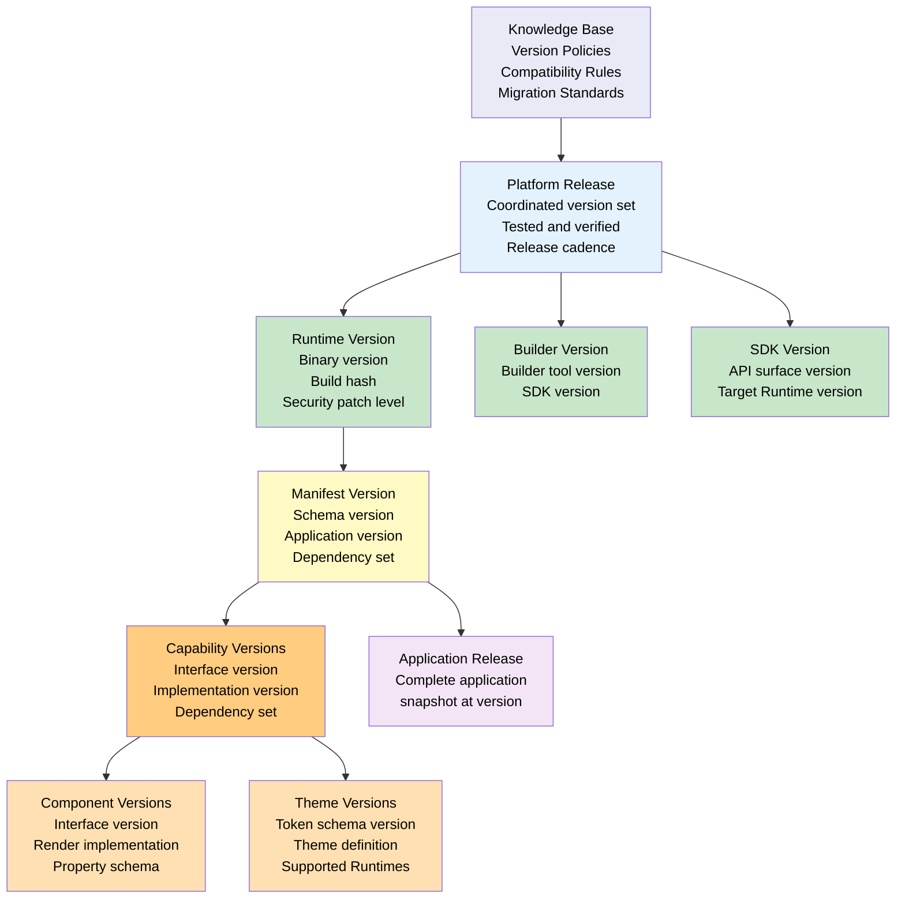

### 4.2 Version Governance Model

| Layer | Authority | Scope | Version Source |
|-------|-----------|-------|----------------|
| **Knowledge Base** | Platform Architecture Team | Version policies, compatibility rules, migration standards | Centralized policy definitions |
| **Platform Release** | Platform Release Team | Coordinated version sets, compatibility matrices | Release engineering pipeline |
| **Runtime Version** | Runtime Engineering | Runtime binary, security patches, platform targets | Build pipeline |
| **Builder Version** | Builder Engineering | Builder tools, SDK versions, preview runtime versions | Build pipeline |
| **SDK Version** | SDK Engineering | API surface, target runtime, toolchain | SDK build pipeline |
| **Manifest Version** | Application Developer | Application schema, capability set, dependency versions | Manifest authoring + publishing |
| **Capability Version** | Capability Developer | Interface, implementation, dependencies | Capability build + publish |
| **Component Version** | Component Developer | Interface, renderer, properties | Component build + publish |
| **Theme Version** | Theme Developer | Token schema, theme values, runtime targets | Theme build + publish |
| **Application Release** | Application Developer / CI | Complete application snapshot | Application release pipeline |

### 4.3 Version Policy Registry

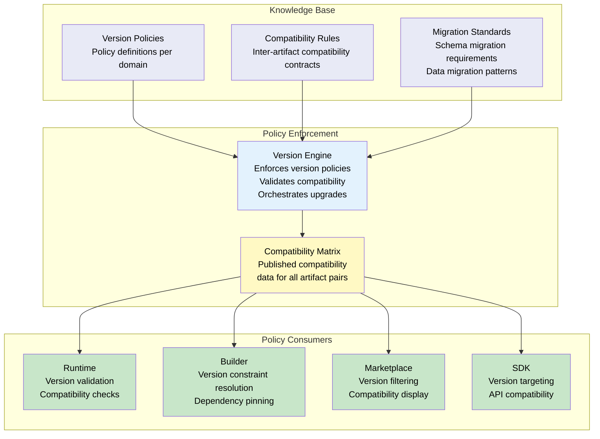

---

## 5. Version Domains

### 5.1 Domain Model

| Domain | Artifact Type | Version Format | Version Authority | Registry |
|--------|--------------|----------------|-------------------|----------|
| **Platform** | Coordinated platform release | YYYY.MM.PATCH | Platform Release Team | Platform compatibility registry |
| **Runtime** | Runtime binary | MAJOR.MINOR.PATCH[-label.N] | Runtime Engineering | Runtime version registry |
| **Builder** | Builder tool | MAJOR.MINOR.PATCH | Builder Engineering | Builder version registry |
| **SDK** | SDK package | MAJOR.MINOR.PATCH | SDK Engineering | SDK version registry |
| **Marketplace Packages** | Distributable package | MAJOR.MINOR.PATCH | Package Publisher | Marketplace registry (KB-040) |
| **Applications** | Application definition | MAJOR.MINOR.PATCH | Application Developer | Application manifest |
| **Desks** | Desk definition | MAJOR.MINOR.PATCH | Application Developer | Desk manifest |
| **Components** | UI Component | MAJOR.MINOR.PATCH | Component Developer | Component registry (KB-054) |
| **Capabilities** | Capability | MAJOR.MINOR.PATCH | Capability Developer | Capability registry |
| **Themes** | Theme definition | MAJOR.MINOR.PATCH | Theme Developer | Theme registry |
| **Extensions** | Extension plugin | MAJOR.MINOR.PATCH | Extension Developer | Extension registry |
| **Workflows** | Workflow definition | MAJOR.MINOR.PATCH | Workflow Developer | Workflow registry |
| **Integrations** | Integration adapter | MAJOR.MINOR.PATCH | Integration Developer | Integration registry |
| **APIs** | Platform API contract | MAJOR.MINOR.PATCH | Platform API Team | API version registry |
| **Data Models** | Data schema | MAJOR.MINOR.PATCH | Data Model Team | Schema registry |

### 5.2 Domain Versioning Rules

| Domain | Major Bump When | Minor Bump When | Patch Bump When |
|--------|-----------------|-----------------|-----------------|
| **Platform** | Breaking platform contract change | New coordinated features, backward compatible | Critical fixes, security patches |
| **Runtime** | Breaking Runtime API or behavior change | New Runtime features, backward compatible | Runtime bug fixes, performance improvements |
| **Builder** | Breaking Builder API change | New Builder features, backward compatible | Builder bug fixes |
| **SDK** | Breaking SDK API surface change | New SDK APIs, backward compatible | SDK bug fixes |
| **Applications** | Breaking application contract | New application features, backward compatible | Application fixes |
| **Components** | Breaking component interface or behavior | New component features, backward compatible | Component fixes |
| **Capabilities** | Breaking capability interface | New capability features, backward compatible | Capability fixes |
| **Themes** | Breaking design token schema | New tokens, backward compatible | Theme value fixes |
| **Extensions** | Breaking extension API | New extension APIs, backward compatible | Extension fixes |
| **Data Models** | Breaking schema change | New optional fields, backward compatible | Schema documentation fixes |

### 5.3 Inter-Domain Version Mapping

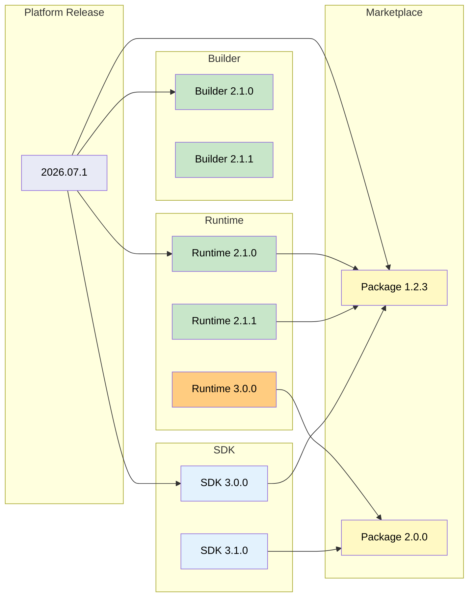

---

## 6. Semantic Versioning Policy

### 6.1 Version Segments

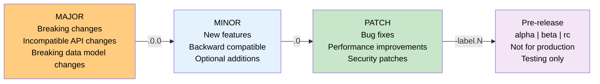

### 6.2 Version States

| State | Description | Constraints | Upgrade Path |
|-------|-------------|-------------|--------------|
| **Pre-release** | In-development version, not for production use | Label: `-alpha.N`, `-beta.N`, `-rc.N` | Pre-release to Stable or Pre-release to Deprecated |
| **Release Candidate** | Feature-complete, undergoing verification | Label: `-rc.N` (N increments per candidate) | RC to Stable or RC to Retired |
| **Stable** | Production-ready, fully tested, supported | No pre-release label | Stable to Stable (higher) or Stable to Deprecated |
| **LTS** | Long-term support — extended maintenance, security patches | Designated LTS branch; minimum support period | LTS to LTS (higher) or LTS to Deprecated |
| **Deprecated** | Supported but no longer recommended; consumers advised to migrate | Deprecation notice published; minimum support window | Deprecated to Retired after support window expires |
| **Retired** | No longer supported; removed from registries | May continue to resolve for existing consumers; not available for new installs | Terminal state |

### 6.3 Version Lifecycle

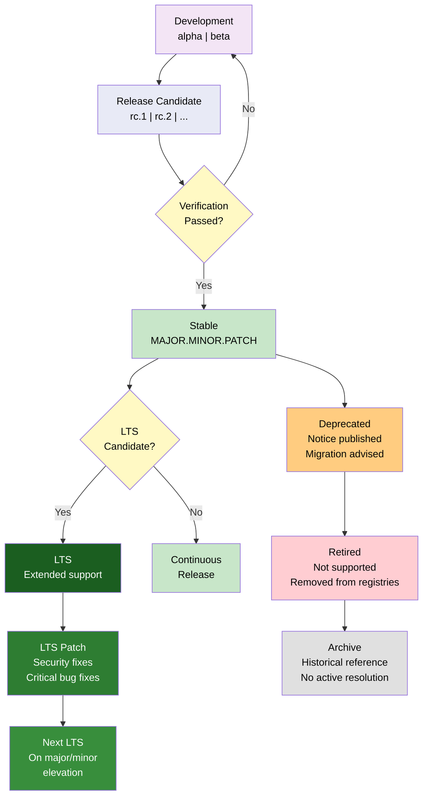

### 6.4 Version Compatibility Policy

| Version Change | Backward Compatible | Forward Compatible | Migration Required | Rollback Supported |
|---------------|-------------------|-------------------|-------------------|-------------------|
| **Major** (2.0.0 to 3.0.0) | No | No | Required | Yes (to previous major) |
| **Minor** (2.0.0 to 2.1.0) | Yes | Best effort | Not required | Yes |
| **Patch** (2.0.0 to 2.0.1) | Yes | Yes | Not required | Yes |
| **LTS Patch** (2.0.0-LTS to 2.0.1-LTS) | Yes | Yes | Not required | Yes |
| **Pre-release** (2.0.0-alpha.1 to 2.0.0-alpha.2) | No guarantee | No guarantee | May be required | Yes (within pre-release cycle) |
| **Deprecated to Retired** | No | No | Required (before expiry) | No |

---

## 7. Compatibility Model

### 7.1 Compatibility Rules

#### 7.1.1 Runtime to Manifest

| Runtime Version | Manifest Version | Compatibility | Behaviour |
|----------------|-----------------|---------------|-----------|
| Same major | Same or higher minor | Full | All features supported |
| Same major | Lower minor | Backward compatible | New features unavailable, core functions work |
| Higher major | Lower major | Not compatible | Upgrade Runtime required |
| Lower major | Higher major | Not compatible | Upgrade Manifest required |
| Same major, same minor, higher patch | Same or higher patch | Full | Bug fixes applied |

#### 7.1.2 Runtime to Components

| Runtime Version | Component Version | Compatibility | Behaviour |
|----------------|------------------|---------------|-----------|
| Same major | Same major or lower minor | Full | All component features work |
| Same major | Higher minor | Backward compatible | New component features available |
| Higher major | Lower major | Not compatible | Component must be upgraded |
| Lower major | Higher major | Not compatible | Runtime must be upgraded |
| Runtime LTS | Component LTS | Full | Extended support guaranteed |

#### 7.1.3 Runtime to Capabilities

| Runtime Version | Capability Version | Compatibility | Behaviour |
|----------------|-------------------|---------------|-----------|
| Same major, same or higher minor | Same major | Full | All capability APIs available |
| Same major, any minor | Higher minor | Backward compatible | New APIs not available, core APIs work |
| Higher major | Lower major | Not compatible | Capability migration required |
| Lower major | Higher major | Not compatible | Runtime upgrade required |
| Same major, lower minor | Same major | Forward compatible | Core capability APIs work |

#### 7.1.4 Runtime to Themes

| Runtime Version | Theme Version | Compatibility | Behaviour |
|----------------|--------------|---------------|-----------|
| Same major | Same major | Full | All design tokens resolved |
| Same major, any minor | Higher minor | Backward compatible | New tokens ignored, existing tokens work |
| Higher major | Lower major | Not compatible | Theme migration required |
| Lower major | Higher major | Not compatible | Runtime upgrade required |

#### 7.1.5 Builder to Runtime

| Builder Version | Runtime Version | Compatibility | Behaviour |
|----------------|----------------|---------------|-----------|
| Same major, any minor | Same major | Full | All Builder features work |
| Builder higher minor | Runtime lower minor | Backward compatible | New Builder features not in Runtime |
| Builder higher major | Runtime lower major | Not compatible | Builder must target lower Runtime |
| Builder lower major | Runtime higher major | Not compatible | Builder upgrade required |

#### 7.1.6 SDK to Runtime

| SDK Version | Runtime Version | Compatibility | Behaviour |
|-------------|----------------|---------------|-----------|
| Same major, same or lower minor | Same major | Full | All SDK APIs work |
| SDK higher minor | Runtime same minor | Backward compatible | New SDK APIs not on Runtime |
| SDK higher major | Runtime lower major | Not compatible | SDK must target Runtime version |
| SDK lower major | Runtime higher major | Not compatible | SDK upgrade required |

#### 7.1.7 Marketplace to Runtime

| Marketplace Package | Runtime Version | Compatibility | Behaviour |
|--------------------|----------------|---------------|-----------|
| Package declared Runtime range | Within range | Full | Package installs and runs |
| Package declared Runtime range | Outside range | Not compatible | Package filtered from results |
| Package no Runtime declaration | Any | Unknown | Package flagged as untested |

#### 7.1.8 Integrations to Runtime

| Integration Version | Runtime Version | Compatibility | Behaviour |
|--------------------|----------------|---------------|-----------|
| Same major | Same major | Full | Integration fully functional |
| Integration higher minor | Runtime same minor | Backward compatible | Core integration features work |
| Integration higher major | Runtime lower major | Not compatible | Integration migration required |

### 7.2 Compatibility Matrix Model

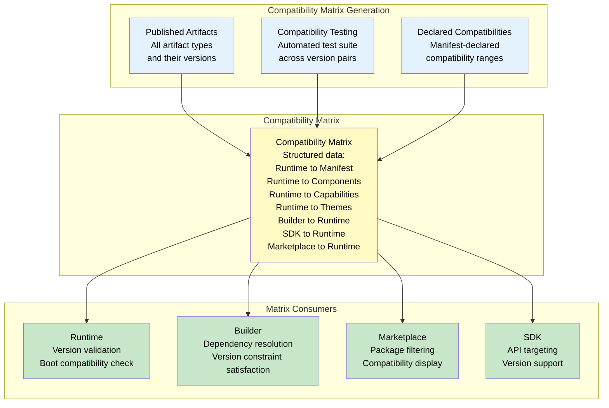

### 7.3 Compatibility Validation Flow

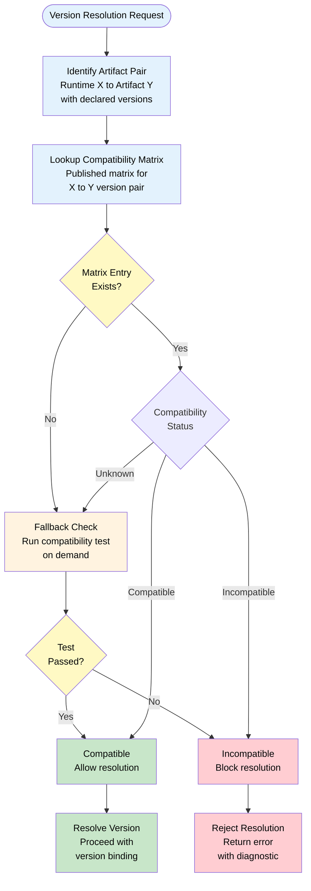

---

## 8. Upgrade Lifecycle

### 8.1 Upgrade Lifecycle Diagram

```mermaid
flowchart TB
    DETECT["Detect\nDiscover available updates\nCheck version registry\nIdentify applicable upgrades"]
    DETECT --> VALIDATE

    VALIDATE["Validate\nVerify update authenticity\nCheck package signature\nValidate package integrity"]
    VALIDATE --> COMCHECK

    COMCHECK["Compatibility Check\nValidate compatibility matrix\nCheck all artifact pair compatibilities\nIdentify conflicts"]
    COMCHECK --> PLAN

    PLAN["Migration Planning\nDetermine migration steps\nIdentify affected artifacts\nEstimate upgrade duration"]
    PLAN --> BACKUP

    BACKUP["Backup\nSnapshot current state\nBackup current artifacts\nBackup data and configuration"]
    BACKUP --> UPGRADE

    UPGRADE["Upgrade\nApply package updates\nExecute migrations\nTransform data and config"]
    UPGRADE --> VERIFY

    VERIFY["Verification\nVerify all artifacts installed\nRun compatibility validation\nCheck system health"]
    VERIFY --> ACTIVATE

    ACTIVATE["Activate\nActivate new versions\nSwitch Runtime to new versions\nUpdate version registry"]
    ACTIVATE --> OBSERVE

    OBSERVE["Observe\nMonitor system health\nValidate expected behavior\nCheck error rates\nConfirm compatibility"]

    OBSERVE --> OUTCOME{"Outcome?"}
    OUTCOME -->|Success| COMPLETE["Upgrade Complete"]
    OUTCOME -->|Degraded| ROLLBACK_TRIGGER
    OUTCOME -->|Failure| ROLLBACK_TRIGGER

    ROLLBACK_TRIGGER["Trigger Rollback\nRestore from backup\nReverse migrations\nReactivate previous versions"]
    ROLLBACK_TRIGGER --> VERIFY_ROLLBACK

    VERIFY_ROLLBACK["Verify Rollback\nValidate restored state\nCheck rollback health\nConfirm data integrity"]
    VERIFY_ROLLBACK --> ROLLBACK_COMPLETE(["Rollback Complete"])

    style DETECT fill:#e3f2fd,color:#000
    style VALIDATE fill:#e3f2fd,color:#000
    style COMCHECK fill:#fff9c4,color:#000
    style PLAN fill:#e3f2fd,color:#000
    style BACKUP fill:#f3e5f5,color:#000
    style UPGRADE fill:#c8e6c9,color:#000
    style VERIFY fill:#e8eaf6,color:#000
    style ACTIVATE fill:#1b5e20,color:#fff
    style OBSERVE fill:#e8eaf6,color:#000
    style COMPLETE fill:#c8e6c9,color:#000
    style ROLLBACK_TRIGGER fill:#ffcc80,color:#000
    style VERIFY_ROLLBACK fill:#e8eaf6,color:#000
    style ROLLBACK_COMPLETE fill:#ffcdd2,color:#000
```

### 8.2 Upgrade Lifecycle States

| Phase | Entry Criteria | Activities | Exit Criteria | Failure Response |
|-------|---------------|------------|---------------|-----------------|
| **Detect** | Runtime running, periodic check interval reached | Check version registry for applicable upgrades; filter by compatibility; prioritize by severity | Available upgrades identified | Log detection failure; retry on next interval |
| **Validate** | Upgrades detected | Verify package signatures; validate package integrity; confirm authenticity | All packages validated | Block upgrade; log validation failure; notify administrator |
| **Compatibility Check** | Packages validated | Check compatibility matrix for all artifact pairs; identify conflicts; generate compatibility report | All pairs compatible or conflicts documented | Block upgrade; report specific incompatibilities |
| **Migration Planning** | Compatibility confirmed | Determine migration sequence; estimate duration; calculate risk | Migration plan generated | Fall back to default safe plan |
| **Backup** | Plan ready | Snapshot current state; backup artifacts; backup data and configuration | Full backup confirmed | Block upgrade; report backup failure |
| **Upgrade** | Backup complete | Apply packages; execute data migrations; transform configurations | All migrations executed | Log partial upgrade state; trigger rollback |
| **Verification** | Upgrade complete | Verify artifact versions; run compatibility tests; check system health | All checks passed | Trigger rollback |
| **Activate** | Verification passed | Switch active version references; update version registry; complete activation | New versions active | Rollback to previous active versions |
| **Observe** | Activation complete | Monitor health metrics; watch error rates; validate expected behavior | Observation period elapsed (configurable) | Rollback if degradation or failure detected |

### 8.3 Upgrade Timing

| Upgrade Type | Trigger | Urgency | User Notification | Schedule |
|-------------|---------|---------|------------------|----------|
| **Security Patch** | Critical CVE, security advisory | Immediate | Required | As soon as validated |
| **Critical Fix** | Production outage, data corruption | High | Recommended | Within 24 hours |
| **Minor Feature** | New capabilities, minor enhancements | Low | Optional | Next maintenance window |
| **Major Version** | Breaking change, architecture change | Medium | Required | Scheduled with migration plan |
| **Maintenance** | Housekeeping, optimization, cleanup | Very low | Not required | Off-peak hours |

---

## 9. Migration Architecture

### 9.1 Migration Pipeline

```mermaid
flowchart TB
    PLAN_START(["Migration Required"])
    PLAN_START --> ANALYZE

    subgraph ANALYZE["Migration Analysis"]
        AFFECTED["Identify Affected Artifacts\nManifest | Components\nCapabilities | Themes\nWorkflows | State | Data"]
        SCOPE["Determine Scope\nSchema changes\nData transformations\nAPI compatibility\nBehavior changes"]
        SEVERITY["Assess Severity\nBreaking | Non-breaking\nSmooth | Requiring migration steps"]
    end

    ANALYZE --> MIG_PLAN

    subgraph MIG_PLAN["Migration Plan Generation"]
        STEPS["Define Migration Steps\nOrdered sequence\nof transformations"]
        DEP["Establish Dependencies\nStep ordering\nArtifact dependencies\nRuntime dependencies"]
        ROLLBACK["Define Rollback Steps\nReverse of each\nmigration step"]
        VERIFY_PLAN["Define Verification\nPost-migration\nvalidation criteria"]
    end

    MIG_PLAN --> EXEC

    subgraph EXEC["Migration Execution"]
        PREP["Prepare\nBackup state\nLock artifacts\nDisable consumers"]
        TRANSFORM["Transform\nApply data migrations\nTransform configurations\nUpdate schemas"]
        VALIDATE_XFORM["Validate\nCheck integrity\nVerify transformations\nTest compatibility"]
        COMMIT["Commit\nMake permanent\nRelease locks\nEnable consumers"]
    end

    EXEC --> COMPLETE_MIG(["Migration Complete"])

    style PLAN_START fill:#e3f2fd,color:#000
    style ANALYZE fill:#fff9c4,color:#000
    style MIG_PLAN fill:#e8eaf6,color:#000
    style EXEC fill:#c8e6c9,color:#000
    style COMPLETE_MIG fill:#1b5e20,color:#fff
```

### 9.2 Manifest Migrations

| Migration Type | Trigger | Steps | Rollback |
|---------------|---------|-------|----------|
| **Schema version bump** | Manifest schema changes | 1. Validate current schema version; 2. Apply schema transformations; 3. Validate new schema; 4. Update schema version | Restore previous manifest with prior schema |
| **Capability reference update** | Capability version change | 1. Identify all capability references; 2. Update version constraints; 3. Validate capability resolution; 4. Update manifest version | Restore previous capability references |
| **Component mapping change** | Component version or path change | 1. Identify component references; 2. Update component paths/versions; 3. Validate component resolution; 4. Update manifest version | Restore previous component mappings |
| **Theme reference change** | Theme version change | 1. Identify theme references; 2. Update theme version constraints; 3. Validate theme resolution; 4. Update manifest version | Restore previous theme references |
| **Workflow reference change** | Workflow version change | 1. Identify workflow references; 2. Update workflow version constraints; 3. Validate workflow resolution; 4. Update manifest version | Restore previous workflow references |

### 9.3 Component Migrations

| Migration Type | Trigger | Steps | Rollback |
|---------------|---------|-------|----------|
| **Interface change** | Component property schema changes | 1. Map old properties to new; 2. Apply property transformations; 3. Validate component rendering; 4. Update component version | Restore previous property schema |
| **Render implementation change** | Component rendering logic changes | 1. Verify interface unchanged; 2. Validate render output; 3. Test component in isolation; 4. Update component version | Revert to previous render implementation |
| **Dependency change** | Component dependency updates | 1. Resolve new dependency graph; 2. Validate all dependencies available; 3. Test component with new deps; 4. Update component version | Revert to previous dependency graph |

### 9.4 Capability Migrations

| Migration Type | Trigger | Steps | Rollback |
|---------------|---------|-------|----------|
| **API change** | Capability API surface changes | 1. Map old API to new; 2. Update capability consumers; 3. Validate API compatibility; 4. Update capability version | Restore previous API surface |
| **Behavior change** | Capability behavior changes | 1. Document behavior change; 2. Test with capability consumers; 3. Validate expected behavior; 4. Update capability version | Revert to previous behavior |
| **Dependency change** | Capability dependency changes | 1. Resolve new dependency graph; 2. Validate capability operation; 3. Update capability version | Revert to previous dependency graph |

### 9.5 Theme Migrations

| Migration Type | Trigger | Steps | Rollback |
|---------------|---------|-------|----------|
| **Token schema change** | Design token schema evolves | 1. Map old token paths to new; 2. Update theme values; 3. Validate token resolution; 4. Update theme version | Restore previous token schema |
| **Token value change** | Design token values updated | 1. Document value changes; 2. Validate rendering with new values; 3. Update theme version | Restore previous token values |
| **Runtime target change** | Theme targets new Runtime version | 1. Update Runtime compatibility declarations; 2. Validate theme with target Runtime; 3. Update theme version | Restore previous Runtime targets |

### 9.6 Workflow Migrations

| Migration Type | Trigger | Steps | Rollback |
|---------------|---------|-------|----------|
| **Step definition change** | Workflow steps added, removed, or reordered | 1. Map old step sequence to new; 2. Update active workflow instances; 3. Validate workflow execution; 4. Update workflow version | Restore previous step sequence |
| **Action change** | Workflow action references updated | 1. Identify action references; 2. Update action mappings; 3. Validate action execution; 4. Update workflow version | Restore previous action references |
| **Condition change** | Workflow conditions modified | 1. Document condition changes; 2. Validate workflow branching; 3. Update workflow version | Restore previous conditions |

### 9.7 State Migrations

| Migration Type | Trigger | Steps | Rollback |
|---------------|---------|-------|----------|
| **State schema change** | State store schema evolves | 1. Map old state shape to new; 2. Transform persisted state; 3. Validate state hydration; 4. Update state version | Restore previous state shape from backup |
| **State scope change** | State scopes added or removed | 1. Identify affected scopes; 2. Create or merge scopes; 3. Validate state access; 4. Update state version | Restore previous scope structure |
| **State default change** | Default state values change | 1. Document default changes; 2. Validate state initialization; 3. Update state version | Restore previous defaults |

### 9.8 Data Model Migrations

| Migration Type | Trigger | Steps | Rollback |
|---------------|---------|-------|----------|
| **Schema evolution** | Data model schema changes | 1. Map old fields to new; 2. Apply data transformations; 3. Validate data integrity; 4. Update data model version | Restore previous data schema and data |
| **Field deprecation** | Fields marked deprecated | 1. Identify deprecated fields; 2. Configure deprecation warnings; 3. Update consumers; 4. Update data model version | Restore deprecated fields |
| **Relationship change** | Data model relationships change | 1. Map old relationships to new; 2. Transform relationship data; 3. Validate relationship integrity; 4. Update data model version | Restore previous relationship model |

---

## 10. Rollback Architecture

### 10.1 Rollback Flow

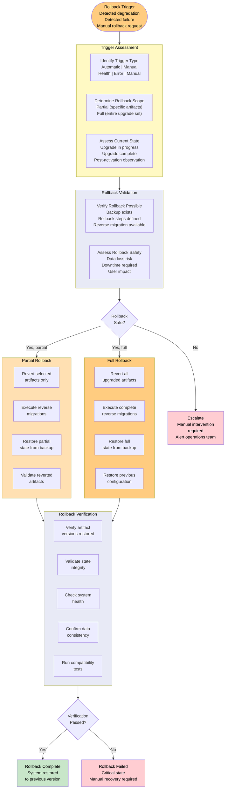

### 10.2 Rollback Triggers

| Trigger | Source | Type | Automatic Delay | Action |
|---------|--------|------|-----------------|--------|
| **Health degradation** | Health monitoring system | Automatic | 30 seconds continuous degradation | Initiate rollback |
| **Error rate spike** | Error monitoring system | Automatic | 1 minute sustained spike | Initiate rollback |
| **Verification failure** | Post-upgrade verification | Automatic | Immediate | Initiate rollback |
| **Crash loop detection** | Runtime crash monitoring | Automatic | 3 crashes in 5 minutes | Initiate rollback |
| **Manual rollback request** | Administrator | Manual | Immediate | Initiate rollback |
| **Incompatibility detected** | Runtime compatibility check | Automatic | Immediate | Block activation, rollback |
| **Migration failure** | Migration execution engine | Automatic | Immediate | Initiate rollback to pre-migration state |

### 10.3 Rollback Safety

| Safety Check | Description | Failure Response |
|-------------|-------------|-----------------|
| **Backup integrity** | Verify backup snapshot is complete and uncorrupted | Block rollback; escalate |
| **Reverse migration availability** | Confirm reverse migration steps are defined and tested | Block rollback; require manual plan |
| **State consistency** | Confirm rollback state is consistent with reverted artifacts | Re-verify; if persistent, manual recovery |
| **Data loss assessment** | Estimate data loss risk for rollback operation | If critical data at risk, require manual approval |
| **User impact assessment** | Determine number of active users affected by rollback | If high impact, consider maintenance window |
| **Dependency verification** | Confirm no active consumers depend on reverted versions | If dependencies exist, cascade rollback |

### 10.4 Partial vs Full Rollback

| Aspect | Partial Rollback | Full Rollback |
|--------|-----------------|---------------|
| **Scope** | Specific artifacts or domains | All artifacts in upgrade set |
| **When Used** | Single artifact failure, isolated incompatibility | Widespread failure, data inconsistency, critical security issue |
| **Duration** | Faster — fewer artifacts to revert | Slower — complete reversion |
| **Risk** | Lower — targeted impact | Higher — complete state restoration |
| **Recovery** | Targeted recovery of specific artifact | Full system recovery |
| **User Impact** | Minimal — specific features affected | Maximum — full interruption during rollback |
| **Verification** | Verify reverted artifacts only | Verify entire system |

### 10.5 Recovery Verification

| Check | Criteria | Method |
|-------|----------|--------|
| **Version verification** | All artifacts at expected pre-upgrade versions | Version registry comparison |
| **State integrity** | State consistent with artifact versions | State checksum verification |
| **Data consistency** | Data model matches artifact expectations | Schema validation |
| **Health check** | All subsystems healthy post-rollback | Health monitoring system |
| **Compatibility validation** | All artifact pairs compatible at restored versions | Compatibility matrix check |
| **User session validation** | Active sessions functional post-rollback | Session health probe |
| **Error rate validation** | Error rate returned to pre-upgrade baseline | Error rate comparison |

---

## 11. Compatibility Matrix

### 11.1 Matrix Governance

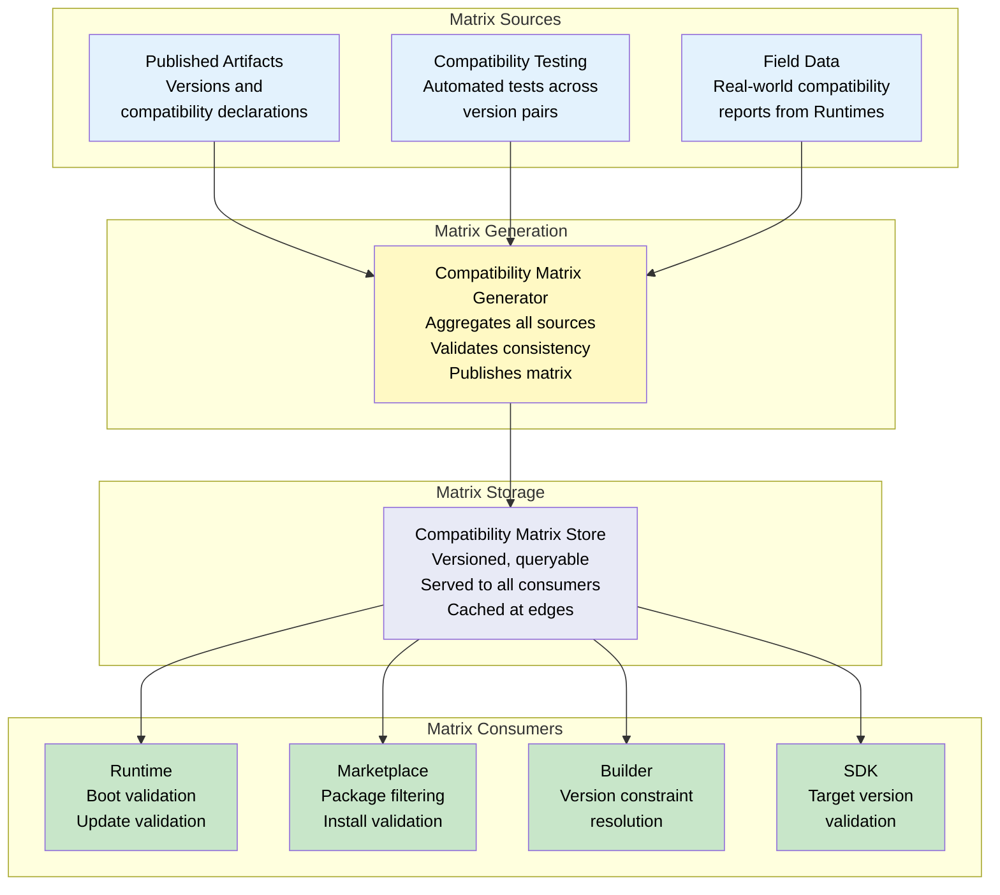

### 11.2 Matrix Structure

The Compatibility Matrix is a structured data set containing:

| Field | Description |
|-------|-------------|
| `sourceArtifact` | Source artifact type and version |
| `targetArtifact` | Target artifact type and version |
| `compatibility` | Enum: `compatible`, `incompatible`, `unknown` |
| `scope` | Scope of compatibility (API, data, behavior, all) |
| `constraints` | Additional version constraints or conditions |
| `testedVersion` | The version pair that was actually tested |
| `migrationAvailable` | Whether migration path exists for this pair |
| `lastVerified` | Timestamp of last compatibility verification |

### 11.3 Matrix Consumption by Runtime

During Runtime startup and update validation:

1. **Boot compatibility check**: Runtime verifies its version compatibility with the loaded Manifest, all referenced components, capabilities, and themes
2. **Update compatibility check**: Before applying any update, Runtime validates compatibility matrix entries for all artifact pairs affected by the update
3. **Runtime compatibility cache**: Runtime caches compatibility matrix entries for offline operation and fast startup
4. **Field data contribution**: Runtime reports compatibility results back to the matrix generator for continuous improvement

### 11.4 Matrix Consumption by Builder

During application composition:

1. **Version constraint satisfaction**: Builder resolves version constraints against the compatibility matrix
2. **Dependency resolution**: Builder uses matrix to determine valid dependency version ranges
3. **Compatibility warnings**: Builder displays compatibility warnings when incompatible artifact pairs are selected
4. **Migration guidance**: Builder suggests migration paths when compatibility gaps are detected

### 11.5 Matrix Consumption by Marketplace

During package browsing and installation:

1. **Package filtering**: Marketplace filters packages based on Runtime version compatibility
2. **Compatibility display**: Marketplace displays compatible Runtime versions for each package
3. **Install validation**: Marketplace validates compatibility before allowing installation
4. **Dependency resolution**: Marketplace resolves package dependencies against compatibility matrix

### 11.6 Matrix Consumption by SDK

During artifact development:

1. **Target version validation**: SDK validates that developed artifacts target compatible Runtime versions
2. **API compatibility checking**: SDK validates API usage against target Runtime version
3. **Build-time validation**: SDK checks compatibility during artifact build and packaging

---

## 12. Responsibilities

### 12.1 Runtime Responsibilities

| Responsibility | Description |
|--------------|-------------|
| Compatibility validation | Validate runtime compatibility with Manifest, components, capabilities, and themes at boot |
| Version registry management | Maintain local version registry of all installed artifacts |
| Update detection | Periodically check for available updates |
| Upgrade execution | Execute upgrade lifecycle including backup, migration, activation |
| Rollback execution | Execute rollback lifecycle when triggered |
| Compatibility reporting | Report compatibility results to the platform for matrix generation |
| Offline update handling | Queue updates when offline, apply when reconnected |
| Version telemetry | Emit version metrics, upgrade metrics, and rollback metrics to observability layer |

### 12.2 Builder Responsibilities

| Responsibility | Description |
|--------------|-------------|
| Version constraint management | Declare and manage version constraints for all artifact dependencies |
| Compatibility verification | Verify compatibility of composed applications before publishing |
| Migration path generation | Generate migration paths when publishing breaking changes |
| Manifest versioning | Version manifests according to semantic versioning policy |
| Dependency resolution | Resolve artifact dependencies against compatibility matrix |
| Update preview | Preview upgrade impact before publishing updates |

### 12.3 Marketplace Responsibilities

| Responsibility | Description |
|--------------|-------------|
| Immutable publishing | Ensure published artifacts are immutable once published |
| Compatibility filtering | Filter artifacts by Runtime compatibility in browse/search |
| Version display | Display clear version information and compatibility ranges |
| Signature verification | Verify package signatures before accepting publications |
| Update notification | Notify consumers of available updates |
| Rollback package availability | Ensure previous versions remain available for rollback |
| Migration documentation | Host and serve migration documentation alongside artifacts |

### 12.4 SDK Responsibilities

| Responsibility | Description |
|--------------|-------------|
| Target Runtime declaration | Declare target Runtime version for all SDK builds |
| API compatibility | Maintain backward-compatible API surfaces within major versions |
| Compatibility testing | Run compatibility tests against targeted Runtime versions |
| Version guidance | Provide clear version documentation for SDK consumers |
| Deprecation handling | Mark APIs as deprecated with migration timelines before removal |

---

## 13. Security

### 13.1 Trusted Updates

All updates must be trusted. Trust is established through a chain of verification steps:

| Verification Step | Description | Enforced By |
|------------------|-------------|-------------|
| **Package signature** | Every published package is signed with the publisher's private key | Marketplace (KB-039) |
| **Signature verification** | Signature verified against publisher's registered public key | Runtime, Marketplace |
| **Publisher identity** | Publisher identity verified through platform trust store | Marketplace certification (KB-039) |
| **Package integrity** | Package hash verified against published hash | Runtime, Marketplace |
| **Version authenticity** | Version string verified against registry metadata | Runtime, Marketplace |
| **Chain of trust** | Entire dependency chain verified for trust | Runtime dependency resolver |

### 13.2 Package Signatures

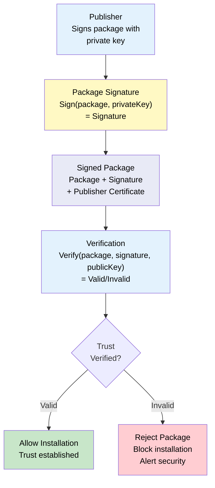

### 13.3 Integrity Verification

| Check | Scope | Method | Frequency |
|-------|-------|--------|-----------|
| **Package hash** | Individual package | SHA-256 hash comparison | On download, on install |
| **Dependency hash chain** | Dependency graph | Recursive hash verification | On resolution |
| **Manifest integrity** | Application manifest | Manifest signature verification | On load, on update |
| **Runtime binary integrity** | Runtime executable | Code signing verification | On startup |
| **Registry metadata integrity** | Registry entries | Registry signature verification | On registry access |

### 13.4 Version Authenticity

Version strings must be authentic — they must match the registry metadata and cannot be fabricated:

| Control | Description |
|---------|-------------|
| **Registry-sourced versions** | Version information is always sourced from the registry, not from local or user input |
| **Version signing** | Registry entries are signed by the registry authority |
| **Version pinning** | Applications can pin to specific versions with hash verification |
| **Version range validation** | Version ranges are validated against published ranges in the registry |
| **Tamper detection** | Any mismatch between local version metadata and registry metadata triggers tamper detection |

### 13.5 Secure Rollback

| Control | Description |
|---------|-------------|
| **Backup integrity** | Backup snapshots are signed and integrity-verified before use |
| **Rollback authorization** | Rollback requires appropriate authorization (automatic for health-triggered, manual approval for high-risk) |
| **Rollback audit** | All rollback operations are audited with full context |
| **Version reversion safety** | Reverted versions are verified for signature and integrity |
| **Data migration safety** | Reverse migrations are verified for data integrity before execution |

### 13.6 Supply Chain Validation

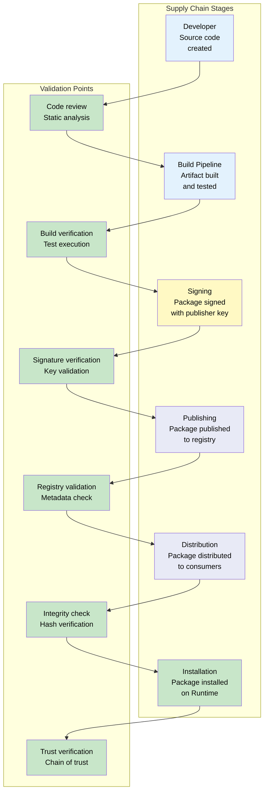

---

## 14. Performance

### 14.1 Incremental Updates

Updates are delivered incrementally wherever possible. An incremental update contains only the differences between the current version and the target version, not the full package.

| Update Type | Full Download | Incremental Download | Savings |
|-------------|--------------|---------------------|---------|
| **Patch** | 100% | 5-15% | 85-95% bandwidth reduction |
| **Minor** | 100% | 15-40% | 60-85% bandwidth reduction |
| **Major** | 100% | 40-80% | 20-60% bandwidth reduction |

### 14.2 Differential Packages

Differential packages contain only the changed artifacts between versions. The Runtime applies differentials to the current installation to produce the target version.

| Aspect | Behaviour |
|--------|-----------|
| **Package format** | Binary diff (BSD diff, or similar) for binary artifacts; line-level diff for text artifacts |
| **Resolution** | Apply differential to current version to produce target version |
| **Integrity** | Verify target version hash after applying differential |
| **Rollback** | Reverse differential available for rollback (or store pre-upgrade diff) |

### 14.3 Lazy Migration

Migrations that are not required for immediate Runtime operation can be deferred:

| Migration Type | Deferrable | Deferral Window |
|---------------|-----------|-----------------|
| **Schema migration** | No — required for schema compatibility | Immediate |
| **Data migration** | Yes — data can be migrated lazily | Configurable (default: 24 hours) |
| **Asset migration** | Yes — assets can be migrated on first access | First access |
| **Configuration migration** | Yes — config can be migrated on next edit | Next edit |
| **State migration** | Depends — critical state must be migrated immediately | Immediate for critical, deferred for non-critical |

### 14.4 Background Verification

Compatibility checks and integrity verifications that do not block the user experience are performed in the background:

| Operation | Foreground | Background |
|-----------|-----------|------------|
| **Update detection** | — | Background periodic check |
| **Package download** | On user-initiated update | Background pre-fetch |
| **Compatibility check** | Before activation | Background pre-validation |
| **Integrity verification** | Before activation | Background hash check |
| **Migration planning** | — | Background plan generation |

### 14.5 Efficient Rollback

| Operation | Performance Target | Method |
|-----------|-------------------|--------|
| **Snapshot creation** | < 100ms | Copy-on-write state capture |
| **Reverse migration** | < 500ms per migration step | Pre-computed reverse transformations |
| **Artifact reversion** | < 200ms per artifact | Versioned artifact store with symbolic links |
| **State restoration** | < 200ms | Pre-serialized state snapshots |
| **Full rollback** | < 5s for typical upgrade set | Parallel reversion of independent artifacts |

---

## 15. Observability

### 15.1 Version Metrics

| Metric | Type | Source | Aggregation |
|--------|------|-------|-------------|
| `version.runtime.current` | Gauge | Runtime version registry | Current |
| `version.manifest.current` | Gauge | Manifest version registry | Current |
| `version.artifacts.count` | Gauge | Component/capability/theme registries | Count |
| `version.runtime.latest` | Gauge | Platform registry | Latest available |
| `version.compatibility.status` | Enum | Compatibility matrix | Current per artifact pair |

### 15.2 Upgrade Metrics

| Metric | Type | Source | Aggregation |
|--------|------|-------|-------------|
| `upgrade.detected` | Counter | Update detection | Rate, total |
| `upgrade.started` | Counter | Upgrade initiation | Rate, total |
| `upgrade.completed` | Counter | Upgrade completion | Rate, total |
| `upgrade.failed` | Counter | Upgrade failure | Rate, total |
| `upgrade.duration` | Timer | Detect to activate | Avg, p95, p99 |
| `upgrade.download.size` | Histogram | Package download size | Avg |
| `upgrade.incremental.savings` | Gauge | Incremental vs full size | Percentage |

### 15.3 Migration Metrics

| Metric | Type | Source | Aggregation |
|--------|------|-------|-------------|
| `migration.started` | Counter | Migration execution | Rate, total |
| `migration.completed` | Counter | Migration completion | Rate, total |
| `migration.failed` | Counter | Migration failure | Rate, total |
| `migration.duration` | Timer | Migration execution time | Avg, p95 |
| `migration.scope` | Gauge | Artifacts migrated per operation | Count |
| `migration.deferred.count` | Gauge | Currently deferred migrations | Current |

### 15.4 Rollback Metrics

| Metric | Type | Source | Aggregation |
|--------|------|-------|-------------|
| `rollback.triggered` | Counter | Rollback trigger event | Rate, total |
| `rollback.completed` | Counter | Rollback completion | Rate, total |
| `rollback.failed` | Counter | Rollback failure | Rate, total |
| `rollback.duration` | Timer | Trigger to completion | Avg, p95 |
| `rollback.scope` | Gauge | Artifacts rolled back | Count, full vs partial |
| `rollback.reason` | Enum | Trigger type distribution | Distribution |

### 15.5 Compatibility Metrics

| Metric | Type | Source | Aggregation |
|--------|------|-------|-------------|
| `compatibility.check.count` | Counter | Compatibility validation requests | Rate |
| `compatibility.pass.count` | Counter | Successful validations | Rate |
| `compatibility.fail.count` | Counter | Failed validations | Rate |
| `compatibility.matrix.age` | Gauge | Time since last matrix update | Current |
| `compatibility.matrix.entries` | Gauge | Total entries in matrix | Current |

### 15.6 Failure Metrics

| Metric | Type | Source | Aggregation |
|--------|------|-------|-------------|
| `version.failure.update` | Counter | Update lifecycle failure | Rate, total |
| `version.failure.migration` | Counter | Migration failure | Rate, total |
| `version.failure.rollback` | Counter | Rollback failure | Rate, total |
| `version.failure.compatibility` | Counter | Compatibility check failure | Rate, total |
| `version.failure.integrity` | Counter | Integrity verification failure | Rate, total |

### 15.7 Version Observability Pipeline

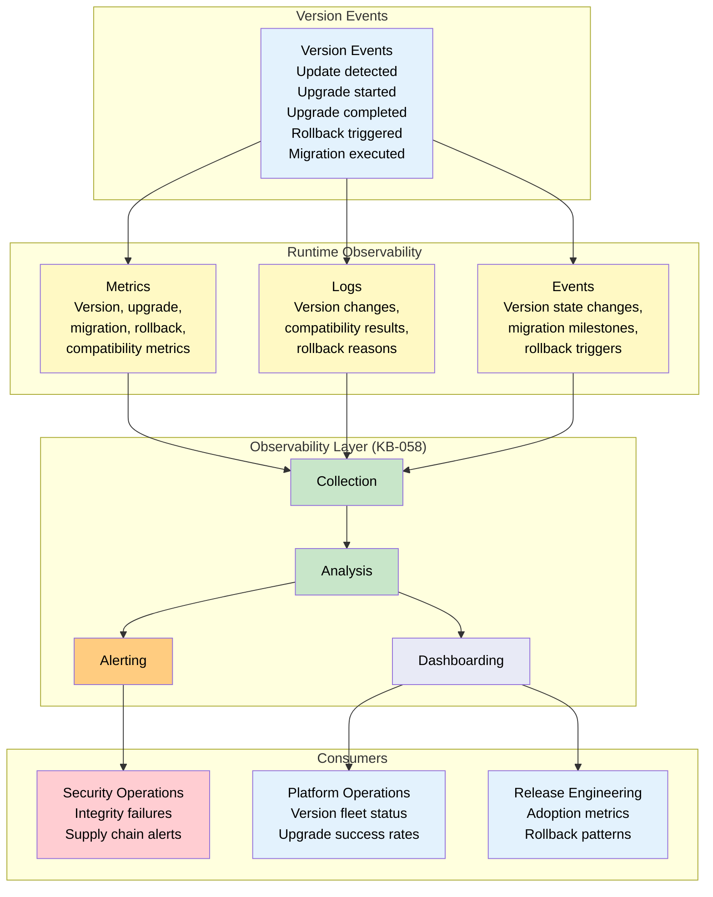

---

## 16. Offline Behaviour

### 16.1 Deferred Updates

When the Runtime is offline, updates are deferred:

| Operation | Offline Behaviour | On Reconnect |
|-----------|------------------|--------------|
| **Update detection** | Deferred — check registry when online | Immediate check on reconnect |
| **Update download** | Deferred — queue download for online | Resume download from checkpoint |
| **Migration planning** | Deferred — plan when online | Generate plan from cached metadata |
| **Backup** | Execute immediately (local) | Already complete |
| **Upgrade execution** | Deferred — require online for compatibility validation | Execute when compatibility confirmed |
| **Activation** | Deferred — require online for verification | Activate after verification |

### 16.2 Cached Packages

The Runtime maintains a local cache of downloaded packages:

| Cache Aspect | Behaviour |
|-------------|-----------|
| **Cache scope** | Last N versions of each installed artifact |
| **Cache eviction** | LRU eviction when cache exceeds budget |
| **Cache integrity** | Periodic hash verification of cached packages |
| **Update from cache** | If target version is cached, offline upgrade is possible (with cached compatibility data) |
| **Rollback from cache** | Rollback uses cached previous versions; no online requirement for rollback data |

### 16.3 Offline Verification

| Verification | Online | Offline |
|-------------|--------|---------|
| **Package signature** | Real-time registry verification | Cached public key verification |
| **Compatibility check** | Real-time matrix query | Cached matrix query (limited to cached entries) |
| **Integrity check** | Full hash verification | Full hash verification (local only) |
| **Supply chain check** | Full chain verification | Limited chain verification (cached certificates) |

### 16.4 Synchronization After Update

When connectivity is restored after an offline update or upgrade:

| Step | Action |
|------|--------|
| 1 | Report current version set to registry |
| 2 | Synchronize compatibility results from offline period |
| 3 | Upload any pending migration telemetry |
| 4 | Download any deferred migration plans |
| 5 | Check for newer updates that arrived during offline period |

### 16.5 Recovery

If the Runtime was updated offline and reconnects to find that the update was incomplete or incompatible:

| Scenario | Recovery Action |
|----------|----------------|
| **Incomplete update** | Resume update from last checkpoint |
| **Incompatible version** | Rollback to previous compatible version |
| **Missing dependencies** | Download missing dependencies |
| **Corrupted update** | Re-download and re-apply |
| **Failed migration** | Rollback migration, re-apply with online data |

---

## 17. Failure Scenarios

### 17.1 Incompatible Runtime

| Scenario | Detection | Response | Recovery |
|----------|-----------|----------|----------|
| Manifest requires newer Runtime | Boot compatibility check | Block startup; display upgrade message | Upgrade Runtime to compatible version |
| Component requires newer Runtime | Component resolution | Block component; log incompatibility | Upgrade Runtime or downgrade component |
| Capability requires newer Runtime | Capability activation | Block capability; log incompatibility | Upgrade Runtime or downgrade capability |

### 17.2 Failed Migration

| Scenario | Detection | Response | Recovery |
|----------|-----------|----------|----------|
| Schema migration fails | Migration execution error | Rollback migration; restore pre-migration state | Fix schema migration; retry |
| Data migration corrupts data | Post-migration integrity check | Rollback migration; restore from backup | Repair data; re-apply fixed migration |
| Migration timeout | Migration duration exceeds budget | Rollback migration; log partial migration | Increase budget or optimize migration |

### 17.3 Broken Manifest

| Scenario | Detection | Response | Recovery |
|----------|-----------|----------|----------|
| Manifest schema invalid | Manifest validation | Block manifest load; display error | Fix manifest; republish |
| Manifest references missing artifacts | Manifest resolution | Block manifest activation; log missing refs | Install missing artifacts or fix manifest |
| Manifest version incompatible with Runtime | Boot compatibility check | Block startup; display upgrade/downgrade message | Upgrade/downgrade as needed |

### 17.4 Version Conflict

| Scenario | Detection | Response | Recovery |
|----------|-----------|----------|----------|
| Two dependencies require different major versions of same artifact | Dependency resolution | Block resolution; report conflict | Upgrade dependent artifacts to use same major version |
| Circular version dependency | Dependency graph cycle detection | Block resolution; report cycle | Break cycle through version range relaxation |

### 17.5 Dependency Conflict

| Scenario | Detection | Response | Recovery |
|----------|-----------|----------|----------|
| Dependency version not available in registry | Dependency resolution | Block resolution; log missing version | Publish missing version or change dependency range |
| Dependency version fails integrity check | Integrity verification | Block installation; log integrity failure | Re-download from trusted source or escalate |

### 17.6 Corrupted Package

| Scenario | Detection | Response | Recovery |
|----------|-----------|----------|----------|
| Package hash mismatch | Download integrity check | Discard corrupted download; log failure | Re-download package from registry |
| Package signature invalid | Signature verification | Block installation; alert security | Investigate tampering; re-download from authoritative source |
| Package extraction fails | Package extraction | Block installation; log extraction failure | Re-download package; escalate if persistent |

### 17.7 Rollback Failure

| Scenario | Detection | Response | Recovery |
|----------|-----------|----------|----------|
| Rollback backup corrupted | Rollback pre-check | Block rollback; escalate to manual recovery | Restore from external backup or rebuild |
| Reverse migration fails | Migration execution | Log failure; attempt alternative reverse path | Manual intervention for data recovery |
| Rollback exceeds timeout | Rollback duration tracking | Log timeout; continue rollback in background | Verify background rollback completion |

### 17.8 Missing Compatibility Contract

| Scenario | Detection | Response | Recovery |
|----------|-----------|----------|----------|
| Artifact pair has no compatibility entry | Compatibility check | Flag as unknown; fall back to runtime compatibility test | Publish compatibility matrix entry |
| Compatibility contract expired | Registry metadata validation | Flag as expired; block new resolution | Request contract renewal or publish updated contract |

---

## 18. Anti-patterns

### 18.1 Mutable Published Versions

**Anti-pattern:** Overwriting or deleting a published version to fix a bug.

**Why it is harmful:** Breaks deterministic resolution, violates consumer expectations, makes builds non-reproducible, and undermines trust in the version registry.

**Correct approach:** Publish a new patch version with the fix. Mark the old version as deprecated if needed, but never remove or modify it.

### 18.2 Forced Upgrades

**Anti-pattern:** Requiring all consumers to upgrade immediately without migration path or rollback option.

**Why it is harmful:** Disrupts production systems, causes unplanned downtime, erodes consumer trust, and violates the principle of safe rollback.

**Correct approach:** Provide migration windows, deprecation notices, compatible co-existence periods, and clear rollback paths. Only force upgrades for critical security patches, and even then provide rollback capability.

### 18.3 Hidden Migrations

**Anti-pattern:** Performing data or schema migrations silently without consumer notification or documentation.

**Why it is harmful:** Causes unexpected failures in consumers, data corruption when assumptions are violated, and makes debugging nearly impossible.

**Correct approach:** Document all migrations in release notes. Provide migration visibility through observability metrics. Notify consumers of expected migration impact.

### 18.4 Breaking Patch Releases

**Anti-pattern:** Introducing breaking behavior changes in a patch version (e.g., 1.0.0 to 1.0.1 that breaks API compatibility).

**Why it is harmful:** Violates semantic versioning contract, breaks consumers who automatically apply patch updates, and destroys trust in the versioning system.

**Correct approach:** Breaking changes require a major version increment. Use minor versions for backward-compatible new features. Use patches only for bug fixes and performance improvements.

### 18.5 Runtime-Specific Version Rules

**Anti-pattern:** Defining version rules that only apply to one Runtime type (e.g., Mobile-only version numbers).

**Why it is harmful:** Violates runtime independence, creates confusion for cross-platform development, and makes version governance unmanageable.

**Correct approach:** Version rules must be consistent across all Runtime types. Platform-specific version information is handled through metadata, not through separate version numbering schemes.

### 18.6 Ignoring Compatibility Contracts

**Anti-pattern:** Shipping artifacts without declaring compatibility contracts with their consumers.

**Why it is harmful:** Makes it impossible to determine whether an upgrade is safe, forces consumers to test blindly, and leads to production failures.

**Correct approach:** Every published artifact must declare compatibility contracts with all artifact types it interacts with. Contracts are validated before publication and enforced at resolution time.

### 18.7 Manual Version Overrides

**Anti-pattern:** Allowing consumers to manually override version constraints to bypass compatibility checks.

**Why it is harmful:** Bypasses safety mechanisms, causes incompatible artifact combinations in production, and creates untrackable configurations.

**Correct approach:** All version resolution goes through the Version Engine. Override mechanisms exist for development and debugging but are gated by authorization, logged, and automatically disabled in production.

---

## 19. Future Evolution

### 19.1 Autonomous Upgrades

Future versions of the Runtime may support autonomous upgrades where the Runtime automatically detects, validates, and applies safe upgrades without user or administrator intervention. Autonomous upgrades follow strict safety criteria:

- Only patch and minor upgrades within the same major version
- Compatibility must be 100% verified by the compatibility matrix
- Rollback must be available and tested
- Observation period must pass without degradation
- User consent required for user-facing behavior changes

### 19.2 AI-Assisted Compatibility Analysis

Future compatibility analysis may be enhanced by AI-assisted analysis:

- Automated detection of breaking changes through code and schema analysis
- Predictive compatibility scoring for untested version pairs
- Migration path generation from change analysis
- Conflict resolution suggestions for version conflicts

### 19.3 Predictive Migration Planning

Future migration planning may incorporate predictive analytics:

- Estimate migration duration and risk based on historical data
- Recommend optimal upgrade timing based on usage patterns
- Predict rollback probability for given upgrade paths
- Suggest dependency update order to minimize conflict risk

### 19.4 Federated Version Governance

Future version governance may support federation across multiple organizations:

- Multi-organization version policies with local overrides
- Cross-organization compatibility contracts
- Distributed version registries with synchronization
- Federated trust model for cross-organization artifact verification

### 19.5 Continuous Runtime Evolution

Future Runtimes may support continuous, rolling updates:

- Live patching of Runtime subsystems without full restart
- Hot-swapping components and capabilities during active sessions
- A/B testing of version changes on Runtime instances
- Progressive rollout with automatic rollback on degradation detection

### 19.6 Zero-Downtime Upgrades

Future upgrade architecture may eliminate downtime entirely:

- Canary upgrades where a subset of Runtime instances are upgraded first
- Blue-green deployments for Runtime version switching
- Session migration between Runtime versions during upgrade
- In-place upgrades with hot-reload of changed artifacts

---

## 20. Cross-References

| Reference | Document | Relationship |
|-----------|----------|-------------|
| **KB-033** | Package & Artifact Specification | Defines package format that carries version metadata and signatures |
| **KB-038** | Template Marketplace | Template versioning follows domain model defined in this document |
| **KB-039** | Marketplace Certification & Trust | Package signatures, publisher trust, and supply chain validation |
| **KB-040** | Marketplace Distribution & Lifecycle | Package distribution, version registries, update propagation |
| **KB-042** | Application Manifest Specification | Manifest versioning, schema version, dependency declarations |
| **KB-050** | Capability Composition Model | Capability versioning, interface contracts, dependency resolution |
| **KB-051** | Runtime Architecture Overview | Runtime lifecycle includes update and version management |
| **KB-052** | Rendering Engine Architecture | Component version resolution during rendering |
| **KB-054** | Runtime Component Registry Architecture | Component version registry, resolution, and caching |
| **KB-058** | Runtime Observability & Diagnostics Architecture | Version metrics, upgrade observability, rollback telemetry |
| **KB-060** | Runtime Lifecycle Management Architecture | Lifecycle states for update and rollback operations |

---

## 21. Mermaid Diagram Index

| Diagram | Section | Description |
|---------|---------|-------------|
| Version Governance Architecture | 4.1 | Hierarchical model of version governance layers |
| Version Policy Registry | 4.3 | Policy enforcement and consumption architecture |
| Inter-Domain Version Mapping | 5.3 | Version relationships across artifact domains |
| Version Segments | 6.1 | Semantic versioning segment breakdown |
| Version Lifecycle | 6.3 | Complete version state lifecycle from development to retirement |
| Compatibility Matrix Model | 7.2 | Matrix generation, storage, and consumption |
| Compatibility Validation Flow | 7.3 | Version resolution compatibility validation |
| Upgrade Lifecycle | 8.1 | Complete upgrade lifecycle with rollback paths |
| Migration Pipeline | 9.1 | Migration analysis, planning, and execution |
| Rollback Flow | 10.1 | Rollback trigger, validation, execution, and verification |
| Matrix Governance | 11.1 | Compatibility matrix sources, generation, and consumers |
| Package Signatures | 13.2 | Signature creation and verification flow |
| Supply Chain Validation | 13.6 | Supply chain validation points across stages |
| Version Observability Pipeline | 15.7 | Version event telemetry pipeline to consumers |
