# Runtime Deployment & Environment Architecture

**KB-062 — Runtime Deployment & Environment Architecture Specification**

| Metadata | |
|----------|---|
| **KB ID** | KB-062 |
| **Title** | Runtime Deployment & Environment Architecture |
| **Version** | 0.1.0 |
| **Status** | Draft |
| **Owner** | Architecture Team |
| **Suite** | Runtime & Rendering Architecture |
| **Dependencies** | KB-031 Publishing Pipeline, KB-033 Package & Artifact Specification, KB-040 Marketplace Distribution & Lifecycle, KB-051 Runtime Architecture Overview, KB-052 Rendering Engine Architecture, KB-057 Runtime Security Architecture, KB-058 Runtime Observability & Diagnostics Architecture, KB-059 Runtime Performance & Optimization Architecture, KB-060 Runtime Lifecycle Management Architecture, KB-061 Runtime Update & Versioning Architecture |
| **Related Documents** | KB-029 Preview Runtime, KB-041 Application Architecture Overview, KB-042 Application Manifest Specification, KB-043 Workspace & Tenant Model, KB-049 Theme & Design Token Model, KB-050 Capability Composition Model, KB-053 Rendering Pipeline Architecture, KB-054 Runtime Component Registry Architecture, KB-055 Runtime State Engine Architecture, KB-056 Runtime Navigation Engine Architecture |
| **Review Status** | Pending |
| **Last Updated** | 2026-07-11 |

---

### Revision History

| Version | Date | Author | Change |
|---------|------|--------|--------|
| 0.1.0 | 2026-07-11 | AI Architecture Agent | Initial draft |

---

## 1. Executive Summary

### 1.1 Purpose

This document defines the Runtime Deployment & Environment Architecture for the DUKADESK Platform. It governs how DUKADESK Runtimes are packaged, deployed, configured, promoted, executed, and governed across all supported environments — from local development through production and disaster recovery.

The specification establishes the architectural contract between the Runtime Platform, Infrastructure Platform, Builder Studio, Marketplace, CI/CD systems, and Operations. It ensures that deployments are environment-independent, immutable, observable, and secure across every stage of the delivery lifecycle.

### 1.2 Scope

**In scope:**

- Architectural principles: environment-independent architecture, immutable deployments, configuration over customization, promotion over rebuilding, Runtime portability, secure deployment, observable deployments, versioned environments, repeatable releases, infrastructure agnostic
- Canonical definitions: Deployment, Runtime Environment, Runtime Host, Runtime Package, Environment Configuration, Release, Promotion, Deployment Unit, Deployment Manifest, Runtime Profile, Infrastructure Target, Runtime Topology
- Deployment Architecture: Knowledge Base to Runtime Instance flow through Builder Studio, Publishing Pipeline, Package, Deployment Service, Environment Configuration, Runtime Host
- Runtime Environments: Local Development, Preview, Testing, QA, Staging, Production, Disaster Recovery, Edge Environments
- Deployment Lifecycle: Package, Validate, Sign, Publish, Promote, Deploy, Verify, Monitor, Operate, Retire
- Environment Configuration architecture: Environment Variables, Runtime Profiles, Feature Flags, Secrets References, Service Discovery, Regional Configuration, Tenant Overrides, Platform Defaults
- Deployment Units: Runtime, Applications, Capabilities, Components, Themes, Extensions, Integrations, Workflows, Assets
- Promotion Model: Development to Preview, Preview to QA, QA to Staging, Staging to Production, Rollback Promotion, Hotfix Promotion, Emergency Promotion
- Runtime Host Model: Initialization, Resource Allocation, Isolation, Health Management, Scaling, Recovery
- Environment Isolation: Organizations, Tenants, Workspaces, Environments, Runtime Hosts, Infrastructure Targets
- Configuration Resolution hierarchy: Platform Defaults, Environment, Organization, Tenant, Workspace, Application, Runtime Session
- Infrastructure Responsibilities: Runtime Hosts, Configuration Management, Deployment Orchestration, Service Discovery, Scaling, Disaster Recovery
- Responsibilities: Runtime, Builder, Marketplace
- Security: Trusted Deployments, Package Verification, Secure Configuration, Secret References, Runtime Trust, Deployment Authorization, Infrastructure Isolation
- Performance: Deployment Throughput, Startup Performance, Runtime Density, Optimization, Environment Provisioning, Horizontal Scaling
- Observability: Deployment, Environment, Runtime, Promotion, Failure, Rollback Metrics
- Disaster Recovery: Runtime, Environment, Configuration, Package, Regional Recovery
- Failure scenarios and anti-patterns
- Future evolution

**Out of scope:**

- Implementation details of specific infrastructure providers, container orchestration, or cloud platforms
- Operating system-level deployment and configuration
- Backend service deployment (handled by service-level specifications)
- CI/CD pipeline implementation details
- Network topology and infrastructure architecture

---

## 2. Architectural Principles

### 2.1 Environment-Independent Architecture

The Runtime deployment architecture is environment-independent. The same Runtime Package is deployed identically across Local Development, Preview, Testing, QA, Staging, Production, and Disaster Recovery environments. Environment-specific concerns are expressed through configuration, not through code or packaging differences.

### 2.2 Immutable Deployments

Every deployment is immutable. Once a Runtime Package is deployed to an environment, it is never modified in place. Configuration changes produce a new deployment, not a mutation of the existing deployment. Immutability ensures deterministic behavior, reproducible rollbacks, and auditable change history.

### 2.3 Configuration Over Customization

Environment differences are expressed through configuration, not through custom code, branches, or environment-specific packages. Configuration includes environment variables, feature flags, Runtime Profiles, and tenant overrides. Customizations that cannot be expressed through configuration require a new release, not an environment-specific deployment.

### 2.4 Promotion Over Rebuilding

Artifacts are promoted across environments, not rebuilt for each environment. A single validated package progresses from Development through Preview, QA, Staging, and Production without recompilation, re-packaging, or re-signing. Promotion preserves the artifact identity and integrity across the entire delivery pipeline.

### 2.5 Runtime Portability

The Runtime is portable across infrastructure targets. The same Runtime binary runs on bare metal, virtual machines, containers, serverless platforms, and mobile devices. Portability is achieved through the Platform Adaptation Layer, not through environment-specific builds.

### 2.6 Secure Deployment

Every deployment is secured. Packages are signed, configurations are encrypted, secrets are referenced (not embedded), deployments are authorized, and infrastructure is isolated. Security is enforced at every stage of the deployment lifecycle.

### 2.7 Observable Deployments

Every deployment is observable. Deployment events, environment state, Runtime health, promotion progress, and rollback operations produce telemetry for real-time visibility and post-mortem analysis.

### 2.8 Versioned Environments

Every environment is versioned. Environment configuration, infrastructure topology, and Runtime version are tracked as versioned artifacts. Environment versioning enables controlled changes, audit trails, and recovery to known-good environment states.

### 2.9 Repeatable Releases

Releases are repeatable. Given the same Package, Configuration, and Environment, the same deployment outcome occurs every time. Repeatability is achieved through deterministic deployment procedures, immutable artifacts, and versioned configurations.

### 2.10 Infrastructure Agnostic

The deployment architecture is infrastructure agnostic. The same deployment model, tooling, and procedures apply regardless of the underlying infrastructure provider. Infrastructure-specific concerns are abstracted through the Infrastructure Adaptation Layer.

---

## 3. Canonical Definitions

### 3.1 Deployment

The process of placing a Runtime Package into a Runtime Environment, configuring it with Environment Configuration, initializing it on a Runtime Host, and activating it for use. A Deployment has a defined source (Package), target (Environment), and configuration.

### 3.2 Runtime Environment

A named, versioned, isolated context in which Runtime Instances execute. Examples: Local Development, Preview, Testing, QA, Staging, Production, Disaster Recovery. Each environment has a defined topology, configuration set, and access policy.

### 3.3 Runtime Host

A physical or virtual compute resource that hosts one or more Runtime Instances. A Runtime Host provides compute, memory, storage, and network resources to the Runtime Instances it hosts. Hosts are managed by the Deployment Service.

### 3.4 Runtime Package

A versioned, signed, immutable artifact containing a complete Runtime binary or Runtime application definition. A Runtime Package includes the Runtime executable, its dependencies, and its integrity metadata. Packages are produced by the Publishing Pipeline (KB-031) and follow the Package & Artifact Specification (KB-033).

### 3.5 Environment Configuration

The complete set of configuration parameters that define how a Runtime behaves in a specific environment. Environment Configuration includes environment variables, Runtime Profiles, feature flags, secrets references, service discovery endpoints, regional configuration, tenant overrides, and platform defaults.

### 3.6 Release

A versioned, published set of one or more Deployment Units that are deployed together as a coordinated change. A Release has a version, a manifest of included Deployment Units, a changelog, and a promotion history. Releases are the unit of promotion across environments.

### 3.7 Promotion

The process of moving a Release from one environment to the next in the defined promotion pipeline. Promotion validates environment readiness, applies environment-specific configuration, deploys the Release to the target environment, and verifies the deployment.

### 3.8 Deployment Unit

The smallest independently deployable artifact in the DUKADESK platform. Deployment Units include Runtime, Applications, Capabilities, Components, Themes, Extensions, Integrations, Workflows, and Assets. Each Deployment Unit has a package format, a deployment procedure, and a lifecycle.

### 3.9 Deployment Manifest

A versioned document that describes a Deployment: the Deployment Units included, their versions, the target environment, the configuration, the integrity checksums, and the deployment procedure. The Deployment Manifest is the source of truth for a deployment operation.

### 3.10 Runtime Profile

A named set of Runtime configuration parameters that apply to a specific Runtime type or host category. Runtime Profiles define resource limits, performance budgets, security settings, and feature toggles. Profiles are defined per environment and applied at Runtime initialization.

### 3.11 Infrastructure Target

A logical or physical infrastructure destination for a Deployment. Infrastructure Targets include cloud regions, on-premise clusters, edge nodes, mobile devices, and desktop machines. Each target has a defined capacity, connectivity, and security profile.

### 3.12 Runtime Topology

The structural arrangement of Runtime Instances, Runtime Hosts, and their relationships within a Runtime Environment. Topology defines how instances are distributed across hosts, how they communicate, and how they are scaled.

---

## 4. Deployment Architecture

### 4.1 Architecture Overview

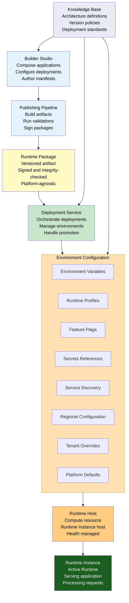

### 4.2 Deployment Flow

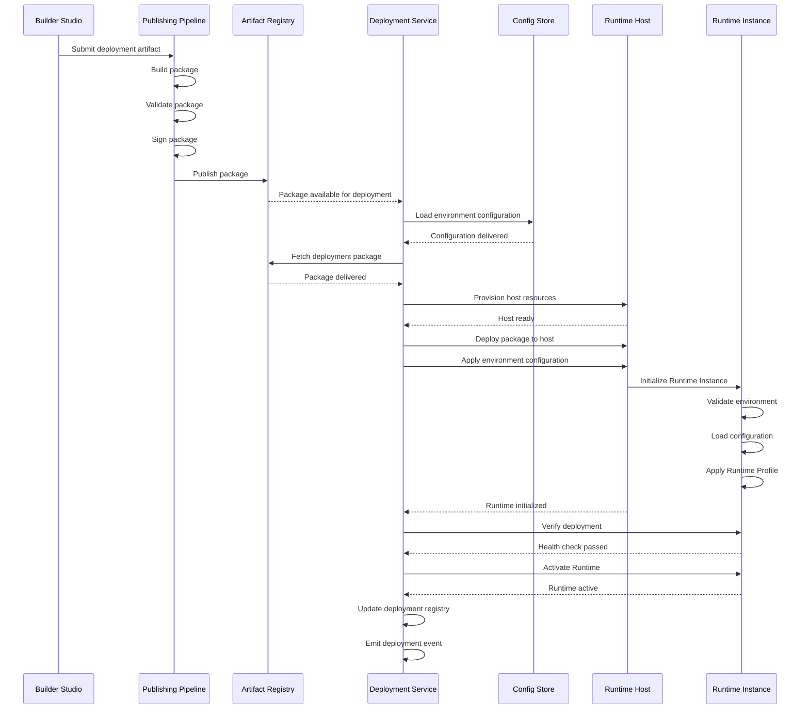

---

## 5. Runtime Environments

### 5.1 Environment Definitions

| Environment | Purpose | Users | Runtime Type | Isolation Level | Configuration Source |
|-------------|---------|-------|-------------|-----------------|---------------------|
| **Local Development** | Developer workstation | Developers | Preview, Web | None (developer only) | Local overrides + defaults |
| **Preview** | Feature preview, review | Developers, QA, Stakeholders | Preview, Web | Per-developer or per-branch | Environment + defaults |
| **Testing** | Automated test execution | CI/CD, Automated tests | All | Isolated per test suite | Environment + test defaults |
| **QA** | Manual and integration testing | QA Team | All | Shared, tenant-isolated | Environment + tenant overrides |
| **Staging** | Pre-production validation | All teams | All | Full production topology | Environment + staging overrides |
| **Production** | Live user traffic | End users | Mobile, Web, Desktop | Multi-tenant, isolated | All config layers |
| **Disaster Recovery** | Failover and continuity | Operations | All | Active-passive or active-active | DR-specific configuration |
| **Edge Environments** | Distributed runtime nodes | End users (edge regions) | Mobile, Web | Per-region, isolated | Regional configuration |

### 5.2 Environment Characteristics

| Characteristic | Local Development | Preview | Testing | QA | Staging | Production | DR |
|----------------|------------------|---------|---------|----|---------|------------|----|
| **Runtime version** | Any | Release candidate | Release candidate | Release candidate | Release candidate | Latest stable | Latest stable |
| **Data isolation** | Local data | Shared sandbox | Ephemeral | Persistent test data | Anonymized production | Production data | Production replica |
| **Scaling** | Single instance | Single instance | Single instance | Limited scale | Production scale | Full scale | Full scale |
| **Monitoring** | None | Basic | Basic | Standard | Full | Full + alerting | Full |
| **Secrets** | Local mocks | Sandbox secrets | Sandbox secrets | QA secrets | Staging secrets | Production secrets | Production secrets |
| **SLA** | None | None | None | Best effort | Best effort | Production SLA | DR SLA |
| **Access** | Developer | Invite only | CI/CD | QA team | All teams | Authorized only | Operations |
| **Retention** | N/A | Per-session | Ephemeral | 30 days | 90 days | Indefinite | Indefinite |

### 5.3 Environment Topology

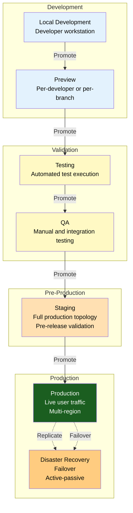

---

## 6. Deployment Lifecycle

### 6.1 Lifecycle Diagram

```mermaid
flowchart TB
    PACKAGE(["Package\nBuild deployment unit\nCreate package\nGenerate metadata"])
    PACKAGE --> VALIDATE

    VALIDATE["Validate\nSchema validation\nCompatibility check\nSecurity scan\nPolicy compliance"]
    VALIDATE --> SIGN

    SIGN["Sign\nCryptographic signing\nTimestamping\nIntegrity metadata"]
    SIGN --> PUBLISH

    PUBLISH["Publish\nUpload to registry\nRegister version\nDistribute to CDN"]
    PUBLISH --> PROMOTE

    PROMOTE["Promote\nValidate target environment\nApply environment configuration\nAuthorize promotion"]
    PROMOTE --> DEPLOY

    DEPLOY["Deploy\nProvision resources\nTransfer package\nInitialize Runtime\nApply configuration"]
    DEPLOY --> VERIFY

    VERIFY["Verify\nHealth check\nIntegration test\nPerformance validation\nCompatibility verification"]
    VERIFY --> MONITOR

    MONITOR["Monitor\nContinuous health\nPerformance observation\nError rate tracking\nUser impact assessment"]
    MONITOR --> OPERATE

    OPERATE["Operate\nOngoing management\nScaling\nUpdates\nIncident response"]
    OPERATE --> RETIRE

    RETIRE(["Retire\nDecommission\nArchive configuration\nRelease resources\nFinal audit"])

    style PACKAGE fill:#e3f2fd,color:#000
    style VALIDATE fill:#fff9c4,color:#000
    style SIGN fill:#f3e5f5,color:#000
    style PUBLISH fill:#e3f2fd,color:#000
    style PROMOTE fill:#ffcc80,color:#000
    style DEPLOY fill:#c8e6c9,color:#000
    style VERIFY fill:#e8eaf6,color:#000
    style MONITOR fill:#e8eaf6,color:#000
    style OPERATE fill:#c8e6c9,color:#000
    style RETIRE fill:#e0e0e0,color:#000
```

### 6.2 Lifecycle States

| Phase | Entry Criteria | Activities | Exit Criteria | Failure Response |
|-------|---------------|------------|---------------|-----------------|
| **Package** | Artifact ready for release | Build deployment unit; create package artifact; generate integrity metadata | Package created and artifact stored | Log build failure; block publishing |
| **Validate** | Package created | Schema validation; compatibility checks; security scanning; policy compliance | All validations passed | Log validation failure; block promotion |
| **Sign** | Validations passed | Cryptographic signing; timestamping with trusted authority; integrity metadata attachment | Package signed and timestamped | Block publishing; alert security team |
| **Publish** | Package signed | Upload to artifact registry; register version metadata; distribute to CDN/edge | Package published and accessible | Log publish failure; retry with backoff |
| **Promote** | Package published in source environment | Validate target environment readiness; apply environment configuration; authorize promotion | Promotion authorized and configuration applied | Block promotion; notify release team |
| **Deploy** | Promotion authorized | Provision host resources; transfer package; initialize Runtime; apply environment configuration | Runtime initialized and healthy | Rollback provisioning; log deployment failure |
| **Verify** | Runtime initialized | Health check execution; integration test suite; performance validation; compatibility verification | All verification checks passed | Rollback deployment; trigger incident response |
| **Monitor** | Verification passed | Continuous health monitoring; performance observation; error rate tracking; user impact assessment | Ongoing | Trigger alerts on degradation; rollback if critical |
| **Operate** | Runtime active | Scaling management; update application; incident response; configuration management | Runtime operational | Incident response per severity |
| **Retire** | Runtime decommissioned | Decommission hosts; archive configuration; release resources; finalize audit | Resources released and audit complete | Escalate if resource release fails |

### 6.3 Deployment Lifecycle Timelines

| Phase | Target Duration | Measurement | Notes |
|-------|----------------|-------------|-------|
| Package | < 5 minutes | Pipeline execution time | Depends on artifact size and build complexity |
| Validate | < 2 minutes | Validation suite execution | Parallelizable checks |
| Sign | < 10 seconds | Signing operation | Requires trusted signing service |
| Publish | < 30 seconds | Registry upload time | Depends on package size and network |
| Promote | < 1 minute | Promotion pipeline | Mostly automated validation |
| Deploy | < 5 minutes | Provisioning + startup | Depends on host provisioning time |
| Verify | < 2 minutes | Verification suite | Parallel health checks |
| Retire | < 1 minute | Resource deallocation | Depends on cleanup complexity |

---

## 7. Environment Configuration

### 7.1 Configuration Architecture

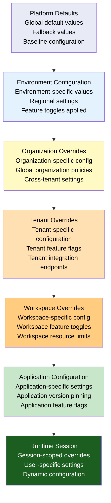

### 7.2 Configuration Resolution

| Layer | Scope | Source | Precedence | Mutability |
|-------|-------|--------|------------|------------|
| **Platform Defaults** | Global | Knowledge Base | Lowest (overridden by all) | Immutable per release |
| **Environment** | Per environment | Environment Configuration Store | Low | Versioned, change-controlled |
| **Organization** | Per organization | Organization Configuration | Medium-low | Change-controlled |
| **Tenant** | Per tenant | Tenant Configuration | Medium | Change-controlled |
| **Workspace** | Per workspace | Workspace Configuration | Medium-high | Change-controlled |
| **Application** | Per application | Application Manifest (KB-042) | High | Versioned with application |
| **Runtime Session** | Per session | Runtime, User session | Highest | Dynamic, session-scoped |

### 7.3 Configuration Categories

| Category | Example Parameters | Source | Security Classification |
|----------|-------------------|--------|------------------------|
| **Environment Variables** | API endpoints, feature flags, log levels | Environment Config Store | Varies per variable |
| **Runtime Profiles** | Resource limits, performance budgets, security settings | Runtime Profile Registry | Internal |
| **Feature Flags** | Feature enablement, rollout percentage, A/B test assignment | Feature Flag Service | Internal |
| **Secrets References** | Database passwords, API keys, certificates | Secrets Manager | Critical — never stored in config |
| **Service Discovery** | Service endpoints, registry addresses, load balancer config | Service Discovery | Internal |
| **Regional Configuration** | Region-specific endpoints, data residency, localization | Regional Config Store | Internal |
| **Tenant Overrides** | Tenant-specific branding, feature flags, integration config | Tenant Configuration | Tenant-isolated |
| **Platform Defaults** | Default timeouts, retry policies, cache sizes | Knowledge Base | Internal |

### 7.4 Secrets Management

| Aspect | Architecture |
|--------|--------------|
| **Secrets storage** | Secrets are stored in a dedicated Secrets Manager (Vault, cloud KMS), never in configuration files or environment variable stores |
| **Secrets reference** | Configuration references secrets by path/name, not by value. The Runtime resolves secrets at initialization from the Secrets Manager |
| **Secrets rotation** | Secrets are rotated on a defined schedule. The Runtime supports hot-reload of rotated secrets without restart |
| **Secrets access** | Runtime instances authenticate to the Secrets Manager using workload identity (not shared credentials) |
| **Secrets audit** | Every secret access is audited — who accessed what secret, when, and from which Runtime instance |
| **Secrets caching** | Runtime caches secrets in memory (encrypted) for the duration of their TTL. Cache is flushed on secret rotation |

---

## 8. Deployment Units

### 8.1 Unit Definitions

| Deployment Unit | Package Format | Deployable Separately | Versioned | Deployment Procedure |
|----------------|---------------|----------------------|-----------|---------------------|
| **Runtime** | Runtime binary package | Yes | Yes | Provision host, deploy binary, initialize Runtime |
| **Applications** | Application manifest + assets | Yes | Yes | Deploy manifest, resolve dependencies, activate |
| **Capabilities** | Capability package (KB-033) | Yes | Yes | Register capability, verify compatibility, activate |
| **Components** | Component package | Yes | Yes | Register component, verify compatibility, cache |
| **Themes** | Theme package | Yes | Yes | Load theme, validate tokens, activate |
| **Extensions** | Extension package | Yes | Yes | Register extension, verify sandbox, activate |
| **Integrations** | Integration adapter package | Yes | Yes | Configure integration, verify connection, activate |
| **Workflows** | Workflow definition | Yes | Yes | Register workflow, validate steps, activate |
| **Assets** | Static asset bundle | Yes | Yes | Upload to CDN, update references |

### 8.2 Deployment Unit Lifecycle

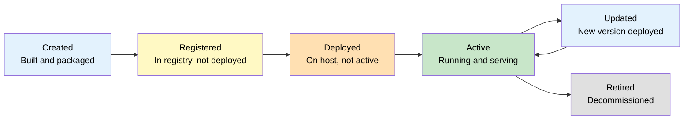

### 8.3 Composite Deployments

Multiple Deployment Units are often deployed together as a composite deployment:

| Composite | Included Units | Coordination | Rollback Unit |
|-----------|---------------|--------------|---------------|
| **Application Release** | Manifest, Capabilities, Components, Theme | Application manifest defines version set | Entire release |
| **Runtime Update** | Runtime binary, critical components | Version compatibility verified (KB-061) | Runtime binary + affected units |
| **Theme Update** | Theme, optional component updates | Theme compatibility verified | Theme only |
| **Extension Install** | Extension, optional capability dependencies | Extension dependency resolution | Extension + dependencies |

---

## 9. Promotion Model

### 9.1 Promotion Pipeline

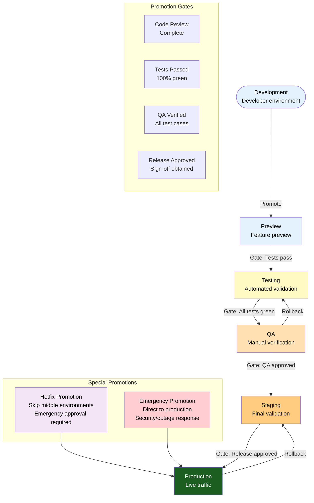

### 9.2 Promotion Gates

| Gate | Environment Transition | Automated | Approvals Required | Verification | Rollback Procedure |
|------|----------------------|-----------|-------------------|-------------|-------------------|
| **Code Complete** | Development to Preview | Yes | None | Build succeeds, unit tests pass | Revert commit |
| **Tests Pass** | Preview to Testing | Yes | None | All automated tests pass | Block promotion |
| **QA Verified** | Testing to QA | Partial | QA lead approval | Integration tests, manual test cases | Promote previous passing build |
| **Release Approved** | QA to Staging | Partial | Release manager approval | Full test suite, performance benchmarks | Promote previous approved release |
| **Ready for Production** | Staging to Production | Partial | Release manager + operations approval | Canary validation, load testing | Rollback to previous production release |

### 9.3 Promotion Types

| Promotion Type | Source | Target | Skip Environments | Approval | Rollback |
|---------------|--------|--------|------------------|----------|----------|
| **Standard** | Development | Production (full path) | None | Full gate chain | Standard rollback |
| **Hotfix** | Hotfix branch | Production | Preview, Testing, QA (optional) | Expedited approval | Standard rollback |
| **Emergency** | Any stable branch | Production | All non-production | Emergency approval (P0 incident) | Immediate rollback |
| **Rollback** | Previous release | Current environment | None | Operations approval | N/A (this is the rollback) |

### 9.4 Environment Promotion Verification

| Check | Preview | Testing | QA | Staging | Production |
|-------|---------|---------|----|---------|------------|
| **Package integrity** | Yes | Yes | Yes | Yes | Yes |
| **Schema validation** | Yes | Yes | Yes | Yes | Yes |
| **Unit tests** | Yes | Yes | Yes | Yes | Yes |
| **Integration tests** | No | Yes | Yes | Yes | Yes |
| **Performance benchmarks** | No | No | Yes | Yes | Yes |
| **Security scan** | Yes | Yes | Yes | Yes | Yes |
| **Compatibility validation** | Yes | Yes | Yes | Yes | Yes |
| **Smoke tests** | No | No | Yes | Yes | Yes |
| **Canary deployment** | No | No | No | Yes | Yes |
| **Load testing** | No | No | No | Yes | Yes (pre-production) |

---

## 10. Runtime Host Model

### 10.1 Host Architecture

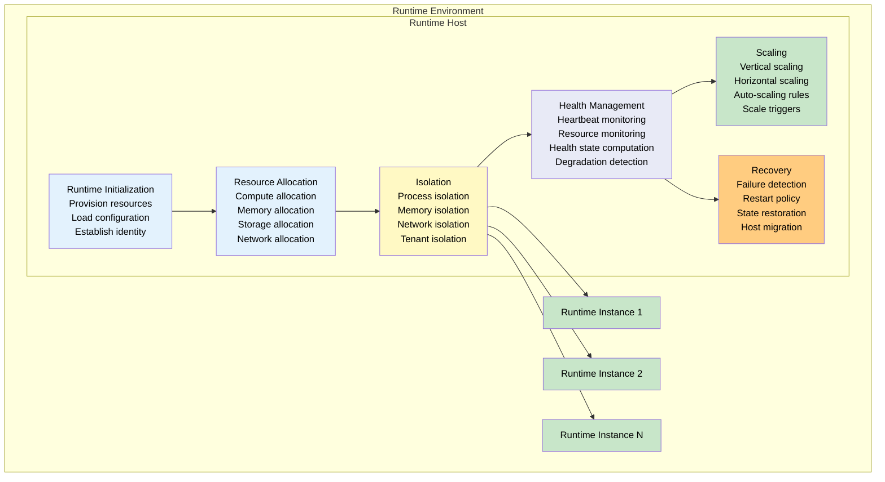

### 10.2 Host Responsibilities

| Responsibility | Description |
|--------------|-------------|
| **Runtime Initialization** | Provision compute, memory, and storage resources; load environment configuration; establish host identity and trust |
| **Resource Allocation** | Allocate resources to Runtime Instances based on Runtime Profiles; enforce resource limits; monitor resource usage |
| **Isolation** | Isolate Runtime Instances at process, memory, network, and tenant levels; prevent cross-instance interference |
| **Health Management** | Monitor host health (CPU, memory, disk, network); compute host health state; report health to Deployment Service |
| **Scaling** | Support vertical scaling (resource allocation changes) and horizontal scaling (instance count changes); execute auto-scaling rules |
| **Recovery** | Detect Runtime Instance failures; execute restart policies; restore state from persistence; migrate instances if host is degraded |

### 10.3 Host Provisioning

| Aspect | Behaviour |
|--------|-----------|
| **Provisioning trigger** | Deployment Service requests host provisioning when a new deployment targets an environment without sufficient capacity |
| **Provisioning source** | Hosts are provisioned from golden images or infrastructure templates, not configured manually |
| **Provisioning verification** | Host self-validates after provisioning — connectivity, resource availability, security posture |
| **Decommissioning** | Hosts are decommissioned when they have zero active Runtime Instances and no pending deployments |
| **Host recycling** | Hosts are periodically recycled (re-provisioned from golden image) to prevent configuration drift |

### 10.4 Host Scaling

| Scaling Type | Trigger | Action | Constraints |
|-------------|---------|--------|-------------|
| **Vertical scale up** | Runtime Instance resource pressure | Increase compute/memory allocation for an instance | Host resource limits, Runtime Profile limits |
| **Vertical scale down** | Sustained low resource utilization | Decrease compute/memory allocation for an instance | Minimum resource floor per Runtime Profile |
| **Horizontal scale out** | Deployment target requires more instances | Provision additional Runtime Hosts and deploy new instances | Environment capacity, infrastructure limits |
| **Horizontal scale in** | Deployment target has excess capacity | Decommission Runtime Hosts and migrate or terminate instances | Minimum instance count per environment |

---

## 11. Environment Isolation

### 11.1 Isolation Model

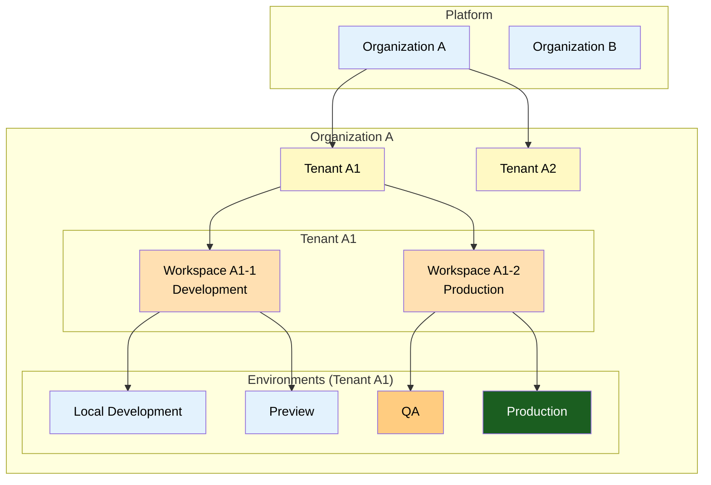

### 11.2 Isolation Boundaries

| Boundary | Isolation Mechanism | Shared Resources | Security Implication |
|----------|-------------------|-----------------|---------------------|
| **Organization** | Separate infrastructure account/project, separate identity provider | None — fully isolated | Organization A cannot access Organization B data or Runtimes |
| **Tenant** | Tenant-scoped Runtime Instances, tenant-scoped configuration | Shared Runtime Host (isolated instances) | Cross-tenant access blocked by Runtime Security (KB-057) |
| **Workspace** | Workspace-scoped configuration, workspace-specific deployments | Shared tenant infrastructure | Workspace A data isolated from Workspace B within same tenant |
| **Environment** | Separate host pools, separate configuration, separate networks | Shared artifact registry | Development cannot access production data or resources |
| **Runtime Host** | Host-level resource isolation, host authentication | Shared infrastructure fabric | Compromised host does not compromise other hosts |
| **Infrastructure Target** | Region-specific isolation, separate cloud accounts | Global artifact registry, global identity | Region failure does not affect other regions |

### 11.3 Environment Isolation Matrix

| Isolation Aspect | Local Development | Preview | QA | Staging | Production | DR |
|-----------------|------------------|---------|----|---------|------------|----|
| **Network isolation** | None | Partial (sandbox) | Full | Full | Full | Full |
| **Data isolation** | Local | Shared sandbox | Isolated test data | Anonymized | Production data | Production replica |
| **Secret isolation** | Mocks | Sandbox | QA | Staging | Production | Production |
| **Infrastructure isolation** | None | Shared | Shared | Dedicated | Dedicated | Dedicated |
| **Monitoring isolation** | None | Shared | Shared | Shared | Dedicated | Dedicated |
| **Identity isolation** | Developer | Invite | QA team | All teams | Authorized only | Operations |

---

## 12. Infrastructure Responsibilities

### 12.1 Runtime Hosts

| Responsibility | Description |
|--------------|-------------|
| **Compute provisioning** | Provision compute resources for Runtime Instances based on deployment specifications |
| **Resource management** | Allocate and monitor CPU, memory, storage, and network resources per Runtime Instance |
| **Instance isolation** | Enforce process, memory, network, and tenant-level isolation between Runtime Instances |
| **Health monitoring** | Monitor host-level health and report to Deployment Service |
| **Auto-recovery** | Detect and recover from host-level failures (process crash, OOM, disk full) |
| **Binary management** | Manage Runtime binary versions — deploy, update, rollback on host |

### 12.2 Configuration Management

| Responsibility | Description |
|--------------|-------------|
| **Configuration storage** | Store all environment configurations in a versioned, auditable configuration store |
| **Configuration distribution** | Distribute configuration to Runtime Hosts at deployment time and on configuration changes |
| **Secrets management** | Manage secrets references, resolution, and rotation without exposing secret values to configuration pipelines |
| **Configuration validation** | Validate configuration schema, consistency, and security before distribution |
| **Configuration audit** | Audit all configuration changes — who changed what, when, and in which environment |

### 12.3 Deployment Orchestration

| Responsibility | Description |
|--------------|-------------|
| **Deployment coordination** | Coordinate the deployment lifecycle across all Deployment Units in a release |
| **Promotion execution** | Execute promotion pipelines with gating, verification, and rollback |
| **Rollback management** | Execute rollback procedures when verification fails or incidents occur |
| **Deployment state tracking** | Maintain the current deployment state for each environment — what is deployed, where, and in what configuration |
| **Deployment event publishing** | Publish deployment events to the observability layer |

### 12.4 Service Discovery

| Responsibility | Description |
|--------------|-------------|
| **Service registration** | Register Runtime Instances in the service discovery registry on activation |
| **Service deregistration** | Deregister Runtime Instances on deactivation or shutdown |
| **Health-based routing** | Route traffic only to healthy Runtime Instances based on health signals |
| **Environment-aware discovery** | Service discovery scoped to environment — production instances discover production services, staging discovers staging |
| **Regional discovery** | Region-aware service discovery for multi-region deployments |

### 12.5 Runtime Scaling

| Responsibility | Description |
|--------------|-------------|
| **Auto-scaling policy management** | Define and manage auto-scaling policies per environment, per Runtime Profile |
| **Scale execution** | Execute scaling operations — provision hosts, deploy instances, update routing |
| **Scale monitoring** | Monitor scaling effectiveness — are scaling decisions improving health and performance? |
| **Scale optimization** | Optimize scaling policies based on observed patterns and cost constraints |

### 12.6 Disaster Recovery

| Responsibility | Description |
|--------------|-------------|
| **Recovery planning** | Define and maintain disaster recovery plans per environment and per region |
| **Failover execution** | Execute failover procedures when primary environment or region is unavailable |
| **Data replication** | Manage data replication between primary and DR environments |
| **Recovery testing** | Periodically test disaster recovery procedures — failover, failback, data consistency |
| **Recovery metrics** | Track recovery time objective (RTO) and recovery point objective (RPO) per environment |

---

## 13. Responsibilities

### 13.1 Runtime Responsibilities

| Responsibility | Description |
|--------------|-------------|
| **Environment detection** | Detect the runtime environment at initialization and apply appropriate configuration |
| **Configuration loading** | Load and resolve configuration from all layers per the resolution hierarchy |
| **Secrets resolution** | Resolve secrets from Secrets Manager at initialization |
| **Health reporting** | Report health to the Deployment Service and Service Discovery |
| **Graceful shutdown** | Support graceful shutdown for controlled decommissioning |
| **Telemetry emission** | Emit deployment, environment, and Runtime metrics to the observability layer |

### 13.2 Builder Responsibilities

| Responsibility | Description |
|--------------|-------------|
| **Deployment unit packaging** | Package applications, capabilities, components, and themes as deployable units |
| **Deployment manifest generation** | Generate deployment manifests with complete version and dependency metadata |
| **Environment-agnostic packaging** | Ensure packages are environment-agnostic — no environment-specific code or configuration |
| **Configuration declaration** | Declare required configuration parameters in the deployment manifest |
| **Promotion readiness** | Ensure artifacts meet promotion gate criteria before submission |

### 13.3 Marketplace Responsibilities

| Responsibility | Description |
|--------------|-------------|
| **Package hosting** | Host and distribute packages for deployment consumption |
| **Package verification** | Verify package integrity and signature before serving to deployment pipelines |
| **Version management** | Manage package versions, deprecation, and retirement per KB-061 |
| **Compatibility metadata** | Provide compatibility metadata for deployment validation |

---

## 14. Security

### 14.1 Trusted Deployments

| Control | Description |
|---------|-------------|
| **Package signing** | Every deployment package is cryptographically signed before publishing |
| **Signature verification** | Deployment Service verifies package signatures before deployment |
| **Publisher authorization** | Only authorized publishers can submit packages for deployment |
| **Deployment authorization** | Deployments to production require authorized release approval |
| **Environment access control** | Access to each environment is controlled by identity and authorization policies |

### 14.2 Package Verification

| Check | When | Failure Response |
|-------|------|-----------------|
| **Signature verification** | Before deployment | Block deployment; alert security |
| **Integrity hash** | Before deployment | Re-download; if persistent, block deployment |
| **Dependency integrity** | Before Runtime initialization | Block initialization; alert operations |
| **Schema validation** | Before deployment | Block deployment; notify publisher |
| **Compatibility check** | Before deployment | Block deployment; report incompatibility |

### 14.3 Secure Configuration

| Practice | Description |
|----------|-------------|
| **Configuration signing** | Environment configurations are signed to prevent tampering |
| **Configuration encryption** | Sensitive configuration values are encrypted at rest and in transit |
| **Configuration validation** | Configuration schemas are validated before distribution |
| **Configuration audit** | All configuration changes are audited with identity, timestamp, and diff |
| **Drift detection** | Configuration drift from the declared state is detected and alerted |

### 14.4 Secrets References

| Practice | Description |
|----------|-------------|
| **Never embed secrets** | Secrets are never embedded in configuration files, environment variables, or deployment packages |
| **Secrets reference pattern** | Configuration references secrets by path (e.g., `secret://db/password`) |
| **Runtime resolution** | Runtime resolves secrets from Secrets Manager at initialization |
| **Workload identity** | Runtime authenticates to Secrets Manager using workload identity, not shared credentials |
| **Secrets rotation** | Secrets are rotated on schedule; Runtime supports hot-reload of rotated secrets |

### 14.5 Runtime Trust

| Aspect | Architecture |
|--------|--------------|
| **Runtime identity** | Every Runtime Instance has a unique identity verified at initialization (KB-057) |
| **Runtime integrity** | Runtime binary integrity is verified before execution |
| **Runtime authorization** | Runtime Instances are authorized to access resources based on their identity and environment |
| **Runtime isolation** | Runtime Instances are isolated from each other at process, memory, and network levels |

### 14.6 Deployment Authorization

| Deployment Action | Authorization Required | Approval Chain |
|------------------|----------------------|----------------|
| **Deploy to Preview** | Developer role | Automated |
| **Deploy to Testing** | Developer role | Automated |
| **Deploy to QA** | Developer + QA lead | Automated + manual |
| **Deploy to Staging** | Release manager | Manual approval |
| **Deploy to Production** | Release manager + operations | Multi-party approval |
| **Rollback** | Operations role | Automated (health-triggered) or manual |
| **Emergency deployment** | Emergency role | Expedited, post-deployment audit |

### 14.7 Infrastructure Isolation

| Isolation Level | Mechanism | Scope |
|----------------|-----------|-------|
| **Network isolation** | Virtual networks, security groups, network policies | Per environment |
| **Compute isolation** | Separate host pools, container isolation, VM isolation | Per environment |
| **Storage isolation** | Separate storage volumes, encryption per volume | Per environment, per tenant |
| **Identity isolation** | Separate identity providers, environment-scoped roles | Per environment |
| **Audit isolation** | Separate audit logs per environment | Per environment |

---

## 15. Performance

### 15.1 Deployment Throughput

| Metric | Target | Measurement |
|--------|--------|-------------|
| **Deployments per hour** | 10+ concurrent | Deployment pipeline throughput |
| **Deployment pipeline duration** | < 10 minutes (non-production), < 20 minutes (production) | Pipeline execution time |
| **Promotion gate latency** | < 1 second per automated gate | Gate evaluation time |
| **Rollback execution time** | < 5 minutes | Trigger to completion |

### 15.2 Startup Performance

| Metric | Target | Measurement |
|--------|--------|-------------|
| **Runtime initialization** | < 5 seconds | Request to healthy |
| **Configuration resolution** | < 500ms | Configuration load time |
| **Secrets resolution** | < 200ms per secret | Secret fetch time |
| **Deployment activation** | < 2 seconds | Verification to active |

### 15.3 Runtime Density

| Metric | Target | Measurement |
|--------|--------|-------------|
| **Runtime Instances per host** | Determined by Runtime Profile | Instance count per host |
| **Host resource utilization** | 70-80% target | CPU, memory, I/O utilization |
| **Over-provisioning buffer** | 20% headroom per host | Reserved capacity |
| **Instance startup concurrency** | 10+ simultaneous startups per host | Concurrent initialization count |

### 15.4 Deployment Optimization

| Optimization | Benefit | Implementation |
|-------------|---------|----------------|
| **Layer caching** | Reduce deployment transfer size | Cache common Runtime layers on hosts |
| **Parallel deployment** | Reduce deployment duration | Deploy independent units in parallel |
| **Differential deployment** | Reduce transfer size | Deploy only changed artifacts (KB-061) |
| **Lazy asset loading** | Reduce activation time | Load assets on first access, not at deployment |
| **Configuration pre-fetch** | Reduce initialization time | Pre-fetch configuration during deployment |

### 15.5 Horizontal Scaling

| Aspect | Target | Implementation |
|--------|--------|----------------|
| **Scale-out latency** | < 2 minutes | Pre-provisioned host pool |
| **Scale-in latency** | < 1 minute | Graceful instance drain |
| **Max instances per environment** | Determined by capacity planning | Environment capacity limit |
| **Auto-scaling cooldown** | 30 seconds | Prevent thrashing |

---

## 16. Observability

### 16.1 Deployment Metrics

| Metric | Type | Source | Aggregation |
|--------|------|-------|-------------|
| `deployment.count` | Counter | Deployment Service | Rate, total |
| `deployment.duration` | Timer | Deployment lifecycle | Avg, p95, p99 |
| `deployment.phase.{phase}.duration` | Timer | Per-phase duration | Avg, p95 |
| `deployment.failure.count` | Counter | Deployment failures | Rate, total |
| `deployment.failure.phase` | Enum | Failure phase distribution | Distribution |
| `deployment.rollback.count` | Counter | Rollback executions | Rate, total |

### 16.2 Environment Metrics

| Metric | Type | Source | Aggregation |
|--------|------|-------|-------------|
| `environment.healthy` | Gauge | Environment health aggregation | Current |
| `environment.instance.count` | Gauge | Active Runtime Instances | Current, per environment |
| `environment.host.count` | Gauge | Active Runtime Hosts | Current, per environment |
| `environment.configuration.version` | Gauge | Configuration version | Current |
| `environment.last.deployment` | Timestamp | Last deployment time | Current |

### 16.3 Runtime Metrics

| Metric | Type | Source | Aggregation |
|--------|------|-------|-------------|
| `runtime.healthy` | Gauge | Runtime health | Current |
| `runtime.uptime` | Gauge | Runtime instance uptime | Current |
| `runtime.memory.usage` | Gauge | Memory consumption | Avg, max |
| `runtime.cpu.usage` | Gauge | CPU utilization | Avg, max |
| `runtime.startup.duration` | Timer | Initialization time | Avg, p95 |

### 16.4 Promotion Metrics

| Metric | Type | Source | Aggregation |
|--------|------|-------|-------------|
| `promotion.count` | Counter | Promotion pipeline | Rate, total |
| `promotion.duration` | Timer | Pipeline duration per environment | Avg, p95 |
| `promotion.gate.{gate}.duration` | Timer | Per-gate evaluation time | Avg |
| `promotion.gate.{gate}.failure` | Counter | Gate failure count | Rate |
| `promotion.type` | Enum | Promotion type distribution | Distribution |

### 16.5 Deployment Observability Pipeline

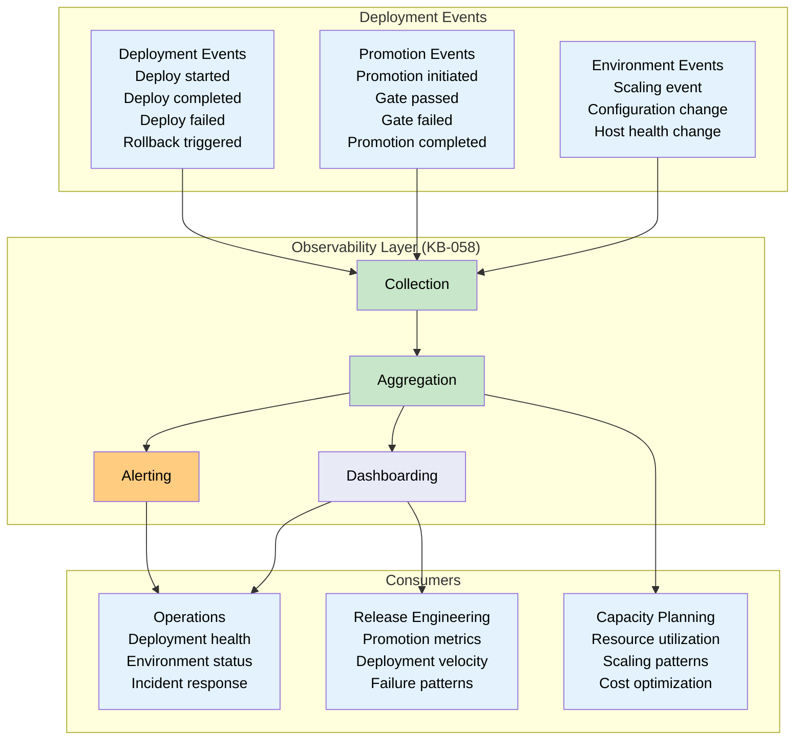

---

## 17. Disaster Recovery

### 17.1 Disaster Recovery Architecture

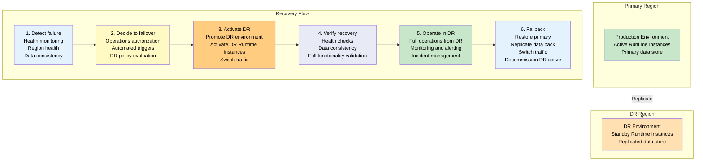

### 17.2 Recovery Objectives

| Objective | Target | Measurement |
|-----------|--------|-------------|
| **Recovery Time Objective (RTO)** | < 15 minutes for production | Time from failover trigger to active DR environment |
| **Recovery Point Objective (RPO)** | < 5 minutes for production | Maximum data loss in seconds |
| **Recovery verification** | < 5 minutes | Time to verify DR environment health |
| **Failback time** | < 30 minutes | Time to restore primary and decommission DR active |

### 17.3 Recovery Types

| Recovery Type | Scope | RTO | RPO | Procedure |
|--------------|-------|-----|-----|-----------|
| **Runtime Recovery** | Single Runtime Instance | < 1 minute | < 1 second | Restart instance on same or different host (KB-060) |
| **Environment Recovery** | Single environment | < 5 minutes | < 1 minute | Promote last known good deployment |
| **Configuration Recovery** | Environment configuration | < 2 minutes | < 1 minute | Restore previous configuration version |
| **Package Recovery** | Deployment package | < 5 minutes | < 1 minute | Re-download from registry |
| **Regional Recovery** | Full region failover | < 15 minutes | < 5 minutes | Activate DR region, switch traffic |

### 17.4 DR Testing

| Test Type | Frequency | Scope | Success Criteria |
|-----------|-----------|-------|-----------------|
| **Runtime recovery test** | Weekly | Single instance failover | Instance healthy within 1 minute |
| **Environment recovery test** | Monthly | Full environment recovery | Environment healthy within 5 minutes |
| **Configuration recovery test** | Monthly | Configuration version rollback | Configuration restored within 2 minutes |
| **Regional failover test** | Quarterly | Full DR region activation | DR region healthy within 15 minutes |
| **Full DR演习** | Annually | Complete failover and failback | All objectives met |

---

## 18. Failure Scenarios

### 18.1 Invalid Deployment Package

| Scenario | Detection | Response | Recovery |
|----------|-----------|----------|----------|
| Package fails signature verification | Deployment validation phase | Block deployment; alert publisher | Publisher re-signs and re-publishes |
| Package fails integrity check | Deployment validation phase | Re-download package; if persistent, block deployment | Registry verifies package integrity; re-upload if corrupted |
| Package schema invalid | Deployment validation phase | Block deployment; report schema errors | Publisher fixes schema and re-publishes |
| Package missing required dependencies | Deployment validation phase | Block deployment; report missing deps | Publisher includes dependencies or updates manifest |

### 18.2 Configuration Conflict

| Scenario | Detection | Response | Recovery |
|----------|-----------|----------|----------|
| Configuration schema validation fails | Configuration resolution | Block deployment; report schema errors | Fix configuration and re-deploy |
| Configuration layer conflict (same key at multiple layers) | Configuration resolution | Log conflict; apply precedence rule | Adjust configuration to remove ambiguity |
| Configuration references missing secret | Configuration resolution | Block Runtime initialization; report missing secret | Create secret in Secrets Manager |
| Configuration references deprecated parameter | Configuration validation | Log warning; apply fallback | Update configuration to use current parameter |

### 18.3 Environment Mismatch

| Scenario | Detection | Response | Recovery |
|----------|-----------|----------|----------|
| Package deployed to wrong environment | Promotion gate validation | Block deployment; report mismatch | Re-route to correct environment |
| Environment capacity insufficient | Host provisioning | Block deployment; scale environment | Scale out environment or reschedule |
| Environment not ready (dependencies failing) | Environment health check | Block deployment; report environment health | Resolve environment health issues |
| Environment version incompatible with package | Compatibility validation | Block deployment; report incompatibility | Update environment or package to compatible versions |

### 18.4 Failed Promotion

| Scenario | Detection | Response | Recovery |
|----------|-----------|----------|----------|
| Automated gate failure | Promotion pipeline execution | Block promotion; report gate failure | Fix gate condition and re-promote |
| Manual approval timeout | Promotion pipeline execution | Block promotion; notify approvers | Re-submit for approval |
| Promotion target environment unavailable | Promotion validation | Block promotion; report environment status | Resolve environment availability |

### 18.5 Runtime Startup Failure

| Scenario | Detection | Response | Recovery |
|----------|-----------|----------|----------|
| Runtime binary corrupted | Integrity verification at startup | Block Runtime initialization; report corruption | Re-deploy Runtime package |
| Runtime configuration invalid | Configuration resolution at startup | Block Runtime initialization; report config error | Fix configuration and restart |
| Runtime dependency unavailable | Dependency resolution at startup | Block Runtime initialization; report dependency | Resolve dependency availability |
| Runtime host resource insufficient | Host resource check | Block Runtime initialization; scale host | Scale host resources or select different host |

### 18.6 Host Failure

| Scenario | Detection | Response | Recovery |
|----------|-----------|----------|----------|
| Host process crash | Health monitoring | Restart Runtime Instance on same host | If persistent, migrate to different host |
| Host out of memory | Resource monitoring | Terminate lowest-priority instances | Scale host or distribute instances |
| Host disk full | Resource monitoring | Rotate logs; clean caches | Expand storage or migrate instances |
| Host network partition | Connectivity monitoring | Isolate host; redistribute traffic | Restore network connectivity or replace host |

### 18.7 Deployment Rollback Failure

| Scenario | Detection | Response | Recovery |
|----------|-----------|----------|----------|
| Rollback package unavailable | Rollback execution | Block rollback; alert operations | Restore package from external backup |
| Rollback configuration fails | Rollback execution | Log configuration rollback failure; continue with current config | Manually restore configuration |
| Rollback state inconsistent | Post-rollback verification | Escalate to manual recovery | Recover state from backup |

### 18.8 Configuration Drift

| Scenario | Detection | Response | Recovery |
|----------|-----------|----------|----------|
| Manual configuration change outside deployment pipeline | Drift detection scan | Alert operations; log drift | Re-apply declared configuration |
| Configuration version mismatch across hosts | Environment health check | Alert operations; reconcile hosts | Re-deploy configuration to all hosts |
| Unauthorized configuration change | Security audit | Alert security; block change | Revert to authorized configuration |

---

## 19. Anti-patterns

### 19.1 Environment-Specific Code

**Anti-pattern:** Writing code that behaves differently based on the deployment environment (e.g., `if (environment === 'production')`).

**Why it is harmful:** Breaks environment independence, makes testing unreliable, introduces untested code paths in production, and couples code to infrastructure.

**Correct approach:** Environment-specific behavior is expressed through configuration, feature flags, and Runtime Profiles — not through conditional code.

### 19.2 Mutable Production Deployments

**Anti-pattern:** SSH-ing into production hosts to apply fixes, modify configuration, or patch code.

**Why it is harmful:** Creates un-tracked changes, makes deployments non-reproducible, bypasses audit trails, and introduces configuration drift.

**Correct approach:** All changes go through the deployment pipeline. Emergency fixes use the hotfix or emergency promotion paths, not manual host modification.

### 19.3 Manual Configuration Drift

**Anti-pattern:** Manually changing configuration in production environments through dashboards, CLIs, or direct database modifications.

**Why it is harmful:** Configuration becomes inconsistent with the declared state, changes are un-tracked, rollback becomes impossible, and audits cannot verify compliance.

**Correct approach:** All configuration changes go through the Configuration Store with versioning, approval, and audit. Changes are applied through deployments, not manual intervention.

### 19.4 Hardcoded Secrets

**Anti-pattern:** Embedding secrets (passwords, API keys, certificates) in configuration files, environment variables, or source code.

**Why it is harmful:** Secrets are exposed to anyone with access to the configuration or code, rotation requires deployment, and audit trails cannot track secret usage.

**Correct approach:** Use Secrets Manager with workload identity authentication. Configuration references secrets by path, never by value.

### 19.5 Runtime-Specific Deployment Rules

**Anti-pattern:** Defining different deployment procedures for different Runtime types (e.g., Mobile deploys differently from Web).

**Why it is harmful:** Violates runtime independence, increases operational complexity, and makes cross-platform releases unmanageable.

**Correct approach:** All Runtime types follow the same deployment model and pipeline. Platform-specific deployment concerns are abstracted through the Platform Adaptation Layer.

### 19.6 Rebuilding for Every Environment

**Anti-pattern:** Rebuilding or re-packaging artifacts for each environment (e.g., building a separate package for staging and production).

**Why it is harmful:** The artifact deployed to production is different from the artifact tested in staging, invalidating test results and introducing risk.

**Correct approach:** The same artifact is promoted across environments without rebuilding. Environment-specific concerns are expressed through configuration, not through different builds.

### 19.7 Unverified Deployment Artifacts

**Anti-pattern:** Deploying artifacts that have not been through the full validation and promotion pipeline (e.g., deploying directly from a developer's machine to production).

**Why it is harmful:** Bypasses all quality gates, security scans, and compatibility checks. Unverified artifacts are the leading cause of production incidents.

**Correct approach:** All deployments go through the full promotion pipeline with automated gating. Emergency promotions bypass non-essential gates but still require authorization and produce audit trails.

---

## 20. Future Evolution

### 20.1 Autonomous Deployments

Future deployments may be fully autonomous for low-risk changes:

- Automated canary analysis with traffic shifting based on real-time health metrics
- Self-approving promotions for patch and minor updates within verified compatibility
- Automatic rollback on degradation detection with no human intervention

### 20.2 AI-Assisted Release Management

Future release management may incorporate AI-assisted analysis:

- Predictive deployment risk scoring based on historical failure patterns
- Automated release note generation from change analysis
- AI-driven promotion gate evaluation and anomaly detection
- Automated incident correlation between deployments and production issues

### 20.3 Self-Healing Environments

Future environments may be self-healing:

- Automatic detection and remediation of configuration drift
- Self-recovering Runtime Instances without deployment intervention
- Automated capacity optimization based on usage patterns
- Self-tuning Runtime Profiles based on observed performance

### 20.4 Edge Runtime Orchestration

Future deployments may extend to edge environments:

- Distributed Runtime orchestration across edge nodes
- Regional deployment with automatic traffic routing
- Offline-first edge Runtime with deferred synchronization
- Edge-specific Runtime Profiles for constrained environments

### 20.5 Global Runtime Federation

Future deployments may span global infrastructure:

- Multi-region active-active Runtime deployment
- Global load balancing with regional affinity
- Cross-region state replication and conflict resolution
- Federated identity across regional deployments

### 20.6 Zero-Touch Operations

Future operations may approach zero-touch:

- Fully automated deployment pipeline from commit to production
- Self-approving releases within defined risk thresholds
- Automatic capacity management and cost optimization
- Predictive maintenance before failures occur

---

## 21. Cross-References

| Reference | Document | Relationship |
|-----------|----------|-------------|
| **KB-031** | Publishing Pipeline | Package build, validation, signing, and publication for deployment |
| **KB-033** | Package & Artifact Specification | Package format used as deployment unit |
| **KB-040** | Marketplace Distribution & Lifecycle | Package distribution and version management |
| **KB-051** | Runtime Architecture Overview | Runtime architecture that deployment targets |
| **KB-052** | Rendering Engine Architecture | Rendering engine version management in deployments |
| **KB-057** | Runtime Security Architecture | Runtime trust, identity, and isolation for secure deployment |
| **KB-058** | Runtime Observability & Diagnostics Architecture | Deployment and environment observability |
| **KB-059** | Runtime Performance & Optimization Architecture | Performance targets and optimization for Runtime deployment |
| **KB-060** | Runtime Lifecycle Management Architecture | Runtime lifecycle states during deployment and retirement |
| **KB-061** | Runtime Update & Versioning Architecture | Version compatibility and update lifecycle for deployments |

---

## 22. Mermaid Diagram Index

| Diagram | Section | Description |
|---------|---------|-------------|
| Deployment Architecture | 4.1 | Complete deployment architecture from Knowledge Base to Runtime Instance |
| Deployment Flow | 4.2 | Sequence diagram of deployment lifecycle interactions |
| Environment Topology | 5.3 | Environment hierarchy from Development through DR |
| Deployment Lifecycle | 6.1 | Complete deployment lifecycle from Package to Retire |
| Configuration Resolution | 7.1 | Configuration resolution hierarchy from Platform Defaults to Runtime Session |
| Deployment Unit Lifecycle | 8.2 | Lifecycle states for individual deployment units |
| Promotion Pipeline | 9.1 | Promotion pipeline with gates, hotfix, and emergency paths |
| Host Architecture | 10.1 | Runtime Host model with initialization, isolation, health, scaling, recovery |
| Environment Isolation | 11.1 | Isolation model across organizations, tenants, workspaces, environments |
| Deployment Observability Pipeline | 16.5 | Deployment event telemetry pipeline to consumers |
| Disaster Recovery Architecture | 17.1 | DR architecture with failover and failback flow |
