# Identity Platform Architecture

**KB-063 — Identity Platform Architecture Specification**

| Metadata | |
|----------|---|
| **KB ID** | KB-063 |
| **Title** | Identity Platform Architecture |
| **Version** | 0.1.0 |
| **Status** | Draft |
| **Owner** | Architecture Team |
| **Suite** | Identity & Access Architecture |
| **Dependencies** | KB-043 Workspace & Tenant Model, KB-051 Runtime Architecture Overview, KB-057 Runtime Security Architecture, KB-060 Runtime Lifecycle Management, KB-062 Runtime Deployment & Environment |
| **Related Documents** | KB-041 Application Architecture Overview, KB-042 Application Manifest Specification, KB-055 Runtime State Engine Architecture, KB-056 Runtime Navigation Engine Architecture, KB-058 Runtime Observability & Diagnostics Architecture, KB-059 Runtime Performance & Optimization Architecture |
| **Review Status** | Pending |
| **Last Updated** | 2026-07-11 |

---

### Revision History

| Version | Date | Author | Change |
|---------|------|--------|--------|
| 0.1.0 | 2026-07-11 | AI Architecture Agent | Initial draft |

---

## 1. Executive Summary

### 1.1 Purpose

This document defines the Identity Platform Architecture for the DUKADESK Platform. The Identity Platform is the single source of truth for digital identity across the entire ecosystem. It is a platform service, not an application service — it provides the single identity used across all DUKADESK services, runtimes, and applications.

The Identity Platform formalizes one of DUKADESK's most important platform principles:

> **One Person. One DUKADESK Identity. Unlimited Organizations, Tenants, Workspaces, and Applications.**

Users authenticate once into DUKADESK. They never create separate accounts for individual tenant applications. Tenant applications receive identity through delegated access after explicit user consent. Identity belongs to DUKADESK, while applications receive delegated access through consent. This enables seamless movement across every tenant application without repeated registration while maintaining strict tenant isolation and user privacy.

### 1.2 Scope

**In scope:**

- Architectural principles: One Identity Per Person, Identity Before Access, Authentication is not Authorization, Consent Before Data Sharing, Tenant Isolation, Organization Isolation, Privacy by Design, Zero Trust, Identity Independence, Identity Portability, Federation Ready, Future Proof
- Canonical definitions: Identity, Identity Platform, Identity Provider, Identity Subject, Universal User, Identity Record, Organization, Tenant, Workspace, Membership, Identity Context, Identity Claim, Trust Boundary, Identity Relationship, Service Identity, Machine Identity
- Identity Architecture: platform service model with Authentication, Universal Profile, Consent components
- Identity Hierarchy: Platform, Organization, Tenant, Workspace, Application, Session, User relationships
- Identity Domains: Consumer, Organization, Tenant, Workspace, Platform, Marketplace, Builder, Runtime
- Universal Identity Model: single global user with multiple organizations, tenant memberships, workspace memberships, application relationships, devices, sessions
- Identity Relationships: User to Organization, Tenant, Workspace, Application, Marketplace, Builder, Business Dashboard
- Identity Context Resolution: Organization, Tenant, Workspace, Application, Session, Device, Environment
- Responsibilities: Identity Platform, Runtime, Builder, Backend
- Security: Identity Trust Boundaries, Isolation, Verification, Integrity, Confidentiality, Availability, Non-Repudiation
- Privacy: User Ownership, Data Minimization, Consent Foundation, Privacy Isolation, Cross-Tenant Privacy, Universal Profile Governance
- Performance: Identity Resolution, Membership Resolution, Context Resolution, Session Resolution, Federation Latency
- Observability: Identity Metrics, Registration Metrics, Membership Metrics, Resolution Metrics, Federation Metrics, Identity Health
- Failure scenarios, anti-patterns, and future evolution

**Out of scope:**

- Implementation details of specific identity providers, authentication protocols, or identity stores
- Application-level identity management (handled by individual application specs)
- Identity UI/UX design
- Backend service-specific identity handling

---

## 2. Architectural Principles

### 2.1 One Identity Per Person

Every person has exactly one DUKADESK Identity. There are no duplicate accounts, no per-tenant accounts, no per-application accounts. One identity spans the entire ecosystem — across organizations, tenants, workspaces, applications, devices, and sessions.

### 2.2 Identity Before Access

Identity is established before any access is granted. Every interaction with the DUKADESK Platform begins with identity resolution. No operation proceeds without an established identity context. Identity is the first concern of every Runtime request.

### 2.3 Authentication is not Authorization

Identity and authorization are separate concerns. Identity answers "who is this user?" Authorization answers "what is this user allowed to do?" Authentication may be delegated to third-party providers, but authorization is always governed by DUKADESK policy. Identity resolution does not imply access rights.

### 2.4 Consent Before Data Sharing

Identity data is never shared across tenant boundaries without explicit user consent. Users control which organizations, tenants, and applications can access their identity data. Consent is recorded, versioned, revocable, and auditable. No identity data crosses a trust boundary without consent.

### 2.5 Tenant Isolation

Identities are tenant-aware but tenant-independent. A user's identity is not owned by any tenant. Tenant membership is a relationship between the user and the tenant, not a property of the user's identity. Tenant isolation means one tenant cannot access identity data from another tenant without user consent and platform authorization.

### 2.6 Organization Isolation

Organizations are isolated from each other at the identity level. Organizations manage their own tenant relationships, workspace hierarchies, and membership rosters. Identity data does not leak between organizations. A user's membership in Organization A does not grant visibility into Organization B.

### 2.7 Privacy by Design

Privacy is embedded into the identity architecture from the ground up. Identity data is minimized, access is controlled, consent is required, and users own their data. The Identity Platform collects only the identity data necessary for platform operation. No telemetry or analytics captures identity data.

### 2.8 Zero Trust

The Identity Platform operates on Zero Trust principles. No identity is trusted by default. Every identity claim is verified before any action is taken. Verification occurs at every trust boundary. Trust is established per-request, not per-session.

### 2.9 Identity Independence

Identity exists independently of every application. Applications consume identity — they never own identity. An application receives identity context through delegated access. The user's identity record is not coupled to any specific application's data model or lifecycle.

### 2.10 Identity Portability

Users control their identity and can port it across the ecosystem. A user's Universal Profile follows them across organizations, tenants, workspaces, and applications. Identity portability means users never need to rebuild their identity context when moving between tenants.

### 2.11 Federation Ready

The Identity Platform is designed for federation with external identity providers. Authentication may be delegated to social login providers, enterprise identity providers, government identity systems, or decentralized identity networks. The platform abstracts federation behind a unified identity interface.

### 2.12 Future Proof

The Identity Platform is architected for future identity paradigms. The domain model, context resolution, and trust boundaries are compatible with decentralized identity, verifiable credentials, passkeys, identity wallets, and machine-to-machine identity. New identity mechanisms are integrated without changing the core architecture.

---

## 3. Canonical Definitions

### 3.1 Identity

The unique, persistent representation of a single person, service, or machine within the DUKADESK ecosystem. An Identity has a globally unique identifier, a Universal Profile, and a set of relationships to organizations, tenants, workspaces, and sessions.

### 3.2 Identity Platform

The platform service that provides identity registration, resolution, verification, lifecycle management, federation, and audit for the entire DUKADESK ecosystem. The Identity Platform is the single source of truth for all identity data.

### 3.3 Identity Provider

An external system that authenticates an Identity Subject and provides identity claims to the Identity Platform. Identity Providers include social login providers (Google, Apple, Facebook), enterprise identity providers (Azure AD, Okta), and platform-native authentication.

### 3.4 Identity Subject

The entity being identified — a person, service, or machine. Identity Subjects have one identity record and one Universal Profile. The Identity Subject is the "who" in every identity operation.

### 3.5 Universal User

The canonical representation of a person within the DUKADESK ecosystem. The Universal User has a single identity, a single profile, and relationships to all organizations, tenants, workspaces, and applications they interact with. There is exactly one Universal User per person.

### 3.6 Identity Record

The persistent data store entry for an Identity. The Identity Record contains the global identifier, authentication factors, profile data, and relationship references. The Identity Record is the source of truth for identity state.

### 3.7 Organization

A top-level entity in the DUKADESK hierarchy that owns tenants, manages members, and governs policies. Organizations have their own identity context within the Identity Platform. Users have Organization Membership that defines their role and access within the organization.

### 3.8 Tenant

A business entity within an Organization that provides services to end users. Tenants have their own identity context, membership roster, and consent records. Users have Tenant Membership that is established through organization membership or direct invitation.

### 3.9 Workspace

A functional division within a Tenant that groups applications and resources. Workspaces have their own membership and access policies. Users have Workspace Membership that is inherited from Tenant Membership or assigned directly.

### 3.10 Membership

A relationship between an Identity Subject and an Organization, Tenant, or Workspace. Membership defines the identity subject's role, access rights, and relationship metadata. Membership is the mechanism through which identity subjects participate in platform entities.

### 3.11 Identity Context

The resolved set of identity information available during a Runtime operation. Identity Context includes the user's identity, current organization, tenant, workspace, session, device, and environment. Identity Context is resolved per-request and propagated through the Runtime.

### 3.12 Identity Claim

A statement about an Identity Subject made by an Identity Provider or the Identity Platform. Claims include identity attributes (name, email), authentication status, membership information, and consent grants. Claims are verified before they are consumed.

### 3.13 Trust Boundary

A logical boundary across which identity data cannot pass without explicit authorization and consent. Trust boundaries exist between organizations, between tenants, and between platform services. Identity data that crosses a trust boundary triggers verification and consent checks.

### 3.14 Identity Relationship

A declared, governed connection between an Identity Subject and a platform entity (Organization, Tenant, Workspace, Application). Identity Relationships have a type, status, role, and metadata. Relationships are created through invitations, memberships, or consent grants.

### 3.15 Service Identity

An identity assigned to a service, not a person. Service Identities have their own identity records, authentication mechanisms, and authorization policies. Service Identities are used for machine-to-machine communication and backend service interactions.

### 3.16 Machine Identity

An identity assigned to an automated system, device, or process. Machine Identities include IoT devices, CI/CD pipelines, and AI agents. Machine Identities follow the same Identity Platform architecture but have different authentication and authorization characteristics.

---

## 4. Identity Architecture

### 4.1 Architecture Diagram

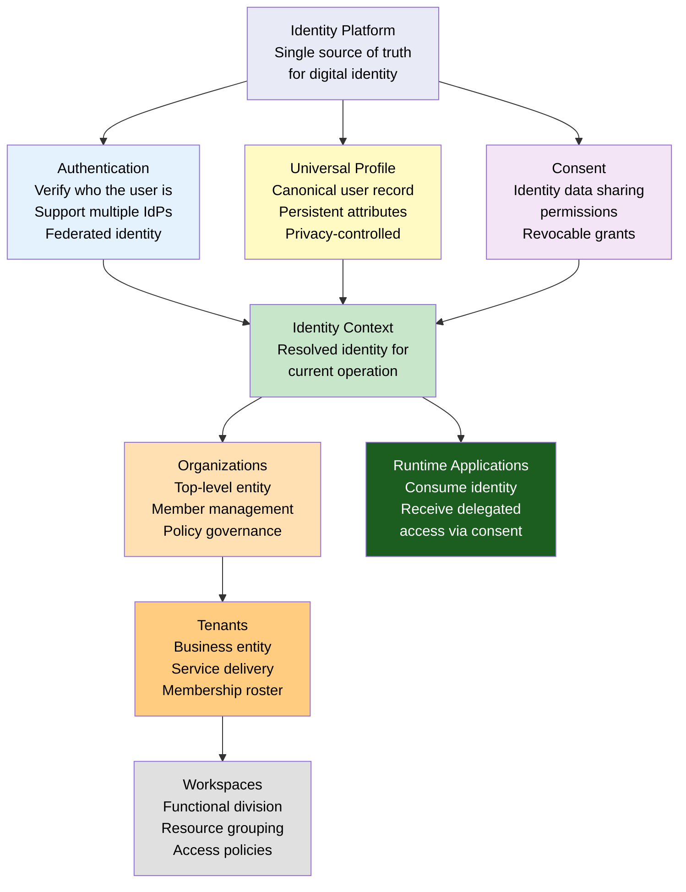

### 4.2 Platform Service Model

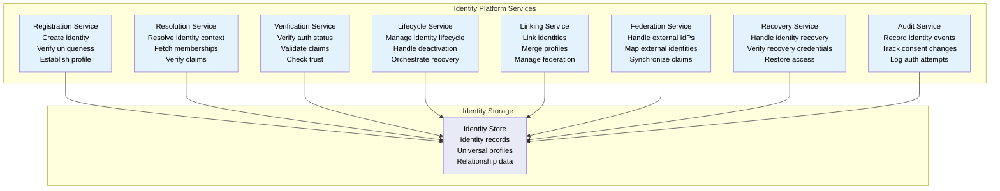

### 4.3 Identity Platform Ecosystem

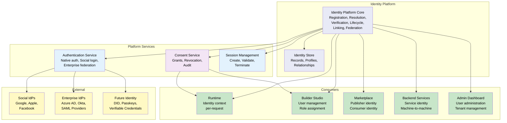

---

## 5. Identity Hierarchy

### 5.1 Hierarchy Model

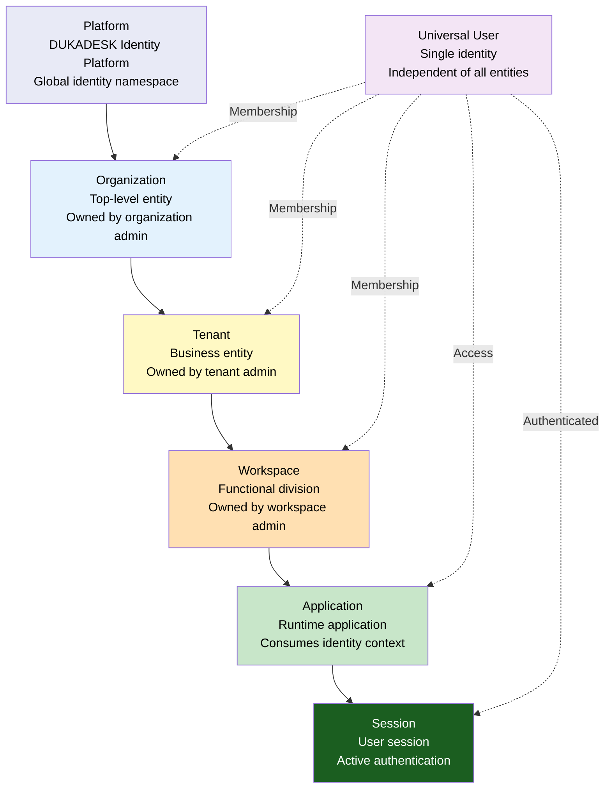

### 5.2 Hierarchy Principles

| Principle | Description |
|-----------|-------------|
| **Identity independence** | The Universal User exists independently of every entity in the hierarchy. Identity is not created by an organization, tenant, or application. Identity precedes membership. |
| **Consumption, not ownership** | Organizations, tenants, and workspaces consume identity through membership. They do not own identity. Ownership of identity data is governed by consent and privacy policy. |
| **Hierarchical scope** | Organizations contain tenants. Tenants contain workspaces. Workspaces contain applications. This hierarchy scopes identity relationships and access rights. |
| **Inheritance** | User membership at a higher level (Organization) implies access to lower levels (Tenant, Workspace) unless explicitly restricted. Inheritance is governed by role assignments and consent. |
| **Independent membership** | A user can belong to multiple organizations. Within each organization, they can belong to multiple tenants. Within each tenant, they can belong to multiple workspaces. Memberships are independent across branches. |

### 5.3 Identity vs Entity Ownership

| Aspect | Universal User | Organization | Tenant | Workspace | Application |
|--------|---------------|--------------|--------|-----------|-------------|
| **Created by** | Identity Platform | Organization Admin | Tenant Admin | Workspace Admin | Application Developer |
| **Owned by** | The person (identity data) | Organization Admin | Tenant Admin | Workspace Admin | Application Developer |
| **Belongs to** | Itself | Platform | Organization | Tenant | Workspace |
| **Relationships** | Memberships to orgs, tenants, workspaces | Contains tenants, manages members | Contains workspaces, manages members | Contains applications, manages members | Consumes identity context |
| **Data governance** | User-controlled, consent-based | Admin-managed | Admin-managed | Admin-managed | Application-scoped |

---

## 6. Identity Domains

### 6.1 Domain Model

| Domain | Scope | Identity Subjects | Membership Types | Primary Identity Operations |
|--------|-------|-------------------|-----------------|----------------------------|
| **Consumer Domain** | End users of tenant applications | Consumers | Tenant membership, Workspace membership | Authentication, Profile access, Consent management |
| **Organization Domain** | Organization administration | Organization admins, Members | Organization membership | Organization role assignment, Member management |
| **Tenant Domain** | Tenant administration | Tenant admins, Staff | Tenant membership | Tenant role assignment, Staff management |
| **Workspace Domain** | Workspace administration | Workspace admins, Members | Workspace membership | Workspace role assignment, Access control |
| **Platform Domain** | Platform-wide identity | All users, Platform admins | None (platform-wide) | Registration, Identity resolution, Federation |
| **Marketplace Domain** | Marketplace participants | Publishers, Consumers | Publisher membership | Publisher identity, Consumer identity |
| **Builder Domain** | Builder Studio users | Developers, Designers, Admins | Builder membership | Builder access, Application ownership |
| **Runtime Domain** | Runtime application users | Application end users | Application session | Identity context resolution, Session management |

### 6.2 Domain Isolation

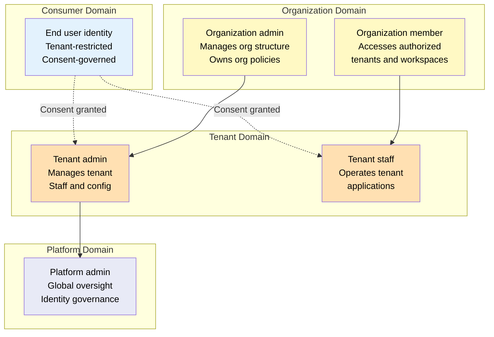

---

## 7. Universal Identity Model

### 7.1 Identity Model

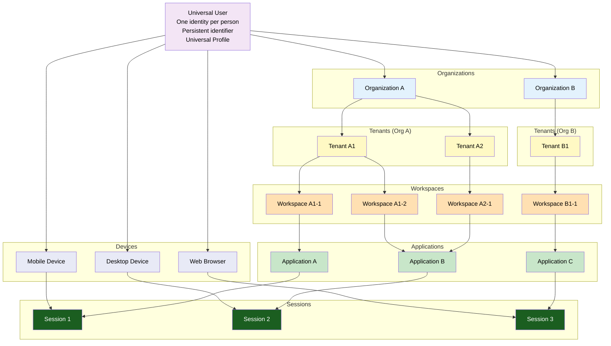

### 7.2 Identity Attributes

| Attribute | Type | Scope | User-Controlled | Required for Registration |
|-----------|------|-------|-----------------|---------------------------|
| **Global Identifier** | UUID | Platform-wide | No | Yes |
| **Email Address** | String | Platform-wide | Yes | Yes |
| **Display Name** | String | Platform-wide | Yes | Yes |
| **Authentication Factors** | Encrypted | Platform-wide | Yes (add/remove) | Yes (at least one) |
| **Universal Profile** | Object | Platform-wide | Yes | No (empty at registration) |
| **Organization Memberships** | Array | Per-Organization | No (admin-managed) | No |
| **Tenant Memberships** | Array | Per-Tenant | Consent required | No |
| **Workspace Memberships** | Array | Per-Workspace | No (admin-managed) | No |
| **Device Registrations** | Array | Platform-wide | Yes | No |
| **Consent Grants** | Array | Platform-wide | Yes | No |
| **Linked Identities** | Array | Platform-wide | Yes | No |

### 7.3 Universal Profile

| Profile Section | Attributes | Privacy Level | Consent Required to Share |
|----------------|-----------|---------------|---------------------------|
| **Basic** | Display name, Avatar URL, Preferred locale | Public (platform) | No |
| **Contact** | Email, Phone | Protected | Yes |
| **Demographic** | Date of birth, Language preferences | Private | Yes |
| **Preferences** | Theme preference, Notification settings | Protected | No |
| **Professional** | Job title, Company, Industry | Private | Yes |
| **Social** | Linked social profiles | Private | Yes |
| **Account** | Registration date, Account status | Public (platform) | No |

---

## 8. Identity Relationships

### 8.1 Relationship Model

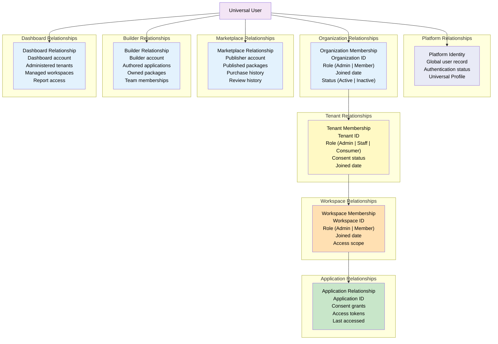

### 8.2 Relationship Cardinality

| Relationship Type | Cardinality | Direction | Creates Identity Context |
|------------------|-------------|-----------|--------------------------|
| User to Platform | 1:1 | Unidirectional | Yes (platform-level) |
| User to Organization | M:M | Bidirectional | Yes |
| User to Tenant | M:M | Bidirectional (via membership or consent) | Yes |
| User to Workspace | M:M | Bidirectional (via membership) | Yes |
| User to Application | M:M | Bidirectional (via consent) | Yes |
| User to Marketplace | M:M | Bidirectional | Yes |
| User to Builder | M:M | Bidirectional | Yes |
| User to Dashboard | M:M | Bidirectional | Yes |
| User to Device | 1:M | Unidirectional | Yes (session-scoped) |
| User to Session | 1:M | Unidirectional | Yes (per-request) |

### 8.3 Relationship Lifecycle

| Relationship | Created By | Activation | Deactivation | Deletion |
|-------------|-----------|------------|--------------|----------|
| **Platform Identity** | Identity Registration | Immediate | Account deactivation | Account deletion (restricted) |
| **Organization Membership** | Organization admin invitation | User accepts invitation | Admin removal or user leave | Organization deletion cascades |
| **Tenant Membership** | Tenant admin or organization admin | User accepts (consent required) | Admin removal or user leave | Tenant deletion cascades |
| **Workspace Membership** | Workspace admin or tenant admin | Automatic (or user accept) | Admin removal | Workspace deletion cascades |
| **Application Relationship** | Application access | User authenticates and consents | Consent revocation | Application data retention policy |
| **Marketplace Relationship** | Marketplace registration | Publisher verification | Publisher suspension | Account deletion |
| **Builder Relationship** | Builder registration | Developer verification | Account deactivation | Account deletion |

---

## 9. Identity Context Resolution

### 9.1 Context Resolution Architecture

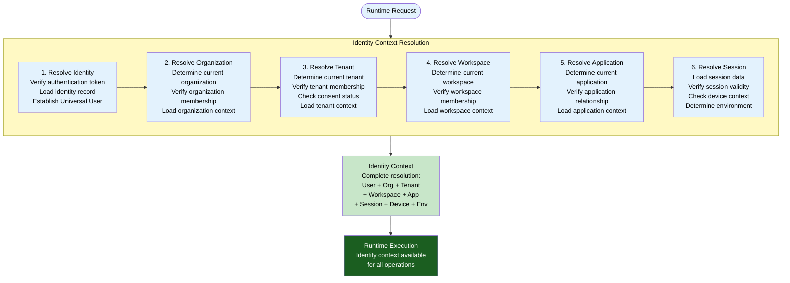

### 9.2 Context Resolution Layers

| Resolution Layer | Input | Resolution Source | Output | Cache Scope |
|-----------------|-------|-------------------|--------|-------------|
| **Identity** | Authentication token | Identity Store | Universal User, Authentication status | Session lifetime |
| **Organization** | User + Org ID (from request or session) | Identity Store, Org registry | Organization context, Membership role | Request lifetime |
| **Tenant** | User + Tenant ID (from request or session) | Identity Store, Tenant registry | Tenant context, Membership role, Consent status | Request lifetime |
| **Workspace** | User + Workspace ID (from request or session) | Identity Store, Workspace registry | Workspace context, Membership role | Request lifetime |
| **Application** | User + App ID (from request context) | Identity Store, Application registry | Application relationship, Consent grants | Request lifetime |
| **Session** | Session token | Session Store | Session data, Device info, Environment | Per-request |
| **Device** | Device identifier (from request) | Device registry | Device type, Platform, Trust status | Per-request |
| **Environment** | Environment detection | Runtime detection | Environment type, Region, Deployment version | Runtime lifetime |

### 9.3 Context Resolution Performance

| Resolution Step | Target Latency | Caching Strategy | Failure Mode |
|----------------|---------------|------------------|--------------|
| Identity resolution | < 50ms | Session cache, Identity cache | Return anonymous context |
| Organization resolution | < 20ms | Request cache, Identity context cache | Return null org context |
| Tenant resolution | < 20ms | Request cache, Identity context cache | Return null tenant context |
| Workspace resolution | < 20ms | Request cache, Identity context cache | Return null workspace context |
| Application resolution | < 20ms | Request cache, Application registry cache | Return null app context |
| Session resolution | < 10ms | Session cache (in-memory) | Return null session context |
| Full context assembly | < 150ms | All layers cached | Partial context with available layers |

---

## 10. Runtime Identity Flow

### 10.1 Identity Flow Diagram

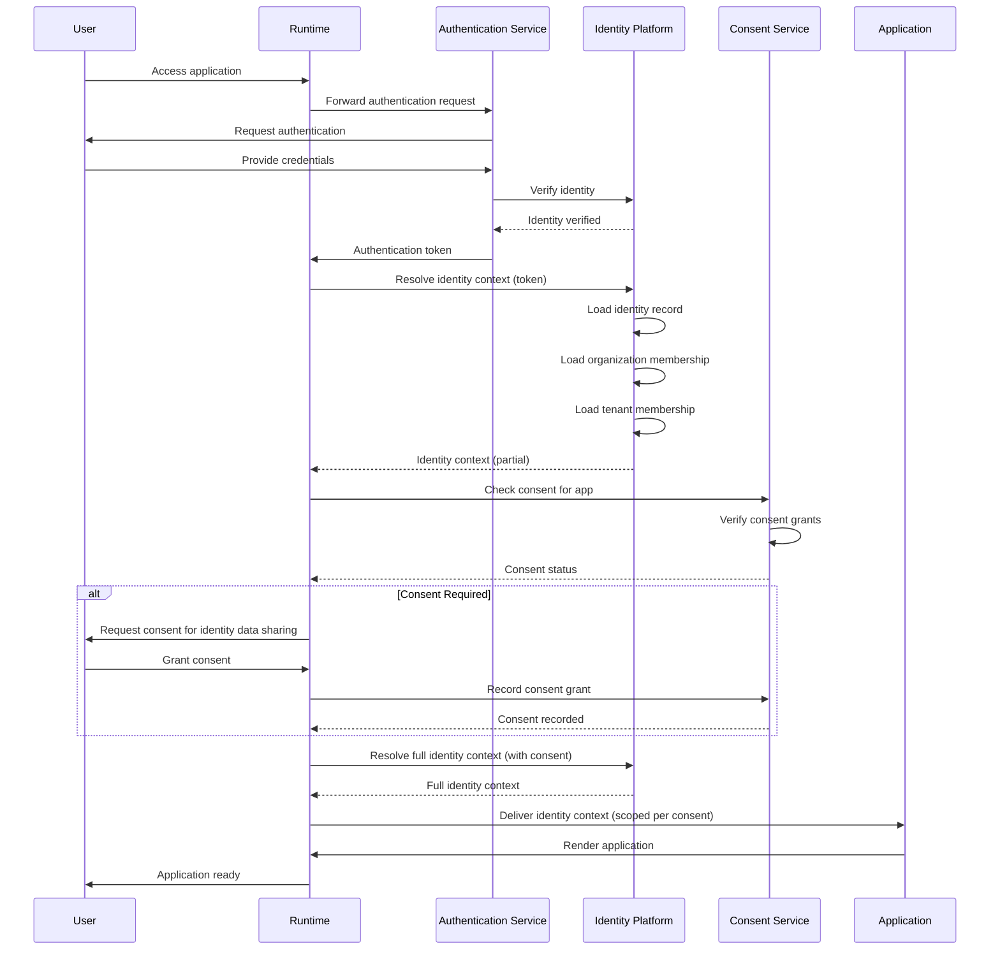

### 10.2 Identity Context Structure

The Identity Context delivered to a Runtime Application contains only the data permitted by consent and membership:

```json
{
  "identity": {
    "id": "uuid-global-identifier",
    "displayName": "User Display Name",
    "email": "user@example.com",
    "avatarUrl": "https://identity.dukadesk.com/avatar/uuid"
  },
  "session": {
    "id": "session-uuid",
    "started": "2026-07-11T10:00:00Z",
    "expires": "2026-07-11T12:00:00Z"
  },
  "organization": {
    "id": "org-uuid",
    "name": "Organization Name",
    "role": "member"
  },
  "tenant": {
    "id": "tenant-uuid",
    "name": "Tenant Name",
    "role": "consumer"
  },
  "workspace": {
    "id": "workspace-uuid",
    "name": "Workspace Name",
    "role": "member"
  },
  "application": {
    "id": "app-uuid",
    "name": "Application Name",
    "consentGrants": ["profile.basic", "profile.contact"]
  },
  "device": {
    "id": "device-uuid",
    "type": "mobile",
    "platform": "android"
  },
  "environment": {
    "type": "production",
    "region": "us-east"
  }
}
```

---

## 11. Organization–Tenant–Workspace Membership Model

### 11.1 Membership Architecture

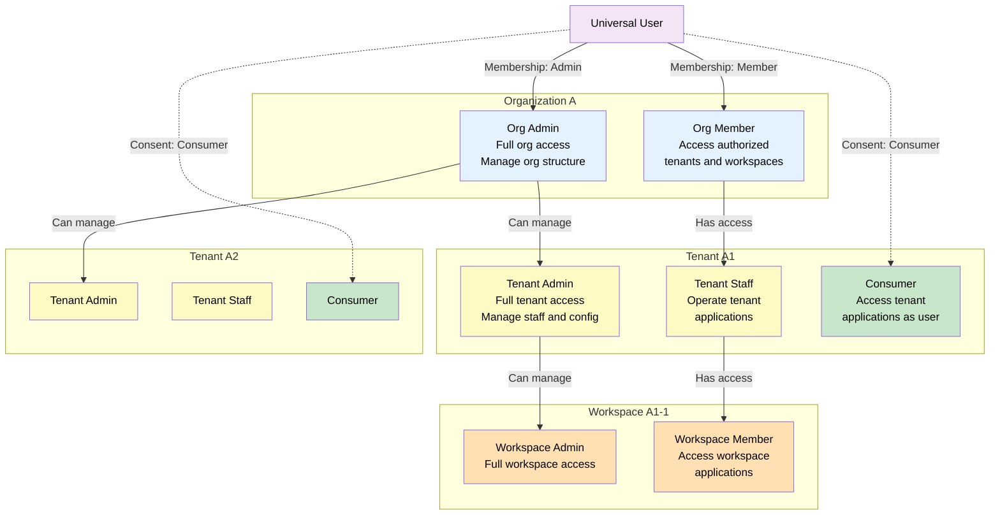

### 11.2 Membership Types

| Membership Type | Level | Role Examples | Created By | Consent Required | Inherits From |
|----------------|-------|---------------|------------|-----------------|---------------|
| **Organization Admin** | Organization | Owner, Administrator, Billing Admin | Organization creation or admin assignment | No (admin action) | N/A |
| **Organization Member** | Organization | Member, Guest | Organization admin invitation | No | N/A |
| **Tenant Admin** | Tenant | Admin, Manager | Organization admin or tenant admin | No (org role) | Organization membership |
| **Tenant Staff** | Tenant | Staff, Operator | Tenant admin | No (employment) | Organization or tenant membership |
| **Tenant Consumer** | Tenant | Customer, End User | User registration or invitation | Yes | N/A |
| **Workspace Admin** | Workspace | Admin, Lead | Tenant admin or workspace admin | No | Tenant membership |
| **Workspace Member** | Workspace | Member, Contributor | Workspace admin | No | Tenant membership |

### 11.3 Membership Resolution

When resolving a user's access to a tenant application, the Identity Platform evaluates:

1. **Is the user authenticated?** — Identity resolved at platform level
2. **Does the user have tenant membership?** — Staff or consumer role
3. **If staff** — Verify staff role assignment, check org/tenant admin inheritance
4. **If consumer** — Verify consent grant for this tenant, check consent status (granted, revoked, expired)
5. **Does the user have workspace membership?** — If applicable for the application scope
6. **Resolve identity context** — Assemble permitted identity data per consent and membership

---

## 12. Identity Lifecycle

### 12.1 Lifecycle Diagram

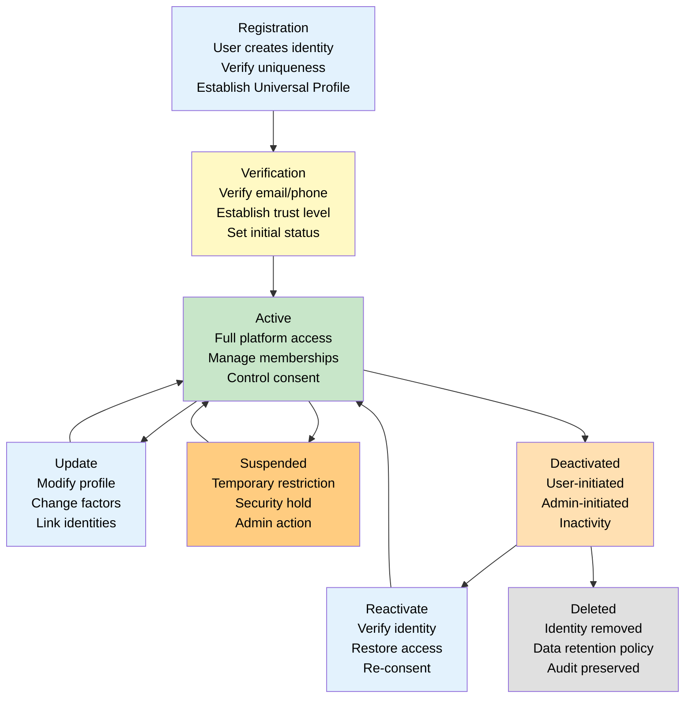

### 12.2 Lifecycle States

| State | Description | Permitted Operations | Transition Trigger | Data Retention |
|-------|-------------|---------------------|-------------------|----------------|
| **Registered** | Identity created, not yet verified | Profile setup, Factor registration | User registration | Full |
| **Verified** | Primary factor verified | Full platform access, Membership management | Email/phone verification | Full |
| **Active** | Fully operational | All identity operations | Verification complete | Full |
| **Suspended** | Temporarily restricted | Profile view only, Identity recovery | Security incident, Policy violation | Full |
| **Deactivated** | Permanently inactive | Identity recovery only | User request, Inactivity timeout, Admin action | Full (retention period) |
| **Deleted** | Identity removed from active store | None | Deactivation expiration, User deletion request | Minimal (audit trail) |

### 12.3 Lifecycle Events

| Event | Trigger | Effect | Notification |
|-------|---------|--------|-------------|
| **Identity Created** | Registration | New identity record created | Welcome email |
| **Identity Verified** | Verification flow | Trust level increased, Full access granted | Verification confirmation |
| **Identity Updated** | Profile change, Factor change | Identity record modified | Confirmation (for sensitive changes) |
| **Identity Suspended** | Security incident, Policy violation | Access blocked, Sessions terminated | Suspension notice with reason |
| **Identity Reactivated** | Security resolved, Appeal approved | Access restored | Reactivation confirmation |
| **Identity Deactivated** | User request, Inactivity | Access blocked, Retention period starts | Deactivation confirmation |
| **Identity Deleted** | Deactivation expiration, User request | Identity removed, Data purged | Deletion confirmation (if user-initiated) |
| **Identity Linked** | Federation connection | External identity linked | Linking confirmation |
| **Identity Recovered** | Recovery flow | Access restored | Recovery confirmation |

---

## 13. Identity Trust Boundaries

### 13.1 Trust Boundary Architecture

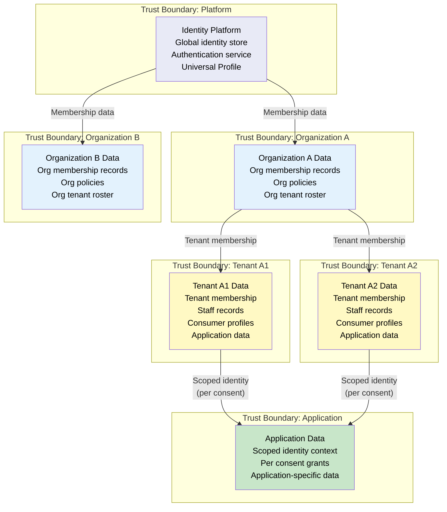

### 13.2 Trust Boundary Rules

| Boundary | Data That Crosses | Authorization Required | Consent Required | Audit Required |
|----------|------------------|----------------------|-----------------|----------------|
| **Platform to Organization** | User identity (limited), Membership status | Platform authority | No (platform to org) | Yes |
| **Organization to Tenant** | User membership, Role assignment | Org admin authorization | No (org to tenant) | Yes |
| **Platform to Tenant (consumer)** | User identity (limited per consent) | User consent | Yes | Yes |
| **Tenant to Application** | Scoped identity context | Consent grants | Yes (for consumer data) | Yes |
| **Tenant to Tenant** | No data crosses | N/A | N/A | N/A |
| **Organization to Organization** | No data crosses | N/A | N/A | N/A |

### 13.3 Cross-Boundary Identity Flow

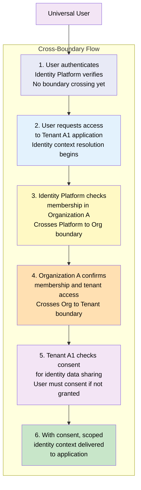

---

## 14. Responsibilities

### 14.1 Identity Platform Responsibilities

| Responsibility | Description |
|--------------|-------------|
| **Identity Registration** | Create unique identity records; verify uniqueness; establish Universal Profiles |
| **Identity Resolution** | Resolve identity context for all platform consumers; deliver scoped identity data per consent and membership |
| **Identity Verification** | Verify authentication status, identity claims, and trust boundaries for every request |
| **Identity Lifecycle** | Manage identity lifecycle from registration through deactivation and deletion |
| **Identity Linking** | Link external identity provider accounts to the Universal Identity |
| **Identity Federation** | Handle authentication federation with external identity providers |
| **Identity Recovery** | Provide secure identity recovery flows for lost access |
| **Identity Audit** | Record all identity events for security, compliance, and operational visibility |

### 14.2 Runtime Responsibilities

| Responsibility | Description |
|--------------|-------------|
| **Identity context resolution** | Resolve identity context at the start of every request; propagate context through the Runtime |
| **Consent enforcement** | Enforce consent boundaries — never request identity data beyond the scope of consent grants |
| **Identity propagation** | Propagate identity context to all subsystems — Rendering, Navigation, State, Security |
| **Session management** | Create, validate, and terminate sessions in coordination with the Identity Platform |
| **Anonymous operation** | Support anonymous (unauthenticated) operation where permitted by application policy |

### 14.3 Builder Responsibilities

| Responsibility | Description |
|--------------|-------------|
| **Identity-aware composition** | Compose applications that consume identity context without owning identity data |
| **Consent declaration** | Declare required identity data scopes in the application manifest for consent requests |
| **Membership management UI** | Provide user interfaces for managing organization, tenant, and workspace memberships |
| **Identity integration** | Integrate Builder user authentication with the Identity Platform |

### 14.4 Backend Responsibilities

| Responsibility | Description |
|--------------|-------------|
| **Identity token verification** | Verify identity tokens presented by Runtime requests |
| **Service identity management** | Manage service identities for backend-to-backend communication |
| **Identity data synchronization** | Synchronize identity data between identity platform and backend services where authorized |
| **Audit event consumption** | Consume identity audit events for security monitoring and compliance |

---

## 15. Security

### 15.1 Identity Trust Boundaries

Trust boundaries between identity domains are enforced by the Identity Platform. No identity data crosses a trust boundary without explicit authorization and verification. Trust boundaries exist at every level of the identity hierarchy — platform, organization, tenant, workspace, and application.

### 15.2 Identity Isolation

| Isolation Domain | Mechanism | Enforcement Point |
|-----------------|-----------|-------------------|
| **Organization isolation** | Organization-scoped identity queries; cross-org access blocked | Identity Store, Resolution Service |
| **Tenant isolation** | Tenant-scoped identity context; no cross-tenant identity data exposure | Identity Context Resolver |
| **Workspace isolation** | Workspace-scoped membership; no cross-workspace access | Workspace Membership Service |
| **Application isolation** | Application-scoped identity context per consent grants | Consent Service, Runtime |

### 15.3 Identity Verification

| Verification | When | Method | Failure Response |
|-------------|------|--------|-----------------|
| **Authentication verification** | Every request | Token verification, signature check | Reject request; return 401 |
| **Membership verification** | Context resolution | Membership store lookup | Return null membership |
| **Consent verification** | Context resolution | Consent store lookup | Return limited context |
| **Claim verification** | Context resolution | Claim validation against trust store | Reject claim; log audit event |

### 15.4 Identity Integrity

| Integrity Control | Description |
|------------------|-------------|
| **Immutable identity records** | Identity records are immutable after creation except for controlled updates (profile, factors) |
| **Change audit** | Every identity record change is audited — who changed what, when, and why |
| **Conflict detection** | Duplicate identity detection at registration; identity collision detection during linking |
| **Data integrity validation** | Checksum verification for identity data at rest and in transit |
| **Replication integrity** | Consistent identity data across replicas; conflict resolution for concurrent updates |

### 15.5 Identity Confidentiality

| Confidentiality Control | Description |
|------------------------|-------------|
| **Encryption at rest** | All identity data encrypted at rest with tenant-isolated encryption keys |
| **Encryption in transit** | All identity data encrypted in transit (TLS 1.3 minimum) |
| **Data minimization** | Only required identity data is stored; unnecessary attributes are not collected |
| **Access control** | Identity data access is role-scoped and audited; no broad access to identity store |
| **Token security** | Identity tokens are short-lived, scoped, and cryptographically signed |

### 15.6 Identity Availability

| Availability Control | Description |
|---------------------|-------------|
| **Redundant identity store** | Identity data replicated across regions for high availability |
| **Cached resolution** | Identity context cached at Runtime for fast resolution; cache TTL configurable |
| **Graceful degradation** | If Identity Platform is unavailable, Runtime uses cached identity context with degraded capabilities |
| **Failover** | Automatic failover to DR region for identity services (per KB-062 DR architecture) |

### 15.7 Identity Non-Repudiation

| Non-Repudiation Control | Description |
|------------------------|-------------|
| **Audit trail** | All identity events are recorded in an immutable audit trail |
| **Consent records** | Consent grants and revocations are signed and timestamped |
| **Authentication logs** | All authentication attempts (success and failure) are logged |
| **Membership change log** | All membership changes (grant, revoke, role change) are logged |
| **Identity recovery log** | All identity recovery operations are logged with verification proof |

---

## 16. Privacy

### 16.1 User Ownership

Users own their identity data. The Identity Platform acts as a custodian, not an owner. Users control:
- Which identity data is collected
- Which organizations, tenants, and applications can access their identity data
- How long identity data is retained
- When identity data is deleted

### 16.2 Data Minimization

The Identity Platform collects only the identity data necessary for platform operation:
- Required: Email, display name, authentication factors
- Optional: Profile data as defined by the Universal Profile schema
- Not collected: Sensitive personal data, government identifiers, financial account data (unless required for specific platform features with explicit consent)

### 16.3 Consent Foundation

Every identity data sharing operation across trust boundaries requires explicit user consent. Consent is:
- **Informed**: Users understand what data is being shared, with whom, and for what purpose
- **Specific**: Consent is per-organization, per-tenant, per-purpose — not blanket consent
- **Revocable**: Users can revoke consent at any time
- **Auditable**: Every consent grant and revocation is recorded
- **Time-bound**: Consent can have an expiration

### 16.4 Privacy Isolation

| Privacy Boundary | Isolation Mechanism | Data Protected |
|-----------------|---------------------|----------------|
| **Platform → Organization** | Organization-scoped identity access | Identity data beyond membership |
| **Organization → Tenant** | Tenant-scoped identity context | Identity data beyond tenant role |
| **Tenant → Tenant** | No cross-tenant identity access | All tenant identity data |
| **Tenant → Application** | Consent-scoped identity context | Identity data beyond consent grants |
| **Application → Application** | No cross-application identity access | All application identity data |

### 16.5 Cross-Tenant Privacy

A user's identity data in Tenant A is never accessible to Tenant B without explicit user consent. Cross-tenant privacy is enforced by:
1. **Tenant-scoped identity context**: Each tenant receives only the identity data scoped to that tenant
2. **Consent isolation**: Consent grants are per-tenant; consent for Tenant A does not apply to Tenant B
3. **Audit isolation**: Identity data access is audited per-tenant; cross-tenant access attempts are flagged
4. **Data store isolation**: Identity data is stored with tenant-level encryption keys

### 16.6 Universal Profile Governance

The Universal Profile is governed by:
- **User control**: Users control which profile attributes are shared with which tenants
- **Attribute-level consent**: Consent can be granted per-attribute, not per-profile
- **Profile portability**: Users can export their profile data at any time
- **Profile deletion**: Users can request deletion of specific profile attributes or the entire profile
- **Transparency**: Users can view which tenants have access to which profile attributes

---

## 17. Performance

| Operation | Target Latency | Caching Strategy | Scaling |
|-----------|---------------|------------------|---------|
| **Identity resolution (authenticated)** | < 50ms | Session cache, Identity cache | Horizontal scaling per request load |
| **Identity resolution (anonymous)** | < 20ms | N/A (no session) | Horizontal scaling per request load |
| **Membership resolution** | < 30ms | Request cache, Identity context cache | Horizontal scaling per organization |
| **Context resolution (full)** | < 150ms | Layered cache per resolution step | Horizontal scaling per scope |
| **Session creation** | < 100ms | Session store (fast write) | Horizontal scaling per session write |
| **Session validation** | < 10ms | Session cache (in-memory) | Local to Runtime instance |
| **Consent check** | < 20ms | Consent cache per user-tenant pair | Horizontal scaling per user |
| **Federation authentication** | < 2s (IdP-dependent) | Federation cache | Horizontal scaling per federation provider |

---

## 18. Observability

### 18.1 Identity Metrics

| Metric | Type | Source | Aggregation |
|--------|------|-------|-------------|
| `identity.total` | Gauge | Identity Store | Total registered identities |
| `identity.verified` | Gauge | Identity Store | Percentage verified |
| `identity.active` | Gauge | Identity Store | Currently active identities |

### 18.2 Registration Metrics

| Metric | Type | Source | Aggregation |
|--------|------|-------|-------------|
| `registration.count` | Counter | Registration Service | Rate, total |
| `registration.success` | Counter | Registration Service | Rate, total |
| `registration.failure` | Counter | Registration Service | Rate, total, by reason |
| `registration.duration` | Timer | Registration Service | Avg, p95 |

### 18.3 Membership Metrics

| Metric | Type | Source | Aggregation |
|--------|------|-------|-------------|
| `membership.org.count` | Gauge | Membership Service | Per-user distribution |
| `membership.tenant.count` | Gauge | Membership Service | Per-user distribution |
| `membership.workspace.count` | Gauge | Membership Service | Per-user distribution |
| `membership.change.count` | Counter | Membership Service | Rate, by change type |

### 18.4 Resolution Metrics

| Metric | Type | Source | Aggregation |
|--------|------|-------|-------------|
| `resolution.identity.duration` | Timer | Resolution Service | Avg, p95, p99 |
| `resolution.membership.duration` | Timer | Resolution Service | Avg, p95 |
| `resolution.context.duration` | Timer | Context Resolution | Avg, p95 |
| `resolution.cache.hit` | Counter | Resolution Service | Hit rate |
| `resolution.cache.miss` | Counter | Resolution Service | Miss rate |

### 18.5 Federation Metrics

| Metric | Type | Source | Aggregation |
|--------|------|-------|-------------|
| `federation.login.count` | Counter | Federation Service | Rate, by provider |
| `federation.login.duration` | Timer | Federation Service | Avg, p95, by provider |
| `federation.login.failure` | Counter | Federation Service | Rate, by provider, by reason |
| `federation.link.count` | Counter | Linking Service | Rate |

### 18.6 Identity Health

| Health Signal | Healthy Criteria | Degraded Criteria | Unhealthy Criteria |
|--------------|-----------------|-------------------|--------------------|
| **Identity resolution** | < 50ms p95 latency | 50-200ms p95 | > 200ms p95 |
| **Membership resolution** | < 30ms p95 latency | 30-100ms p95 | > 100ms p95 |
| **Registration success** | > 99% success rate | 95-99% | < 95% |
| **Identity store availability** | 100% available | < 100% but degraded | Unavailable |
| **Federation success** | > 95% success rate | 90-95% | < 90% |

---

## 19. Failure Scenarios

### 19.1 Duplicate Identity

| Scenario | Detection | Response | Recovery |
|----------|-----------|----------|----------|
| User registers with email that already has an identity | Registration validation | Block registration; prompt for login or recovery | User authenticates with existing identity or recovers access |
| Identity Platform creates duplicate identity (race condition) | Periodic deduplication scan | Flag as duplicate; initiate merge workflow | Automated merge or manual reconciliation |
| External IdP returns duplicate identity link | Federation linking | Block duplicate link; report conflict | User selects which identity to keep |

### 19.2 Identity Collision

| Scenario | Detection | Response | Recovery |
|----------|-----------|----------|----------|
| Two users claim the same identity attributes (email collision) | Registration validation | Block registration for second user | Verify ownership through verification flow |
| IdP collision — two different provider accounts claim same identity | Linking validation | Block linking; report conflict | User verifies ownership of both accounts |

### 19.3 Identity Orphaning

| Scenario | Detection | Response | Recovery |
|----------|-----------|----------|----------|
| Identity exists but all memberships are removed | Lifecycle check, Periodic audit | Flag as orphaned; notify user | User can request new membership or delete identity |
| Identity deactivated but associated data remains | Deactivation audit | Preserve data per retention policy; mark identity as deactivated | User can reactivate or request deletion |
| Federation provider removed (Google, Apple account deleted) | Federation check | Flag identity for recovery flow | User sets new authentication factor |

### 19.4 Membership Corruption

| Scenario | Detection | Response | Recovery |
|----------|-----------|----------|----------|
| User shows incorrect membership in context resolution | Context verification | Log mismatch; return conservative (limited) context | Repair membership record; re-resolve context |
| Membership refers to deleted organization/tenant/workspace | Membership validation | Flag membership as invalid; remove or suspend | Admin reconciles membership or updates hierarchy |

### 19.5 Invalid Identity Context

| Scenario | Detection | Response | Recovery |
|----------|-----------|----------|----------|
| Identity context missing required scope | Context validation | Return error with scope requirements | Request re-authentication with required scope |
| Identity context references expired session | Session validation | Return error; require re-authentication | User re-authenticates |
| Identity context has conflicting organization/tenant/workspace | Context validation | Return error; log inconsistency | Resolve context through Identity Platform |

### 19.6 Cross-Tenant Identity Leak

| Scenario | Detection | Response | Recovery |
|----------|-----------|----------|----------|
| Tenant A application receives identity data scoped for Tenant B | Consent enforcement | Block context delivery; log security event | Investigate data leak; revoke access; notify affected users |
| Runtime inadvertently requests context for wrong tenant | Context resolution | Return limited or null context; log error | Fix tenant resolution in Runtime |

### 19.7 Identity Recovery Failure

| Scenario | Detection | Response | Recovery |
|----------|-----------|----------|----------|
| User cannot complete recovery flow (lost factors) | Recovery flow monitoring | Escalate to manual recovery | Identity verification through alternative channels |
| Recovery code expired before use | Recovery validation | Prompt for new recovery request | User initiates new recovery flow |
| Recovery attempt rate limited | Rate limiting | Block recovery; notify user of cooldown | User waits for cooldown or contacts support |

---

## 20. Anti-patterns

### 20.1 Tenant-Owned Identities

**Anti-pattern:** Each tenant creates and manages its own user accounts, separate from the platform identity.

**Why it is harmful:** Violates the One Identity Per Person principle. Users must create separate accounts for each tenant, leading to account fatigue, password reuse, fragmented profiles, and inability to move between tenants.

**Correct approach:** The Identity Platform owns all identities. Tenants consume identity through delegated access with user consent. Users authenticate once and access any tenant they have membership or consent for.

### 20.2 Duplicate Accounts

**Anti-pattern:** Allowing a user to create multiple accounts (e.g., one for each organization, tenant, or application).

**Why it is harmful:** Fragments the user's identity across the platform. Makes it impossible to provide a unified experience, track user consent comprehensively, or enforce privacy consistently.

**Correct approach:** Exactly one identity per person. Different organizations, tenants, and applications are relationships on the same identity, not separate identities.

### 20.3 Per-App Registration

**Anti-pattern:** Each application has its own registration flow that creates a local user account.

**Why it is harmful:** Creates fragmented user data, forces users to re-register for every application, bypasses the Identity Platform's consent and privacy controls, and makes cross-application identity impossible.

**Correct approach:** All registration flows through the Identity Platform. Applications receive identity context through consent, not through user registration.

### 20.4 Identity Embedded in Applications

**Anti-pattern:** Storing identity data (user records, profiles, authentication state) within application databases.

**Why it is harmful:** Couples identity to application lifecycle, creates data silos, bypasses platform security controls, makes identity portability impossible, and violates tenant isolation.

**Correct approach:** Identity data lives in the Identity Platform. Applications store application data with identity references (IDs), not identity data.

### 20.5 Shared Tenant Databases for Identity

**Anti-pattern:** Using a shared database across tenants for identity data with only application-level tenant filtering.

**Why it is harmful:** Risk of cross-tenant identity data exposure, no tenant-level encryption isolation, complex data cleanup on tenant deletion.

**Correct approach:** Identity data is tenant-isolated at the storage layer with tenant-level encryption keys. Cross-tenant identity access is blocked by the Identity Platform, not by application code.

### 20.6 Identity Without Consent

**Anti-pattern:** Sharing identity data across trust boundaries without explicit user consent.

**Why it is harmful:** Violates user privacy, creates regulatory liability (GDPR, CCPA), erodes user trust, and bypasses the consent foundation of the Identity Platform.

**Correct approach:** Every identity data sharing operation across trust boundaries requires explicit, informed, revocable consent.

### 20.7 Hardcoded Identity Assumptions

**Anti-pattern:** Hardcoding identity assumptions into application code (e.g., assuming a specific identity provider, assuming all users are in one tenant, assuming identity attributes are always available).

**Why it is harmful:** Breaks with different identity providers, fails for users in different contexts, crashes when identity attributes are not available (per consent).

**Correct approach:** Applications consume identity context dynamically. Identity attributes may vary per consent grant. Applications handle missing attributes gracefully.

---

## 21. Future Evolution

### 21.1 Decentralized Identity (DID)

Future identity architecture may support Decentralized Identifiers (DIDs) where users control their identity outside of any single platform. The Identity Platform would verify DIDs, resolve DID documents, and map DIDs to Universal Identities.

### 21.2 Verifiable Credentials

Future identity may include Verifiable Credentials — cryptographically signed claims about a user that are issued by trusted authorities and verified by the Identity Platform. Credentials could include verified email, age verification, professional certifications, and membership proofs.

### 21.3 Passkeys

Future authentication may be based on passkeys — FIDO2/WebAuthn credentials that replace passwords with device-bound cryptographic keys. Passkeys provide phishing-resistant authentication and cross-device synchronization.

### 21.4 Identity Wallets

Future users may manage their identity through identity wallets — client-side applications that store identity data, credentials, and consent grants. The Identity Platform interacts with wallets through standardized protocols.

### 21.5 Cross-Platform Identity Federation

Future identity may span beyond DUKADESK through cross-platform federation with other identity platforms. Users would authenticate with their platform identity at partner services and vice versa.

### 21.6 Enterprise Identity Federation

Future enterprise deployments may require deep integration with enterprise identity providers (Azure AD, Okta, LDAP) for single sign-on, automated provisioning, group-based access control, and compliance reporting.

### 21.7 AI Agent Identities

Future AI agents may require their own identities within the platform — identities that represent automated systems acting on behalf of a user or organization. AI agent identities would have specific authentication, authorization, and audit characteristics.

### 21.8 Machine-to-Machine Identity

Future platform evolution may include comprehensive machine-to-machine identity management with service-to-service authentication, API token management, workload identity federation, and automated credential rotation.

---

## 22. Cross-References

| Reference | Document | Relationship |
|-----------|----------|-------------|
| **KB-043** | Workspace & Tenant Model | Defines the tenant and workspace hierarchy that identity relationships map to |
| **KB-051** | Runtime Architecture Overview | Runtime identity context resolution for every request |
| **KB-057** | Runtime Security Architecture | Security controls for identity verification, trust boundaries, and isolation |
| **KB-060** | Runtime Lifecycle Management | Identity context participation in Runtime lifecycle states |
| **KB-062** | Runtime Deployment & Environment | Identity Platform deployment across environments |
| **KB-064** | Authentication Architecture (planned) | Authentication flows, providers, and token management |
| **KB-065** | Authorization & RBAC (planned) | Authorization policies built on identity foundation |
| **KB-066** | Universal Consumer Identity (planned) | Consumer-specific identity relationships and consent |
| **KB-067** | Consent & Privacy Architecture | Consent architecture for identity data sharing |
| **KB-068** | Session Management Architecture | Session lifecycle tied to identity authentication |

---

## 23. Mermaid Diagram Index

| Diagram | Section | Description |
|---------|---------|-------------|
| Identity Platform Architecture | 4.1 | Platform architecture with Authentication, Universal Profile, Consent, and downstream consumers |
| Platform Service Model | 4.2 | Identity Platform internal services and storage |
| Identity Platform Ecosystem | 4.3 | Identity Platform with platform consumers and external identity providers |
| Identity Hierarchy | 5.1 | Platform to Organization to Tenant to Workspace to Application to Session hierarchy |
| Universal Identity Model | 7.1 | Single user with multiple organizations, tenants, workspaces, applications, devices, sessions |
| Identity Relationship Graph | 8.1 | Complete relationship model from Universal User to all platform entities |
| Identity Context Resolution | 9.1 | Step-by-step identity context resolution from request to runtime execution |
| Runtime Identity Flow | 10.1 | Sequence diagram of user authentication through context resolution to application delivery |
| Organization-Tenant-Workspace Membership Model | 11.1 | Membership hierarchy with roles, inheritance, and consent boundaries |
| Identity Lifecycle | 12.1 | Complete identity lifecycle from registration through deletion |
| Identity Trust Boundaries | 13.1 | Trust boundary architecture across platform, organizations, tenants, applications |
| Cross-Boundary Identity Flow | 13.3 | Step-by-step cross-boundary identity data flow with authorization and consent checks |
