# Authentication Architecture

**KB-064 — Authentication Architecture Specification**

| Metadata | |
|----------|---|
| **KB ID** | KB-064 |
| **Title** | Authentication Architecture |
| **Version** | 0.1.0 |
| **Status** | Draft |
| **Owner** | Architecture Team |
| **Suite** | Identity & Access Architecture |
| **Dependencies** | KB-063 Identity Platform Architecture, KB-057 Runtime Security Architecture |
| **Related Documents** | KB-051 Runtime Architecture Overview, KB-060 Runtime Lifecycle Management, KB-062 Runtime Deployment & Environment, KB-065 Authorization & RBAC Architecture, KB-066 Universal Consumer Identity, KB-067 Consent & Privacy Architecture, KB-068 Session Management Architecture, KB-070 API Security & Token Architecture |
| **Review Status** | Pending |
| **Last Updated** | 2026-07-11 |

---

### Revision History

| Version | Date | Author | Change |
|---------|------|--------|--------|
| 0.1.0 | 2026-07-11 | AI Architecture Agent | Initial draft |

---

## 1. Executive Summary

### 1.1 Purpose

This document defines the Authentication Architecture for the DUKADESK Platform. Authentication verifies who an identity is. It does not determine what an identity can access (Authorization) or what information may be shared (Consent).

The Authentication Platform must provide a single, secure, extensible authentication system that serves every DUKADESK product — Mobile Runtime, Web Runtime, Desktop Runtime, Builder Studio, Business Dashboard, Tenant Dashboard, Marketplace, APIs, SDKs, and future Runtime Hosts — while remaining independent of applications, tenants, organizations, and runtimes.

Authentication establishes trust with the Identity Platform and produces an authenticated identity context that downstream services consume. It is the first gate in the Identity Platform pipeline: Authentication before Authorization, Authentication before Consent.

### 1.2 Scope

**In scope:**

- Architectural principles: Authentication Before Authorization, Authentication Before Consent, One Authentication Platform, Passwordless Ready, Provider Agnostic, Multi-Factor Ready, Zero Trust, Secure by Default, Continuous Authentication, Risk-Aware Authentication, Runtime Independent
- Canonical definitions: Authentication, Authenticator, Authentication Provider, Identity Verification, Authentication Session, Login, Logout, Re-authentication, Authentication Context, Authentication Assurance Level, Authentication Challenge, Credential, Trust Assertion
- Authentication Architecture: Identity Resolution, Credential Verification, Risk Evaluation, MFA Challenge, Device Validation, Authentication Policies, Trust Establishment
- Authentication Lifecycle: Request through Runtime Access
- Authentication Context: Identity, Organization, Tenant Membership, Session, Device, Runtime, Assurance Level, Active Policies
- Supported Authentication Models: Username & Password, Email Link (Magic Link), Passkeys (WebAuthn/FIDO2), OTP, TOTP, SMS, Email Verification, Social Login, Enterprise Identity Providers, Device-Based Authentication, Anonymous Guest Identity
- Authentication Assurance Levels: Low, Standard, High, Administrative, Sensitive Operation
- Authentication Policies: Password, Passwordless, MFA, Device Trust, Geo-Based, Risk-Based, Session Age, Inactivity, Re-authentication
- Device Trust Architecture: Trusted Devices, Unknown Devices, Device Registration, Device Revocation, Device Fingerprinting, Device Risk
- Multi-Factor Authentication: Enrollment, Verification, Recovery, Backup Methods, Policy Enforcement
- Responsibilities: Runtime, Identity Platform, Backend, Builder
- Security: Credential Protection, Replay Protection, Brute Force Protection, Credential Stuffing Protection, Session Hijacking Protection, Device Validation, Phishing Resistance, Secure Logout
- Privacy: Minimal Identity Exposure, Authentication Data Separation, Audit, Consent Independence, Cross-Tenant Privacy
- Performance: Authentication Latency, Session Establishment, Provider Failover, Risk Evaluation, Device Validation
- Observability: Login Metrics, Failure Metrics, MFA Metrics, Risk Metrics, Device Metrics, Authentication Health
- Failure scenarios, anti-patterns, and future evolution

**Out of scope:**

- Implementation details of specific authentication protocols, algorithms, or identity providers
- Application-level authentication flows (handled by individual application specs)
- Authorization policy enforcement (handled by KB-065)
- Consent management (handled by KB-067)
- Session token format and management (handled by KB-068)

---

## 2. Architectural Principles

### 2.1 Authentication Before Authorization

Identity verification precedes access decisions. No authorization check is performed until authentication is complete and trust is established. Authorization operates on an authenticated identity, never on an anonymous or unverified one.

### 2.2 Authentication Before Consent

Identity verification precedes consent decisions. Consent is granted by an authenticated identity, not by an anonymous entity. Consent records are bound to the authenticated identity at the time of grant.

### 2.3 One Authentication Platform

A single Authentication Platform serves every DUKADESK product. There are no per-application, per-tenant, or per-Runtime authentication systems. The same authentication flows, policies, and assurance levels apply across the entire ecosystem.

### 2.4 Passwordless Ready

The Authentication Platform is designed for a passwordless future. Password-based authentication is a supported mode, but the architecture prioritizes passwordless methods — passkeys, magic links, biometrics — as primary authentication mechanisms.

### 2.5 Provider Agnostic

The Authentication Platform is agnostic to specific authentication providers. Social login providers, enterprise identity providers, and platform-native authentication are pluggable through a defined provider interface. No provider is hardcoded into the authentication flow.

### 2.6 Multi-Factor Ready

The Authentication Platform supports multi-factor authentication as a first-class capability. MFA is not an add-on — it is embedded in the authentication architecture, policy engine, and assurance level model. MFA methods are pluggable.

### 2.7 Zero Trust

Every authentication request is treated as untrusted until verified. There is no implicit trust based on network location, device history, or prior authentication. Verification occurs on every request, not just at session establishment.

### 2.8 Secure by Default

Authentication defaults to the most secure available mode. Less secure methods require explicit policy override. Passkeys take precedence over passwords. MFA is enabled by default for high-assurance operations.

### 2.9 Continuous Authentication

Authentication is not a one-time event at login. Assurance levels are re-evaluated throughout a session. Transitions to higher-risk operations may trigger step-up authentication. Device trust and risk signals are continuously monitored.

### 2.10 Risk-Aware Authentication

Authentication decisions incorporate risk signals — device trust, location, behavioral patterns, and threat intelligence. Low-risk scenarios may reduce authentication friction. High-risk scenarios trigger additional verification.

### 2.11 Runtime Independent

The Authentication Architecture is independent of any specific Runtime implementation. Mobile, Web, Desktop, Preview, and future Runtimes all use the same authentication flows, protocols, and policies. Platform-specific authentication concerns are abstracted through the authentication client layer.

---

## 3. Canonical Definitions

### 3.1 Authentication

The process of verifying the identity of an Identity Subject (KB-063). Authentication establishes that the entity presenting an identity claim is the legitimate owner of that identity. Authentication produces a Trust Assertion that other platform services consume.

### 3.2 Authenticator

A mechanism or device used to prove identity during authentication. Authenticators include passwords, passkeys, TOTP tokens, SMS codes, email links, biometric sensors, and hardware security keys. Authenticators have defined assurance levels.

### 3.3 Authentication Provider

A service that performs identity verification on behalf of the Authentication Platform. Authentication Providers include platform-native authentication, social login providers (Google, Apple), and enterprise identity providers (Azure AD, Okta). Providers are pluggable through a defined provider interface.

### 3.4 Identity Verification

The act of confirming that an Identity Subject is who they claim to be. Identity Verification may involve multiple factors, multiple providers, and multiple challenge-response rounds. Verification produces a verified identity claim.

### 3.5 Authentication Session

A temporary, scoped trust relationship established between an authenticated identity and the Authentication Platform. An Authentication Session has a defined lifetime, assurance level, set of active authenticators, and risk assessment.

### 3.6 Login

The authentication operation that transitions an entity from unauthenticated to authenticated state. Login includes identity resolution, credential verification, optional MFA, risk evaluation, and session establishment.

### 3.7 Logout

The authentication operation that terminates an Authentication Session. Logout invalidates session tokens, clears authentication context, and triggers session termination notifications to all consuming services.

### 3.8 Re-authentication

A subsequent authentication operation performed during an active session. Re-authentication may be triggered by session expiry, risk score change, sensitive operation request, or policy requirement. Re-authentication may use different authenticators than the original login.

### 3.9 Authentication Context

The complete set of authentication-related information associated with an authenticated request. Authentication Context includes the identity, authentication method, assurance level, session identifier, device information, risk score, and active policies.

### 3.10 Authentication Assurance Level (AAL)

A classification of the confidence level in an authentication event. AALs range from Low (minimal verification) to Sensitive Operation (maximum verification, multiple factors, hardware-backed). AALs determine which operations an authenticated identity may perform.

### 3.11 Authentication Challenge

A request from the Authentication Platform to the Identity Subject for proof of identity. Challenges include password prompts, passkey gestures, TOTP code entries, and biometric scans. Challenges are generated based on the required assurance level.

### 3.12 Credential

A secret or biometric factor used by an Identity Subject to prove identity. Credentials include passwords, cryptographic key pairs, TOTP seeds, and biometric templates. Credentials are stored by the Authentication Platform or by authenticator devices.

### 3.13 Trust Assertion

A cryptographically signed statement produced by the Authentication Platform after successful authentication. The Trust Assertion contains the identity, assurance level, authentication timestamp, and scope. Downstream services verify the Trust Assertion to establish identity context.

---

## 4. Authentication Architecture

### 4.1 Architecture Diagram

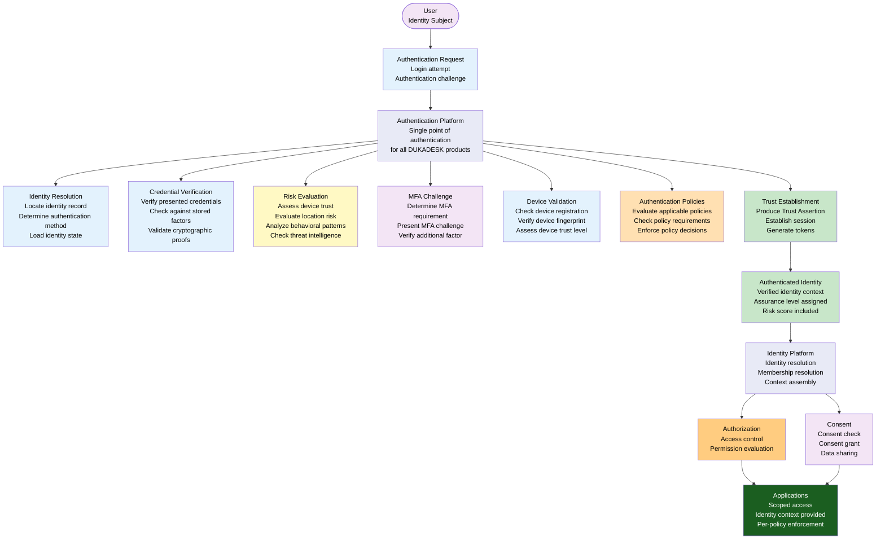

### 4.2 Authentication Service Dependencies

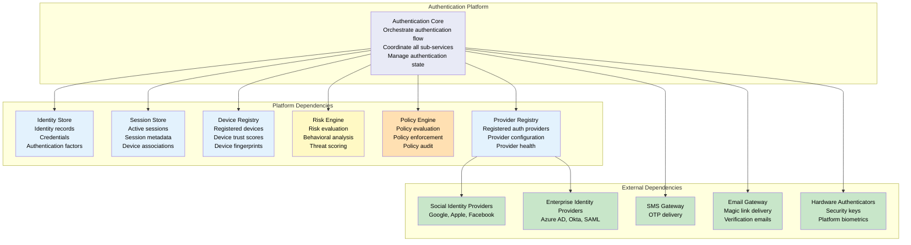

---

## 5. Authentication Lifecycle

### 5.1 Lifecycle Diagram

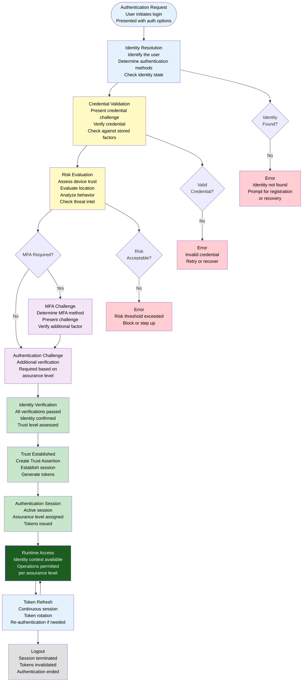

### 5.2 Lifecycle States

| State | Description | Allowed Transitions | Duration |
|-------|-------------|---------------------|----------|
| **Initiated** | Authentication request received, identity not yet resolved | Identity Resolution | Per-request |
| **Resolving Identity** | Identity lookup in progress | Credential Validation, Error | < 100ms |
| **Validating Credential** | Credential verification in progress | Risk Evaluation, Error | < 1s (varies by method) |
| **Evaluating Risk** | Risk assessment in progress | MFA Challenge, Trust Established, Error | < 500ms |
| **MFA Challenge** | Additional factor verification in progress | Identity Verification, Error | < 30s (user interaction) |
| **Verifying Identity** | All checks complete, final verification | Trust Established, Error | < 100ms |
| **Trust Established** | Authentication successful, session created | Runtime Access | Per-request |
| **Active Session** | Session active, tokens valid | Token Refresh, Logout, Re-authentication | Per-session TTL |
| **Re-authenticating** | Step-up authentication in progress | Trust Established, Error | Per-request |
| **Token Refresh** | Token rotation in progress | Active Session | Per-refresh interval |
| **Logged Out** | Session terminated | Initiated (new login) | Until next login |

---

## 6. Authentication Context

### 6.1 Context Model

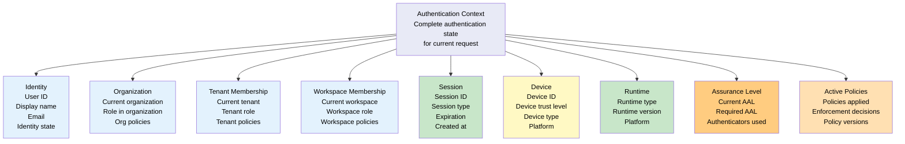

### 6.2 Context Fields

| Field | Source | Example | Available After |
|-------|--------|---------|-----------------|
| `identity.id` | Identity Platform | `usr_abc123` | Identity Resolution |
| `identity.displayName` | Identity Platform | `Jane Smith` | Identity Resolution |
| `identity.assuranceLevel` | Authentication Platform | `aal2` | Trust Established |
| `organization.id` | Identity Platform | `org_xyz789` | Context Resolution |
| `organization.role` | Membership Service | `admin` | Context Resolution |
| `tenant.id` | Identity Platform | `ten_mk001` | Context Resolution |
| `tenant.role` | Membership Service | `consumer` | Context Resolution |
| `workspace.id` | Identity Platform | `ws_abc123` | Context Resolution |
| `session.id` | Session Store | `sess_456def` | Trust Established |
| `session.expiresAt` | Session Store | `2026-07-11T12:00:00Z` | Trust Established |
| `session.lastAuthenticatedAt` | Authentication Platform | `2026-07-11T10:00:00Z` | Trust Established |
| `device.id` | Device Registry | `dev_789ghi` | Device Validation |
| `device.trustLevel` | Device Registry | `trusted` | Device Validation |
| `device.type` | Device Registry | `mobile` | Device Validation |
| `runtime.type` | Runtime Detection | `mobile` | Request |
| `runtime.version` | Runtime Detection | `2.1.0` | Request |
| `policies.active` | Policy Engine | `[mfa_required, device_trust]` | Policy Evaluation |
| `risk.score` | Risk Engine | `15` (0-100) | Risk Evaluation |

---

## 7. Supported Authentication Models

### 7.1 Model Overview

| Authentication Model | Primary Factor | MFA Compatible | Assurance Level | Phishing Resistant | Passwordless |
|---------------------|---------------|----------------|-----------------|-------------------|--------------|
| **Username & Password** | Knowledge | Yes | AAL1-AAL2 | No | No |
| **Email Link (Magic Link)** | Possession (email) | Yes | AAL1-AAL2 | Partial (email-based) | Yes |
| **Passkeys (WebAuthn/FIDO2)** | Possession (device) + Inherence (biometric) | Yes | AAL2-AAL3 | Yes | Yes |
| **OTP (One-Time Password)** | Possession (generator) | As second factor | AAL2 | No | No |
| **TOTP (Time-Based OTP)** | Possession (shared secret) | As second factor | AAL2 | No | No |
| **SMS Code** | Possession (phone) | As second factor | AAL1 | No | No |
| **Email Verification** | Possession (email) | As second factor | AAL1 | Partial | No |
| **Social Login** | Varies by provider | Yes | AAL1-AAL2 (provider-dependent) | Varies | Yes |
| **Enterprise Identity Provider** | Varies by provider | Yes | AAL2-AAL3 (provider-dependent) | Varies | Yes |
| **Device-Based Authentication** | Possession (device) + Inherence (biometric) | Yes | AAL2-AAL3 | Yes | Yes |
| **Anonymous Guest Identity** | None | No | AAL0 | N/A | N/A |

### 7.2 Authentication Flow by Model

```mermaid
flowchart TB
    subgraph "Password Based"
        P1["User enters\nemail/password"]
        P2["Platform verifies\nagainst stored hash"]
        P3["Session created\nif valid"]
        P1 --> P2 --> P3
    end

    subgraph "Passkey Based"
        K1["User triggers\npasskey auth"]
        K2["Platform sends\nchallenge to device"]
        K3["Device signs\nchallenge with key"]
        K4["Platform verifies\nsignature"]
        K1 --> K2 --> K3 --> K4
    end

    subgraph "Magic Link"
        M1["User enters email\nPlatform sends link"]
        M2["User clicks link\nwith token"]
        M3["Platform verifies\ntoken validity"]
        M4["Session created\non verification"]
        M1 --> M2 --> M3 --> M4
    end

    subgraph "Social Login"
        S1["User selects\nsocial provider"]
        S2["Redirect to\nprovider auth"]
        S3["Provider returns\nidentity claim"]
        S4["Platform verifies\nand links identity"]
        S1 --> S2 --> S3 --> S4
    end

    style P1 fill:#e3f2fd,color:#000
    style P2 fill:#e3f2fd,color:#000
    style P3 fill:#c8e6c9,color:#000
    style K1 fill:#f3e5f5,color:#000
    style K2 fill:#f3e5f5,color:#000
    style K3 fill:#f3e5f5,color:#000
    style K4 fill:#c8e6c9,color:#000
    style M1 fill:#fff9c4,color:#000
    style M2 fill:#fff9c4,color:#000
    style M3 fill:#fff9c4,color:#000
    style M4 fill:#c8e6c9,color:#000
    style S1 fill:#ffe0b2,color:#000
    style S2 fill:#ffe0b2,color:#000
    style S3 fill:#ffe0b2,color:#000
    style S4 fill:#c8e6c9,color:#000
```

### 7.3 Model Selection

The Authentication Platform selects the authentication model based on:

1. **Available authenticators**: What authenticators has the user registered
2. **Required assurance level**: What AAL is needed for the requested operation
3. **Authentication policies**: What policies apply to the user, device, organization, and tenant
4. **Device capabilities**: What authentication mechanisms the device supports (biometrics, security keys, platform passkeys)
5. **Risk assessment**: The current risk score may restrict available models (high risk may require higher AAL)
6. **User preference**: User's configured preferred authentication method

---

## 8. Authentication Assurance Levels

### 8.1 Assurance Level Model

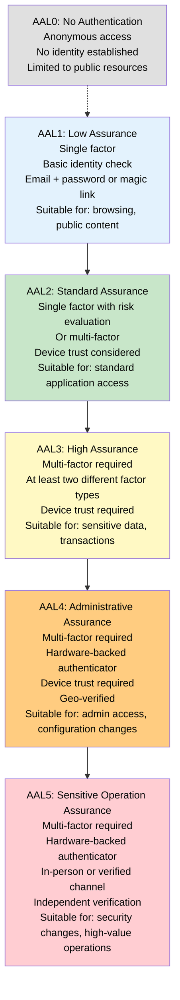

### 8.2 Assurance Level Requirements

| Level | Description | Minimum Authenticators | Factor Types | MFA Required | Device Trust | Examples |
|-------|-------------|----------------------|--------------|--------------|--------------|----------|
| **AAL0** | No Authentication | None | None | No | No | Public content, landing pages |
| **AAL1** | Low Assurance | 1 single-factor authenticator | Knowledge or Possession | No | No | Browsing marketplace, viewing public profiles |
| **AAL2** | Standard Assurance | 1 multi-factor authenticator or 2 single-factor | Any combination | Recommended | Recommended | Standard application access, tenant browsing |
| **AAL3** | High Assurance | 2 authenticators from 2 different factor types | Knowledge + Possession, or Possession + Inherence | Yes | Required | Accessing personal data, making purchases |
| **AAL4** | Administrative Assurance | 2 authenticators from 2 different factor types, hardware-backed | Hardware + Knowledge/Inherence | Yes | Required, verified | Admin dashboard, tenant configuration |
| **AAL5** | Sensitive Operation | 2+ authenticators, hardware-backed, independent verification | Multi-factor + verified channel | Yes | Required, verified | Security changes, identity recovery, high-value transfers |

### 8.3 Assurance Level Elevation

Users start at their currently authenticated AAL. Operations requiring a higher AAL trigger step-up authentication:

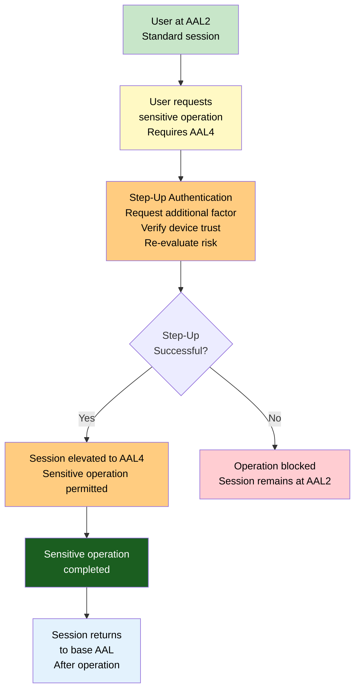

### 8.4 AAL Mapping to Operations

| Operation Category | Required AAL | Example Operations |
|-------------------|-------------|-------------------|
| **Public Access** | AAL0 | Browse marketplace, view public documentation |
| **Basic Authenticated Access** | AAL1 | View profile, browse applications, marketplace browsing |
| **Standard Application Access** | AAL2 | Use tenant applications, access workspace resources |
| **Sensitive Data Access** | AAL3 | View personal data, make purchases, modify preferences |
| **Administrative Access** | AAL4 | Manage tenant configuration, modify policies, access admin dashboard |
| **Security-Critical Operations** | AAL5 | Change authentication factors, recover identity, modify security policies, transfer ownership |

---

## 9. Authentication Policies

### 9.1 Policy Architecture

```mermaid
flowchart TB
    subgraph "Policy Sources"
        PLATFORM_POL["Platform Defaults\nGlobal auth policies\nBaseline requirements"]
        ORG_POL["Organization Policies\nOrg-specific requirements\nCompliance rules"]
        TENANT_POL["Tenant Policies\nTenant-specific auth\nrequirements"]
        APP_POL["Application Policies\nApplication-specific\nauth requirements"]
        USER_POL["User Policies\nUser-configured\npreferences"]
    end

    subgraph "Policy Evaluation"
        POLICY_ENGINE2["Policy Engine\nEvaluate all applicable policies\nResolve conflicts\nDetermine effective policy"]
    end

    subgraph "Policy Types"
        PASSWORD_POL["Password Policy\nComplexity requirements\nExpiration rules\nHistory rules"]
        PASSLESS_POL["Passwordless Policy\nAllowed passkey types\nRequired platform support\nBackup requirements"]
        MFA_POL["MFA Policy\nWhen MFA is required\nAllowed MFA methods\nRecovery methods"]
        DEVICE_POL["Device Trust Policy\nRequired trust level\nDevice registration rules\nUnknown device handling"]
        GEO_POL["Geo-Based Policy\nAllowed regions\nBlocked regions\nGeo-verification rules"]
        RISK_POL["Risk-Based Policy\nRisk thresholds per AAL\nStep-up triggers\nBlocking thresholds"]
        SESSION_POL["Session Age Policy\nMax session lifetime\nToken rotation interval\nAbsolute expiry"]
        INACTIVITY_POL["Inactivity Policy\nInactivity timeout\nRe-authentication trigger\nGrace period"]
        REAUTH_POL["Re-authentication Policy\nWhen re-auth is required\nAllowed re-auth methods\nRe-auth TTL"]
    end

    PLATFORM_POL --> POLICY_ENGINE2
    ORG_POL --> POLICY_ENGINE2
    TENANT_POL --> POLICY_ENGINE2
    APP_POL --> POLICY_ENGINE2
    USER_POL --> POLICY_ENGINE2

    POLICY_ENGINE2 --> PASSWORD_POL
    POLICY_ENGINE2 --> PASSLESS_POL
    POLICY_ENGINE2 --> MFA_POL
    POLICY_ENGINE2 --> DEVICE_POL
    POLICY_ENGINE2 --> GEO_POL
    POLICY_ENGINE2 --> RISK_POL
    POLICY_ENGINE2 --> SESSION_POL
    POLICY_ENGINE2 --> INACTIVITY_POL
    POLICY_ENGINE2 --> REAUTH_POL

    style PLATFORM_POL fill:#e8eaf6,color:#000
    style ORG_POL fill:#e3f2fd,color:#000
    style TENANT_POL fill:#fff9c4,color:#000
    style APP_POL fill:#c8e6c9,color:#000
    style USER_POL fill:#f3e5f5,color:#000
    style POLICY_ENGINE2 fill:#ffe0b2,color:#000
    style PASSWORD_POL fill:#e3f2fd,color:#000
    style PASSLESS_POL fill:#e3f2fd,color:#000
    style MFA_POL fill:#f3e5f5,color:#000
    style DEVICE_POL fill:#e3f2fd,color:#000
    style GEO_POL fill:#fff9c4,color:#000
    style RISK_POL fill:#fff9c4,color:#000
    style SESSION_POL fill:#e3f2fd,color:#000
    style INACTIVITY_POL fill:#e3f2fd,color:#000
    style REAUTH_POL fill:#e3f2fd,color:#000
```

### 9.2 Policy Evaluation

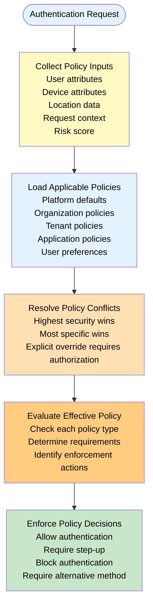

### 9.3 Policy Examples

| Policy | Example Rule | Enforcement |
|--------|-------------|-------------|
| **Password Policy** | Minimum 12 characters, must include uppercase, number, special character | Enforced at credential creation and update |
| **Passwordless Policy** | Passkeys must be platform-bound (not cross-device) for AAL3+ | Enforced at authenticator registration |
| **MFA Policy** | MFA required for all admin access and any operation over $100 | Enforced at authentication and step-up |
| **Device Trust Policy** | Unknown devices require MFA and email verification | Enforced at device validation |
| **Geo-Based Policy** | Block authentication from sanctioned regions | Enforced at risk evaluation |
| **Risk-Based Policy** | Risk score > 70 requires step-up to AAL3; risk score > 90 blocks authentication | Enforced at risk evaluation |
| **Session Age Policy** | Maximum session lifetime: 24 hours for AAL2, 8 hours for AAL3+ | Enforced at token validation |
| **Inactivity Policy** | Inactivity timeout: 15 minutes for admin, 60 minutes for standard | Enforced at token validation |
| **Re-authentication Policy** | Re-authentication required for password change, factor registration, security settings | Enforced at operation request |

---

## 10. Device Trust Architecture

### 10.1 Device Trust Model

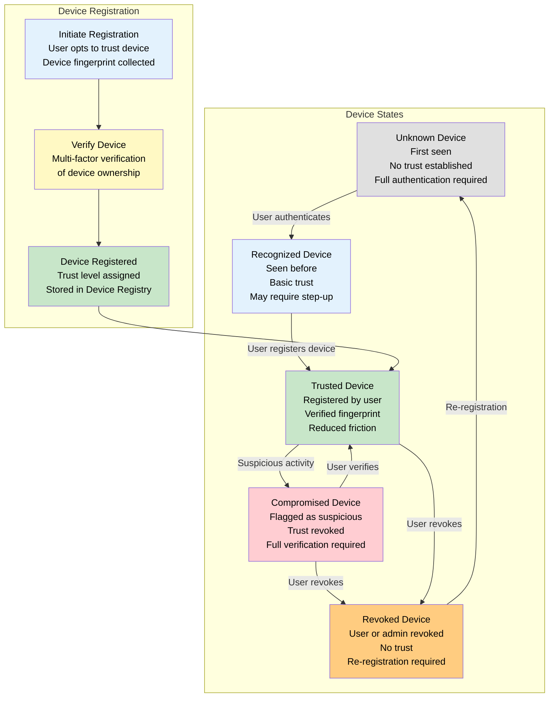

### 10.2 Device Trust Levels

| Level | Trust | Friction | MFA Required | Persistence |
|-------|-------|----------|--------------|-------------|
| **Unknown** | None | Full authentication | Required (if policy demands) | Session-only |
| **Recognized** | Low | Standard authentication | Recommended | Browser cookie / device ID |
| **Trusted** | High | Reduced (single factor if AAL permits) | Based on risk | Registered device, persistent |
| **Compromised** | Negative | Maximum verification | Required, additional checks | Until resolved |
| **Revoked** | None | Full re-registration | Required | Until re-registration |

### 10.3 Device Validation

| Validation | Unknown Device | Recognized Device | Trusted Device | Compromised Device |
|-----------|---------------|-------------------|----------------|---------------------|
| **Device fingerprint** | Collected | Compared | Verified | Flagged |
| **Authentication** | Full | Standard | Reduced | Maximum |
| **MFA** | Required per policy | Based on risk | Based on risk | Always required |
| **Email verification** | May be required | Not required | Not required | Required |
| **Session duration** | Standard | Standard | Extended | Minimal |

---

## 11. Multi-Factor Authentication

### 11.1 MFA Architecture

```mermaid
flowchart TB
    subgraph "MFA Enrollment"
        ENROLL_START["Enrollment Initiation\nUser or policy triggered\nSelect factor type"]
        ENROLL_START --> ENROLL_VERIFY

        ENROLL_VERIFY["Enrollment Verification\nVerify ownership of factor\nGenerate and store secret\nTest factor"]
        ENROLL_VERIFY --> ENROLL_COMPLETE

        ENROLL_COMPLETE["Enrollment Complete\nFactor registered\nBackup methods noted\nRecovery codes generated"]
    end

    subgraph "MFA Verification"
        AUTH_REQ2["Authentication Request\nPrimary factor verified\nMFA required by policy"]
        AUTH_REQ2 --> SELECT_FACTOR

        SELECT_FACTOR["Select MFA Factor\nChoose from enrolled factors\nBased on policy and device"]
        SELECT_FACTOR --> PRESENT_CHALLENGE

        PRESENT_CHALLENGE["Present Challenge\nTOTP code prompt\nPush notification\nBiometric scan\nHardware key gesture"]
        PRESENT_CHALLENGE --> VERIFY_FACTOR

        VERIFY_FACTOR["Verify Factor\nCheck code validity\nVerify biometric\nValidate signature"]
        VERIFY_FACTOR --> MFA_OUTCOME{"Verification\nResult?"}

        MFA_OUTCOME -->|Success| MFA_COMPLETE["MFA Complete\nAssurance level elevated\nSession updated"]
        MFA_OUTCOME -->|Failure| MFA_RETRY{"Retry\nAvailable?"}
        MFA_RETRY -->|Yes| PRESENT_CHALLENGE
        MFA_RETRY -->|No| MFA_FAILED["MFA Failed\nAuthentication blocked\nAlert triggered"]
    end

    subgraph "MFA Recovery"
        RECOVER_START["Recovery Initiated\nFactor lost or unavailable\nUser initiates recovery"]
        RECOVER_START --> RECOVER_VERIFY

        RECOVER_VERIFY["Recovery Verification\nVerify identity via backup\nmethods or recovery codes\nIndependent verification"]
        RECOVER_VERIFY --> RECOVER_COMPLETE

        RECOVER_COMPLETE["Recovery Complete\nAccess restored\nFactor re-enrolled\nOld factor revoked"]
    end

    style ENROLL_START fill:#e3f2fd,color:#000
    style ENROLL_VERIFY fill:#e3f2fd,color:#000
    style ENROLL_COMPLETE fill:#c8e6c9,color:#000
    style AUTH_REQ2 fill:#fff9c4,color:#000
    style SELECT_FACTOR fill:#e3f2fd,color:#000
    style PRESENT_CHALLENGE fill:#f3e5f5,color:#000
    style VERIFY_FACTOR fill:#ffcc80,color:#000
    style MFA_COMPLETE fill:#c8e6c9,color:#000
    style MFA_FAILED fill:#ffcdd2,color:#000
    style RECOVER_START fill:#e3f2fd,color:#000
    style RECOVER_VERIFY fill:#fff9c4,color:#000
    style RECOVER_COMPLETE fill:#c8e6c9,color:#000
```

### 11.2 MFA Methods

| Method | Factor Type | Assurance | Primary or Secondary | User Experience | Recovery |
|--------|-------------|-----------|---------------------|-----------------|----------|
| **TOTP** | Possession (shared secret) | AAL2 | Secondary | Code entry from authenticator app | Backup codes |
| **SMS Code** | Possession (phone) | AAL1 | Secondary | Code sent via SMS | Alternative phone |
| **Email Code** | Possession (email) | AAL1 | Secondary | Code sent via email | Alternative email |
| **Push Notification** | Possession (device) | AAL2 | Secondary | Approve/deny on trusted device | Alternative device |
| **Hardware Security Key** | Possession (key) | AAL3+ | Primary or Secondary | Key tap/insert | Backup key |
| **Platform Biometrics** | Inherence | AAL2-AAL3 | Primary or Secondary | Fingerprint, Face ID | Passcode fallback |
| **Recovery Codes** | Knowledge | AAL1 | Recovery only | One-time code entry | Regenerate codes |

### 11.3 MFA Policy Enforcement

| Policy | Enforcement | Effect |
|--------|-------------|--------|
| **MFA Always** | Every authentication requires MFA | Maximum security, maximum friction |
| **MFA on Risk** | MFA triggered by risk score threshold | Balanced security and UX |
| **MFA on Sensitive Operation** | MFA triggered by operation sensitivity | Step-up on demand |
| **MFA on New Device** | MFA required for unrecognized devices | Device-aware friction |
| **MFA on Admin** | MFA required for admin role access | Role-based security |

---

## 12. Runtime Authentication Flow

### 12.1 Flow Diagram

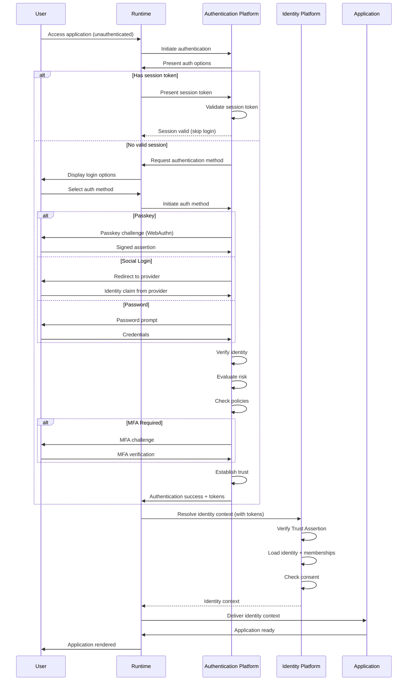

### 12.2 Runtime Authentication Responsibilities

| Responsibility | Description |
|--------------|-------------|
| **Authentication initiation** | Begin authentication flow when user accesses an authenticated resource |
| **Token management** | Store and manage authentication tokens securely; refresh tokens before expiry |
| **Token presentation** | Present authentication tokens with every request to the Identity Platform |
| **Authentication provider abstraction** | Abstract authentication provider details from the application layer |
| **Offline authentication** | Support cached session state for offline operation with deferred re-authentication |
| **Secure logout** | Clear all authentication tokens and session state on logout |
| **Biometric integration** | Integrate with platform biometric APIs for passkey and biometric authentication |
| **Error handling** | Handle authentication errors gracefully — expired session, invalid token, MFA required |

---

## 13. Responsibilities

### 13.1 Identity Platform Responsibilities

| Responsibility | Description |
|--------------|-------------|
| **Identity resolution** | Resolve identity records for authentication requests |
| **Credential verification** | Verify presented credentials against stored authentication factors |
| **Authentication factor management** | Register, update, and revoke authentication factors for identities |
| **Trust Assertion generation** | Generate cryptographically signed Trust Assertions after successful authentication |
| **Provider integration** | Integrate with authentication providers through the provider interface |

### 13.2 Authentication Platform Responsibilities

| Responsibility | Description |
|--------------|-------------|
| **Authentication orchestration** | Orchestrate the complete authentication flow from request to trust establishment |
| **Risk evaluation** | Evaluate risk signals and determine authentication requirements |
| **Policy enforcement** | Evaluate and enforce authentication policies |
| **MFA management** | Manage MFA enrollment, verification, and recovery |
| **Device trust management** | Register, verify, and manage device trust states |
| **Session management** | Create, validate, refresh, and terminate authentication sessions |
| **Authentication audit** | Record all authentication events for security monitoring |

### 13.3 Runtime Responsibilities

| Responsibility | Description |
|--------------|-------------|
| **Authentication client** | Host the authentication client that interacts with the Authentication Platform |
| **Token secure storage** | Store authentication tokens in platform-secure storage (Keychain, KeyStore, Credential Manager) |
| **Token lifecycle** | Manage token refresh, rotation, and invalidation |
| **Authentication state** | Maintain authentication state across application lifecycles (KB-060) |
| **Offline support** | Cache authentication state for offline operation |

### 13.4 Backend Responsibilities

| Responsibility | Description |
|--------------|-------------|
| **Token verification** | Verify authentication tokens and Trust Assertions from Runtime requests |
| **Service-to-service authentication** | Authenticate service-to-service communication using service identities |
| **Authentication event consumption** | Consume authentication audit events for security monitoring |

### 13.5 Builder Responsibilities

| Responsibility | Description |
|--------------|-------------|
| **Authentication integration configuration** | Configure authentication requirements for composed applications |
| **Required AAL declaration** | Declare required assurance levels for application operations in the manifest |
| **Authentication UX configuration** | Configure authentication user experience within Builder Studio |

---

## 14. Security

### 14.1 Credential Protection

| Protection | Description |
|------------|-------------|
| **Password hashing** | Passwords are hashed with a strong, adaptive hashing algorithm (bcrypt/argon2) with per-user salts |
| **Credential separation** | Authentication credentials are stored separately from identity profiles and application data |
| **Encrypted storage** | Credential data is encrypted at rest with tenant-isolated encryption keys |
| **Zero-knowledge proofs** | Where possible, authentication uses zero-knowledge proofs (passkeys) rather than shared secrets |
| **No credential logging** | Credentials are never logged, even in error messages or audit trails |

### 14.2 Authentication Replay Protection

| Protection | Description |
|------------|-------------|
| **Nonce/challenge** | Every authentication request includes a unique nonce or challenge to prevent replay |
| **Timestamp validation** | Authentication requests include timestamps with acceptable skew windows |
| **One-time codes** | One-time codes (TOTP, OTP, magic link tokens) are single-use with short TTLs |
| **Session binding** | Authentication tokens are bound to specific sessions, devices, and IP ranges |

### 14.3 Brute Force Protection

| Protection | Description |
|------------|-------------|
| **Rate limiting** | Authentication attempts are rate-limited per identity, per IP, and per device |
| **Account lockout** | Accounts are temporarily locked after N consecutive failed attempts |
| **Progressive delay** | Failed attempts introduce progressive delays before allowing retry |
| **Alerting** | Brute force patterns trigger security alerts |

### 14.4 Credential Stuffing Protection

| Protection | Description |
|------------|-------------|
| **Compromised credential detection** | Check passwords against known compromised credential databases |
| **Device fingerprinting** | Credential stuffing typically comes from automated tools — device fingerprinting detects non-human patterns |
| **Behavioral analysis** | Unusual login patterns (fast sequential attempts, unusual geographies) trigger blocking |
| **CAPTCHA integration** | Suspicious authentication attempts may require CAPTCHA verification |

### 14.5 Session Hijacking Protection

| Protection | Description |
|------------|-------------|
| **Token binding** | Authentication tokens are bound to the device and session that created them |
| **Token rotation** | Tokens are rotated on a defined schedule and on assurance level changes |
| **Secure token storage** | Tokens are stored in platform-secure storage, not accessible to other applications |
| **Token validation** | Every request validates token integrity, expiry, and binding |

### 14.6 Device Validation

Refer to Section 10 — Device Trust Architecture for complete device validation details.

### 14.7 Phishing Resistance

| Protection | Description |
|------------|-------------|
| **Passkey priority** | Passkeys are inherently phishing-resistant — they are bound to the origin |
| **Origin validation** | All authentication redirects validate the origin against allowlists |
| **Magic link verification** | Magic links are bound to the requesting device and session |
| **MFA as defense** | MFA provides a second factor even if the first factor is phished |

### 14.8 Secure Logout

| Aspect | Architecture |
|--------|--------------|
| **Token invalidation** | All authentication tokens are invalidated on logout |
| **Session termination** | Authentication session is terminated across all active devices |
| **Backend notification** | Backend services are notified of session termination |
| **Client cleanup** | Client clears all locally stored authentication state |
| **Single logout** | Support single logout across all active sessions if configured |

---

## 15. Privacy

### 15.1 Minimal Identity Exposure

The Authentication Platform exposes only the minimum identity information necessary for authentication. Identity attributes beyond authentication (profile data, membership, consent) are handled by the Identity Platform after authentication is complete.

### 15.2 Authentication Data Separation

Authentication data (credentials, factors, authenticators) is stored separately from identity profile data and application data. This separation ensures:
- Credential compromise does not expose profile data
- Authentication data is not accessible to applications
- Authentication audit trails are isolated from application audit trails

### 15.3 Audit Requirements

| Audit Event | Data Recorded | Retention |
|-------------|---------------|-----------|
| **Login success** | Identity ID, method, AAL, device, location, timestamp | 1 year |
| **Login failure** | Identity ID (if resolved), method, reason, device, location, timestamp | 1 year |
| **MFA verification** | Identity ID, MFA method, result, timestamp | 1 year |
| **MFA enrollment** | Identity ID, MFA method, timestamp | Identity lifetime |
| **MFA recovery** | Identity ID, recovery method, timestamp | 1 year |
| **Device registration** | Identity ID, device ID, trust level, timestamp | Device lifetime |
| **Logout** | Identity ID, session ID, timestamp | 1 year |
| **Token refresh** | Identity ID, session ID, timestamp | 90 days |

### 15.4 Consent Independence

Authentication does not require consent. A user can authenticate without granting any consent for data sharing. Consent is a separate operation that occurs after authentication and is governed by the Consent Service (KB-067).

### 15.5 Cross-Tenant Privacy

Authentication is tenant-independent. The Authentication Platform does not expose tenant membership information during authentication. Tenant membership is resolved by the Identity Platform after authentication, subject to authorization policies.

---

## 16. Performance

| Operation | Target Latency | Caching Strategy | Scaling |
|-----------|---------------|------------------|---------|
| **Identity resolution** | < 50ms | Identity cache | Horizontal scaling |
| **Password verification** | < 200ms | N/A (compute-bound) | Horizontal scaling |
| **Passkey authentication** | < 100ms (platform) + user interaction | N/A | Horizontal scaling |
| **Magic link verification** | < 50ms | Token cache | Horizontal scaling |
| **Social login redirect** | < 2s (IdP-dependent) | Provider session cache | Horizontal scaling |
| **MFA verification** | < 100ms (TOTP), < 5s (push) | Factor cache | Horizontal scaling |
| **Risk evaluation** | < 300ms | Risk cache per session | Horizontal scaling |
| **Policy evaluation** | < 100ms | Policy cache | Horizontal scaling |
| **Device validation** | < 100ms | Device cache | Horizontal scaling |
| **Session establishment** | < 50ms | Session store | Horizontal scaling per write |
| **Token validation** | < 10ms | Token cache (local) | Local to Runtime |

---

## 17. Observability

### 17.1 Login Metrics

| Metric | Type | Source | Aggregation |
|--------|------|-------|-------------|
| `auth.login.count` | Counter | Authentication Platform | Rate, total |
| `auth.login.success` | Counter | Authentication Platform | Rate, total, by method |
| `auth.login.failure` | Counter | Authentication Platform | Rate, total, by reason |
| `auth.login.duration` | Timer | Authentication Platform | Avg, p95, p99, by method |

### 17.2 Failure Metrics

| Metric | Type | Source | Aggregation |
|--------|------|-------|-------------|
| `auth.failure.credential` | Counter | Credential Verification | Rate, total |
| `auth.failure.identity_not_found` | Counter | Identity Resolution | Rate, total |
| `auth.failure.mfa` | Counter | MFA Verification | Rate, total, by method |
| `auth.failure.risk` | Counter | Risk Evaluation | Rate, total, by reason |
| `auth.failure.device` | Counter | Device Validation | Rate, total, by reason |
| `auth.failure.policy` | Counter | Policy Evaluation | Rate, total, by policy |

### 17.3 MFA Metrics

| Metric | Type | Source | Aggregation |
|--------|------|-------|-------------|
| `auth.mfa.enrollment.count` | Counter | MFA Enrollment | Rate, total, by method |
| `auth.mfa.verification.count` | Counter | MFA Verification | Rate, total, by method |
| `auth.mfa.verification.success` | Counter | MFA Verification | Rate, by method |
| `auth.mfa.verification.failure` | Counter | MFA Verification | Rate, by method, by reason |
| `auth.mfa.recovery.count` | Counter | MFA Recovery | Rate |

### 17.4 Risk Metrics

| Metric | Type | Source | Aggregation |
|--------|------|-------|-------------|
| `auth.risk.score` | Gauge | Risk Engine | Distribution, avg |
| `auth.risk.threshold_exceeded` | Counter | Risk Engine | Rate, by threshold |
| `auth.risk.stepup_triggered` | Counter | Risk Engine | Rate |
| `auth.risk.blocked` | Counter | Risk Engine | Rate |

### 17.5 Authentication Health

| Health Signal | Healthy Criteria | Degraded Criteria | Unhealthy Criteria |
|--------------|-----------------|-------------------|--------------------|
| **Login success rate** | > 95% | 85-95% | < 85% |
| **Login latency (p95)** | < 2s | 2-5s | > 5s |
| **MFA success rate** | > 98% | 90-98% | < 90% |
| **Authentication platform availability** | 100% | < 100% | Unavailable |
| **Provider failover time** | < 100ms | 100-500ms | > 500ms |
| **Risk evaluation latency** | < 300ms | 300-500ms | > 500ms |

---

## 18. Failure Scenarios

### 18.1 Invalid Credentials

| Scenario | Detection | Response | Recovery |
|----------|-----------|----------|----------|
| User enters wrong password | Credential verification failure | Return "invalid credentials" error; increment failure count | User retries or initiates password reset |
| Passkey signature invalid | Passkey verification failure | Return authentication error; log failure | User retries passkey or uses alternative method |
| TOTP code expired or invalid | MFA verification failure | Return "invalid code" error; do not increment login failure count | User retries with new code |

### 18.2 Identity Not Found

| Scenario | Detection | Response | Recovery |
|----------|-----------|----------|----------|
| Email not registered | Identity resolution failure | Return generic "account not found" error (no email enumeration) | User registers or checks email spelling |
| Account deactivated | Identity state check | Return "account unavailable" error | User contacts support or initiates reactivation |

### 18.3 MFA Failure

| Scenario | Detection | Response | Recovery |
|----------|-----------|----------|----------|
| MFA code entry exhausted | MFA retry limit reached | Block authentication; require re-login | User retries with fresh MFA code from new login |
| MFA device unavailable | MFA challenge timeout | Offer alternative MFA method or recovery | User uses backup MFA method or recovery codes |
| MFA enrollment incomplete | MFA requirement check | Block authentication until MFA enrolled | User completes MFA enrollment first |

### 18.4 Device Trust Failure

| Scenario | Detection | Response | Recovery |
|----------|-----------|----------|----------|
| Device fingerprint mismatch | Device validation | Treat as unknown device; require full authentication | User re-authenticates and may re-register device |
| Device in compromised state | Device trust check | Require maximum verification; alert user | User verifies device ownership or revokes |

### 18.5 Provider Unavailable

| Scenario | Detection | Response | Recovery |
|----------|-----------|----------|----------|
| Social login provider down | Provider health check | Fall back to alternative providers; log provider outage | User uses different provider or native auth |
| SMS gateway unavailable | SMS delivery failure | Fall back to alternative MFA methods | User uses TOTP or email code instead |

### 18.6 Authentication Timeout

| Scenario | Detection | Response | Recovery |
|----------|-----------|----------|----------|
| User takes too long to complete authentication | Session timeout | Terminate authentication attempt; require restart | User initiates new authentication |
| MFA challenge times out | MFA timeout | Offer retry or alternative method | User retries or uses backup method |

### 18.7 Replay Attempt

| Scenario | Detection | Response | Recovery |
|----------|-----------|----------|----------|
| Authentication token replayed | Token reuse detection | Invalidate token; log security event; block request | User must re-authenticate |
| One-time code used twice | Code reuse detection | Block authentication; log security event | User must request new code |

### 18.8 Risk Threshold Exceeded

| Scenario | Detection | Response | Recovery |
|----------|-----------|----------|----------|
| Login from unusual location | Risk evaluation | Require step-up authentication (MFA + email verification) | User completes step-up |
| Login from blocked region | Risk evaluation | Block authentication with region message | User contacts support |
| Automated login pattern detected | Risk evaluation | Block authentication; CAPTCHA required; alert security | User completes CAPTCHA or contacts support |

---

## 19. Anti-patterns

### 19.1 Authentication Inside Tenant Apps

**Anti-pattern:** Each tenant application implements its own authentication logic, separate from the Authentication Platform.

**Why it is harmful:** Violates the One Authentication Platform principle, creates inconsistent security, duplicates authentication code across applications, and makes central policy enforcement impossible.

**Correct approach:** All authentication flows through the Authentication Platform. Applications receive authenticated identity context, never perform authentication themselves.

### 19.2 Per-Tenant Login Systems

**Anti-pattern:** Each tenant has its own login page, user database, and authentication logic.

**Why it is harmful:** Forces users to create separate accounts per tenant, fragments authentication state, makes cross-tenant identity impossible, and violates tenant isolation at the identity level.

**Correct approach:** A single Authentication Platform serves all tenants. Users authenticate once and access any tenant they have membership or consent for.

### 19.3 Authentication Without Identity Verification

**Anti-pattern:** Accepting authentication without verifying the identity claim (e.g., accepting any email without verification).

**Why it is harmful:** Allows identity spoofing, undermines trust in all downstream identity operations, and makes audit trails meaningless.

**Correct approach:** Every authentication event includes identity verification. Unverified identities have the lowest assurance level (AAL1) and limited access.

### 19.4 Hardcoded Providers

**Anti-pattern:** Hardcoding specific authentication providers into the authentication flow (e.g., only supporting Google login).

**Why it is harmful:** Creates provider lock-in, makes adding new providers a code change, and prevents provider failover.

**Correct approach:** Authentication providers are pluggable through a defined provider interface. No provider is hardcoded into the authentication flow.

### 19.5 Shared Credentials

**Anti-pattern:** Multiple users sharing the same authentication credentials (shared accounts, team logins).

**Why it is harmful:** Destroys audit trails, makes it impossible to attribute actions to specific users, and violates the One Identity Per Person principle.

**Correct approach:** Each user has their own identity and credentials. Shared access is managed through role-based access control (KB-065), not shared credentials.

### 19.6 Persistent Elevated Authentication

**Anti-pattern:** Keeping a user at a high assurance level indefinitely after a single authentication event.

**Why it is harmful:** Reduces security by allowing high-privilege operations long after the initial authentication, increases session hijacking risk, and violates the principle of continuous authentication.

**Correct approach:** Assurance levels decay over time. High-assurance operations require step-up authentication. Sessions are periodically re-verified.

### 19.7 Weak Recovery Mechanisms

**Anti-pattern:** Using weak recovery mechanisms (security questions, email-only recovery, no identity verification for recovery).

**Why it is harmful:** Recovery is the weakest link in authentication security. Weak recovery allows attackers to bypass strong authentication.

**Correct approach:** Recovery requires identity verification through multiple channels. Recovery codes are one-time-use with limited TTL. Recovery events trigger security notifications.

---

## 20. Future Evolution

### 20.1 Passkey-First Authentication

Future authentication will prioritize passkeys as the primary authentication mechanism. Passkeys provide phishing resistance, device-bound cryptographic security, and seamless user experience across devices. Password-based authentication becomes a fallback rather than the default.

### 20.2 Continuous Authentication

Future authentication may be continuous — the platform continuously evaluates authentication strength throughout a session based on user behavior, device posture, and environmental signals. Authentication confidence adjusts in real time, reducing friction for normal behavior and increasing verification for anomalies.

### 20.3 Behavioral Biometrics

Future authentication may incorporate behavioral biometrics — typing patterns, mouse movements, touch gestures, gait analysis — as an invisible authentication factor. Behavioral biometrics provide continuous verification without explicit user interaction.

### 20.4 Decentralized Identity Authentication

Future authentication may support decentralized identity (DID) authentication where identity verification occurs through distributed ledgers or peer-to-peer networks without a central identity provider.

### 20.5 AI-Assisted Risk Analysis

Future risk analysis may leverage AI for more sophisticated threat detection — identifying novel attack patterns, predicting credential compromise, and adapting authentication requirements in real time based on global threat intelligence.

### 20.6 Hardware-Backed Authentication

Future authentication will increasingly leverage hardware-backed security — secure enclaves, trusted execution environments, and hardware security keys — to provide the highest assurance levels with minimal user friction.

### 20.7 Passwordless Platform

Future evolution targets a fully passwordless platform where passwords are eliminated as an authentication factor. All authentication uses passkeys, biometrics, magic links, or federated identity.

---

## 21. Cross-References

| Reference | Document | Relationship |
|-----------|----------|-------------|
| **KB-063** | Identity Platform Architecture | Identity resolution and identity context that authentication produces |
| **KB-065** | Authorization & RBAC (planned) | Authorization operates on authenticated identity from this architecture |
| **KB-066** | Universal Consumer Identity (planned) | Consumer-specific authentication flows |
| **KB-067** | Consent & Privacy Architecture | Consent is independent of and follows authentication |
| **KB-068** | Session Management Architecture | Session lifecycle tied to authentication events |
| **KB-057** | Runtime Security Architecture | Security controls for authentication token handling |
| **KB-070** | API Security & Token Architecture | API authentication and token management |

---

## 22. Mermaid Diagram Index

| Diagram | Section | Description |
|---------|---------|-------------|
| Authentication Architecture | 4.1 | Complete authentication flow from user request through trust establishment to applications |
| Authentication Service Dependencies | 4.2 | Platform and external dependencies of the Authentication Platform |
| Authentication Lifecycle | 5.1 | Complete authentication lifecycle from request through session to logout |
| Authentication Context Model | 6.1 | Authentication context structure with all fields |
| Authentication Flows by Model | 7.2 | Flow diagrams for password, passkey, magic link, and social login |
| Authentication Assurance Levels | 8.1 | Five-level assurance model from AAL0 to AAL5 |
| Assurance Level Elevation | 8.3 | Step-up authentication flow for higher AAL operations |
| Authentication Policy Evaluation | 9.1 | Policy sources, evaluation engine, and policy types |
| Policy Evaluation Flow | 9.2 | Policy evaluation process from input collection to enforcement |
| Device Trust Model | 10.1 | Device states and registration flow |
| Multi-Factor Authentication Flow | 11.1 | MFA enrollment, verification, and recovery flows |
| Runtime Authentication Flow | 12.1 | Sequence diagram of complete Runtime authentication flow |
