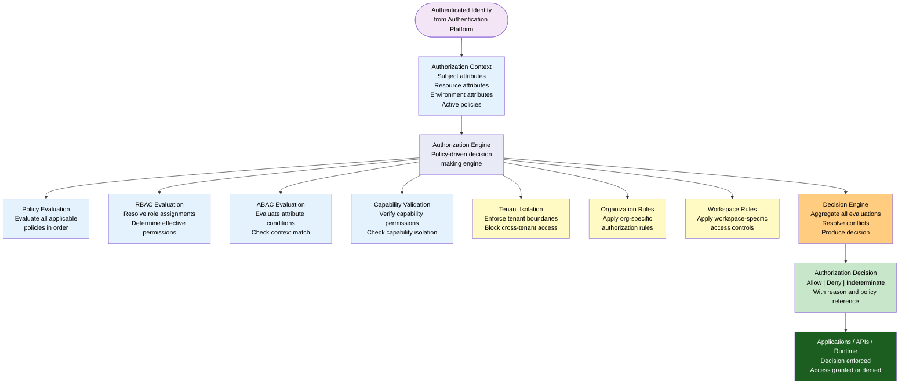
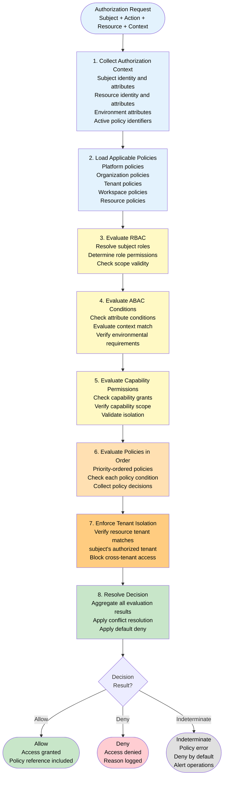
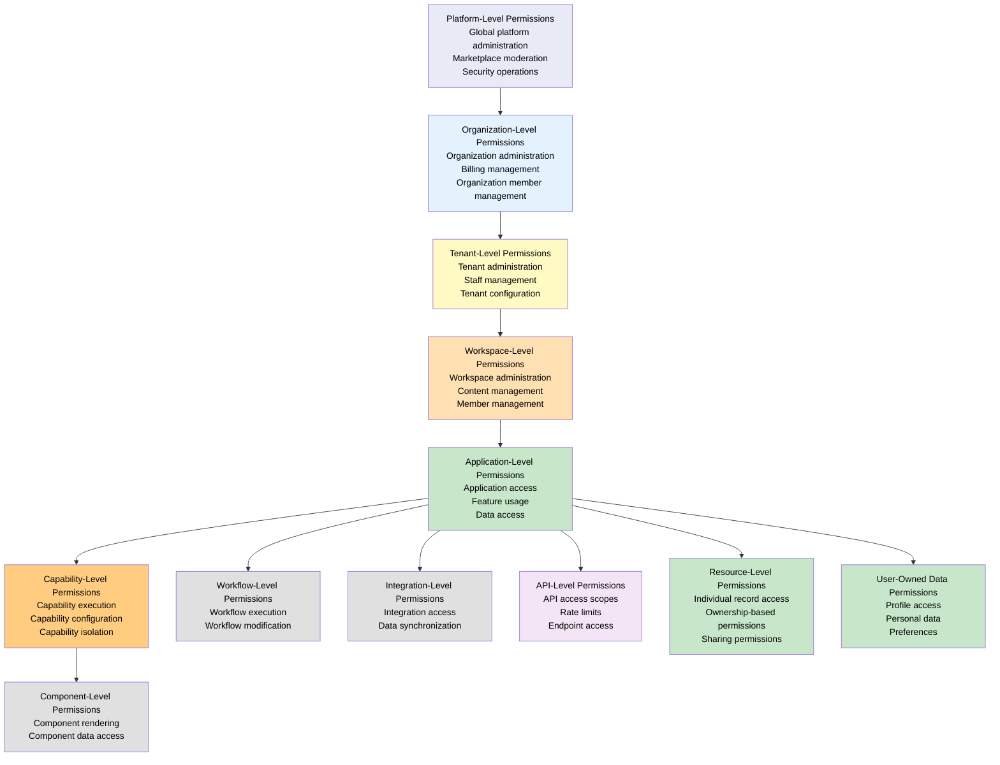
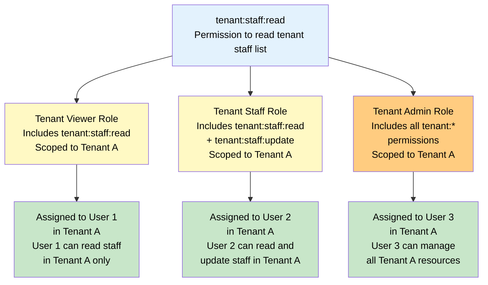
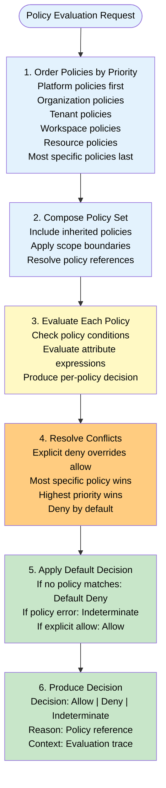
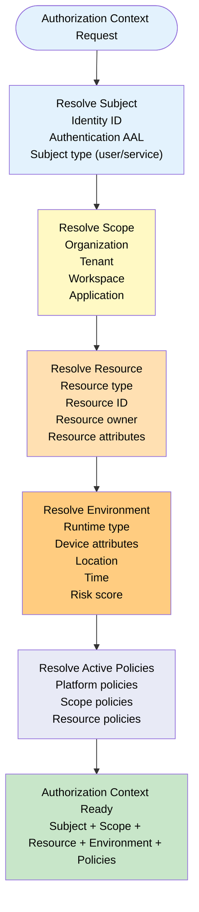
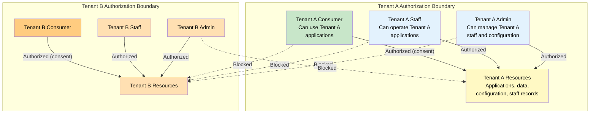
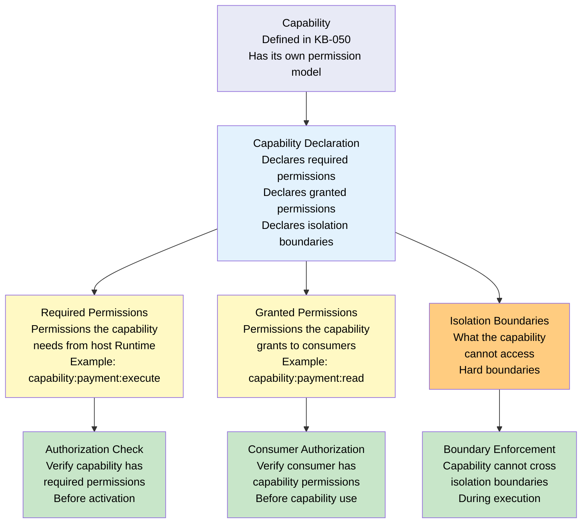

# Authorization & RBAC Architecture

**KB-065 — Authorization & RBAC Architecture Specification**

| Metadata | |
|----------|---|
| **KB ID** | KB-065 |
| **Title** | Authorization & RBAC Architecture |
| **Version** | 0.1.0 |
| **Status** | Draft |
| **Owner** | Architecture Team |
| **Suite** | Identity & Access Architecture |
| **Dependencies** | KB-043 Workspace & Tenant Model, KB-050 Capability Composition Model, KB-057 Runtime Security Architecture, KB-063 Identity Platform Architecture, KB-064 Authentication Architecture |
| **Related Documents** | KB-066 Universal Consumer Identity, KB-067 Consent & Privacy Architecture, KB-068 Session Management Architecture, KB-070 API Security & Token Architecture, KB-051 Runtime Architecture Overview, KB-055 Runtime State Engine Architecture, KB-060 Runtime Lifecycle Management |
| **Review Status** | Pending |
| **Last Updated** | 2026-07-11 |

---

### Revision History

| Version | Date | Author | Change |
|---------|------|--------|--------|
| 0.1.0 | 2026-07-11 | AI Architecture Agent | Initial draft |

---

## 1. Executive Summary

### 1.1 Purpose

This document defines the Authorization & RBAC Architecture for the DUKADESK Platform. Authorization determines what an authenticated identity is allowed to do after authentication has been completed. It is completely independent of authentication and consent.

The Authorization Platform must support multiple authorization models simultaneously — Role-Based Access Control (RBAC), Attribute-Based Access Control (ABAC), Capability-Based Authorization, Policy-Based Authorization, and Delegated Authorization — while maintaining strict tenant isolation, platform governance, and fine-grained permission control across every platform surface.

Authorization determines access, never identity. Authorization decisions are policy-driven, context-aware, auditable, and enforced at every trust boundary in the DUKADESK ecosystem.

### 1.2 Scope

**In scope:**

- Architectural principles: Authentication Before Authorization, Least Privilege, Default Deny, Policy-Based Access, Role-Based Access, Attribute-Based Access, Capability-Based Access, Context-Aware Decisions, Tenant Isolation, Organization Isolation, Runtime Independence, Auditable Decisions
- Canonical definitions: Authorization, Permission, Policy, Role, Privilege, Scope, Resource, Action, Subject, Authorization Context, Authorization Decision, Policy Engine, Role Assignment, Capability Permission, Delegated Permission
- Authorization Architecture: Policy Evaluation, RBAC Evaluation, ABAC Evaluation, Capability Validation, Tenant Isolation, Organization Rules, Workspace Rules, Runtime Rules, Decision Engine
- Authorization Models: RBAC, ABAC, Capability-Based, Resource-Based, Policy-Based, Delegated Authorization
- Permission Hierarchy: Platform, Organization, Tenant, Workspace, Application, Capability, Component, Workflow, Integration, API, Resource, User-Owned Data
- Role Architecture: Platform Roles (Super Admin, Operations, Support, Security, Marketplace Moderator), Organization Roles (Owner, Administrator, Billing, Auditor, Member), Tenant Roles (Owner, Administrator, Manager, Staff, Viewer), Workspace Roles (Administrator, Editor, Contributor, Viewer), Runtime Roles (Authenticated Consumer, Guest Consumer, Premium Consumer, Verified Consumer)
- Policy Engine: Evaluation Order, Composition, Inheritance, Overrides, Conflict Resolution, Default Decisions
- Authorization Context: Identity, Organization, Tenant, Workspace, Application, Device, Runtime, Subscription, Consent, Time, Location, Environment
- Capability Authorization: Permissions, Ownership, Execution, Isolation
- Responsibilities: Runtime, Identity Platform, Backend, Builder
- Security: Policy Integrity, Permission Integrity, Privilege Escalation Protection, Tenant Boundary Enforcement, Resource Isolation, Administrative Separation, Just-In-Time Authorization
- Privacy: Authorization vs Consent, User Data Ownership, Tenant Data Isolation, Minimal Permission Exposure
- Performance: Policy Evaluation, Permission Resolution, Role Resolution, Context Resolution, Decision Caching
- Failure scenarios, anti-patterns, and future evolution

**Out of scope:**

- Implementation details of specific authorization frameworks, policy languages, or access control mechanisms
- Application-level authorization logic (handled by individual application specs)
- Authentication flows and identity verification (handled by KB-064)
- Consent management and data sharing permissions (handled by KB-067)

---

## 2. Architectural Principles

### 2.1 Authentication Before Authorization

Every authorization decision follows authentication. Authorization operates on an authenticated identity context. No authorization decision is made for unauthenticated subjects. Anonymous access is governed by explicit anonymous access policies, not by authorization bypass.

### 2.2 Least Privilege

Subjects receive the minimum permissions necessary to perform their function. No subject has permissions they do not need. Higher privilege requires explicit assignment and justification. Privilege is scoped to the smallest effective resource set.

### 2.3 Default Deny

All access is denied by default. Permission must be explicitly granted. There is no implicit access based on membership, proximity, or inheritance. Default deny is enforced at every authorization boundary.

### 2.4 Policy-Based Access

Authorization is governed by policies, not by code. Policies are declarative, versioned, and auditable. Authorization logic is not embedded in applications. Policy changes do not require application changes.

### 2.5 Role-Based Access

Roles are the primary mechanism for permission assignment. Roles aggregate permissions into named, assignable units. Role assignments are scoped to organizations, tenants, or workspaces.

### 2.6 Attribute-Based Access

Authorization decisions may consider subject, resource, and environment attributes. Attributes include identity attributes, resource metadata, device posture, time, location, and risk score. ABAC provides fine-grained control beyond static role assignments.

### 2.7 Capability-Based Access

Capabilities (KB-050) have their own authorization model. Capability permissions are independent of role assignments. A capability may grant specific permissions to its consumers, scoped to the capability's domain.

### 2.8 Context-Aware Decisions

Authorization decisions are made in full context — who the subject is, what resource they are accessing, what action they are performing, what environment they are in, and what policies apply. Context is resolved per-request, not cached across requests.

### 2.9 Tenant Isolation

Authorization enforces tenant boundaries. A subject's permissions in one tenant do not grant access to another tenant. Cross-tenant access requires explicit policies and consent. Tenant isolation is inviolable.

### 2.10 Organization Isolation

Authorization enforces organization boundaries. Permissions are organization-scoped and do not cross organization boundaries without explicit policies.

### 2.11 Runtime Independence

Authorization is independent of any specific Runtime implementation. The same authorization model, policies, and decisions apply across Mobile, Web, Desktop, and Preview Runtimes.

### 2.12 Auditable Decisions

Every authorization decision is auditable. The Who, What, When, Where, and Why of every decision are recorded. Denied access attempts are audited for security monitoring.

---

## 3. Canonical Definitions

### 3.1 Authorization

The process of determining whether an authenticated identity is permitted to perform a specific action on a specific resource within a specific context. Authorization produces a binary decision: Allow or Deny.

### 3.2 Permission

A declarative statement that a subject may perform an action on a resource. Permissions are the atomic units of authorization. Permissions are aggregated into roles or assigned directly.

### 3.3 Policy

A declarative rule set that governs authorization decisions. Policies define who can do what, under what conditions. Policies are versioned, auditable, and evaluated by the Policy Engine.

### 3.4 Role

A named collection of permissions that can be assigned to subjects within a scope. Roles are the primary mechanism for permission management. Roles support inheritance and composition.

### 3.5 Privilege

An elevated permission that grants access to sensitive operations or resources. Privileges require explicit assignment and are subject to additional controls (approval, just-in-time activation, audit).

### 3.6 Scope

The boundary within which a permission or role is effective. Scopes include Platform-wide, Organization, Tenant, Workspace, Application, and Resource.

### 3.7 Resource

A protected entity that requires authorization for access. Resources include applications, capabilities, components, themes, workflows, APIs, data records, and configuration.

### 3.8 Action

An operation that a subject may perform on a resource. Actions include create, read, update, delete, execute, deploy, publish, configure, and administer.

### 3.9 Subject

The entity requesting access. Subjects are authenticated identities — users, services, or machines. Every authorization decision has a subject.

### 3.10 Authorization Context

The complete set of information available for making an authorization decision. Authorization Context includes the subject, resource, action, environment attributes, and applicable policies.

### 3.11 Authorization Decision

The outcome of authorization evaluation. Decisions are Allow, Deny, or Indeterminate (policy evaluation failure). Decisions include the policy or rule that produced the outcome.

### 3.12 Policy Engine

The service that evaluates authorization policies and produces authorization decisions. The Policy Engine evaluates policies in order, resolves conflicts, and applies default decisions.

### 3.13 Role Assignment

The binding of a role to a subject within a scope. Role assignments are managed by administrators and are versioned for audit.

### 3.14 Capability Permission

A permission granted by or required for a capability (KB-050). Capability permissions are scoped to the capability's domain and are independent of role assignments.

### 3.15 Delegated Permission

A permission granted by a subject to another subject for a specific scope and duration. Delegated permissions are revocable and time-bound.

---

## 4. Authorization Architecture

### 4.1 Architecture Diagram

### 4.2 Authorization Decision Flow

---

## 5. Authorization Models

### 5.1 Model Overview

| Model | Mechanism | Granularity | Best For | Complexity |
|-------|-----------|-------------|----------|------------|
| **RBAC** | Role assignments to subjects | Coarse to medium | Organizational hierarchy, team access | Low |
| **ABAC** | Attribute-based conditions | Fine-grained | Context-sensitive access, dynamic policies | Medium |
| **Capability-Based** | Capability-scoped permissions | Medium | Feature-level access, capability composition | Medium |
| **Resource-Based** | Per-resource ACLs | Fine-grained | Individual resource ownership | Low |
| **Policy-Based** | Declarative policy rules | Any | Complex access rules, compliance | High |
| **Delegated Authorization** | Subject-granted permissions | Medium | Temporary access, authorization chains | Medium |

### 5.2 When Each Model Applies

| Model | Primary Use Cases | Example |
|-------|-------------------|---------|
| **RBAC** | Organizational hierarchy, team access, platform roles | "Organization Admin can manage all tenants in the organization" |
| **ABAC** | Context-sensitive decisions, time/location-based access | "Allow access during business hours from corporate network" |
| **Capability-Based** | Feature-level permissions, capability composition | "Only capabilities with 'payment' permission can access payment API" |
| **Resource-Based** | User-owned data, shared resources | "User can edit their own profile but not others" |
| **Policy-Based** | Compliance rules, regulatory requirements, cross-cutting concerns | "Deny access to PII data from unauthorized regions" |
| **Delegated Authorization** | Temporary access, approval workflows | "Manager delegates approval authority for 7 days" |

### 5.3 Model Coexistence

Multiple authorization models coexist in the same decision:

```mermaid
flowchart LR
    REQUEST2(["Authorization Request"])
    REQUEST2 --> RBAC_CHECK["RBAC Check\nRole permissions\nEffective role set"]

    RBAC_CHECK --> ABAC_CHECK["ABAC Check\nAttribute conditions\nContext evaluation"]

    ABAC_CHECK --> CAP_CHECK["Capability Check\nCapability permissions\nScope validation"]

    CAP_CHECK --> POLICY_CHECK["Policy Check\nPolicy rules\nOverride decisions"]

    POLICY_CHECK --> RESOURCE_CHECK["Resource Check\nResource ACLs\nOwnership validation"]

    RESOURCE_CHECK --> DECISION2["Final Decision\nAllow only if ALL\napplicable checks pass"]

    style REQUEST2 fill:#e3f2fd,color:#000
    style RBAC_CHECK fill:#fff9c4,color:#000
    style ABAC_CHECK fill:#fff9c4,color:#000
    style CAP_CHECK fill:#fff9c4,color:#000
    style POLICY_CHECK fill:#ffe0b2,color:#000
    style RESOURCE_CHECK fill:#ffcc80,color:#000
    style DECISION2 fill:#c8e6c9,color:#000
```

---

## 6. Permission Hierarchy

### 6.1 Hierarchy Model

### 6.2 Permission Scope Definitions

| Scope | Bound To | Example Permission | Inherits From |
|-------|----------|-------------------|---------------|
| **Platform** | Platform instance | `platform:admin:manage` | None (root scope) |
| **Organization** | Organization | `org:tenant:create` | Platform (if platform allows) |
| **Tenant** | Tenant | `tenant:staff:manage` | Organization |
| **Workspace** | Workspace | `workspace:content:publish` | Tenant |
| **Application** | Application | `app:feature:use` | Workspace |
| **Capability** | Capability | `capability:payment:execute` | Application |
| **Component** | Component | `component:render` | Application |
| **Workflow** | Workflow | `workflow:execute` | Application |
| **Integration** | Integration | `integration:sync` | Tenant |
| **API** | API scope | `api:orders:read` | Application |
| **Resource** | Individual resource | `resource:order:view` | Application + ownership |
| **User Data** | User-owned data | `profile:email:view` | User identity |

### 6.3 Permission Format

Permissions follow a structured format: `{scope}:{resource}:{action}`

| Component | Values | Example |
|-----------|--------|---------|
| **Scope** | `platform`, `org`, `tenant`, `workspace`, `app`, `capability`, `component`, `workflow`, `integration`, `api`, `resource` | `tenant` |
| **Resource** | Domain-specific resource name | `staff` |
| **Action** | `create`, `read`, `update`, `delete`, `manage`, `execute`, `publish`, `configure`, `deploy` | `manage` |
| **Full permission** | `{scope}:{resource}:{action}` | `tenant:staff:manage` |

### 6.4 Permission Inheritance

---

## 7. Role Architecture

### 7.1 Platform Roles

| Role | Scope | Permissions | Assignable By | Inherits |
|------|-------|-------------|---------------|----------|
| **Platform Super Admin** | Platform-wide | All platform permissions | System (initial), Self (elevated) | All platform roles |
| **Platform Operations** | Platform-wide | Deployment, monitoring, incident response | Platform Super Admin | None |
| **Platform Support** | Platform-wide | User support, account management, ticket resolution | Platform Super Admin | None |
| **Platform Security** | Platform-wide | Security monitoring, audit access, threat response | Platform Super Admin | None |
| **Marketplace Moderator** | Marketplace | Package review, certification, publisher management | Platform Super Admin | None |

### 7.2 Organization Roles

| Role | Scope | Permissions | Assignable By | Inherits |
|------|-------|-------------|---------------|----------|
| **Organization Owner** | Organization | All organization permissions, transfer ownership | Platform Super Admin, Org Owner | All org roles |
| **Organization Administrator** | Organization | Organization management, tenant creation, member management | Organization Owner | Org Member |
| **Organization Billing** | Organization | Billing management, invoice access, payment method management | Organization Owner | Org Member |
| **Organization Auditor** | Organization | Read-only access to organization audit logs and reports | Organization Owner | Org Member |
| **Organization Member** | Organization | Basic organization access, view organization info | Organization Administrator | None |

### 7.3 Tenant Roles

| Role | Scope | Permissions | Assignable By | Inherits |
|------|-------|-------------|---------------|----------|
| **Tenant Owner** | Tenant | All tenant permissions, transfer ownership | Organization Administrator, Tenant Owner | All tenant roles |
| **Tenant Administrator** | Tenant | Tenant management, staff management, configuration | Tenant Owner | Tenant Manager |
| **Tenant Manager** | Tenant | Operational management, content management, reporting | Tenant Administrator | Tenant Staff |
| **Tenant Staff** | Tenant | Day-to-day operations, application management, customer support | Tenant Administrator, Tenant Manager | Tenant Viewer |
| **Tenant Viewer** | Tenant | Read-only access to tenant data and applications | Tenant Administrator | None |

### 7.4 Workspace Roles

| Role | Scope | Permissions | Assignable By | Inherits |
|------|-------|-------------|---------------|----------|
| **Workspace Administrator** | Workspace | All workspace permissions, member management, configuration | Tenant Administrator, Workspace Administrator | All workspace roles |
| **Workspace Editor** | Workspace | Content creation and editing, workflow management | Workspace Administrator | Workspace Contributor |
| **Workspace Contributor** | Workspace | Content contribution, task execution | Workspace Administrator | Workspace Viewer |
| **Workspace Viewer** | Workspace | Read-only access to workspace content | Workspace Administrator | None |

### 7.5 Runtime Roles

| Role | Scope | Permissions | Assignable By | Inherits |
|------|-------|-------------|---------------|----------|
| **Authenticated Consumer** | Platform | Authenticated application access, profile management | Self (via authentication) | None |
| **Guest Consumer** | Tenant | Limited application access, browsing | Self (via tenant consent) | None |
| **Premium Consumer** | Tenant | Full application access, premium features | Tenant Administrator | Authenticated Consumer |
| **Verified Consumer** | Platform | Elevated trust, additional access scopes | Identity Platform (verification) | Authenticated Consumer |

---

## 8. Policy Engine

### 8.1 Policy Evaluation Pipeline

### 8.2 Policy Evaluation Order

| Priority | Policy Source | Scope | Evaluation Order |
|----------|--------------|-------|------------------|
| 1 (Highest) | Platform Security Policies | Platform-wide | Evaluated first — deny decisions are final |
| 2 | Platform Compliance Policies | Platform-wide | Regulatory and compliance rules |
| 3 | Organization Policies | Organization | Org-specific access rules |
| 4 | Tenant Policies | Tenant | Tenant-specific authorization |
| 5 | Workspace Policies | Workspace | Workspace-specific access controls |
| 6 | Resource Policies | Resource | Per-resource access rules |
| 7 (Lowest) | Role-Based Permissions | Scope-assigned | Role permissions are the baseline |

### 8.3 Policy Composition

| Composition Type | Behavior | Example |
|-----------------|----------|---------|
| **Union** | Permission is granted if any applicable policy allows | User has `tenant:staff:read` from Tenant Admin role OR from direct permission assignment |
| **Intersection** | Permission is granted only if all applicable policies allow | User must have both workspace membership AND consent grant to access workspace data |
| **Override** | Higher-priority policy overrides lower-priority | Platform security policy overrides tenant policy on data access restrictions |

### 8.4 Policy Inheritance

| Inheritance Direction | Behavior | Example |
|-----------------------|----------|---------|
| **Top-down** | Platform policies apply to all lower scopes | Platform MFA policy applies to all organizations, tenants, and workspaces |
| **Scope-limited** | Policies apply within their defined scope only | Organization policy does not apply to other organizations |
| **Opt-out** | Lower scopes may opt out of non-mandatory policies with justification | Tenant can opt out of optional platform feature policies |

### 8.5 Policy Overrides

| Override Type | Authority | Audit Requirement | Expiration |
|---------------|-----------|-------------------|------------|
| **Temporary override** | Scope administrator | Required | Required (max 72 hours) |
| **Emergency override** | Platform Security / Operations | Required (post-incident) | Until incident resolved |
| **Permanent override** | Platform Super Admin | Required (security review) | No expiration (reviewed periodically) |

### 8.6 Conflict Resolution

| Conflict Scenario | Resolution | Rationale |
|-------------------|------------|-----------|
| Allow policy vs Deny policy | Deny wins | Default deny principle |
| Organization policy vs Tenant policy | More specific wins (Tenant) | Closest to resource |
| Platform policy vs any policy | Platform wins | Highest authority |
| Two same-priority policies conflict | Deny wins | Safe default |
| Policy evaluation error | Indeterminate (Deny) | Fail closed |

### 8.7 Default Decisions

| Condition | Default Decision | Rationale |
|-----------|-----------------|-----------|
| No policy matches | Deny | Default deny principle |
| Policy evaluation error | Deny (Indeterminate) | Fail closed |
| Subject not found | Deny | No identity, no access |
| Resource not found | Deny | Cannot authorize unknown resource |
| Scope mismatch | Deny | Subject not in authorization scope |

---

## 9. Authorization Context

### 9.1 Context Resolution Architecture

### 9.2 Context Attributes

| Attribute Category | Attributes | Source | Example |
|--------------------|------------|--------|---------|
| **Subject** | Identity ID, AAL, Subject type, Linked identities | Identity Platform (KB-063), Authentication (KB-064) | `subject.type = "user"`, `subject.aal = "aal2"` |
| **Organization** | Org ID, Org role, Org policies | Identity Platform, Organization Service | `organization.id = "org_abc"`, `organization.role = "admin"` |
| **Tenant** | Tenant ID, Tenant role, Tenant membership status | Identity Platform, Tenant Service | `tenant.id = "ten_xyz"`, `tenant.role = "staff"` |
| **Workspace** | Workspace ID, Workspace role | Identity Platform, Workspace Service | `workspace.id = "ws_123"`, `workspace.role = "editor"` |
| **Application** | App ID, App version, App capabilities | Application Manifest (KB-042) | `application.id = "app_456"` |
| **Device** | Device ID, Device trust level, Device type | Device Registry (KB-064) | `device.trust = "trusted"`, `device.type = "mobile"` |
| **Runtime** | Runtime type, Runtime version, Platform | Runtime Detection | `runtime.type = "mobile"`, `runtime.version = "2.1.0"` |
| **Subscription** | Subscription tier, Subscription status | Billing Service | `subscription.tier = "premium"`, `subscription.status = "active"` |
| **Consent** | Consent grants, Consent status | Consent Service (KB-067) | `consent.granted = true`, `consent.scope = "profile.basic"` |
| **Time** | Current time, Day of week, Business hours | System clock | `time.hour >= 9`, `time.hour <= 17` |
| **Location** | Country, Region, IP range (conceptual) | Geolocation Service | `location.country = "US"` |
| **Environment** | Environment type, Deployment version | Runtime Environment (KB-062) | `environment.type = "production"` |

---

## 10. Tenant Authorization Boundaries

### 10.1 Boundary Architecture

### 10.2 Boundary Enforcement Rules

| Rule | Enforcement | Example |
|------|-------------|---------|
| **Tenant resource isolation** | Resources in Tenant A are not accessible to subjects authorized only in Tenant B | Tenant B staff cannot read Tenant A application data |
| **Cross-tenant admin** | Cross-tenant admin access requires explicit platform policy | Organization admin can access tenant data only through org-scoped roles |
| **Consumer data isolation** | Consumer data in one tenant is not accessible to another tenant without explicit consent | Tenant A cannot access user's Tenant B activity |
| **Tenant boundary in queries** | All authorization queries include tenant ID in the resource path | `tenant:ta_123:resource:456` |
| **Tenant boundary in roles** | Roles are scoped to a specific tenant | `tenant:ta_123:staff` role does not grant access to `tenant:tb_456` |

---

## 11. Capability Authorization

### 11.1 Capability Permission Model

### 11.2 Capability Permission Flow

| Step | Operation | Authorization Check | Enforcement Point |
|------|-----------|-------------------|-------------------|
| 1 | Capability declares permissions | Manifest validation (KB-050) | Publishing Pipeline |
| 2 | Capability registers with Runtime | Verify declared permissions against Runtime policy | Runtime Component Registry (KB-054) |
| 3 | Capability requests host permission | Check capability scope against host capabilities | Authorization Engine |
| 4 | Consumer invokes capability | Check consumer has capability permission | Authorization Engine |
| 5 | Capability accesses resource | Check capability isolation boundary | Runtime Security (KB-057) |

---

## 12. Responsibilities

### 12.1 Runtime Responsibilities

| Responsibility | Description |
|--------------|-------------|
| **Authorization request** | Request authorization decisions for every protected operation |
| **Decision enforcement** | Enforce authorization decisions — allow or deny access accordingly |
| **Context provision** | Provide full authorization context with each request (subject, resource, action, environment) |
| **Anonymous access policy** | Apply explicit anonymous access policies for unauthenticated operations |
| **Authorization caching** | Cache authorization decisions per session (with TTL) for performance |
| **Decision audit** | Log authorization decisions for audit trail |

### 12.2 Identity Platform Responsibilities

| Responsibility | Description |
|--------------|-------------|
| **Role management** | Define, create, update, and delete roles across all scopes |
| **Role assignment** | Assign roles to subjects within defined scopes |
| **Permission management** | Define and manage permissions |
| **Policy management** | Define, version, and manage authorization policies |
| **Authorization context provision** | Provide subject, organization, tenant, and workspace context for authorization decisions |

### 12.3 Authorization Platform Responsibilities

| Responsibility | Description |
|--------------|-------------|
| **Authorization engine** | Evaluate authorization requests and produce decisions |
| **Policy evaluation** | Evaluate policies in order, resolve conflicts, apply defaults |
| **RBAC evaluation** | Resolve role assignments, determine effective permissions |
| **ABAC evaluation** | Evaluate attribute conditions |
| **Tenant isolation enforcement** | Enforce tenant boundaries in every authorization decision |
| **Decision audit** | Record every authorization decision for audit |

### 12.4 Backend Responsibilities

| Responsibility | Description |
|--------------|-------------|
| **Service-to-service authorization** | Authorize service-to-service communication using service identities |
| **API authorization** | Authorize API requests against declared scopes |
| **Authorization event consumption** | Consume authorization audit events for security monitoring |

### 12.5 Builder Responsibilities

| Responsibility | Description |
|--------------|-------------|
| **Permission declaration** | Declare required permissions for applications in the manifest |
| **Role configuration** | Configure default roles for application consumers |
| **Policy configuration** | Configure application-level authorization policies |

---

## 13. Security

### 13.1 Policy Integrity

| Control | Description |
|---------|-------------|
| **Policy versioning** | All policies are versioned; changes are audited |
| **Policy signing** | Critical policies are cryptographically signed |
| **Policy validation** | Policies are validated against schema before activation |
| **Policy review** | Policy changes require review and approval |
| **Policy rollback** | Policies can be rolled back to previous versions |

### 13.2 Permission Integrity

| Control | Description |
|---------|-------------|
| **Permission immutability** | Permission definitions are immutable after creation (additive only) |
| **Permission audit** | All permission assignments are audited |
| **Permission review** | Permission assignments are periodically reviewed for appropriateness |
| **Permission expiration** | Temporary permission assignments can have expiration |

### 13.3 Privilege Escalation Protection

| Control | Description |
|---------|-------------|
| **Separation of duties** | No single role has conflicting permissions (e.g., create + approve) |
| **Privilege elevation audit** | All privilege elevation events are audited with justification |
| **Cross-scope escalation blocking** | Permissions in one scope cannot be used to gain permissions in another scope |
| **Role assignment authority** | Only authorized roles can assign other roles |
| **Just-In-Time activation** | Elevated privileges may require just-in-time activation with approval |

### 13.4 Tenant Boundary Enforcement

| Control | Description |
|---------|-------------|
| **Tenant ID in resource path** | Every authorization request includes the tenant ID in the resource identifier |
| **Tenant isolation at query level** | Authorization queries are scoped to the subject's authorized tenants |
| **Cross-tenant access blocking** | Any request that crosses tenant boundaries without explicit policy is denied |
| **Tenant boundary audit** | Cross-tenant access attempts are audited |

### 13.5 Resource Isolation

| Control | Description |
|---------|-------------|
| **Resource ownership** | Resources have owners; owners have implicit permissions |
| **Resource scoping** | Resources are scoped to their containing entity (tenant, workspace, application) |
| **Access control lists** | Resources may have ACLs for fine-grained access beyond role assignments |
| **Resource sharing** | Resource sharing across ownership boundaries requires explicit authorization |

### 13.6 Administrative Separation

| Control | Description |
|---------|-------------|
| **Platform vs Organization separation** | Platform administrators do not automatically have organization access |
| **Organization vs Tenant separation** | Organization administrators see tenant structure but not tenant data |
| **Tenant vs Workspace separation** | Tenant administrators manage workspaces but workspace content access is role-based |

---

## 14. Privacy

### 14.1 Authorization vs Consent

Authorization and consent are separate concerns:

| Aspect | Authorization | Consent |
|--------|---------------|---------|
| **Determines** | What a subject can do | What data can be shared |
| **Governed by** | Platform / Organization / Tenant policies | User control |
| **Scope** | Actions on resources | Data sharing across trust boundaries |
| **Granularity** | Per-permission | Per-attribute, per-purpose |
| **Subject** | Any authenticated identity | The data owner (user) |
| **Revocation** | Admin action | User action |

### 14.2 User Data Ownership

Users own their personal data. Authorization controls who can access user data:
- Users have implicit authorization to access their own data
- Tenant staff have authorization only through explicit role assignments and policies
- Cross-tenant user data access requires both authorization and consent (KB-067)

### 14.3 Tenant Data Isolation

Tenant data is isolated at the authorization layer:
- Authorization queries are scoped to the subject's authorized tenants
- No authorization query returns resources from unauthorized tenants
- Tenant data is not accessible through platform-level permissions

### 14.4 Minimal Permission Exposure

Applications receive only the permissions they declare and require. Permission exposure is:
- **Declared**: Applications declare required permissions in the manifest
- **Approved**: Permission requests are approved during application installation
- **Scoped**: Permissions are scoped to the application's domain
- **Auditable**: Permission usage is auditable per application

---

## 15. Performance

| Operation | Target Latency | Caching Strategy | Scaling |
|-----------|---------------|------------------|---------|
| **Policy evaluation** | < 20ms | Policy cache (in-memory) | Horizontal scaling |
| **RBAC resolution** | < 30ms | Role cache per subject-scope | Horizontal scaling |
| **ABAC evaluation** | < 50ms | Attribute cache per session | Horizontal scaling |
| **Capability permission check** | < 20ms | Capability permission cache | Horizontal scaling |
| **Tenant isolation check** | < 10ms | N/A (indexed lookup) | Horizontal scaling |
| **Full authorization decision** | < 100ms | Decision cache per subject-scope-resource | Horizontal scaling |
| **Decision cache hit** | < 5ms | In-memory LRU cache | Local to Runtime |

---

## 16. Observability

### 16.1 Authorization Metrics

| Metric | Type | Source | Aggregation |
|--------|------|-------|-------------|
| `authz.decision.count` | Counter | Authorization Engine | Rate, total |
| `authz.decision.allow` | Counter | Authorization Engine | Rate, total |
| `authz.decision.deny` | Counter | Authorization Engine | Rate, total, by reason |
| `authz.decision.indeterminate` | Counter | Authorization Engine | Rate, total |
| `authz.decision.duration` | Timer | Authorization Engine | Avg, p95, p99 |

### 16.2 Policy Metrics

| Metric | Type | Source | Aggregation |
|--------|------|-------|-------------|
| `authz.policy.count` | Gauge | Policy Store | Total active policies |
| `authz.policy.evaluation.count` | Counter | Policy Engine | Rate, per policy |
| `authz.policy.evaluation.duration` | Timer | Policy Engine | Avg, per policy |
| `authz.policy.conflict.count` | Counter | Policy Engine | Rate, total |

### 16.3 Permission Metrics

| Metric | Type | Source | Aggregation |
|--------|------|-------|-------------|
| `authz.permission.role.count` | Gauge | Role Registry | Total roles |
| `authz.permission.assignment.count` | Gauge | Role Assignment Store | Total assignments |
| `authz.permission.resolution.duration` | Timer | RBAC Evaluator | Avg, p95 |

### 16.4 Denied Access Metrics

| Metric | Type | Source | Aggregation |
|--------|------|-------|-------------|
| `authz.deny.no_role` | Counter | Authorization Engine | Rate, total |
| `authz.deny.no_permission` | Counter | Authorization Engine | Rate, total |
| `authz.deny.tenant_boundary` | Counter | Authorization Engine | Rate, total |
| `authz.deny.policy_deny` | Counter | Authorization Engine | Rate, total, by policy |
| `authz.deny.insufficient_aal` | Counter | Authorization Engine | Rate, total |

### 16.5 Authorization Health

| Health Signal | Healthy Criteria | Degraded Criteria | Unhealthy Criteria |
|--------------|-----------------|-------------------|--------------------|
| **Decision latency (p95)** | < 100ms | 100-300ms | > 300ms |
| **Policy evaluation latency** | < 20ms | 20-50ms | > 50ms |
| **Authorization engine availability** | 100% | < 100% | Unavailable |
| **Policy store availability** | 100% | < 100% | Unavailable |
| **Decision cache hit rate** | > 90% | 70-90% | < 70% |

---

## 17. Failure Scenarios

### 17.1 Missing Role

| Scenario | Detection | Response | Recovery |
|----------|-----------|----------|----------|
| Subject has no role for the requested scope | RBAC evaluation returns empty role set | Deny authorization; log missing role | Assign appropriate role or escalate |
| Role has been deleted but assignments remain | Role resolution detects dangling reference | Deny authorization; flag for admin review | Reassign subjects to existing role or recreate role |

### 17.2 Invalid Policy

| Scenario | Detection | Response | Recovery |
|----------|-----------|----------|----------|
| Policy references invalid permission | Policy validation | Deny authorization; log policy error | Fix policy definition |
| Policy condition references invalid attribute | Policy evaluation | Evaluate condition as false; continue | Fix policy condition |
| Policy has circular dependency | Policy dependency check | Deny authorization; log circular reference | Restructure policy dependencies |

### 17.3 Conflicting Policies

| Scenario | Detection | Response | Recovery |
|----------|-----------|----------|----------|
| Two same-priority policies give opposite decisions | Policy conflict resolution | Deny (deny wins); log conflict | Review and reconcile conflicting policies |
| Policy override creates unintended allow | Conflict evaluation | Apply override with audit; log override usage | Review override validity |

### 17.4 Privilege Escalation Attempt

| Scenario | Detection | Response | Recovery |
|----------|-----------|----------|----------|
| Subject attempts to access resource outside assigned scope | Scope validation | Deny; log privilege escalation attempt | Review access request |
| Subject attempts to assign higher privilege than own | Role assignment validation | Deny; log escalation attempt | Review assignment authority |

### 17.5 Tenant Boundary Violation

| Scenario | Detection | Response | Recovery |
|----------|-----------|----------|----------|
| Request references resource in unauthenticated tenant | Tenant isolation check | Deny; log boundary violation | Verify tenant ID in request |
| Cross-tenant authorization attempted without policy | Tenant isolation check | Deny; log cross-tenant attempt | Create explicit cross-tenant policy if authorized |

### 17.6 Policy Store Failure

| Scenario | Detection | Response | Recovery |
|----------|-----------|----------|----------|
| Policy store unreachable | Policy load failure | Deny all requests (fail closed); alert operations | Restore policy store connectivity |
| Policy version mismatch | Policy version check | Use last cached policy set; log version mismatch | Synchronize policy versions |

### 17.7 Permission Cache Corruption

| Scenario | Detection | Response | Recovery |
|----------|-----------|----------|----------|
| Cached permissions inconsistent with policy store | Cache integrity check | Invalidate cache; reload from policy store | Log cache corruption event |
| Stale cache grants access after permission revoked | Cache expiry check | Deny; invalidate cache; reload | Reduce cache TTL or implement invalidation |

---

## 18. Anti-patterns

### 18.1 Hardcoded Permissions

**Anti-pattern:** Embedding permission checks directly in application code (e.g., `if (user.role === 'admin')`).

**Why it is harmful:** Couples authorization logic to application code, makes policy changes require application deployment, prevents centralized audit, and violates policy-based access principle.

**Correct approach:** All authorization flows through the Authorization Engine. Applications request decisions; they do not make them.

### 18.2 Tenant-Specific Authorization Logic

**Anti-pattern:** Implementing authorization logic differently for different tenants within application code.

**Why it is harmful:** Creates inconsistent security across tenants, makes tenant onboarding complex, and prevents centralized policy enforcement.

**Correct approach:** Authorization is consistent across all tenants. Tenant-specific rules are expressed through tenant-level policies, not application code.

### 18.3 Authentication Used as Authorization

**Anti-pattern:** Using authentication status (logged in/not logged in) as the sole authorization mechanism.

**Why it is harmful:** All authenticated users get the same access level, no fine-grained control, no tenant isolation, no role differentiation.

**Correct approach:** Authentication establishes identity. Authorization determines access. They are separate concerns.

### 18.4 Direct Database Permission Checks

**Anti-pattern:** Checking permissions directly at the database layer (e.g., row-level security with application-managed permissions).

**Why it is harmful:** Bypasses the Authorization Engine, makes audit impossible, couples data access to authorization logic, and creates inconsistent enforcement.

**Correct approach:** All authorization decisions go through the Authorization Engine. Database access enforces decisions, does not make them.

### 18.5 Shared Administrator Accounts

**Anti-pattern:** Multiple people sharing a single administrator account with elevated privileges.

**Why it is harmful:** Destroys audit trails, makes it impossible to attribute actions to specific individuals, and violates least privilege.

**Correct approach:** Each administrator has their own identity with their own role assignments. No shared accounts.

### 18.6 Platform-Wide Wildcard Permissions

**Anti-pattern:** Assigning platform-wide wildcard permissions like `platform:*:*` to individuals.

**Why it is harmful:** Violates least privilege, grants access to resources beyond the individual's responsibility, and creates massive audit blind spots.

**Correct approach:** Permissions are scoped to the minimum necessary for each role. Wildcard permissions are reserved for system-level operations with strict controls.

### 18.7 Business Logic Inside Authorization Policies

**Anti-pattern:** Embedding business logic, workflow rules, or application-specific conditions inside authorization policies.

**Why it is harmful:** Mixes authorization with application logic, makes policies complex and fragile, creates maintenance burden, and couples authorization to business domain changes.

**Correct approach:** Authorization policies govern access only. Business logic is in the application layer. Policies reference business attributes but do not implement business rules.

---

## 19. Future Evolution

### 19.1 Relationship-Based Access Control (ReBAC)

Future authorization may incorporate relationship-based access control (ReBAC) where permissions are derived from relationships between subjects and resources. ReBAC enables intuitive permission models like "viewers of this document" or "members of this team."

### 19.2 AI-Generated Authorization Recommendations

Future authorization may leverage AI to analyze access patterns and recommend policy adjustments, detect anomalous access attempts, predict privilege escalation risks, and optimize role assignments.

### 19.3 Adaptive Authorization

Future authorization may adapt dynamically based on risk signals — reducing friction for low-risk operations and increasing verification for high-risk operations. Adaptive authorization combines ABAC with real-time risk evaluation.

### 19.4 Continuous Authorization

Future authorization may be continuous — re-evaluating authorization decisions throughout a session rather than only at request time. Continuous authorization detects and responds to changing context (device posture, location, behavior).

### 19.5 Risk-Based Authorization

Future authorization may incorporate risk scores directly into authorization decisions — automatically denying high-risk operations even when the subject has the required permissions.

### 19.6 Fine-Grained Graph Permissions

Future authorization may use graph-based permission models where permissions are expressed as relationships in a graph of subjects, resources, and actions. Graph permissions enable complex, multi-hop authorization rules.

---

## 20. Cross-References

| Reference | Document | Relationship |
|-----------|----------|-------------|
| **KB-043** | Workspace & Tenant Model | Tenant and workspace hierarchy that authorization scopes map to |
| **KB-050** | Capability Composition Model | Capability authorization model and permissions |
| **KB-057** | Runtime Security Architecture | Security controls for authorization enforcement |
| **KB-063** | Identity Platform Architecture | Identity that authorization operates on |
| **KB-064** | Authentication Architecture | Authentication that precedes authorization |
| **KB-066** | Universal Consumer Identity (planned) | Consumer-specific authorization flows |
| **KB-067** | Consent & Privacy Architecture | Consent is separate from authorization |
| **KB-068** | Session Management Architecture | Session attributes used in authorization context |
| **KB-070** | API Security & Token Architecture | API-level authorization scopes |

---

## 21. Mermaid Diagram Index

| Diagram | Section | Description |
|---------|---------|-------------|
| Authorization Architecture | 4.1 | Complete authorization architecture from authenticated identity through decision to consumers |
| Authorization Decision Flow | 4.2 | Step-by-step authorization decision pipeline |
| Model Coexistence | 5.3 | How multiple authorization models coexist in the same decision |
| Permission Scope Hierarchy | 6.1 | Complete permission hierarchy from Platform to User-Owned Data |
| Permission Inheritance | 6.4 | How permissions flow from definition through role assignment to subjects |
| Policy Evaluation Pipeline | 8.1 | Policy evaluation order, composition, conflict resolution, and default decisions |
| Authorization Context Resolution | 9.1 | Context attribute resolution for authorization decisions |
| Tenant Authorization Boundaries | 10.1 | Tenant isolation in authorization with cross-tenant blocking |
| Capability Authorization Model | 11.1 | Capability permission model with required and granted permissions |
| Authorization Governance Model | (implied throughout) | Role definitions for Platform, Organization, Tenant, Workspace, and Runtime |
