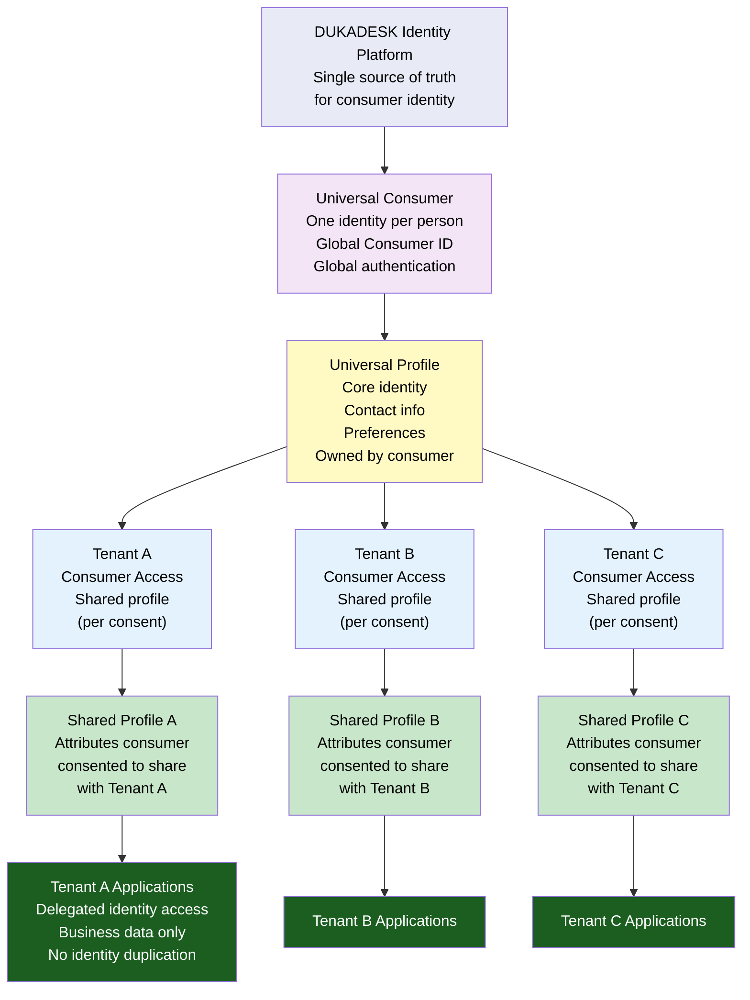
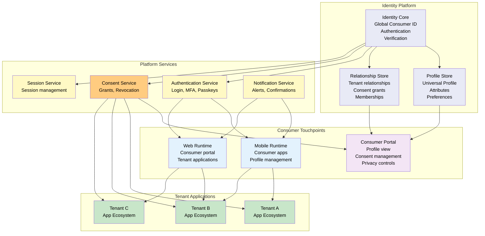
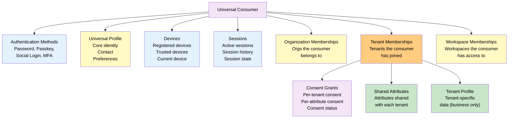
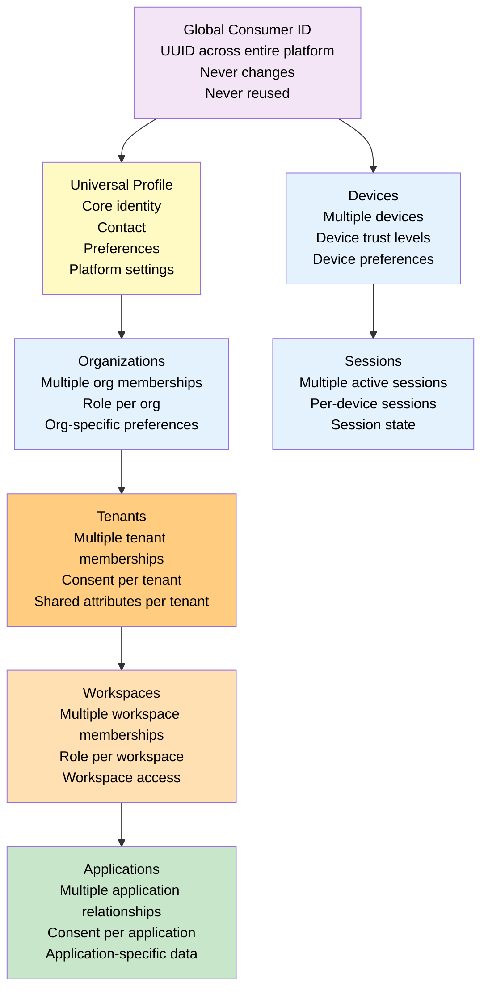
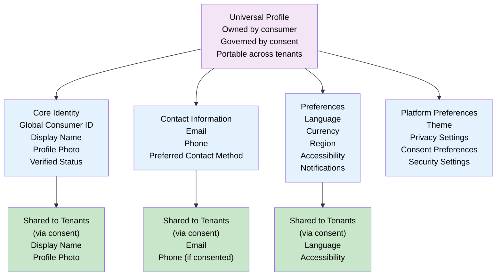
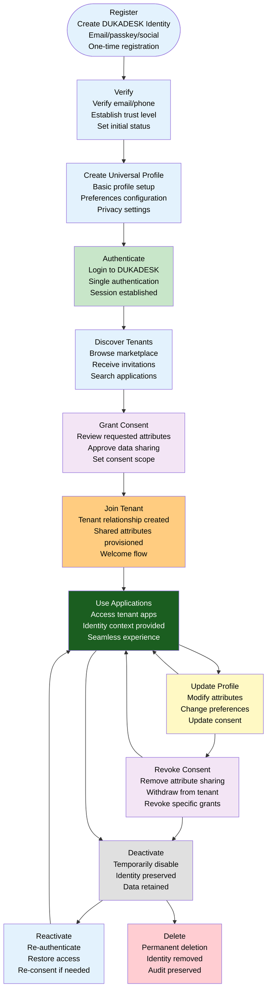
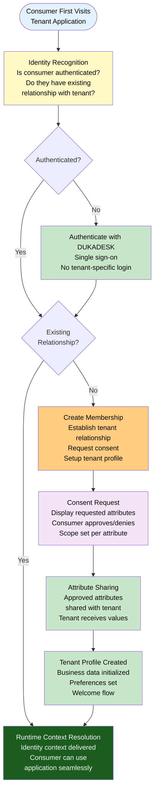
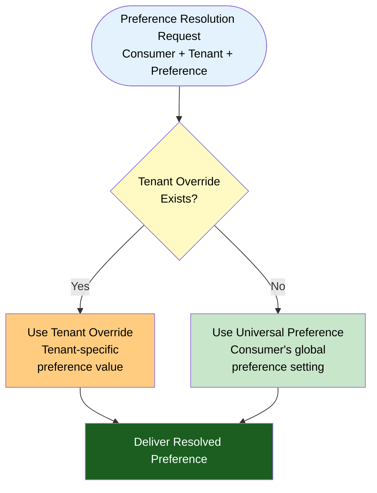
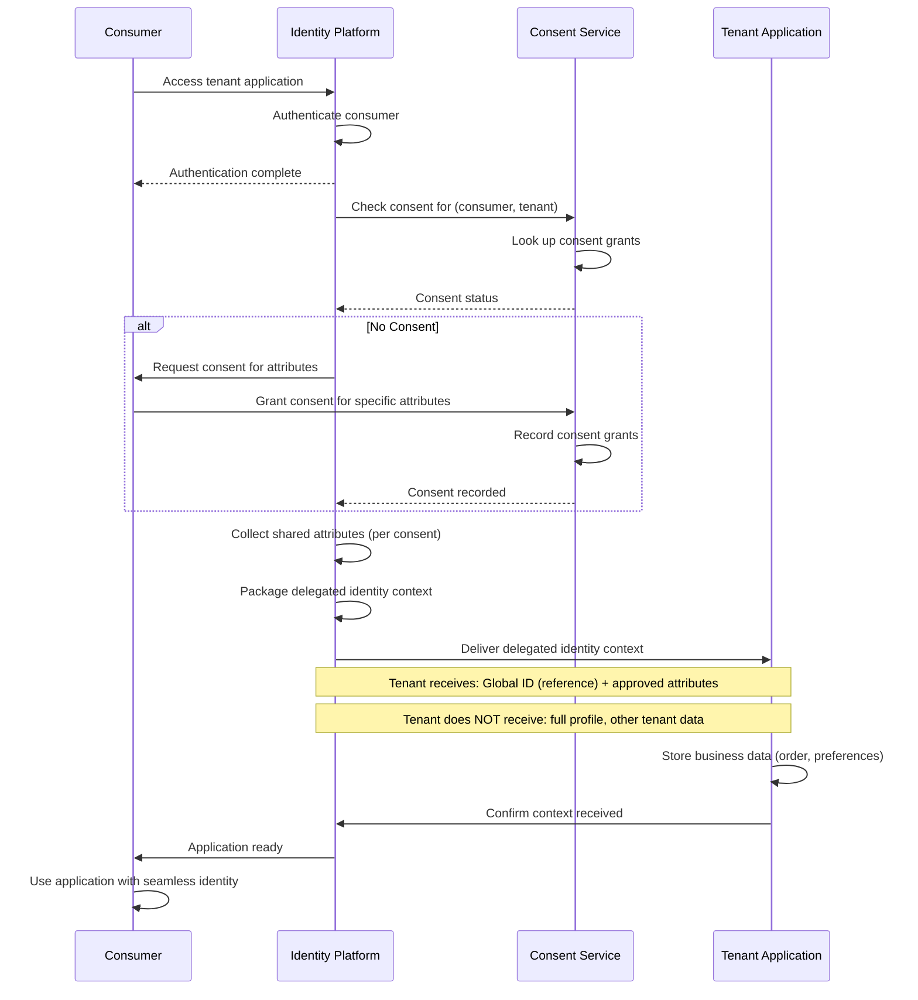

# Universal Consumer Identity Architecture

**KB-066 — Universal Consumer Identity Architecture Specification**

| Metadata | |
|----------|---|
| **KB ID** | KB-066 |
| **Title** | Universal Consumer Identity Architecture |
| **Version** | 0.1.0 |
| **Status** | Draft |
| **Owner** | Architecture Team |
| **Suite** | Identity & Access Architecture |
| **Dependencies** | KB-043 Workspace & Tenant Model, KB-057 Runtime Security Architecture, KB-063 Identity Platform Architecture, KB-064 Authentication Architecture, KB-065 Authorization & RBAC Architecture |
| **Related Documents** | KB-067 Consent & Privacy Architecture, KB-068 Session Management Architecture, KB-071 Identity Federation & Social Login (planned), KB-051 Runtime Architecture Overview, KB-060 Runtime Lifecycle Management, KB-062 Runtime Deployment & Environment |
| **Review Status** | Pending |
| **Last Updated** | 2026-07-11 |

---

### Revision History

| Version | Date | Author | Change |
|---------|------|--------|--------|
| 0.1.0 | 2026-07-11 | AI Architecture Agent | Initial draft |

---

## 1. Executive Summary

### 1.1 Purpose

This document defines the Universal Consumer Identity Architecture for the DUKADESK Platform. It formalizes one of DUKADESK's core differentiators:

> **One Consumer. One Identity. Unlimited Tenant Applications.**

Consumers create one DUKADESK Identity and can seamlessly access any participating tenant application without creating another account. Tenant applications never own consumer identities — instead, they receive delegated access to the user's identity and approved profile information after explicit user consent.

This document defines the Universal Consumer Profile, cross-tenant identity resolution, delegated consumer access, identity portability, profile ownership, consent-aware profile sharing, and lifecycle management. It formalizes the platform's biggest user experience advantage: one registration for the entire ecosystem, no repeated sign-up across tenant applications, complete user ownership of identity, explicit revocable consent-driven data sharing, and strict tenant isolation while enabling seamless consumer experiences.

### 1.2 Scope

**In scope:**

- Architectural principles: One Consumer Identity, Consumer Owns Their Identity, Applications Never Own Users, Consent Before Sharing, Privacy by Design, Tenant Isolation, Portable Identity, Vendor Independence, Identity Persistence, Explicit Consumer Control
- Canonical definitions: Universal Consumer, Universal Profile, Consumer Identity, Identity Owner, Consumer Membership, Tenant Relationship, Delegated Access, Consumer Context, Profile Attribute, Shared Attribute, Consumer Preference, Identity Portability
- Universal Identity Architecture: DUKADESK Identity Platform with Universal Consumer, Universal Profile, and tenant-specific Consumer Access with Shared Profile
- Universal Consumer Model: Single Global Identity, Global Consumer ID, Universal Profile, Multiple Tenant/Organization/Workspace/Application/Device/Session relationships
- Universal Profile Model: Core Identity, Contact Information, Preferences, Platform Preferences
- Consumer Identity Lifecycle: Register, Verify, Create Profile, Authenticate, Grant Consent, Join Tenant, Use Applications, Update Profile, Revoke Consent, Deactivate
- Consumer to Tenant Relationship: First Visit, Identity Recognition, Membership Creation, Consent Request, Attribute Sharing, Tenant Profile Creation, Runtime Context Resolution
- Cross-Tenant Identity Resolution: recognizing same consumer across applications, tenants, organizations, devices, sessions without duplicating accounts
- Universal Preferences: Language, Theme, Accessibility, Notifications, Privacy, Security — with tenant overrides
- Tenant Consumer Profile distinction: Universal vs Tenant-scoped data
- Delegated Identity Model: Identity Delegation, Claims, Shared Attributes, Attribute Filtering, Revocation, Synchronization
- Responsibilities: Runtime, Identity Platform, Tenant, Backend
- Security, Privacy, Performance, Observability
- Failure scenarios, anti-patterns, and future evolution

**Out of scope:**

- Implementation details of specific identity provider technologies
- Application-specific consumer data models
- Business logic for tenant applications
- Consent management implementation details (handled by KB-067)

---

## 2. Architectural Principles

### 2.1 One Consumer Identity

Every consumer has exactly one DUKADESK Identity. There are no per-tenant accounts, no per-application accounts, no duplicate identities. One identity spans the entire ecosystem — across all organizations, tenants, workspaces, applications, devices, and sessions.

### 2.2 Consumer Owns Their Identity

The consumer owns their identity and profile data. The Identity Platform acts as a custodian, not an owner. The consumer controls what data is collected, what is shared, with whom it is shared, and when it is deleted.

### 2.3 Applications Never Own Users

Tenant applications never own consumer identities. Applications receive delegated access to identity data through consent. They store application-specific business data but never duplicate or replace the Universal Identity.

### 2.4 Consent Before Sharing

Identity data is shared with tenant applications only after explicit consumer consent. Consent is per-attribute, per-tenant, per-purpose. Consent is revocable at any time. No identity data crosses into a tenant application without consent.

### 2.5 Privacy by Design

Privacy is embedded into the Universal Consumer Identity from inception. Data minimization, purpose limitation, storage limitation, and user control are architectural requirements, not afterthoughts.

### 2.6 Tenant Isolation

Consumer identity data in one tenant is strictly isolated from another tenant. Cross-tenant identity recognition occurs only through the Identity Platform, never through shared data stores or tenant-to-tenant communication.

### 2.7 Portable Identity

The consumer's identity and profile are portable across the entire DUKADESK ecosystem. A consumer can move between organizations, tenants, and applications while carrying their Universal Profile, preferences, and identity relationships.

### 2.8 Vendor Independence

The Universal Consumer Identity is independent of any specific identity provider, authentication mechanism, or tenant application. Tenants cannot lock consumers into their identity silo.

### 2.9 Identity Persistence

The consumer's identity persists across device changes, application uninstalls, tenant departures, and session expirations. Identity is not tied to any specific device, application, or tenant relationship.

### 2.10 Explicit Consumer Control

Consumers have explicit control over their identity. They can view what data is stored, see which tenants have access to which attributes, modify or delete their data, and export their complete profile.

---

## 3. Canonical Definitions

### 3.1 Universal Consumer

A person who uses DUKADESK tenant applications. The Universal Consumer has exactly one identity, one Universal Profile, and relationships to zero or more tenants, organizations, and workspaces. The Universal Consumer is the single representation of that person across the entire ecosystem.

### 3.2 Universal Profile

The canonical set of identity attributes that belongs to the Universal Consumer. The Universal Profile contains core identity data, contact information, preferences, and platform settings. The profile is owned by the consumer and shared with tenants through consent.

### 3.3 Consumer Identity

The unique, persistent representation of a Universal Consumer within the DUKADESK Identity Platform. The Consumer Identity has a Global Consumer ID, authentication factors, a Universal Profile, and a set of tenant relationships.

### 3.4 Identity Owner

The person who owns the identity data. The Identity Owner (the consumer) has full rights over their identity — view, modify, share, revoke, export, and delete. No other entity can exercise ownership rights over the consumer's identity.

### 3.5 Consumer Membership

A relationship between a Universal Consumer and a Tenant, Organization, or Workspace. Consumer Membership defines the consumer's role, consent status, and relationship metadata within that entity.

### 3.6 Tenant Relationship

The specific relationship between a Universal Consumer and a Tenant. The Tenant Relationship includes the membership status, consent grants, shared attributes, and tenant-specific profile data.

### 3.7 Delegated Access

The mechanism by which a tenant application receives access to a consumer's identity data. Delegated Access is granted through consent, scoped to specific attributes, and revocable by the consumer. The tenant never owns the identity — it only has delegated access.

### 3.8 Consumer Context

The resolved set of identity information available to a Runtime when a consumer accesses a tenant application. Consumer Context includes the Global Consumer ID, shared profile attributes (per consent), tenant membership, session, and device.

### 3.9 Profile Attribute

A single piece of information in the Universal Profile. Examples: display name, email, preferred language. Each attribute has a privacy classification (public, protected, private) and can be shared with tenants through consent.

### 3.10 Shared Attribute

A Profile Attribute that the consumer has consented to share with a specific tenant. Shared Attributes are the only identity data the tenant may access. The tenant receives the current value of the attribute at the time of access.

### 3.11 Consumer Preference

A configurable setting that governs the consumer's experience across the platform. Preferences include language, theme, accessibility, notification, privacy, and security preferences. Preferences are set at the Universal level with optional tenant overrides.

### 3.12 Identity Portability

The capability of a consumer to move their identity and profile between organizations, tenants, and devices without data loss or re-registration. Portability is enabled by the Universal Identity Model.

---

## 4. Universal Identity Architecture

### 4.1 Architecture Diagram



### 4.2 Universal Identity Ecosystem



### 4.3 Consumer Identity Dependency Graph



---

## 5. Universal Consumer Model

### 5.1 Identity Model



### 5.2 Model Characteristics

| Aspect | Universal Consumer | Tenant-Specific Consumer |
|--------|-------------------|--------------------------|
| **Identity scope** | Platform-wide | Tenant-scoped |
| **Identifier** | Global Consumer ID | Tenant-specific reference (maps to Global ID) |
| **Profile ownership** | Consumer | Tenant (business data only) |
| **Profile persistence** | Permanent (until deletion) | Linked to tenant relationship |
| **Authentication** | Platform-level | Delegated (via platform) |
| **Consent** | Centralized per tenant | N/A (tenant stores no identity data) |
| **Portability** | Full — moves across tenants | None — scoped to one tenant |
| **Deletion** | Consumer-controlled | Tenant-controlled (business data only) |

---

## 6. Universal Profile Model

### 6.1 Profile Structure



### 6.2 Profile Attribute Definitions

| Attribute | Type | Classification | Required | Shared to Tenants |
|-----------|------|---------------|----------|-------------------|
| **Global Consumer ID** | UUID | System | Yes | No (never shared) |
| **Display Name** | String | Protected | Yes | Via consent |
| **Profile Photo** | URL | Protected | No | Via consent |
| **Email** | String | Private | Yes | Via consent |
| **Phone** | String | Private | No | Via consent |
| **Preferred Contact Method** | Enum | Private | No | Via consent |
| **Language** | Locale | Protected | Yes (default) | Via consent |
| **Currency** | ISO 4217 | Protected | No | Via consent |
| **Region** | ISO 3166 | Protected | No | Via consent |
| **Accessibility** | Object | Protected | No | Via consent |
| **Notification Preferences** | Object | Private | No | No (tenant-specific) |
| **Theme** | Enum | Public | No | No |
| **Privacy Settings** | Object | Private | No | No |
| **Consent Preferences** | Object | System | No | No |
| **Security Settings** | Object | Private | No | No |

### 6.3 Attribute Privacy Classifications

| Classification | Description | Examples | Access |
|---------------|-------------|----------|--------|
| **System** | Internal platform attributes, never exposed externally | Global Consumer ID, Consent records | Platform only |
| **Public** | Visible to anyone | Theme preference | Any authenticated request |
| **Protected** | Visible to tenant with consent | Display Name, Language | Tenant with consent |
| **Private** | Visible only to consumer and platform | Email, Phone, Security settings | Consumer and platform only |

### 6.4 Universal vs Tenant Profile Comparison

```mermaid
flowchart TB
    subgraph "Universal Profile"
        UP_ID["Global Consumer ID\nNever shared with tenants"]
        UP_NAME["Display Name\nShared via consent"]
        UP_EMAIL["Email\nShared via consent"]
        UP_LANG["Language\nShared via consent"]
        UP_THEME["Theme\nPlatform-wide setting"]
        UP_PRIVACY["Privacy Settings\nPlatform-wide governance"]
    end

    subgraph "Tenant A Profile"
        TA_ID["Tenant Reference ID\nMaps to Global ID\nNot identity data"]
        TA_ORDERS["Order History\nBusiness data\nOwned by tenant"]
        TA_FAVORITES["Favorites\nBusiness data\nOwned by tenant"]
        TA_PREFS["Tenant Preferences\nOverride universal\nwithin this tenant"]
        TA_LOYALTY["Loyalty Points\nBusiness data\nOwned by tenant"]
    end

    subgraph "Tenant B Profile"
        TB_ID["Tenant Reference ID\nMaps to Global ID"]
        TB_APPOINTMENTS["Appointments\nBusiness data"]
        TB_MEDICAL["Medical Records\nBusiness data"]
        TB_PREFS2["Tenant Preferences\nOverride universal"]
        TB_SUBSCRIPTION["Subscription\nBusiness data"]
    end

    UP_NAME -.->|"Shared (consent)"| TA_ID
    UP_EMAIL -.->|"Shared (consent)"| TA_ID
    UP_LANG -.->|"Shared (consent)"| TA_ID

    UP_NAME -.->|"Shared (consent)"| TB_ID
    UP_EMAIL -.->|"Shared (consent)"| TB_ID

    style UP_ID fill:#e8eaf6,color:#000
    style UP_NAME fill:#fff9c4,color:#000
    style UP_EMAIL fill:#fff9c4,color:#000
    style UP_LANG fill:#fff9c4,color:#000
    style UP_THEME fill:#e3f2fd,color:#000
    style UP_PRIVACY fill:#e3f2fd,color:#000
    style TA_ID fill:#c8e6c9,color:#000
    style TA_ORDERS fill:#c8e6c9,color:#000
    style TA_FAVORITES fill:#c8e6c9,color:#000
    style TA_PREFS fill:#c8e6c9,color:#000
    style TA_LOYALTY fill:#c8e6c9,color:#000
    style TB_ID fill:#ffe0b2,color:#000
    style TB_APPOINTMENTS fill:#ffe0b2,color:#000
    style TB_MEDICAL fill:#ffe0b2,color:#000
    style TB_PREFS2 fill:#ffe0b2,color:#000
    style TB_SUBSCRIPTION fill:#ffe0b2,color:#000
```



---

## 7. Consumer Identity Lifecycle

### 7.1 Lifecycle Diagram



### 7.2 Lifecycle States

| State | Description | Consumer Actions | Platform Actions |
|-------|-------------|-----------------|------------------|
| **Registered** | Identity created, not yet verified | Set up profile, authentication factors | Create identity record, send verification |
| **Verified** | Primary factor verified | Full platform access, discover tenants | Enable full access, mark identity verified |
| **Profile Complete** | Universal Profile created | Set preferences, configure privacy | Store profile, prepare for consent |
| **Tenant Relationship Active** | Consumer has joined tenant(s) | Use tenant applications | Provide identity context, enforce consent |
| **Consent Modified** | Consumer updated consent grants | Review and modify sharing | Update consent records, notify tenants |
| **Deactivated** | Identity temporarily disabled | No platform access | Preserve data, block authentication |
| **Deleted** | Identity permanently removed | No platform access | Purge data (except audit), retire ID |

---

## 8. Consumer to Tenant Relationship

### 8.1 Relationship Flow



### 8.2 Relationship Characteristics

| Aspect | First Visit | Returning Consumer | Cross-Tenant |
|--------|-------------|-------------------|--------------|
| **Authentication** | Required (SSO) | Session-based | Session-based (same session) |
| **Identity recognition** | New relationship | Existing relationship | Recognized across tenants |
| **Consent** | Required (first time) | Load existing consent | Independent per tenant |
| **Shared attributes** | Setup initial sharing | Load from consent | Different per tenant |
| **Tenant profile** | Created | Loaded | Independent per tenant |
| **User experience** | Welcome, consent flow | Direct to application | Seamless switch |

### 8.3 Runtime Context Resolution

When a consumer accesses a tenant application, the Runtime resolves identity context through:

1. **Authenticate**: Consumer authenticated at platform level (session or re-auth)
2. **Resolve tenant relationship**: Look up consumer's membership in this tenant
3. **Load consent grants**: Retrieve consent grants for this consumer-tenant pair
4. **Load shared attributes**: Retrieve Universal Profile attributes permitted by consent
5. **Load tenant profile**: Retrieve tenant-specific business data
6. **Assemble Consumer Context**: Combine identity, shared attributes, and tenant profile
7. **Deliver to application**: Provide scoped identity context to the application

---

## 9. Cross-Tenant Identity Resolution

### 9.1 Resolution Model

```mermaid
flowchart TB
    CONSUMER["Universal Consumer\nGlobal Consumer ID: uuid-xxx"]
    CONSUMER --> AUTH["Platform Authentication\nSingle login\nSession established"]

    AUTH --> TENANT_A["Tenant A\nAccess application A"]
    AUTH --> TENANT_B["Tenant B\nAccess application B"]

    TENANT_A --> RESOLVE_A["Context Resolution A\nLookup Tenant A relationship\nLoad consent grants\nDeliver shared attributes"]

    TENANT_B --> RESOLVE_B["Context Resolution B\nLookup Tenant B relationship\nLoad consent grants\nDeliver shared attributes"]

    RESOLVE_A --> APP_A_RENDER["Application A\nSeamless experience\nNo re-authentication\nTenant-specific context"]
    RESOLVE_B --> APP_B_RENDER["Application B\nSeamless experience\nNo re-authentication\nTenant-specific context"]

    CONSUMER -.->|"Same identity"| APP_A_RENDER
    CONSUMER -.->|"Same identity"| APP_B_RENDER

    note over TENANT_A, TENANT_B: Consumer is recognized across tenants\nas the same identity\nwith no shared tenant data

    style CONSUMER fill:#f3e5f5,color:#000
    style AUTH fill:#c8e6c9,color:#000
    style TENANT_A fill:#e3f2fd,color:#000
    style TENANT_B fill:#ffe0b2,color:#000
    style RESOLVE_A fill:#e3f2fd,color:#000
    style RESOLVE_B fill:#ffe0b2,color:#000
    style APP_A_RENDER fill:#c8e6c9,color:#000
    style APP_B_RENDER fill:#ffcc80,color:#000
```

### 9.2 Resolution Across Boundaries

| Boundary | Resolution Mechanism | Cross-Boundary Data Flow |
|----------|---------------------|--------------------------|
| **Across applications** | Same consumer ID, same session | No data flows — applications get separate contexts |
| **Across tenants** | Same consumer ID, same or different session | No data flows — tenants are isolated |
| **Across organizations** | Same consumer ID, same or different session | No data flows — organizations are isolated |
| **Across devices** | Same consumer ID, different session | No data flows — sessions are isolated |
| **Across sessions** | Same consumer ID, different session | No data flows — each session has independent context |

### 9.3 No Duplicate Accounts

The fundamental guarantee of cross-tenant identity resolution:

- When a consumer authenticates and accesses Tenant A, then Tenant B, the Identity Platform recognizes them as the **same person**
- Tenant A and Tenant B each receive **independent, tenant-scoped identity contexts**
- Neither tenant can see the consumer's activity or data in the other tenant
- The consumer does not need to register again for Tenant B
- The consumer does not need to create a separate account

---

## 10. Universal Preferences

### 10.1 Preference Model

| Preference | Universal Default | Tenant Override | Inheritance | Persistence |
|-----------|------------------|-----------------|-------------|-------------|
| **Language** | `en` (configurable) | Yes | Universal serves as default | Universal + tenant override |
| **Theme** | `system` (follow device) | No | Universal applies everywhere | Universal only |
| **Currency** | Platform default | Yes | Universal serves as default | Universal + tenant override |
| **Region** | Geo-detected | Yes | Universal serves as default | Universal + tenant override |
| **Accessibility** | None (configurable) | Yes | Universal serves as default | Universal + tenant override |
| **Notification Preferences** | Platform defaults | Yes | Fully independent per tenant | Tenant-scoped |
| **Privacy Preferences** | Conservative defaults | No | Universal applies everywhere | Universal only |
| **Security Preferences** | Platform defaults | No | Universal applies everywhere | Universal only |

### 10.2 Preference Resolution



---

## 11. Delegated Identity Model

### 11.1 Delegation Flow



### 11.2 Delegation Characteristics

| Aspect | Description |
|--------|-------------|
| **Delegation scope** | Per tenant, per attribute, per purpose |
| **Delegation duration** | Until revoked or consent expires |
| **Delegation mechanism** | Identity Platform delivers scoped context |
| **Tenant receives** | Only explicitly consented attributes |
| **Tenant never receives** | Full profile, other tenant data, authentication factors |
| **Revocation** | Consumer revokes at any time; tenant loses access |
| **Synchronization** | Shared attributes are live — tenant sees current values |

### 11.3 Identity Claims

The delegated identity context delivered to a tenant application contains Identity Claims:

| Claim | Description | Always Included | Consent Required |
|-------|-------------|----------------|-----------------|
| `sub` | Global Consumer ID (scoped reference) | Yes | No |
| `tenant_id` | Tenant ID | Yes | No |
| `auth_time` | Authentication timestamp | Yes | No |
| `aal` | Authentication assurance level | Yes | No |
| `display_name` | Consumer's display name | No | Yes |
| `email` | Consumer's email address | No | Yes |
| `phone` | Consumer's phone number | No | Yes |
| `language` | Consumer's language preference | No | Yes |
| `profile_photo` | Consumer's profile photo URL | No | Yes |

---

## 12. Responsibilities

### 12.1 Identity Platform Responsibilities

| Responsibility | Description |
|--------------|-------------|
| **Consumer identity registration** | Create unique consumer identities; prevent duplicates |
| **Universal Profile management** | Store and manage Universal Profile attributes; ensure privacy classifications |
| **Tenant relationship management** | Manage consumer-tenant relationships; record consent grants; track memberships |
| **Cross-tenant identity resolution** | Recognize the same consumer across tenants without data leakage |
| **Delegated identity delivery** | Deliver scoped identity context to tenant applications per consent |
| **Identity portability** | Ensure consumer identity is portable across the ecosystem |
| **Consumer lifecycle management** | Manage registration, verification, deactivation, and deletion |

### 12.2 Runtime Responsibilities

| Responsibility | Description |
|--------------|-------------|
| **Authentication initiation** | Initiate platform authentication for consumer access |
| **Identity context consumption** | Receive and propagate delegated identity context |
| **Consent enforcement** | Enforce consent boundaries in the Runtime |
| **Seamless cross-tenant experience** | Enable seamless navigation between tenant applications |
| **Profile update propagation** | Propagate Universal Profile updates to tenant applications where consented |

### 12.3 Tenant Responsibilities

| Responsibility | Description |
|--------------|-------------|
| **Identity delegation acceptance** | Accept delegated identity; never request or store full identity data |
| **Consent request** | Request consent for required attributes at tenant relationship creation |
| **Business data only** | Store only tenant-specific business data; never duplicate Universal Profile |
| **Preference override handling** | Handle tenant-specific preference overrides within the tenant scope |
| **Consent revocation handling** | Honor consent revocation — stop using shared attributes when consent is revoked |

### 12.4 Backend Responsibilities

| Responsibility | Description |
|--------------|-------------|
| **Identity claim verification** | Verify identity claims from Runtime requests |
| **Tenant data isolation** | Ensure tenant business data is isolated from other tenants |
| **Consent audit** | Audit consent-related events for compliance |
| **Profile synchronization** | Synchronize shared attribute updates to tenant applications where consented |

---

## 13. Security

### 13.1 Consumer Identity Isolation

| Control | Description |
|---------|-------------|
| **Identity-level isolation** | Consumer identity data is isolated at the platform level, never accessible to tenants directly |
| **Tenant-scoped references** | Tenants receive scoped references (not the Global Consumer ID) for their records |
| **Cross-tenant blocking** | No mechanism exists for one tenant to access another tenant's consumer data |
| **Authentication separation** | Consumer authentication is platform-level, not tenant-level |

### 13.2 Cross-Tenant Protection

| Protection | Description |
|------------|-------------|
| **No cross-tenant queries** | The Identity Platform does not support queries that cross tenant boundaries |
| **Independent consent** | Consent in one tenant does not imply consent in another |
| **Independent sharing** | Attributes shared with one tenant are not shared with another unless separately consented |
| **Activity isolation** | Consumer activity in one tenant is invisible to other tenants |

### 13.3 Identity Integrity

| Control | Description |
|---------|-------------|
| **Immutable Global ID** | Global Consumer ID is immutable after creation |
| **Verification at registration** | Email/phone verification before full access |
| **Change audit** | All profile changes are audited |
| **Conflict detection** | Duplicate identity detection at registration |

### 13.4 Profile Protection

| Control | Description |
|---------|-------------|
| **Encryption at rest** | Universal Profile data encrypted at rest |
| **Encryption in transit** | All profile data encrypted in transit |
| **Attribute-level access control** | Access to each attribute is controlled by privacy classification and consent |
| **No bulk export** | No bulk export of consumer profiles |

### 13.5 Delegated Access Validation

| Control | Description |
|---------|-------------|
| **Consent verification** | Every delegated access delivery verifies current consent status |
| **Attribute freshness** | Shared attributes are current values at time of delivery |
| **Tenant authentication** | Tenant applications authenticate before receiving delegated context |
| **Revocation propagation** | Consent revocation is propagated to tenants within seconds |

---

## 14. Privacy

### 14.1 User Ownership

Consumers own their identity data. The Identity Platform and tenant applications are custodians with delegated access. Ownership means:
- Consumers control what data is collected at registration
- Consumers control which attributes are shared with which tenants
- Consumers can modify or delete their data at any time
- Consumers can export their complete profile

### 14.2 Right to Revoke

Consumers can revoke consent at any time:
- **Attribute-level revocation**: Stop sharing a specific attribute with a specific tenant
- **Tenant-level revocation**: Withdraw from a tenant entirely
- **Platform-level revocation**: Delete their entire identity

Revocation is:
- **Immediate**: Takes effect within seconds
- **Auditable**: Every revocation is recorded
- **Notified**: Affected tenants are notified
- **Reversible**: Consumers can re-consent

### 14.3 Attribute Minimization

Tenants request only the attributes they need for their application. The Identity Platform enforces attribute minimization:
- Tenants declare required attributes in their application manifest
- Consumers see exactly which attributes are requested and why
- Consumers can deny specific attributes while granting others
- Tenants cannot request attributes they do not have a declared purpose for

### 14.4 Consent-Based Sharing

All attribute sharing is consent-based:
- No attributes are shared without explicit consumer consent
- Consent is per attribute, per tenant, per purpose
- Consent is revocable independently per tenant
- Consent has an optional expiration

### 14.5 Tenant Data Separation

| Data Category | Stored By | Accessible By | Example |
|---------------|-----------|---------------|---------|
| **Universal Profile** | Identity Platform | Consumer, Platform | Display name, email |
| **Shared Attributes** | Identity Platform (source) / Tenant (cached) | Both (per consent) | Language preference |
| **Tenant Business Data** | Tenant | Tenant, Consumer (within tenant) | Order history, favorites |
| **Tenant Activity** | Tenant | Tenant | Login history, usage |

### 14.6 Privacy Boundaries

| Boundary | Enforced By | Data Protected |
|----------|-------------|----------------|
| **Platform to Tenant** | Consent Service | Universal Profile data not consented |
| **Tenant to Tenant** | Identity Platform | All cross-tenant data |
| **Organization to Organization** | Identity Platform | Organization-scoped membership data |
| **Consumer to Platform** | Privacy controls | Private profile attributes |

---

## 15. Performance

| Operation | Target Latency | Caching Strategy | Scaling |
|-----------|---------------|------------------|---------|
| **Consumer identity lookup** | < 50ms | Identity cache (Global ID) | Horizontal scaling |
| **Universal Profile resolution** | < 50ms | Profile cache per consumer | Horizontal scaling |
| **Tenant relationship lookup** | < 30ms | Relationship cache per consumer-tenant | Horizontal scaling |
| **Consent grant resolution** | < 20ms | Consent cache per consumer-tenant | Horizontal scaling |
| **Shared attribute assembly** | < 30ms | Attribute cache per consumer | Horizontal scaling |
| **Full delegated context delivery** | < 150ms | Context cache per session | Horizontal scaling |
| **Cross-tenant identity recognition** | < 50ms | Session cache | Local to Runtime |
| **Profile update propagation** | < 1s (soft), < 5s (hard) | Event-driven | Event bus |

---

## 16. Observability

### 16.1 Registration Metrics

| Metric | Type | Source | Aggregation |
|--------|------|-------|-------------|
| `consumer.registration.count` | Counter | Registration Service | Rate, total |
| `consumer.registration.success` | Counter | Registration Service | Rate, total |
| `consumer.registration.failure` | Counter | Registration Service | Rate, total, by reason |
| `consumer.registration.verification` | Counter | Verification Service | Rate, completion |

### 16.2 Consumer Growth Metrics

| Metric | Type | Source | Aggregation |
|--------|------|-------|-------------|
| `consumer.total` | Gauge | Identity Store | Total registered |
| `consumer.verified` | Gauge | Identity Store | Percentage verified |
| `consumer.active` | Gauge | Session Store | Currently active |
| `consumer.tenant.memberships` | Gauge | Relationship Store | Avg per consumer |

### 16.3 Tenant Adoption Metrics

| Metric | Type | Source | Aggregation |
|--------|------|-------|-------------|
| `tenant.consumer.count` | Gauge | Relationship Store | Per tenant |
| `tenant.consumer.new` | Counter | Relationship Store | Rate, per tenant |
| `tenant.consumer.churn` | Counter | Relationship Store | Rate, per tenant |
| `tenant.consent.conversion` | Gauge | Consent Store | Consent grant rate |

### 16.4 Identity Resolution Metrics

| Metric | Type | Source | Aggregation |
|--------|------|-------|-------------|
| `consumer.resolution.duration` | Timer | Resolution Service | Avg, p95 |
| `consumer.resolution.cache.hit` | Counter | Resolution Service | Hit rate |
| `consumer.resolution.cache.miss` | Counter | Resolution Service | Miss rate |
| `consumer.context.assembly.duration` | Timer | Context Assembly | Avg, p95 |

---

## 17. Failure Scenarios

### 17.1 Duplicate Consumer

| Scenario | Detection | Response | Recovery |
|----------|-----------|----------|----------|
| Consumer attempts to register with email that already exists | Registration check | Block registration; prompt for login | Consumer logs in with existing identity |
| Duplicate identity created (race condition) | Periodic deduplication | Flag for merge; block secondary | Automated or manual merge |

### 17.2 Identity Collision

| Scenario | Detection | Response | Recovery |
|----------|-----------|----------|----------|
| Two consumers claim same email | Verification | Block second registration; verify ownership | Authenticate through verified email |
| Social login returns conflicting identity claim | Linking check | Block link; prompt for verification | Verify ownership of both accounts |

### 17.3 Missing Consent

| Scenario | Detection | Response | Recovery |
|----------|-----------|----------|----------|
| Tenant requests identity context without consent | Consent check | Return limited or null context; prompt for consent | Consumer grants consent |
| Consent expired but tenant still using data | Consent expiry check | Revoke tenant access; notify tenant | Consumer re-consents if desired |

### 17.4 Tenant Profile Corruption

| Scenario | Detection | Response | Recovery |
|----------|-----------|----------|----------|
| Tenant stores identity data it should not | Periodic audit | Flag tenant violation; revoke delegated access | Tenant removes unauthorized data |
| Tenant reference ID becomes orphaned | Relationship check | Flag orphaned record; attempt re-link | Re-establish tenant relationship |

### 17.5 Cross-Tenant Identity Leak

| Scenario | Detection | Response | Recovery |
|----------|-----------|----------|----------|
| Identity Platform inadvertently delivers cross-tenant data | Context assembly validation | Block context delivery; log security event | Investigate; fix context assembly |
| Tenant attempts to query another tenant's consumer data | Authorization check | Block request; log security event | Revoke tenant API access |

### 17.6 Invalid Membership

| Scenario | Detection | Response | Recovery |
|----------|-----------|----------|----------|
| Consumer membership refers to deleted tenant | Relationship validation | Flag as invalid; remove membership | Admin reconciles or consumer re-joins |
| Consumer membership has inconsistent role | Relationship validation | Log warning; default to lowest role | Admin corrects role assignment |

### 17.7 Profile Synchronization Failure

| Scenario | Detection | Response | Recovery |
|----------|-----------|----------|----------|
| Consumer updates Universal Profile, tenant not notified | Sync monitoring | Queue update for retry; log failure | Retry sync; escalate if persistent |
| Tenant rejects profile update (schema mismatch) | Sync validation | Log rejection; alert tenant | Tenant updates schema to accept new attributes |

---

## 18. Anti-patterns

### 18.1 Per-Tenant Consumer Accounts

**Anti-pattern:** Each tenant maintains its own consumer accounts, separate from the Universal Identity.

**Why it is harmful:** Forces consumers to register separately for every tenant, fragments the consumer's identity, creates duplicate profiles, and violates the One Consumer Identity principle.

**Correct approach:** One Universal Identity per consumer. Tenant relationships are memberships on the same identity.

### 18.2 Duplicate Consumer Registration

**Anti-pattern:** Allowing a consumer to register multiple times with the same identity attributes.

**Why it is harmful:** Creates duplicate identities, fragments profile data, makes cross-tenant recognition impossible, and violates privacy.

**Correct approach:** Exactly one registration per consumer. Duplicate detection at registration. Prompt for login if identity already exists.

### 18.3 Tenant-Owned Identity

**Anti-pattern:** Tenants claiming ownership of consumer identity data, storing full profiles, or using identity data for purposes beyond the original consent.

**Why it is harmful:** Violates consumer ownership, creates regulatory liability, and enables unauthorized data use.

**Correct approach:** The Identity Platform owns identity data. Tenants have delegated access per consent for specific purposes only.

### 18.4 Shared Tenant Databases

**Anti-pattern:** Multiple tenants sharing a database that contains consumer identity data.

**Why it is harmful:** Creates cross-tenant data leakage risk, violates tenant isolation, and makes data governance impossible.

**Correct approach:** Each tenant has isolated data storage. Cross-tenant identity data access is impossible.

### 18.5 Hidden Profile Synchronization

**Anti-pattern:** Synchronizing Universal Profile data to tenants without the consumer's knowledge or explicit consent.

**Why it is harmful:** Violates consent, violates privacy, creates regulatory liability, and undermines consumer trust.

**Correct approach:** All profile synchronization is consent-based. Consumers know exactly what is shared and with whom.

### 18.6 Unauthorized Profile Copying

**Anti-pattern:** Tenants copying Universal Profile attributes into their own data stores for indefinite use.

**Why it is harmful:** Prevents effective consent revocation (tenant still has the data), violates data minimization, and creates data synchronization issues.

**Correct approach:** Tenants reference shared attributes from the Identity Platform rather than copying them. If revocation occurs, the tenant loses access.

### 18.7 Permanent Attribute Sharing

**Anti-pattern:** Granting permanent, irrevocable consent for attribute sharing.

**Why it is harmful:** Violates the consumer's right to revoke, creates privacy risk, and is non-compliant with privacy regulations.

**Correct approach:** All consent is revocable. Attribute sharing can have expiration. Consumers can modify consent at any time.

---

## 19. Future Evolution

### 19.1 Portable Identity Wallets

Future consumers may manage their identity through personal identity wallets — client-side applications that store Universal Profile data, consent grants, and credentials. The Identity Platform interacts with wallets through standardized protocols, giving consumers direct control over their identity data.

### 19.2 Decentralized Identity (DID)

Future Universal Consumer Identity may support Decentralized Identifiers (DIDs), enabling consumers to control their identity independent of any platform. The Identity Platform would verify DIDs and map them to Universal Identities.

### 19.3 Verifiable Credentials

Future consumers may present Verifiable Credentials — cryptographically signed claims issued by trusted authorities — as part of their Universal Profile. Credentials could include verified age, professional certifications, or membership proofs that tenants can verify without contacting the issuer.

### 19.4 Consumer Identity Export

Future consumers may export their complete identity profile in a portable format for use outside the DUKADESK ecosystem. Export includes profile attributes, consent history, and tenant relationship metadata.

### 19.5 Cross-Platform Identity

Future Universal Consumer Identity may extend beyond DUKADESK through cross-platform identity federation. Consumers would use their DUKADESK identity at partner platforms and vice versa.

### 19.6 AI Personal Identity Agents

Future consumers may delegate identity management to AI agents that manage consent, monitor data sharing, detect privacy violations, and automatically adjust privacy settings on the consumer's behalf.

---

## 20. Cross-References

| Reference | Document | Relationship |
|-----------|----------|-------------|
| **KB-043** | Workspace & Tenant Model | Tenant hierarchy that consumer relationships map to |
| **KB-057** | Runtime Security Architecture | Security controls for consumer identity isolation |
| **KB-063** | Identity Platform Architecture | Identity platform that hosts Universal Consumer Identity |
| **KB-064** | Authentication Architecture | Consumer authentication flows |
| **KB-065** | Authorization & RBAC Architecture | Authorization governs consumer access within tenants |
| **KB-067** | Consent & Privacy Architecture | Consent architecture for consumer attribute sharing |
| **KB-068** | Session Management Architecture | Session lifecycle for consumer sessions |
| **KB-071** | Identity Federation & Social Login (planned) | Federation for consumer social login |

---

## 21. Mermaid Diagram Index

| Diagram | Section | Description |
|---------|---------|-------------|
| Universal Identity Architecture | 4.1 | Platform-level architecture showing Universal Consumer, Profile, and per-tenant shared profiles |
| Universal Identity Ecosystem | 4.2 | Complete ecosystem with Identity Platform, consumer touchpoints, tenant applications, and platform services |
| Consumer Identity Dependency Graph | 4.3 | Complete dependency graph of consumer identity components |
| Universal Consumer Model | 5.1 | Single global identity with multiple organizations, tenants, workspaces, applications, devices, sessions |
| Universal Profile Model | 6.1 | Profile structure with Core, Contact, Preferences, Platform sections and tenant sharing |
| Universal vs Tenant Profile Comparison | 6.4 | Comparison of Universal Profile vs per-tenant business data |
| Consumer Identity Lifecycle | 7.1 | Complete lifecycle from registration through deletion |
| Consumer to Tenant Relationship Flow | 8.1 | First visit, consent, membership creation, and runtime context resolution |
| Cross-Tenant Identity Resolution | 9.1 | Same consumer recognized across different tenants without data leakage |
| Preference Resolution | 10.2 | Universal preference with optional tenant override resolution |
| Delegated Identity Flow | 11.1 | Sequence diagram of delegated identity delivery with consent |
