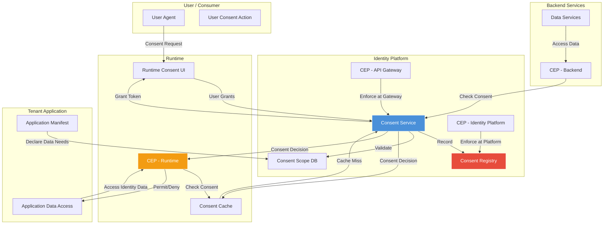
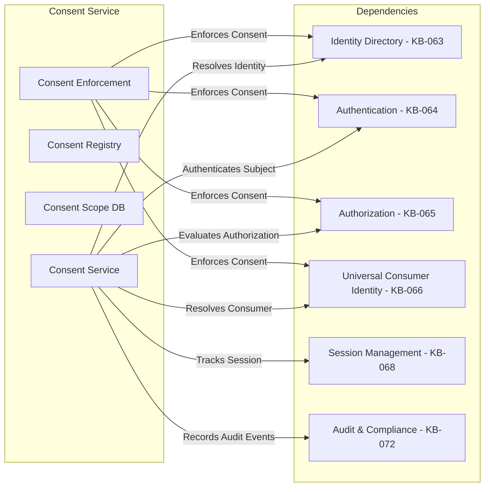
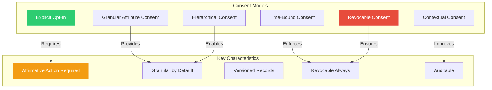
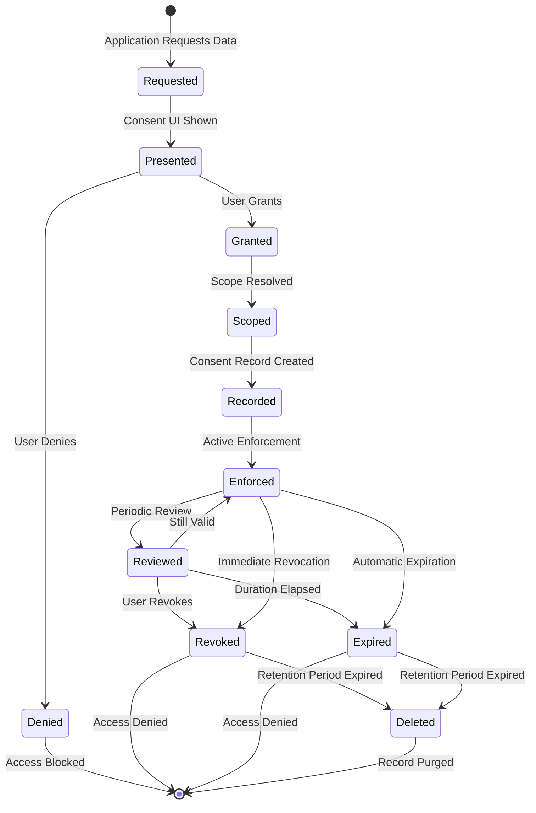
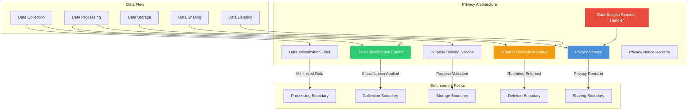
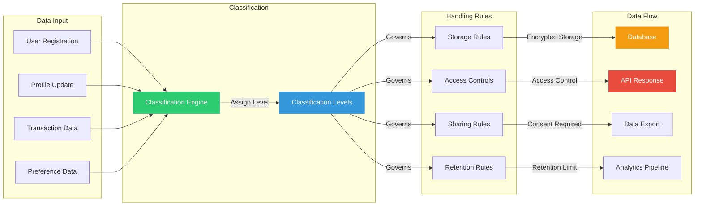
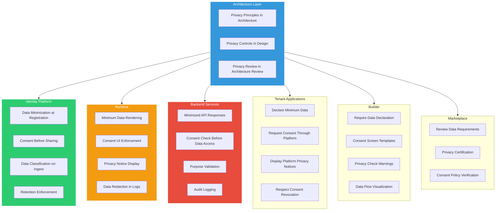
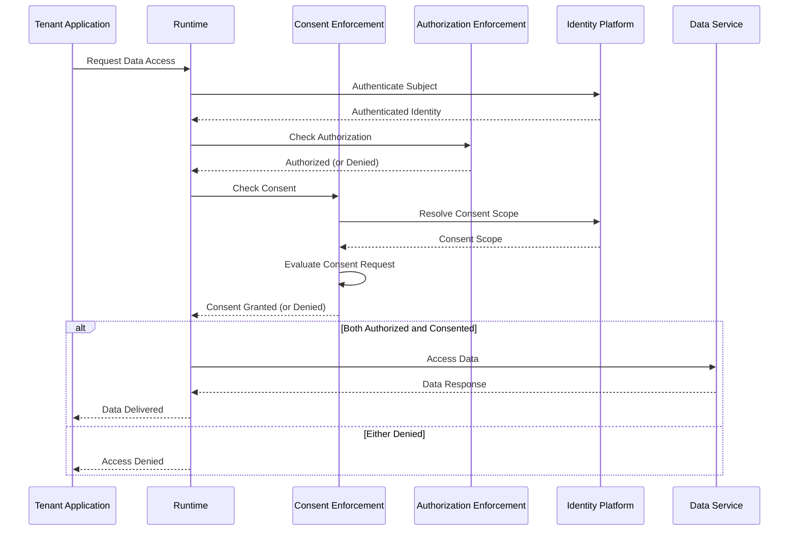
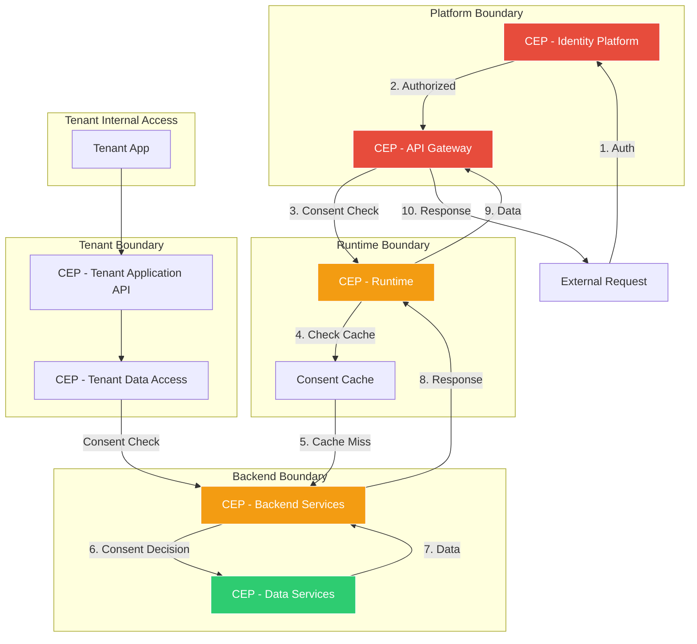

# Consent & Privacy Architecture

**KB-067 — Consent & Privacy Architecture Specification**

| Metadata | |
|----------|---|
| **KB ID** | KB-067 |
| **Title** | Consent & Privacy Architecture |
| **Version** | 0.1.0 |
| **Status** | Draft |
| **Owner** | Architecture Team |
| **Suite** | Identity & Access Architecture |
| **Dependencies** | KB-043 Workspace & Tenant Model, KB-057 Runtime Security Architecture, KB-063 Identity Platform Architecture, KB-064 Authentication Architecture, KB-065 Authorization & RBAC Architecture, KB-066 Universal Consumer Identity Architecture |
| **Related Documents** | KB-068 Session Management Architecture, KB-069 Organization, Tenant & Workspace Security, KB-070 API Security & Token Architecture, KB-071 Identity Federation & Social Login (planned), KB-072 Audit, Compliance & Identity Governance Architecture, KB-051 Runtime Architecture Overview, KB-060 Runtime Lifecycle Management, KB-062 Runtime Deployment & Environment |
| **Review Status** | Pending |
| **Last Updated** | 2026-07-11 |

---

### Revision History

| Version | Date | Author | Change |
|---------|------|--------|--------|
| 0.1.0 | 2026-07-11 | AI Architecture Agent | Initial draft |

---

## 1. Executive Summary

### 1.1 Purpose

This document defines the Consent & Privacy Architecture for the DUKADESK Platform. Consent and privacy are foundational architectural concerns, not afterthoughts or compliance checkboxes. They are enforced at every layer of the platform — from the Identity Platform through Runtime enforcement to tenant application data access.

Consent is the mechanism by which a consumer or user grants permission for an application, tenant, or platform service to access their identity data, profile attributes, or perform actions on their behalf. Consent is architecturally separate from authentication and authorization:

| Concern | Question | Independence |
|---------|----------|-------------|
| **Authentication** | Who are you? | Independent of consent and authorization |
| **Authorization** | What are you allowed to do? | Independent of authentication and consent |
| **Consent** | What did the user agree to share? | Independent of authentication and authorization |

Privacy is the architectural framework that governs how identity data is collected, processed, stored, shared, and deleted. Privacy by Design is embedded into every platform component. Data classification, data minimization, purpose limitation, and storage limitation are enforced architecturally, not through policy alone.

This document formalizes consent models, consent lifecycle, consent scope, privacy architecture, data classification, privacy by design integration, consent enforcement, data subject rights, and the boundary between consent, authorization, and privacy.

### 1.2 Scope

**In scope:**

- Architectural principles: Consent Before Data Access, Explicit Opt-In by Default, Granular Consent, Revocable Consent, Time-Bound Consent, Consent Is Not Authorization, Privacy by Design, Data Minimization, Purpose Limitation, Storage Limitation, Data Classification, Data Subject Rights, Privacy by Default, Transparency, Accountability
- Canonical definitions: Consent, Consent Grant, Consent Scope, Consent Record, Consent Revocation, Consent Expiration, Privacy, Personal Data, Sensitive Data, Data Subject, Data Controller, Data Processor, Data Processing Activity, Privacy Impact, Data Classification, Data Minimization, Purpose, Storage Limit, Data Subject Request, Data Portability, Right to Erasure, Right to Rectification, Right to Access, Privacy Notice, Privacy Preference, Opt-In, Opt-Out, Explicit Consent, Implicit Consent, Soft Consent, Granular Consent, Hierarchical Consent, Contextual Consent, Privacy by Design, Privacy by Default, Privacy Engineering
- Consent Architecture: Consent Service, Consent Registry, Consent Enforcement Point, Consent Decision, Consent Scope Resolver, Consent Revocation Service
- Consent Models: Explicit Opt-In, Granular Attribute Consent, Hierarchical Consent, Time-Bound Consent, Contextual Consent, Revocable Consent
- Consent Lifecycle: Request → Present → Grant → Scope → Record → Enforce → Review → Revoke → Expire → Delete
- Consent Scope Hierarchy: Platform, Organization, Tenant, Application, Capability, Attribute
- Consent Grant Flow: Full sequence from application request through user grant to enforcement
- Privacy Architecture: Privacy Service, Data Classification Engine, Data Minimization Filter, Purpose Binding Service, Storage Lifecycle Manager, Data Subject Request Handler, Privacy Notice Registry
- Data Classification Model: Public, Internal, Confidential, Sensitive, Personal, Regulated, Special Category
- Privacy by Design Integration: Embedding privacy into Architecture, Identity Platform, Runtime, Backend Services, Tenant Applications, Builder, Marketplace
- Data Subject Rights: Access, Rectification, Erasure, Portability, Restriction, Objection, Automated Decision-Making
- Consent & Authorization Boundary: When consent is checked vs when authorization is checked
- Consent Enforcement Points: Identity Platform, API Gateway, Runtime, Backend Services, Tenant Application Access
- Responsibilities: Identity Platform, Runtime, Tenant, Backend Services, Builder, Marketplace
- Security: Consent Integrity, Consent Record Protection, Consent Enforcement Integrity, Privacy Boundary Protection
- Performance: Consent Resolution, Consent Caching, Data Classification Overhead
- Observability: Consent Audit Trail, Privacy Compliance Monitoring, Data Subject Request Tracking
- Failure scenarios, anti-patterns, and future evolution

**Out of scope:**

- Implementation details of specific consent management frameworks, privacy compliance tools, or data protection technologies
- Legal compliance interpretation of specific regulations (GDPR, CCPA, etc.) — this document defines the architectural framework, not legal compliance advice
- Application-specific privacy notices or consent screens (handled by individual application specs)
- Data residency or sovereignty requirements (covered in KB-062 Runtime Deployment & Environment)
- Encryption key management for data protection (covered in KB-069 Organization, Tenant & Workspace Security)
- Audit logging infrastructure (covered in KB-072 Audit, Compliance & Identity Governance)
- Cookie consent or tracking consent for web applications (covered by individual application specs)

---

## 2. Architectural Principles

### 2.1 Consent Before Data Access

No identity data is shared with any application, tenant, or platform service until the user has granted explicit consent. Consent is obtained before any data access occurs. There is no grace period, implied consent, or post-hoc consent for identity data.

### 2.2 Explicit Opt-In by Default

All consent is opt-in by default. No consent is granted by default. Users must take affirmative action to grant consent. Pre-checked consent boxes, assumed consent, or opt-out models are never used for identity data sharing.

### 2.3 Granular Consent

Consent is granular, not monolithic. Users can consent to specific attributes, capabilities, or purposes independently. Consent for one attribute does not imply consent for another. Granularity is the default, not an advanced option.

### 2.4 Revocable Consent

All consent is revocable at any time. Revocation takes effect immediately for new data access requests. Existing data in transit or in use is not retroactively removed, but no new access is permitted after revocation.

### 2.5 Time-Bound Consent

Consent has an explicit duration. Time-bound consent expires automatically. Users and tenants can negotiate consent duration. Long-lived consent requires periodic re-confirmation. Expired consent is treated as revoked consent.

### 2.6 Consent Is Not Authorization

Consent governs data sharing — what data an application may access. Authorization governs action permission — what operations a subject may perform. An application may have consent to access user data but lack authorization to modify it, and vice versa. Consent and authorization are independently evaluated.

### 2.7 Privacy by Design

Privacy is embedded into the architecture of every platform component, not bolted on after implementation. Privacy requirements are addressed at design time. Data collection is minimized by default. Privacy controls are the default configuration.

### 2.8 Data Minimization

Only the minimum data necessary for a stated purpose is collected, processed, stored, or shared. Data that is not needed is not collected. Data that is collected but no longer needed is deleted. Applications declare their minimum data requirements in their manifest.

### 2.9 Purpose Limitation

Data is collected for specified, explicit, and legitimate purposes. Data is not further processed in a manner incompatible with those purposes. Purpose is recorded with every consent grant and enforced at every data access point.

### 2.10 Storage Limitation

Data is retained only for as long as necessary for its stated purpose. Retention periods are defined per data classification and purpose. Automated deletion enforces retention limits. Archival preserves data for legal hold but removes it from operational access.

### 2.11 Data Classification

All identity data is classified. Classification determines handling requirements — collection, storage, processing, sharing, retention, and deletion policies. Classification is applied at data creation time and is immutable once applied.

### 2.12 Data Subject Rights

Every user has architectural rights over their data — the right to access, rectify, erase, port, restrict, and object. These rights are enforced at the platform level, not delegated to individual applications. Data Subject Request handling is a platform capability.

### 2.13 Privacy by Default

The most privacy-protective settings are the defaults. Users explicitly choose to share more data, not to protect more data. Privacy-invasive features require explicit user enablement.

### 2.14 Transparency

Users are informed, in clear language and before consent, about what data is collected, why it is collected, how it is used, who it is shared with, and how long it is retained. Consent screens present complete information before a decision is made.

### 2.15 Accountability

The platform maintains complete records of consent grants, revocations, data access, data processing, and data sharing. Every privacy-relevant action is logged, auditable, and attributable to the responsible entity.

---

## 3. Canonical Definitions

### 3.1 Consent

A freely given, specific, informed, and unambiguous indication of the user's agreement to the processing of their personal data. Consent is expressed by a clear affirmative action.

### 3.2 Consent Grant

A recorded instance of a user granting consent for a specific scope, purpose, and duration. A consent grant is the authoritative record of permission.

### 3.3 Consent Scope

The defined boundary of a consent grant — which attributes, capabilities, applications, tenants, and purposes are covered. Scope is explicit and granular.

### 3.4 Consent Record

The persistent, tamper-evident log entry documenting a consent grant or revocation. Consent records include Who, What, When, Where, Why, Scope, Duration, and Version.

### 3.5 Consent Revocation

The user's withdrawal of a previously granted consent. Revocation takes effect immediately for new access requests and is recorded as a new consent record.

### 3.6 Consent Expiration

Automatic termination of a consent grant after its defined duration has elapsed. Expiration is enforced without requiring user action.

### 3.7 Privacy

The architectural framework governing the collection, processing, storage, sharing, and deletion of personal data in accordance with user preferences, platform principles, and regulatory requirements.

### 3.8 Personal Data

Any information relating to an identified or identifiable natural person (data subject). Personal data includes identity attributes, contact information, preferences, behavior data, and derived profiles.

### 3.9 Sensitive Data

Personal data that carries heightened privacy risk — biometric data, health information, precise location, financial account details, political opinions, religious beliefs, or other data requiring enhanced protection.

### 3.10 Data Subject

The natural person to whom personal data relates. The data subject is the identity owner — the consumer or user whose data is being processed.

### 3.11 Data Controller

The entity that determines the purposes and means of processing personal data. In the DUKADESK ecosystem, the Identity Platform is the controller for Universal Profile data. Tenant applications are controllers for tenant-scoped data they collect.

### 3.12 Data Processor

The entity that processes personal data on behalf of the controller. Platform services that handle identity data on behalf of tenants or the Identity Platform are processors.

### 3.13 Data Processing Activity

A specific operation or set of operations performed on personal data — collection, recording, organization, structuring, storage, adaptation, retrieval, consultation, use, disclosure, dissemination, alignment, combination, restriction, erasure, or destruction.

### 3.14 Data Classification

The assignment of a sensitivity level to data that determines handling, storage, sharing, and deletion requirements. Classification levels form a hierarchy from Public to Special Category.

### 3.15 Data Minimization

The principle and practice of collecting and processing only the minimum personal data necessary for a specific, stated purpose.

### 3.16 Purpose

The specific, explicit, and legitimate reason for which personal data is collected and processed. Purpose is declared before collection and enforced during processing.

### 3.17 Data Subject Request (DSR)

A formal request from a data subject to exercise their rights — access, rectification, erasure, portability, restriction, objection, or automated decision-making review.

### 3.18 Data Portability

The right of a data subject to receive their personal data in a structured, commonly used, machine-readable format and to transmit that data to another controller without hindrance.

### 3.19 Right to Erasure

The right of a data subject to have their personal data erased without undue delay, also known as the right to be forgotten.

### 3.20 Privacy by Design

An approach that embeds privacy into the design and architecture of systems and processes from the outset, rather than adding privacy controls after implementation.

### 3.21 Privacy by Default

The principle that the most privacy-protective settings are automatically applied, and users must explicitly choose to share more data or reduce privacy protections.

### 3.22 Privacy Notice

A clear, concise, and accessible statement informing data subjects about how their personal data is collected, processed, stored, shared, and protected. Privacy notices are presented at consent time and available for ongoing reference.

### 3.23 Opt-In

An affirmative action by the user to grant consent. Opt-in requires active user engagement — clicking a button, checking an unchecked box, or taking equivalent affirmative action.

### 3.24 Opt-Out

A user action to withdraw previously granted consent or decline a proposed data processing activity. Opt-out is available for non-essential processing but is never the default.

### 3.25 Explicit Consent

Consent given for specific, clearly described processing purposes. Explicit consent requires a higher standard of clarity and specificity than general consent.

### 3.26 Granular Consent

Consent that is broken down by specific data attributes, processing purposes, or sharing recipients rather than collected as a single blanket approval.

### 3.27 Hierarchical Consent

A consent structure where broad categories contain sub-categories, and a user may consent at any level of the hierarchy. Consent at a parent level does not automatically imply consent at all child levels.

### 3.28 Contextual Consent

Consent that is presented and obtained within the specific context where data will be used, rather than collected in advance for unspecified future use.

### 3.29 Consent Enforcement Point (CEP)

A logical or architectural boundary where consent is checked before data access is permitted. CEPs are located at every trust boundary where identity data crosses from platform control to application or service access.

### 3.30 Consent Service

The platform service responsible for managing consent grants, resolving consent decisions, recording consent events, and enforcing consent boundaries.

### 3.31 Consent Registry

The authoritative, tamper-evident store of all consent grants, revocations, and expiration events. The Consent Registry is the system of record for consent.

### 3.32 Privacy Service

The platform service responsible for data classification, privacy policy enforcement, data subject request handling, privacy notice management, and privacy compliance monitoring.

### 3.33 Privacy Engineering

The practice of embedding privacy controls, data protection mechanisms, and privacy-enhancing technologies into the architecture, design, and implementation of platform components.

---

## 4. Consent Architecture

### 4.1 Consent Architecture Overview

### 4.2 Consent Service Responsibilities

The Consent Service is the authoritative platform service for all consent operations:

- **Consent Grant Management**: Recording, validating, and issuing consent grants
- **Consent Decision Resolution**: Determining whether a specific data access request is covered by existing consent
- **Consent Scope Resolution**: Mapping a data access request to the applicable consent scope
- **Consent Revocation Handling**: Processing revocation requests and updating consent records
- **Consent Expiration Enforcement**: Identifying and enforcing expired consent grants
- **Consent Audit Recording**: Capturing all consent events for audit and compliance
- **Consent Cache Management**: Managing consent decision caches for performance
- **Consent Notification**: Notifying affected parties of consent changes

### 4.3 Consent Registry

The Consent Registry is the authoritative store for all consent records:

- **Record Structure**: Each consent record contains Consent ID, User ID, Grantor ID, Grantee ID, Scope, Purpose, Duration, Grant Timestamp, Expiration Timestamp, Revocation Timestamp, Status, Version
- **Immutability**: Consent records are append-only. Revocation creates a new record rather than modifying an existing one. The complete history of consent is preserved.
- **Tamper Evidence**: Consent records include cryptographic hashes linking each record to its predecessor, enabling tamper detection.
- **Backup and Recovery**: Consent records are backed up with the same durability guarantees as identity records. Consent data loss is unrecoverable from a compliance perspective.
- **Query Interface**: The Consent Registry supports query by User, Grantee, Scope, Status, and Time Range for audit and compliance purposes.

### 4.4 Consent Cache

Consent decisions are cached at the Runtime layer for performance:

- **Cache Contents**: Consent ID, Decision (Permit/Deny), Scope Hash, Expiration, Cached At
- **Cache TTL**: Configurable per consent type. Attribute consent: 5 minutes. Application consent: 15 minutes. Tenant consent: 1 hour.
- **Cache Invalidation**: Cache is invalidated on consent revocation, expiration, or scope change. Cache invalidation is pushed from Consent Service to all active Runtimes.
- **Cache Miss Handling**: On cache miss, the Consent Service is queried synchronously. The result is cached for subsequent requests.
- **Offline Behavior**: If the Consent Service is unreachable, the Runtime uses cached decisions. If no cached decision exists, access is denied by default.

### 4.5 Consent Service Dependency Graph

### 4.6 Consent Service Interfaces

The Consent Service exposes the following interfaces to platform components:

- **RequestConsent(userId, granteeId, scope, purpose, duration)**: Initiates a consent request and returns a consent request handle
- **GrantConsent(requestHandle, userId)**: Records a consent grant and returns a consent grant token
- **RevokeConsent(consentId, userId)**: Revokes a previously granted consent
- **CheckConsent(userId, granteeId, scope, purpose)**: Returns a consent decision (Permit/Deny) for a specific data access request
- **GetConsentHistory(userId, granteeId, timeRange)**: Returns consent records for audit and compliance
- **GetActiveConsents(userId)**: Returns all currently active consent grants for a user
- **GetExpiringConsents(timeRange)**: Returns consents expiring within a time range for notification

---

## 5. Consent Models

### 5.1 Consent Model Overview

### 5.2 Explicit Opt-In Model

The primary consent model for all identity data sharing:

- **Requires Affirmative Action**: The user must take an explicit, intentional action to grant consent — clicking a button, toggling a switch, checking an unchecked box
- **No Pre-Checked Defaults**: All consent options are unchecked by default. The user must actively select each attribute, capability, or purpose they consent to.
- **Clear Language**: Consent requests use plain language describing exactly what data will be accessed, for what purpose, by whom, and for how long
- **Separate from Terms of Service**: Consent is requested separately from terms of service acceptance. Users may accept terms without granting consent for data sharing.
- **Granular Presentation**: Multiple consent requests are presented individually, not bundled into a single accept-all dialog

### 5.3 Granular Attribute Consent Model

Consent is broken down to the individual attribute level:

- **Attribute-Level Control**: Users consent to specific attributes — email, name, phone number, address, date of birth, preferences — independently
- **Attribute Grouping**: Related attributes may be grouped (e.g., Contact Information contains email and phone), but users can still consent at the individual attribute level within a group
- **Required vs Optional Attributes**: Required attributes for application functionality are clearly distinguished from optional attributes. Users are informed of the consequences of not granting consent for required attributes.
- **Attribute Purpose Tagging**: Each attribute is tagged with its processing purpose. An attribute consented for one purpose (e.g., order delivery) is not automatically available for another purpose (e.g., marketing).
- **Minimum Viable Attribute Set**: Applications declare their minimum required attribute set in their manifest. The platform presents only the minimum set by default, with additional attributes as optional.

### 5.4 Hierarchical Consent Model

Consent is structured as a hierarchy with drill-down granularity:

- **Consent Hierarchy Levels**: Platform Consent → Organization Consent → Tenant Consent → Application Consent → Capability Consent → Attribute Consent
- **Top-Down Presentation**: Users are first presented with broad consent categories and can drill down into specific attributes and purposes
- **Independent Selection**: Consent at a parent level does not automatically grant consent at child levels. Each level requires independent selection.
- **Hierarchy Visualization**: The consent UI presents the hierarchy visually, showing users exactly which levels they have consented to and which remain pending
- **Navigation Between Levels**: Users can navigate freely between hierarchy levels, adjusting consent at any granularity without losing selections at other levels

### 5.5 Time-Bound Consent Model

All consent has an explicit duration:

- **Consent Duration Declaration**: Every consent request includes an explicit duration — a specific period (e.g., 30 days, 1 year) or an event-triggered duration (e.g., until order fulfillment, until session ends)
- **Maximum Duration**: Platform-enforced maximum consent duration. Default maximum: 1 year. Extensions require re-confirmation.
- **Automatic Expiration**: Consent expires automatically when the duration elapses. No user action is required for expiration.
- **Expiration Warning**: Users and grantees are notified before consent expiration — 30 days, 7 days, and 1 day before expiration
- **Re-Confirmation**: After expiration, the consent must be re-granted. Previous consent settings are preserved as a template but not automatically reinstated.
- **Session-Bound Consent**: Some consent grants are bound to session duration. When the user's session ends, session-bound consent expires automatically.
- **Transaction-Bound Consent**: Some consent grants are bound to a specific transaction. When the transaction completes, transaction-bound consent expires.

### 5.6 Contextual Consent Model

Consent is requested in the context where data will be used:

- **Just-in-Time Consent**: Consent is requested at the moment data access is needed, not in advance for unspecified future use
- **Contextual Presentation**: The consent screen is presented within the application flow where the data will be used, with visual context showing exactly what data and purpose are involved
- **Purpose-Specific**: Each consent request is tied to a specific, immediate purpose. Generic consent for "improving services" is not permitted.
- **One-Time Consent**: Some consent grants may be one-time — valid for a single data access operation, then automatically expired
- **Contextual Denial Alternative**: If the user denies contextual consent, the platform provides a meaningful alternative — reduced functionality, manual data entry, or an alternative flow

### 5.7 Revocable Consent Model

All consent is revocable at any time:

- **Universal Revocation**: Every consent grant has a corresponding revocation mechanism. There is no consent that cannot be revoked.
- **Immediate Effect**: Revocation takes effect immediately for new data access requests. Data in transit at the time of revocation is not retroactively blocked.
- **Revocation Confirmation**: Revocation is confirmed before execution, with clear explanation of consequences — loss of functionality, data deletion, service limitation
- **Revocation Recording**: Every revocation is recorded as a new consent audit record with timestamp, user ID, and scope
- **Revocation Notification**: Affected parties (applications, tenants) are notified of revocation. They must cease data access for revoked attributes.
- **Partial Revocation**: Users may revoke consent for specific attributes, capabilities, or purposes without revoking the entire consent grant
- **Re-Grant After Revocation**: After revocation, the user may re-grant consent at any time. The re-grant is treated as a new consent grant, not a restoration of the previous one.

### 5.8 Consent Model Selection

| Scenario | Primary Model | Secondary Model |
|----------|---------------|-----------------|
| First-time application access | Explicit Opt-In + Granular Attribute | Contextual |
| Ongoing application access | Explicit Opt-In + Hierarchical | Time-Bound |
| Platform-level data sharing | Explicit Opt-In + Hierarchical + Time-Bound | Revocable |
| Single-transaction access | Contextual + One-Time | Explicit Opt-In |
| Capability authorization | Granular Attribute + Hierarchical | Time-Bound |
| Emergency/break-glass access | Explicit Opt-In + Time-Bound (very short) | Contextual |

---

## 6. Consent Lifecycle

### 6.1 Consent Lifecycle Flow

### 6.2 Consent Request Phase

The application or tenant requests access to user data:

- **Request Initiation**: The application, through its manifest or runtime, identifies the data attributes it needs access to
- **Scope Declaration**: The request declares the specific scope — which attributes, for what purpose, for how long, for which capabilities
- **Minimum Requirement Flag**: Required attributes are flagged separately from optional attributes
- **Request Validation**: The Identity Platform validates the request against the application's declared data requirements in its manifest
- **Request Handle Generation**: A consent request handle is generated for tracking through the lifecycle

### 6.3 Consent Presentation Phase

The consent request is presented to the user:

- **Consent Screen Assembly**: The Runtime assembles a consent screen from the request scope, application identity, and purpose
- **Privacy Notice Display**: The relevant privacy notice is displayed alongside the consent request
- **Attribute Breakdown**: Attributes are listed individually with purpose tags and optional/required indicators
- **Duration Display**: Consent duration is clearly displayed — "Your data will be accessed for 30 days"
- **Consequence Explanation**: The user is informed of consequences of denial — "Without access to your email, we cannot send order confirmations"
- **Alternative Options**: If available, alternatives to data sharing are presented — "You can provide your email manually instead"

### 6.4 Consent Grant Phase

The user grants consent:

- **Affirmative Action**: The user takes affirmative action — clicking "Allow", toggling individual attributes on, selecting duration
- **Consent Validation**: The Consent Service validates the grant — scope is valid, duration is within limits, user is authorized to grant
- **Consent Grant Token**: A consent grant token is generated for the grantee to use when accessing data
- **Consent Record Creation**: A consent record is created in the Consent Registry
- **Grant Confirmation**: The user receives confirmation of the consent grant with a summary of what was granted

### 6.5 Consent Scope Resolution Phase

The consent scope is resolved and recorded:

- **Scope Binding**: The granted scope is bound — specific attributes, purposes, duration, grantees
- **Scope Normalization**: The scope is normalized to platform-standard scope identifiers
- **Scope Hashing**: A cryptographic hash of the scope is generated for efficient consent checking
- **Scope Storage**: The resolved scope is stored in the consent record
- **Scope Inheritance Resolution**: If hierarchical consent applies, parent-level scope implications are resolved

### 6.6 Consent Enforcement Phase

The consent grant is actively enforced:

- **Consent Decision**: Every data access request triggers a consent decision — CheckConsent(userId, granteeId, scope, purpose)
- **Consent Cache**: Consent decisions are cached for performance
- **Enforcement at Every Boundary**: Consent is enforced at the Identity Platform, API Gateway, Runtime, and Backend Services
- **Consent Audit Logging**: Every consent enforcement decision is logged for audit
- **Denied Access Handling**: Denied access returns a consent_denied error with scope and purpose context

### 6.7 Consent Review Phase

Consent is periodically reviewed:

- **Periodic Re-Confirmation**: Long-lived consent grants require periodic re-confirmation — platform-configurable interval (default: 90 days)
- **Review Notification**: Users are notified when consent review is due
- **Scope Adjustment**: During review, users may adjust scope — add or remove attributes, change duration, or revoke entirely
- **Review Recording**: Review outcomes are recorded as consent events — scope unchanged, scope modified, consent revoked
- **Missed Review Handling**: If the user does not respond to review, consent is suspended rather than revoked, with grace period for response

### 6.8 Consent Revocation Phase

Consent is revoked by the user:

- **Revocation Request**: The user initiates revocation through the consent management interface
- **Revocation Confirmation**: The user confirms revocation with understanding of consequences
- **Revocation Processing**: The Consent Service processes the revocation, creates a new consent record, and updates the Consent Registry
- **Cache Invalidation**: All cached consent decisions for the revoked scope are invalidated
- **Grantee Notification**: The grantee is notified of revocation
- **Post-Revocation Enforcement**: Future data access requests for the revoked scope are denied

### 6.9 Consent Expiration Phase

Consent expires automatically:

- **Expiration Detection**: The Consent Service detects expired consent grants through scheduled processing
- **Expiration Recording**: An expiration event is recorded in the Consent Registry
- **Expiration Notification**: The user and grantee are notified of expiration
- **Cache Invalidation**: All cached consent decisions for the expired scope are invalidated
- **Post-Expiration Handling**: Expired consent is treated as revoked consent for enforcement purposes

### 6.10 Consent Deletion Phase

Consent records are eventually deleted:

- **Retention Period**: Consent records are retained for a platform-configurable period after revocation or expiration (default: 3 years for audit compliance)
- **Automated Purge**: Records beyond the retention period are automatically purged
- **Legal Hold Exception**: Records under legal hold are preserved regardless of retention period
- **Deletion Confirmation**: Purged records are confirmed through the audit system
- **Anonymization Alternative**: Instead of deletion, records may be anonymized by removing personally identifiable information while preserving statistical metadata

---

## 7. Consent Scope & Granularity

### 7.1 Consent Scope Hierarchy

```mermaid
flowchart TB
    subgraph Platform["Platform Consent"]
        P1[Platform Identity Access]
        P2[Platform Profile Data]
        P3[Platform Analytics]
    end

    subgraph Org["Organization Consent"]
        O1[Organization Directory]
        O2[Organization Settings]
        O3[Organization Analytics]
    end

    subgraph Tenant["Tenant Consent"]
        T1[Tenant Identity Access]
        T2[Tenant Profile Data]
        T3[Tenant Contact Data]
        T4[Tenant Preferences]
    end

    subgraph App["Application Consent"]
        A1[Application Identity Access]
        A2[Application Capability Access]
        A3[Application Offline Access]
        A4[Application Notification Access]
    end

    subgraph Capability["Capability Consent"]
        C1[Specific Capability Data]
        C2[Capability Offline Access]
        C3[Capability Cross-Tenant Access]
    end

    subgraph Attribute["Attribute Consent"]
        AT1[Email Address]
        AT2[Full Name]
        AT3[Phone Number]
        AT4[Date of Birth]
        AT5[Shipping Address]
        AT6[Payment Profile Token]
    end

    Platform --> Org
    Org --> Tenant
    Tenant --> App
    App --> Capability
    Capability --> Attribute

    style Platform fill:#3498db,stroke:#fff,color:#fff
    style Attribute fill:#e74c3c,stroke:#fff,color:#fff
```

### 7.2 Scope Levels

| Level | Scope | Example | Enforcement |
|-------|-------|---------|-------------|
| Platform | All platform services | "Access your Universal Profile" | Identity Platform |
| Organization | Specific organization | "Access your profile for Org ABC" | Identity Platform + Org Services |
| Tenant | Specific tenant | "Access your contact data for Mama's Kitchen" | Identity Platform + Tenant Services |
| Application | Specific application | "Access your email for Order Tracking App" | Runtime + API Gateway |
| Capability | Specific capability | "Access your location for Store Locator capability" | Runtime + Capability Services |
| Attribute | Specific data attribute | "Access your phone number for SMS notifications" | Runtime + Data Services |

### 7.3 Purpose Binding

Every consent scope is bound to a specific processing purpose:

- **Service Delivery**: Data needed to deliver the requested service or functionality
- **Transaction Processing**: Data needed to process a specific transaction
- **Communication**: Data needed for service-related communications
- **Personalization**: Data used to personalize the user experience
- **Analytics**: Data used for aggregate analytics and service improvement
- **Security**: Data needed for security monitoring and fraud prevention
- **Legal Compliance**: Data required by applicable law

### 7.4 Scope Resolution Algorithm

When a consent decision is requested, the scope is resolved through the following algorithm:

1. Identify the requesting entity (grantee) — application, capability, tenant
2. Identify the requested scope — attributes, purpose, duration
3. Query the Consent Registry for active consent grants matching userId + granteeId
4. If no matching grant exists, return Denied (no consent)
5. If matching grant exists, compare requested scope against granted scope:
   - All requested attributes are within the granted scope
   - Requested purpose matches the granted purpose
   - Current time is within the consent duration
   - Consent has not been revoked
6. If all conditions met, return Permit
7. If any condition fails, return Denied

---

## 8. Privacy Architecture

### 8.1 Privacy Architecture Overview

### 8.2 Privacy Service Responsibilities

The Privacy Service is the authoritative platform service for privacy operations:

- **Data Classification**: Assigning and managing data classification levels for all identity data
- **Privacy Policy Enforcement**: Enforcing privacy policies at every data processing boundary
- **Data Subject Request Handling**: Receiving, validating, processing, and responding to DSRs
- **Privacy Notice Management**: Managing privacy notices, versions, and user acknowledgment records
- **Privacy Compliance Monitoring**: Monitoring data processing activities for privacy compliance
- **Privacy Impact Assessment**: Supporting privacy impact assessments for new data processing activities
- **Breach Notification**: Coordinating privacy breach notification workflows

### 8.3 Data Classification Engine

The Data Classification Engine assigns and manages sensitivity classifications:

- **Classification Assignment**: Classification is assigned at data creation time based on data type, source, and purpose
- **Classification Levels**: Public, Internal, Confidential, Sensitive, Personal, Regulated, Special Category
- **Automatic Classification**: Common data types are automatically classified — email as Personal, payment token as Sensitive, name as Personal
- **Manual Override**: Data controllers may manually override classification with justification recorded
- **Classification Propagation**: When data is derived or aggregated, the highest classification of source data is propagated
- **Classification Review**: Classification is reviewed periodically and adjusted as context changes

### 8.4 Data Minimization Filter

The Data Minimization Filter ensures only minimum necessary data is collected and shared:

- **Collection Filtering**: Before data collection, the filter validates that each data element is necessary for the declared purpose
- **Sharing Filtering**: Before data sharing, the filter validates that only the minimum attributes required by the grantee are shared
- **Redaction**: Non-essential data is redacted before sharing — fields not covered by consent are removed
- **Tokenization**: Sensitive data may be tokenized — replaced with non-sensitive tokens that reference the original data without exposing it
- **Aggregation**: Where possible, aggregate data is shared instead of individual-level data

### 8.5 Purpose Binding Service

The Purpose Binding Service ensures data is only processed for declared purposes:

- **Purpose Registration**: Purposes are registered before data collection begins
- **Purpose Tagging**: Every data element and processing activity is tagged with its associated purpose
- **Purpose Validation**: Before processing, the service validates that the processing purpose matches the declared purpose
- **Purpose Change Detection**: If a purpose changes, the service flags all data collected under the previous purpose for re-consent
- **Incompatible Processing Prevention**: Processing incompatible with the declared purpose is blocked

### 8.6 Storage Lifecycle Manager

The Storage Lifecycle Manager enforces retention and deletion policies:

- **Retention Policy Assignment**: Every data classification has a default retention policy — Personal: 90 days after last activity, Sensitive: 30 days, Regulated: as required by law
- **Retention Clock Start**: Retention clock starts based on data type — last activity date, consent expiration, account deletion request
- **Automated Deletion**: Data exceeding its retention period is automatically deleted or anonymized
- **Legal Hold**: Data under legal hold is preserved regardless of retention policy. Legal holds are recorded in the hold registry.
- **Deletion Confirmation**: Deletion is confirmed through the audit system with a deletion record
- **Soft Deletion**: Before hard deletion, data enters a soft-delete state for a configurable grace period (default: 30 days) during which recovery is possible

### 8.7 Data Subject Request Handler

The DSR Handler manages the complete DSR lifecycle:

- **Request Intake**: DSRs are received through a standardized interface — authenticated through the Identity Platform
- **Request Validation**: The handler validates the requester's identity and the validity of the request
- **Request Categorization**: The request is categorized — Access, Rectification, Erasure, Portability, Restriction, Objection
- **Processing**: The handler coordinates with relevant services to fulfill the request:
  - **Access**: Collect all personal data across platform services
  - **Rectification**: Update specified data elements
  - **Erasure**: Delete or anonymize personal data across all services
  - **Portability**: Export data in standardized format
  - **Restriction**: Flag data for restricted processing
  - **Objection**: Record objection and stop processing for specified purpose
- **Response**: The handler compiles the response and delivers it through the user's preferred channel
- **Timeline Tracking**: The handler tracks response timeline (regulatory deadline: 30 days, extendable to 60 days)
- **Escalation**: If a DSR cannot be fulfilled within the timeline, the handler escalates for approval

### 8.8 Privacy Notice Registry

The Privacy Notice Registry manages privacy notices across the platform:

- **Notice Versioning**: Privacy notices are versioned. Each version includes effective date and change summary.
- **Notice Assignment**: Notices are assigned to applications, tenants, and platform services in their manifests
- **User Acknowledgment**: User acknowledgment of privacy notices is recorded and linked to consent grants
- **Notice Change Notification**: When a privacy notice changes, affected users are notified and may be asked to re-consent for material changes
- **Multi-Language Support**: Privacy notices are maintained in multiple languages. The user's preferred language version is presented.
- **Notice Archival**: Superseded notice versions are archived for compliance reference

---

## 9. Data Classification & Sensitivity

### 9.1 Classification Levels

| Level | Definition | Examples | Handling Requirements |
|-------|------------|----------|----------------------|
| Public | No privacy impact | Username, avatar URL, public profile | No special handling required |
| Internal | Low privacy impact | User preferences, language, theme | Accessible within platform, no encryption required at rest |
| Confidential | Moderate privacy impact | Full name, email address, phone number | Encrypted at rest, access-controlled, purpose-bound |
| Sensitive | High privacy impact | Precise location, payment tokens, device identifiers | Encrypted at rest and in transit, strict access control, audit logging |
| Personal | Personal data as defined by regulation | Complete profile data, contact data, preference history | Full privacy controls, DSR capable, consent required for sharing |
| Regulated | Subject to specific regulatory requirements | Healthcare data, financial data, children's data | Regulatory-specific controls, enhanced consent, stricter retention |
| Special Category | Enhanced protection required by regulation | Biometric data, health information, religious beliefs, political opinions | Explicit consent required, enhanced encryption, restricted processing |

### 9.2 Classification Assignment Rules

- **By Data Type**: Common data types have default classifications — email (Personal), phone (Personal), address (Personal), payment token (Sensitive), username (Public), language preference (Internal)
- **By Context**: Classification may be elevated based on context — a work email in an enterprise tenant may be Confidential while a personal email is Personal
- **By Source**: Data from regulated sources inherits the source's classification — payment data is Sensitive regardless of context
- **By Aggregation**: Aggregated data inherits the highest classification of its source data — a profile containing Public and Sensitive attributes is classified as Sensitive as a whole
- **Immutable Assignment**: Once assigned, classification cannot be downgraded without explicit review

### 9.3 Classification-Based Data Flow

---

## 10. Privacy by Design

### 10.1 Privacy by Design Integration

### 10.2 Privacy by Design Principles Applied

| Principle | Architecture Application | Design Time Activity |
|-----------|-------------------------|---------------------|
| Proactive not Reactive | Privacy controls are built into every service interface | Privacy impact assessment before service development |
| Privacy as Default | Most protective settings are default | Default configurations are reviewed in design review |
| Privacy Embedded | Privacy controls are part of architecture, not separate services | Privacy requirements are part of architecture specification |
| Full Functionality | Privacy does not reduce functionality — positive-sum design | Alternative data flows are designed for consent denial |
| End-to-End Security | Privacy controls span the entire data lifecycle | Data flow diagrams include privacy controls at every stage |
| Visibility and Transparency | All data processing is visible to users | Privacy notices are designed alongside UI/UX |
| Respect for User Privacy | User-centric design prioritizes user control | Consent UI is designed for clarity, not conversion |

### 10.3 Privacy Impact Assessment Integration

Privacy Impact Assessments (PIAs) are integrated into the architecture lifecycle:

- **Pre-Design PIA**: Before designing a new data processing activity, a PIA is conducted to identify privacy risks
- **Architecture Review PIA**: During architecture review, privacy controls are evaluated against PIA findings
- **Implementation Validation**: During implementation, privacy controls are validated against PIA requirements
- **Post-Deployment Monitoring**: After deployment, privacy controls are monitored for effectiveness
- **Periodic PIA Update**: PIAs are updated annually or when data processing changes materially

---

## 11. Consent & Authorization Boundary

### 11.1 Boundary Definition

Consent and authorization are distinct architectural concerns that interact at specific points:

- **Consent**: User permission for an application or service to access their data. Consent answers "Did the user agree to share this data for this purpose?"
- **Authorization**: System permission for a subject to perform an action. Authorization answers "Does this subject have permission to perform this operation on this resource?"

### 11.2 Boundary Interaction Flow

### 11.3 Evaluation Order

1. **Authentication** — Is the subject authenticated? If not, redirect to authentication.
2. **Authorization** — Does the subject have permission to access this resource? If not, return authorization_denied.
3. **Consent** — Does the subject have an active consent grant for this data access? If not, return consent_denied.

If any step fails, the request is denied at that step without proceeding further.

### 11.4 When Consent Is Required

| Scenario | Consent Required | Authorization Required |
|----------|-----------------|----------------------|
| Application accesses user's name | Yes | Yes |
| Application accesses user's email | Yes | Yes |
| Application writes to user's profile | Yes (for sharing) | Yes (for modification) |
| Admin views user profile in tenant context | No (admin authority) | Yes |
| Platform processes analytics | Yes (platform consent) | Yes |
| Backup service copies data | No (platform service) | Yes |
| Compliance audit reads records | No (legal basis) | Yes (audit role) |
| User views their own data | No (data subject right) | Yes (self-access) |

### 11.5 Consent vs Authorization Comparison

| Aspect | Consent | Authorization |
|--------|---------|--------------|
| Who decides | Data subject | System/Administrator |
| What is granted | Permission to access data | Permission to perform action |
| Scope | Data attributes + purpose | Resources + operations |
| Duration | Time-bound, revocable | Until role or policy changes |
| Basis | User preference | Policy + role assignment |
| Enforcement | At data access boundary | At action execution boundary |
| Revocation | By user at any time | By administrator |
| Granularity | Attribute level | Operation level |
| Override | Cannot be overridden | Can be overridden by higher authority |

---

## 12. Consent Enforcement Points

### 12.1 Enforcement Point Architecture

### 12.2 Identity Platform Enforcement

Consent is enforced at the Identity Platform as the primary trust boundary:

- **User Identity Data Access**: All access to Universal Profile data through Identity Platform APIs requires consent check
- **Profile API Enforcement**: GET /profile, PATCH /profile, and other profile endpoints check consent before returning data
- **Consent Grant API**: Only the Identity Platform can issue consent grant tokens
- **Cross-Tenant Identity Resolution**: Cross-tenant identity lookups check consent before revealing identity correlation

### 12.3 API Gateway Enforcement

The API Gateway enforces consent at the ingress point:

- **Request Interception**: Every API request that accesses user data is intercepted for consent check
- **Scope Inspection**: The Gateway inspects requested scopes in API tokens and validates against active consent
- **Consent Token Validation**: Consent grant tokens presented in API requests are validated
- **Denied Request Handling**: Requests without valid consent are rejected at the Gateway with consent_denied before reaching backend services

### 12.4 Runtime Enforcement

The Runtime enforces consent at the client-side boundary:

- **Consent UI Enforcement**: The Runtime ensures consent screens are presented before any data access
- **Data Rendering Enforcement**: The Runtime redacts or omits data attributes that are not consented
- **Offline Consent Handling**: If the Consent Service is unreachable, the Runtime uses cached consent decisions
- **Consent State Propagation**: The Runtime propagates consent state to all active screens and components

### 12.5 Backend Services Enforcement

Backend services enforce consent before data access:

- **Data Access Interception**: All data access from backend services to identity data stores checks consent
- **Minimized Response**: Backend services return only consented attributes, stripping non-consented data
- **Aggregate Query Enforcement**: Aggregate queries that include non-consented data are filtered before results are returned
- **Purpose Validation**: Backend services validate processing purpose against consent grant before processing

### 12.6 Tenant Application Enforcement

Tenant applications enforce consent at their boundary:

- **Consent API Integration**: Tenant applications use platform Consent APIs for all user data access
- **No Direct Identity Storage**: Tenant applications never store user identity data outside of platform-controlled storage
- **Consent Respect**: Tenant applications immediately cease data access for revoked attributes
- **Consent UI Usage**: Tenant applications use platform-provided consent UI components rather than building their own

---

## 13. Responsibilities

### 13.1 Identity Platform

- Operate the Consent Service and Consent Registry as the authoritative consent system
- Operate the Privacy Service for data classification, DSR handling, and privacy enforcement
- Maintain consent records with immutability and tamper evidence
- Enforce consent at the platform trust boundary
- Manage privacy notices and user acknowledgment records
- Process Data Subject Requests across the platform
- Provide consent and privacy APIs to all platform components

### 13.2 Runtime

- Present consent screens to users using platform Consent UI components
- Cache consent decisions for performance with proper invalidation
- Enforce consent at the client-side data access boundary
- Redact non-consented data in UI rendering
- Handle consent revocation notifications and update UI state
- Provide consent management UI for users to view and manage their consents

### 13.3 Tenant Applications

- Declare data requirements in application manifest with minimum viable attribute set
- Request consent through platform Consent APIs, never through custom consent screens
- Respect consent decisions and cease data access for revoked attributes
- Use platform Privacy Notices rather than custom notices
- Never store user identity data outside platform-controlled storage
- Handle consent_denied responses gracefully with alternative user experiences

### 13.4 Backend Services

- Enforce consent before accessing identity data
- Return only consented attributes in API responses
- Validate processing purpose against consent grants
- Support Data Subject Request processing
- Apply data minimization filters to API responses
- Log all consent enforcement decisions for audit

### 13.5 Builder

- Require application developers to declare data requirements and purposes
- Provide consent screen templates that use platform Consent UI components
- Warn developers when data requirements exceed minimum viable set
- Visualize data flow and consent requirements during application design
- Validate consent and privacy declarations during manifest generation

### 13.6 Marketplace

- Review data requirements and privacy declarations during application certification
- Verify consent policies are correctly declared
- Privacy certification for marketplace packages
- Reject packages that do not comply with consent and privacy requirements

---

## 14. Security

### 14.1 Consent Integrity

- **Consent Record Immutability**: Consent records are append-only. No existing record is modified — revocations create new records.
- **Tamper Evidence**: Consent records include cryptographic hash chains. Each record references the hash of its predecessor.
- **Consent Token Security**: Consent grant tokens are cryptographically signed and have limited lifespan.
- **Consent Registry Access Control**: Only the Consent Service may write to the Consent Registry. Read access is restricted to authorized platform services.
- **Consent Decision Integrity**: Consent decisions are computed from authoritative records, not from client-provided assertions.

### 14.2 Consent Record Protection

- **Encryption at Rest**: Consent records are encrypted at rest using platform key management services (KB-069 Organization, Tenant & Workspace Security).
- **Encryption in Transit**: Consent records are transmitted over authenticated encrypted channels only.
- **Access Logging**: Every access to consent records is logged with Who, What, When, and Why.
- **Backup Protection**: Consent record backups are encrypted and access-controlled with the same rigor as primary storage.
- **Disaster Recovery**: Consent records are included in disaster recovery plans with RPO and RTO commitments.

### 14.3 Consent Enforcement Integrity

- **Consent Check Bypass Prevention**: There is no mechanism to bypass consent enforcement. All data access paths include consent checks.
- **Default Deny for Consent**: If consent cannot be determined, access is denied by default. No implicit consent is assumed.
- **Cache Consistency**: Consent caches are invalidated on consent state changes. Stale cache permitting denied access is prevented.
- **Offline Enforcement**: During Consent Service unavailability, cached consent decisions are used. Uncached requests are denied.

### 14.4 Privacy Boundary Protection

- **Data Classification Enforcement**: Data handling controls are enforced at every trust boundary based on classification level.
- **Purpose Boundary**: Data is prevented from crossing purpose boundaries without re-consent.
- **Tenant Boundary**: Cross-tenant data access requires both authorization and consent at the tenant level.
- **Privacy Service Security**: The Privacy Service is protected with the same security controls as the Identity Platform.

---

## 15. Privacy

### 15.1 Privacy Within Identity & Access Suite

Consent and privacy are their own architectural concern within the Identity & Access suite. This section addresses privacy as it relates to the consent and privacy systems themselves:

- **Consent Data Minimization**: Consent records contain only the minimum data necessary for enforcement — user ID, grantee ID, scope hash, purpose, duration, timestamps. Full attribute values are never stored in consent records.
- **Consent Record Retention**: Consent records are retained only as long as required for audit compliance (platform-configurable, default: 3 years). After retention period, records are purged or anonymized.
- **Consent Data Access**: Consent data is accessible only to the Identity Platform and authorized audit services. Users can view their own consent records through the consent management UI.
- **Privacy Service Privacy**: The Privacy Service stores only metadata required for privacy enforcement — classification labels, retention policies, purpose tags. Personal data is not stored in the Privacy Service.
- **DSR Privacy**: DSR processing data is retained only for the duration of the request plus a compliance retention period.

### 15.2 User Consent Management Interface

Users have a dedicated consent management interface where they can:

- View all active consent grants organized by application, tenant, and attribute
- Review consent history including grants, revocations, and expirations
- Revoke individual consent grants or specific attributes within a grant
- Adjust consent scope — add or remove attributes, change duration
- View privacy notices associated with each consent grant
- Export their consent history
- Submit Data Subject Requests

### 15.3 Privacy Notice Display

Privacy notices are displayed at the following touchpoints:

- **Registration**: Platform privacy notice during user registration
- **First Application Access**: Application-specific privacy notice before first consent
- **Consent Grant**: Privacy notice relevant to the specific consent scope
- **Privacy Notice Change**: Notification of material changes with re-consent if required
- **Ongoing Reference**: Privacy notices are available for review at any time through the consent management interface

---

## 16. Performance

### 16.1 Consent Decision Performance

- **Consent Decision Latency**: Consent decisions should complete within 50ms p95, 100ms p99
- **Consent Cache Hit Rate**: Target 95% consent decision cache hit rate
- **Consent Cache Size**: Configurable, bounded by available Runtime memory
- **Consent Service Throughput**: Support 10,000+ consent decisions per second per Identity Platform instance

### 16.2 Consent Resolution Optimization

- **Scope Hash Comparison**: Consent scopes are compared using cryptographic hashes for fast matching
- **Batch Consent Checking**: Multiple attribute consent checks are batched into single Consent Service queries
- **Hierarchical Cache Invalidation**: Cache invalidation uses hierarchical keys for efficient selective invalidation
- **Pre-Fetching**: Consent states may be pre-fetched when a user opens an application, before any data access request

### 16.3 Privacy Operation Performance

- **Data Classification Overhead**: Classification assignment adds no more than 5ms to data ingestion
- **Data Minimization Filtering**: Filtering adds no more than 10ms to API response time
- **Purpose Validation**: Validation adds no more than 5ms to processing requests
- **DSR Processing SLA**: Standard DSRs processed within 30 days. Simple DSRs (access, rectification) within 7 days.
- **Storage Lifecycle Processing**: Retention enforcement runs as a background process with configurable batch size and interval

---

## 17. Observability

### 17.1 Consent Audit Trail

Every consent-related event is recorded in the audit trail:

- Consent request created, presented, granted, denied
- Consent scope resolved, modified
- Consent revoked, expired, deleted
- Consent enforcement decision (permit or deny) with scope and purpose context
- Consent cache hit, miss, invalidation
- Consent notification sent, received

Audit records include:

- Timestamp (UTC, nanosecond precision)
- Event type and version
- User ID (or pseudonymized identifier)
- Grantee ID
- Scope identifier and hash
- Purpose identifier
- Decision (for enforcement events)
- Request ID for correlation
- Service and component identifiers

### 17.2 Privacy Compliance Monitoring

The Privacy Service monitors and reports on:

- Active consent grants by user, application, tenant, and scope
- Consent revocation rate and patterns
- Consent expiration rate
- Data classification distribution
- DSR volume, type, processing time, and fulfillment rate
- Privacy notice acknowledgment rates
- Retention policy compliance
- Privacy breach events

### 17.3 DSR Tracking

Every DSR is tracked through its lifecycle:

- DSR received, validated, categorized
- DSR processing started, in progress, completed, escalated
- DSR response delivered, acknowledged
- DSR processing time against SLA
- DSR escalation reason and resolution

DSR tracking data is available to privacy teams through the Privacy Service dashboard and APIs.

### 17.4 Privacy Dashboard

The Privacy Dashboard provides:

- Real-time consent grant metrics
- Consent revocation trends
- DSR volume and processing status
- Data classification distribution
- Privacy notice acknowledgment rates
- Compliance monitoring alerts
- Anomalous consent activity detection

---

## 18. Failure Scenarios

### 18.1 Consent Service Unavailable

| Scenario | Impact | Mitigation |
|----------|--------|------------|
| Consent Service down | New consent grants cannot be created. Existing consent decisions rely on cache. | Runtime uses cached consent decisions. Uncached requests are denied by default. Consent Service health monitoring triggers failover. |
| Consent Registry corrupt | Consent decisions may be incorrect | Consent Registry backups enable point-in-time recovery. Tamper evidence detection alerts on corruption. |
| Consent Cache poisoned | Stale or incorrect consent decisions | Cache TTL limits poison window. Cache invalidation on consent state change limits stale data. Audit trail enables retroactive detection. |

### 18.2 Consent Record Discrepancy

| Scenario | Impact | Mitigation |
|----------|--------|------------|
| Consent grant recorded but not enforced | User data shared without valid consent | Automated consent enforcement monitoring detects discrepancies. Consent replay audits verify enforcement. |
| Consent revoked but still enforced | User data shared after revocation | Consent revocation triggers immediate cache invalidation. Audit trail enables retroactive detection and notification. |
| Consent expired but still enforced | User data shared after consent expiration | Consent expiration monitoring detects active grants past expiration. Periodic consent re-validation detects stale decisions. |

### 18.3 Privacy Service Failure

| Scenario | Impact | Mitigation |
|----------|--------|------------|
| Privacy Service down | Data classification assignment blocked. DSR processing delayed. | Data ingestion proceeds with default classification (Sensitive). DSR queue backlog processed on recovery. |
| Storage Lifecycle Manager failure | Data retention enforcement delayed. Data deletion not executed. | Retention policies cached locally. Background reconciliation on recovery catches missed deletions. |
| DSR Handler failure | DSR processing delayed or lost | DSR requests are queued with persistence. Failed processing retries. Escalation on repeated failure. |

### 18.4 Consent Bypass Attempt

| Scenario | Impact | Mitigation |
|----------|--------|------------|
| Application requests data without consent check | Data may be shared without consent | CEP at API Gateway blocks requests without valid consent tokens. Offline enforcement denies uncached requests. |
| Client-side consent bypass | Consent UI bypassed | Runtime enforces consent at data access, not at UI. Server-side enforcement cannot be bypassed by client manipulation. |
| Privileged escalation for consent | Authorization bypass used to skip consent | Consent and authorization are independently enforced. Authorization bypass does not imply consent bypass. |

---

## 19. Anti-patterns

### 19.1 Consent Bundling

**Anti-pattern**: Combining multiple consent requests into a single accept-all dialog, preventing users from consenting to individual attributes or purposes independently.

**Why**: Violates granular consent principle. Reduces user control. May violate regulatory requirements for separate consent for different processing purposes.

**Solution**: Present each consent request independently. Allow users to select individual attributes and purposes. Group related consents visually but keep them independently selectable.

### 19.2 Dark Pattern Consent

**Anti-pattern**: Designing consent UI to nudge users toward granting more consent than they intend — confusing language, misleading defaults, hidden decline options, or asymmetrical UI effort (decline requires multiple clicks, accept is one click).

**Why**: Violates explicit opt-in principle. Erodes user trust. May violate regulatory requirements for freely given consent.

**Solution**: Present accept and decline with equal visual weight. Use clear, plain language. Default to minimum sharing. Require equivalent effort for accept and decline.

### 19.3 Consent as Authorization

**Anti-pattern**: Using consent decisions as authorization decisions — allowing data access based on consent alone without checking authorization, or using authorization as a substitute for consent.

**Why**: Violates the consent != authorization principle. Consent grants data access permission, not action permission. Authorization grants action permission, not data access permission. Neither substitutes for the other.

**Solution**: Evaluate consent and authorization independently. Both must pass for data access that requires both. Neither can stand in for the other.

### 19.4 Permanent Consent

**Anti-pattern**: Granting consent without expiration or requiring excessive effort to revoke — buried settings, confusing revocation flows, no confirmation of revocation.

**Why**: Violates time-bound and revocable consent principles. Reduces user control over their data.

**Solution**: All consent has explicit duration. Revocation is accessible from the same interface as grant. Revocation confirmation is clear and consequences are explained.

### 19.5 Privacy Through Obscurity

**Anti-pattern**: Relying on the complexity or obscurity of data processing rather than explicit privacy controls — "users don't know we collect this data, so they won't object."

**Why**: Violates transparency principle. Erodes trust when discovered. Regulatory violations likely.

**Solution**: Complete transparency in data collection, processing, and sharing. Privacy controls are explicit and user-facing. Privacy notices are clear and comprehensive.

### 19.6 Consent Fatigue

**Anti-pattern**: Requesting consent too frequently or for trivial data access, causing users to blindly accept without reading.

**Why**: Reduces the effectiveness of the consent mechanism. Users grant consent without understanding. Meaningful consent is undermined.

**Solution**: Minimize consent requests to only necessary data access. Batch related requests. Group consents by session or transaction. Use contextual consent for minor data access.

### 19.7 Assuming Consent from Inaction

**Anti-pattern**: Interpreting user inaction — not responding to a consent request — as implicit consent.

**Why**: Violates explicit opt-in principle. Inaction is not consent. Regulatory requirements for affirmative action are not met.

**Solution**: No action = no consent. Consent requires affirmative user action. Inaction results in default deny. Persistent consent requests are re-presented rather than default-granted.

### 19.8 Client-Side Only Consent

**Anti-pattern**: Enforcing consent only on the client side (Runtime UI) without server-side consent enforcement.

**Why**: Client-side enforcement can be bypassed. API calls can be made directly without going through consent-checking client code.

**Solution**: Consent is enforced at every server-side boundary — Identity Platform, API Gateway, Backend Services, Data Services. Client-side enforcement is supplementary, not primary.

---

## 20. Future Evolution

### 20.1 AI-Driven Consent Management

Future consent management may use AI to help users manage consent — automatically categorizing consent requests, suggesting consent configurations based on usage patterns, detecting consent fatigue, and proactively managing consent expiration.

### 20.2 Dynamic Consent Negotiation

Future consent may support dynamic negotiation — applications request consent for changing scopes as user needs evolve, users set consent policies that automatically respond to certain request types, and consent is adjusted in real-time based on context.

### 20.3 Cryptographic Consent Verification

Future consent may use cryptographic proofs for consent verification — zero-knowledge proofs that a user has granted consent without revealing the user identity, or verifiable credentials that prove consent scope without exposing the full consent record.

### 20.4 Global Privacy Preferences

Future platforms may support global privacy preference signals — a single user preference that communicates privacy choices across all applications and tenants without individual consent requests for each.

### 20.5 Automated Privacy Compliance

Future privacy compliance may be automated through the Privacy Service — regulatory change detection, automated policy updates, continuous compliance monitoring, and automated regulatory reporting.

### 20.6 Privacy-Enhancing Computation

Future privacy architecture may incorporate privacy-enhancing computation technologies — differential privacy for analytics, secure multi-party computation for collaborative processing, homomorphic encryption for computation on encrypted data.

### 20.7 Consent Portability

Future consent may be portable across platforms — users could export their consent preferences and have them applied in other platforms or ecosystems, reducing consent fatigue and improving user control.

---

## 21. Cross-References

| Reference | Document | Relationship |
|-----------|----------|-------------|
| **KB-043** | Workspace & Tenant Model | Tenant hierarchy that consent scopes map to |
| **KB-057** | Runtime Security Architecture | Security controls for consent and privacy enforcement |
| **KB-063** | Identity Platform Architecture | Identity platform that hosts consent and privacy services |
| **KB-064** | Authentication Architecture | Authentication that precedes consent evaluation |
| **KB-065** | Authorization & RBAC Architecture | Authorization that operates alongside consent |
| **KB-066** | Universal Consumer Identity Architecture | Consumer identity that requires consent for data sharing |
| **KB-068** | Session Management Architecture | Session-bound consent and session context for consent decisions |
| **KB-069** | Organization, Tenant & Workspace Security | Tenant and workspace security for consent record protection |
| **KB-070** | API Security & Token Architecture | API-level consent token format and validation |
| **KB-071** | Identity Federation & Social Login (planned) | Federated identity consent requirements |
| **KB-072** | Audit, Compliance & Identity Governance Architecture | Audit trail for consent and privacy events |

---

## 22. Mermaid Diagram Index

| Diagram | Section | Description |
|---------|---------|-------------|
| Consent Architecture Overview | 4.1 | Platform-level consent architecture from user through enforcement points |
| Consent Service Dependency Graph | 4.5 | Consent Service dependencies across the Identity & Access suite |
| Consent Model Overview | 5.1 | Consent models and their key characteristics |
| Consent Lifecycle Flow | 6.1 | Complete consent lifecycle from request through deletion |
| Consent Scope Hierarchy | 7.1 | Consent scope hierarchy from Platform to individual attributes |
| Privacy Architecture Overview | 8.1 | Privacy architecture with classification, minimization, purpose binding, and lifecycle management |
| Classification-Based Data Flow | 9.3 | Data flow from input through classification to handling rules |
| Privacy by Design Integration | 10.1 | Privacy integration across Architecture, Identity Platform, Runtime, Backend, Tenant, Builder, Marketplace |
| Consent & Authorization Boundary | 11.2 | Sequence diagram showing consent and authorization evaluation order |
| Enforcement Point Architecture | 12.1 | Consent enforcement points at every trust boundary |
