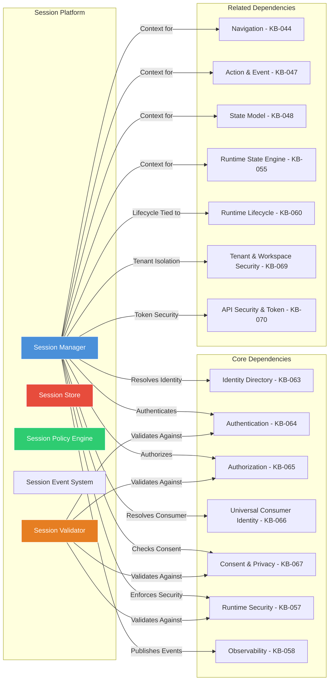
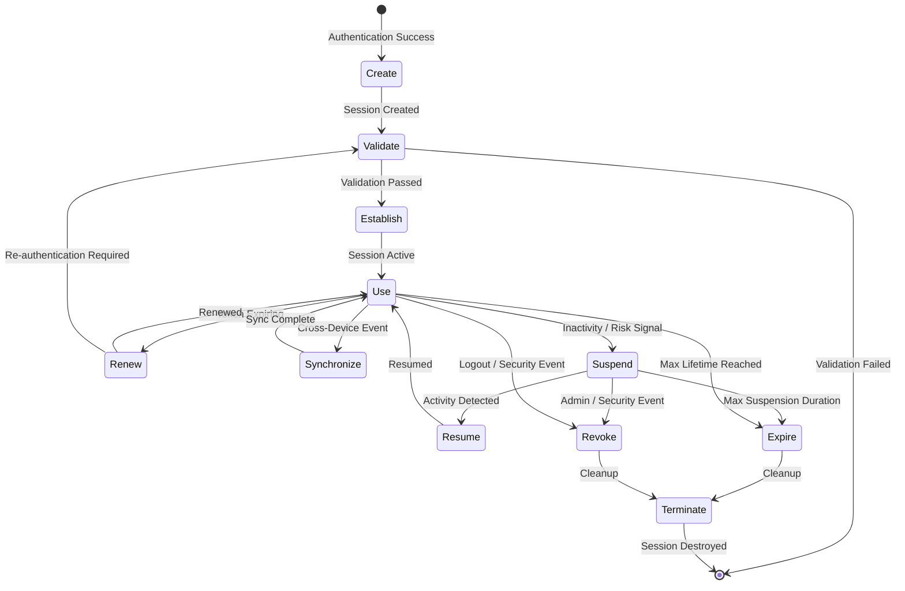
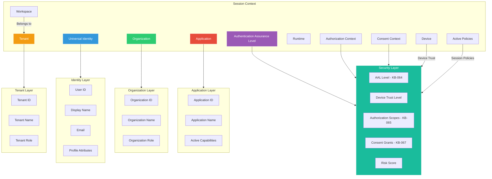
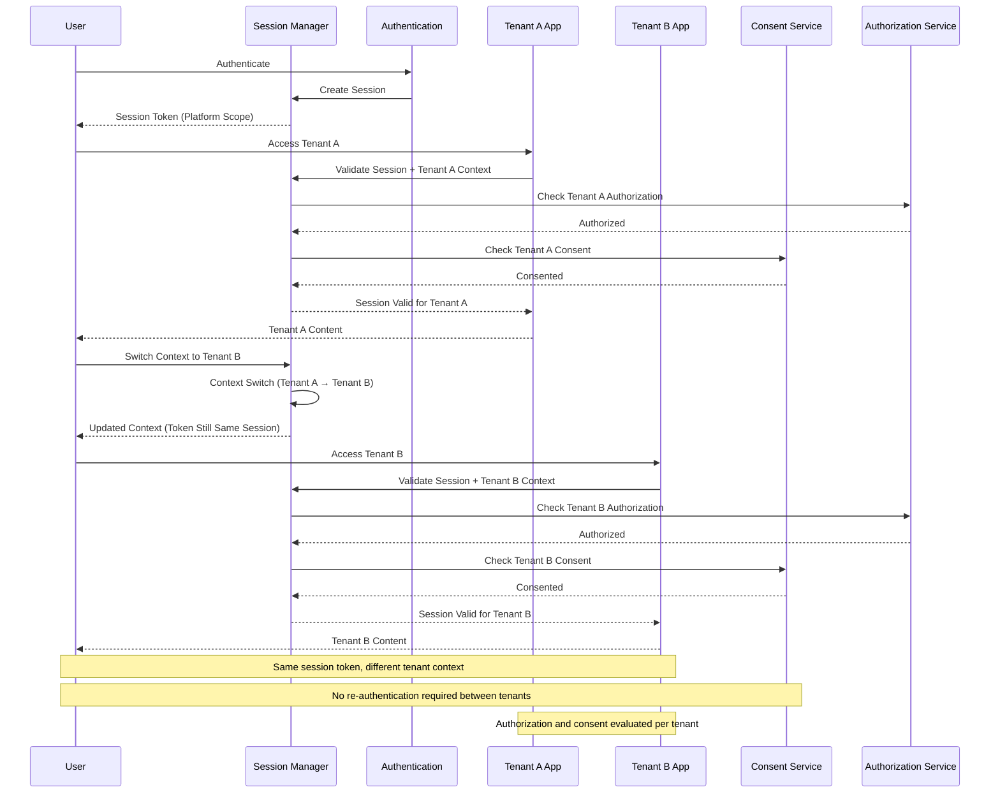
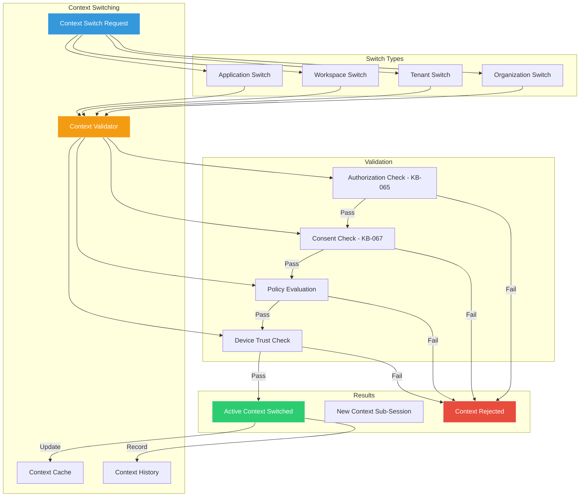
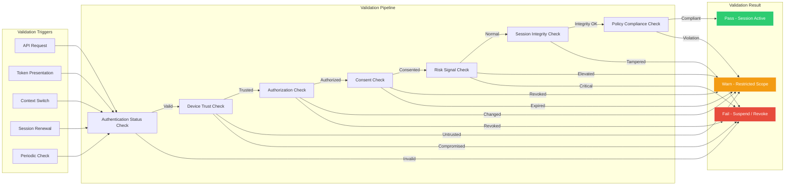
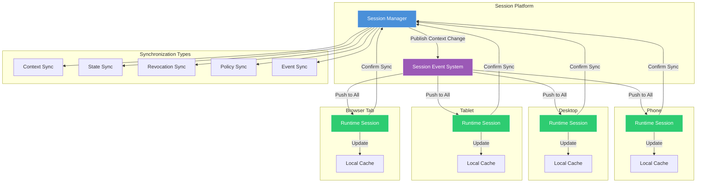
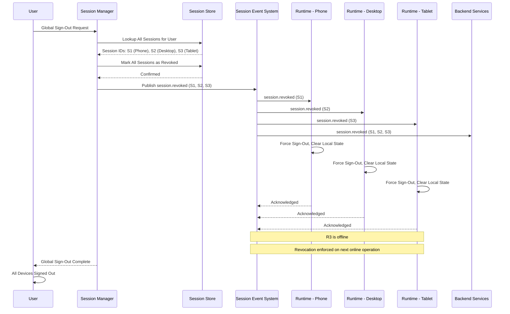

# Session Management Architecture

**KB-068 — Session Management Architecture Specification**

| Metadata | |
|----------|---|
| **KB ID** | KB-068 |
| **Title** | Session Management Architecture |
| **Version** | 0.1.0 |
| **Status** | Draft |
| **Owner** | Architecture Team |
| **Suite** | Identity & Access Architecture |
| **Dependencies** | KB-057 Runtime Security Architecture, KB-058 Runtime Observability & Diagnostics Architecture, KB-063 Identity Platform Architecture, KB-064 Authentication Architecture, KB-065 Authorization & RBAC Architecture, KB-066 Universal Consumer Identity Architecture, KB-067 Consent & Privacy Architecture |
| **Related Documents** | KB-043 Workspace & Tenant Model, KB-044 Navigation Architecture, KB-047 Action & Event Model, KB-048 Application State Model, KB-051 Runtime Architecture Overview, KB-055 Runtime State Engine Architecture, KB-060 Runtime Lifecycle Management, KB-069 Organization, Tenant & Workspace Security, KB-070 API Security & Token Architecture, KB-072 Audit, Compliance & Identity Governance Architecture |
| **Review Status** | Pending |
| **Last Updated** | 2026-07-11 |

---

### Revision History

| Version | Date | Author | Change |
|---------|------|--------|--------|
| 0.1.0 | 2026-07-11 | AI Architecture Agent | Initial draft |

---

## 1. Executive Summary

### 1.1 Purpose

This document defines the Session Management Architecture for the DUKADESK Platform. A session represents a trusted, authenticated interaction between a Universal Identity and the DUKADESK Platform. Sessions are platform-wide and are independent of any single tenant application.

This architecture enables one authenticated session to securely access multiple tenant applications without requiring repeated authentication, while maintaining tenant isolation, authorization boundaries, and consent enforcement.

The Session Platform governs the creation, lifecycle, synchronization, validation, renewal, termination, and governance of sessions across the entire DUKADESK ecosystem. Sessions bridge authentication and runtime — they carry the authenticated identity, authorization context, consent grants, state, and preferences throughout the user's engagement with the platform.

### 1.2 Scope

**In scope:**

- All session types: Consumer Sessions, Builder Sessions, Business Dashboard Sessions, Tenant Dashboard Sessions, Marketplace Sessions, Organization Sessions, Administrator Sessions, API Sessions, Device Sessions, Background Sessions, Offline Sessions (architectural), and Future AI Agent Sessions
- Session lifecycle: Create, Validate, Establish, Use, Renew, Synchronize, Suspend, Resume, Expire, Revoke, Terminate
- Session Platform Architecture: Session Store, Session Policy Engine, Session Event System, Session Context Resolution
- Cross-tenant session architecture and traversal
- Session context switching across organizations, tenants, workspaces, and applications
- Session validation: Authentication status, device trust, authorization changes, consent changes, risk signals, session integrity, policy updates
- Session synchronization across devices, runtimes, browser tabs, mobile applications, and background services
- Session governance: policies, maximum lifetime, idle timeout, renewal policies, concurrent session policies, administrative controls
- Responsibilities: Runtime, Identity Platform, Backend Services
- Security: Session fixation protection, session hijacking protection, replay protection, secure session binding, context isolation, device trust validation, session revocation, global sign-out
- Privacy: Session data minimization, cross-tenant privacy, session metadata, device privacy, session audit separation
- Performance: Session resolution, validation, renewal, context switching, cross-device synchronization
- Observability: Active sessions, session lifetime, renewals, revocations, concurrent sessions, validation failures, context switching metrics (KB-058)
- Failure scenarios and anti-patterns
- Future evolution: Continuous authentication, passwordless sessions, device mesh sessions, AI risk scoring, session federation, hardware-backed sessions, cross-platform session portability

**Out of scope:**

- Implementation details of specific session management frameworks or token formats
- Authentication flow details (covered in KB-064)
- Authorization decision details (covered in KB-065)
- Consent enforcement within sessions (covered in KB-067)
- Token format and cryptographic key management (covered in KB-069 and KB-070)
- Federated session handling with external identity providers (covered in KB-071)

---

## 2. Architectural Principles

### 2.1 One Identity, Multiple Contexts

A single Universal Identity maintains one platform session that spans multiple organizations, tenants, workspaces, and applications. Context switching changes the active scope within the session without creating a new identity or authentication event.

### 2.2 Session ≠ Authentication

Authentication establishes identity. A session carries that identity across time, contexts, and devices. A session may span multiple authentication events (refresh, step-up) and authentication may occur without creating a new session (re-authentication within existing session). Sessions outlive any single authentication event.

### 2.3 Stateless Platform, Stateful Experience

The Identity Platform operates as a stateless policy and validation engine. Session state is distributed to the Runtimes that serve the user. The platform validates and governs; the Runtimes deliver the experience. This enables horizontal scalability, zero-downtime deployments, and independent Runtime evolution.

### 2.4 Zero Trust

Every session operation is validated — creation, renewal, context switch, every data access. No operation is trusted based on prior validation. Continuous validation evaluates authentication status, device trust, authorization, consent, risk signals, and session integrity at every checkpoint.

### 2.5 Continuous Validation

Session validity is not a one-time check at creation. Validation is continuous throughout the session lifetime. Changes in authentication status, authorization, consent, device trust, or risk profile immediately affect session validity. Sessions are suspended or revoked when validation fails.

### 2.6 Least Privilege

Sessions carry the minimum scope necessary for their purpose. A session's scope is established at creation and narrowed for specific operations (sub-sessions). No session holds more scope, duration, or permission than required.

### 2.7 Explicit Context Switching

Context changes — switching organizations, tenants, workspaces, or applications — are explicit operations with clear user intent and validation. Context switches are audited, and the previous context is preserved for return navigation. Hidden or automatic context switching is never permitted.

### 2.8 Secure by Default

Session tokens are cryptographically bound to devices, short-lived by default, and rotated on every refresh. Session creation requires valid authentication. Session operations require valid tokens. Denied operations return clear errors. Default configuration is the most secure configuration.

### 2.9 Observable Sessions

Every session lifecycle event is observable — creation, validation, renewal, context switch, suspension, resumption, revocation, expiration, termination. Events are published to the platform event bus for monitoring, auditing, and real-time response.

### 2.10 Runtime Independence

The session architecture is independent of any specific Runtime implementation. The same session model, validation, and governance apply across Mobile, Web, Desktop, Preview, and future Runtimes. Runtimes implement session behavior; the platform defines session policy.

---

## 3. Canonical Definitions

### 3.1 Session

A trusted, authenticated interaction between a Universal Identity and the DUKADESK Platform. A session spans time, contexts, devices, and applications. It carries the identity, authorization, consent, state, and preference context for all operations performed within it.

### 3.2 Session Context

The ambient information that qualifies a session — the current Universal Identity, organization, tenant, workspace, application, device, runtime, authentication assurance level, authorization scope, consent scope, and active policies. Session context is automatically attached to every operation within the session.

### 3.3 Session Identifier

A globally unique, cryptographically random identifier for a session. Session IDs are generated by the Session Platform and are not predictable or enumerable. The session ID is the primary key for all session operations — validation, renewal, revocation, audit.

### 3.4 Session State

The mutable data associated with a session — navigation history, form data, preferences, transient data, authentication tokens, authorization context, consent decisions. Session state is owned by the Runtime and may be persisted for session resume. Session state is ephemeral by design.

### 3.5 Session Scope

The declared boundary of a session — which Universal Identity, organizations, tenants, workspaces, applications, devices, and capabilities are within scope. Scope is established at session creation and modified only through explicit context switching. Scope narrowing (sub-sessions) is supported; scope expansion requires explicit validation.

### 3.6 Session Lifecycle

The complete sequence of states a session progresses through — Create, Validate, Establish, Use, Renew, Synchronize, Suspend, Resume, Expire, Revoke, Terminate. Each state transition is explicit, validated, and audited.

### 3.7 Session Validation

The process of verifying that a session is still valid for its current scope and context. Validation checks authentication status, device trust, authorization, consent, risk signals, session integrity, and policy compliance. Validation occurs continuously throughout the session lifetime.

### 3.8 Session Renewal

The process of extending a session's lifetime by issuing new session tokens before the current tokens expire. Renewal validates the session's continued validity and may require re-authentication depending on policy. Token rotation invalidates previous tokens.

### 3.9 Session Revocation

Immediate termination of a session by the platform, user, or administrator. Revocation invalidates all session tokens, destroys session state, and propagates to all devices and runtimes. Revocation is the response to logout, security incidents, policy violations, or administrative action.

### 3.10 Session Termination

The final state in the session lifecycle. Termination occurs after expiration, revocation, or explicit session end. Terminated sessions cannot be resumed. Session metadata is retained for audit; session state is destroyed.

### 3.11 Device Session

A session bound to a specific physical or logical device. Device sessions carry device identity, device trust level, device capabilities, and device-specific state. A single platform session may encompass multiple device sessions across the user's devices.

### 3.12 Runtime Session

A session as instantiated within a specific Runtime (Mobile, Web, Desktop, Preview). The Runtime session carries the Runtime-specific session state, cached context, and local session token. Runtime sessions are subordinate to the platform session.

### 3.13 Session Trust Level

A quantified assessment of the session's trustworthiness based on authentication assurance level, device trust, risk signals, and behavioral patterns. Session trust level affects authorization decisions, consent enforcement, and the sensitivity of operations permitted within the session.

---

## 4. Session Platform Architecture

### 4.1 Session Platform Architecture

```mermaid
flowchart TB
    subgraph IdentityPlatform["Identity Platform"]
        IP[Identity Platform Core - KB-063]
        AU[Authentication Service - KB-064]
        AZ[Authorization Service - KB-065]
        CS[Consent Service - KB-067]
    end

    subgraph SessionPlatform["Session Platform"]
        SM[Session Manager]
        SR[Session Store]
        SP[Session Policy Engine]
        SE[Session Event System]
        SC[Session Context Resolver]
        SV[Session Validator]
        ST[Session Token Service]
    end

    subgraph Runtimes["Runtimes"]
        MR[Mobile Runtime]
        WR[Web Runtime]
        DR[Desktop Runtime]
        PR[Preview Runtime]
    end

    subgraph Tenants["Tenant Applications"]
        TA1[Tenant A - Application 1]
        TA2[Tenant A - Application 2]
        TB1[Tenant B - Application 1]
    end

    subgraph Devices["Devices"]
        D1[Phone]
        D2[Desktop]
        D3[Tablet]
        D4[Browser Tab]
    end

    IP -->|Authentication Success| SM
    SM -->|Create Session| SR
    SM -->|Evaluate Policies| SP
    SM -->|Publish Events| SE
    SM -->|Resolve Context| SC
    SM -->|Validate Continuously| SV
    SM -->|Issue Tokens| ST

    SV -->|Check| AU
    SV -->|Check| AZ
    SV -->|Check| CS
    SV -->|Check| SP

    SC -->|Provide Context| MR
    SC -->|Provide Context| WR
    SC -->|Provide Context| DR
    SC -->|Provide Context| PR

    MR --> D1
    MR --> D4
    WR --> D2
    DR --> D3

    MR -->|Access| TA1
    WR -->|Access| TA1
    MR -->|Access| TA2
    DR -->|Access| TB1

    style SM fill:#4a90d9,stroke:#fff,color:#fff
    style SR fill:#e74c3c,stroke:#fff,color:#fff
    style SP fill:#2ecc71,stroke:#fff,color:#fff
    style SE fill:#9b59b6,stroke:#fff,color:#fff
    style SC fill:#f39c12,stroke:#fff,color:#fff
    style SV fill:#e67e22,stroke:#fff,color:#fff
```

### 4.2 Session Manager

The Session Manager is the authoritative component for all session lifecycle operations:

- **Session Creation**: Receives authentication success events, generates session identifiers, establishes initial session scope, issues session tokens, records session in Session Store
- **Session Validation**: Delegates to Session Validator for continuous validation checks, receives validation results, enforces policy decisions (suspend, revoke, allow)
- **Context Resolution**: Maintains the current session context for every active session, resolves context changes during explicit context switching
- **Session Renewal**: Processes token refresh requests, validates renewal conditions, issues new tokens with rotation
- **Session Revocation**: Processes revocation requests from users, administrators, and automated policies, propagates revocation to all Runtimes and Devices
- **Session Termination**: Cleans up session state, records termination event, retains audit metadata

### 4.3 Session Store

The Session Store is the authoritative record of all active sessions:

- **Storage Model**: Key-value store with session ID as primary key. Values contain session metadata, current scope, trust level, and token references.
- **Data Contents**: Session ID, Universal Identity ID, Session Type, Creation Timestamp, Last Activity Timestamp, Expiration Timestamp, Current Context (Organization, Tenant, Workspace, Application), Device Bindings, Trust Level, Token References, Status
- **Status Values**: Pending, Active, Suspended, Revoked, Expired, Terminated
- **Consistency**: Strong consistency for session validation operations. Eventual consistency for metadata queries.
- **Durability**: Session metadata is durable with persistent backing store. Session state is ephemeral (Runtime-owned).
- **Scalability**: Horizontally scalable through session ID-based sharding. Read-heavy workload: 90% reads, 10% writes.

### 4.4 Session Policy Engine

The Session Policy Engine governs all session behavior:

- **Session Policies**: Maximum lifetime per session type, idle timeout per context, renewal policies, concurrent session limits, device trust requirements, authentication assurance requirements
- **Policy Sources**: Platform-defined global defaults, tenant-specific overrides (within platform constraints), organization policies, runtime-specific policies
- **Policy Evaluation**: Evaluated at session creation, renewal, context switch, and continuously by Session Validator. Policy violations trigger suspension, revocation, or blocking.
- **Policy Hierarchy**: Platform policies are the base. Tenant policies may tighten but never loosen platform policies. Organization policies apply within tenant policies. Runtime policies are the most specific.

### 4.5 Session Event System

The Session Event System publishes all session lifecycle events to the platform event bus:

| Event | Trigger | Consumers |
|-------|---------|-----------|
| `session.created` | New session established | Runtimes, Audit, Monitoring |
| `session.validated` | Validation check passed | Monitoring, Audit |
| `session.context_switched` | Organization/tenant/workspace/application change | Runtimes, Navigation, Audit |
| `session.renewed` | Token refresh completed | Runtimes, Audit |
| `session.synchronized` | Cross-device state sync completed | Runtimes |
| `session.suspended` | Inactivity timeout or risk signal | Runtimes, Monitoring |
| `session.resumed` | Session restored from suspension | Runtimes |
| `session.expired` | Maximum lifetime reached | Runtimes, Cleanup |
| `session.revoked` | User logout, admin action, security event | All Runtimes, All Services |
| `session.terminated` | Session destroyed | Cleanup, Audit |

### 4.6 Session Context Resolver

The Session Context Resolver maintains and resolves the current context for every active session:

- **Context Composition**: Universal Identity, Organization, Tenant, Workspace, Application, Device, Runtime, Authentication Assurance Level, Authorization Context, Consent Context, Active Policies
- **Context Resolution**: On every session operation, the Resolver provides the current context. Context changes occur through explicit context switching operations.
- **Context Caching**: Resolved context is cached at the Runtime for the current operation. Cache is invalidated on context changes, policy updates, or authorization/consent changes.

### 4.7 Session Platform Dependency Graph

---

## 5. Session Types

### 5.1 Session Type Overview

| Session Type | Primary Audience | Authentication Required | Typical Duration | Scope |
|-------------|-----------------|------------------------|-----------------|-------|
| Interactive User Session | Consumers | Yes | 24 hours | All consented tenants and applications |
| Organization Session | Organization members | Yes | 8 hours | Single organization, all its tenants |
| Tenant Session | Tenant users | Yes | 8 hours | Single tenant, all its applications |
| Workspace Session | Workspace members | Yes | 4 hours | Single workspace, workspace-scoped resources |
| Runtime Session | Any authenticated user | Inherited | Platform session lifetime | Single Runtime instance |
| Device Session | Any authenticated user | Device-bound | Device lifetime | Single device |
| Builder Session | Builder Studio users | Yes (step-up) | 8 hours | Builder capabilities, tenant design |
| Business Dashboard Session | Business users | Yes | 8 hours | Business analytics, tenant management |
| Tenant Dashboard Session | Tenant administrators | Yes (step-up) | 4 hours | Tenant administration, configuration |
| Marketplace Session | Marketplace users | Yes | 8 hours | Marketplace browsing, publishing, purchasing |
| Administrator Session | Platform administrators | Yes (step-up, MFA) | 2 hours | Full platform administration |
| API Session | Machine clients | Client credentials | Configurable | Declared API scopes |
| Background Session | System services | Service identity | Configurable | Background processing scope |
| Offline Session | Consumers (offline) | Previously authenticated | Limited (default: 4h) | Cached scope, limited operations |
| AI Agent Session | AI agents | Delegated identity | Per-task | Agent-specific delegated scope |
| Emergency Session | Administrators | Break-glass, MFA | Limited (15–60 min) | Elevated, fully audited |

### 5.2 Interactive User Session

The primary session type for consumers and platform users:

- **Establishment**: Created after successful authentication (KB-064). Receives the user's Universal Identity, authorization roles, and active consent grants.
- **Scope**: All organizations, tenants, workspaces, and applications the user has authorization and consent for. Scope is navigated through explicit context switching.
- **Multi-Tenant**: A single interactive user session spans multiple tenants. Context switching changes the active tenant without creating a new session or requiring re-authentication.
- **Multi-Device**: The session may span multiple devices through the multi-device session model. All device sessions share the same platform session.
- **Duration**: Default 24 hours absolute maximum with 30-minute inactivity timeout. Configurable within platform policy limits.

### 5.3 Builder Session

A specialized session for Builder Studio users:

- **Establishment**: Created after standard authentication with step-up verification. Requires Builder authorization (KB-065).
- **Scope**: Builder capabilities, tenant design surfaces, publishing pipelines. Scoped to the Builder's authorized tenants.
- **Duration**: 8 hours default. Shorter inactivity timeout (15 minutes) due to sensitive nature of design changes.
- **Special Behaviors**: Autosave on suspension, session resume preserves unsaved changes, concurrent Builder sessions limited to 2.

### 5.4 Business Dashboard Session

A session for business users accessing analytics and management:

- **Establishment**: Standard authentication with business role authorization.
- **Scope**: Business analytics, tenant performance data, financial reports, user activity summaries. Read-only by default; write operations require sub-session.
- **Duration**: 8 hours default. Extended inactivity timeout (2 hours) for analytical workflows.
- **Special Behaviors**: Cross-tenant analytics aggregation (with appropriate authorization), data export requires step-up authentication.

### 5.5 Tenant Dashboard Session

A session for tenant administrators:

- **Establishment**: Standard authentication plus tenant administrator role authorization. Optional step-up MFA for sensitive operations.
- **Scope**: Tenant configuration, user management, role assignments, billing, integrations.
- **Duration**: 4 hours default. Strict inactivity timeout (10 minutes) for administrative sessions.
- **Special Behaviors**: All administrative actions require sub-session confirmation. Audit logging for every operation.

### 5.6 Marketplace Session

A session for Marketplace browsing, publishing, and purchasing:

- **Establishment**: Standard authentication. Publishing requires additional verification.
- **Scope**: Marketplace browsing, package installation, capability publishing, purchasing.
- **Duration**: 8 hours default. Purchasing operations require step-up sub-session.
- **Special Behaviors**: Publisher sessions have elevated scope for package management. Consumer sessions are read-only for browsing.

### 5.7 Organization Session

A session scoped to a specific organization:

- **Establishment**: Created when a user accesses an organization's resources. May be created from an existing interactive user session.
- **Scope**: Organization-specific resources — members, tenants, settings, billing.
- **Relationship**: Subordinate to the interactive user session. Multiple organization sessions may exist within one user session.
- **Context Switching**: Switching organizations creates a new organization session or switches to an existing one. Organization sessions are isolated from each other.

### 5.8 Administrator Session

A session for platform administrators:

- **Establishment**: Created after strong authentication with MFA. Requires platform administrator role.
- **Scope**: Full platform administration — all tenants, all organizations, all users, platform configuration, system settings.
- **Duration**: 2 hours absolute maximum. 5-minute inactivity timeout. No session renewal — new session required after expiration.
- **Special Behaviors**: Every operation is audited with full detail. Break-glass emergency sessions have additional controls.
- **Constraints**: Maximum 2 concurrent administrator sessions per admin. All admin sessions are visible to the security team.

### 5.9 API Session

A session for machine-to-machine communication:

- **Establishment**: Created through client credentials flow. No user interaction required.
- **Scope**: Declared API scopes in the client application manifest. Scope is fixed at session creation.
- **Duration**: Configurable (default: 1 hour absolute, 30-minute inactivity timeout). No refresh — new session created upon expiration.
- **No Context Switching**: API sessions have fixed scope. Context switching is not supported.
- **Rate Limiting**: API sessions are rate-limited per client. Excessive usage triggers session revocation.

### 5.10 Device Session

A session bound to a specific device:

- **Establishment**: Created when a user authenticates on a device. Bound to device identity and device attestation.
- **Scope**: Device-specific resources, device-bound consent grants, device preferences.
- **Device Trust Level**: Affects session scope. Untrusted devices have reduced scope. Trusted devices have full scope.
- **Relationship**: Subordinate to the interactive user session. Multiple device sessions share the same platform session.
- **Revocation**: Device sessions can be revoked individually without affecting other devices.

### 5.11 Background Session

A session for system services and background processes:

- **Establishment**: Created by system services using service identity. No user interaction.
- **Scope**: Declared service capabilities. Limited to specific background operations.
- **Duration**: Configurable (default: 24 hours with automatic renewal). Background sessions are long-lived by design.
- **No Context Switching**: Background sessions have fixed scope. Context switching is not supported.
- **Observability**: All background session operations are logged. Anomalous behavior triggers alert.

### 5.12 Offline Session

An architectural model for sessions operating without network connectivity:

- **Establishment**: Created from an existing online session when connectivity is lost. Cached session token and state on device.
- **Scope**: Reduced scope based on cached consent and authorization. Sensitive operations blocked offline.
- **Duration**: Limited offline duration (default: 4 hours). After offline limit, re-authentication required.
- **Synchronization**: Offline operations are queued. On reconnection, queue is processed and conflicts resolved.
- **Security**: Device-bound and encrypted at rest. Remote revocation enforced on next online operation.

### 5.13 AI Agent Session

A future session type for AI agents acting on behalf of users:

- **Establishment**: Created through delegated identity. The agent receives a scoped session representing the user's authorization and consent for specific agent operations.
- **Scope**: Explicitly delegated by the user through consent. Agent cannot exceed delegated scope.
- **Duration**: Per-task or limited time window. No persistent agent sessions.
- **Observability**: All agent operations are logged. Users can view, pause, or revoke agent sessions.
- **Constraints**: No context switching. Agent sessions are single-purpose.

---

## 6. Session Lifecycle

### 6.1 Session Lifecycle Flow

### 6.2 Create

A session is created when authentication succeeds:

- **Trigger**: Successful authentication event from Authentication Service (KB-064)
- **Input**: Universal Identity ID, authentication assurance level, device identity, device trust level, authentication method
- **Operations**:
  1. Session Manager receives authentication success event
  2. Cryptographically random session identifier generated
  3. Session type determined based on authentication context and requesting service
  4. Initial session scope established — identity, default organization, default tenant
  5. Session policies loaded from Session Policy Engine
  6. Session record created in Session Store
  7. Session token issued (access token + refresh token)
  8. `session.created` event published
- **Output**: Session ID, session token, initial session context, session policies

### 6.3 Validate

Every session is validated before becoming active and continuously thereafter:

- **Validation Checks**:
  - Authentication Status: Is the authentication still valid? Has the credential been changed or revoked?
  - Device Trust: Is the device still trusted? Has device attestation changed?
  - Authorization: Are the session's authorization roles still valid? Have roles been changed or revoked?
  - Consent: Are the session's consent grants still valid? Has consent been revoked or expired?
  - Risk Signals: Have any risk events been detected for the user, device, or session?
  - Session Integrity: Has the session been tampered with? Is the session ID valid?
  - Policy Updates: Have any policies changed that affect the session?
- **Validation Frequency**: On session creation, on every token validation, on context switch, on renewal, on periodic validation interval (configurable, default: 5 minutes)
- **Validation Result**: Pass (session remains active), Warn (session continues with restrictions), Fail (session suspended or revoked)

### 6.4 Establish

After validation passes, the session is established:

- **Activation**: Session status changes from Pending to Active
- **Context Loading**: Identity context, authorization context, consent context, and policies loaded into session context
- **Runtime Notification**: All active Runtimes for the user are notified of the new session
- **Device Registration**: The device is registered as an active device for the session (multi-device session group updated)
- **State Initialization**: Session state stores initialized with defaults

### 6.5 Use

The active session serves all operations within its scope:

- **Token Presentation**: The session token is presented with every authenticated request
- **Context Attachment**: Session context is automatically attached to every operation
- **Continuous Validation**: Session Validator continuously evaluates session validity
- **Activity Tracking**: Last activity timestamp updated on every operation
- **Scope Navigation**: User navigates between organizations, tenants, workspaces, and applications through explicit context switching
- **Sub-Session Creation**: For sensitive operations, sub-sessions are created with narrowed scope

### 6.6 Renew

Session tokens are renewed before expiration:

- **Trigger**: Session token near expiration (within configurable refresh window, default: 5 minutes)
- **Renewal Flow**:
  1. Runtime detects token is within refresh window
  2. Runtime presents refresh token to Session Token Service
  3. Session Validator validates session's continued validity
  4. If validation passes: new session token issued, old token invalidated, refresh token rotated
  5. If validation fails: renewal denied, session suspended or revoked
- **Token Rotation**: Old session token is immediately invalidated. Refresh token rotated on every use (configurable).
- **Re-Authentication**: If renewal validation requires re-authentication (policy-based, e.g., every 5th renewal), the Runtime prompts for authentication before renewal completes.
- **Renewal Event**: `session.renewed` event published with new token metadata

### 6.7 Synchronize

Session state is synchronized across devices and runtimes:

- **Synchronization Triggers**: Session context change, consent change, authorization change, revocation, cross-device state update, device online transition
- **Synchronization Contents**: Session context (identity, tenant, workspace), active consent grants, revocation status, policy updates, session metadata
- **Synchronization Flow**:
  1. State change occurs on one device or is initiated by Session Manager
  2. Session Event System publishes synchronization event
  3. All active Runtimes for the session receive the event
  4. Each Runtime updates its local session state
  5. Runtime confirms synchronization completion
- **Conflict Handling**: Session Manager is authoritative. Runtime local changes are overwritten by Session Manager state.

### 6.8 Suspend

Sessions are suspended due to inactivity or risk signals:

- **Suspension Triggers**: Inactivity timeout reached, risk signal detected, device trust lost, policy violation, authorization or consent change requiring user attention
- **Suspension Behavior**:
  1. Session status changed to Suspended in Session Store
  2. Session token invalidated (cannot start new operations)
  3. Existing operations in flight are allowed to complete
  4. Session state preserved in Session State Store
  5. Suspension timer started (max suspension duration, default: 1 hour)
  6. `session.suspended` event published to all Runtimes
  7. Runtime displays suspension notification to user

### 6.9 Resume

Suspended sessions can be resumed:

- **Resume Triggers**: User activity detected, risk signal resolved, device re-trusted, user-initiated resume
- **Resume Requirements**: Session is in Suspended state, within max suspension duration, user can re-authenticate (if required), device is trusted (if required)
- **Resume Flow**:
  1. User initiates resume or activity is detected
  2. Session Validator re-validates the session
  3. If validation passes and within suspension duration: session restored to Active
  4. New session token issued
  5. Session state hydrated from Session State Store
  6. Runtimes notified of session resumption
  7. `session.resumed` event published
- **Re-Authentication**: If suspension duration exceeds re-authentication threshold (default: 15 minutes), user must re-authenticate before resume

### 6.10 Expire

Sessions expire when their maximum lifetime is reached:

- **Expiration Triggers**: Maximum absolute lifetime reached (default: 24 hours for interactive sessions)
- **Expiration Behavior**:
  1. Session status changed to Expired in Session Store
  2. All session tokens invalidated
  3. Session state preserved for grace period (default: 1 hour)
  4. In-flight operations may complete or be rolled back per operation semantics
  5. Runtimes notified of expiration
  6. `session.expired` event published
- **Grace Period**: Expired session remains in Expired state for configurable grace period to allow graceful user transition. New session must be created.
- **Post-Grace**: Session moved to Terminated. State cleaned up.

### 6.11 Revoke

Sessions are revoked explicitly:

- **Revocation Triggers**: User logout, administrator force-logout, security incident, password change, consent revocation, device deactivation, policy violation, account suspension
- **Revocation Types**:
  - Single Session: Revoke specific session ID
  - All User Sessions: Revoke all sessions for a Universal Identity
  - All Device Sessions: Revoke all sessions on a specific device
  - All Tenant Sessions: Revoke all sessions in a specific tenant
  - Organization-Wide: Revoke all sessions for all users in an organization
- **Revocation Flow**:
  1. Revocation request received with session identifier and reason
  2. Session Manager validates authority to revoke
  3. Session(s) marked as Revoked in Session Store
  4. All session tokens added to revocation list
  5. Session state destroyed (or preserved for legal hold if required)
  6. `session.revoked` event published to all Runtimes
  7. Each Runtime forces sign-out, clears local session state
  8. Offline devices enforce revocation on next online operation

### 6.12 Terminate

Termination is the final lifecycle state:

- **Termination Triggers**: Session cleanup after revocation, post-expiration grace period, manual cleanup by Session Manager
- **Termination Behavior**:
  1. Session status changed to Terminated in Session Store
  2. Remaining session state destroyed if not already cleaned
  3. Device bindings released
  4. `session.terminated` event published
  5. Session metadata retained for audit (configurable retention, default: 3 years)
  6. Session record retained in Session Store for limited period (default: 7 days), then purged

---

## 7. Session Context

### 7.1 Session Context Composition

### 7.2 Context Resolution

Session context is resolved at every session operation:

- **Resolution Trigger**: Every authenticated request, every context switch, every session lifecycle event
- **Resolution Sources**:
  - Identity Directory (KB-063): Universal Identity, profile attributes
  - Authentication Service (KB-064): Authentication assurance level, authentication method, authentication timestamp
  - Authorization Service (KB-065): Active roles, authorization scopes, permissions
  - Consent Service (KB-067): Active consent grants, consent scope, consent expiration
  - Device Trust Service (internal): Device identity, device trust level, device attestation
  - Risk Service (internal): Risk score, active risk signals, behavioral anomalies
- **Context Caching**: Resolved context is cached at the Runtime for the current request lifetime. Cache is invalidated on context changes.

### 7.3 Context Propagation

Session context is propagated to all platform components:

- **Runtimes**: Context is provided to Navigation (KB-044), State Engine (KB-055), Action Engine (KB-047), Rendering Engine
- **Tenant Applications**: Context is provided through the session token and API request headers. Applications receive identity, tenant, and consent context.
- **Backend Services**: Context is provided through validated session tokens. Services receive identity, authorization, and consent context.
- **Audit Service**: Full session context is attached to every audit event.

---

## 8. Cross-Tenant Session Architecture

### 8.1 Cross-Tenant Session Model

### 8.2 Single Session, Multiple Tenants

A single platform session securely traverses multiple tenants:

- **Session Identity**: The session carries the Universal Identity, not a tenant-specific identity. The user is the same person across all tenants.
- **Per-Tenant Context**: Each tenant has its own context within the session — tenant-specific role, tenant-specific consent grants, tenant-specific policies.
- **No Re-Authentication**: Switching between tenants does not require re-authentication. The existing session token remains valid.
- **Authorization Per Tenant**: Authorization (KB-065) is evaluated independently for each tenant context. Roles and permissions are tenant-scoped.
- **Consent Per Tenant**: Consent (KB-067) is evaluated independently for each tenant context. Consent grants are tenant-specific.
- **Context Switch Cost**: Context switching is a metadata operation, not a session creation operation. It validates the new context against authorization and consent but does not create a new session.

### 8.3 Cross-Organization Sessions

A session may span multiple organizations:

- **Organization Context**: The session carries the active organization context. Organizations are completely isolated.
- **Organization Switching**: Context switching between organizations is an explicit operation. It validates the user's authorization in the target organization.
- **Organization Session**: Each organization may have an organization session within the platform session. Organization sessions are isolated from each other.
- **Cross-Organization Data Access**: No cross-organization data access without explicit authorization and consent.

### 8.4 Workspace Traversal

Within a tenant, the session may access multiple workspaces:

- **Workspace Context**: The session carries the active workspace context. Workspaces are tenant-scoped.
- **Workspace Switching**: Context switching between workspaces is an explicit operation. Navigation state is workspace-specific.
- **Workspace Isolation**: Workspace session state is isolated. Switching workspaces preserves the previous workspace's state for return.

---

## 9. Session Context Switching

### 9.1 Context Switching Architecture

### 9.2 Context Switch vs Session Replacement

| Aspect | Context Switch | Session Replacement |
|--------|---------------|-------------------|
| When | Same user, different scope | Different user, authentication change |
| Authentication | Not required | Required |
| Token | Same session token | New session token |
| Session ID | Same | New |
| State | Previous context preserved, new context activated | Previous session destroyed |
| Audit | Context switch event | Session create/terminate events |
| Cost | Metadata operation | Full session creation |
| Examples | Switch tenant, switch workspace | Logout/login, user impersonation |

### 9.3 Organization Switching

- **Initiation**: User selects target organization
- **Validation**: Verify user's membership and role in target organization
- **Context Update**: Active organization context updated in session. All tenant and workspace contexts within the new organization become available.
- **Preservation**: Previous organization context and its tenant/workspace states are preserved in context history
- **Return Switching**: Switching back to the previous organization restores its context

### 9.4 Tenant Switching

- **Initiation**: User selects target tenant within current organization
- **Validation**: Verify authorization (KB-065) and consent (KB-067) for target tenant
- **Context Update**: Active tenant context updated in session. Workspaces and applications within the new tenant become available.
- **Preservation**: Previous tenant's workspace and application state preserved
- **Navigation Impact**: Tenant switch triggers navigation context change (KB-044) — new navigation graph for new tenant

### 9.5 Workspace Switching

- **Initiation**: User selects target workspace within current tenant
- **Validation**: Verify workspace membership and authorization
- **Context Update**: Active workspace context updated in session. Applications within the new workspace become available.
- **Preservation**: Previous workspace's navigation history and application state preserved
- **Shared Tenant Session**: Workspace switching stays within the same tenant context and shares the same authenticated session (KB-044)

### 9.6 Application Switching

- **Initiation**: User selects target application within current workspace
- **Validation**: Verify application access authorization and consent
- **Context Update**: Active application context updated in session
- **State Preservation**: Previous application's state is preserved. Return navigation restores previous application context.

---

## 10. Session Validation

### 10.1 Session Validation Pipeline

### 10.2 Authentication Status Check

- **What It Validates**: Is the authentication still valid? Has the user's password or credential changed? Has the user's account been suspended or disabled?
- **Sources**: Authentication Service (KB-064), Identity Directory (KB-063)
- **Pass Conditions**: Authentication is still valid, user account is active, no credential changes since session creation
- **Fail Conditions**: Account disabled, credential changed after session creation, account expired
- **Frequency**: On every validation trigger

### 10.3 Device Trust Check

- **What It Validates**: Is the device still trusted? Has device attestation changed? Is the device still registered to the user?
- **Sources**: Device Trust Service, Device Registry
- **Pass Conditions**: Device is trusted, device attestation is current, device is registered to the user
- **Warn Conditions**: Device trust level reduced (e.g., from Trusted to Known), device attestation expired
- **Fail Conditions**: Device is compromised, device attestation failed, device reported stolen
- **Frequency**: On every validation trigger

### 10.4 Authorization Check

- **What It Validates**: Are the session's authorization roles still valid? Have any roles been changed, revoked, or expired?
- **Sources**: Authorization Service (KB-065)
- **Pass Conditions**: All active authorization scopes are still valid
- **Warn Conditions**: Some scopes changed or expired, reduced authorization scope
- **Fail Conditions**: All authorization for the session's scope has been revoked
- **Frequency**: On every validation trigger, plus on authorization change events

### 10.5 Consent Check

- **What It Validates**: Are the session's consent grants still valid? Has consent been revoked or expired?
- **Sources**: Consent Service (KB-067)
- **Pass Conditions**: All active consent grants are still valid
- **Warn Conditions**: Some consent grants revoked or expired, reduced consent scope
- **Fail Conditions**: Consent for the session's primary operations has been revoked
- **Frequency**: On every validation trigger, plus on consent change events

### 10.6 Risk Signal Check

- **What It Validates**: Have any risk signals been detected for the user, device, or session?
- **Sources**: Risk Service, Anomaly Detection
- **Risk Signals**: Impossible travel, unusual location, new device, brute force attempt, credential stuffing, unusual data access pattern, concurrent sessions in different geographies
- **Pass Conditions**: No risk signals detected
- **Warn Conditions**: Low-severity risk signals detected, reduced session trust level
- **Fail Conditions**: Critical risk signals detected, session revoked
- **Frequency**: On every validation trigger, plus on risk event publications

### 10.7 Session Integrity Check

- **What It Validates**: Has the session been tampered with? Is the session ID valid and matching? Is the token signature valid?
- **Sources**: Session Store, Session Token Service
- **Pass Conditions**: Session ID exists in Session Store, session status is Active, session metadata matches token claims
- **Fail Conditions**: Session ID not found, session status not Active, token signature invalid, token claims mismatch
- **Frequency**: On every validation trigger

### 10.8 Policy Compliance Check

- **What It Validates**: Is the session still compliant with all applicable policies? Have any policies changed since session creation?
- **Sources**: Session Policy Engine
- **Pass Conditions**: Session complies with all active policies (maximum lifetime not exceeded, idle timeout not reached, concurrent session limits respected)
- **Warn Conditions**: Session approaching policy limits (near maximum lifetime, near idle timeout)
- **Fail Conditions**: Session exceeds policy limits, new policy invalidates session
- **Frequency**: On every validation trigger, plus on policy change events

---

## 11. Session Synchronization

### 11.1 Multi-Device Session Synchronization

### 11.2 Synchronization Types

| Sync Type | Contents | Direction | Latency Requirement |
|-----------|----------|-----------|---------------------|
| Context Sync | Session context changes (org, tenant, workspace switch) | Platform → All Devices | Real-time (< 1s) |
| State Sync | Session state changes (preferences, settings) | Platform ↔ Devices | Near real-time (< 5s) |
| Revocation Sync | Session revoked or expired | Platform → All Devices | Real-time (< 500ms) |
| Policy Sync | Policy updates affecting session | Platform → All Devices | Near real-time (< 5s) |
| Event Sync | Session lifecycle events | Platform → All Devices | Real-time (< 1s) |
| Offline Sync | Queued operations from offline period | Device → Platform | On reconnection |

### 11.3 Synchronization Protocol

- **Push Model**: Session Manager pushes synchronization events to all active Runtimes through the platform event bus
- **Pull Model**: Runtimes pull session state from Session Store on reconnection after offline period
- **Acknowledgment**: Runtimes acknowledge synchronization completion. Session Manager tracks acknowledgment status.
- **Retry**: Unacknowledged synchronizations are retried with exponential backoff (max 3 retries)
- **Conflict Resolution**: Session Manager state is authoritative. Runtime local changes are overwritten.

### 11.4 Cross-Tab Synchronization

Within a single browser, sessions across tabs are synchronized:

- **Shared Session**: All tabs within the same browser share the same Runtime session
- **State Broadcast**: State changes in one tab are broadcast to other tabs through the Runtime's cross-tab communication channel
- **No Duplicate Validation**: Validation results are shared across tabs to avoid redundant validation calls
- **Tab Closure**: Closing a tab does not terminate the session. Closing all tabs may trigger session suspension depending on device session policy.

---

## 12. Session Governance

### 12.1 Session Governance Model

```mermaid
flowchart TB
    subgraph Governance["Session Governance"]
        POL[Session Policies]
        LIM[Session Limits]
        ADM[Administrative Controls]
        AUD[Session Auditing]
    end

    subgraph Policies["Session Policies"]
        ML[Maximum Lifetime]
        IT[Idle Timeout]
        RP[Renewal Policies]
        CSP[Concurrent Session Policy]
        DR[Device Requirements]
        AR[Authentication Requirements]
    end

    subgraph Limits["Session Limits"]
        MCS[Max Concurrent Sessions]
        MDS[Max Devices per Session]
        MSU[Max Sessions per User]
        MRL[Max Renewal Lifetime]
        MST[Max Suspension Time]
    end

    subgraph AdminControls["Administrative Controls"]
        VWS[View All Sessions]
        RVS[Revoke Session]
        RVU[Revoke All User Sessions]
        RVT[Revoke Tenant Sessions]
        FLS[Force Logout]
        SSN[Suspend Session]
    end

    POL --> ML
    POL --> IT
    POL --> RP
    POL --> CSP
    POL --> DR
    POL --> AR

    LIM --> MCS
    LIM --> MDS
    LIM --> MSU
    LIM --> MRL
    LIM --> MST

    ADM --> VWS
    ADM --> RVS
    ADM --> RVU
    ADM --> RVT
    ADM --> FLS
    ADM --> SSN

    style POL fill:#3498db,stroke:#fff,color:#fff
    style LIM fill:#e74c3c,stroke:#fff,color:#fff
    style ADM fill:#f39c12,stroke:#fff,color:#fff
    style AUD fill:#2ecc71,stroke:#fff,color:#fff
```

### 12.2 Session Policies

| Policy | Default | Scope | Description |
|--------|---------|-------|-------------|
| Maximum Lifetime | 24 hours | Per session type | Absolute maximum session duration regardless of activity |
| Idle Timeout | 30 minutes | Per context | Maximum time without activity before session suspension |
| Renewal Limit | Unlimited | Per session | Maximum number of consecutive renewals before re-authentication required |
| Concurrent Session Limit | 10 | Per user | Maximum active sessions per Universal Identity |
| Device Session Limit | 5 | Per session | Maximum device sessions per platform session |
| Renewal Re-Auth Interval | Every 5 renewals | Per session | Require re-authentication every N token renewals |
| Offline Session Duration | 4 hours | Per device | Maximum time a session can operate offline |
| Suspension Duration | 1 hour | Per session | Maximum time a session can remain in Suspended state |
| Minimum AAL | AAL2 | Per session type | Minimum authentication assurance level required |
| Device Trust Required | Trusted | Per session type | Minimum device trust level required |

### 12.3 Administrative Controls

Platform administrators and authorized users have session governance capabilities:

- **View Active Sessions**: View all active sessions for a user, device, or tenant with metadata (device, location, last activity, duration)
- **Revoke Session**: Revoke a specific session by session ID
- **Revoke All User Sessions**: Revoke all active sessions for a specific Universal Identity
- **Revoke Tenant Sessions**: Revoke all sessions active within a specific tenant
- **Force Logout**: Immediately terminate all sessions for a user with user-visible notification
- **Suspend Session**: Temporarily suspend a session without revocation
- **Session Policy Override**: Apply temporary policy changes to specific sessions (for investigation or incident response)

### 12.4 User Self-Service

Users have self-service session management:

- **View Sessions**: View all active sessions with device name, device type, location, last activity, and duration
- **Revoke Session**: Revoke a specific session (e.g., "sign out of that device")
- **Revoke All Other Sessions**: Revoke all sessions except the current one
- **Session History**: View session history for the past 30 days
- **New Session Alert**: Receive notification when a new session is created from an unrecognized device or location

---

## 13. Runtime Responsibilities

### 13.1 Session Token Management

- Securely store session tokens in platform-specific secure storage (Keychain, Keystore, Credential Manager)
- Present session token with every authenticated request
- Detect token expiration and initiate renewal before expiration
- Handle token refresh and rotation
- Immediately discard tokens on session revocation or logout

### 13.2 Session Context

- Resolve session context from the Session Manager on session start and context switch
- Cache session context for the current request duration
- Invalidate context cache on context change events
- Provide session context to all subsystems — Navigation, State, Actions, Events, Rendering

### 13.3 Session Lifecycle

- Initiate session creation after authentication success
- Handle session activation, suspension, resume, and revocation events
- Present session state to user (active session indicator, session timeout warnings)
- Manage session state stores — create, hydrate, persist for resume, destroy on termination
- Handle offline session mode — offline token caching, offline state, operation queuing

### 13.4 Session UI

- Session timeout countdown and warning notifications
- Session management UI (view sessions, revoke sessions)
- Context switching UI (organization/tenant/workspace/application selectors)
- Re-authentication prompts for renewal or sub-session creation
- Sign-out functionality (local and global sign-out)

---

## 14. Identity Platform Responsibilities

### 14.1 Session Platform Operation

- Operate the Session Manager as the authoritative session service
- Maintain the Session Store with strong consistency for validation operations
- Operate the Session Policy Engine and distribute policies to Runtimes
- Operate the Session Event System and publish all lifecycle events
- Operate the Session Token Service for token issuance, validation, renewal, and revocation

### 14.2 Session Validation

- Operate the Session Validator for continuous validation
- Integrate with Authentication, Authorization, Consent, Device Trust, and Risk services
- Enforce validation results — allow, restrict, suspend, revoke
- Distribute validation state to Runtimes for local enforcement

### 14.3 Session Governance

- Enforce session policies — maximum lifetime, idle timeout, concurrent session limits
- Provide administrative session management APIs
- Provide user self-service session management APIs
- Maintain session audit records
- Generate session governance reports

---

## 15. Backend Responsibilities

### 15.1 Session Validation on API Requests

- Validate session tokens on every API request (signature, expiration, revocation)
- Verify session binding (device, IP if applicable)
- Reject requests with invalid, expired, or revoked tokens
- Return clear error codes for session-related failures

### 15.2 Session Context in Operations

- Use session context for authorization decisions (KB-065)
- Use session context for consent enforcement (KB-067)
- Scope data access to session context (tenant, workspace, application)
- Include session ID in all audit events

### 15.3 Cross-Session Coordination

- Handle cross-session state coordination where applicable (e.g., order status updates across devices)
- Support session-scoped data isolation at the storage layer
- Notify Session Manager of events that affect session validity (authorization change, consent revocation)

---

## 16. Security

### 16.1 Session Fixation Protection

- **Server-Generated Session IDs**: All session IDs are generated by the Session Manager. Client-provided session IDs are never accepted.
- **Session ID Regeneration**: Session ID is regenerated on authentication upgrade (anonymous to authenticated), privilege escalation, and session type change.
- **New Session on Authentication**: Anonymous sessions receive a new session ID when upgraded to authenticated sessions. The anonymous session ID is discarded.

### 16.2 Session Hijacking Protection

- **Token Binding**: Session tokens are cryptographically bound to the device identifier. Token presented from a different device is rejected.
- **Device Attestation**: For high-assurance sessions, device attestation proof is required. Attestation is validated on token presentation.
- **IP Binding (Optional)**: Session tokens may be bound to IP address. Token presented from a different IP triggers step-up validation.
- **Short Token Lifetime**: Session tokens have short lifetimes (default: 15 minutes). Hijacked tokens have limited usefulness.
- **Token Rotation**: Every token refresh invalidates the previous token. Stolen tokens become useless after refresh.
- **Theft Detection**: If a revoked refresh token is presented, Session Manager detects token theft and revokes all sessions for the user.

### 16.3 Replay Protection

- **Token Nonce**: Session tokens include a nonce that is validated on each use. Duplicate nonce presentation indicates replay attack.
- **Timestamp Validation**: Session tokens include issuance and expiration timestamps. Tokens outside the valid time window are rejected.
- **One-Time Refresh Tokens**: Refresh tokens are single-use. Using a refresh token twice indicates theft.

### 16.4 Secure Session Binding

- **Device Binding**: Session tokens are bound to device identity (device ID hash in token payload)
- **User Binding**: Session tokens are bound to Universal Identity ID
- **Session Binding**: Session tokens are bound to Session ID
- **Multi-Factor Binding**: For high-assurance sessions, tokens are bound to multiple factors (device + biometric + location)

### 16.5 Context Isolation

- **Tenant Isolation**: Session context in one tenant is completely isolated from another tenant. Context switching does not leak data.
- **Organization Isolation**: Organization context switching does not cross organization boundaries.
- **User Isolation**: Sessions for different users are completely isolated. No cross-user session access.

### 16.6 Global Sign-Out

### 16.7 Session Revocation

- **User-Initiated**: User signs out from any device. Option: sign out this device only or all devices (global sign-out).
- **Administrator-Initiated**: Administrator revokes session for security incident, account compromise, or policy violation.
- **Automated Revocation**: Triggered by password change, credential revocation, account suspension, consent revocation, or risk signal.
- **Revocation Propagation**: Real-time through Session Event System. Offline devices enforce on next online operation.
- **Revocation Confirmation**: All Runtimes acknowledge revocation. Unacknowledged devices are tracked for follow-up.

---

## 17. Privacy

### 17.1 Session Data Minimization

- **Minimum Session State**: Session state contains only data required for session operation — navigation history, preferences, transient form data. Full identity profiles are never stored in session state.
- **No Sensitive Data in Session Tokens**: Session tokens contain only identifiers (session ID, user ID) and scope claims. No personal data, no sensitive attributes.
- **Session Store Minimization**: Session Store contains only metadata required for session management. No personal data beyond user ID.
- **Audit Separation**: Session audit records contain session metadata, not the contents of session operations.

### 17.2 Cross-Tenant Privacy

- **Tenant Context Isolation**: Session context is scoped to the active tenant. Context from one tenant is not visible when operating in another tenant.
- **No Cross-Tenant Data Leakage**: Session state is tenant-scoped. Switching tenants does not carry data between tenants.
- **Cross-Tenant Consent**: Cross-tenant data access requires explicit consent (KB-067). Cross-tenant session features are limited to consented data.

### 17.3 Session Metadata

- **Metadata Collection**: Session metadata collected — session type, creation time, duration, device type, device trust level, authentication method, context switches
- **Metadata Retention**: Session metadata retained for audit (configurable, default: 3 years)
- **Metadata Anonymization**: After retention period, session metadata is anonymized by removing user identity linkage

### 17.4 Device Privacy

- **Device Identity**: Device identifiers are hashed in session records. Raw device identifiers are not stored in the Session Store.
- **Location Data**: Approximate location (region/country) may be stored for context. Precise location is never stored in session records.
- **User Agent**: User agent strings are stored for session management. User agent is not correlated with other data outside session context.

---

## 18. Performance

### 18.1 Session Resolution Performance

| Operation | Target (p95) | Target (p99) | Degradation Threshold |
|-----------|-------------|-------------|----------------------|
| Session Creation | < 50ms | < 100ms | > 200ms |
| Session Token Validation | < 5ms | < 10ms | > 20ms |
| Session Context Resolution | < 10ms | < 20ms | > 50ms |
| Session Renewal | < 20ms | < 50ms | > 100ms |
| Context Switch | < 30ms | < 60ms | > 150ms |
| Session Revocation | < 100ms | < 200ms | > 500ms |

### 18.2 Session Validation Performance

| Validation Check | Target (p95) | Cache Behavior |
|-----------------|-------------|----------------|
| Authentication Status | < 5ms | Cached for 60s |
| Device Trust | < 10ms | Cached for 300s |
| Authorization | < 10ms | Cached for 60s |
| Consent | < 10ms | Cached for 60s |
| Risk Signal | < 20ms | Cached for 30s |
| Session Integrity | < 2ms | Local validation |
| Policy Compliance | < 5ms | Cached for 60s |

### 18.3 Capacity

- **Maximum Active Sessions**: 10 million per Session Platform deployment
- **Maximum Session Validations Per Second**: 100,000
- **Maximum Session Creations Per Second**: 5,000
- **Maximum Simultaneous Renewals**: 10,000 per second
- **Session Store Size**: 1KB per active session metadata

### 18.4 Optimization Strategies

- **Token Validation Caching**: Validated tokens cached for remaining lifetime at API Gateway
- **Session Context Caching**: Resolved context cached for request duration at Runtime
- **Validation Result Caching**: Validation results cached with configurable TTL per check type
- **Read-Through Session Store**: Session Store supports read-through caching for frequent validation queries
- **Batch Event Processing**: Session events are batched for efficient distribution to multiple Runtimes

---

## 19. Observability

Reference KB-058 Runtime Observability & Diagnostics Architecture.

### 19.1 Session Metrics

The Session Platform exposes the following metrics:

- **Active Sessions**: Count of active sessions by type, by tenant, by device type, by authentication level
- **Session Lifetime Distribution**: Histogram of session durations by session type
- **Session Renewals**: Count and rate of session renewals by type and outcome
- **Session Revocations**: Count and rate of session revocations by reason (user, admin, security, policy)
- **Concurrent Sessions**: Distribution of concurrent sessions per user
- **Validation Failures**: Count and rate of validation failures by check type (authentication, device, authorization, consent, risk, integrity, policy)
- **Context Switches**: Count and rate of context switches by type (organization, tenant, workspace, application)
- **Synchronization Events**: Count and rate of cross-device synchronization events

### 19.2 Session Events

Every session lifecycle event is published to the platform event bus and available for observability:

- Session created, validated, established, context_switched
- Session renewed, synchronized, suspended, resumed
- Session expired, revoked, terminated
- Validation check results (pass, warn, fail) by check type

### 19.3 Session Monitoring

- **Active Session Dashboard**: Real-time view of active sessions by type, tenant, device, and geography
- **Session Health Dashboard**: Validation pass/fail rates, renewal success rates, revocation rates
- **Anomaly Detection**: Automated detection of anomalous session patterns — validation failure spikes, unusual revocation patterns, abnormal context switch frequency
- **Alerting**: Configurable alerts for session-related events — high validation failure rate, session creation spike from unusual location, mass revocation events

### 19.4 Session Audit Trail

All session lifecycle events are recorded in the audit trail:

- **Audit Record Contents**: Timestamp, Event Type, Session ID, User ID, Session Type, Device ID, IP Address, Location, Outcome, Reason, Request ID
- **Audit Retention**: Configurable (default: 3 years) per compliance requirements
- **Audit Query**: Audit records queryable by session ID, user ID, time range, event type, outcome

---

## 20. Failure Scenarios

### 20.1 Session Expired

| Scenario | Impact | Mitigation |
|----------|--------|------------|
| User in middle of operation when session expires | Operation may fail | Grace period allows in-flight operations to complete. User prompted to create new session. |
| Token expires during long-running operation | Operation interrupted | Operation receives session_expired error. Runtime caches operation state for replay after new session created. |
| Batch of renewals fails simultaneously | Mass session expiration | Session Manager preemptively renews sessions before expiration. Load shedding prioritizes renewal over new sessions. |

### 20.2 Session Hijack Attempt

| Scenario | Impact | Mitigation |
|----------|--------|------------|
| Stolen token presented from different device | Token binding validation fails | Token rejected. Anomaly detection triggers user notification and potential session revocation. |
| Refresh token theft | Attacker can renew session | Refresh token rotation detects theft when revoked token is presented. All user sessions revoked. |
| Session fixation attempt | Attacker tries to use fixed session ID | Server-generated session IDs prevent fixation. Session ID regeneration on authentication upgrade prevents persistence. |

### 20.3 Context Corruption

| Scenario | Impact | Mitigation |
|----------|--------|------------|
| Session context corrupted in memory | Incorrect tenant, wrong authorization scope | Session Manager is authoritative source. Runtime detects context inconsistency and re-resolves from Session Manager. |
| Context cache out of sync | Stale tenant or authorization information | Cache TTL limits staleness. Context change events invalidate cache. Periodic re-resolution enforces consistency. |
| Context pointer to deleted tenant or workspace | Navigation failures | Context validation on every context switch. Deletion of tenant or workspace triggers session context invalidation. |

### 20.4 Device Mismatch

| Scenario | Impact | Mitigation |
|----------|--------|------------|
| Device attestation fails | Session reduced trust level | Session falls back to lower trust level. User prompted to re-attest device. |
| Device identifier changes after OS update | Token binding validation fails | Device identifier migration supported through device re-registration flow. |
| Device reported stolen | Session must be revoked immediately | User or admin revokes device sessions through session management UI. Revocation propagated to all Runtimes. |

### 20.5 Revoked Consent

| Scenario | Impact | Mitigation |
|----------|--------|------------|
| User revokes consent for an attribute | Session retains access until next validation | Session Validator detects consent change on next check. Operations using revoked consent blocked immediately. |
| Consent expires during active session | Reduced functionality | Session context updated to reflect reduced consent scope. User notified of functionality changes. |
| Consent revocation affects cross-tenant session | Cross-tenant session terminated | Cross-tenant session revoked. User can recreate with new consent scope. |

### 20.6 Authorization Change

| Scenario | Impact | Mitigation |
|----------|--------|------------|
| User role changed or revoked | Authorization check fails on next validation | Session Validator detects authorization change. Session scope reduced or session suspended. |
| Tenant role modified | Tenant context affected | Session context updated for affected tenant. Active operations in affected tenant may be interrupted. |
| Organization role revoked | All tenant sessions in organization affected | All sessions in organization evaluated. Sessions without valid organization authorization revoked. |

### 20.7 Concurrent Session Conflict

| Scenario | Impact | Mitigation |
|----------|--------|------------|
| User exceeds max concurrent sessions | Oldest session revoked | Configurable behavior: revoke oldest, revoke least recently used, or block new session creation. User notified. |
| Same user session on two devices performing conflicting operations | State synchronization conflict | Session Manager resolves conflicts deterministically. User notification for unrecoverable conflicts. |
| Session limit reached for tenant | New tenant sessions blocked | Administrator can increase limit or revoke stale sessions. |

### 20.8 Synchronization Failure

| Scenario | Impact | Mitigation |
|----------|--------|------------|
| Device offline during session revocation | Revocation not enforced on offline device | Revocation recorded with pending status. Enforced on next online operation. Offline device must re-authenticate. |
| Cross-device state sync fails | Device has stale session state | Sync retry with exponential backoff. Session Manager maintains authoritative state. Stale state is overwritten on successful sync. |
| Session event bus unavailable | Synchronization events not delivered | Events queued for delivery. Runtimes pull latest state on reconnection. Event bus failover ensures delivery. |

---

## 21. Anti-patterns

### 21.1 Per-Tenant Sessions

**Anti-pattern**: Creating a separate session for each tenant the user accesses, requiring the user to authenticate for each tenant.

**Why**: Violates the One Identity principle. Users must authenticate repeatedly. Session state is fragmented across tenants. Cross-tenant navigation requires multiple session management.

**Solution**: One platform session spans all tenants. Context switching changes the active tenant within the same session. Authorization and consent are evaluated per tenant but within the same session.

### 21.2 Infinite Sessions

**Anti-pattern**: Creating sessions with no expiration or excessively long lifetimes to avoid user re-authentication.

**Why**: Violates time-bound sessions principle. Increases security risk from token theft, stale authorization, and stale consent. Accumulates orphaned sessions.

**Solution**: All sessions have explicit maximum lifetime (default: 24 hours). Renewal extends lifetime within limits. Re-authentication is required after expiration. Session limits prevent accumulation.

### 21.3 Hidden Context Switching

**Anti-pattern**: Automatically switching tenant or workspace context without user awareness or explicit intent.

**Why**: Violates explicit context switching principle. Users may not realize they are operating in a different context. Data could be accessed in unintended contexts. Audit trail is confusing.

**Solution**: Context switching is always user-initiated or explicitly confirmed. Context indicator is always visible in the UI. Context switches are audited with the user's intent recorded.

### 21.4 Session State Stored in Applications

**Anti-pattern**: Tenant applications storing session tokens, session state, or session context in application-level storage.

**Why**: Violates session isolation. Applications should not manage session state. Session data in application storage creates security and privacy risks.

**Solution**: Session state is managed by the Runtime and Session Platform. Applications receive session context through APIs, never through direct state access. Application data is separate from session data.

### 21.5 Authentication on Every Tenant Switch

**Anti-pattern**: Requiring the user to re-authenticate every time they switch between tenants or applications.

**Why**: Destroys the seamless cross-tenant experience. Creates unnecessary friction. Defeats the purpose of a unified session.

**Solution**: Authentication is a one-time event per platform session. Context switching between tenants uses the existing authenticated session. Re-authentication is required only for expiration, step-up operations, or risk signals.

### 21.6 Ignoring Consent Updates

**Anti-pattern**: Continuing to use session scope based on stale consent grants after the user has revoked or modified consent.

**Why**: Violates consent enforcement. User data may be accessed after consent has been revoked. Erodes user trust.

**Solution**: Continuous validation checks consent status. Consent changes immediately affect session scope. Revoked consent blocks data access on the next validation checkpoint.

### 21.7 Shared Sessions Across Users

**Anti-pattern**: Using the same session for multiple users (e.g., shared device, shared account) or allowing session token transfer between users.

**Why**: Violates session isolation and user identity. Actions cannot be attributed to individual users. Security and audit trail are compromised.

**Solution**: Each user has their own session. Session tokens are bound to user identity and device. Token sharing is prevented through binding and validation. Shared devices use fast user switching with separate sessions.

---

## 22. Future Evolution

### 22.1 Continuous Authentication

Future sessions may support continuous passive authentication — behavioral biometrics, gait analysis, typing pattern, voice recognition, and face presence detection validate the user's identity continuously throughout the session without explicit interaction. Session is suspended when behavioral patterns deviate beyond threshold.

### 22.2 Passwordless Sessions

Future sessions may be established and maintained entirely without passwords — using platform passkeys (WebAuthn credentials), biometric authentication, device-bound credentials, or hardware security keys. Sessions are bound to cryptographic keys rather than shared secrets.

### 22.3 Device Mesh Sessions

Future sessions may span a mesh of trusted devices — phone, watch, laptop, desktop, tablet, smart home devices — forming a device mesh that shares session state, authentication, and capabilities. A session on any device in the mesh is available on all devices. Device mesh is established through proximity, biometric verification, or cryptographic pairing.

### 22.4 AI Risk Scoring

Future session validation may incorporate AI-driven risk scoring — analyzing session behavior patterns, data access patterns, navigation patterns, and interaction patterns to assign a real-time risk score. Risk score affects session trust level, authorization decisions, and validation frequency.

### 22.5 Session Federation

Future sessions may extend beyond the DUKADESK platform through session federation with partner platforms. A DUKADESK session may be recognized at partner platforms through federated session protocols, enabling cross-platform seamless access while maintaining security and governance.

### 22.6 Hardware-Backed Sessions

Future sessions may be backed by hardware security modules — TPM, Secure Enclave, Titan M — providing hardware-level session binding, attestation, and cryptographic operations. Hardware-backed sessions have the highest trust level and enable the most sensitive operations.

### 22.7 Cross-Platform Session Portability

Future sessions may be portable across platform boundaries — continuing a DUKADESK session from mobile to web to desktop to kiosk to VR within the same session group, with seamless state transfer, zero re-authentication within the session group, and automatic device trust establishment.

### 22.8 AI Agent Delegated Sessions

Future sessions may support AI agents operating on behalf of users with delegated, scoped sessions. Agents receive sessions with explicit scope derived from user consent, purpose limitation, and time-bound duration. Agent sessions are fully observable, revocable, and auditable.

---

## 23. Cross-References

| Reference | Document | Relationship |
|-----------|----------|-------------|
| **KB-043** | Workspace & Tenant Model | Workspace and tenant hierarchy that session contexts map to |
| **KB-044** | Navigation Architecture | Session-based navigation, context switching, session-aware route guards |
| **KB-047** | Action & Event Model | Session events published to event bus, action context includes session |
| **KB-048** | Application State Model | Session state scope, lifecycle, ownership, and persistence |
| **KB-051** | Runtime Architecture Overview | Runtime integration with session management |
| **KB-055** | Runtime State Engine Architecture | Runtime session state stores, hydration, and cleanup |
| **KB-057** | Runtime Security Architecture | Security controls for session token handling and validation |
| **KB-058** | Runtime Observability & Diagnostics Architecture | Session metrics, events, monitoring, and audit |
| **KB-060** | Runtime Lifecycle Management | Session lifecycle within runtime lifecycle |
| **KB-063** | Identity Platform Architecture | Identity platform that hosts the Session Platform |
| **KB-064** | Authentication Architecture | Authentication that establishes sessions |
| **KB-065** | Authorization & RBAC Architecture | Authorization context carried within sessions |
| **KB-066** | Universal Consumer Identity Architecture | Consumer identity sessions across tenants |
| **KB-067** | Consent & Privacy Architecture | Consent scope within sessions, consent-driven validation |
| **KB-069** | Organization, Tenant & Workspace Security | Tenant and workspace isolation in session context |
| **KB-070** | API Security & Token Architecture | Token format and validation for session tokens |
| **KB-071** | Identity Federation & Social Login (planned) | Federated session handling |
| **KB-072** | Audit, Compliance & Identity Governance Architecture | Session audit trail compliance |

---

## 24. Mermaid Diagram Index

| Diagram | Section | Description |
|---------|---------|-------------|
| Session Platform Architecture | 4.1 | Complete session platform architecture from Identity Platform through Runtimes to Tenant Applications |
| Session Platform Dependency Graph | 4.7 | Session Platform dependencies across Identity & Access and Runtime suites |
| Session Lifecycle Flow | 6.1 | Complete session lifecycle from creation through termination |
| Session Context Composition | 7.1 | Session context structure with Identity, Organization, Tenant, Application, and Security layers |
| Cross-Tenant Session Flow | 8.1 | Sequence diagram showing a single session traversing multiple tenants without re-authentication |
| Context Switching Architecture | 9.1 | Context switch types, validation pipeline, and results |
| Session Validation Pipeline | 10.1 | Complete validation pipeline from authentication status through policy compliance |
| Multi-Device Session Synchronization | 11.1 | Synchronization architecture across phone, desktop, tablet, and browser |
| Session Governance Model | 12.1 | Session policies, limits, administrative controls, and auditing |
| Global Sign-Out Flow | 16.6 | Sequence diagram showing global sign-out across all devices and runtimes |
