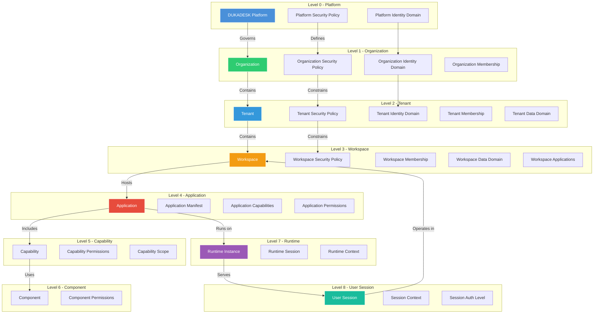
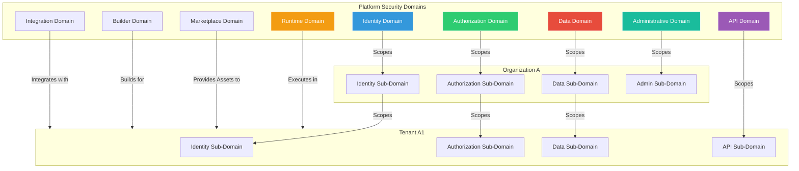
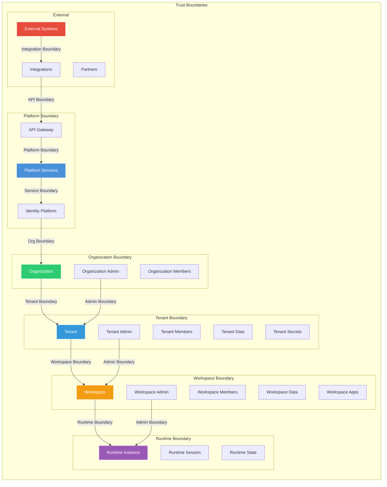
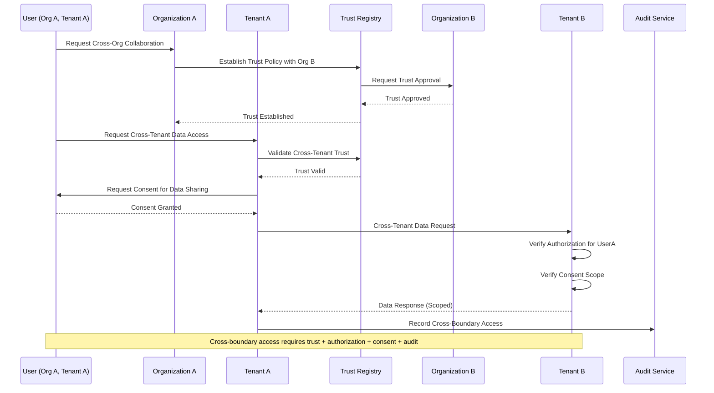
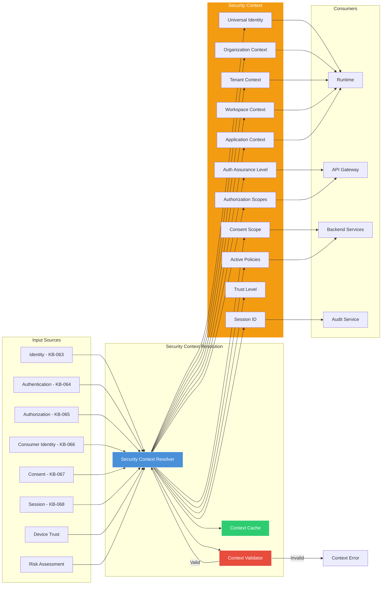
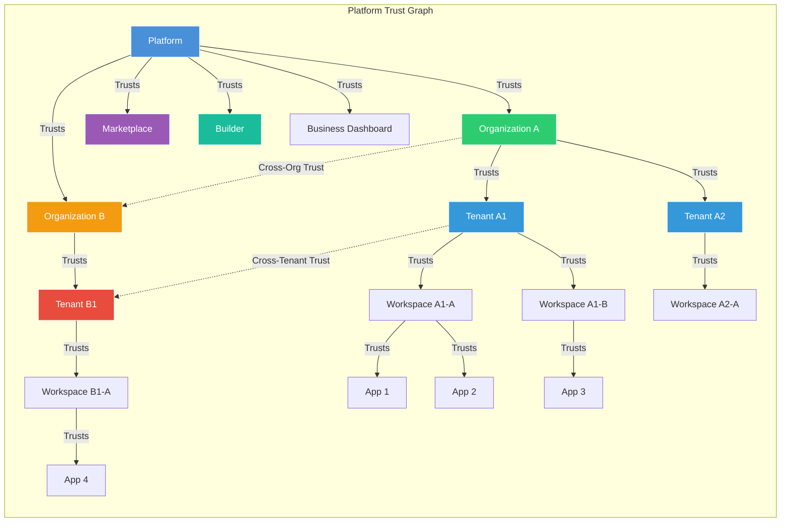

# Organization, Tenant & Workspace Security Architecture

**KB-069 — Organization, Tenant & Workspace Security Architecture Specification**

| Metadata | |
|----------|---|
| **KB ID** | KB-069 |
| **Title** | Organization, Tenant & Workspace Security Architecture |
| **Version** | 0.1.0 |
| **Status** | Draft |
| **Owner** | Architecture Team |
| **Suite** | Identity & Access Architecture |
| **Dependencies** | KB-043 Workspace & Tenant Model, KB-051 Runtime Architecture Overview, KB-057 Runtime Security Architecture, KB-058 Runtime Observability & Diagnostics Architecture, KB-063 Identity Platform Architecture, KB-064 Authentication Architecture, KB-065 Authorization & RBAC Architecture, KB-066 Universal Consumer Identity Architecture, KB-067 Consent & Privacy Architecture, KB-068 Session Management Architecture |
| **Related Documents** | KB-042 Application Manifest Specification, KB-048 Application State Model, KB-050 Capability Composition Model, KB-055 Runtime State Engine Architecture, KB-060 Runtime Lifecycle Management, KB-062 Runtime Deployment & Environment, KB-070 API Security & Token Architecture, KB-072 Audit, Compliance & Identity Governance Architecture |
| **Review Status** | Pending |
| **Last Updated** | 2026-07-11 |

---

### Revision History

| Version | Date | Author | Change |
|---------|------|--------|--------|
| 0.1.0 | 2026-07-11 | AI Architecture Agent | Initial draft |

---

## 1. Executive Summary

### 1.1 Purpose

This document defines the Organization, Tenant & Workspace Security Architecture for the DUKADESK Platform. It establishes the security boundaries, trust model, isolation architecture, and secure collaboration mechanisms that enable the platform's core architectural principle:

> **Shared Platform. Isolated Tenants. Secure Collaboration.**

The platform must guarantee that every Organization, Tenant, and Workspace operates within clearly defined trust boundaries while still participating in the unified DUKADESK ecosystem. Security is not layered on top of the multi-tenant model — it is embedded in the architecture of every boundary, every domain, and every cross-boundary interaction.

This document is the bridge between identity architecture (KB-063 through KB-068) and the platform's API, infrastructure, and operational security layers. It defines how identity, authorization, consent, and session security materialize as enforceable boundaries at every level of the platform hierarchy.

### 1.2 Scope

**In scope:**

- All architectural entities: Platform, Organizations, Tenants, Workspaces, Applications, Runtime, Marketplace Assets, Builder Studio, Business Dashboard, APIs, Integrations, Data Domains, Future AI Services
- Architectural principles: Zero Trust, Least Privilege, Shared Platform, Complete Tenant Isolation, Organization Isolation, Workspace Isolation, Explicit Trust Relationships, Defense in Depth, Secure by Default, Policy Enforcement Everywhere
- Canonical definitions: Security Boundary, Trust Boundary, Organization Boundary, Tenant Boundary, Workspace Boundary, Runtime Boundary, Isolation, Delegation, Security Context, Cross-Boundary Access, Secure Collaboration, Administrative Domain
- Multi-Tenant Security Architecture: Platform-level security with isolated organizations, tenants, and workspaces
- Security Hierarchy: Platform, Organization, Tenant, Workspace, Application, Capability, Component, Runtime, User Session
- Security Domains: Identity, Authorization, Runtime, Data, API, Integration, Marketplace, Builder, Administrative
- Trust Boundary Model: Boundaries between every pair of architectural entities with rules for controlled crossing
- Isolation Architecture: Identity, Session, Data, Runtime, Configuration, Storage, Secret, Network (conceptual), Integration, Marketplace Asset
- Cross-Boundary Collaboration: Shared users, shared organizations, cross-workspace collaboration, shared marketplace assets, delegated administration, external partners
- Administrative Security: Platform administrators, organization owners, tenant owners, workspace administrators, delegated administrators, emergency administration
- Responsibilities: Runtime, Identity Platform, Backend, Builder, Marketplace
- Security Controls: Boundary enforcement, context validation, permission enforcement, runtime verification, secret protection, configuration validation, secure delegation, administrative separation
- Privacy: Tenant privacy, organization privacy, consumer privacy, cross-tenant restrictions, metadata isolation, administrative visibility limits
- Performance: Security context resolution, boundary validation, policy evaluation, isolation overhead, administrative operations
- Observability: Boundary violations, isolation metrics, trust metrics, security events, administrative actions, cross-boundary requests (KB-058)
- Failure scenarios and anti-patterns
- Future evolution: Confidential computing, zero trust networking, dynamic trust evaluation, AI-assisted threat detection, secure multi-party collaboration, federated organizational trust

**Out of scope:**

- Identity authentication flows (covered in KB-064)
- Authorization policy evaluation (covered in KB-065)
- Consent enforcement (covered in KB-067)
- Session token management (covered in KB-068)
- API-level security controls (covered in KB-070)
- Infrastructure-level network security (conceptually referenced but not defined)
- Application-level business logic security

---

## 2. Architectural Principles

### 2.1 Zero Trust

No entity is trusted by default based on its position or relationship. Every cross-boundary interaction is authenticated, authorized, validated, and audited. Trust is never implicit — it is explicitly established, continuously verified, and immediately revocable.

### 2.2 Least Privilege

Every entity receives the minimum permissions, scope, and access necessary for its function. No organization, tenant, workspace, application, or user holds permissions beyond their defined scope. Privilege escalation requires explicit authorization and is fully audited.

### 2.3 Shared Platform

The platform is shared infrastructure. Organizations, tenants, and workspaces share the platform's identity, authentication, authorization, session, and runtime services. Sharing is governed by isolation — shared infrastructure does not imply shared data, state, or access.

### 2.4 Complete Tenant Isolation

Tenants are completely isolated from each other. No tenant can access another tenant's data, configuration, secrets, runtime state, users, or assets. Tenant isolation is enforced at every architectural layer — identity, data, runtime, storage, configuration, and API.

### 2.5 Organization Isolation

Organizations are isolated from each other. Organization A cannot access Organization B's tenants, workspaces, users, or billing data. Cross-organization access requires explicit trust relationships with governed policies.

### 2.6 Workspace Isolation

Workspaces within the same tenant are isolated from each other. Workspace A's data, configuration, applications, and members are inaccessible to Workspace B unless explicitly shared through collaboration mechanisms.

### 2.7 Explicit Trust Relationships

All cross-boundary access is governed by explicit trust relationships. Trust is established through defined policies, approved by authorized administrators, and recorded in the trust registry. No implicit trust exists between any entities.

### 2.8 Defense in Depth

Security is enforced at multiple independent layers. A bypass of one layer is caught by the next. Isolation is enforced at the identity layer, authorization layer, data layer, runtime layer, API layer, and infrastructure layer. No single layer is solely responsible for security.

### 2.9 Secure by Default

The default configuration is the most secure configuration. All boundaries are closed by default. All cross-boundary access is denied by default. All trust relationships are absent by default. Security must be explicitly reduced, never explicitly increased.

### 2.10 Policy Enforcement Everywhere

Security policies are enforced at every boundary crossing — not just at the platform perimeter. Every domain boundary, every trust boundary, every API call, every data access, every runtime operation is subject to policy enforcement. Policy is not centralized at a single gateway.

---

## 3. Canonical Definitions

### 3.1 Security Boundary

A logical or architectural perimeter that separates two entities and enforces isolation. Security boundaries exist between organizations, tenants, workspaces, applications, runtimes, and data domains. Crossing a security boundary requires authentication, authorization, and validation.

### 3.2 Trust Boundary

A specific type of security boundary across which trust is explicitly established. Trust boundaries define where one entity may interact with another. Trust is established through policies, recorded in the trust registry, and continuously validated.

### 3.3 Organization Boundary

The security perimeter around an organization. Everything within the organization boundary — tenants, workspaces, users, memberships, billing data, configuration — is isolated from other organizations. Cross-organization access requires explicit trust.

### 3.4 Tenant Boundary

The security perimeter around a tenant. Everything within the tenant boundary — workspace data, application configurations, user roles, assets, secrets, runtime state — is isolated from other tenants. Tenant boundaries are inviolable.

### 3.5 Workspace Boundary

The security perimeter around a workspace. Workspace data, applications, members, and state are isolated from other workspaces within the same tenant. Cross-workspace access requires explicit sharing policies.

### 3.6 Runtime Boundary

The security perimeter around a Runtime instance. The Runtime boundary separates the Runtime's execution context from other Runtimes, backend services, and external systems. Runtime boundaries enforce process, memory, and state isolation.

### 3.7 Isolation

The architectural guarantee that entities within different boundaries cannot access each other's data, state, configuration, secrets, or resources. Isolation is enforced at multiple layers and is inviolable by design.

### 3.8 Delegation

The authorized transfer of authority from one entity to another. Delegation is explicit, scoped, time-bound, and revocable. Delegation records the delegator, delegate, scope, duration, and purpose.

### 3.9 Security Context

The ambient security information that qualifies an operation — the identity, organization, tenant, workspace, application, runtime, authentication level, authorization scope, consent scope, and trust level. Security context is attached to every cross-boundary operation.

### 3.10 Cross-Boundary Access

Any operation that crosses a security or trust boundary. Cross-boundary access is governed by authentication, authorization, consent, trust policies, and audit. All cross-boundary access is denied by default.

### 3.11 Secure Collaboration

A governed mechanism enabling entities in different boundaries to share resources, data, or capabilities. Secure collaboration is explicit, policy-based, auditable, and revocable. Collaboration never compromises isolation.

### 3.12 Administrative Domain

The scope of authority for an administrative role. Platform administrators have platform-wide domain. Organization owners have organization domain. Tenant owners have tenant domain. Administrative domains are strictly hierarchical and non-overlapping.

---

## 4. Multi-Tenant Security Architecture

### 4.1 Multi-Tenant Security Architecture

```mermaid
flowchart TB
    subgraph Platform["DUKADESK Platform"]
        P_ID[Identity Platform - KB-063]
        P_AUTH[Authentication - KB-064]
        P_AZ[Authorization - KB-065]
        P_SESS[Session Management - KB-068]
        P_SEC[Platform Security Policy]
    end

    subgraph OB_A["Organization A Boundary"]
        O_A[Organization A]
        
        subgraph T_A1["Tenant A1 Boundary"]
            T1[Tenant A1]
            W_A1A[Workspace A1-A]
            W_A1B[Workspace A1-B]
            APP_A1[Applications]
            DATA_A1[Data Domain]
        end

        subgraph T_A2["Tenant A2 Boundary"]
            T2[Tenant A2]
            W_A2A[Workspace A2-A]
            APP_A2[Applications]
            DATA_A2[Data Domain]
        end
    end

    subgraph OB_B["Organization B Boundary"]
        O_B[Organization B]
        
        subgraph T_B1["Tenant B1 Boundary"]
            T3[Tenant B1]
            W_B1A[Workspace B1-A]
            APP_B1[Applications]
            DATA_B1[Data Domain]
        end
    end

    subgraph Runtime["Runtime Boundary"]
        R1[Runtime Instance - Org A, Tenant A1]
        R2[Runtime Instance - Org A, Tenant A2]
        R3[Runtime Instance - Org B, Tenant B1]
    end

    P_AZ -->|Governs All| O_A
    P_AZ -->|Governs All| O_B
    P_SESS -->|Session Context| R1
    P_SESS -->|Session Context| R2
    P_SESS -->|Session Context| R3

    O_A -->|Owns| T_A1
    O_A -->|Owns| T_A2
    O_B -->|Owns| T_B1

    T1 -->|Contains| W_A1A
    T1 -->|Contains| W_A1B
    T1 -->|Has| APP_A1
    T1 -->|Has| DATA_A1

    T2 -->|Contains| W_A2A
    T2 -->|Has| APP_A2
    T2 -->|Has| DATA_A2

    T3 -->|Contains| W_B1A
    T3 -->|Has| APP_B1
    T3 -->|Has| DATA_B1

    R1 -->|Serves| T1
    R2 -->|Serves| T2
    R3 -->|Serves| T3

    style P_SEC fill:#4a90d9,stroke:#fff,color:#fff
    style O_A fill:#2ecc71,stroke:#fff,color:#fff
    style O_B fill:#f39c12,stroke:#fff,color:#fff
    style T1 fill:#3498db,stroke:#fff,color:#fff
    style T2 fill:#3498db,stroke:#fff,color:#fff
    style T3 fill:#e74c3c,stroke:#fff,color:#fff
    style R1 fill:#9b59b6,stroke:#fff,color:#fff
    style R2 fill:#9b59b6,stroke:#fff,color:#fff
    style R3 fill:#9b59b6,stroke:#fff,color:#fff
```

### 4.2 Architecture Overview

The DUKADESK platform is a shared multi-tenant platform hosting multiple organizations, each containing multiple tenants, each containing multiple workspaces. Security architecture governs every layer:

- **Platform Layer**: Provides identity, authentication, authorization, session, and policy services to all organizations and tenants. Platform services are shared infrastructure with strict access controls.
- **Organization Layer**: Organizations are the top-level tenant grouping. Each organization owns its tenants, manages its members, controls its billing, and governs its security policies within platform constraints.
- **Tenant Layer**: Tenants are the primary isolation unit. Each tenant operates independently with isolated data, configuration, applications, users, and runtime execution. Tenant isolation is absolute.
- **Workspace Layer**: Workspaces provide operational separation within a tenant. Workspaces isolate applications, data, and members for specific purposes while sharing the tenant's identity and authorization framework.
- **Runtime Layer**: Runtime instances are scoped to a specific tenant and workspace. Runtime isolation prevents cross-tenant and cross-workspace state leakage, data access, or resource interference.

### 4.3 Security Posture by Layer

| Layer | Isolation Guarantee | Trust Model | Cross-Boundary Access |
|-------|-------------------|-------------|----------------------|
| Platform | Platform services isolated from tenants | Platform is trusted root | Platform-to-tenant through service APIs |
| Organization | Organizations isolated from each other | No cross-org trust by default | Explicit trust policies required |
| Tenant | Tenants isolated within and across orgs | No cross-tenant trust by default | Explicit consent + authorization required |
| Workspace | Workspaces isolated within tenant | Minimal cross-workspace trust | Explicit sharing policies required |
| Runtime | Runtime instances isolated per scope | Runtime trusts platform, not peers | Platform-mediated only |

---

## 5. Security Hierarchy

### 5.1 Security Hierarchy Model

### 5.2 Hierarchy Isolation Properties

| Level | Isolation Scope | Inherits From | Can Access |
|-------|----------------|---------------|------------|
| Platform | Global | None (root of trust) | All levels through policy |
| Organization | Organization-scoped | Platform | Own tenants, platform services |
| Tenant | Tenant-scoped | Organization | Own workspaces, own applications |
| Workspace | Workspace-scoped | Tenant | Own applications, own data |
| Application | Application-scoped | Workspace | Own capabilities, platform APIs |
| Capability | Capability-scoped | Application | Own data, declared platform APIs |
| Component | Component-scoped | Capability | Own state, parent capability APIs |
| Runtime | Runtime-instance-scoped | Tenant + Workspace | Scoped tenant services |
| Session | Session-scoped | User + Runtime | Scoped authorization + consent |

### 5.3 Policy Inheritance

Security policies flow downward through the hierarchy:

- **Platform Policies**: Global defaults that apply to all organizations. Platform policies define minimum security standards.
- **Organization Policies**: May tighten platform policies within the organization's scope. Cannot relax platform policies.
- **Tenant Policies**: May tighten organization policies within the tenant's scope. Cannot relax organization policies.
- **Workspace Policies**: May tighten tenant policies within the workspace's scope. Cannot relax tenant policies.
- **Application Policies**: Declared in application manifest. Must comply with workspace policies.

---

## 6. Security Domains

### 6.1 Security Domain Relationships

### 6.2 Identity Domain

The Identity Domain governs identity data and operations:

- **Platform Identity Domain**: Universal Identities (KB-063), authentication methods (KB-064), identity directory
- **Organization Identity Sub-Domain**: Organization memberships, organization roles, organization-specific identity attributes
- **Tenant Identity Sub-Domain**: Tenant memberships, tenant roles, tenant-specific identity attributes, consumer identities within tenant (KB-066)
- **Workspace Identity Sub-Domain**: Workspace memberships, workspace roles
- **Boundary Rules**: Identity data flows downward through scoping. A tenant can see organization identity attributes but not other tenants' identity attributes.

### 6.3 Authorization Domain

The Authorization Domain governs permissions and policies:

- **Platform Authorization Domain**: Global roles, platform-wide policies, authorization policy engine (KB-065)
- **Organization Authorization Sub-Domain**: Organization roles, organization-level policies
- **Tenant Authorization Sub-Domain**: Tenant roles, tenant-level policies, application permissions
- **Workspace Authorization Sub-Domain**: Workspace roles, workspace-level policies
- **Boundary Rules**: Authorization is evaluated at the most specific level. A user's effective permissions are the intersection of all applicable policies.

### 6.4 Runtime Domain

The Runtime Domain governs execution and state:

- **Runtime Instances**: Scoped to a single tenant and workspace. Runtime instances are isolated from each other.
- **Runtime State**: Session state, navigation state, screen state, component state. Scoped to the runtime instance.
- **Runtime Execution**: Component rendering, action execution, event processing. Executed within the runtime's security context.
- **Boundary Rules**: A runtime instance cannot access another runtime instance's state, memory, or execution context. Runtime-to-runtime communication is platform-mediated.

### 6.5 Data Domain

The Data Domain governs data storage and access:

- **Platform Data**: Identity directory, authorization policies, consent records, session metadata. Accessible only to platform services.
- **Organization Data**: Organization profile, billing data, audit logs. Accessible to organization administrators and platform services.
- **Tenant Data**: Tenant configuration, application data, user data, assets. Accessible only within the tenant boundary.
- **Workspace Data**: Workspace-specific data. Accessible only within the workspace boundary.
- **Boundary Rules**: Data domain boundaries are absolute. Cross-domain data access requires explicit authorization, consent, and audit.

### 6.6 API Domain

The API Domain governs API access:

- **Platform APIs**: Identity, authentication, authorization, consent, session APIs. Accessible to all authenticated entities within their scope.
- **Organization APIs**: Organization management, membership, billing APIs. Accessible to organization-authorized entities.
- **Tenant APIs**: Tenant management, application, data APIs. Accessible to tenant-authorized entities.
- **Boundary Rules**: API access is scoped to the requesting entity's domain. Cross-domain API calls require cross-boundary authorization.

### 6.7 Integration Domain

The Integration Domain governs external integrations:

- **Integration Scope**: Scoped to a specific tenant or workspace. Integrations cannot access resources outside their scope.
- **Integration Secrets**: Scoped to the integration's tenant. Integration credentials are tenant-specific.
- **Integration Data Flow**: Data flowing through integrations is subject to the same boundary rules as platform-internal data.
- **Boundary Rules**: Integrations are isolated per tenant. An integration configured for Tenant A cannot access Tenant B's data.

### 6.8 Marketplace Domain

The Marketplace Domain governs marketplace assets:

- **Asset Isolation**: Marketplace assets (capabilities, components, themes, templates) are isolated per installation. An asset installed in Tenant A cannot access Tenant B's runtime.
- **Asset Permissions**: Assets declare required permissions in their manifest. Permissions are reviewed during installation and enforced at runtime.
- **Asset Data**: Asset-specific data is stored within the installing tenant's data domain.
- **Boundary Rules**: Marketplace assets operate within the tenant boundary of their installation. Cross-tenant asset sharing requires explicit re-installation.

### 6.9 Builder Domain

The Builder Domain governs the Builder Studio:

- **Builder Scope**: Builder operations are scoped to the builder's authorized tenants and workspaces.
- **Builder Data**: Design data, unpublished changes, and builder configuration are stored within the builder's organization data domain.
- **Preview Runtime**: Preview runtime instances are isolated from production runtime instances. Preview data is separate from production data.
- **Boundary Rules**: Builder cannot access production data directly. Published assets flow through the publishing pipeline with independent validation.

### 6.10 Administrative Domain

The Administrative Domain governs administrative operations:

- **Platform Administration**: Full platform access. Strictly limited to platform administrators. Every operation audited.
- **Organization Administration**: Organization-scoped administration. Cannot access other organizations.
- **Tenant Administration**: Tenant-scoped administration. Cannot access other tenants.
- **Workspace Administration**: Workspace-scoped administration. Cannot access other workspaces.
- **Boundary Rules**: Administrative domains are strictly hierarchical. An organization administrator cannot perform tenant-level operations directly — they must operate through the tenant's administrative scope. Emergency break-glass procedures allow temporary cross-domain access with full audit.

---

## 7. Trust Boundary Model

### 7.1 Trust Boundary Model

### 7.2 Boundary Crossing Rules

| Boundary Crossing | Authentication Required | Authorization Required | Consent Required | Audit Required |
|------------------|------------------------|----------------------|-----------------|---------------|
| External → Platform | Yes (API key / OAuth) | Yes (API scope) | No | Yes |
| Platform → Organization | Yes (service identity) | Yes (platform admin) | No | Yes |
| Organization → Tenant | Yes (user session) | Yes (tenant role) | Yes (if user data) | Yes |
| Tenant → Workspace | Yes (user session) | Yes (workspace role) | Yes (if user data) | Yes |
| Workspace → Runtime | Yes (session token) | Yes (runtime authorization) | Yes (consent context) | Yes |
| Organization → Organization | Yes (cross-org trust) | Yes (cross-org policy) | Yes (user consent) | Yes |
| Tenant → Tenant | Yes (cross-tenant trust) | Yes (cross-tenant policy) | Yes (user consent) | Yes |
| Runtime → Runtime | Platform-mediated | Platform-mediated | Platform-mediated | Yes |

### 7.3 Trust Establishment

Trust between entities is established through explicit policies:

- **Platform → Organization Trust**: Established when an organization is created. Organization accepts platform terms and policies.
- **Organization → Tenant Trust**: Established when a tenant is created within the organization. Tenant inherits organization policies.
- **Cross-Organization Trust**: Established through explicit trust policies approved by both organization administrators. Trust is bilateral, scoped, and time-bound.
- **Cross-Tenant Trust**: Established through explicit trust policies approved by both tenant administrators. Trust requires user consent for data access.
- **External Trust**: Established through integration registration. External systems are authenticated through API credentials and scoped to specific integrations.

### 7.4 Trust Revocation

Trust is revocable at any time:

- **Trust Revocation Effects**: All cross-boundary operations cease immediately. In-flight operations are allowed to complete or are rolled back per operation semantics.
- **Revocation Propagation**: Trust revocation is propagated to all affected services through the platform event bus.
- **Revocation Notification**: Affected entities are notified of trust revocation with explanation.

---

## 8. Isolation Architecture

### 8.1 Isolation Architecture Overview

```mermaid
flowchart TB
    subgraph IsolationLayers["Isolation Architecture"]
        direction TB
        
        I1[Identity Isolation]
        I2[Session Isolation]
        I3[Data Isolation]
        I4[Runtime Isolation]
        I5[Configuration Isolation]
        I6[Storage Isolation]
        I7[Secret Isolation]
        I8[Network Isolation - Conceptual]
        I9[Integration Isolation]
        I10[Marketplace Asset Isolation]
    end

    subgraph EnforceAt["Enforced At"]
        IdentityPlatform[Identity Platform]
        SessionMgr[Session Manager]
        DataSvc[Data Services]
        Runtime[Runtime]
        ConfigSvc[Configuration Service]
        Storage[Storage Layer]
        Vault[Secrets Vault]
        Network[Network Layer]
        Gateway[API Gateway]
        MarketRuntime[Marketplace Runtime]
    end

    I1 --> IdentityPlatform
    I2 --> SessionMgr
    I3 --> DataSvc
    I4 --> Runtime
    I5 --> ConfigSvc
    I6 --> Storage
    I7 --> Vault
    I8 --> Network
    I9 --> Gateway
    I10 --> MarketRuntime

    style I1 fill:#3498db,stroke:#fff,color:#fff
    style I2 fill:#2ecc71,stroke:#fff,color:#fff
    style I3 fill:#f39c12,stroke:#fff,color:#fff
    style I4 fill:#e74c3c,stroke:#fff,color:#fff
    style I5 fill:#9b59b6,stroke:#fff,color:#fff
    style I6 fill:#1abc9c,stroke:#fff,color:#fff
    style I7 fill:#e67e22,stroke:#fff,color:#fff
    style I8 fill:#34495e,stroke:#fff,color:#fff
    style I9 fill:#16a085,stroke:#fff,color:#fff
    style I10 fill:#c0392b,stroke:#fff,color:#fff
```

### 8.2 Identity Isolation

Identity data is isolated per boundary:

- **Platform Identity**: Universal Identities are stored at the platform level. Identity data is accessible to platform services and, through consent, to authorized tenants.
- **Organization Identity**: Organization memberships and organization-specific attributes are stored at the organization level. Not visible to other organizations.
- **Tenant Identity**: Tenant memberships and tenant-specific identity data are stored at the tenant level. Not visible to other tenants.
- **Workspace Identity**: Workspace memberships are stored at the workspace level. Not visible to other workspaces.
- **Identity Resolution**: Identity is resolved through the security context. The identity platform resolves the applicable identity data based on the requesting entity's boundary and scope.

### 8.3 Session Isolation

Sessions are isolated per boundary:

- **Session Scope**: Sessions are scoped to a specific user, device, and tenant context. A session in Tenant A cannot access Tenant B's resources.
- **Session State**: Session state is isolated to the session's runtime instance. No cross-session state access.
- **Session Context**: Session context includes the tenant and workspace boundaries. Context switching changes the active boundary within the same session.
- **Session Token**: Session tokens are bound to the session's scope. Token validation enforces boundary isolation.

### 8.4 Data Isolation

Data is isolated per boundary at the storage and access layer:

- **Tenant Data Isolation**: Each tenant's data is stored with tenant ID partitioning. Queries are automatically scoped to the requesting tenant's ID. Cross-tenant data access is architecturally prevented.
- **Workspace Data Isolation**: Workspace data is stored with workspace ID within tenant partitioning. Queries are scoped to workspace ID.
- **Organization Data Isolation**: Organization data is stored with organization ID partitioning. Cross-organization queries are prevented.
- **Data Access Patterns**: All data access APIs require tenant and workspace context. Data services enforce boundary scoping before returning results.

### 8.5 Runtime Isolation

Runtime instances are isolated per tenant and workspace:

- **Process Isolation**: Runtime instances for different tenants execute in separate processes or containers. No shared memory or process state.
- **State Isolation**: Runtime state (session, navigation, component) is scoped to a single tenant and workspace. No cross-tenant state access.
- **Execution Isolation**: Component execution, action execution, and event processing occur within the runtime's tenant-scoped context.
- **Resource Isolation**: Runtime resource consumption (memory, CPU, storage) is accounted per tenant. Resource limits prevent one tenant from affecting another.

### 8.6 Configuration Isolation

Configuration is isolated per boundary:

- **Platform Configuration**: Global platform settings. Accessible only to platform services and administrators.
- **Organization Configuration**: Organization branding, policies, settings. Accessible to organization administrators.
- **Tenant Configuration**: Tenant branding, applications, policies, settings. Accessible to tenant administrators and runtime within tenant.
- **Workspace Configuration**: Workspace settings, application configuration. Accessible to workspace administrators and runtime within workspace.
- **Configuration Inheritance**: Configuration flows downward. Tenant configuration inherits from organization with overrides. Workspace configuration inherits from tenant with overrides.

### 8.7 Storage Isolation

Storage is isolated per boundary:

- **Database Partitioning**: Tenant data is partitioned by tenant ID. Cross-tenant queries are architecturally impossible at the database layer.
- **Storage Accounts**: Organization and tenant data may be stored in separate storage accounts or containers.
- **Backup Isolation**: Backups are per-tenant or per-organization. Cross-tenant backup restoration is prevented.
- **Archive Isolation**: Archived data is tagged with tenant and organization identifiers. Access is scoped to the data's boundary.

### 8.8 Secret Isolation

Secrets are isolated per boundary:

- **Platform Secrets**: Platform-level signing keys, API keys, database credentials. Accessible only to platform services.
- **Organization Secrets**: Organization API keys, integration credentials. Accessible only to organization services and authorized tenants.
- **Tenant Secrets**: Tenant API keys, integration secrets, application secrets. Accessible only within the tenant boundary.
- **Workspace Secrets**: Workspace-specific secrets, temporary credentials. Accessible only within the workspace boundary.
- **Secret Scope**: Secrets are stored in a hierarchical vault with boundary-scoped access policies. A tenant cannot access another tenant's secrets.

### 8.9 Network Isolation (Conceptual)

Network isolation is a conceptual layer acknowledged but not fully defined in this architecture:

- **Tenant Network Segmentation**: Tenant workloads may be deployed in isolated network segments.
- **API Gateway Scoping**: API Gateway routes requests to tenant-scoped backend services based on tenant context.
- **Service Mesh Isolation**: Service-to-service communication is scoped to tenant boundaries through service mesh policies.
- **Egress Isolation**: Tenant-scoped egress policies control external communication.

### 8.10 Integration Isolation

Integrations are isolated per boundary:

- **Integration Scope**: Integrations are registered and scoped to a specific tenant or workspace. An integration cannot access resources outside its registered scope.
- **Integration Credentials**: Integration credentials are tenant-specific. Credentials for Tenant A cannot access Tenant B's resources.
- **Integration Data Flow**: Data flowing through integrations is tagged with the source tenant. Data services enforce tenant scoping on integration data access.
- **Integration Lifecycle**: Integration lifecycle is managed within the tenant boundary. Tenant deletion revokes all associated integrations.

### 8.11 Marketplace Asset Isolation

Marketplace assets are isolated per installation:

- **Installation Scope**: Assets are installed within a specific tenant and workspace. The installed asset operates within the tenant's boundary.
- **Asset Data Isolation**: Asset-specific data is stored within the installing tenant's data domain.
- **Asset Runtime Isolation**: Asset components and capabilities execute within the tenant's runtime instance.
- **Asset Permission Scoping**: Assets declare required permissions. Permissions are enforced within the tenant's authorization scope.
- **Cross-Tenant Asset Sharing**: Assets cannot access data from other tenants where they are installed. Each installation is independent.

---

## 9. Cross-Boundary Collaboration

### 9.1 Cross-Boundary Collaboration Flow

### 9.2 Shared Users

Users may belong to multiple organizations, tenants, and workspaces:

- **Global Identity**: The user's Universal Identity (KB-066) is shared across all boundaries. The user does not create separate identities per tenant.
- **Per-Boundary Membership**: Membership is established per boundary. A user may be a member of Organization A and Organization B with different roles and permissions.
- **User Data Isolation**: User profile data is shared only with the user's explicit consent (KB-067). Each tenant sees only the profile attributes the user has consented to share.
- **User Session Isolation**: Session context includes the active boundary. The user's session in Tenant A is isolated from their session context in Tenant B.

### 9.3 Shared Organizations

Organizations may share resources through explicit trust:

- **Cross-Organization Trust**: Organization A and Organization B establish a bilateral trust policy. Trust defines what resources are shared and under what conditions.
- **Shared Tenants**: In rare cases, a tenant may be shared between organizations. Shared tenant governance requires explicit agreements and platform approval.
- **Shared Marketplace Assets**: Organizations may share marketplace assets through organization-level licensing. Shared assets are governed by the asset's permission policy.
- **Trust Revocation**: Cross-organization trust is revocable by either party. Revocation triggers immediate cessation of shared access.

### 9.4 Cross-Workspace Collaboration

Workspaces within the same tenant may collaborate:

- **Workspace Sharing**: Workspace A may share specific resources (data, applications, members) with Workspace B.
- **Sharing Policies**: Sharing is governed by workspace-level policies approved by the workspace administrator.
- **Shared Members**: Users may be members of multiple workspaces within the same tenant. Each membership has independent roles and permissions.
- **Cross-Workspace Data Access**: Data access across workspace boundaries requires explicit authorization and audit.
- **Workspace Isolation Preserved**: Collaboration does not compromise workspace isolation. Shared resources are accessed through controlled interfaces, not through boundary relaxation.

### 9.5 Delegated Administration

Administrative authority may be delegated:

- **Delegation Scope**: Delegation is scoped to specific resources, actions, and duration. A tenant owner may delegate user management to a tenant administrator.
- **Delegation Chain**: Delegation may be hierarchical. A platform administrator delegates to an organization owner, who delegates to a tenant owner.
- **Delegation Revocation**: Delegation is revocable at any level. Revocation propagates downward through the delegation chain.
- **Delegation Audit**: Every delegation operation is recorded with delegator, delegate, scope, duration, and purpose.

### 9.6 External Partners

External partners may access tenant resources through governed integration:

- **Partner Onboarding**: Partners are registered through the integration framework. Partner identity is verified and credentials are issued.
- **Partner Scope**: Partner access is scoped to specific APIs, resources, and operations. Partner cannot exceed the declared scope.
- **Partner Data Access**: Partner data access is governed by the tenant's data sharing policies and user consent.
- **Partner Revocation**: Partner access is revocable at any time. Partner credentials are immediately invalidated on revocation.

---

## 10. Administrative Security

### 10.1 Administrative Security Model

```mermaid
flowchart TB
    subgraph PlatformAdmin["Platform Administration"]
        PA[Platform Administrator]
        PA_SCOPE[Scope: Entire Platform]
        PA_AUTH[Requires: MFA + Break-Glass]
        PA_AUDIT[Audit: Every Operation]
        PA_LIMIT[Max: 5 Concurrent Admins]
    end

    subgraph OrgAdmin["Organization Administration"]
        OA[Organization Owner]
        OA_SCOPE[Scope: Single Organization]
        OA_AUTH[Requires: MFA]
        OA_AUDIT[Audit: All Admin Operations]
        OA_LIMIT[Max: 10 Per Organization]
    end

    subgraph TenantAdmin["Tenant Administration"]
        TA[Tenant Owner]
        TA_SCOPE[Scope: Single Tenant]
        TA_AUTH[Requires: MFA]
        TA_AUDIT[Audit: All Admin Operations]
        TA_LIMIT[Max: 10 Per Tenant]
    end

    subgraph WorkspaceAdmin["Workspace Administration"]
        WA[Workspace Administrator]
        WA_SCOPE[Scope: Single Workspace]
        WA_AUTH[Requires: Standard Auth + Step-Up]
        WA_AUDIT[Audit: Configuration Changes]
        WA_LIMIT[Max: 20 Per Workspace]
    end

    subgraph DelegatedAdmin["Delegated Administration"]
        DA[Delegated Administrator]
        DA_SCOPE[Scope: Delegated Resources]
        DA_AUTH[Requires: Standard Auth]
        DA_AUDIT[Audit: All Delegated Operations]
        DA_LIMIT[As Defined by Delegation]
    end

    subgraph Emergency["Emergency Administration"]
        EA[Emergency Access]
        EA_SCOPE[Scope: Time-Bounded, Scoped]
        EA_AUTH[Requires: Break-Glass + Dual Auth]
        EA_AUDIT[Audit: Real-Time + Retroactive Review]
        EA_LIMIT[Max 60 Minutes, Requires Justification]
    end

    PA -->|Delegates| OA
    OA -->|Delegates| TA
    TA -->|Delegates| WA
    TA -->|Delegates| DA
    PA -->|Emergency Override| EA

    style PA fill:#e74c3c,stroke:#fff,color:#fff
    style OA fill:#2ecc71,stroke:#fff,color:#fff
    style TA fill:#3498db,stroke:#fff,color:#fff
    style WA fill:#f39c12,stroke:#fff,color:#fff
    style DA fill:#9b59b6,stroke:#fff,color:#fff
    style EA fill:#e67e22,stroke:#fff,color:#fff
```

### 10.2 Administrative Role Hierarchy

| Role | Scope | Appointed By | Authentication | Session Duration | Max Count |
|------|-------|-------------|----------------|-----------------|-----------|
| Platform Administrator | Entire platform | Platform owner | MFA + Hardware Key | 2 hours | 5 |
| Organization Owner | Single organization | Platform admin | MFA | 4 hours | Per org |
| Tenant Owner | Single tenant | Organization owner | MFA | 4 hours | Per tenant |
| Workspace Administrator | Single workspace | Tenant owner | MFA | 8 hours | Per workspace |
| Delegated Administrator | Delegated scope | Appointing admin | Standard auth | Per delegation | Per delegation |
| Emergency Administrator | Time-bounded scope | Break-glass policy | Dual auth + justification | 60 minutes | Per event |

### 10.3 Administrative Separation of Duties

- **No Role Overlap**: Platform administrator and organization owner are never the same person for the same organization. Tenant owner and workspace administrator are never the same person for the same workspace.
- **Operation Approval**: Sensitive operations (deletion, export, policy change) require dual approval from two administrators at the same or higher level.
- **Audit Independence**: Administrative audit logs are accessible only to auditors, not to the administrators being audited.
- **Emergency Override**: Emergency access bypasses normal authorization but is time-bounded, fully audited, and subject to retroactive review.

### 10.4 Emergency Administration

Emergency administration provides temporary elevated access for critical situations:

- **Activation Triggers**: System outage, security incident, administrator unavailability, critical configuration error.
- **Activation Requirements**: Dual authentication from two authorized personnel, written justification, time-bound scope.
- **Scope**: Limited to the minimum resources and operations required to resolve the emergency.
- **Duration**: Maximum 60 minutes. Extension requires re-approval.
- **Audit**: Real-time monitoring. Retroactive review within 24 hours by security team.
- **Notification**: All affected entity owners are notified of emergency access activation and deactivation.

---

## 11. Security Context Resolution

### 11.1 Security Context Resolution

### 11.2 Context Resolution Process

Security context is resolved for every cross-boundary operation:

1. **Identity Resolution**: Universal Identity resolved from session token
2. **Authentication Validation**: Authentication assurance level verified
3. **Boundary Resolution**: Current organization, tenant, workspace, and application resolved from session context
4. **Authorization Resolution**: Active authorization scopes resolved for the current boundary
5. **Consent Resolution**: Active consent grants resolved for the current boundary
6. **Device Trust Resolution**: Device trust level resolved from device attestation
7. **Risk Assessment**: Risk score resolved from risk service
8. **Policy Compilation**: Applicable policies compiled from all levels (platform, organization, tenant, workspace)
9. **Trust Level Calculation**: Composite trust level calculated from all inputs
10. **Context Assembly**: Complete security context assembled and cached for the operation

### 11.3 Context Caching

Security context is cached for performance:

- **Cache Scope**: Per request, per session, per runtime instance
- **Cache TTL**: Configurable per context element (identity: 60s, authorization: 60s, consent: 60s, device trust: 300s)
- **Cache Invalidation**: Context is invalidated on any change event (authorization change, consent revocation, device trust change, policy update)
- **Cache Miss**: On cache miss, context is re-resolved from source services

---

## 12. Platform Trust Graph

### 12.1 Platform Trust Graph

### 12.2 Trust Graph Properties

- **Directed Trust**: Trust is directional. Organization A trusting Organization B does not imply Organization B trusts Organization A.
- **Hierarchical Trust**: Trust flows downward through the hierarchy. Platform → Organization → Tenant → Workspace → Application.
- **Explicit Cross-Trust**: Cross-organization and cross-tenant trust is explicit. It is not implied by hierarchical trust.
- **Trust Scope**: Each trust edge has a defined scope — what resources, operations, and duration are covered.
- **Trust Revocation**: Any trust edge can be revoked independently. Revocation does not affect other trust relationships.

### 12.3 Trust Requirements

| Relationship | Trust Required | Established By | Validated By |
|-------------|---------------|---------------|--------------|
| Platform → Organization | Inherent at org creation | Platform policy | Every operation |
| Organization → Tenant | Inherent at tenant creation | Organization policy | Every operation |
| Tenant → Workspace | Inherent at workspace creation | Tenant policy | Every operation |
| Workspace → Application | Application installation | Workspace admin | Every operation |
| Organization → Organization | Explicit trust policy | Both org admins | Cross-org operation |
| Tenant → Tenant | Explicit trust policy | Both tenant admins | Cross-tenant operation |
| Organization → External | Integration registration | Org admin | Every API call |

---

## 13. Boundary Enforcement Pipeline

### 13.1 Boundary Enforcement Pipeline

```mermaid
flowchart LR
    subgraph Request["Incoming Request"]
        REQ[API Request]
        CTX[Security Context]
    end

    subgraph Pipeline["Boundary Enforcement Pipeline"]
        B1[Identify Source Boundary]
        B2[Identify Target Boundary]
        B3[Validate Boundary Crossing]
        B4[Validate Authentication]
        B5[Validate Authorization]
        B6[Validate Consent]
        B7[Validate Trust Policy]
        B8[Validate Security Context Integrity]
        B9[Enforce Policy]
    end

    subgraph Decision["Decision"]
        ALLOW[Allow - Execute Operation]
        DENY[Deny - Return Error]
        AUDIT[Audit - Log Decision]
    end

    REQ --> B1
    CTX --> B1
    B1 --> B2
    B2 --> B3
    B3 --> B4
    B4 --> B5
    B5 --> B6
    B6 --> B7
    B7 --> B8
    B8 --> B9

    B9 -->|Pass| ALLOW
    B9 -->|Fail| DENY

    ALLOW --> AUDIT
    DENY --> AUDIT

    style B1 fill:#3498db,stroke:#fff,color:#fff
    style B3 fill:#f39c12,stroke:#fff,color:#fff
    style B9 fill:#e74c3c,stroke:#fff,color:#fff
    style ALLOW fill:#2ecc71,stroke:#fff,color:#fff
    style DENY fill:#e74c3c,stroke:#fff,color:#fff
```

### 13.2 Pipeline Stages

1. **Identify Source Boundary**: Determine the requesting entity's current boundary (organization, tenant, workspace, runtime)
2. **Identify Target Boundary**: Determine the target resource's boundary
3. **Validate Boundary Crossing**: If source and target boundaries differ, validate that crossing is permitted
4. **Validate Authentication**: Verify the requesting entity is authenticated at the required level
5. **Validate Authorization**: Verify the requesting entity has authorization for the operation in the target boundary
6. **Validate Consent**: Verify the data subject has granted consent for the data access (if applicable)
7. **Validate Trust Policy**: Verify that a trust relationship exists between source and target boundaries (if applicable)
8. **Validate Security Context Integrity**: Verify that the security context is internally consistent and not tampered with
9. **Enforce Policy**: Apply all applicable policies and return allow or deny decision

### 13.3 Enforcement Points

Boundary enforcement is applied at every architectural layer:

- **API Gateway**: First enforcement point for all external requests. Validates authentication, authorization, and boundary.
- **Identity Platform**: Enforces identity and consent boundaries.
- **Authorization Service**: Enforces authorization policy boundaries (KB-065).
- **Runtime**: Enforces runtime isolation boundaries and session boundaries.
- **Data Services**: Enforces data domain boundaries at the storage access layer.
- **Backend Services**: Enforces service-level boundaries for inter-service communication.

---

## 14. Runtime Responsibilities

- Enforce runtime isolation between tenants and workspaces — no cross-tenant state, memory, or execution access
- Validate security context for every operation — identity, tenant, workspace, authorization, consent
- Enforce session boundaries — session state is scoped to the runtime instance
- Validate boundary crossings — runtime-to-runtime communication requires platform mediation
- Enforce capability and component permissions within the tenant's authorization scope
- Protect runtime secrets — tenant-specific secrets are never exposed outside the runtime boundary
- Maintain runtime audit log — every security-relevant operation is recorded
- Handle runtime isolation failure — detect and recover from boundary violations

---

## 15. Identity Platform Responsibilities

- Enforce identity isolation — identity data is scoped per boundary
- Validate authentication assurance level per boundary requirements
- Provide security context resolution service for all platform components
- Maintain the trust registry — record and validate all trust relationships
- Enforce consent boundaries — consent grants are scoped per tenant
- Enforce session boundaries — sessions are scoped to tenant context
- Provide administrative security APIs — role management, delegation, emergency access
- Maintain boundary violation detection and alerting

---

## 16. Backend Responsibilities

- Enforce data domain boundaries — data queries are scoped to tenant and workspace
- Validate security context on every API request — reject requests with invalid or missing context
- Enforce storage isolation — data partitioning by tenant and workspace at the storage layer
- Protect secrets — tenant secrets are inaccessible outside the tenant boundary
- Support cross-boundary audit — every cross-boundary operation is logged with source and target boundaries
- Enforce integration isolation — integration data access is scoped to the integration's registered tenant

---

## 17. Builder Responsibilities

- Enforce Builder scope isolation — Builder operates within its authorized boundaries
- Validate publishing pipeline — published assets are validated for boundary compliance
- Protect preview isolation — preview runtime is isolated from production
- Enforce design-time permission boundaries — Builder users cannot access resources outside their authorization
- Validate manifest declarations — application manifests are validated for boundary compliance
- Provide security visualization — Builder UI displays security boundaries and trust relationships

---

## 18. Marketplace Responsibilities

- Enforce asset isolation — marketplace assets are isolated per installation
- Validate asset permissions — asset manifests are reviewed for permission scope
- Enforce installation boundaries — assets are installed within a tenant, not across tenants
- Protect asset data — asset-specific data is stored within the installing tenant's data domain
- Provide asset security certification — marketplace certification includes security boundary review
- Enforce asset update governance — asset updates are validated for boundary compliance

---

## 19. Security Controls

### 19.1 Boundary Enforcement

- **Boundary Identification**: Every resource and operation is tagged with its boundary (organization, tenant, workspace).
- **Boundary Validation**: Every cross-boundary operation is validated against the boundary enforcement pipeline.
- **Boundary Error**: Cross-boundary violations return clear errors indicating the boundary violation.
- **Boundary Monitoring**: Boundary violations are monitored and alerted in real-time.

### 19.2 Context Validation

- **Context Completeness**: Security context must include all required fields — identity, organization, tenant, workspace, application.
- **Context Consistency**: Context fields are validated for internal consistency. Organization ID in context must match the organization associated with the tenant ID.
- **Context Freshness**: Context must be recent (within configurable TTL). Stale context triggers re-resolution.
- **Context Integrity**: Context is cryptographically signed to prevent tampering.

### 19.3 Permission Enforcement

- **Permission Scoping**: Permissions are evaluated within the current security context. A user's permission in Tenant A does not apply in Tenant B.
- **Permission Inheritance**: Permissions flow downward through the hierarchy. Platform permissions set the maximum. Each level narrows.
- **Permission Revocation**: Permission changes take effect immediately. Active operations are re-validated on next checkpoint.
- **Permission Audit**: Every permission evaluation is logged for audit.

### 19.4 Runtime Verification

- **Runtime Integrity**: Runtime instances verify their integrity on startup and periodically during operation.
- **Runtime Attestation**: Runtime instances may be attested to verify they are running the expected software in the expected configuration.
- **Runtime Boundary Verification**: Runtime instances verify that their assigned tenant and workspace match their security context.
- **Runtime Isolation Testing**: Runtime isolation is periodically tested through automated boundary violation attempts.

### 19.5 Secret Protection

- **Secret Scoping**: Secrets are scoped to the minimum boundary required. A workspace secret is not accessible at the tenant level.
- **Secret Encryption**: Secrets are encrypted at rest and in transit. Encryption keys are boundary-scoped.
- **Secret Rotation**: Secrets are rotated on a schedule and on security events.
- **Secret Access Audit**: Every secret access is logged with the requesting entity's security context.

### 19.6 Configuration Validation

- **Configuration Scoping**: Configuration is scoped to the configuration's boundary. Tenant configuration is not accessible outside the tenant.
- **Configuration Validation**: Configuration changes are validated against security policies before application.
- **Configuration Audit**: Every configuration change is logged with the change author's security context.
- **Configuration Rollback**: Configuration changes can be rolled back to the previous valid state.

### 19.7 Secure Delegation

- **Explicit Delegation**: Delegation is always explicit. There is no implicit delegation.
- **Scoped Delegation**: Delegation is scoped to specific resources, actions, and duration.
- **Revocable Delegation**: Delegation is revocable at any time by the delegator.
- **Auditable Delegation**: Every delegation operation is logged with delegator, delegate, scope, and duration.

### 19.8 Administrative Separation

- **Role Separation**: Administrative roles are separated by scope. No single role spans platform and tenant scopes.
- **Dual Approval**: Sensitive operations require approval from two administrators.
- **Audit Independence**: Audit logs are accessible to auditors, not to the administrators being audited.
- **Emergency Oversight**: Emergency access is monitored in real-time and reviewed retroactively.

---

## 20. Privacy

### 20.1 Tenant Privacy

- **Data Isolation**: Each tenant's data is completely isolated. No tenant can access another tenant's data.
- **Metadata Isolation**: Tenant metadata (name, branding, configuration) is visible only within the tenant's boundary and to platform administrators.
- **Usage Privacy**: Tenant usage patterns and analytics are not visible to other tenants.
- **Tenant Deletion**: On tenant deletion, all tenant data is purged after the legal hold period.

### 20.2 Organization Privacy

- **Organization Isolation**: Organization data is isolated from other organizations.
- **Membership Privacy**: Organization membership lists are visible only within the organization.
- **Billing Privacy**: Billing data and payment information are visible only to organization administrators and platform billing services.

### 20.3 Consumer Privacy

- **Identity Privacy**: Consumer identity data is shared only with explicit consent (KB-067).
- **Activity Privacy**: Consumer activity within a tenant is visible only to that tenant and the consumer.
- **Cross-Tenant Privacy**: Consumer activity in Tenant A is not visible to Tenant B.
- **Consumer Data Deletion**: Consumers can request deletion of their data from any tenant.

### 20.4 Cross-Tenant Restrictions

- **No Default Sharing**: Cross-tenant data sharing is prohibited by default.
- **Explicit Consent Required**: Cross-tenant data sharing requires explicit consumer consent.
- **Scoped Sharing**: Cross-tenant data sharing is scoped to specific attributes and purposes.
- **Revocable Sharing**: Cross-tenant data sharing is revocable by the consumer at any time.

### 20.5 Metadata Isolation

- **Operational Metadata**: Operational metadata (session counts, API call volumes, storage usage) is aggregated and anonymized across tenants for platform operations. Per-tenant metadata is visible only within the tenant boundary.
- **Security Metadata**: Security events and audit logs are tagged with tenant and organization identifiers. Cross-tenant security metadata is visible only to platform security services.

### 20.6 Administrative Visibility Limits

- **Platform Administrators**: Can see metadata across all boundaries but cannot access tenant data without explicit authorization and audit.
- **Organization Administrators**: Can see organization-scoped metadata and data. Cannot access tenant data directly.
- **Tenant Administrators**: Can see tenant-scoped data. Cannot access workspace data without workspace authorization.
- **Workspace Administrators**: Can see workspace-scoped data. Cannot access other workspaces.

---

## 21. Performance

### 21.1 Security Context Resolution

| Operation | Target (p95) | Cache Behavior |
|-----------|-------------|----------------|
| Context Resolution | < 20ms | Cached for 60s |
| Context Validation | < 5ms | N/A (per operation) |
| Boundary Identification | < 2ms | Cached per request |
| Trust Policy Lookup | < 10ms | Cached for 300s |

### 21.2 Boundary Validation

| Operation | Target (p95) | Frequency |
|-----------|-------------|-----------|
| Boundary Crossing Validation | < 15ms | Per cross-boundary operation |
| Cross-Tenant Authorization | < 25ms | Per cross-tenant operation |
| Cross-Organization Authorization | < 30ms | Per cross-org operation |
| Integration Boundary Check | < 10ms | Per integration operation |

### 21.3 Policy Evaluation

| Operation | Target (p95) | Notes |
|-----------|-------------|-------|
| Policy Compilation | < 20ms | On context resolution |
| Policy Evaluation | < 10ms | Per operation |
| Multi-Level Policy Merge | < 15ms | On context change |

### 21.4 Isolation Overhead

- **Runtime Isolation Overhead**: < 5% CPU/memory overhead for tenant-scoped runtime instances
- **Data Isolation Overhead**: < 2ms per query for tenant-scoped data access
- **Storage Isolation Overhead**: < 1% storage overhead for boundary-scoped partitioning
- **Secret Isolation Overhead**: < 5ms per secret access for boundary-scoped vault access

---

## 22. Observability

Reference KB-058 Runtime Observability & Diagnostics Architecture.

### 22.1 Boundary Violations

- **Violation Detection**: Every denied cross-boundary access attempt is detected, logged, and alerted.
- **Violation Classification**: Violations are classified by type — unauthorized tenant access, unauthorized workspace access, cross-org access without trust, consent violation, context mismatch.
- **Violation Metrics**: Count and rate of boundary violations by type, source boundary, target boundary.
- **Violation Alerting**: Configurable alerts for violation thresholds — unusual patterns, repeated violations from same source, escalation of violation severity.

### 22.2 Isolation Metrics

- **Tenant Isolation**: Number of active tenants, isolation validation pass/fail rate, isolation breach attempts.
- **Workspace Isolation**: Number of active workspaces per tenant, cross-workspace access requests, workspace isolation validation.
- **Runtime Isolation**: Runtime instance count per tenant, runtime isolation validation, runtime boundary violations.

### 22.3 Trust Metrics

- **Active Trust Relationships**: Count of cross-organization and cross-tenant trust relationships.
- **Trust Validation**: Trust validation pass/fail rate, trust revocation events, trust expiration events.
- **Trust Request Volume**: Count of trust establishment requests, approval rate, average approval time.

### 22.4 Security Events

- **Administrative Actions**: All administrative operations logged with actor, action, scope, and outcome.
- **Delegation Events**: Delegation creation, modification, revocation events.
- **Emergency Access Events**: Emergency access activation, deactivation, and retroactive review results.
- **Configuration Changes**: All boundary-scoped configuration changes logged with change author.

### 22.5 Cross-Boundary Requests

- **Request Volume**: Count of cross-boundary requests by type (cross-tenant, cross-org, cross-workspace).
- **Request Outcome**: Pass/fail rate for cross-boundary requests by type and boundary pair.
- **Request Latency**: Cross-boundary request latency by type.

---

## 23. Failure Scenarios

### 23.1 Cross-Tenant Access Attempt

| Scenario | Impact | Mitigation |
|----------|--------|------------|
| User attempts to access data in Tenant B while authenticated in Tenant A | Boundary violation detected and blocked | Security context validation rejects request. Audit logged. User notified of boundary violation. |
| Malicious actor attempts to craft cross-tenant API request | Request blocked at API Gateway with boundary validation | Gateway validates tenant context against session. Request rejected with cross-tenant access denied. Alert triggered. |
| Application bug accidentally exposes cross-tenant data | Data leakage possible until detection | Data services enforce tenant scoping at query level. Tenant ID parameterization prevents accidental cross-tenant queries. |

### 23.2 Organization Boundary Violation

| Scenario | Impact | Mitigation |
|----------|--------|------------|
| Organization A member attempts to access Organization B resources | Cross-org access blocked unless trust policy exists | Authorization check validates org context. Cross-org trust policy lookup determines access. Denied by default. |
| Organization administrator account compromised | Attacker has org-scoped access | Session revocation disables all admin sessions. Emergency lockout procedure invoked. Audit trail enables damage assessment. |

### 23.3 Workspace Escalation

| Scenario | Impact | Mitigation |
|----------|--------|------------|
| Workspace member attempts to access another workspace's data | Cross-workspace access blocked | Workspace context validation rejects request. Sharing policy check determines if access is permitted. |
| Workspace administrator attempts to elevate privileges to tenant level | Privilege escalation blocked | Authorization evaluation prevents workspace admin from performing tenant-level operations. Dual approval required for scope changes. |

### 23.4 Misconfigured Trust Policy

| Scenario | Impact | Mitigation |
|----------|--------|------------|
| Trust policy grants broader access than intended | Unauthorized cross-boundary access possible | Trust policy validation at creation and on change. Policy scope review required. Automated policy testing. |
| Trust policy expires without notice | Cross-boundary operations suddenly fail | Trust policy expiration warnings sent before expiry. Grace period allows policy renewal. Affected operations are queued with retry. |

### 23.5 Runtime Isolation Failure

| Scenario | Impact | Mitigation |
|----------|--------|------------|
| Runtime instance memory leak affects co-located tenant | Performance degradation for other tenants | Resource limits per runtime instance prevent cross-tenant impact. Isolation boundaries enforced at OS/container level. |
| Runtime security boundary bypass | Cross-tenant state access | Defense in depth: runtime isolation, data isolation, API isolation. Multiple layers prevent single point of failure. |

### 23.6 Delegation Abuse

| Scenario | Impact | Mitigation |
|----------|--------|------------|
| Delegated administrator exceeds delegated scope | Unauthorized operations within delegation scope | Authorization enforcement validates every operation against delegation scope. Exceeded scope triggers alert and delegation suspension. |
| Delegation chain exploited for privilege escalation | Escalated access through delegation chain | Delegation chain depth limited (max 3 levels). Each delegation level independently validated. Audit trail enables chain tracing. |

### 23.7 Administrative Privilege Escalation

| Scenario | Impact | Mitigation |
|----------|--------|------------|
| Workspace administrator gains tenant owner privileges | Unauthorized tenant-level access | Role separation prevents privilege accumulation. Authorization evaluation at every operation prevents scope expansion. Audit trail detects anomalous privilege use. |
| Platform administrator account compromised | Full platform access | Emergency protocol invoked. All administrative sessions revoked. Break-glass active. Compromise investigation initiated. |

---

## 24. Anti-patterns

### 24.1 Shared Tenant Databases

**Anti-pattern**: Storing data for multiple tenants in the same database table without tenant-level partitioning or row-level security.

**Why**: Any query bug, SQL injection, or configuration error can cause cross-tenant data leakage. Tenants are not architecturally isolated.

**Solution**: Data is partitioned by tenant ID at the database level. Queries are automatically scoped to the requesting tenant's ID. Cross-tenant queries are architecturally impossible.

### 24.2 Global Administrator Access Without Boundaries

**Anti-pattern**: Granting platform administrators unrestricted access to all tenant data, configurations, and operations.

**Why**: Violates least privilege and tenant privacy. Administrators can access sensitive tenant data without tenant consent or knowledge.

**Solution**: Platform administrators have platform-scoped access. Tenant data access requires explicit authorization, tenant consent, and full audit. Administrative access is scoped, time-bound, and monitored.

### 24.3 Runtime Data Leakage

**Anti-pattern**: Runtime instances for different tenants sharing memory, state, or execution context through a common runtime process.

**Why**: One tenant's runtime data is accessible to another tenant. Runtime isolation is compromised.

**Solution**: Runtime instances are isolated per tenant at the process or container level. No shared memory or state between tenant runtimes.

### 24.4 Cross-Tenant Caches

**Anti-pattern**: Using a shared cache across tenants where one tenant's cached data can be accessed by another tenant.

**Why**: Cache keys may collide. Cache entries may be served to the wrong tenant. Tenant data leaks through cache.

**Solution**: Caches are tenant-scoped. Cache keys include tenant ID. Cache access is validated against tenant context. Tenant-specific cache instances are preferred.

### 24.5 Tenant-Owned Identity Providers

**Anti-pattern**: Allowing tenants to bring their own identity provider that bypasses the platform's identity, authorization, and consent architecture.

**Why**: Tenant-owned IdP creates a parallel identity domain outside platform governance. Platform cannot enforce authorization, consent, or session policies.

**Solution**: Identity is always platform-managed. Tenant-specific identity attributes are managed within the tenant's identity sub-domain under platform governance. External identity providers are federated through the platform (KB-071).

### 24.6 Shared Secrets

**Anti-pattern**: Using the same secret (API key, encryption key, signing key) across multiple tenants or organizations.

**Why**: Secret compromise in one tenant exposes all tenants. Secret rotation requires coordination across tenants.

**Solution**: Secrets are scoped per tenant and organization. Each tenant has independent secrets. Secret compromise is isolated to a single tenant.

### 24.7 Implicit Trust

**Anti-pattern**: Trusting entities based on their position in the hierarchy (e.g., trusting all applications from the Marketplace, trusting all users within an organization).

**Why**: Violates zero trust. Position in hierarchy does not guarantee trustworthiness. Compromised entity at any level affects all entities that implicitly trust it.

**Solution**: Trust is explicit, validated, and continuously verified. Every cross-boundary interaction is independently authenticated, authorized, and audited.

---

## 25. Future Evolution

### 25.1 Confidential Computing

Future isolation may leverage confidential computing — hardware-enforced trusted execution environments (TEEs) that encrypt data in use. Tenant data processed in TEEs is cryptographically isolated from the platform and infrastructure operators.

### 25.2 Zero Trust Networking

Future network isolation may implement zero trust networking principles — no implicit trust based on network location. Every network request is authenticated, authorized, and encrypted. Micro-segmentation enforces tenant boundaries at the network layer.

### 25.3 Dynamic Trust Evaluation

Future trust evaluation may be dynamic — trust levels are adjusted in real-time based on behavior, risk signals, and context. Trust is not static at establishment — it evolves throughout the relationship. Dynamic trust enables adaptive security responses.

### 25.4 AI-Assisted Threat Detection

Future threat detection may use AI to detect boundary violations, trust abuse, and isolation failures. AI models learn normal cross-boundary patterns and detect anomalies. Automated response isolates compromised entities.

### 25.5 Secure Multi-Party Collaboration

Future collaboration may enable secure multi-party computation across tenant boundaries — tenants collaborate on shared data without exposing their individual data to each other. Results are computed collaboratively; raw data remains isolated.

### 25.6 Federated Organizational Trust

Future trust may be federated — organizations trust each other through a federated trust framework rather than bilateral agreements. Trust is transitive through the federation, enabling broader collaboration while maintaining security.

---

## 26. Cross-References

| Reference | Document | Relationship |
|-----------|----------|-------------|
| **KB-042** | Application Manifest Specification | Application permission declarations and manifest validation |
| **KB-043** | Workspace & Tenant Model | Foundational entity hierarchy that security boundaries map to |
| **KB-048** | Application State Model | State isolation boundaries across tenants and workspaces |
| **KB-050** | Capability Composition Model | Capability permissions and isolation within tenant boundaries |
| **KB-051** | Runtime Architecture Overview | Runtime isolation within tenant and workspace scope |
| **KB-055** | Runtime State Engine Architecture | State isolation enforcement at the runtime layer |
| **KB-057** | Runtime Security Architecture | Runtime security controls for tenant isolation |
| **KB-058** | Runtime Observability & Diagnostics Architecture | Boundary violation monitoring and isolation metrics |
| **KB-060** | Runtime Lifecycle Management | Runtime lifecycle within tenant boundaries |
| **KB-062** | Runtime Deployment & Environment | Deployment isolation for tenant workloads |
| **KB-063** | Identity Platform Architecture | Identity isolation across boundaries |
| **KB-064** | Authentication Architecture | Authentication assurance levels per boundary |
| **KB-065** | Authorization & RBAC Architecture | Authorization scoping across boundaries |
| **KB-066** | Universal Consumer Identity Architecture | Consumer identity across tenant boundaries |
| **KB-067** | Consent & Privacy Architecture | Consent enforcement at boundary crossings |
| **KB-068** | Session Management Architecture | Session scope and context switching across boundaries |
| **KB-070** | API Security & Token Architecture | API-level boundary enforcement |
| **KB-072** | Audit, Compliance & Identity Governance Architecture | Audit trail for boundary crossings |

---

## 27. Mermaid Diagram Index

| Diagram | Section | Description |
|---------|---------|-------------|
| Multi-Tenant Security Architecture | 4.1 | Complete platform security architecture with organization, tenant, workspace, and runtime boundaries |
| Security Hierarchy | 5.1 | Nine-level security hierarchy from Platform through User Session with isolation properties and policy inheritance |
| Security Domain Relationships | 6.1 | Security domains and sub-domains with scoping relationships across organizations and tenants |
| Trust Boundary Model | 7.1 | Trust boundaries from External through Platform, Organization, Tenant, Workspace, and Runtime |
| Isolation Architecture | 8.1 | Ten isolation layers from Identity through Marketplace Asset with enforcement points |
| Cross-Boundary Collaboration Flow | 9.1 | Sequence diagram showing cross-org trust establishment, cross-tenant data access, and consent |
| Administrative Security Model | 10.1 | Administrative roles from Platform through Emergency with scope, authentication, audit, and limits |
| Security Context Resolution | 11.1 | Security context resolution from input sources through resolver to context output and consumers |
| Platform Trust Graph | 12.1 | Directed trust relationships across Platform, Organizations, Tenants, Workspaces, and Applications |
| Boundary Enforcement Pipeline | 13.1 | Nine-stage pipeline from source/target boundary identification through policy enforcement to allow/deny |

---

## 28. Architectural Note

KB-069 establishes the security boundaries that make DUKADESK's shared-platform, multi-tenant model viable. It ensures that organizations, tenants, workspaces, applications, and runtime resources remain isolated by default while enabling secure, policy-governed collaboration where explicitly permitted.

This document is the bridge between identity architecture (KB-063 through KB-068) and the platform's API and infrastructure security layers. The identity, authentication, authorization, consent, and session architectures define how users are identified and granted access. KB-069 defines where that access is permitted — within which boundaries, across which trust relationships, and under which security constraints.

With KB-069 complete, the identity and access suite has established a complete security model: who you are (KB-063, KB-064, KB-066), what you can do (KB-065), what you agreed to share (KB-067), how your session persists (KB-068), and where you can go (KB-069).
