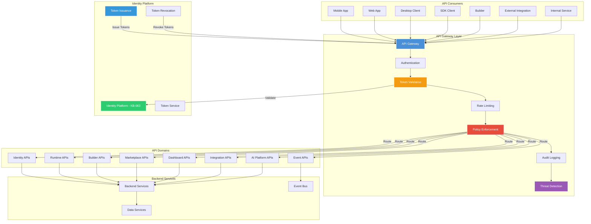
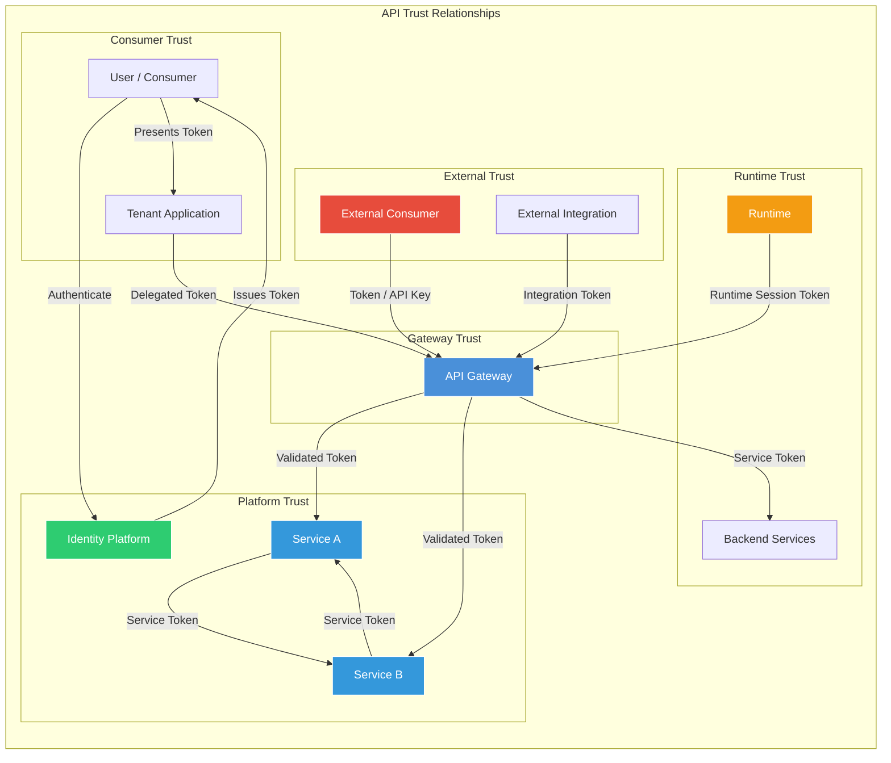
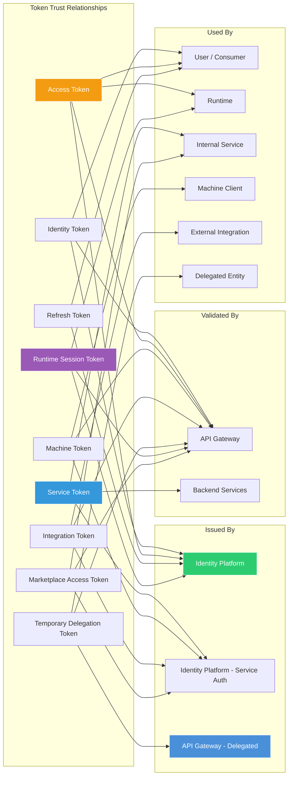
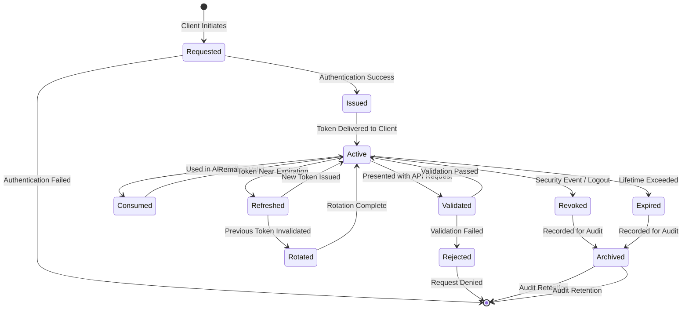
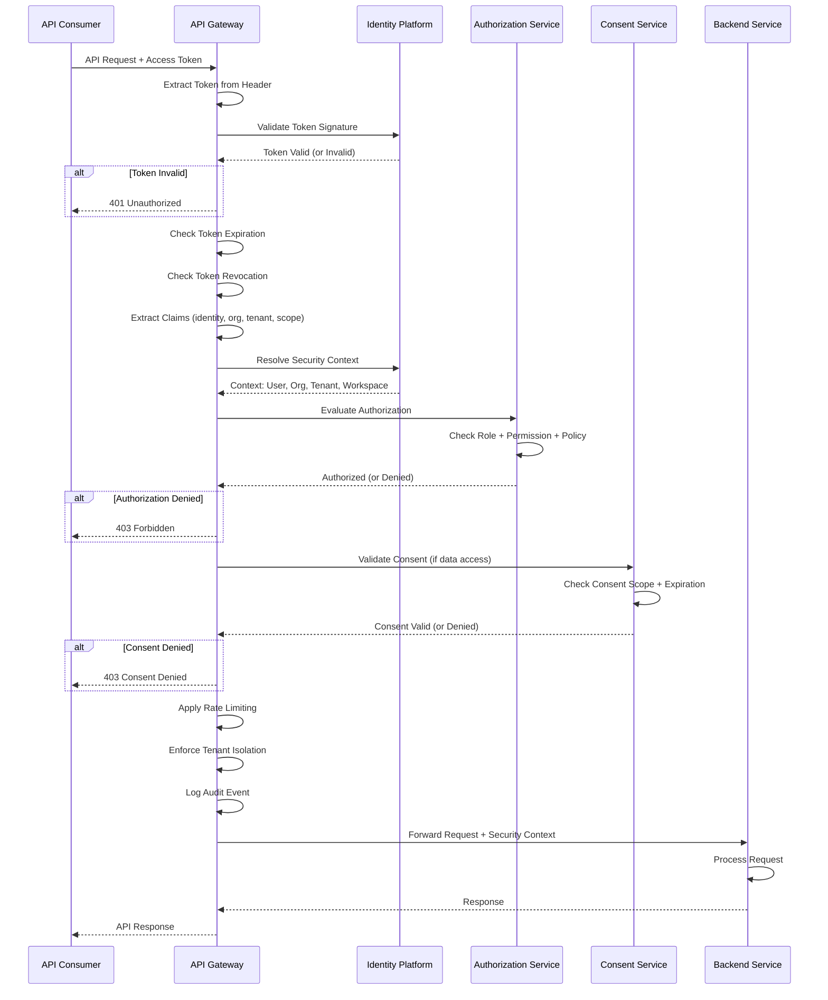
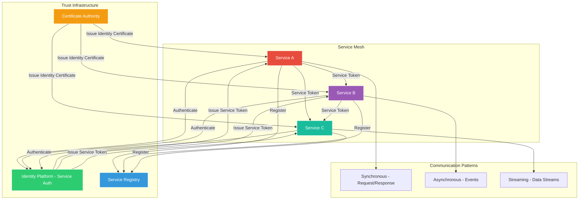
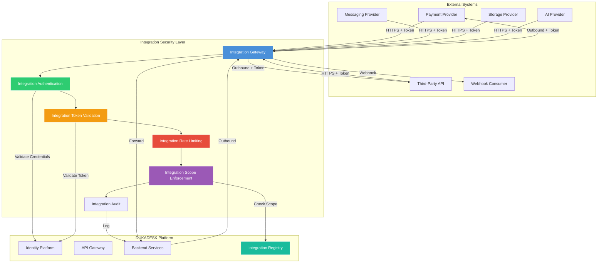
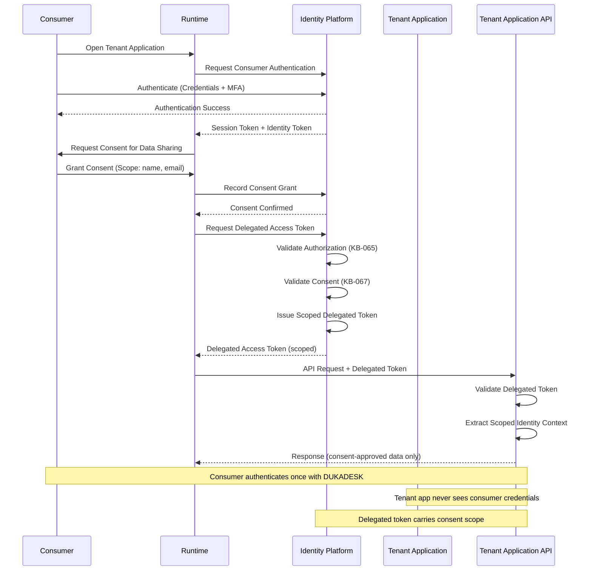
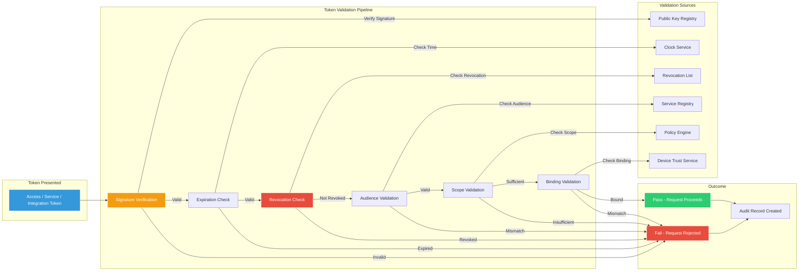

# API Security & Token Architecture

**KB-070 — API Security & Token Architecture Specification**

| Metadata | |
|----------|---|
| **KB ID** | KB-070 |
| **Title** | API Security & Token Architecture |
| **Version** | 0.1.0 |
| **Status** | Draft |
| **Owner** | Architecture Team |
| **Suite** | Identity & Access Architecture |
| **Dependencies** | KB-057 Runtime Security Architecture, KB-058 Runtime Observability & Diagnostics Architecture, KB-063 Identity Platform Architecture, KB-064 Authentication Architecture, KB-065 Authorization & RBAC Architecture, KB-066 Universal Consumer Identity Architecture, KB-067 Consent & Privacy Architecture, KB-068 Session Management Architecture, KB-069 Organization, Tenant & Workspace Security Architecture |
| **Related Documents** | KB-042 Application Manifest Specification, KB-050 Capability Composition Model, KB-051 Runtime Architecture Overview, KB-055 Runtime State Engine Architecture, KB-060 Runtime Lifecycle Management, KB-062 Runtime Deployment & Environment, KB-071 Identity Federation & Social Login (planned), KB-072 Audit, Compliance & Identity Governance Architecture |
| **Review Status** | Pending |
| **Last Updated** | 2026-07-11 |

---

### Revision History

| Version | Date | Author | Change |
|---------|------|--------|--------|
| 0.1.0 | 2026-07-11 | AI Architecture Agent | Initial draft |

---

## 1. Executive Summary

### 1.1 Purpose

This document defines the API Security & Token Architecture for the DUKADESK Platform. It establishes the architectural security model governing every API interaction within the DUKADESK ecosystem — consumer-facing, internal, service-to-service, and external integration.

The specification ensures consistent authentication, secure authorization, tenant isolation, trust verification, token governance, service-to-service trust, and cross-platform interoperability across all platform APIs.

This document defines architecture only. It is authentication-protocol-independent, identity-provider-independent, and implementation-independent.

### 1.2 Scope

**In scope:**

- All API categories: Public APIs, Internal APIs, Runtime APIs, Builder APIs, Marketplace APIs, Identity APIs, Integration APIs, SDK APIs, Mobile APIs, Web APIs, Dashboard APIs, Event APIs, Future AI APIs
- API security architecture: Identity Platform, Token Issuance, API Gateway Layer, Backend Services
- API trust model: Consumer ↔ Gateway, Gateway ↔ Service, Service ↔ Service, Runtime ↔ Backend, Builder ↔ Backend, Marketplace ↔ Backend, External Integration ↔ Platform
- Token architecture: Identity Token, Access Token, Refresh Token, Service Token, Machine Token, Integration Token, Temporary Delegation Token, Runtime Session Token, Marketplace Access Token
- Token lifecycle: Request, Issue, Validate, Consume, Refresh, Rotate, Revoke, Expire, Archive
- Token claims architecture: Identity, Organization, Tenant, Workspace, Roles, Permissions, Consent, Runtime Context, Audience, Trust Level, Session Reference
- API authorization flow: Authentication, Token Validation, Authorization Evaluation, Consent Validation, Policy Evaluation, Resource Access Decision
- API Gateway responsibilities: Authentication, Token Validation, Rate Limiting, Request Routing, Policy Enforcement, Audit, Monitoring, Threat Detection
- Service-to-service trust: Internal Service Identity, Service Authentication, Service Authorization, Mutual Trust, Context Propagation
- External integration security: Payment Providers, Messaging Providers, Storage Providers, AI Providers, Third-Party APIs, Webhooks
- Delegated Consumer Access for Tenant Applications (critical DUKADESK model)
- Responsibilities: Runtime, Backend, Identity Platform
- Security: Token Integrity, Replay Protection, Credential Leakage Prevention, Token Rotation, Revocation, Delegated Trust, API Abuse Protection, Request Validation
- Privacy: Token Data Minimization, Sensitive Claim Protection, Identity Separation, Cross-Tenant Isolation, API Metadata Protection
- Performance: Token Validation, Gateway Throughput, Service Authentication, Authorization Performance, Request Latency
- Observability: API Metrics, Token Metrics, Gateway Metrics, Authorization Metrics, Trust Metrics, Abuse Detection (KB-058)
- Failure scenarios and anti-patterns
- Future evolution: Proof-of-Possession Tokens, Hardware-Backed Tokens, Confidential Computing, Continuous Authorization, AI-Assisted Threat Detection, Adaptive Token Lifetimes

**Out of scope:**

- Implementation details of specific authentication protocols (OAuth 2.0, OIDC, SAML, etc.)
- Specific identity provider technology choices
- Network-level security (TLS, mTLS) — assumed but not defined
- Infrastructure-level API gateway deployment
- Application-level API business logic

---

## 2. Architectural Principles

### 2.1 Secure by Default

Every API endpoint is secure by default. Authentication is required unless explicitly declared public. Authorization is enforced unless explicitly declared open. Tokens are short-lived unless explicitly configured otherwise. The default configuration is the most secure configuration.

### 2.2 Zero Trust

Every API request is independently authenticated, authorized, and validated. No request is trusted based on network location, source IP, or prior validation. Service-to-service calls are authenticated and authorized with the same rigor as external requests.

### 2.3 Least Privilege

Tokens carry the minimum claims necessary for their purpose. API consumers receive the minimum scope required. Service identities have the minimum permissions for their function. No token, consumer, or service holds unnecessary privilege.

### 2.4 Token-Based Trust

Trust is established through cryptographically verifiable tokens, not through network position or shared secrets. Tokens are the authoritative proof of authentication, authorization, and context. Token validation is the foundation of all API security.

### 2.5 API Independence

Every API can be secured, validated, and audited independently. API authentication is not dependent on any other API. API authorization is self-contained within the API's security context. API independence ensures that a failure in one API does not compromise others.

### 2.6 Provider Independence

The token architecture is independent of any specific authentication protocol, identity provider, or token format. The architecture supports multiple token types, multiple issuance sources, and future protocol evolution without architectural change.

### 2.7 Short-Lived Credentials

All credentials have explicit, short lifetimes. Access tokens are measured in minutes. Service tokens are measured in hours. Long-lived credentials are replaced with refresh mechanisms. Short lifetimes limit exposure from credential compromise.

### 2.8 Explicit Authorization

Authorization is evaluated explicitly for every API operation. There is no implicit authorization based on authentication status. Token scope, authorization policies, and consent grants are evaluated independently for each request.

### 2.9 Context-Aware Access

API access decisions consider the full security context — identity, organization, tenant, workspace, authentication level, authorization scope, consent scope, trust level, and risk signals. Context is validated at the API Gateway and propagated to backend services.

### 2.10 Observable APIs

Every API request is observable — authentication, authorization, token validation, and access decisions are logged, metered, and monitored. API observability is the foundation for security monitoring, abuse detection, and compliance auditing.

### 2.11 Tenant Isolation

API access is strictly scoped to the requesting entity's tenant context. Cross-tenant API access is blocked by default and permitted only with explicit authorization and consent. Token claims and API Gateway enforcement ensure tenant isolation at the API layer.

---

## 3. Canonical Definitions

### 3.1 API

A defined interface that enables one software system to interact with another. In the DUKADESK ecosystem, APIs are the primary mechanism for all cross-component communication — between Runtimes and Backend, between Services, between Platform and Integrations.

### 3.2 API Gateway

The architectural component that serves as the single ingress point for all API requests. The API Gateway is responsible for authentication, token validation, rate limiting, request routing, policy enforcement, audit logging, and threat detection.

### 3.3 API Consumer

Any entity that makes API requests — a Runtime, a Builder instance, a Marketplace service, an external integration, a mobile application, a web application, or another platform service.

### 3.4 API Provider

Any entity that exposes APIs — the Identity Platform, Runtime Backend, Builder Backend, Marketplace Backend, Dashboard Services, or any platform or tenant service.

### 3.5 API Contract

The formal definition of an API's interface, including endpoints, request/response formats, authentication requirements, authorization scope, rate limits, and error responses. API contracts are defined in service manifests.

### 3.6 Access Token

A short-lived token presented by an API consumer with every API request. The access token authenticates the consumer and carries the security context (identity, organization, tenant, scope) for authorization decisions.

### 3.7 Refresh Token

A longer-lived token used to obtain new access tokens without requiring re-authentication. Refresh tokens are rotated on use and can be revoked independently of access tokens.

### 3.8 Identity Token

A token that carries identity claims about the authenticated user. Identity tokens are used for identity verification and user profile access, not for API authorization.

### 3.9 Service Token

A token used for service-to-service authentication. Service tokens identify the calling service and carry the service's authorization scope. Service tokens are machine credentials, not user credentials.

### 3.10 Machine Token

A token used by automated processes and machine clients. Machine tokens have no user identity — they represent the machine or process. Machine tokens are scoped to specific operations.

### 3.11 Integration Token

A token used by external integrations to authenticate with the platform. Integration tokens are scoped to the integration's registered capabilities and the tenant the integration is configured for.

### 3.12 Temporary Delegation Token

A short-lived token issued for delegated operations — a user delegates specific authority to another user, service, or process for a limited time and scope.

### 3.13 Runtime Session Token

A token specific to a Runtime instance. The Runtime Session Token carries the Runtime's identity and the current session context. It is presented by the Runtime to backend services.

### 3.14 Marketplace Access Token

A token used to access Marketplace resources. Marketplace Access Tokens are scoped to the installing tenant and the specific asset being accessed.

### 3.15 Token Claims

The assertions carried within a token — identity, organization, tenant, workspace, roles, permissions, scope, audience, issuer, issuance time, expiration time, and other contextual information. Claims are the basis for authorization decisions.

### 3.16 Token Scope

The declared boundary of a token's authority — which APIs, resources, and operations the token authorizes. Scope is established at token issuance and validated at every API request.

### 3.17 Token Audience

The intended recipient of a token. The audience claim identifies which service or API the token is valid for. Token validation includes audience verification to prevent token misuse across services.

### 3.18 Token Lifetime

The period during which a token is valid. Lifetime is defined by issuance and expiration timestamps. Token lifetime is configurable per token type and security policy.

### 3.19 Token Rotation

The process of replacing an existing token with a new token, invalidating the previous token. Rotation limits the window of exposure for compromised tokens.

### 3.20 Token Revocation

The process of invalidating a token before its expiration. Revocation is triggered by security events, credential compromise, user logout, or administrative action. Revoked tokens are rejected at validation.

### 3.21 API Trust

The confidence that an API request is from a legitimate, authenticated, and authorized source. API trust is established through token validation, and trust level affects authorization decisions.

### 3.22 API Context

The complete security context of an API request — identity, organization, tenant, workspace, authentication level, authorization scope, consent scope, device trust, risk score, and request metadata. API context is resolved from the presented token and validated at the API Gateway.

---

## 4. API Security Architecture

### 4.1 API Security Architecture

### 4.2 Architecture Overview

The API security architecture operates in layers:

- **API Consumers**: All entities that interact with the platform through APIs. Each consumer type has defined authentication and authorization patterns.
- **API Gateway Layer**: The single ingress point for all API requests. The Gateway enforces authentication, token validation, rate limiting, policy enforcement, audit logging, and threat detection before requests reach backend services.
- **Identity Platform**: The authoritative source for authentication, token issuance, token validation, and token revocation. The Identity Platform is the root of API trust.
- **API Domains**: Logical groupings of APIs by function. Each domain has specific authentication, authorization, and scope requirements.
- **Backend Services**: The services that implement API logic. Backend services receive validated, authenticated, and authorized requests from the Gateway.

### 4.3 API Categories and Security Profiles

| API Category | Authentication | Token Type | Scope | Audience |
|-------------|---------------|------------|-------|----------|
| Identity APIs | User credentials + MFA | Access Token + Identity Token | Identity operations | Identity Platform |
| Runtime APIs | Runtime Session Token | Access Token | Runtime session scope | Runtime Backend |
| Builder APIs | User credentials + step-up | Access Token | Builder capabilities | Builder Backend |
| Marketplace APIs | Access Token | Access Token + Marketplace Token | Marketplace scope | Marketplace Backend |
| Dashboard APIs | User credentials + MFA | Access Token | Dashboard scope | Dashboard Backend |
| Public APIs | Access Token or API Key | Access Token or Machine Token | Declared public scope | API Gateway |
| Internal APIs | Service Token | Service Token | Service capabilities | Target Service |
| Integration APIs | Integration Token | Integration Token | Integration scope | Integration Gateway |
| Event APIs | Service Token | Service Token | Event publishing/subscribing | Event Bus |
| AI APIs (future) | Delegation Token | Temporary Delegation Token | Delegated AI scope | AI Platform |

---

## 5. API Trust Model

### 5.1 Trust Relationships

### 5.2 Trust Relationships

| Relationship | Trust Mechanism | Validation | Scope |
|-------------|----------------|------------|-------|
| Consumer → Gateway | Access Token or API Key | Token validation (signature, expiry, revocation) | Consumer scope |
| Gateway → Service | Validated token forwarded | Token already validated by Gateway | Forwarded scope |
| Service → Service | Service Token | Mutual token validation | Service scope |
| Runtime → Backend | Runtime Session Token | Token validation + session validation | Session scope |
| Builder → Backend | Access Token + Builder scope | Token validation + builder authorization | Builder scope |
| Marketplace → Backend | Marketplace Access Token | Token validation + asset authorization | Asset installation scope |
| External Integration → Platform | Integration Token | Token validation + integration authorization | Integration scope |

### 5.3 Trust Establishment

- **Consumer Trust**: Established through authentication (KB-064). Consumer presents credentials to Identity Platform, receives tokens, presents tokens to API Gateway.
- **Service Trust**: Established through service identity and mutual token exchange. Each service has a unique identity registered in the service directory.
- **Runtime Trust**: Established through the Runtime's registered identity and the current session context. Runtime tokens are bound to the Runtime instance.
- **Integration Trust**: Established through the integration registration flow. Integration receives tenant-scoped credentials.

### 5.4 Trust Validation

Trust is validated at every API interaction:

- **Token Signature**: Each token is cryptographically signed. Signature verification confirms the token was issued by the trusted Identity Platform.
- **Token Expiration**: Token must be within its valid time window.
- **Token Revocation**: Token must not be on the revocation list.
- **Token Audience**: Token must be intended for the target service.
- **Token Scope**: Requested operation must be within token scope.
- **Token Binding**: Token must be presented from the bound context (device, service).

---

## 6. Token Architecture

### 6.1 Token Categories

| Token Type | Purpose | Typical Lifetime | Audience | Issued To |
|-----------|---------|-----------------|----------|-----------|
| Identity Token | Identity verification, user profile | 1 hour | Identity Platform | User |
| Access Token | API authorization | 15 minutes | API Gateway, Services | User, Runtime, Builder |
| Refresh Token | Obtain new access tokens | 7 days | Identity Platform | User |
| Service Token | Service-to-service auth | 1 hour | Target Service | Internal Service |
| Machine Token | Automated process auth | Configurable (hours) | API Gateway | Machine Client |
| Integration Token | External integration auth | Configurable (days) | Integration Gateway | External Integration |
| Temporary Delegation Token | Delegated operations | Per-operation or short window | Target Service | Delegated Entity |
| Runtime Session Token | Runtime-to-backend auth | Session lifetime | Backend Services | Runtime Instance |
| Marketplace Access Token | Marketplace resource access | Per-installation session | Marketplace Backend | Tenant Application |

### 6.2 Token Trust Relationships

### 6.3 Identity Token

The Identity Token carries user identity claims:

- **Purpose**: Identity verification for the user. Used to obtain user profile information, display user identity, and verify authentication.
- **Claims**: User identifier, authentication method, authentication timestamp, identity attributes (consent-scoped).
- **Lifetime**: Short (default: 1 hour). Not intended for API authorization.
- **Usage**: Presented to Identity Platform for identity operations. Not presented to other services.

### 6.4 Access Token

The primary token for API authorization:

- **Purpose**: Authenticate and authorize all API requests from users, Runtimes, and Builders.
- **Claims**: User identifier, organization context, tenant context, workspace context, authentication level, authorization scope, consent scope, session reference, audience, issuance time, expiration time.
- **Lifetime**: Short (default: 15 minutes). Limits exposure from token compromise.
- **Usage**: Presented with every API request as the primary authorization credential.
- **Obtainment**: Issued after successful authentication. Renewed through refresh token.

### 6.5 Refresh Token

The credential for obtaining new access tokens:

- **Purpose**: Obtain new access tokens without requiring re-authentication.
- **Claims**: User identifier, token family identifier, issuance time, expiration time.
- **Lifetime**: Long (default: 7 days). Configurable per security policy.
- **Rotation**: Rotated on every use. Old refresh token is invalidated when new one is issued.
- **Revocation**: Can be revoked independently. Refresh token revocation prevents further access token renewal.

### 6.6 Service Token

The credential for service-to-service communication:

- **Purpose**: Authenticate and authorize internal service calls.
- **Claims**: Service identifier, service role, authorization scope, audience, issuance time, expiration time.
- **Lifetime**: Moderate (default: 1 hour). Short enough for rotation, long enough for efficient service calls.
- **Obtainment**: Issued by the Identity Platform's service authentication flow. Service presents its identity credential.
- **Usage**: Presented with every service-to-service API call.

### 6.7 Machine Token

The credential for automated processes and machine clients:

- **Purpose**: Authenticate machine-to-platform API calls where no user is involved.
- **Claims**: Client identifier, client scope, authorized tenant (if applicable), audience, issuance time, expiration time.
- **Lifetime**: Configurable (default: 24 hours). Longer than user tokens but with restricted scope.
- **Obtainment**: Issued through client registration flow. Client credentials are verified.
- **Usage**: Presented with API requests from automated processes, background jobs, and CI/CD systems.

### 6.8 Integration Token

The credential for external integrations:

- **Purpose**: Authenticate external integration requests to the platform.
- **Claims**: Integration identifier, tenant identifier, integration scope, audience, issuance time, expiration time.
- **Lifetime**: Configurable (default: 7 days). May be longer for stable integrations.
- **Obtainment**: Issued through integration registration flow. Integration credentials are verified.
- **Usage**: Presented with every API request from an external integration.

### 6.9 Temporary Delegation Token

The credential for delegated operations:

- **Purpose**: Allow one entity to act on behalf of another for a specific operation or time window.
- **Claims**: Delegator identity, delegate identity, delegated scope, purpose, audience, issuance time, expiration time, one-time use indicator (optional).
- **Lifetime**: Short (per operation or limited time window, default: 15 minutes).
- **Obtainment**: Issued by the API Gateway through the delegation flow. Delegator must authenticate and authorize the delegation.
- **Usage**: Presented for the specific delegated operation.

### 6.10 Runtime Session Token

The credential for Runtime-to-Backend communication:

- **Purpose**: Authenticate Runtime instances to backend services. Carry the current session context.
- **Claims**: Runtime instance identifier, session identifier, user identifier, tenant context, workspace context, authentication level, session trust level, audience, issuance time, expiration time.
- **Lifetime**: Tied to the session lifetime (default: 15 minutes access, refreshed with session).
- **Obtainment**: Issued during session establishment (KB-068).
- **Usage**: Presented with every API request from a Runtime instance to backend services.

### 6.11 Marketplace Access Token

The credential for accessing Marketplace resources:

- **Purpose**: Authenticate access to Marketplace APIs for installed assets.
- **Claims**: Tenant identifier, asset installation identifier, asset scope, audience, issuance time, expiration time.
- **Lifetime**: Per-installation session (default: 1 hour, refreshed as needed).
- **Obtainment**: Issued during asset activation, derived from the asset installation context.
- **Usage**: Presented with API requests to Marketplace services from installed assets.

---

## 7. Token Lifecycle

### 7.1 Token Lifecycle Flow

### 7.2 Token Request

A token is requested when an API consumer needs to authenticate:

- **Request Flow**:
  1. Consumer presents authentication proof to Identity Platform
  2. Identity Platform validates authentication
  3. If valid: token request is accepted. If invalid: authentication error returned.
- **Request Contents**: Authentication credentials, requested scope, requested audience, consumer identity, device context.

### 7.3 Token Issuance

After successful authentication, tokens are issued:

- **Issuance Flow**:
  1. Identity Platform generates token with appropriate claims
  2. Token is cryptographically signed
  3. Token is recorded in token registry (for revocation tracking)
  4. Token is delivered to the consumer
  5. For access+refresh token pairs: both tokens are issued
- **Issuance Constraints**: Scope must not exceed consumer's maximum scope. Lifetime must not exceed policy maximum. Audience must be valid.

### 7.4 Token Validation

Every API request triggers token validation:

- **Validation Checks**:
  1. Signature verification — token must be signed by a trusted issuer
  2. Expiration check — token must be within its valid time window
  3. Revocation check — token must not be on the revocation list
  4. Audience check — token audience must match the target service
  5. Scope check — requested operation must be within token scope
  6. Binding check — token must be presented from the bound context (if applicable)
- **Validation Result**: Pass (request proceeds), Fail (request rejected with error).

### 7.5 Token Consumption

Tokens are consumed with each API request:

- **Usage Pattern**: Consumer presents token in API request header (Authorization header). API Gateway validates token before routing to backend.
- **Audit Recording**: Every token consumption is audited — token identifier, requesting entity, target API, timestamp, result.

### 7.6 Token Refresh

Access tokens are refreshed before expiration:

- **Refresh Flow**:
  1. Consumer detects access token is near expiration (within refresh window)
  2. Consumer presents refresh token to Identity Platform
  3. Identity Platform validates refresh token (signature, expiration, revocation)
  4. If valid: new access token issued, old access token invalidated
  5. If invalid: refresh denied, consumer must re-authenticate
- **Refresh Token Rotation**: Old refresh token is optionally invalidated. New refresh token is issued.
- **Refresh Limits**: Configurable maximum refreshes before re-authentication required (default: unlimited with rotation).

### 7.7 Token Rotation

Tokens are rotated on refresh or security events:

- **Rotation Triggers**: Token refresh, security event, privilege change, context change, policy update.
- **Rotation Flow**:
  1. New token issued with new claims
  2. Old token added to revocation list (immediate invalidation for access tokens, delayed for refresh tokens in rotation)
  3. Consumer receives new token
  4. Old token rejected on next use
- **Rotation Benefits**: Limits exposure of compromised tokens. Ensures tokens reflect current state.

### 7.8 Token Revocation

Tokens are revoked explicitly:

- **Revocation Triggers**: User logout, security incident, credential change, account suspension, privilege change, consent revocation, administrative action.
- **Revocation Flow**:
  1. Revocation request received with token identifier and reason
  2. Token added to revocation list
  3. Revocation event published to API Gateway and services
  4. Subsequent requests with revoked token are rejected
- **Revocation Granularity**: Single token, all tokens for a user, all tokens for a service, all tokens for a tenant.

### 7.9 Token Expiration

Tokens expire automatically when their lifetime is exceeded:

- **Expiration Enforcement**: API Gateway rejects expired tokens. Services reject expired tokens. Token validation includes expiration check.
- **Expiration Grace Period**: None for access tokens. Configurable grace period for service tokens (default: 5 minutes).
- **Post-Expiration Handling**: Consumer must obtain new token through refresh or re-authentication.

### 7.10 Token Archival

Expired and revoked tokens are archived for audit:

- **Archival Contents**: Token identifier, token type, issuer, subject, scope, audience, issuance time, expiration time, revocation time (if applicable), revocation reason (if applicable).
- **Archival Retention**: Configurable (default: 90 days for audit, 3 years for compliance).
- **Archival Access**: Accessible only to audit and security services.

---

## 8. Token Claims Architecture

### 8.1 Claim Categories

Claims are organized into categories that reflect the security context:

| Claim Category | Claims | Source | Purpose |
|---------------|--------|--------|---------|
| Identity | User identifier, authentication method, authentication timestamp, authentication level | Authentication (KB-064) | Identify who is making the request |
| Organization | Organization identifier, organization role | Authorization (KB-065) | Scope request to organization |
| Tenant | Tenant identifier, tenant role | Authorization (KB-065) | Scope request to tenant |
| Workspace | Workspace identifier, workspace role | Authorization (KB-065) | Scope request to workspace |
| Authorization | Roles, permissions, scopes | Authorization (KB-065) | Authorize the request |
| Consent | Consent scope, consent timestamp | Consent (KB-067) | Validate data access consent |
| Session | Session identifier, session trust level | Session (KB-068) | Link request to session context |
| Audience | Target service, target API | Token issuance | Ensure token is used for intended service |
| Trust | Token trust level, issuance trust level | Token issuance + risk assessment | Weight authorization decisions |
| Metadata | Token identifier, token type, issuance time, expiration time | Token issuance | Token lifecycle management |

### 8.2 Identity Claims

Identity claims establish who the requester is:

- **Subject Identifier**: The identifier of the authenticated entity (user, service, machine).
- **Subject Type**: User, Service, Machine, Integration.
- **Authentication Method**: The method used to authenticate (password, MFA, biometric, certificate, service credential).
- **Authentication Level**: The assurance level of the authentication (AAL1–AAL5, per KB-064).
- **Authentication Timestamp**: When authentication occurred.

### 8.3 Organization Claims

Organization claims scope the request to an organization:

- **Organization Identifier**: The organization the requester is acting within.
- **Organization Role**: The requester's role within the organization.
- **Organization Trust Level**: The trust level of the organization (standard, verified, elevated).

### 8.4 Tenant Claims

Tenant claims scope the request to a tenant:

- **Tenant Identifier**: The tenant the requester is acting within.
- **Tenant Role**: The requester's role within the tenant.
- **Tenant Isolation Claim**: Assertion that the request is tenant-scoped. Cross-tenant requests require explicit cross-tenant claims.

### 8.5 Workspace Claims

Workspace claims scope the request to a workspace:

- **Workspace Identifier**: The workspace the requester is acting within.
- **Workspace Role**: The requester's role within the workspace.

### 8.6 Authorization Claims

Authorization claims define what the requester is permitted to do:

- **Roles**: The requester's assigned roles within the current scopes.
- **Permissions**: The specific permissions the requester has within the current scopes.
- **Scopes**: The declared scope of the token — which APIs, resources, and operations are authorized.

### 8.7 Consent Claims

Consent claims define what data the requester may access:

- **Consent Scope**: The attributes and purposes for which consent has been granted.
- **Consent Timestamp**: When the consent was granted.
- **Consent Expiration**: When the consent expires (if applicable).

### 8.8 Session Claims

Session claims link the token to the session context:

- **Session Identifier**: The session within which the request is made.
- **Session Trust Level**: The trust level of the session.
- **Session Authentication Level**: The authentication level at session establishment.

### 8.9 Audience Claims

Audience claims define the intended recipient:

- **Audience Identifier**: The service or API the token is intended for.
- **Audience Type**: Gateway, Service, API Domain.
- **Service Identifier**: Specific service within the audience.

### 8.10 Trust Claims

Trust claims support risk-based authorization:

- **Token Trust Level**: How much the token itself is trusted (based on issuance method, binding strength).
- **Request Trust Level**: How much the current request is trusted (based on device posture, location, behavior).
- **Risk Score**: The risk assessment for the current request (from risk service).

### 8.11 Metadata Claims

Metadata claims support token lifecycle management:

- **Token Identifier**: Unique identifier for the token.
- **Token Type**: Access, Refresh, Service, Machine, Integration, Delegation, Runtime Session, Marketplace.
- **Issuer Identifier**: The entity that issued the token.
- **Issuance Timestamp**: When the token was issued.
- **Expiration Timestamp**: When the token expires.
- **Token Family**: For refresh token rotation tracking.

---

## 9. API Authorization Flow

### 9.1 End-to-End API Authorization Flow

### 9.2 Flow Stages

1. **Authentication**: API consumer presents access token. API Gateway extracts and validates the token.
2. **Token Validation**: Signature verification, expiration check, revocation check, audience check.
3. **Context Resolution**: Security context resolved from token claims — identity, organization, tenant, workspace.
4. **Authorization Evaluation**: Authorization Service (KB-065) evaluates whether the requester is authorized for the requested operation.
5. **Consent Validation**: Consent Service (KB-067) validates that the requester has consent for any data access involved.
6. **Policy Evaluation**: Apply all applicable policies — rate limits, tenant isolation, request validation.
7. **Resource Access Decision**: If all checks pass, request is forwarded to backend service. If any check fails, appropriate error is returned.

---

## 10. API Gateway Responsibilities

### 10.1 API Gateway Architecture

```mermaid
flowchart TB
    subgraph Gateway["API Gateway"]
        IN[Request Ingress]
        
        subgraph PreProcessing["Pre-Processing"]
            TLS[TLS Termination]
            AUTH[Authentication]
            TV[Token Validation]
            RL[Rate Limiting]
        end

        subgraph Enforcement["Enforcement"]
            POL[Policy Enforcement]
            TI[Tenant Isolation Check]
            RV[Request Validation]
            CORS[CORS Enforcement]
        end

        subgraph Routing["Routing"]
            RR[Request Routing]
            LB[Load Balancing]
            CB[Circuit Breaking]
            RT[Retry Logic]
        end

        subgraph PostProcessing["Post-Processing"]
            AUD[Audit Logging]
            MET[Metrics Collection]
            TD[Threat Detection]
            RESP[Response Transformation]
        end

        OUT[Request Egress]
    end

    IN --> TLS
    TLS --> AUTH
    AUTH --> TV
    TV --> RL

    RL --> POL
    POL --> TI
    TI --> RV
    RV --> CORS

    CORS --> RR
    RR --> LB
    LB --> CB
    CB --> RT

    RT --> AUD
    AUD --> MET
    MET --> TD
    TD --> RESP
    RESP --> OUT

    style IN fill:#3498db,stroke:#fff,color:#fff
    style TV fill:#f39c12,stroke:#fff,color:#fff
    style POL fill:#e74c3c,stroke:#fff,color:#fff
    style TI fill:#9b59b6,stroke:#fff,color:#fff
    style AUD fill:#2ecc71,stroke:#fff,color:#fff
    style TD fill:#e67e22,stroke:#fff,color:#fff
```

### 10.2 Gateway Responsibilities

- **Authentication**: Authenticate all incoming requests. Extract and validate access tokens, API keys, or service tokens.
- **Token Validation**: Validate token signature, expiration, revocation status, audience, and scope against the Identity Platform.
- **Rate Limiting**: Enforce rate limits per consumer, per API, per tenant, and globally. Return rate limit headers and handle over-limit requests.
- **Request Routing**: Route authenticated and authorized requests to the appropriate backend service based on API path, tenant context, and routing policies.
- **Policy Enforcement**: Enforce all applicable policies — authentication requirements, authorization scope, consent requirements, data access policies, geographic restrictions.
- **Tenant Isolation**: Validate that requests are properly scoped to the requesting entity's tenant. Block cross-tenant requests that lack explicit authorization.
- **Audit Logging**: Log every API request with full context — consumer identity, token identifier, request path, operation, timestamp, outcome, error reason.
- **Monitoring**: Collect request metrics, latency metrics, error metrics, and token validation metrics. Publish to observability platform (KB-058).
- **Threat Detection**: Detect and block malicious requests — brute force attempts, token replay, parameter tampering, path traversal, injection attempts.

---

## 11. Service-to-Service Trust

### 11.1 Service-to-Service Trust Model

### 11.2 Internal Service Identity

Every internal service has a unique, verifiable identity:

- **Service Identity**: Each service is registered in the Service Registry with a unique service identifier.
- **Service Credentials**: Each service has credentials for authentication — a service certificate or a service secret.
- **Service Role**: Each service has a defined role that determines its authorization scope.
- **Service Trust Level**: Services are assigned a trust level based on their criticality and security posture.

### 11.3 Service Authentication

Services authenticate to each other through the Identity Platform:

- **Authentication Flow**:
  1. Calling service presents its identity credential to the Identity Platform
  2. Identity Platform validates the credential
  3. Identity Platform issues a Service Token scoped to the calling service's role
  4. Calling service presents Service Token to target service
  5. Target service validates the Service Token before processing the request
- **Mutual Authentication**: Both calling and target services may authenticate to each other for high-security operations.

### 11.4 Service Authorization

Service-to-service calls are authorized:

- **Authorization Scope**: Each service has a declared authorization scope — which services it may call, which operations it may perform.
- **Authorization Validation**: The target service validates that the calling service's token includes authorization for the requested operation.
- **Service Policy**: Service-to-service authorization policies are defined in the service manifest and enforced at runtime.

### 11.5 Context Propagation

Security context is propagated across service boundaries:

- **Context Headers**: The calling service includes the original security context in request headers — user identity, organization, tenant, workspace, session ID, authentication level.
- **Context Validation**: The target service validates that the propagated context is consistent with the calling service's authority.
- **Context Trust**: The target service trusts the propagated context because it trusts the calling service (validated through service token).

---

## 12. External Integration Security

### 12.1 External Integration Security Architecture

### 12.2 Integration Registration

External integrations are registered before accessing the platform:

- **Registration Flow**: Provider registers integration through the Integration Registry. Integration receives a unique client identifier and client credentials.
- **Registration Scope**: Integration declares its required scope — which APIs, resources, and operations. Scope is reviewed and approved.
- **Registration Tenancy**: Integration is scoped to a specific tenant. Integration cannot access other tenants' resources.
- **Registration Audit**: Every integration registration is audited.

### 12.3 Integration Authentication

External integrations authenticate through the Integration Gateway:

- **Authentication Methods**: Integration Token (preferred), client credentials (client ID + client secret), or API key (for simple integrations).
- **Token Issuance**: Integration presents its client credentials to the Identity Platform. Identity Platform issues an Integration Token scoped to the integration's registered scope.
- **Token Validation**: Integration Gateway validates the Integration Token on every request — signature, expiration, revocation, scope.

### 12.4 Integration Authorization

Integration access is authorized per operation:

- **Scope Enforcement**: Integration Gateway validates that the requested operation is within the integration's registered scope.
- **Tenant Scoping**: Integration requests are automatically scoped to the integration's registered tenant. Cross-tenant access is blocked.
- **Rate Limiting**: Integrations are rate-limited per integration, per API, and globally. Rate limits are defined during registration.
- **Data Access Limits**: Integration data access is limited to the minimum data required for the integration's function.

### 12.5 Webhook Security

Webhooks are secured for outbound communication:

- **Webhook Signing**: Outgoing webhook payloads are cryptographically signed. The webhook consumer verifies the signature to confirm the payload came from the platform.
- **Webhook Retry**: Failed webhooks are retried with exponential backoff. Retry limits prevent abuse.
- **Webhook Authentication**: Webhook consumers may require authentication for webhook delivery. Credentials are configured during webhook registration.

---

## 13. Delegated Consumer Access for Tenant Applications

### 13.1 Delegated Access Model

This section defines the core DUKADESK interaction model for how consumers authenticate and how tenant applications receive identity access:

**Consumers authenticate only with DUKADESK. Tenant applications never authenticate consumers directly.**

Tenant applications request delegated identity access through the Identity Platform. Delegated access is always governed by authentication (KB-064), authorization (KB-065), universal identity (KB-066), consent (KB-067), and session management (KB-068). APIs expose only consent-approved attributes. Tenant applications receive a scoped identity context rather than owning consumer credentials. Delegation is revocable at any time. Every delegated API request is auditable.

### 13.2 Delegated Access Flow

### 13.3 Delegation Principles

- **Consumer Authenticates with DUKADESK Only**: Consumers authenticate exclusively through the DUKADESK Identity Platform. Consumers never create accounts with individual tenant applications. Authentication is a platform function, not an application function.
- **Tenant Applications Never Authenticate Consumers**: Tenant applications do not have login pages, registration forms, or credential stores. Tenant applications do not verify consumer passwords, issue session cookies, or manage consumer sessions.
- **Delegated Access Through Identity Platform**: Tenant applications receive identity context through the Identity Platform's delegation mechanism. The Identity Platform issues a delegated access token scoped to the consumer's approved attributes and the application's declared requirements.
- **Governance by Authentication, Authorization, Consent, and Session**: Every delegated access is governed by authentication (who the consumer is), authorization (what the application is permitted to do), consent (what the consumer agreed to share), and session (the context within which the access occurs). No delegation bypasses any of these governance layers.
- **APIs Expose Only Consent-Approved Attributes**: When a tenant application calls platform APIs, the response includes only the identity attributes the consumer has consented to share. The platform enforces consent scope at the API layer. The application cannot access attributes outside the consent scope.
- **Scoped Identity Context, Not Credentials**: Tenant applications receive a scoped identity context — a set of claims about the consumer limited to the authorized and consented scope. The application does not receive the consumer's credentials, authentication tokens, or the ability to authenticate as the consumer.
- **Delegation Is Revocable at Any Time**: The consumer can revoke delegated access at any time. Revocation immediately invalidates the delegated access token. Subsequent API requests from the application for the revoked consumer are rejected.
- **Every Delegated API Request Is Auditable**: Every API request carrying a delegated access token is logged with consumer identity, application identity, delegated scope, accessed attributes, timestamp, and outcome. The audit trail provides complete transparency into how consumer identity data is accessed by tenant applications.

### 13.4 Delegated Token Structure

The delegated access token carries:

- **Delegator Identity**: The consumer who granted the delegation
- **Delegate Identity**: The tenant application receiving the delegation
- **Consent Scope**: The specific attributes and purposes the delegation covers
- **Authorization Scope**: The operations the application is authorized to perform
- **Tenant Context**: The tenant within which the delegation occurs
- **Session Reference**: The session context of the delegation
- **Audience**: The specific API services the token is valid for
- **Lifetime**: Short-lived (default: 15 minutes), refreshed through the delegation refresh flow

### 13.5 Delegation Lifecycle

- **Establishment**: Consumer authenticates, grants consent, delegation token issued
- **Use**: Application presents delegation token with API requests
- **Refresh**: Delegation token is refreshed within the session, maintaining delegated access
- **Revocation**: Consumer revokes consent, delegation token invalidated, application access terminated
- **Expiration**: Delegation token expires, application must request re-delegation through consumer session

---

## 14. Runtime Responsibilities

- Present appropriate tokens with every API request — Access Token for user operations, Runtime Session Token for runtime operations
- Manage token lifecycle on the client — secure storage, refresh, rotation, revocation handling
- Handle token expiration gracefully — detect near-expiration, initiate refresh, re-authenticate if refresh fails
- Never expose tokens to tenant applications — Runtime mediates all API access
- Enforce delegated access — Runtime requests delegated tokens for tenant application access
- Handle token revocation events — immediately cease using revoked tokens, re-authenticate if necessary
- Protect token storage — use platform secure storage (Keychain, Keystore, Credential Manager)
- Clear tokens on logout or session termination

---

## 15. Backend Responsibilities

- Validate tokens on every API request — signature, expiration, revocation, audience, scope
- Reject invalid, expired, or revoked tokens with appropriate error responses
- Extract and use security context from validated tokens for authorization decisions
- Enforce tenant isolation in all data access — token claims determine data scope
- Forward security context in service-to-service calls
- Support token validation caching for performance
- Audit every API request — token identifier, security context, operation, outcome
- Handle token validation failures securely — return generic errors, log detailed errors internally

---

## 16. Identity Platform Responsibilities

- Operate the Token Service — issuance, validation, refresh, rotation, revocation
- Maintain the token signing infrastructure — signing keys, key rotation, key revocation
- Maintain the token revocation list — add revoked tokens, distribute to API Gateway, prune expired entries
- Operate the Service Registry — register services, issue service credentials, manage service identities
- Operate the Integration Registry — register integrations, issue integration credentials, manage integration lifecycle
- Provide token validation APIs for Gateway and services
- Enforce token issuance policies — maximum scope, maximum lifetime, audience restrictions
- Provide token introspection for services that need detailed token information

---

## 17. Security

### 17.1 Token Validation Pipeline

### 17.2 Token Integrity

- **Cryptographic Signing**: All tokens are cryptographically signed by the Identity Platform. Signature verification confirms token authenticity and integrity.
- **Key Management**: Signing keys are managed through the platform key management service. Keys are rotated on a schedule and on security events.
- **Key Compromise Response**: On key compromise, all tokens signed with the compromised key are revoked. New tokens are issued with a new key.
- **Algorithm Agility**: Token signing supports multiple algorithms. Algorithm selection is configuration-driven. Deprecated algorithms are removed.

### 17.2 Replay Protection

- **Token Nonce**: Access tokens include a nonce. Duplicate nonce presentation within the token lifetime indicates a replay attempt.
- **Token Timestamp**: Token includes issuance and expiration timestamps. Tokens outside the valid time window are rejected.
- **One-Time Refresh Tokens**: Refresh tokens are single-use. Presenting a refresh token twice indicates theft.
- **Proof-of-Possession (Future)**: Future tokens may support proof-of-possession — the consumer proves possession of a private key bound to the token.

### 17.3 Credential Leakage Prevention

- **No Token in URLs**: Tokens are transmitted exclusively in HTTP headers. URLs containing tokens are rejected by the API Gateway.
- **No Token in Logs**: Tokens are redacted from all log output, error messages, stack traces, and monitoring data.
- **No Token in Client Storage**: Access tokens are stored in memory only. Refresh tokens stored in secure platform storage.
- **Short Token Lifetimes**: Short access token lifetimes limit exposure from leaked tokens.
- **Token Rotation**: Regular token rotation invalidates leaked tokens within the rotation window.

### 17.4 API Abuse Protection

- **Rate Limiting**: Per-consumer, per-API, per-tenant, and global rate limits. Limits are enforced at the API Gateway.
- **Throttling**: Gradual request slowing when approaching limits. Clear rate limit headers inform consumers.
- **Brute Force Protection**: Exponential backoff on authentication failures. Account lockout after threshold.
- **Behavioral Analysis**: Anomalous request patterns are detected and blocked — unusual request volume, impossible travel, unusual API access patterns.

### 17.5 Request Validation

- **Input Validation**: All API inputs are validated against the API contract. Invalid inputs are rejected before processing.
- **Schema Validation**: Request payloads are validated against declared schemas. Schema violations are rejected.
- **Size Limits**: Request payload size limits prevent resource exhaustion.
- **Content-Type Enforcement**: Content-Type must match the API contract. Unexpected content types are rejected.

---

## 18. Privacy

### 18.1 Token Data Minimization

- **Minimum Claims**: Tokens carry the minimum claims necessary for their function. No personal data beyond identifiers and scope.
- **No Sensitive Data in Tokens**: Tokens never contain sensitive personal data — addresses, payment information, health data, government identifiers.
- **Claim Reference**: Where full data is needed, tokens carry references (user ID, attribute reference) rather than the data itself.
- **Consent Scope in Tokens**: Tokens carry consent scope references, not the actual consented data.

### 18.2 Sensitive Claim Protection

- **Claim Classification**: Token claims are classified by sensitivity. Sensitive claims are encrypted within the token or omitted.
- **Selective Disclosure**: Some token claims are disclosed only to authorized services. The API Gateway filters claims based on the target service's authorization.
- **Claim Encryption**: Sensitive claims are encrypted with the target service's public key. Only the intended service can decrypt.

### 18.3 Identity Separation

- **User Identity vs Service Identity**: User tokens and service tokens are cryptographically distinct. A service cannot impersonate a user.
- **Token Type Enforcement**: The API Gateway validates token type. User tokens are not accepted for service-level operations. Service tokens are not accepted for user-level operations.
- **Delegation Traceability**: Delegated tokens carry both delegator and delegate identities. The audit trail records both.

### 18.4 Cross-Tenant Isolation

- **Tenant Claims**: Every token includes the tenant context. Cross-tenant token usage is blocked by default.
- **Cross-Tenant Token**: Cross-tenant operations require explicit cross-tenant claims in the token. Cross-tenant tokens have restricted scope and shorter lifetimes.
- **Tenant Isolation Enforcement**: API Gateway validates tenant context on every request. Backend services enforce tenant scoping on data access.

### 18.5 API Metadata Protection

- **Request Metadata Minimization**: API request metadata (headers, routing information) contains no personal data.
- **Audit Metadata Separation**: Audit logs contain operational metadata (token identifier, service, operation, timestamp). Personal data is referenced by identifier, not included in audit logs.
- **Analytics Anonymization**: API usage analytics are aggregated and anonymized. Per-user or per-tenant analytics require explicit consent.

---

## 19. Performance

### 19.1 Token Validation

| Operation | Target (p95) | Notes |
|-----------|-------------|-------|
| Token Signature Verification | < 2ms | Cached public keys |
| Token Expiration Check | < 1ms | Local validation |
| Token Revocation Check | < 3ms | Distributed revocation list |
| Token Scope Validation | < 1ms | Local claim validation |
| Full Token Validation | < 10ms | All checks combined |

### 19.2 Gateway Throughput

| Metric | Target | Notes |
|--------|--------|-------|
| Requests per Second | 100,000+ | Horizontally scalable |
| Request Latency (p95) | < 20ms | Gateway processing only |
| Request Latency (p99) | < 50ms | Gateway processing only |
| Concurrent Connections | 50,000+ | Per gateway instance |

### 19.3 Service Authentication

| Operation | Target (p95) | Notes |
|-----------|-------------|-------|
| Service Token Issuance | < 20ms | Includes authentication |
| Service Token Validation | < 5ms | Local signature verification |
| Mutual TLS Handshake | < 10ms | Per connection, not per request |

### 19.4 Authorization Performance

| Operation | Target (p95) | Notes |
|-----------|-------------|-------|
| Authorization Evaluation | < 10ms | Cached policies |
| Consent Validation | < 10ms | Cached consent decisions |
| Policy Evaluation | < 15ms | Multi-level policy merge |
| Full Authorization Check | < 25ms | All checks combined |

### 19.5 Request Latency

| Request Path | Target (p95) | Notes |
|-------------|-------------|-------|
| Gateway → Backend (internal) | < 5ms | Internal network |
| Gateway → Backend (cross-service) | < 15ms | Service-to-service call |
| Full Request (consumer → response) | < 100ms | All layers combined |

---

## 20. Observability

Reference KB-058 Runtime Observability & Diagnostics Architecture.

### 20.1 API Metrics

- **Request Volume**: Count of API requests by API domain, endpoint, consumer type, tenant, and status code.
- **Request Latency**: Request latency distribution by API domain, endpoint, and consumer type.
- **Error Rate**: Error rate by API domain, endpoint, and error type (4xx, 5xx, authentication, authorization, validation).
- **Rate Limit Hits**: Count of rate-limited requests by consumer and API.

### 20.2 Token Metrics

- **Token Issuance**: Count of tokens issued by token type, consumer type, and authentication method.
- **Token Validation**: Count of token validations by token type, result (pass/fail), and failure reason.
- **Token Refresh**: Count of token refreshes by token type, result (success/failure), and failure reason.
- **Token Revocation**: Count of token revocations by token type and revocation reason.
- **Active Tokens**: Number of active tokens by token type and consumer type.

### 20.3 Gateway Metrics

- **Gateway Throughput**: Requests per second, concurrent connections, bandwidth.
- **Gateway Latency**: Request processing latency by stage (authentication, validation, routing, enforcement).
- **Gateway Errors**: Gateway error rate by error type (validation, routing, backend timeout, rate limit).
- **Gateway Health**: Gateway instance health, uptime, resource utilization.

### 20.4 Authorization Metrics

- **Authorization Decisions**: Count of authorization decisions by result (allow/deny) and policy.
- **Authorization Latency**: Authorization evaluation latency by policy and scope.
- **Consent Validation**: Consent validation count by result (valid/expired/revoked) and consent scope.

### 20.5 Trust Metrics

- **Service Authentication**: Count of service-to-service authentication attempts by result and service pair.
- **Integration Authentication**: Count of integration authentication attempts by integration and result.
- **Delegation Events**: Count of delegation token issuances by delegator and delegate.
- **Trust Violations**: Count of trust validation failures by type (audience mismatch, scope violation, binding mismatch).

### 20.6 Abuse Detection

- **Brute Force Attempts**: Count of authentication failures by source, detected brute force patterns.
- **Replay Attempts**: Count of detected replay attempts by token.
- **Token Theft Detection**: Count of detected token theft incidents (revoked token presentation).
- **Anomaly Alerts**: Count of anomalous API access pattern alerts.

---

## 21. Failure Scenarios

### 21.1 Expired Token

| Scenario | Impact | Mitigation |
|----------|--------|------------|
| Consumer presents expired access token | Request rejected with 401 | Consumer detects expiration and refreshes token. Gateway returns clear error with token expired reason. |
| Consumer presents expired refresh token | Cannot obtain new access token | Consumer must re-authenticate. Graceful re-authentication flow initiated. |
| Service token expires during long operation | Operation fails mid-execution | Token expiration grace period allows in-flight operations to complete. Service requests new token for next operation. |

### 21.2 Invalid Token

| Scenario | Impact | Mitigation |
|----------|--------|------------|
| Token signature verification fails | Request rejected with 401 | Token may be forged or corrupted. Gateway rejects immediately. Detailed error logged internally. |
| Token audience mismatch | Request rejected with 401 | Token presented to wrong service. Gateway returns audience mismatch error. Consumer retries with correct token. |
| Token scope insufficient | Request rejected with 403 | Token does not authorize the requested operation. Gateway returns insufficient scope error. Consumer requests appropriate token. |

### 21.3 Compromised Token

| Scenario | Impact | Mitigation |
|----------|--------|------------|
| Stolen access token used by attacker | Attacker can access APIs until token expires | Short token lifetime limits exposure. Token binding prevents use from different device. Anomaly detection triggers revocation. |
| Stolen refresh token used by attacker | Attacker can obtain new access tokens | Refresh token rotation detects theft when revoked token is presented. All tokens for user revoked. |
| Service signing key compromised | All tokens signed with compromised key are forgeable | Immediate key rotation. All tokens signed with compromised key revoked. New tokens issued with new key. |

### 21.4 Service Authentication Failure

| Scenario | Impact | Mitigation |
|----------|--------|------------|
| Service credential expired | Service cannot authenticate to other services | Service credential rotation before expiration. Automatic credential renewal. Degraded operation if renewal fails. |
| Service certificate revoked | Service cannot authenticate | Certificate revocation detection. Service re-registration flow re-issues credentials. |
| Service registry unavailable | Service discovery and authentication fail | Service registry redundancy. Cached service identity for continued operation during registry outage. |

### 21.5 Gateway Failure

| Scenario | Impact | Mitigation |
|----------|--------|------------|
| Gateway instance fails | In-flight requests lost, new requests fail | Gateway cluster with load balancing. Failed instance requests retried on healthy instance. |
| Gateway overloaded | Request latency increases, some requests rejected | Auto-scaling adds gateway instances. Rate limiting protects backend. Load shedding prioritizes authenticated requests. |
| Gateway state corruption | Incorrect routing or policy enforcement | Stateless gateway design. State stored externally. Corrupted instance replaced. |

### 21.6 Replay Attempt

| Scenario | Impact | Mitigation |
|----------|--------|------------|
| Attacker captures and replays access token | Second request rejected | Token nonce validation detects replay. Token timestamp validation limits replay window (15 minutes). |
| Attacker captures and replays refresh token | First use succeeds, second use detected | Refresh token rotation invalidates on first use. Second presentation triggers theft detection. All user tokens revoked. |

### 21.7 Permission Mismatch

| Scenario | Impact | Mitigation |
|----------|--------|------------|
| Token claims authorization for operation X but user's permissions have been reduced | Request allowed with stale authorization | Token lifetime limits staleness window. Authorization changes trigger token revocation. Continuous validation detects mismatch. |
| Service token authorizes access to service X but service X's manifest has changed | Request allowed with incorrect scope | Service manifest changes trigger token re-issuance. Authorization evaluation uses current policies, not token claims alone. |

### 21.8 Tenant Boundary Violation

| Scenario | Impact | Mitigation |
|----------|--------|------------|
| Token for Tenant A presented to Tenant B API | Request rejected with tenant mismatch | Gateway validates tenant context against target service. Cross-tenant request blocked unless explicitly authorized. |
| Service in Tenant A attempts to access Tenant B data store | Data access blocked at storage layer | Data services enforce tenant scoping at query level. Service token includes tenant context. Cross-tenant queries rejected. |

---

## 22. Anti-patterns

### 22.1 Long-Lived Access Tokens

**Anti-pattern**: Issuing access tokens with lifetimes of days, weeks, or months to reduce refresh frequency.

**Why**: Long-lived tokens dramatically increase exposure from token compromise. A stolen token remains valid for the entire lifetime.

**Solution**: Access tokens are short-lived (default: 15 minutes). Refresh tokens enable transparent renewal. Short lifetimes limit compromise exposure.

### 22.2 Hardcoded API Secrets

**Anti-pattern**: Embedding API keys, client secrets, or tokens in application source code, configuration files, or environment variables.

**Why**: Secrets in source code are exposed through version control, CI/CD logs, and deployment artifacts. Rotating hardcoded secrets requires code changes and redeployment.

**Solution**: Secrets are stored in the platform secrets vault. Applications retrieve secrets at runtime through authenticated secret service calls.

### 22.3 Token Reuse Across Tenants

**Anti-pattern**: Using the same token for API calls to different tenants or allowing token scope to span multiple tenants.

**Why**: Violates tenant isolation. A token scoped to Tenant A should not authorize access to Tenant B.

**Solution**: Tokens are scoped to a single tenant context. Cross-tenant access requires explicit cross-tenant tokens or separate tokens per tenant.

### 22.4 Shared Service Credentials

**Anti-pattern**: Multiple services sharing the same service credentials or service identity.

**Why**: Cannot attribute actions to individual services. Compromise of one service exposes all services sharing the credentials.

**Solution**: Each service has a unique identity and credentials. Service-to-service calls are attributed to individual services.

### 22.5 Missing Token Rotation

**Anti-pattern**: Using the same token until expiration without rotation, or never rotating service credentials.

**Why**: Tokens and credentials accumulate usage history and exposure. Without rotation, a compromised credential remains valid until expiration.

**Solution**: Access tokens are rotated on every refresh. Service credentials are rotated on a schedule. Refresh tokens are rotated on use.

### 22.6 Authentication Bypass

**Anti-pattern**: Bypassing API Gateway authentication for internal or service-to-service calls, assuming internal network is trusted.

**Why**: Violates zero trust. Internal network position does not guarantee trust. Compromised internal service can access any API.

**Solution**: All API calls — internal and external — go through the API Gateway with authentication and authorization. Service-to-service calls use service tokens.

### 22.7 Trust Without Verification

**Anti-pattern**: Trusting an API consumer based on network location, source IP, or prior relationship without verifying credentials on every request.

**Why**: Network location can be spoofed. Prior relationship does not guarantee current trust. Credentials can be compromised.

**Solution**: Every API request includes token verification regardless of source network or prior relationship. Trust is verified on every request.

---

## 23. Future Evolution

### 23.1 Proof-of-Possession Tokens

Future tokens may support proof-of-possession (DPoP) — the consumer proves possession of a private key bound to the token. Even if the token is stolen, the attacker cannot use it without the private key. DPoP provides stronger security than bearer tokens.

### 23.2 Hardware-Backed Tokens

Future token binding may leverage hardware security modules — TPM, Secure Enclave, Titan M. Tokens are cryptographically bound to hardware, providing device-level non-repudiation and theft protection.

### 23.3 Confidential Computing

Future token validation may occur within trusted execution environments (TEEs). Token validation logic and signing keys are protected from the infrastructure operator, providing cryptographic isolation at the compute layer.

### 23.4 Continuous Authorization

Future API authorization may be continuous — authorization is re-evaluated throughout the API request lifecycle, not just at the Gateway entry point. Changes in context during a multi-step operation trigger re-authorization.

### 23.5 AI-Assisted Threat Detection

Future API security may use AI to detect anomalous API access patterns — impossible travel, credential stuffing, data scraping, API abuse. AI models learn normal API usage patterns and detect deviations in real-time.

### 23.6 Adaptive Token Lifetimes

Future token lifetimes may adapt based on risk assessment — trusted contexts receive longer lifetimes, risky contexts receive shorter lifetimes, and high-risk contexts require step-up authentication for each request.

---

## 24. Cross-References

| Reference | Document | Relationship |
|-----------|----------|-------------|
| **KB-042** | Application Manifest Specification | Application permission declarations that API scope maps to |
| **KB-050** | Capability Composition Model | Capability permissions and API access requirements |
| **KB-051** | Runtime Architecture Overview | Runtime API consumption and integration |
| **KB-055** | Runtime State Engine Architecture | Runtime session state and API context |
| **KB-057** | Runtime Security Architecture | Runtime security controls for API token handling |
| **KB-058** | Runtime Observability & Diagnostics Architecture | API metrics, token metrics, and abuse detection |
| **KB-060** | Runtime Lifecycle Management | Runtime lifecycle and token lifecycle alignment |
| **KB-062** | Runtime Deployment & Environment | API deployment and environment-specific configurations |
| **KB-063** | Identity Platform Architecture | Identity platform that hosts the Token Service |
| **KB-064** | Authentication Architecture | Authentication that precedes token issuance |
| **KB-065** | Authorization & RBAC Architecture | Authorization evaluation in API flow |
| **KB-066** | Universal Consumer Identity Architecture | Consumer identity that delegated tokens represent |
| **KB-067** | Consent & Privacy Architecture | Consent scope enforced in delegated tokens |
| **KB-068** | Session Management Architecture | Session context carried in tokens |
| **KB-069** | Organization, Tenant & Workspace Security Architecture | Tenant isolation enforced at API layer |
| **KB-071** | Identity Federation & Social Login (planned) | Federated token handling |
| **KB-072** | Audit, Compliance & Identity Governance Architecture | API audit trail and compliance |

---

## 25. Mermaid Diagram Index

| Diagram | Section | Description |
|---------|---------|-------------|
| API Security Architecture | 4.1 | Complete API security architecture from consumers through Gateway, Identity Platform, API domains, and Backend |
| API Request Authentication Flow | 9.1 | End-to-end sequence diagram of API request from consumer through Gateway to Backend with all validation stages |
| Token Lifecycle | 7.1 | Complete token lifecycle from request through issuance, validation, consumption, refresh, rotation, revocation, expiration, and archival |
| Token Trust Relationships | 6.2 | Trust relationships between nine token types, their issuers, consumers, and validators |
| API Gateway Architecture | 10.1 | Gateway processing pipeline from ingress through pre-processing, enforcement, routing, and post-processing |
| Service-to-Service Trust Model | 11.1 | Service mesh trust infrastructure with service registry, certificate authority, and communication patterns |
| External Integration Security | 12.1 | Integration security layer with authentication, token validation, rate limiting, scope enforcement, and audit |
| Token Validation Pipeline | (implied throughout 7.4, 9.1, 10.1) | Five-stage token validation: signature, expiration, revocation, audience, scope, binding |
| Token Validation Pipeline | 17.1 | Six-stage token validation pipeline from signature verification through binding validation |
| API Security Dependency Graph | (dependency structure defined in metadata and section 24) | Complete dependency graph of KB-070 dependencies across the Identity & Access and Runtime suites |
| Delegated Consumer Access for Tenant Applications | 13.2 | Sequence diagram showing consumer authentication, consent grant, delegated token issuance, and scoped API access |

---

## 26. Architectural Note

KB-070 completes the API security layer of the Identity & Access Architecture suite. With KB-063 through KB-069 establishing identity, authentication, authorization, consent, sessions, and organizational security, KB-070 defines how these architectural concerns are enforced at the API layer — the point where all identity data, authorization decisions, and consent grants materialize as concrete API interactions.

The Delegated Consumer Access model (section 13) is the architectural expression of DUKADESK's core principle: **One Person. One DUKADESK Identity. Unlimited Tenant Applications.** Tenant applications never own consumer identity — they receive delegated, scoped, consent-governed access through the API layer. This is the mechanism that enables one login across every tenant application while preserving tenant isolation, user privacy, and enterprise-grade security.
