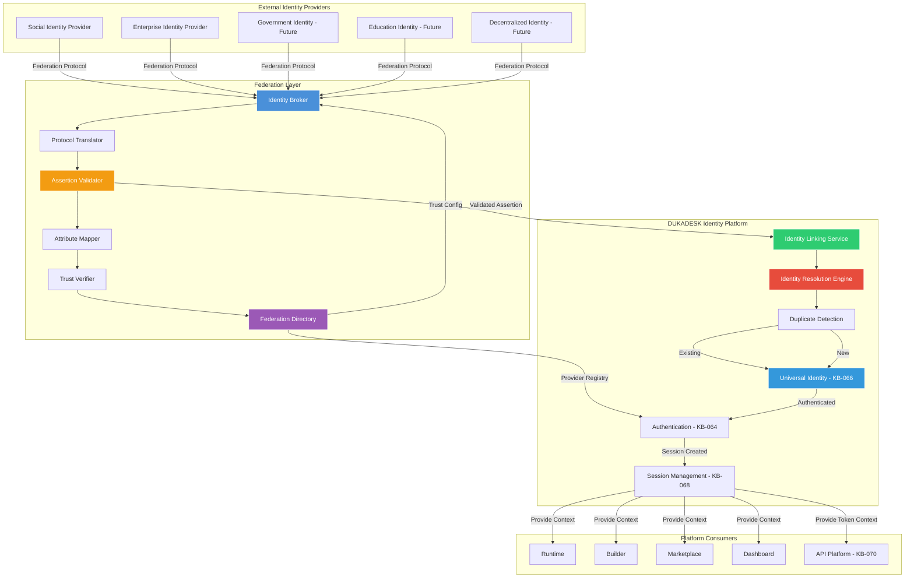
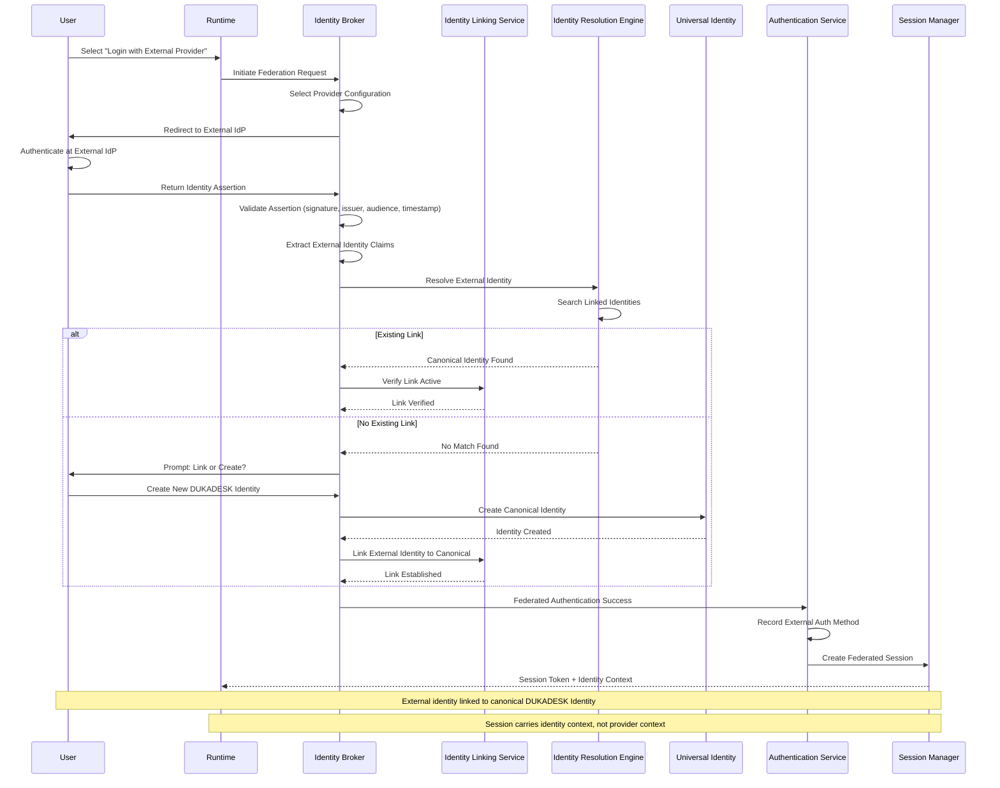
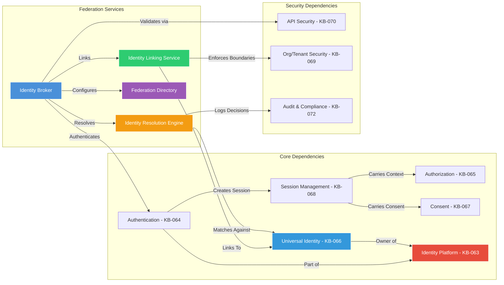
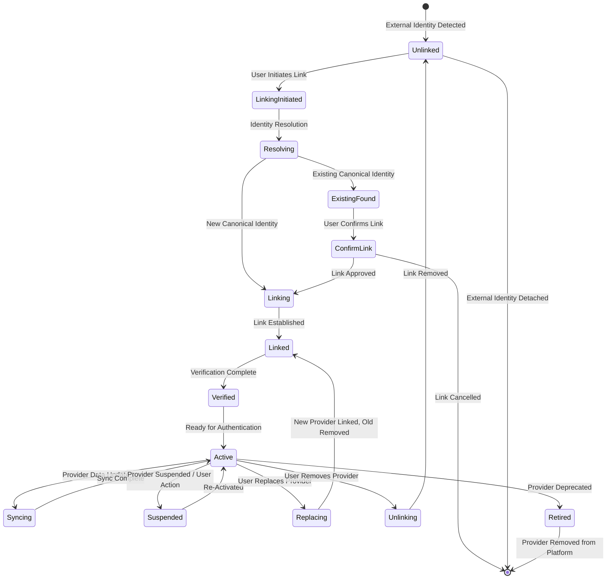
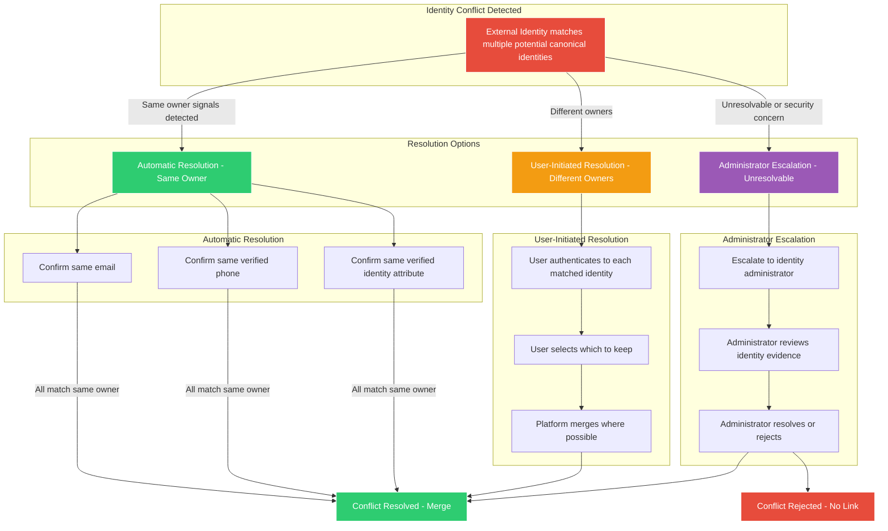
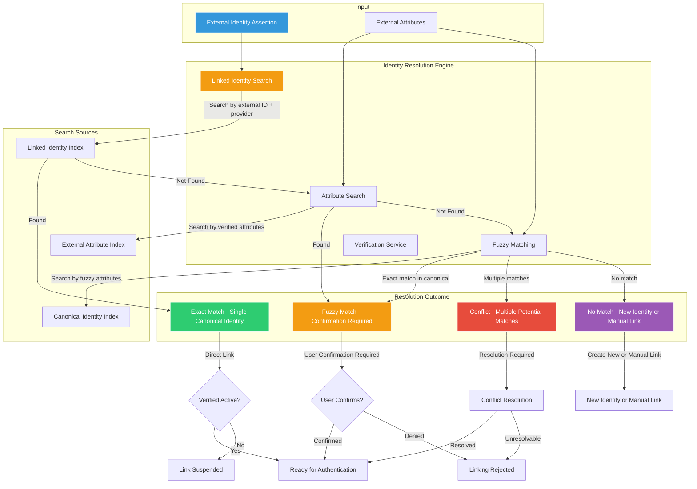
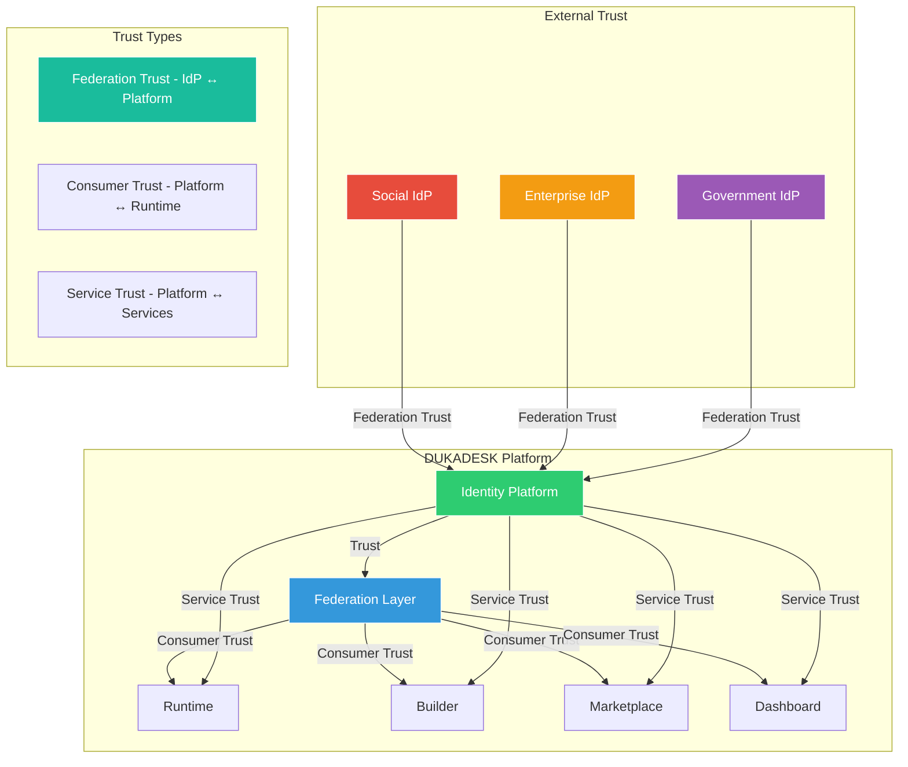
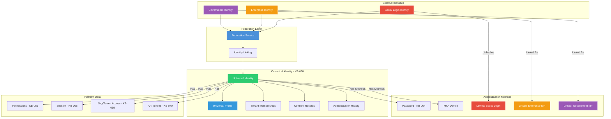

# Identity Federation & Social Login Architecture

**KB-071 — Identity Federation & Social Login Architecture Specification**

| Metadata | |
|----------|---|
| **KB ID** | KB-071 |
| **Title** | Identity Federation & Social Login Architecture |
| **Version** | 0.1.0 |
| **Status** | Draft |
| **Owner** | Architecture Team |
| **Suite** | Identity & Access Architecture |
| **Dependencies** | KB-063 Identity Platform Architecture, KB-064 Authentication Architecture, KB-065 Authorization & RBAC Architecture, KB-066 Universal Consumer Identity Architecture, KB-067 Consent & Privacy Architecture, KB-068 Session Management Architecture, KB-069 Organization, Tenant & Workspace Security Architecture, KB-070 API Security & Token Architecture |
| **Related Documents** | KB-057 Runtime Security Architecture, KB-058 Runtime Observability & Diagnostics Architecture, KB-060 Runtime Lifecycle Management, KB-062 Runtime Deployment & Environment, KB-072 Audit, Compliance & Identity Governance Architecture |
| **Review Status** | Pending |
| **Last Updated** | 2026-07-11 |

---

### Revision History

| Version | Date | Author | Change |
|---------|------|--------|--------|
| 0.1.0 | 2026-07-11 | AI Architecture Agent | Initial draft |

---

## 1. Executive Summary

### 1.1 Purpose

This document defines the Identity Federation & Social Login Architecture for the DUKADESK Platform. It establishes how the DUKADESK Identity Platform federates with external Identity Providers (IdPs) while preserving the platform's core principle:

> **Every person has exactly one DUKADESK Identity. External identities are linked — they never replace the DUKADESK Identity.**

Federation allows users to authenticate using external providers — social login, enterprise directories, government credentials, academic identities — while the DUKADESK Identity Platform remains the authoritative identity owner. External identities are authentication mechanisms, not identity ownership. They are linked to the canonical DUKADESK Identity but never replace it.

This architecture is provider-independent, protocol-independent, and implementation-independent. It supports any external identity provider — current and future — through a consistent, governed federation framework.

### 1.2 Scope

**In scope:**

- All federation categories: Social Login, Enterprise Identity Federation, Government Identity (future), Education Identity (future), Partner Identity Federation, Developer Federation, Marketplace Publisher Federation, Multi-Provider Identity Linking, External Identity Lifecycle, Federated Account Recovery
- Architectural principles: One DUKADESK Identity, External Identity Linking, Provider Independence, Federation Without Duplication, Privacy by Design, Explicit Identity Linking, Secure Trust Relationships, Federation Is Optional, Zero Trust, Future-Proof Federation
- Canonical definitions: Federation, Identity Provider, Federated Identity, External Identity, Identity Linking, Identity Assertion, Trust Relationship, Linked Identity, Identity Broker, Identity Mapping, Federation Session, Identity Synchronization
- Federation Architecture: External IdPs → Federation Layer → Identity Linking → Identity Platform → Universal Identity
- Federation Lifecycle: Select Provider → External Authentication → Identity Assertion → Identity Resolution → Link/Create → Federated Session
- Identity Linking Architecture: First-Time Linking, Existing Account Linking, Multi-Provider Linking, Provider Replacement, Provider Removal, Identity Conflict Resolution, Duplicate Detection, Account Recovery
- Supported Federation Categories: Social, Enterprise, Workforce, Academic, Government, Partner, Future Decentralized
- Identity Resolution: Identity Matching, Identity Verification, Duplicate Prevention, Canonical Identity Assignment, Identity Merge Policies, Identity Conflict Handling
- Trust Relationships: Identity Platform ↔ External IdP, Runtime ↔ Identity Platform, Builder ↔ Identity Platform, Marketplace ↔ Identity Platform, Business Dashboard ↔ Identity Platform
- External Identity Lifecycle: Link, Verify, Synchronize, Suspend, Unlink, Replace, Retire
- Universal Identity Integration: KB-066 — external identities never own user data
- Responsibilities: Runtime, Identity Platform, Backend
- Security: Trust Verification, Identity Proof Validation, Link Verification, Replay Protection, Federation Trust Boundaries, Identity Hijacking Prevention, Secure Unlinking
- Privacy: Minimal External Data Collection, User-Controlled Linking, Provider Data Isolation, Identity Portability, External Data Retention, Cross-Provider Privacy
- Performance: Identity Resolution, Federation Latency, Linking Performance, Multi-Provider Lookup, Session Establishment
- Observability: Federation Success Rate, Linking Metrics, Provider Availability, Identity Conflicts, Federation Errors, Identity Synchronization Metrics (KB-058)
- Failure scenarios and anti-patterns
- Future evolution: Decentralized Identity (DID), Verifiable Credentials, Identity Wallets, Passwordless Federation, AI-Assisted Identity Resolution, Cross-Platform Federation Networks

**Out of scope:**

- Implementation details of specific federation protocols (OIDC, SAML, OAuth 2.0, etc.)
- Specific identity provider technology choices or vendor configurations
- Social login UI/UX design
- Enterprise identity provisioning and de-provisioning workflows (conceptually referenced)
- Compliance-specific federation requirements (covered in KB-072)

---

## 2. Architectural Principles

### 2.1 One DUKADESK Identity

Every person has exactly one canonical DUKADESK Identity. No matter how many external identity providers a user links, there is one DUKADESK Identity that owns their profile, memberships, permissions, consent records, application history, purchases, and preferences. External identities are linked to this canonical identity — they never replace it.

### 2.2 External Identity Linking

External identities are always linked to an existing DUKADESK Identity — they never create a new one without explicit user action. Linking is the process of associating an external identity assertion with the canonical identity. An unlinked external identity cannot access platform resources.

### 2.3 Provider Independence

The federation architecture is independent of any specific external identity provider. All providers are integrated through a consistent abstraction layer. No provider has special architectural status. Adding, removing, or replacing a provider requires configuration changes only — no architectural changes.

### 2.4 Federation Without Duplication

Federation never creates duplicate DUKADESK Identities. Identity resolution ensures that an external identity links to an existing canonical identity rather than creating a duplicate. Duplicate detection is a core architectural responsibility.

### 2.5 Privacy by Design

External identity data is collected only to the minimum extent necessary for identity verification and linking. External provider data is never stored beyond the linking identifiers and profile attributes the user consents to share. External provider relationships are visible only to the user and platform services.

### 2.6 Explicit Identity Linking

Identity linking is always explicit. Users must actively confirm that they want to link an external identity to their DUKADESK Identity. Silent linking — automatically linking based on email matching or other implicit signals — is never performed without user confirmation.

### 2.7 Secure Trust Relationships

Trust between the Identity Platform and external identity providers is explicitly established, cryptographically verified, and continuously validated. Trust is never assumed based on provider reputation or network position.

### 2.8 Federation Is Optional

Federation is always optional. Users can create and use a DUKADESK Identity with platform-native authentication (KB-064) without ever linking an external provider. Federation expands authentication choice — it never constrains it.

### 2.9 Zero Trust

Every federated authentication event is independently validated. Assertions from external providers are verified — signature, issuer, audience, timestamp. Trust in the external provider does not imply trust in the assertion without verification.

### 2.10 Future-Proof Federation

The architecture supports current and future federation protocols, identity models, and provider types. Protocol abstraction, provider abstraction, and identity model abstraction ensure that new federation technologies can be integrated without architectural change.

---

## 3. Canonical Definitions

### 3.1 Federation

The architectural mechanism by which the DUKADESK Identity Platform accepts identity assertions from external Identity Providers and links them to canonical DUKADESK Identities. Federation enables users to authenticate with external credentials while the platform retains identity ownership.

### 3.2 Identity Provider (IdP)

An external system that authenticates users and issues identity assertions. IdPs may be social login providers, enterprise directories, government identity systems, academic institutions, or any system that can cryptographically assert a user's identity.

### 3.3 Federated Identity

An identity asserted by an external IdP and accepted by the DUKADESK Identity Platform for authentication purposes. A federated identity is always linked to a canonical DUKADESK Identity — it is not an independent identity.

### 3.4 External Identity

A user's identity as represented by an external IdP. The external identity has a provider-specific identifier, provider-specific attributes, and a provider-specific authentication mechanism. The external identity is meaningful only within the context of its provider.

### 3.5 Identity Linking

The process of associating an external identity with a canonical DUKADESK Identity. Linking establishes a persistent relationship between the external identity and the canonical identity. After linking, the external identity can be used to authenticate the canonical identity.

### 3.6 Identity Assertion

A cryptographically signed claim from an external IdP asserting that a user has been authenticated. The assertion includes the user's identifier at the provider, authentication timestamp, and optionally identity attributes (name, email, profile picture).

### 3.7 Trust Relationship

A configured, cryptographically verifiable relationship between the DUKADESK Identity Platform and an external IdP. The trust relationship defines the IdP's identity, the accepted assertion types, the attribute mapping, and the trust level.

### 3.8 Linked Identity

An external identity that has been explicitly linked to a canonical DUKADESK Identity. A linked identity can be used for authentication. Each canonical identity may have multiple linked identities from different providers.

### 3.9 Identity Broker

The architectural component that mediates between external IdPs and the Identity Platform. The Identity Broker handles protocol translation, assertion validation, attribute mapping, and trust verification.

### 3.10 Identity Mapping

The process of translating external identity attributes (provider-specific claim names, formats, values) into canonical DUKADESK identity attributes. Mapping is defined per provider and per trust relationship.

### 3.11 Federation Session

A session established through federated authentication. The federation session carries the canonical identity context and the provider-specific authentication context. The session is governed by standard session management (KB-068).

### 3.12 Identity Synchronization

The process of updating linked external identity data — provider attributes, linked status, trust level — based on changes from the external IdP. Synchronization may be event-driven (provider notifies platform) or periodic (platform polls provider).

---

## 4. Federation Architecture

### 4.1 Federation Architecture

### 4.2 Architecture Overview

The Federation Architecture operates in layers:

- **External Identity Providers**: Diverse external systems that authenticate users and issue identity assertions. Each provider communicates through standardized federation protocols.
- **Federation Layer**: The intermediary that mediates between external IdPs and the Identity Platform. The Identity Broker handles protocol translation (different federation protocols to internal representation), assertion validation (cryptographic verification of assertions), attribute mapping (provider-specific attributes to canonical attributes), and trust verification (provider identity and trust level).
- **Identity Platform**: The authoritative system for identity linking, resolution, and canonical identity management. The Identity Linking Service manages links between external identities and canonical identities. The Identity Resolution Engine resolves external identities to canonical identities. Duplicate Detection prevents identity duplication.
- **Platform Consumers**: All platform services that consume authenticated identity context. The federation source is transparent to consumers — they interact with the canonical identity and session, not the external provider.

### 4.3 Federation Categories

| Category | Provider Type | Trust Level | Attribute Scope | Typical Protocol |
|----------|--------------|-------------|-----------------|-----------------|
| Social Login | Consumer identity providers | Standard | Email, name, profile picture | OIDC / OAuth 2.0 |
| Enterprise IdP | Corporate directories (SAML, LDAP) | High | Work identity, groups, roles | SAML 2.0 / OIDC |
| Workforce Identity | Professional/contractor identity providers | High | Professional profile, skills, certifications | OIDC |
| Academic Identity | Educational institutions | Medium | Student/staff status, enrollment | SAML 2.0 |
| Government Identity | National digital identity systems | Very High | Verified identity, legal name, age | OIDC / eIDAS |
| Partner Federation | Business partner organizations | High | Partnership-specific attributes | SAML 2.0 / OIDC |
| Decentralized Identity | Self-sovereign identity networks | Variable | User-controlled attributes | DID / VC |

### 4.4 Federation Session Flow

### 4.5 Federation Service Dependencies

---

## 5. Identity Linking Architecture

### 5.1 Identity Linking Lifecycle

### 5.2 First-Time Linking

When a user authenticates with an external provider for the first time and no existing link exists:

- **Flow**:
  1. User authenticates at external IdP
  2. Identity Broker validates assertion
  3. Identity Resolution Engine searches for existing link — no match found
  4. User is prompted: create a new DUKADESK Identity or link to an existing account
  5. If **new identity**: Universal Identity is created, external identity is linked, user proceeds
  6. If **link to existing**: user authenticates with existing DUKADESK Identity, then linking is confirmed
- **Key Rules**:
  - New identity creation always requires user confirmation
  - Automatic identity creation without user intent is never performed
  - The linking decision belongs to the user, not the platform

### 5.3 Existing Account Linking

When a user with an existing DUKADESK Identity wants to link an external provider:

- **Flow**:
  1. User authenticates with existing DUKADESK Identity (password, MFA, or another linked provider)
  2. User navigates to account linking settings
  3. User selects external provider and authenticates
  4. Identity Broker validates assertion
  5. Identity Resolution Engine confirms no other canonical identity is linked to this external identity
  6. Identity Linking Service creates the link
  7. User receives confirmation
- **Key Rules**:
  - Linking to an existing account requires the user to be authenticated first
  - An external identity can only be linked to one canonical identity at a time

### 5.4 Multi-Provider Linking

A user may link multiple external providers to their canonical identity:

- **Multiple Links**: One canonical DUKADESK Identity may have multiple linked external identities from different providers
- **Independent Links**: Each link is independent — revoking one provider does not affect others
- **Provider Diversity**: Users may link social, enterprise, and government providers to the same canonical identity
- **Authentication Choice**: Any linked provider can be used for authentication. The user chooses which provider to use at login time.
- **Consistent Identity**: Regardless of which provider is used for authentication, the same canonical identity is resolved

### 5.5 Provider Replacement

A user may replace a linked provider:

- **Replacement Flow**: User authenticates, selects provider to replace, authenticates new provider, confirms replacement. Old link is removed. New link is established.
- **Data Migration**: External identity attributes from the old provider are not migrated. The new provider's attributes are used going forward.
- **Link Continuity**: The canonical identity and all its data (memberships, permissions, consent, history) are unaffected by provider replacement.

### 5.6 Provider Removal

A user may unlink a provider:

- **Removal Flow**: User authenticates, selects provider to unlink, confirms removal. Link is removed. External identity is detached from canonical identity.
- **Required Remaining Link**: If the user has only one authentication method (no password, no other linked providers), unlinking is blocked or the user must first add another method.
- **Data Cleanup**: On unlink, external provider data (provider-specific attributes) is removed from the canonical identity. Canonical identity data is preserved.

### 5.7 Identity Conflict Resolution

### 5.8 Duplicate Detection

The Identity Resolution Engine detects and prevents duplicate identities:

- **Detection Signals**: Email match (verified), phone match (verified), government ID match (verified), cryptographic identity binding (DID), direct user claim
- **Detection Scope**: Within the platform, across all linked providers, across all canonical identities
- **Prevention**: When a duplicate is detected, linking is blocked. The user is prompted to authenticate to the existing canonical identity and link from there.
- **Resolution**: Duplicate resolution follows the identity conflict resolution process.

### 5.9 Account Recovery

Federated account recovery enables users to regain access to their canonical identity:

- **Provider-Based Recovery**: If a user loses access to their primary authentication method but has another linked provider, they can authenticate through the remaining provider and add a new method.
- **Cross-Provider Recovery**: If a user loses access to all providers but has verified contact information on their canonical identity, recovery uses the standard account recovery process (KB-064).
- **Provider Failure Recovery**: If an external provider becomes permanently unavailable, users can migrate to a different provider through the recovery process. Linking evidence (prior session history, verified attributes) supports identity verification.

---

## 6. Identity Resolution

### 6.1 Identity Resolution Flow

### 6.2 Identity Matching Rules

Matching is performed in priority order:

1. **Exact Provider Link Match**: The external identity's provider-specific identifier matches an existing linked identity for the same provider. This is the primary match — deterministic and authoritative.
2. **Verified Email Match**: The external identity's verified email address matches a verified email on an existing canonical identity. Requires both sides to be verified.
3. **Verified Phone Match**: The external identity's verified phone number matches a verified phone on an existing canonical identity. Requires both sides to be verified.
4. **Verified Identity Document Match**: The external identity's government-issued identity document matches verified identity documents on an existing canonical identity.
5. **Cryptographic Binding Match**: The external identity's cryptographic key or DID matches a bound key on an existing canonical identity.
6. **Fuzzy Attribute Match**: Partial matches on name, email domain, or other attributes. Requires user confirmation before linking.

### 6.3 Identity Verification

Identity verification ensures that linking is secure:

- **Assertion Verification**: The external identity assertion is cryptographically verified — signature, issuer, audience, timestamp, nonce.
- **Attribute Verification**: External identity attributes used for matching (email, phone) are verified by the external provider. Unverified attributes are not used for matching.
- **Link Verification**: Before activating a link, the platform may perform additional verification — confirming email ownership, sending confirmation code, or requiring step-up authentication.

### 6.4 Duplicate Prevention

- **Link Uniqueness**: An external identity (provider + external ID) can be linked to exactly one canonical identity. Duplicate links are prevented at the database level.
- **Cross-Provider Uniqueness**: Multiple providers linking to the same canonical identity is allowed. Multiple canonical identities claiming the same external identity is prevented.
- **Pre-Link Check**: Before creating a link, the Identity Resolution Engine checks all existing links. If the external identity is already linked to a different canonical identity, the link is blocked and conflict resolution is initiated.

### 6.5 Canonical Identity Assignment

When a new DUKADESK Identity is created through federation:

- **Identity Creation**: A new Universal Identity (KB-066) is created with the minimum required attributes.
- **External Attributes**: External provider attributes (name, email, profile picture) are imported as the initial identity profile, subject to user consent.
- **Provider Record**: The external provider is recorded as the identity's linked provider. Authentication methods are initialized with the federated provider.
- **Identity Ownership**: The canonical identity is owned by DUKADESK. The external provider is an authentication method, not an identity owner.

### 6.6 Identity Merge Policies

When identity conflicts are resolved through merging:

- **Attribute Merge**: Canonical identity attributes take precedence. External provider attributes supplement where canonical attributes are absent.
- **Membership Merge**: Memberships from both identities are preserved. Duplicate memberships (same org, same tenant) are merged.
- **Permission and Role Merge**: Roles and permissions from both identities are preserved. Conflicting assignments are resolved by highest privilege.
- **Consent Merge**: Consent records from both identities are preserved. Conflicting consent states are resolved by most recent.
- **Session and History**: Session history is not merged. Active sessions for both identities are terminated. User must create a new session.

---

## 7. Supported Federation Categories

### 7.1 Social Identity Providers

Social login enables consumers to authenticate using widely-used consumer identity providers:

- **Trust Model**: Standard trust level. Providers are well-established consumer identity platforms.
- **Attribute Scope**: Basic profile attributes — email address, name, profile picture. Users consent to attribute sharing (KB-067).
- **Authentication Methods**: OIDC / OAuth 2.0 based authentication. Social login is treated as AAL1 authentication (KB-064), with step-up available for higher assurance.
- **Linking Model**: Social identities are linked to consumer DUKADESK Identities. Consumers may link multiple social providers.
- **Use Cases**: Consumer-facing tenant applications, marketplace browsing, builder studio access, dashboard access.

### 7.2 Enterprise Identity Providers

Enterprise federation enables organizations to use their corporate identity provider:

- **Trust Model**: High trust level. Provider is a known enterprise directory with organizational governance.
- **Attribute Scope**: Work identity — corporate email, organizational role, department, group memberships.
- **Authentication Methods**: SAML 2.0 or OIDC. Enterprise authentication is treated as AAL2–AAL3 depending on provider configuration.
- **Linking Model**: Enterprise identities are linked to user's DUKADESK Identity. The same canonical identity may have a social provider and an enterprise provider linked simultaneously.
- **Tenant Association**: Enterprise provider identity may be associated with a specific tenant or organization within DUKADESK.

### 7.3 Workforce Identity

Workforce federation supports professional and contractor identity providers:

- **Trust Model**: High trust level. Provider verifies professional identity and credentials.
- **Attribute Scope**: Professional profile — name, professional title, skills, certifications, employment history.
- **Authentication Methods**: OIDC with professional identity verification. Workforce authentication is treated as AAL2.
- **Linking Model**: Workforce identities are linked to the user's canonical identity. Professional attributes supplement the user's profile.

### 7.4 Academic Identity

Academic federation supports educational institutions:

- **Trust Model**: Medium trust level. Provider is an educational institution or academic identity federation.
- **Attribute Scope**: Academic identity — student status, staff status, enrollment period, field of study.
- **Authentication Methods**: SAML 2.0 through academic federation (e.g., eduGAIN). Academic authentication is treated as AAL1–AAL2.
- **Linking Model**: Academic identities are linked to the user's canonical identity. Academic status may grant access to education-specific tenant applications.

### 7.5 Government Identity

Government federation supports national digital identity systems:

- **Trust Model**: Very high trust level. Provider is a government-issued digital identity with legal identity verification.
- **Attribute Scope**: Legal identity — verified name, date of birth, nationality, identity document reference.
- **Authentication Methods**: OIDC with eIDAS-level authentication. Government authentication is treated as AAL4–AAL5 depending on provider assurance level.
- **Linking Model**: Government identities are linked to the user's canonical identity. Government verification elevates the canonical identity's verification level.
- **Use Cases**: Age verification, identity verification for regulated tenant applications, high-assurance authentication.

### 7.6 Partner Federation

Partner federation supports business partner organizations:

- **Trust Model**: High trust level. Trust is established through bilateral agreement between DUKADESK and the partner organization.
- **Attribute Scope**: Partnership-specific attributes — partner organization membership, partnership role, shared resource access.
- **Authentication Methods**: SAML 2.0 or OIDC. Partner authentication is treated as AAL2.
- **Linking Model**: Partner identities are linked to the user's canonical identity. Partner attributes may grant access to partner-specific tenants or resources.

### 7.7 Future Decentralized Identity Providers

Future support for self-sovereign identity:

- **Trust Model**: Variable trust level. Trust is established through cryptographic verification of decentralized identifiers (DIDs) and verifiable credentials (VCs).
- **Attribute Scope**: User-controlled attributes. The user decides which attributes to present and to which services.
- **Authentication Methods**: DID authentication — the user proves control of a DID through cryptographic challenge-response.
- **Linking Model**: DIDs are linked to the user's canonical identity. The canonical identity remains the authoritative identity owner.

---

## 8. Trust Relationships

### 8.1 Federation Trust Relationships

### 8.2 Identity Platform ↔ External IdP Trust

The trust relationship between the Identity Platform and each external IdP is established through:

- **Provider Registration**: The external IdP is registered in the Federation Directory with its identity, metadata, and public keys.
- **Cryptographic Trust**: The Identity Platform trusts assertions signed by the external IdP's registered keys. Key rotation is handled through the provider's metadata.
- **Trust Level Assignment**: Each provider is assigned a trust level based on its assurance capabilities, security posture, and governance.
- **Trust Verification**: Every assertion is verified — signature, issuer, audience, timestamp, nonce. Trust is not inherited from provider reputation; it is verified on every assertion.
- **Trust Revocation**: Trust can be revoked at the provider level (entire IdP) or at the identity level (specific external identity). Revocation is immediate.

### 8.3 Runtime ↔ Identity Platform Trust

The Runtime trusts the Identity Platform to resolve federated identities correctly:

- **Identity Resolution Trust**: The Runtime trusts that the Identity Platform has correctly resolved the external identity to the canonical identity.
- **Session Trust**: The Runtime trusts the session token issued after federated authentication. The session token is validated per standard session management (KB-068).
- **No Direct IdP Trust**: The Runtime does not trust external IdPs directly. All federation trust flows through the Identity Platform.

### 8.4 Builder, Marketplace, Dashboard Trust

Platform services trust federated identities through the Identity Platform:

- **Unified Trust Model**: All platform services trust federated identities through the same mechanism — validated session tokens from the Identity Platform.
- **Provider Transparency**: Platform services do not need to know which external provider was used for authentication. The federation source is transparent to services.
- **Authorization Independence**: Authorization (KB-065) is independent of the authentication method. The same authorization policies apply regardless of whether the user authenticated with a password, social login, or enterprise federation.

---

## 9. External Identity Lifecycle

### 9.1 Link

- **Trigger**: User authenticates with external provider and confirms linking to canonical identity
- **Actions**: External identity recorded in linked identity index, provider-specific identifier stored, trust level assigned, link status set to Active
- **Validation**: Duplicate check performed. Identity resolution confirms no conflict.
- **Storage**: External provider ID, external user ID, link timestamp, trust level, link status

### 9.2 Verify

- **Trigger**: Link established, periodic verification cycle, provider metadata change
- **Actions**: Verify external identity still exists at provider, verify provider assertion still valid, verify link integrity
- **Outcome**: Link remains Active. If verification fails, link status changes to Suspended.

### 9.3 Synchronize

- **Trigger**: Provider notification, periodic sync cycle, user action
- **Actions**: Update external identity attributes (name, email, profile picture) from provider assertion, update trust level if provider metadata changed, detect provider-side changes (account suspended, email changed)
- **Consent**: Attribute updates respect the user's consent scope (KB-067). New attributes require new consent.

### 9.4 Suspend

- **Trigger**: Provider reports account suspended, link verification fails, user suspends link, security event
- **Actions**: Link status changed to Suspended, external identity cannot be used for authentication, canonical identity is not affected
- **Notification**: User is notified of suspension with reason and recovery instructions

### 9.5 Unlink

- **Trigger**: User removes linked provider, provider removal through account management
- **Actions**: Link removed from linked identity index, external identity detached from canonical identity
- **Data Cleanup**: Provider-specific attributes removed from canonical identity profile. Canonical identity data preserved.
- **Authentication Check**: If unlinking would leave the user with no authentication method, unlinking is blocked.

### 9.6 Replace

- **Trigger**: User replaces one linked provider with another
- **Actions**: Old link removed, new link established, provider history preserved
- **Continuity**: Canonical identity is unaffected. All memberships, permissions, consent, and history are preserved.

### 9.7 Retire

- **Trigger**: External provider is deprecated by the platform, provider shuts down, provider security breach
- **Actions**: All links to the provider are retired, provider removed from Federation Directory, affected users are notified and prompted to link a different provider
- **Grace Period**: Retired provider links remain active for configurable grace period (default: 90 days) to allow user migration

---

## 10. Universal Identity Integration

### 10.1 Universal Identity as Canonical Owner

Reference KB-066 Universal Consumer Identity Architecture.

The integration between federation and Universal Identity is governed by a non-negotiable architectural principle:

> **External identity providers authenticate users; only DUKADESK owns, governs, and manages the canonical user identity.**

This principle has the following architectural implications:

- **External Identities Never Own User Data**: All user data — profile attributes, memberships, permissions, consent records, application history, purchases, preferences — is owned by the canonical DUKADESK Identity. External providers have no ownership stake in this data.
- **Universal Identity Remains Canonical**: The Universal Identity (KB-066) is the single source of truth for the user's identity. External identities are linked, not merged. The canonical identity persists independently of any single external provider.
- **Federation Augments Authentication Only**: Federation adds authentication methods to the canonical identity. It does not add identity ownership. A user may have five linked providers and still have exactly one DUKADESK Identity.
- **Consent and Authorization Remain DUKADESK Responsibilities**: Consent (KB-067) and authorization (KB-065) are evaluated based on the canonical identity, not the external identity. The external provider's relationship to the user does not affect consent or authorization decisions.
- **Provider Independence Guarantees User Control**: Users can change, add, or remove login providers without affecting their DUKADESK identity, tenant memberships, permissions, consent records, application history, purchases, or profile. The canonical identity is provider-independent.

### 10.2 Universal Identity Integration Architecture

### 10.3 Provider Independence Guarantee

The Universal Identity is provider-independent by architecture:

- **Identity Attributes**: Profile attributes (name, email, phone, address) are stored on the canonical identity. They are initially populated from the first linked provider but become independent after creation.
- **Authentication Methods**: Authentication methods (password, MFA, linked providers) are managed independently of each other. Adding or removing one does not affect others.
- **Tenant Memberships**: Memberships are associated with the canonical identity. They are not affected by provider changes.
- **Permissions and Roles**: Permissions are assigned to the canonical identity. Provider changes do not affect authorization.
- **Consent Records**: Consent is granted by the canonical identity. Provider changes do not affect consent.
- **Application History**: Order history, usage history, and application data are owned by the canonical identity. Provider changes do not affect history.

---

## 11. Runtime Responsibilities

- Present federated login options to users through the identity provider selection UI
- Initiate federation requests to the Identity Broker on user provider selection
- Handle federation redirects and assertion responses
- Receive federated session tokens and manage token lifecycle
- Never expose external identity provider details to tenant applications — federation source is transparent
- Pass canonical identity context to all subsystems — navigation, state, actions, events
- Handle federation-specific errors — provider unavailable, assertion invalid, link suspended
- Provide user-facing federation management UI — view linked providers, add provider, remove provider

---

## 12. Identity Platform Responsibilities

- Operate the Federation Layer — Identity Broker, Protocol Translator, Assertion Validator, Attribute Mapper, Trust Verifier
- Maintain the Federation Directory — registered providers, trust configurations, public keys, metadata
- Operate the Identity Linking Service — create, verify, synchronize, suspend, unlink, replace, retire links
- Operate the Identity Resolution Engine — match external identities to canonical identities, prevent duplicates, resolve conflicts
- Manage provider trust relationships — registration, verification, key rotation, revocation
- Issue federated session tokens after successful federated authentication
- Maintain the linked identity index — all active links, provider-specific identifiers, link status
- Support federated account recovery — cross-provider recovery, provider failure recovery

---

## 13. Backend Responsibilities

- Validate federated session tokens on every API request — same validation as any other session token
- Use canonical identity from session token for authorization decisions — federation source is transparent
- Enforce consent scope on provider-imported attributes — provider attributes are subject to the same consent governance as any other attribute
- Log federation-related events — linking, unlinking, federation authentication, identity resolution outcomes
- Support federation observability — provider availability, linking metrics, identity conflicts

---

## 14. Security

### 14.1 Trust Verification

- **Assertion Signature Verification**: Every identity assertion from an external provider is cryptographically verified using the provider's registered public keys. Unverifiable assertions are rejected.
- **Issuer Validation**: The assertion issuer must match the registered provider identity. Assertions from unknown or unregistered issuers are rejected.
- **Audience Validation**: The assertion audience must match the Identity Platform. Assertions intended for other services are rejected.
- **Timestamp Validation**: The assertion timestamp must be within the acceptable time window (configurable, default: 5 minute skew). Expired or future-dated assertions are rejected.
- **Nonce Validation**: The assertion nonce must match the nonce issued during the federation request. Replay of previously used assertions is prevented.

### 14.2 Identity Proof Validation

- **Provider-Verified Attributes**: Attribute-based matching uses only provider-verified attributes (verified email, verified phone). Unverified attributes are not used for identity resolution.
- **Assertion Freshness**: Identity assertions must be fresh. The time between assertion issuance and platform receipt must be within the configured limit.
- **Link Verification**: New links may require additional verification — confirmation email, confirmation code, step-up authentication — depending on the trust level of the linking scenario.

### 14.3 Link Verification

- **Active Link Confirmation**: Before accepting a federated authentication, the Identity Platform confirms that the link is Active (not Suspended, Retired, or Revoked).
- **Periodic Link Verification**: Active links are periodically verified — confirming the external identity still exists at the provider and the provider's metadata is current.
- **Link Integrity**: Link records include cryptographic references to ensure integrity. Tampered link records are detected and suspended.

### 14.4 Replay Protection

- **Assertion Nonce**: Every federation request includes a unique nonce. The identity assertion must include the matching nonce. Nonces are single-use.
- **Assertion Timestamp**: Assertions outside the valid time window are rejected. The time window is configurable (default: 5 minutes from issuance).
- **Token Reuse Prevention**: Federated session tokens follow standard token security (KB-070) — short lifetimes, rotation, revocation.

### 14.5 Federation Trust Boundaries

- **Provider Boundary**: External IdPs operate outside the platform trust boundary. Identity assertions cross the trust boundary and are independently verified.
- **Attribute Boundary**: Provider attributes are imported into the platform's identity domain. Once imported, provider attributes are governed by platform privacy policies.
- **Session Boundary**: Federated sessions are standard platform sessions (KB-068). The session boundary is the same regardless of authentication source.

### 14.6 Identity Hijacking Prevention

- **Link Hijacking**: An attacker cannot link their external identity to another user's canonical identity. Linking requires the canonical identity owner's authentication.
- **Assertion Hijacking**: An intercepted assertion cannot be reused. Nonce and timestamp validation prevent replay. Audience validation prevents use against wrong service.
- **Provider Account Compromise**: If an external provider account is compromised, the attacker can authenticate as the user through that provider. Mitigations: MFA step-up for high-risk operations, anomaly detection, user notification of new device login.

### 14.7 Secure Unlinking

- **Owner-Only Unlinking**: Only the canonical identity owner can unlink a provider. Unlinking requires the user to be authenticated.
- **Remaining Method Check**: Before unlinking, the platform verifies the user has at least one remaining authentication method. If not, unlinking is blocked.
- **Unlink Confirmation**: Unlinking requires explicit user confirmation. Consequences of unlinking (provider-based data removal) are explained.

---

## 15. Privacy

### 15.1 Minimal External Data Collection

- **Minimum Attributes**: Only the minimum attributes required for identity verification and linking are collected from external providers — typically provider ID, email, and name.
- **Consent Required**: Additional attributes (profile picture, locale, age range) require user consent (KB-067). Users are informed of what data will be collected and why.
- **No Unnecessary Storage**: Provider attributes that are not needed for identity functions are not stored. Provider-specific raw data is discarded after extraction of needed attributes.

### 15.2 User-Controlled Linking

- **Explicit Consent**: Linking an external provider requires explicit user action. Silent linking is never performed.
- **Link Visibility**: Users can view all their linked providers, the data shared from each provider, and when each link was established.
- **Unlink Control**: Users can unlink any provider at any time. Unlinking removes provider-specific data from the canonical identity.

### 15.3 Provider Data Isolation

- **Provider-Specific Storage**: External identity data is stored with the provider identifier. Data from different providers is not mixed.
- **Cross-Provider Separation**: Attributes from one provider are not mixed with attributes from another provider. The canonical identity aggregates across providers but maintains provider provenance.
- **Provider Data Deletion**: When a provider is unlinked, provider-specific data is deleted from the canonical identity profile.

### 15.4 Identity Portability

- **Canonical Identity Export**: Users can export their canonical identity data — profile attributes, linked providers, memberships — in a portable format.
- **Provider Migration**: Users can migrate from one provider to another. The canonical identity and all its data are preserved through the migration.
- **Cross-Platform Portability**: Future evolution may enable users to port their linked identity relationships to other platforms through standardized identity portability protocols.

### 15.5 External Data Retention

- **Link Retention**: Link records are retained as long as the link is active. After unlinking, the link record is retained for a configurable audit period (default: 90 days), then purged.
- **Attribute Retention**: Provider-imported attributes are retained as part of the canonical identity profile until the user removes them or unlinks the provider.
- **Audit Retention**: Federation events (linking, unlinking, authentication) are retained in the audit log per compliance requirements (KB-072).

### 15.6 Cross-Provider Privacy

- **No Cross-Provider Correlation**: The platform does not correlate user activity across external providers. Activity performed after authenticating with Provider A is not linked to Provider B.
- **Provider-Agnostic Identity**: Platform services interact with the canonical identity, not the external provider identity. The provider used for authentication is transparent to services.
- **User Control Over Provider Visibility**: Users control which providers are visible in their profile. Provider information is not shared with tenant applications unless explicitly consented.

---

## 16. Performance

### 16.1 Identity Resolution

| Operation | Target (p95) | Notes |
|-----------|-------------|-------|
| Linked Identity Search | < 10ms | Indexed by provider ID + external user ID |
| Attribute-Based Search | < 50ms | Indexed by verified email, phone |
| Full Identity Resolution | < 100ms | Combined search + verification |
| Duplicate Detection | < 50ms | Cross-reference check |

### 16.2 Federation Latency

| Operation | Target (p95) | Notes |
|-----------|-------------|-------|
| Assertion Validation (local) | < 10ms | Signature verification |
| Assertion Validation (with key fetch) | < 50ms | If key not cached |
| Attribute Mapping | < 5ms | Static mapping per provider |
| Complete Federation Request | < 200ms | Excluding external IdP latency |
| External IdP Latency | Variable | Depends on provider — out of platform control |

### 16.3 Linking Performance

| Operation | Target (p95) | Notes |
|-----------|-------------|-------|
| Create Link | < 50ms | Index write + cache update |
| Verify Link | < 20ms | Cache read |
| Unlink | < 50ms | Index removal + cache invalidation |
| Multi-Provider Lookup | < 100ms | Search across all linked providers |

### 16.4 Session Establishment

| Operation | Target (p95) | Notes |
|-----------|-------------|-------|
| Federated Session Creation | < 100ms | Standard session creation (KB-068) |
| Federated Session Token Issuance | < 50ms | Standard token issuance (KB-070) |

---

## 17. Observability

Reference KB-058 Runtime Observability & Diagnostics Architecture.

### 17.1 Federation Success Rate

- **Authentication Success**: Count and rate of successful federated authentications by provider, by result.
- **Authentication Failure**: Count and rate of failed federated authentications by provider, by failure reason (assertion invalid, issuer unknown, signature invalid, expired, link suspended).
- **Federation Latency**: Authentication latency by provider, including external IdP response time.

### 17.2 Linking Metrics

- **Link Count**: Number of active links by provider, by trust level.
- **Link Rate**: Link creation rate, unlink rate, replace rate.
- **Link Duration**: Distribution of link durations before unlinking or replacement.
- **Multi-Provider Distribution**: Distribution of number of linked providers per user.

### 17.3 Provider Availability

- **Provider Uptime**: Availability of each external IdP as observed by the Identity Platform.
- **Provider Latency**: Authentication response time by provider.
- **Provider Error Rate**: Error rate from each provider — assertion errors, connectivity errors, protocol errors.

### 17.4 Identity Conflicts

- **Conflict Count**: Number of identity conflicts detected by resolution type (automatic, user-resolved, admin-escalated).
- **Conflict Resolution Time**: Time from conflict detection to resolution.
- **Duplicate Prevention**: Number of duplicate identity creation attempts blocked.

### 17.5 Federation Errors

- **Assertion Errors**: Invalid signature, expired assertion, wrong audience, missing nonce.
- **Provider Errors**: Provider unavailable, protocol mismatch, unsupported assertion type.
- **Link Errors**: Link suspended, link not found, link expired, duplicate link attempted.

### 17.6 Identity Synchronization Metrics

- **Sync Frequency**: How often external identity data is synchronized.
- **Sync Success Rate**: Percentage of successful sync operations by provider.
- **Sync Conflicts**: Number of sync operations resulting in attribute conflicts.

---

## 18. Failure Scenarios

### 18.1 Identity Collision

| Scenario | Impact | Mitigation |
|----------|--------|------------|
| External identity matches two different canonical identities | Linking blocked, conflict resolution required | Identity conflict resolution process. User confirms ownership. Admin escalation for unresolvable cases. |
| Two different users claim the same external identity | Second linking attempt blocked | Platform checks existing links before creating new ones. Duplicate detection prevents multiple canonical identities from claiming the same external identity. |

### 18.2 Duplicate Federation

| Scenario | Impact | Mitigation |
|----------|--------|------------|
| User creates a new DUKADESK Identity instead of linking to existing | Duplicate canonical identity for the same person | Identity resolution detects duplicate through email/phone matching. User is prompted to link rather than create. Merging process if duplicate already created. |
| User authenticates with multiple providers and creates separate identities | Multiple canonical identities for the same person | Periodic identity reconciliation detects duplicates. Merge process consolidates identities. |

### 18.3 Provider Unavailable

| Scenario | Impact | Mitigation |
|----------|--------|------------|
| External IdP is temporarily unavailable | Federated login for that provider fails | Clear error message informing user provider is unavailable. User can use alternative authentication method (password, MFA, other linked provider). |
| External IdP is permanently shut down | Users who only used that provider lose authentication | Grace period allows provider migration. Users are notified and prompted to link a different provider. Account recovery through verified contact information. |

### 18.4 Invalid Assertion

| Scenario | Impact | Mitigation |
|----------|--------|------------|
| Assertion signature verification fails | Federated authentication rejected | Provider metadata (public keys) may be outdated. Key refresh triggered. User may retry authentication. |
| Assertion audience does not match platform | Federated authentication rejected | Provider configuration may be incorrect. Administrator reviews provider settings. |
| Assertion is expired | Federated authentication rejected | User re-authenticates with provider to obtain fresh assertion. |

### 18.5 Broken Trust Relationship

| Scenario | Impact | Mitigation |
|----------|--------|------------|
| Provider's signing key rotated but platform not updated | Assertion verification fails | Automatic key discovery through provider metadata. Manual key update if automatic fails. Grace period for key rotation. |
| Provider's certificate revoked | All assertions from provider rejected | Provider re-registration required. Users notified and prompted to use alternative authentication. |

### 18.6 Identity Merge Failure

| Scenario | Impact | Mitigation |
|----------|--------|------------|
| Two canonical identities cannot be automatically merged | Manual merge with user guidance | User selects which identity's attributes, memberships, and preferences to keep. Unresolvable conflicts escalated to administrator. |
| Merge results in data loss risk | Merge blocked, user warned | Pre-merge report shows what will be kept and what will be discarded. User confirms understanding. Rollback capability for 30 days. |

### 18.7 Unlink Failure

| Scenario | Impact | Mitigation |
|----------|--------|------------|
| User attempts to unlink only authentication method | Unlink blocked | User must add another authentication method before unlinking. Clear explanation and guidance provided. |
| Provider data deletion fails during unlink | Provider data may persist | Unlink completes (link is removed). Data cleanup retried. Administrator alert for persistent data. |

---

## 19. Anti-patterns

### 19.1 External Provider Owns Identity

**Anti-pattern**: Treating the external provider's identity as the authoritative identity, storing provider-specific identifiers as the primary user key, or allowing provider account changes to propagate automatically as identity changes.

**Why**: Violates the One DUKADESK Identity principle. The external provider becomes the de facto identity owner. Provider changes can break identity continuity.

**Solution**: The canonical DUKADESK Identity is always the authoritative identity. External provider identities are linked as authentication methods only. Provider account changes do not affect canonical identity continuity.

### 19.2 Multiple DUKADESK Identities Per User

**Anti-pattern**: Allowing a user to create multiple DUKADESK Identities through different external providers without linking them, resulting in fragmented identity, memberships, and data.

**Why**: Creates identity fragmentation. User data, memberships, and permissions are split across multiple identities. Cannot provide a unified experience.

**Solution**: Identity resolution detects duplicate creation attempts. Users are prompted to link to existing identities. Periodic reconciliation merges duplicates. The platform guarantees one canonical identity per person.

### 19.3 Silent Account Linking

**Anti-pattern**: Automatically linking external identities to canonical identities based on email matching or other implicit signals without user confirmation.

**Why**: Violates explicit linking principle. Users may not want their external identity linked. Silent linking can create security and privacy issues.

**Solution**: All linking requires explicit user confirmation. Users are informed of what linking means and what data will be shared. Silent linking is never performed.

### 19.4 Automatic Identity Merging

**Anti-pattern**: Automatically merging two canonical identities without user confirmation when a match is detected.

**Why**: Merging identities with different memberships, permissions, and data can have unintended consequences. User consent is required.

**Solution**: Merging requires user confirmation. Users are shown a merge preview and must explicitly approve. Rollback capability is provided.

### 19.5 Provider-Specific Business Logic

**Anti-pattern**: Writing application logic that behaves differently based on which external provider the user authenticated with.

**Why**: Violates provider independence. Creates coupling between applications and specific providers. Makes provider changes or removals difficult.

**Solution**: Platform services interact with the canonical identity, not the external provider identity. Provider source is transparent to applications. Authentication method does not affect business logic.

### 19.6 Hardcoded Federation Providers

**Anti-pattern**: Hardcoding specific external provider names, endpoints, or configurations in application code or platform services.

**Why**: Makes provider configuration changes difficult. Creates tight coupling between platform and specific providers.

**Solution**: Providers are configured in the Federation Directory. The Identity Broker resolves provider configurations dynamically. No provider-specific code exists outside the Federation Layer.

### 19.7 Trust Without Verification

**Anti-pattern**: Trusting external provider assertions without cryptographic verification based on provider reputation or prior relationship.

**Why**: Violates zero trust. Provider compromise or assertion interception can lead to unauthorized access.

**Solution**: Every assertion is independently verified — signature, issuer, audience, timestamp, nonce. Trust is verified on every assertion, not assumed.

---

## 20. Future Evolution

### 20.1 Decentralized Identity (DID)

Future federation may support Decentralized Identifiers (DIDs) — globally unique identifiers that are controlled by the identity owner without a centralized registry. DIDs are created, managed, and revoked independently of any single provider.

### 20.2 Verifiable Credentials

Future federation may support Verifiable Credentials (VCs) — cryptographically signed claims issued by trusted authorities. Users present VCs to the Identity Platform as proof of identity attributes. VCs enable privacy-preserving attribute verification without exposing the issuing provider.

### 20.3 Identity Wallets

Future users may manage their federated identities through personal identity wallets — client-side applications that store external provider credentials, DIDs, and VCs. Wallets interact with the Identity Platform through standardized wallet protocols.

### 20.4 Passwordless Federation

Future federation may eliminate passwords entirely — usingdevice-bound credentials, biometric authentication, and cryptographic challenges instead of shared secrets. Passwordless federation provides stronger security and better user experience.

### 20.5 AI-Assisted Identity Resolution

Future identity resolution may use AI to detect identity conflicts, suggest identity merges, identify duplicate identities, and assist with identity verification. AI analysis supplements deterministic matching rules.

### 20.6 Cross-Platform Federation Networks

Future federation may extend beyond individual providers to cross-platform federation networks — networks of identity providers that share trust relationships and enable users to authenticate across platforms. DUKADESK participates in federation networks as a trusted identity provider and consumer.

---

## 21. Cross-References

| Reference | Document | Relationship |
|-----------|----------|-------------|
| **KB-057** | Runtime Security Architecture | Federation assertion handling and trust validation at runtime |
| **KB-058** | Runtime Observability & Diagnostics Architecture | Federation metrics, provider availability, linking observability |
| **KB-060** | Runtime Lifecycle Management | Federation session lifecycle alignment |
| **KB-062** | Runtime Deployment & Environment | Federation configuration per deployment environment |
| **KB-063** | Identity Platform Architecture | Identity platform that hosts the Federation Layer |
| **KB-064** | Authentication Architecture | Authentication methods that federation augments |
| **KB-065** | Authorization & RBAC Architecture | Authorization independent of federation source |
| **KB-066** | Universal Consumer Identity Architecture | Canonical identity that external identities link to |
| **KB-067** | Consent & Privacy Architecture | Consent for external identity attribute sharing |
| **KB-068** | Session Management Architecture | Federated session lifecycle and context |
| **KB-069** | Organization, Tenant & Workspace Security Architecture | Tenant isolation for federated access |
| **KB-070** | API Security & Token Architecture | Federated session token handling |
| **KB-072** | Audit, Compliance & Identity Governance Architecture | Federation audit trail and compliance |

---

## 22. Mermaid Diagram Index

| Diagram | Section | Description |
|---------|---------|-------------|
| Federation Architecture | 4.1 | Complete federation architecture from external providers through Federation Layer to Identity Platform and consumers |
| Federation Service Dependencies | 4.5 | Federation service dependencies across Identity, Authentication, Session, and Security |
| Identity Linking Lifecycle | 5.1 | Complete linking lifecycle from unlinked through linking, active, suspend, unlink, and retire |
| Identity Conflict Resolution | 5.7 | Identity conflict resolution with automatic, user-initiated, and administrator escalation paths |
| Identity Resolution Flow | 6.1 | Identity resolution from external assertion through linked/attribute/fuzzy search to match or conflict outcome |
| Federation Trust Relationships | 8.1 | Trust relationships between external providers, Identity Platform, Runtimes, and platform services |
| Universal Identity Integration | 10.2 | Integration between external identities, federation layer, canonical identity, authentication methods, and platform data |
| Federation Session Flow | 4.4 | Sequence diagram showing complete federated login journey from provider selection through session establishment |
| Multi-Provider Linking Model | (architectural concept throughout sections 5.3–5.6) | One canonical identity with multiple linked providers, independent links, authentication choice |
| End-to-End Federated Login Journey | 4.4 | Sequence diagram of the complete federated authentication flow |

---

## 23. Architectural Note

KB-071 establishes the federation architecture that enables users to authenticate with external identity providers while maintaining a single, canonical DUKADESK identity. This is the architectural expression of a fundamental DUKADESK guarantee:

> **External identity providers authenticate users; only DUKADESK owns, governs, and manages the canonical user identity.**

External identities are authentication mechanisms — not identity ownership. This guarantees that consumers can change, add, or remove login providers without affecting their DUKADESK identity, tenant memberships, permissions, consent records, application history, purchases, or profile.

With KB-071 complete, the Identity & Access Architecture suite defines a complete identity model: who you are (KB-063, KB-066), how you authenticate (KB-064, KB-071), what you can do (KB-065), what you agreed to share (KB-067), how your session is managed (KB-068), where you can operate (KB-069), how APIs are secured (KB-070), and how external identities integrate (KB-071). KB-072 closes the suite with audit, compliance, and governance — completing the full Identity & Access Architecture.
