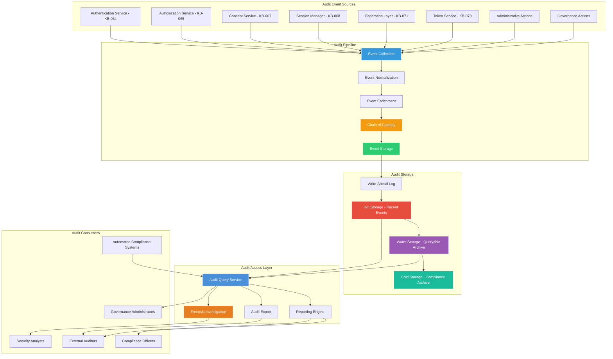
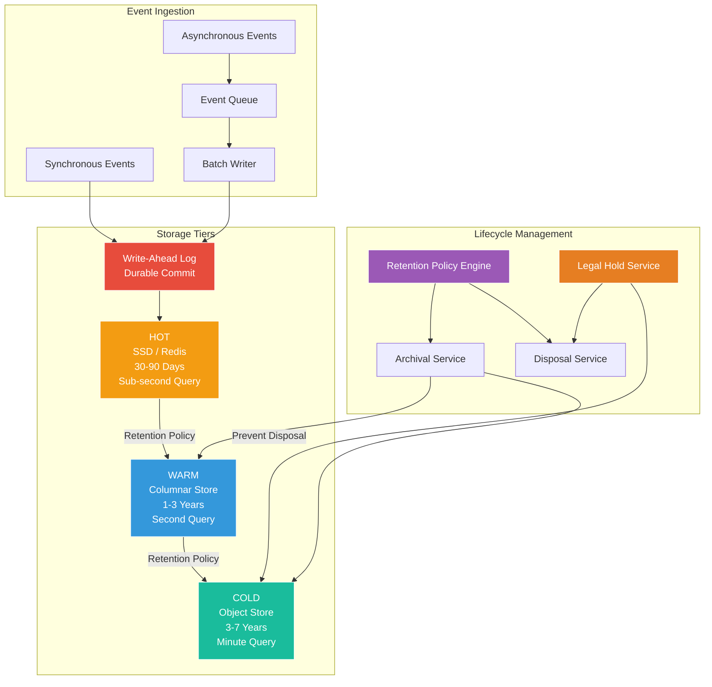
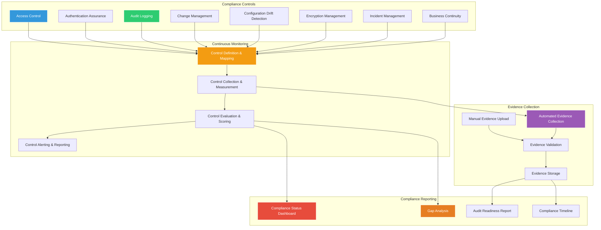
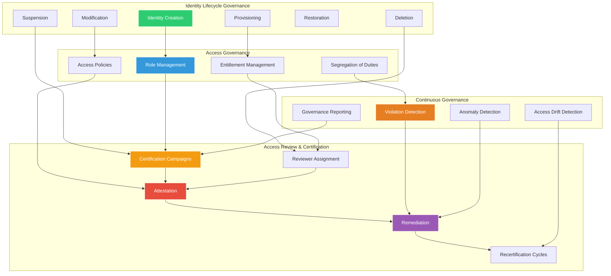
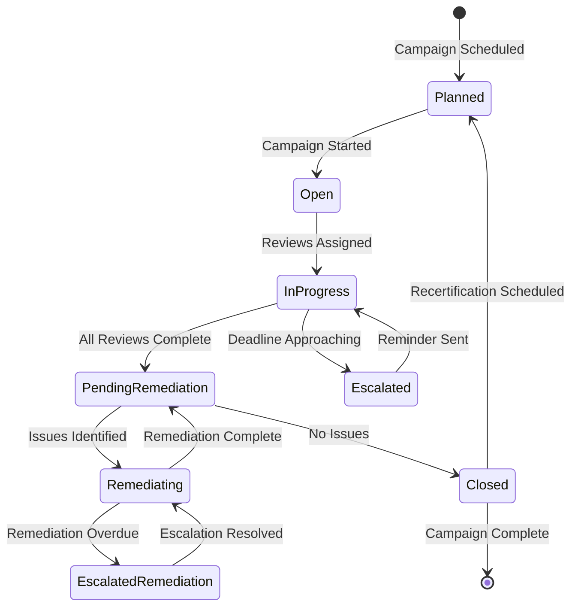

# Audit, Compliance & Identity Governance Architecture

**KB-072 — Audit, Compliance & Identity Governance Architecture Specification**

| Metadata | |
|----------|---|
| **KB ID** | KB-072 |
| **Title** | Audit, Compliance & Identity Governance Architecture |
| **Version** | 0.1.0 |
| **Status** | Draft |
| **Owner** | Architecture Team |
| **Suite** | Identity & Access Architecture |
| **Dependencies** | KB-063 Identity Platform Architecture, KB-064 Authentication Architecture, KB-065 Authorization & RBAC Architecture, KB-066 Universal Consumer Identity Architecture, KB-067 Consent & Privacy Architecture, KB-068 Session Management Architecture, KB-069 Organization, Tenant & Workspace Security Architecture, KB-070 API Security & Token Architecture, KB-071 Identity Federation & Social Login Architecture |
| **Related Documents** | KB-057 Runtime Security Architecture, KB-058 Runtime Observability & Diagnostics Architecture, KB-060 Runtime Lifecycle Management, KB-062 Runtime Deployment & Environment |
| **Review Status** | Pending |
| **Last Updated** | 2026-07-11 |

---

### Revision History

| Version | Date | Author | Change |
|---------|------|--------|--------|
| 0.1.0 | 2026-07-11 | AI Architecture Agent | Initial draft |

---

## 1. Executive Summary

### 1.1 Purpose

This document defines the Audit, Compliance & Identity Governance Architecture for the DUKADESK Platform. It establishes how the platform provides comprehensive auditability, regulatory compliance, identity governance, access certification, forensic investigation, and compliance reporting across the entire identity and access ecosystem.

Every identity operation — authentication, authorization, consent, session management, federation, API access, token issuance, role assignment, tenant membership — is auditable by design. Audit events are tamper-evident, immutable, and queryable. Governance controls ensure that identities, roles, permissions, and access rights follow a continuous lifecycle of certification, review, and remediation.

This document defines architecture only. It is platform-independent, provider-independent, and implementation-independent.

### 1.2 Scope

**In scope:**

- Audit architecture: audit event model, audit pipeline, audit storage, audit query, audit retention, audit archival
- Compliance framework: regulatory compliance mapping (SOC 2, GDPR, HIPAA, PCI-DSS, SOX, FedRAMP, ISO 27001), compliance controls, evidence collection
- Identity governance: identity lifecycle governance, access certification, role governance, entitlement management, segregation of duties
- Access reviews: certification campaigns, attestation workflows, recertification cycles, reviewer assignment, remediation tracking
- Audit event categories: authentication events, authorization events, consent events, session events, federation events, API access events, token events, administrative events, governance events
- Audit pipeline: event collection, event normalization, event enrichment, tamper-evident storage, event query, event archival, event disposal
- Data retention and disposal: retention policies per event category, legal hold, secure disposal, retention audit
- Forensic capabilities: investigation workflows, chain of custody, e-discovery, incident reconstruction, timeline analysis
- Reporting and analytics: compliance reports, audit dashboards, identity analytics, access analytics, anomaly detection
- Regulatory compliance: compliance control mapping, evidence collection automation, compliance monitoring, auditor access
- Runtime, Identity Platform, and Backend responsibilities
- Security: tamper-evident audit log, audit log integrity, audit log access control, audit log encryption
- Privacy: audit data minimization, personally identifiable information handling in audit logs, audit data retention limits
- Performance: audit event throughput, query performance, archival performance
- Observability: audit pipeline health, compliance coverage, governance metrics (KB-058)
- Failure scenarios and anti-patterns
- Future evolution: continuous audit, AI-assisted compliance, real-time governance, automated remediation, decentralized audit

**Out of scope:**

- Implementation details of specific audit storage technologies
- Specific compliance certification processes (auditor procedures, evidence gathering)
- Specific regulatory interpretation or legal advice
- Network-level audit (firewall logs, network flow logs)
- Application-level business audit (transaction logs, domain-specific audit)

---

## 2. Architectural Principles

### 2.1 Audit by Design

Every identity and access operation is auditable by architecture. Audit event generation is built into the platform's identity services — it is not retrofitted. No operation can be performed without producing an auditable record. Audit is a first-class architectural concern, not a secondary capability.

### 2.2 Tamper-Evident Audit Trail

The audit log is tamper-evident. Any modification, deletion, or reordering of audit events is detectable. The integrity of the audit trail is cryptographically verifiable. Audit log integrity is independent of the storage layer — compromise of the storage does not compromise audit trust.

### 2.3 Immutable Event Store

Audit events, once committed, are immutable. Events cannot be modified, deleted, or overwritten. Immutability is enforced at the architecture level — no actor, including platform administrators, can alter committed audit events. Legal hold is implemented through retention policy, not through event modification.

### 2.4 Comprehensive Coverage

Every identity domain generates audit events. Authentication, authorization, consent, session management, federation, API access, token lifecycle, administrative actions, governance actions, and role management all produce audit events. No identity operation exists outside the audit scope.

### 2.5 Governed Identity Lifecycle

Identity governance is continuous, not point-in-time. Identities, roles, permissions, and entitlements are governed throughout their lifecycle — creation, modification, suspension, and removal. Governance controls ensure that access rights are appropriate, reviewed, and certified on a defined cadence.

### 2.6 Continuous Compliance

Compliance is continuously monitored, not periodically assessed. Compliance controls are instrumented in the platform architecture. Control evidence is collected automatically. Compliance status is available in real-time. Gaps are detected and reported as they occur, not at the next audit cycle.

### 2.7 Separation of Duties

Audit and governance functions are architecturally separated from operational identity functions. The audit system does not depend on the identity system for its integrity. Governance decisions are independent of identity operations. No single role has authority over both identity operations and audit integrity.

### 2.8 Least-Privilege Audit Access

Audit data access follows least privilege. Audit consumers — compliance officers, security analysts, external auditors — receive only the audit data necessary for their function. Audit data access is itself audited. No entity has unfettered access to the complete audit trail.

### 2.9 Provider Independence

The audit architecture is independent of any specific audit storage provider, compliance framework, or regulatory regime. Compliance frameworks are mapped through configuration, not architecture. Adding or changing regulatory requirements requires configuration changes only.

### 2.10 Future-Proof Governance

The identity governance architecture supports current and future governance models, regulatory regimes, and compliance frameworks. Governance abstraction ensures that new compliance requirements can be addressed without architectural change.

---

## 3. Canonical Definitions

### 3.1 Audit Event

A structured, immutable record of an identity or access operation. Each audit event captures what happened, who performed it, when it occurred, where it occurred, and the outcome. Audit events are the atomic units of the audit trail.

### 3.2 Audit Trail

The complete, ordered sequence of audit events across the platform. The audit trail provides a verifiable history of all identity and access operations. The audit trail is tamper-evident and independently verifiable.

### 3.3 Audit Pipeline

The architectural component that collects, normalizes, enriches, stores, and queries audit events. The audit pipeline is responsible for audit event ingestion, processing, storage, retrieval, and lifecycle management.

### 3.4 Tamper Evidence

The property that any unauthorized modification of audit events is detectable. Tamper evidence is implemented through cryptographic chaining — each audit event includes a cryptographic hash of the previous event, creating a chain that reveals any break.

### 3.5 Compliance Control

A measurable architectural or operational control that satisfies a specific regulatory or compliance requirement. Controls are instrumented in the platform, continuously monitored, and their evidence is automatically collected.

### 3.6 Identity Governance

The continuous process of managing and governing identity lifecycle, role assignments, permissions, entitlements, and access rights. Governance ensures that the right identities have the right access for the right reasons, reviewed at the right frequency.

### 3.7 Access Certification

The process of formally reviewing and attesting to the appropriateness of access rights. Access certification campaigns evaluate whether identities still require their assigned roles, permissions, and entitlements. Unnecessary or inappropriate access is identified and remediated.

### 3.8 Segregation of Duties (SoD)

The architectural principle that conflicting duties are assigned to different identities. SoD policies define which combinations of roles, permissions, or entitlements conflict. SoD violations are detected, reported, and enforced.

### 3.9 Entitlement

A specific access right granted to an identity — a role membership, a permission assignment, a tenant membership, a workspace membership, a resource access grant. Entitlements are the governed units of access.

### 3.10 Certification Campaign

A time-bounded process during which access reviewers examine and attest to the appropriateness of entitlements for a defined population of identities. Campaigns are scheduled, assigned, executed, tracked, and closed with remediation actions.

### 3.11 Remediation

The process of correcting access issues identified during certification campaigns or compliance monitoring. Remediation actions include entitlement removal, role reassignment, access suspension, and policy update.

### 3.12 Legal Hold

A retention policy that preserves audit events beyond their normal retention period to satisfy legal or regulatory preservation requirements. Legal hold is applied to specific identities, events, or time ranges. Events under legal hold cannot be disposed until the hold is released.

### 3.13 Chain of Custody

The documented record of how audit evidence was collected, stored, accessed, and transferred. Chain of custody ensures that audit evidence is admissible in legal or regulatory proceedings. Every access to audit data is recorded.

### 3.14 Compliance Evidence

The documented proof that a compliance control is operating effectively. Evidence includes audit events, configuration snapshots, certification records, policy definitions, and monitoring reports.

### 3.15 Attestation

A formal declaration by an authorized reviewer that access rights are appropriate, complete, and compliant. Attestation is the outcome of a successful access certification review. Attestations are recorded as audit events.

---

## 4. Audit Architecture

### 4.1 Audit Architecture Overview

### 4.2 Architecture Overview

The audit architecture operates in layers:

- **Audit Event Sources**: Every identity service generates structured audit events for each operation. Events are generated at the service boundary — before and after each operation — ensuring complete coverage.
- **Audit Pipeline**: The pipeline collects events from all sources, normalizes them into a canonical format, enriches them with contextual metadata (environment, version, request ID), applies chain of custody, and stores them immutably.
- **Audit Storage**: Events are stored in tiered storage — hot (immediate query, short retention), warm (structured query, medium retention), cold (compliance archive, long retention). Storage tiers balance query performance with retention cost.
- **Audit Access Layer**: Audit consumers access events through structured query, reporting, export, and forensic investigation interfaces. Access is governed by least-privilege policies and is itself audited.
- **Audit Consumers**: Compliance officers, security analysts, external auditors, governance administrators, and automated compliance systems consume audit data through their respective interfaces.

### 4.3 Audit Event Categories

| Category | Example Events | Volume | Retention (Default) |
|----------|---------------|--------|-------------------|
| Authentication | Login, logout, MFA challenge, password change, step-up auth | Very High | 90 days hot, 3 years warm, 7 years cold |
| Authorization | Permission check allow/deny, role assignment, policy evaluation | Very High | 90 days hot, 1 year warm, 3 years cold |
| Consent | Consent grant, consent revocation, consent scope change | Medium | 90 days hot, 3 years warm, 7 years cold |
| Session | Session creation, session refresh, session termination, context switch | High | 90 days hot, 1 year warm, 3 years cold |
| Federation | Federation attempt, identity linking, unlinking, provider change | Medium | 90 days hot, 3 years warm, 7 years cold |
| Token | Token issuance, validation, refresh, rotation, revocation | Very High | 30 days hot, 90 days warm, 1 year cold |
| Administrative | Tenant configuration, policy change, role definition, user suspension | Low | 90 days hot, 3 years warm, 7 years cold |
| Governance | Certification campaign, attestation, remediation, access review | Low | 90 days hot, 3 years warm, 7 years cold |
| API Access | API request, rate limit, scope enforcement | Very High | 30 days hot, 90 days warm, 1 year cold |
| Identity Lifecycle | Identity creation, profile update, identity merge, identity deletion | Medium | 90 days hot, 3 years warm, 7 years cold |

### 4.4 Tamper-Evident Chain

```mermaid
flowchart LR
    subgraph Chain["Cryptographic Chain of Audit Events"]
        direction TB
        E1[Event 1<br/>Hash: H1<br/>Previous: 0]
        E2[Event 2<br/>Hash: H2<br/>Previous: H1]
        E3[Event 3<br/>Hash: H3<br/>Previous: H2]
        E4[Event 4<br/>Hash: H4<br/>Previous: H3]
        E5[Event N<br/>Hash: HN<br/>Previous: HN-1]
    end

    subgraph Verification["Tamper Detection"]
        COMPUTE[Recompute Hash Chain]
        COMPARE[Compare with Stored Chain]
        RESULT[Match = Trusted<br/>Mismatch = Tampered]
    end

    E1 --> E2
    E2 --> E3
    E3 --> E4
    E4 --> E5

    E5 --> COMPUTE
    COMPUTE --> COMPARE
    COMPARE --> RESULT

    style E1 fill:#2ecc71,stroke:#fff,color:#fff
    style E2 fill:#3498db,stroke:#fff,color:#fff
    style E3 fill:#f39c12,stroke:#fff,color:#fff
    style E4 fill:#e74c3c,stroke:#fff,color:#fff
    style E5 fill:#9b59b6,stroke:#fff,color:#fff
    style RESULT fill:#2ecc71,stroke:#fff,color:#fff
```

Each audit event in the chain contains:
- **Event Payload**: The structured audit data (what, who, when, where, outcome)
- **Previous Hash**: SHA-256 hash of the preceding event's full record (including its previous hash)
- **Current Hash**: SHA-256 hash of this event's payload + previous hash
- **Chain Signature**: The current hash is signed by the audit service's private key

Tamper detection:
- **Insertion Detection**: An inserted event breaks the hash chain — the inserted event's hash does not match the next event's previous hash
- **Deletion Detection**: A deleted event creates a gap — the event after the gap references a previous hash that does not exist
- **Modification Detection**: A modified event changes its hash, breaking the chain to the next event
- **Reordering Detection**: Reordered events break the hash chain sequence

---

## 5. Audit Event Model

### 5.1 Canonical Audit Event Schema

Every audit event follows a canonical schema:

| Field | Type | Description | Example |
|-------|------|-------------|---------|
| event_id | UUID v4 | Globally unique event identifier | `a1b2c3d4-e5f6-7890-abcd-ef1234567890` |
| event_type | String | Canonical event type | `authentication.login.success` |
| event_version | Integer | Schema version for forward compatibility | `1` |
| timestamp | ISO 8601 | Event occurrence time (UTC) | `2026-07-11T14:30:00.000Z` |
| collected_at | ISO 8601 | Pipeline ingestion time (UTC) | `2026-07-11T14:30:00.050Z` |
| source_service | String | Originating service identifier | `identity-platform.auth` |
| source_environment | String | Deployment environment | `production` |
| trace_id | UUID v4 | Distributed tracing identifier | `f6e5d4c3-b2a1-0987-fedc-ba9876543210` |
| identity_id | String | Canonical identity ID (if applicable) | `uid_abc123` |
| identity_type | String | Identity category | `user` / `service` / `machine` / `integration` |
| organization_id | String | Organization context (if applicable) | `org_mk` |
| tenant_id | String | Tenant context (if applicable) | `tenant_mk_prod` |
| session_id | String | Session context (if applicable) | `sess_xyz789` |
| action | String | The operation performed | `login` |
| resource | String | The resource accessed or affected | `auth/password` |
| outcome | String | Result of the operation | `success` / `failure` / `denied` |
| reason | String | Outcome reason or error code | `invalid_credentials` |
| actor_id | String | Entity that performed the action | `uid_abc123` |
| actor_type | String | Actor category | `user` / `system` / `admin` |
| ip_address | String | Source IP address (masked) | `192.168.x.x` |
| user_agent | String | Client user agent (anonymized) | `DUKADESK-Runtime/1.0` |
| request_id | String | Correlating request identifier | `req_def456` |
| metadata | JSON | Event-specific additional data | See event type definitions |
| previous_hash | String | SHA-256 of preceding event | `abc...` |
| current_hash | String | SHA-256 of this event | `def...` |
| signature | String | Cryptographic signature of current_hash | `sig...` |

### 5.2 Event Type Taxonomy

Events follow a hierarchical type taxonomy:

| Level 1 | Level 2 | Level 3 | Example |
|---------|---------|---------|---------|
| authentication | login | success / failure / denied | `authentication.login.success` |
| authentication | logout | explicit / timeout / revoked | `authentication.logout.explicit` |
| authentication | mfa | challenge / verify / enroll / remove | `authentication.mfa.challenge` |
| authentication | password | change / reset / reset_request | `authentication.password.change` |
| authorization | permission_check | allow / deny | `authorization.permission_check.allow` |
| authorization | role_assignment | assign / unassign / modify | `authorization.role_assignment.assign` |
| authorization | policy | create / update / delete / evaluate | `authorization.policy.create` |
| consent | grant | create / update / revoke / expire | `consent.grant.create` |
| consent | purpose | add / remove / modify | `consent.purpose.add` |
| session | lifecycle | create / refresh / terminate / expire | `session.lifecycle.create` |
| session | context_switch | enter / exit | `session.context_switch.enter` |
| federation | link | create / verify / suspend / unlink | `federation.link.create` |
| federation | authentication | success / failure | `federation.authentication.success` |
| token | issuance | access / refresh / service / machine | `token.issuance.access` |
| token | validation | pass / fail | `token.validation.pass` |
| token | revocation | explicit / security_event / expiry | `token.revocation.explicit` |
| admin | tenant | create / update / suspend / delete | `admin.tenant.create` |
| admin | identity | suspend / restore / delete | `admin.identity.suspend` |
| governance | certification | create / open / attest / close | `governance.certification.create` |
| governance | remediation | identify / resolve / verify | `governance.remediation.resolve` |

### 5.3 Event Correlation Model

Events are correlated across services:

- **Trace ID**: All events resulting from a single request share a trace ID, enabling cross-service correlation
- **Session ID**: All events within a session share a session ID, enabling session-level analysis
- **Identity ID**: All events for an identity share an identity ID, enabling identity-level audit
- **Parent Event ID**: Events that are part of a composite operation (e.g., consent grant during authentication) reference the parent event

---

## 6. Audit Pipeline

### 6.1 Event Collection

- **Synchronous Collection**: Events are collected synchronously for critical operations — authentication, authorization, consent. The operation does not complete until the audit event is durably stored.
- **Asynchronous Collection**: Events are collected asynchronously for high-volume operations — API access, token validation. Events are queued and batch-written to audit storage.
- **Collection Guarantees**: At-least-once delivery for all events. Duplicate detection prevents double-counting. Collection is resilient to pipeline failures — events are buffered at the source if the pipeline is unavailable.

### 6.2 Event Normalization

Events from different sources are normalized to the canonical schema:

- **Field Mapping**: Source-specific fields are mapped to canonical fields. Missing fields are populated with defaults or nulls.
- **Type Coercion**: Values are coerced to canonical types — timestamps to ISO 8601, identifiers to canonical formats, enumerations to canonical values.
- **Format Standardization**: Strings are normalized (UTF-8, trimmed), IP addresses are masked, sensitive fields are redacted.

### 6.3 Event Enrichment

Events are enriched with contextual metadata:

- **Environment Context**: Deployment environment, service version, region, availability zone
- **Identity Context**: Identity display name, organization name, tenant name (resolved from identifiers, not stored in event)
- **Risk Context**: Risk score at time of event (if available from risk service), trust level
- **Geographic Context**: Approximate geographic location from IP (country level only, no precise location)
- **Correlation Context**: Related event IDs, trace hierarchy, session chain

### 6.4 Chain of Custody

Every event is recorded with chain of custody:

- **Ingestion Record**: Timestamp of ingestion, ingesting service identity, ingestion method (sync/async)
- **Access Record**: Every query or export of audit data records the accessing entity, purpose, time range, and scope
- **Transfer Record**: Any movement between storage tiers records the source, destination, timestamp, and authorizing entity

### 6.5 Event Storage

### 6.6 Storage Tiers

| Tier | Technology Profile | Retention (Default) | Query Performance | Cost Profile |
|------|-------------------|---------------------|-------------------|--------------|
| Hot | Low-latency key-value or column store | 30-90 days | Sub-second p95 | Higher per-GB |
| Warm | Compressed columnar store | 1-3 years | Seconds p95 | Moderate per-GB |
| Cold | Immutable object store with encryption | 3-7 years | Minutes p95 | Lowest per-GB |

### 6.7 Retention Policy Engine

- **Policy Definition**: Retention policies are defined per event category, per organization, per tenant, and per regulatory requirement
- **Policy Evaluation**: The retention policy engine periodically evaluates events against applicable policies
- **Policy Conflicts**: More restrictive policy wins. If one policy requires 7-year retention and another requires 3-year, the event is retained for 7 years.
- **Policy Change**: Retention policy changes apply only to new events. Existing event retention is governed by the policy in effect at event creation time.

---

## 7. Compliance Framework

### 7.1 Regulatory Compliance Mapping

| Regulation | Scope | Key Controls | Audit Evidence |
|-----------|-------|-------------|----------------|
| SOC 2 | Service organization controls | Access control, authentication, monitoring, change management | Authentication events, authorization events, admin events, monitoring reports |
| GDPR | Personal data of EU subjects | Consent management, data access, data deletion, breach notification | Consent events, data access audit, identity deletion records, breach detection |
| HIPAA | Protected health information | Access control, audit controls, integrity controls, person authentication | Authentication events, access audit, data access logs, identity verification |
| PCI-DSS | Payment card data | Access control, authentication, logging, monitoring, encryption | Authentication events, access logs, encryption validation, monitoring reports |
| SOX | Financial reporting systems | Access control, audit trail, change management, segregation of duties | Authorization events, admin events, SoD violation reports, change audit |
| FedRAMP | US government cloud | Access control, identification, authentication, audit, accountability | Full audit trail, identity verification, access certification, continuous monitoring |
| ISO 27001 | Information security management | Access control, auditing, compliance, continuous improvement | Access control evidence, audit logs, compliance reports, remediation records |

### 7.2 Compliance Control Framework

### 7.3 Control Categories

| Control Category | Example Controls | Evidence Source | Monitoring Frequency |
|-----------------|-----------------|-----------------|---------------------|
| Access Control | Least privilege, RBAC enforcement, tenant isolation, access certification | Authorization events, role assignments, certification records | Continuous |
| Authentication | MFA enforcement, password policy, session timeout, step-up auth | Authentication events, MFA events, session events | Continuous |
| Audit Logging | Complete audit trail, tamper evidence, audit access control, retention | Audit pipeline metrics, integrity verification, access logs | Continuous |
| Change Management | Change approval, change audit, rollback capability, version control | Admin events, configuration events, deployment events | Per change |
| Encryption | Data at rest encryption, data in transit encryption, key management | Encryption configuration snapshots, key rotation events | Continuous |
| Incident Management | Detection, response, notification, remediation | Alert events, incident records, remediation events | Per incident |
| Data Privacy | Consent management, data minimization, data deletion, breach notification | Consent events, data access records, deletion records | Continuous |

### 7.4 Evidence Collection Automation

- **Control Instrumentation**: Each control is instrumented in the platform architecture. Control evidence is generated as a natural byproduct of platform operations — no separate evidence collection process is needed.
- **Evidence Types**: Audit events, configuration snapshots, policy definitions, certification records, monitoring metrics, test results, attestation records.
- **Evidence Validation**: Evidence is cryptographically signed at collection time. Evidence integrity is verifiable. Evidence cannot be modified after collection.
- **Evidence Packaging**: For auditor requests, evidence is packaged with chain of custody, integrity verification, and collection context.

---

## 8. Identity Governance

### 8.1 Governance Architecture

### 8.2 Identity Lifecycle Governance

Every identity lifecycle stage is governed:

- **Identity Creation**: Identity creation requires authorized request, verification of identity attributes, assignment to appropriate organizational context, and initial role assignment with minimum necessary privileges
- **Provisioning**: Access is provisioned based on role assignments, entitlement grants, and policy evaluation. Provisioning is logged and auditable.
- **Modification**: Identity attribute changes (name, email, role) are logged. Attribute changes that affect access (role change, manager change) trigger access review.
- **Suspension**: Identity suspension revokes all active tokens, terminates all sessions, and disables all authentication methods. Suspension is reversible by authorized administrators.
- **Restoration**: Identity restoration re-enables authentication methods. Prior access rights are restored only if still valid (roles not revoked, memberships not removed during suspension).
- **Deletion**: Identity deletion anonymizes or removes personal data per retention policy. Entitlements are revoked. Audit records are preserved. Deletion is irreversible after a configurable grace period (default: 30 days).

### 8.3 Role Governance

- **Role Definition**: Roles are defined with explicit permissions, scope (organization, tenant, workspace), and purpose. Role definitions have owners, review cadence, and expiration date.
- **Role Lifecycle**: Role creation, modification, deprecation, and deletion follow governed processes. Role changes trigger entitlement review for all role members.
- **Role Entitlement**: Each role entitles specific permissions. Permission scope is explicit. Wildcard or blanket permissions are prohibited.
- **Role Review**: Roles are reviewed on a defined cadence (minimum: annually). Role review confirms that the role's permissions are still appropriate and that all role members still require the role.

### 8.4 Segregation of Duties

- **SoD Policy Definition**: SoD policies define conflicting permission pairs, conflicting role combinations, and conflicting entitlement patterns. Policies are configurable per organization and per tenant.
- **SoD Detection**: SoD violations are detected at assignment time (preventive) and through continuous analysis (detective). Preventive SoD blocks conflicting assignments. Detective SoD identifies existing conflicts.
- **SoD Remediation**: SoD violations trigger remediation workflow. Remediation may involve role reassignment, permission adjustment, or approved exception with time limit.
- **SoD Reporting**: SoD status is reported in governance dashboards. Violation trends, exception counts, and remediation completion rates are tracked.

### 8.5 Entitlement Management

- **Entitlement Types**: Role memberships, permission assignments, tenant memberships, workspace memberships, resource access grants, API scope grants
- **Entitlement Lifecycle**: Grant, review, revoke. Each entitlement has a grant date, grantor, review schedule, and optional expiration.
- **Entitlement Visibility**: Users can view their entitlements. Administrators can view entitlements within their scope. Entitlement access is audited.
- **Entitlement Review**: Entitlements are reviewed during certification campaigns. Expired entitlements are automatically revoked.

---

## 9. Access Reviews & Certification

### 9.1 Certification Campaign Lifecycle

### 9.2 Campaign Definition

- **Scope**: Campaign scope defines which identities, roles, entitlements, and organizational units are included. Scope is defined by filters: identity type, role, organization, tenant, workspace.
- **Schedule**: Campaigns are scheduled on a defined cadence (monthly, quarterly, annually). Recurring campaigns automatically scope to the current population.
- **Reviewers**: Reviewers are assigned based on organizational hierarchy, role ownership, or explicit reviewer lists. Each reviewer sees only the entitlements within their review scope.
- **Deadline**: Campaigns have a defined deadline. Approaching deadlines trigger escalation reminders. Missed deadlines trigger management escalation.

### 9.3 Review Process

- **Review Presentation**: Each reviewer is presented with a list of identities and their entitlements. The reviewer attests that each entitlement is appropriate or flags it for removal.
- **Review Actions**: Confirm (entitlement is appropriate), Flag (entitlement needs review), Remove (request entitlement removal), Delegate (pass review to another reviewer).
- **Review Evidence**: Review actions are recorded as audit events — reviewer identity, timestamp, decision, rationale (if provided).
- **Partial Attestation**: Reviewers may attest to subsets of their review scope. Unreviewed items remain pending.

### 9.4 Attestation

- **Attestation Record**: Each attestation records the reviewer, the reviewed entitlements, the decision, the timestamp, and the campaign identifier.
- **Attestation Chain**: Attestations may be hierarchical — a manager attests to their direct reports, a director attests to the manager's attestations.
- **Attestation Validity**: Attestations are valid until the next certification cycle. Attestation validity is tracked. Expired attestations trigger review.

### 9.5 Remediation

- **Remediation Workflow**: Flagged entitlements enter remediation workflow. Workflow includes: confirm removal, schedule removal, approve exception.
- **Exception Handling**: Entitlements that cannot be removed (business critical, temporary) are granted exceptions with explicit time limits and re-approval requirements.
- **Remediation Deadline**: Remediation actions have a defined deadline (default: 30 days from campaign close). Overdue remediation triggers escalation.
- **Remediation Verification**: Remediation actions are verified — the entitlement is confirmed removed or the exception is confirmed approved.

### 9.6 Recertification Cycles

- **Continuous Cycle**: Certification is continuous, not annual. Rolling reviews ensure that all entitlements are reviewed within the defined period.
- **Risk-Based Frequency**: Higher-risk entitlements (privileged access, data access, cross-tenant access) are reviewed more frequently. Standard entitlements are reviewed on the standard cadence.
- **Trigger-Based Review**: Significant events (role change, identity role change, security incident) trigger ad-hoc certification.

---

## 10. Runtime Responsibilities

- Generate audit events for all runtime identity operations — authentication requests, session management, consent collection, API calls
- Include required audit context in event submission — trace ID, session ID, identity context, request context
- Never suppress, delay, or filter audit events — all operations are auditable regardless of perceived importance
- Handle audit pipeline failures gracefully — buffer events locally if pipeline is unavailable, retry on reconnection
- Participate in security incident investigations by providing runtime audit context
- Display governance-relevant information to users — current entitlements, consent grants, linked providers
- Support access certification by providing runtime-level access data to governance services

---

## 11. Identity Platform Responsibilities

- Generate comprehensive audit events for all identity operations — authentication, authorization, consent, session, federation, token, administration, governance
- Operate the Audit Pipeline — event collection, normalization, enrichment, chain of custody, storage, lifecycle management
- Maintain the tamper-evident audit chain — cryptographic hashing, signing, chain integrity verification
- Operate the Retention Policy Engine — policy definition, evaluation, archival, disposal, legal hold
- Operate the Compliance Control Framework — control instrumentation, evidence collection, monitoring, reporting
- Operate Identity Governance — identity lifecycle governance, role governance, SoD enforcement, entitlement management
- Operate Certification Campaigns — campaign definition, reviewer assignment, attestation tracking, remediation management
- Provide audit access interfaces — query, report, export, forensic investigation
- Maintain compliance reporting — compliance status, gap analysis, audit readiness, evidence packaging
- Support external auditor access — structured export, evidence packaging, chain of custody documentation

---

## 12. Backend Responsibilities

- Validate audit access on every query — least-privilege enforcement, purpose validation, scope restriction
- Enforce audit data retention policies — archival, disposal, legal hold enforcement at the storage layer
- Maintain audit storage tier performance — hot tier query performance, warm tier compression, cold tier integrity
- Provide audit query interfaces — structured query, time-range query, identity-scoped query, event-type query
- Support forensic investigation — timeline reconstruction, event correlation, pattern detection, export
- Maintain compliance evidence storage — evidence integrity, evidence access control, evidence lifecycle
- Log audit access events — all audit queries and exports are themselves audited
- Provide audit pipeline health monitoring — ingestion rate, storage utilization, query latency, integrity status

---

## 13. Security

### 13.1 Tamper-Evident Audit Log Integrity

- **Cryptographic Chain**: Every audit event is cryptographically linked to the previous event. The chain is verifiable at any point. Chain breaks are immediately detectable.
- **Periodic Integrity Verification**: The audit pipeline periodically verifies chain integrity (default: every hour). Integrity verification results are recorded as audit events.
- **Independent Verification**: External auditors can independently verify the audit chain using published verification tools. Verification does not require access to the audit storage.
- **Chain Root**: The chain root hash is periodically published to an external, immutable location (blockchain anchor, public journal, regulatory authority). Root publication provides independent chain integrity proof.

### 13.2 Audit Log Access Control

- **Least-Privilege Access**: Audit access is granted based on role and purpose. Compliance officers see compliance-relevant events. Security analysts see security-relevant events. Governance administrators see governance-relevant events.
- **Purpose-Limited Access**: Audit access requires a declared purpose. Access beyond declared purpose is unauthorized. Purpose violations are detected and alerted.
- **Scoped Access**: Audit access is scoped by organization, tenant, event category, and time range. Access outside scope is blocked.
- **Emergency Access**: Emergency access to audit data is supported with break-glass procedures. Emergency access is logged and triggers immediate notification to security administrators.

### 13.3 Audit Log Encryption

- **At-Rest Encryption**: Audit data is encrypted at rest in all storage tiers. Encryption keys are managed by the platform key management service.
- **In-Transit Encryption**: Audit data is encrypted in transit between all pipeline stages — collection, normalization, storage, query.
- **Key Separation**: Audit encryption keys are separate from all other platform encryption keys. Access to audit keys is independently governed.

### 13.4 Audit Pipeline Security

- **Pipeline Integrity**: Audit pipeline components are cryptographically verified at startup. Compromised pipeline components are detected through integrity verification.
- **Input Validation**: All audit events are validated against the canonical schema before ingestion. Malformed events are rejected and logged.
- **Rate Limiting**: Audit event ingestion is rate-limited per source. Anomalous event volume triggers investigation.
- **Denial of Service Protection**: The audit pipeline is protected against event flooding. Prioritization ensures critical events (authentication, authorization) are never dropped.

### 13.5 Audit Storage Security

- **Immutable Storage**: Audit events are stored in immutable storage. No delete or update operations are permitted at the storage layer.
- **Write-Once Enforcement**: Storage layer enforces write-once semantics. Attempts to overwrite or delete audit events are blocked and logged.
- **Replication**: Audit storage is replicated across availability zones. Replication ensures audit durability and availability.

---

## 14. Privacy

### 14.1 Audit Data Minimization

- **Minimum Necessary Data**: Audit events contain only the minimum data necessary for audit purposes. Personal data is included only when essential — identity identifiers, not full profiles.
- **No Sensitive Data in Audit**: Audit events never contain passwords, MFA secrets, token values, consent attribute values, payment data, health data, or government identifiers.
- **Identifier References**: Where full data context is needed, audit events carry identifier references rather than the data itself. Full data is resolved at query time with additional authorization.

### 14.2 Personally Identifiable Information in Audit Logs

- **PII Categories**: Audit logs may contain limited PII: IP addresses (masked), user agent (anonymized), identity identifiers (not full name or email in event payload).
- **PII Masking**: IP addresses are masked to /24 subnet. User agents are anonymized to browser family and major version. Email addresses are never stored in event payloads.
- **PII Retention**: PII in audit logs is retained only as long as necessary for the audit purpose. PII is not exported in compliance reports unless explicitly required by regulation.

### 14.3 Audit Data Access Privacy

- **Access Purpose Validation**: Audit data access requires a declared purpose. Access for purposes other than the declared purpose is unauthorized.
- **Access Anonymization**: Audit reports and exports are anonymized by default. Personal identifiers are included only when the access purpose requires them.
- **Access Audit**: All audit data access is audited, including the accessing entity, purpose, time range, scope, and result. Access audit provides accountability.

### 14.4 Cross-Border Audit Data

- **Data Residency**: Audit data may be subject to data residency requirements. The audit architecture supports regional audit storage.
- **Cross-Border Transfer**: Cross-border transfer of audit data is governed by data transfer policies. Transfer is logged and requires authorized purpose.
- **Local Retention**: Audit data is retained in the region of origin for the duration of the active retention period. Cross-border copies are temporary and governed.

---

## 15. Performance

### 15.1 Audit Event Throughput

| Metric | Target (p95) | Notes |
|--------|-------------|-------|
| Event Ingestion Rate | 100,000+ events/second | Horizontally scalable pipeline |
| Event Ingestion Latency (sync) | < 50ms | From operation completion to durable storage |
| Event Ingestion Latency (async) | < 500ms | From operation completion to durable storage |
| Duplicate Detection | < 5ms | Per-event deduplication check |

### 15.2 Query Performance

| Operation | Target (p95) | Notes |
|-----------|-------------|-------|
| Single Event Lookup (hot) | < 10ms | By event ID |
| Time-Range Query (hot, 1 hour) | < 100ms | Filtered by event type + identity |
| Time-Range Query (hot, 24 hours) | < 500ms | Filtered by event type + identity |
| Time-Range Query (warm, 30 days) | < 5s | Filtered and aggregated |
| Time-Range Query (warm, 1 year) | < 30s | Filtered and aggregated |
| Compliance Report Generation | < 60s | Standard report templates |
| Export (10,000 events) | < 30s | Structured format |

### 15.3 Storage Performance

| Operation | Target (p95) | Notes |
|-----------|-------------|-------|
| Hot Tier Write | < 5ms | Per-event write latency |
| Hot Tier Read | < 10ms | Single event read |
| Warm Tier Write | < 50ms | Batch write |
| Warm Tier Read | < 1s | Filtered query |
| Cold Tier Write | < 500ms | Batch archive write |
| Cold Tier Read | < 60s | Archive retrieval |

### 15.4 Archival Performance

| Operation | Target (p95) | Notes |
|-----------|-------------|-------|
| Hot to Warm Archival | < 1 hour per 10M events | Scheduled daily |
| Warm to Cold Archival | < 4 hours per 100M events | Scheduled weekly |
| Legal Hold Application | < 5 minutes | Affects archival/disposal decisions |

---

## 16. Observability

Reference KB-058 Runtime Observability & Diagnostics Architecture.

### 16.1 Audit Pipeline Health

- **Ingestion Rate**: Events per second by source service, event category, and ingestion method (sync/async)
- **Ingestion Lag**: Time from event creation to durable storage by source service
- **Event Queue Depth**: Number of events awaiting asynchronous ingestion
- **Pipeline Error Rate**: Rate of ingestion failures by error type (validation, enrichment, storage)
- **Pipeline Latency**: End-to-end ingestion latency by pipeline stage

### 16.2 Storage Metrics

- **Storage Utilization**: Current storage usage by tier, by retention period
- **Storage Growth Rate**: Daily/weekly/monthly storage growth by event category
- **Archive Throughput**: Events archived per hour by tier transition
- **Disposal Rate**: Events disposed per day by retention policy

### 16.3 Query Metrics

- **Query Volume**: Audit queries per hour by consumer type and query type
- **Query Latency**: Query latency by storage tier and query complexity
- **Query Error Rate**: Query failures by error type (access denied, timeout, not found)
- **Export Volume**: Audit exports per day by format and consumer

### 16.4 Compliance Coverage

- **Control Coverage**: Percentage of compliance controls with valid evidence, by regulation
- **Evidence Freshness**: Age of latest evidence for each control by regulation
- **Control Gaps**: Controls with missing or expired evidence by regulation
- **Compliance Score**: Aggregate compliance score by regulation (control pass/total controls)

### 16.5 Governance Metrics

- **Certification Progress**: Open campaigns by status, completion percentage, reviewer completion rate
- **Attestation Coverage**: Percentage of entitlements attested within current cycle by organization
- **Remediation Rate**: Remediation actions completed vs outstanding by severity
- **SoD Violations**: Active SoD violations by type, age, and organization
- **Access Drift**: Entitlements changed outside of certification cycle by type

---

## 17. Failure Scenarios

### 17.1 Audit Pipeline Failure

| Scenario | Impact | Mitigation |
|----------|--------|------------|
| Audit pipeline unavailable | Events cannot be stored | Synchronous operations blocked until pipeline recovers. Asynchronous events queued at source. Alert triggered. |
| Audit storage full | Events cannot be written | Storage auto-scaling triggered. If scaling fails, oldest events in hot tier moved to warm tier. If all tiers full, critical events prioritized, non-critical dropped with alert. |
| Audit chain integrity break | Tamper detection triggered | Immediate investigation. Chain break point identified. Events after break re-verified. If tamper confirmed, incident response initiated. |

### 17.2 Retention Policy Failure

| Scenario | Impact | Mitigation |
|----------|--------|------------|
| Retention policy misconfigured | Events disposed too early or retained too long | Policy validation before application. Approval required for retention reduction. Retention change audit trail. |
| Legal hold not applied | Events disposed despite legal requirement | Legal hold is validated before any disposal. Disposal blocked if legal hold applies. Periodic reconciliation of legal hold with disposal queue. |
| Disposal failure | Events not disposed on schedule | Disposal queue monitored. Failed disposals retried. Persistent failures alerted. |

### 17.3 Certification Campaign Failure

| Scenario | Impact | Mitigation |
|----------|--------|------------|
| Reviewer unavailable | Campaign stalls, attestations incomplete | Automatic reviewer reassignment after deadline. Escalation to reviewer's manager. Deputy reviewer assignment. |
| Campaign scope incorrect | Wrong identities or entitlements reviewed | Campaign scope validated before open. Scope corrections require campaign restart with audit trail. |
| Remediation incomplete | Access issues persist past deadline | Remediation escalation at 50% and 75% of deadline. Automatic entitlement suspension at deadline expiration for un-remediated flags. |

### 17.4 Compliance Evidence Failure

| Scenario | Impact | Mitigation |
|----------|--------|------------|
| Evidence collection fails | Compliance control appears non-operational | Evidence collection retried. If persistent, control status set to "insufficient evidence" with alert. Manual evidence upload supported. |
| Evidence integrity verification fails | Control evidence cannot be trusted | Evidence source investigated. If tamper confirmed, incident response. If collection error, evidence recollected. |
| Compliance control gap detected | Compliance status impacted | Gap documented, remediation assigned, timeline established. Compensating controls evaluated. |

### 17.5 Audit Query Failure

| Scenario | Impact | Mitigation |
|----------|--------|------------|
| Hot tier unavailable | Cannot query recent events | Query fails over to warm tier (with latency impact). Hot tier restored. |
| Cold tier retrieval slow | Archive query latency exceeds SLA | Cache frequently accessed cold events. Pre-fetch for scheduled reports. |
| Query load exceeds capacity | Query performance degrades, some queries rejected | Query prioritization — compliance reports > forensic investigation > ad-hoc queries. Throttling with clear feedback. |

---

## 18. Anti-patterns

### 18.1 Audit-Log-Everything-Without-Structure

**Anti-pattern**: Logging every possible data point without structured schemas, event types, or retention policies, resulting in overwhelming volume with no queryable value.

**Why**: Produces enormous volumes of unstructured data that cannot be queried, correlated, or retained within reasonable cost. Audit becomes noise, not signal.

**Solution**: Structured audit events with canonical schemas, defined event types, and retention policies per category. Event volume is estimated and storage is planned.

### 18.2 Audit Bypass for Internal Operations

**Anti-pattern**: Allowing internal operations (system-to-system, admin actions, background jobs) to bypass audit event generation.

**Why**: Creates blind spots in the audit trail. Internal operations can be the most security-critical. Unaudited internal operations violate zero trust.

**Solution**: All operations generate audit events regardless of source. Internal operations use service identities and produce audit events with appropriate event types.

### 18.3 Mutable Audit Logs

**Anti-pattern**: Storing audit events in mutable storage that allows modification, deletion, or overwriting of committed events.

**Why**: Compromises audit integrity. Mutable audit logs cannot be trusted for compliance, forensic investigation, or legal proceedings.

**Solution**: Audit events are stored in immutable storage with write-once semantics. Tamper-evident chaining provides cryptographic integrity verification.

### 18.4 Periodic Compliance Instead of Continuous Compliance

**Anti-pattern**: Assessing compliance periodically (quarterly, annually) through manual evidence collection and point-in-time evaluation.

**Why**: Compliance gaps exist between assessments. Manual evidence collection is error-prone and incomplete. Point-in-time assessment does not reflect continuous operation.

**Solution**: Compliance controls are continuously monitored. Evidence is collected automatically. Compliance status is available in real-time. Gaps are detected at occurrence.

### 18.5 Reviewer Overload

**Anti-pattern**: Assigning all access reviews to the same reviewers without regard to volume, creating reviewer fatigue and rubber-stamping.

**Why**: Reviewer overload leads to cursory reviews, missed inappropriate access, and attestation without meaningful evaluation.

**Solution**: Review scope is distributed across appropriate reviewers based on organizational hierarchy and role ownership. Review volume per reviewer is monitored. Review quality is sampled.

### 18.6 Entitlement Creep

**Anti-pattern**: Granting entitlements without review, expiration, or removal process. Entitlements accumulate over time, far exceeding what identities actually need.

**Why**: Violates least privilege. Accumulated entitlements increase risk surface. Orphaned entitlements (identity left org but entitlement remains) are security vulnerabilities.

**Solution**: Entitlements have defined review cadence, optional expiration, and removal triggers. Certification campaigns identify and remediate excess entitlements.

### 18.7 Audit Storage as Single Point of Failure

**Anti-pattern**: Single audit storage with no replication, no failover, and no backup. Audit data loss is permanent and undetectable.

**Why**: Audit data is irreplaceable. Lost audit data cannot be reconstructed. Single storage creates a high-impact failure point.

**Solution**: Audit storage is replicated across availability zones. Multiple storage tiers provide redundancy. Regular integrity verification detects data loss.

### 18.8 Governance Without Enforcement

**Anti-pattern**: Defining governance policies (SoD, certification, entitlement review) without architectural enforcement, relying entirely on manual compliance.

**Why**: Manual governance is inconsistent and incomplete. Policies without enforcement are aspirational. Violations go undetected.

**Solution**: Governance policies are instrumented in the architecture. Preventive controls block violations. Detective controls identify existing violations. Enforcement is automated.

---

## 19. Future Evolution

### 19.1 Continuous Audit

Future audit may shift from event-based to continuous — every identity operation is audited in real-time with sub-millisecond event processing, real-time integrity verification, and continuous chain publication.

### 19.2 AI-Assisted Compliance

Future compliance may use AI to detect compliance gaps, suggest control improvements, automate evidence collection, predict compliance risks, and generate compliance narratives for auditor consumption.

### 19.3 Real-Time Governance

Future governance may be real-time — access decisions are evaluated against governance policies at request time, certification is continuous rather than campaign-based, and SoD enforcement is evaluated before every authorization decision.

### 19.4 Automated Remediation

Future remediation may be automated — policy violations trigger automatic entitlement adjustment, SoD violations trigger automatic conflict resolution, and expired entitlements are automatically revoked with user notification.

### 19.5 Decentralized Audit

Future audit may use decentralized ledger technology for audit chain anchoring, providing cryptographically verifiable audit integrity that is independent of any single platform operator.

### 19.6 Predictive Compliance

Future compliance may be predictive — AI models forecast compliance risks, recommend preventive controls, and simulate the compliance impact of architectural changes before they are deployed.

### 19.7 Identity Analytics

Future identity governance may include advanced analytics — user behavior analytics for access anomaly detection, entitlement usage analytics for access right-sizing, and identity relationship analytics for SoD analysis.

---

## 20. Cross-References

| Reference | Document | Relationship |
|-----------|----------|-------------|
| **KB-057** | Runtime Security Architecture | Runtime security controls for audit event generation and integrity |
| **KB-058** | Runtime Observability & Diagnostics Architecture | Audit pipeline monitoring, compliance metrics, governance observability |
| **KB-060** | Runtime Lifecycle Management | Audit event lifecycle alignment with runtime lifecycle |
| **KB-062** | Runtime Deployment & Environment | Audit configuration per deployment environment, regional audit storage |
| **KB-063** | Identity Platform Architecture | Identity platform that hosts the Audit Pipeline and Governance services |
| **KB-064** | Authentication Architecture | Authentication events as primary audit source |
| **KB-065** | Authorization & RBAC Architecture | Authorization events, role assignments, permission audit |
| **KB-066** | Universal Consumer Identity Architecture | Identity lifecycle governance, identity deletion audit |
| **KB-067** | Consent & Privacy Architecture | Consent audit events, privacy compliance, data retention |
| **KB-068** | Session Management Architecture | Session audit events, session lifecycle audit |
| **KB-069** | Organization, Tenant & Workspace Security Architecture | Governance scoping by organization and tenant |
| **KB-070** | API Security & Token Architecture | Token audit events, API access audit, token lifecycle audit |
| **KB-071** | Identity Federation & Social Login Architecture | Federation audit events, identity linking audit |

---

## 21. Mermaid Diagram Index

| Diagram | Section | Description |
|---------|---------|-------------|
| Audit Architecture Overview | 4.1 | Complete audit architecture from event sources through pipeline, storage tiers, access layer, and consumers |
| Cryptographic Chain of Audit Events | 4.4 | Tamper-evident chain showing hash linking between consecutive audit events and tamper detection |
| Event Storage Tiers and Lifecycle | 6.5 | Storage tier architecture with write-ahead log, hot/warm/cold tiers, retention policy engine, and legal hold |
| Compliance Control Framework | 7.2 | Compliance control categories, continuous monitoring, evidence collection, and compliance reporting |
| Identity Governance Architecture | 8.1 | Identity lifecycle governance, access governance, access review & certification, and continuous governance |
| Certification Campaign Lifecycle | 9.1 | Campaign lifecycle from planned through open, in-progress, attestation, remediation, and closed |
| Audit Storage Tiers | 6.5 | Three-tier storage architecture with performance, retention, and cost characteristics |
| Chain of Custody Flow | (architectural concept throughout 4.1, 6.4) | Event chain integrity from collection through storage and query |
| Compliance Control Monitoring | 7.2 | Continuous control monitoring cycle with evidence collection and compliance reporting |
| Governance Architecture Flow | 8.1 | End-to-end identity governance flow from lifecycle through access governance, review, and continuous monitoring |

---

## 22. Architectural Note

KB-072 completes the Identity & Access Architecture suite. With KB-063 through KB-071 defining who you are, how you authenticate, what you can do, what you consent to, how your session is managed, where you can operate, how APIs are secured, and how external identities integrate, KB-072 closes the architecture with the governance layer that ensures every identity and access operation is auditable, every compliance requirement is continuously monitored, and every access right is certified and governed.

The architecture establishes a non-negotiable principle: **every identity operation is auditable by design.** Audit is not retrofitted — it is built into every identity service. The audit trail is tamper-evident, immutable, and independently verifiable. Compliance is continuous, not periodic. Governance is automated, not manual. Certifications are architectural, not aspirational.

With KB-072 complete, the Identity & Access Architecture suite defines a complete, enterprise-grade identity and access model:

| KB | Title | Role |
|----|-------|------|
| KB-063 | Identity Platform Architecture | The foundation — identity platform |
| KB-064 | Authentication Architecture | How you prove who you are |
| KB-065 | Authorization & RBAC Architecture | What you are permitted to do |
| KB-066 | Universal Consumer Identity Architecture | One identity across every tenant |
| KB-067 | Consent & Privacy Architecture | What you agreed to share |
| KB-068 | Session Management Architecture | Your session context |
| KB-069 | Organization, Tenant & Workspace Security Architecture | Where you can operate |
| KB-070 | API Security & Token Architecture | How APIs are secured |
| KB-071 | Identity Federation & Social Login Architecture | How external identities integrate |
| KB-072 | Audit, Compliance & Identity Governance Architecture | How it is all governed and verified |

> **One Person. One DUKADESK Identity. Unlimited Organizations, Tenants, Workspaces, Applications. Every operation audited. Every access governed. Every control continuously compliant.**
