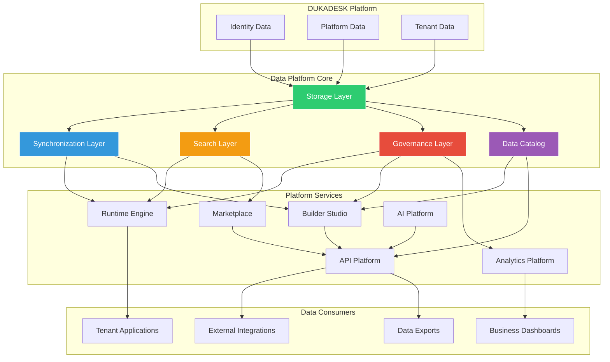
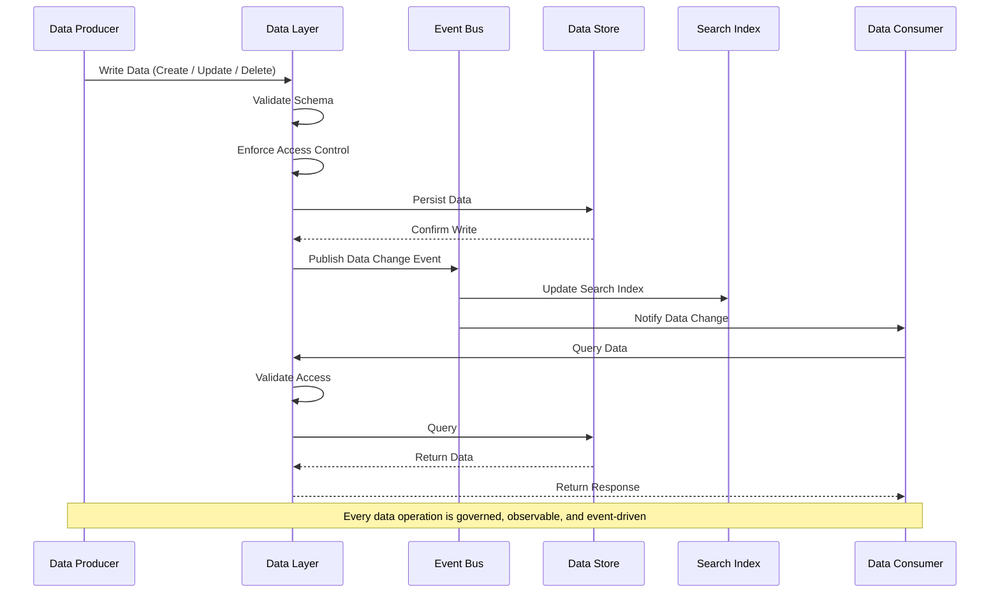
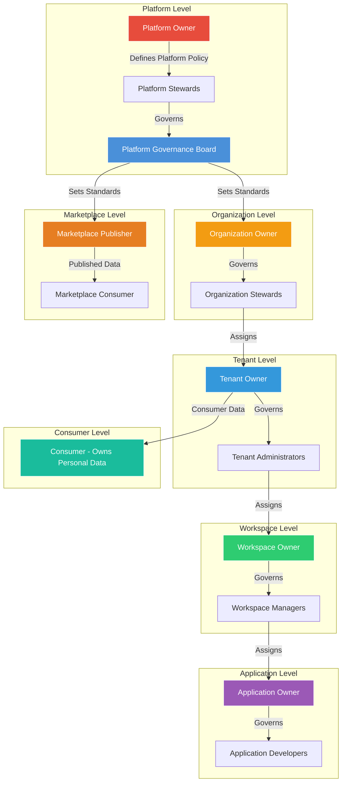
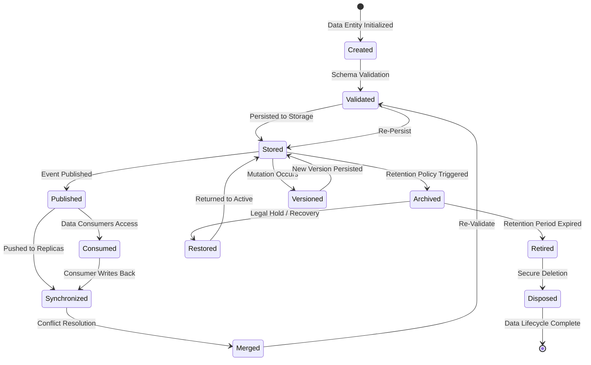
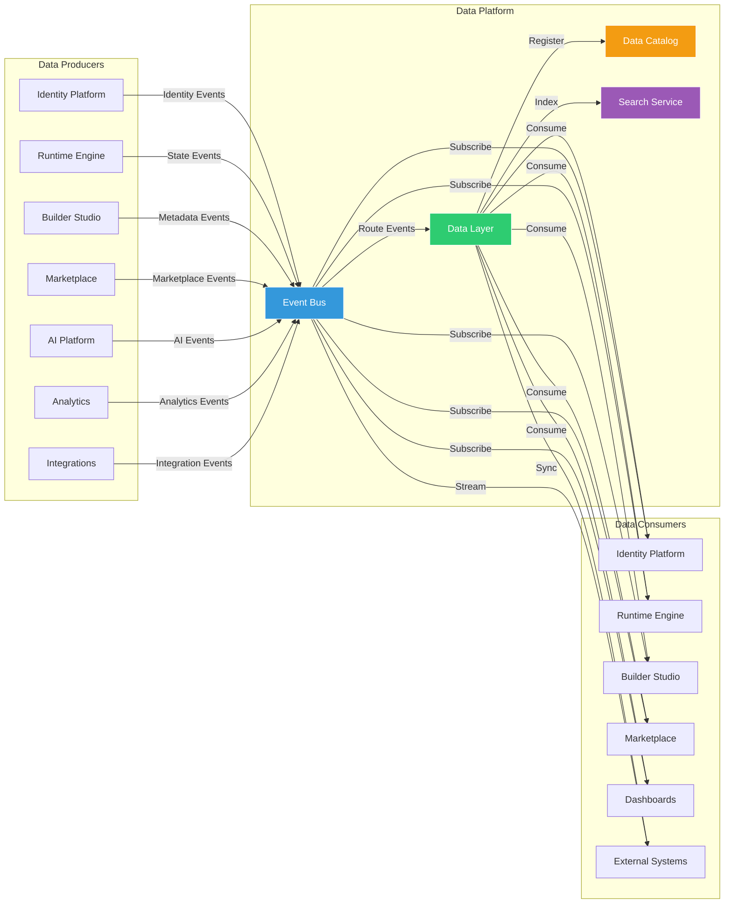
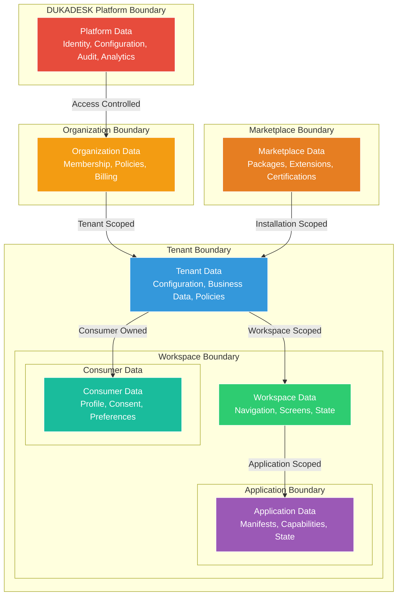
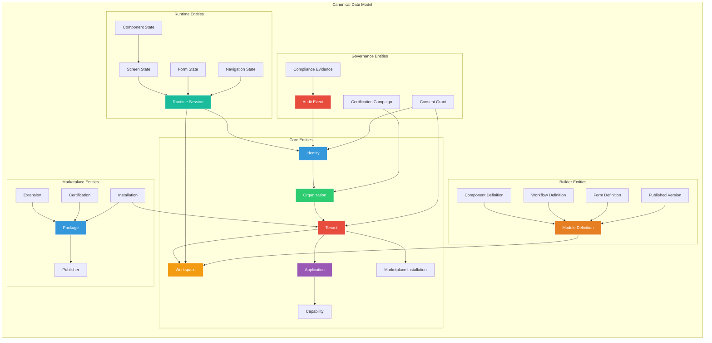
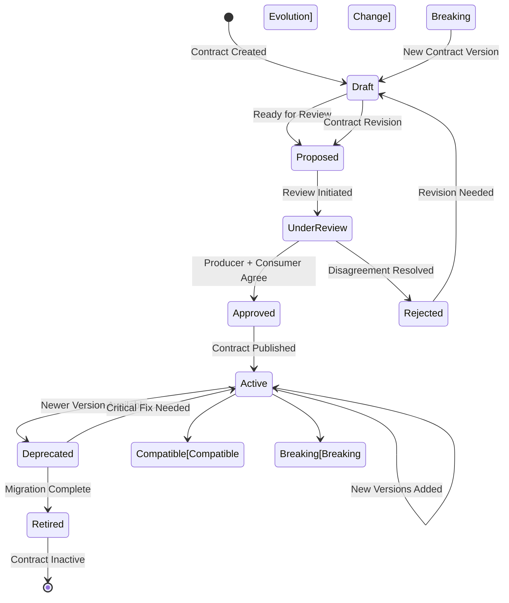

# Data Platform Architecture

**KB-073 — Data Platform Architecture Specification**

| Metadata | |
|----------|---|
| **KB ID** | KB-073 |
| **Title** | Data Platform Architecture |
| **Version** | 0.1.0 |
| **Status** | Draft |
| **Owner** | Architecture Team |
| **Suite** | Data Platform Architecture |
| **Dependencies** | KB-043 Workspace & Tenant Model, KB-051 Runtime Architecture Overview, KB-057 Runtime Security Architecture, KB-058 Runtime Observability & Diagnostics Architecture, KB-063 Identity Platform Architecture, KB-064 Authentication Architecture, KB-065 Authorization & RBAC Architecture, KB-066 Universal Consumer Identity Architecture, KB-067 Consent & Privacy Architecture, KB-068 Session Management Architecture, KB-069 Organization, Tenant & Workspace Security Architecture, KB-070 API Security & Token Architecture, KB-071 Identity Federation & Social Login Architecture, KB-072 Audit, Compliance & Identity Governance Architecture |
| **Related Documents** | KB-042 Application Manifest Specification, KB-044 Navigation Architecture, KB-045 Screen Model, KB-046 Component Tree Model, KB-047 Action & Event Model, KB-048 Application State Model, KB-049 Theme & Design Token Model, KB-050 Capability Composition Model, KB-052 Rendering Engine Architecture, KB-053 Rendering Pipeline Architecture, KB-054 Runtime Component Registry Architecture, KB-055 Runtime State Engine Architecture, KB-056 Runtime Navigation Engine Architecture, KB-060 Runtime Lifecycle Management, KB-062 Runtime Deployment & Environment, KB-074 Data Modeling & Schema Governance (planned), KB-075 Storage Architecture (planned), KB-076 Data Access Layer Architecture (planned) |
| **Review Status** | Pending |
| **Last Updated** | 2026-07-11 |

---

### Revision History

| Version | Date | Author | Change |
|---------|------|--------|--------|
| 0.1.0 | 2026-07-11 | AI Architecture Agent | Initial draft |

---

## 1. Executive Summary

### 1.1 Purpose

This document defines the Data Platform Architecture for the DUKADESK Platform. It establishes the canonical architecture governing every category of data within the DUKADESK ecosystem — platform data, tenant business data, builder metadata, runtime state, marketplace assets, workflow state, AI-generated content, events, analytics, search, offline synchronization, and future distributed deployments.

The Data Platform is the authoritative foundation for storage, access, synchronization, governance, lifecycle management, and platform interoperability. Every data operation — create, read, update, delete, query, stream, synchronize, archive, dispose — is governed by this architecture.

Unlike traditional SaaS systems, DUKADESK is a platform where data is created by Builders, Runtime Applications, Marketplace Assets, Integrations, AI Services, Organizations, Tenants, and Consumers. The Data Platform must support all these data producers and consumers through a unified, governed architecture.

This document defines architecture only. It is technology-independent, storage-engine-independent, and implementation-independent.

### 1.2 Scope

**In scope:**

- Platform Data: Identity, organization, tenant, workspace, application configuration
- Identity Data: User identities, authentication methods, consent records, session data (KB-063–KB-072)
- Organization Data: Organization structure, membership, policies
- Tenant Data: Tenant business data, application data, consumer data
- Workspace Data: Workspace configuration, navigation, screens, components, state
- Application Data: Application manifests, capabilities, theme definitions
- Builder Metadata: Module definitions, component definitions, workflow definitions, form definitions, data model definitions, theme definitions, published versions, deployment configurations
- Runtime State: Session state, screen state, component state, navigation state, form state, cart state, offline queue, cached manifests
- Workflow Data: Workflow definitions, workflow instances, workflow state, workflow history
- Marketplace Data: Package metadata, extension metadata, certification records, distribution records, installation records
- AI Data: AI model metadata, training data references, inference context, content generation records, AI-generated content
- Analytics Data: Usage analytics, performance metrics, business metrics, operational metrics
- Configuration Data: Platform configuration, runtime configuration, tenant configuration, module configuration
- Event Data: Domain events, integration events, audit events, lifecycle events
- Search Data: Search indexes, search metadata, search history
- Media Metadata: Asset references, media metadata, content references
- Audit Data: Audit events, compliance evidence, governance records (KB-072)
- Operational Data: Service health, deployment state, runtime metrics, infrastructure state

**Out of scope:**

- Implementation details of specific storage engines, databases, or file systems
- Specific data serialization formats or protocols
- Network-level data transport (TCP, HTTP, gRPC)
- Application-level business logic for specific tenant applications
- Infrastructure-specific data replication topology

---

## 2. Architectural Principles

### 2.1 Data is a Platform Asset

All data within the DUKADESK ecosystem is a platform asset, not a service asset, not an application asset. Data is owned by the platform and governed by platform policies. Services and applications are custodians, not owners. Platform asset ownership ensures data is never locked to a specific service, storage engine, or implementation.

### 2.2 Single Source of Truth

Every data entity has exactly one authoritative source. The canonical source is the origin of truth for that entity's state. Derived copies, caches, and materialized views are explicitly identified as non-authoritative. The single source of truth principle prevents data inconsistency, conflicting updates, and ownership disputes.

### 2.3 Ownership Before Access

Every data entity has a designated data owner. The data owner defines access policy, retention policy, quality standards, and lifecycle governance. Access is granted by the owner through the authorization system (KB-065). No data exists without an owner. No data is accessed without authorization.

### 2.4 Schema Governance

Every data entity has a governed schema. Schemas are versioned, validated, and published through the schema registry. Schema evolution follows defined compatibility rules. Breaking changes require contract renegotiation. Schema governance ensures data consumers are never surprised by data structure changes.

### 2.5 Event-Driven Evolution

Data changes are communicated through events. Every data mutation produces one or more events. Events enable real-time synchronization, cross-service consistency, audit, and reactive processing. Event-driven evolution ensures that all data consumers are notified of changes they care about.

### 2.6 Data Independence

Data is independent of the services that produce or consume it. Services can be replaced, upgraded, or removed without data loss or corruption. Data outlives services. Data independence ensures that the platform can evolve services without compromising data integrity.

### 2.7 Tenant Isolation

Tenant data is strictly isolated at the storage and access layers. Cross-tenant data access is blocked by default and permitted only with explicit authorization, consent, and governance. Tenant isolation is enforced at every data boundary — storage, query, stream, export.

### 2.8 Consistency Through Contracts

Data producers and consumers agree on data contracts. Contracts define the shape, semantics, validity rules, and evolution policy for data exchanges. Contracts are the authoritative agreement between data parties. Consistency is maintained through contract compliance, not through shared implementation.

### 2.9 Offline-First

The Data Platform supports offline-first operation for Runtime instances. Data is available locally when offline, synchronized when connectivity is restored. Conflict resolution is deterministic and user-transparent. Offline-first is architected from the start, not retrofitted.

### 2.10 Observable Data

Every data operation is observable — read, write, query, stream, synchronize, archive, dispose. Data observability is the foundation for data quality monitoring, operational troubleshooting, compliance auditing, and cost optimization.

### 2.11 Versioned Data

All data entities are versioned. Versioning supports audit, rollback, point-in-time recovery, temporal queries, and conflict resolution. Versioning is an architectural primitive, not an application feature.

### 2.12 Future Distributed by Design

The Data Platform architecture assumes future distributed deployment — multiple regions, multiple availability zones, edge deployments, disconnected operation. Data partitioning, replication, consistency models, and conflict resolution are architected from the start, not retrofitted.

---

## 3. Canonical Definitions

### 3.1 Data Platform

The architectural layer that provides unified data storage, access, synchronization, governance, lifecycle management, and interoperability services across the entire DUKADESK ecosystem. The Data Platform is the authoritative foundation for all data operations.

### 3.2 Data Domain

A logical boundary around a related set of data entities that share ownership, governance, lifecycle, and access policies. Data domains map to business and platform capabilities — Identity, Tenant, Runtime, Builder, Marketplace, AI, Analytics, Infrastructure. Each domain has a designated data owner and defined boundaries.

### 3.3 Data Product

A curated, self-contained unit of data exposed by a data domain for consumption by other domains or services. Data products have defined schemas, contracts, quality SLAs, and access policies. A data product is the unit of data sharing between domains.

### 3.4 Data Contract

A formal, versioned agreement between a data producer and one or more data consumers. The contract defines the data schema, semantics, validity rules, availability SLA, quality SLAs, evolution policy, and access terms. Contracts are the authoritative mechanism for cross-domain data exchange.

### 3.5 Data Owner

The entity (platform service, organization, or team) responsible for a data domain's data quality, governance, lifecycle, access policy, and compliance. Data owners have authority over their domain's schemas, contracts, and access grants.

### 3.6 Data Steward

The entity responsible for the operational management of data within a domain — schema evolution, contract compliance, quality monitoring, metadata management, access governance, and lifecycle execution. Stewardship may be delegated by the data owner.

### 3.7 Canonical Model

The authoritative, platform-wide representation of a data entity. The canonical model defines the entity's identity, structure, semantics, relationships, and lifecycle. All domain-specific representations are derived from or compatible with the canonical model.

### 3.8 Dataset

A collection of related data records that share a common schema, ownership, and lifecycle. Datasets are the unit of data organization within a domain. Examples: the set of all tenant configurations, the set of all runtime sessions.

### 3.9 Entity

A distinct, identifiable data object within the platform. Each entity has a unique identifier, a defined schema, a data owner, and a lifecycle. Entities are the atomic units of data governance.

### 3.10 Aggregate

A cluster of entities that are treated as a single unit for data consistency and transactional operations. Aggregates define consistency boundaries — all entities within an aggregate are updated atomically. Aggregates are the unit of transactional consistency.

### 3.11 Record

A single instance of an entity at a point in time. Records are versioned and immutable in the audit sense (each version is a new record, not a modification of the previous). Records form the basis of the data versioning model.

### 3.12 Metadata

Data about data — schema definitions, entity descriptions, ownership records, lineage information, quality metrics, usage statistics, lifecycle state, retention policies, access policies. Metadata is first-class data within the Data Platform.

### 3.13 Operational Data

Data required for the day-to-day operation of the platform — service state, runtime state, session data, queue state, lock state, configuration values. Operational data is typically short-lived, high-throughput, and consistency-sensitive.

### 3.14 Analytical Data

Data used for analysis, reporting, and business intelligence — usage metrics, performance metrics, business aggregates, trend data, historical snapshots. Analytical data is typically large-volume, long-retention, and query-optimized.

### 3.15 Master Data

Core business entities that are shared across multiple domains and services — organizations, tenants, workspaces, applications, users, products, capabilities. Master data is the authoritative reference for shared entities.

### 3.16 Transactional Data

Data resulting from business transactions — order records, payment records, consent grants, session records, workflow instances. Transactional data is append-heavy and often requires strict consistency guarantees.

### 3.17 Derived Data

Data computed or transformed from other data sources — aggregations, materialized views, caches, search indexes, analytics results. Derived data is non-authoritative by definition. Its source of truth is the data it was derived from.

### 3.18 Immutable Data

Data that, once written, is never modified or deleted. Immutable data is append-only. Examples: audit events, transaction logs, event streams, versioned entity records. Immutability provides auditability, temporal query capability, and conflict-free replication.

### 3.19 Mutable Data

Data that may be updated or deleted over its lifecycle. Mutable data requires consistency controls, conflict resolution, and versioning. Examples: runtime state, configuration values, session data, cached data.

---

## 4. Data Platform Architecture

### 4.1 Data Platform Architecture

### 4.2 Architecture Overview

The Data Platform operates in layers:

- **Top Layer — Platform, Identity, and Tenant Data**: The highest-level data categories. Platform Data includes system configuration, capability definitions, platform policies. Identity Data (KB-063–KB-072) includes user identities, authentication, authorization, consent, sessions, federation. Tenant Data includes all data belonging to tenant organizations.

- **Data Platform Core**: The central services that enable data storage, synchronization, search, governance, and discovery. The Storage Layer provides unified data persistence. The Synchronization Layer manages data flow between services and devices. The Search Layer provides indexing and discovery. The Governance Layer enforces data policies. The Data Catalog provides data discovery and metadata management.

- **Platform Services**: The services that produce and consume data through the Data Platform Core — Runtime Engine, Builder Studio, Marketplace, AI Platform, Analytics Platform, API Platform.

- **Data Consumers**: The ultimate consumers of platform data — Tenant Applications, External Integrations, Business Dashboards, Data Exports.

### 4.3 Data Flow Through the Architecture

---

## 5. Data Domains

### 5.1 Platform Data Domain Map

```mermaid
flowchart TB
    subgraph DomainMap["Data Domains"]
        direction TB

        subgraph Platform["Platform Domains"]
            ID[Identity Domain]
            ORG[Organization Domain]
            TENANT[Tenant Domain]
            WS[Workspace Domain]
            APP[Application Domain]
            CONF[Configuration Domain]
        end

        subgraph Capability["Capability Domains"]
            RUNTIME[Runtime Domain]
            BUILDER[Builder Domain]
            MKT[Marketplace Domain]
            AI[AI Domain]
            WORKFLOW[Workflow Domain]
        end

        subgraph Infrastructure["Infrastructure Domains"]
            ANALYTICS[Analytics Domain]
            AUDIT[Audit Domain]
            MONITOR[Monitoring Domain]
            EVENT[Event Domain]
            SEARCH_D[Search Domain]
        end
    end

    subgraph Ownership["Ownership"]
        PLATFORM_OWNED[Platform Owned]
        TENANT_OWNED[Tenant Owned]
        SHARED[Shared Governance]
    end

    ID --> PLATFORM_OWNED
    ORG --> PLATFORM_OWNED
    TENANT --> PLATFORM_OWNED
    WS --> PLATFORM_OWNED
    APP --> PLATFORM_OWNED
    CONF --> PLATFORM_OWNED
    ANALYTICS --> PLATFORM_OWNED
    AUDIT --> PLATFORM_OWNED
    MONITOR --> PLATFORM_OWNED
    EVENT --> PLATFORM_OWNED
    SEARCH_D --> PLATFORM_OWNED

    RUNTIME --> SHARED
    BUILDER --> SHARED
    MKT --> SHARED
    AI --> SHARED
    WORKFLOW --> SHARED

    style ID fill:#3498db,stroke:#fff,color:#fff
    style ORG fill:#2ecc71,stroke:#fff,color:#fff
    style TENANT fill:#e74c3c,stroke:#fff,color:#fff
    style WS fill:#f39c12,stroke:#fff,color:#fff
    style APP fill:#9b59b6,stroke:#fff,color:#fff
    style RUNTIME fill:#1abc9c,stroke:#fff,color:#fff
    style BUILDER fill:#e67e22,stroke:#fff,color:#fff
    style MKT fill:#2ecc71,stroke:#fff,color:#fff
    style AI fill:#e74c3c,stroke:#fff,color:#fff
    style AUDIT fill:#3498db,stroke:#fff,color:#fff
```

### 5.2 Domain Definitions and Responsibilities

| Domain | Owner | Data Types | Key Entities | Consumers |
|--------|-------|------------|-------------|-----------|
| Identity | Platform | User profiles, auth methods, consent records, session data, federation links | User, AuthenticationMethod, ConsentGrant, Session, FederationLink | Runtime, Builder, Marketplace, AI Platform, APIs |
| Organization | Platform | Organization structure, membership, policies, billing | Organization, OrganizationMember, OrganizationPolicy | All services |
| Tenant | Platform | Tenant configuration, membership, data isolation boundaries | Tenant, TenantMember, TenantConfiguration, TenantPolicy | Runtime, Builder, Marketplace |
| Workspace | Platform | Workspace configuration, navigation, screens, components, state | Workspace, Navigation, Screen, Component, WorkspaceState | Runtime |
| Application | Platform | Application manifests, capabilities, themes, versions | Application, ApplicationManifest, ApplicationCapability, ApplicationVersion | Builder, Marketplace, Runtime |
| Runtime | Shared | Session state, screen state, component state, navigation state, offline queue, cached manifests | RuntimeSession, ScreenState, ComponentState, OfflineQueue | Runtime Engine, Tenant Applications |
| Builder | Shared | Module definitions, component definitions, workflow definitions, form definitions, published versions | ModuleDefinition, ComponentDefinition, WorkflowDefinition, FormDefinition, PublishedVersion | Builder Studio, Publishing Pipeline |
| Marketplace | Shared | Package metadata, extension metadata, certification records, installation records | Package, Extension, Certification, Installation | Marketplace, Builder, Runtime |
| AI | Shared | AI model metadata, training data references, inference context, generated content | AIModel, TrainingDataRef, InferenceContext, GeneratedContent | AI Platform, Runtime |
| Workflow | Shared | Workflow definitions, instances, state, history | WorkflowDefinition, WorkflowInstance, WorkflowState, WorkflowHistory | Runtime, Builder |
| Analytics | Platform | Usage metrics, performance metrics, business aggregates, trend data | UsageMetric, PerformanceMetric, BusinessAggregate, TrendData | Dashboards, AI Platform |
| Audit | Platform | Audit events, compliance evidence, governance records | AuditEvent, ComplianceEvidence, GovernanceRecord | Compliance, Security, External Auditors |
| Monitoring | Platform | Service health, deployment state, runtime metrics, infrastructure state | ServiceHealth, DeploymentState, RuntimeMetric, InfrastructureState | Operations, Dashboards |
| Event | Platform | Domain events, integration events, lifecycle events | DomainEvent, IntegrationEvent, LifecycleEvent | All services |
| Search | Platform | Search indexes, search metadata, search history | SearchIndex, SearchMetadata, SearchHistory | Runtime |

---

## 6. Data Classification

### 6.1 Classification Categories

| Category | Description | Examples | Volatility | Retention |
|----------|-------------|----------|------------|-----------|
| Master Data | Core shared entities, authoritative reference | Organizations, Tenants, Workspaces, Applications, Users | Low (rarely changes) | Permanent |
| Transaction Data | Business operation records | Orders, Payments, Consent Grants, Workflow Instances | Append-only | Long-term (3-7 years) |
| Reference Data | Lookup values, enumerations, code lists | Country codes, currency codes, capability types | Very low | Permanent |
| Configuration Data | System and service configuration | Tenant configuration, module configuration, runtime settings | Low to medium | Service lifetime |
| Runtime State | Ephemeral service and session data | Session state, screen state, component state, form data | High (constantly changing) | Session lifetime |
| Event Data | Domain and integration events | Data change events, lifecycle events, audit events | Append-only | Medium (30-90 days hot) |
| Media Metadata | References and metadata for media assets | Asset URL, content type, dimensions, duration | Low | Asset lifetime |
| Search Metadata | Search index data and metadata | Inverted indexes, search rankings, facet data | Medium | Index lifetime |
| Analytical Data | Aggregated business and operational data | Usage reports, performance trends, business metrics | Append-only | Long-term (1-3 years) |
| Audit Data | Immutable governance and compliance records | Audit events, compliance evidence, certification records | Append-only | Regulatory (3-7 years) |
| Temporary Data | Transient processing data | Sort buffers, intermediate results, cache entries | Very high | Minutes to hours |
| Cached Data | Performance-optimized copies | Manifest caches, schema caches, reference data caches | Medium | Cache TTL |

### 6.2 Classification Rules

- **Master Data**: Single source of truth enforced across all domains. All services reference master data through the canonical model. Updates propagate through events.
- **Transaction Data**: Append-only by default. Updates only through defined correction workflows. Immutable transaction records for audit.
- **Runtime State**: Ephemeral by design. No long-term retention guarantees. State is recoverable from event replay where needed.
- **Event Data**: Immutable and ordered. Events are the authoritative record of data changes. Event retention governs replay capability.
- **Audit Data**: Immutable and tamper-evident. Audit data is governed by regulatory retention requirements. Never purged without legal hold verification.

---

## 7. Data Ownership Model

### 7.1 Data Ownership Hierarchy

### 7.2 Ownership by Level

**Platform Level:**
- **Platform Owner** (DUKADESK): Owns all platform-level data — identity, organization, tenant definitions, workspace definitions, application definitions, configuration, audit, monitoring, analytics, search indexes
- **Platform Stewards**: Operational management of platform data domains
- **Platform Governance Board**: Sets data governance standards, resolves cross-domain disputes, approves schema evolution across domains

**Organization Level:**
- **Organization Owner**: Owns organization-level data — membership, policies, billing, organization-specific configuration
- **Organization Stewards**: Operational management of organization data

**Tenant Level:**
- **Tenant Owner**: Owns tenant-level data — tenant configuration, tenant policies, tenant business data, tenant-specific schemas
- **Tenant Administrators**: Operational management of tenant data, delegated by tenant owner

**Workspace Level:**
- **Workspace Owner**: Owns workspace-level data — workspace configuration, navigation, screens, components, state
- **Workspace Managers**: Operational management of workspace data

**Application Level:**
- **Application Owner**: Owns application-level data — manifests, capabilities, themes, versions
- **Application Developers**: Create and modify application data

**Consumer Level:**
- **Consumer**: Owns personal data — profile attributes, consent grants, authentication methods, linked providers. Consumer data is governed by consent (KB-067) and identity (KB-066) architectures.

**Marketplace Level:**
- **Marketplace Publisher**: Owns published package data — packages, extensions, certification records
- **Marketplace Consumer**: Owns installation records — installation configurations, usage data

### 7.3 Stewardship and Governance Responsibilities

| Role | Ownership | Stewardship | Governance |
|------|-----------|-------------|------------|
| Platform Owner | Platform data | Strategic direction, policy definition | Governance board chair |
| Platform Steward | Data domain | Schema evolution, quality monitoring, contract management | Domain policy enforcement |
| Organization Owner | Organization data | Membership governance, policy enforcement | Organization policy |
| Tenant Owner | Tenant data | Tenant configuration, data isolation, access grants | Tenant policy |
| Consumer | Personal data | Consent management, data portability, deletion rights | Individual privacy rights |
| Marketplace Publisher | Published data | Package quality, version management, certification | Publisher policy |

---

## 8. Data Flow Architecture

### 8.1 Data Flow Lifecycle

### 8.2 Lifecycle Stages

**Create**: Data enters the platform through a defined creation process. Creation includes identity assignment (who created it), ownership assignment (who owns it), classification (what type of data it is), and metadata population (when, where, why).

**Validate**: Data is validated against its contract schema before storage. Validation ensures structural correctness, referential integrity, business rule compliance, and policy compliance. Invalid data is rejected with informative errors.

**Store**: Data is persisted to the appropriate storage tier based on classification, performance requirements, and retention policy. Storage is atomic within an aggregate boundary.

**Publish**: Data changes are published as events on the platform event bus. Events carry the changed data (or a reference to it), the change type, the change metadata (who, when, why), and the previous state reference.

**Consume**: Data consumers read data through the Data Access Layer (KB-076). Access is authorized (KB-065), governed, and observable. Consumers receive data change events for real-time synchronization.

**Synchronize**: Data is synchronized across storage tiers, caching layers, offline clients, and geographical replicas. Synchronization is event-driven where possible, batch where necessary.

**Archive**: Data is moved from active storage to archival storage based on retention policies. Archival preserves data in a compressed, queryable form for compliance and historical reference.

**Retire**: Data reaches the end of its retention period. Legal hold is verified before retirement. Retired data is marked for disposal.

**Dispose**: Data is securely deleted or anonymized per privacy and compliance requirements. Disposal is verified and recorded as an audit event.

**Versioned**: When mutable data is updated, the previous state is preserved as a version. Versioning enables audit, rollback, temporal query, and conflict resolution.

### 8.3 Cross-Service Data Flow

---

## 9. Data Boundaries

### 9.1 Data Boundary Model

### 9.2 Boundary Rules

**Platform ↔ Organization:**
- Platform data includes system-level entities — identity definitions, platform configuration, audit records, analytics aggregates
- Platform data is accessible to authorized platform services
- Organization data is isolated within the organization boundary
- Cross-organization data access is blocked by default

**Organization ↔ Tenant:**
- Organization data (membership, billing) is accessible across tenants within the organization
- Tenant data is strictly isolated from other tenants
- Organization administrators have governed access to tenant data for administrative purposes
- Tenant administrators cannot access organization-level financial or membership data

**Tenant ↔ Workspace:**
- Tenant data includes workspace configuration, workspace templates, shared workspace resources
- Workspace data is isolated within the workspace boundary
- Tenant administrators have governed access to all workspace data
- Workspace administrators have access only to their workspace's data

**Workspace ↔ Application:**
- Workspace data includes application placement, navigation structure, state containers
- Application data (manifest, capabilities, versions) is shared across workspaces within the same tenant
- Application runtime state is scoped to the workspace and session

**Application ↔ Runtime:**
- Application data defines the application's structure and behavior
- Runtime data is the ephemeral state of an application execution
- Runtime state is not persisted beyond the session unless explicitly configured

**Tenant ↔ Consumer:**
- Consumer data within a tenant is owned by the consumer, governed by consent (KB-067)
- Tenant applications access consumer data only through delegated, consent-governed access (KB-070)
- Consumer data is portable — consumers can export or delete their data

**Platform ↔ Marketplace:**
- Marketplace data (packages, extensions) is published by marketplace publishers
- Installation records are tenant-scoped
- Marketplace data is accessible only to authorized tenants and publishers

---

## 10. Canonical Data Model

### 10.1 Canonical Data Model Relationships

### 10.2 Entity Standards

- **Entity Identity**: Every entity has a globally unique identifier (UUID v4). Identifiers are immutable — once assigned, they never change. Identifiers are opaque — no business meaning is encoded.
- **Entity Schema**: Every entity conforms to a governed schema registered in the schema registry. Schema includes structural definition, validation rules, semantic description, and relationship definitions.
- **Entity Metadata**: Every entity carries standard metadata — created_at, created_by, updated_at, updated_by, version, status, owner, domain.
- **Entity Lifecycle**: Every entity has a defined lifecycle — states, transitions, allowed operations per state. Lifecycle is enforced by the Data Layer.

### 10.3 Identifier Strategy

| Entity Type | Identifier Format | Example | Scope |
|-------------|------------------|---------|-------|
| Identity | `uid_` + UUID | `uid_a1b2c3d4` | Global |
| Organization | `org_` + UUID | `org_mk` | Global |
| Tenant | `tnt_` + UUID | `tnt_mk_prod` | Global (within org) |
| Workspace | `ws_` + UUID | `ws_a1b2` | Global (within tenant) |
| Application | `app_` + UUID | `app_menu` | Global |
| Module | `mod_` + UUID | `mod_xyz` | Global |
| Session | `sess_` + UUID | `sess_abc123` | Global |
| Event | `evt_` + UUID | `evt_def456` | Global |

### 10.4 Relationships

- **Ownership**: Entity A owns Entity B — A defines B's lifecycle, access policy, retention. Example: Workspace owns Screen.
- **Membership**: Entity A is a member of Entity B — A exists within B's boundary. Example: Identity is a member of Tenant.
- **Reference**: Entity A references Entity B — A contains B's identifier but does not own B. Example: Session references Identity.
- **Dependency**: Entity A depends on Entity B — A cannot exist without B. Example: Installation depends on Package.

### 10.5 Aggregates

Aggregates define transactional consistency boundaries:

| Aggregate | Entities | Consistency Boundary |
|-----------|----------|---------------------|
| User Account | Identity, AuthenticationMethod, ConsentGrant, Profile | All user entities updated atomically |
| Tenant Configuration | Tenant, TenantPolicy, TenantConfiguration | Configuration changes are atomic |
| Module | ModuleDefinition, ComponentDefinition, WorkflowDefinition, FormDefinition | Module publication is atomic |
| Session | RuntimeSession, ScreenState, ComponentState, NavigationState | Session state transitions are atomic |
| Workflow Instance | WorkflowInstance, WorkflowState, WorkflowHistory | Workflow execution steps are atomic |

### 10.6 Metadata Standards

Every entity carries:

- **Technical Metadata**: `entity_id`, `entity_type`, `schema_version`, `created_at`, `created_by`, `updated_at`, `updated_by`, `version`, `status`
- **Governance Metadata**: `data_domain`, `data_owner`, `data_classification`, `retention_policy`, `access_policy`
- **Operational Metadata**: `environment`, `region`, `service_of_origin`, `trace_id`

### 10.7 Versioning

- **Optimistic Concurrency**: Every entity has a version number. Updates require the version being updated to match the current version. Version mismatch triggers conflict resolution.
- **Temporal Versioning**: Every entity version is timestamped. Temporal queries can retrieve entity state at any point in time.
- **Audit Versioning**: All version changes are recorded as audit events. The full version history is queryable.
- **Conflict Resolution**: Concurrent updates to the same entity follow last-writer-wins by default. Application-defined conflict resolution is supported for specific entities.

---

## 11. Data Contracts

### 11.1 Data Contract Lifecycle

### 11.2 Producer Contracts

- **Definition**: Producer contracts define what data a producer will publish, how often, at what quality, and under what schema. Producers register contracts in the contract registry.
- **Schema**: The exact schema of the data being produced. Schema is versioned and references the schema registry.
- **Availability SLA**: When and how often data will be produced. Includes latency guarantees, availability windows, and exception handling.
- **Quality SLA**: Data quality commitments — completeness, accuracy, timeliness, uniqueness, consistency.
- **Change Policy**: How the producer will notify consumers of schema changes. Compatibility guarantees. Minimum notice period for breaking changes.

### 11.3 Consumer Contracts

- **Definition**: Consumer contracts define what data a consumer will consume, at what volume, for what purpose, and under what terms.
- **Subscription**: Which data products the consumer subscribes to, including event subscriptions for real-time data consumption.
- **Usage Terms**: The purpose for which the consumer will use the data. Usage limitations. Data retention by the consumer.
- **Access Pattern**: Expected query patterns, volume, frequency, and peak loads. Used for capacity planning and SLA enforcement.

### 11.4 Compatibility and Version Evolution

- **Backward Compatible**: Newer schema versions can read data written by older versions. Adding optional fields is backward compatible. Removing fields or making optional fields required is not.
- **Forward Compatible**: Older schema versions can read data written by newer versions. Ignoring unknown fields is forward compatible.
- **Full Compatible**: Both backward and forward compatible. Only additive, optional changes are fully compatible.
- **Breaking Change**: Any change that violates compatibility guarantees. Breaking changes require contract renegotiation and consumer migration planning.

### 11.5 Validation

- **Schema Validation**: All data written through the Data Layer is validated against the producer's contract schema. Schema violations block the write.
- **Contract Compliance**: Data is monitored for contract compliance — quality metrics, availability SLA, access pattern compliance. Violations are alerted.
- **Consumer Compliance**: Consumer data usage is monitored for contract compliance — usage purpose, data retention, access patterns. Violations are alerted.

### 11.6 Contract Governance

- **Contract Registry**: Central registry of all producer and consumer contracts. Registry is the authoritative source for data contract information.
- **Contract Review**: Contracts are reviewed before approval. Review includes schema quality, compatibility assessment, governance compliance, and capacity impact.
- **Contract Deprecation**: Contracts are deprecated through a defined process with consumer notification, migration period, and retirement date.

---

## 12. Runtime Responsibilities

- Produce runtime state data — session state, screen state, component state, navigation state, form state, offline queue
- Consume platform data — manifests, navigation definitions, screen definitions, component definitions, theme definitions
- Validate data against contracts before writing
- Manage offline data — queue writes when offline, synchronize when connectivity restored, resolve conflicts deterministically
- Subscribe to data change events for real-time synchronization
- Respect data isolation boundaries — never access data outside the current session's workspace and tenant
- Include identity context in all data operations for authorization and audit
- Handle data version conflicts — detect conflicts and resolve per conflict resolution strategy
- Cache data for performance with explicit cache invalidation policies
- Never expose data layer credentials, connection strings, or storage internals to tenant applications

---

## 13. Backend Responsibilities

- Operate the Data Layer — storage, queries, transactions, indexing, search
- Enforce schema validation on all writes — reject data that does not conform to contract schemas
- Enforce access control on all reads and writes — authorize every data operation through the authorization service (KB-065)
- Enforce tenant isolation at the storage level — tenant data is physically or logically isolated
- Publish data change events for all mutations — events carry change metadata for audit and synchronization
- Operate the event bus for data change distribution
- Maintain the schema registry — all schemas are registered, versioned, and governed
- Maintain the contract registry — all data contracts are registered and monitored
- Maintain the data catalog — discoverable metadata for all datasets
- Operate search indexing — maintain search indexes synchronized with source data
- Manage data lifecycle — retention, archival, disposal, legal hold
- Handle data synchronization — push changes to consumers, receive changes from producers, resolve conflicts
- Support data versioning — maintain version history, support temporal queries, handle optimistic concurrency
- Monitor data quality — completeness, accuracy, timeliness, uniqueness, consistency
- Report data observability metrics — storage utilization, query performance, synchronization lag, data freshness, quality violations

---

## 14. Builder Responsibilities

- Produce builder metadata — module definitions, component definitions, workflow definitions, form definitions, theme definitions
- Consume platform reference data — capabilities, component registry, schema definitions
- Validate builder data against contract schemas before publication
- Respect tenant and workspace data boundaries — builder data is scoped to the builder's authorized context
- Publish data through the publishing pipeline with versioned, immutable publication records
- Subscribe to platform data change events for real-time builder updates (capability changes, schema updates)
- Include identity and workspace context in all data operations
- Participate in data governance — data created by builders is governed by tenant policies
- Manage published version data — versions are immutable once published

---

## 15. Marketplace Responsibilities

- Produce marketplace data — package metadata, extension definitions, certification records, distribution records
- Consume platform reference data — tenant configurations, capability definitions, schema definitions
- Consume publisher data — package contents, extension code, certification evidence
- Validate marketplace data against contract schemas before publication
- Respect tenant isolation — installation records are scoped to individual tenants
- Publish installation events for real-time consumer notification
- Include publisher identity and tenant context in all data operations
- Manage marketplace data lifecycle — package versioning, deprecation, certification expiration

---

## 16. Security

### 16.1 Data Ownership

Data ownership is the foundation of data security. Every entity has a designated owner who defines access policy. No entity exists without an owner. The authorization system (KB-065) enforces the owner-defined access policy. Data ownership is immutable — transfer of ownership is a governed process recorded as an audit event.

### 16.2 Data Isolation

Data isolation is enforced at every level:

- **Tenant Isolation**: Tenant data is isolated at the storage layer. Cross-tenant queries are structurally prevented. Tenant context is required for all data operations.
- **Workspace Isolation**: Workspace data is isolated within the workspace boundary. Cross-workspace access requires explicit authorization.
- **Consumer Isolation**: Consumer data is isolated to the consumer identity. Cross-consumer access is blocked unless explicitly authorized by the consumer (consent, KB-067).
- **Service Isolation**: Service data is isolated to the service boundary. Cross-service data access requires service-to-service authorization.

### 16.3 Encryption Domains (Conceptual)

- **At Rest**: All data at rest is encrypted. Encryption keys are managed per isolation boundary — tenant-specific keys for tenant data, platform keys for platform data.
- **In Transit**: All data in transit is encrypted. Internal service communication uses mTLS. External API communication uses TLS.
- **Key Management**: Encryption keys are managed by the platform key management service. Key rotation, revocation, and audit are governed by platform security policies.

### 16.4 Access Governance

Data access is governed by:

- **Authentication**: The requesting entity must be authenticated (KB-064)
- **Authorization**: The requesting entity must be authorized for the specific data operation (KB-065)
- **Consent**: Personal data access requires consumer consent (KB-067)
- **Purpose**: Data access must be for a declared, authorized purpose
- **Scope**: Data access is scoped to the requesting entity's organizational context

### 16.5 Integrity

- **Write Validation**: All data writes are validated against contract schemas before acceptance
- **Version Enforcement**: Optimistic concurrency prevents lost updates
- **Immutable Audit**: Data changes are recorded as immutable audit events (KB-072)
- **Integrity Checks**: Periodic data integrity verification detects corruption or unauthorized modification

### 16.6 Confidentiality

- **Least Privilege**: Data access is granted at the minimum necessary scope
- **Need to Know**: Data is accessible only to entities with a legitimate need
- **Data Minimization**: Only necessary data is collected, stored, and exposed
- **Sensitive Data Protection**: Sensitive data (PII, credentials, payment data) has additional protection — field-level encryption, access logging, restricted query capability

### 16.7 Availability

- **Data Redundancy**: Data is replicated across availability zones
- **Disaster Recovery**: Data is recoverable from replicated copies
- **Graceful Degradation**: Cached and local data enables continued operation during storage outages
- **Load Protection**: Rate limiting, connection pooling, and query throttling protect storage from overload

---

## 17. Privacy

### 17.1 Data Minimization

- **Collection**: Only data necessary for the declared purpose is collected. Data collection purposes are declared before collection.
- **Storage**: Only data with active retention policies is stored. Data without a retention policy is not persisted.
- **Exposure**: Only data necessary for the consumer's declared purpose is exposed. Data contracts specify minimum data exposure.
- **Retention**: Data is retained only as long as necessary for its purpose. Retention policies are enforced at the storage layer.

### 17.2 Consumer Ownership

Consumers own their personal data within the platform (KB-066). Consumer data ownership includes:
- **Right to Access**: Consumers can access their personal data at any time
- **Right to Portability**: Consumers can export their personal data in portable format
- **Right to Deletion**: Consumers can request deletion of their personal data (subject to legal retention requirements)
- **Right to Rectification**: Consumers can correct inaccurate personal data
- **Consent Control**: Consumers control consent for data sharing with tenant applications (KB-067)

### 17.3 Tenant Ownership

Tenants own their business data within the platform. Tenant data ownership includes:
- **Data Isolation**: Tenant data is isolated from other tenants
- **Data Export**: Tenants can export their business data
- **Data Deletion**: Tenants can request deletion of their tenant data (subject to legal retention)
- **Data Governance**: Tenants define data governance policies within their tenant boundary

### 17.4 Consent Dependencies

Data access that involves consumer personal data requires consent (KB-067):
- **Consent Before Access**: Consumer data is not accessed without prior consent
- **Consent Scope**: Data access is limited to the consented scope
- **Consent Revocation**: Consumer data access is terminated when consent is revoked
- **Consent Audit**: Consent grants and revocations are recorded as audit events

### 17.5 Cross-Tenant Restrictions

- **No Default Cross-Tenant Access**: Tenant data is not accessible from other tenants by default
- **Explicit Cross-Tenant Authorization**: Cross-tenant data access requires explicit authorization from both tenant owners
- **Consumer Consent**: Cross-tenant access to consumer data requires consumer consent
- **Cross-Tenant Audit**: Cross-tenant data access is audited with both tenant contexts

### 17.6 Retention Awareness

- **Purpose-Linked Retention**: Data retention is linked to the purpose of collection. Data is disposed when the purpose is fulfilled.
- **Consumer-Requested Deletion**: Consumer data is deleted on consumer request within the configured deletion window.
- **Legal Hold**: Data subject to legal hold is retained regardless of normal retention policies. Legal hold is applied per data entity.
- **Retention Audit**: Data retention compliance is audited (KB-072).

---

## 18. Performance

### 18.1 Data Access

| Operation | Target (p95) | Notes |
|-----------|-------------|-------|
| Single Entity Read (by ID) | < 5ms | Hot cache hit |
| Single Entity Read (by ID, no cache) | < 20ms | Direct storage read |
| Entity Write (single) | < 10ms | Validated, versioned, published |
| Entity Write (with indexing) | < 50ms | Includes search index update |
| Batch Read (100 entities) | < 50ms | Parallelized reads |
| Batch Write (100 entities) | < 200ms | Batch write with atomicity |

### 18.2 Query Efficiency

| Query Type | Target (p95) | Notes |
|-----------|-------------|-------|
| Equality Query (indexed) | < 10ms | Single-field equality match |
| Range Query (indexed) | < 50ms | Time range or numeric range |
| Full-Text Search | < 100ms | Search index query |
| Aggregate Query (count, sum) | < 100ms | Pre-aggregated or indexed |
| Cross-Entity Join | < 200ms | Within same domain |
| Cross-Domain Query | < 500ms | Via data product API |

### 18.3 Synchronization

| Scenario | Target (p95) | Notes |
|----------|-------------|-------|
| Event Publication to Consumer | < 100ms | Within same region |
| Offline Client Sync (incremental) | < 1s per 100 changes | Conflict detection included |
| Full Client Sync | < 30s per 10K entities | Initial sync or full resync |
| Cross-Region Replication | < 5s | Async replication |

### 18.4 Partitioning Concepts (Conceptual)

- **Functional Partitioning**: Data is partitioned by domain — identity data, tenant data, runtime data, builder data. Each partition has independent scaling characteristics.
- **Tenant Partitioning**: Tenant data is partitioned per tenant. Large tenants may have dedicated partitions. Small tenants share partitions with isolation enforcement.
- **Temporal Partitioning**: Time-series data (events, audit) is partitioned by time range. Recent partitions are hot. Older partitions are warm or cold.

### 18.5 Scalability

- **Horizontal Scaling**: Data Layer services scale horizontally. Storage partitions are redistributed as capacity is added.
- **Read Scaling**: Read replicas serve query load. Writes go to the primary. Read-after-write consistency is guaranteed within the session.
- **Write Scaling**: Write partitions are scaled by functional and tenant partitioning. High-volume tenants have dedicated write capacity.
- **Storage Scaling**: Storage tiers scale independently. Hot tier scales for performance. Cold tier scales for capacity.

### 18.6 Data Locality (Conceptual)

- **Regional Data**: Data is stored in the region closest to its primary consumers. Cross-region data access is minimized.
- **Edge Data**: Runtime-local data is stored on the device. Edge data is synchronized with the regional data center.
- **Cache Locality**: Frequently accessed data is cached at the service level. Cache is invalidated on data change events.

---

## 19. Observability

Reference KB-058 Runtime Observability & Diagnostics Architecture.

### 19.1 Data Quality Metrics

- **Completeness**: Percentage of required fields populated across datasets. Monitored per data domain and per contract.
- **Accuracy**: Percentage of data values matching expected ranges, patterns, or reference values. Monitored through validation rule compliance.
- **Timeliness**: Time between data creation and data availability for consumers. Monitored per data product.
- **Uniqueness**: Percentage of entities with unique identifiers. Duplicate detection rate.
- **Consistency**: Cross-reference integrity between related entities. Referential integrity violation rate.

### 19.2 Storage Metrics

- **Storage Utilization**: Current and historical storage usage by domain, by tenant, by storage tier
- **Storage Growth Rate**: Daily/weekly/monthly storage growth by data classification
- **Storage Cost**: Cost allocation by domain, by tenant
- **Storage Tier Distribution**: Percentage of data in hot, warm, cold tiers

### 19.3 Synchronization Metrics

- **Sync Lag**: Time between data change and sync to consumers. Measured per consumer and per data product.
- **Sync Volume**: Number of synchronization events per time period. Measured per consumer.
- **Sync Errors**: Number of failed synchronization attempts. Measured by error type (conflict, access denied, timeout).
- **Offline Queue Depth**: Number of pending offline synchronization operations.

### 19.4 Data Freshness

- **Last Updated**: Time since last successful write per dataset
- **Update Frequency**: Average time between updates per dataset
- **Staleness Threshold**: Datasets exceeding configured freshness thresholds are alerted

### 19.5 Contract Violations

- **Schema Violations**: Number of write operations rejected due to schema non-compliance
- **Quality SLA Violations**: Number of data quality SLA breaches by contract
- **Availability SLA Violations**: Number of data availability SLA breaches by contract
- **Consumer Contract Violations**: Number of consumer access pattern violations

### 19.6 Throughput and Latency

- **Read Throughput**: Read operations per second by data domain and storage tier
- **Write Throughput**: Write operations per second by data domain and storage tier
- **Query Latency**: Query response time by query type, data domain, and storage tier
- **Event Throughput**: Data change events per second by event type

---

## 20. Failure Scenarios

### 20.1 Data Ownership Conflict

| Scenario | Impact | Mitigation |
|----------|--------|------------|
| Two services claim ownership of the same entity | Ownership ambiguity, governance gaps, conflicting policies | Ownership registry enforces single owner. Ownership disputes escalated to governance board. |
| Owner deleted without reassignment | Entity has no owner — access and lifecycle governance breaks | Owner deletion requires ownership transfer. Unassigned entities are quarantined. Governance board reassigns. |

### 20.2 Schema Drift

| Scenario | Impact | Mitigation |
|----------|--------|------------|
| Producer changes schema without updating contract | Consumers receive unexpected data, contract violation | Schema validation rejects non-contract writes. Contract violation alert triggered. Consumer notification failure. |
| Consumer expects old schema after contract update | Consumer cannot process new data | Consumer contract subscription requires schema compatibility. Consumer migration is tracked. Old schema support is deprecated with notice. |

### 20.3 Contract Violation

| Scenario | Impact | Mitigation |
|----------|--------|------------|
| Producer violates quality SLA | Consumer receives low-quality data | Quality monitoring detects violation. Quality threshold alerts triggered. Producer remediation required. Compensating actions for consumers. |
| Consumer violates usage terms | Excessive queries, unauthorized data use | Usage monitoring detects violation. Consumer throttled or blocked. Contract renegotiation or termination. |

### 20.4 Duplicate Data

| Scenario | Impact | Mitigation |
|----------|--------|------------|
| Same entity created from two sources | Duplicate records, data inconsistency | Identity resolution detects duplicates. Merge process consolidates entities. Duplicate prevention at write time. |
| Event replay creates duplicate records | Data integrity compromised | Idempotent event processing prevents duplicates. Event deduplication at the consumer level. |

### 20.5 Orphan Records

| Scenario | Impact | Mitigation |
|----------|--------|------------|
| Parent entity deleted, child entities remain | Orphaned data with no owner | Cascade rules defined per relationship. Orphan detection sweeps identify unowned entities. Governance board disposition. |
| Tenant deleted, tenant data not disposed | Data retained beyond authorization | Tenant deletion triggers data disposal workflow. Legal hold verified before disposal. Disposal verified and audited. |

### 20.6 Cross-Tenant Leakage

| Scenario | Impact | Mitigation |
|----------|--------|------------|
| Storage misconfiguration exposes tenant A data to tenant B | Data breach, compliance violation | Tenant isolation enforced at storage and access layers. Cross-tenant query structurally prevented. Periodic isolation audit. |
| Bug in query service returns cross-tenant results | Accidental data exposure | Query service validates tenant context for every query. Multi-tenant queries require explicit authorization. Query results filtered by tenant context. |

### 20.7 Synchronization Failure

| Scenario | Impact | Mitigation |
|----------|--------|------------|
| Offline client fails to sync | Local data not reflected in platform | Offline queue persists until sync succeeds. Conflict resolution on reconnect. User notification of sync status. |
| Cross-region replication fails | Regional data out of sync | Async replication with retry. Replication lag monitoring. Manual reconciliation if lag exceeds threshold. |

### 20.8 Data Corruption

| Scenario | Impact | Mitigation |
|----------|--------|------------|
| Storage hardware corruption | Data loss or read errors | Data replication across availability zones. Integrity checks detect corruption. Corrupted data restored from replica. |
| Software bug corrupts data during write | Write succeeds with corrupted data | Schema validation catches structural corruption. Version history enables rollback. Immutable audit records detect unexpected changes. |

---

## 21. Anti-patterns

### 21.1 Duplicate Sources of Truth

**Anti-pattern**: Maintaining the same data entity in multiple services with independent write paths, expecting eventual consistency to reconcile differences.

**Why**: When two sources claim authority for the same data, conflicts are inevitable. Eventual consistency does not resolve ownership disputes. Consumers cannot determine which source to trust.

**Solution**: Every data entity has exactly one canonical source (Single Source of Truth). All other copies are derived, cached, or materialized views with explicit non-authoritative status.

### 21.2 Tenant-Specific Schemas

**Anti-pattern**: Allowing each tenant to define custom database schemas, tables, or columns without platform governance.

**Why**: Tenant-specific schemas prevent platform-level schema governance, cross-tenant analytics, schema evolution, and contract enforcement. Platform services cannot query or understand tenant-specific structures.

**Solution**: Data schemas are governed through the schema registry. Tenant customizations use governed extension mechanisms (custom fields, metadata) that preserve platform schema governance.

### 21.3 Business Logic Inside Storage

**Anti-pattern**: Embedding business logic in stored procedures, triggers, or database functions.

**Why**: Business logic in storage creates coupling between data and services. Storage implementations become tied to specific database technologies. Logic is versioned differently from application code. Testing and observability are limited.

**Solution**: Business logic lives in application services. Storage handles data persistence, query, and integrity only. Data Layer services enforce schema validation and access control — not business rules.

### 21.4 Shared Tenant Datasets

**Anti-pattern**: Storing data for multiple tenants in the same database table or storage container without tenant isolation at the storage layer.

**Why**: Creates risk of cross-tenant data leakage. Requires every query to filter by tenant context. A missing filter condition exposes all tenants' data. Storage-level isolation is the primary defense.

**Solution**: Tenant data is isolated at the storage layer. Each tenant has dedicated storage containers (database, schema, bucket). Cross-tenant access requires explicit, authorized routing.

### 21.5 Mutable Audit Records

**Anti-pattern**: Storing audit data in mutable storage that allows modification or deletion of committed audit events.

**Why**: Compromises audit integrity. Mutable audit logs cannot be trusted for compliance, forensic investigation, or legal proceedings.

**Solution**: Audit data is stored in immutable, append-only storage. Write-once semantics are enforced at the storage layer (KB-072).

### 21.6 Hidden Data Ownership

**Anti-pattern**: Data entities without explicit, recorded ownership. Ownership is assumed but not documented.

**Why**: Without explicit ownership, no one is responsible for data quality, governance, lifecycle, access policy, or compliance. Unowned data accumulates, degrades, and becomes a liability.

**Solution**: Every data entity has a recorded owner. Ownership is established at creation time. Ownership is recorded in entity metadata and the data catalog.

### 21.7 Unversioned Contracts

**Anti-pattern**: Data contracts without versioning. Producers change schemas and consumers discover the change through breakage.

**Why**: Unversioned contracts create unpredictable data quality. Schema changes cascade as failures through the consumer chain. No compatibility guarantees.

**Solution**: Data contracts are versioned. Schema evolution follows defined compatibility rules. Breaking changes require contract renegotiation with consumer notification and migration planning.

### 21.8 Direct Database Access

**Anti-pattern**: Allowing services, builders, or marketplace assets to access databases directly, bypassing the Data Access Layer.

**Why**: Direct database access bypasses schema validation, access control, tenant isolation, audit, event publication, and data governance. Creates security vulnerabilities, data integrity risks, and governance gaps.

**Solution**: All data access goes through the Data Access Layer (KB-076). Direct storage access is permitted only for platform infrastructure services with explicit authorization.

---

## 22. Future Evolution

### 22.1 Data Mesh Concepts

Future evolution may adopt data mesh principles — domain-oriented data ownership, data as a product, self-serve data infrastructure, federated computational governance. Each domain owns its data and exposes it as a product for consumption by other domains. The platform provides the infrastructure for domain data product creation, discovery, and consumption.

### 22.2 Federated Data Domains

Future domains may operate independently with their own storage, lifecycle, and governance, while participating in the platform-wide data ecosystem through standardized data contracts. Federated domains enable independent scaling, independent release cycles, and technology choice per domain.

### 22.3 AI-Native Data Products

Future data products may be AI-native — data products that are designed, curate, and served by AI services. AI-generated data products include computed features, predictive aggregates, synthetic data, and knowledge graphs. AI-native data products follow the same data contract governance as any other data product.

### 22.4 Autonomous Data Governance

Future governance may be autonomous — governance policies are automatically enforced, monitored, and remediated. Policy violations trigger automatic corrective actions (quarantine, access revocation, data correction). Governance is continuous and self-healing.

### 22.5 Distributed Platform Deployments

Future deployments may be fully distributed — multiple independent platform instances that share data through federated contracts. Each deployment has its own Data Platform Core. Cross-deployment data exchange follows the same contract and event model as within-deployment data exchange.

### 22.6 Cross-Region Data Architecture

Future cross-region data architecture may support active-active multi-region deployment — data is written to any region and replicated to all regions with conflict resolution. Consistency models are configurable per data domain and per data product.

---

## 23. Cross-References

| Reference | Document | Relationship |
|-----------|----------|-------------|
| **KB-042** | Application Manifest Specification | Application data definitions that the Data Platform governs |
| **KB-043** | Workspace & Tenant Model | Workspace and tenant data isolation boundaries |
| **KB-044** | Navigation Architecture | Navigation data managed by the Data Platform |
| **KB-045** | Screen Model | Screen data managed by the Data Platform |
| **KB-046** | Component Tree Model | Component tree data managed by the Data Platform |
| **KB-047** | Action & Event Model | Event data model and action data flow |
| **KB-048** | Application State Model | State data architecture governed by the Data Platform |
| **KB-049** | Theme & Design Token Model | Theme data managed by the Data Platform |
| **KB-050** | Capability Composition Model | Capability data definitions |
| **KB-051** | Runtime Architecture Overview | Runtime data consumption patterns |
| **KB-052** | Rendering Engine Architecture | Rendering state data management |
| **KB-053** | Rendering Pipeline Architecture | Rendering data flow through the pipeline |
| **KB-054** | Runtime Component Registry Architecture | Component registry data governance |
| **KB-055** | Runtime State Engine Architecture | State engine data lifecycle |
| **KB-056** | Runtime Navigation Engine Architecture | Navigation state data management |
| **KB-057** | Runtime Security Architecture | Runtime data security controls |
| **KB-058** | Runtime Observability & Diagnostics Architecture | Data observability, quality metrics, and monitoring |
| **KB-060** | Runtime Lifecycle Management | Data lifecycle alignment with runtime lifecycle |
| **KB-062** | Runtime Deployment & Environment | Data configuration per deployment environment |
| **KB-063** | Identity Platform Architecture | Identity data domain and governance |
| **KB-064** | Authentication Architecture | Authentication data management |
| **KB-065** | Authorization & RBAC Architecture | Authorization data and access governance |
| **KB-066** | Universal Consumer Identity Architecture | Consumer identity data ownership |
| **KB-067** | Consent & Privacy Architecture | Consent data and privacy governance |
| **KB-068** | Session Management Architecture | Session data lifecycle |
| **KB-069** | Organization, Tenant & Workspace Security Architecture | Tenant data isolation and security |
| **KB-070** | API Security & Token Architecture | API data access patterns |
| **KB-071** | Identity Federation & Social Login Architecture | Federation data management |
| **KB-072** | Audit, Compliance & Identity Governance Architecture | Audit data, compliance evidence, governance records |
| **KB-074** | Data Modeling & Schema Governance (planned) | Schema governance, canonical models, entity standards |
| **KB-075** | Storage Architecture (planned) | Storage tier architecture, partitioning, replication |
| **KB-076** | Data Access Layer Architecture (planned) | Unified data access, query, event publication |

---

## 24. Mermaid Diagram Index

| Diagram | Section | Description |
|---------|---------|-------------|
| Data Platform Architecture | 4.1 | Complete Data Platform architecture from top-level data categories through Data Platform Core to services and consumers |
| Platform Data Domain Map | 5.1 | All data domains organized by platform, capability, and infrastructure categories with ownership classification |
| Data Ownership Hierarchy | 7.1 | Ownership hierarchy from platform owner through organization, tenant, workspace, application, consumer, and marketplace levels |
| Data Flow Lifecycle | 8.1 | Complete data lifecycle from creation through validation, storage, publication, consumption, synchronization, archival, retirement, and disposal |
| Data Boundary Model | 9.1 | Data isolation boundaries across platform, organization, tenant, workspace, application, marketplace, and consumer levels |
| Canonical Data Model Relationships | 10.1 | Entity relationships across core, runtime, builder, governance, and marketplace entity groups |
| Data Contract Lifecycle | 11.1 | Contract lifecycle from draft through proposal, review, approval, activation, deprecation, and retirement |
| Platform Data Dependency Graph | (architectural concept throughout sections 5, 10, 23) | Cross-domain data dependencies and relationships across the Identity & Access and Data Platform suites |
| Cross-Service Data Flow | 8.3 | Data flow between producers, Data Platform, Event Bus, and consumers across all platform services |
| Data Governance Overview | (architectural concept throughout sections 5, 7, 11, 16) | Governance framework across data ownership, contracts, classification, isolation, and compliance |

---

## 25. Architectural Note

KB-073 is the **root specification** for the Data Platform Architecture Suite. It defines how data exists, flows, is owned, governed, secured, synchronized, versioned, discovered, retained, archived, and consumed across every service in DUKADESK.

Every future implementation — Backend Services, Builder Studio, Runtime Engine, Mobile Runtime, Marketplace, AI Platform, Analytics Platform, and Infrastructure — must treat KB-073 as the canonical definition of how data is owned, modeled, governed, and exchanged across the platform.

The architecture establishes a non-negotiable principle: **data is a platform asset, not a service asset.** Services are custodians, not owners. Data outlives services. The Data Platform is the authoritative foundation — storage, access, synchronization, governance, lifecycle management, and platform interoperability are platform responsibilities, not service responsibilities.

This document opens the Data Platform Architecture Suite:

| KB | Title | Role |
|----|-------|------|
| KB-073 | Data Platform Architecture | Foundation — data ownership, classification, flow, boundaries, contracts |
| KB-074 | Data Modeling & Schema Governance (planned) | Schema registry, canonical models, entity standards, contract evolution |
| KB-075 | Storage Architecture (planned) | Storage tiers, partitioning, replication, consistency, data lifecycle |
| KB-076 | Data Access Layer Architecture (planned) | Unified data access, query patterns, event publication, synchronization |

> **Data is a platform asset. One Data Platform. Every data entity owned. Every data operation governed. Every data contract enforced.**
