# Data Modeling & Schema Governance Architecture

**KB-074 — Data Modeling & Schema Governance Architecture Specification**

| Metadata | |
|----------|---|
| **KB ID** | KB-074 |
| **Title** | Data Modeling & Schema Governance Architecture |
| **Version** | 0.1.0 |
| **Status** | Draft |
| **Owner** | Architecture Team |
| **Suite** | Data Platform Architecture |
| **Dependencies** | KB-043 Workspace & Tenant Model, KB-051 Runtime Architecture Overview, KB-073 Data Platform Architecture |
| **Related Documents** | KB-042 Application Manifest Specification, KB-044 Navigation Architecture, KB-045 Screen Model, KB-046 Component Tree Model, KB-047 Action & Event Model, KB-048 Application State Model, KB-049 Theme & Design Token Model, KB-050 Capability Composition Model, KB-055 Runtime State Engine Architecture, KB-063 Identity Platform Architecture, KB-065 Authorization & RBAC Architecture, KB-066 Universal Consumer Identity Architecture, KB-075 Storage Architecture (planned), KB-076 Data Access Layer Architecture (planned), KB-077 Event & Messaging Architecture (planned) |
| **Review Status** | Pending |
| **Last Updated** | 2026-07-11 |

---

### Revision History

| Version | Date | Author | Change |
|---------|------|--------|--------|
| 0.1.0 | 2026-07-11 | AI Architecture Agent | Initial draft |

---

## 1. Executive Summary

### 1.1 Purpose

This document defines the Data Modeling & Schema Governance Architecture for the DUKADESK Platform. It establishes the platform-wide rules that guarantee every service speaks the same language — every entity, object, resource, event, API contract, builder artifact, runtime manifest, marketplace package, and platform configuration is modeled consistently, governed authoritatively, and evolved predictably.

The objective is to eliminate schema drift, duplicate models, incompatible APIs, inconsistent naming, uncontrolled evolution, and silent contract breaks. Every canonical data model is defined exactly once in the Knowledge Base. No implementation repository may redefine platform entities, relationships, or contracts.

This document defines architecture only. It is technology-independent, database-independent, and implementation-independent.

### 1.2 Scope

**In scope:**

- Platform Entities: System-level entities — platform configuration, capabilities, service definitions, infrastructure state
- Identity Models: User identities, authentication methods, consent records, session data, federation links (KB-063–KB-072)
- Organization Models: Organization structure, membership, policies, billing entities
- Tenant Models: Tenant configuration, membership, policies, data isolation boundary definitions
- Workspace Models: Workspace configuration, navigation structure, screen definitions, component placements
- Application Models: Application manifests, capability definitions, theme definitions, version entities
- Runtime Models: Session state, screen state, component state, navigation state, form state, offline queue entities
- Builder Models: Module definitions, component definitions, workflow definitions, form definitions, published versions
- Marketplace Models: Package metadata, extension definitions, certification records, installation records
- AI Models: AI model metadata, training data references, inference context, generated content entities
- Event Models: Domain events, integration events, lifecycle events, event metadata
- API Models: API contract definitions, request/response schemas, endpoint definitions, scope definitions
- Configuration Models: Platform configuration, runtime configuration, tenant configuration, module configuration entities
- Analytics Models: Usage metrics, performance metrics, business aggregates, trend data entities
- Audit Models: Audit event schemas, compliance evidence structures, governance record definitions (KB-072)

**Out of scope:**

- Implementation details of specific database schemas, ORM mappings, or serialization formats
- Specific protocol-level schema definitions (Protobuf, Avro, JSON Schema) — the architecture is format-agnostic
- Application-level business object models specific to individual tenant applications
- UI component rendering models (covered in KB-046 Component Tree Model)
- Network-level data models (TCP, HTTP, gRPC message structures)

---

## 2. Architectural Principles

### 2.1 Canonical First

Every data concept has exactly one canonical model defined in the Knowledge Base. Before any implementation creates, stores, or exchanges data, the canonical model must exist. Canonical first ensures that all services share the same understanding of every data entity.

### 2.2 One Concept, One Model

The same concept is never modeled in two places. If two services need the same concept, they share the canonical model. Duplicate modeling creates divergence, inconsistency, and integration failures. One concept, one model is a non-negotiable platform rule.

### 2.3 Backward Compatibility

All schema evolution preserves backward compatibility by default. Existing consumers continue to work after a schema change without modification. Breaking changes are governed, versioned, and require consumer migration planning. Backward compatibility is the default — breaking changes are the exception.

### 2.4 Version Everything

Every schema, contract, model, and entity definition is versioned. Versions are explicit, sequential, and never reused. Versioning enables audit, evolution, compatibility checking, and consumer migration. An unversioned model is an ungoverned model.

### 2.5 Schema Before Code

Schemas are defined before the code that implements them. Schema-first development ensures that data contracts are explicit, agreed, and governed before implementation begins. Code implements schemas — schemas do not emerge from code.

### 2.6 Contract Driven Development

Service-to-service data exchange is governed by contracts. Contracts define the data shape, semantics, compatibility rules, and evolution policy. Services develop against contracts, not against other services' implementations. Contracts make integration predictable and testable.

### 2.7 Strong Ownership

Every model has a designated owner. The owner defines the model's schema, governs its evolution, reviews change proposals, and approves or rejects modifications. Ownership is recorded in the model's metadata. Unowned models are not permitted.

### 2.8 Extensible by Design

Canonical models are extensible without modification. Extension mechanisms — custom attributes, metadata bags, extension points — allow consumers to add domain-specific data without changing the canonical model. Extensibility prevents model bloat and uncontrolled schema evolution.

### 2.9 Explicit Relationships

All relationships between entities are explicitly modeled and documented. Implicit relationships (conventions, naming patterns, assumed foreign keys) are prohibited. Explicit relationships ensure that the data model is self-documenting and that relationship changes are governed.

### 2.10 No Breaking Changes Without Governance

Breaking schema changes require governance review, consumer impact assessment, migration planning, and coordinated adoption. No breaking change is deployed without governance approval. Breaking changes are the exception — backward-compatible evolution is the standard.

---

## 3. Canonical Definitions

### 3.1 Entity

A distinct, identifiable data concept within the platform. Each entity has a unique identifier, a defined schema, a data owner, and a lifecycle. Entities are the atomic units of data modeling. Examples: User, Tenant, Workspace, ApplicationManifest, RuntimeSession.

### 3.2 Aggregate

A cluster of entities that are treated as a single unit for data consistency and transactional operations. Aggregates define consistency boundaries — all entities within an aggregate are updated atomically. The aggregate is the unit of transactional consistency, not the individual entity.

### 3.3 Schema

The structural definition of an entity — its attributes, attribute types, constraints, relationships, and metadata. Schemas are versioned, registered in the schema registry, and governed by the model owner. Schemas are the authoritative description of entity structure.

### 3.4 Contract

A formal, versioned agreement between a data producer and one or more data consumers. Contracts define the schema, semantics, validity rules, availability SLA, quality SLAs, evolution policy, and access terms for a data exchange. Contracts are the mechanism for cross-service and cross-domain data sharing.

### 3.5 Resource

A representation of an entity in a specific context or protocol. Resources are projections of entities — they expose a subset of entity attributes in a format optimized for a specific consumer or protocol. Multiple resources may project the same entity for different purposes.

### 3.6 Attribute

A named property of an entity that holds a specific data value. Attributes have types (string, integer, boolean, date, reference), cardinality (single, multiple), optionality (required, optional), and constraints (min, max, pattern, format).

### 3.7 Relationship

A named association between two entities. Relationships have direction, cardinality, ownership semantics, and lifecycle coupling. Relationships are explicitly modeled — not inferred from naming conventions or foreign key patterns.

### 3.8 Metadata

Data about an entity beyond its core attributes — ownership, schema version, creation timestamp, modification timestamp, lifecycle state, data classification, retention policy, audit reference. Metadata is modeled as part of the entity definition, not as an afterthought.

### 3.9 Version

A distinct, immutable snapshot of a schema or contract at a point in time. Versions are identified by a sequential version number (major.minor.patch). Versions enable evolution tracking, compatibility checking, consumer migration, and temporal queries.

### 3.10 Evolution

The process of changing a schema or contract over time while maintaining compatibility guarantees. Evolution includes minor additions, major restructuring, and eventual deprecation. Evolution is governed, documented, and communicated to consumers.

### 3.11 Compatibility

The property that a consumer built against version N of a schema can successfully process data produced against version N+1 (forward compatibility) or that a consumer built against version N+1 can process data produced against version N (backward compatibility).

### 3.12 Validation

The process of checking whether a data instance conforms to its schema — attribute presence, type correctness, constraint satisfaction, relationship integrity, reference validity. Validation is the enforcement mechanism for schema governance.

### 3.13 Domain Model

A model of entities within a specific data domain (Identity, Tenant, Runtime, Builder). Domain models may extend or reference canonical models but must not duplicate or redefine them. Domain models are governed by the domain owner.

### 3.14 Canonical Model

The authoritative, platform-wide definition of an entity. The canonical model is the single source of truth for the entity's structure, semantics, relationships, and lifecycle. All domain-specific representations are derived from or compatible with the canonical model.

### 3.15 Extension Model

A mechanism for adding domain-specific or tenant-specific attributes to a canonical entity without modifying the canonical schema. Extensions are modeled as separate, linked entities or as metadata containers attached to the canonical entity.

---

## 4. Platform Modeling Architecture

### 4.1 Canonical Modeling Architecture

```mermaid
flowchart TB
    subgraph Platform["DUKADESK Platform"]
        direction TB

        subgraph Canonical["Canonical Model Layer"]
            CORE[Core Platform Models]
            IDENTITY[Identity Models]
            ORG[Organization Models]
            TENANT[Tenant Models]
            WS[Workspace Models]
            APP[Application Models]
        end

        subgraph Domain["Domain Model Layer"]
            RUNTIME[Runtime Models]
            BUILDER[Builder Models]
            MKT[Marketplace Models]
            AI[AI Models]
            ANALYTICS[Analytics Models]
        end

        subgraph Contract["Contract Layer"]
            API_CONTRACTS[API Contracts]
            EVENT_CONTRACTS[Event Contracts]
            INTEGRATION_CONTRACTS[Integration Contracts]
            SYNC_CONTRACTS[Synchronization Contracts]
        end

        subgraph Extension["Extension Layer"]
            CUSTOM_ATTR[Custom Attributes]
            TENANT_EXT[Tenant Extensions]
            APP_EXT[Application Extensions]
            MKT_EXT[Marketplace Extensions]
            METADATA[Metadata Bags]
        end

        subgraph Registry["Schema Registry"]
            REG[Schema Registry]
            VALIDATION[Validation Engine]
            COMPAT[Compatibility Checker]
            CATALOG[Model Catalog]
        end
    end

    subgraph Consumers["Consumers"]
        SERVICES[Platform Services]
        BUILDERS[Builder Studio]
        RUNTIMES[Runtime Engine]
        EXTERNAL[External Integrations]
    end

    CORE --> REG
    IDENTITY --> REG
    ORG --> REG
    TENANT --> REG
    WS --> REG
    APP --> REG

    REG --> RUNTIME
    REG --> BUILDER
    REG --> MKT
    REG --> AI
    REG --> ANALYTICS

    RUNTIME --> API_CONTRACTS
    BUILDER --> API_CONTRACTS
    MKT --> EVENT_CONTRACTS
    AI --> INTEGRATION_CONTRACTS
    ANALYTICS --> SYNC_CONTRACTS

    API_CONTRACTS --> VALIDATION
    EVENT_CONTRACTS --> VALIDATION
    INTEGRATION_CONTRACTS --> VALIDATION
    SYNC_CONTRACTS --> VALIDATION

    REG --> CUSTOM_ATTR
    REG --> TENANT_EXT
    REG --> APP_EXT
    REG --> MKT_EXT
    REG --> METADATA

    VALIDATION --> COMPAT
    COMPAT --> CATALOG

    CATALOG --> SERVICES
    CATALOG --> BUILDERS
    CATALOG --> RUNTIMES
    CATALOG --> EXTERNAL

    style CORE fill:#e74c3c,stroke:#fff,color:#fff
    style IDENTITY fill:#3498db,stroke:#fff,color:#fff
    style TENANT fill:#f39c12,stroke:#fff,color:#fff
    style RUNTIME fill:#2ecc71,stroke:#fff,color:#fff
    style BUILDER fill:#9b59b6,stroke:#fff,color:#fff
    style MKT fill:#e67e22,stroke:#fff,color:#fff
    style REG fill:#4a90d9,stroke:#fff,color:#fff
    style VALIDATION fill:#2ecc71,stroke:#fff,color:#fff
    style COMPAT fill:#f39c12,stroke:#fff,color:#fff
    style CATALOG fill:#1abc9c,stroke:#fff,color:#fff
```

### 4.2 Architecture Overview

The modeling architecture operates in layers:

- **Canonical Model Layer**: The authoritative, platform-wide entity definitions. Core Platform Models (platform configuration, capabilities), Identity Models (KB-063–KB-072 refs), Organization Models, Tenant Models, Workspace Models, Application Models. These are defined once in the Knowledge Base and referenced by all services.

- **Domain Model Layer**: Domain-specific models that extend and reference canonical models. Runtime Models add session and state entities. Builder Models add metadata and definition entities. Marketplace Models add package and distribution entities. Domain models never redefine canonical entities — they extend or reference them.

- **Contract Layer**: Service-to-service data exchange contracts. API Contracts define request/response schemas. Event Contracts define event payload schemas. Integration Contracts define external data exchange formats. Synchronization Contracts define offline data sync schemas.

- **Extension Layer**: Mechanisms for adding domain-specific, tenant-specific, or application-specific attributes without modifying canonical models. Custom Attributes, Tenant Extensions, Application Extensions, Marketplace Extensions, and Metadata Bags provide governed extension points.

- **Schema Registry**: The central service that stores, validates, and serves schemas. The registry provides schema registration, version management, compatibility checking, and model discovery.

### 4.3 Platform Model Relationships

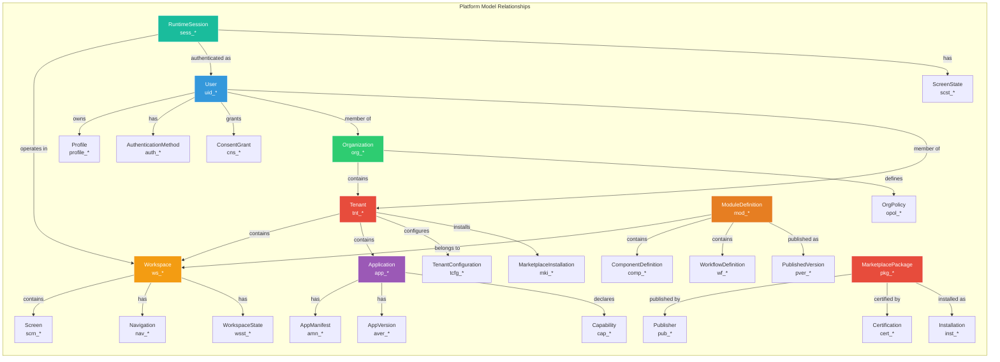

---

## 5. Canonical Model Governance

### 5.1 Model Ownership Structure

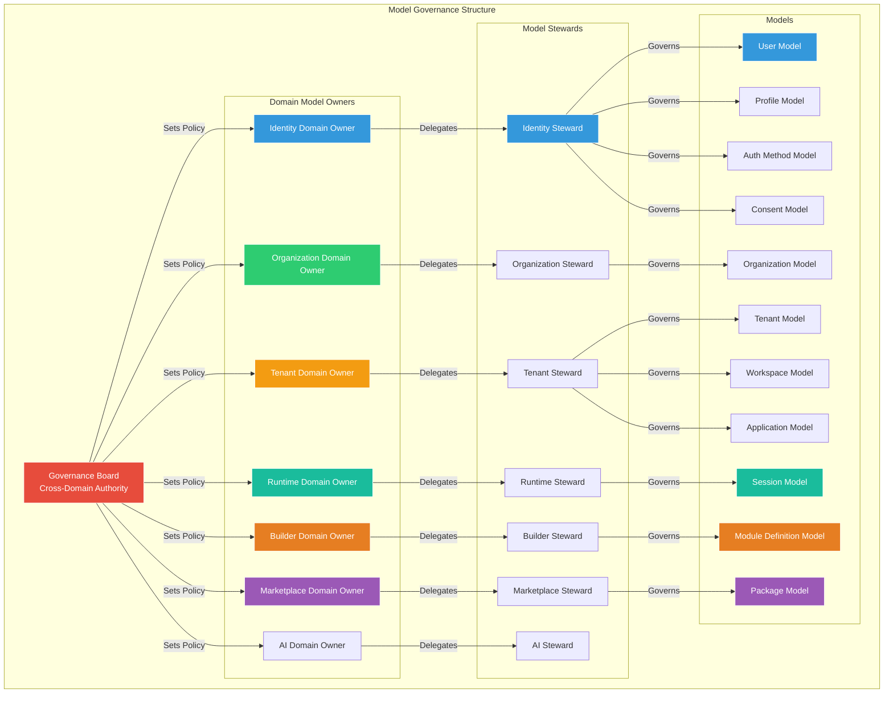

### 5.2 Model Ownership

- **Domain Owner**: The entity responsible for a data domain's models. The domain owner approves schema changes, resolves model conflicts, and ensures model consistency within the domain. Domain owners are members of the Governance Board.

- **Model Steward**: The entity responsible for the operational governance of specific models within a domain. The steward manages schema evolution proposals, compatibility assessments, consumer notifications, and migration planning.

- **Governance Board**: The cross-domain authority that resolves model conflicts, approves cross-domain schema changes, sets modeling standards, and adjudicates disputes. The board includes all domain owners.

### 5.3 Review Process

- **Proposal**: A schema change is proposed by the model steward. The proposal includes the change description, compatibility assessment, consumer impact analysis, and migration plan.
- **Domain Review**: The domain owner reviews the proposal within the domain. Domain-level changes may be approved by the domain owner. Cross-domain changes require governance board review.
- **Consumer Notification**: Consumers of the affected model are notified of the proposed change. Consumers have a defined review period (default: 5 business days) to raise concerns.
- **Approval**: The proposal is approved by the domain owner (domain-level) or governance board (cross-domain). Approval is recorded in the schema registry.
- **Publication**: The approved schema change is published as a new schema version. Consumers receive notification of the new version.

### 5.4 Approval Workflow

| Change Type | Review Required | Approver | Notice Period | Consumer Consent |
|-------------|----------------|----------|---------------|-----------------|
| Patch (backward compatible, no-opt) | None | Model Steward | None | Not required |
| Minor (backward compatible, opt-in) | Domain review | Domain Owner | 5 business days | Not required |
| Major (breaking change) | Full review | Governance Board | 30 business days | Required |
| Deprecation | Domain review | Domain Owner | 90 business days | Required |
| Retirement | Full review | Governance Board | 180 business days | Required |

### 5.5 Change Governance

- **Change Proposal**: All schema changes require a formal change proposal. The proposal documents the change, its compatibility, its consumer impact, and its migration plan.
- **Change Classification**: Every change is classified as patch, minor, or major based on compatibility rules. Classification determines the approval workflow.
- **Change Audit**: All schema changes are recorded as audit events — who proposed, who approved, what changed, when, and why.
- **Change Rollback**: Schema changes that cause production issues can be rolled back. Rollback is a governed process with consumer notification.

### 5.6 Deprecation Rules

- **Deprecation Announcement**: Models and schemas are deprecated through a formal announcement. The announcement includes the deprecation date, the recommended replacement, and the retirement timeline.
- **Deprecation Period**: Deprecated models remain available for a minimum deprecation period (default: 90 days for domain models, 180 days for cross-domain models).
- **Deprecation Usage Tracking**: Usage of deprecated models is tracked. Consumers using deprecated models are notified of migration deadlines.
- **Retirement**: After the deprecation period, the model or schema is retired. Retired models are removed from the schema registry. Consumers that have not migrated are identified and notified.

---

## 6. Entity Design Standards

### 6.1 Entity Identity Standards

- **Unique Identifier**: Every entity has a globally unique identifier. Identifiers use the prefix convention established in KB-073 (e.g., `uid_` for users, `tnt_` for tenants, `ws_` for workspaces).
- **Immutable**: Once assigned, an entity's identifier never changes. Identifier immutability ensures stable references across all services.
- **Opaque**: Identifiers carry no business meaning. No information about the entity is encoded in the identifier.
- **Stable**: Identifiers are not recycled. A deleted entity's identifier is never reassigned.

### 6.2 Naming Standards

- **Entity Name**: PascalCase, singular noun. Examples: `User`, `Organization`, `Tenant`, `Workspace`, `ApplicationManifest`, `RuntimeSession`.
- **Attribute Name**: camelCase, descriptive. Examples: `displayName`, `createdAt`, `isActive`, `emailVerified`.
- **Relationship Name**: camelCase, describes the relationship. Examples: `ownedBy`, `containsWorkspaces`, `authenticatedAs`, `publishedBy`.
- **Enumeration Values**: UPPER_SNAKE_CASE. Examples: `ACTIVE`, `SUSPENDED`, `DELETED`, `PENDING_REVIEW`.
- **Event Type**: dot-notation hierarchy. Examples: `entity.created`, `entity.updated`, `entity.deleted`.

### 6.3 Relationship Standards

- **Explicit Modeling**: All relationships are explicitly declared in the entity schema. Implicit relationships (naming conventions, assumed keys) are prohibited.
- **Named Relationships**: Each relationship has a descriptive name that indicates its semantics. Examples: `memberOf`, `contains`, `ownedBy`, `references`.
- **Directional**: Relationships have a direction. The source entity references the target entity. Bidirectional relationships are modeled as two directed references.
- **Cardinality Declaration**: Each relationship declares its cardinality — one-to-one, one-to-many, many-to-many. Cardinality is enforced at the data layer.

### 6.4 Cardinality Rules

| Cardinality | Notation | Example | Enforcement |
|-------------|----------|---------|-------------|
| One-to-One | 1:1 | User ↔ Profile | Unique constraint on target reference |
| One-to-Many | 1:N | Tenant → Workspaces | Foreign key on target |
| Many-to-Many | M:N | User ↔ Tenant | Junction entity with metadata |
| Optional One | 0..1 | User → ProfileImage | Nullable reference |
| Mandatory One | 1 | Session → User | Non-nullable reference |
| Optional Many | 0..* | Workspace → Screens | Empty collection allowed |
| Mandatory Many | 1..* | Tenant → Workspaces | Minimum one required |

### 6.5 Optional vs Required

- **Required Attributes**: Attributes without which the entity is meaningless or inoperable — identifier, entity type, creation timestamp, owner reference.
- **Optional Attributes**: Attributes that may be absent without compromising entity integrity — display name, description, metadata.
- **Required Relationships**: Relationships without which the entity cannot exist in a valid state — session requires user, workspace requires tenant.
- **Optional Relationships**: Relationships that may be absent — user profile image, workspace custom theme.

### 6.6 Composition Rules

- **Composition**: The child entity cannot exist independently of the parent. If the parent is deleted, the child is also deleted. Example: Screen is composed by Workspace.
- **Aggregation**: The child entity can exist independently of the parent. If the parent is deleted, the child is not deleted. Example: User is aggregated by Tenant (user can exist without tenant membership).
- **Ownership**: The parent entity owns the child entity — the parent defines the child's lifecycle, access policy, and retention. Ownership is a stronger form of composition.

### 6.7 Metadata Standards

Every entity carries:

| Metadata Field | Type | Required | Description |
|---------------|------|----------|-------------|
| `entityId` | String (prefixed UUID) | Yes | Globally unique entity identifier |
| `entityType` | String | Yes | Canonical entity type name |
| `entityVersion` | Integer | Yes | Optimistic concurrency version |
| `schemaVersion` | String (semver) | Yes | Schema version that defined this entity |
| `createdAt` | ISO 8601 timestamp | Yes | Entity creation time |
| `createdBy` | String (identity ID) | Yes | Creator identity |
| `updatedAt` | ISO 8601 timestamp | Yes | Last modification time |
| `updatedBy` | String (identity ID) | Yes | Last modifier identity |
| `status` | Enumeration | Yes | Lifecycle state |
| `dataDomain` | String | Yes | Owning data domain |
| `dataOwner` | String | Yes | Owning entity (identity ID or service ID) |
| `dataClassification` | Enumeration | Yes | Master, Transaction, Reference, Configuration, etc. |

### 6.8 Lifecycle State Standards

Entities follow a standard lifecycle state model:

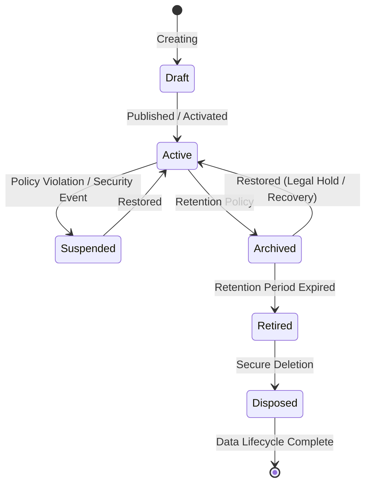

---

## 7. Identifier Strategy

### 7.1 Identifier Architecture

```mermaid
flowchart TB
    subgraph Identifiers["Identifier Architecture"]
        direction TB

        subgraph Global["Global Identifiers"]
            GUID[UUID v4 - 128-bit globally unique]
            USER_PREFIX[uid_ - User Identity]
            ORG_PREFIX[org_ - Organization]
            TNT_PREFIX[tnt_ - Tenant]
            WS_PREFIX[ws_ - Workspace]
            APP_PREFIX[app_ - Application]
        end

        subgraph Scoped["Scoped Identifiers"]
            SESS_PREFIX[sess_ - Runtime Session]
            MOD_PREFIX[mod_ - Module Definition]
            SCRN_PREFIX[scrn_ - Screen]
            COMP_PREFIX[comp_ - Component]
            PKG_PREFIX[pkg_ - Marketplace Package]
        end

        subgraph Temporal["Temporal Identifiers"]
            EVT_PREFIX[evt_ - Event]
            JOB_PREFIX[job_ - Background Job]
            REQ_PREFIX[req_ - API Request]
        end

        subgraph Properties["Identifier Properties"]
            UNIQUE[Globally Unique]
            IMMUTABLE[Never Changes]
            OPAQUE[No Business Meaning]
            STABLE[Never Recycled]
            ORDERABLE[Time-Orderable Where Needed]
        end
    end

    GUID -->|Prefix + UUID| USER_PREFIX
    GUID -->|Prefix + UUID| ORG_PREFIX
    GUID -->|Prefix + UUID| TNT_PREFIX
    GUID -->|Prefix + UUID| WS_PREFIX
    GUID -->|Prefix + UUID| APP_PREFIX

    GUID -->|Prefix + UUID| SESS_PREFIX
    GUID -->|Prefix + UUID| MOD_PREFIX
    GUID -->|Prefix + UUID| SCRN_PREFIX
    GUID -->|Prefix + UUID| COMP_PREFIX
    GUID -->|Prefix + UUID| PKG_PREFIX

    GUID -->|Prefix + UUID| EVT_PREFIX

    UNIQUE --- IMMUTABLE
    IMMUTABLE --- OPAQUE
    OPAQUE --- STABLE
    STABLE --- ORDERABLE

    style GUID fill:#e74c3c,stroke:#fff,color:#fff
    style USER_PREFIX fill:#3498db,stroke:#fff,color:#fff
    style ORG_PREFIX fill:#2ecc71,stroke:#fff,color:#fff
    style TNT_PREFIX fill:#f39c12,stroke:#fff,color:#fff
    style WS_PREFIX fill:#9b59b6,stroke:#fff,color:#fff
    style APP_PREFIX fill:#1abc9c,stroke:#fff,color:#fff
    style SESS_PREFIX fill:#e67e22,stroke:#fff,color:#fff
    style PKG_PREFIX fill:#e74c3c,stroke:#fff,color:#fff
    style UNIQUE fill:#2ecc71,stroke:#fff,color:#fff
    style IMMUTABLE fill:#3498db,stroke:#fff,color:#fff
```

### 7.2 Identifier Prefix Convention

| Prefix | Entity Type | Example | Scope |
|--------|-------------|---------|-------|
| `uid_` | User / Identity | `uid_a1b2c3d4` | Global |
| `org_` | Organization | `org_mama_kitchen` | Global |
| `tnt_` | Tenant | `tnt_mk_prod` | Global (unique within org) |
| `ws_` | Workspace | `ws_x7y8z9` | Global (unique within tenant) |
| `app_` | Application | `app_menu_manager` | Global (unique within tenant) |
| `sess_` | Runtime Session | `sess_m9n0o1` | Global |
| `mod_` | Module Definition | `mod_p2q3r4` | Global |
| `scrn_` | Screen Definition | `scrn_s5t6u7` | Global |
| `comp_` | Component Definition | `comp_v8w9x0` | Global |
| `wf_` | Workflow Definition | `wf_y1z2a3` | Global |
| `form_` | Form Definition | `form_b4c5d6` | Global |
| `pkg_` | Marketplace Package | `pkg_e7f8g9` | Global |
| `ext_` | Extension | `ext_h1i2j3` | Global |
| `cert_` | Certification | `cert_k4l5m6` | Global |
| `inst_` | Installation | `inst_n7o8p9` | Global |
| `evt_` | Event | `evt_q1r2s3` | Global |
| `job_` | Background Job | `job_t4u5v6` | Global |
| `req_` | API Request | `req_w7x8y9` | Global |
| `cap_` | Capability | `cap_z1a2b3` | Global |

### 7.3 Identifier Uniqueness

- **Global Uniqueness**: UUID v4 provides 122 bits of random entropy — collision probability is negligible across the platform's entire lifetime. Prefixes are a readability and debugging aid, not a uniqueness mechanism.
- **No Sequential Identifiers**: Sequential numeric identifiers are not used. Sequential IDs leak information (creation order, entity count) and create enumeration attack vectors.
- **No Business Key as ID**: Business keys (email, tenant name, workspace slug) are not used as entity identifiers. Business keys change; entity identifiers do not.

### 7.4 Identifier Stability

- **Immutable**: Entity identifiers never change. A renamed organization retains its `org_*` identifier. A user changing their email retains their `uid_*` identifier.
- **Stable References**: All cross-entity references use the entity identifier. References survive entity renames, relocations, and restructures.
- **No Recycling**: Deleted entity identifiers are never reassigned. Identifier reuse would break historical references and audit records.

---

## 8. Relationship Modeling

### 8.1 Entity Relationship Hierarchy

```mermaid
flowchart TB
    subgraph Relationships["Entity Relationship Types"]
        direction TB

        subgraph Ownership["Ownership"]
            O1[User] -->|owns| O2[Profile]
            O3[Tenant] -->|owns| O4[Tenant Configuration]
            O5[Workspace] -->|owns| O6[Screen]
        end

        subgraph Composition["Composition"]
            C1[Workspace] -->|composes| C2[Navigation Structure]
            C3[Module] -->|composes| C4[Component Definitions]
            C5[Marketplace Package] -->|composes| C6[Extensions]
        end

        subgraph Aggregation["Aggregation"]
            A1[User] -->|member of| A2[Organization]
            A3[User] -->|member of| A4[Tenant]
            A5[User] -->|member of| A6[Workspace]
        end

        subgraph Reference["Reference"]
            R1[Session] -->|references| R2[User]
            R3[Screen State] -->|references| R4[Screen]
            R5[Audit Event] -->|references| R6[Identity]
        end

        subgraph Hierarchy["Hierarchy"]
            H1[Organization] -->|contains| H2[Tenant]
            H2 -->|contains| H3[Workspace]
        end
    end

    style O1 fill:#e74c3c,stroke:#fff,color:#fff
    style O3 fill:#f39c12,stroke:#fff,color:#fff
    style C1 fill:#2ecc71,stroke:#fff,color:#fff
    style C3 fill:#3498db,stroke:#fff,color:#fff
    style A1 fill:#9b59b6,stroke:#fff,color:#fff
    style A3 fill:#1abc9c,stroke:#fff,color:#fff
    style R1 fill:#e67e22,stroke:#fff,color:#fff
    style R3 fill:#e74c3c,stroke:#fff,color:#fff
    style H1 fill:#3498db,stroke:#fff,color:#fff
    style H2 fill:#2ecc71,stroke:#fff,color:#fff
```

### 8.2 Relationship Types

**Ownership**: The owning entity has full authority over the owned entity — lifecycle, access policy, retention, deletion. The owned entity cannot exist outside the owner's context. Ownership is the strongest relationship binding.

- Example: User owns Profile. Deleting the user deletes their profile.
- Enforcement: Cascade delete from owner to owned. Access policy is inherited from owner.
- Constraints: An entity can have exactly one owner. Multiple owners are not permitted.

**Composition**: The composed entity is a part of the composing entity. Composition is a stronger form of ownership where the child has no independent identity outside the parent.

- Example: Module composes Component Definitions. Deleting the module deletes all its component definitions.
- Enforcement: Cascade delete. Child entity identifier may be scoped to the parent.
- Constraints: A composed entity belongs to exactly one composer.

**Aggregation**: The aggregated entity can exist independently of the aggregator. Membership is a relationship, not ownership.

- Example: User is a member of Tenant. Deleting the tenant does not delete the user. Removing the user from the tenant does not delete the user.
- Enforcement: No cascade delete. Membership is a separate relationship entity.
- Constraints: An entity can be aggregated by multiple aggregators.

**Reference**: The referencing entity holds the identifier of the referenced entity. References are weak relationships — the referenced entity's lifecycle is independent.

- Example: Session references User. Session can be deleted without affecting User.
- Enforcement: Referential integrity is validated but not cascade-enforced.
- Constraints: References can be optional or mandatory.

**Hierarchy**: Entities are organized in a parent-child hierarchy. Hierarchies define data scope, access inheritance, and organizational structure.

- Example: Organization → Tenant → Workspace.
- Enforcement: Hierarchy levels are enforced by the data layer. Cross-level traversal requires authorization.
- Constraints: Hierarchies are acyclic.

### 8.3 Graph Relationships

- **Cross-Domain References**: Entities in different domains may reference each other. Example: Runtime Session (Runtime Domain) references User (Identity Domain). Cross-domain references use entity identifiers and are resolved through the Data Access Layer.
- **Indirect Relationships**: Entities may be related through intermediate entities. Example: User is related to Application through Session → Workspace → Application. Indirect relationships are computed, not stored.
- **Relationship Metadata**: Relationships may carry metadata — relationship type, creation timestamp, expiration, properties. Relationship metadata is modeled as a separate entity or attribute on the reference.

---

## 9. Schema Evolution

### 9.1 Schema Governance Lifecycle

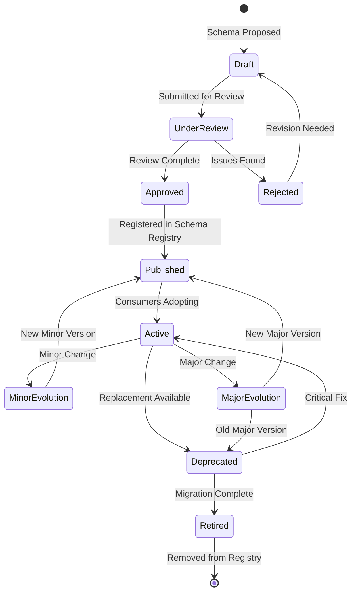

### 9.2 Evolution Stages

**Draft**: Schema is being designed. Not yet registered. No consumers depend on it. Breaking changes are permitted without governance.

**Under Review**: Schema change proposal is being reviewed by domain owner (domain change) or governance board (cross-domain change). Consumer impact is assessed.

**Approved**: Schema change is approved. Ready for publication.

**Published**: Schema is registered in the schema registry. Available for consumer adoption. This is the first version consumers can depend on.

**Active**: Schema is actively used by consumers. New minor and patch versions are published as needed. Major versions trigger deprecation of the previous major version.

**Deprecated**: Schema is deprecated in favor of a newer version. Consumers are notified of the deprecation and migration deadline. New consumers are directed to the replacement schema.

**Retired**: Schema is removed from the schema registry. Consumers that have not migrated are identified. Retired schemas are not served.

### 9.3 Schema Evolution Flow

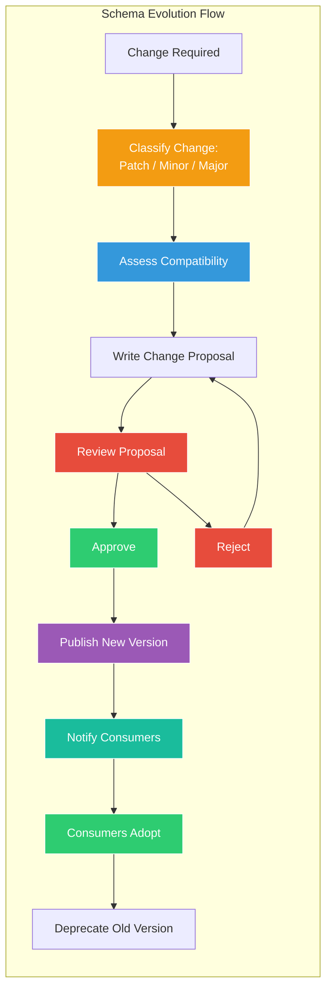

---

## 10. Versioning Strategy

### 10.1 Semantic Versioning

All schemas follow semantic versioning: `MAJOR.MINOR.PATCH`

- **MAJOR**: Breaking change — existing consumers must modify their code to consume the new version. Examples: removing a required field, changing a field type, adding a required field, removing an entity.
- **MINOR**: Backward-compatible addition — existing consumers continue to work unchanged. New features are opt-in. Examples: adding an optional field, adding a new entity, adding a new relationship.
- **PATCH**: Backward-compatible fix — no structural changes. Examples: correcting a field description, relaxing a constraint, fixing a validation rule, updating documentation.

### 10.2 Compatibility Rules

| Change | Classification | Backward Compatible | Forward Compatible |
|--------|---------------|---------------------|--------------------|
| Add optional field | Minor | Yes | Yes |
| Add required field | Major | No | Yes |
| Remove field | Major | No | No |
| Rename field | Major | No | No |
| Change field type (widening) | Minor | Yes | No |
| Change field type (narrowing) | Major | No | No |
| Add new entity | Minor | Yes | Yes |
| Remove entity | Major | No | No |
| Add relationship | Minor | Yes | No |
| Remove relationship | Major | No | No |
| Relax constraint | Patch | Yes | Yes |
| Tighten constraint | Minor | Yes | No |
| Change field default | Patch | Yes | Depends |

### 10.3 Migration Windows

- **Patch Migration**: No required action. Consumers pick up the change transparently. Notification optional.
- **Minor Migration**: Consumers may opt in to new features. No forced migration. Deprecation of old minor versions is announced 90 days in advance.
- **Major Migration**: Consumers must migrate before the old major version is deprecated. Migration window is a minimum of 180 days from the new major version publication. Overlapping support period: 180 days minimum.

### 10.4 Version Compatibility Model

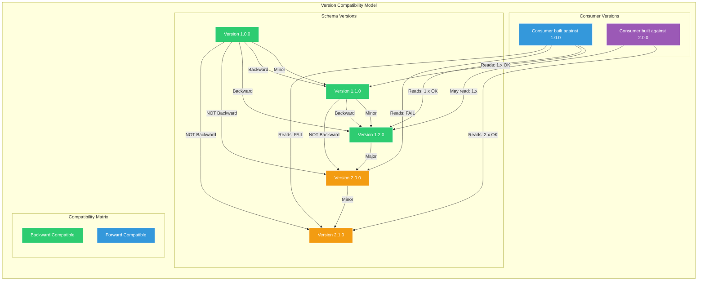

### 10.5 Deprecation Policies

- **Version Deprecation**: A schema version is deprecated when a newer major or minor version is available. Deprecation is announced with migration guidance.
- **Major Version Deprecation**: Old major versions are deprecated 180 days after the new major version is published. During the overlap period, both versions are active.
- **Minor Version Deprecation**: Old minor versions within the same major version are deprecated 90 days after the new minor version is published. Patch versions are not independently deprecated.
- **End of Life**: Deprecated versions enter end of life after the deprecation period. EOL versions are removed from the schema registry. Consumers using EOL versions are identified.

---

## 11. Extension Architecture

### 11.1 Extension Architecture

```mermaid
flowchart TB
    subgraph Canonical["Canonical Entity"]
        CE[Canonical Entity<br/>User, Tenant, Workspace, etc.]
        CA1[Core Attribute 1]
        CA2[Core Attribute 2]
        CA3[Core Attribute 3]
    end

    subgraph Extensions["Extension Mechanisms"]
        direction TB

        subgraph CustomAttributes["Custom Attributes"]
            CA[Custom Attribute Bag<br/>JSON / Key-Value Map]
            CA_RULE1[Governed by schema<br/>Validated type]
            CA_RULE2[No custom indexing<br/>No query support]
        end

        subgraph ExtensionEntities["Extension Entities"]
            EE1[Extension Entity 1<br/>1:1 with Canonical]
            EE2[Extension Entity 2<br/>1:N with Canonical]
            EE_RULE1[Separate schema<br/>Separate governance]
        end

        subgraph Metadata["Metadata Bag"]
            MB[Metadata Map<br/>String → String]
            MB_RULE1[Unstructured<br/>No schema validation]
            MB_RULE2[No query support<br/>Display only]
        end

        subgraph MarketplaceExtensions["Marketplace Extensions"]
            ME[Marketplace Extension<br/>Plugin-defined schema]
            ME_RULE1[Extension schema<br/>registered separately]
            ME_RULE2[Scoped to installation]
        end
    end

    CE --> CA1
    CE --> CA2
    CE --> CA3
    CE --> CA
    CE --> EE1
    CE --> EE2
    CE --> MB
    CE --> ME

    style CE fill:#e74c3c,stroke:#fff,color:#fff
    style CA1 fill:#3498db,stroke:#fff,color:#fff
    style CA2 fill:#3498db,stroke:#fff,color:#fff
    style CA3 fill:#3498db,stroke:#fff,color:#fff
    style CA fill:#f39c12,stroke:#fff,color:#fff
    style EE1 fill:#2ecc71,stroke:#fff,color:#fff
    style EE2 fill:#2ecc71,stroke:#fff,color:#fff
    style MB fill:#9b59b6,stroke:#fff,color:#fff
    style ME fill:#e67e22,stroke:#fff,color:#fff
```

### 11.2 Extension Mechanisms

**Custom Attributes**: A governed key-value map on canonical entities. Values are typed (string, number, boolean, date). Structure is governed by a companion schema that defines allowed keys, value types, and constraints. Custom attributes are queryable but not indexable.

- Use case: Tenant-specific fields on standard entities
- Governance: Custom attribute schemas are registered by the tenant owner
- Limitations: No custom indexes, no relationship support, no validation beyond type

**Extension Entities**: Separate entities linked to canonical entities through 1:1 or 1:N relationships. Extension entities have their own schemas, their own governance, and their own lifecycle. The canonical entity is not aware of extension entities.

- Use case: Domain-specific data attached to platform entities
- Governance: Extension schemas are governed by the domain owner
- Benefits: Full schema governance, relationship support, query support, independent lifecycle

**Metadata Bag**: Unstructured key-value metadata on canonical entities. No schema validation. No query support. Used for display-only or tooling-specific data.

- Use case: Internal annotations, operational metadata, tooling markers
- Governance: Minimal — keys should be namespaced to avoid collisions
- Limitations: Not queryable, not validated, not governed

**Marketplace Extensions**: Extension entities defined by marketplace packages. Extension schemas are registered by the package publisher and scoped to the installation tenant.

- Use case: Marketplace packages adding data to platform entities
- Governance: Extension schemas are reviewed during package certification
- Scoping: Extensions are visible only to the installing tenant

### 11.3 Extension Rules

- **Canonical Invariant**: Extensions never modify the canonical schema. The canonical entity definition remains unchanged regardless of what extensions are applied.
- **Extension Transparency**: Services that do not care about extensions are not affected by them. Extension data is not returned in standard queries unless explicitly requested.
- **No Extension Cascade**: Deleting an extension does not affect the canonical entity. Deleting the canonical entity cascades to its extensions.
- **Extension Discovery**: Available extensions are discoverable through the schema registry. Each canonical entity's registered extensions are documented.

---

## 12. Validation Architecture

### 12.1 Validation Pipeline

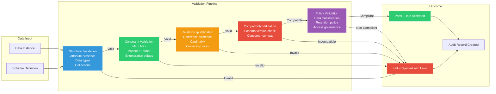

### 12.2 Validation Stages

**Structural Validation**: Checks that the data instance conforms to the schema's structural definition — all required attributes are present, attribute types match the schema, collections have the declared cardinality, identifiers are valid format.

**Constraint Validation**: Checks that attribute values satisfy declared constraints — numeric values are within range, strings match patterns, date values are valid, enumeration values are from the declared set.

**Relationship Validation**: Checks that entity references are valid — referenced entity exists, cardinality constraints are satisfied, ownership rules are respected.

**Compatibility Validation**: Checks that the data is compatible with the consumer's expected schema version — consumer's schema version can read the data, no breaking changes between the producer's and consumer's versions.

**Policy Validation**: Checks that the data complies with governance policies — data classification is appropriate, retention policy is declared, access governance rules are satisfied.

---

## 13. Runtime Responsibilities

- Consume canonical models from the schema registry — never redefine platform entities, relationships, or contracts
- Validate all data writes against the registered schema before sending to the Data Access Layer
- Include schema version metadata in all data operations for compatibility tracking
- Handle schema evolution gracefully — tolerate unknown fields, use default values for new optional fields, detect incompatible versions
- Register runtime-specific models (session state, screen state) as domain models in the schema registry — never as canonical models
- Participate in schema change reviews when runtime-domain models are affected
- Notify the platform when adopting new schema versions for observability
- Never hardcode entity identifiers, field names, or relationship paths — resolve from schema registry

---

## 14. Builder Responsibilities

- Consume canonical models from the schema registry — never redefine platform entities, relationships, or contracts
- Define module-level components, workflows, and forms using the schema-defined models and extension mechanisms
- Register builder-defined models (module definitions, component definitions) as domain models in the schema registry
- Validate builder output against schema before publication through the publishing pipeline
- Handle schema evolution in published modules — published modules reference specific schema versions, migration guidance is provided for schema updates
- Participate in schema change reviews when builder-domain models are affected
- Use custom attributes and extension entities for builder-specific data — never modify canonical schemas

---

## 15. Backend Responsibilities

- Operate the Schema Registry — schema registration, version management, compatibility checking, model discovery
- Enforce schema validation on all data writes — reject data that does not conform to the registered schema
- Enforce compatibility validation — reject data from producers using incompatible schema versions
- Maintain the Model Catalog — discoverable metadata for all registered models, their versions, their relationships, their owners
- Support model discovery — services can query the schema registry for model definitions, schemas, contracts, and extensions
- Manage schema evolution — coordinate version publication, consumer notification, deprecation scheduling
- Monitor schema compliance — detect contract violations, deprecated usage, unregistered extensions
- Publish schema change events — new versions, deprecations, retirements are published as platform events

---

## 16. Marketplace Responsibilities

- Consume canonical models from the schema registry — marketplace packages reference canonical entities without redefining them
- Register marketplace-specific models (package metadata, extension schemas, certification records) as domain models
- Define extension schemas for marketplace packages that extend platform entities — extensions are registered and governed
- Validate marketplace package schemas against platform models during certification — ensure extensions are compatible, references are valid, and no canonical models are redefined
- Handle schema evolution for marketplace extensions — extensions reference specific schema versions, deprecated schemas in extensions trigger notification to publishers
- Never redefine platform entities, relationships, or contracts within marketplace packages

---

## 17. Security

### 17.1 Model Integrity

- **Schema Registry Integrity**: The schema registry is the authoritative source for all model definitions. Schema registry data is immutable — once published, schemas are append-only. Registry data is signed and tamper-evident.
- **Validation Enforcement**: All data writes are validated against registered schemas. Unregistered or tampered schemas are rejected. Schema validation is enforced at the data layer, not at the application layer.
- **No Runtime Schema Modification**: Service code never modifies schemas at runtime. Schema changes go through the governance process. Runtime-generated schema modifications are prohibited.

### 17.2 Contract Integrity

- **Contract Verification**: Data contracts are verified at integration points. The producer's schema version must be compatible with the consumer's expected schema version. Incompatible contracts block data exchange.
- **Contract Binding**: Contracts are bound at integration time, not at deployment time. Contract compatibility is verified continuously, not just at initial connection.

### 17.3 Unauthorized Schema Changes

- **Write Protection**: Only authorized model stewards can publish schema changes. Unauthorized schema write attempts are blocked and audited.
- **Change Detection**: The schema registry monitors for unauthorized schema modifications. Any modification outside the governance process is detected and alerted.
- **Rollback**: Unauthorized schema changes are rolled back through the governance rollback process. Rollback is audited.

### 17.4 Governance Enforcement

- **Governance Gate**: Publication of new schema versions requires governance approval (domain owner for domain changes, governance board for cross-domain changes). The gate is architectural — unapproved changes are not published.
- **Compliance Check**: Schema changes are checked against governance policies — compatibility rules, naming standards, relationship standards, metadata requirements. Non-compliant schemas are rejected.

---

## 18. Performance

### 18.1 Model Resolution

| Operation | Target (p95) | Notes |
|-----------|-------------|-------|
| Schema Lookup (by entity type) | < 5ms | Cached schema registry |
| Schema Lookup (by version) | < 5ms | Cached version |
| Model Discovery (all entities) | < 50ms | Cached catalog |
| Relationship Resolution | < 10ms | Cached relationship graph |

### 18.2 Schema Validation

| Operation | Target (p95) | Notes |
|-----------|-------------|-------|
| Structural Validation | < 1ms | Per-attribute check |
| Constraint Validation | < 2ms | Per-constraint check |
| Relationship Validation | < 5ms | Reference existence check |
| Full Validation Pipeline | < 10ms | All checks combined |

### 18.3 Contract Compatibility

| Operation | Target (p95) | Notes |
|-----------|-------------|-------|
| Compatibility Check (patch) | < 2ms | Version comparison |
| Compatibility Check (minor) | < 5ms | Schema diff |
| Compatibility Check (major) | < 20ms | Full compatibility analysis |
| Consumer Impact Assessment | < 60s | Batch analysis |

### 18.4 Version Lookup

| Operation | Target (p95) | Notes |
|-----------|-------------|-------|
| Latest Version Lookup | < 3ms | Cached |
| Specific Version Lookup | < 5ms | Cached |
| Version History (all) | < 20ms | Cached list |
| Version Diff | < 10ms | Schema comparison |

---

## 19. Observability

Reference KB-058 Runtime Observability & Diagnostics Architecture.

### 19.1 Schema Changes

- **Change Volume**: Number of schema changes per day by type (patch, minor, major) and domain
- **Change Approval Time**: Time from proposal to approval by change type
- **Change Adoption Rate**: Rate at which consumers adopt new schema versions by domain
- **Unapproved Changes**: Number of schema change proposals pending review

### 19.2 Version Adoption

- **Version Distribution**: Percentage of consumers on each schema version by entity type
- **Adoption Velocity**: Time from version publication to consumer adoption by entity type
- **Oldest Version in Use**: The oldest schema version still actively used by consumers
- **Deprecated Version Usage**: Number of consumers still using deprecated schema versions

### 19.3 Validation Failures

- **Validation Failure Rate**: Percentage of data writes that fail validation by failure type (structural, constraint, relationship, compatibility, policy)
- **Validation Failure Trend**: Validation failure rate over time by data domain
- **Top Validation Failures**: Most frequent validation failure types and the entities they affect

### 19.4 Deprecated Usage

- **Deprecated Model Usage**: Number of data operations using deprecated models by entity type
- **Deprecated Consumer Count**: Number of consumers still using deprecated schemas
- **Migration Deadline Compliance**: Percentage of consumers migrated before deprecation deadlines

### 19.5 Contract Violations

- **Contract Violation Count**: Number of contract violations detected by violation type (schema incompatibility, missing contract, expired contract)
- **Contract Violation Trend**: Contract violation rate over time
- **Unresolved Violations**: Contract violations that have not been remediated

---

## 20. Failure Scenarios

### 20.1 Schema Drift

| Scenario | Impact | Mitigation |
|----------|--------|------------|
| Service uses outdated schema version | Service may write data incompatible with consumers | Schema registry enforces compatibility at write time. Incompatible writes rejected. |
| Service adds unregistered field to data | Data may not be recognized by consumers receiving older schema | Validation pipeline rejects unknown fields not in registered schema. Extension mechanisms provide governed paths for additions. |
| Two services independently evolve the same concept | Models diverge, integration breaks | Canonical model governance prevents independent evolution. All changes go through the governance process. |

### 20.2 Duplicate Canonical Models

| Scenario | Impact | Mitigation |
|----------|--------|------------|
| Two domains define the same entity independently | Duplicate models with different schemas, no single source of truth | Schema registry prohibits duplicate entity type registrations. Governance board resolves domain boundary disputes. |
| Implementation code defines an entity that matches a canonical model | Code-level model diverges from canonical over time | Schema-first development ensures code implements schemas, not the reverse. CI/CD pipeline validates code against registered schemas. |

### 20.3 Circular Relationships

| Scenario | Impact | Mitigation |
|----------|--------|------------|
| Entity A references Entity B, Entity B references Entity A | Recursive queries, infinite loops in resolution | Relationship validation detects circular references. Governance board reviews and breaks the cycle. |
| User references Organization, Organization references Tenant, Tenant references User | Cycle prevents clean deletion hierarchy | Lifecycle enforcement detects cycles in cascade paths. Manual intervention required for cycle resolution. |

### 20.4 Identifier Collision

| Scenario | Impact | Mitigation |
|----------|--------|------------|
| UUID collision (extremely unlikely) | Two entities share the same identifier | UUID v4 collision probability is negligible. Detection and remediation process exists for the theoretical case. |
| Prefix misassignment | Entity identifier suggests wrong entity type | Prefix is a readability aid, not a uniqueness mechanism. Schema registry validates entity type against identifier prefix. |

### 20.5 Breaking Contract

| Scenario | Impact | Mitigation |
|----------|--------|------------|
| Producer deploys breaking schema change without governance | Consumers receive data they cannot process | Schema registry blocks publication of unapproved major changes. Compatibility validation at write time rejects incompatible data. |
| Consumer ignores schema evolution | Consumer fails to process newer data | Consumer contract subscription requires compatibility. Contract violation blocks data exchange. Consumer must migrate. |

### 20.6 Invalid Extensions

| Scenario | Impact | Mitigation |
|----------|--------|------------|
| Extension defines field that conflicts with canonical attribute | Ambiguity, potential data corruption | Extension schema validation prohibits field name conflicts with canonical entity. Conflicts detected at registration time. |
| Extension references entity that does not exist | Broken reference, runtime errors | Extension registration validates all entity references. Invalid references block registration. |

### 20.7 Version Conflict

| Scenario | Impact | Mitigation |
|----------|--------|------------|
| Producer writes with version N, consumer expects version N+1 | Consumer cannot read data, data exchange fails | Compatibility validation detects version mismatch. Notification to both parties. Consumer migration accelerated. |
| Two producers write different versions of the same entity type | Inconsistent data across services | Schema registry enforces single producer version per data product. Multiple versions require separate data products. |

---

## 21. Anti-patterns

### 21.1 Duplicate Entity Definitions

**Anti-pattern**: Defining the same entity in multiple services, repositories, or domains with independently maintained schemas.

**Why**: Creates divergence — each definition evolves differently, acquires different fields, different constraints, different semantics. Integration between services becomes brittle and error-prone.

**Solution**: Every entity is defined exactly once as a canonical model in the Knowledge Base. All services consume the canonical definition. Domain-specific additions use extension mechanisms.

### 21.2 Service-Owned Schemas

**Anti-pattern**: Each service owns its data schemas independently, defining entities without platform governance.

**Why**: Service-owned schemas create data silos. Cross-service integration requires point-to-point mapping. Schema evolution is uncoordinated. No single source of truth.

**Solution**: Schemas are owned by data domains, not by services. Services are data custodians, not schema owners. Schema governance is a platform responsibility.

### 21.3 Runtime-Generated Canonical Models

**Anti-pattern**: Allowing Runtime code to generate or modify canonical model definitions at runtime based on tenant application configuration.

**Why**: Runtime-generated models bypass schema governance. Models are not versioned, not reviewed, not documented. Schema drift is inevitable.

**Solution**: Canonical models are defined at architecture time, not at runtime. Extension mechanisms provide governed flexibility for tenant-specific data.

### 21.4 Breaking Changes Without Versioning

**Anti-pattern**: Modifying a schema in place — removing fields, changing types, renaming attributes — without creating a new version or following the deprecation process.

**Why**: Existing consumers break without warning. No migration path. No rollback capability. Data integrity is compromised.

**Solution**: All schema changes produce a new version. Breaking changes follow the major version process with consumer notification and migration window.

### 21.5 Inconsistent Naming

**Anti-pattern**: Using different naming conventions across domains — PascalCase in one domain, snake_case in another, different pluralization rules, different abbreviation patterns.

**Why**: Inconsistent naming creates confusion, integration errors, and cognitive overhead. Developers must constantly translate between naming conventions.

**Solution**: Naming standards are enforced by the schema registry. All entity names, attribute names, and relationship names follow the defined conventions.

### 21.6 Hidden Relationships

**Anti-pattern**: Relationships that are implied by naming conventions (e.g., `tenantId` field) but not explicitly declared in the model.

**Why**: Implicit relationships are not documented, not governed, and not discoverable. Changes to implied relationships are not tracked. New developers cannot understand the data model without tribal knowledge.

**Solution**: All relationships are explicitly declared, named, and documented. Relationship metadata is part of the model and discoverable through the schema registry.

### 21.7 Anonymous Entities

**Anti-pattern**: Data entities that exist without an explicit, stable identifier — identified only by a composite of business keys or by their position in a collection.

**Why**: Anonymous entities cannot be reliably referenced, updated, or deleted. References break when business keys change. Audit trails cannot track anonymous entities.

**Solution**: Every entity has a globally unique, immutable, opaque identifier. Business keys are attributes, not identifiers.

### 21.8 Vendor-Specific Modeling

**Anti-pattern**: Modeling entities using database-specific constructs (foreign keys, sequences, database-specific data types) that leak storage implementation into the canonical model.

**Why**: Creates coupling between the data model and a specific storage technology. Storage changes require model changes. Platform independence is compromised.

**Solution**: Canonical models are storage-independent. Database-specific constructs are implementation details of the Storage Architecture (KB-075).

---

## 22. Future Evolution

### 22.1 Self-Describing Schemas

Future schemas may be self-describing — the schema document itself contains enough metadata for any consumer to understand, validate, and process the data without external references. Self-describing schemas include semantic descriptions, relationship documentation, evolution history, and consumer guidance.

### 22.2 AI-Assisted Modeling

Future model creation may be assisted by AI — suggesting entity definitions based on use case descriptions, detecting potential model conflicts, recommending relationship structures, and validating model completeness before governance review.

### 22.3 Semantic Data Models

Future models may include semantic metadata — machine-readable descriptions of entity meaning, relationship semantics, attribute purpose, and data provenance. Semantic models enable automated data discovery, intelligent data integration, and AI-powered data governance.

### 22.4 Distributed Schema Registries

Future deployments may use distributed schema registries — multiple registry instances that synchronize through event-driven replication. Each deployment has a local registry for low-latency access. Cross-deployment schema changes follow the same governance process.

### 22.5 Autonomous Compatibility Validation

Future compatibility validation may be autonomous — the schema registry continuously monitors all producer-consumer relationships, detects potential compatibility breaks before they occur, and proactively notifies affected parties with migration guidance.

---

## 23. Cross-References

| Reference | Document | Relationship |
|-----------|----------|-------------|
| **KB-042** | Application Manifest Specification | Application manifest schema governed by this architecture |
| **KB-043** | Workspace & Tenant Model | Workspace and tenant entity models |
| **KB-044** | Navigation Architecture | Navigation entity model and relationships |
| **KB-045** | Screen Model | Screen entity model and relationships |
| **KB-046** | Component Tree Model | Component entity model and relationships |
| **KB-047** | Action & Event Model | Event entity models governed by this architecture |
| **KB-048** | Application State Model | State entity models governed by this architecture |
| **KB-049** | Theme & Design Token Model | Theme entity model and relationships |
| **KB-050** | Capability Composition Model | Capability entity model and relationships |
| **KB-051** | Runtime Architecture Overview | Runtime model consumption patterns |
| **KB-055** | Runtime State Engine Architecture | State entity models and lifecycle |
| **KB-063** | Identity Platform Architecture | Identity entity models governed by this architecture |
| **KB-065** | Authorization & RBAC Architecture | Authorization entity models and relationship to identity |
| **KB-066** | Universal Consumer Identity Architecture | Consumer identity entity model |
| **KB-073** | Data Platform Architecture | Foundation — data ownership, classification, flow, boundaries |
| **KB-075** | Storage Architecture (planned) | Schema-to-storage mapping, physical model implications |
| **KB-076** | Data Access Layer Architecture (planned) | Schema validation at the data access layer |
| **KB-077** | Event & Messaging Architecture (planned) | Event schema governance and evolution |

---

## 24. Mermaid Diagram Index

| Diagram | Section | Description |
|---------|---------|-------------|
| Canonical Modeling Architecture | 4.1 | Complete modeling architecture from canonical layer through domain, contract, and extension layers to schema registry and consumers |
| Platform Model Relationships | 4.3 | Entity relationship map across all major platform entities with identifiers and relationship types |
| Model Ownership Structure | 5.1 | Ownership hierarchy from Governance Board through Domain Owners and Stewards to individual models |
| Entity Lifecycle State | 6.8 | Standard entity lifecycle state machine from draft through active, archived, retired, and disposed |
| Identifier Architecture | 7.1 | Identifier strategy with prefix convention, global uniqueness, and identifier properties |
| Entity Relationship Hierarchy | 8.1 | Relationship types — ownership, composition, aggregation, reference, hierarchy — with examples |
| Schema Governance Lifecycle | 9.1 | Full schema lifecycle from draft through review, approval, publication, active, deprecated, and retired |
| Version Compatibility Model | 10.4 | Compatibility matrix across schema versions showing backward/forward compatibility and consumer impact |
| Extension Architecture | 11.1 | Extension mechanisms — custom attributes, extension entities, metadata bags, marketplace extensions |
| Validation Pipeline | 12.1 | Five-stage validation pipeline from structural through constraint, relationship, compatibility, and policy validation |

---

## 25. Architectural Note

KB-074 establishes the platform-wide modeling and schema governance rules that guarantee every service speaks the same language. It is the architectural expression of a non-negotiable platform rule:

> **Every canonical data model is defined exactly once in the Knowledge Base.**

No implementation repository — Backend, Mobile, Builder Studio, Runtime Engine, Marketplace, SDK, CLI, AI Services, or Infrastructure — may redefine platform entities, relationships, or contracts. All repositories must consume and conform to the canonical models defined here. This ensures long-term architectural consistency across the entire DUKADESK ecosystem.

The architecture establishes that:
- **Canonical models are platform assets**, not service assets — they are owned by data domains, governed by the governance board, and registered in the schema registry
- **Schema evolution is governed** — every change is classified, reviewed, approved, versioned, and communicated before it reaches consumers
- **Extensions are governed flexibility** — custom attributes, extension entities, and marketplace extensions provide domain-specific adaptation without modifying canonical models
- **Validation is architectural** — data is validated at every write against registered schemas, ensuring contract compliance is enforced at the platform level, not left to application code

With KB-074 complete, the Data Platform Architecture suite defines how data is owned and classified (KB-073), how it is modeled and governed (KB-074), and plans for storage (KB-075), access (KB-076), and events (KB-077).
