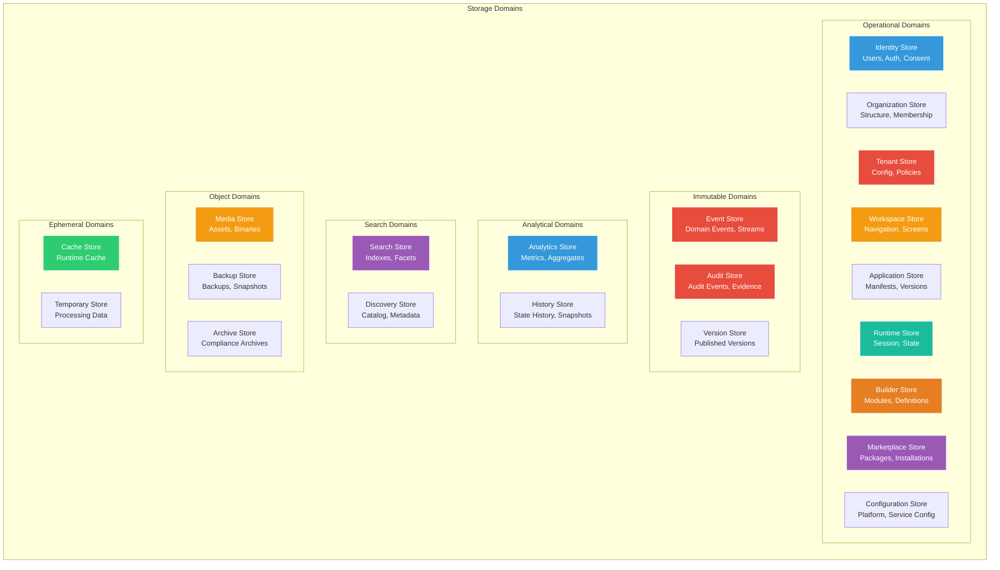
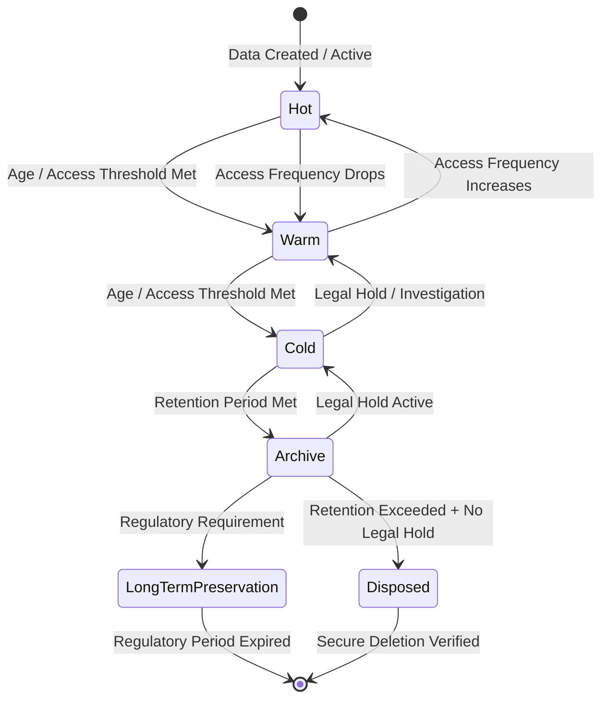
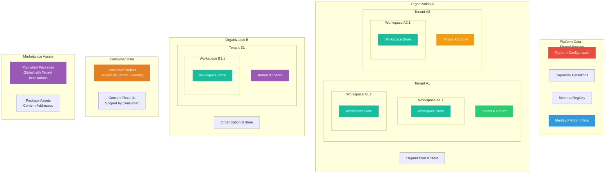
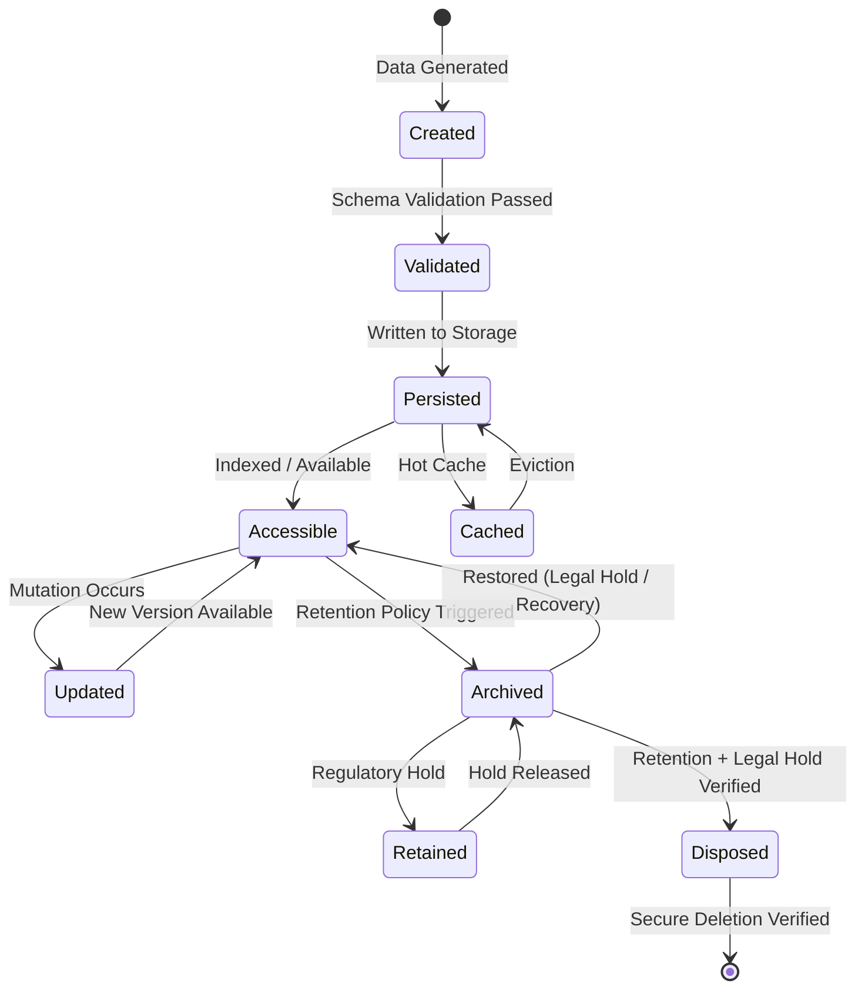
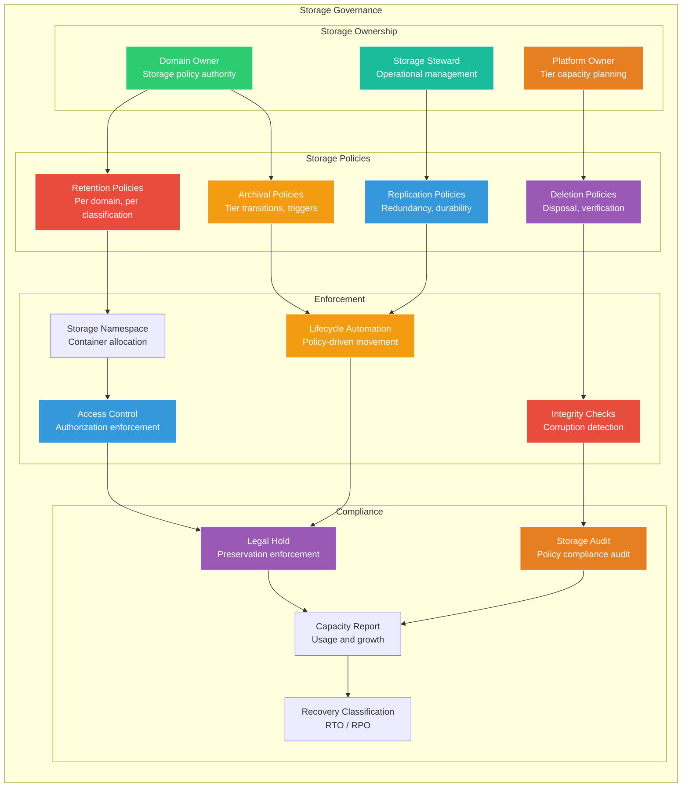
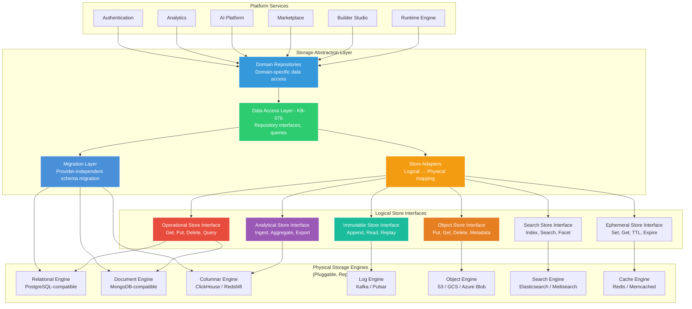

# Storage Architecture

**KB-075 — Storage Architecture Specification**

| Metadata | |
|----------|---|
| **KB ID** | KB-075 |
| **Title** | Storage Architecture |
| **Version** | 0.1.0 |
| **Status** | Draft |
| **Owner** | Architecture Team |
| **Suite** | Data Platform Architecture |
| **Dependencies** | KB-073 Data Platform Architecture, KB-074 Data Modeling & Schema Governance |
| **Related Documents** | KB-043 Workspace & Tenant Model, KB-051 Runtime Architecture Overview, KB-057 Runtime Security Architecture, KB-058 Runtime Observability & Diagnostics Architecture, KB-060 Runtime Lifecycle Management, KB-062 Runtime Deployment & Environment, KB-064 Authentication Architecture, KB-067 Consent & Privacy Architecture, KB-069 Organization, Tenant & Workspace Security Architecture, KB-070 API Security & Token Architecture, KB-072 Audit, Compliance & Identity Governance Architecture, KB-076 Data Access Layer Architecture (planned), KB-079 Caching Architecture (planned), KB-080 File & Object Storage Architecture (planned), KB-081 Backup & Disaster Recovery (planned), KB-082 Data Lifecycle & Retention (planned) |
| **Review Status** | Pending |
| **Last Updated** | 2026-07-11 |

---

### Revision History

| Version | Date | Author | Change |
|---------|------|--------|--------|
| 0.1.0 | 2026-07-11 | AI Architecture Agent | Initial draft |

---

## 1. Executive Summary

### 1.1 Purpose

This document defines the enterprise Storage Architecture for the entire DUKADESK platform. It establishes the logical storage architecture for every category of information — identity data, organization data, tenant data, workspace data, runtime state, builder metadata, marketplace assets, AI data, analytics, events, search, audit, configuration, cache, and backup.

Storage decisions are driven by architectural responsibility, not implementation convenience. Each data category is stored in the logical storage type that matches its access patterns, ownership model, retention requirements, scalability needs, and lifecycle characteristics. The architecture is provider-independent — storage engines are implementation choices that can evolve without affecting domain models, APIs, runtime behavior, or application contracts.

This document defines architecture only. It is database-independent, cloud-provider-independent, and implementation-independent.

### 1.2 Scope

**In scope:**

- Identity Storage: User profiles, authentication methods, consent records, session data, federation links (KB-063–KB-072)
- Organization Storage: Organization structure, membership, policies, billing records
- Tenant Storage: Tenant configuration, membership, policies, tenant-specific business data
- Workspace Storage: Workspace configuration, navigation, screens, components, state
- Application Storage: Application manifests, capability definitions, theme definitions, version records
- Runtime Storage: Session state, screen state, component state, navigation state, form state, offline queue
- Builder Metadata Storage: Module definitions, component definitions, workflow definitions, form definitions, published versions
- Marketplace Storage: Package metadata, extension definitions, certification records, installation records, asset references
- AI Storage: AI model metadata, training data references, inference context, generated content
- Analytics Storage: Usage metrics, performance metrics, business aggregates, trend data, reports
- Event Storage: Domain events, integration events, lifecycle events, event streams
- Search Storage: Search indexes, search metadata, search history, facet data
- Media Metadata Storage: Asset references, content metadata, transformation records
- Audit Storage: Audit events, compliance evidence, governance records, certification records (KB-072)
- Configuration Storage: Platform configuration, runtime configuration, tenant configuration, module configuration
- Cache Storage (logical): Cached manifests, cached schemas, cached reference data, session cache
- Backup Storage (logical): Data backups, replication copies, disaster recovery snapshots

**Out of scope:**

- Implementation details of specific database engines, file systems, or storage appliances
- Specific cloud provider storage services or offerings
- Network-level storage protocols (iSCSI, NVMe-oF, fibre channel)
- Hardware-level storage architecture (RAID, SSD, HDD tiers)
- Application-level caching strategies within specific services
- Tenant application storage (covered by Data Access Layer, KB-076)

---

## 2. Architectural Principles

### 2.1 Storage Follows Domain Ownership

Every storage domain is owned by the data domain it serves. Storage ownership matches data ownership (KB-073). The Identity Domain owns identity storage. The Runtime Domain owns runtime storage. Storage domains are not shared across data domains without explicit governance.

### 2.2 Polyglot Storage by Responsibility

Different data categories require different storage characteristics. Operational data needs low-latency reads and writes. Analytical data needs efficient aggregation and query. Immutable data needs append-only durability. Event data needs ordered streaming. Search data needs inverted indexing. The storage architecture matches the storage engine type to the data responsibility.

### 2.3 Logical Before Physical

Storage architecture is defined logically before any physical storage technology is selected. Logical storage types (operational store, analytical store, immutable store, object store, archive store) are defined by their access patterns, consistency requirements, and lifecycle characteristics. Physical storage engines implement logical stores — never the reverse.

### 2.4 Data Independence

Storage is independent of the services that produce and consume data. Services can be replaced, upgraded, or moved without data loss or corruption. Storage outlives services. Data independence is achieved through logical storage abstractions — services interact with logical stores, not physical storage engines.

### 2.5 Tenant Isolation

Tenant data is strictly isolated at the storage layer. Cross-tenant data access is structurally prevented from within storage — tenant data is stored in separate storage containers, with access enforcement at the storage boundary, not just at the application layer.

### 2.6 Immutable Audit

Audit data is stored in immutable, append-only storage. Write-once semantics are enforced at the storage layer. No actor — including platform administrators — can modify, delete, or overwrite committed audit events. Immutability is a storage property, not an application property.

### 2.7 Separation of Operational and Analytical Data

Operational data (serving live requests) and analytical data (supporting analysis and reporting) are stored in separate logical stores. Operational stores are optimized for point reads and writes. Analytical stores are optimized for aggregation and range queries. Separation prevents analytical queries from impacting operational performance.

### 2.8 Scalability by Design

Every logical storage type scales independently. Operational stores scale for throughput. Analytical stores scale for data volume. Event stores scale for streaming throughput. Search stores scale for index size. No storage type is a bottleneck for another storage type.

### 2.9 Provider Independence

Storage architecture is independent of any specific storage technology provider. Storage engines are implementation choices that can be replaced without architectural change. No service depends on vendor-specific storage features. Provider independence ensures long-term portability and competitive procurement.

### 2.10 Storage Evolution Without Application Impact

Storage engines can be replaced, upgraded, or reconfigured without affecting application code. The storage abstraction layer (KB-076) provides a stable interface that insulates applications from storage changes. Storage evolution is an operational concern, not an application concern.

---

## 3. Canonical Definitions

### 3.1 Storage Domain

A logical boundary around the storage responsibilities for a specific data domain. Each storage domain owns the storage of its domain's data — defining storage type, access patterns, consistency model, retention policy, and lifecycle. Storage domains match data domains (KB-073).

### 3.2 Storage Engine

A physical or logical data storage technology that implements one or more logical store types. Examples: relational database engine, document store, key-value store, columnar store, time-series store, search index, object store, streaming log. Storage engines are implementation choices, not architectural definitions.

### 3.3 Repository

A logical data access boundary within a storage domain. Repositories provide domain-specific data access operations — find, save, delete, query — abstracted behind the Data Access Layer (KB-076). Services interact with repositories, never directly with storage engines.

### 3.4 Persistence

The act of durably recording data to non-volatile storage. Persistence guarantees that data survives process restarts, service failures, and infrastructure outages. Persistence is confirmed through write acknowledgment after durable storage commit.

### 3.5 Data Store

A logical storage unit that holds data of a specific type with specific access and consistency characteristics. Data stores are the units of storage architecture — they map to storage domains and logical store types.

### 3.6 Operational Store

A data store optimized for serving live requests — low-latency reads and writes, strong consistency within aggregates, indexed access by entity identifier and common query patterns. Operational stores hold the current state of master data, transaction data, runtime state, and configuration.

### 3.7 Analytical Store

A data store optimized for analysis, reporting, and business intelligence — high-throughput ingestion, columnar compression, efficient aggregation, time-range queries. Analytical stores hold usage metrics, performance metrics, business aggregates, and trend data.

### 3.8 Immutable Store

A data store that enforces write-once semantics — data cannot be modified or deleted after commit. Immutable stores hold audit events, transaction logs, event streams, and version records. Immutability is enforced at the storage layer, not at the application layer.

### 3.9 Object Store

A data store for unstructured binary data — files, images, asset payloads, backups, archives. Object stores provide content-addressable storage with metadata annotations. Objects are identified by key or content hash.

### 3.10 Archive Store

A data store for long-term retention of data that is rarely accessed — compliance archives, historical records, expired data under legal hold. Archive stores prioritize durability and cost efficiency over access latency.

### 3.11 Ephemeral Store

A data store for temporary data that does not require persistence across restarts — session cache, temporary computation results, in-transit processing state. Ephemeral stores prioritize performance over durability.

### 3.12 Persistent Store

A data store that guarantees data durability across process restarts, service failures, and infrastructure outages. Persistent stores use replication, write-ahead logging, and durable media to ensure data survives failures.

### 3.13 Storage Policy

A governance rule that defines how data within a storage domain is stored, retained, replicated, archived, and disposed. Storage policies are defined per storage domain per data classification. Policies are enforced by the storage layer.

### 3.14 Storage Tier

A logical classification of storage based on performance, cost, and retention characteristics. Tiers include hot (low-latency, higher cost), warm (moderate latency, moderate cost), cold (high latency, low cost), archive (very high latency, lowest cost), and long-term preservation (regulatory retention).

---

## 4. Logical Storage Architecture

### 4.1 Logical Storage Architecture

```mermaid
flowchart TB
    subgraph Platform["DUKADESK Platform"]
        direction TB

        subgraph Domains["Data Domains"]
            ID[Identity Domain]
            ORG[Organization Domain]
            TN[Tenant Domain]
            WS[Workspace Domain]
            APP[Application Domain]
            RT[Runtime Domain]
            BLD[Builder Domain]
            MKT[Marketplace Domain]
            AI[AI Domain]
            EVT[Event Domain]
            ANAL[Analytics Domain]
            AUD[Audit Domain]
            CFG[Configuration Domain]
            SRCH[Search Domain]
            MED[Media Domain]
        end

        subgraph Logical["Logical Storage Layer"]
            OP[Operational Store<br/>Low-latency, Entity-centric]
            ANALYTICAL[Analytical Store<br/>Columnar, Aggregated]
            IMMUT[Immutable Store<br/>Append-only, Tamper-evident]
            OBJ[Object Store<br/>Unstructured, Content-addressable]
            SEARCH[Search Store<br/>Inverted Index, Faceted]
            EPHEM[Ephemeral Store<br/>Transient, High-performance]
        end

        subgraph Physical["Physical Storage Engines<br/>(Implementation Choice)"]
            PE1[Relational / Document Engine]
            PE2[Columnar / OLAP Engine]
            PE3[Log / Event Stream Engine]
            PE4[Binary Object Engine]
            PE5[Search Index Engine]
            PE6[Cache / In-Memory Engine]
        end
    end

    ID --> OP
    ORG --> OP
    TN --> OP
    WS --> OP
    APP --> OP
    RT --> OP
    BLD --> OP
    MKT --> OP
    AI --> OP

    ANAL --> ANALYTICAL
    EVT --> IMMUT
    AUD --> IMMUT

    MED --> OBJ
    CFG --> OP

    SRCH --> SEARCH
    RT --> EPHEM

    OP --> PE1
    OP --> PE2
    ANALYTICAL --> PE2
    IMMUT --> PE3
    OBJ --> PE4
    SEARCH --> PE5
    EPHEM --> PE6

    style OP fill:#2ecc71,stroke:#fff,color:#fff
    style ANALYTICAL fill:#3498db,stroke:#fff,color:#fff
    style IMMUT fill:#e74c3c,stroke:#fff,color:#fff
    style OBJ fill:#f39c12,stroke:#fff,color:#fff
    style SEARCH fill:#9b59b6,stroke:#fff,color:#fff
    style EPHEM fill:#1abc9c,stroke:#fff,color:#fff
    style ID fill:#3498db,stroke:#fff,color:#fff
    style RT fill:#f39c12,stroke:#fff,color:#fff
    style AUD fill:#e74c3c,stroke:#fff,color:#fff
    style BLD fill:#e67e22,stroke:#fff,color:#fff
```

### 4.2 Architecture Overview

The storage architecture operates in layers:

- **Data Domains**: Each data domain (Identity, Organization, Tenant, Runtime, Builder, Marketplace, Audit, etc.) has defined storage responsibilities. Storage is owned by the domain that owns the data.

- **Logical Storage Layer**: Six logical store types that abstract the physical storage engines. Each logical store type defines access patterns, consistency models, and lifecycle characteristics independent of the underlying engine.

  - **Operational Store** — for live, entity-centric data. Low-latency reads/writes, indexed access, strong consistency within aggregates.
  - **Analytical Store** — for analysis and reporting. Columnar compression, high-throughput ingestion, efficient aggregation.
  - **Immutable Store** — for append-only, tamper-evident data. Write-once semantics, ordered records, cryptographic chaining.
  - **Object Store** — for unstructured binary data. Content-addressable, metadata-annotated, scalable.
  - **Search Store** — for full-text and faceted search. Inverted indexes, relevance ranking, real-time indexing.
  - **Ephemeral Store** — for transient data. In-memory performance, TTL-based expiration.

- **Physical Storage Engines**: The actual storage technologies that implement logical stores. Engines are implementation choices that can be replaced independently of the architecture.

### 4.3 Storage-to-Domain Mapping

| Data Domain | Primary Logical Store | Secondary Store | Rationale |
|------------|---------------------|-----------------|-----------|
| Identity | Operational | Immutable (audit) | Entity-centric reads/writes. Transactional consistency for user data. |
| Organization | Operational | Analytical (reporting) | Entity management. Aggregated org data for dashboards. |
| Tenant | Operational | Immutable (audit) | Configuration and membership. Audit trail for tenant changes. |
| Workspace | Operational | Search (discovery) | Screen/component state. Workspace discovery and navigation search. |
| Application | Operational | Search (discovery) | Manifest and version management. Application discovery. |
| Runtime | Ephemeral + Operational | Search (history) | Session state is ephemeral. Persistent state in operational store. |
| Builder | Operational | Immutable (versions) | Module and component definitions. Published versions are immutable. |
| Marketplace | Operational | Object (assets) + Search (discovery) | Package management. Binary assets in object store. Search for discovery. |
| AI | Operational | Object (models) | Model metadata and references. Model binaries in object store. |
| Event | Immutable | Analytical (replay) | Append-only event stream. Analytical store for event replay and analysis. |
| Analytics | Analytical | Immutable (raw data) | Aggregated metrics. Raw metric data retained immutably. |
| Audit | Immutable | Analytical (reporting) | Append-only audit events. Analytical store for compliance reports. |
| Configuration | Operational | Immutable (history) | Live configuration. Configuration change history immutable. |
| Search | Search | Ephemeral (cache) | Inverted indexes. Search result caching. |
| Media | Object | Ephemeral (transform cache) | Asset binaries and metadata. Transformation result caching. |

---

## 5. Storage Domains

### 5.1 Storage Domain Map

### 5.2 Storage Domain Responsibilities

| Storage Domain | Logical Store Type | Data Characteristics | Access Patterns | Consistency Model |
|----------------|-------------------|---------------------|----------------|-------------------|
| Identity Store | Operational | Entity-centric, high-value, transactional | Point reads/writes by identity ID. Indexed lookups by email, provider ID. | Strong within aggregate. Eventual across replicas. |
| Organization Store | Operational | Entity-centric, low-volume, hierarchical | Point reads/writes by org ID. Hierarchy traversal. | Strong. Organization structure is authoritative. |
| Tenant Store | Operational | Entity-centric, medium-volume, config-heavy | Point reads/writes by tenant ID. Configuration bulk reads at startup. | Strong. Tenant configuration changes are atomic. |
| Workspace Store | Operational | Entity-centric, navigation and structure | Point reads/writes by workspace ID. Navigation tree traversal. | Strong within workspace. |
| Runtime Store | Ephemeral + Operational | Session-scoped, high-churn | Session ID lookups. State reads on every screen transition. State writes on every user action. | Strong within session. Ephemeral state tolerates loss. |
| Builder Store | Operational | Definition-heavy, versioned | Entity reads by module/component ID. Version history lookup. Publish-time bulk writes. | Strong. Module definitions are authoritative. |
| Marketplace Store | Operational + Object | Package metadata, binary assets | Package discovery (search). Installation CRUD. Asset download. | Strong for metadata. Content-addressed for assets. |
| Event Store | Immutable | Append-only, ordered, high-volume | Sequential write. Stream read. Replay from offset. | Ordered within partition. At-least-once delivery. |
| Analytics Store | Analytical | Aggregated, time-series, high-volume | Bulk write (metrics). Time-range query. Aggregation pipeline. | Eventual. Analytics tolerate staleness. |
| Audit Store | Immutable | Append-only, tamper-evident, regulated | Sequential write. Time-range query. Export. | Strong sequential ordering. Cryptographic chain integrity. |
| Search Store | Search | Indexed, inverted, high-read | Index write on data change. Full-text query. Faceted filter. | Near-real-time. Index lag is tolerated. |
| Configuration Store | Operational | Low-volume, read-heavy, cached | Point reads at startup. Rare writes during change. Cache with watch. | Strong. Configuration changes are atomic. |
| Media Store | Object | Unstructured, large binaries | Write once (upload). Read many (serve). Transforms (derive). | Content-addressed. Immutable objects. |
| Cache Store | Ephemeral | Transient, TTL-expiring | Key lookup. Time-to-live expiration. Cache miss loads from operational. | Weak. Cache staleness tolerated. |

---

## 6. Data Placement Strategy

### 6.1 Data Placement Strategy

```mermaid
flowchart TB
    subgraph Placement["Data Placement by Category"]
        direction TB

        subgraph MasterData["Master Data"]
            MD1[Organizations<br/>→ Operational Store]
            MD2[Tenants<br/>→ Operational Store]
            MD3[Users<br/>→ Operational Store]
            MD4[Applications<br/>→ Operational Store]
        end

        subgraph TransactionData["Transaction Data"]
            TD1[Consent Grants<br/>→ Operational Store]
            TD2[Workflow Instances<br/>→ Operational Store]
            TD3[Sessions<br/>→ Operational + Ephemeral]
            TD4[Installation Records<br/>→ Operational Store]
        end

        subgraph RuntimeState["Runtime State"]
            RS1[Session State<br/>→ Ephemeral Store]
            RS2[Screen State<br/>→ Ephemeral Store]
            RS3[Component State<br/>→ Ephemeral Store]
            RS4[Offline Queue<br/>→ Ephemeral + Operational]
        end

        subgraph Configuration["Configuration"]
            C1[Platform Config<br/>→ Operational Store]
            C2[Tenant Config<br/>→ Operational Store]
            C3[Module Config<br/>→ Operational Store]
        end

        subgraph Assets["Assets"]
            A1[Marketplace Packages<br/>→ Object Store]
            A2[Media Files<br/>→ Object Store]
            A3[Backup Archives<br/>→ Object Store]
        end

        subgraph SearchIndexes["Search Indexes"]
            S1[Entity Search Index<br/>→ Search Store]
            S2[Marketplace Search Index<br/>→ Search Store]
            S3[Audit Search Index<br/>→ Search Store]
        end

        subgraph AuditLogs["Audit Logs"]
            L1[Identity Audit<br/>→ Immutable Store]
            L2[Authorization Audit<br/>→ Immutable Store]
            L3[Consent Audit<br/>→ Immutable Store]
            L4[Token Audit<br/>→ Immutable Store]
        end

        subgraph Metrics["Metrics"]
            M1[Usage Metrics<br/>→ Analytical Store]
            M2[Performance Metrics<br/>→ Analytical Store]
            M3[Business Aggregates<br/>→ Analytical Store]
        end

        subgraph Events["Events"]
            E1[Domain Events<br/>→ Immutable Store]
            E2[Integration Events<br/>→ Immutable Store]
            E3[Lifecycle Events<br/>→ Immutable Store]
        end

        subgraph Temporary["Temporary Data"]
            T1[Sort / Join Buffers<br/>→ Ephemeral Store]
            T2[Cache Entries<br/>→ Ephemeral Store]
            T3[Transform Results<br/>→ Ephemeral Store]
        end
    end

    style MD1 fill:#3498db,stroke:#fff,color:#fff
    style MD2 fill:#e74c3c,stroke:#fff,color:#fff
    style MD3 fill:#2ecc71,stroke:#fff,color:#fff
    style RS1 fill:#1abc9c,stroke:#fff,color:#fff
    style RS2 fill:#1abc9c,stroke:#fff,color:#fff
    style C1 fill:#9b59b6,stroke:#fff,color:#fff
    style A1 fill:#f39c12,stroke:#fff,color:#fff
    style S1 fill:#9b59b6,stroke:#fff,color:#fff
    style L1 fill:#e74c3c,stroke:#fff,color:#fff
    style L2 fill:#e74c3c,stroke:#fff,color:#fff
    style M1 fill:#3498db,stroke:#fff,color:#fff
    style E1 fill:#e74c3c,stroke:#fff,color:#fff
    style T1 fill:#2ecc71,stroke:#fff,color:#fff
```

### 6.2 Placement Rationale

| Data Category | Primary Store | Rationale |
|---------------|--------------|-----------|
| Master Data | Operational | Entity-centric, authoritative, transactional consistency required. Low to medium volume. Low-latency reads essential for request serving. |
| Transaction Data | Operational + Immutable | Current state in operational store. Immutable record in event/audit store for compliance and replay. |
| Runtime State | Ephemeral + Operational | Live session state is ephemeral for performance. Persistent state snapshots in operational store for recovery. |
| Configuration | Operational | Read-heavy, cacheable, strongly consistent. Low volume. Rare writes with high impact. |
| Assets | Object | Unstructured, large, write-once-read-many. Content-addressable for integrity. No transactionality needed. |
| Search Indexes | Search | Inverted index structure. Separate from operational store to prevent index writes from impacting operational queries. |
| Audit Logs | Immutable | Append-only. Regulatory compliance requires immutability and tamper evidence. |
| Metrics | Analytical | Time-series, high-volume, aggregated. Columnar compression for storage efficiency. Range queries for time-based analysis. |
| Events | Immutable + Analytical | Real-time event stream in immutable store. Event replay and analysis in analytical store. |
| Temporary Data | Ephemeral | No durability needed. Performance-optimized. TTL-based cleanup prevents accumulation. |

---

## 7. Storage Tier Architecture

### 7.1 Storage Tier Lifecycle

### 7.2 Tier Characteristics

| Tier | Performance Profile | Cost Profile | Retention (Default) | Access Pattern | Data Examples |
|------|-------------------|--------------|---------------------|----------------|---------------|
| Hot | Sub-millisecond reads, millisecond writes | Higher per-GB | Active lifecycle | Point reads/writes, indexed queries | Active tenant config, current sessions, open workflows |
| Warm | Millisecond reads, low-latency writes | Moderate per-GB | Weeks to months | Occasional queries, batch access | Recent audit events, last-month metrics, completed workflows |
| Cold | Second-scale reads, batch writes only | Low per-GB | Months to years | Rare queries, compliance access | Quarterly audit archive, historical metrics, old sessions |
| Archive | Minute-scale reads, no writes | Lowest per-GB | Years to decades | Regulatory / compliance access only | Compliance archives, legal holds, regulatory records |
| Long-Term Preservation | Manual recovery only | Minimum per-GB | Regulatory maximum | External audit / court order only | Identified records with permanent retention requirements |

### 7.3 Tier Movement Policies

| Trigger | From | To | Mechanism | Notification |
|---------|------|----|-----------|--------------|
| Data age exceeds hot threshold (default: 30 days) | Hot | Warm | Background archiver | None (transparent) |
| Data age exceeds warm threshold (default: 1 year) | Warm | Cold | Background archiver | None (transparent) |
| Data age exceeds cold threshold (default: 3 years) | Cold | Archive | Compliance archiver | Audit event recorded |
| Access frequency drops below threshold | Hot | Warm | Access monitor | None (transparent) |
| Access frequency rises above threshold | Warm | Hot | Access monitor | None (transparent) |
| Legal hold applied | Any | Cold (hold) | Legal hold service | Legal hold audit event |
| Legal hold released | Cold (hold) | Original tier | Legal hold service | Hold release audit event |
| Regulatory period expired | Archive | Disposal queue | Retention engine | Compliance audit event |

---

## 8. Multi-Tenant Storage Isolation

### 8.1 Storage Isolation Architecture

### 8.2 Isolation by Data Category

**Platform Data** — Shared across all tenants. Platform configuration, capability definitions, schema registry, identity platform core. Access governed by platform authorization (KB-065). Platform data is read-mostly; writes are restricted to platform administrators.

**Organization Data** — Isolated per organization. Organization A cannot access Organization B's membership records, policies, or billing data. Cross-organization access is blocked at the storage layer and requires explicit authorization.

**Tenant Data** — Isolated per tenant. Tenant A1 cannot access Tenant A2's data even within the same organization. Each tenant has a dedicated storage container (database, schema, bucket) that prevents cross-tenant queries by design. The tenant context is embedded in the storage container identifier.

**Workspace Data** — Isolated per workspace within a tenant. Workspace isolation is enforced at the storage layer through scoped storage containers. Cross-workspace access requires explicit authorization within the same tenant.

**Consumer Data** — Scoped by the consumer identity and the tenant context. Consumer data is stored within the tenant's storage container but is owned by the consumer and governed by consent (KB-067). Cross-consumer access is blocked.

**Marketplace Assets** — Published packages are globally accessible (read). Installation records are tenant-scoped. Package binaries are content-addressed and immutable.

### 8.3 Isolation Mechanisms

| Isolation Level | Storage Mechanism | Enforcement | Cross-Boundary Access |
|----------------|-------------------|-------------|----------------------|
| Platform ↔ Organization | Separate storage containers per org | Storage-layer container isolation | Authorized platform admin only |
| Organization ↔ Tenant | Separate storage containers per tenant within org | Tenant ID in storage container path | Authorized org admin only |
| Tenant ↔ Workspace | Separate storage containers per workspace within tenant | Workspace ID in storage container path | Authorized tenant admin only |
| Workspace → Data | Data entities include workspace ID | Query-level workspace context filter | Authorized cross-workspace only |
| Consumer → Data | Data entities include consumer ID + tenant ID | Query-level consumer identity filter | Consumer consent required |
| Marketplace → Assets | Content-addressed object store | Object access by content hash | Installation authorization required |

---

## 9. Storage Lifecycle

### 9.1 Storage Lifecycle

### 9.2 Lifecycle Stages

**Created**: Data is generated by a service. At this stage, data is in memory or in transit — not yet durably stored. Creation may include validation against the entity schema.

**Validated**: Data passes schema validation (KB-074) and is accepted for storage. Validation failures are rejected before persistence.

**Persisted**: Data is durably written to the appropriate logical store. Persistence guarantees survive process restarts and infrastructure failures. Write acknowledgment is sent only after durable commit.

**Accessible**: Data is indexed and available for query. Accessibility may include search index update, cache warming, and event publication.

**Updated**: Data is mutated. Mutation creates a new version of the entity. Previous versions are preserved for audit and temporal query.

**Archived**: Data is moved from the active storage tier to an archival tier based on retention policy. Archived data is still accessible but with higher latency.

**Retained**: Data is retained beyond normal retention due to legal hold or regulatory requirement. Retained data cannot be disposed until the hold is released.

**Disposed**: Data is securely deleted after retention expiration and legal hold verification. Disposal is verified and recorded as an audit event.

**Cached**: Data is temporarily stored in a higher-performance cache tier for low-latency access. Cache is invalidated on data change events.

---

## 10. Storage Governance

### 10.1 Storage Governance Model

### 10.2 Ownership

- **Domain Owner**: Defines storage policies for their domain — retention periods, archival triggers, replication requirements, deletion policies. The domain owner is the authority on how their domain's data is stored.
- **Storage Steward**: Operationally manages storage within a domain — capacity planning, performance tuning, storage engine selection, lifecycle execution. Stewards report to the domain owner.
- **Platform Owner**: Manages storage infrastructure at the platform level — tier capacity, cross-domain resource allocation, storage provider relationship, cost optimization.

### 10.3 Retention Policies

- **Domain-Specific**: Each data domain defines retention policies for its data. Policy includes hot tier duration, warm tier duration, cold tier duration, archive duration, and disposal trigger.
- **Classification-Based**: Retention policies are based on data classification (KB-073) — master data, transaction data, runtime state, audit data, analytical data.
- **Regulatory Override**: Regulatory requirements may override domain retention policies. Audit data (KB-072) has regulatory minimum retention that supersedes domain policy.
- **Policy Enforcement**: Retention policies are enforced by the storage lifecycle automation. Manual intervention is audited and requires authorized exception.

### 10.4 Archival Policies

- **Age-Based**: Data is archived when it exceeds age thresholds. Thresholds are defined per data classification. Example: audit events older than 90 days move from hot to warm.
- **Access-Based**: Data is archived when access frequency drops below a threshold. Frequently accessed data is promoted to a higher tier.
- **Size-Based**: Data is archived when its storage size exceeds a threshold within a tier. Archival reclaims hot storage capacity.

### 10.5 Deletion Policies

- **Retention-Based**: Data is queued for deletion after its retention period expires. Deletion is not immediate — a verification window confirms no legal hold applies.
- **Legal Hold Verification**: Before any deletion, the storage layer verifies that no legal hold covers the data. Data under legal hold is exempted from deletion.
- **Secure Deletion**: Deletion is secure — data is overwritten or cryptographically erased. Deletion verification is recorded as an audit event.
- **Deletion Confirmation**: After deletion, the storage layer confirms that the data is no longer recoverable. Confirmation is recorded in the audit trail.

### 10.6 Recovery Classification

| Classification | RTO (Recovery Time Objective) | RPO (Recovery Point Objective) | Example |
|---------------|------------------------------|-------------------------------|---------|
| Critical | < 1 minute | < 1 second | Tenant configuration, active sessions |
| High | < 5 minutes | < 1 minute | User profiles, authentication data |
| Medium | < 1 hour | < 5 minutes | Marketplace metadata, workflow state |
| Low | < 24 hours | < 1 hour | Builder metadata, historical analytics |
| Archive | < 7 days | No objective | Compliance archives, audit records |

---

## 11. Storage Abstraction

### 11.1 Storage Abstraction Layer

### 11.2 Abstraction Layers

**Domain Repositories**: Service-facing data access interfaces. Each domain has repository interfaces that provide domain-specific data operations — `UserRepository`, `TenantRepository`, `WorkspaceRepository`. Repositories abstract all storage details behind domain semantics.

**Data Access Layer (KB-076)**: The architectural layer that implements repository interfaces and provides unified data access, event publication, and synchronization. The Data Access Layer translates repository calls into logical store operations.

**Store Adapters**: Adapters that map logical store interfaces to physical storage engines. The operational store interface is implemented by a relational adapter or a document adapter. The immutable store interface is implemented by a log adapter. Adapters make storage engines pluggable and replaceable.

**Logical Store Interfaces**: Stable, engine-independent interfaces for each logical store type. Services and repositories depend on these interfaces, not on physical storage engines. The interfaces define the contract between the storage abstraction and any implementing engine.

**Physical Storage Engines**: The actual storage technologies. Engines are selected based on the logical store type's requirements. Engines can be replaced independently — changing from one relational engine to another requires only a new adapter, no service changes.

### 11.3 Abstraction Rules

- **No Direct Storage Access**: Services never interact with physical storage engines directly. All storage access goes through the Data Access Layer (KB-076) or domain repositories.
- **No Vendor-Specific Code**: Service code never uses vendor-specific storage features, query dialects, or APIs. Vendor-specific features are encapsulated in store adapters.
- **Engine Transparency**: Services are unaware of which physical engine implements their storage. Engine replacement is transparent to services.
- **Contract Stability**: Logical store interfaces are stable. Physical engines evolve behind stable interfaces.

---

## 12. Runtime Responsibilities

- Use domain repositories for all data access — never access storage engines directly
- Store runtime session state in the ephemeral store with TTL-based expiration
- Persist durable runtime state (session history, completed workflows) to the operational store
- Include identity and tenant context in all storage operations for isolation enforcement
- Respect cache TTL — invalidate cached data on data change events
- Handle storage failures gracefully — retry with backoff, serve from cache when operational store is unavailable
- Participate in storage lifecycle — mark completed data for archival eligibility, clean up ephemeral data on session end
- Never hardcode storage locations, connection strings, or engine-specific configuration

---

## 13. Backend Responsibilities

- Operate the Data Access Layer (KB-076) — domain repositories, store adapters, logical store interfaces
- Enforce tenant isolation at the storage layer — allocate storage containers per tenant, validate tenant context on every operation
- Manage storage lifecycle — automated tier movement, archival execution, disposal verification
- Monitor storage health — capacity, latency, error rates, replication lag
- Execute storage policies — retention enforcement, archival triggers, legal hold application, secure disposal
- Maintain storage abstractions — adapters for logical store interfaces, migration tooling for engine evolution
- Support storage observability — capacity metrics, growth trends, tier distribution, cost allocation
- Manage backup and recovery — schedule backups, validate backup integrity, execute recovery procedures (KB-081)

---

## 14. Builder Responsibilities

- Use domain repositories for all data access — never access storage engines directly
- Store module definitions, component definitions, and workflow definitions in the operational store via builder repositories
- Publish immutable versions to the immutable store — published versions are append-only
- Include workspace and tenant context in all storage operations
- Retrieve reference data (capabilities, component registry) from cache or operational store — never from files or hardcoded values
- Clean up draft data on workspace deletion or module retirement

---

## 15. Marketplace Responsibilities

- Use domain repositories for all data access — never access storage engines directly
- Store package metadata in the operational store
- Store package binaries and assets in the object store, content-addressed
- Publish installation records to the operational store, scoped to tenant
- Include publisher identity and tenant context in all storage operations
- Manage asset lifecycle — clean up unpublished assets, retain published assets per retention policy
- Support asset download with cache-friendly patterns (CDN, content-addressed URLs, long-lived cache headers)

---

## 16. Security

### 16.1 Data Isolation

- **Storage Container Isolation**: Each tenant's data is stored in a dedicated storage container (database, schema, bucket). Storage container assignment is deterministic based on tenant identity. Cross-tenant access at the storage layer is structurally prevented.
- **Operational Store Isolation**: Operational store queries include mandatory tenant context filters. Queries without tenant context are rejected.
- **Search Store Isolation**: Search indexes are tenant-scoped. Cross-tenant search queries are blocked at the index level.
- **Object Store Isolation**: Object store containers are tenant-scoped. Cross-tenant object access is blocked.

### 16.2 Confidentiality

- **Encryption at Rest**: All persistent data is encrypted at rest. Encryption keys are managed per isolation boundary — tenant-specific keys for tenant data, platform keys for platform data. Key management is separated from storage management.
- **Encryption in Transit**: All storage access is encrypted in transit. Storage engine connections use TLS. Internal replication traffic is encrypted.
- **Field-Level Protection**: Sensitive fields (credentials, PII, tokens) may be encrypted at the field level within the operational store. Field-level encryption keys are managed separately.

### 16.3 Integrity

- **Write-Ahead Log**: All operational store writes go through a write-ahead log before storage commit. The WAL ensures crash consistency and recoverability.
- **Checksum Verification**: Data integrity is verified through checksums on read. Checksum mismatches trigger corruption detection and recovery.
- **Immutable Audit**: Immutable store enforces write-once semantics. No modification or deletion of committed records.
- **Periodic Integrity Scan**: Storage integrity is periodically scanned — checksum verification, reference integrity, index consistency. Integrity violations are alerted.

### 16.4 Availability

- **Replication**: Data is replicated across availability zones. Replication is synchronous within a region (operational store) and asynchronous across regions.
- **Backup**: Regular backups are scheduled per recovery classification. Backup integrity is verified after each backup. Backups are stored in a separate storage domain.
- **Disaster Recovery**: Disaster recovery procedures are defined per recovery classification. Recovery is tested on a defined schedule.

### 16.5 Storage Encryption Domains (Conceptual)

| Encryption Domain | Scope | Key Management | Key Rotation |
|-------------------|-------|---------------|--------------|
| Platform Data | Platform configuration, schemas, capabilities | Platform key service | Annually |
| Tenant Data | Tenant configuration, business data | Per-tenant key | Annually |
| Consumer Data | Personal data, consent records | Per-consumer derived key | On consent change |
| Audit Data | Audit events, compliance evidence | Audit-specific key | Annually |
| Marketplace Assets | Package binaries, certification evidence | Per-publisher key | Annually |
| Backup Data | All backed-up data | Backup-specific key | Annually |

### 16.6 Secret Separation

- **Storage Credentials**: Storage engine credentials are managed by the platform secrets vault. Services never have direct storage credentials — they authenticate through the Data Access Layer.
- **Key Separation**: Encryption keys are managed separately from storage — keys are stored in a dedicated key management service, not in the storage engine.
- **Credential Rotation**: Storage credentials are rotated on a defined schedule. Credential rotation is transparent to services.

### 16.7 Backup Integrity

- **Automated Verification**: Every backup is automatically verified — checksum validation, record count comparison, integrity scan. Failed verifications are alerted.
- **Periodic Restoration**: Backups are periodically restored to a test environment to verify recoverability. Restoration tests are documented.
- **Backup Encryption**: Backups are encrypted at rest and in transit. Backup encryption keys are managed separately from primary storage keys.

### 16.8 Secure Disposal

- **Secure Deletion**: Data is securely deleted when retention expires and no legal hold applies. Secure deletion overwrites or cryptographically erases data.
- **Verification**: Deletion is verified — the storage layer confirms data is no longer recoverable. Verification is recorded as an audit event.
- **Media Sanitization**: When storage media is decommissioned, it is sanitized per platform security policy. Sanitization is documented.

---

## 17. Privacy

### 17.1 Consumer Data Ownership

Consumer data is owned by the consumer and stored within the tenant's storage container. The storage layer enforces that consumer data is:
- **Accessible to the consumer**: The consumer can read their data at any time
- **Portable**: The consumer can export their data in a portable format
- **Deletable**: The consumer can request deletion of their data (subject to legal retention)
- **Consent-Governed**: Data access by tenant applications requires consumer consent (KB-067)

### 17.2 Tenant Data Ownership

Tenant data is owned by the tenant and stored in dedicated storage containers. Tenant data ownership includes:
- **Data Isolation**: Tenant data is inaccessible from other tenants
- **Data Export**: Tenant administrators can export tenant data
- **Data Deletion**: Tenant administrators can request tenant data deletion (subject to legal retention)
- **Policy Control**: Tenant administrators define storage policies within their tenant boundary

### 17.3 Data Minimization

- **Purpose-Linked Storage**: Data is stored only for its declared purpose. Storage without purpose is prohibited.
- **Retention-Linked Storage**: Data is stored only as long as required by its retention policy. Storage beyond retention is prohibited.
- **Minimum Necessary**: Only the minimum data necessary for the purpose is stored. Data minimization is enforced at write time.

### 17.4 Retention Awareness

- **Purpose-Linked Retention**: Retention is linked to the purpose of data collection. Data is retained only as long as the purpose exists.
- **Consumer-Requested Deletion**: Consumer data is deleted on consumer request within the configured deletion window (default: 30 days).
- **Legal Hold**: Data subject to legal hold is retained regardless of normal retention policies. Legal hold is applied at the data entity level.

### 17.5 Consent Dependencies

- **Consent Before Storage**: Data requiring consent is not stored until consent is granted. Consent-unapproved storage is prohibited.
- **Consent Scope Enforcement**: Data storage respects consent scope — data outside the consented scope is not stored.
- **Consent Revocation Deletion**: On consent revocation, data covered by the revoked consent is deleted (subject to legal hold).

### 17.6 Cross-Tenant Restrictions

- **No Cross-Tenant Storage**: Tenant data is never stored in another tenant's storage containers. Cross-tenant storage is structurally prevented.
- **No Cross-Tenant Backup**: Tenant backups are isolated per tenant. Cross-tenant backup containment ensures no data mixing.

---

## 18. Performance

### 18.1 Read Optimization

- **Cache-First**: Frequently accessed data is served from the ephemeral store (cache) with TTL-based expiration. Cache miss loads from operational store.
- **Projection**: Queries retrieve only the requested attributes, not the entire entity. Projection reduces read payload and latency.
- **Batch Loading**: Related entities are loaded in batch queries, not N+1 individual queries. Batch loading reduces round trips.
- **Read Replicas**: Read queries are served from read replicas where write volume would impact read performance.

### 18.2 Write Optimization

- **Write-Ahead Log**: Writes go through a write-ahead log before storage commit. WAL enables fast acknowledgment with durability.
- **Batch Writes**: High-volume writes (metrics, events, audit) are batched for throughput. Batch size is configurable per data domain.
- **Async Writes**: Non-critical writes (analytics, audit) may be asynchronous. Critical writes (authentication, authorization, configuration) are synchronous.

### 18.3 Horizontal Growth

| Store Type | Scaling Strategy | Growth Indicator | Capacity Planning |
|-----------|-----------------|------------------|-------------------|
| Operational | Partition by tenant + functional domain | Entity count, query throughput | Add partitions at 70% capacity |
| Immutable | Partition by time range + event type | Event volume per day | Add partitions at 80% capacity |
| Analytical | Partition by time range + aggregation level | Data volume per day | Add partitions at 80% capacity |
| Search | Partition by index + tenant | Index size, query volume | Add replicas at 70% query capacity |
| Object | Content-addressed, no partitioning needed | Object count, total size | Add storage capacity at 80% |

### 18.4 Replication Concepts (Conceptual)

| Replication Type | Consistency | Latency Impact | Use Case |
|-----------------|-------------|---------------|----------|
| Synchronous (within region) | Strong | Write latency + round trip | Operational store, configuration store |
| Asynchronous (across regions) | Eventual | No write impact | Cross-region disaster recovery |
| Synchronous (quorum-based) | Configurable | Write latency + quorum | High-availability operational store |

### 18.5 Storage Scalability Targets

| Metric | Target (p95) | Notes |
|--------|-------------|-------|
| Operational Store Read (by ID) | < 5ms | Cache hit |
| Operational Store Read (by ID) | < 20ms | Cache miss, direct read |
| Operational Store Write | < 10ms | Single entity, acknowledged |
| Immutable Store Append | < 5ms | Batched, append-only |
| Search Index Write | < 50ms | Near-real-time |
| Search Query | < 100ms | Full-text, filtered |
| Object Store Read (small) | < 50ms | < 1MB object |
| Object Store Read (large) | < 500ms per MB | > 1MB object |
| Analytical Query (time range) | < 5s | 30-day range, aggregated |
| Audit Export | < 60s | 10,000 events, structured |

---

## 19. Observability

Reference KB-058 Runtime Observability & Diagnostics Architecture.

### 19.1 Capacity Metrics

- **Storage Utilization**: Current usage by storage domain, by storage tier, by tenant. Utilization percentage and absolute values.
- **Storage Capacity**: Total capacity by storage domain. Capacity headroom percentage.
- **Growth Rate**: Daily/weekly/monthly storage growth by domain and tier. Growth trend projection.

### 19.2 Growth Metrics

- **Entity Count**: Number of entities by type and storage domain
- **Data Volume**: Total data volume by domain and tier (GB/TB)
- **Volume by Tenant**: Storage volume per tenant. Top-N tenants by volume.
- **Index Size**: Search index size by index and tenant

### 19.3 Utilization

- **Read Throughput**: Read operations per second by storage domain and tier
- **Write Throughput**: Write operations per second by storage domain and tier
- **Connection Count**: Active storage connections by service
- **Cache Hit Rate**: Cache hit percentage by cache store

### 19.4 Latency

- **Read Latency**: P50, P95, P99 read latency by storage domain and operation type
- **Write Latency**: P50, P95, P99 write latency by storage domain and operation type
- **Query Latency**: Query latency by query type and storage domain

### 19.5 Storage Health

- **Engine Status**: Up/down status by storage engine and instance
- **Replication Lag**: Replication delay by replica and region
- **Error Rate**: Storage error rate by error type (timeout, connection refused, disk full, authentication failure)
- **Integrity Status**: Last integrity check result by storage domain

### 19.6 Retention and Archive Metrics

- **Retention Compliance**: Percentage of data within retention policy by domain
- **Archive Throughput**: Data archived per day by tier transition
- **Archive Size**: Total archive size by storage domain
- **Disposal Rate**: Data disposed per day by storage domain
- **Legal Hold Count**: Number of active legal holds by storage domain

---

## 20. Failure Scenarios

### 20.1 Storage Exhaustion

| Scenario | Impact | Mitigation |
|----------|--------|------------|
| Operational store reaches capacity | Writes fail, service degradation | Capacity monitoring at 70%, auto-scaling at 80%. Writes queued if storage full, critical writes prioritized. |
| Hot tier storage full | Cannot archive new data to hot tier | Auto-archiving triggered. Oldest hot data moved to warm. If all tiers full, writes blocked with alert. |
| Object store capacity reached | Asset uploads fail | Object store auto-scaling. Upload queue if scaling delayed. Large asset upload scheduling. |

### 20.2 Data Corruption

| Scenario | Impact | Mitigation |
|----------|--------|------------|
| Storage hardware corruption | Data loss in affected range | Replicated data restored from replica. Integrity scan detects corruption range. Point-in-time recovery from WAL. |
| Software bug corrupts data during write | Bad data persisted | Schema validation catches structural corruption. Version history enables rollback before corruption. Immutable audit detects unexpected changes. |
| Index corruption | Search returns incorrect or incomplete results | Index rebuilt from source data. Search degradation during rebuild. Alert on index inconsistency detection. |

### 20.3 Cross-Tenant Leakage

| Scenario | Impact | Mitigation |
|----------|--------|------------|
| Storage container misconfiguration exposes tenant A data to tenant B | Data breach, compliance violation | Storage container isolation is structural, not configuration-based. Container assignment is deterministic. Cross-tenant query prevention at storage layer. |
| Query service bug omits tenant filter | Cross-tenant data returned | Query layer validates tenant context before every query. Queries without tenant context are rejected. Periodic isolation audit. |

### 20.4 Archive Failure

| Scenario | Impact | Mitigation |
|----------|--------|------------|
| Archive storage unavailable | Cannot archive data from warm tier, warm tier may fill | Archive retry with backoff. Warm tier capacity absorbs delay. If warm tier fills, archival is reattempted with priority. |
| Archived data corrupted during transfer | Data in archive is unreadable | Checksum verification before and after transfer. Transfer retry on checksum mismatch. Corrupted archive marked for re-archival. |
| Archive retrieval fails | Legal hold or audit request cannot be fulfilled | Archive redundancy across locations. Manual recovery from backup if automated retrieval fails. |

### 20.5 Backup Failure

| Scenario | Impact | Mitigation |
|----------|--------|------------|
| Backup job fails | No backup for the cycle | Backup retry within schedule window. Alert on consecutive failures. Manual backup initiation if automated fails. |
| Backup integrity check fails | Backup cannot be trusted for recovery | Backup marked invalid, new backup initiated. Root cause investigation. Previous verified backup retained. |
| Restore from backup fails | Cannot recover data | Backup verified before restore request. Alternate backup (time-shifted) used if primary fails. Manual recovery escalation. |

### 20.6 Retention Policy Violation

| Scenario | Impact | Mitigation |
|----------|--------|------------|
| Data disposed before retention expiration | Compliance violation, potential data loss | Retention policy enforcement at storage layer. Policy change audit trail. Disposal verification confirms retention compliance. |
| Data retained beyond retention period | Storage cost increase, privacy compliance risk | Retention policy engine evaluates data periodically. Data approaching retention expiration is flagged. Expired data without legal hold is disposed. |
| Legal hold not applied before disposal | Data disposed despite legal requirement | Legal hold checked before every disposal. Disposal blocked if legal hold applies. Periodic reconciliation of holds with disposal queue. |

### 20.7 Orphaned Storage

| Scenario | Impact | Mitigation |
|----------|--------|------------|
| Tenant deleted but storage containers remain | Storage resources wasted, potential compliance risk | Tenant deletion triggers storage container cleanup. Cleanup verified and audited. Legal hold check before cleanup. |
| Service decommissioned but storage not cleaned up | Orphaned data, wasted resources | Service decommission procedure includes storage cleanup. Periodic orphan storage detection. |
| Temporary data not cleaned up | Storage accumulation in ephemeral tier | TTL-based expiration prevents accumulation. Orphan detection sweep identifies non-expiring temporary data. |

### 20.8 Inconsistent Replication

| Scenario | Impact | Mitigation |
|----------|--------|------------|
| Cross-region replication lag exceeds threshold | Read-after-write inconsistency across regions | Replication lag monitoring. Application-layer read-after-write consistency within region. Cross-region reads tolerate staleness. |
| Replication stream breaks | Regions out of sync | Replication stream recovery. Full sync initiated if gap exceeds threshold. In-flight writes queued during recovery. |
| Conflict resolution fails | Data divergence across replicas | Last-writer-wins conflict resolution. Application-defined conflict resolution for specific entities. Divergence detection and manual reconciliation. |

---

## 21. Anti-patterns

### 21.1 Single Storage for All Data

**Anti-pattern**: Using one storage engine for all data categories — operational, analytical, immutable, search, object, ephemeral — regardless of access patterns, consistency requirements, or lifecycle characteristics.

**Why**: No single storage engine optimally serves all data categories. The operational store that serves point reads well may perform poorly for analytical aggregation. The immutable store that excels at append may be unsuitable for entity updates. Single-storage approaches lead to compromise on every dimension.

**Solution**: Use polyglot storage — each logical store type is implemented by the engine that best matches its requirements. Storage diversity is an architectural strength, not a complexity concern.

### 21.2 Shared Tenant Datasets

**Anti-pattern**: Storing data for multiple tenants in the same storage container without tenant isolation at the storage layer, relying entirely on query-level filters.

**Why**: A missing or incorrect tenant filter exposes all tenants' data. Storage-layer isolation is the primary defense against cross-tenant leakage. Query-level isolation is secondary.

**Solution**: Each tenant has dedicated storage containers. Storage-layer isolation is structural — cross-tenant queries are impossible at the storage level.

### 21.3 Business Logic in Persistence

**Anti-pattern**: Embedding business logic in stored procedures, triggers, database functions, or storage-engine-specific scripts.

**Why**: Business logic in persistence creates coupling between data and services. Storage engines become difficult to replace. Logic is versioned differently from application code. Testing and observability are limited.

**Solution**: Business logic lives in application services. Storage handles data persistence, query, and integrity only. The Data Access Layer (KB-076) enforces schema validation and access control — not business rules.

### 21.4 Vendor-Specific Application Code

**Anti-pattern**: Using vendor-specific storage features (query dialects, proprietary data types, engine-specific extensions) directly in application code.

**Why**: Creates hard coupling between the application and a specific storage vendor. Replacing the storage engine requires rewriting application code. Vendor lock-in is an architectural risk.

**Solution**: Storage engine-specific features are encapsulated in store adapters. Application code uses only logical store interfaces. Engine replacement requires adapter changes only.

### 21.5 Unlimited Retention

**Anti-pattern**: Retaining all data indefinitely without retention policies, archival triggers, or disposal schedules.

**Why**: Storage costs grow without bound. Data accumulates beyond its useful life. Privacy compliance becomes unmanageable. Legal and regulatory risk increases over time.

**Solution**: All data has defined retention policies. Retention is enforced at the storage layer. Data without a retention policy is not stored.

### 21.6 Duplicate Persistence

**Anti-pattern**: Persisting the same data in multiple storage engines without a clear hierarchy of authority, trying to achieve the benefits of each engine by duplicating data.

**Why**: Duplicate persistence creates consistency problems — which copy is authoritative? Synchronization between copies is complex and failure-prone. Write amplification increases storage cost and latency.

**Solution**: Data has a single authoritative source (KB-073). Derived copies (search indexes, caches, analytical snapshots) are explicitly non-authoritative. The authoritative source is the single source of truth.

### 21.7 Runtime-Controlled Storage Policies

**Anti-pattern**: Allowing Runtime instances or tenant applications to define or modify storage policies — retention periods, archival triggers, replication settings — without platform governance.

**Why**: Runtime-controlled policies bypass storage governance. Inconsistent policies lead to unpredictable storage behavior. Policy changes can impact storage performance, cost, and compliance.

**Solution**: Storage policies are defined by data domain owners and enforced by the storage layer. Runtime requests for policy changes go through governed review.

### 21.8 Direct Storage Access from Services

**Anti-pattern**: Allowing platform services to access storage engines directly with full credentials, bypassing the Data Access Layer.

**Why**: Direct storage access bypasses schema validation, tenant isolation, authorization, audit, event publication, and data governance. Every storage operation becomes a security boundary.

**Solution**: All storage access goes through the Data Access Layer (KB-076). Direct storage access is permitted only for platform infrastructure with explicit authorization and audit.

---

## 22. Future Evolution

### 22.1 Distributed Storage

Future storage may be fully distributed — each storage domain operates independently with its own physical engines, replication, and lifecycle. Distributed storage domains communicate through the Data Access Layer and event bus, not through shared storage.

### 22.2 Multi-Region Storage

Future deployments may be multi-region active-active — data is written to any region and replicated to all regions with conflict resolution. Consistency models are configurable per storage domain. Regional storage operates independently during network partitions.

### 22.3 Edge Storage

Future edge deployments may include local storage for offline-capable Runtime instances. Edge storage synchronizes with regional storage through the synchronization layer (KB-073). Edge storage is ephemeral by default — durable edge storage is an opt-in configuration.

### 22.4 AI Data Stores

Future AI workloads may require specialized storage — vector stores for embedding similarity search, feature stores for ML feature management, model stores for versioned ML model artifacts, and training data lakes for large-scale dataset management.

### 22.5 Data Mesh Storage

Future storage may follow data mesh principles — each domain owns its storage independently, with domain-specific engine choices, lifecycle policies, and replication strategies. Cross-domain data access goes through data products with governed contracts.

### 22.6 Autonomous Storage Optimization

Future storage optimization may be autonomous — the storage layer automatically adjusts tier placement, index strategy, compression, and partitioning based on observed access patterns. Autonomous optimization reduces operational overhead and improves cost efficiency.

### 22.7 Storage Federation

Future deployments may participate in storage federations — multiple independent DUKADESK deployments share data through federated storage contracts. Cross-deployment data access goes through the contract model, not through shared storage.

---

## 23. Cross-References

| Reference | Document | Relationship |
|-----------|----------|-------------|
| **KB-043** | Workspace & Tenant Model | Workspace and tenant storage isolation boundaries |
| **KB-051** | Runtime Architecture Overview | Runtime storage consumption patterns |
| **KB-057** | Runtime Security Architecture | Runtime storage security controls |
| **KB-058** | Runtime Observability & Diagnostics Architecture | Storage observability, capacity metrics, health monitoring |
| **KB-060** | Runtime Lifecycle Management | Storage lifecycle alignment with runtime lifecycle |
| **KB-062** | Runtime Deployment & Environment | Storage configuration per deployment environment |
| **KB-064** | Authentication Architecture | Authentication data storage requirements |
| **KB-067** | Consent & Privacy Architecture | Consent-governed storage of consumer data |
| **KB-069** | Organization, Tenant & Workspace Security Architecture | Tenant isolation security at storage layer |
| **KB-070** | API Security & Token Architecture | Token storage and secret management |
| **KB-072** | Audit, Compliance & Identity Governance Architecture | Immutable audit storage, compliance evidence storage |
| **KB-073** | Data Platform Architecture | Foundation — data ownership, classification, flow, boundaries |
| **KB-074** | Data Modeling & Schema Governance | Schema-to-storage mapping, entity standards |
| **KB-076** | Data Access Layer Architecture (planned) | Storage abstraction, repository interfaces, store adapters |
| **KB-079** | Caching Architecture (planned) | Ephemeral store specifics, cache invalidation, TTL policies |
| **KB-080** | File & Object Storage Architecture (planned) | Object store specifics, asset management, content addressing |
| **KB-081** | Backup & Disaster Recovery (planned) | Backup storage, recovery procedures, RTO/RPO enforcement |
| **KB-082** | Data Lifecycle & Retention (planned) | Storage lifecycle, retention policy specifics, tier management |

---

## 24. Mermaid Diagram Index

| Diagram | Section | Description |
|---------|---------|-------------|
| Logical Storage Architecture | 4.1 | Complete storage architecture from data domains through logical store types to physical storage engines |
| Storage Domain Map | 5.1 | All storage domains organized by logical store type — operational, immutable, analytical, search, object, ephemeral |
| Data Placement Strategy | 6.1 | Data placement decisions by category — master data, transaction data, runtime state, configuration, assets, search indexes, audit logs, metrics, events, temporary data |
| Storage Tier Lifecycle | 7.1 | Storage tier state machine — hot, warm, cold, archive, long-term preservation with movement triggers and transitions |
| Multi-Tenant Storage Isolation | 8.1 | Storage isolation architecture across platform, organizations, tenants, workspaces, consumer data, and marketplace assets |
| Storage Abstraction Layer | 11.1 | Abstraction layers from platform services through domain repositories, Data Access Layer, store adapters, logical interfaces, and physical engines |
| Storage Governance Model | 10.1 | Governance structure — policies, ownership, enforcement, and compliance with interrelationships |
| Storage Lifecycle | 9.1 | Complete storage lifecycle from creation through validation, persistence, access, update, archival, retention, and disposal |
| Platform Storage Dependency Graph | (architectural concept throughout sections 4, 5, 23) | Cross-domain storage dependencies and relationships across the Data Platform suite |
| Cross-Domain Storage Relationships | (architectural concept throughout sections 5, 8, 22) | How storage domains interact, share infrastructure, and enforce boundaries |

---

## 25. Architectural Note

KB-075 defines the enterprise storage architecture for the entire DUKADESK platform. It establishes a non-negotiable platform principle:

> **Storage is an implementation concern; data ownership is an architectural concern.**

Services own their data domains, but they do not own storage technologies. Every service interacts with logical storage abstractions governed by the platform architecture. This allows DUKADESK to evolve storage technologies over time without affecting domain models, APIs, runtime behavior, or application contracts.

The architecture establishes that:
- **Storage follows domain ownership** — each data domain has dedicated logical storage matched to its access patterns, consistency requirements, and lifecycle characteristics
- **Logical before physical** — storage is defined by logical store types (operational, analytical, immutable, object, search, ephemeral) before any physical engine is selected
- **Tenant isolation is structural** — storage containers are allocated per tenant, making cross-tenant access structurally impossible at the storage layer
- **Immutable audit is enforced at the storage layer** — write-once semantics are a storage property, not an application property
- **Provider independence is architectural** — storage engines are implementation choices behind logical interfaces, allowing replacement without application impact

With KB-075 complete, the Data Platform Architecture suite defines how data is owned (KB-073), modeled (KB-074), and stored (KB-075), with remaining documents planned for data access (KB-076), events (KB-077), caching (KB-079), file storage (KB-080), backup (KB-081), and lifecycle (KB-082).
