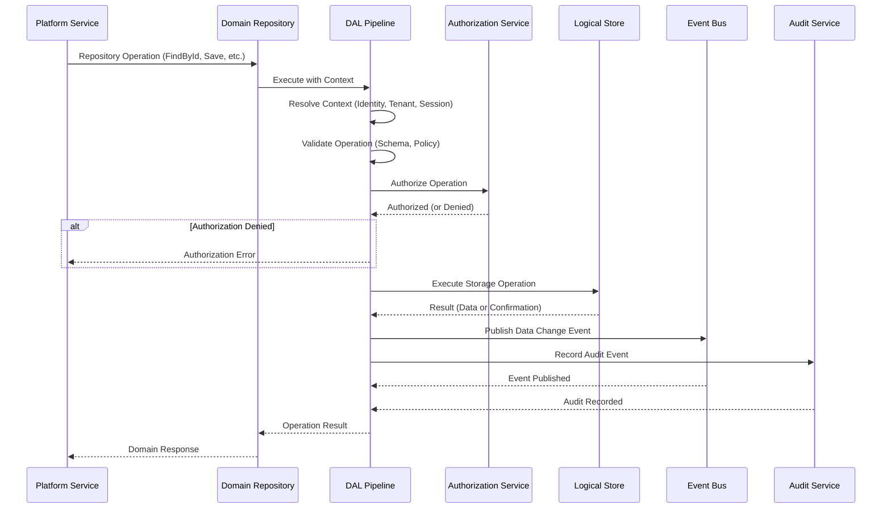
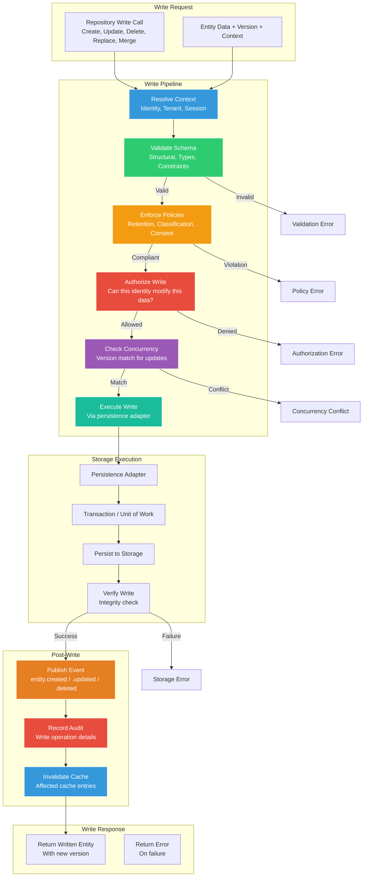
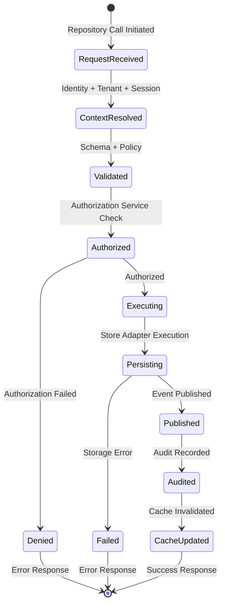
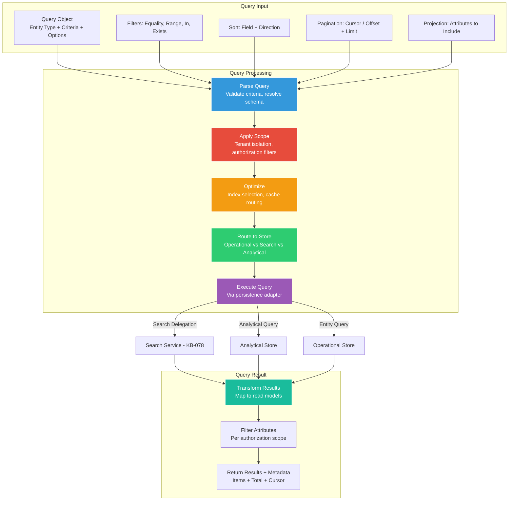
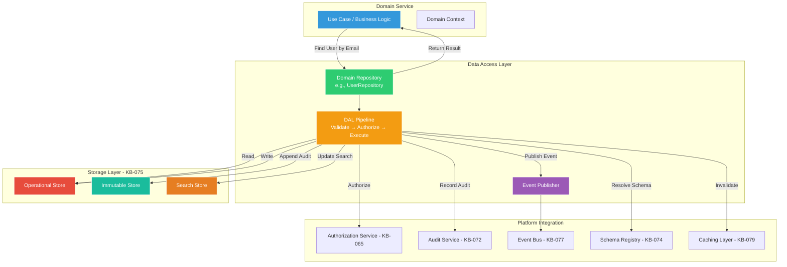

# Data Access Layer Architecture

**KB-076 — Data Access Layer Architecture Specification**

| Metadata | |
|----------|---|
| **KB ID** | KB-076 |
| **Title** | Data Access Layer Architecture |
| **Version** | 0.1.0 |
| **Status** | Draft |
| **Owner** | Architecture Team |
| **Suite** | Data Platform Architecture |
| **Dependencies** | KB-073 Data Platform Architecture, KB-074 Data Modeling & Schema Governance, KB-075 Storage Architecture |
| **Related Documents** | KB-051 Runtime Architecture Overview, KB-055 Runtime State Engine Architecture, KB-057 Runtime Security Architecture, KB-058 Runtime Observability & Diagnostics Architecture, KB-060 Runtime Lifecycle Management, KB-065 Authorization & RBAC Architecture, KB-067 Consent & Privacy Architecture, KB-070 API Security & Token Architecture, KB-072 Audit, Compliance & Identity Governance Architecture, KB-077 Event & Messaging Architecture (planned), KB-078 Search & Indexing Architecture (planned), KB-079 Caching Architecture (planned) |
| **Review Status** | Pending |
| **Last Updated** | 2026-07-11 |

---

### Revision History

| Version | Date | Author | Change |
|---------|------|--------|--------|
| 0.1.0 | 2026-07-11 | AI Architecture Agent | Initial draft |

---

## 1. Executive Summary

### 1.1 Purpose

This document defines the Data Access Layer (DAL) Architecture for the DUKADESK Platform. The DAL is the only architectural boundary allowed to communicate with storage systems. Business services, APIs, Runtime Engine, Builder Studio, Marketplace, AI Services, Mobile APIs, and future platform services must never communicate directly with storage.

The DAL provides a technology-independent abstraction over persistence while enforcing governance, security, validation, observability, and tenant isolation. It is the single architectural boundary responsible for reads, writes, queries, transactions, bulk operations, streaming access, search delegation, event publication triggers, validation, version control, tenant isolation, and security enforcement.

This document defines architecture only. It is database-independent, ORM-independent, storage-provider-independent, and implementation-independent.

### 1.2 Scope

**In scope:**

- Reads: Point reads, batch reads, filtered queries, projected reads, paginated reads, streaming reads
- Writes: Creates, updates, deletes, replaces, merges, batch writes
- Queries: Query objects, specifications, filtering, sorting, aggregation, projection, pagination
- Transactions: Transactional boundaries, unit of work, aggregate persistence, optimistic concurrency
- Bulk Operations: Batch reads, batch writes, bulk import, bulk export
- Streaming Access: Cursor-based iteration, change data capture, event-sourced reads
- Search Delegation: Query routing to search indexes, federated search across stores
- Event Publication Triggers: Data change event generation on writes
- Validation: Schema validation, constraint validation, relationship validation, policy validation
- Version Control: Optimistic concurrency, version awareness, conflict detection
- Tenant Isolation: Multi-tenant context enforcement, cross-tenant access blocking
- Security Enforcement: Authorization before access, row-level filtering, access auditing
- Repository contracts per domain: Identity, Organization, Tenant, Workspace, Application, Runtime, Builder, Marketplace, Audit, Configuration

**Out of scope:**

- Implementation details of specific ORMs, database drivers, or data access frameworks
- Specific query language syntaxes (SQL, NoSQL query languages)
- Application-level business logic (business rules live in domain services, not the DAL)
- UI-level data binding or state management
- Network-level data access protocols (gRPC, REST, GraphQL)
- Tenant application-specific data access patterns

---

## 2. Architectural Principles

### 2.1 Storage Independence

The DAL is the complete abstraction over all storage. Services depend on the DAL's repository interfaces, not on storage engines. Storage engines can be replaced, upgraded, or reconfigured without affecting any service code. Storage independence is the primary architectural responsibility of the DAL.

### 2.2 Repository Pattern

Data access is organized through domain-specific repositories. Each repository exposes domain-appropriate operations — `UserRepository.FindByEmail()`, `TenantRepository.FindById()`, `WorkspaceRepository.GetNavigationTree()`. Repositories represent domain contracts, not database tables. The repository pattern ensures that domain semantics drive data access, not storage structure.

### 2.3 Domain Ownership

Every repository is owned by the data domain it serves. The Identity Domain owns identity repositories. The Runtime Domain owns runtime repositories. Repository boundaries match domain boundaries (KB-073). Cross-domain data access requires going through the owning domain's repository.

### 2.4 Single Persistence Boundary

The DAL is the only architectural boundary that communicates with storage systems. No service, API, runtime, builder, marketplace, or AI component may access storage directly. The single persistence boundary ensures consistent enforcement of security, authorization, tenant isolation, validation, auditing, and governance across the entire platform.

### 2.5 Policy Enforcement

The DAL enforces all data policies — schema validation, integrity constraints, version compatibility, ownership verification, tenant isolation, consent dependencies, audit recording. Policies are enforced at the DAL boundary, not at the application layer. Policy enforcement is comprehensive and consistent across all data access paths.

### 2.6 Consistent Data Access

Every data access follows the same architectural path through the DAL — context resolution, validation, authorization, execution, persistence, event publication, audit. Consistent data access ensures that no code path bypasses security, governance, or observability.

### 2.7 Transactional Integrity (Conceptual)

The DAL manages transactional boundaries at the aggregate level. Aggregates are persisted atomically (KB-074). Cross-aggregate transactions are managed by the domain services, not by the DAL. Transactional integrity is a conceptual property — the DAL does not prescribe any specific transaction implementation.

### 2.8 Observable Operations

Every data access operation through the DAL is observable — read latency, write latency, validation outcomes, authorization decisions, storage errors, event publication status. Data observability is built into the DAL, not retrofitted through log scraping.

### 2.9 Provider Independence

The DAL is independent of any specific ORM, database driver, or data access framework. Provider-specific code is encapsulated in persistence adapters behind the DAL's repository interfaces. Provider independence ensures that data access technology choices can evolve without service impact.

### 2.10 Security Before Persistence

Every data access passes through authorization before reaching storage. Security is enforced before validation, before query execution, before write operations. Security before persistence ensures that unauthorized access attempts are blocked before they consume storage resources or trigger audit events.

---

## 3. Canonical Definitions

### 3.1 Data Access Layer (DAL)

The architectural boundary that provides unified, governed data access across all platform services. The DAL implements repository interfaces, enforces policies, manages persistence, and abstracts storage engines. It is the only path to persistent data.

### 3.2 Repository

A domain-specific data access contract that exposes domain-appropriate operations for reading and persisting entities. Repositories are defined by domain semantics, not by storage structure. Each entity type in a domain has a corresponding repository. Example: `UserRepository`, `TenantRepository`, `WorkspaceRepository`.

### 3.3 Persistence Adapter

An implementation of a repository interface that translates domain operations into storage engine operations. Adapters encapsulate all storage-engine-specific logic — query dialects, connection management, transaction handling, data mapping. Adapters are the only components with storage engine knowledge.

### 3.4 Query

A structured representation of a data retrieval operation. Queries specify the entity type, filter criteria, sorting, pagination, projection, and relationships to include. Queries are declarative — they express what data is needed, not how to retrieve it.

### 3.5 Command

A structured representation of a data modification operation. Commands specify the operation type (create, update, delete, replace, merge), the entity data, and the expected version for concurrency control. Commands are declarative — they express what change to make, not how to make it.

### 3.6 Read Model

A projection of entity data optimized for a specific read use case. Read models may include data from multiple entities, pre-computed values, or denormalized attributes. Read models are non-authoritative — they are derived from the authoritative entity data.

### 3.7 Write Model

A representation of entity data as provided for a write operation. Write models are validated against the entity schema before persistence. Write models may include only a subset of entity attributes for partial updates.

### 3.8 Unit of Work (Conceptual)

A conceptual container that tracks changes to entities within a single transaction boundary. The unit of work ensures that all changes within the boundary are persisted atomically — all succeed or all fail. The unit of work is a conceptual pattern, not a specific implementation.

### 3.9 Transaction Boundary

The set of operations that must be persisted atomically. Transaction boundaries align with aggregate boundaries (KB-074) — all entities within an aggregate are updated within the same transaction. Cross-aggregate operations use compensating actions rather than distributed transactions.

### 3.10 Aggregate Persistence

The principle that aggregates are persisted as a single unit. The DAL guarantees that all entities within an aggregate are written atomically, and that aggregate boundaries are respected across read and write operations.

### 3.11 Projection

A transformation that selects, reshapes, and optionally combines data from one or more entities. Projections are used to create read models optimized for specific consumers or use cases. The DAL supports projections at the query level.

### 3.12 Data Mapper

A component that maps between entity models (domain objects) and storage-specific data structures. Data mappers are part of persistence adapters. They translate domain semantics to storage semantics without exposing storage details to the domain.

### 3.13 Persistence Context

The execution context for a data access operation — the identity making the request, the tenant context, the authorization scope, the session context, the trace context. The persistence context is resolved before any data access and is propagated through the entire DAL pipeline.

### 3.14 Data Policy

A governance rule enforced by the DAL — schema validation, tenant isolation, authorization check, consent validation, audit recording. Data policies are defined architecturally and enforced consistently across all data access paths.

---

## 4. DAL Architecture

### 4.1 Data Access Layer Architecture

```mermaid
flowchart TB
    subgraph Services["Platform Services"]
        RT[Runtime Engine]
        BLD[Builder Studio]
        MKT[Marketplace]
        AI[AI Platform]
        AUTH[Authentication]
        DASH[Dashboards]
        API[API Platform]
    end

    subgraph DAL["Data Access Layer"]
        direction TB

        subgraph Repositories["Domain Repositories"]
            ID_REPO[Identity Repositories]
            ORG_REPO[Organization Repositories]
            TN_REPO[Tenant Repositories]
            WS_REPO[Workspace Repositories]
            APP_REPO[Application Repositories]
            RT_REPO[Runtime Repositories]
            BLD_REPO[Builder Repositories]
            MKT_REPO[Marketplace Repositories]
            AUD_REPO[Audit Repositories]
            CFG_REPO[Configuration Repositories]
        end

        subgraph Pipeline["Data Access Pipeline"]
            CTX[Context Resolution]
            VAL[Validation]
            AUTHZ[Authorization]
            EXEC[Execution]
            EVT[Event Publication]
            AUD[Audit Recording]
        end

        subgraph Adapters["Persistence Adapters"]
            OP_ADAPTER[Operational Store Adapter]
            AN_ADAPTER[Analytical Store Adapter]
            IM_ADAPTER[Immutable Store Adapter]
            OBJ_ADAPTER[Object Store Adapter]
            SRCH_ADAPTER[Search Store Adapter]
            EP_ADAPTER[Ephemeral Store Adapter]
        end
    end

    subgraph Storage["Logical Storage"]
        OP_STORE[Operational Store]
        AN_STORE[Analytical Store]
        IM_STORE[Immutable Store]
        OBJ_STORE[Object Store]
        SRCH_STORE[Search Store]
        EP_STORE[Ephemeral Store]
    end

    subgraph External["External Systems"]
        EVT_BUS[Event Bus]
        AUTH_SVC[Authorization Service]
        AUD_SVC[Audit Service]
    end

    RT --> ID_REPO
    RT --> TN_REPO
    RT --> WS_REPO
    RT --> RT_REPO
    BLD --> BLD_REPO
    BLD --> WS_REPO
    MKT --> MKT_REPO
    AI --> AI
    AUTH --> ID_REPO
    DASH --> AN_REPO
    API --> APP_REPO

    ID_REPO --> CTX
    ORG_REPO --> CTX
    TN_REPO --> CTX
    WS_REPO --> CTX
    RT_REPO --> CTX
    BLD_REPO --> CTX
    MKT_REPO --> CTX

    CTX --> VAL
    VAL --> AUTHZ
    AUTHZ --> EXEC
    EXEC --> EVT
    EVT --> AUD

    AUTHZ --> AUTH_SVC
    EVT --> EVT_BUS
    AUD --> AUD_SVC

    EXEC --> OP_ADAPTER
    EXEC --> AN_ADAPTER
    EXEC --> IM_ADAPTER
    EXEC --> OBJ_ADAPTER
    EXEC --> SRCH_ADAPTER
    EXEC --> EP_ADAPTER

    OP_ADAPTER --> OP_STORE
    AN_ADAPTER --> AN_STORE
    IM_ADAPTER --> IM_STORE
    OBJ_ADAPTER --> OBJ_STORE
    SRCH_ADAPTER --> SRCH_STORE
    EP_ADAPTER --> EP_STORE

    style CTX fill:#3498db,stroke:#fff,color:#fff
    style VAL fill:#2ecc71,stroke:#fff,color:#fff
    style AUTHZ fill:#e74c3c,stroke:#fff,color:#fff
    style EXEC fill:#f39c12,stroke:#fff,color:#fff
    style EVT fill:#9b59b6,stroke:#fff,color:#fff
    style AUD fill:#1abc9c,stroke:#fff,color:#fff
    style ID_REPO fill:#3498db,stroke:#fff,color:#fff
    style RT_REPO fill:#f39c12,stroke:#fff,color:#fff
    style BLD_REPO fill:#e67e22,stroke:#fff,color:#fff
    style MKT_REPO fill:#9b59b6,stroke:#fff,color:#fff
    style OP_ADAPTER fill:#2ecc71,stroke:#fff,color:#fff
    style IM_ADAPTER fill:#e74c3c,stroke:#fff,color:#fff
```



### 4.2 Architecture Overview

The DAL operates as a layered pipeline:

- **Domain Repositories**: Service-facing interfaces organized by data domain. Each repository exposes domain-specific operations. Repositories are the entry point to the DAL — all data access starts with a repository call.

- **Data Access Pipeline**: Every repository call passes through the same pipeline stages:
  1. **Context Resolution** — resolve the persistence context (identity, tenant, session, trace)
  2. **Validation** — validate the operation against schema and policy constraints
  3. **Authorization** — authorize the operation through the authorization service (KB-065)
  4. **Execution** — execute the operation against the appropriate logical store
  5. **Event Publication** — publish data change events to the event bus
  6. **Audit Recording** — record the operation in the audit trail

- **Persistence Adapters**: Logical store adapters translate DAL operations into storage engine operations. Each logical store type has a dedicated adapter that encapsulates storage-engine-specific logic.

- **Logical Storage**: The logical store types defined in KB-075. The DAL routes operations to the appropriate store based on the data domain and operation type.

- **External Systems**: The DAL integrates with the authorization service, event bus, and audit service for policy enforcement, event publication, and audit recording.

### 4.3 End-to-End Data Access Sequence



---

## 5. Read Architecture

### 5.1 Read Flow

```mermaid
flowchart TB
    subgraph Input["Read Request"]
        REQ[Repository Read Call<br/>FindById, FindByEmail, Query, etc.]
        PARAMS[Parameters: ID, Filter, Sort, Page, Projection]
    end

    subgraph ReadPipeline["Read Pipeline"]
        CTX[Resolve Context<br/>Identity, Tenant, Session, Trace]
        SCHEMA[Resolve Schema<br/>Entity type, Version, Projection]
        AUTHR[Authorize Read<br/>Can this identity read this data?]
        OPT[Optimize Query<br/>Cache check, adapter routing]
        EXECR[Execute Read<br/>Via persistence adapter]
        TRANSFORM[Transform Result<br/>Map to read model, filter attributes]
    end

    subgraph Cache["Cache Layer - KB-079"]
        CACHE_CHECK{Cache Hit?}
        CACHE_GET[Return from Cache]
    end

    subgraph Storage["Storage Execution"]
        ADAPTER[Persistence Adapter]
        QUERY[Build Storage Query]
        FETCH[Fetch from Storage]
    end

    subgraph Output["Read Response"]
        RESULT[Return Read Model(s)]
        AUDIT_R[Record Read Audit]
    end

    REQ --> CTX
    PARAMS --> CTX
    CTX --> SCHEMA
    SCHEMA --> AUTHR
    AUTHR -->|Denied| DENIED[Authorization Error]
    AUTHR -->|Allowed| OPT
    
    OPT --> CACHE_CHECK
    
    CACHE_CHECK -->|Hit| CACHE_GET
    CACHE_GET --> TRANSFORM
    
    CACHE_CHECK -->|Miss| EXECR
    EXECR --> ADAPTER
    ADAPTER --> QUERY
    QUERY --> FETCH
    FETCH --> TRANSFORM
    
    TRANSFORM --> RESULT
    RESULT --> AUDIT_R

    style CTX fill:#3498db,stroke:#fff,color:#fff
    style AUTHR fill:#e74c3c,stroke:#fff,color:#fff
    style OPT fill:#f39c12,stroke:#fff,color:#fff
    style EXECR fill:#2ecc71,stroke:#fff,color:#fff
    style TRANSFORM fill:#9b59b6,stroke:#fff,color:#fff
    style CACHE_CHECK fill:#1abc9c,stroke:#fff,color:#fff
```

### 5.2 Read Request Types

| Operation | Description | Cache Strategy | Authorization |
|-----------|-------------|---------------|---------------|
| FindById | Retrieve entity by its unique identifier | Cache-first, TTL-based | Entity-level access check |
| FindByUnique | Retrieve entity by a unique constraint (email, slug) | Cache-first, TTL-based | Entity-level access check |
| FindMany | Retrieve entities matching filter criteria | Cache-through, query-based | Scoped filter added for tenant |
| Query | Complex query with filtering, sorting, pagination | Cache-aside, result-cached | Scoped filter added for tenant |
| Count | Count entities matching filter criteria | Cache-aside, count-cached | Scoped filter added for tenant |
| Exists | Check if entity exists by criteria | Cache-check first | Minimal — existence is low-sensitivity |
| Stream | Cursor-based iteration over large result sets | No cache | Scoped filter added for tenant |
| Projection | Retrieve specific attributes of entities | Cache projection | Attribute-level access check |

### 5.3 Query Processing Pipeline

- **Context Resolution**: The reading identity, tenant context, and session context are resolved. Tenant context determines data scope. Session context may affect visibility (e.g., session-scoped data).
- **Schema Resolution**: The entity schema is resolved from the schema registry (KB-074). Schema version determines available attributes, relationships, and projections.
- **Authorization**: The authorization service (KB-065) evaluates whether the identity is authorized to read the requested data. Authorization may be entity-level, attribute-level, or row-level.
- **Query Optimization**: The DAL determines the optimal execution path — cache hit returns cached data, cache miss routes to storage. Query parameters are optimized: filter pushdown, projection selection, index utilization.
- **Storage Execution**: The persistence adapter translates the read operation into a storage engine query. The adapter applies tenant isolation filters, authorization filters, and projection transformations.
- **Result Transformation**: Storage results are transformed into domain read models. Attribute-level access filters are applied. Sensitive attributes are redacted based on authorization scope.

### 5.4 Filtering and Projection

- **Declarative Filters**: Read requests specify filter criteria declaratively — equality, range, inclusion, exclusion, string matching. Filters are storage-engine-independent.
- **Scoped Filter Injection**: The DAL automatically injects tenant context and authorization scope filters. A query for `FindWorkspacesByTenant` automatically scopes to the requesting identity's authorized workspaces.
- **Projection**: Read requests specify which attributes to include in the response. Projections reduce data transfer and improve performance. Default projection returns all authorized attributes.
- **Pagination**: Read requests support cursor-based and offset-based pagination. Cursor-based pagination is preferred for large result sets. Pagination metadata includes total count estimate.

---

## 6. Write Architecture

### 6.1 Write Flow



### 6.2 Write Request Types

| Operation | Description | Concurrency | Event Type | Cache Action |
|-----------|-------------|-------------|------------|--------------|
| Create | Insert a new entity | No version check | entity.created | Invalidate related queries |
| Update | Modify an existing entity | Optimistic (version match) | entity.updated | Invalidate entity + related |
| Delete | Remove an entity | Optimistic (version match) | entity.deleted | Invalidate entity + related |
| Replace | Full replacement of an entity | Optimistic (version match) | entity.updated | Invalidate entity + related |
| Merge | Partial update of attributes | Optimistic (version match) | entity.updated | Invalidate entity |
| Batch Create | Insert multiple entities | No version check | entity.created (per entity) | Invalidate related queries |
| Batch Update | Update multiple entities | Optimistic per entity | entity.updated (per entity) | Invalidate per entity |

### 6.3 Write Validation

- **Schema Validation**: Entity data is validated against the registered schema (KB-074) — required attributes present, attribute types correct, constraints satisfied, relationships valid.
- **Integrity Checks**: Referential integrity is validated — referenced entities exist, relationship cardinality is respected, ownership rules are satisfied.
- **Policy Validation**: Data policies are enforced — retention policy declared, data classification valid, consent dependencies satisfied, tenant isolation respected.
- **Version Compatibility**: Entity version is validated against the schema version. Schema compatibility between write model and registered schema is verified.

### 6.4 Event Generation

Every write operation generates one or more data change events:

- **entity.created**: Published on successful entity creation. Contains entity identifier, entity type, creation context, initial attribute values (within authorization scope).
- **entity.updated**: Published on successful entity update. Contains entity identifier, entity type, changed attributes, previous version reference, update context.
- **entity.deleted**: Published on successful entity deletion. Contains entity identifier, entity type, deletion context, retention reference for audit.

Events are published after successful persistence. Event publication failure does not roll back the write — the write is committed, and event publication is retried asynchronously.

---

## 7. Data Access Lifecycle

### 7.1 Persistence Lifecycle



### 7.2 Lifecycle Stages

**Request Received**: A service calls a repository method with operation parameters — entity data, identifiers, filters, context.

**Context Resolved**: The DAL resolves the persistence context — the requesting identity (from authentication, KB-064), the tenant context (from the request or session), the session context (if applicable), and the trace context (for observability).

**Validated**: The operation is validated against schema constraints (KB-074) and data policies. Validation failures return descriptive errors before any storage interaction.

**Authorized**: The operation is authorized through the authorization service (KB-065). Authorization checks are performed before any storage operation — unauthorized requests are blocked before they reach storage.

**Executing**: The operation is routed to the appropriate persistence adapter. The adapter translates the domain operation into a storage engine operation.

**Persisting**: The storage engine executes the operation. For writes, the write-ahead log records the operation, the data is committed, and integrity is verified.

**Published**: Data change events are published to the event bus. Event publication informs all interested consumers of the data change.

**Audited**: The operation is recorded in the audit trail (KB-072). Audit records include the operation type, entity identifiers, the requesting identity, timestamp, outcome.

**Cache Updated**: Affected cache entries are invalidated. Cache invalidation ensures subsequent reads retrieve the latest data.

---

## 8. Repository Architecture

### 8.1 Repository Relationships

```mermaid
flowchart TB
    subgraph Repositories["Domain Repositories"]
        direction TB

        subgraph Identity["Identity Domain"]
            UR[UserRepository]
            PR[ProfileRepository]
            AMR[AuthenticationMethodRepository]
            CGR[ConsentGrantRepository]
            SESSR[SessionRepository]
        end

        subgraph Organization["Organization Domain"]
            OR[R OrganizationRepository]
            OMR[OrganizationMemberRepository]
            OPR[OrganizationPolicyRepository]
        end

        subgraph Tenant["Tenant Domain"]
            TR[TenantRepository]
            TMR[TenantMemberRepository]
            TCR[TenantConfigurationRepository]
        end

        subgraph Workspace["Workspace Domain"]
            WR[WorkspaceRepository]
            NR[NavigationRepository]
            SR[ScreenRepository]
            CR[ComponentRepository]
        end

        subgraph Runtime["Runtime Domain"]
            RSR[RuntimeSessionRepository]
            SSR[ScreenStateRepository]
            CSR[ComponentStateRepository]
            NSR[NavigationStateRepository]
            FSR[FormStateRepository]
            OQR[OfflineQueueRepository]
        end

        subgraph Builder["Builder Domain"]
            MDR[ModuleDefinitionRepository]
            CDR[ComponentDefinitionRepository]
            WFR[WorkflowDefinitionRepository]
            FDR[FormDefinitionRepository]
            PVR[PublishedVersionRepository]
        end

        subgraph Marketplace["Marketplace Domain"]
            PKGR[PackageRepository]
            EXTR[ExtensionRepository]
            CERTR[CertificationRepository]
            INSTR[InstallationRepository]
        end

        subgraph Governance["Governance Domain"]
            AER[AuditEventRepository]
            CER[ComplianceEvidenceRepository]
            CCR[CertificationCampaignRepository]
        end

        subgraph Configuration["Configuration Domain"]
            PLCR[PlatformConfigurationRepository]
            TNCR[TenantConfigurationRepository]
            MDCR[ModuleConfigurationRepository]
        end
    end

    UR --> PR
    UR --> AMR
    UR --> CGR
    UR --> SESSR

    OR --> OMR
    OR --> OPR

    TR --> TMR
    TR --> TCR

    WR --> NR
    WR --> SR
    WR --> CR

    RSR --> SSR
    RSR --> CSR
    RSR --> NSR
    RSR --> FSR
    RSR --> OQR

    MDR --> CDR
    MDR --> WFR
    MDR --> FDR
    MDR --> PVR

    PKGR --> EXTR
    PKGR --> CERTR
    PKGR --> INSTR

    style UR fill:#3498db,stroke:#fff,color:#fff
    style OR fill:#2ecc71,stroke:#fff,color:#fff
    style TR fill:#e74c3c,stroke:#fff,color:#fff
    style WR fill:#f39c12,stroke:#fff,color:#fff
    style RSR fill:#1abc9c,stroke:#fff,color:#fff
    style MDR fill:#e67e22,stroke:#fff,color:#fff
    style PKGR fill:#9b59b6,stroke:#fff,color:#fff
    style AER fill:#e74c3c,stroke:#fff,color:#fff
    style PLCR fill:#3498db,stroke:#fff,color:#fff
```



### 8.2 Repository Contracts

Repositories are domain contracts — they define data access in domain terms, not storage terms:

- **Identity Repositories**: `UserRepository.FindByEmail(email)`, `UserRepository.FindByIdentityProvider(providerId, externalUserId)`, `SessionRepository.FindActiveByUserId(userId)`, `ConsentGrantRepository.FindActiveByUserAndTenant(userId, tenantId)`
- **Tenant Repositories**: `TenantRepository.FindByOrganization(orgId)`, `TenantConfigurationRepository.FindByTenant(tenantId)`, `TenantMemberRepository.FindByUser(userId)`
- **Workspace Repositories**: `WorkspaceRepository.FindByTenant(tenantId)`, `NavigationRepository.GetNavigationTree(workspaceId)`, `ScreenRepository.FindByWorkspace(workspaceId)`
- **Runtime Repositories**: `RuntimeSessionRepository.FindById(sessionId)`, `ScreenStateRepository.FindBySession(sessionId)`, `OfflineQueueRepository.FindPendingByDevice(deviceId)`
- **Builder Repositories**: `ModuleDefinitionRepository.FindByWorkspace(workspaceId)`, `PublishedVersionRepository.FindLatestByModule(moduleId)`
- **Marketplace Repositories**: `PackageRepository.Search(criteria)`, `InstallationRepository.FindByTenant(tenantId)`
- **Configuration Repositories**: `PlatformConfigurationRepository.FindByKey(key)`, `TenantConfigurationRepository.FindByTenantAndScope(tenantId, scope)`

### 8.3 Repository Design Rules

- **Domain Semantics**: Repository method names describe what the operation does in domain terms (`FindActiveByUserAndTenant`), not storage terms (`QueryByUserIdAndTenantIdAndStatusEqualsActive`).
- **Aggregate Boundaries**: Each repository operates within a single aggregate boundary. Cross-aggregate operations are composed by domain services, not by repositories.
- **Ownership Alignment**: Each repository is owned by the data domain it serves. Repository ownership matches domain ownership (KB-073).
- **Persistence Independence**: Repository interfaces contain no storage-engine-specific types, annotations, or conventions. Repository implementations (adapters) handle storage specifics.

---

## 9. Query Architecture

### 9.1 Query Processing Pipeline



### 9.2 Query Objects

Queries are structured objects that decouple the service from the storage query language:

- **Entity Query**: `Query<User>(filter: ..., sort: ..., page: ..., projection: ...)` — for operational store queries against entity data.
- **Search Query**: `SearchQuery<User>(text: "...", filters: ..., facets: ...)` — for full-text search, delegated to search store (KB-078).
- **Analytical Query**: `AnalyticalQuery<Metric>(timeRange: ..., aggregation: ..., groupBy: ...)` — for analytical store queries against aggregated data.
- **Stream Query**: `StreamQuery<Event>(fromOffset: ..., batchSize: ...)` — for cursor-based iteration over immutable event streams.

### 9.3 Specifications (Conceptual)

Specifications provide composable, reusable query criteria:

- **Composite Specifications**: Specifications can be combined with AND, OR, NOT operators. Example: `ActiveUsers.In(tenant).WithRole(admin).And.EmailVerified()`.
- **Reusable Definitions**: Common query criteria are defined as reusable specifications. Example: `ActiveTenant`, `PublishedModule`, `CurrentSession`.
- **Storage Translation**: Specifications are translated to storage-specific filters by the persistence adapter. Specifications are storage-engine-independent.

### 9.4 Filtering and Aggregation

- **Filter Types**: Equality (`field = value`), Range (`field > value`, `field between a and b`), Inclusion (`field in [a, b, c]`), String Match (`field contains "text"`), Existence (`field exists`), Nested (`relatedEntity.field = value`).
- **Aggregation**: Count, sum, average, min, max, group by, histogram. Aggregation is supported for analytical queries and delegated to the analytical store. Entity queries support count only.
- **Result Streaming**: Large result sets are streamed through cursor-based pagination. Stream queries provide ordered iteration over potentially unbounded result sets.

---

## 10. Persistence Policies

### 10.1 Validation Policies

- **Schema Validation**: Every write is validated against the entity's registered schema version. Schema validation ensures structural correctness — required attributes, correct types, valid constraints.
- **Reference Validation**: Every entity reference is validated — the referenced entity must exist, the relationship cardinality must be respected, and ownership rules must be satisfied.
- **Constraint Validation**: Attribute values are validated against declared constraints — minimum/maximum values, string patterns, enumeration membership, uniqueness.

### 10.2 Integrity Policies

- **Optimistic Concurrency**: Every entity has a version number. Updates and deletes require the version being modified to match the current version. Version mismatch indicates a concurrent modification and the operation is rejected with a conflict error.
- **Referential Integrity**: Entity references are validated for existence before write. A reference to a non-existent entity is rejected. Cascade rules are enforced per relationship type (KB-074).

### 10.3 Ownership Verification

- **Owner Validation**: The entity's data owner (KB-073) is verified. The requesting identity must have authority over the entity. Cross-owner writes are authorized through the authorization service.
- **Ownership Transfer**: Ownership transfers are governed — both current and new owner must authorize the transfer. Ownership transfer is recorded as an audit event.

### 10.4 Tenant Isolation

- **Tenant Context Injection**: Every query automatically receives the tenant context filter. The filter is injected by the DAL, not provided by the caller. Queries without tenant context are rejected.
- **Cross-Tenant Blocking**: Cross-tenant read or write attempts are blocked by the DAL. Cross-tenant operations require explicit authorization and are automatically detected and blocked.
- **Tenant Scope Enforcement**: Write operations validate that the entity's tenant context matches the caller's tenant context. Mismatch is rejected.

### 10.5 Consent Dependencies

- **Consent Check**: Read and write operations involving consumer personal data verify that consent (KB-067) has been granted for the specific purpose. Data access without consent is blocked.
- **Consent Scope Enforcement**: Data returned or modified is limited to the consented scope. Attributes outside the consent scope are filtered or blocked.

### 10.6 Audit Recording

- **Audit on Every Write**: Every create, update, and delete operation is recorded in the audit trail (KB-072). The audit record includes operation type, entity identifiers, requesting identity, timestamp, and outcome.
- **Audit on Authorized Reads**: Read operations that access sensitive data are recorded in the audit trail. Read audit includes entity identifiers, requesting identity, and timestamp.
- **Audit on Policy Violations**: Authorization failures, validation failures, and policy violations are recorded in the audit trail for security monitoring.

---

## 11. Domain Integration

### 11.1 Domain Service → DAL → Storage Flow



### 11.2 Integration Points

**Domain Services**: Domain services implement business logic and coordinate across aggregates. Domain services use repositories for all data access. Domain services never access storage directly, never use ORM sessions, never write storage queries.

**Event Platform (KB-077)**: The DAL publishes data change events to the event bus after successful writes. Events carry change metadata for consumers. The DAL does not consume events — event consumption is handled by domain services or event handlers.

**Security Platform (KB-057, KB-065)**: The DAL integrates with the authorization service for every data access. Authorization decisions are made by the authorization service, not by the DAL. The DAL enforces the decision — it does not make it.

**Identity Platform (KB-063–KB-072)**: The DAL receives identity context from the authentication layer. Identity context determines data scope, authorization evaluation, and audit recording. The DAL does not manage identity — it enforces identity-based policies.

**Schema Registry (KB-074)**: The DAL resolves entity schemas from the schema registry. Schema resolution determines validation rules, attribute access permissions, and relationship validation. The DAL does not define schemas — it enforces them.

**Caching Layer (KB-079)**: The DAL integrates with the caching layer for read optimization and cache invalidation on writes. Caching is transparent to domain services. The DAL manages cache consistency.

---

## 12. Runtime Responsibilities

- Use domain repositories for all data access — never access storage engines, databases, or ORM sessions directly
- Call repository methods with domain semantics — `userRepository.FindByEmail(email)`, never write raw queries
- Provide complete persistence context — identity, tenant, session, trace — with every repository call
- Handle DAL responses — success results, validation errors, authorization denials, concurrency conflicts
- Never bypass the DAL for performance reasons — all data access, including cached reads, goes through the DAL
- Participate in transaction boundaries defined by domain services — the DAL manages aggregate-level atomicity
- Consume data change events published by the DAL for cross-service state synchronization

---

## 13. Backend Responsibilities

- Implement and maintain the Data Access Layer — repository interfaces, persistence adapters, pipeline stages
- Implement persistence adapters for each logical store type — operational, analytical, immutable, object, search, ephemeral
- Enforce the Data Access Pipeline — context resolution, validation, authorization, execution, event publication, audit
- Integrate with platform services — authorization service (KB-065), audit service (KB-072), schema registry (KB-074), event bus (KB-077), caching layer (KB-079)
- Enforce tenant isolation at the DAL level — inject tenant context filters, block cross-tenant access
- Enforce data policies — schema validation, integrity checks, consent validation, ownership verification
- Maintain cache consistency — invalidate cache entries on writes, support cache-through reads
- Monitor DAL performance — read/write latency, throughput, error rates, cache hit rates
- Support DAL evolution — adapters for new logical stores, migration for storage engine changes

---

## 14. Builder Responsibilities

- Use domain repositories for all data access — never access storage engines directly
- Call builder-domain repositories — `moduleDefinitionRepository.FindByWorkspace(workspaceId)`, `publishedVersionRepository.FindLatestByModule(moduleId)`
- Provide workspace and tenant context with every repository call
- Handle DAL responses — validation errors on module definitions, authorization denials on cross-workspace access
- Never embed storage queries, ORM configurations, or connection strings in builder code
- Participate in the publishing pipeline through the DAL — module publication is a write operation governed by the DAL

---

## 15. Marketplace Responsibilities

- Use domain repositories for all data access — never access storage engines directly
- Call marketplace-domain repositories — `packageRepository.Search(criteria)`, `installationRepository.FindByTenant(tenantId)`
- Provide tenant and publisher context with every repository call
- Handle asset download through the DAL — asset references are resolved through repository interfaces, not through direct object store access
- Handle installation records through the DAL — installation writes are governed by the DAL pipeline
- Never bypass the DAL for marketplace asset access, package metadata reads, or installation record writes

---

## 16. Security

### 16.1 Authorization Before Access

- **Every Access Authorized**: Every data access through the DAL is authorized before execution. Authorization is evaluated by the authorization service (KB-065), not by the DAL. The DAL enforces the authorization decision — allowing authorized operations and blocking unauthorized ones.
- **Authorization at Every Level**: Authorization is evaluated at the entity level (can this identity read this entity?), at the attribute level (can this identity read this attribute?), and at the operation level (can this identity perform this operation on this entity?).

### 16.2 Tenant Isolation

- **Automatic Tenant Scoping**: Every query automatically receives a tenant context filter injected by the DAL. The tenant context is resolved from the persistence context, not from the query parameters. This prevents accidental cross-tenant data leaks.
- **Tenant Context Validation**: Every write validates that the tenant context of the data being written matches the caller's tenant context. Mismatches are rejected.
- **Cross-Tenant Audit**: Any cross-tenant access that passes authorization is audited with both the source and target tenant contexts.

### 16.3 Row/Record Isolation (Conceptual)

- **Scoped Queries**: Queries are automatically scoped to the authorized data set. A user querying their own sessions only sees their sessions. A tenant administrator querying tenant members sees only that tenant's members. Scoping is automatic and enforced by the DAL.
- **Filter Injection**: Authorization scopes are injected as query filters. The caller does not specify authorization filters — they are applied by the DAL based on the resolved authorization context.

### 16.4 Data Integrity

- **Write Validation**: All writes are validated against the entity schema before execution. Invalid writes are rejected with descriptive errors.
- **Concurrency Control**: Optimistic concurrency prevents lost updates. Version conflicts are detected and reported.
- **Immutable Audit**: Audit records are written to the immutable store. No DAL operation can modify or delete committed audit records.

### 16.5 Input Validation

- **Structural Validation**: Entity data is validated against the registered schema — required attributes, correct types, valid constraints.
- **Sanitization**: String inputs are sanitized to prevent injection attacks. The storage layer receives safe, validated inputs.
- **Bounds Checking**: Numeric and date values are checked against declared bounds. Out-of-bounds values are rejected.

### 16.6 Access Auditing

- **Write Audit**: Every write operation is audited — operation type, entity identifiers, requesting identity, tenant context, timestamp, outcome.
- **Sensitive Read Audit**: Read operations on sensitive data (PII, credentials, consent records) are audited.
- **Violation Audit**: Authorization failures, validation failures, and policy violations are audited for security monitoring.

---

## 17. Privacy

### 17.1 Data Minimization

- **Projection Enforcement**: The DAL returns only the attributes the caller is authorized to read. Attribute-level authorization is enforced at the DAL, not at the application layer.
- **Minimum Data in Events**: Data change events contain only the changed attributes, not the full entity. Event payloads are minimized by default.

### 17.2 Consent Validation

- **Consent Check Before Access**: Data access involving consumer personal data is checked against the consumer's consent grants (KB-067). Access without valid consent is blocked.
- **Consent Scope Enforcement**: Data returned or modified is limited to the consented scope. Attributes outside the consent scope are automatically filtered.

### 17.3 Restricted Attribute Access

- **Sensitive Attribute Protection**: Sensitive attributes (passwords, MFA secrets, tokens, payment data) have restricted access. The DAL enforces attribute-level authorization — only authorized callers can read or write sensitive attributes.
- **Attribute Redaction**: When a caller is authorized to read an entity but not authorized for specific sensitive attributes, those attributes are automatically redacted from the response.

### 17.4 Privacy Enforcement Before Persistence

- **Pre-Persistence Check**: Privacy policies are checked before data is persisted. Data that violates privacy policies (unconsented data, excessive personal data, data beyond retention) is rejected before storage.
- **Consent-Anchored Storage**: Data requiring consent is not persisted until consent is verified. The DAL rejects writes of consent-dependent data without valid consent.

---

## 18. Performance

### 18.1 Query Optimization Concepts

- **Filter Pushdown**: Filters are pushed down to the storage engine. Filtering at the storage layer reduces data transfer and improves performance.
- **Projection Optimization**: Only requested attributes are retrieved from storage. Full entity retrieval is avoided when a projection is specified.
- **Index Utilization**: Query patterns inform index design. The DAL provides query metrics that guide index strategy.
- **Batch Loading**: Related entities are loaded in batch (using `IN` queries or eager loading configurations) to avoid N+1 query problems.

### 18.2 Batch Operations

| Operation | Target Throughput | Notes |
|-----------|------------------|-------|
| Batch Read (100 entities by ID) | < 20ms | Parallelized reads |
| Batch Write (100 creates) | < 200ms | Batched persistence |
| Bulk Import (10,000 records) | < 30s | Streaming bulk import |
| Bulk Export (10,000 records) | < 30s | Streaming bulk export |

### 18.3 Lazy vs Eager Retrieval (Conceptual)

- **Lazy Retrieval**: Related entities are loaded on demand when accessed. Lazy retrieval minimizes initial query cost but may cause N+1 query patterns.
- **Eager Retrieval**: Related entities are loaded as part of the initial query. Eager retrieval increases initial query cost but eliminates N+1 patterns.
- **DAL-Managed**: The DAL manages lazy vs eager retrieval based on query declaration. Services declare which relationships to include. The DAL optimizes the retrieval strategy.

### 18.4 Caching Integration

- **Cache-Through Reads**: The DAL checks the cache before querying storage. Cache hits return data without storage access. Cache misses load from storage and populate the cache (KB-079).
- **Write-Through Invalidation**: The DAL invalidates affected cache entries on writes. Cache invalidation ensures consistency.
- **TTL-Based Expiration**: Cached entries have TTL-based expiration. Expired entries are removed by the cache layer.

### 18.5 Performance Targets

| Operation | Target (p95) | Notes |
|-----------|-------------|-------|
| Point Read (by ID, cached) | < 3ms | Cache hit |
| Point Read (by ID, uncached) | < 15ms | Direct operational store |
| Batch Read (50 IDs) | < 25ms | Parallelized |
| Simple Query (filtered, paginated) | < 25ms | Indexed query |
| Complex Query (multi-filter, sorted) | < 100ms | Optimized query |
| Create (single entity) | < 15ms | Includes validation + event |
| Update (single entity) | < 20ms | Includes concurrency check |
| Delete (single entity) | < 15ms | Includes cascade check |
| Batch Write (25 entities) | < 150ms | Batched with atomicity |

---

## 19. Observability

Reference KB-058 Runtime Observability & Diagnostics Architecture.

### 19.1 Query Metrics

- **Query Volume**: Number of queries by repository, operation type, and result (success/failure)
- **Query Latency**: P50, P95, P99 latency by query type (point read, filtered query, search query, analytical query)
- **Query Distribution**: Query distribution across logical stores (operational, search, analytical, immutable)

### 19.2 Read/Write Latency

- **Read Latency**: End-to-end read latency including context resolution, authorization, and execution
- **Write Latency**: End-to-end write latency including validation, authorization, persistence, event publication, and audit
- **Pipeline Stage Latency**: Latency breakdown by pipeline stage (context, validate, authorize, execute, event, audit)

### 19.3 Validation Metrics

- **Validation Volume**: Number of validations by type (schema, constraint, relationship, policy)
- **Validation Success Rate**: Percentage of validations that pass by type
- **Top Validation Failures**: Most common validation failure reasons

### 19.4 Authorization Metrics

- **Authorization Volume**: Number of authorization checks by operation type and result
- **Authorization Denial Rate**: Percentage of operations denied by authorization
- **Top Denial Reasons**: Most common authorization denial reasons (insufficient role, cross-tenant, missing consent)

### 19.5 Repository Metrics

- **Repository Call Volume**: Calls per repository per time period
- **Repository Latency**: P95 latency per repository operation
- **Repository Error Rate**: Error rate by repository and error type

### 19.6 Persistence Throughput

- **Read Throughput**: Records read per second by logical store
- **Write Throughput**: Records written per second by logical store
- **Cache Hit Rate**: Cache hit percentage by repository and operation

---

## 20. Failure Scenarios

### 20.1 Validation Failure

| Scenario | Impact | Mitigation |
|----------|--------|------------|
| Schema validation fails on write | Write rejected, service receives validation error | Clear error message identifies the failing field and constraint. Service can correct and retry. |
| Reference validation fails (referenced entity does not exist) | Write rejected, integrity violation | Error identifies the invalid reference. Service must ensure referenced entity exists before retry. |
| Constraint violation (value out of range) | Write rejected | Error identifies the constraint. Service must provide a compliant value. |

### 20.2 Concurrency Conflict

| Scenario | Impact | Mitigation |
|----------|--------|------------|
| Two services update the same entity simultaneously | Second update rejected with version conflict | Service retries: re-reads entity, reconciles changes, re-applies update with new version. |
| Service submits update with stale version | Write rejected with version conflict | Service detects conflict, reloads current version, re-evaluates business logic, retries. |
| Long-running operation holds version causing contention | Other updates blocked or rejected | Keep operations within aggregate boundaries short. Use non-blocking reads for long-running processes. |

### 20.3 Repository Failure

| Scenario | Impact | Mitigation |
|----------|--------|------------|
| Repository adapter fails (storage engine error) | Data access fails, operation cannot complete | DAL returns storage error. Service retries with backoff. If persistent, fallback to cached data (read) or queue for retry (write). |
| Repository misconfiguration (wrong store type) | Operation fails at adapter routing | Adapter routing is validated at startup. Misconfiguration detected and alerted. Operation fails fast with configuration error. |
| Repository contract mismatch (interface change) | Service fails to compile or call repository | Repository interfaces are versioned. Breaking changes follow contract governance (KB-074). |

### 20.4 Storage Unavailable

| Scenario | Impact | Mitigation |
|----------|--------|------------|
| Operational store unavailable | Reads and writes fail for operational data | Read fallback to cache. Writes queued for retry. Critical path (authentication) may fail closed. |
| Immutable store unavailable | Event and audit writes fail | Non-critical writes queued. Critical audit writes block and alert. Storage recovery triggers retry. |
| Search store unavailable | Search queries fail | Fallback to operational store for simple queries. Search degraded experience. Index rebuild on recovery. |

### 20.5 Cross-Tenant Access Attempt

| Scenario | Impact | Mitigation |
|----------|--------|------------|
| Service accidentally includes wrong tenant context | Cross-tenant data query, blocked by DAL | DAL blocks cross-tenant access. Service receives authorization error. Security audit triggered. |
| Malicious actor attempts cross-tenant read | Access blocked at DAL | DAL blocks with authorization denial. Security incident alert triggered. Audit recorded with both tenant contexts. |

### 20.6 Authorization Failure

| Scenario | Impact | Mitigation |
|----------|--------|------------|
| Service calls repository without authorization context | Access denied, no identity resolved | DAL rejects unauthenticated requests. Service must provide authentication context. |
| Identity lacks permission for the operation | Operation denied with authorization error | Service receives authorization error. Service should not retry without elevated privileges. |
| Identity's session expired during operation | Authorization context invalid, operation denied | Service must re-authenticate (KB-064). DAL returns session expired error. |

### 20.7 Policy Violation

| Scenario | Impact | Mitigation |
|----------|--------|------------|
| Write violates retention policy (data retained beyond limit) | Write rejected with policy error | Service must correct data to comply with retention policy. Policy is defined per data classification. |
| Write violates data classification policy (sensitive data in wrong store) | Write rejected with classification error | Service must route sensitive data to the correct logical store. Classification is validated before write. |
| Read violates consent scope (data outside consent) | Read filtered, attributes redacted | DAL automatically filters non-consented attributes. Service receives authorized data only. |

### 20.8 Event Publication Failure

| Scenario | Impact | Mitigation |
|----------|--------|------------|
| Event bus unavailable during write | Write committed, event publication pending | Write completes. Event is queued for async retry. Eventual delivery guaranteed. Services must tolerate delayed events. |
| Event payload exceeds size limit | Event publication fails | Event payload size is validated before publication. Large payloads use reference-based events (payload in object store, reference in event). |

---

## 21. Anti-patterns

### 21.1 Business Logic Inside Repositories

**Anti-pattern**: Embedding business rules, calculations, or decision logic inside repository implementations.

**Why**: Repositories are data access components, not business logic components. Business logic in repositories couples data access to business rules, makes testing difficult, and violates single responsibility.

**Solution**: Business logic lives in domain services. Repositories handle data access only. Domain services coordinate across repositories and apply business rules.

### 21.2 Direct Database Access from Services

**Anti-pattern**: Platform services accessing storage engines directly — executing raw queries, using ORM sessions, calling storage engine APIs — instead of going through the DAL.

**Why**: Bypasses the single persistence boundary. Direct access skips validation, authorization, tenant isolation, event publication, and audit. Every direct access is a security and governance gap.

**Solution**: All data access goes through domain repositories. The DAL is the only path to storage. Direct storage access is prohibited for all platform services.

### 21.3 Shared Repositories Across Domains

**Anti-pattern**: Using the same repository implementation for multiple data domains, or having domain A's service use domain B's repository implementation directly.

**Why**: Repository ownership matches domain ownership. Shared repositories blur domain boundaries, create coupling between domains, and make it unclear who owns repository evolution.

**Solution**: Each data domain owns its repositories. Cross-domain data access goes through the owning domain's repository or through data products with governed contracts.

### 21.4 Storage-Specific Queries in Business Services

**Anti-pattern**: Writing storage-engine-specific queries (SQL, NoSQL query syntax, search query DSL) in business service code.

**Why**: Creates coupling between business services and specific storage engines. Storage engine changes require rewriting business service queries. Testing requires storage engine infrastructure.

**Solution**: Business services use repository methods and query objects. Storage-specific queries are encapsulated in persistence adapters behind the repository interface.

### 21.5 Skipping Authorization Checks

**Anti-pattern**: Bypassing DAL authorization checks for "internal" operations, background jobs, or administrative actions, assuming internal callers are always authorized.

**Why**: Internal callers can be compromised or misconfigured. Authorization is not about trust — it is about verifying that every operation is permitted. Skipping checks creates security gaps.

**Solution**: Every data access through the DAL is authorized, regardless of caller type. Administrative actions may have broader authorization scopes but still pass through authorization.

### 21.6 Runtime Persistence Logic

**Anti-pattern**: Allowing the Runtime Engine to contain persistence logic — connection management, query building, data mapping — that duplicates or bypasses the DAL.

**Why**: Runtime is a consumer of data, not a persistence layer. Persistence logic in Runtime creates coupling between Runtime and storage engines, bypasses governance, and creates maintenance burden.

**Solution**: Runtime uses domain repositories for all data access. All persistence logic is encapsulated in the DAL. Runtime contains no storage engine references.

### 21.7 Duplicate Repository Definitions

**Anti-pattern**: Defining the same entity's repository interface in multiple services or modules, each with slightly different method signatures and semantics.

**Why**: Duplicate repository definitions violate One Concept, One Model (KB-074). Different definitions diverge over time, creating integration failures and confusion.

**Solution**: Each entity has exactly one canonical repository definition. All services consume the canonical definition. Domain-specific query methods are added to the canonical repository, not duplicated elsewhere.

### 21.8 Transaction Leaking Across Aggregates

**Anti-pattern**: Using distributed transactions or long-running database transactions that span multiple aggregate boundaries.

**Why**: Cross-aggregate transactions create coupling between aggregates, reduce scalability, and increase contention. Distributed transaction protocols (two-phase commit) have poor reliability and performance.

**Solution**: Transactions are bounded by aggregate boundaries. Cross-aggregate consistency is achieved through event-driven processes (eventual consistency) or compensating actions (saga pattern).

---

## 22. Future Evolution

### 22.1 Distributed Data Access

Future DAL evolution may support distributed data access — repositories that transparently route queries to the correct regional or edge data store based on data locality. Distributed access is transparent to services — they call the same repository interface regardless of data location.

### 22.2 Federated Queries

Future DAL may support federated queries — queries that span multiple storage domains, aggregating results from operational stores, analytical stores, and search indexes into a unified response. Federated queries are expressed as declarative query objects, not as multi-store programming.

### 22.3 AI-Assisted Query Optimization

Future DAL may use AI to optimize query execution — predicting query patterns, recommending index strategies, automatically tuning cache policies, and suggesting projection optimizations based on observed access patterns.

### 22.4 Adaptive Read Models

Future DAL may support adaptive read models — read models that automatically adjust their structure based on consumer usage patterns. Frequently accessed attributes are included in the default projection. Rarely accessed attributes are available on explicit request.

### 22.5 Autonomous Data Routing

Future DAL may route queries autonomously — determining whether to serve a query from the operational store, a read replica, a cache, or an analytical store based on latency requirements, data freshness, and query complexity.

### 22.6 Edge Data Access

Future DAL may support edge data access — repositories that transparently read from and write to edge-local storage for offline-capable Runtime instances. Edge data access follows the same repository interfaces as centralized access, with synchronization handled by the DAL.

---

## 23. Cross-References

| Reference | Document | Relationship |
|-----------|----------|-------------|
| **KB-051** | Runtime Architecture Overview | Runtime data consumption through DAL repositories |
| **KB-055** | Runtime State Engine Architecture | State engine data persistence via DAL |
| **KB-057** | Runtime Security Architecture | DAL security enforcement for Runtime operations |
| **KB-058** | Runtime Observability & Diagnostics Architecture | DAL observability metrics, query monitoring, performance tracking |
| **KB-060** | Runtime Lifecycle Management | DAL lifecycle alignment with Runtime lifecycle |
| **KB-065** | Authorization & RBAC Architecture | Authorization service integration for every DAL operation |
| **KB-067** | Consent & Privacy Architecture | Consent validation enforced at DAL boundary |
| **KB-070** | API Security & Token Architecture | Token-based authentication context for DAL calls |
| **KB-072** | Audit, Compliance & Identity Governance Architecture | Audit recording for every DAL operation |
| **KB-073** | Data Platform Architecture | Foundation — data ownership, domains, classification |
| **KB-074** | Data Modeling & Schema Governance | Schema validation, entity standards, repository contracts |
| **KB-075** | Storage Architecture | Logical store types that DAL adapters implement |
| **KB-077** | Event & Messaging Architecture (planned) | Data change event publication from DAL |
| **KB-078** | Search & Indexing Architecture (planned) | Search query delegation from DAL |
| **KB-079** | Caching Architecture (planned) | Cache integration for DAL read optimization |

---

## 24. Mermaid Diagram Index

| Diagram | Section | Description |
|---------|---------|-------------|
| Data Access Layer Architecture | 4.1 | Complete DAL architecture from platform services through domain repositories, data access pipeline, persistence adapters, and logical stores |
| End-to-End Data Access Sequence | 4.3 | Sequence diagram showing the full DAL flow from service call through repository, pipeline, authorization, storage, event publication, and audit |
| Read Flow | 5.1 | Read pipeline from repository call through context resolution, schema validation, authorization, cache check, storage execution, and result transformation |
| Write Flow | 6.1 | Write pipeline from repository call through context resolution, schema validation, policy enforcement, authorization, concurrency check, persistence, event publication, audit, and cache invalidation |
| Persistence Lifecycle | 7.1 | Complete data access lifecycle state machine from request through context, validation, authorization, execution, event publication, audit, and cache update |
| Repository Relationships | 8.1 | All domain repositories organized by data domain with inter-repository relationships |
| Query Processing Pipeline | 9.1 | Query processing from query object through parsing, scope injection, optimization, store routing, execution, and result transformation |
| Domain Service → DAL → Storage Flow | 11.1 | Integration flow from domain service through repository, DAL pipeline, storage layer, and platform services (authorization, audit, events, cache) |
| Security Enforcement Pipeline | 3.4, 4.2, 5.1, 6.1 | Security enforcement across all DAL operations — authorization, tenant isolation, consent validation, audit |
| DAL Dependency Graph | (architectural concept throughout sections 4, 5, 6, 11, 23) | DAL dependencies across the Data Platform, Runtime, Security, and Identity & Access suites |

---

## 25. Architectural Note

KB-076 defines the Data Access Layer Architecture — the single architectural boundary responsible for all persistence operations across the DUKADESK platform. It establishes a critical and non-negotiable platform rule:

> **Every interaction with persistent data must pass through the Data Access Layer.**

No platform service — Runtime Engine, Builder Studio, Marketplace, Mobile APIs, Business Dashboard, Tenant Dashboard, AI Services, or future modules — may directly access storage. The DAL is the single architectural boundary responsible for persistence, ensuring consistent enforcement of security, authorization, tenant isolation, validation, auditing, and governance across the entire DUKADESK platform.

The architecture establishes that:
- **Storage independence is absolute** — services depend on repository interfaces, not storage engines. Storage engines can be replaced without service impact.
- **The DAL pipeline is universal** — every read and write passes through context resolution, validation, authorization, execution, event publication, and audit. No code path bypasses any stage.
- **Policies are enforced at the DAL** — schema validation, tenant isolation, consent validation, authorization, and audit are enforced by the DAL, not by application code.
- **Repositories are domain contracts** — they represent domain semantics, not database tables. Repository interfaces are owned by data domains.

With KB-076 complete, the Data Platform Architecture suite defines how data is owned (KB-073), modeled (KB-074), stored (KB-075), and accessed (KB-076). The remaining planned documents address events (KB-077), search (KB-078), caching (KB-079), files (KB-080), backup (KB-081), and lifecycle (KB-082).

> **One Data Platform. One Data Access Layer. One persistence boundary for every service.**
