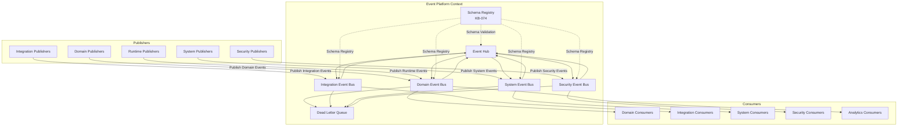
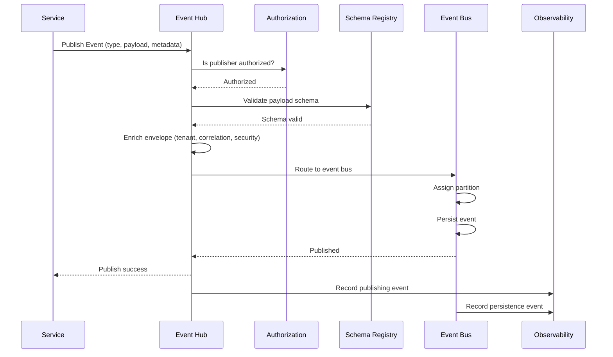
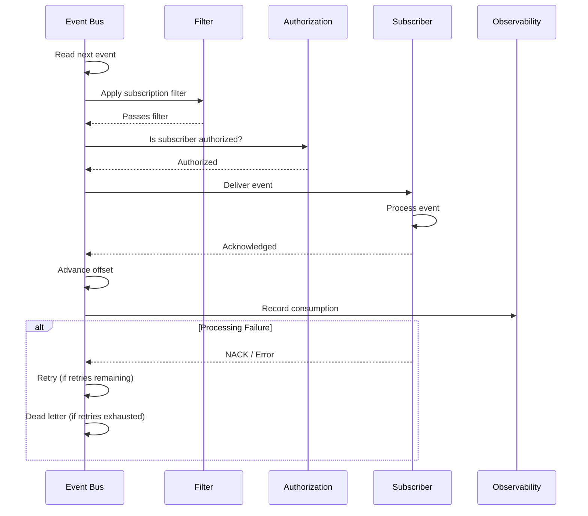
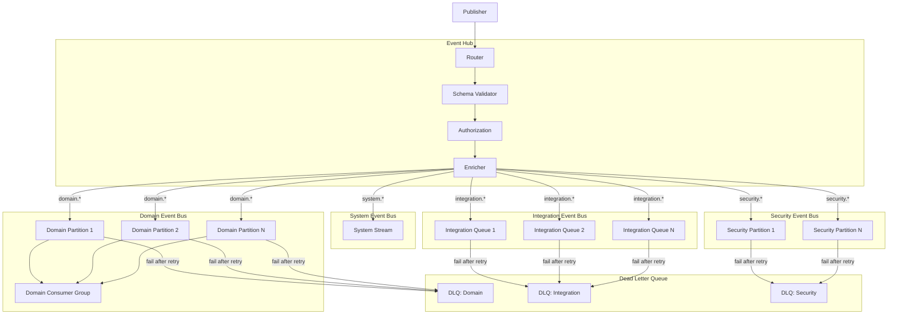
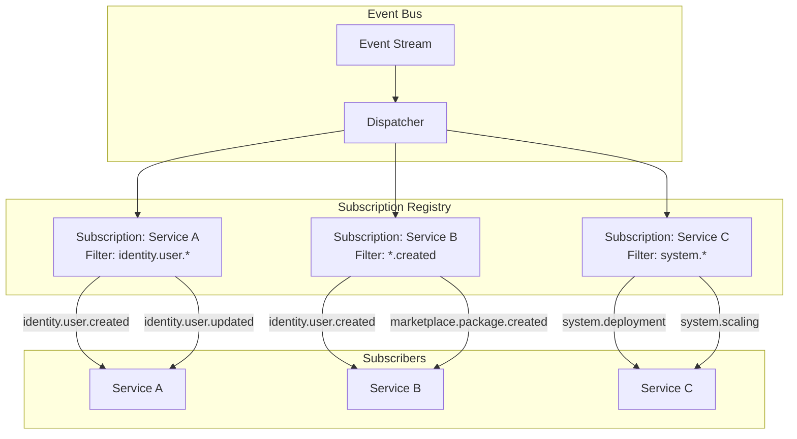
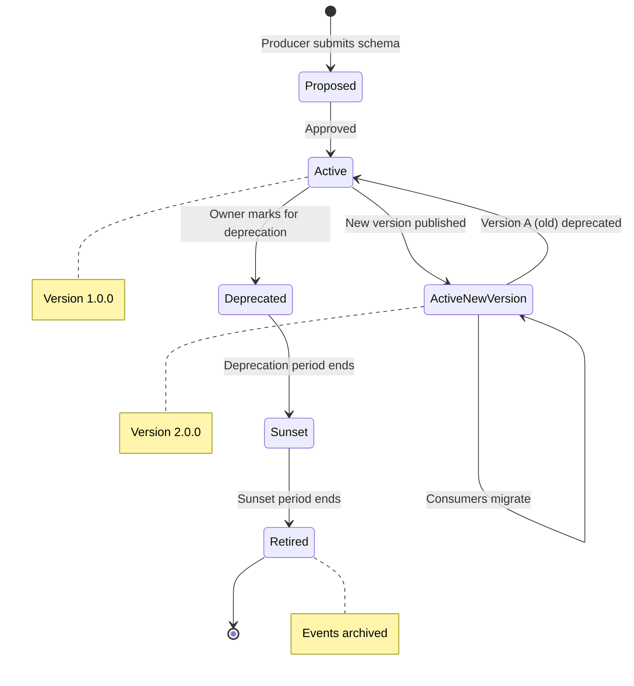
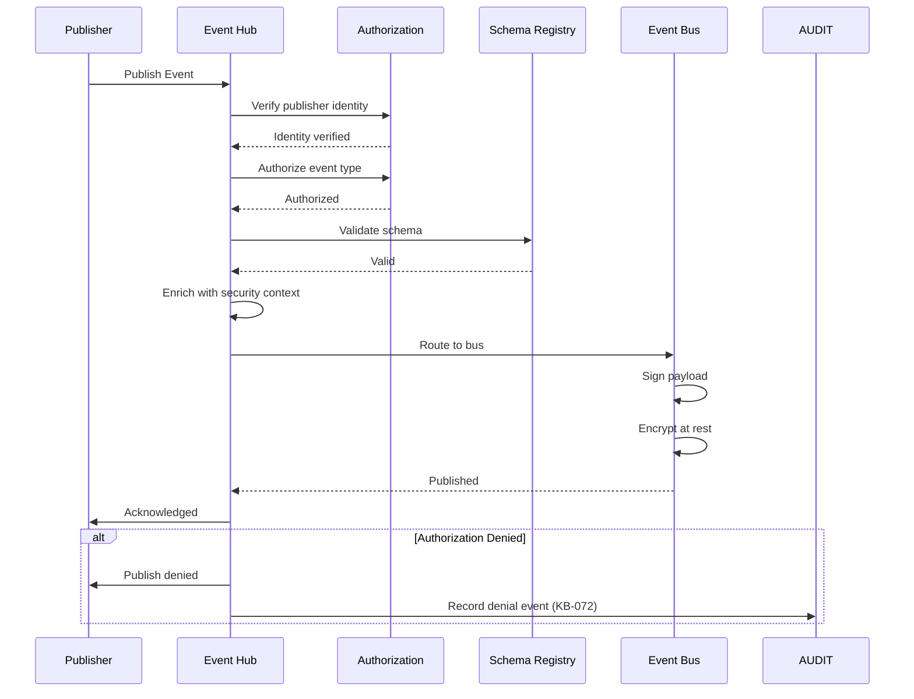
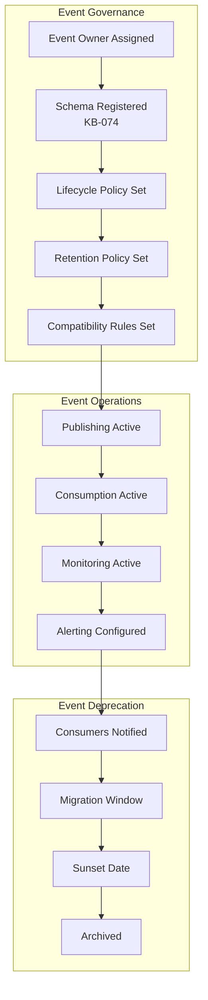

# Event & Messaging Architecture

**KB-077 — Event & Messaging Architecture Specification**

| Metadata | |
|----------|---|
| **KB ID** | KB-077 |
| **Title** | Event & Messaging Architecture |
| **Version** | 0.1.0 |
| **Status** | Draft |
| **Owner** | Architecture Team |
| **Suite** | Data Platform Architecture |
| **Dependencies** | KB-073 Data Platform Architecture, KB-074 Data Modeling & Schema Governance, KB-075 Storage Architecture, KB-076 Data Access Layer Architecture |
| **Related Documents** | KB-051 Runtime Architecture Overview, KB-055 Runtime State Engine Architecture, KB-057 Runtime Security Architecture, KB-058 Runtime Observability & Diagnostics Architecture, KB-060 Runtime Lifecycle Management, KB-064 Authentication Architecture, KB-065 Authorization & RBAC Architecture, KB-067 Consent & Privacy Architecture, KB-068 Session Management Architecture, KB-070 API Security & Token Architecture, KB-071 Identity Federation & Social Login Architecture, KB-072 Audit, Compliance & Identity Governance Architecture, KB-078 Search & Indexing Architecture (planned), KB-082 Data Lifecycle & Retention (planned) |
| **Review Status** | Pending |
| **Last Updated** | 2026-07-11 |

---

### Revision History

| Version | Date | Author | Change |
|---------|------|--------|--------|
| 0.1.0 | 2026-07-11 | AI Architecture Agent | Initial draft |

---

## 1. Executive Summary

### 1.1 Purpose

This document defines the Event & Messaging Architecture for the DUKADESK Platform. The Event Platform is the canonical nervous system of DUKADESK — the architectural foundation for event production, routing, delivery, consumption, governance, lifecycle management, and interoperability across the entire ecosystem.

DUKADESK is an event-driven platform. Every significant platform activity publishes events that can be consumed by authorized platform services without creating direct service dependencies. The Event Platform enables loose coupling, extensibility, scalability, observability, automation, analytics, AI integration, workflow orchestration, and future distributed deployments.

This document defines architecture only. It is message-broker-independent, cloud-provider-independent, and implementation-independent.

### 1.2 Scope

**In scope:**

- Domain Events: Entity lifecycle events (created, updated, deleted), business process events, state transition events
- Integration Events: External system integration events, webhook delivery events, data synchronization events
- System Events: Platform lifecycle events, deployment events, configuration change events
- Runtime Events: Session lifecycle events, state change events, navigation events, action events
- Builder Events: Module publish events, version release events, metadata change events
- Marketplace Events: Package publish events, installation events, certification events
- Identity Events: Identity lifecycle events, authentication events, authorization events, consent events, session events, federation events
- Security Events: Authorization denial events, security violation events, threat detection events
- Audit Events: Governance events, compliance events, policy violation events (KB-072)
- Workflow Events: Workflow state change events, step completion events, workflow error events
- Notification Events: User notification events, alert events, broadcast events
- Analytics Events: Usage events, performance events, business metric events
- AI Events: Model inference events, content generation events, training pipeline events
- Operational Events: Service health events, capacity events, deployment events
- Infrastructure Events: Storage events, network events, scaling events

**Out of scope:**
- Implementation details of specific message brokers, event streaming platforms, or queuing systems
- Specific event serialization formats or protocols (Protobuf, Avro, JSON Schema)
- Network-level messaging protocols (AMQP, MQTT, Kafka protocol)
- Application-level event handling logic within specific services
- UI-level event handling (user interactions, gesture events)

---

## 2. Architectural Principles

### 2.1 Event-Driven Platform

The platform communicates through events as the primary mechanism for cross-service interaction. Synchronous communication is used only when architecturally required — request-response for API calls, command patterns for immediate actions. Events are the default communication mechanism.

### 2.2 Loose Coupling

Publishers and subscribers are fully decoupled. Publishers do not know which subscribers consume their events. Subscribers do not know which publishers produced the events they consume. The only shared contract is the event schema. Loose coupling enables independent evolution of all services.

### 2.3 Producer Independence

Event producers are independent of event consumers. Producers publish events without waiting for consumer processing. Consumer failures do not affect producers. Producer independence ensures that publishing services remain available even when consuming services are degraded.

### 2.4 Consumer Independence

Event consumers are independent of event producers and other consumers. Consumers process events at their own pace. A slow or failed consumer does not affect other consumers or the producer. Consumer independence enables independent scaling and lifecycle management.

### 2.5 Event Immutability

Events, once published, are immutable. Events cannot be modified, deleted, or retracted. Corrections are published as new events. Immutability ensures that the event stream is an authoritative, auditable record of what happened. Event immutability is enforced at the platform level.

### 2.6 Asynchronous First

Asynchronous event processing is the default. Synchronous processing is the explicit exception. Services are designed to process events asynchronously — they do not block waiting for event processing to complete. Asynchronous first ensures scalability, resilience, and loose coupling.

### 2.7 Event Ownership

Every event type has a designated event owner. The owner defines the event schema, governs its evolution, and manages its lifecycle. Event ownership matches data domain ownership (KB-073). Events without owners are not published.

### 2.8 Replayability

Every event stream is replayable. Events can be replayed from any point in time to rebuild state, recover from failures, or backfill new consumers. Replayability is an architectural property — events are retained in an immutable store for the duration of their retention policy.

### 2.9 Observable Messaging

Every event is observable — publication, routing, delivery, consumption, and failure are visible through platform observability (KB-058). Event observability is built into the Event Platform, not retrofitted.

### 2.10 Versioned Contracts

Every event type has a versioned contract. Event schemas follow the versioning and compatibility rules established in KB-074. Breaking event schema changes require governance approval and consumer migration planning.

### 2.11 Tenant Isolation

Events are tenant-aware. Event routing and delivery respect tenant boundaries. Cross-tenant event delivery is authorized and audited. Tenant isolation ensures that one tenant's events are not visible to other tenants unless explicitly authorized.

---

## 3. Canonical Definitions

### 3.1 Event

A structured, immutable record of something that happened in the platform. Events have a type, a timestamp, a producer, a payload, and metadata. Events are the atomic units of asynchronous communication.

### 3.2 Domain Event

An event that represents a meaningful occurrence within a data domain. Domain events are named in the past tense — `UserCreated`, `TenantConfigured`, `OrderPlaced`. Domain events are the primary mechanism for cross-domain state synchronization.

### 3.3 Integration Event

An event that represents communication with an external system. Integration events may be outbound (platform to external system) or inbound (external system to platform). Integration events are governed by integration contracts.

### 3.4 System Event

An event that represents a platform infrastructure occurrence — deployment, scaling, configuration change, service health transition. System events are consumed by operational services.

### 3.5 Event Bus

The logical routing backbone of the Event Platform. The event bus receives events from publishers, routes them to subscribers based on event type and subscription filters, and manages delivery guarantees. The event bus is a logical architecture concept, not a specific technology.

### 3.6 Event Stream

An ordered sequence of events of the same type or within the same partition. Event streams preserve event ordering within the partition. Consumers read events from a stream sequentially. Streams are the unit of event ordering.

### 3.7 Event Channel

A logical destination for events of a specific category. Channels group related event types for routing and subscription. Examples: `identity.events`, `runtime.events`, `marketplace.events`.

### 3.8 Event Topic

A logical routing key within a channel that identifies a specific event subject. Topics enable fine-grained subscription — consumers subscribe to topics they care about. Example: `identity.user.created`, `identity.user.updated`.

### 3.9 Event Contract

A formal, versioned agreement between an event publisher and event consumers. The contract defines the event schema, semantics, delivery guarantees, and evolution policy. Event contracts follow the contract governance model established in KB-074.

### 3.10 Event Publisher

The service or component that produces and publishes events. Publishers declare their event contracts, populate event payloads and metadata, and publish events to the event bus. Publishers do not know which consumers receive their events.

### 3.11 Event Subscriber

The service or component that registers interest in receiving events of specific types. Subscribers define subscription filters, receive matching events, and process them. Subscribers do not know which publishers produced the events they receive.

### 3.12 Event Consumer

The service or component that processes delivered events. A consumer may process events from multiple subscriptions. Consumers are responsible for idempotent processing, error handling, and acknowledgment.

### 3.13 Event Broker (Conceptual)

The conceptual intermediary that receives events from publishers, routes them to subscribers, and manages delivery state. The event broker is a logical concept — it may be implemented by a message broker, event streaming platform, or event bus service.

### 3.14 Event Replay

The process of re-consuming events from a stream at a specific point in time. Replay is used to rebuild state, recover from failures, backfill new consumers, or audit past activity. Event replay is supported for the duration of the event retention period.

### 3.15 Event Envelope

The standard wrapper around every event. The envelope contains routing metadata (event type, version, source, tenant context), correlation metadata (correlation ID, causation ID), security metadata (producer identity, authentication context), and delivery metadata (timestamp, sequence number, retry count).

### 3.16 Event Metadata

Data about the event beyond the payload — producer identity, producer service, event version, tenant context, correlation ID, causation ID, timestamp, sequence number, trace context. Metadata is carried in the event envelope.

### 3.17 Dead Letter Queue (Conceptual)

A conceptual destination for events that cannot be processed after exhausting retry attempts. Dead letter events are preserved for analysis, debugging, and eventual reprocessing after resolution. The dead letter queue is a reliability pattern.

### 3.18 Event Ordering

The guarantee that events within a partition are delivered to a consumer in the same order they were published. Ordering is preserved within a partition (by entity ID, aggregate ID, or tenant ID). Global ordering is not guaranteed.

### 3.19 Event Correlation

The relationship between events that are part of the same logical operation or business process. Correlation is established through correlation IDs. Related events share the same correlation ID, enabling consumers to group and process them as a unit.

### 3.20 Event Causation

The causal relationship between events — Event B happened because of Event A. Causation is established through causation IDs. Each event carries the ID of the event that caused it, enabling consumers to trace event chains.

---

## 4. Event Taxonomy

### 4.1 Event Classification

Events are classified along multiple dimensions:

| Dimension | Categories | Description |
|-----------|------------|-------------|
| Source | Domain, Integration, System, Infrastructure | Origin of the event |
| Criticality | Critical, Important, Normal, Diagnostic | Impact if lost |
| Ordering | Ordered, Unordered | Whether within-partition ordering is required |
| Delivery | At-least-once, Exactly-once, Best-effort | Delivery guarantee required |
| Retention | Permanent, Long-term, Short-term, Transient | How long events are retained |
| Schema | Structured, Semi-structured, Opaque | Payload schema requirements |
| Tenant | Tenant-scoped, Cross-tenant, System-wide | Tenant isolation category |

### 4.2 Event Naming Convention

Events follow a hierarchical naming convention:

```
{domain}.{entity}.{action}
```

Examples:
- `identity.user.created` — A user was created
- `identity.user.updated` — A user was updated
- `identity.user.deleted` — A user was deleted
- `identity.tenant.configured` — A tenant was configured
- `marketplace.package.published` — A package was published
- `runtime.session.created` — A session was created
- `runtime.state.changed` — Runtime state changed
- `audit.compliance.violation` — A compliance violation was detected

### 4.3 Event Categories

#### 4.3.1 Domain Events

Domain events represent meaningful occurrences within a data domain. They are the primary mechanism for cross-domain state synchronization. Every entity lifecycle event (created, updated, deleted) is a domain event.

**Characteristics:**
- Named in the past tense
- Occur within a specific data domain
- Describe state changes that already happened
- Are source of truth for the event-driven state

**Examples:**
- `identity.tenant.provisioned`
- `marketplace.package.published`
- `builder.module.version.created`

#### 4.3.2 Integration Events

Integration events represent communication with external systems. They may be outbound (integration events produced by the platform) or inbound (integration events consumed from external systems).

**Characteristics:**
- Include external system correlation IDs
- Carry external system payloads or references
- Are governed by integration contracts
- May involve protocol transformation

**Examples:**
- `integration.webhook.delivered`
- `integration.sync.completed`
- `integration.external.event.received`

#### 4.3.3 System Events

System events represent platform infrastructure occurrences. They are consumed by operational services for monitoring, alerting, and automation.

**Characteristics:**
- Related to platform infrastructure
- Include operational context
- May be diagnostic in nature
- Are consumed by operational tooling

**Examples:**
- `system.deployment.started`
- `system.scaling.triggered`
- `system.configuration.changed`

#### 4.3.4 Runtime Events

Runtime events represent user interactions within a runtime session. They are consumed by runtime services for state management, session management, and analytics.

**Characteristics:**
- Related to an active session
- Include user context
- May require real-time processing
- Are ordered within the session

**Examples:**
- `runtime.session.created`
- `runtime.navigation.occurred`
- `runtime.action.executed`

#### 4.3.5 Security Events

Security events represent security-relevant occurrences — authorization decisions, authentication events, threat detection events. They are consumed by security services and audit infrastructure.

**Characteristics:**
- Include security context (identity, roles, permissions)
- May require immediate action
- Are preserved for audit
- Have strict retention requirements (KB-072)

**Examples:**
- `security.authorization.denied`
- `security.authentication.failed`
- `security.threat.detected`

#### 4.3.6 Audit Events

Audit events represent governance-relevant occurrences — compliance events, policy violations, access reviews. They are consumed by audit infrastructure and compliance tooling (KB-072).

**Characteristics:**
- Include full audit context
- Are tamper-evident
- Have long retention periods
- Are subject to legal hold

**Examples:**
- `audit.compliance.violation`
- `audit.access.review.completed`
- `audit.policy.updated`

#### 4.3.7 Analytics Events

Analytics events represent usage, performance, and business metrics. They are consumed by analytics infrastructure for reporting, dashboards, and business intelligence.

**Characteristics:**
- High volume
- Include metric context
- May be aggregated before consumption
- Have configurable retention

**Examples:**
- `analytics.usage.page.viewed`
- `analytics.performance.api.latency`
- `analytics.business.revenue.event`

#### 4.3.8 Operational Events

Operational events represent service health, capacity, and deployment occurrences. They are consumed by operational tooling for monitoring, alerting, and automation.

**Characteristics:**
- Related to service health
- Include operational metrics
- May trigger automated responses
- Are consumed by infrastructure teams

**Examples:**
- `operational.service.health.changed`
- `operational.capacity.threshold.exceeded`
- `operational.deployment.completed`

---

## 5. Event Structure

### 5.1 Event Envelope

Every event is wrapped in a standard envelope that carries routing, security, correlation, and delivery metadata. The envelope is the universal event wrapper — all events, regardless of type, share the same envelope structure.

```
Event Envelope:
  Metadata:
    id:                  UUID (globally unique event identifier)
    eventType:           string (hierarchical event type)
    eventVersion:        string (semver, follows KB-074 schema versioning)
    eventSpecVersion:    string (version of the event specification)
    source:              string (producer service identifier)
    producerId:          string (producer identity for authorization)
    timestamp:           datetime (ISO 8601 UTC, when the event was produced)
    contentType:         string (media type of the payload)
    dataSchema:          string (URI to the event schema in the schema registry)
  Tenant:
    tenantId:            UUID (tenant that owns the event)
    tenantType:          string (system, single-tenant, multi-tenant)
    isolationLevel:      string (strict, shared, public)
  Correlation:
    correlationId:       UUID (correlation ID for grouping related events)
    causationId:         UUID (ID of the event that caused this event)
    rootCorrelationId:   UUID (original correlation ID for the entire operation)
  Security:
    authenticatedId:     string (producer authenticated identity)
    serviceAccount:      string (service account if system-generated)
    authContext:         string (authentication context reference)
    authLevel:           string (level of authentication)
  Delivery:
    sequenceNumber:      number (monotonically increasing sequence within partition)
    partitionKey:        string (partition key for ordering)
    publishedAt:         datetime (ISO 8601 UTC, when the event was published to the bus)
    deliveryAttempt:     number (current delivery attempt)
    ttl:                 duration (time-to-live for the event)
  Payload:               (schema-defined event payload)
```

### 5.2 Payload Schema

Event payloads are defined by versioned schemas registered in the schema registry (KB-074). Payload schemas follow the canonical data model and entity modeling standards established in KB-074.

**Schema requirements:**
- Every event type has one schema
- Schemas are versioned using semantic versioning
- Schemas are registered in the schema registry
- Schema evolution follows KB-074 compatibility rules
- Payloads are validated against schemas at publication

### 5.3 Payload Structure

Event payloads contain the data relevant to the event. Payload structure is defined by the event schema, but follows conventions:

**State events** (created, updated, deleted):
```json
{
  "entityId": "UUID",
  "entityType": "string",
  "previousState": { /* optional, for updated events */ },
  "currentState": { /* relevant fields */ },
  "changedFields": [ /* list of changed field names */ ],
  "timestamp": "ISO 8601 UTC"
}
```

**Action events** (processed, completed, failed):
```json
{
  "actionId": "UUID",
  "actionType": "string",
  "entityId": "UUID",
  "entityType": "string",
  "result": "success|failure|partial",
  "details": { /* action-specific details */ },
  "errors": [ /* error details if failed */ ],
  "timestamp": "ISO 8601 UTC"
}
```

**Metric events** (measured, thresholded):
```json
{
  "metricId": "string",
  "metricType": "string",
  "value": "number",
  "unit": "string",
  "dimensions": { /* key-value dimensions */ },
  "timestamp": "ISO 8601 UTC"
}
```

### 5.4 Event Serialization

Events are serialized using a schema-aware serialization format. The serialization format is transparent to the Event Platform — events are handled as opaque payloads within envelopes.

**Serialization considerations:**
- Schema-aware serialization supports schema evolution
- Schema registry provides schema lookup and validation
- Serialization format does not affect routing or delivery
- Consumers deserialize based on event type and version

---

## 6. Event Topology

### 6.1 Logical Topology

The Event Platform follows a logical hub-and-spoke topology:

```
                    +-------------------+
                    |  Schema Registry  |
                    |     (KB-074)      |
                    +--------+----------+
                             |
                    +--------v----------+
                    |   Event Hub       |
                    | (Logical Router)  |
                    +--------+----------+
                             |
              +--------------+--------------+
              |              |              |
     +--------v-----+ +-----v--------+ +---v----------+
     | Domain       | | Integration  | | System       |
     | Event Bus    | | Event Bus    | | Event Bus    |
     +--------+-----+ +-----+--------+ +----+---------+
              |              |               |
     +--------v-----+ +-----v--------+ +----v---------+
     | Domain       | | Integration  | | System       |
     | Publishers   | | Publishers   | | Publishers   |
     +--------------+ +--------------+ +--------------+
              |              |               |
     +--------v-----+ +-----v--------+ +----v---------+
     | Domain       | | Integration  | | System       |
     | Consumers    | | Consumers    | | Consumers    |
     +--------------+ +--------------+ +--------------+
```

### 6.2 Event Hub

The Event Hub is the logical router that receives events from all publishers and routes them to the appropriate event bus based on event type, classification, and tenant context.

**Responsibilities:**
- Event type routing
- Tenant context validation
- Authorization check (is the publisher authorized to publish this event type?)
- Schema validation (does the payload match the event schema?)
- Enrichment (add standard headers and metadata)
- Routing to the appropriate event bus

### 6.3 Domain Event Bus

The Domain Event Bus handles all domain events within the platform. It is the primary bus for cross-domain communication.

**Characteristics:**
- At-least-once delivery
- Partitioned ordering by entity ID
- Long retention for replayability
- Schema-validated payloads
- Tenant-aware routing

### 6.4 Integration Event Bus

The Integration Event Bus handles all integration events — both inbound and outbound. It provides protocol adaptation, external system routing, and integration contract enforcement.

**Characteristics:**
- At-least-once delivery with configurable delivery semantics
- External system routing and protocol adaptation
- Integration contract validation
- External system authentication and authorization
- Outbound webhook delivery management

### 6.5 System Event Bus

The System Event Bus handles all system and operational events. It is used for platform-internal communication and operational tooling integration.

**Characteristics:**
- Best-effort or at-least-once delivery (configurable)
- Short retention (monitoring window)
- System-wide routing (no tenant isolation)
- Lower latency requirement

### 6.6 Security Event Bus

The Security Event Bus handles all security and audit events. It is a dedicated bus with strict access controls, long retention, and tamper-evident logging.

**Characteristics:**
- Exactly-once or at-least-once delivery (configurable per event type)
- Long retention (compliance requirements from KB-072)
- Strict access control (security services only)
- Tamper-evident event chain
- Legal hold support

---

## 7. Event Routing & Delivery

### 7.1 Routing Model

Events are routed based on event type, tenant context, and channel. The routing model is content-based — the event router evaluates the event envelope and determines the destination queue(s) and topic(s).

**Routing rules:**
- Event type → determines the channel
- Tenant context → determines the partition (for ordered events)
- Subscription filters → determine which subscribers receive the event
- Authorization → determines whether the subscriber is authorized to receive the event

### 7.2 Subscription Model

Subscribers declare interest in receiving events through subscriptions. Subscriptions define which events the subscriber wants to receive and how events should be delivered.

**Subscription properties:**
- Subscriber identity (which service is subscribing)
- Event type filter (which event types to receive)
- Event type filter pattern (wildcard support: `identity.user.*`, `identity.*.created`)
- Tenant filter (which tenants' events to receive)
- Delivery endpoint (how to deliver the event)
- Delivery semantics (at-least-once, exactly-once)
- Dead letter policy (what to do on persistent failure)
- Retry policy (how many times to retry, backoff strategy)

### 7.3 Delivery Guarantees

Different event types require different delivery guarantees:

| Guarantee | Description | Use Cases |
|-----------|-------------|-----------|
| At-least-once | Event is delivered at least once, may be delivered more than once | Domain events, integration events, audit events |
| Exactly-once | Event is delivered exactly once | Financial events, compliance events, critical state changes |
| Best-effort | Event may be lost on delivery failure | Analytics events, diagnostic events, non-critical metrics |
| Ordered | Events within a partition are delivered in order | State changes, session events, entity lifecycle |
| Unordered | Events may be delivered in any order | Notifications, analytics, non-critical events |

### 7.4 Retry Policy

Event delivery failures are retried according to a configurable retry policy. The retry policy is defined per subscription.

**Retry policy parameters:**
- Maximum retry attempts
- Backoff strategy (fixed, exponential, custom)
- Maximum backoff interval
- Retry on specific error types
- Circuit breaker threshold

### 7.5 Dead Letter Queue

Events that exhaust all retry attempts are sent to the dead letter queue. Dead letter events are preserved for analysis, debugging, and reprocessing.

**Dead letter queue properties:**
- Event is wrapped with failure context (error details, retry history, original subscription)
- Dead letter events are retained per the event retention policy
- Dead letter events can be reprocessed after issue resolution
- Dead letter events are observable (alerts on dead letter threshold)

### 7.6 Event Filtering

Subscriptions may include filters that limit which events are delivered. Filtering reduces processing overhead for subscribers that only need a subset of events.

**Filter types:**
- Event type filter (include/exclude specific event types)
- Event type pattern filter (wildcard matching)
- Tenant filter (include/exclude specific tenants)
- Content filter (based on event payload content)
- Header filter (based on event envelope headers)

---

## 8. Event Publishing

### 8.1 Publishing Flow

Event publishing follows a standard flow:

1. **Produce**: Service creates the event payload
2. **Enrich**: Event envelope is populated with metadata (producer identity, tenant context, correlation context)
3. **Validate**: Event schema is validated against the schema registry
4. **Authorize**: Publisher authorization is checked (is this service allowed to publish this event type?)
5. **Publish**: Event is published to the event hub
6. **Record**: Event publication is recorded for observability and audit
7. **Route**: Event hub routes the event to the appropriate event bus

### 8.2 Publishing Contracts

Publishing services must declare their event contracts. The event contract defines what events the service publishes, the event schema, and the publishing semantics.

**Contract contents:**
- Service identity
- Event types produced
- Event schemas (with versions)
- Publishing guarantees
- Event retention requirements
- Tenant scope

### 8.3 Publishing Authorization

Not all services can publish all event types. Publishing authorization ensures that only authorized services can publish events of specific types.

**Authorization rules:**
- Service must be authorized to publish each event type
- Service must be within the same domain as the event type
- Cross-domain publishing requires explicit authorization
- Tenant context must match between the service and the event

### 8.4 Publishing Patterns

**Direct publishing** — Service publishes an event directly through the event hub. Used for domain events, system events, and runtime events.

**Transactional publishing** — Event publishing is part of a database transaction. The event is published only if the transaction commits. Used for critical state changes where event loss is unacceptable.

**Deferred publishing** — Event publishing is deferred to a background process. Used for non-critical events where publishing latency is acceptable.

**Batch publishing** — Events are published in batches for efficiency. Used for high-volume event types.

---

## 9. Event Consumption

### 9.1 Consumption Flow

Event consumption follows a standard flow for subscribers:

1. **Receive**: Event is delivered to the subscriber's subscription queue
2. **Filter**: Tenant and content filters are applied
3. **Authorize**: Subscriber authorization is checked (is this service allowed to consume this event type?)
4. **Deserialize**: Event payload is deserialized based on schema
5. **Validate**: Event payload is validated against the schema (optional, may be skipped for performance)
6. **Process**: Subscriber processes the event
7. **Acknowledge**: Subscriber acknowledges successful processing
8. **Dead letter**: On failure, retry or dead letter based on subscription policy

### 9.2 Consumption Models

**Push consumption** — Events are pushed to the subscriber's endpoint. The event bus manages delivery state (retries, dead letter). Used for services that need real-time event delivery.

**Pull consumption** — Subscribers poll the event bus for new events. Subscribers manage their own consumption state and offset tracking. Used for services that process events at their own pace.

**Stream consumption** — Subscribers consume events as a stream, maintaining their position (offset) in the stream. Stream consumption supports replay, checkpointing, and rebalancing.

### 9.3 Consumer Groups

Consumers within a consumer group share the event processing load. Each event in a partition is delivered to exactly one consumer within the group. Consumer groups enable horizontal scaling of event consumption.

**Consumer group properties:**
- Group identifier (shared by all consumers in the group)
- Partition assignment (which consumer handles which partitions)
- Rebalancing (automatic redistribution of partitions when consumers join or leave)
- Offset management (tracking which events have been consumed)

### 9.4 Idempotent Processing

Consumers must process events idempotently — processing the same event multiple times must have the same effect as processing it once. Idempotency is the consumer's responsibility.

**Idempotency strategies:**
- Deduplication (track processed event IDs)
- Upsert patterns (create or update, never insert duplicate)
- Conditional updates (only apply if state matches expected)
- Exactly-once processing with consumer-side deduplication

---

## 10. Event Security

### 10.1 Event Authorization

Event authorization ensures that only authorized publishers can publish events and only authorized consumers can consume events.

**Publishing authorization:**
- Service identity is verified
- Service is authorized for the event type
- Tenant context is validated
- Cross-domain publishing is controlled

**Consumption authorization:**
- Subscriber identity is verified
- Subscriber is authorized for the event type
- Tenant context is respected (subscriber can only receive events for tenants they serve)
- Cross-tenant consumption is controlled and audited

### 10.2 Event Authentication

Event envelopes include authentication metadata that allows consumers to verify the event's origin.

**Authentication metadata:**
- Producer identity
- Service account (for system-generated events)
- Authentication timestamp
- Authentication context reference

### 10.3 Event Encryption

Events may be encrypted at rest and in transit. Encryption is transparent to the Event Platform.

**Encryption considerations:**
- Events are encrypted in transit (TLS)
- Events are encrypted at rest (storage encryption)
- Sensitive event payloads may require field-level encryption
- Encryption keys are managed by the security infrastructure (KB-057)

### 10.4 Event Integrity

Event integrity ensures that events have not been tampered with between production and consumption.

**Integrity mechanisms:**
- Payload signing (producer signs the event payload)
- Envelope integrity (event envelope includes tamper-evident chain)
- Schema validation (payload is validated against schema at consumption)
- Audit trail (event publication and consumption are recorded)

### 10.5 Tenant Isolation

Events are tenant-aware. The Event Platform enforces tenant isolation at the routing, delivery, and consumption levels.

**Tenant isolation mechanisms:**
- Tenant context in event envelope
- Tenant-aware routing (events are routed to tenant-specific partitions)
- Tenant-filtered subscriptions (subscribers only receive events for tenants they serve)
- Cross-tenant authorization (cross-tenant event delivery requires explicit authorization)

---

## 11. Event Governance

### 11.1 Event Ownership

Every event type has a designated owner. The owner is the service team responsible for the event's schema, semantics, and lifecycle.

**Owner responsibilities:**
- Define the event schema
- Govern schema evolution
- Manage event lifecycle
- Coordinate with consumers on breaking changes
- Document event semantics

### 11.2 Event Schema Governance

Event schemas are governed by the schema governance model established in KB-074. The schema registry is the source of truth for event schemas.

**Governance rules:**
- Every event type has a registered schema
- Schemas are versioned using semantic versioning
- Schema evolution follows KB-074 compatibility rules
- Breaking schema changes require governance approval
- Schema deprecation follows the schema lifecycle

### 11.3 Event Lifecycle

Event types follow a lifecycle:

1. **Proposed**: Event type is proposed for addition
2. **Active**: Event type is available for publishing and consumption
3. **Deprecated**: Event type is deprecated, new subscriptions are discouraged
4. **Sunset**: Event type is no longer available for new subscriptions
5. **Retired**: Event type is no longer available; events of this type may still be replayed from the archive

### 11.4 Event Retention

Events are retained according to their retention classification. Retention policies are defined per event type.

| Classification | Retention | Use Cases |
|----------------|-----------|-----------|
| Permanent | Indefinite | Audit events, compliance events, legal hold events |
| Long-term | 1-7 years | Domain events, financial events, critical state changes |
| Medium-term | 30-90 days | Integration events, system events, operational events |
| Short-term | 7-14 days | Runtime events, diagnostic events |
| Transient | Hours to days | Analytics events, metrics events, non-critical events |

### 11.5 Event Throttling

The Event Platform supports event throttling to protect consumers from overload. Throttling is configured per subscription.

**Throttling mechanisms:**
- Maximum throughput (events per second)
- Maximum concurrency (parallel processing limit)
- Backpressure signaling (subscriber signals when overloaded)
- Rate limiting (per subscriber, per tenant)

### 11.6 Event Quotas

Event publishing may be subject to quotas. Quotas prevent a single publisher from overwhelming the Event Platform.

**Quota dimensions:**
- Maximum events per second per publisher
- Maximum events per second per tenant
- Maximum event size
- Maximum throughput per event bus

---

## 12. Event Observability

### 12.1 Event Tracing

Every event is traceable from production to consumption. The event envelope carries trace context that integrates with the platform observability infrastructure (KB-058).

**Traceable events:**
- Publication: When, where, and by whom the event was published
- Routing: When, where, and how the event was routed
- Delivery: When, where, and to whom the event was delivered
- Consumption: When, where, and by whom the event was consumed
- Failure: When, where, and why the event was not consumed

### 12.2 Event Monitoring

Event Platform components emit metrics that are consumed by the observability infrastructure.

**Key metrics:**
- Events published per second (by event type, by publisher)
- Events delivered per second (by event bus, by subscriber)
- Delivery latency (p99, p95, p50 per event type)
- Retry rate (by event type, by subscription)
- Dead letter rate (by event type, by subscription)
- Consumer lag (events pending consumption per partition)
- Queue depth (events pending delivery by subscription)
- Error rate (by event type, by subscription)

### 12.3 Event Alerting

Alerts are defined for Event Platform anomalies:

- High dead letter rate
- High consumer lag
- High retry rate
- Low publishing rate (suspected publisher failure)
- Subscription health degradation

### 12.4 Event Auditing

Event publication and consumption are auditable. The Event Platform records audit events for governance and compliance (KB-072).

**Audit events:**
- Event published (publisher identity, event type, timestamp)
- Event delivered (subscriber identity, event type, timestamp)
- Event consumed (subscriber identity, event type, timestamp)
- Authorization denied (publisher/subscriber identity, event type, reason)

---

## 13. Event Schema Compatibility

### 13.1 Compatibility Rules

Event schema evolution follows the compatibility rules defined in KB-074. The compatibility model is extended for events.

**Event-specific compatibility rules:**

| Change | Compatibility | Notes |
|--------|---------------|-------|
| Add optional field | Forward compatible | Consumers using old schema ignore new field |
| Add required field | Breaking | New schema requires all consumers to update |
| Remove field | Breaking | Old consumers may still expect the field |
| Rename field | Breaking | Structural change |
| Change field type | Breaking | Type mismatch |
| Narrow field type | Breaking | Existing data may not fit new type |
| Widen field type | Forward compatible | Existing data fits new type |
| Add enum value | Forward compatible | Consumers must handle unknown values |
| Remove enum value | Breaking | Existing events may use removed value |

### 13.2 Consumer Compatibility

Consumers declare which event schema versions they support. The Event Platform routes events only to consumers that support the event version.

**Consumer version declaration:**
- Minimum supported version
- Maximum supported version
- Preferred version
- Fallback behavior (reject, transform, default)

### 13.3 Schema Migration

Schemas are migrated according to the schema migration process defined in KB-074. Events are not transformed during migration — old events retain their original schema version.

**Migration process:**
1. Producer publishes new schema version
2. Schema registry validates compatibility
3. Producer starts publishing events with new schema
4. Consumers update their subscriptions to include the new version
5. Old events remain in the stream with original schema version
6. After all consumers support the new version, old schema can be deprecated

---

## 14. Architecture Diagrams

### 14.1 Event Platform Context Diagram



### 14.2 Event Publishing Flow



### 14.3 Event Consumption Flow



### 14.4 Event Bus Topology



### 14.5 Event Partitioning & Ordering

```mermaid
graph LR
    subgraph "Partition 0: Tenant A"
        E1[Event 1]
        E2[Event 2]
        E3[Event 3]
    end

    subgraph "Partition 1: Tenant B"
        E4[Event 4]
        E5[Event 5]
    end

    subgraph "Partition 2: Tenant C"
        E6[Event 6]
    end

    subgraph "Consumers"
        C0[Consumer-0]
        C1[Consumer-1]
        C2[Consumer-2]
    end

    E1 --> E2 --> E3
    E4 --> E5
    E6

    Partition 0 --> C0
    Partition 1 --> C1
    Partition 2 --> C2
```

### 14.6 Subscription & Delivery Model



### 14.7 Event Schema Evolution



### 14.8 Event Security Flow



### 14.9 Event Governance Lifecycle



### 14.10 Cross-Reference Architecture

```mermaid
graph TB
    subgraph "KB-073 Data Platform"
        D1[Data Domains]
        D2[Data Ownership]
        D3[Data Contracts]
    end

    subgraph "KB-074 Schema Governance"
        SG1[Schema Registry]
        SG2[Schema Evolution]
        SG3[Compatibility Rules]
    end

    subgraph "KB-075 Storage"
        ST1[Event Storage]
        ST2[Stream Retention]
        ST3[Immutable Store]
    end

    subgraph "KB-076 Data Access"
        DA1[Repository Contracts]
        DA2[Data Access Pipeline]
    end

    subgraph "KB-077 Event & Messaging"
        E1[Event Hub]
        E2[Event Buses]
        E3[Publishing]
        E4[Consumption]
        E5[Routing]
        E6[Security]
    end

    subgraph "External Dependencies"
        X1[KB-051 Runtime]
        X2[KB-064 Auth]
        X3[KB-065 Authorization]
        X4[KB-067 Consent]
        X5[KB-072 Audit]
        X6[KB-058 Observability]
    end

    D1 -->|Domain ownership| E1
    D2 -->|Event ownership| E1
    D3 -->|Event contracts| E3

    SG1 -->|Schema validation| E1
    SG2 -->|Schema versioning| E3
    SG3 -->|Compatibility| E4

    ST1 -->|Event persistence| E2
    ST2 -->|Event retention| E5
    ST3 -->|Immutable storage| E6

    DA1 -->|Domain boundaries| E2
    DA2 -->|Data access patterns| E4

    X1 -->|Runtime context| E3
    X2 -->|Identity context| E6
    X3 -->|Authorization| E6
    X4 -->|Consent context| E6
    X5 -->|Audit events| E1
    X6 -->|Event observability| E2
```



---

## 15. Cross-References

| Reference | Relationship |
|-----------|-------------|
| KB-051 Runtime Architecture Overview | Runtime events consumed by runtime services; event-driven runtime architecture |
| KB-055 Runtime State Engine Architecture | State change events as source of truth for runtime state |
| KB-057 Runtime Security Architecture | Event security integration with runtime security model |
| KB-058 Runtime Observability & Diagnostics Architecture | Event observability — tracing, monitoring, alerting |
| KB-060 Runtime Lifecycle Management | Lifecycle events for runtime deployment and management |
| KB-064 Authentication Architecture | Authentication events for identity lifecycle |
| KB-065 Authorization & RBAC Architecture | Authorization checks for event publishing and consumption |
| KB-067 Consent & Privacy Architecture | Consent events and privacy context in event metadata |
| KB-068 Session Management Architecture | Session events for session lifecycle management |
| KB-070 API Security & Token Architecture | Token-based event authorization |
| KB-071 Identity Federation & Social Login Architecture | Federation events for cross-domain identity |
| KB-072 Audit, Compliance & Identity Governance Architecture | Audit events, compliance events, event immutability |
| KB-073 Data Platform Architecture | Event ownership matching data domain ownership; event-driven data flows |
| KB-074 Data Modeling & Schema Governance | Schema registry for event schemas; schema versioning for events |
| KB-075 Storage Architecture | Event persistence in immutable store; event retention policies |
| KB-076 Data Access Layer Architecture | Event consumption patterns aligned with data access patterns |

---

## 16. Integration Notes

### 16.1 Integration with KB-073 (Data Platform)

Events are published within data domains. Event ownership matches data domain ownership. Event schemas follow the canonical data model. Event-driven data flows are the primary mechanism for cross-domain data synchronization.

### 16.2 Integration with KB-074 (Schema Governance)

Event schemas are registered in the schema registry. Schema evolution follows the compatibility model. Schema validation is performed at event publication. The schema registry is the source of truth for event schemas.

### 16.3 Integration with KB-075 (Storage)

Events are persisted in the immutable store (KB-075). Event retention follows the storage tier model. Event archival follows the storage lifecycle. The immutable store provides the foundation for event replay.

### 16.4 Integration with KB-076 (Data Access)

Event consumption follows data access patterns. Event payloads are validated against data contracts. Event-driven data access complements repository-based data access.

### 16.5 Integration with KB-072 (Audit)

Audit events are published on the security event bus. Event publishing and consumption are auditable. The tamper-evident event chain extends to the Event Platform.

### 16.6 Integration with KB-058 (Observability)

Event observability integrates with platform observability. Event tracing, monitoring, and alerting use the common observability infrastructure.

---

## 17. Future Considerations

### 17.1 Exactly-Once Processing

Exactly-once processing requires consumer-side deduplication and transactional processing. The Event Platform provides the foundation (event IDs, idempotent delivery), but exactly-once processing is a consumer responsibility.

### 17.2 Event Sourcing

The Event Platform can serve as the foundation for event sourcing (storing state as a sequence of events). Event sourcing is a future consideration that would use the event immutable store and replay capabilities.

### 17.3 CQRS Support

Command Query Responsibility Segregation (CQRS) naturally aligns with the event-driven architecture. Write operations produce events that are consumed by read models. CQRS is supported by the Event Platform but is a future consideration for specific domains.

### 17.4 Global Event Routing

In a future distributed deployment, events may need to be routed across regions. Global event routing would require cross-region event replication, latency management, and consistency models.

### 17.5 Webhook Delivery

Webhook delivery to external systems is an integration event pattern. The Event Platform provides the foundation for webhook management — event subscription, filtering, delivery, retry, and dead letter handling. Webhook delivery is a future consideration for the integration layer.

### 17.6 Event Marketplace

An event marketplace would expose select platform events for consumption by external partners. The event marketplace would build on the subscription and authorization model. It is a future consideration that would require additional governance and security controls.

---

## 18. References

- KB-051 Runtime Architecture Overview
- KB-055 Runtime State Engine Architecture
- KB-057 Runtime Security Architecture
- KB-058 Runtime Observability & Diagnostics Architecture
- KB-060 Runtime Lifecycle Management
- KB-064 Authentication Architecture
- KB-065 Authorization & RBAC Architecture
- KB-067 Consent & Privacy Architecture
- KB-068 Session Management Architecture
- KB-070 API Security & Token Architecture
- KB-071 Identity Federation & Social Login Architecture
- KB-072 Audit, Compliance & Identity Governance Architecture
- KB-073 Data Platform Architecture
- KB-074 Data Modeling & Schema Governance
- KB-075 Storage Architecture
- KB-076 Data Access Layer Architecture
- KB-078 Search & Indexing Architecture (planned)
- KB-082 Data Lifecycle & Retention (planned)

---

*End of KB-077 — Event & Messaging Architecture Specification*
