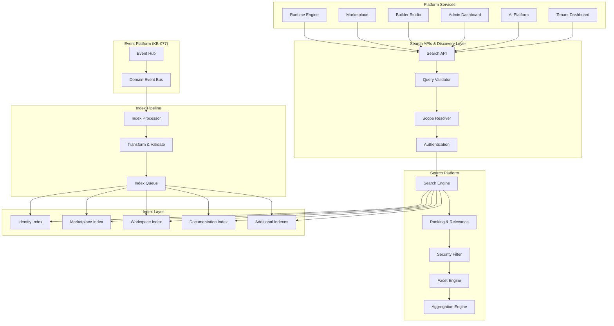
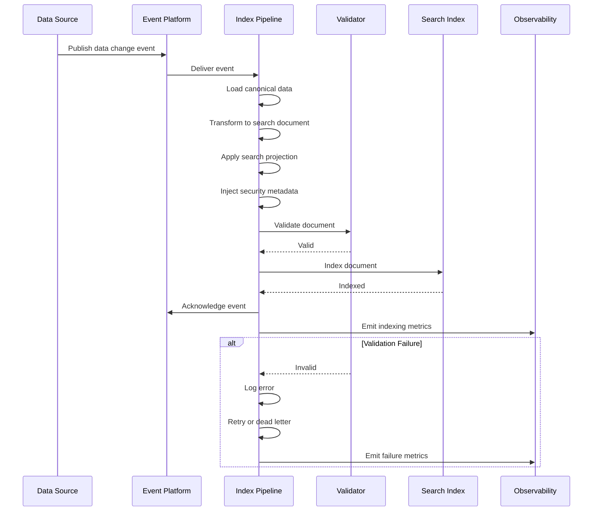
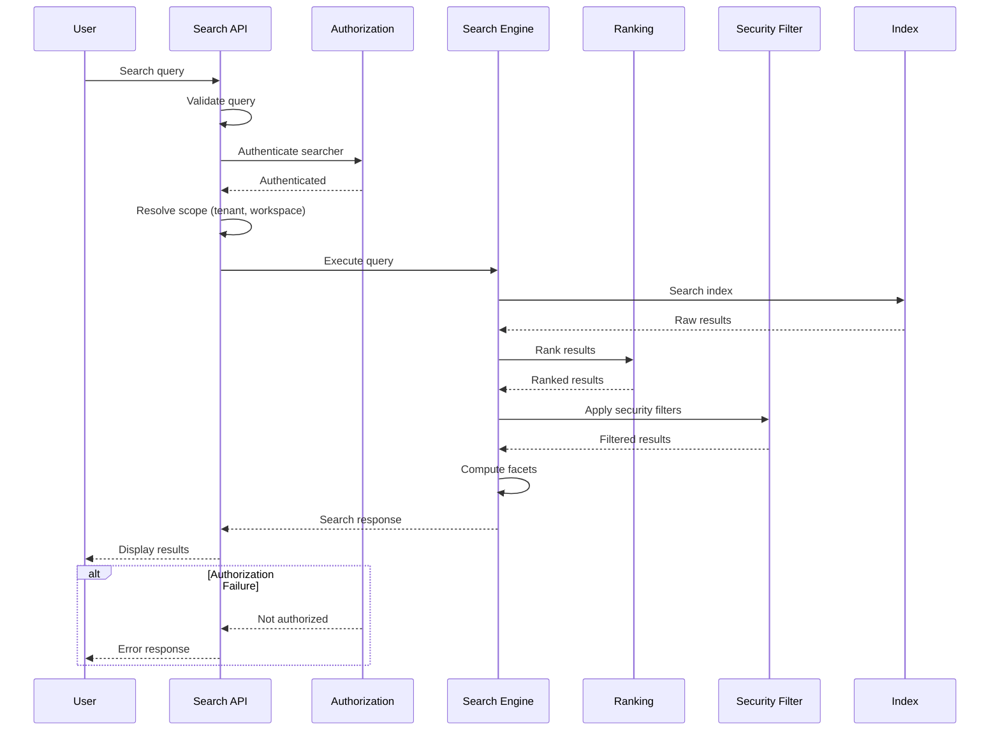
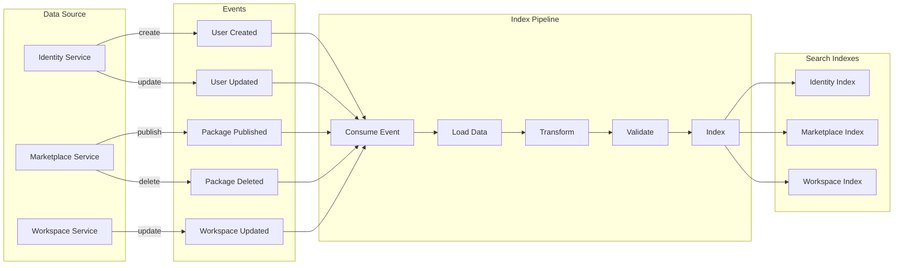
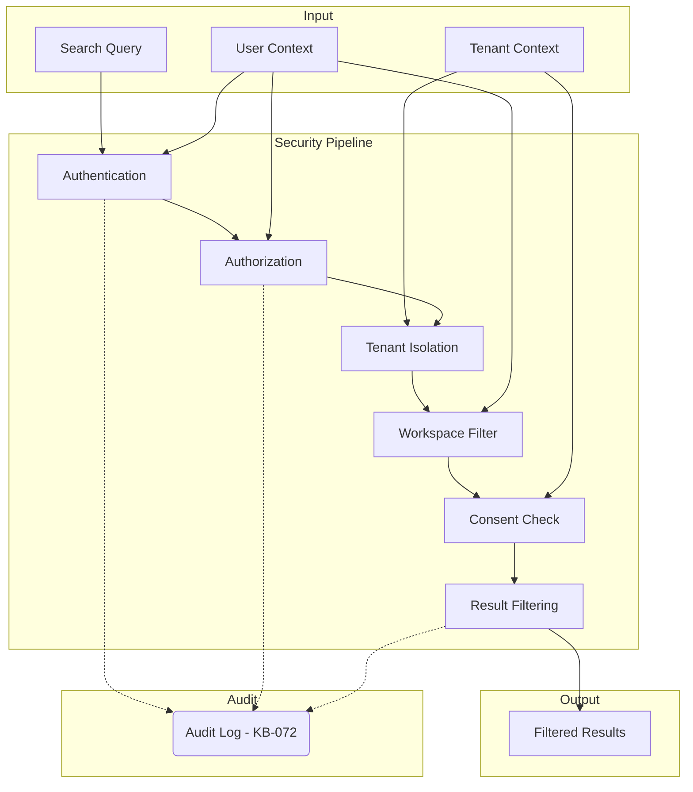
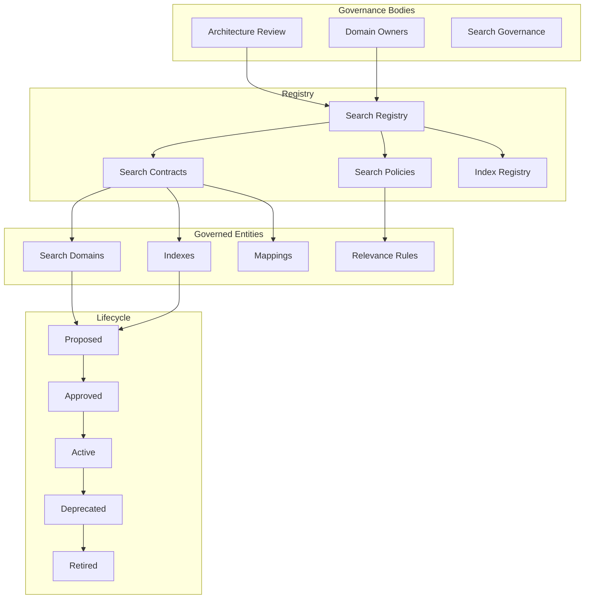
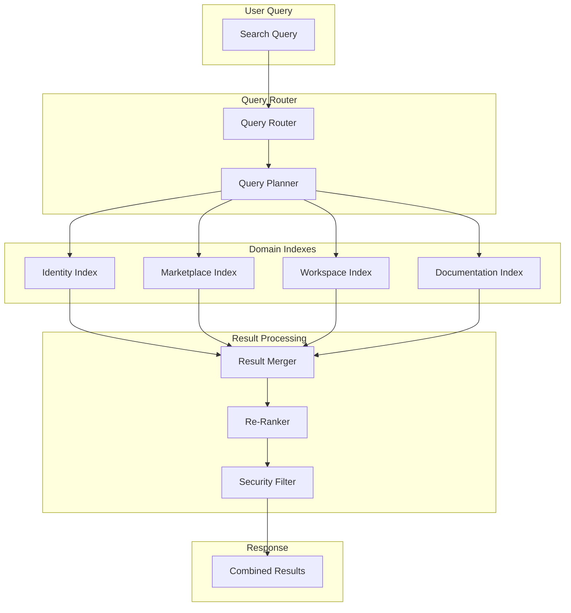
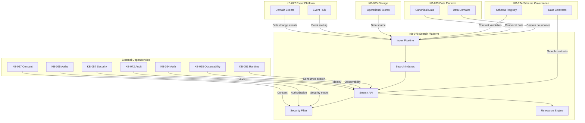
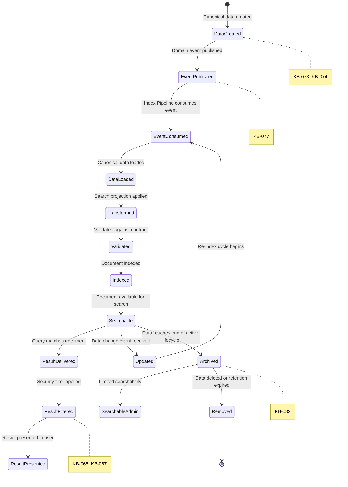

# Search & Indexing Architecture

**KB-078 — Search & Indexing Architecture Specification**

| Metadata | |
|----------|---|
| **KB ID** | KB-078 |
| **Title** | Search & Indexing Architecture |
| **Version** | 0.1.0 |
| **Status** | Draft |
| **Owner** | Architecture Team |
| **Suite** | Data Platform Architecture |
| **Dependencies** | KB-073 Data Platform Architecture, KB-074 Data Modeling & Schema Governance, KB-075 Storage Architecture, KB-076 Data Access Layer Architecture, KB-077 Event & Messaging Architecture |
| **Related Documents** | KB-051 Runtime Architecture Overview, KB-057 Runtime Security Architecture, KB-058 Runtime Observability & Diagnostics Architecture, KB-064 Authentication Architecture, KB-065 Authorization & RBAC Architecture, KB-067 Consent & Privacy Architecture, KB-072 Audit, Compliance & Identity Governance Architecture, KB-079 Caching Architecture (planned), KB-080 File & Object Storage Architecture (planned) |
| **Review Status** | Pending |
| **Last Updated** | 2026-07-11 |

---

### Revision History

| Version | Date | Author | Change |
|---------|------|--------|--------|
| 0.1.0 | 2026-07-11 | AI Architecture Agent | Initial draft |

---

## 1. Executive Summary

### 1.1 Purpose

This document defines the Search & Indexing Architecture for the DUKADESK Platform. The Search Platform is the canonical discovery layer — the single architectural foundation for indexing, searching, ranking, filtering, and discovering every searchable resource across the entire DUKADESK ecosystem.

Search is a first-class platform capability, not a feature implemented independently by applications. Every searchable resource — identities, organizations, tenants, applications, marketplace assets, builder artifacts, workflows, forms, data records, media, documentation, AI knowledge, and runtime content — participates in a unified, governed search architecture.

Search is a derived capability, never a system of record. Indexes are projections generated from authoritative data through the Event Platform (KB-077). Canonical data remains owned by its respective domain. No platform service may treat search indexes as the authoritative source of truth. This guarantees consistency, traceability, and long-term architectural integrity.

This document defines architecture only. It is search-engine-independent, cloud-provider-independent, and implementation-independent.

### 1.2 Scope

**In scope:**

- Platform Search: Cross-domain search across all platform resources
- Identity Search: Users, groups, roles, service accounts, identity metadata
- Organization Search: Organizations, departments, teams, organization metadata
- Tenant Search: Tenants, tenant configuration, tenant metadata
- Workspace Search: Workspaces, workspace content, workspace assets
- Application Search: Applications, application metadata, application components
- Marketplace Search: Packages, modules, templates, themes, extensions
- Builder Search: Builder artifacts, projects, modules, component definitions
- Workflow Search: Workflows, workflow steps, workflow templates
- Form Search: Forms, form fields, form templates, form data
- Runtime Search: Runtime content, session data, user-generated content
- Documentation Search: Knowledge base articles, documentation assets
- AI Knowledge Search: AI knowledge sources, AI knowledge artifacts, vector embeddings (architectural)
- Asset Search: Images, files, media, binary assets
- Media Metadata Search: Media titles, descriptions, tags, metadata
- Configuration Search: Platform configuration, tenant configuration, feature flags
- Administrative Search: Audit logs, system logs, operational data

**Out of scope:**
- Implementation details of specific search engines (Elasticsearch, Meilisearch, Algolia, etc.)
- Specific indexing technologies or indexing strategies
- Query language specifications or query DSL design
- UI-level search components or search interface design
- Real-time search streaming or search websocket protocols
- Full-text analysis, tokenization, or stemming implementations

---

## 2. Architectural Principles

### 2.1 Search Is Derived

Search indexes are derived representations of canonical data. Indexes never become the source of truth for any data domain. The authoritative source for any piece of data is its owning domain's operational store (KB-073, KB-075). Indexes are disposable representations that can be rebuilt from canonical data at any time.

### 2.2 Canonical Data Remains Authoritative

Each data domain retains full ownership of its authoritative data. Search indexes are read-only projections that reflect the state of canonical data at the time of indexing. Any update to canonical data is propagated to search indexes through the Event Platform, but the canonical store remains the source of truth.

### 2.3 Search by Contract

Every searchable domain defines a search contract — a formal, versioned specification of which data fields are indexed and made searchable. Search contracts follow the contract governance model established in KB-074. Services do not expose raw data stores to search; they expose search projections defined by their search contracts.

### 2.4 Security-Aware Search

Every search operation enforces authorization. Search results are filtered based on the searcher's identity, roles, permissions, tenant context, workspace memberships, and consent status. No search result is returned without authorization filtering. Security-aware search ensures that search cannot bypass the authorization model (KB-065).

### 2.5 Tenant-Isolated Search

Search indexes are tenant-aware. Every indexed document carries its tenant context. Search queries respect tenant boundaries — a user searching within Tenant A cannot discover documents belonging to Tenant B. Cross-tenant search requires explicit authorization and is audited.

### 2.6 Near Real-Time Indexing

Index updates are propagated near-real-time through the Event Platform. The maximum acceptable latency between a canonical data change and its appearance in search results is defined per search domain. Critical domains require sub-second indexing latency. Non-critical domains may tolerate higher latency.

### 2.7 Observable Search

Every search operation is observable — query execution, result counts, latency, errors, and usage patterns are visible through platform observability (KB-058). Index health, index freshness, and indexing pipeline health are continuously monitored.

### 2.8 Search Independence

Search is an independent platform capability with its own lifecycle, scaling, and operational characteristics. Search indexes are managed independently from operational stores. Search infrastructure scales independently from application infrastructure. Search failures do not affect operational data availability.

### 2.9 Extensible Search Domains

New search domains can be added without modifying the Search Platform. Each domain implements its own search contract, indexing pipeline, and search projection. The Search Platform provides the infrastructure — indexing, storage, query, ranking, security filtering — while domains provide the data and search semantics.

### 2.10 Relevance Through Governance

Search relevance is governed, not accidental. Relevance rules — ranking, scoring, boosting, freshness weight — are defined by domain owners and governed through the search registry. Relevance is not determined by implementation details of the search engine. Relevance governance ensures consistent, predictable search quality across all domains.

---

## 3. Canonical Definitions

### 3.1 Search Index

A structured, optimized data store that enables fast retrieval of documents by content and metadata. Search indexes are derived from canonical data and are disposable — they can be rebuilt from authoritative sources at any time. Indexes are the fundamental unit of search storage.

### 3.2 Index

The collection of indexed documents for a specific search domain or sub-domain. An index contains all searchable documents for its domain. Multiple indexes may exist within the Search Platform. Indexes are tenant-aware — a single logical index may be physically partitioned by tenant.

### 3.3 Document

The atomic unit of search. A document is a structured representation of a searchable resource — a user, an application, a marketplace package, a knowledge base article. Documents contain indexed fields (searchable content) and stored fields (returned in results). Documents are versioned and carry their tenant context.

### 3.4 Search Domain

A logical grouping of searchable resources that share the same search contract, indexing pipeline, and search semantics. Each search domain corresponds to a data domain (KB-073). Examples: identity search domain, marketplace search domain, workspace search domain.

### 3.5 Search Projection

The subset of canonical data that is included in a search document. Search projections are defined by search contracts. Projections exclude sensitive fields, internal identifiers, and data not relevant to search. Search projections are transformed to optimize for search, not for operational access.

### 3.6 Index Pipeline

The end-to-end process of transforming canonical data into searchable documents. The index pipeline includes event consumption, data transformation, document construction, validation, indexing, and acknowledgment. The pipeline is event-driven (KB-077).

### 3.7 Index Event

An event that triggers an indexing operation. Index events are produced by the Event Platform when canonical data changes. Index events carry the changed data and metadata required for indexing. Index events are consumed by the index pipeline.

### 3.8 Search Query

A structured request to the Search Platform that specifies search terms, filters, facets, sorting, pagination, and scope. Queries are validated before execution. Queries carry authentication and authorization context.

### 3.9 Search Result

A collection of documents that match a search query, ranked by relevance and filtered by authorization. Results include document data, relevance score, highlighted matches, and metadata (total count, pagination, facets).

### 3.10 Search Metadata

Data about search documents beyond their indexed content — document version, last indexed timestamp, tenant context, access control metadata, document lifecycle state. Metadata is used for security filtering, governance, and observability.

### 3.11 Ranking

The process of ordering search results by relevance. Ranking is determined by a combination of relevance scoring, freshness, popularity, and governance rules. Ranking rules are defined per search domain.

### 3.12 Relevance

A measure of how well a search result matches the user's search intent. Relevance is determined by multiple factors — term matching, field weighting, recency, popularity, user context, and domain-specific governance rules.

### 3.13 Facet

A categorical value extracted from indexed documents that can be used to filter or refine search results. Facets enable faceted navigation — users can narrow results by category, status, type, date range, or any indexed facet.

### 3.14 Filter

A query constraint that narrows search results to documents matching specific criteria. Filters are applied before or after relevance ranking. Filters may be authorization filters (tenant, workspace, role) or user filters (category, status, date).

### 3.15 Search Scope

The boundary within which a search query operates. Scope may be platform-wide, tenant-specific, workspace-specific, or domain-specific. Scope is determined by the query context and the searcher's authorization.

### 3.16 Search Contract

A formal, versioned agreement between a search domain owner and the Search Platform. The contract defines which fields are indexed, how they are mapped, which are searchable, which are filterable, which are sortable, and which are returned in results. Search contracts follow the contract model of KB-074.

---

## 4. Search Platform Architecture

### 4.1 Logical Architecture

The Search Platform follows a layered architecture with clear separation of concerns:

```
                    +-----------------------+
                    |   Platform Services   |
                    | (Runtime, Marketplace,|
                    |  Builder, Admin, AI)  |
                    +----------+------------+
                               |
                    +----------v------------+
                    |   Search APIs &        |
                    |   Discovery Layer      |
                    | (Query, Facet, Scope)  |
                    +----------+------------+
                               |
                    +----------v------------+
                    |   Search Platform      |
                    | (Ranking, Filtering,   |
                    |  Security, Relevance)  |
                    +----------+------------+
                               |
                    +----------v------------+
                    |   Index Layer          |
                    | (Indexes, Documents,   |
                    |  Mappings, Analysis)   |
                    +----------+------------+
                               |
                    +----------v------------+
                    |   Index Pipeline       |
                    | (Transform, Validate,  |
                    |  Index, Ack)           |
                    +----------+------------+
                               |
                    +----------v------------+
                    |   Event Platform       |
                    |   (KB-077)             |
                    +-----------------------+
```

### 4.2 Search APIs & Discovery Layer

The outermost layer exposes search capabilities to platform services through the Search API. This layer handles query validation, scope resolution, authentication, and response formatting.

**Responsibilities:**
- Receive and validate search queries
- Resolve search scope (platform, tenant, workspace, domain)
- Authenticate the searcher
- Route queries to the Search Platform
- Format and return search results

### 4.3 Search Platform Layer

The core search engine layer. This layer handles query execution, ranking, relevance scoring, security filtering, faceting, and aggregation.

**Responsibilities:**
- Execute search queries against indexes
- Apply relevance ranking and scoring
- Apply security filtering (authorization, tenant isolation)
- Compute facets and aggregations
- Return ranked, filtered results

### 4.4 Index Layer

The index storage and management layer. This layer manages index mappings, document schemas, index lifecycle, and index operations.

**Responsibilities:**
- Manage index mappings (field types, analyzers, multi-fields)
- Index and update documents
- Manage index lifecycle (create, rollover, optimize, delete)
- Manage index aliases for zero-downtime reindexing
- Manage index templates for consistent mappings

### 4.5 Index Pipeline Layer

The event-driven layer that transforms canonical data changes into indexed documents. The Index Pipeline consumes events from the Event Platform (KB-077), transforms canonical data into search projections, validates the projections, indexes them, and acknowledges successful indexing.

**Responsibilities:**
- Consume index events from the Event Platform
- Load canonical data from operational stores (when needed for enrichment)
- Transform canonical data into search projections
- Construct search documents
- Validate documents against search contracts
- Index documents into the Search Platform
- Acknowledge successful indexing
- Handle indexing failures and retries

### 4.6 Event Platform Integration

The Search Platform is fully event-driven. All indexing operations are triggered by events produced by data domains. The Event Platform (KB-077) provides the reliable, ordered, replayable event stream that feeds the Index Pipeline.

---

## 5. Search Domains

### 5.1 Domain Model

Each search domain maps to a data domain (KB-073). The search domain defines the search contract, indexing pipeline, and search semantics for all resources within that domain.

| Search Domain | Data Domain | Indexed Resources | Owner |
|---------------|-------------|-------------------|-------|
| Identity | Identity Platform | Users, groups, roles, service accounts | Identity Team |
| Organization | Identity Platform | Organizations, departments, teams | Identity Team |
| Tenant | Identity Platform | Tenants, tenant config | Identity Team |
| Workspace | Platform | Workspaces, workspace content | Platform Team |
| Application | Platform | Applications, app metadata | Platform Team |
| Marketplace | Marketplace | Packages, modules, templates, themes, extensions | Marketplace Team |
| Builder | Builder | Builder artifacts, projects, modules | Builder Team |
| Workflow | Platform | Workflows, workflow steps, templates | Platform Team |
| Form | Platform | Forms, form fields, form templates | Platform Team |
| Runtime | Runtime | Runtime content, session data | Runtime Team |
| Documentation | Knowledge Base | Articles, documentation assets | Knowledge Team |
| AI Knowledge | AI Platform | Knowledge sources, artifacts, embeddings | AI Team |
| Asset | Platform | Images, files, media | Platform Team |
| Configuration | Platform | Platform config, feature flags | Platform Team |
| Administrative | Platform | Audit logs, system logs | Platform Team |

### 5.2 Identity Search Domain

Indexes users, groups, roles, and service accounts. Supports search by name, email, role, group membership, status. Tenant-isolated — users within a tenant can only search users in the same tenant.

### 5.3 Organization Search Domain

Indexes organizations, departments, teams. Supports search by name, hierarchy, membership, status. Organization-aware — results are filtered by organization membership.

### 5.4 Tenant Search Domain

Indexes tenants and tenant configuration. Administrative search domain — only platform administrators can search tenants. Supports search by name, identifier, status, tier, region.

### 5.5 Workspace Search Domain

Indexes workspaces and workspace content. Supports search by workspace name, description, content, members. Workspace-isolated — results are filtered by workspace membership.

### 5.6 Application Search Domain

Indexes applications and application metadata. Supports search by name, description, category, status, version. Tenant-isolated — results are filtered by tenant.

### 5.7 Marketplace Search Domain

Indexes marketplace assets — packages, modules, templates, themes, extensions. Supports full-text search, faceted search by category/type/author, filtered search by compatibility/version. This is the most complex search domain with multiple sub-domains.

### 5.8 Builder Search Domain

Indexes builder artifacts — projects, modules, component definitions, metadata. Supports search by name, type, status, ownership. Tenant-isolated with workspace awareness.

### 5.9 Documentation Search Domain

Indexes knowledge base articles and documentation assets. Supports full-text search with content analysis, hierarchical search by document structure, filtered search by category/tags.

### 5.10 AI Knowledge Search Domain

Indexes AI knowledge sources and artifacts. Architecturally supports future vector search and semantic search capabilities. Currently indexes metadata and content for keyword-based discovery.

---

## 6. Index Lifecycle

### 6.1 Lifecycle Stages

Every indexed document follows a standard lifecycle:

```
Create Data → Publish Event → Transform → Validate → Index → Search → Update → Archive → Remove
```

### 6.2 Create Data

Canonical data is created in the operational store by the owning domain. The data conforms to the domain's data contract (KB-073, KB-074).

### 6.3 Publish Event

The owning domain publishes a domain event indicating the data change. The event type depends on the operation:
- `Created` event for new data
- `Updated` event for modified data
- `Deleted` event for removed data

Events are published through the Event Platform (KB-077).

### 6.4 Transform

The Index Pipeline consumes the event and transforms the canonical data into a search document. Transformation includes:
- Field mapping (canonical fields to search fields)
- Data transformation (normalization, enrichment, aggregation)
- Security metadata injection (tenant context, access control metadata)
- Search projection construction

### 6.5 Validate

The search document is validated against the search contract before indexing. Validation checks:
- Required fields are present
- Field types match contract definitions
- Field values are within allowed ranges/enums
- Security metadata is complete

### 6.6 Index

The validated document is indexed into the Search Platform. Indexing makes the document searchable within the target index. Indexing acknowledges the event, enabling the Event Platform to mark the event as processed.

### 6.7 Search

The indexed document is discoverable through search queries. Search results are ranked, filtered by authorization, and presented to users. Documents remain searchable until updated, archived, or removed.

### 6.8 Update

When canonical data changes, a new event triggers an update cycle. The Index Pipeline consumes the update event, transforms the new data, validates the new document, and reindexes it. The search document is replaced with the updated version.

### 6.9 Archive

When canonical data reaches the end of its active lifecycle but must be retained for compliance, the search document is archived. Archived documents are moved to an archive index with reduced search visibility. They are not returned in standard search results but can be searched by administrators.

### 6.10 Remove

When canonical data is permanently deleted or reaches the end of its retention, the search document is removed from the index. Removal is triggered by a `Deleted` event. The document is permanently removed from all search indexes.

---

## 7. Search Architecture

### 7.1 Search Types

The Search Platform supports multiple search types, each optimized for different use cases:

#### 7.1.1 Full-Text Search

The primary search type. Full-text search matches query terms against indexed text fields. Supports:
- Term matching (exact and fuzzy)
- Phrase matching (exact phrase search)
- Prefix matching (autocomplete, typeahead)
- Wildcard matching
- Boolean operators (AND, OR, NOT)
- Proximity searching

#### 7.1.2 Structured Search

Field-specific search with exact matching. Structured search is used for filtering, faceting, and field-specific queries. Supports:
- Field equality matching
- Range queries (numeric, date)
- Status filtering
- Category matching

#### 7.1.3 Semantic Search (Architectural)

Defined at the architectural level for future implementation. Semantic search uses vector embeddings to understand search intent beyond keyword matching. The architectural foundation (event-driven indexing, search contracts, tenant isolation) supports semantic search without modification.

#### 7.1.4 Metadata Search

Search against document metadata fields — author, creation date, modification date, version, status. Metadata search is a form of structured search with specialized handling for sortable and filterable metadata fields.

#### 7.1.5 Faceted Search

Search with dynamic category aggregation. Faceted search returns both matching documents and aggregated facet counts. Users can navigate search results by selecting facet values to narrow results.

**Facet types:**
- Value facets (category, status, type)
- Range facets (price, date, rating)
- Hierarchical facets (category tree)
- Aggregated facets (counts, averages)

#### 7.1.6 Filtered Search

Search constrained by pre-selected filters. Filters narrow the search scope before query execution. Common filters:
- Tenant filter (scope to tenant)
- Workspace filter (scope to workspace)
- Status filter (active, archived, deleted)
- Type filter (filter by resource type)
- Date range filter

#### 7.1.7 Cross-Domain Search

Search that spans multiple search domains. Cross-domain search queries multiple indexes and merges results. Results are grouped by domain, with domain-specific ranking applied. Cross-domain search is the foundation for platform-wide search.

#### 7.1.8 Federated Search (Future)

Search that spans the DUKADESK platform and external systems. Federated search would query external search indexes and merge results with platform results. Defined for future implementation.

### 7.2 Query Processing

Every search query follows a standard processing pipeline:

1. **Parse**: Query string is parsed into structured query terms
2. **Validate**: Query is validated against schema and security rules
3. **Scope Resolution**: Search scope is determined (platform, tenant, workspace, domain)
4. **Authorization**: Searcher's identity and permissions are resolved
5. **Index Selection**: Target indexes are selected based on scope and query
6. **Filter Application**: Authorization filters and user filters are applied
7. **Query Execution**: Search is executed against selected indexes
8. **Ranking**: Results are ranked by relevance
9. **Facet Computation**: Facet aggregations are computed
10. **Result Filtering**: Results are filtered by authorization policies
11. **Response Construction**: Results are formatted and returned

### 7.3 Result Structure

Search results follow a standard structure:

```json
{
  "query": {
    "terms": "search terms",
    "filters": { "field": "value" },
    "scope": "tenant",
    "page": 1,
    "pageSize": 20
  },
  "results": [
    {
      "id": "document-id",
      "domain": "marketplace",
      "type": "package",
      "title": "Package Name",
      "description": "Package description with highlighted terms",
      "score": 0.95,
      "highlights": {
        "title": ["<em>Package</em> Name"],
        "description": ["Description with <em>highlighted</em> terms"]
      },
      "metadata": {
        "tenantId": "tenant-uuid",
        "version": "1.0.0",
        "lastIndexed": "2026-07-11T12:00:00Z"
      }
    }
  ],
  "facets": {
    "category": [
      { "value": "templates", "count": 45 },
      { "value": "themes", "count": 23 }
    ],
    "status": [
      { "value": "published", "count": 120 },
      { "value": "draft", "count": 34 }
    ]
  },
  "total": 154,
  "page": 1,
  "pageSize": 20,
  "totalPages": 8
}
```

---

## 8. Indexing Architecture

### 8.1 Index Ownership

Every index has a designated owner. The index owner is the search domain owner for that domain. The owner defines the search contract, manages the index mapping, and governs index evolution.

**Owner responsibilities:**
- Define and maintain the search contract
- Manage index mappings and field definitions
- Govern index schema evolution
- Coordinate index rebuilds
- Monitor index health and freshness

### 8.2 Index Contracts

A search contract defines the formal agreement between the domain owner and the Search Platform. Contracts are registered in the search registry and versioned.

**Contract contents:**
- Domain identifier
- Index name and alias
- Document schema (fields, types, mapping)
- Searchable fields (with analyzers)
- Filterable fields
- Sortable fields
- Facet definitions
- Security metadata fields
- Tenant isolation configuration

### 8.3 Projection Rules

Search projections define which canonical data fields are included in the search document. Projection rules are specified in the search contract.

**Projection rules:**
- Include: Fields explicitly included in the search document
- Exclude: Fields explicitly excluded (sensitive data, internal fields)
- Transform: Fields that require transformation before indexing
- Enrich: Fields that are enriched with data from other sources
- Compute: Fields that are computed from multiple canonical fields

### 8.4 Update Strategy

Index updates follow an event-driven strategy. Updates are triggered by domain events (KB-077).

**Update types:**
- Full reindex: Rebuild the entire index from canonical data. Used for schema changes, index corruption recovery, or backfilling.
- Incremental update: Update individual documents based on change events. Used for routine data changes.
- Batch update: Update multiple documents in bulk. Used for bulk operations or data migration.
- Partial update: Update specific fields within a document without reindexing the entire document.

### 8.5 Event-Driven Indexing

All indexing operations are triggered by events from the Event Platform (KB-077). The Index Pipeline consumes events and performs the appropriate indexing operation.

**Event types:**
- `Created` to Index new document
- `Updated` to Update existing document
- `Deleted` to Remove document from index
- `BulkCreated` to Index multiple documents
- `BulkUpdated` to Update multiple documents
- `BulkDeleted` to Remove multiple documents
- `ReindexRequested` to Trigger full reindex

### 8.6 Version Compatibility

Search documents are versioned. Document versions match the canonical data version at the time of indexing. Version compatibility ensures that search results reflect the correct version of canonical data.

**Version rules:**
- Each document carries its canonical data version
- Index updates are version-checked (stale updates are rejected)
- Version conflicts trigger a re-read from canonical store
- Version history is retained for audit (KB-072)

### 8.7 Index Rebuild Strategy

Index rebuilds are a standard operational procedure, not a failure recovery mechanism. Rebuilds are performed:
- When the search contract changes (schema evolution)
- When the index is corrupted or inconsistent
- When backfilling a new search domain
- When recovering from data loss
- Periodically for index optimization

**Rebuild process:**
1. Create new index with updated mapping
2. Load all canonical data from the operational store
3. Transform and index all documents
4. Validate index completeness and consistency
5. Atomically swap index alias to new index
6. Delete old index after validation

---

## 9. Search Security

### 9.1 Security Model

Search security is a multi-layer model that ensures no unauthorized data is returned in search results:

```
User Query
    |
    v
Authentication (who is searching?)
    |
    v
Tenant Isolation (which tenant context?)
    |
    v
Authorization (what can they see?)
    |
    v
Consent Check (what is consent-compliant?)
    |
    v
Result Filtering (filter results by policies)
    |
    v
Filtered Results
```

### 9.2 Authorization Filtering

Every search result is filtered by the searcher's authorization. Authorization filtering is applied at query time, not at index time. This ensures that authorization changes are immediately reflected in search results.

**Authorization filters:**
- Tenant filter: Only documents belonging to the searcher's tenant are returned
- Workspace filter: Only documents belonging to workspaces the searcher can access
- Role filter: Only documents the searcher's role permits viewing
- Permission filter: Only documents matching explicit permission grants
- Attribute filter: Only documents matching the searcher's attributes

### 9.3 Tenant Isolation

Tenant isolation is enforced at the index and query levels. Documents are tagged with their tenant context at index time. Queries are scoped to the searcher's tenant context.

**Isolation mechanisms:**
- Document-level tenant tagging (tenant ID stored in document metadata)
- Index-level partitioning (tenant-specific index partitions or aliases)
- Query-level tenant filtering (tenant filter applied to every query)
- Cross-tenant authorization (explicit authorization required for cross-tenant search)

### 9.4 Workspace Visibility

Workspace-scoped documents are only visible to workspace members. Workspace visibility is enforced at query time.

**Workspace visibility rules:**
- Documents are tagged with workspace context at index time
- Query carries the searcher's workspace memberships
- Results are filtered to workspaces the searcher belongs to
- Workspace visibility respects workspace roles (viewer, editor, admin)

### 9.5 Organization Boundaries

Organization-scoped documents are only visible to organization members. Organization boundaries are enforced at query time.

**Organization boundary rules:**
- Documents are tagged with organization context at index time
- Query carries the searcher's organization memberships
- Results are filtered to organizations the searcher belongs to
- Cross-organization search requires explicit authorization

### 9.6 Consent-Aware Search

Search respects consent and privacy policies (KB-067). Documents that contain personal data are only searchable by authorized users, and only if the data subject has consented to the search use case.

**Consent-aware search rules:**
- Consent status is stored in document metadata
- Search queries check consent status before returning documents
- Users without consent cannot discover documents containing personal data
- Consent revocation is propagated to search indexes through the Event Platform

### 9.7 Result Filtering

Results are filtered after ranking but before response construction. Filtering is the final security gate.

**Filtering order:**
1. Tenant filter
2. Workspace filter
3. Organization filter
4. Role/Permission filter
5. Consent filter
6. Attribute filter

---

## 10. Search Relevance

### 10.1 Relevance Model

Search relevance is determined by a combination of factors, weighted according to search domain governance rules. Relevance is not left to the search engine's default behavior — it is explicitly governed.

**Relevance factors:**
- Term matching (how well query terms match document content)
- Field weighting (which fields are more important — title > description > body)
- Freshness (how recent the document is)
- Popularity (how popular the resource is — downloads, ratings, usage)
- Authority (how authoritative the source is — official vs community)
- Personalization (user-specific relevance signals — history, preferences)
- Governance rules (domain-specific relevance overrides)

### 10.2 Ranking

Ranking is the process of ordering search results by combined relevance score. Ranking rules are defined per search domain.

**Ranking dimensions:**
- Primary ranking: Term match relevance (content matching)
- Secondary ranking: Freshness, popularity, authority
- Tertiary ranking: Personalization signals
- Governance overrides: Domain-specific boosts and penalties

### 10.3 Scoring

Scoring assigns a numeric relevance score to each document. The score determines the document's position in search results.

**Scoring factors:**
- TF-IDF or BM25 (term frequency-inverse document frequency)
- Field boost multipliers (title field boosted higher than body)
- Recency decay function (newer documents score higher)
- Popularity score (downloads, ratings, usage metrics)
- Authority score (source reputation)
- Personalization score (user-specific relevance)

### 10.4 Boosting (Conceptual)

Boosting adjusts relevance scores based on specific criteria. Boosts are defined as governance rules, not implementation details.

**Boost types:**
- Field boost: Certain fields count more in relevance scoring
- Recency boost: Newer documents receive a relevance boost
- Popularity boost: Popular documents receive a relevance boost
- Authority boost: Authoritative sources receive a relevance boost
- Personalization boost: User-relevant documents receive a boost

### 10.5 Freshness

Freshness measures how recent a document is. Freshness is a relevance factor that decays over time.

**Freshness model:**
- Documents indexed within the last hour receive maximum freshness score
- Freshness decays linearly over a configurable window (default: 30 days)
- After the freshness window, documents receive base relevance only
- Freshness weight is configurable per search domain

### 10.6 Popularity

Popularity measures how popular a resource is within the platform. Popularity is a relevance factor that reflects community endorsement.

**Popularity signals:**
- Download count (for marketplace assets)
- Rating score (user ratings)
- Usage count (how many tenants/workspaces use the resource)
- Engagement metrics (views, bookmarks, shares)

### 10.7 Governance Rules

Governance rules are domain-specific relevance overrides defined by the domain owner. Governance rules ensure that business requirements influence search rankings, not just algorithmic relevance.

**Governance rule types:**
- Boost rules: Explicit boosts for specific document types or attributes
- Penalty rules: Explicit penalties for specific document types or attributes
- Pinned results: Specific documents that always appear at the top for certain queries
- Exclusion rules: Documents excluded from certain query contexts

---

## 11. Search Governance

### 11.1 Search Registry

The search registry is the central repository of search domain definitions, search contracts, and search policies. The registry governs all search domains and ensures consistency across the platform.

**Registry contents:**
- Search domain definitions
- Search contracts (with versions)
- Index mappings and templates
- Relevance and ranking rules
- Search policies (authorization, retention, privacy)
- Domain ownership information

### 11.2 Domain Ownership

Each search domain has a designated owner. The owner is responsible for the search contract, indexing pipeline, index health, and search quality for that domain.

**Owner responsibilities:**
- Define and maintain the search contract
- Govern index schema and mapping
- Define relevance and ranking rules
- Monitor index health and freshness
- Coordinate with consumers on search changes
- Approve search contract changes

### 11.3 Search Policies

Search policies govern how search operates within the platform. Policies are defined per search domain and enforced by the Search Platform.

**Policy types:**
- Indexing policy: How and when documents are indexed
- Retention policy: How long search documents are retained
- Authorization policy: Who can search what
- Privacy policy: How consent and data minimization apply
- Relevance policy: How relevance and ranking are determined
- Throttling policy: Search rate limits and quotas

### 11.4 Index Approval

New indexes and index schema changes require governance approval. The approval process ensures that new indexes meet platform standards.

**Approval process:**
1. Domain owner proposes new index or schema change
2. Search governance reviews the proposal
3. Impact assessment (existing consumers, migration requirements)
4. Approval or rejection with feedback
5. Implementation and rollout

### 11.5 Schema Evolution

Index schemas evolve over time. Schema evolution follows the compatibility rules established in KB-074.

**Evolution rules:**
- New fields are additive (backward compatible)
- Field type changes require a new index version
- Field removal is a breaking change (requires coordination)
- Index reindex is required for non-additive changes
- Schema versioning follows semantic versioning

### 11.6 Versioning

Search contracts and index schemas are versioned using semantic versioning. Versioning enables controlled evolution without breaking existing consumers.

**Versioning rules:**
- Major version: Breaking changes (field removal, type changes)
- Minor version: Backward-compatible additions (new fields)
- Patch version: Non-functional changes (analyzer updates, mapping optimizations)
- Consumers declare minimum supported version
- Multiple index versions can coexist during migration

---

## 12. Platform Responsibilities

### 12.1 Runtime Responsibilities

The Runtime Engine consumes search results to enable in-app discovery. Runtime is a search consumer, not a search provider.

**Runtime search responsibilities:**
- Present search results to users within runtime sessions
- Enforce search authorization at the UI level
- Pass tenant and user context with search queries
- Cache search results for performance (guided by KB-079)
- Handle search errors gracefully

**Runtime must NOT:**
- Maintain its own search indexes
- Bypass the Search Platform for data discovery
- Cache search results beyond their freshness window
- Expose search queries that bypass authorization filtering

### 12.2 Backend Responsibilities

Platform backend services provide the canonical data that feeds the Search Platform. Backend services are search data providers.

**Backend search responsibilities:**
- Publish domain events for data changes (KB-077)
- Provide canonical data for index rebuilds
- Define and maintain search contracts for their domains
- Ensure data quality and completeness
- Participate in index rebuild coordination

**Backend must NOT:**
- Write directly to search indexes
- Treat search as the source of truth for any data
- Expose search functionality through APIs (search goes through the Search Platform)
- Bypass the Event Platform for index updates

### 12.3 Builder Responsibilities

The Builder Studio provides metadata about builder artifacts that is indexed by the Search Platform. Builder is a search data provider.

**Builder search responsibilities:**
- Publish events when builder artifacts are created, updated, or deleted
- Provide search contract for builder artifacts
- Support index rebuilds by providing canonical data
- Enable search-driven navigation within the Builder Studio

**Builder must NOT:**
- Treat search indexes as the authoritative source for builder artifact data
- Implement search independently of the Search Platform
- Expose unsecured search for builder artifacts

### 12.4 Marketplace Responsibilities

The Marketplace provides metadata about marketplace assets that is indexed by the Search Platform. Marketplace is a complex search domain with high relevance requirements.

**Marketplace search responsibilities:**
- Publish events for all marketplace asset lifecycle changes
- Define and maintain the marketplace search contract
- Provide relevance signals (downloads, ratings, usage)
- Support faceted search for marketplace navigation
- Enable search-driven marketplace discovery

**Marketplace must NOT:**
- Maintain a separate search index for marketplace assets
- Bypass the Search Platform for marketplace search
- Modify relevance rules outside the governance framework

### 12.5 AI Platform Responsibilities

The AI Platform provides AI knowledge sources that are indexed by the Search Platform. AI Platform is an evolving search domain with future semantic search requirements.

**AI Platform search responsibilities:**
- Publish events for AI knowledge source changes
- Define the AI knowledge search contract
- Provide content for indexing (knowledge sources, embeddings metadata)
- Architect for future vector search integration

**AI Platform must NOT:**
- Implement its own search infrastructure
- Treat search indexes as the authoritative source for AI knowledge
- Bypass security filtering for AI knowledge search

---

## 13. Security

### 13.1 Search Authorization

Every search request is authorized before execution. Search authorization verifies the searcher's identity and permissions.

**Authorization checks:**
- Authentication: Is the searcher authenticated?
- Tenant access: Does the searcher have access to the target tenant?
- Search permission: Is the searcher authorized to perform search?
- Domain access: Is the searcher authorized to search in the target domain?
- Scope access: Is the searcher authorized to search in the target scope?

### 13.2 Query Validation

Search queries are validated before execution. Validation prevents injection attacks, overbroad queries, and resource exhaustion.

**Validation rules:**
- Maximum query length
- Maximum query complexity (nested queries, boolean depth)
- Allowed field references (only fields in the search contract)
- Allowed filter values (only valid enums and ranges)
- Rate limiting per user, per tenant, per API key

### 13.3 Tenant Isolation

Tenant isolation is a security requirement, not just a data organization concern. Isolation is enforced at multiple levels:
- Index-level: Tenant-specific index partitions or aliases
- Document-level: Tenant ID in every document
- Query-level: Tenant filter on every query
- Response-level: Tenant verification on every result

### 13.4 Sensitive Data Protection

Sensitive data is never indexed or is indexed in a protected manner. Protection is defined in the search contract.

**Protection mechanisms:**
- Exclusion: Sensitive fields are excluded from the search projection
- Tokenization: Sensitive values are tokenized before indexing
- Encryption: Sensitive fields are encrypted at the document level
- Access control: Sensitive fields are only returned to authorized searchers
- Redaction: Sensitive values are redacted in search results

### 13.5 Secure Indexes

Indexes are protected against unauthorized access. Security controls follow the runtime security architecture (KB-057).

**Index security controls:**
- Index-level access control (which services can read/write which indexes)
- Document-level security (which searchers can see which documents)
- Transport encryption (index data in transit)
- Storage encryption (index data at rest)
- Audit logging (all index operations are logged)

### 13.6 Search Auditing

Search operations are auditable for compliance and security (KB-072). Audit events are published for every search operation.

**Audited events:**
- Search query executed (searcher identity, query, scope, result count)
- Search authorization denied (searcher identity, query, reason)
- Index operation (index created, updated, deleted, rebuilt)
- Search policy violation (throttling exceeded, unauthorized domain access)

---

## 14. Privacy

### 14.1 Consent-Aware Search

Search respects user consent preferences (KB-067). Personal data is only searchable if the data subject has consented to the search use case.

**Consent-aware search rules:**
- Consent status is checked before returning personal data in search results
- Users without consent cannot discover personal data through search
- Consent revocation triggers immediate index removal of personal data
- Search results respect consent granularity (use case, purpose, duration)

### 14.2 Data Minimization

Only data necessary for search functionality is indexed. The principle of data minimization governs search projection design.

**Minimization rules:**
- Only fields defined in the search contract are indexed
- Sensitive fields are excluded unless explicitly required
- Full document content is not indexed — only search projections
- Indexed data is deleted when no longer needed for search

### 14.3 Hidden Attributes

Attributes that are not relevant to search or that could reveal sensitive information are hidden from search. Hidden attributes are excluded from the search projection.

**Hidden attribute types:**
- Internal identifiers (surrogate keys, internal references)
- Security credentials (tokens, hashes, secrets)
- Personal data not relevant to search
- Operational metadata (timestamps, audit fields)
- Internal configuration data

### 14.4 Index Privacy

Search indexes are privacy-protected. Indexes do not contain more data than necessary, and access to indexes is controlled.

**Index privacy controls:**
- Indexes contain only search projections, not full canonical data
- Index access is controlled by service authentication
- Index data is encrypted at rest
- Index backups are protected and access-controlled

### 14.5 Right to Removal

Data subjects have the right to have their personal data removed from search indexes. Removal is triggered by the data subject's request or by consent revocation.

**Removal process:**
1. Data subject requests removal or revokes consent
2. Data domain publishes deletion event
3. Index Pipeline consumes the event
4. Document is removed from all search indexes
5. Removal is confirmed and audited

### 14.6 Search Visibility Policies

Search visibility policies define who can discover whom through search. Visibility policies are privacy controls.

**Policy types:**
- Profile visibility: Who can discover a user's profile through search
- Content visibility: Who can discover user-generated content through search
- Contact visibility: Who can discover contact information through search
- Discovery visibility: Who can discover the user exists in the platform

---

## 15. Performance

### 15.1 Index Throughput

The Search Platform must support high-throughput indexing without impacting search performance. Indexing throughput is scaled independently from query throughput.

**Throughput requirements:**
- Support peak indexing throughput of thousands of documents per second
- Support batch indexing for bulk operations
- Isolate indexing resource usage from query resource usage
- Scale indexing capacity horizontally

### 15.2 Search Latency

Search queries must complete within strict latency targets. Latency is measured from query submission to result delivery.

**Latency targets:**
- p50: Under 50ms
- p95: Under 200ms
- p99: Under 500ms
- Timeout: Queries exceeding 5 seconds are terminated

### 15.3 Index Freshness

Index freshness measures the time between a canonical data change and its availability in search results. Freshness targets are defined per search domain.

**Freshness targets:**
- Critical domains: Under 1 second (marketplace, identity)
- Standard domains: Under 5 seconds (applications, builder)
- Non-critical domains: Under 30 seconds (documentation, analytics)
- Archive domains: Hours to days (audit archives)

### 15.4 Rebuild Performance

Index rebuilds must complete within acceptable timeframes. Rebuild performance is critical for schema changes and recovery.

**Rebuild performance targets:**
- Small indexes (under 100K documents): Under 5 minutes
- Medium indexes (100K-1M documents): Under 30 minutes
- Large indexes (1M-10M documents): Under 2 hours
- Very large indexes (10M+ documents): Under 8 hours

### 15.5 Query Optimization (Conceptual)

Query optimization is defined at the architectural level. Specific optimization strategies are implementation-dependent.

**Optimization approaches:**
- Index-level query routing (route queries to appropriate indexes)
- Query rewrite rules (optimize complex queries)
- Caching (cache frequent queries — KB-079)
- Result truncation (limit result set size)
- Facet pre-computation (pre-compute high-cardinality facets)

### 15.6 Horizontal Scaling

The Search Platform scales horizontally. Both indexing and query capacity scale by adding nodes.

**Scaling dimensions:**
- Index partitioning: Indexes are partitioned across nodes
- Query fan-out: Queries are fanned out to relevant partitions
- Replica scaling: Read replicas scale query capacity
- Write scaling: Indexing capacity scales with data volume

---

## 16. Observability

### 16.1 Search Observability

Search observability integrates with the platform observability infrastructure (KB-058). Every search operation and indexing operation emits metrics, traces, and logs.

### 16.2 Search Requests

Search request metrics provide visibility into search usage and performance.

**Search request metrics:**
- Queries per second (by domain, by tenant)
- Query latency (p50, p95, p99)
- Query result count (average, median, max)
- Query error rate (by error type)
- Query timeout rate
- Query rejection rate (throttling, authorization)

### 16.3 Query Latency

Query latency is measured at multiple stages to identify bottlenecks.

**Latency stages:**
- Query parse latency
- Authorization latency
- Index search latency
- Ranking latency
- Facet computation latency
- Response formatting latency

### 16.4 Index Health

Index health metrics provide visibility into index status and performance.

**Index health metrics:**
- Index size (document count, storage size)
- Index health status (green, yellow, red)
- Index replication status
- Index segment count (for optimization)
- Index refresh rate (near-real-time visibility)

### 16.5 Index Freshness

Index freshness metrics measure the time between data change and index availability.

**Freshness metrics:**
- Maximum lag (oldest unindexed event)
- Average lag (average indexing delay)
- P95 fresh (95th percentile freshness)
- Events queued (pending index events)
- Events failed (indexing failures)

### 16.6 Failed Index Operations

Indexing failures are tracked for operational response.

**Failure metrics:**
- Index failures per minute
- Failure reasons (schema validation, data error, connection error)
- Retry rate and retry success rate
- Dead letter queue depth (unprocessable events)

### 16.7 Relevance Metrics

Relevance metrics measure search quality and effectiveness.

**Relevance metrics:**
- Click-through rate (results clicked vs results returned)
- Zero-result rate (queries that returned no results)
- Abandonment rate (queries with no interaction)
- Facet usage rate (searches using facets)
- Result position distribution (which positions get clicks)

### 16.8 Search Usage

Usage metrics track how search is used across the platform.

**Usage metrics:**
- Active search users (daily, weekly, monthly)
- Searches per user
- Top search queries
- Top search domains
- Search conversion rate (search to action)

---

## 17. Failure Scenarios

### 17.1 Stale Index

**Scenario:** The search index is stale — documents are not reflecting recent changes because the Index Pipeline is behind or failed.

**Impact:** Users see outdated search results. Critical changes (e.g., deleted resources) may still appear in search.

**Mitigation:**
- Monitor index freshness metrics
- Alert on excessive indexing lag
- Implement automatic retry for failed indexing operations
- Support manual index refresh for critical domains

### 17.2 Missing Documents

**Scenario:** Documents that should exist in the index are missing. The Index Pipeline may have failed to index them, or an index rebuild may have missed them.

**Impact:** Search results are incomplete. Users cannot find resources that exist.

**Mitigation:**
- Index validation (compare document counts against canonical data)
- Periodic index completeness checks
- Automatic document re-indexing on validation failure
- Alerting on significant document count discrepancies

### 17.3 Cross-Tenant Results

**Scenario:** A search query returns documents from a different tenant. The tenant isolation filter may have failed or been misconfigured.

**Impact:** Data leak across tenant boundaries. Unauthorized access to tenant-specific data.

**Mitigation:**
- Defense-in-depth tenant isolation (index-level, document-level, query-level, response-level)
- Automated cross-tenant result detection
- Alerting on any cross-tenant result delivery
- Audit logging of all cross-tenant search attempts
- Mandatory cross-tenant authorization for cross-tenant search

### 17.4 Unauthorized Search Results

**Scenario:** A search query returns documents that the searcher is not authorized to view. The authorization filter may have failed.

**Impact:** Unauthorized data access. Security and compliance violation.

**Mitigation:**
- Defense-in-depth authorization (query-time filtering, response-time verification)
- Authorization filter testing in CI/CD pipeline
- Automated unauthorized result detection
- Alerting on authorization filter failures
- Audit logging of all search responses

### 17.5 Broken Index Contract

**Scenario:** A search domain changes its search contract without following the governance process. The Index Pipeline may reject new documents, or search queries may fail.

**Impact:** Indexing failures for the affected domain. Search results may be incomplete.

**Mitigation:**
- Schema validation at index time
- Contract change governance (approval process)
- Versioned contracts with compatibility rules
- Automatic rollback on contract validation failure
- Alerting on contract validation errors

### 17.6 Failed Rebuild

**Scenario:** A full index rebuild fails mid-process. The index may be in an inconsistent state.

**Impact:** Search may be unavailable for the affected domain. Users cannot search for resources in that domain.

**Mitigation:**
- Atomic index swap (old index remains available during rebuild)
- Rebuild progress monitoring
- Automatic retry on transient failures
- Resume capability (rebuild from last checkpoint)
- Alerting on rebuild failures

### 17.7 Event Loss

**Scenario:** An index event is lost before the Index Pipeline processes it. The Event Platform may have experienced a failure, or the Index Pipeline may have missed the event.

**Impact:** Document change is not reflected in search. Index is stale for the affected document.

**Mitigation:**
- Event Platform reliable delivery guarantees (KB-077)
- At-least-once event delivery
- Index freshness monitoring (detects missing events)
- Periodic full reindex to recover from event loss
- Dead letter queue for unprocessable events

### 17.8 Search Service Degradation

**Scenario:** The Search Platform experiences degraded performance — high latency, query timeouts, or partial unavailability.

**Impact:** Search is slow or unavailable. User experience is degraded.

**Mitigation:**
- Horizontal scaling for query and indexing capacity
- Circuit breaker for downstream dependencies
- Graceful degradation (return partial results or cached results)
- Health check monitoring and alerting
- Automated failover to replica instances

---

## 18. Anti-Patterns

### 18.1 Search as Source of Truth

Using search indexes as the authoritative source for any data is an anti-pattern. Search indexes are derived projections that can be stale, incomplete, or rebuilt. The canonical operational store is always the source of truth.

**Why it is harmful:**
- Indexes may be stale or incomplete
- Indexes do not have ACID guarantees
- Indexes may be rebuilt or reindexed
- Indexes do not enforce data constraints
- Indexes do not have referential integrity

### 18.2 Direct Database Search in Applications

Applications performing direct database searches instead of using the Search Platform is an anti-pattern. Direct database search bypasses security filtering, tenant isolation, relevance ranking, and governance.

**Why it is harmful:**
- Bypasses authorization filtering
- Bypasses tenant isolation
- Bypasses relevance ranking
- Creates ungoverned search behavior
- Increases operational database load

### 18.3 Shared Tenant Indexes

A single index shared across multiple tenants without tenant isolation is an anti-pattern. Shared indexes create data leak risks and make tenant isolation fragile.

**Why it is harmful:**
- Single point of failure for tenant isolation
- Cross-tenant data leak risk
- Difficult to audit tenant access
- Complex security filtering
- Poor scalability for large tenants

### 18.4 Unsecured Search APIs

Search APIs exposed without authentication or authorization are an anti-pattern. Unsecured search APIs expose all indexed data to anyone who can reach the endpoint.

**Why it is harmful:**
- Complete data exposure
- No access control
- No tenant isolation
- No audit trail
- Compliance violation

### 18.5 Duplicate Indexes

Multiple teams maintaining their own indexes for the same data domain is an anti-pattern. Duplicate indexes cause inconsistency, waste resources, and increase operational complexity.

**Why it is harmful:**
- Inconsistent search results
- Wasted storage and compute resources
- Multiple indexing pipelines for the same data
- Coordination overhead for schema changes
- Difficult to maintain search quality

### 18.6 Manual Index Updates

Direct manual updates to search indexes without going through the Index Pipeline is an anti-pattern. Manual updates bypass event-driven indexing, breaking consistency and auditability.

**Why it is harmful:**
- Index and canonical data become inconsistent
- Changes are not audited
- Changes are not reversible
- Index may be overwritten by next event-driven update
- Operational errors from manual operations

### 18.7 Search Without Authorization Filtering

Performing search queries without authorization filtering and assuming the results are safe to display is an anti-pattern. All search results must be filtered by authorization before delivery.

**Why it is harmful:**
- Data exposure to unauthorized users
- Tenant isolation bypass
- Compliance violation
- Security incident

---

## 19. Future Evolution

### 19.1 AI-Powered Semantic Search

Semantic search uses natural language processing and machine learning to understand search intent beyond keyword matching. The Search Platform architecture supports semantic search as an evolution of the existing foundation.

**Architectural readiness:**
- Search contract model supports additional semantic fields
- Event-driven indexing supports embedding generation events
- Tenant isolation supports semantic index partitioning
- Security filtering applies to semantic results
- Governance framework extends to semantic relevance

### 19.2 Vector Search

Vector search enables similarity-based search using embedding vectors. Vectors are generated by AI models and indexed alongside traditional text fields.

**Architectural requirements:**
- Index support for vector fields
- Similarity search algorithms (cosine similarity, dot product)
- Hybrid search combining vector and text results
- Vector dimension management and optimization
- Embedding lifecycle management

### 19.3 Hybrid Search

Hybrid search combines keyword-based search and vector search to deliver the best results from both approaches. Hybrid search is the evolution from traditional search to AI-powered search.

**Hybrid search architecture:**
- Dual indexing (text + vector in same index)
- Fusion algorithm (combine text relevance and vector similarity)
- Tunable hybrid weight (per search domain)
- A/B testing framework for hybrid relevance

### 19.4 Knowledge Graph Search

Knowledge graph search enables entity-aware search that understands relationships between searchable resources. Knowledge graph search goes beyond document-level search to relationship-level discovery.

**Architectural considerations:**
- Entity relationship indexing
- Graph traversal queries
- Relationship-aware ranking
- Knowledge graph maintenance (entity resolution, relationship updates)

### 19.5 Cross-Region Search

In a future distributed deployment, search must span multiple regions. Cross-region search enables global discovery while respecting data residency requirements.

**Architectural considerations:**
- Region-specific index partitions
- Cross-region query fan-out
- Cross-region result merging
- Data residency compliance
- Latency management for cross-region queries

### 19.6 Personalized Search

Personalized search tailors results to individual users based on their preferences, history, role, and behavior. Personalization is governed by privacy policies and user consent.

**Architectural considerations:**
- User preference indexing
- Search history signals
- Role-based relevance boosts
- Consent-aware personalization
- Privacy-preserving personalization

### 19.7 Intelligent Ranking

Intelligent ranking uses machine learning to optimize search result ordering based on user interaction signals. Ranking models learn from click-through rates, engagement, and user feedback.

**Architectural considerations:**
- Click-through signal collection (with privacy controls)
- Ranking model training and deployment
- A/B testing framework for ranking models
- Model versioning and rollback
- Offline evaluation and online testing

---

## 20. Cross-References

| Reference | Relationship |
|-----------|-------------|
| KB-051 Runtime Architecture Overview | Runtime Engine consumes search results; runtime content is indexed in the Runtime search domain |
| KB-057 Runtime Security Architecture | Search security model follows runtime security architecture |
| KB-058 Runtime Observability & Diagnostics Architecture | Search observability integrates with platform observability |
| KB-064 Authentication Architecture | Search authentication validates searcher identity |
| KB-065 Authorization & RBAC Architecture | Search authorization enforces role-based access on search results |
| KB-067 Consent & Privacy Architecture | Consent-aware search; data minimization; right to removal |
| KB-072 Audit, Compliance & Identity Governance Architecture | Search auditing; search retention; compliance requirements |
| KB-073 Data Platform Architecture | Data domains map to search domains; canonical data remains authoritative |
| KB-074 Data Modeling & Schema Governance | Search contracts follow schema governance; schema evolution for search |
| KB-075 Storage Architecture | Search indexes are a derived storage type; index lifecycle follows storage patterns |
| KB-076 Data Access Layer Architecture | Search is a data access pattern; search contracts align with data contracts |
| KB-077 Event & Messaging Architecture | Event-driven indexing; index events; Event Platform integration |
| KB-079 Caching Architecture (planned) | Search result caching; cache invalidation on index updates |

---

## 21. Architecture Diagrams

### 21.1 Search Platform Architecture



### 21.2 Indexing Pipeline



### 21.3 Search Request Flow



### 21.4 Event-Driven Index Updates



### 21.5 Search Domain Map

```mermaid
graph TB
    subgraph "Identity Domains"
        ID[Identity Search]
        ORG[Organization Search]
        TEN[Tenant Search]
    end

    subgraph "Platform Domains"
        WKS[Workspace Search]
        APP[Application Search]
        CFG[Configuration Search]
    end

    subgraph "Marketplace Domains"
        PKG[Package Search]
        TPL[Template Search]
        THM[Theme Search]
        EXT[Extension Search]
    end

    subgraph "Builder Domains"
        BLD[Builder Search]
        PRJ[Project Search]
        MOD[Module Search]
    end

    subgraph "Knowledge Domains"
        DOC[Documentation Search]
        AI[AI Knowledge Search]
    end

    subgraph "System Domains"
        ADM[Administrative Search]
        AST[Asset Search]
        WKF[Workflow Search]
    end

    SR[Search Registry] -.->|Governs| ID
    SR -.->|Governs| ORG
    SR -.->|Governs| TEN
    SR -.->|Governs| WKS
    SR -.->|Governs| APP
    SR -.->|Governs| CFG
    SR -.->|Governs| PKG
    SR -.->|Governs| TPL
    SR -.->|Governs| THM
    SR -.->|Governs| EXT
    SR -.->|Governs| BLD
    SR -.->|Governs| PRJ
    SR -.->|Governs| MOD
    SR -.->|Governs| DOC
    SR -.->|Governs| AI
    SR -.->|Governs| ADM
    SR -.->|Governs| AST
    SR -.->|Governs| WKF
```



### 21.6 Search Security Pipeline



### 21.7 Search Governance Model



### 21.8 Cross-Domain Search Architecture



### 21.9 Search Dependency Graph



### 21.10 End-to-End Search Lifecycle



---

## 22. References

- KB-051 Runtime Architecture Overview
- KB-057 Runtime Security Architecture
- KB-058 Runtime Observability & Diagnostics Architecture
- KB-064 Authentication Architecture
- KB-065 Authorization & RBAC Architecture
- KB-067 Consent & Privacy Architecture
- KB-072 Audit, Compliance & Identity Governance Architecture
- KB-073 Data Platform Architecture
- KB-074 Data Modeling & Schema Governance
- KB-075 Storage Architecture
- KB-076 Data Access Layer Architecture
- KB-077 Event & Messaging Architecture
- KB-079 Caching Architecture (planned)
- KB-080 File & Object Storage Architecture (planned)
- KB-082 Data Lifecycle & Retention (planned)

---

*End of KB-078 — Search & Indexing Architecture Specification*
