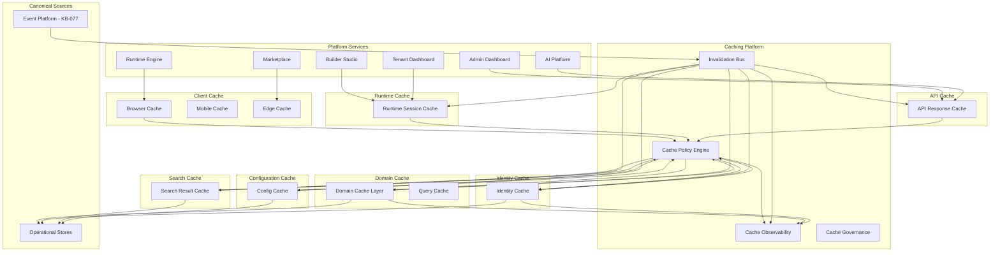
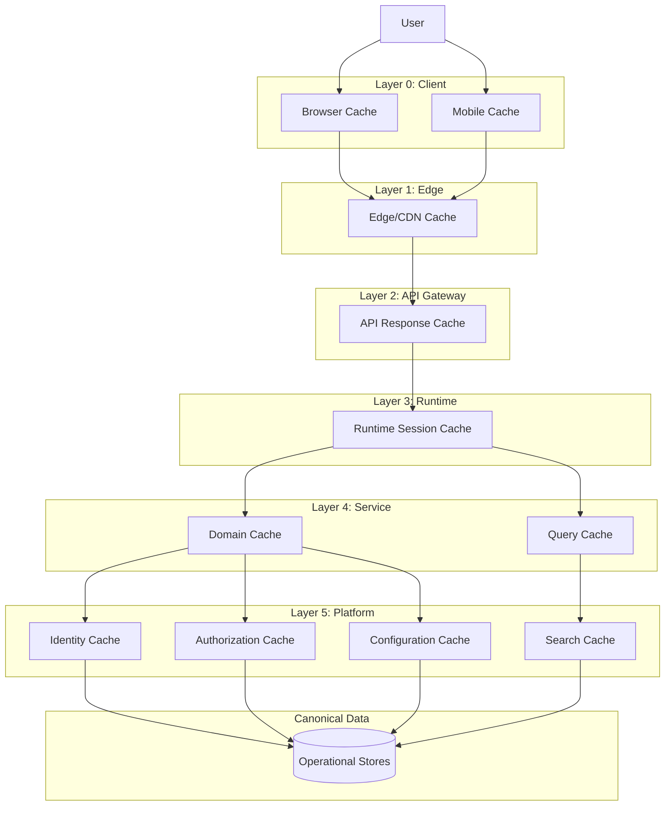
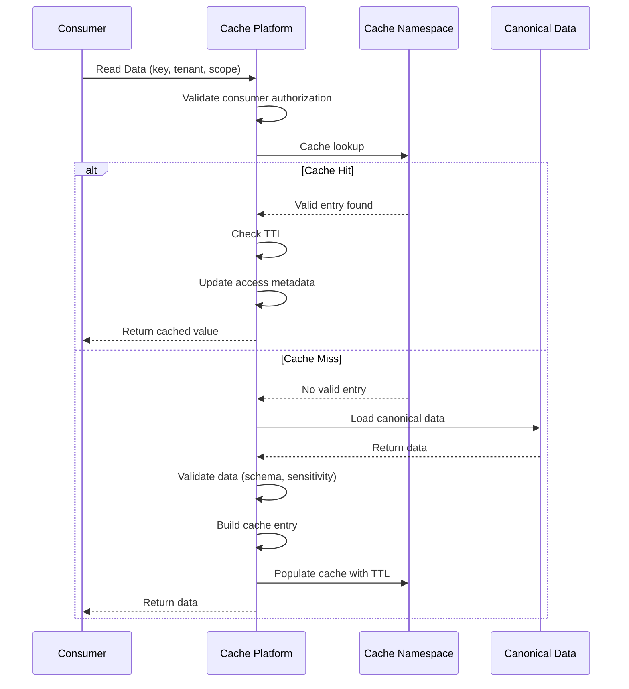
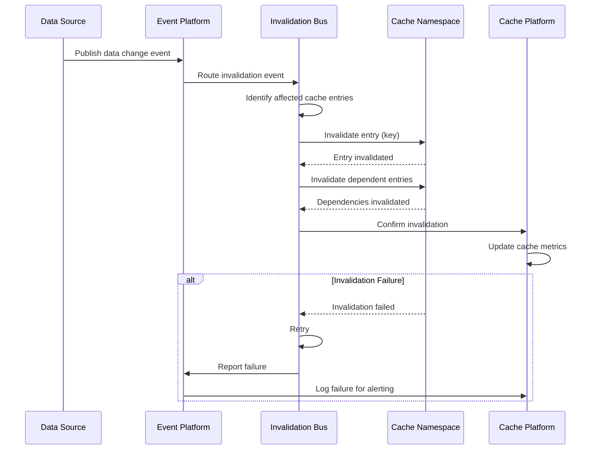
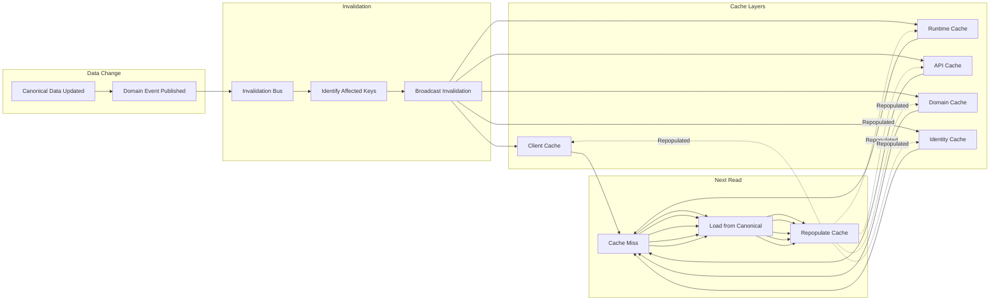
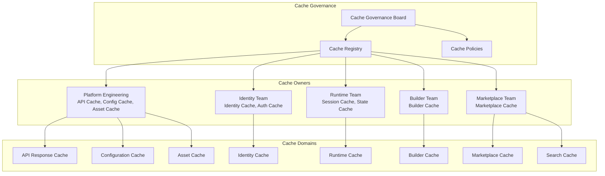
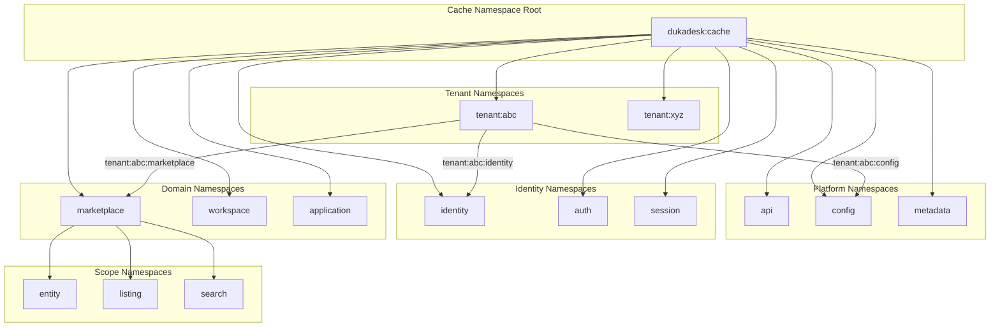
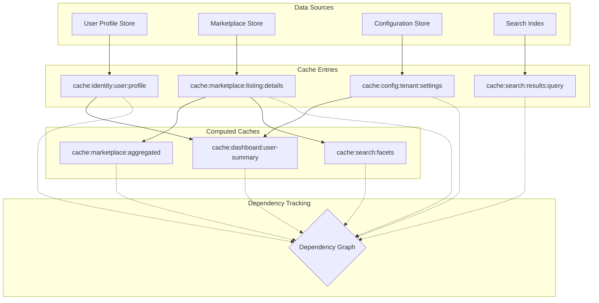
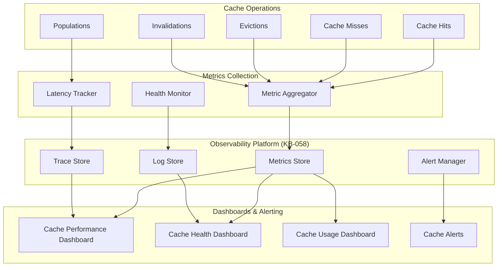
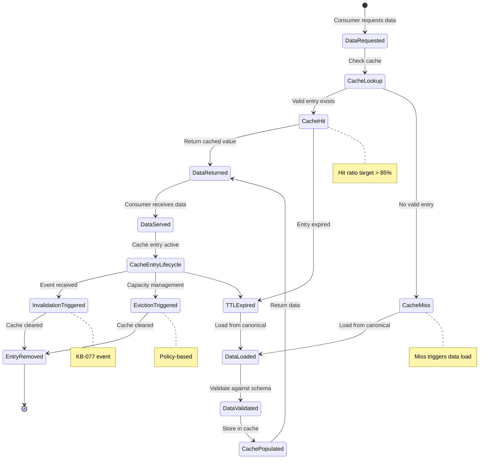

# Caching Architecture

**KB-079 — Caching & Data Federation Architecture Specification**

| Metadata | |
|----------|---|
| **KB ID** | KB-079 |
| **Title** | Caching & Data Federation Architecture |
| **Version** | 0.1.0 |
| **Status** | Draft |
| **Owner** | Architecture Team |
| **Suite** | Data Platform Architecture |
| **Dependencies** | KB-073 Data Platform Architecture, KB-075 Storage Architecture, KB-076 Data Access Layer Architecture, KB-077 Event & Messaging Architecture, KB-078 Search & Indexing Architecture |
| **Related Documents** | KB-051 Runtime Architecture Overview, KB-055 Runtime State Engine Architecture, KB-057 Runtime Security Architecture, KB-058 Runtime Observability & Diagnostics Architecture, KB-064 Authentication Architecture, KB-065 Authorization & RBAC Architecture, KB-067 Consent & Privacy Architecture, KB-072 Audit, Compliance & Identity Governance Architecture, KB-080 File & Object Storage Architecture (planned) |
| **Review Status** | Pending |
| **Last Updated** | 2026-07-11 |

---

### Revision History

| Version | Date | Author | Change |
|---------|------|--------|--------|
| 0.1.0 | 2026-07-11 | AI Architecture Agent | Initial draft |

---

## 1. Executive Summary

### 1.1 Purpose

This document defines the Caching Architecture for the DUKADESK Platform. The Caching Platform is the platform-wide optimization layer — the architectural foundation for improving performance, scalability, resilience, and user experience while preserving the integrity of canonical data.

Caching is a platform optimization, not a persistence mechanism. All caches are disposable, derived, and reconstructable from authoritative data sources. No business logic depends on cache state. Caches are governed through events and well-defined invalidation policies.

Cache consistency is enforced through event-driven invalidation from the Event Platform (KB-077). Every cache entry originates from an authoritative data source, respects tenant and security boundaries, and is invalidated through governed platform policies. No platform service may depend on cached data as the authoritative source of truth.

This document defines architecture only. It is cache-technology-independent, cloud-provider-independent, and implementation-independent.

### 1.2 Scope

**In scope:**

- Runtime Cache: In-memory cache for runtime session data, state, and content
- API Response Cache: Cache for API response data to reduce latency and load
- Query Cache: Cache for database query results and computed data
- Identity Cache: Cache for user identity, authentication tokens, and session data
- Authorization Cache: Cache for role assignments, permissions, and policy evaluations
- Configuration Cache: Cache for platform configuration, feature flags, and tenant settings
- Builder Cache: Cache for builder artifacts, module metadata, and build results
- Marketplace Cache: Cache for marketplace listings, package metadata, and search results
- Search Result Cache: Cache for search query results and facet aggregations
- Session Cache: Cache for active session data and user context
- Metadata Cache: Cache for frequently accessed metadata documents
- Asset Cache: Cache for binary assets, images, files, and media
- AI Context Cache: Cache for AI model context, inference results, and knowledge artifacts
- Analytics Cache: Cache for pre-computed analytics data and aggregated metrics

**Out of scope:**
- Implementation details of specific caching technologies (Redis, Memcached, CDN, etc.)
- Specific cache eviction algorithms (LRU, LFU, TTL-based, etc.)
- HTTP-level caching headers and browser caching strategies
- Client-side caching implementation details
- Persistent storage or data durability mechanisms
- Distributed cache protocol specifications

---

## 2. Architectural Principles

### 2.1 Cache Is Disposable

Every cache entry is disposable. Losing cache data never causes data loss or incorrect behavior. The authoritative source of truth is always the canonical data store. Caches are reconstructed from canonical data when needed. Disposability is the fundamental property that distinguishes caching from persistence.

### 2.2 Canonical Data Always Wins

Canonical data always takes precedence over cached data. When a cache entry conflicts with canonical data, the canonical data wins. Cache is never written back to the canonical store — cache is a read optimization, never a write pathway. Canonical data primacy ensures consistency and correctness.

### 2.3 Event-Driven Invalidation

Cache invalidation is event-driven through the Event Platform (KB-077). When canonical data changes, the owning domain publishes a domain event. The Caching Platform consumes these events and invalidates affected cache entries. Event-driven invalidation ensures that caches reflect the current state of canonical data within acceptable freshness windows.

### 2.4 Explicit Cache Ownership

Every cache has a designated owner. The cache owner defines the cache policy — what data is cached, for how long, under what conditions, and how it is invalidated. Cache ownership prevents ungoverned caching and ensures that every cached data type has a responsible party.

### 2.5 Security-Aware Caching

Caches respect authorization boundaries. Cached data is returned only to users and services authorized to access the underlying canonical data. Caches do not bypass authentication or authorization. Security metadata is carried through the cache layer.

### 2.6 Tenant Isolation

Caches are tenant-aware. Cached data for one tenant is never returned to another tenant. Cache keys include tenant context. Cache namespaces are tenant-scoped. Cross-tenant cache access requires explicit authorization.

### 2.7 Cache Transparency

Caching is transparent to consumers. Services should not need to know whether data is cached. The Caching Platform handles cache lookups, population, and invalidation without requiring cache-aware code in consuming services. Cache transparency reduces coupling between services and the caching layer.

### 2.8 Consistency Before Performance

Cache consistency takes priority over cache performance. Serving stale data is worse than serving data from the canonical store. Caches are designed for consistency — invalidation is complete before new data is served. The caching architecture prioritizes correctness over raw performance gains.

### 2.9 Independent Cache Layers

Each cache layer operates independently. A failure in one cache layer does not affect other cache layers. Cache layers can be scaled, configured, and managed independently. Independence prevents cascading cache failures and enables targeted optimization.

### 2.10 Observable Caching

Every cache operation is observable — hits, misses, evictions, invalidations, and latency are visible through platform observability (KB-058). Cache health and performance are continuously monitored. Observable caching ensures that cache problems are detected and resolved proactively.

---

## 3. Canonical Definitions

### 3.1 Cache

A temporary, high-speed data store that holds copies of frequently accessed data to reduce latency and load on canonical data sources. Caches are disposable — they contain no authoritative data and can be safely cleared at any time.

### 3.2 Cache Entry

A single unit of cached data. A cache entry consists of a key, a value, metadata (creation time, last access time, TTL), and policy annotations (owner, namespace, tenant context). Cache entries are the atomic units of cache management.

### 3.3 Cache Layer

A logical tier of caching within the platform architecture. Cache layers are organized by proximity to the consumer, performance characteristics, and data type. Examples: client cache layer, runtime cache layer, domain cache layer.

### 3.4 Cache Key

A unique identifier for a cache entry. Cache keys include namespace, tenant context, domain, and resource identifier components. Cache keys are structured to enable efficient lookups, scoped invalidation, and namespace isolation.

### 3.5 Cache Namespace

A logical partition within a cache that isolates cached data by domain, tenant, or data type. Namespaces prevent key collisions, enable scoped invalidation, and enforce isolation boundaries. Namespaces are the unit of cache administration.

### 3.6 Cache Policy

A formal specification governing how a specific data type is cached. Cache policies define TTL, invalidation rules, eviction priority, size limits, refresh behavior, and security requirements. Every cached data type has an associated cache policy.

### 3.7 Cache Invalidation

The process of removing or marking stale cache entries. Invalidation ensures that subsequent reads return fresh data from the canonical source. Invalidation may be explicit (triggered by an event) or implicit (based on TTL expiration).

### 3.8 Cache Eviction

The process of removing cache entries to free space for new entries. Eviction is governed by cache policy and uses configurable strategies (LRU, LFU, TTL-based). Eviction is distinct from invalidation — eviction removes entries for capacity management, not freshness.

### 3.9 Cache Hit

A cache lookup that finds a valid, non-expired cache entry for the requested key. Cache hits return cached data without accessing the canonical source. High cache hit ratios indicate effective caching.

### 3.10 Cache Miss

A cache lookup that does not find a valid cache entry for the requested key. Cache misses require accessing the canonical data source, populating the cache, and returning the data. Cache misses add latency compared to hits.

### 3.11 Warm Cache

A cache that contains entries for the expected workload. A warm cache delivers high hit ratios and low latency. Warm caches are achieved through natural usage patterns or intentional warm-up strategies.

### 3.12 Cold Cache

A cache that contains few or no entries. A cold cache delivers low hit ratios and high latency until it is populated through natural usage or intentional warm-up. Cold caches occur after cache flush, deployment, or scaling events.

### 3.13 Distributed Cache (Conceptual)

A cache that spans multiple nodes for capacity and availability. Distributed caches provide greater capacity than single-node caches and support cache sharing across service instances. The distributed cache is a conceptual pattern — specific implementation is out of scope.

### 3.14 Edge Cache

A cache deployed at the network edge, close to end users. Edge caches reduce latency for geographically distributed users. Edge caching is defined architecturally for future CDN and regional deployment scenarios.

### 3.15 Cache Coherency

The guarantee that cached data reflects the current state of canonical data. Coherency is enforced through invalidation — when canonical data changes, all cache entries derived from that data are invalidated. Coherency guarantees are defined per cache policy.

### 3.16 Time-to-Live (Conceptual)

The maximum duration a cache entry is considered valid without explicit invalidation. TTL is a cache policy parameter. After TTL expiration, the entry is treated as stale and is either refreshed or evicted on the next read.

---

## 4. Cache Platform Architecture

### 4.1 Logical Architecture

The Caching Platform follows a layered architecture with cache layers organized by proximity to consumers, performance characteristics, and data criticality:

```
                    +-----------------------+
                    |   Platform Services   |
                    | (Runtime, Builder,     |
                    |  Marketplace, Admin,   |
                    |  AI, Mobile, etc.)     |
                    +----------+------------+
                               |
            +------------------+------------------+
            |                  |                  |
    +-------v------+  +-------v------+  +-------v------+
    | Client Cache |  | Runtime      |  | API Cache    |
    | (Browser,    |  | Cache        |  | (Response    |
    |  Mobile,     |  | (Session,    |  |  Cache)      |
    |  Edge)       |  |  State)      |  |              |
    +--------------+  +--------------+  +--------------+
            |                  |                  |
            +------------------+------------------+
                               |
                    +----------v------------+
                    |   Cache Platform      |
                    | (Policy, Invalidation, |
                    |  Metrics, Governance)  |
                    +----------+------------+
                               |
            +------------------+------------------+
            |                  |                  |
    +-------v------+  +-------v------+  +-------v------+
    | Domain Cache |  | Identity     |  | Search       |
    | (Data,       |  | Cache        |  | Cache        |
    |  Query,      |  | (Auth,       |  | (Results,    |
    |  Config)     |  |  Session)    |  |  Facets)     |
    +--------------+  +--------------+  +--------------+
            |                  |                  |
            +------------------+------------------+
                               |
                    +----------v------------+
                    |   Canonical Data      |
                    |   Sources             |
                    | (Operational Stores,  |
                    |  Event Platform,      |
                    |  External Services)   |
                    +-----------------------+
```

### 4.2 Cache Platform Layer

The central governance and management layer for all caching. The Cache Platform does not store data itself — it provides policies, invalidation routing, metrics collection, and governance for all cache layers.

**Responsibilities:**
- Manage cache policies (TTL, eviction, refresh, security)
- Route invalidation events to affected cache layers
- Collect and aggregate cache metrics
- Enforce cache governance (ownership, namespace isolation)
- Provide cache health monitoring and alerting

### 4.3 Invalidation Bus

The Invalidation Bus is a logical routing mechanism that receives invalidation events from the Event Platform (KB-077) and routes them to the appropriate cache layers. The Invalidation Bus ensures that invalidation events reach all cache layers that hold affected data.

**Invalidation routing:**
- Consume domain events from the Event Platform
- Determine which cache layers hold the affected data
- Route invalidation requests to each affected cache layer
- Confirm invalidation completion
- Handle invalidation failures and retries

---

## 5. Cache Layers

### 5.1 Layer Model

Cache layers are organized hierarchically, with each layer optimized for specific use cases:

| Cache Layer | Location | Latency | Capacity | Volatility | Use Cases |
|-------------|----------|---------|----------|------------|-----------|
| Client Cache | Browser, Mobile, Edge | Sub-ms | Small | Session | UI state, page data |
| Runtime Cache | Runtime Engine | Sub-ms | Small-Medium | Session | Session data, state, content |
| API Cache | API Gateway | Low-ms | Medium | Configurable | API responses, serialized data |
| Domain Cache | Service Layer | Low-ms | Medium-Large | Configurable | Query results, computed data |
| Identity Cache | Auth Service | Sub-ms | Small | Session | Tokens, sessions, roles |
| Search Cache | Search Platform | Low-ms | Large | Configurable | Query results, facets |
| Asset Cache | CDN, Storage | Variable | Very Large | Long | Images, files, media |
| Configuration Cache | All Services | Sub-ms | Very Small | Long | Config, feature flags |
| Integration Cache | Integration Layer | Variable | Medium | Configurable | External API responses |
| AI Context Cache | AI Platform | Low-ms | Medium-Large | Session | Model context, inferences |

### 5.2 Client Cache

Caches data on the client device (browser, mobile app, edge device). Client caches have the lowest latency but the highest volatility and lowest capacity.

**Ownership:** Client Application Team
**Data:** UI state, page data, user preferences, static assets
**Invalidation:** TTL-based, version-based, explicit API invalidation
**Security:** Client caches do not contain sensitive data. Sensitive data is marked as non-cacheable.

### 5.3 Runtime Cache

Caches runtime session data, state, and rendered content within the Runtime Engine.

**Ownership:** Runtime Team
**Data:** Session state, rendered components, navigation state, user context
**Invalidation:** Session end, explicit invalidation, TTL-based
**Security:** Tenant-isolated. Runtime cache respects session boundaries.

### 5.4 API Cache

Caches API response data at the API Gateway or service boundary. API cache reduces load on backend services and improves response latency.

**Ownership:** Platform Engineering Team
**Data:** API response payloads, serialized data
**Invalidation:** TTL-based, event-driven for mutable data, explicit invalidation
**Security:** Authorization-aware. Cached responses are returned only to authorized consumers.

### 5.5 Domain Cache

Caches domain data, query results, and computed data within the service layer. Domain cache is the primary cache for operational data.

**Ownership:** Domain Teams
**Data:** Entity data, query results, computed aggregates
**Invalidation:** Event-driven (domain events), TTL-based, explicit invalidation
**Security:** Tenant-isolated. Domain cache respects data domain boundaries.

### 5.6 Identity Cache

Caches identity and authentication data within the Identity Platform. Identity cache is critical for authentication and authorization performance.

**Ownership:** Identity Team
**Data:** Authentication tokens, session data, role assignments, permission evaluations
**Invalidation:** Event-driven (identity events), session end, TTL-based
**Security:** Highest security requirements. Identity cache contains sensitive authentication data.

### 5.7 Search Cache

Caches search query results and facet aggregations within the Search Platform (KB-078).

**Ownership:** Search Platform Team
**Data:** Search query results, facet aggregations, autocomplete suggestions
**Invalidation:** Event-driven (index updates), TTL-based, query-specific
**Security:** Authorization-aware. Cached search results are filtered by the searcher's authorization.

### 5.8 Asset Cache

Caches binary assets — images, files, media, static resources. Asset cache is the largest cache layer by data volume.

**Ownership:** Platform Engineering Team
**Data:** Images, files, media, static assets, binary resources
**Invalidation:** Version-based, TTL-based, explicit invalidation
**Security:** Access-controlled. Assets are cached with tenant isolation.

### 5.9 Configuration Cache

Caches platform configuration, feature flags, and tenant settings. Configuration cache is the most stable cache layer.

**Ownership:** Platform Engineering Team
**Data:** Platform configuration, feature flags, tenant settings
**Invalidation:** Event-driven (configuration change events), TTL-based
**Security:** Tenant-isolated. Configuration is tenant-aware.

### 5.10 AI Context Cache

Caches AI model context, inference results, and knowledge artifacts within the AI Platform.

**Ownership:** AI Platform Team
**Data:** Model context, inference results, knowledge artifacts, embeddings
**Invalidation:** Event-driven (knowledge changes), session end, TTL-based
**Security:** Privacy-aware. AI context cache respects consent and data minimization.

---

## 6. Cache Lifecycle

### 6.1 Lifecycle Stages

Every cached data element follows a standard lifecycle:

```
Request → Lookup → Hit? → Yes → Return
                          → No → Retrieve Canonical Data → Validate → Populate → Return → Invalidate (when required)
```

### 6.2 Request

A consumer (service, component, user) requests data. The request carries cache context — namespace, tenant, identity, and scope.

### 6.3 Lookup

The Caching Platform checks whether a valid cache entry exists for the requested key. The lookup checks TTL, invalidation status, and entry validity.

### 6.4 Hit / Miss

**Cache Hit:** A valid entry exists. The cached value is returned. The entry's access metadata is updated.

**Cache Miss:** No valid entry exists. The Caching Platform retrieves data from the canonical source.

### 6.5 Retrieve Canonical Data

On a cache miss, data is retrieved from the authoritative canonical source. The retrieval follows the data access patterns defined in KB-076.

### 6.6 Validate

The retrieved data is validated before caching. Validation checks include:
- Data integrity (correct format, expected schema)
- Authorization context (is the data appropriate for the cache layer?)
- Privacy context (does caching respect consent and data minimization?)
- Size constraints (is the data within cache size limits?)

### 6.7 Populate

The validated data is stored in the cache with appropriate metadata — key, TTL, namespace, tenant context, version, dependency information.

### 6.8 Return

The data is returned to the consumer. On a cache hit, data is returned with cache metadata (freshness, source). On a cache miss, data is returned after population.

### 6.9 Invalidate (When Required)

When canonical data changes, an invalidation event triggers cache entry removal. The invalidation lifecycle is:
1. Canonical data changes
2. Domain event published (KB-077)
3. Invalidation Bus receives the event
4. Affected cache entries are identified (by key pattern, namespace, dependency)
5. Entries are invalidated (removed or marked stale)
6. Invalidation is confirmed
7. Next read triggers a cache miss and repopulation

---

## 7. Cache Ownership

### 7.1 Ownership Model

Every cache has a designated owner. The owner is responsible for defining cache policies, governing cache evolution, and ensuring cache correctness.

### 7.2 Platform Cache Owner

**Owner:** Platform Engineering Team
**Scope:** API cache, configuration cache, asset cache, integration cache
**Responsibilities:**
- Define platform cache policies
- Govern cache key namespaces
- Manage cache infrastructure
- Monitor cache health and performance
- Coordinate with domain cache owners

### 7.3 Identity Cache Owner

**Owner:** Identity Team
**Scope:** Authentication tokens, session data, role assignments, permission cache
**Responsibilities:**
- Define identity cache policies
- Govern identity cache namespaces
- Ensure security of cached identity data
- Handle session lifecycle events for cache invalidation

### 7.4 Runtime Cache Owner

**Owner:** Runtime Team
**Scope:** Session state, rendered content, navigation state
**Responsibilities:**
- Define runtime cache policies
- Govern runtime cache namespaces
- Handle session lifecycle for cache lifecycle
- Ensure runtime cache tenant isolation

### 7.5 Builder Cache Owner

**Owner:** Builder Team
**Scope:** Builder artifacts, module metadata, build results
**Responsibilities:**
- Define builder cache policies
- Govern builder cache namespaces
- Handle builder event-driven invalidation

### 7.6 Marketplace Cache Owner

**Owner:** Marketplace Team
**Scope:** Marketplace listings, package metadata, search results
**Responsibilities:**
- Define marketplace cache policies
- Govern marketplace cache namespaces
- Handle marketplace event-driven invalidation

### 7.7 Tenant Cache Owner

**Owner:** Tenant Administrators (configurable)
**Scope:** Tenant-specific cached data
**Responsibilities:**
- Configure tenant cache policies (within platform limits)
- Manage tenant cache namespaces
- Request tenant cache invalidation

### 7.8 Organization Cache Owner

**Owner:** Organization Administrators (configurable)
**Scope:** Organization-specific cached data
**Responsibilities:**
- Configure organization cache policies
- Manage organization cache namespaces
- Request organization cache invalidation

### 7.9 Application Cache Owner

**Owner:** Application Developers (configurable)
**Scope:** Application-specific cached data
**Responsibilities:**
- Configure application cache policies (within platform limits)
- Manage application cache namespaces
- Handle application-level invalidation

---

## 8. Cache Key Strategy

### 8.1 Key Structure

Cache keys follow a hierarchical structure that enables efficient lookups, scoped invalidation, and namespace isolation:

```
{namespace}:{tenant}:{scope}:{domain}:{identifier}:{version}
```

**Key components:**
- **namespace**: The cache namespace (domain, data type)
- **tenant**: Tenant identifier (for tenant-scoped data)
- **scope**: Scope within the tenant (workspace, organization, application)
- **domain**: Data domain identifier
- **identifier**: Resource identifier within the domain
- **version**: Data version (for version-aware caching)

### 8.2 Global Keys

Keys for data not scoped to a specific tenant. Global keys omit the tenant component.

**Examples:**
- `config:platform:feature-flags:v2`
- `metadata:document-types:v1`
- `schema:registry-definitions:v3`

**Ownership:** Platform Team
**Invalidation scope:** Global

### 8.3 Tenant Keys

Keys scoped to a specific tenant. Tenant keys include the tenant identifier.

**Examples:**
- `config:tenant-abc:settings:v1`
- `identity:tenant-abc:roles:v2`
- `marketplace:tenant-abc:listings:v1`

**Ownership:** Tenant Owner / Platform Team
**Invalidation scope:** Tenant-scoped

### 8.4 Workspace Keys

Keys scoped to a specific workspace within a tenant.

**Examples:**
- `runtime:tenant-abc:workspace-xyz:state:v3`
- `identity:tenant-abc:workspace-xyz:members:v1`

**Ownership:** Workspace Administrator
**Invalidation scope:** Workspace-scoped

### 8.5 Application Keys

Keys scoped to a specific application.

**Examples:**
- `app:tenant-abc:app-def:config:v2`
- `app:tenant-abc:app-def:runtime-data:v1`

**Ownership:** Application Developer
**Invalidation scope:** Application-scoped

### 8.6 Identity Keys

Keys scoped to a specific identity (user, service account).

**Examples:**
- `identity:tenant-abc:user-123:profile:v2`
- `identity:tenant-abc:user-123:permissions:v1`
- `auth:tenant-abc:user-123:token:v5`

**Ownership:** Identity Team
**Invalidation scope:** Identity-scoped

### 8.7 Version-Aware Keys

Keys that include a version component to enable cache busting on version change. Version-aware keys are used for data with well-defined version boundaries.

**When to use version-aware keys:**
- Configuration data that changes infrequently
- Schema definitions and metadata
- Static assets with versioned builds
- Data with explicit versioning contracts

### 8.8 Namespace Isolation

Namespaces provide logical isolation between different cache domains. Each namespace has its own:
- Key prefix
- Cache policy (TTL, eviction, size limits)
- Access controls
- Invalidation scope
- Monitoring and metrics

**Namespace isolation benefits:**
- No key collisions between domains
- Targeted invalidation (invalidate entire namespace)
- Independent cache policies per domain
- Independent scaling per namespace

---

## 9. Cache Invalidation

### 9.1 Invalidation Model

Cache invalidation follows a multi-model approach. Different data types require different invalidation strategies:

| Model | Trigger | Latency | Coverage | Use Cases |
|-------|---------|---------|----------|-----------|
| Event-Driven | Domain event | Real-time | Targeted | Mutable data, domain entities |
| Explicit | API call | Immediate | Targeted | Administration, debugging |
| Policy-Based | TTL expiration | Configurable | Defined | Immutable data, reference data |
| Version-Based | Version change | Immediate | Broad | Static assets, configuration |
| Dependency | Related data change | Real-time | Cascading | Computed data, aggregates |
| Tenant Scope | Tenant event | Real-time | Tenant | Tenant-wide invalidation |
| Bulk | Bulk operation | Immediate | Broad | Maintenance, rebuild |

### 9.2 Event-Driven Invalidation

The primary invalidation mechanism. When canonical data changes, the owning domain publishes a domain event through the Event Platform (KB-077). The Invalidation Bus consumes the event and routes invalidation requests to affected cache layers.

**Event types and their invalidation scope:**

| Event Type | Cache Impact | Example |
|------------|--------------|---------|
| Entity Created | Invalidate listing/index caches | User directory, search index |
| Entity Updated | Invalidate specific entity cache | Profile data, settings |
| Entity Deleted | Invalidate entity cache, remove from listings | Remove from all caches |
| Bulk Updated | Invalidate multiple entity caches | Batch update |
| Configuration Changed | Invalidate configuration cache | Feature flags, settings |
| Permission Changed | Invalidate authorization cache | Role assignments |
| Tenant Changed | Invalidate tenant-scoped caches | Tenant settings |

### 9.3 Explicit Invalidation

Cache can be explicitly invalidated through the Cache Management API. Explicit invalidation is used for administrative actions, debugging, and manual intervention.

**Invalidation API operations:**
- Invalidate specific key
- Invalidate key pattern (wildcard)
- Invalidate namespace
- Invalidate tenant scope
- Flush entire cache layer

### 9.4 Policy-Based Expiration (TTL)

TTL-based expiration is the simplest invalidation mechanism. After TTL expires, the cache entry is treated as stale and is refreshed or evicted on the next read.

**TTL categories:**
- Very short (seconds): Real-time data, session state
- Short (minutes): Frequently updated data, search results
- Medium (hours): Moderately stable data, API responses
- Long (days): Reference data, configuration
- Very long (weeks+): Static assets, immutable data

### 9.5 Version Invalidation

When data version changes, all cache entries with the old version are invalidated. Version invalidation is used for data with explicit versioning.

**Version invalidation triggers:**
- Schema version change
- Asset build version change
- Configuration version change
- Deployment version change

### 9.6 Dependency Invalidation

When data changes, cache entries that depend on that data are also invalidated. Dependency tracking ensures cascading invalidation.

**Dependency types:**
- Direct dependency: Cache entry directly derived from the changed data
- Computed dependency: Cache entry computed from the changed data (aggregates, summaries)
- Reference dependency: Cache entry that references the changed data
- Derived dependency: Cache entry that contains transformed data from the changed source

### 9.7 Tenant Scope Invalidation

When a tenant-level change occurs, all cache entries within the tenant scope are invalidated. Tenant scope invalidation is used for tenant-wide operations.

**Tenant scope triggers:**
- Tenant configuration change
- Tenant plan/feature change
- Tenant compliance status change
- Tenant suspension or termination

### 9.8 Bulk Invalidation

Bulk invalidation invalidates multiple cache entries in a single operation. Bulk invalidation is used for maintenance, rebuilds, and system-wide changes.

**Bulk invalidation triggers:**
- Deployment (invalidate all caches for a deployed service)
- Schema migration (invalidate all affected caches)
- Index rebuild (invalidate search caches)
- Data migration (invalidate all caches for migrated data)

---

## 10. Cache Consistency

### 10.1 Consistency Model

Cache consistency governs the relationship between cached data and canonical data. The Caching Platform supports multiple consistency models:

| Model | Guarantee | Use Cases |
|-------|-----------|-----------|
| Read-Through | Data is always read from cache or canonical, never stale | Session data, identity data |
| Cache-Aside | Cache is checked first; miss loads from canonical | General-purpose caching |
| Eventual Consistency | Cache may be stale for a bounded window | Non-critical data, aggregates |
| Strong Consistency | Cache is never stale (invalidation before response) | Authorization data, critical config |

### 10.2 Read Consistency

Read consistency ensures that cache reads return data that is consistent with the canonical source.

**Read consistency strategies:**
- Read-through: Cache transparently loads data from canonical on miss. Data is always fresh within TTL.
- Cache-aside: Application checks cache first. On miss, loads from canonical and populates cache.
- Refresh-ahead: Cache proactively refreshes entries before TTL expiration based on access patterns.

### 10.3 Eventual Consistency

Many cache domains operate with eventual consistency — cached data may be slightly stale but will converge to canonical state within a bounded time window.

**Bounded staleness:**
- Maximum staleness is defined per cache policy
- Typical maximum staleness: seconds to minutes
- Staleness is monitored and alerted
- Stale data is clearly marked with freshness metadata

### 10.4 Stale Data Handling

When stale data is detected or suspected, the Caching Platform handles it according to policy.

**Stale data handling strategies:**
- Invalidate and refresh: Remove stale entry, load fresh data
- Serve stale with warning: Return stale data with freshness metadata (acceptable for non-critical data)
- Serve stale then refresh: Return stale data immediately, refresh in background
- Reject stale: Return error if data cannot be refreshed

### 10.5 Revalidation

Revalidation checks whether cached data is still valid before returning it. Revalidation may be lazy (on next read) or proactive (background refresh).

**Revalidation strategies:**
- Lazy revalidation: On cache hit, check if TTL has expired. If expired, refresh from canonical.
- Proactive revalidation: Background process checks cache entries near TTL expiration and refreshes them.
- Conditional revalidation: Check with canonical source whether data has changed (using version or timestamp).

### 10.6 Refresh Policies

Refresh policies define how cache entries are refreshed when they are invalidated or expired.

**Refresh strategies:**
- Synchronous refresh: Refresh before returning. Consumer waits for refresh to complete. Used for critical data.
- Asynchronous refresh: Return existing (stale) data while refreshing in background. Used for non-critical data.
- Stale-while-revalidate: Return stale data immediately, refresh in background. Used for high-availability data.

### 10.7 Dependency Tracking

Dependency tracking ensures that when data changes, all dependent cache entries are invalidated.

**Dependency tracking model:**
- Each cache entry declares its dependencies (referenced data sources)
- When a data source changes, all entries that depend on it are invalidated
- Dependencies are tracked at the cache key level
- Dependency graphs are maintained for complex data

---

## 11. Security

### 11.1 Authorization-Aware Cache

Caches respect authorization boundaries. Cached data is returned only to consumers authorized to access the underlying canonical data.

**Authorization enforcement:**
- Cache keys include authorization context (tenant, workspace, scope)
- Cache lookups verify consumer authorization before returning cached data
- Cache entries are tagged with authorization metadata
- Cached data is not returned if authorization cannot be verified

### 11.2 Tenant Isolation

Cache entries are tenant-scoped. A cache lookup for one tenant never returns data from another tenant.

**Tenant isolation mechanisms:**
- Tenant-scoped cache keys (tenant ID in key)
- Tenant-partitioned cache namespaces (separate namespace per tenant)
- Tenant-scoped cache policies (independent TTL, eviction)
- Cross-tenant cache access is blocked and audited

### 11.3 Sensitive Data Restrictions

Sensitive data is subject to additional caching restrictions. The Caching Platform enforces data classification-based caching rules.

**Sensitive data caching rules:**
- Confidential data: Not cached or cached with reduced TTL
- Restricted data: Not cached in client or edge caches
- Personal data: Cached only with consent and data minimization
- Authentication data: Cached with strict TTL and tenant isolation

### 11.4 Cache Poisoning Prevention (Conceptual)

Cache poisoning occurs when an attacker injects malicious data into a cache. The architecture includes conceptual prevention mechanisms.

**Prevention mechanisms:**
- Data validation before caching (validate against schema)
- Authorization validation before caching (verify the requestor)
- Cache entry integrity verification
- Input sanitization for cache key components

### 11.5 Secure Cache Eviction

Cache eviction respects data sensitivity. Sensitive data is securely erased during eviction.

**Secure eviction rules:**
- Evicted sensitive data is overwritten (not just marked as deleted)
- Eviction logs are retained for audit (KB-072)
- Eviction respects data retention policies
- Eviction of tenant data on tenant deletion is guaranteed

### 11.6 Cache Access Policies

Cache access is governed by policies that define which services and users can read from and write to specific cache namespaces.

**Policy dimensions:**
- Read access: Which identities can read from a namespace
- Write access: Which identities can write to a namespace
- Invalidation access: Which identities can invalidate entries
- Administration access: Which identities can manage cache policies

---

## 12. Privacy

### 12.1 Personal Data Caching

Personal data is cached only when necessary for platform operation and only with appropriate safeguards.

**Rules for caching personal data:**
- Personal data is cached only with data subject consent (KB-067)
- Personal data cache TTL is minimized
- Personal data is excluded from client caches unless explicitly required
- Personal data is evicted when consent is revoked
- Personal data caching is logged for audit

### 12.2 Consent-Aware Cache

Cache operations respect user consent preferences. Cached personal data is only returned if the consumer has appropriate consent.

**Consent-aware caching rules:**
- Consent status is checked before caching personal data
- Consent revocation triggers cache entry invalidation
- Cache entries carry consent metadata
- Consent verification is performed at cache read time

### 12.3 Data Retention Awareness

Cache entries respect data retention policies (KB-082). Cached data is not retained beyond the retention period of the underlying canonical data.

**Retention-aware caching rules:**
- Cache TTL does not exceed canonical data retention
- Cache entries are evicted when canonical data reaches retention limit
- Archived data is not cached in active cache layers
- Cache metadata includes data retention boundaries

### 12.4 Right to Erasure Implications

When a data subject exercises the right to erasure, all cache entries containing their personal data must be removed.

**Erasure process:**
1. Data subject requests erasure
2. Canonical data is deleted
3. Domain event published
4. Invalidation Bus erases all cache entries for the data subject
5. Erasure is confirmed and audited
6. Cache entries are securely overwritten

### 12.5 Shared Device Considerations

On shared devices, cache data from one user must not be accessible to subsequent users.

**Shared device cache rules:**
- Session data is evicted on logout
- Client cache is cleared on session end
- Identity cache is cleared on logout
- Sensitive data is not cached on shared devices

---

## 13. Platform Responsibilities

### 13.1 Runtime Responsibilities

The Runtime Engine uses caching to improve session performance and reduce load on backend services.

**Runtime cache responsibilities:**
- Cache session state for the duration of the session
- Cache rendered content within the session
- Cache navigation state for responsive navigation
- Cache user context and preferences
- Evict cache entries on session end

**Runtime must NOT:**
- Cache data beyond session boundaries
- Cache sensitive data without authorization verification
- Depend on cached data for correctness
- Bypass the Cache Platform for cache management

### 13.2 Backend Responsibilities

Platform backend services use caching to reduce load on operational stores and improve response latency.

**Backend cache responsibilities:**
- Domain cache for frequently accessed entity data
- Query cache for repeated query patterns
- Computed data cache for expensive calculations
- Configuration cache for platform and tenant configuration
- Publish invalidation events when canonical data changes

**Backend must NOT:**
- Cache data without an invalidation strategy
- Cache data with infinite TTL
- Cache data across tenant boundaries
- Write cached data back to canonical stores

### 13.3 Builder Responsibilities

The Builder Studio uses caching to improve artifact access and build performance.

**Builder cache responsibilities:**
- Cache builder artifact metadata
- Cache module definitions and component data
- Cache build results (while valid)
- Cache project structure and navigation
- Invalidate cache when artifacts change

**Builder must NOT:**
- Cache build artifacts as the only copy
- Cache builder state without session boundaries
- Cache across tenant or workspace boundaries

### 13.4 Marketplace Responsibilities

The Marketplace uses caching to improve listing and search performance.

**Marketplace cache responsibilities:**
- Cache marketplace listings and metadata
- Cache package details and documentation
- Cache search results and facets
- Cache user preferences and browsing context
- Invalidate cache when listings change

**Marketplace must NOT:**
- Cache marketplace data without event-driven invalidation
- Cache marketplace data beyond tenant boundaries
- Cache sensitive package data (credentials, access keys)

### 13.5 AI Platform Responsibilities

The AI Platform uses caching to improve inference performance and reduce redundant computation.

**AI Platform cache responsibilities:**
- Cache model inference results (where repeatable)
- Cache AI knowledge context and artifacts
- Cache embedding vectors (for search performance)
- Cache model metadata and configuration
- Invalidate cache when knowledge sources change

**AI Platform must NOT:**
- Cache inference results without input variation awareness
- Cache personal data without consent verification
- Cache AI model state as the canonical source

---

## 14. Performance

### 14.1 Cache Hit Ratio

Cache hit ratio measures the percentage of cache lookups that return valid entries. High hit ratios indicate effective caching.

**Target hit ratios by layer:**
- Client cache: 70%+
- Runtime cache: 85%+
- API cache: 80%+
- Domain cache: 90%+
- Identity cache: 95%+
- Configuration cache: 99%+

### 14.2 Warm-Up Strategies

Cache warm-up pre-populates caches before they are needed. Warm-up reduces cold-start latency and improves user experience after deployment or scaling events.

**Warm-up strategies:**
- Pre-loading: Load frequently accessed data into cache before first request
- Gradual warm-up: Allow natural usage to populate caches (may use request steering)
- Predictive warm-up: Predict likely data needs based on usage patterns
- Deployment warm-up: Pre-populate caches during deployment

### 14.3 Read Optimization

Cache reads are optimized for minimal latency.

**Read optimization approaches:**
- Local cache (in-process): Fastest reads, limited capacity
- Near cache (same node): Fast reads, moderate capacity
- Remote cache (dedicated nodes): Slightly slower reads, large capacity
- Tiered reads: Check local first, then near, then remote

### 14.4 Write-Through Concepts

Write-through caching updates the cache synchronously when data is written to the canonical store. Write-through ensures cache freshness at write time but adds latency to write operations.

**Write-through considerations:**
- Only applicable for cache layers that can receive writes
- Write-through adds latency to write operations
- Write-through ensures cache coherence after writes
- Write-through should not bypass canonical store validation

### 14.5 Lazy Population

Lazy population populates the cache on first read after a cache miss. Lazy population is the default population strategy.

**Lazy population characteristics:**
- Cache is populated only when data is requested
- No upfront cost for unused data
- First read after miss has higher latency
- Cache hit ratio improves over time as data is accessed

### 14.6 Horizontal Scaling

The Caching Platform scales horizontally by adding cache nodes. Scaling increases capacity and throughput.

**Scaling considerations:**
- Data partitioning (shard cache keys across nodes)
- Read replicas (scale read capacity independently)
- Write scaling (handle write load in write tier)
- Node rebalancing (redistribute data when nodes join/leave)
- Cache coherency in distributed configuration

### 14.7 Cache Distribution

Cache data is distributed across cache nodes based on key patterns and access patterns.

**Distribution strategies:**
- Consistent hashing (minimize rehashing on node changes)
- Key-based partitioning (deterministic key to node mapping)
- Access-based distribution (hot keys to dedicated nodes)
- Tenant-based distribution (isolate tenant cache to specific nodes)

---

## 15. Observability

### 15.1 Cache Observability

Cache observability integrates with the platform observability infrastructure (KB-058). Every cache operation emits metrics for monitoring and analysis.

### 15.2 Cache Hits

Cache hit metrics measure the effectiveness of caching.

**Hit metrics:**
- Cache hits per second (by cache layer, by namespace)
- Cache hit ratio (by cache layer, by namespace)
- Read latency (hit vs miss)
- Hit distribution (hot keys, cold keys)

### 15.3 Cache Misses

Cache miss metrics measure how often data must be loaded from canonical sources.

**Miss metrics:**
- Cache misses per second (by cache layer, by namespace)
- Miss reason (first access, TTL expired, evicted, invalidated)
- Miss latency (time to load from canonical and populate)
- Miss distribution (cold keys, evicted keys)

### 15.4 Evictions

Cache eviction metrics measure capacity management.

**Eviction metrics:**
- Evictions per second (by cache layer, by namespace)
- Eviction reason (LRU, LFU, TTL, size, explicit)
- Eviction impact (how many evictions lead to cache misses)
- Eviction rate by data size

### 15.5 Invalidations

Cache invalidation metrics measure the invalidation pipeline health.

**Invalidation metrics:**
- Invalidations per second (by trigger type, by namespace)
- Invalidation latency (time from event to successful invalidation)
- Invalidation scope (single key, pattern, namespace, tenant, bulk)
- Invalidation failures (entries that could not be invalidated)

### 15.6 Cache Growth

Cache growth metrics measure capacity usage.

**Growth metrics:**
- Cache size (current bytes, by namespace)
- Cache entry count (current count, by namespace)
- Growth rate (bytes per hour)
- Capacity utilization (percentage of configured maximum)

### 15.7 Cache Health

Cache health metrics measure the operational status of cache infrastructure.

**Health metrics:**
- Cache node health (up/down, by node)
- Cache connectivity (latency, error rate)
- Cache replication status (for distributed caches)
- Cache memory pressure (utilization, GC metrics)
- Cache error rate

### 15.8 Cache Latency

Cache latency metrics measure the performance impact of cache operations.

**Latency metrics:**
- Read latency (p50, p95, p99 by cache layer)
- Write latency (for write-through caches)
- Invalidation latency
- Eviction latency

---

## 16. Failure Scenarios

### 16.1 Stale Cache

**Scenario:** Cache entries contain stale data because invalidation was missed or delayed.

**Impact:** Consumers see outdated data. Business decisions may be based on stale information.

**Mitigation:**
- TTL-based expiration as safety net
- Monitored invalidation latency
- Alerting on excessive invalidation delay
- Stale data detection with freshness metadata

### 16.2 Cache Stampede

**Scenario:** Multiple concurrent requests for the same cache key all miss simultaneously, overwhelming the canonical data source.

**Impact:** Backend services are overloaded. Response times increase. Cascading failures may occur.

**Mitigation:**
- Request coalescing (only one request loads data, others wait)
- Early expiration (refresh before TTL expiration)
- Probabilistic expiration (randomize TTL to avoid mass expiration)
- Rate limiting on cache miss

### 16.3 Cache Poisoning

**Scenario:** Malicious or invalid data is injected into the cache through a compromised request or service.

**Impact:** Consumers receive corrupted data. Malicious data may be propagated throughout the system.

**Mitigation:**
- Data validation before caching
- Authorization verification before caching
- Input sanitization for cache keys
- Cache entry integrity verification

### 16.4 Invalid Cache Entry

**Scenario:** A cache entry contains data that does not match the expected schema or is otherwise invalid.

**Impact:** Consumers receive malformed data. Processing errors may occur.

**Mitigation:**
- Schema validation at cache population
- Data integrity checks on cache read
- Automatic invalidation of invalid entries
- Alerting on schema validation failures

### 16.5 Missed Invalidation

**Scenario:** An invalidation event is not delivered to a cache layer, leaving stale data in the cache.

**Impact:** Stale data continues to be served. Cache drift occurs between cache layers.

**Mitigation:**
- At-least-once invalidation delivery
- Invalidation confirmation and verification
- TTL-based safety net
- Periodic full cache validation

### 16.6 Cross-Tenant Cache Leakage

**Scenario:** A cache lookup returns data from the wrong tenant. Cache isolation has been breached.

**Impact:** Cross-tenant data exposure. Security and compliance violation.

**Mitigation:**
- Tenant-scoped cache keys
- Tenant-partitioned namespaces
- Authorization verification on cache read
- Automated cross-tenant leak detection
- Audit logging of all cache access

### 16.7 Cache Exhaustion

**Scenario:** Cache capacity is exhausted. Entries are aggressively evicted, reducing hit ratio and increasing load on backend services.

**Impact:** Degraded performance. Increased latency. Potential backend overload.

**Mitigation:**
- Cache capacity monitoring and alerting
- Automatic cache scaling
- Configurable per-namespace size limits
- Intelligent eviction (evict least valuable entries first)

### 16.8 Inconsistent Cache State

**Scenario:** Multiple cache layers hold different values for the same data. Cache state is inconsistent.

**Impact:** Different consumers see different data. Business logic may produce inconsistent results.

**Mitigation:**
- Coordinated invalidation across cache layers
- Version-aware caching to detect inconsistencies
- Cache reconciliation processes
- Monitored cache coherence

---

## 17. Anti-Patterns

### 17.1 Cache as Source of Truth

Using cache as the authoritative source for any data is an anti-pattern. Caches are derived, disposable, and potentially stale. The canonical operational store is always the source of truth.

**Why it is harmful:**
- Cache may be stale or incomplete
- Cache does not have ACID guarantees
- Cache may be flushed at any time
- Cache does not enforce data constraints
- Cache recovery from data loss is impossible

### 17.2 Infinite Cache Lifetime

Caching data indefinitely without invalidation is an anti-pattern. Data changes over time; infinite cache lifetime guarantees stale data.

**Why it is harmful:**
- Stale data is served indefinitely
- No mechanism to recover from cache errors
- Cache growth without bound
- Data retention compliance violations

### 17.3 Shared Tenant Caches

Using a single cache namespace for data from multiple tenants is an anti-pattern. Shared caches create data leak risks and make tenant isolation fragile.

**Why it is harmful:**
- Cross-tenant data leak risk
- Difficult to audit tenant access
- Single invalidation scope (cannot invalidate per tenant)
- Tenant-specific policies cannot be applied

### 17.4 Manual Cache Mutation

Directly modifying cache entries without going through the Caching Platform is an anti-pattern. Manual mutation bypasses policies, validation, and invalidation.

**Why it is harmful:**
- Cache bypasses data validation
- Cache bypasses authorization checks
- Invalid data may be injected
- Changes are not audited
- Changes may be overwritten by next population

### 17.5 Business Logic Depending on Cache

Business logic that depends on cache state or cache behavior is an anti-pattern. Business logic must depend only on canonical data.

**Why it is harmful:**
- Business logic breaks when cache is flushed
- Business logic produces inconsistent results with stale cache
- Business logic cannot rely on cache availability
- Testing and debugging become cache-dependent

### 17.6 Cache Without Invalidation

Caching data without an invalidation strategy is an anti-pattern. Every cache must have a defined invalidation mechanism.

**Why it is harmful:**
- Stale data accumulates
- Cache cannot recover from errors
- Cache size grows without bound
- No mechanism to respond to data changes

### 17.7 Unauthorized Cache Sharing

Sharing cache data between consumers that have different authorization levels is an anti-pattern. Cached data must respect the authorization of the requesting consumer.

**Why it is harmful:**
- Data exposure to unauthorized consumers
- Authorization bypass through cache sharing
- Compliance violation
- Security incident

---

## 18. Future Evolution

### 18.1 Intelligent Cache Optimization

Machine learning models optimize cache behavior based on access patterns, data characteristics, and performance goals.

**Optimization areas:**
- Optimal TTL prediction (data-specific expiration)
- Eviction policy selection (best policy for data type)
- Cache placement optimization (local vs near vs remote)
- Capacity planning (predict growth and scale proactively)

### 18.2 Predictive Cache Warming

Cache warming predicts which data will be needed and pre-populates caches before requests arrive.

**Prediction signals:**
- Historical access patterns
- User behavior and navigation paths
- Seasonal and temporal patterns
- Tenant and workspace context

### 18.3 AI-Assisted Cache Policies

AI models assist in defining and tuning cache policies based on system behavior and performance goals.

**AI assistance areas:**
- Policy recommendation (suggest optimal TTL, eviction, refresh)
- Anomaly detection (identify cache behavior anomalies)
- Automated policy tuning (adjust policies based on feedback)
- Cache performance prediction

### 18.4 Global Edge Cache

Edge caching extends cache layers to geographically distributed edge locations, reducing latency for global users.

**Edge cache architecture:**
- Edge locations with local cache nodes
- Regional cache clusters
- Global cache coordination
- Data residency compliance per region

### 18.5 Federated Cache Layers

Federated caching enables cache sharing across organizational boundaries while maintaining isolation.

**Federation considerations:**
- Cross-organization cache namespaces
- Federated cache policies
- Authorization for cross-organization cache access
- Cache data sovereignty

### 18.6 Autonomous Cache Management

Cache management becomes autonomous — the Caching Platform self-tunes, self-heals, and self-optimizes without human intervention.

**Autonomous capabilities:**
- Self-tuning: Adjust cache policies based on observed behavior
- Self-healing: Detect and recover from cache failures
- Self-optimizing: Continuously improve cache performance
- Self-scaling: Adjust capacity based on demand

---

## 19. Cross-References

| Reference | Relationship |
|-----------|-------------|
| KB-051 Runtime Architecture Overview | Runtime cache layer consumes and manages session cache data |
| KB-055 Runtime State Engine Architecture | State cache for runtime state; cache invalidation on state changes |
| KB-057 Runtime Security Architecture | Cache security follows runtime security model |
| KB-058 Runtime Observability & Diagnostics Architecture | Cache observability integrated with platform observability |
| KB-064 Authentication Architecture | Identity cache for authentication data |
| KB-065 Authorization & RBAC Architecture | Authorization cache for permission evaluations |
| KB-067 Consent & Privacy Architecture | Consent-aware caching; privacy rules for cached data |
| KB-072 Audit, Compliance & Identity Governance Architecture | Cache auditing; cache retention compliance |
| KB-073 Data Platform Architecture | Cache as derived data; canonical data always authoritative |
| KB-075 Storage Architecture | Cache as a storage optimization layer |
| KB-076 Data Access Layer Architecture | Cache population through data access patterns |
| KB-077 Event & Messaging Architecture | Event-driven cache invalidation |
| KB-078 Search & Indexing Architecture | Search result cache; search cache invalidation |
| KB-080 File & Object Storage Architecture (planned) | Asset cache for binary objects |

---

## 20. Architecture Diagrams

### 20.1 Cache Platform Architecture



### 20.2 Multi-Layer Cache Hierarchy



### 20.3 Cache Read Flow



### 20.4 Cache Invalidation Flow



### 20.5 Event-Driven Cache Refresh



### 20.6 Cache Ownership Model



### 20.7 Cache Key Namespace Hierarchy



### 20.8 Cache Dependency Graph



### 20.9 Cache Observability Pipeline



### 20.10 End-to-End Cache Lifecycle



---

## 21. References

- KB-051 Runtime Architecture Overview
- KB-055 Runtime State Engine Architecture
- KB-057 Runtime Security Architecture
- KB-058 Runtime Observability & Diagnostics Architecture
- KB-064 Authentication Architecture
- KB-065 Authorization & RBAC Architecture
- KB-067 Consent & Privacy Architecture
- KB-072 Audit, Compliance & Identity Governance Architecture
- KB-073 Data Platform Architecture
- KB-075 Storage Architecture
- KB-076 Data Access Layer Architecture
- KB-077 Event & Messaging Architecture
- KB-078 Search & Indexing Architecture
- KB-080 File & Object Storage Architecture (planned)

---

*End of KB-079 — Caching & Data Federation Architecture Specification*
