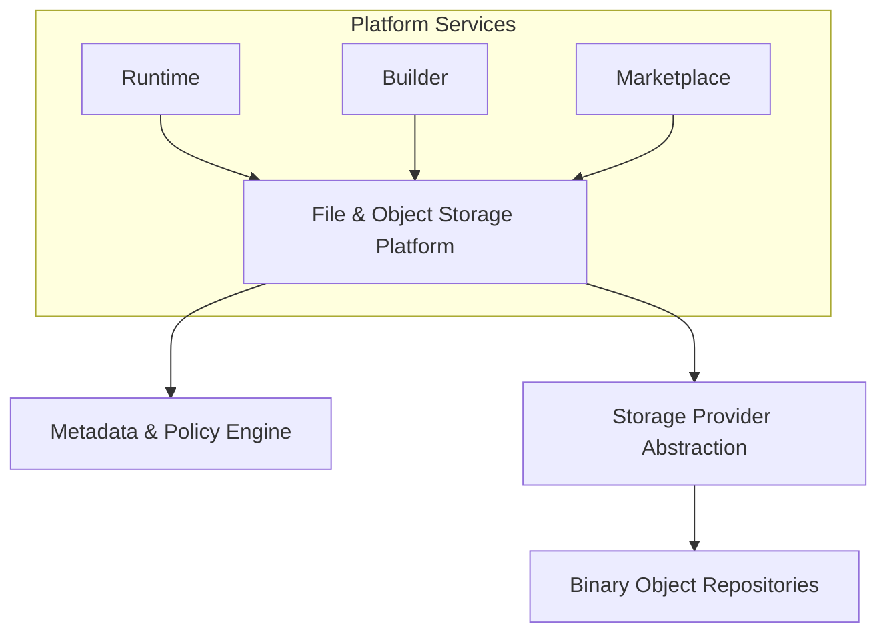
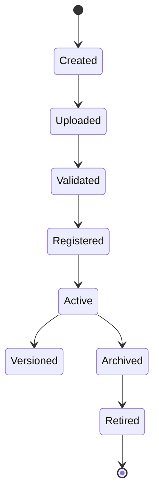
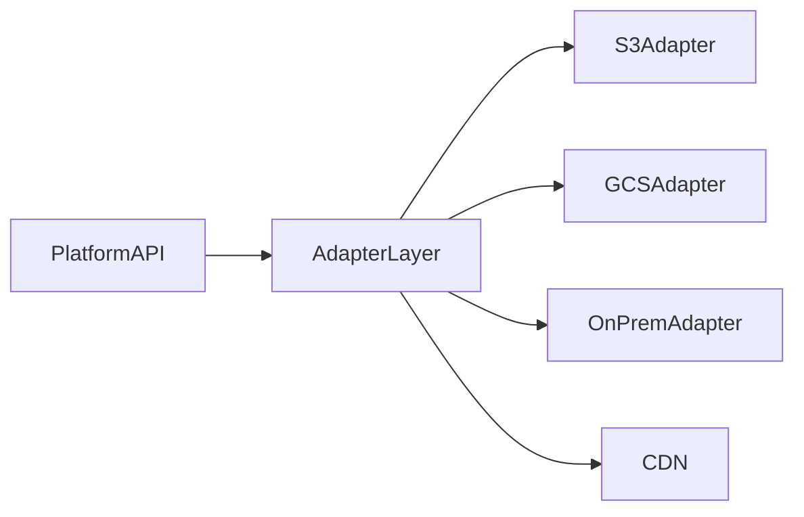
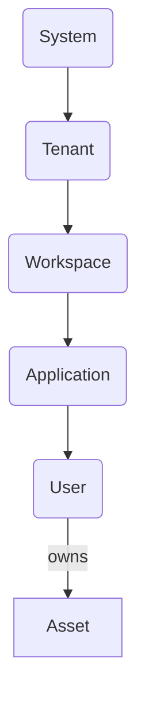
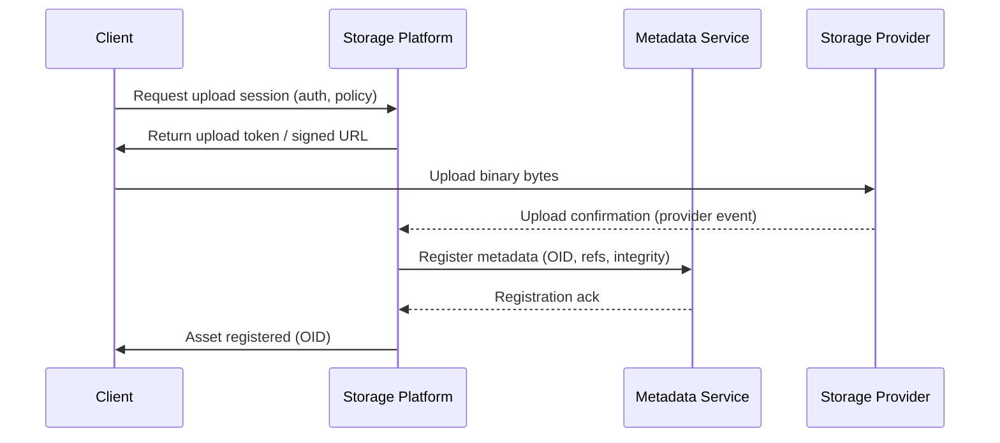
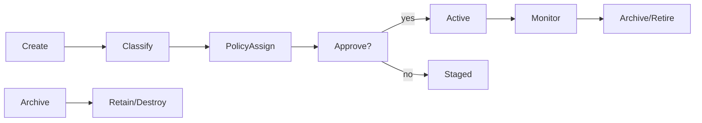
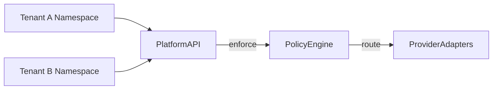
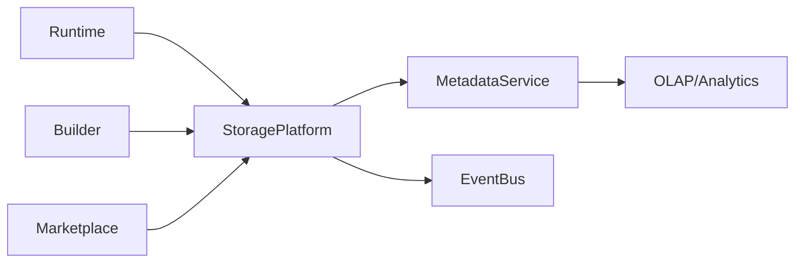
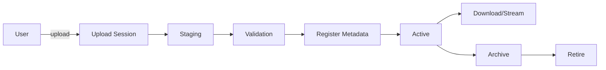

# File & Object Storage Architecture (KB-080)

Executive Summary
-----------------
This specification defines enterprise-grade architecture for managing binary assets and unstructured content across DUKADESK. It establishes platform-level abstractions for object identity, metadata, lifecycle, governance, security, access, distribution, and observability while remaining independent of cloud vendors or storage technologies.

Purpose
-------
Define the enterprise architecture governing all binary assets and object storage across the DUKADESK ecosystem while ensuring portability, tenant isolation, governance, lifecycle management, security, and scalability.

Scope
-----
The File & Object Storage Platform governs: user uploads, profile images, organization/tenant/workspace assets, application and builder artifacts, marketplace packages, templates, themes, components, extensions, AI assets, generated documents, reports, media files, runtime resources, static assets, backup objects, import/export packages, and binary logs.

Architectural Principles
------------------------
- Objects Are Platform Resources: Binary objects are first-class platform resources managed through metadata.
- Metadata Is Canonical: Asset identity, ownership, lifecycle, permissions, and governance are expressed in metadata and are authoritative.
- Binary Content Is Abstracted: Services never depend on physical storage APIs. Interaction happens via the File & Object Storage Platform API.
- Storage Provider Independence: The platform supports multiple providers and local storage with pluggable adapters.
- Immutable Asset Identity: Object IDs are immutable; versions express changes.
- Tenant Isolation: Strong, provable boundaries across tenants and workspaces.
- Lifecycle Governance: Policy-driven lifecycle (retain, archive, delete, legal hold).
- Secure by Default: Strict least-privilege access and encrypted transport/storage.
- Observable Storage: Metrics and traces for storage operations, integrity checks, and lifecycle events.
- Versioned Assets: First-class versioning and provenance metadata.

Critical Principle (Non-negotiable)
----------------------------------
Binary assets are governed through metadata, not storage location. The platform owns asset identity, ownership, lifecycle, permissions, and governance independently of any storage provider.

Canonical Definitions
---------------------
- Object: A named binary payload paired with authoritative metadata managed by the platform.
- Binary Asset: The raw bytes comprising images, videos, documents, archives, binaries, models.
- File / Blob: Common synonyms for a binary asset stored in object repositories.
- Object Store: Logical repository providing durable binary storage semantics (put/get/list/delete/version).
- Asset Metadata: Structured key-value data describing identity, ownership, policies, integrity, classification, and provenance.
- Object Identifier (OID): Globally-unique, immutable identifier for an asset (opaque UUID or ULID).
- Asset Manifest: Machine-readable summary of an asset and its variants, versions, and derived objects.
- Object Version: Immutable snapshot of binary content at a point-in-time identified by a version id.
- Content Addressability (conceptual): Optionally storing or indexing by cryptographic content hash for deduplication and integrity.
- Object Lifecycle: States an object may occupy (Created → Uploaded → Validated → Registered → Active → Archived → Retired).
- Object Policy: Rule bundle attached to metadata specifying retention, access, encryption, replication, approval rules.
- Storage Bucket (conceptual): Logical containment unit for grouping objects (namespaces) — not a vendor binding.
- Asset Ownership: Actor (consumer, tenant, workspace, application, system) with governance rights and responsibilities over an object.

File & Object Storage Architecture
----------------------------------
High-level architecture (conceptual):

                 Platform Services
                        │
      ┌─────────────────┼─────────────────┐
      │                 │                 │
    Runtime           Builder         Marketplace
      │                 │                 │
      └─────────────────┼─────────────────┘
                        │
        File & Object Storage Platform
                        │
           Metadata • Policies • Security
                        │
            Storage Provider Abstraction
                        │
             Binary Object Repositories


Asset Categories
----------------
Architecture applies to: images, videos, audio, documents, PDFs, templates, themes, marketplace packages, builder artifacts, runtime assets, generated reports, AI models & knowledge assets, application resources, and static platform assets. Each category may have specialized metadata (e.g., codec, resolution, model format) and tailored lifecycle/policy defaults.

Metadata Architecture
---------------------
Canonical metadata model (minimum fields):
- asset_id (OID)
- owner_id (actor id)
- domain (platform domain)
- tenant_id
- workspace_id
- application_id
- asset_type (enum: image/video/document/model/package/etc.)
- size_bytes
- version_id
- lifecycle_state
- classification (public/internal/confidential/regulated)
- content_hash (optional, algorithm identifier)
- mime_type
- created_at, created_by
- last_modified_at, modified_by
- integrity (checksums / signed digest)
- access_policy_ref
- retention_policy_ref
- encryption_domain_ref
- provenance (derived_from, transformation metadata)
- tags, labels

Metadata is authoritative and stored in the Metadata Service (relational or document-store). The binary object is referenced by metadata (location hints or provider-neutral object locator) but metadata is the source of truth.

Asset Lifecycle
---------------
Create → Upload → Validate → Store → Register Metadata → Access → Version → Archive → Retire

Key lifecycle rules:
- Uploads are staged and validated before metadata registration.
- Validation includes size, type, integrity, virus-scan (conceptual), and policy checks.
- Registration is transactional: metadata write must reference a stored object or a verifiable transient locator.
- Archival moves assets to lower-cost stores or immutable archives governed by retention policies.
- Retire marks assets for deletion following retention and legal hold evaluation.

Object Identity
---------------
- Immutable Object IDs: OIDs are opaque, unique, and never reused.
- Version Identifiers: Each version receives a deterministic or opaque version id; metadata links versions to the parent asset.
- Parent/Child Relationships: Derived assets (thumbnails, transcoded variants, model derivatives) include explicit provenance links.
- References: Applications store only OIDs and let the platform resolve access locators.
- Content Identity: Content hashes optionally used to assert integrity and enable deduplication.
- Logical Paths: Human-friendly paths are metadata attributes only — not used for identity.
- Naming Independence: Object names are mutable metadata fields and do not affect identity.

Storage Abstraction
-------------------
Separation of concerns:
- Platform Services (Runtime, Builder, Marketplace) call the File & Object Storage Platform API.
- Asset Platform exposes metadata services, policy engine, and access token/locator issuance.
- Object Repository layer implements provider adapters (S3-compatible, Azure, GCS, on-prem NFS/Swift) behind a unified API.
- Physical Storage Providers are pluggable and replaceable without changing platform logic.

Rule: No platform service may operate directly against vendor APIs. All interactions go through the Storage Platform API.

Asset Access
------------
Patterns:
- Upload: Client obtains a secure upload session/URL/token from platform (pre-authorized) which writes to a controlled staging area. Multipart/chunked uploads supported conceptually.
- Download: Platform issues short-lived, least-privilege locators (redirects or signed URLs) or streams content via an access proxy.
- Streaming: Range-requests and streaming proxies supported via platform mediators.
- Temporary Access: Timeboxed locators with explicit scopes (read/list) and observability hooks.
- Public Assets: Explicitly classified and served via CDN or public locators with metadata marking.
- Private/Shared Assets: Access controlled by platform policies referencing ownership, roles, and grants.
- Marketplace Distribution: Assets packaged with manifests and signed provenance; distribution controlled by marketplace policies.
- Builder Resources: Controlled by workspace/tenant ownership and builder-scoped policies.

Asset Governance
----------------
Governance primitives:
- Ownership: Owner actor controls policies; system actors may hold custodial governance for backups and compliance.
- Classification: Data classification drives default policies for encryption, retention, distribution.
- Retention: Policies define minimum/maximum retention and archival rules.
- Versioning: Policy-defined retention for versions and tombstones for deleted versions.
- Approval: Certain assets (marketplace, public templates) require approval workflows before public distribution.
- Deletion & Archival: Deletion is a policy-driven, auditable process respecting legal holds.
- Recovery: Indexed retention and audit trails enable recovery for a window defined by policy.
- Legal Hold: Legal hold flags prevent deletion/archival regardless of retention.

Responsibilities
----------------
Runtime Responsibilities:
- Refer to assets by OID
- Request locators from platform API
- Do not store raw storage locators in long-term persisted business records

Backend Responsibilities:
- Validate and register metadata
- Enforce policies during registration
- Provide access locators and proxies
- Provide observability and metrics

Builder Responsibilities:
- Request asset upload sessions
- Publish manifests referencing OIDs
- Mark publishable assets for approval where required

Marketplace Responsibilities:
- Store package manifests in metadata
- Ensure assets are approved and signed before distribution
- Use platform distribution mechanisms (no direct storage writes)

AI Platform Responsibilities:
- Store model artifacts as assets with specialized metadata (format, framework, model size)
- Register provenance and training metadata
- Enforce stricter retention and access policies for sensitive models

Security
--------
- Secure Upload: All upload sessions are authenticated and scoped. Staging areas are isolated and scanned before registration.
- Authorization: Platform enforces RBAC/ABAC policies on all operations.
- Tenant Isolation: Namespaces, encryption domains, and access policies ensure no cross-tenant exposure.
- Integrity Verification: Content hashes and signed manifests verify integrity on store and retrieval.
- Malware Scanning: Conceptual pipeline for scanning artifacts before registering as Active.
- Encryption Domains: Metadata references encryption domains (keys managed by platform KMS or tenant-specific keys); encryption applied at rest and in transit.
- Secure Distribution: Signed manifests and audit trails for marketplace or public distribution.
- Tamper Detection: Signed metadata and audit logs detect unauthorized modifications.

Privacy
-------
- Consumer-Owned Assets: Assets uploaded by consumers are owned by consumer identity and governed by consent and tenant policies.
- Tenant-Owned Assets: Tenants own assets in their namespace; platform enforces tenant policies.
- Sensitive Files: Additional controls and approval/consent checks apply to regulated or sensitive assets.
- Consent Dependencies: Upload flows surface consents required for storage/distribution.
- Right to Removal: Platform initiates deletion flows respecting retention, legal hold, and auditability.
- Data Residency Awareness: Metadata indicates residency constraints; policy engine routes storage providers per residency requirements.

Performance
-----------
- Large File Handling: Support for multipart/chunked uploads with resumability (conceptual).
- Streaming: Platform supports range requests and streaming proxies.
- Chunked Transfers: Platform issues chunked upload sessions; assembler/validator component reconstructs object prior to registration.
- Parallel Uploads: Clients can parallelize chunk uploads; platform verifies assembly integrity.
- Global Distribution: CDN integration and provider-agnostic replication strategies for low-latency distribution (conceptual).
- Asset Caching Integration: Platform issues CDN cache keys and invalidation hooks via metadata/policy.

Observability (see KB-058)
---------------------------
Metrics and traces to capture:
- Upload success/failure rates, durations
- Download/streaming rates and errors
- Storage utilization per tenant, workspace, and asset type
- Transfer failures and retries
- Asset lifecycle events (register, version, archive, delete)
- Integrity verification success/failure metrics
- Malware scan results and latencies

Failure Scenarios & Handling
----------------------------
- Corrupted Upload: Detect via checksum mismatch; fail registration and notify producer; offer resumable reupload.
- Metadata/Object Mismatch: Platform validates references; orphaned objects are quarantined and reconciled by background jobs.
- Unauthorized Access: Access attempts are denied and logged; for escalations, audit trails and revocation of locators occur.
- Cross-Tenant Exposure: Immediate revocation of affected locators, incident response, and post-incident reconciliation.
- Version Conflict: Enforce optimistic locking on metadata; create new version instead of mutating existing.
- Storage Provider Failure: Platform fails over to alternate provider or read-only degraded mode; background reconciliation restores replicas.
- Broken Asset References: Garbage collection job identifies unreachable objects and marks them for review before deletion.
- Incomplete Upload: Staging TTL and retention for partial uploads; cleanup by background jobs after expiry.

Anti-patterns
-------------
- Binary data inside operational relational databases
- Services writing directly to vendor storage APIs
- Mutable object identities or reusing OIDs
- Shared tenant asset repositories that break isolation
- Missing or incomplete metadata
- Hardcoded storage provider references
- Orphaned binary objects with no metadata

Future Evolution
----------------
- Multi-Region Object Storage with consistent metadata
- Intelligent Asset Tiering driven by access patterns and cost
- AI-Based Asset Classification and automated policy tagging
- Global Content Distribution with provider-agnostic replication
- Edge Asset Replication for low-latency local access
- Autonomous Lifecycle Management with policy-driven automation
- Optional Content-Addressable Storage layer for dedupe and provenance

Cross References
----------------
- KB-051 Runtime Architecture Overview
- KB-057 Runtime Security Architecture
- KB-058 Runtime Observability & Diagnostics Architecture
- KB-073 Data Platform Architecture
- KB-075 Storage Architecture
- KB-076 Data Access Layer Architecture
- KB-077 Event & Messaging Architecture
- KB-079 Caching Architecture
- KB-081 Backup & Disaster Recovery Architecture (planned)
- KB-082 Data Lifecycle & Retention Architecture (planned)
- KB-084 Data Import & Export Architecture (planned)

Mermaid Diagrams
----------------

1) File & Object Storage Architecture



2) Asset Lifecycle



3) Metadata vs Binary Object Model

```mermaid
graph LR
  MetadataService[Metadata Service]\n-- authoritative --> AssetRecord[Asset Record (OID, policies, refs)]
  AssetRecord -->|points to| ObjectStore[Object Locator / Provider-Agnostic Reference]
  ObjectStore --> Binary[Binary Object (payload)]
```

4) Storage Abstraction Layer



5) Asset Ownership Hierarchy



6) Upload & Retrieval Flow



7) Asset Governance Lifecycle



8) Multi-Tenant Asset Isolation



9) Platform Asset Dependency Graph



10) End-to-End Asset Management Flow



Acceptance Criteria Mapping
---------------------------
- Architecture only: Specification avoids implementation details and vendor specifics.
- Cloud/storage independent: Storage providers are abstracted behind adapters.
- Enterprise grade: Policies for governance, legal hold, encryption, and observability included.
- Cross-referenced: Key KBs referenced for security, observability, data and storage architecture.
- Mermaid complete: Ten diagrams included for operational and conceptual flows.
- Ready for Knowledge Base: Document structured for inclusion and review.

Completion Checklist
--------------------
- [x] Add KB-080 file (this document)
- [x] Mark KB-080 in PROGRESS_REGISTRY.md as Draft
- [x] Queue KB-081 — Backup & Disaster Recovery Architecture

Notes
-----
This specification intentionally omits implementation details (APIs, schemas, cloud providers) to preserve portability and architecture-level guidance. Implementation teams must map these abstractions into concrete services and adapters while preserving the canonical principle that metadata governs binary assets.
