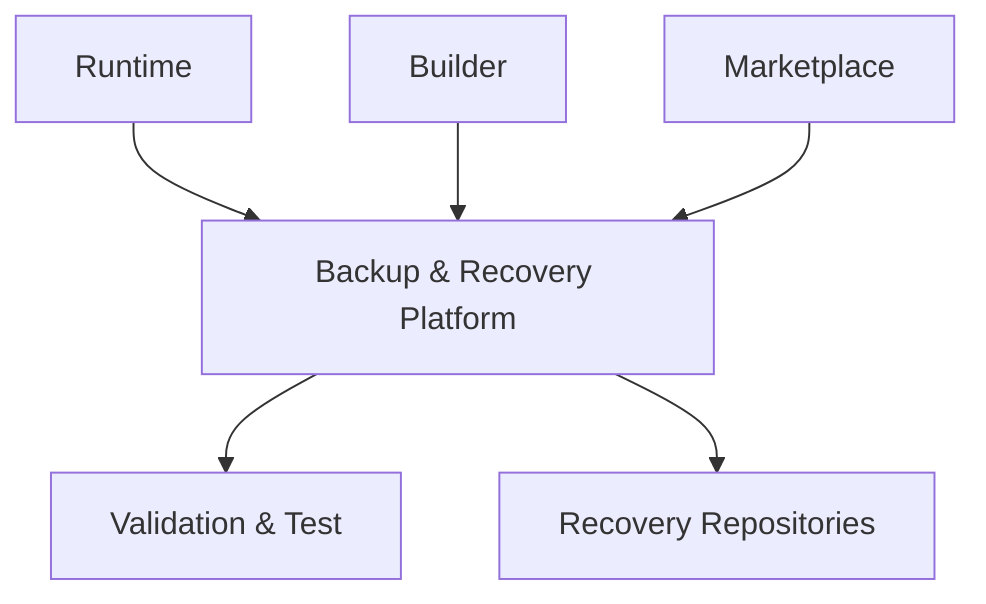
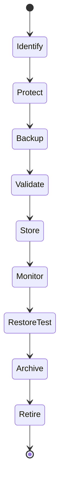
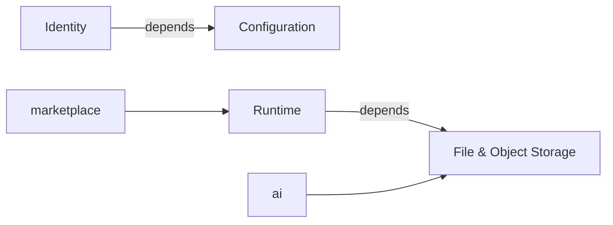
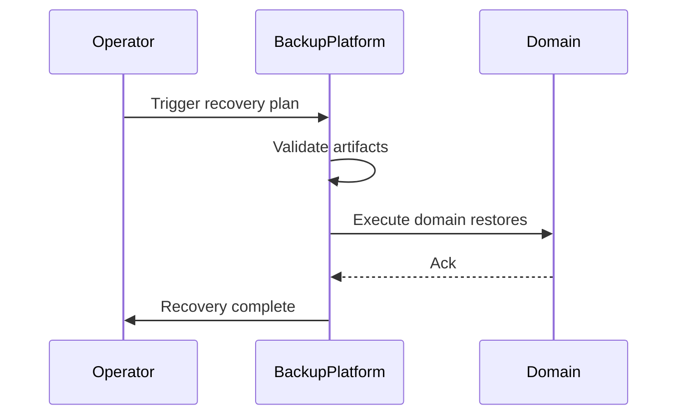
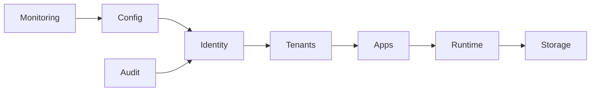
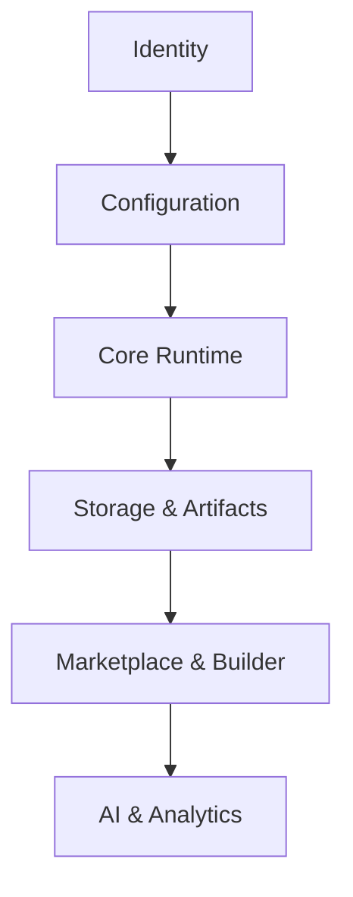

# Backup & Disaster Recovery Architecture (KB-081)

Executive Summary
-----------------
This architecture defines the platform-level approach to backup, restore, and disaster recovery (DR) for DUKADESK. It prescribes principles, recovery domains, governance, observability, and failure-handling patterns to ensure recoverability, tenant isolation, data integrity, and business continuity without prescribing vendor-specific implementations.

Purpose
-------
Define platform-level architecture governing backup, protection, validation, and recovery of DUKADESK assets, services, metadata, and configurations to meet business continuity, compliance, and resilience objectives.

Scope
-----
Covers platform configuration, identity and access systems, organizations, tenants, workspaces, applications, runtime configuration, builder artifacts, marketplace packages, templates, themes, components, binary assets (see KB-080), AI artifacts, operational data, audit records, search indexes, events, monitoring configuration, and platform metadata.

Architectural Principles
------------------------
- Recovery by Design: Recoverability is a first-class architectural concern for every domain.
- Backup Is a Platform Responsibility: Centralized platform service owns backup orchestration and validation.
- Canonical Data Protection: Backups capture metadata and dependencies required for consistent restore.
- Defense in Depth: Multiple layers of protection — snapshots, backups, replication, immutable artifacts.
- Immutable Recovery Artifacts: Backups and snapshots are cryptographically verifiable and tamper-evident where possible.
- Provider Independence: Recovery design is abstract and vendor-agnostic; adapters implement specifics.
- Tenant-Aware Recovery: Recovery artifacts are tenant-scoped; cross-tenant contamination is prohibited.
- Continuous Recoverability: Regular automated validation and test restores are required.
- Testable Recovery: Recovery plans are executable and periodically exercised.
- Business Continuity First: Recovery prioritizes critical services and sequences restores to enable business operations.

Critical Principle (Non-negotiable)
----------------------------------
Recovery is a platform capability, not an operational afterthought. Every backup must be verifiable; every recovery path governed and tested; all restores must preserve tenant isolation, security boundaries, and platform consistency.

Canonical Definitions
---------------------
- Backup: Persisted copy of data/configuration sufficient to restore a target state.
- Snapshot: Point-in-time capture of a data store or filesystem view.
- Recovery: Process to bring services/data back to operational state.
- Restore: Operation that applies backup artifacts to recover data/services.
- Disaster Recovery (DR): Coordinated orchestration of restores to recover platform capabilities after major incidents.
- Business Continuity: Ongoing operation of critical business functions during and after an incident.
- RPO (Recovery Point Objective): Acceptable data loss window.
- RTO (Recovery Time Objective): Acceptable time to restore functionality.
- Backup Policy: Rules defining frequency, retention, encryption, scope, and validation.
- Restore Point: Specific backup/snapshot used for recovery.
- Recovery Domain: Logical grouping (Identity, Runtime, Storage, Events, etc.) with distinct recovery requirements.
- Recovery Plan: Orchestrated sequence of restore actions for one or more domains.
- Recovery Artifact: Backup file, snapshot, manifest, or metadata necessary to restore.
- Backup Integrity: Verifiable assurance that backup artifacts are complete and unmodified.
- Failover / Failback: Controlled switch to alternate resources and return to primary resources, respectively (conceptual).

Backup & Disaster Recovery Architecture
---------------------------------------
Conceptual layers:

               Platform Services
                      │
      ┌───────────────┼────────────────┐
      │               │                │
   Runtime        Builder Studio   Marketplace
      │               │                │
      └───────────────┼────────────────┘
                      │
      Backup & Recovery Platform
                      │
   Backup • Validation • Restore
                      │
   Recovery Repositories (Logical)

Recovery Domains
----------------
Define per-domain recovery model and priorities:
- Identity: Auth configs, user directories, federation metadata
- Organizations/Tenants/Workspaces: Tenant configuration, memberships, billing metadata
- Runtime: Service configuration, manifests, runtime state required for recoverability
- Builder: Builder artifacts, templates, workspace definitions
- Marketplace: Package manifests, approvals, signatures
- File & Object Storage: Binary assets and manifests (align with KB-080)
- Events: Event logs, durable event store for replay
- Search: Index snapshots and reindexing plans
- Configuration: Platform configuration, feature flags
- Monitoring & Observability: Dashboards, alert rules, retention
- Audit: Immutable audit logs and change history
- AI Services: Model artifacts, training provenance, metadata

Backup Classification (conceptual)
----------------------------------
- Full Backup: Comprehensive snapshot of a domain at a point-in-time.
- Incremental Backup: Capture of changes since last backup to reduce storage/time.
- Differential Backup: Capture of changes since last full backup.
- Metadata Backup: Focused capture of metadata required for integrity and references.
- Configuration Backup: Platform and service configuration artifacts.
- Binary Asset Backup: Backup of object repositories or manifests referencing external providers.
- Audit Backup: Immutable copies of audit and compliance data.
- Event Backup: Durable export of event streams for replay.
- Archive Backup: Long-term immutable archives for compliance.

Backup Lifecycle
----------------
Identify → Protect → Backup → Validate → Store → Monitor → Restore Test → Archive → Retire

Key lifecycle rules:
- Identification of recovery scope and dependencies is mandatory before backup.
- Backup artifacts include metadata manifests that capture dependencies (what to restore first).
- Validation includes integrity checks, schema compatibility checks, and test restores where feasible.
- Storage of backups must enforce immutability and access controls.
- Monitoring tracks coverage, success, and drift from expected schedules.

Recovery Architecture
---------------------
Patterns and capabilities:
- Platform Recovery: Orchestrated restores across domains per recovery plan.
- Domain Recovery: Self-contained restore for a domain (e.g., tenant-level restore).
- Workspace/Tenant Recovery: Selective restore scoped to a tenant or workspace using tenant-scoped artifacts.
- Application Recovery: Restore application configuration and dependencies.
- Selective Restore: Restore specific objects or subsets (e.g., single tenant data, single artifact).
- Point-in-Time Recovery: Use incremental/differential artifacts to reconstruct state to a point in time (conceptual).
- Cross-Region Recovery: Strategy for regional failover and recovery with data residency constraints.
- Failover Modes: Cold, Warm, Hot (architectural descriptions only).

Backup Governance
-----------------
Governance primitives:
- Ownership: Each domain has an owner responsible for recovery objectives and policies.
- Policies: Define RPO/RTO, retention, encryption, access, and test cadence.
- Classification: Backup class drives storage and retention choices.
- Retention: Rules for short/long-term retention and legal hold handling.
- Validation: Automated validation and periodic test restores as policy requirements.
- Encryption Domains: Backups reference encryption domains and key management responsibilities.
- Approval: Recovery actions requiring manual approval (for sensitive or cross-tenant operations).
- Auditability: All backup and restore operations are auditable with provenance metadata.

Disaster Recovery Planning
--------------------------
Conceptual planning components:
- Service Outage: Define recovery sequence, dependencies, and temporary mitigations.
- Storage Failure: Use replication and logical repository failover strategies.
- Identity Failure: Recovery of identity provider and access controls in a secure, auditable way.
- Configuration Corruption: Restore from last-known-good configuration backup and validate.
- Data Corruption: Use point-in-time recovery and validated backups to restore clean data.
- Security Incident: Preserve forensic artifacts, freeze backups if needed, and apply approved restore plans.
- Regional Failure: Cross-region failover with residency-aware recovery artifacts.
- Total Platform Recovery: Orchestrated playbook combining domain recovery plans into a platform recovery plan.

Business Continuity
-------------------
- Critical Services: Classify critical services and set elevated RPO/RTO expectations.
- Recovery Prioritization: Restore in order of business impact and dependency graph.
- Service Dependencies: Explicit dependency mapping to sequence recoveries correctly.
- Operational Continuity: Temporary degraded modes to preserve core functionality while full restore completes.
- Recovery Sequencing: Automated and manual steps described in recovery plans; plans are machine-executable where possible.

Responsibilities
----------------
Runtime Responsibilities:
- Expose dependency manifests and minimum viable configuration for restart.
- Integrate with platform recovery orchestration for service restores.

Backend Responsibilities:
- Orchestrate backups and validation workflows.
- Maintain recovery manifests and dependency graphs.
- Provide APIs for selective tenant/asset restores.

Builder Responsibilities:
- Ensure builder artifacts include provenance and are covered by backup policies.
- Participate in test restores for workspace-level recovery.

Marketplace Responsibilities:
- Ensure package metadata and signatures are included in backups.
- Support validation of restored marketplace artifacts.

AI Platform Responsibilities:
- Ensure model artifacts, training provenance, and datasets have defined backup strategies and validation.
- Document sensitive model recovery constraints (privacy, consent).

Security
--------
- Backup Integrity: Cryptographic checksums and signed manifests to detect tampering.
- Immutable Backups: Use write-once/read-many (WORM) or equivalent immutability controls conceptually.
- Secure Restore: Authorization and approval for restore operations; least-privilege restoration tokens.
- Access Control: Role-based controls for backup and restore operations, separation of duties.
- Backup Authorization: Explicit approvals for high-impact restores (cross-tenant or platform-level).
- Recovery Auditing: All recovery procedures are logged with actor, justification, and artifacts used.
- Tamper Detection: Monitor for unexpected changes to backup repositories and manifests.

Privacy
-------
- Consumer Data Protection: Ensure restores respect consent and deletion requests; documented exceptions for legal holds.
- Tenant Isolation: Backups and restores cannot cross tenant boundaries without explicit, auditable approval.
- Consent Implications: Restore flows consider consent metadata and privacy obligations.
- Sensitive Data Recovery: Additional controls and approvals required for regulated data.
- Secure Disposal: Procedures to securely delete expired backup artifacts per retention policy.

Performance
-----------
- Backup Windows: Policies define acceptable windows and techniques to minimize impact (incremental, snapshot-based).
- Restore Performance: Defined RTO targets and test measurements; parallelized restores where applicable.
- Recovery Prioritization: Prioritize critical domains to shorten business-impacting downtime.
- Storage Efficiency: Deduplication and incremental strategies to reduce backup footprint (conceptual).
- Recovery Scalability: Architect recovery pipelines to scale with data and tenant counts.
- Validation Impact: Balance validation depth with operational cost; use sampling and targeted full restores.

Observability (see KB-058)
---------------------------
Monitor and expose:
- Backup success/failure rates and durations
- Restore success/failure rates and durations
- Backup coverage and gaps (per domain, tenant)
- Integrity verification metrics
- Test restore frequency and results
- Backup repository capacity and health

Failure Scenarios & Handling
----------------------------
- Corrupted Backup: Detect via integrity checks; failover to alternate artifacts and initiate investigation.
- Incomplete Restore: Detect via validation checks; rollback or retry from alternate restore point.
- Missing Metadata: Maintain separate metadata backups; include manifest backups as first-class artifacts.
- Cross-Tenant Recovery Error: Prohibit by design; if detected, trigger incident response and forensic review.
- Configuration Mismatch: Validate configurations against schema and compatibility rules before applying.
- Identity Recovery Failure: Pre-staged emergency access plans and out-of-band recovery artifacts.
- Backup Repository Failure: Replicated repositories and alternate restore paths.
- Recovery Validation Failure: Escalate and schedule manual recovery exercises.

Anti-patterns
-------------
- Untested backups or no validation
- Backups without metadata or dependency manifests
- Shared tenant recovery artifacts that enable cross-tenant restores
- Using backups as primary archival storage without validation
- Single-location backups (lack of geographic redundancy)
- Undefined recovery ownership
- Recovery without monitoring or audit trails

Future Evolution
----------------
- Autonomous Recovery Validation: Automated, continuous test restores and anomaly detection.
- AI-Assisted Disaster Recovery: Use ML to predict failures and recommend recovery sequences.
- Predictive Risk Analysis: Surface risk of data loss based on telemetry and storage health.
- Self-Healing Platform Recovery: Automated remediation for routine failure classes.
- Global Recovery Federation: Federated recovery across regions and partner platforms.
- Continuous Recovery Testing: Non-disruptive testing integrated into CI/CD and platform operations.

Cross References
----------------
- KB-057 Runtime Security Architecture
- KB-058 Runtime Observability & Diagnostics Architecture
- KB-073 Data Platform Architecture
- KB-075 Storage Architecture
- KB-076 Data Access Layer Architecture
- KB-077 Event & Messaging Architecture
- KB-080 File & Object Storage Architecture
- KB-082 Data Lifecycle & Retention Architecture (planned)
- KB-085 Data Governance & Quality Architecture (planned)

Mermaid Diagrams
----------------
1) Backup & Disaster Recovery Architecture

2) Backup Lifecycle

3) Recovery Domain Map

4) Disaster Recovery Workflow

5) Recovery Dependency Graph

6) Business Continuity Architecture

7) Platform Recovery Sequence

8) Backup Governance Model

9) Recovery Readiness Pipeline

10) End-to-End Restore Flow

Acceptance Criteria Mapping
---------------------------
- Architecture only: No vendor or implementation specifics included.
- Infrastructure independent: Concepts apply across providers and on-prem.
- Enterprise grade: RPO/RTO, governance, tamper controls, validation, and tenant isolation covered.
- Cross-referenced: Key KBs referenced for security, observability, data, and storage.
- Mermaid complete: Ten diagrams included.
- Ready for Knowledge Base: Structured for review and inclusion.

Completion Checklist
--------------------
- [x] Add KB-081 file (this document)
- [x] Mark KB-081 in PROGRESS_REGISTRY.md as Draft
- [x] Queue KB-082 — Data Lifecycle & Retention Architecture

Notes
-----
This architectural specification intentionally omits runbooks and vendor specifics. Implementation teams must map these abstractions to concrete mechanisms while preserving recoverability, tenant isolation, validation, and auditability.
