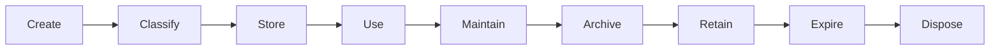
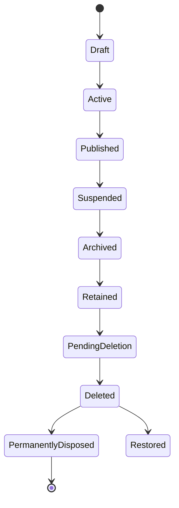
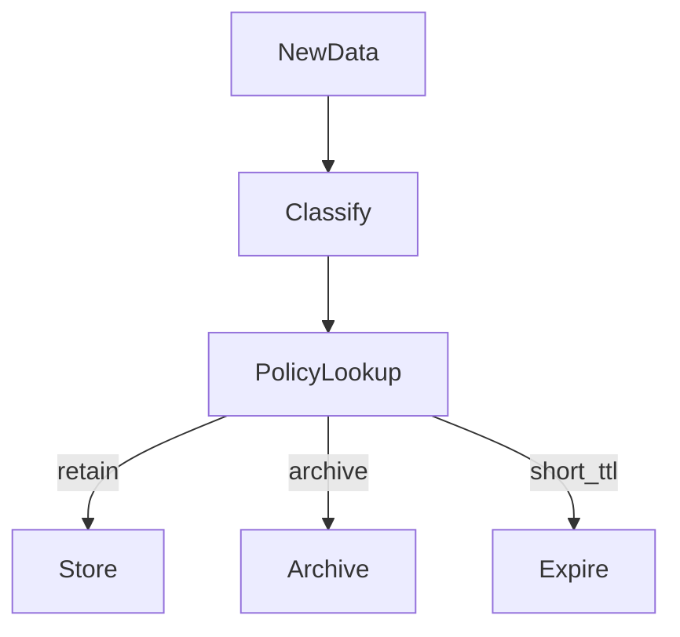
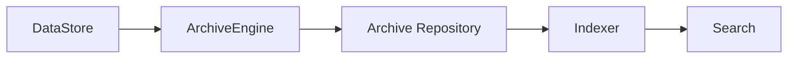
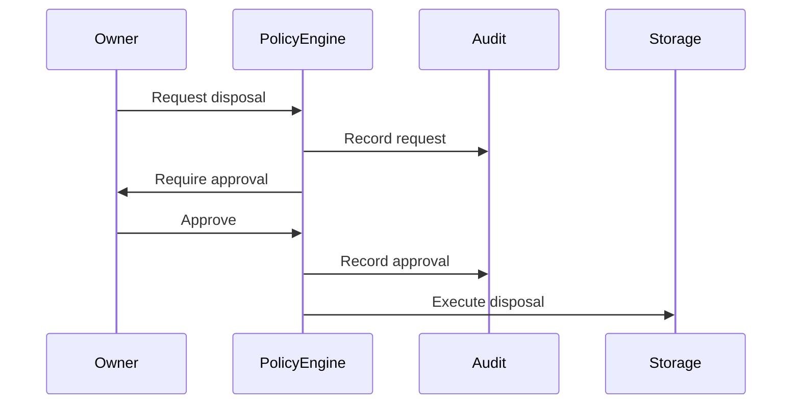
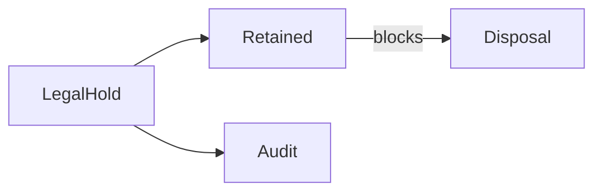
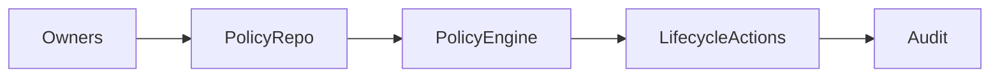
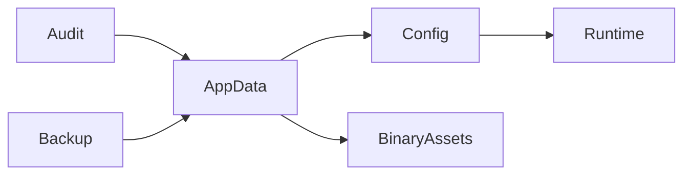
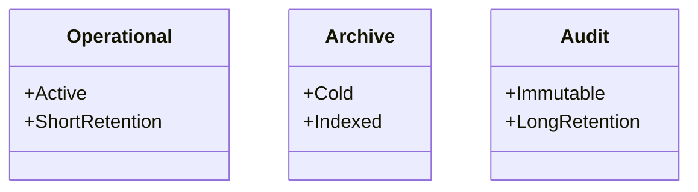

# Data Lifecycle & Retention Architecture (KB-082)

Executive Summary
-----------------
This specification defines the platform-level architecture that governs how every piece of data in DUKADESK is created, classified, retained, archived, and securely disposed. It mandates ownership, policy-driven retention, legal-hold handling, and auditable disposal for all data categories while remaining technology- and regulation-agnostic.

Purpose
-------
Establish a canonical architecture for data lifecycle management and retention across the platform to ensure compliance, cost control, recoverability, tenant isolation, and predictable data behavior.

Scope
-----
Covers identity, consumer and tenant records, workspace/application data, runtime state, builder metadata, marketplace artifacts, binary assets (KB-080), AI artifacts, events, search indexes, configuration, analytics, monitoring, audit records, and import/export artifacts.

Architectural Principles
------------------------
- Every Data Has a Lifecycle: No data exists without an assigned lifecycle and owner.
- Ownership Before Retention: Data must have an accountable owner prior to persistence.
- Policy-Driven Retention: Retention rules are declarative policies separate from implementation.
- Canonical Lifecycle States: A small, consistent state model governs transitions and tooling.
- Immutable Audit History: All lifecycle actions and approvals are auditable and tamper-evident.
- Compliance by Design: Legal hold and regulatory constraints are first-class concepts.
- Recoverability Before Disposal: Validation that data can be recovered within retention windows before irreversible disposal.
- Secure Disposal: Deletion is deliberate, verifiable, and irreversible when required.
- Tenant-Aware Lifecycle: Policies and execution respect tenant boundaries and consent.
- Automated Governance: Policy engines automate lifecycle transitions and enforcement.

Critical Principle (Non-negotiable)
----------------------------------
No data exists without a governed lifecycle. Every stored artifact must include ownership, classification, lifecycle state, retention policy reference, and an auditable disposition path.

Canonical Definitions
---------------------
- Lifecycle: The end-to-end sequence governing data from creation to disposal.
- Lifecycle State: Discrete states an item may occupy (Draft, Active, Archived, Retained, Pending Deletion, Deleted, Disposed).
- Active/Inactive Data: Operational data in current use vs. seldom-accessed data.
- Archived Data: Data moved to lower-cost, searchable archives with preserved metadata.
- Retained Data: Data kept beyond normal expiration (e.g., legal hold).
- Expired Data: Data whose retention window has elapsed and is eligible for disposal.
- Deleted Data: Data removed from active systems but may be recoverable for a defined window.
- Disposal: Irreversible destruction of data per policy.
- Retention Policy: Declarative rules specifying RTO/RPO considerations, retention durations, storage class, and disposal controls.
- Archive Policy: Rules governing archival timing, indexing, and retrieval constraints.
- Legal Hold: Mechanism to override retention/expiration to prevent disposal.
- Preservation: Long-term safeguarding for compliance or historical needs.
- Data Destruction: Verified, irreversible removal of data and traces.
- Recovery Window: Time during which deleted items are recoverable.
- Data Classification: Labeling that influences retention, access, and disposal rules.

Data Lifecycle Architecture
---------------------------
Create → Classify → Store → Use → Maintain → Archive → Retain → Expire → Dispose

Lifecycle States (canonical)
----------------------------
- Draft
- Active
- Published
- Suspended
- Archived
- Retained (LegalHold)
- Pending Deletion
- Deleted (Recoverable)
- Permanently Disposed
- Restored

Transition rules:
- Ownership change must be recorded on state transition.
- Legal hold transitions to Retained prevent disposal actions.
- Automated transitions executed by policy engine; manual transitions require approval and are auditable.

Data Classification
-------------------
Class-specific responsibilities and default lifecycle guidance:
- Operational Data: Shorter retention, frequent backups, quick restore paths.
- Master Data: Higher integrity, provenance metadata, longer retention.
- Transactional Data: RPO-focused, retained per regulatory policy.
- Reference Data: Archive-friendly, versioned preservation.
- Temporary Data: Short TTL, auto-cleanup.
- Runtime State: Recoverability-first; typically short-lived snapshots plus persistent checkpoints.
- Configuration: Versioned, preserved for rollback and audit.
- Binary Assets: Use KB-080 policies for retention and archival.
- Audit Records: Immutable, long retention, preserved integrity and indexing.
- Events: Retention depends on replay needs; snapshots or export for long-term.
- Search Indexes: Rebuildable from source; policies favor index snapshots over indefinite retention.
- AI Assets: Model provenance, training data retention rules, and consent metadata.

Retention Architecture
----------------------
- Policies are first-class objects stored in the Policy Repository and referenced by metadata.
- Policy attributes: scope (tenant/workspace), retention windows, archival class, legal hold behavior, approval requirements, encryption domain.
- Enforcement: Policy Engine evaluates and executes lifecycle transitions, triggers archival, and coordinates with Backup/DR and Storage platforms.
- Durations and retention classes are policy-managed — not hardcoded.

Archive Architecture
--------------------
- Archive Domains map to data domains and influence storage class and retrieval semantics.
- Archive artifacts preserve metadata, version history, and integrity signatures to ensure fidelity on retrieval.
- Retrieval: Indexed retrieval where required; archival retrieval may be subject to approval workflows and costs.
- Searchability: Metadata indexing ensures archived data remains discoverable per policy.
- Version Preservation: Archived artifacts maintain version lineage and provenance.

Disposal Architecture
---------------------
- Secure Disposal: Multi-step verification (ownership/approval/legal hold check) before destructive actions.
- Ownership Verification: Owner and policy must authorize disposal; automated policy can mark items for scheduled disposal.
- Approval Workflow: Sensitive disposals require manual approvals recorded in audit trail.
- Tenant Isolation: Disposal operations cannot affect other tenants; cross-tenant deletion requires cross-domain approval.
- Dependency Validation: Ensure no active references or dependencies exist before disposal.
- Audit Recording: All disposal actions produce signed audit artifacts for compliance.
- Irreversible Disposal: Final disposal removes recoverable traces per policy and jurisdiction constraints.

Legal Hold Architecture
-----------------------
- Legal holds are metadata flags causing objects to transition to Retained state.
- Holds can be tenant-scoped, case-scoped, or global; hold lifecycle is recorded and auditable.
- Holds block automated disposal, archival (when applicable), and may trigger preservation workflows.
- Release of holds requires approval and is auditable.

Lifecycle Governance
--------------------
- Ownership: Every data class and instance has an accountable owner responsible for policies.
- Policy Management: Central repository for retention, archive, and disposal policies with versioning.
- Approval: Manual approval engines for exceptions and high-impact transitions.
- Auditing: Immutable audit trail for every lifecycle decision and action.
- Versioning: Policies and lifecycle actions are versioned to enable reproducible decisions.
- Compliance: Integrate legal/regulatory constraints as policy inputs; exceptions tracked and approved.
- Exception Handling: Controlled exception workflows with time-bound, auditable approvals.

Responsibilities
----------------
Runtime Responsibilities:
- Tag runtime artifacts with lifecycle metadata and minimum viable provenance for recovery.
- Integrate with policy engine to honor retention and disposal signals.

Backend Responsibilities:
- Persist and serve lifecycle metadata as canonical source of truth.
- Execute policy-engine actions and coordinate with archive/backup/storage subsystems.
- Provide APIs to query lifecycle state, triggers, and audit history.

Builder Responsibilities:
- Ensure authored artifacts (templates, themes, packages) include lifecycle metadata and ownership.
- Participate in retention reviews and approve disposals when required.

Marketplace Responsibilities:
- Ensure package lifecycle (publish, approve, archive, deprecate) is represented and enforced by policies.

AI Platform Responsibilities:
- Tag models and datasets with provenance, consent, and retention metadata; enforce stricter disposal rules where needed.

Security
--------
- Secure Retention: Encryption-in-transit and at-rest per encryption domain referenced in retention policy.
- Controlled Disposal: Authorization, multi-party approval for sensitive disposals, and tamper-evident audits.
- Tamper Resistance: Immutable logs and signed lifecycle actions to detect unauthorized changes.
- Tenant Isolation: Strong separation of retention artifacts to prevent cross-tenant leakage.
- Authorization: RBAC/ABAC for lifecycle operations; separation of duties between owners and operators.
- Auditability: Full traceability of lifecycle decisions and the ability to produce evidence for compliance.

Privacy
-------
- Right to Erasure: Disposal flows must honor erasure requests subject to legal hold and retention constraints.
- Data Portability: Lifecycle architecture supports export prior to disposal when required.
- Consent-Aware Retention: Consent metadata influences retention and archival choices.
- Sensitive Data Lifecycle: Extra controls and approvals for regulated data types.
- Consumer & Tenant Ownership: Respect owner requests subject to retention and legal constraints.

Performance
-----------
- Archive Retrieval: Define SLAs for retrieval per archive class (fast vs. cold retrieval).
- Lifecycle Processing: Policy engine scales to evaluate lifecycle conditions at scale with batch and streaming modes.
- Bulk Archival/Disposal: Support efficient bulk operations with dependency checks and staged validation.
- Retention Evaluation: Scheduled and event-driven evaluations to determine transitions.
- Lifecycle Scalability: Architecture supports millions of lifecycle objects and policies with sharding and indexing.

Observability (see KB-058)
---------------------------
Expose metrics and signals for:
- Counts by lifecycle state and domain
- Transitions per policy and owner
- Pending disposals and approval queues
- Legal hold counts and durations
- Archive retrieval latencies and success rates
- Compliance and policy violation alerts

Failure Scenarios & Handling
----------------------------
- Data Retained Beyond Policy: Detect via monitoring, alert owner, and remediate with policy-driven workflows.
- Premature Deletion: Reconcile via backups/DR; identify root cause and tighten approval controls.
- Archive Corruption: Integrity checks and parity with backup/DR artifacts; failover to secondary archives.
- Missing Metadata: Quarantine affected objects, notify owners, and reconstruct metadata from manifests or backups.
- Legal Hold Bypass: Emergency remediation, forensic audit, and policy enforcement tightening.
- Cross-Tenant Disposal: Immediate containment, revoke operations, forensic analysis, and restore from backup.
- Orphaned Archived Assets: Periodic reconciliation and garbage collection with owner notification.
- Failed Disposal Audit: Prevent finalization until audit can be produced; escalate to ops.

Anti-patterns
-------------
- Infinite retention without governance
- Hardcoded retention windows in application logic
- Manual deletion outside policy engine
- Disposal without audit trail or approvals
- Using archive as primary active storage
- Missing lifecycle owners
- Ignoring legal holds

Future Evolution
----------------
- Autonomous Lifecycle Management: Automated recommendations and enactment under guardrails.
- AI-Driven Retention Optimization: Use access/usage patterns to tune policies.
- Intelligent Classification: Automated tagging to reduce manual policy assignment.
- Predictive Archival: Move assets preemptively based on usage forecasts.
- Compliance Automation: Auto-generate compliance artifacts and reports.
- Cross-Region Lifecycle Governance: Coordinate lifecycle enforcement across regions and residency constraints.

Cross References
----------------
- KB-057 Runtime Security Architecture
- KB-058 Runtime Observability & Diagnostics Architecture
- KB-073 Data Platform Architecture
- KB-075 Storage Architecture
- KB-080 File & Object Storage Architecture
- KB-081 Backup & Disaster Recovery Architecture
- KB-083 Data Synchronization Architecture (planned)
- KB-084 Data Import & Export Architecture (planned)
- KB-085 Data Governance & Quality Architecture (planned)

Mermaid Diagrams
----------------
1) Data Lifecycle Architecture



2) Lifecycle State Machine



3) Retention Decision Flow



4) Archive Architecture



5) Disposal Approval Workflow



6) Legal Hold Interaction Model



7) Lifecycle Governance Structure



8) Lifecycle Dependency Graph



9) End-to-End Data Lifecycle

```mermaid
flowchart LR
  User -> CreateData --> Classify --> Store --> Use --> Archive --> Dispose
```

10) Data Classification vs Lifecycle Matrix



Acceptance Criteria Mapping
---------------------------
- Architecture only: No vendor or implementation specifics.
- Technology independent: Policies and lifecycle states are abstract.
- Regulation independent: Architecture supports regulatory inputs via policies.
- Enterprise grade: Ownership, legal hold, auditing and governance covered.
- Cross-referenced: Links to KB-080, KB-081, KB-075, KB-058, KB-057.
- Mermaid complete: Ten diagrams included.
- Ready for Knowledge Base: Structured for review and inclusion.

Completion Checklist
--------------------
- [x] Add KB-082 file (this document)
- [x] Mark KB-082 in PROGRESS_REGISTRY.md as Draft
- [x] Queue KB-083 — Data Synchronization Architecture

Notes
-----
This specification is intentionally implementation-agnostic. Implementation teams must map policy objects and lifecycle engines to concrete systems while preserving the canonical principle that every datum must have a governed lifecycle.
