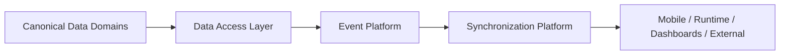
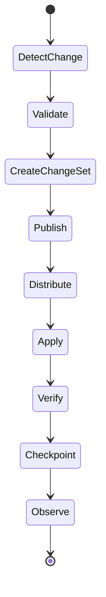
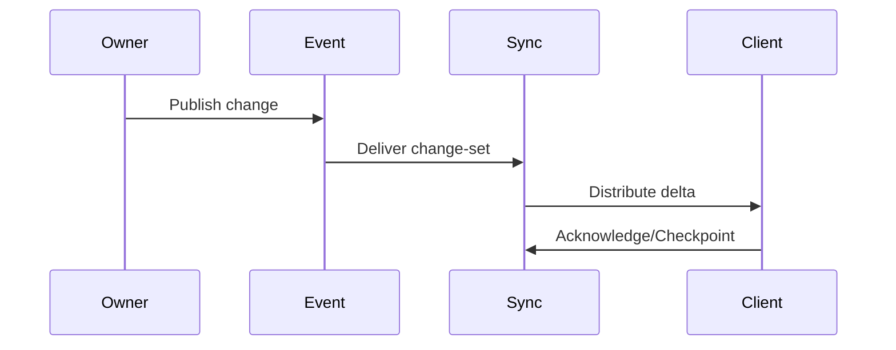
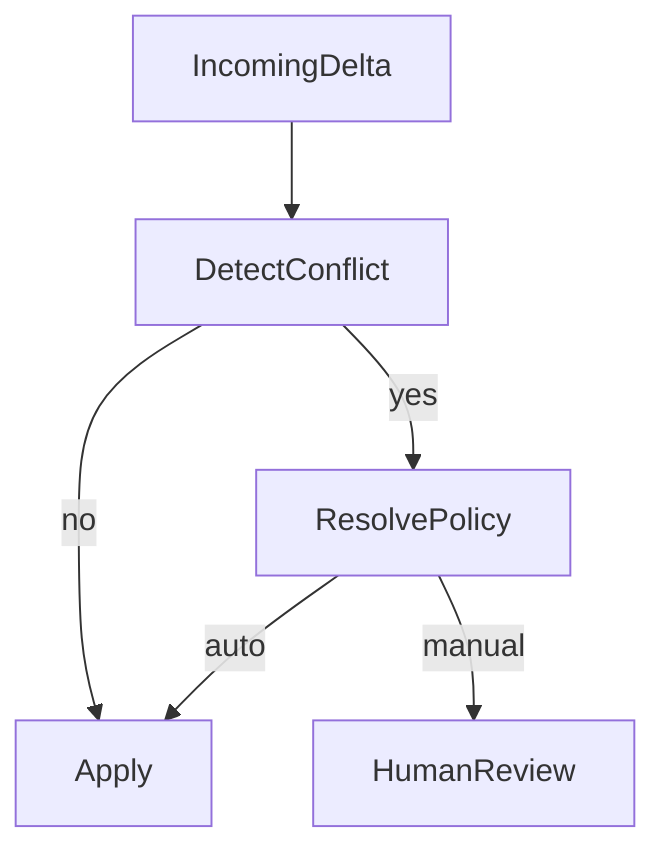
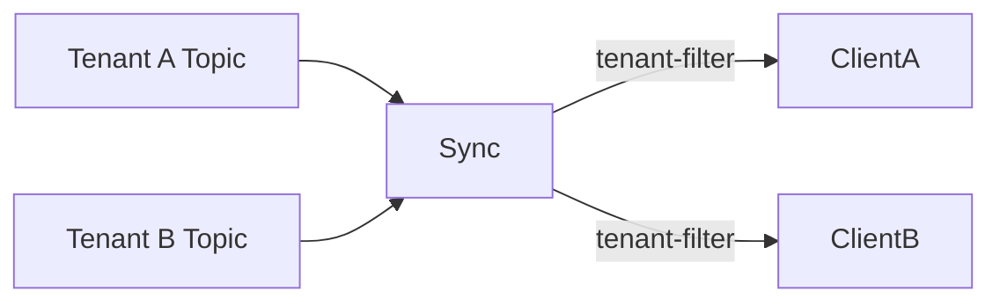
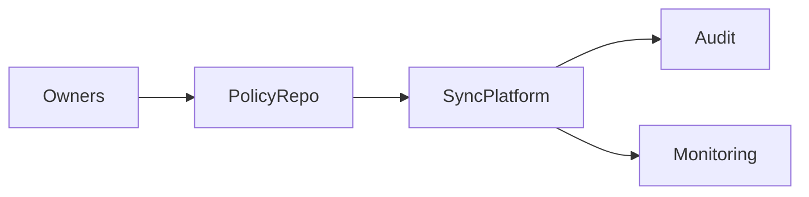
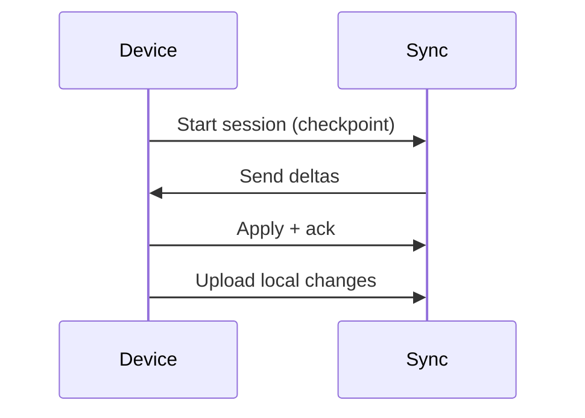
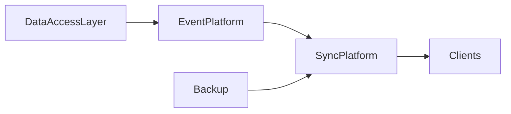

# Data Synchronization Architecture (KB-083)

Executive Summary
-----------------
This architecture defines the platform capability that propagates canonical data changes across DUKADESK surfaces (Runtime, Mobile, Builder Studio, Dashboards, AI Platform, integrations, and offline clients). Synchronization is event-driven, version-aware, tenant-isolated, and always derived from canonical owners — it never creates authoritative data.

Purpose
-------
Define the architectural model for reliably and securely distributing authoritative changes to ensure data freshness, integrity, conflict awareness, and observability across devices and services while preserving tenant isolation and ownership boundaries.

Scope
-----
The Synchronization Platform governs propagation and reconciliation for: platform metadata, identity, organizations, tenants, workspaces, applications, runtime state, builder metadata, marketplace assets, configuration, events, search projections, file metadata, AI context, offline devices, and external integrations.

Architectural Principles
------------------------
- Canonical Source of Truth: Each domain has a single canonical owner; synchronization only propagates changes.
- Synchronization Is Derived: No authoritative writes originate from synchronization endpoints.
- Event-Driven Propagation: Changes are published as events/change-sets for distribution.
- Eventual Consistency by Design: Consumers converge to canonical state; strong consistency is used only where explicitly required.
- Tenant Isolation: Synchronization enforces tenant scoping and prevents cross-tenant exposure.
- Conflict Awareness: Conflicts are detected, measurable, and resolvable via policies.
- Observable Synchronization: End-to-end visibility into change propagation and health.
- Offline First: Clients can operate offline and reconcile when network resumes.
- Incremental Synchronization: Only deltas are propagated when possible to reduce bandwidth.
- Version-Aware Synchronization: Version vectors, checkpoints, or similar are used to order and resume synchronization.

Critical Principle (Non-negotiable)
----------------------------------
Synchronization distributes authoritative data; it never creates authoritative data. Ownership of each domain remains with its canonical owner; synchronization is solely a distribution and reconciliation service.

Canonical Definitions
---------------------
- Synchronization: Process of distributing and applying changes from the canonical source to consumers.
- Synchronization Domain: Logical grouping of data with shared ownership and rules.
- Synchronization Unit: The minimum atomic unit of change (e.g., record, asset meta, manifest).
- Change Set / Delta: A set of changes to be applied to reach a new state.
- Snapshot: Point-in-time copy used for bootstrapping or recovery.
- Version Vector (conceptual): Mechanism to track causal ordering and detect concurrent changes.
- Synchronization Session: Scoped interaction between a client and the sync platform for exchange of changes and checkpoints.
- Conflict: Divergence between local and canonical state detected during apply.
- Conflict Resolution: Policy or procedure to reconcile conflicting changes.
- Replication: Logical duplication of data for availability/performance (conceptual distinction from sync).
- Checkpoint: Durable marker representing applied change position.
- Synchronization Policy: Rules governing scope, frequency, conflict handling, visibility, and security.
- Synchronization State: Metadata describing what has been delivered/applied for a consumer.

Synchronization Architecture
----------------------------

             Canonical Data Domains
                     │
             Data Access Layer
                     │
              Event Platform
                     │
          Synchronization Platform
                     │
     ┌───────────────┼────────────────┐
     │               │                │
   Mobile        Runtime Apps     Dashboards
     │               │                │
     └───────────────┼────────────────┘
                     │
           Offline & External Systems

Responsibility boundary:
- Canonical domains own writes and semantic validation.
- Event Platform reliably publishes change events.
- Synchronization Platform subscribes to change streams, enriches with policy, and distributes per consumer capabilities and scoping.
- Consumers apply deltas, produce telemetry, and maintain checkpoints.

Synchronization Domains
-----------------------
Domains include identity, organization, tenant, workspace, applications, runtime state, builder, marketplace, configuration, search projections, file metadata, AI context, and analytics. Each domain defines synchronization granularity, conflict policies, retention and versioning expectations.

Synchronization Lifecycle
-------------------------
Detect Change → Validate → Create Change Set → Publish → Distribute → Apply → Verify → Checkpoint → Observe

Key lifecycle notes:
- Detection occurs at the canonical owner (write path or CDC).
- Validation ensures change sets conform to schema and policy before publish.
- Distribution honors tenant scoping, security, and consumer capabilities.
- Verification includes integrity checks and business-level verifications.
- Checkpoints allow resume and idempotent application.

Synchronization Models
----------------------
- Real-Time Synchronization: Low-latency event streaming for live updates (e.g., UI state, collaboration).
- Near Real-Time: Batched micro-batches with short windows for lower cost.
- Scheduled Synchronization: Non-critical bulk refreshes (e.g., nightly index projections).
- Manual Synchronization: Admin-triggered re-syncs for repair.
- Offline Synchronization: Local queues and reconciliation when connectivity returns.
- Incremental Synchronization: Deltas only, using change tokens or version vectors.
- Snapshot Synchronization: Full state transfer for bootstrapping or corrupted client recovery.

Offline Synchronization
-----------------------
Architecture for disconnected clients:
- Local Data Store: Client-side persisted store with lifecycle semantics and size controls.
- Change Tracking: Local operations appended to a change log with causal metadata.
- Local Queue: Outgoing changes buffered and ordered for submission.
- Deferred Synchronization: Retry/backoff, chunking, and partial sync support.
- Reconciliation: Merge/resolve conflicts on apply using domain policies and manual resolution hints.
- Network Recovery: Sessions resume using checkpoints and incremental deltas.
- Partial Synchronization: Clients subscribe to scoped subsets (tenant/workspace/filters).

Conflict Resolution
-------------------
Conceptual approaches:
- Ownership-Based Resolution: Canonical owner wins; consumer-submitted edits are rejected or routed as contributions.
- Last-Write-Wins (LWW): Time-based resolution for low-risk domains (use cautiously).
- Merge Strategies: Field-level merges, CRDTs for collaboration-heavy data (conceptual only).
- Manual Resolution: Surface conflicts for human intervention where policy requires.
- Policy-Based Resolution: Domain policies express preferred resolution patterns.
- Failed Sync Recovery: Escalation paths, replay from snapshots, or manual reconciliation.

Synchronization Governance
--------------------------
- Ownership: Domains register owners who define synchronization scope and policies.
- Policies: Synchronization policies include TTL, scope, allowed consumers, conflict rules, retention of checkpoints, and replay windows.
- Synchronization Registry: Catalog of domains, versions, schemas, and consumers.
- Version Compatibility: Schema evolution rules and compatibility strategies (backward/forward compatibility guidance).
- Approval: Controlled onboarding of new consumers and schema changes.
- Auditability: Every published change, delivered checkpoint, and applied event is auditable and linked to provenance.

Responsibilities
----------------
Runtime Responsibilities:
- Consume canonical change sets via checkpoints and apply them idempotently.
- Expose minimal state needed for offline clients and accept synchronized deltas only where domain permits.

Backend Responsibilities:
- Publish reliable change events (CDC or write-path hooks).
- Provide durable change storage for replay within retention window.
- Provide checkpoint APIs and health telemetry.

Mobile Runtime Responsibilities:
- Maintain local stores and replay queues, provide UI for conflict resolution when necessary.
- Use incremental sync and offline-first strategies to minimize bandwidth and latency.

Builder Responsibilities:
- Subscribe to required domain change sets and honor schema versions.
- Coordinate publish flows for authored artifacts to ensure deterministic change sets.

Marketplace Responsibilities:
- Propagate package metadata and lifecycle changes; ensure signed manifests are distributed and validated.

AI Platform Responsibilities:
- Synchronize model metadata, context, and provenance; avoid broadcasting raw training data.
- Ensure synchronization respects data classification and consent.

Security
--------
- Authorized Synchronization: Consumers must authenticate and be authorized for domain scope.
- Tenant Isolation: Tokens and channel filters prevent cross-tenant delivery.
- Secure Transport: TLS and mutual-auth where possible (architecture-level requirement).
- Integrity Verification: Change sets include checksums/signatures to validate payload integrity.
- Replay Protection: Checkpoints and sequence numbers prevent replay attacks and duplicates.
- Synchronization Authorization: RBAC/ABAC controls govern which consumers can subscribe and apply changes.
- Synchronization Auditing: Capture who published, delivered, and applied changes for forensic traceability.

Privacy
-------
- Consent-Aware Synchronization: Domain owners attach consent metadata that sync consumers must honor.
- Personal Data Synchronization: Minimization and scoping; sensitive fields excluded or tokenized unless explicit permission.
- Sensitive Data Restrictions: Some domains (PII, regulated data) may be read-only in remote consumers or require additional approvals.
- Cross-Tenant Prevention: Sync channels enforce tenant scoping strictly; cross-tenant sync requires explicit, auditable permission.
- Right to Erasure Impact: Synchronization systems must honor deletion signals and propagate purge actions respecting retention and legal holds.

Performance
-----------
- Incremental Updates: Use deltas and compact change sets to optimize bandwidth.
- Delta Distribution: Efficient fan-out strategies and topic partitioning to scale to many consumers.
- Synchronization Latency: SLAs per domain; critical domains target low-latency streaming.
- Conflict Detection: Scalable detection using vector clocks, causal metadata, or lightweight version tokens.
- Scalability: Horizontal scaling, partitioning by tenant or domain, and backpressure handling.
- Offline Efficiency: Compaction of local queues, selective sync, and resumable streams.

Observability (see KB-058)
---------------------------
Expose metrics and traces for:
- Synchronization success and failure rates per domain and consumer
- Queue depth and processing latency
- Checkpoint lag and staleness
- Conflict counts and resolution times
- Delivered vs applied counts
- Consumer health and backpressure

Failure Scenarios & Handling
----------------------------
- Lost Change Set: Durable retention for replay; alert and remediate by re-publishing from canonical owner.
- Duplicate Synchronization: Idempotent apply patterns and deduplication by sequence ids/checkpoints.
- Version Conflict: Reject apply with clear error and surface for resolution or replay from snapshot.
- Network Interruption: Retry/backoff and resumable sessions using checkpoints.
- Cross-Tenant Synchronization: Immediate revocation of channels and audit plus incident response.
- Corrupted Snapshot: Validation with checksums; fall back to earlier snapshots.
- Offline Queue Overflow: Eviction policies, compaction, and alerting.
- Failed Reconciliation: Escalate to manual resolution and provide tooling for merge.

Anti-patterns
-------------
- Multiple sources of truth — avoid writable replicas that outvote the canonical owner.
- Bidirectional ownership — ownership must remain single-source.
- Full synchronization by default — sync subsets by need.
- Ignoring version conflicts — always detect and handle.
- Unauthenticated synchronization endpoints.
- Shared tenant synchronization channels without strict scoping.
- Synchronization without observability and audit trails.

Future Evolution
----------------
- Peer-to-Peer Synchronization: Device-to-device sync for edge scenarios.
- Multi-Region Synchronization: Geo-aware partitioning and routing for latency and residency.
- Edge Synchronization: Local gateways for low-latency regional hubs.
- AI-Assisted Conflict Resolution: Suggest merges and detect semantic conflicts.
- Predictive Synchronization: Preemptive sync based on usage patterns.
- Autonomous Data Distribution: Policy-driven, adaptive distribution to optimize freshness and cost.

Cross References
----------------
- KB-051 Runtime Architecture Overview
- KB-057 Runtime Security Architecture
- KB-058 Runtime Observability & Diagnostics Architecture
- KB-073 Data Platform Architecture
- KB-076 Data Access Layer Architecture
- KB-077 Event & Messaging Architecture
- KB-078 Search & Indexing Architecture
- KB-082 Data Lifecycle & Retention Architecture
- KB-084 Data Import & Export Architecture (planned)
- KB-085 Data Governance & Quality Architecture (planned)

Mermaid Diagrams
----------------
1) Data Synchronization Architecture



2) Synchronization Lifecycle



3) Online vs Offline Synchronization

```mermaid
flowchart LR
  Online[Online Client] --> Sync
  Offline[Offline Client] --> LocalStore[Local Store]\n  LocalStore --> Sync when online
  Sync --> Checkpoint
```

4) Change Propagation Pipeline



5) Conflict Resolution Flow



6) Multi-Tenant Synchronization Model



7) Synchronization Governance Structure



8) Device Synchronization Sequence



9) Synchronization Dependency Graph



10) End-to-End Cross-Platform Synchronization

```mermaid
flowchart LR
  Owner --> EventPlatform --> Sync --> ClientA
  Sync --> ClientB
  ClientA -->|local edits| Sync
  Sync --> Owner (as review/contribution)
```

Acceptance Criteria Mapping
---------------------------
- Architecture only: No transport, database, or vendor specifics included.
- Transport independent: Supports streaming, polling, and batch transports.
- Database independent: Works with CDC, write-path events, or domain services.
- Enterprise grade: Tenant isolation, security, observability, and governance covered.
- Offline-first: Offline client model described.
- Event-driven: Emphasized throughout.
- Fully cross-referenced: Links to related KBs.
- Mermaid complete: Ten diagrams included.
- Ready for Knowledge Base inclusion.

Completion Checklist
--------------------
- [x] Add KB-083 file (this document)
- [x] Mark KB-083 in PROGRESS_REGISTRY.md as Draft
- [x] Queue KB-084 — Data Import & Export Architecture

Notes
-----
This specification focuses on architectural patterns and governance for synchronization. Implementation teams must select concrete transport, storage, and schema-evolution strategies while preserving the principle that synchronization never creates authoritative data.
