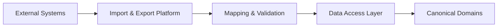
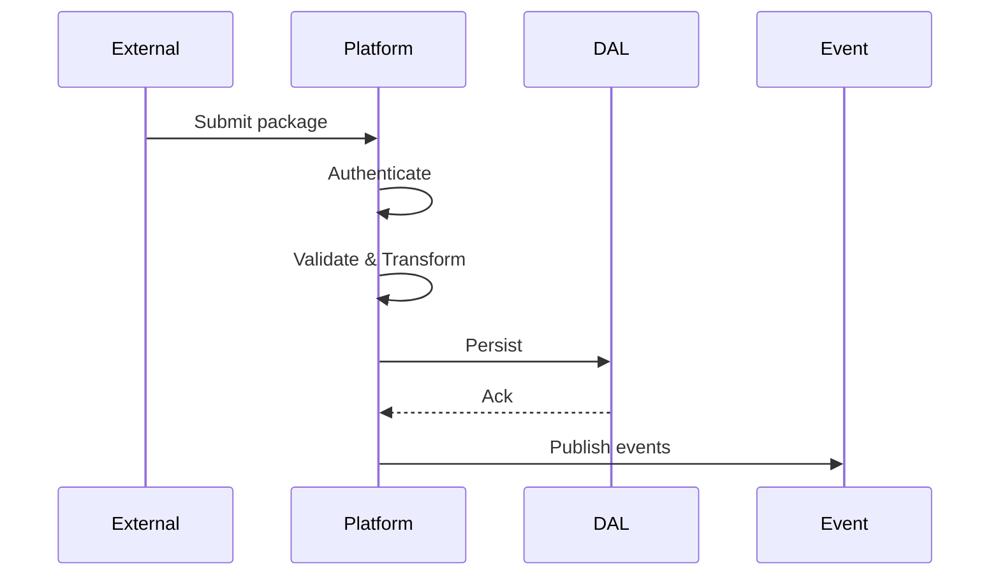
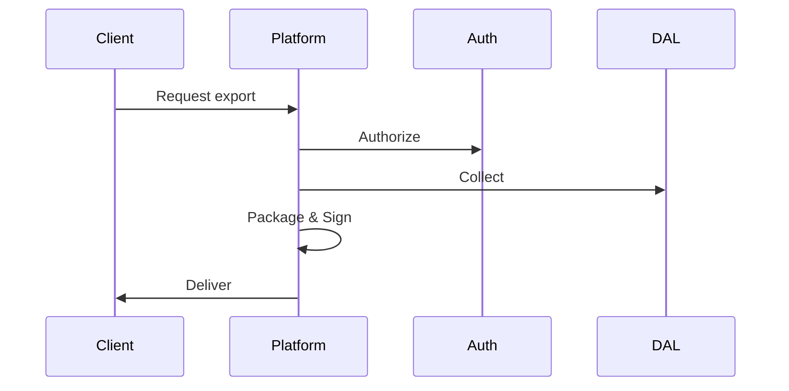
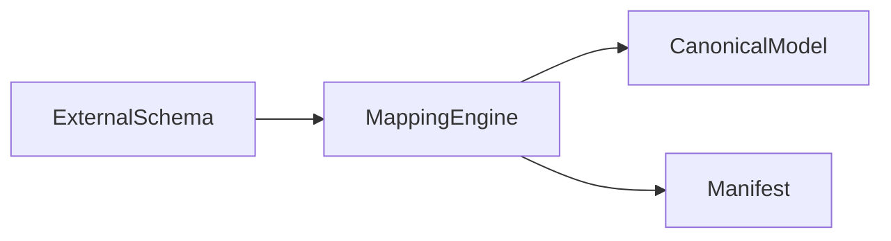
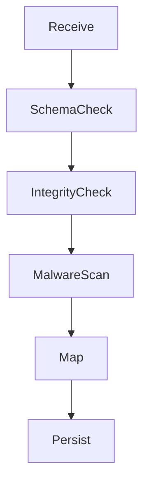
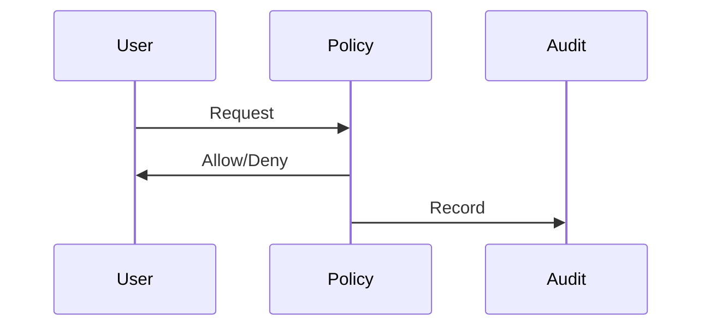
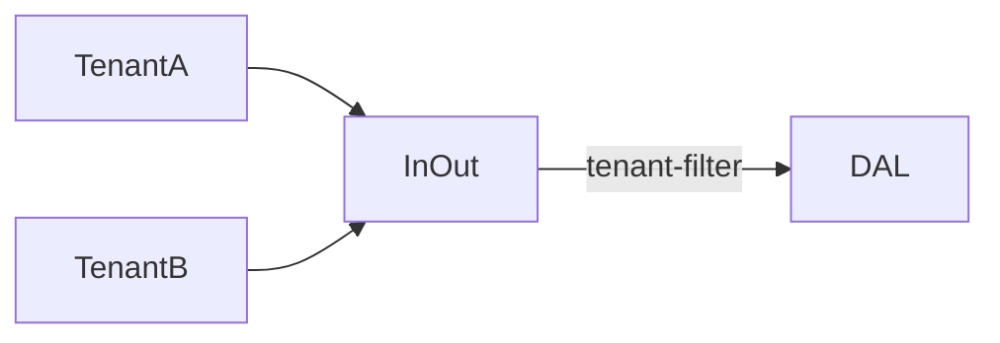
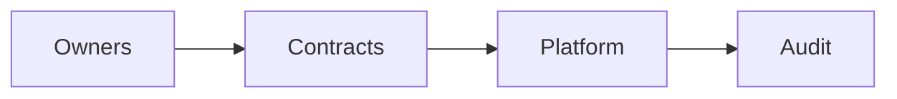
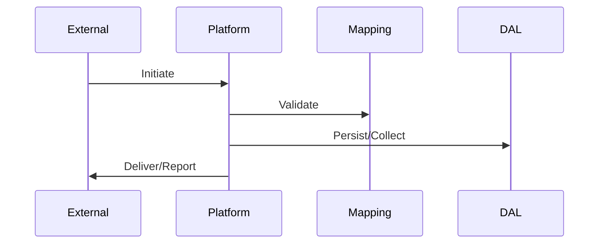

# Data Import & Export Architecture (KB-084)

Executive Summary
-----------------
This architecture defines platform-level principles and patterns for controlled, auditable, and secure import/export of structured, semi-structured, and binary data to/from DUKADESK. It ensures canonical data protection, tenant isolation, contract-based exchange, validation, and end-to-end traceability while remaining implementation- and vendor-agnostic.

Purpose
-------
Establish the canonical architecture governing how data enters and leaves the platform so exchanges preserve integrity, governance, consent, and auditability across Runtime, Builder, Marketplace, Dashboards, AI Platform, and external integrations.

Scope
-----
Covers identity, organizations, tenants, workspaces, applications, runtime data, builder projects, marketplace packages, templates, components, themes, forms, workflows, data models, binary assets, AI assets, analytics, audit records, configuration, reports, and logs.

Architectural Principles
------------------------
- Canonical Data Protection: Protect platform-owned canonical data first; imports must reconcile to canonical models.
- Explicit Data Ownership: Every exchange references owning domain and reconciliation rules.
- Policy-Driven Exchange: Policies govern validation, retention, consent, residency, and approvals.
- Secure by Default: AuthN/ AuthZ, encryption, integrity checks, and malware inspection as conceptual controls.
- Tenant Isolation: Exchanges scoped by tenant; cross-tenant operations require explicit approvals and audit.
- Traceable Operations: Every import/export produces immutable manifests and audit records.
- Contract-Based Exchange: Exchange contracts (manifests + schema) define expectations and compatibility.
- Observable Transfers: Metrics, logs, and tracing for transfer health and compliance.
- Validation Before Persistence: All inbound data validated and transformed before becoming canonical.
- Technology Independence: Architecture is agnostic to transport, format, and storage.

Canonical Definitions
---------------------
- Import: Inbound data transfer into platform boundary intended for persistence or processing.
- Export: Outbound data transfer from platform to external systems.
- Transfer Package: Unit of exchange containing payloads and manifest metadata.
- Exchange Contract: Contract specifying schema, validation rules, authentication, and obligations.
- Data Mapping/Transformation: Mapping external shapes to canonical models.
- Manifest: Metadata describing package contents, provenance, and integrity.
- Import/Export Job: Execution context for processing an exchange.
- Partial Import: Import that succeeds for a subset; failures are reported and auditable.
- Incremental Export: Exporting deltas since a checkpoint or version.
- Transfer Policy: Policy object dictating allowed exchanges, restrictions, and approval requirements.

Import & Export Architecture
---------------------------

             External Systems
                    │
      APIs • Files • Integrations
                    │
        Import & Export Platform
                    │
 Validation • Mapping • Policies
                    │
            Data Access Layer
                    │
          Canonical Data Domains

Supported Exchange Domains
--------------------------
Identity, Organization, Tenant, Workspace, Application, Runtime, Builder, Marketplace, Configuration, Search Metadata, Binary Metadata, AI Assets, Analytics, and Audit.

Import Lifecycle
----------------
Receive → Authenticate → Validate → Transform → Map → Authorize → Persist → Publish Events → Audit

Key rules:
- Authentication and tenant scoping are required before processing.
- Validation includes schema, referential integrity, consent, classification, and malware scanning (conceptual).
- Transformations produce canonical records; mapping logs capture decisions for traceability.
- Partial imports are allowed with clear, auditable failure reports.
- Post-persist events notify downstream services (synchronization, indexing, analytics).

Export Lifecycle
----------------
Request → Authorize → Collect → Project → Package → Validate → Deliver → Audit

Key rules:
- Exports honor consent and privacy constraints; sensitive fields may be redacted or tokenized.
- Exports produce signed manifests and delivery receipts for non-repudiation.
- Incremental exports use checkpoints for efficient delta delivery.

Data Mapping Architecture
-------------------------
- Canonical Mapping: Central mapping repository maps external schemas to canonical models with versioning.
- Schema Validation: Strict validation prior to mapping; schema evolution rules govern compatibility.
- Field Translation & Identity Mapping: External identifiers mapped to canonical identifiers with reconciliation policies.
- Reference Resolution: Import resolves references or records unresolved references for later reconciliation.

Exchange Contracts
------------------
- Contracts are first-class: define owner, schema, version, allowed operations, retention, residency constraints, and SLAs.
- Versioning: Contracts are versioned; backward compatibility guidance required for changes.
- Compatibility: Consumers and providers negotiate compatible contract versions via exchange registry.

Governance
----------
Import Governance:
- Ownership, approval, validation, conflict detection, duplicate detection, error reporting, and audit.

Export Governance:
- Authorization, policy enforcement, tenant scope, consent validation, export registry, and audit trail.

Responsibilities
----------------
Runtime:
- Expose export endpoints and consume imported canonical data via canonical APIs; avoid direct DB writes.

Backend:
- Host Import & Export Platform, mapping engine, manifest registry, validation services, and audit store.

Mobile Runtime:
- Use export APIs for data portability; for imports, rely on canonical APIs and staged validation.

Builder & Marketplace:
- Ensure package manifests comply with exchange contracts; participate in import validation and approval workflows.

AI Platform:
- Imports of models/datasets include provenance and consent metadata; exports of model artifacts follow stricter controls.

Security
--------
- Authentication: Mutual auth or tokenized flows for imports/exports.
- Authorization: RBAC/ABAC for import/export operations and cross-tenant approvals.
- Secure Exchange: Transport encryption and integrity checks (signatures, checksums) on manifests and payloads.
- Malware Inspection: Conceptual pipeline for scanning inbound binary payloads before persistence.
- Replay Prevention: Nonce, sequence, or checkpoint-based protections for idempotence.
- Tamper Evidence: Signed manifests and audit trails for non-repudiation.

Privacy
-------
- Consent-Aware Exchange: Imports and exports enforce consent and purpose limitations.
- Right to Portability: Export paths support user/tenant data extraction with manifests and checksums.
- Right to Erasure: Imports must respect downstream deletion signals; exports may be redacted on request.
- Sensitive Data Filtering: Exports may exclude or pseudonymize regulated fields per policy.
- Cross-Tenant Restrictions: Strict scoping prevents accidental cross-tenant data movement.

Performance
-----------
- Large Dataset Import: Support chunked uploads, resumable sessions, and backpressure handling conceptually.
- Bulk Export: Streaming, chunked packaging, and parallelization for large datasets.
- Incremental Transfer: Checkpointing and delta generation for bandwidth efficiency.
- Parallel Processing: Validate and map in parallel; ensure idempotence for retries.
- Recovery: Support retry semantics, dead-lettering of failed packages, and manual reconciliation.

Observability (see KB-058)
---------------------------
Track and expose:
- Import/Export success/failure rates and latencies
- Validation failure reasons and counts
- Data volumes and transfer rates
- Pending import queues and dead-letter counts
- Audit trails and manifest histories

Failure Scenarios & Handling
----------------------------
- Invalid Package: Reject with audit record and detailed validation report.
- Schema Mismatch: Reject or route to manual mapping/approval workflow.
- Unauthorized Export: Deny and audit; revoke keys/tokens as required.
- Partial Import Failure: Persist successful subset, record failures, notify owner.
- Duplicate Records: Detect via identity mapping and dedupe strategies.
- Broken References: Hold and queue for reconciliation; surface in import report.
- Corrupted Binary Assets: Reject and quarantine, trigger malware/forensic review.
- Interrupted Transfer: Resume via resumable sessions or require restart per policy.

Anti-patterns
-------------
- Direct database imports bypassing validation
- Manual data manipulation outside governed contracts
- Ignoring schema validation or audit trails
- Cross-tenant imports or exports without explicit approval
- Hardcoded mappings in consumers
- Unversioned exchange formats

Future Evolution
----------------
- AI-Assisted Data Mapping and transformation
- Intelligent Schema Transformation and suggestions
- Federated Exchange Contracts across partner platforms
- Autonomous Import Validation with anomaly detection
- Marketplace Exchange Templates for common package types

Cross References
----------------
- KB-057 Runtime Security Architecture
- KB-058 Runtime Observability & Diagnostics Architecture
- KB-073 Data Platform Architecture
- KB-076 Data Access Layer Architecture
- KB-077 Event & Messaging Architecture
- KB-080 File & Object Storage Architecture
- KB-082 Data Lifecycle & Retention Architecture
- KB-083 Data Synchronization Architecture
- KB-085 Data Governance & Quality Architecture (planned)
- KB-086 Data Privacy & Compliance Architecture (planned)

Mermaid Diagrams
----------------
1) Import & Export Platform Architecture

2) Import Processing Pipeline

3) Export Processing Pipeline

4) Data Mapping Architecture

5) Exchange Contract Lifecycle

6) Import Validation Flow

7) Export Authorization Flow

8) Multi-Tenant Data Exchange

9) Import/Export Governance Model

10) End-to-End Data Exchange Sequence

Acceptance Criteria Mapping
---------------------------
- Architecture only: No vendor or implementation specifics.
- Format independent: Supports files, APIs, streams, and packages.
- Vendor independent: Design applies across cloud/on-prem.
- Enterprise grade: Policies, contracts, validation, and audit included.
- Cross-referenced: Links to related KBs for security, lifecycle, sync, and storage.
- Mermaid complete: Ten diagrams included.
- Ready for Knowledge Base: Document structured for review and inclusion.

Completion Checklist
--------------------
- [x] Add KB-084 file (this document)
- [x] Mark KB-084 in PROGRESS_REGISTRY.md as Draft
- [x] Queue KB-085 — Data Governance & Quality Architecture

Notes
-----
This architectural specification avoids runbooks and implementation specifics. Implementation teams must map exchange contracts and policies to concrete APIs, validation services, and adapters while preserving canonical ownership, traceability, and governance.
