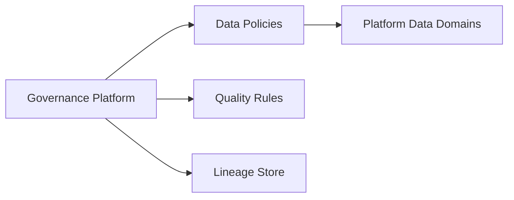
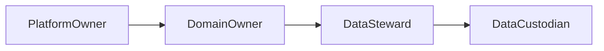
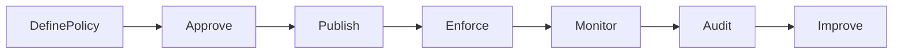
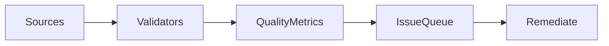
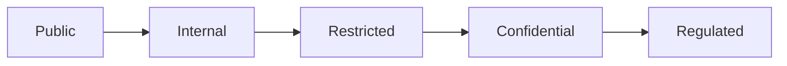
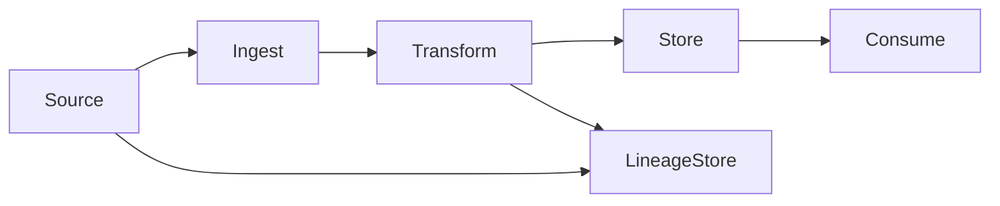
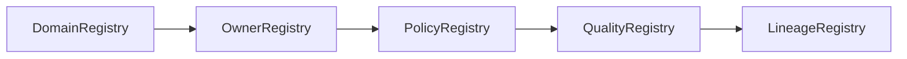
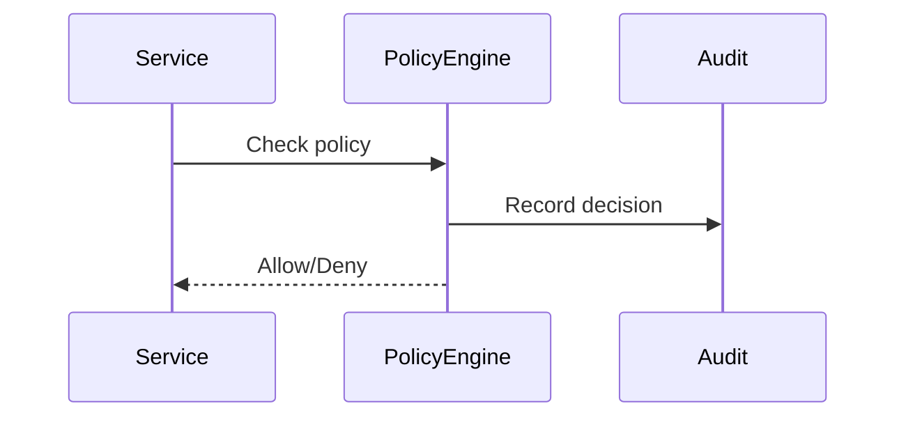
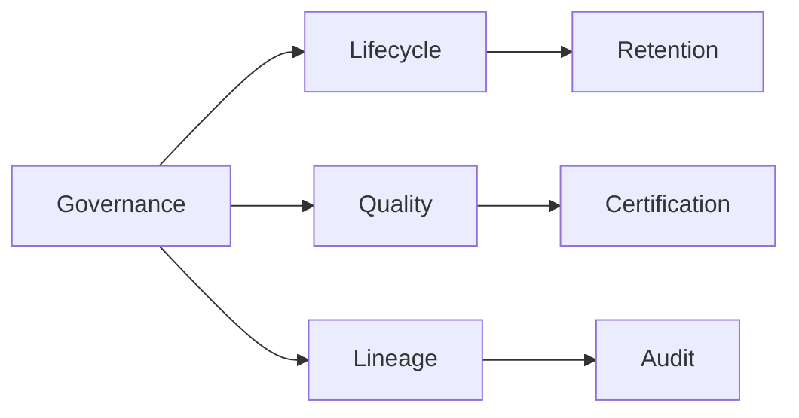

# Data Governance & Quality Architecture (KB-085)

Executive Summary
-----------------
This architecture defines the governance framework that ensures data is owned, traceable, measurable, and fit-for-purpose across the DUKADESK platform. It prescribes ownership models, quality measures, policy registries, lineage, certification, and enforcement patterns while remaining technology-agnostic.

Purpose
-------
Provide a canonical, enterprise-grade architecture for data governance and quality to ensure trust, accountability, and continuous improvement of platform data used by Runtime, Builder Studio, Marketplace, Dashboards, AI, integrations, and analytics.

Scope
-----
Governs identity, consumer, organization, tenant, workspace, application, runtime, builder metadata, marketplace assets, configuration, AI data, events, search projections, audit records, analytics, binary asset metadata, and integration data.

Architectural Principles
------------------------
- Data Has Ownership: Every data domain and artifact has an accountable owner.
- Data Has Accountability: Stewards and custodians manage operational quality.
- Data Quality Is Measurable: Define metrics and SLAs for quality dimensions.
- Governance Is Continuous: Policies, monitoring, and improvement are ongoing.
- Metadata First: Metadata is authoritative and drives governance decisions.
- Traceability by Design: Lineage and provenance are captured for every transformation.
- Policy Before Enforcement: Policies are defined, versioned, reviewed, then enforced.
- Tenant-Aware Governance: Governance respects tenant boundaries and consent.
- Observable Data Quality: Dashboards and alerts surface quality issues.
- Governance Independent of Technology: Patterns apply across providers and storage.

Critical Principle (Non-negotiable)
----------------------------------
Every data domain must have ownership, accountability, and measurable quality. No data may exist without a defined owner, steward, classification, lifecycle policy, and quality expectations.

Canonical Definitions
---------------------
- Data Governance: The system of policies, roles, processes, and controls ensuring data is fit for use.
- Data Owner: Accountable role for business outcomes of a data domain.
- Data Steward: Operational role ensuring data quality and standards adherence.
- Data Custodian: Technical role managing storage, access, and protection mechanisms.
- Data Domain: Logical grouping of related data under common ownership.
- Data Policy: Declarative rules for classification, retention, access, and quality.
- Data Standard: Agreed schema, naming, and formatting conventions.
- Data Quality: Measurable attributes like completeness, accuracy, timeliness.
- Data Lineage: Provenance record of origin, transformations, and consumers.
- Data Classification: Labeling that influences policy and handling.
- Data Certification: Formal attestation of data trustworthiness for consumers.
- Governance Registry: Central catalog of domains, owners, policies, and standards.
- Governance Exception: Approved deviation from policy with expiration and audit.

Governance Architecture
-----------------------

              Governance Platform
                      │
      ┌───────────────┼────────────────┐
      │               │                │
 Data Policies   Quality Rules   Lineage
      │               │                │
      └───────────────┼────────────────┘
                      │
            Platform Data Domains


Governance Domains
------------------
Identity, Organizations, Tenants, Workspaces, Applications, Runtime, Builder, Marketplace, Configuration, Events, Search, Analytics, AI, Binary Asset Metadata. Each domain registers owners, stewards, policies, quality thresholds, and lineage collectors.

Ownership Model
---------------
- Platform Owner: Executive-level sponsor for platform-wide governance.
- Domain Owner: Business-facing accountable role for a domain's correctness and usefulness.
- Data Steward: Responsible for operational quality, rules, and remediation.
- Data Custodian: Technical implementer for storage, access, and protection.
- Consumer Responsibilities: Consumers must respect contracts, certifications, and quality SLAs.
- Accountability Model: Escalation paths, SLAs, and audit trails map responsibilities to outcomes.

Data Quality Architecture
-------------------------
Quality dimensions and architecture:
- Completeness: Required fields and referential integrity checks.
- Accuracy: Validity against authoritative sources and business rules.
- Consistency: Cross-system and cross-time consistency checks.
- Validity: Schema and value domain conformance.
- Timeliness: Freshness SLAs per domain.
- Uniqueness: Deduplication and identity resolution.
- Integrity: Cryptographic checks, checksums, and provenance.
- Traceability: Lineage captures source, transforms, and consumers.

Quality enforcement patterns:
- Rule Repository: Machine-readable quality rules linked to policies.
- Validation Pipelines: Streaming and batch validators feeding quality metrics.
- Issue Queues & Remediation: Automated ticketing for steward action.
- Certification Gates: Domains can publish certified snapshots with expiry.

Data Standards
--------------
- Naming Standards: Canonical naming conventions for entities and fields.
- Metadata Standards: Minimal metadata required for ownership, classification, lineage.
- Schema Standards: Versioned schemas and compatibility rules.
- Reference Standards: Canonical lists and reference data governance.
- Classification Standards: Taxonomy mapping to policies and controls.
- Lifecycle Standards: Canonical state machine (see KB-082) and transitions.
- Documentation Standards: Required docs for schemas, mappings, and contracts.

Data Classification
-------------------
- Public: No access restrictions beyond platform APIs.
- Internal: Platform-internal use; limited exposure.
- Restricted: Sensitive business data; elevated controls.
- Confidential: Regulated or PII; strict controls and approval.
- Tenant-Specific: Data owned by a tenant; scoped controls.
- Regulated: Special handling required for jurisdictional/regulatory rules.
- System-Critical: Operational data required for platform health; prioritized governance.

Data Lineage Architecture
-------------------------
- Origin: Capture source system and ingest timestamp.
- Transformations: Record operation metadata, schema changes, and actors.
- Ownership Changes: Record re-homing or steward changes with timestamps.
- Synchronization Flow: Link to sync/checkpoint artifacts (KB-083).
- Import Sources / Export Destinations: Register exchange contracts (KB-084).
- Audit Relationships: Lineage integrates with audit logs for full traceability.

Governance Lifecycle
--------------------
Define Policy → Approve → Publish → Enforce → Monitor → Audit → Improve

Policy Architecture
-------------------
- Policy Registry: Versioned store of policies and policy templates.
- Policy Ownership: Each policy has an owner and review cadence.
- Policy Versioning: Changes tracked with rationale and impact analysis.
- Policy Review: Periodic governance reviews and certification cycles.
- Policy Enforcement: Runtime and batch enforcement via policy engine integrations.
- Exception Management: Time-boxed exceptions with audit trails and compensating controls.

Data Certification
------------------
- Certified Data: Data artifacts meeting quality and lineage criteria published with metadata.
- Trusted Domains: Domains with certification badges and expiry.
- Certification Criteria: Thresholds for quality, lineage completeness, and policy compliance.
- Certification Lifecycle: Issue → Validate → Publish → Revalidate → Revoke.

Governance Registry
-------------------
- Domain Registry: Catalog of data domains and descriptions.
- Owner Registry: Mapping of owners and stewards to domains.
- Policy Registry: Central policy store.
- Quality Registry: Stores rules, thresholds, and historic scores.
- Classification Registry: Taxonomy and mapping.
- Lineage Registry: Stores lineage artifacts and provenance indices.

Responsibilities
----------------
Runtime Responsibilities:
- Emit provenance and minimal lineage metadata on writes.
- Integrate with validation and certification APIs for publishing.

Backend Responsibilities:
- Host governance registries, policy engine, quality pipelines, lineage collectors, and certification services.
- Provide APIs for querying governance metadata and quality scores.

Mobile Runtime & Builder Responsibilities:
- Respect certifications, consume governance metadata, and provide stewardship feedback mechanisms.

Marketplace & AI Responsibilities:
- Ensure marketplace packages and AI assets adhere to governance controls; record provenance and certification status.

Security
--------
- Governance Enforcement: Policy engine enforces access, classification, and lifecycle rules.
- Ownership Validation: Ensure only owners/stewards can change policy or certifications.
- Classification Controls: Automatic tagging and manual overrides with audit.
- Policy Compliance: Continuous monitoring and enforcement hooks.
- Auditability: Tamper-evident audit trails for governance actions.

Privacy
-------
- Consent Dependencies: Policies integrate consent metadata and condition enforcement.
- Sensitive Data Governance: Additional stewardship and approval workflows.
- Retention Governance: Governance integrates with retention/ disposal policies (KB-082).
- Cross-Tenant Governance: Ensure policies do not span tenants without explicit approval.
- Consumer Rights: Support for erasure, portability, and audit requests via governance APIs.

Performance
-----------
- Governance Scalability: Registries and policy engines scale horizontally; caches for read performance.
- Policy Evaluation: Low-latency checks for runtime enforcement; batch evaluation for large datasets.
- Quality Validation: Streaming and batch validators tuned for throughput and latency budgets.
- Lineage Processing: Incremental lineage capture to reduce bulk processing.

Observability (see KB-058)
---------------------------
Expose:
- Data Quality Scores per domain and artifact
- Governance Violations and incidents
- Policy Compliance Rates
- Certification Coverage and expiry
- Lineage Completeness Metrics
- Ownership Coverage

Failure Scenarios & Handling
----------------------------
- Missing Owner: Auto-notify governance board and quarantine writes where critical.
- Conflicting Policies: Surface via validation and require resolution before enforcement.
- Unknown Lineage: Quarantine, notify stewards, and attempt reconstruction from logs/backups.
- Invalid Classification: Reclassify via steward workflow with audit.
- Quality Degradation: Trigger remediation, rollback, or certification revocation.
- Certification Failure: Revoke certification and surface impact to consumers.
- Governance Drift: Periodic audits and automated detection of deviations.

Anti-patterns
-------------
- Data without ownership
- Governance only for compliance box-checking
- Manual lineage tracking
- Hidden classifications and undocumented exceptions
- Unmeasured quality and no remediation paths
- Policy enforcement without stakeholder buy-in

Future Evolution
----------------
- AI-Assisted Governance: Automated policy suggestions and anomaly detection.
- Automated Stewardship: Intelligent ticketing and remediation for quality issues.
- Intelligent Quality Monitoring: Predictive alerts and trend detection.
- Autonomous Policy Recommendations: Adaptive policies based on usage and risk.
- Cross-Platform Governance Federation: Shareable governance artifacts across partners.
- Predictive Governance Analytics: Forecast governance risks and compliance exposure.

Cross References
----------------
- KB-073 Data Platform Architecture
- KB-074 Data Modeling & Schema Governance
- KB-076 Data Access Layer Architecture
- KB-082 Data Lifecycle & Retention Architecture
- KB-083 Data Synchronization Architecture
- KB-084 Data Import & Export Architecture
- KB-086 Data Privacy & Compliance Architecture (planned)
- KB-087 Master Data Management Architecture (planned)

Mermaid Diagrams
----------------
1) Governance Platform Architecture



2) Data Ownership Model



3) Governance Lifecycle



4) Data Quality Framework



5) Data Classification Model



6) Data Lineage Architecture



7) Governance Registry Structure



8) Policy Enforcement Flow



9) Governance Dependency Graph



10) End-to-End Governance Workflow

```mermaid
flowchart LR
  Author -> DefinePolicy -> Publish -> Enforce -> Monitor -> Certify -> Consume
```

Acceptance Criteria Mapping
---------------------------
- Architecture only: Avoids implementation specifics.
- Technology independent: Registry and engines are conceptual.
- Enterprise grade: Ownership, certification, quality, and audit considered.
- Governance-first: Policies and owners are primary design elements.
- Cross-referenced: Links to related KBs included.
- Mermaid complete: Ten diagrams provided.
- Ready for Knowledge Base inclusion.

Completion Checklist
--------------------
- [x] Add KB-085 file (this document)
- [x] Mark KB-085 in PROGRESS_REGISTRY.md as Draft
- [x] Queue KB-086 — Data Privacy & Compliance Architecture

Notes
-----
This document defines governance architecture only. Implementation teams must create policy engines, registries, lineage collectors, and quality pipelines aligned with these patterns while preserving ownership, auditability, and measurable quality outcomes.
