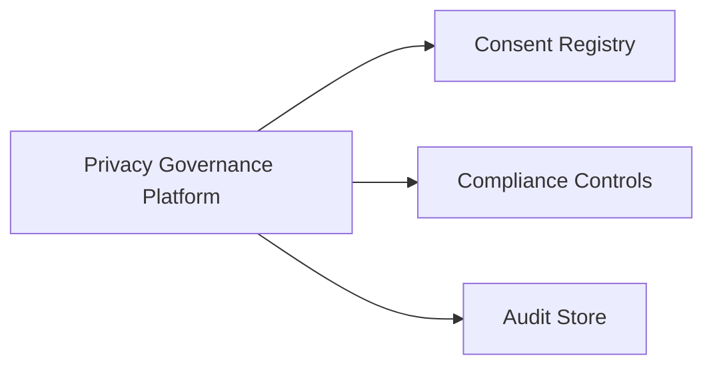
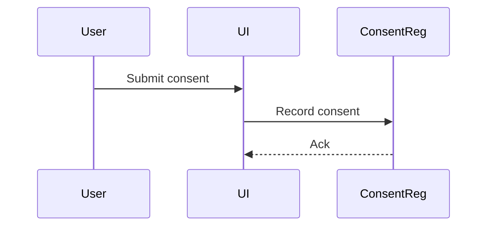
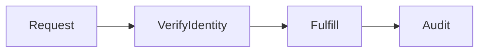
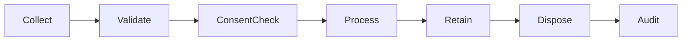
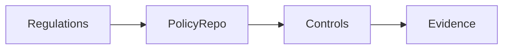
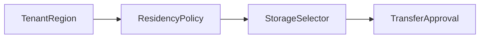
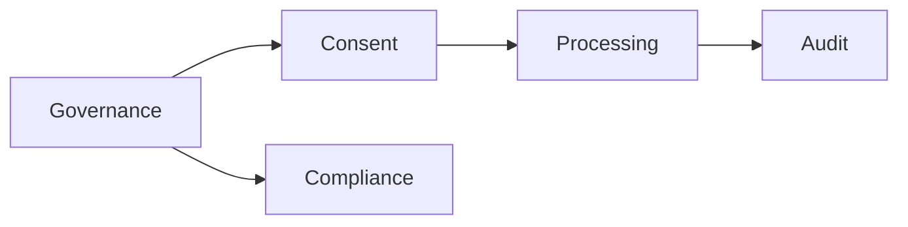
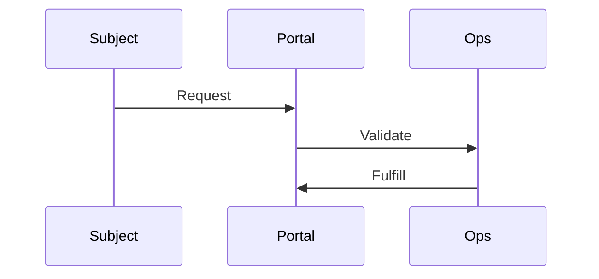
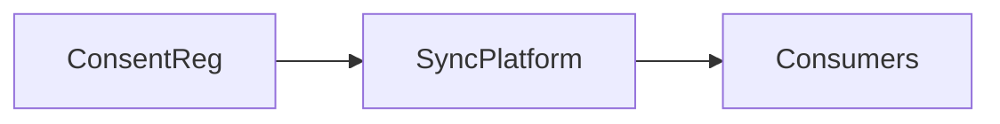
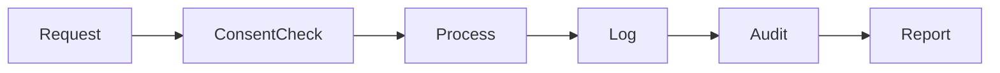

# Data Privacy & Compliance Architecture (KB-086)

Executive Summary
-----------------
This architecture defines platform-level privacy and compliance requirements that ensure lawful, consent-aware, auditable, and tenant-respecting processing across DUKADESK. It prescribes principles, responsibilities, consent management, rights workflows, cross-border governance, and observability while remaining implementation-agnostic.

Purpose
-------
Define an enterprise architecture that centralizes privacy and regulatory compliance as platform capabilities, guaranteeing consistent enforcement, traceability, and the ability to respond to rights requests and regulatory obligations across all services.

Scope
-----
Governance of personal and sensitive data across identity, consumer, organization, tenant, workspace, application, runtime, marketplace, builder metadata, binary asset metadata, AI artifacts, analytics, events, logs, audit records, search metadata, and integrations.

Architectural Principles
------------------------
- Privacy by Design: Embed privacy considerations into data lifecycles and service designs.
- Compliance by Design: Architecture supports regulatory mapping and demonstrable controls.
- Least Data Necessary: Minimize collection and retention by default.
- Purpose Limitation: Use data only for declared, consented purposes.
- Lawful Processing: Record lawful bases for processing activities.
- Consent Awareness: Consent is first-class metadata influencing processing.
- Transparency: Provide audit trails and explanations for data use.
- Accountability: Owners and controllers mapped and auditable.
- Tenant Isolation: Privacy boundaries respect tenant scope and jurisdiction.
- Technology Independence: Applicable across cloud and on-prem platforms.

Critical Principle (Non-negotiable)
----------------------------------
Privacy is enforced by the platform, inherited by every service, and never delegated to individual applications. Platform controls must be authoritative for consent, rights, and cross-tenant enforcement.

Canonical Definitions
---------------------
- Personal Data: Any information relating to an identified or identifiable natural person.
- Sensitive Data: Special categories requiring stronger controls (e.g., health, financial, biometric).
- Data Subject: The individual whom the data concerns.
- Consent: Freely given, specific, informed, unambiguous indication of wishes by the data subject.
- Lawful Basis: Legal justification for processing (consent, contractual, legal obligation, vital interest, public task, legitimate interest).
- Data Controller / Processor (conceptual): Roles for responsibility allocation — platform maps responsibilities.
- Processing Activity: Any operation performed on personal data (collect, store, analyze, share, delete).
- Rights Request: Data subject request for access, rectification, erasure, portability, restriction, or objection.
- Privacy Policy: High-level declarations of processing purposes and controls.
- Privacy Impact Assessment: Evaluation of processing risk and mitigations (conceptual).

Privacy Architecture
--------------------

          Privacy Governance Platform
                     │
     ┌───────────────┼────────────────┐
     │               │                │
 Consent      Compliance       Audit
     │               │                │
     └───────────────┼────────────────┘
                     │
            Platform Data Domains

Privacy Domains
---------------
Identity, Organizations, Tenants, Workspaces, Applications, Runtime, Builder, Marketplace, AI, Analytics, Audit, Binary Assets, and Integrations. Each domain integrates with consent, legal basis, and rights processing.

Consent Architecture
--------------------
- Consent Collection: Standardized flows capturing purpose, scope, time, and granularity.
- Consent Registry: Versioned store of consent records and provenance tied to subjects and tenants.
- Consent Versioning: Track consent updates and historic consent states for lawful processing.
- Consent Withdrawal: Mechanisms to withdraw consent and propagate effects across systems.
- Consent Verification: Runtime checks that processing aligns with current consent state.
- Consent Propagation: Ensure downstream systems receive consent status and constraints.
- Consent Auditing: Tamper-evident records of consent events for compliance proofs.

Lawful Processing Architecture
------------------------------
- Purpose Specification: Record declared purposes and lawful bases for processing activities.
- Processing Registration: Catalog of processing activities, owners, data flows, and risk levels.
- Processing Validation: Automated checks that operations conform to declared purposes and legal bases.
- Purpose Limitation: Enforce purpose-scoped access and transformations.
- Data Minimization: Mechanisms to limit fields collected, with fallbacks for pseudonymization.
- Processing Accountability: Traceability and approval workflows for new processing activities.

Consumer Rights Architecture
---------------------------
- Right of Access: APIs and workflows to retrieve subject data with identity verification.
- Right to Rectification: Controlled update paths with audit and provenance.
- Right to Deletion: Propagation of deletion signals respecting retention/legal holds; documented scope and timelines.
- Right to Portability: Export mechanisms supporting common, documented formats with manifests.
- Right to Restrict Processing: Flags that limit processing activities while retaining data.
- Right to Object: Recording objections and evaluating lawful basis to accept or override with justification.
- Identity Verification: Strong verification before fulfilling rights to prevent unauthorized disclosures.
- Request Auditing: Track the lifecycle of each rights request with outcome and timestamps.

Compliance Governance
--------------------
- Policy Registry: Central store mapping regulations to policies and controls.
- Compliance Controls: Mapping of technical controls to policy requirements (encryption, logging, consent).
- Compliance Ownership: Assign compliance owners for regulatory domains and evidence collection.
- Compliance Reviews: Scheduled audits, evidence collection, and remediation cycles.
- Regulatory Mapping: Conceptual mapping of regional regulations to policy templates.
- Exception Handling: Time-boxed, auditable exceptions with compensating controls.

Cross-Border Data Governance
---------------------------
- Regional Policies: Region-specific rules for residency and transfer controls.
- Data Residency Awareness: Metadata indicating residency constraints per asset or tenant.
- Transfer Restrictions: Enforcement of allowed transfer patterns; require approvals for transfers across restricted boundaries.
- Jurisdiction Awareness: Associate processing activities with applicable laws for evidence and reporting.

Privacy Lifecycle
-----------------
Collect → Validate → Consent Verification → Process → Monitor → Retain → Dispose → Audit

Runtime Responsibilities
-----------------------
- Surface consent checks in read/write paths and annotate events with lawful basis.
- Support redaction and purpose-scoped projections for APIs.

Backend Responsibilities
-----------------------
- Maintain consent registry, rights request workflows, processing catalog, and policy engine integrations.
- Provide immutable audit trails and evidence for compliance reviews.

Mobile Runtime / Builder / Marketplace / AI Responsibilities
-----------------------------------------------------------
- Respect consent and lawful basis metadata; request additional consent where necessary.
- Integrate with platform APIs for rights requests and propagation of consent changes.

Security
--------
- Privacy Enforcement: Policy engine gates processing decisions and access.
- Access Control: Fine-grained, auditable access controls respecting purpose and consent.
- Data Masking & Minimization: Support for dynamic masking and tokenization for non-authorized consumers.
- Encryption Domains: Metadata-driven encryption strategy; key management aligned with tenancy.
- Audit Logging: Tamper-evident logs for processing, consent, and rights workflows.
- Secure Disposal: Ensure deletions remove both primary and derived artifacts per policy and jurisdiction.

Privacy Operations
------------------
- Consent Operations: Capture, update, withdraw, and propagate consent with audit.
- Rights Request Management: Intake, verify, fulfill, and audit requests within SLA.
- Compliance Monitoring: Continuous checks and evidence collection for controls.
- Privacy Incident Handling: Playbooks for breaches, notification, and remediation.
- Privacy Reporting: Periodic reports for regulators, auditors, and tenants.

Performance
-----------
- Consent Validation: Low-latency checks embedded in request paths with caching where safe.
- Rights Request Processing: Scalable intake and fulfillment pipelines with SLA tracking.
- Compliance Evaluation: Batch and streaming checks to scale across large datasets.
- Registry Performance: Consent and processing registries designed for high-read workloads.

Observability (see KB-058)
---------------------------
Expose:
- Consent counts, active/withdrawn per tenant
- Rights request volumes and SLAs
- Privacy violations and incidents
- Cross-border transfer metrics and denials
- Policy coverage and exception rates
- Evidence collection health

Failure Scenarios & Handling
----------------------------
- Processing Without Consent: Detect via audits, halt processing, notify owners, and remediate.
- Invalid Lawful Basis: Block actions, record rationale, and escalate for approval.
- Unauthorized Data Exposure: Revoke access, initiate incident response, and notify affected parties per regs.
- Consent Version Conflict: Use provenance to determine applicable consent and reconcile state.
- Cross-Tenant Privacy Violation: Immediate containment, forensic analysis, and restore from backups if needed.
- Unfulfilled Rights Request: Escalate to ops and report SLA breach.
- Improper Retention: Quarantine and remediate with evidence for compliance.
- Compliance Drift: Periodic audits, automated detection, and mandatory remediation workflows.

Anti-patterns
-------------
- Consent assumed by default without explicit capture
- Unlimited or unspecified data collection
- Purpose creep without consent or policy
- Privacy enforced at app layer only
- Missing audit trails for rights and consent
- Hardcoded jurisdictional logic in apps

Future Evolution
----------------
- AI-Assisted Compliance Monitoring: Automated detection of risky processing patterns.
- Automated Privacy Impact Assessments: Tooling to estimate risk and required controls.
- Intelligent Consent Management: Context-aware consent flows and revocation propagation.
- Cross-Jurisdiction Compliance Automation: Policy-driven routing and controls per region.
- Autonomous Policy Enforcement: Runtime enforcement agents that adapt to context and risk.

Cross References
----------------
- KB-057 Runtime Security Architecture
- KB-073 Data Platform Architecture
- KB-082 Data Lifecycle & Retention Architecture
- KB-083 Data Synchronization Architecture
- KB-084 Data Import & Export Architecture
- KB-085 Data Governance & Quality Architecture
- KB-087 Master Data Management Architecture (planned)
- KB-088 Metadata Management Architecture (planned)

Mermaid Diagrams
----------------
1) Privacy Governance Architecture

2) Consent Management Flow

3) Consumer Rights Workflow

4) Privacy Lifecycle

5) Compliance Governance Model

6) Cross-Border Data Governance

7) Privacy Dependency Graph

8) Rights Request Processing

9) Consent Propagation Architecture

10) End-to-End Privacy Compliance Flow

Acceptance Criteria Mapping
---------------------------
- Architecture only: No regulatory implementation or vendor specifics.
- Regulation independent: Supports multiple regional laws via policy mapping.
- Technology independent: Patterns apply on cloud and on-prem.
- Enterprise grade: Consent, rights, cross-border governance, and audit included.
- Privacy-by-design: Embedded across lifecycle and platform services.
- Fully cross-referenced: Links to related KBs.
- Mermaid complete: Ten diagrams included.
- Ready for Knowledge Base: Document structured for review and inclusion.

Completion Checklist
--------------------
- [x] Add KB-086 file (this document)
- [x] Mark KB-086 in PROGRESS_REGISTRY.md as Draft
- [x] Queue KB-087 — Master Data Management Architecture

Notes
-----
This specification defines privacy architecture only. Implementation teams must map policies and registries to concrete systems (consent stores, rights request pipelines, encryption domains, and audit stores) while preserving platform-enforced privacy and tenant isolation.
