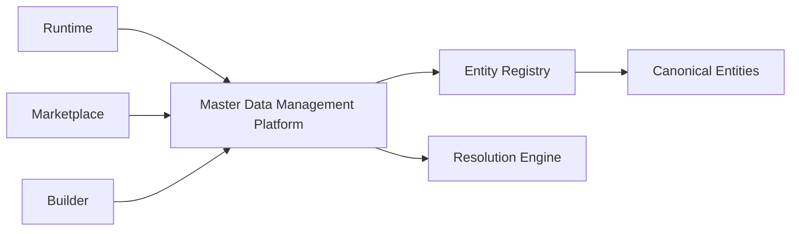
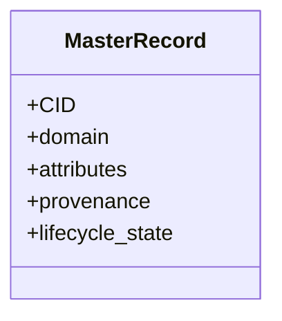
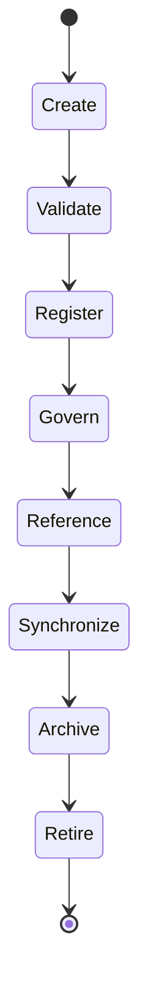
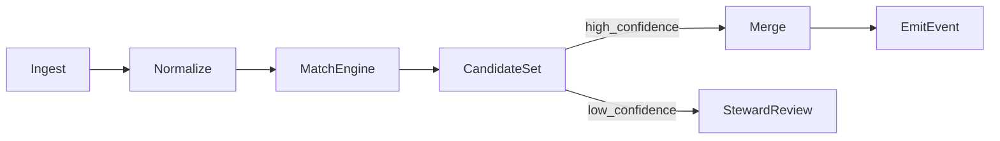
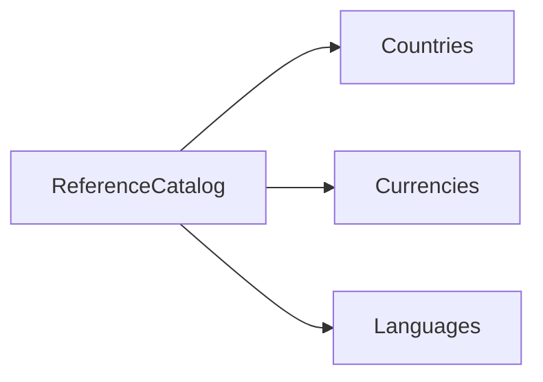
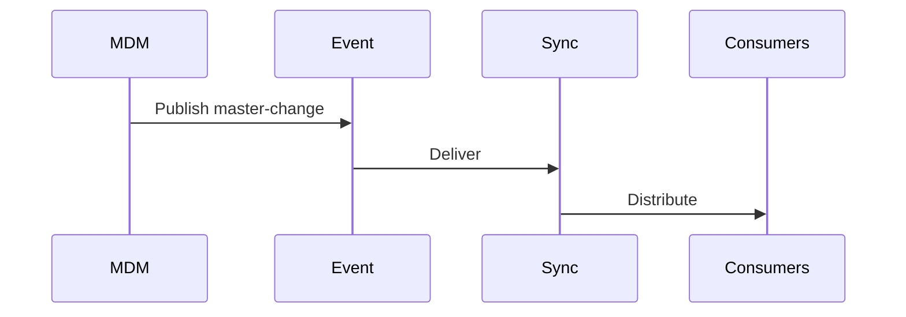
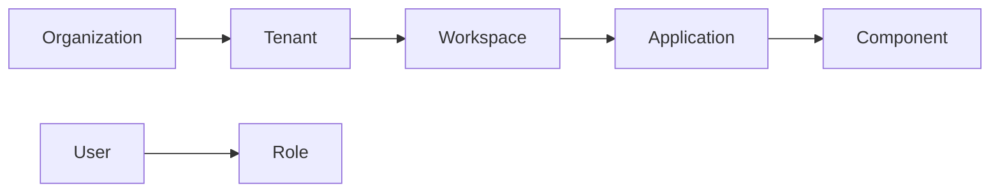
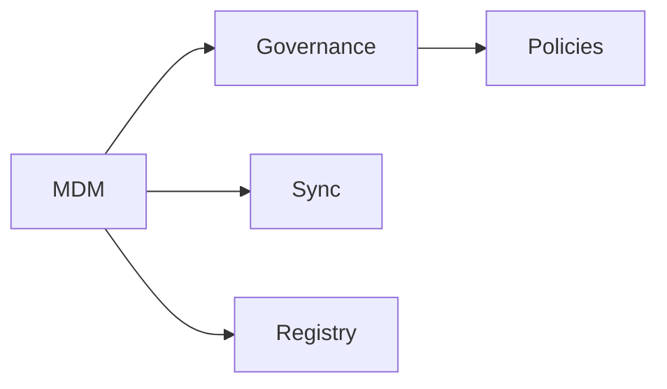

# Master Data Management Architecture (KB-087)

Executive Summary
-----------------
This specification defines a platform-grade Master Data Management (MDM) architecture for DUKADESK. MDM establishes canonical identity for core business entities, ensures reference integrity across domains, coordinates stewardship, and provides a single source of truth for identity resolution and cross-system interoperability while remaining implementation-agnostic.

Purpose
-------
Provide the canonical architectural model for identifying, governing, synchronizing, and stewarding master records (organizations, users, tenants, workspaces, applications, marketplace artifacts, reference catalogs, etc.) so that all platform services reference canonical identities rather than divergent local copies.

Scope
-----
MDM covers master entities including platform, organizations, business accounts, consumers, users, roles, permissions, tenants, workspaces, applications, capabilities, components, templates, themes, extensions, marketplace assets, AI models, integrations, countries, languages, currencies, time zones, and shared reference catalogs.

Architectural Principles
------------------------
- One Entity, One Identity: Single canonical identifier for each core entity across the platform.
- Canonical Master Records: Golden record patterns to present the authoritative view.
- Master Data Ownership: Clear domain owners and stewards for each entity class.
- Reference Integrity: All references use canonical identifiers; referential consistency enforced.
- Metadata First: Master records carry rich metadata (provenance, source, lifecycle state).
- Stewardship by Design: Workflows and tooling support human-in-the-loop merges and corrections.
- Synchronization Through Events: Changes to master records are published as events for downstream consumers (see KB-083).
- Technology Independence: MDM architecture is independent of persistence or indexing technologies.
- Tenant-Aware Governance: Master identity respects tenancy and isolation boundaries.
- Observable Master Data: Metrics and alerts for duplicate rates, resolution latency, and stewardship coverage.

Critical Principle (Non-negotiable)
----------------------------------
Every core business entity has one canonical identity across the entire platform. All services must reference canonical identities rather than maintaining independent representations.

Canonical Definitions
---------------------
- Master Data: Core business entities that require canonical identity and lifecycle governance.
- Reference Data: Stable enumerations and lookups used across domains (countries, currencies).
- Master Record: Platform-stored authoritative record for an entity.
- Golden Record: Consolidated, reconciled view derived from multiple sources (conceptual).
- Canonical Identifier (CID): Globally-unique, immutable identifier for a master record.
- Identity Resolution: Process of matching and linking records to a CID.
- Data Steward: Role responsible for operational quality and conflict resolution.
- Entity Registry: Catalog of master entities, mappings, and metadata.
- Survivorship: Rules for selecting preferred attribute values during merges (conceptual).
- Duplicate Detection: Detection of records likely representing the same real-world entity.
- Record Merge: Controlled operation to combine duplicate records into one master record.

Master Data Architecture
------------------------

            Platform Services
                   │
      ┌────────────┼────────────┐
      │            │            │
   Runtime      Marketplace   Builder
      │            │            │
      └────────────┼────────────┘
                   │
      Master Data Management Platform
                   │
  Identity • Entity Registry • Resolution • Governance
                   │
        Canonical Business Entities

Master Data Domains
-------------------
Domains include organizations, business accounts, consumers, users, roles, permissions, tenants, workspaces, applications, marketplace assets, builder assets, AI assets, integrations, and reference catalogs. Each domain declares schema, owner, steward, quality thresholds, and synchronization policies.

Canonical Identity
------------------
- Global Identifiers: Immutable CIDs used across all services.
- Domain Identifiers: Local domain-specific ids mapped to CIDs via the entity registry.
- Tenant Identifiers: Tenant-scoped identifiers and tenancy metadata attached to master records.
- Workspace Identifiers: Scoped identifiers for workspace-level resources.
- Entity References: All cross-object references use CIDs; foreign keys in services resolve via CID mappings.
- Cross-Domain References: Explicit references between domains stored as CID relationships.
- Immutable Identity: CID never reused; merges produce tombstones and provenance metadata.

Entity Lifecycle
----------------
Create → Validate → Register → Govern → Reference → Synchronize → Archive → Retire

Key lifecycle notes:
- Registration is the act of creating/linking a master record and assigning CID.
- Validation includes schema checks, identity verification, and policy conformance.
- Governance workflows manage merges, survivorship, and exception approvals.
- Archival preserves history and provenance; retire marks CID as inactive while preserving references.

Reference Data Architecture
---------------------------
Reference catalogs (countries, languages, currencies, time zones, units, status codes) are published as managed master entities with versioning, provenance, and consumer contracts. Services reference stable CIDs for lookups rather than embedding literal strings.

Identity Resolution
-------------------
Conceptual resolution pipeline:
- Ingest candidate records from producers/feeds.
- Normalize attributes (names, addresses, identifiers).
- Compute matching signals (exact keys, probabilistic scores, rules).
- Detect duplicates and surface for automated or manual merger depending on confidence.
- Apply survivorship rules to produce (or update) a master record CID.
- Emit events for downstream synchronization and indexing.

Stewardship Model
-----------------
- Domain Owner: Business owner accountable for correctness and policy.
- Data Steward: Operational steward responsible for triage, merges, and quality improvement.
- Data Custodian: Technical owner responsible for storage, access, and protection.
- Approval Process: Merges, identity changes, and exception handling require steward approval per policy.
- Exception Handling: Time-boxed exceptions recorded in governance registry with compensating controls.

Synchronization
---------------
- Master Record Publishing: MDM publishes change events (create/update/merge/archive) to the Event Platform.
- Event Propagation: Sync platform (KB-083) fans out changes to consumers and offline clients.
- Reference Updates: Consumers update local references to mirror CID changes.
- Version Compatibility: Metadata includes schema version; consumers validate compatibility or request snapshots.

Responsibilities
----------------
Runtime:
- Reference CIDs in all persisted relationships; use registry lookups when resolving external ids.

Backend:
- Host entity registry, resolution pipelines, duplicate detection, stewardship UI, and CID mapping APIs.
- Provide APIs for lookup, reverse lookup (domain id → CID), and provenance queries.

Mobile Runtime & Builder:
- Cache resolved CIDs and subscribe to updates; avoid local authoritative identity operations.

Marketplace & AI:
- Register marketplace assets and AI models as master entities; include signatures/provenance for trust.

Security
--------
- Master Record Authorization: Only authorized roles may create/merge/archive master records.
- Identity Integrity: Provenance and checksums protect integrity; merges create auditable traces.
- Tenant Isolation: Tenant-scoped master records and cross-tenant operations require explicit governance.
- Reference Validation: API-level validation prevents invalid references; lookup APIs provide canonical resolution.
- Auditability: Every CID lifecycle action is auditable with actor, timestamp, rationale, and artifacts.
- Governance Enforcement: Policy engine enforces rules for merges, retention, and stewardship.

Privacy
-------
- Personal Master Data: Individual persons as master entities subject to privacy rules (KB-086).
- Consumer Ownership: Respect consumer rights for correction, portability, and erasure; MDM exposes APIs for rights workflows.
- Erasure Dependencies: Merges and references must honor deletion/erasure flows with tombstones and provenance retained for audit when required.

Performance
-----------
- Reference Resolution: Low-latency lookups for CID resolution; caches and partitioning by tenant/domain.
- Identity Lookup: Scalable index for attribute search and reverse lookups.
- Registry Scalability: Entity registry shards by domain/tenant to scale with platform growth.
- Synchronization Efficiency: Event-driven incremental updates; snapshot bootstrapping for large consumers.
- Cross-Domain Queries: Support for graph-style queries with attention to performance and access controls.

Observability (see KB-058)
---------------------------
Metrics and signals:
- Duplicate Detection Rate and Confidence
- Merge/Resolve Latency
- CID Lookup Latency and Cache Hit Rates
- Stewardship Queue Depth and SLA
- Reference Integrity Violations
- Stewardship Coverage (percent of domains with active stewards)

Failure Scenarios & Handling
----------------------------
- Duplicate Master Records: Detect, quarantine, and perform controlled merges with audit.
- Broken References: Reconcile via registry-driven repair jobs and owner notifications.
- Conflicting Identities: Use provenance, survivorship rules, and steward intervention to resolve.
- Cross-Tenant Identity Leakage: Revoke exposures, audit, and restore from backups if needed.
- Missing Steward: Escalate to governance board and apply conservative access controls.
- Invalid Entity Merge: Provide rollback via versioned history and replayable provenance.
- Identity Resolution Failure: Fallback to human review and provide snapshot-based recovery.

Anti-patterns
-------------
- Multiple master records for the same real-world entity
- Mutable canonical identifiers
- Service-owned reference catalogs causing divergence
- Manual reconcile processes without audit
- Hardcoded reference data in services
- Missing ownership or stewardship

Future Evolution
----------------
- AI-Assisted Identity Resolution and deduplication
- Autonomous Duplicate Detection with suggested merges
- Global Entity Federation with partner platforms
- Knowledge-graph integration for rich relationship modeling
- Predictive Stewardship: flag entities likely to require intervention

Cross References
----------------
- KB-073 Data Platform Architecture
- KB-074 Data Modeling & Schema Governance
- KB-076 Data Access Layer Architecture
- KB-083 Data Synchronization Architecture
- KB-085 Data Governance & Quality Architecture
- KB-086 Data Privacy & Compliance Architecture
- KB-088 Metadata Management Architecture (planned)
- KB-089 Knowledge Graph Architecture (planned)

Mermaid Diagrams
----------------
1) Master Data Platform Architecture

2) Canonical Entity Model

3) Master Data Lifecycle

4) Identity Resolution Flow

5) Reference Data Hierarchy

6) Stewardship Governance Model

7) Master Data Synchronization

8) Cross-Domain Entity Relationships

9) Master Data Dependency Graph

10) End-to-End Master Data Management Workflow

Acceptance Criteria Mapping
---------------------------
- Architecture only: No implementation or vendor specifics included.
- Database independent: Persistence decisions deferred to implementers.
- Technology independent: Architecture applies to cloud, on-prem, and hybrid.
- Enterprise grade: Governance, stewardship, observability, and security covered.
- Governance-first: Owner/steward model and policies prioritized.
- Cross-referenced: Links to related KBs included.
- Mermaid complete: Ten diagrams provided.
- Ready for Knowledge Base inclusion.

Completion Checklist
--------------------
- [x] Add KB-087 file (this document)
- [x] Mark KB-087 in PROGRESS_REGISTRY.md as Draft
- [x] Queue KB-088 — Metadata Management Architecture

Notes
-----
This specification defines architectural patterns for MDM only. Implementation teams must build resolution engines, registries, stewardship tooling, and synchronization adapters aligned with these principles while ensuring privacy, governance, and tenant isolation.