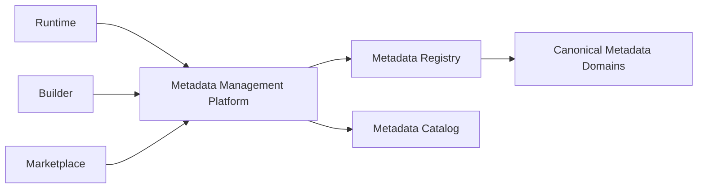
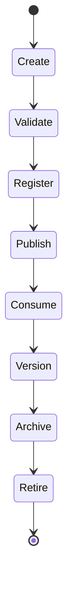
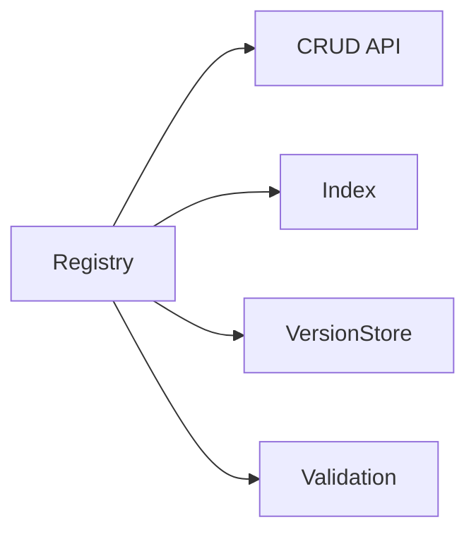
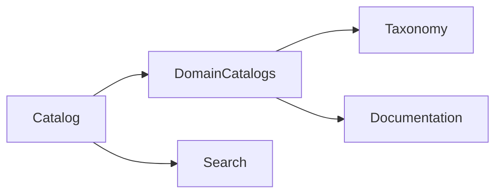
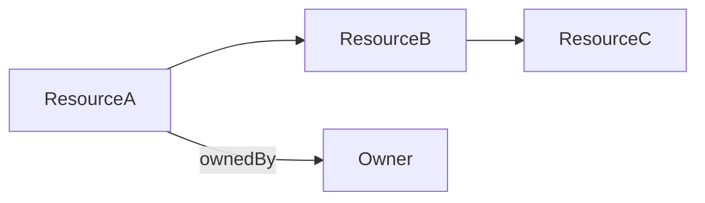
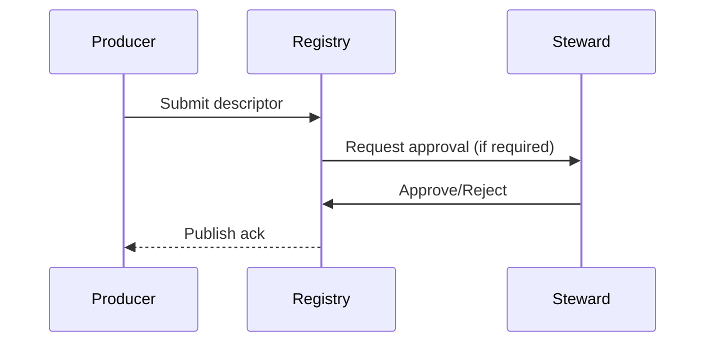
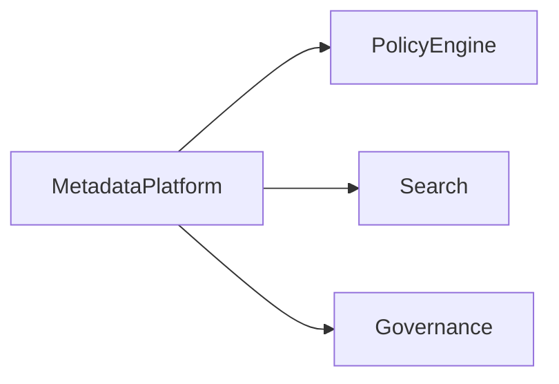
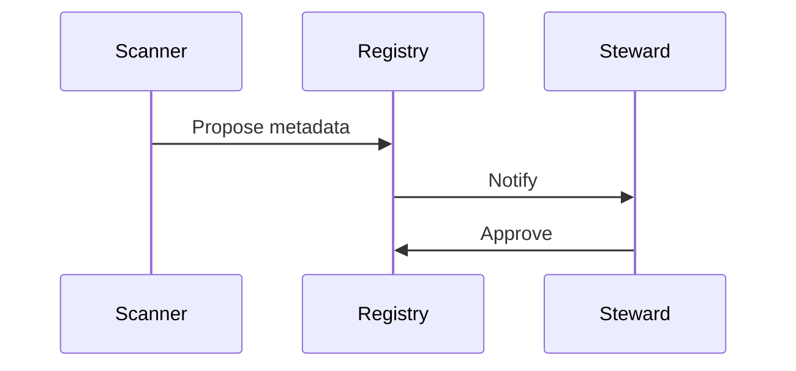
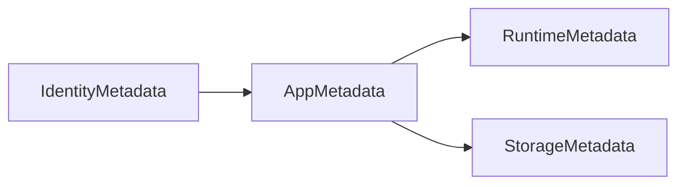

# Metadata Management Architecture (KB-088)

Executive Summary
-----------------
This architecture elevates metadata to a first-class, platform-wide capability. It prescribes how metadata is created, versioned, discovered, governed, and consumed across DUKADESK so services interoperate using canonical metadata rather than ad-hoc or embedded conventions.

Purpose
-------
Define the enterprise architecture for metadata management to enable discovery, governance, automation, trust, and long-term interoperability across Runtime, Builder Studio, Marketplace, AI Platform, Search, Analytics, Governance, Security, and future services.

Scope
-----
Covers metadata for platform resources, organizations, accounts, consumers, users, roles, tenants, workspaces, applications, components, capabilities, templates, themes, extensions, marketplace assets, builder artifacts, runtime resources, workflows, forms, data models, APIs, events, search indexes, binary assets, AI assets, integrations, policies, and audit records.

Architectural Principles
------------------------
- Metadata First: Metadata is the primary mechanism for discovery and governance.
- Metadata Is Canonical: Metadata is authoritative and versioned in the registry.
- Every Resource Has Metadata: No resource exists without metadata that describes it.
- Versioned Metadata: All changes are versioned with provenance.
- Discoverable Metadata: Metadata must be searchable and machine-discoverable.
- Governed Metadata: Policies, owners, and stewards control metadata lifecycle.
- Tenant-Aware Metadata: Metadata carries tenancy scope and residency constraints.
- Technology Independence: Metadata models are decoupled from storage and runtimes.
- Observable Metadata: Track coverage, quality, and consumption.
- Metadata Enables Automation: Workflows and policy engines rely on metadata to automate decisions.

Critical Principle (Non-negotiable)
----------------------------------
Every governed resource is defined, discovered, and managed through metadata. Metadata—not implementation details—is the mechanism through which platform capabilities discover, understand, govern, and interoperate with one another.

Canonical Definitions
---------------------
- Metadata: Structured data that describes a resource's identity, semantics, provenance, lifecycle, and policies.
- Technical Metadata: Schema, types, endpoints, serialization, storage hints.
- Business Metadata: Descriptions, owners, SLAs, business terms.
- Operational Metadata: Metrics, health, last-updated, instrumentation hooks.
- Administrative Metadata: Access control, retention, classification, legal hold references.
- Resource Descriptor: Canonical metadata record describing a single resource.
- Metadata Registry: Authoritative store for resource descriptors and versions.
- Metadata Catalog: Index and UI for discovery and browsing of metadata domains.
- Metadata Schema: Contract describing allowed metadata fields and types.
- Metadata Version: Immutable snapshot of metadata at a point-in-time.
- Metadata Classification: Labels influencing handling and controls.
- Metadata Relationship: Explicit links between metadata records (parent/child, dependency).
- Metadata Lineage: Provenance of how metadata was produced and transformed.
- Metadata Consumer: Any service, tool, or pipeline that reads/uses metadata.
- Metadata Steward: Role responsible for metadata quality and governance.

Metadata Platform Architecture
------------------------------

             Platform Services
                    │
     ┌──────────────┼──────────────┐
     │              │              │
 Runtime      Builder Studio   Marketplace
     │              │              │
     └──────────────┼──────────────┘
                    │
      Metadata Management Platform
                    │
 Registry • Catalog • Governance
                    │
      Canonical Metadata Domains


Metadata Domains
----------------
Domains include identity, organizations, tenants, workspaces, applications, runtime, builder, marketplace, AI, security, events, search, storage, analytics, and integrations. Each domain defines schema, owners, stewards, and lifecycle policies.

Metadata Categories
-------------------
- Business Metadata: Human-facing descriptions, tags, SLAs, ownership
- Technical Metadata: Schemas, API endpoints, data types, serialization
- Operational Metadata: Metrics, last-updated, health, usage
- Governance Metadata: Policies, approvals, classification, retention
- Security Metadata: ACLs, encryption domains, sensitivity flags
- Lifecycle Metadata: State, versions, provenance, legal holds
- Lineage Metadata: Source, transforms, derivations, provenance
- Audit Metadata: Change history, actor, justification

Metadata Lifecycle
------------------
Create → Validate → Register → Publish → Consume → Version → Archive → Retire

Key lifecycle rules:
- Registration must include owner and steward before publishing.
- Validation enforces schema conformance and policy checks.
- Publishing creates a versioned, immutable snapshot with provenance.
- Consumers reference metadata versions; updates are compatible per schema evolution rules.
- Archival preserves historical versions and lineage for audit.

Metadata Registry
-----------------
- Registry Architecture: Authoritative, versioned store exposing APIs for CRUD, search, and provenance queries.
- Resource Registration: Programmatic and UI-driven registration flows; registration enforces required metadata fields and approvals.
- Metadata Ownership: Each record must declare owner, steward, and classification.
- Discovery & Searchability: Full-text and faceted search, domain filters, tag-based discovery.
- Version Management: Immutable versions, with rewind and compare capabilities.
- Validation: Syntactic and semantic validators pluggable per domain.

Metadata Catalog
----------------
- Catalog Organization: Domain catalogs, taxonomy, and curated collections.
- Domain Catalogs: Per-domain landing pages with schema, owners, and quality scores.
- Classification: Category tagging and regulatory labels.
- Relationships: Visualize parent/child, dependency, and reference graphs.
- Dependencies: Show upstream sources and downstream consumers for impact analysis.
- Documentation: Link to schemas, usage examples, and steward contact info.

Metadata Relationships
---------------------
- Parent/Child: Resource composition relationships.
- Composition: Resources composed of sub-resources with explicit relationships.
- Dependency: Downstream consumers and upstream data sources.
- Ownership: Ownership and stewardship links.
- Reference: Cross-domain reference mapping via CIDs (KB-087).
- Version Lineage: Track changes and derivations across versions.
- Cross-Domain Relationships: Link metadata across domains for rich semantical models.

Metadata Governance
-------------------
- Ownership: Declare owners and stewards for each domain and record.
- Stewardship: Define remediation workflows, quality gates, and certification processes.
- Approval: Publishing workflows for sensitive metadata require approval.
- Policy Management: Policies attached as metadata references driving lifecycle and access.
- Validation: Automated policy and schema validators running pre-publish.
- Certification: Stewards can certify metadata as fit-for-use with expiry.

Runtime Responsibilities
----------------------
- Emit metadata for runtime resources (endpoints, versions, capabilities) on deployment.
- Annotate runtime metrics with metadata identifiers to enable traceability.

Backend Responsibilities
-----------------------
- Provide registry APIs, validation services, search indexes, catalog UI, and governance hooks.
- Offer SDKs and ingestion connectors for programs and CI/CD pipelines to publish metadata.

Mobile Runtime / Builder / Marketplace / AI Responsibilities
-----------------------------------------------------------
- Consume metadata for discovery and validation; publish resource descriptors for authored artifacts.
- Respect metadata versioning and use registry lookups instead of embedded assumptions.

Security
--------
- Metadata Authorization: Access controls on registry APIs, fine-grained per-record ACLs.
- Tenant Isolation: Metadata includes tenancy scope; multi-tenant metadata separation enforced.
- Classification Protection: Sensitive metadata requires elevated access and approvals.
- Registry Security: Hardened storage, encryption, and tamper-evident logging for metadata changes.
- Auditability: All metadata changes logged with actor, timestamp, and rationale.

Privacy
-------
- Metadata Exposure: Minimize sensitive metadata exposure; classify and redact where required.
- Sensitive Metadata: Define special handling for PII in metadata records (KB-086).
- Consent Relationships: Metadata references consent and lawful-basis where applicable.
- Metadata Retention: Version retention policies aligned with data lifecycle policies.

Performance
-----------
- Metadata Discovery: Low-latency search and catalog browsing; caches for frequent lookups.
- Registry Scalability: Partitioning by domain/tenant; read-heavy caching strategies.
- Relationship Resolution: Efficient graph queries and precomputed indexes for dependency graphs.
- Catalog Queries: Pagination, faceting, and domain-scoped endpoints for large datasets.

Observability (see KB-058)
---------------------------
Expose:
- Registry growth and version counts
- Metadata coverage (% resources with metadata)
- Metadata quality scores and validation failure rates
- Catalog usage and discovery metrics
- Relationship integrity and change rates
- Publication latency and approval queues

Failure Scenarios & Handling
----------------------------
- Missing Metadata: Quarantine resource, notify owner, and provide default minimal descriptor.
- Invalid Relationships: Validation errors prevent publish; remediation tickets created for stewards.
- Duplicate Metadata: Detection and stewardship workflows to reconcile duplicates.
- Registry Corruption: Immutable versions and backups enable reconstruction.
- Version Conflict: Enforce optimistic concurrency and provide merge/compare tools.
- Orphaned Resources: Periodic reconciliation and owner notification.
- Cross-Tenant Metadata Exposure: Immediate revocation of access and investigative audit.

Anti-patterns
-------------
- Resources without metadata
- Hardcoded metadata in services
- Duplicate registries causing divergence
- Hidden or undocumented metadata
- Missing ownership or stewardship
- Unversioned metadata changes

Future Evolution
----------------
- AI-Generated Metadata: Auto-suggest metadata and lineage from code, artifacts, and runtime telemetry.
- Autonomous Metadata Discovery: Scanning and proposing metadata for unmanaged resources.
- Intelligent Relationship Mapping: Use ML to infer relationships and dependencies.
- Semantic Metadata: Rich ontologies and knowledge-graph integration (KB-089).
- Automated Metadata Stewardship: Suggested fixes and automated remediation under steward oversight.

Cross References
----------------
- KB-073 Data Platform Architecture
- KB-074 Data Modeling & Schema Governance
- KB-077 Event & Messaging Architecture
- KB-078 Search & Indexing Architecture
- KB-085 Data Governance & Quality Architecture
- KB-086 Data Privacy & Compliance Architecture
- KB-087 Master Data Management Architecture
- KB-089 Knowledge Graph Architecture (planned)
- KB-090 Analytics & Business Intelligence Architecture (planned)

Mermaid Diagrams
----------------
1) Metadata Platform Architecture



2) Metadata Lifecycle



3) Metadata Registry Structure



4) Metadata Catalog Organization



5) Metadata Relationship Graph



6) Metadata Governance Workflow



7) Metadata Dependency Architecture



8) Metadata Discovery Flow



9) Cross-Domain Metadata Architecture



10) End-to-End Metadata Management Workflow

```mermaid
flowchart LR
  Author -> CreateDescriptor -> Validate -> Approve -> Publish -> Discover -> Consume
```

Acceptance Criteria Mapping
---------------------------
- Architecture only: No implementation or vendor specifics.
- Repository & database independent: Metadata models and registries are conceptual.
- Enterprise grade: Governance, tenancy, security, versioning, and discovery covered.
- Metadata-first: Emphasized as primary discovery and governance mechanism.
- Fully cross-referenced: Links to related KBs included.
- Mermaid complete: Ten diagrams provided.
- Ready for Knowledge Base inclusion.

Completion Checklist
--------------------
- [x] Add KB-088 file (this document)
- [x] Mark KB-088 in PROGRESS_REGISTRY.md as Draft
- [x] Queue KB-089 — Knowledge Graph Architecture

Notes
-----
This specification defines metadata architecture only. Implementation teams must build registries, catalogs, validation pipelines, and stewardship tooling that align with these principles while preserving tenancy, auditability, and automation.