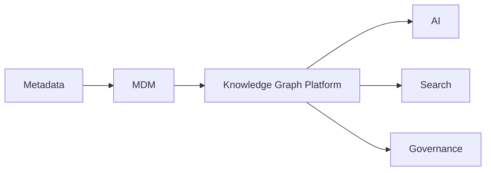
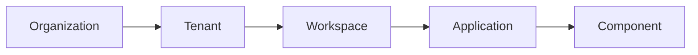
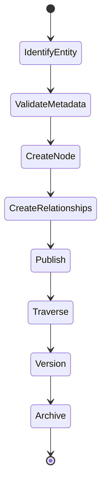
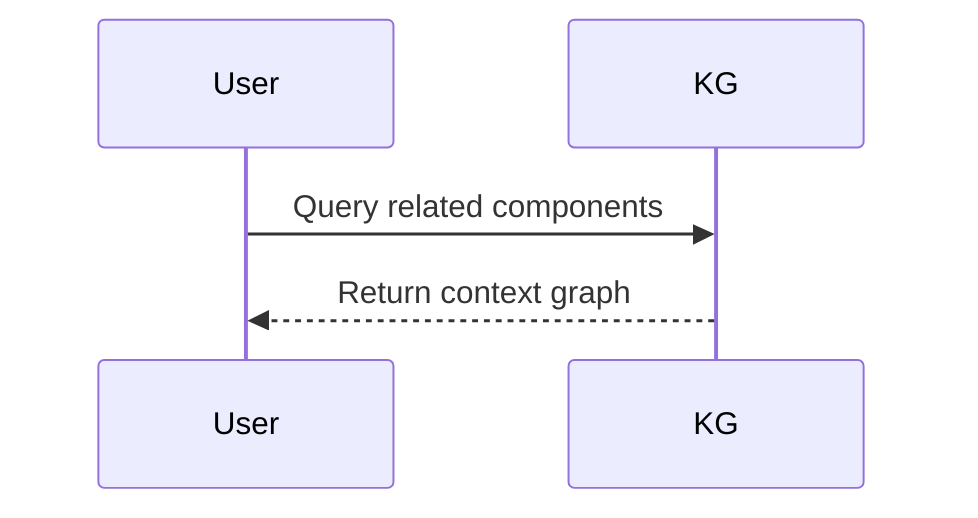
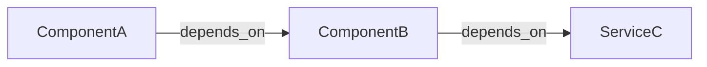
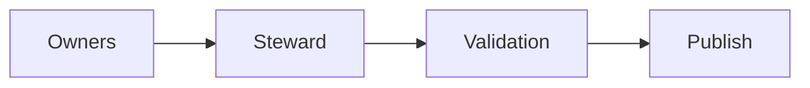
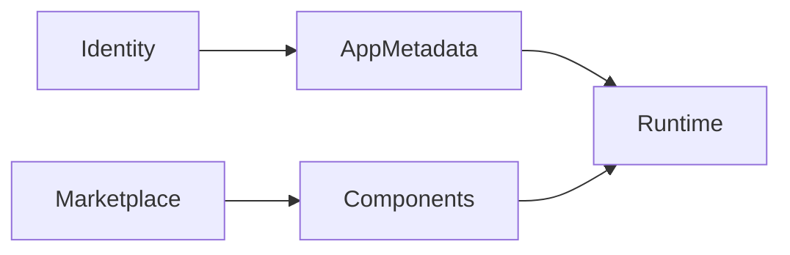
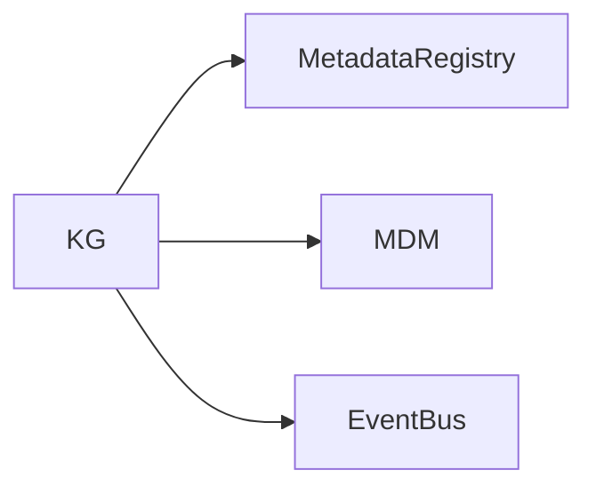
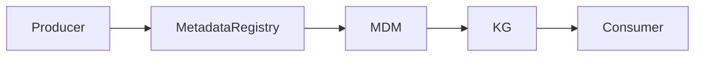

# Knowledge Graph Architecture (KB-089)

Executive Summary
-----------------
The Knowledge Graph Platform provides a semantic layer over canonical metadata and master data to model relationships, dependencies, and context across DUKADESK. It enables semantic discovery, impact analysis, AI context, governance intelligence, and cross-domain reasoning while preserving canonical ownership and metadata governance.

Purpose
-------
Define the enterprise architecture for modeling, managing, and consuming semantic relationships across the platform to enable richer discovery, explainable AI, dependency analysis, and governance workflows.

Scope
-----
Models semantic relationships among organizations, accounts, consumers, users, roles, tenants, workspaces, applications, screens, components, capabilities, workflows, data models, APIs, events, templates, themes, marketplace assets, AI artifacts, integrations, runtime resources, policies, and audit records.

Architectural Principles
------------------------
- Relationships Are First-Class: Edges are as important as nodes for platform reasoning.
- Metadata Before Semantics: Graph is derived from canonical metadata and master data.
- Canonical Entity References: Nodes reference canonical CIDs from MDM (KB-087).
- Immutable Identity: Nodes use immutable identifiers; edges capture provenance and versions.
- Explainable Relationships: Every semantic link is accompanied by provenance and justification.
- AI-Ready Knowledge: Graph supports embeddings, context windows, and semantic queries.
- Tenant-Aware Graphs: Scoping and access control prevent cross-tenant leakage.
- Observable Relationships: Monitor growth, traversal performance, and broken links.
- Technology Independence: Graph model independent of storage/graph engine.
- Semantic Governance: Policies control relationship creation, validation, and publication.

Critical Principle (Non-negotiable)
----------------------------------
The Knowledge Graph models relationships, never ownership. Canonical ownership remains with MDM and metadata with the Metadata Platform. The Knowledge Graph is a semantic overlay for relationships, context, and discovery.

Canonical Definitions
---------------------
- Knowledge Graph: Semantic network of nodes (entities) and edges (relationships) with provenance and context.
- Node: Graph vertex representing a canonical entity or concept.
- Edge: Directed semantic relationship between nodes with type, weight, and provenance.
- Relationship: Named semantic link (ownership, dependency, composition, uses, extends, governs).
- Semantic Link: Edge enriched with metadata about derivation, confidence, and source.
- Ontology: Conceptual schema of node types and relationship types (conceptual).
- Entity Graph: Subgraph representing a domain's entities and links.
- Dependency Graph: Directed graph representing runtime or build dependencies.
- Context Graph: Projected graph used for a particular AI or UI context.
- Knowledge Query: Query over graph for traversal, pattern, or inference.
- Traversal: Navigation through nodes and edges for discovery or analysis.
- Relationship Type: Predefined semantics for edges (e.g., depends_on, owns, publishes).
- Graph Registry: Catalog of graph projections, ontologies, and access controls.

Knowledge Graph Architecture
----------------------------

        Canonical Platform Resources
                  │
        Metadata Management Platform
                  │
        Master Data Management
                  │
         Knowledge Graph Platform
                  │
    Relationships • Context • Discovery
                  │
    AI • Search • Analytics • Governance


Knowledge Domains
-----------------
Graph covers identity, organizations, tenants, workspaces, applications, runtime, builder, marketplace, security, AI, search, events, storage, and governance. Each domain contributes nodes and edges derived from canonical sources.

Relationship Categories
-----------------------
Ownership, dependency, composition, reference, uses, publishes, consumes, extends, contains, executes, manages, governs, inherits, integrates. Each relationship type includes cardinality, directionality, normative semantics, and provenance requirements.

Graph Lifecycle
---------------
Identify Entity → Validate Metadata → Create Node → Create Relationships → Publish → Traverse → Version → Archive

Semantic Architecture
---------------------
- Semantic Modeling: Define ontologies and relationship types per domain; manage in Graph Registry.
- Relationship Registry: Store schema for allowed relationship types and validation rules.
- Context Resolution: Produce context-specific projections for UIs, AI, or analytics.
- Cross-Domain Navigation: Support traversals that respect tenancy, access controls, and policy.
- Dependency Analysis: Compute upstream/downstream impacts using dependency graphs.
- Impact Analysis: Use provenance and versioning to predict blast radius for changes.
- Semantic Search Integration: Expose graph-backed search augmentations (related entities, recommendations).

Graph Governance
----------------
- Graph Ownership: Owners for graph projections and ontologies.
- Relationship Stewardship: Stewards validate inferred or proposed relationships.
- Relationship Validation: Automated validators plus human review for low-confidence inferences.
- Relationship Versioning: Immutable versions with provenance and change rationale.
- Semantic Standards: Ontology governance and vocabulary management.
- Graph Registry: Catalog of graph projections, ontologies, consumers, and access rules.

AI Integration
--------------
- AI Context: Use neighborhood, embeddings, and canonical metadata to provide model context.
- Recommendation Systems: Graph signals power recommendations for components, templates, and dependencies.
- Intelligent Discovery: Semantic traversals assist users in finding related assets and impact paths.
- Impact Prediction: Graph-based heuristics and models predict likely downstream effects of changes.
- Explainability: Provenance on edges supports explainable AI responses.

Responsibilities
----------------
Runtime:
- Emit dependency and runtime relationship metadata to seed graph edges.

Backend:
- Build ingestion pipelines from metadata/MDM, maintain registry, serve projections, and provide query APIs.

Mobile Runtime & Builder:
- Consume context projections and present semantic navigation; do not mutate graph directly.

Marketplace & AI:
- Contribute artifact provenance and signature edges; use graph for trust and discovery.

Security
--------
- Graph Authorization: Fine-grained access controls for nodes, edges, and projections.
- Tenant Isolation: Enforce per-tenant scoping and multi-tenant projections safely.
- Relationship Visibility: Sensitive links hidden or redacted per classification and policy.
- Secure Traversal: Ensure traversal paths enforce access checks at each hop.
- Graph Auditability: Record creation, inference, approval, and deletion with actor and rationale.

Privacy
-------
- Relationship Exposure: Restrict edges that expose personal data or PII relationships.
- Personal Data Relationships: Consent and lawful-basis must be present for edges involving personal data.
- Consent Dependencies: Graph edges include consent provenance and effective dates.
- Cross-Tenant Relationship Restrictions: Prevent creation of graph links across tenants without explicit approval.

Performance
-----------
- Graph Traversal: Optimize for low-latency neighborhood and path queries with precomputed indexes.
- Relationship Resolution: Use incremental updates and materialized projections for heavy queries.
- Context Discovery: Provide caches and localized projections for high-read scenarios.
- Graph Scalability: Partition by tenant/domain, support sharding and federation.
- Incremental Updates: Stream changes from metadata/MDM into graph ingestion pipelines.

Observability (see KB-058)
---------------------------
Monitor:
- Node and edge growth rates
- Traversal latencies and hotspot nodes
- Broken relationships and orphan nodes
- Inference confidence distribution
- Stewardship queue lengths and approval latencies

Failure Scenarios & Handling
----------------------------
- Broken Relationships: Reconcile using provenance and source metadata; mark edges stale until reconciled.
- Cyclic Dependencies: Detect and report cycles; provide stewardship workflows to resolve.
- Invalid References: Quarantine edges with missing nodes and alert owners.
- Cross-Tenant Graph Leakage: Revoke access, audit, and remediate using backups and provenance.
- Missing Metadata: Fallback to registry lookups or tentative nodes with low confidence.
- Relationship Drift: Periodic re-evaluation of inferred links and confidence scores.
- Graph Synchronization Failure: Requeue ingestion and provide snapshot restore paths.

Anti-patterns
-------------
- Graph as source of truth — it must mirror canonical systems.
- Direct graph mutation by many services — mutations flow from canonical sources or steward-approved actions.
- Duplicate relationships or overlapping ontologies without governance.
- Hardcoded semantic links in services.
- Unvalidated inferred relationships pushed into production without review.
- Cross-tenant graph traversal without strict controls.

Future Evolution
----------------
- Autonomous Knowledge Discovery: Automated, validated discovery of relationships and ontologies.
- AI-Generated Relationships: Model-assisted edge proposals with steward-in-the-loop approval.
- Semantic Federation: Federate knowledge with partner graphs under trust contracts.
- Enterprise Knowledge Mesh: Decentralized graph federation with global queries.
- Self-Evolving Graphs: Feedback loops where usage informs graph reprioritization.

Cross References
----------------
- KB-073 Data Platform Architecture
- KB-077 Event & Messaging Architecture
- KB-078 Search & Indexing Architecture
- KB-085 Data Governance & Quality Architecture
- KB-087 Master Data Management Architecture
- KB-088 Metadata Management Architecture
- KB-090 Analytics & Business Intelligence Architecture (planned)
- KB-091 Reporting Architecture (planned)

Mermaid Diagrams
----------------
1) Knowledge Graph Platform Architecture



2) Entity Relationship Graph



3) Knowledge Graph Lifecycle



4) Semantic Navigation Flow



5) Dependency Analysis Model



6) Knowledge Graph Governance



7) AI Context Integration

```mermaid
flowchart LR
  KG --> Embeddings --> AI
  AI --> KG: contextual queries
```

8) Cross-Domain Relationship Map



9) Knowledge Graph Dependency Graph



10) End-to-End Semantic Discovery Workflow



Acceptance Criteria Mapping
---------------------------
- Architecture only: No graph-engine or vendor specifics.
- Graph database independent: Model applies across graph engines or services.
- Technology independent: Supports cloud, on-prem, and federated deployments.
- Enterprise grade: Governance, provenance, security, and observability included.
- AI-ready: Supports embeddings and context for AI systems.
- Fully cross-referenced: Links to key KBs.
- Mermaid complete: Ten diagrams included.
- Ready for Knowledge Base inclusion.

Completion Checklist
--------------------
- [x] Add KB-089 file (this document)
- [x] Mark KB-089 in PROGRESS_REGISTRY.md as Draft
- [x] Queue KB-090 — Analytics & Business Intelligence Architecture

Notes
-----
The Knowledge Graph is a semantic overlay that must be derived from authoritative metadata and master data. Inferred relationships require stewardship and validation before they influence governance or automated decisions.