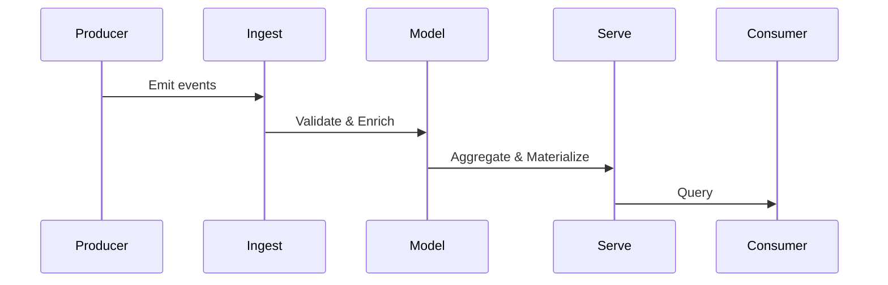
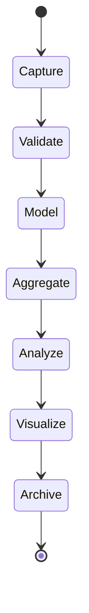
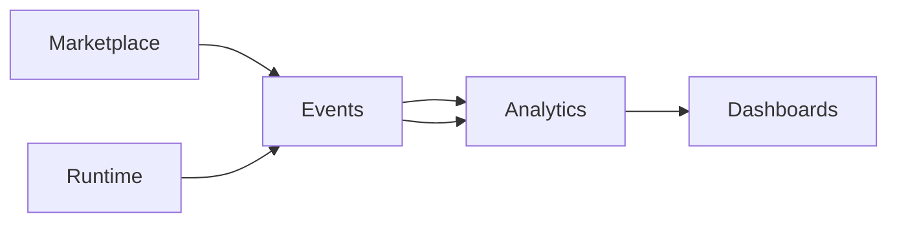
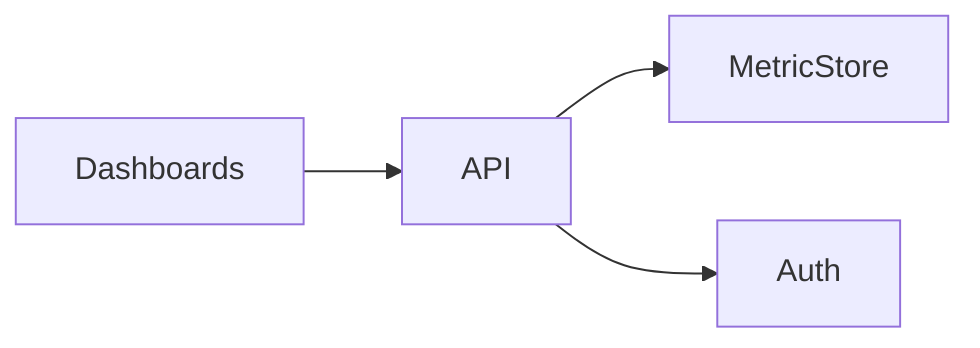

# Analytics & Business Intelligence Architecture (KB-090)

Executive Summary
-----------------
This architecture defines a platform-grade Analytics & BI capability that transforms governed operational data into trusted metrics, KPIs, dashboards, and AI-ready insights. The Analytics Platform consumes events and canonical data, models and aggregates it for reporting, forecasting, and decision support without becoming the operational source of truth.

Purpose
-------
Provide the canonical architecture for collecting, validating, modeling, aggregating, and serving analytics across platform operations, tenants, marketplaces, builders, AI, and governance while preserving data ownership, privacy, and tenant isolation.

Scope
-----
Supports analytics for platform operations, organizations, tenants, workspaces, applications, runtime, builder studio, marketplace, AI platform, mobile runtime, dashboards, APIs, integrations, governance, security, and infrastructure.

Architectural Principles
------------------------
- Operational Systems Are the Source of Truth: Analytics derives from canonical operational data.
- Analytics Is Read-Optimized: Separate analytical stores and models from transactional systems.
- Event-Driven Analytics: Use event streams and CDC as primary ingestion.
- Governed Metrics: KPI definitions are versioned and governed.
- Tenant-Aware Analytics: Per-tenant scoping and secure multi-tenancy.
- Privacy-Aware Analytics: Consent and minimization respected in aggregated views.
- Explainable KPIs: Metrics link back to provenance and canonical metadata.
- Metadata-Driven Analytics: Use metadata and MDM for dimension definitions and lineage.
- Technology Independence: Architecture is agnostic to specific data warehouses or engines.
- AI-Ready Insights: Models and feature stores supported for forecasting and ML.

Canonical Definitions
---------------------
- Analytics: Processing and analysis of operational data for insight.
- BI: Dashboards, reports, and interactive analysis surfaces.
- KPI: Governed metric with owner, definition, and SLA.
- Metric: Measurable value derived from events or records.
- Dimension: Contextual key for slicing metrics (tenant, app, region).
- Measure: Numeric aggregation used in metrics.
- Data Mart: Conceptual specialized analytical dataset for a domain.
- Time Series: Chronological sequence of metric observations.
- Analytical Model: Processing logic for derived metrics, cohorts, forecasts.

Analytics Architecture
----------------------

      Operational Platform Services
                 │
      Events • Canonical Data
                 │
        Analytics Platform
                 │
 Modeling • Aggregation • KPIs
                 │
 Dashboards • AI • Reporting

Analytics Domains
-----------------
Identity, organizations, tenants, workspaces, applications, runtime, builder, marketplace, AI, infrastructure, security, storage, search, and governance. Each domain registers metrics, dimensions, and owners.

Analytics Lifecycle
-------------------
Capture → Validate → Model → Aggregate → Analyze → Visualize → Archive

Capture & Ingestion
- Event Streams & CDC: Primary ingest channels for analytics.
- Validation: Schema and event validation to prevent garbage-in.
- Enrichment: Join with metadata/MDM to attach dimensions and provenance.

Modeling & Aggregation
- Canonical Metrics: Governed definitions stored in KPI registry.
- Derived Metrics: Composite and pipeline-generated measures.
- Aggregation Windows: Sliding, tumbling, and fixed windows for time-series.
- Feature Stores: Support for ML feature materialization and reuse.

Serving & Consumption
- Dashboards: Read-optimized views with tenant-aware access.
- APIs: Query APIs for metric retrieval, trends, and cohort analysis.
- Exports: Controlled exports for reporting and downstream ML.
- Alerts: Threshold and anomaly-based alerting integrated with observability.

Metric Architecture
-------------------
- KPI Registry: Versioned store of metric definitions, owners, dimensions, and SLAs.
- Metric Ownership: Owners and stewards responsible for correctness and certification.
- Metric Versioning: Changes tracked with impact analysis and approval flows.
- Derived & Composite Metrics: Defined as transformations over canonical metrics.

Analytical Models
-----------------
Support for time-series, trend analysis, cohort analysis, comparative studies, operational analytics, marketplace performance, builder usage, and AI model telemetry. Models are governed, versioned, and reproducible.

Dashboard Architecture
----------------------
- Platform Operations: Health, capacity, and incident dashboards.
- Business Dashboard: Revenue, usage, and tenant metrics for operators.
- Tenant Dashboard: Tenant-scoped insights and SLA monitoring.
- Marketplace & Builder Dashboards: Package usage, adoption, and quality.
- AI Ops: Model performance, drift, and inference metrics.

Governance
----------
- Metric Ownership & Approval: All KPIs require owners and approval before publication.
- Quality Validation: Data quality checks feed metric certification.
- Data Certification: Certified datasets and marts published for consumption.
- Auditability: Provenance links metrics back to canonical events and metadata.

Responsibilities
----------------
Runtime:
- Emit structured telemetry and provenance metadata for analytics.

Backend:
- Orchestrate ingestion, validation, modeling, aggregation, and serving layers.
- Host KPI registry, metric APIs, and certified data marts.

Mobile Runtime & Builder:
- Emit usage telemetry and consume tenant-scoped insights via APIs.

Marketplace & AI:
- Provide model telemetry and marketplace metrics for analytics pipelines.

Security
--------
- Analytics Authorization: Role-based access to metrics, dashboards, and exports.
- Tenant Isolation: Logical separation of tenant data and query results.
- Sensitive Metrics: Controls for redaction, aggregation, and restricted views.
- Secure Access: Audit logging and least-privilege access to analytical stores.

Privacy
-------
- Data Minimization: Aggregate personal data; apply anonymization or pseudonymization.
- Consent-Aware Analytics: Respect consent signals when including personal data.
- Aggregated Personal Data: Prefer aggregates above raw PII for BI surfaces.
- Rights Dependencies: Support erasure and portability impacts on analytics pipelines.

Performance
-----------
- Large-Scale Aggregation: Batch and streaming paths for heavy computations.
- Time-Series Processing: Efficient rollups and compaction for long-term storage.
- Dashboard Responsiveness: Cached materialized views for low-latency reads.
- Scalability: Horizontal scaling for ingestion, compute, and serving layers.

Observability (see KB-058)
---------------------------
Monitor:
- Metric Freshness and Staleness
- KPI Health and Certification Status
- Analytics Latency and Backpressure
- Ingestion Success/Failure Rates
- Dashboard Usage and Query Performance

Failure Scenarios & Handling
----------------------------
- Incorrect KPI Calculation: Recompute with certified data and publish correction notes.
- Missing Events: Alert producers and backfill using replay where possible.
- Delayed Aggregation: Provide degraded UX and notify stakeholders.
- Cross-Tenant Data Exposure: Revoke access, audit, and remediate with data isolation.
- Stale Metrics: Automatic recertification triggers and owner notifications.

Anti-patterns
-------------
- Using analytics as operational source of truth
- Hardcoded KPI logic in dashboards
- Ungoverned metrics and duplicate computations
- Direct ad-hoc reads from production databases
- Cross-tenant dashboards without strict controls

Future Evolution
----------------
- Predictive Analytics and Forecasting as a Service
- AI-Generated Insights and narrative explanations
- Autonomous KPI Discovery and anomaly detection
- Prescriptive Analytics and decision automation
- Real-time decision intelligence integrated with platform automation

Cross References
----------------
- KB-058 Runtime Observability & Diagnostics Architecture
- KB-073 Data Platform Architecture
- KB-077 Event & Messaging Architecture
- KB-078 Search & Indexing Architecture
- KB-085 Data Governance & Quality Architecture
- KB-086 Data Privacy & Compliance Architecture
- KB-088 Metadata Management Architecture
- KB-089 Knowledge Graph Architecture
- KB-091 Reporting Architecture (planned)
- KB-092 Data Federation Architecture (planned)

Mermaid Diagrams
----------------
1) Analytics Platform Architecture

2) Analytics Data Flow

3) Analytics Lifecycle

4) KPI Governance Model

5) Dashboard Architecture

6) Analytical Model Relationships

7) Analytics Dependency Graph

8) Cross-Domain Analytics Flow

9) Analytics Consumption Architecture

10) End-to-End Analytics Pipeline

Acceptance Criteria Mapping
---------------------------
- Architecture only: No vendor or implementation specifics.
- BI platform independent: Patterns apply across engines.
- Database independent: Supports streaming and batch sources.
- Enterprise grade: Governance, privacy, tenancy, and observability included.
- AI-ready: Supports models, feature stores, and embeddings.
- Fully cross-referenced: Links to related KBs included.
- Mermaid complete: Ten diagrams provided.
- Ready for Knowledge Base inclusion.

Completion Checklist
--------------------
- [x] Add KB-090 file (this document)
- [x] Mark KB-090 in PROGRESS_REGISTRY.md as Draft
- [x] Queue KB-091 — Reporting Architecture

Notes
-----
This specification defines analytics architecture only. Implementation teams must map these patterns to data warehouses, streaming platforms, and BI tooling while preserving canonical ownership, governance, and tenant isolation.
