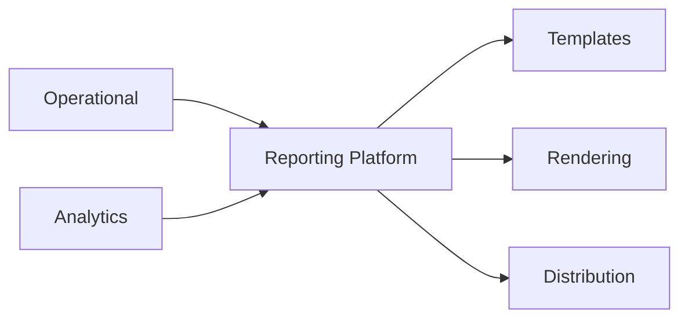
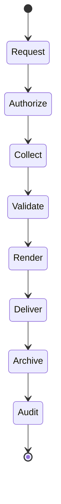
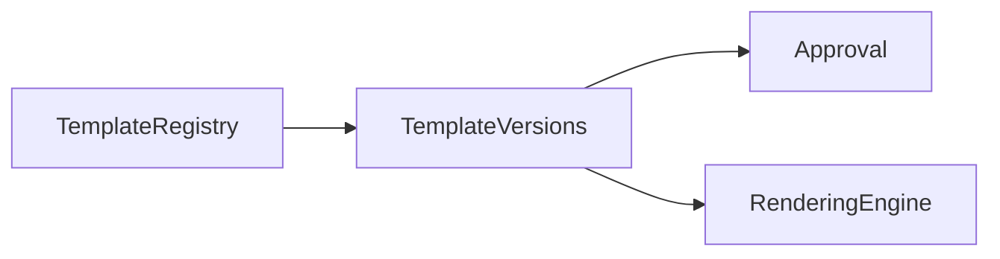
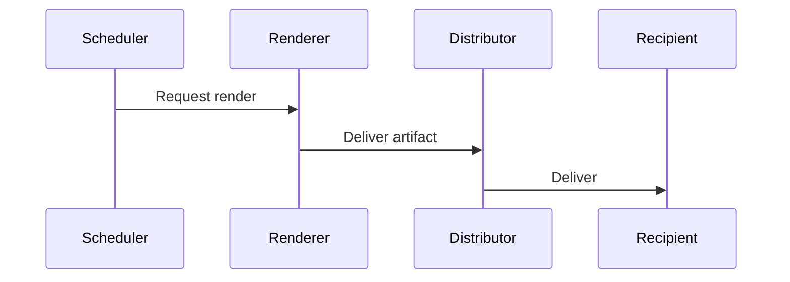
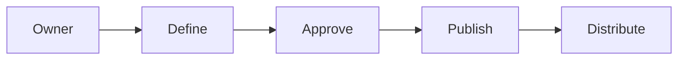
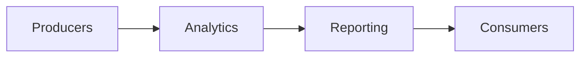
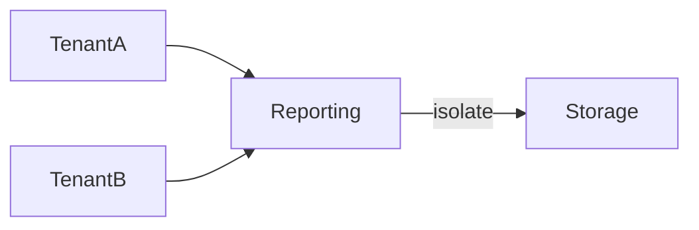
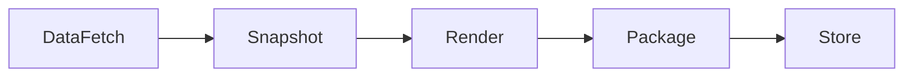
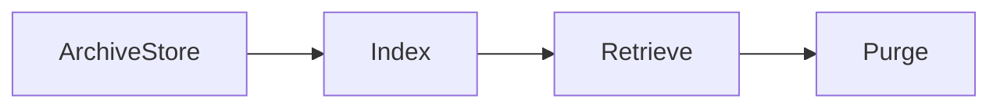

# Reporting Architecture (KB-091)

Executive Summary
-----------------
This specification defines the platform architecture for producing governed, reproducible, auditable, and distributable reports across DUKADESK. Reporting is a production capability that generates immutable, versioned artifacts derived from governed data and analytical models.

Purpose
-------
Provide the canonical architectural model for report definition, rendering, scheduling, delivery, archiving, and auditing while preserving tenant isolation, provenance, and governance.

Scope
-----
Supports operational, financial, regulatory, executive, tenant, marketplace, builder, AI, and audit reporting across Platform Services, Analytics, and external integrations.

Architectural Principles
------------------------
- Reports Are Derived Artifacts: Reports are materialized views of governed data and models.
- Point-in-Time Accuracy: Every report captures a reproducible snapshot with provenance.
- Reproducibility: Reports can be regenerated from their definition and source artifacts.
- Governed Templates: Templates are versioned, approved, and parameterized.
- Versioned Reports: Every generated report is immutable and versioned with metadata.
- Tenant Isolation: Reports scoped and access-controlled per tenant.
- Policy-Driven Distribution: Distribution follows policy (consent, retention, residency).
- Auditability: Full provenance and access logs for every report and artifact.
- Technology Independence: Rendering, storage, and delivery implementations are pluggable.
- Secure Consumption: Delivery channels enforce encryption, auth, and expiry.

Canonical Definitions
---------------------
- Report: An immutable, generated artifact representing governed information at a point-in-time.
- Report Template: Parameterized layout and logic for producing reports.
- Report Definition: Metadata linking template, data sources, parameters, schedule, and policy.
- Report Instance: A generated report produced from a definition at a specific time.
- Reporting Job: Execution instance that performs data collection, render, and delivery.
- Report Manifest: Machine-readable metadata describing the report instance provenance.
- Report Registry: Catalog of definitions, templates, instances, and lifecycle state.
- Snapshot: Point-in-time export of source data and model versions used to render a report.

Reporting Platform Architecture
-------------------------------

 Operational Systems      Analytics Platform
          │                      │
          └──────────┬───────────┘
                     │
             Reporting Platform
                     │
  Templates • Rendering • Distribution
                     │
      Users • APIs • Export Channels


Reporting Domains
-----------------
Identity, organizations, tenants, workspaces, applications, runtime, marketplace, builder, AI, governance, security, infrastructure, billing, and audit. Each domain defines available report definitions, owners, and policies.

Reporting Lifecycle
-------------------
Request → Authorize → Collect Data → Validate → Render → Deliver → Archive → Audit

Key rules:
- Authorization and tenancy checks occur before data collection.
- Data collection records provenance: dataset versions, event checkpoints, MDM/metadata references.
- Rendering uses certified templates and rendering engines; rendered artifacts are immutable.
- Distribution respects policy: encryption, consent, residency, and retention.
- Archive preserves report instance and manifest for reproducibility and audit.

Report Types
------------
Operational, executive, compliance, audit, marketplace, builder, tenant, business, infrastructure, and AI reports. Each type defines template expectations, frequency, retention, and sensitivity.

Template Architecture
---------------------
- Template Registry: Versioned storage for templates with ownership and approval metadata.
- Template Versioning: Immutable versions with change rationale and test artifacts.
- Parameterization: Templates accept parameters (time range, tenant, filters) and define validation rules.
- Localization & Branding: Templates support localization and tenant branding via metadata-driven injection.
- Approval Workflow: Sensitive templates require steward approval before usage.

Distribution & Delivery
-----------------------
- Interactive Viewing: Secure, time-limited session to view report instances.
- Scheduled Delivery: Periodic jobs to generate and deliver reports to recipients.
- On-Demand Generation: Ad-hoc generation for authorized users.
- External Delivery: Secure export via APIs, signed URLs, SFTP, or integration channels (conceptual).
- Secure Sharing: Access-controlled shares with expiration, audit, and revocation.
- Notifications: Event-driven alerts for job completion, failures, or delivery issues.

Governance
----------
- Ownership: Each report definition and template has an owner and steward.
- Approval: Publication and scheduled distribution require approval for sensitive scopes.
- Version Control: Changes to definitions/templates tracked with impact analysis.
- Retention & Archival: Report instances retained per policy; archived with snapshots and manifests.
- Audit Trails: Record of generation parameters, source versions, actors, and delivery records.

Responsibilities
----------------
Runtime:
- Provide certified data endpoints and snapshot capabilities to support reproducible reports.

Backend:
- Provide registry, rendering services, scheduling engine, distribution connectors, and manifest storage.

Mobile Runtime & Builder:
- Request and display tenant-scoped reports via secure APIs; do not store raw report artifacts unless authorized.

Marketplace & AI:
- Contribute provenance metadata for published assets and include signatures for high-trust reports.

Security
--------
- Authorization: RBAC/ABAC for report definitions, generation, and access.
- Tenant Isolation: Ensure per-tenant scoping in multi-tenant generation and storage.
- Secure Rendering: Sandboxed rendering environments for untrusted templates.
- Protected Distribution: Encryption-in-transit and at-rest for generated artifacts; signed manifests for integrity.
- Integrity Verification: Manifests include checksums and provenance for verification.

Privacy
-------
- Sensitive Report Data: Identify PII and apply minimization, redaction, or anonymization per policy.
- Consent-Aware Reporting: Respect consent flags when including personal data in reports.
- Access Restrictions: Strict controls and verification for rights to request sensitive reports.
- Right to Erasure Impact: Reports containing personal data are versioned; deletion requests handled per retention and legal hold rules.

Performance
-----------
- Large Report Generation: Support chunking, streaming rendering, and pagination for large datasets.
- Batch Workloads: Schedule-based concurrency controls and backpressure handling.
- Rendering Scalability: Autoscaling rendering pool; cache reusable intermediate artifacts.
- Historical Reports: Indexed archives and fast retrieval of manifests and artifacts.

Observability (see KB-058)
---------------------------
Expose metrics for:
- Generation success/failure rates
- Rendering latency and resource usage
- Distribution success and latency
- Archive health and retrieval latency
- Approval and stewarding queues

Failure Scenarios & Handling
----------------------------
- Failed Rendering: Capture logs, persist failure manifest, notify owners, and retry with limits.
- Unauthorized Access: Deny, audit, and revoke relevant tokens; investigate and remediate.
- Missing Data Sources: Fail gracefully with clear diagnostics; enable backfill policies.
- Stale Snapshots: Detect via provenance mismatch and trigger regeneration or annotation.
- Distribution Failure: Dead-letter delivery attempts and manual remediation workflows.
- Corrupted Artifact: Validate via checksum and regenerate from snapshot if possible.
- Cross-Tenant Exposure: Immediate containment, audit, and restore from isolated backups.

Anti-patterns
-------------
- Reports as operational databases
- Direct DB access for reporting without governance
- Unversioned templates or report instances
- Hardcoded report generation in apps
- Shared report artifacts across tenants without controls
- Manual report edits that break reproducibility

Future Evolution
----------------
- AI-Generated Narrative Reports and summaries
- Natural-Language Reporting and question-driven report generation
- Adaptive Reporting that personalizes content by role and context
- Autonomous Scheduling using usage patterns and risk signals
- Multi-Channel Delivery with intelligent routing and delivery optimization

Cross References
----------------
- KB-058 Runtime Observability & Diagnostics Architecture
- KB-073 Data Platform Architecture
- KB-084 Data Import & Export Architecture
- KB-085 Data Governance & Quality Architecture
- KB-086 Data Privacy & Compliance Architecture
- KB-088 Metadata Management Architecture
- KB-089 Knowledge Graph Architecture
- KB-090 Analytics & Business Intelligence Architecture
- KB-092 Data Federation Architecture (planned)
- KB-093 Data Archival & Historical Intelligence Architecture (planned)

Mermaid Diagrams
----------------
1) Reporting Platform Architecture



2) Report Generation Lifecycle



3) Report Template Architecture



4) Report Distribution Flow



5) Report Governance Model



6) Reporting Dependency Graph



7) Multi-Tenant Reporting Architecture



8) Report Rendering Pipeline



9) Report Archive Lifecycle



10) End-to-End Reporting Workflow

```mermaid
flowchart LR
  User -> DefineReport -> Schedule -> Generate -> Distribute -> Archive
```

Acceptance Criteria Mapping
---------------------------
- Architecture only: No vendor or implementation specifics.
- Reporting engine independent: Design applies across engines.
- Technology independent: Supports cloud, on-prem, and hybrid.
- Enterprise grade: Governance, security, privacy, and observability included.
- Fully cross-referenced: Links to related KBs.
- Mermaid complete: Ten diagrams included.
- Ready for Knowledge Base inclusion.

Completion Checklist
--------------------
- [x] Add KB-091 file (this document)
- [x] Mark KB-091 in PROGRESS_REGISTRY.md as Draft
- [x] Queue KB-092 — Data Federation Architecture

Notes
-----
Reporting is intentionally decoupled from operational systems. Implementation teams must implement rendering, scheduling, and distribution engines that preserve reproducibility, auditability, and tenant isolation while integrating with analytics and metadata platforms.