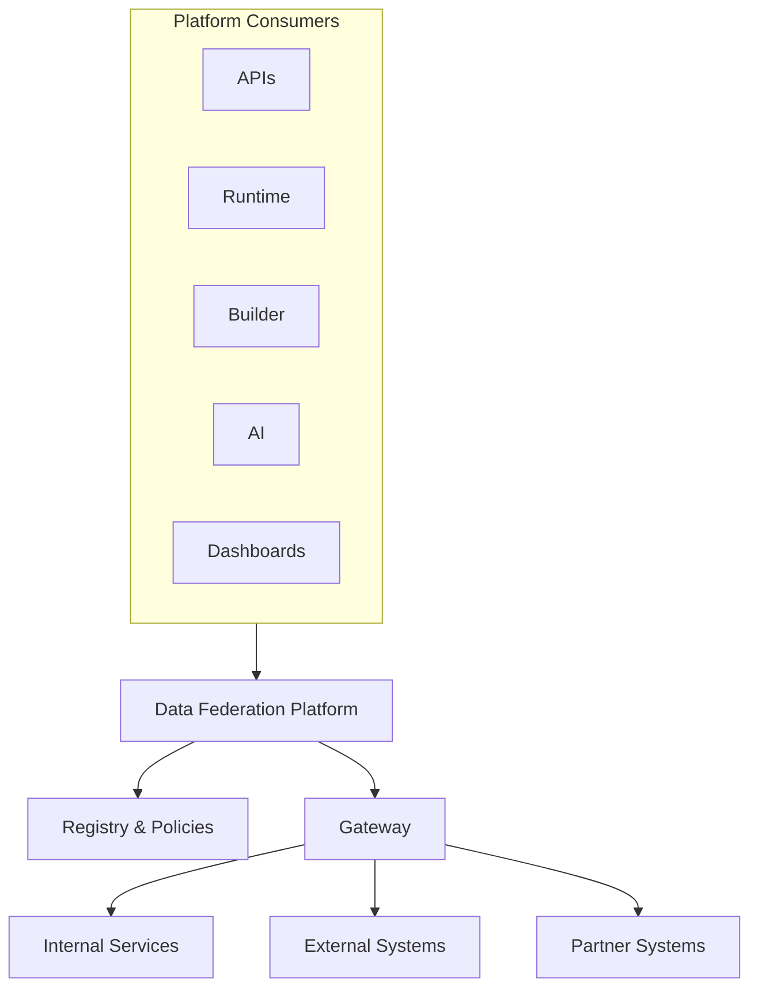
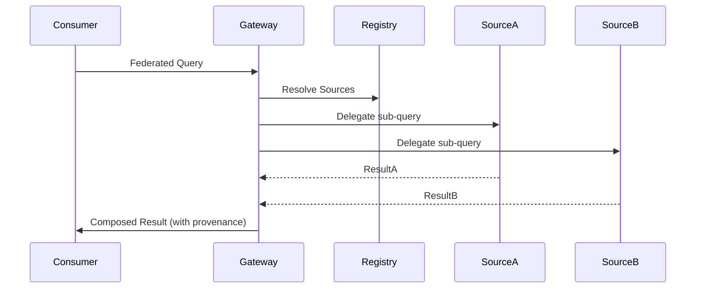
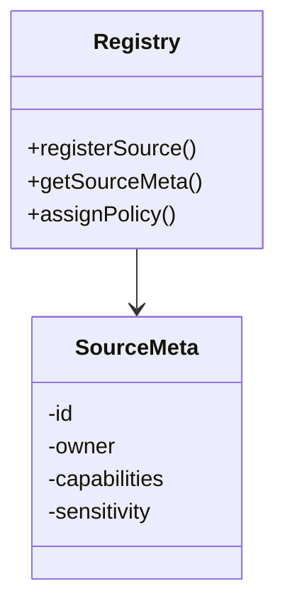
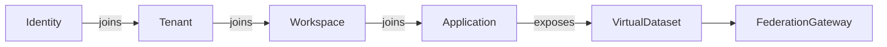
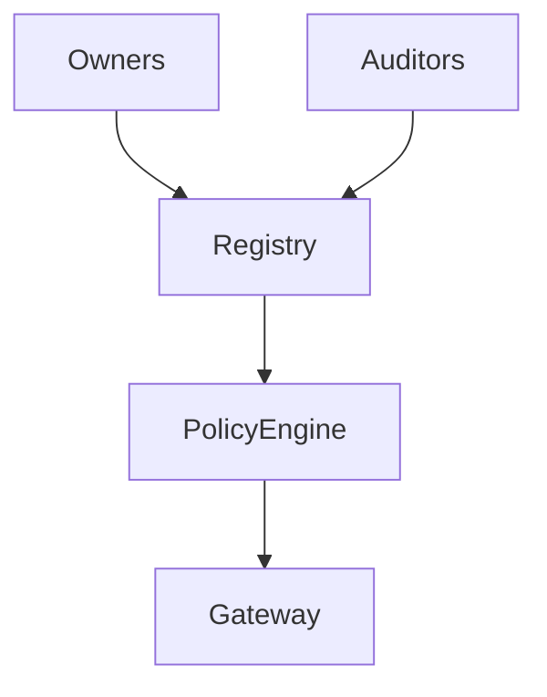
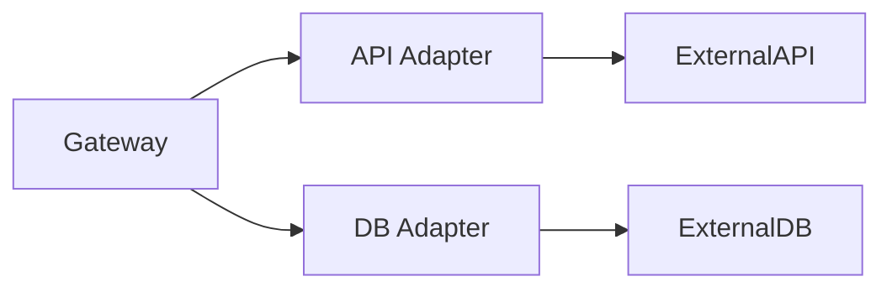
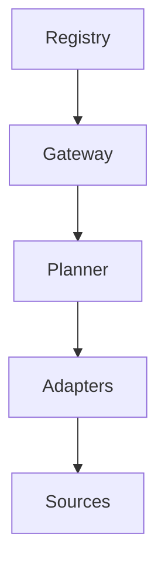
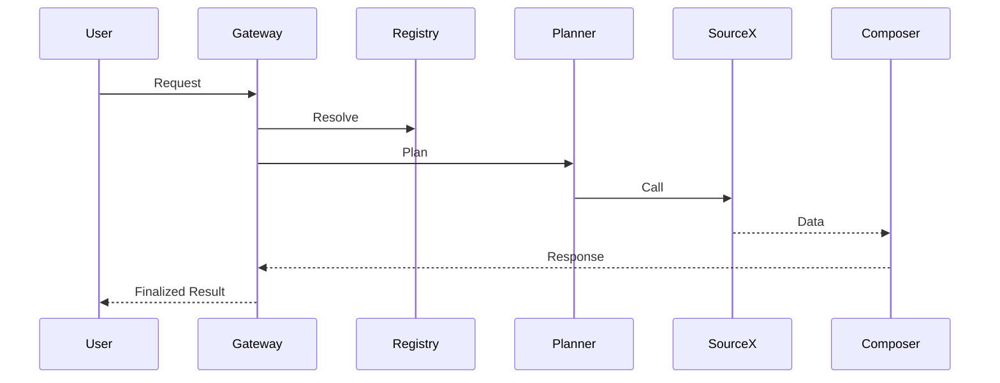

# KB-092 — Data Federation Architecture (Draft)

## Executive Summary

Data Federation provides a governed, secure, and unified logical view across distributed data sources without transferring ownership. It enables discovery, composition, and consumption of governed information across internal services, external systems, partner platforms, and edge deployments while preserving canonical ownership, tenant isolation, privacy, governance, and observability.

## Purpose

Define the enterprise architecture that enables logical composition and access to distributed governed data across the DUKADESK ecosystem. The Federation Platform must be policy-driven, metadata-aware, zero-trust aligned, and technology independent.

## Scope

Supports federated access for:
- Identity, Organizations, Tenants, Workspaces, Applications
- Runtime, Builder Studio, Marketplace, Mobile Runtime
- AI Platform, Analytics, Reporting, Storage, Search, Governance
- External business systems, SaaS, partner platforms, edge deployments

## Architectural Principles

- Federated Access, Not Federated Ownership
- Canonical Ownership Preserved
- Logical Data Composition (virtual datasets)
- Policy-Driven Federation
- Tenant Isolation and Contextualization
- Zero Trust Data Access
- Privacy by Design and Consent-awareness
- Metadata-Driven Federation and Registry-first
- Observable Federation (metrics, tracing, audit)
- Technology Independence and API-agnosticism

## Canonical Definitions

- Data Federation — logical layer composing data from distributed sources without changing ownership.
- Federated Domain — logical grouping of sources by business context.
- Federated Source — an individual data source registered with the federation.
- Federated Query — a query routed across one or more sources and composed by the federation layer.
- Federated View — a published virtual dataset exposed to consumers.
- Virtual Dataset — a logical dataset defined by composition rules and transformation hints.
- Canonical Owner — authoritative service or system owning a dataset.
- Federation Registry — catalog of sources, capabilities, metadata and policies.
- Federation Policy — rules for access, transformation, residency, and privacy.
- Query Delegation — the act of routing sub-queries to owning sources.
- Source Adapter — an adapter that translates federation requests to source-specific protocols.
- Federation Gateway — the policy enforcement and routing plane for federated queries.
- Cross-Domain Composition — join/transform rules across multiple domains.

## Federation Platform Architecture

```
                 Platform Consumers
                         │
      APIs • Runtime • Builder • AI • Dashboards
                         │
              Data Federation Platform
                         │
    Federation Registry • Policies • Metadata
                         │
     ┌──────────────┬──────────────┬──────────────┐
     │              │              │
 Internal      External      Partner Systems
 Services       Systems
```

### Components (conceptual)
- Federation Gateway: authentication, authorization, routing, orchestration, response composition.
- Federation Registry: source/catalog metadata, capability discovery, versioning, policy bindings.
- Source Adapters: protocol/semantic adapters for databases, APIs, event stores, object stores.
- Query Planner & Router: decomposes federated queries, plans delegation, optimizes parallelism.
- Result Composer & Validator: aggregates, validates, enforces schema and policy constraints.
- Caching & Materialization Hints: configurable caches and optional materialized views for performance.
- Policy Engine: enforces access, masking, transformation, residency, retention rules.
- Observability Fabric: request metrics, source health, latency, audit trails, tracing.

## Federation Domains

Federation must support cross-domain composition for:
- Identity, Organizations, Tenants, Workspaces
- Applications, Runtime, Marketplace, Builder
- AI, Analytics, Reporting, Storage, Search, Governance

## Federation Lifecycle

Discover Source
  ↓
Register (metadata + owner)
  ↓
Validate (capabilities, schema, auth)
  ↓
Authorize (policies, tenant contracts)
  ↓
Compose (virtual dataset / view)
  ↓
Query (delegation + composition)
  ↓
Observe (metrics, audit)
  ↓
Retire

## Federation Registry

The Registry is the single place to register federated sources and bind policies:
- Source Registration: endpoint, adapter type, owner, supported operations, schema fingerprints.
- Source Ownership: canonical owner reference (MDM/KB-087).
- Metadata Registration: schema, classification, sensitivity, residency, latency profile.
- Policy Assignment: access control, masking, aggregation limits, residency constraints.
- Capability Discovery: which queries or predicates the source can evaluate.
- Version Management: source API/schema versions and compatibility notes.

## Query Federation (conceptual)

- Query Routing: accept federated query, authenticate consumer, resolve target sources via registry.
- Source Resolution: map logical entities to physical sources, consult ownership and capability metadata.
- Query Delegation: push-down filters, predicates, projections to owning sources when safe.
- Parallel Execution: orchestrate parallel sub-query execution where possible to minimize latency.
- Result Aggregation: merge, join, sort, and reduce partial results, respecting policy constraints.
- Result Validation: verify schema conformance, integrity, and referential consistency.
- Failure Handling: return partial results with diagnostics or retry according to policy.

## Federation Policies

- Access Policies: who can query which virtual datasets and at what granularity.
- Ownership Policies: ensure ownership metadata drives delegation and change notifications.
- Data Classification Policies: sensitive vs. non-sensitive handling (masking, redaction).
- Tenant Policies: tenant scoping, tenant-aware composition, cross-tenant prevention.
- Performance Policies: timeout, parallelism, max result sizes, pagination rules.
- Privacy Policies: consent checks, residency enforcement, purpose limitation.
- Transformation Policies: allowed transformations, enrichment rules, and derivation lineage.

## External System Federation

Federation supports:
- Enterprise systems (ERP, CRM), SaaS platforms, partner APIs, government services.
- Adapters should handle auth variations, throttling, schema mapping and reconciliation hints.
- Integration agreements govern cadence, quotas, SLAs, and legal/residency constraints.

## Responsibilities

Runtime Responsibilities:
- Use federated views instead of local copying for realtime reads where appropriate.

Backend Responsibilities:
- Register owned sources and publish metadata to the federation registry.
- Enforce canonical ownership and respond to delegated queries per contracts.

Mobile Runtime Responsibilities:
- Use compact federated views and pagination; rely on backend for heavy composition.

Builder Responsibilities:
- Define virtual datasets, composition rules, expected latency and freshness targets.

Marketplace Responsibilities:
- Marketplace publishers register capabilities and allowed data-sharing contracts.

AI Platform Responsibilities:
- Consume federated, consented views; record lineage and usage for model governance.

## Security

- Zero Trust Federation: mutual authentication, short-lived credentials, and fine-grained authorization.
- Source Authentication: adapter-managed credentials and per-source auth policies.
- Consumer Authorization: context-aware authorization (role, tenant, purpose).
- Tenant Isolation: enforce tenant scoping at query planner and policy engine levels.
- Secure Delegation: signed delegation tokens for long-running queries.
- Auditability: immutable audit logs for all federated requests and result deliveries.
- Policy Enforcement: masking, tokenization, transformation applied at gateway or source as required.

## Privacy

- Consent-Aware Federation: consent flags in metadata control whether personal data can be returned.
- Sensitive Data Restrictions: block or transform fields marked sensitive unless permitted.
- Cross-Tenant Prevention: deny queries attempting to compose data across tenants unless explicit consent/policy exists.
- Data Residency Awareness: route queries or restrict results to meet residency constraints.

## Performance

- Query Optimization: push-down predicates, projection, and aggregation when safe.
- Source Latency: plan for slow sources with timeouts, partial results, and async augmentation.
- Caching Integration: cache common query results or use materialized views with TTL and invalidation rules.
- Parallel Federation: execute independent sub-queries concurrently to reduce end-to-end latency.
- Scalability: horizontally scale gateway, planner, and registries; shard registry by domain where needed.
- Partial Failure Handling: return deterministic partial results and clear diagnostics.

## Observability (see KB-058)

Track:
- Federation request counts and latencies
- Source health and availability
- Query planning and execution traces
- Authorization failures and policy violations
- Composition success and partial-result rates
- Cache hit/miss rates and materialization metrics

## Failure Scenarios

- Source Unavailable: failover, degrade to cached materialization, or return error with diagnostics.
- Unauthorized Source Access: deny and audit; alert on repeated attempts.
- Cross-Tenant Federation: detect and block composition attempts that violate tenant policies.
- Conflicting Source Schemas: surface schema drift, require reconcilers or transformation rules.
- Query Timeout: return partial results or instruct consumer to use async retrieval.
- Partial Results: mark responses with provenance and completeness metadata.
- Invalid Metadata: reject registration until metadata validated.
- Registry Drift: periodic reconciliation between registry and source owners.

## Anti-patterns

- Federation replacing ownership or authority over data
- Direct DB-level federation across tenant schemas without policy enforcement
- Hardcoded source mappings in services
- Bypassing governance via ad-hoc connectors
- Cross-tenant composition without explicit policies
- Hidden sources or undocumented adapters

## Future Evolution

- Autonomous Source Discovery with owner-initiated validation
- AI-Assisted Federation: semantic matching and adaptive query routing
- Intelligent Query Routing based on cost, latency, and data sensitivity
- Multi-Cloud and Edge Federation for hybrid deployments
- Federated Knowledge Networks integrating with KB-089 (Knowledge Graph)

## Cross References

- KB-073 Data Platform Architecture
- KB-076 Data Access Layer Architecture
- KB-077 Event & Messaging Architecture
- KB-078 Search & Indexing Architecture
- KB-079 Caching Architecture
- KB-084 Data Import & Export Architecture
- KB-085 Data Governance & Quality Architecture
- KB-086 Data Privacy & Compliance Architecture
- KB-088 Metadata Management Architecture
- KB-089 Knowledge Graph Architecture
- KB-090 Analytics & Business Intelligence Architecture
- KB-091 Reporting Architecture
- KB-093 Data Archival & Historical Intelligence Architecture (planned)

## Mermaid Diagrams

1. Data Federation Platform Architecture



2. Federated Query Flow



3. Federation Registry Model



4. Source Registration Lifecycle


5. Federated Data Composition

```mermaid
flowchart TB
  Query --> Planner --> [Delegate | LocalCompose]
  Delegate --> SourceA
  Delegate --> SourceB
  SourceA --> Composer
  SourceB --> Composer
  Composer --> Result
```

6. Cross-Domain Federation Architecture



7. Federation Governance Model



8. External System Federation



9. Federation Dependency Graph



10. End-to-End Federated Query Workflow



## Acceptance Criteria

- Architecture only; no implementation specifics.
- Database, API, and cloud provider independent.
- Enterprise-grade and Zero Trust aligned.
- Preserves canonical ownership: Federation must not transfer ownership.
- Fully cross-referenced to related KBs.
- Mermaid diagrams included (conceptual).
- Ready for Knowledge Base inclusion as Draft.

## Completion

- Update PROGRESS_REGISTRY.md: KB-092 set to Draft and KB-093 queued.

## Critical DUKADESK Rule

> Data Federation provides unified access without transferring ownership.

Canonical ownership remains with the owning service (MDM/KB-087). The Federation Platform only composes views and delegates queries; it never overrides or reassigns ownership.


<!-- End of KB-092 -->
