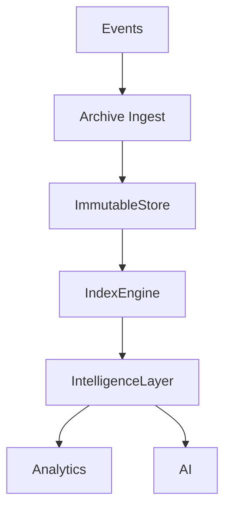
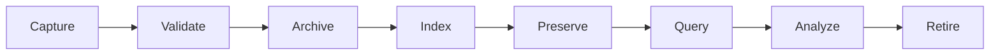
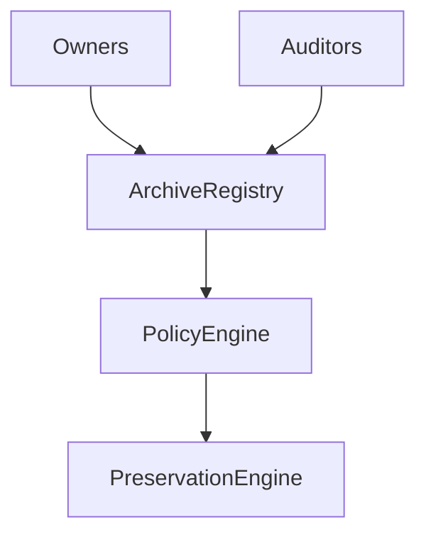
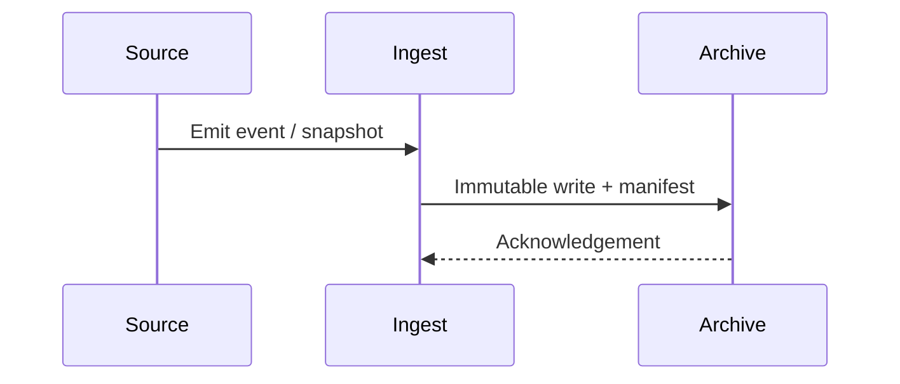
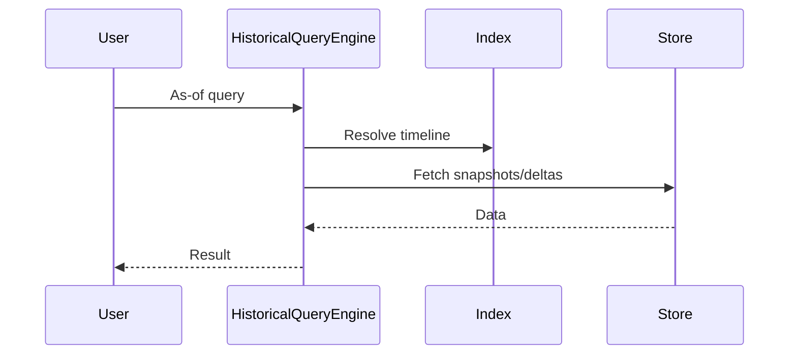
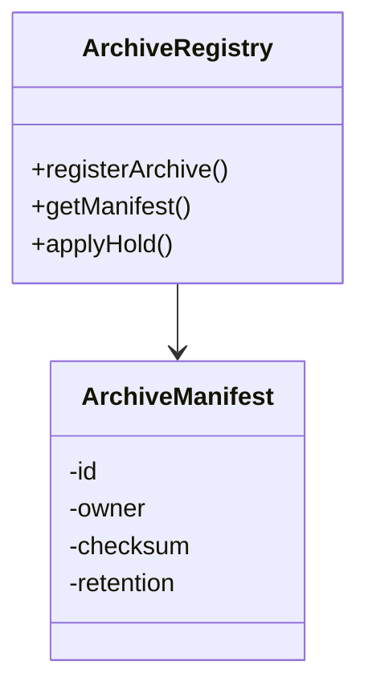
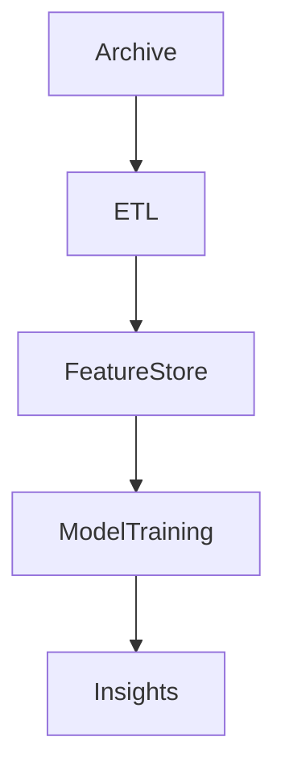
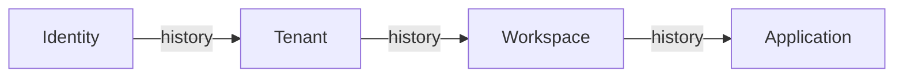
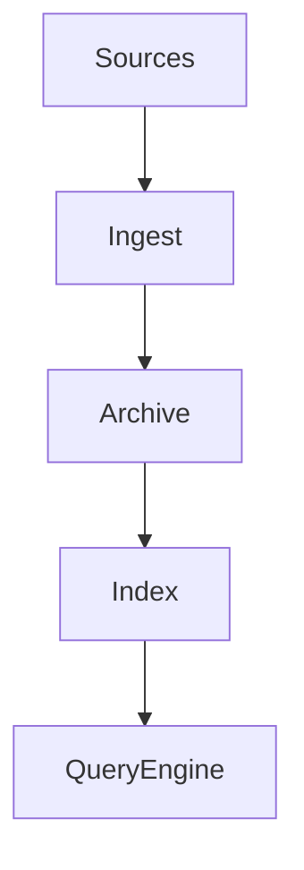
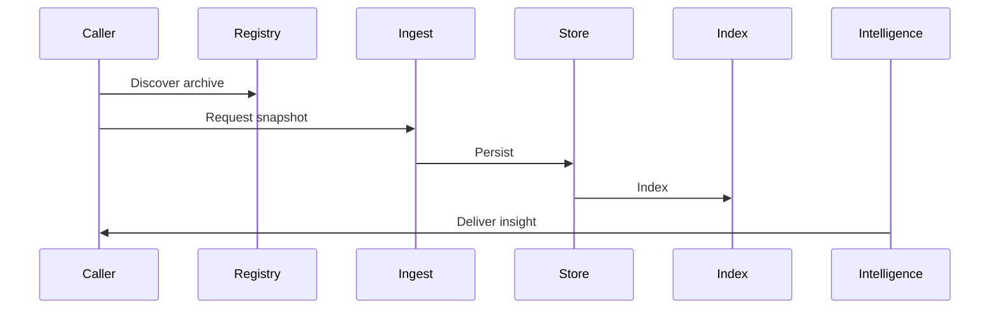

# KB-093 — Data Archival & Historical Intelligence Architecture (Draft)

## Executive Summary

Historical Intelligence preserves the platform's memory: immutable, governed, time-aware artifacts that support compliance, audit, long-term analytics, AI training, and enterprise decision-making. This architecture separates operational workloads from historical storage and intelligence while ensuring discoverability, lineage, governance, tenant-awareness, and privacy.

## Purpose

Define the enterprise architecture for long-term retention, archival storage, historical querying, timeline analysis, and intelligence generation across DUKADESK. Historical Intelligence is distinct from backups and operational stores and must be treated as a first-class, governed platform capability.

## Scope

Supports historical preservation for:
- Platform events and canonical data
- Identity, Organizations, Tenants, Workspaces, Applications
- Runtime, Builder Studio, Marketplace
- AI Platform, Analytics, Reporting, Governance, Audit
- Infrastructure, Integrations, Third-party data ingest

## Architectural Principles

- History Is Immutable: once preserved, records are append-only and versioned.
- Operational Data Is Not Historical Storage: separation of concerns and optimized storage.
- Policy-Driven Archival: source-defined and global archival policies.
- Canonical History: authoritative historical index driven by metadata.
- Time-Aware Intelligence: queries and models must be time-conscious.
- Tenant-Aware Preservation: tenant scoping and isolation.
- Explainable Historical Records: lineage and provenance for every artifact.
- Observable Archival: metrics, alerts and integrity checks.
- Governance by Design: retention, legal hold, and access controls.
- Technology Independence: storage- and DB-agnostic architecture.

## Canonical Definitions

- Historical Record — an immutable representation of an event or state at a point in time.
- Archive — long-term storage for historical records with governance metadata.
- Historical Snapshot — a point-in-time capture of a dataset or state.
- Historical Timeline — ordered sequence of historical records for an entity.
- Historical Intelligence — analytical outputs, models and artifacts derived from archives.
- Archive Policy — rules governing retention, access, residency, and disposition.
- Retention Window — configured period for keeping historical material.
- Archive Manifest — metadata describing archived content and provenance.
- Time Travel (conceptual) — the ability to reconstruct state as-of a timestamp.
- Preservation — processes ensuring integrity and accessibility over time.
- Archive Registry — catalog of archives, manifests, and discovery indices.

## Historical Intelligence Platform Architecture

```
      Operational Platform Services
                 │
        Events • Canonical Data
                 │
 Historical Intelligence Platform
                 │
 Archive • Timeline • Intelligence
                 │
 Analytics • Reporting • AI
```

### Conceptual Components
- Archive Ingest: validated, schema-aware pipelines from events and snapshots.
- Archive Registry & Catalog: searchable manifests, ownership, retention, sensitivity.
- Immutable Storage Layer: append-only stores or versioned object repositories.
- Indexing & Timeline Engine: time-series indexes, entity timelines, and sequence stores.
- Preservation Engine: integrity checks, checksums, replication, format migration hints.
- Query Engine (Historical): point-in-time queries, timeline traversals, and batch exports.
- Intelligence Layer: long-running analytics, ML training data pipelines, and historical KPIs.
- Governance & Legal Hold: apply holds, e-discovery, and compliance workflows.
- Observability & Audit: retrieval metrics, archive health, retrieval success rates.

## Historical Domains

Preservation coverage includes:
- Identity, Organizations, Tenants, Workspaces, Applications
- Runtime, Builder, Marketplace, AI
- Security, Governance, Analytics, Reporting, Infrastructure

## Historical Lifecycle

Capture
  ↓
Validate
  ↓
Archive (immutable write + manifest)
  ↓
Index
  ↓
Preserve (replicate, checksum, migrate)
  ↓
Query (point-in-time / timeline)
  ↓
Analyze
  ↓
Retire (policy-driven deletion / disposition)

## Archive Architecture

- Archive Registry: catalog of archive manifests, owners, retention, residency, checksum.
- Archive Catalog: searchable index for discovery and legal discovery paths.
- Archive Ownership: canonical owner references (MDM/KB-087) for provenance.
- Archive Versioning: preserved versions, delta manifests and snapshot lineage.
- Archive Classification: sensitivity, retention, access controls.
- Archive Policies: retention windows, legal hold, cross-tenant rules, export constraints.
- Archive Discovery: APIs for discovery with tenant-aware filters and purpose checks.

## Historical Intelligence

Supports:
- Timeline Analysis and anomaly detection
- Trend Discovery and cohort historical comparisons
- Historical KPIs and time-series baselines
- Audit and compliance reporting (forensics)
- Historical search and entity provenance
- AI training datasets with lineage and consent metadata

## Historical Query Architecture

- Point-in-Time Queries: reconstruct state as-of a timestamp using snapshots and deltas.
- Timeline Navigation: traverse entity timelines with pagination and time windows.
- Historical Relationships: join historical entities with preserved relationships.
- Version History: access to previous versions with provenance and change metadata.
- Historical Aggregation: time-windowed aggregations with configurable rollups.
- Historical Discovery: search by manifest, entity ID, time range, and classification.

## Governance

- Historical Ownership: owners register archival requirements and retention policies.
- Retention Governance: enforce retention windows, archival tiering, and disposition.
- Preservation Policies: define replication, checksums, and format migration requirements.
- Compliance & Auditability: immutable audit trails and access logging.
- Archive Stewardship: designated stewards for archive collections and retention decisions.

## Responsibilities

Runtime Responsibilities:
- Emit events and snapshots suitable for archival (schema and lineage metadata).

Backend Responsibilities:
- Register archival intents and manifests in Archive Registry.
- Honor legal holds and retention directives from governance processes.

Mobile Runtime Responsibilities:
- Avoid using archives for operational reads; request only exported historical artifacts.

Builder Responsibilities:
- Define archival scopes for builder artifacts and template histories.

Marketplace Responsibilities:
- Supply archive-friendly package manifests and historical metadata for packages.

AI Platform Responsibilities:
- Request curated training snapshots with consent and lineage metadata.

## Security

- Archive Authorization: role-based and purpose-limited access to archives.
- Immutable History: append-only writes, signed manifests, tamper-evident checksums.
- Tenant Isolation: multi-tenant archives logically separated and access controlled.
- Archive Integrity: routine checksum verification and repair workflows.
- Audit Logging: all retrievals, exports, holds and disposals are logged immutably.

## Privacy

- Historical Personal Data: policy-driven handling of personal data in archives.
- Retention Compliance: implement retention windows and erasure where legally required.
- Right to Erasure Dependencies: clearly document limitations where erasure conflicts with legal holds.
- Historical Consent: store consent metadata with archived records to drive lawful use.
- Archived Sensitive Data: apply masking, encryption and access controls as policy requires.

## Performance

- Archive Scalability: tiered storage, cold/hot segmentation, and sharding by domain/time.
- Historical Queries: support both fast indexed time-window queries and large batch exports.
- Timeline Processing: incremental indexing and re-indexing strategies for long-lived data.
- Long-Term Storage: lifecycle policies for storage tiers and format migrations.
- Archive Retrieval: orchestrate efficient retrievals with pagination, streaming, and bulk export.

## Observability (see KB-058)

Track:
- Archive growth by tenant/domain
- Retrieval latency and throughput
- Historical query success/failure rates
- Preservation integrity checks and repair events
- Retention policy compliance metrics

## Failure Scenarios

- Archive Corruption: detect via integrity checks and repair from replicas.
- Missing Historical Records: reconcile with source events and ingestion logs.
- Broken Timeline: surface gaps and provide forensic tooling to reconcile.
- Unauthorized Archive Access: revoke access, audit, and notify stakeholders.
- Cross-Tenant Archive Exposure: immediate containment, audit, and remediation.
- Invalid Historical Snapshot: mark as quarantined and require steward validation.
- Archive Registry Drift: periodic reconciliation between registry and stored manifests.
- Historical Index Failure: degrade to full-scan retrieval with alerting.

## Anti-patterns

- Using operational DBs as archives
- Mutable historical records
- Manual archive edits
- Missing archive manifests or ownership
- Unlimited, ungoverned retention
- Hiding retention policies from owners and auditors

## Future Evolution

- AI Historical Reasoning: models that reason across timelines with provenance.
- Autonomous Archive Optimization: tiering and format migration driven by access patterns.
- Predictive Historical Intelligence: anticipate archival needs and retention risks.
- Cross-Platform Historical Federation: integrate with KB-092 (Data Federation) for historical queries across systems.
- Semantic Time Navigation: intuitive time-based exploration using Knowledge Graph ties (KB-089).
- Enterprise Historical Knowledge Networks for cross-tenant analytics (policy-governed).

## Cross References

- KB-077 Event & Messaging Architecture
- KB-078 Search & Indexing Architecture
- KB-081 Backup & Disaster Recovery Architecture
- KB-082 Data Lifecycle & Retention Architecture
- KB-085 Data Governance & Quality Architecture
- KB-086 Data Privacy & Compliance Architecture
- KB-089 Knowledge Graph Architecture
- KB-090 Analytics & Business Intelligence Architecture
- KB-091 Reporting Architecture
- KB-092 Data Federation Architecture

## Mermaid Diagrams

1. Historical Intelligence Platform Architecture



2. Historical Lifecycle



3. Archive Governance Model



4. Historical Timeline Architecture



5. Historical Query Flow



6. Archive Registry Architecture



7. Historical Intelligence Pipeline



8. Cross-Domain Historical Relationships



9. Archive Dependency Graph



10. End-to-End Historical Intelligence Workflow



## Acceptance Criteria

- Architecture only; no implementation specifics.
- Storage and database independent.
- Enterprise grade with immutable history model.
- Fully cross-referenced to related KBs.
- Mermaid diagrams included and conceptual.
- Ready for Knowledge Base inclusion as Draft.

## Completion

- Update PROGRESS_REGISTRY.md: set KB-093 to Draft.
- Mark Data Platform Architecture Suite as Complete.
- Queue KB-094 — Integration Platform Architecture.

## Critical DUKADESK Rule

> Historical intelligence preserves the platform's memory without becoming its operational state.

Historical records are immutable, governed, time-aware representations of past platform activity. They support compliance, analytics, AI reasoning, reporting, governance, and long-term decision-making while remaining separate from operational data, backups, and runtime state.

<!-- End of KB-093 -->
