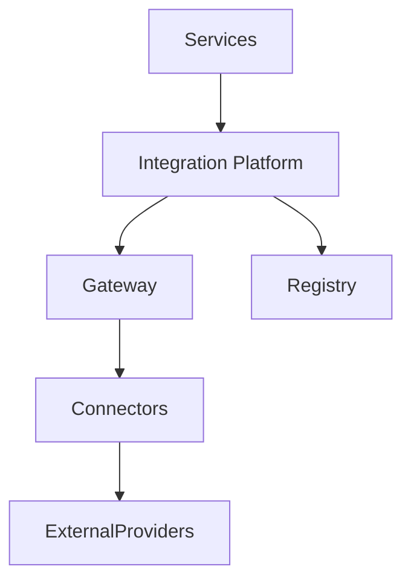
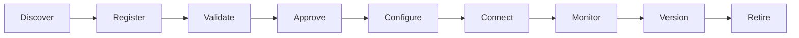
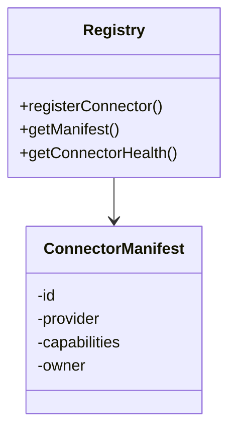
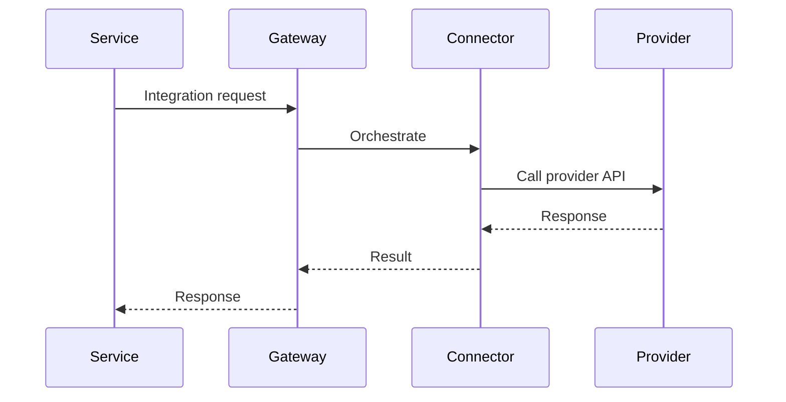
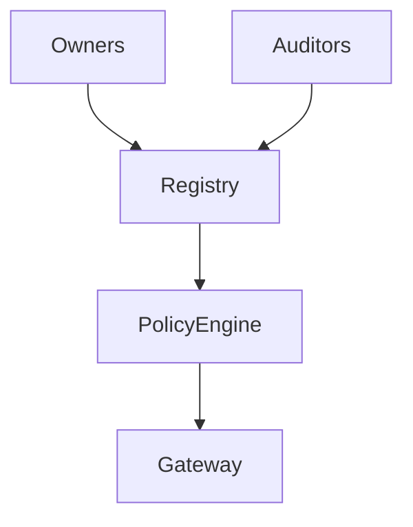
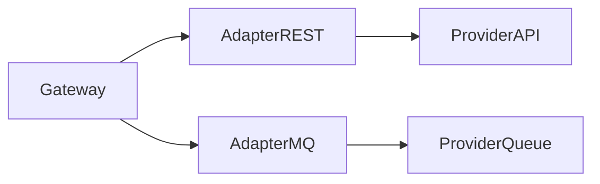
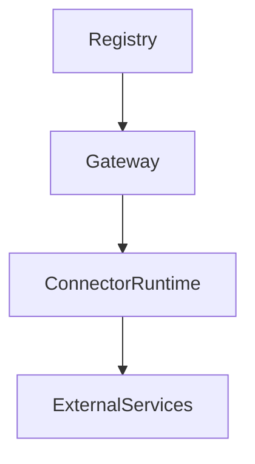
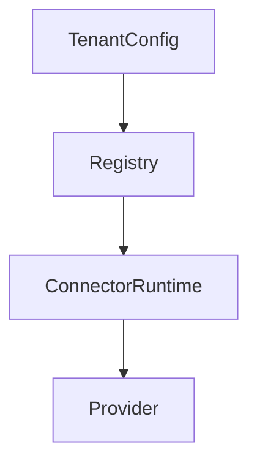
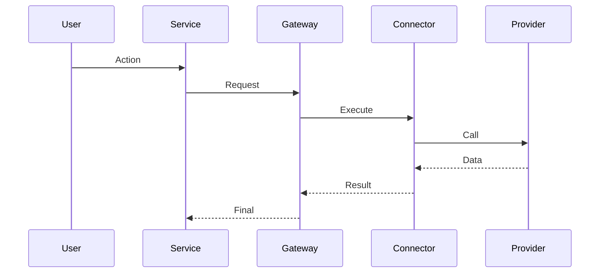
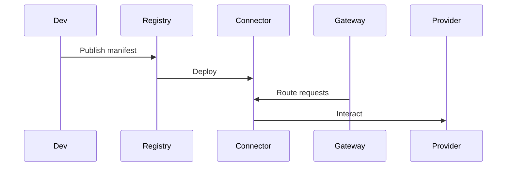

# KB-094 — Integration Platform Architecture (Draft)

## Executive Summary

The Integration Platform centralizes and governs every external interaction across DUKADESK. It provides secure, observable, policy-driven connectivity and orchestration for internal services, external providers, and partner ecosystems. No component communicates directly with third-party systems; all integrations flow through this platform.

## Purpose

Define the enterprise architecture for standardized connectivity, orchestration, security, lifecycle management, governance, and observability for all inbound and outbound integrations across DUKADESK.

## Scope

Governs integrations for:
- Internal platform services, Runtime, Builder, Marketplace, AI
- Dashboards, Mobile Runtime, Identity, Storage, Notification, Analytics, Reporting
- External SaaS, Payment & Banking systems, ERP/CRM, Government platforms
- IoT devices, Communication providers, Customer-owned systems

## Architectural Principles

- Integration Through One Platform (single governed gateway)
- No Direct Third-Party Access by platform services
- Canonical Integration Contracts and Manifests
- Event-Driven and Request-Driven Integration Patterns
- Tenant Isolation and Per-tenant Configuration
- Policy-Driven Connectivity and Governance
- Secure by Default: Zero Trust posture for all connections
- Observable Integrations: metrics, tracing, and audit
- Versioned Integrations and Connectors
- Technology Independence and extensibility

## Canonical Definitions

- Integration — a controlled interaction between platform and external system.
- Integration Platform — the governed gateway and orchestration plane for integrations.
- Integration Connector — implementation of connectivity to a provider.
- Adapter — protocol translation layer used by connectors.
- Integration Contract — the canonical schema and behavior agreed between parties.
- Integration Endpoint — a logical endpoint exposing an integration contract.
- Integration Flow — orchestrated sequence of steps for an integration interaction.
- Integration Policy — access, throttling, residency, masking and retention rules.
- Integration Registry — catalog of connectors, endpoints, owners, and metadata.
- Integration Manifest — per-connector configuration and allowed operations.
- Integration Gateway — runtime plane handling auth, routing, and enforcement.

## Integration Platform Architecture

```
               Platform Services
                       │
 Runtime • Builder • Marketplace • AI
                       │
             Integration Platform
                       │
 Gateway • Registry • Policies
                       │
        Connectors • Adapters
                       │
 External Services & Enterprise Systems
```

### Core Capabilities (conceptual)
- Integration Gateway: authentication, authorization, routing, orchestration, policy enforcement.
- Integration Registry: connector catalog, manifests, versioning, and ownership.
- Connector Runtime: isolated, versioned connectors executing outbound/inbound flows.
- Adapter Library: protocol handlers for REST, GraphQL, Webhooks, Messaging, File exchange, Streaming, Legacy systems.
- Orchestration Engine: stateful workflows, retries, compensations, and transformations.
- Credential & Secret Manager: tenant-scoped secrets with rotation and least-privilege access.
- Policy Engine: rate limits, throttling, masking, residency, and purpose checks.
- Observability Fabric: connector health, request tracing, SLAs, and business metrics.
- Governance & Certification: connector approval, certification, and lifecycle management.

## Integration Domains

Support for domain-specific integrations including:
- Identity, Payments, Notifications, Storage, Search, Analytics, Reporting, Security, Infrastructure

## Integration Lifecycle

Discover
 ↓
Register (manifest, owner, contract)
 ↓
Validate (security, compliance, schema)
 ↓
Approve (governance certification)
 ↓
Configure (tenant bindings, secrets)
 ↓
Connect (deploy connector/runtime)
 ↓
Monitor (health, SLAs)
 ↓
Version (upgrade connectors, deprecate)
 ↓
Retire

## Connector Architecture

- Connector Registry: metadata (provider, capabilities, owner, SLA) and version history.
- Connector Metadata: supported operations, rate limits, authentication hints, transformation capabilities.
- Connector Versioning: immutable releases with upgrade paths and compatibility notes.
- Connector Configuration: tenant mappings, credentials, throttles, and legal constraints.
- Connector Ownership: clear steward and certification status.
- Connector Lifecycle: test, certify, deploy, monitor, retire.

## Adapter Architecture (conceptual)

Adapters provide protocol translation and include patterns for:
- REST / HTTP APIs
- GraphQL
- Webhooks (inbound/outbound)
- Messaging Systems (AMQP, Kafka)
- File Exchange (SFTP, Object stores)
- Streaming (WebRTC, RTMP, event streams)
- Legacy Systems (JDBC, SOAP, proprietary)
- Custom Providers (extensible SDK)

Adapters are conceptual; protocol specifics are out of scope for this architecture.

## Integration Registry

Registry responsibilities:
- Catalog connectors, endpoints, manifests, owners
- Surface capability discovery and compatibility
- Track versioning and dependency graphs
- Store governance status and certification
- Provide discovery APIs for runtime and builders

## Integration Governance

- Ownership and approval workflows for connector publication
- Policy enforcement for residency, masking, throttling, and consent
- Certification and testing before production deployment
- Version control and deprecation schedules
- Audit trails for configuration changes and connector actions

## Responsibilities

Runtime Responsibilities:
- Use registered integrations via the platform; never call providers directly.

Backend Responsibilities:
- Register integration manifests and own connector stewardship.
- Provide test harnesses and compliance documentation for connectors.

Mobile Runtime Responsibilities:
- Use platform-mediated integrations and follow tenant-level configuration.

Builder Responsibilities:
- Discover and compose integrations using registry manifests and templates.

Marketplace Responsibilities:
- Publish connector manifests and contract terms; undergo certification.

AI Platform Responsibilities:
- Request integrated data via governed connectors and record usage lineage.

## Security

- Authentication: mutual TLS, OAuth 2.0, signed tokens, and per-connector auth models.
- Authorization: fine-grained RBAC and purpose-scoped access for connectors.
- Credential Isolation: tenant-scoped secrets managed centrally, no direct secret handling in services.
- Secret References: connectors reference secrets via secure IDs; runtime resolves at execution.
- Integration Policies: enforce quotas, masking, transformation and residency rules.
- Zero Trust: least privilege, ephemeral credentials, and continuous verification.
- Audit Logging: immutable logs for connector invocations, failures, and configuration changes.

## Privacy

- Consent-Aware Integrations: consent flags in manifests drive allowed data flows.
- Data Minimization: connectors should request only required attributes; platform enforces minimization where possible.
- Tenant Isolation: per-tenant configurations and credentials.
- External Data Sharing Policies: enforce export controls and legal constraints.
- Sensitive Data Protection: encryption, masking, and access controls for PII and sensitive fields.

## Performance

- Scalability: horizontal scaling for gateway and connector runtimes.
- Rate Limiting: tenant and connector scoped throttles with graceful degradation.
- Retry Strategies: idempotency, backoff, and compensating actions for stateful flows.
- Connection Pooling: keep-alives and pooled connections for high-throughput connectors.
- Parallel Integrations: support concurrent calls where safe.
- Resilience: circuit breakers, fallback policies, and bulkheading.

## Observability (see KB-058)

Track:
- Connector health and availability
- Latency and throughput per connector
- Failure rates and retry metrics
- SLA compliance and alerting
- Audit trails for governance and incident response

## Failure Scenarios

- Connector Failure: failover, circuit-breaker, or queue for retries.
- Provider Outage: degrade gracefully and notify stakeholders.
- Authentication Failure: revoke runtimes and rotate secrets.
- Invalid Contract: refuse calls and surface errors to governance.
- Version Mismatch: block incompatible connector versions.
- Rate Limit Exceeded: queue or throttle requests per policy.
- Cross-Tenant Leakage: immediate containment, audit and remediation.
- Registry Corruption: fallback to cached manifests and restrict new deployments.

## Anti-patterns

- Direct API calls from services to external providers
- Hardcoded credentials in code or configs
- Duplicate connectors across teams
- Hidden or undocumented integrations
- Service-owned integrations bypassing governance
- Unversioned connector deployments

## Future Evolution

- AI-Generated Connectors and adaptive mapping
- Autonomous Integration Discovery and certification suggestions
- Self-Healing Integrations with automatic failover and provider selection
- Multi-Cloud and Edge-native connector runtimes
- Event Mesh integration for decentralized event routing
- Intelligent Provider Selection based on cost, latency, and privacy

## Cross References

- KB-051 Runtime Architecture Overview
- KB-057 Runtime Security Architecture
- KB-073 Data Platform Architecture
- KB-077 Event & Messaging Architecture
- KB-084 Data Import & Export Architecture
- KB-086 Data Privacy & Compliance Architecture
- KB-092 Data Federation Architecture
- KB-095 Integration Connector Architecture (planned)
- KB-096 API Gateway Architecture (planned)
- KB-097 Webhook Architecture (planned)

## Mermaid Diagrams

1. Integration Platform Architecture



2. Integration Lifecycle



3. Connector Registry



4. Integration Flow



5. Integration Governance



6. External Provider Architecture



7. Connector Dependency Graph



8. Multi-Tenant Integration Model



9. Integration Request Flow



10. End-to-End Integration Platform Workflow



## Acceptance Criteria

- Architecture only; vendor and protocol independent.
- Enterprise grade with Zero Trust alignment.
- Single integration platform enforced across the estate.
- Fully cross-referenced and Mermaid-complete.
- Ready for Knowledge Base inclusion as Draft.

## Completion

- Update PROGRESS_REGISTRY.md: set KB-094 to Draft and queue KB-095.

## Critical DUKADESK Rule

> Every external interaction passes through the Integration Platform.

All external communication must be routed through governed integrations that enforce authentication, authorization, tenant isolation, policy validation, observability, lifecycle management, and versioning.

<!-- End of KB-094 -->
