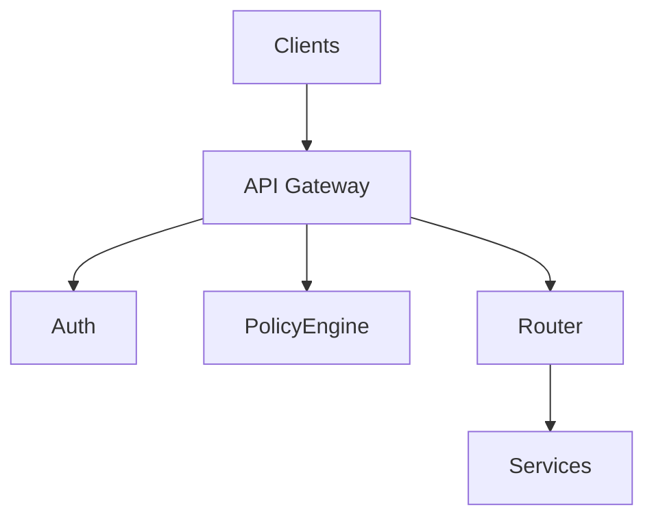
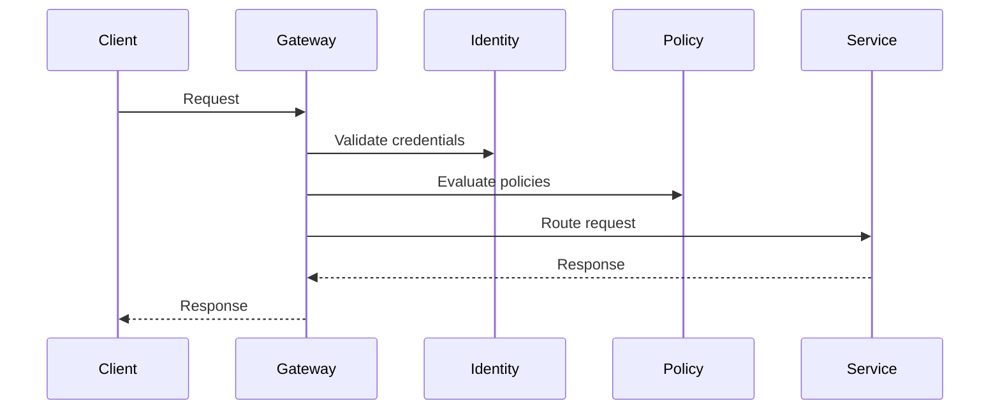
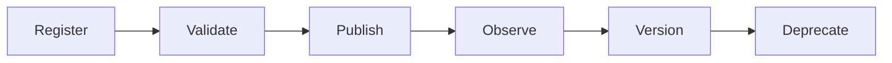
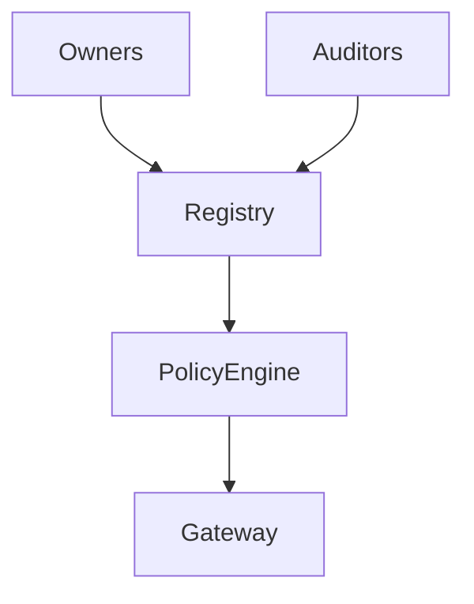
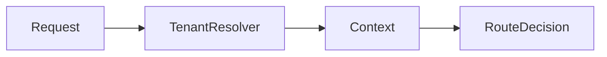
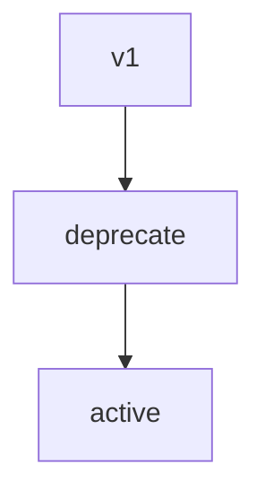
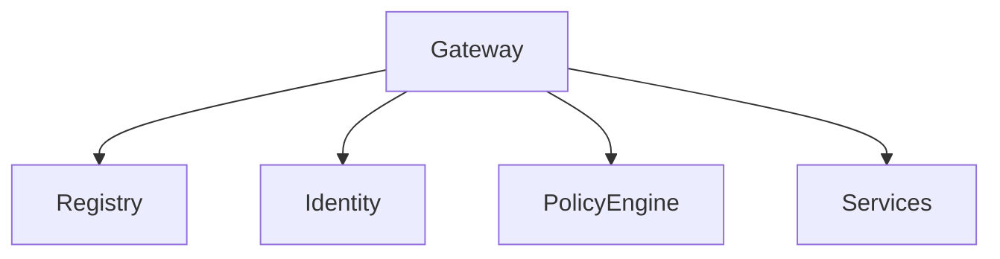
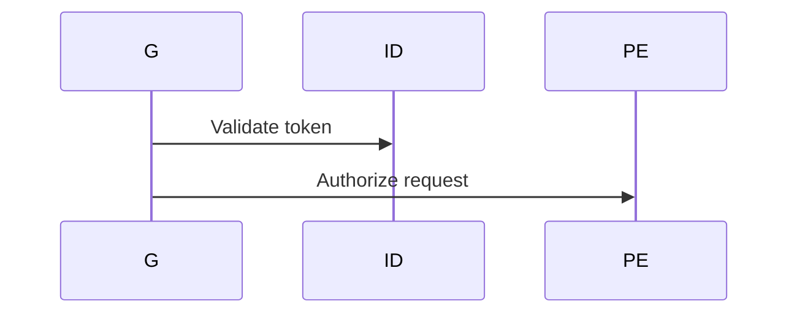
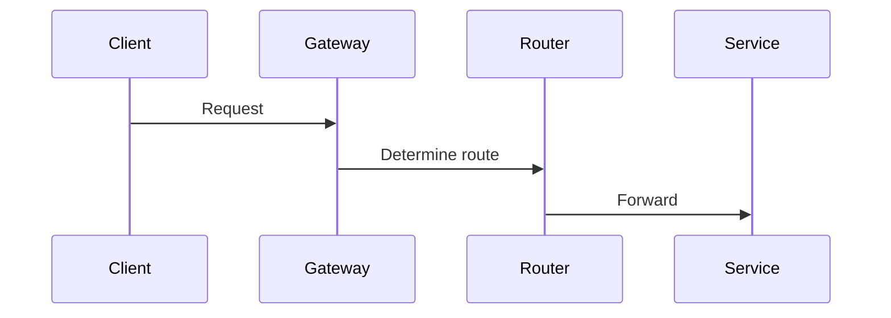
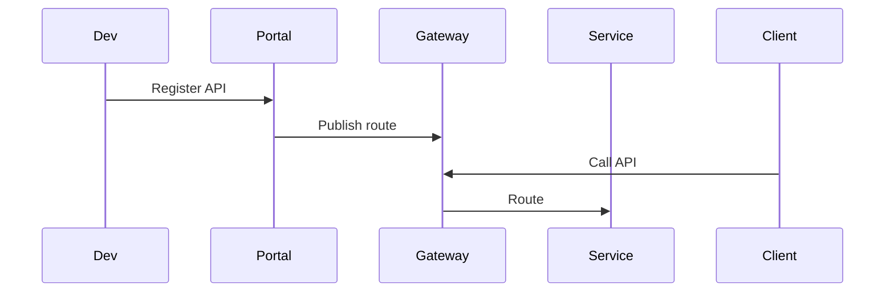

# KB-096 — API Gateway Architecture (Draft)

## Executive Summary

The API Gateway is the single governed entry point to DUKADESK platform capabilities. It secures, routes, mediates, and observes all API traffic while remaining free of business logic. The gateway enforces policies, resolves tenants, delegates authentication, and exposes versioned, discoverable APIs to clients and partners.

## Purpose

Define the enterprise architecture for secure, observable, policy-driven exposure of platform APIs. The gateway centralizes access control, routing, protocol mediation, lifecycle governance, and tenant resolution.

## Scope

Governs access for:
- Runtime Engine, Identity, Builder, Marketplace, AI
- Dashboards, Mobile and Web Runtimes
- Integration Platform, Notification, Storage, Analytics, Reporting
- Administrative, Public, Partner, and Internal Service APIs

## Architectural Principles

- Single Entry Point
- Gateway, Not Business Logic
- Zero Trust Access
- Policy Before Routing
- Tenant-Aware Routing
- Canonical API Exposure
- Versioned APIs
- Observable APIs
- Protocol Independence
- Technology Independence

## Canonical Definitions

- API Gateway — governed HTTP/API front door handling auth, routing, policies.
- API Route — mapping from external route to backend service.
- API Contract — canonical schema and semantics for an API.
- API Consumer — client of the API (user, app, partner, AI service).
- API Policy — rules applied at gateway (throttling, validation, masking).
- Gateway Registry — catalog of routes, contracts, owners, and versions.
- Request Context — enriched context containing tenant, auth, and tracing info.
- Tenant Resolution — mapping request to tenant context.
- API Manifest — metadata for an API route (owner, SLA, sensitivity).

## API Gateway Architecture

```
Clients
(Mobile • Web • AI • Partner APIs)
             │
       API Gateway
             │
 Authentication • Policies • Routing
             │
 Platform Services
```

### Core Components
- Gateway Edge: TLS termination, routing, and protocol mediation.
- Request Pipeline: identity resolution, tenant resolution, authN, authZ, policy checks, transformation, routing.
- Route Registry: route metadata, versioning, ownership, and discovery APIs.
- Policy Engine: validation, rate limiting, quota, masking, and threat protection.
- Observability: metrics, traces, access logs, and SLA dashboards.
- Developer Portal: API catalog, docs, SDKs, and versioning info.
- Lifecycle Governance: registration, certification, publishing and deprecation flows.

## Gateway Domains

Routing and exposure across:
- Identity
- Runtime
- Builder
- Marketplace
- AI
- Notifications
- Storage
- Analytics
- Reporting
- Integrations
- Administration

## Gateway Lifecycle

Register Route
  ↓
Validate
  ↓
Publish
  ↓
Authenticate
  ↓
Authorize
  ↓
Route
  ↓
Observe
  ↓
Version
  ↓
Deprecate

## Route Management

- Route Registry: owner, contract, version, sensitivity classification.
- Route Discovery: developer portal and runtime discovery APIs.
- Version Management: semantic versioning, compatibility notes, deprecation windows.
- Route Ownership: registered owners and certification status.
- Route Classification: public, partner, internal, admin, sensitive.

## Request Processing Pipeline (conceptual stages)
- Request Reception
- Identity Resolution (authN)
- Tenant Resolution (map to tenant context)
- Authentication (delegate to identity platform)
- Authorization (policy engine)
- Policy Evaluation (throttling, masking, validation)
- Request Validation (schema, contract compliance)
- Routing to backend
- Response Processing (masking, header injection, caching)
- Audit Logging and Trace Emission

## API Governance

- API Ownership and Approval workflows
- Certification and security testing before publishing
- Versioning, deprecation and compatibility management
- Policy assignment per route (privacy, retention, masking)
- Auditability and traceability for regulatory compliance

## Responsibilities

Runtime Responsibilities:
- Consume backend APIs via gateway only; do not expose direct endpoints.

Backend Responsibilities:
- Register API manifests and own contract compatibility.
- Implement idempotent, well-defined APIs suitable for gateway mediation.

Mobile Runtime Responsibilities:
- Use gateway endpoints; rely on gateway for auth and tenant resolution.

Builder Responsibilities:
- Publish builder-specific API routes to the gateway and document usage.

Marketplace Responsibilities:
- Expose partner APIs via the gateway and register manifests for review.

AI Platform Responsibilities:
- Use gateway-provided context for requests and record lineage for models.

## Security

- Authentication Delegation: gateway delegates to identity platform; supports mutual TLS, OAuth2, JWT validation.
- Authorization Enforcement: policy engine enforces RBAC, ABAC, and purpose-based access.
- Tenant Isolation: tenant context flows through pipeline and gates access.
- API Policies: threat protection, request validation, rate limiting, and anomaly detection.
- Audit Logging: immutable logs for access, policy violations, and governance events.
- Zero Trust Alignment: least privilege, ephemeral tokens, continuous verification.

## Privacy

- Data Minimization and masking
- Consent-aware endpoints and purpose-limited responses
- Sensitive endpoint classification and stricter access controls
- Cross-tenant prevention and residency-aware routing

## Performance

- Horizontal Scalability and auto-scaling patterns
- High Throughput and routing efficiency
- Connection reuse and keep-alive strategies
- Response caching integration at edge where safe
- Resilience patterns: circuit breakers, bulkheads, and graceful degradation

## Observability (see KB-058)

- Request volume, error rates, auth failures, route latency, downstream availability, API adoption metrics

## Failure Scenarios

- Invalid Authentication
- Tenant Resolution Failure
- Route Not Found
- Service Unavailable
- Version Conflict
- Policy Violation
- Gateway Overload
- Cross-Tenant Routing

## Anti-patterns

- Business logic in gateway
- Direct service exposure
- Hardcoded routes or secrets
- Gateway persisting business data
- Bypassing gateway for performance reasons

## Future Evolution

- AI-Assisted Routing and policy tuning
- Adaptive policy enforcement and anomaly mitigation
- Autonomous API discovery and semantic routing
- Multi-region and edge gateways for low-latency routing
- Integration with service mesh and platform service discovery

## Cross References

- KB-051 Runtime Architecture Overview
- KB-057 Runtime Security Architecture
- KB-073 Data Platform Architecture
- KB-077 Event & Messaging Architecture
- KB-094 Integration Platform Architecture
- KB-095 Integration Connector Architecture
- KB-097 Webhook Architecture (planned)
- KB-098 Integration Policy Architecture (planned)
- KB-100 Service Discovery Architecture (planned)

## Mermaid Diagrams

1. API Gateway Architecture



2. Request Processing Pipeline



3. Route Lifecycle



4. API Governance Model



5. Multi-Tenant Routing Flow



6. API Versioning Model



7. Gateway Dependency Graph



8. Authentication & Authorization Flow



9. Gateway Request Routing



10. End-to-End API Consumption Workflow



## Acceptance Criteria

- Architecture only; API-technology independent.
- Enterprise-grade and Zero Trust aligned.
- All platform APIs exposed exclusively through the gateway.
- Fully cross-referenced and Mermaid-complete.
- Ready for Knowledge Base inclusion as Draft.

## Completion

- Update PROGRESS_REGISTRY.md: mark KB-096 as Draft and queue KB-097.

## Critical DUKADESK Rule

> Every platform API is exposed exclusively through the API Gateway.

No client or service may call internal services directly; the gateway is the single authoritative entry point.

<!-- End of KB-096 -->
